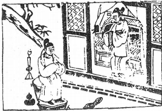

# 23山地剝

  
此卦尉遲將軍與金牙鬥爭，卜得之，不利男子。

圖中：

**婦人床上坐，風中燭，葫蘆在地，山下官人坐，冠巾掛木上，一結亂絲。**

去舊生新之課 群陰剝盡之象

盡賁飾之道，而後可亨。但飾之終，不戒，則必剝，故為之序。卦體為五陰一陽，乃意陰始自下生，渐長至極盛，群陰皆受剝於陽也。天地之間，山乃高大，但仍附於地上，此為頹剝之象也。外止內順，招剝之象也。而順且止，為處剝之道。

卦圖象解

一、婦人床上坐：必有暗災，陰人得勢，陽道衰弱，小人為主官。二、燭在風中：險也。

三、葫蘆：醫藥無救也；有暗計也。四、繅絲：事務繁冗。

五、山下官人坐：有靠山，但陰人為禍。 六、冠巾掛木上：求去之象；又有樂之象。

人間道

 剝：不利有攸往。

剝乃群陰長盛，剝削陽時，同眾小人剝喪君子，故君子不利往。

## 彖曰：剝，剝也，柔變剛也。不利有攸往，小人長也。

剝，落也。柔盛而剛剝，陰盛陽必退，此陰陽之道，小人道長盛，君子消退也。

## 順而止之，觀象也；君子尚消息盈虛，天行也。

君子處剝之時，知不可往，順時而止，乃因能觀剝也。故此卦有順止之象，為處剝之道。君子之人見事於始，凡事之始皆有理，君子視其盈虧消息，而知處之道。順時則吉，逆時則凶， 故君子事天。小人反之，不見事始之作為如何，不論事理之盈虧如何，一昧迎隨奉承，故小人事人。

## 象曰：山附於地，剝，上以厚下安宅。

山再高大仍依附於地，聖人體此，知人君與上位者，視剝而知厚固其下位之人，以安居也， 下者為上之本，從未有基本固而能剝者也。故上如有剝，必自下。故安養人民以厚國本。書曰

『民惟邦本，本固邦寧』。

## 初六：剝床以足，蔑貞，凶。

因剝之始皆自下，故曰剝足，陰自下進， 渐消亡正道，凶之至也。

## 六二：剝床以辨，蔑貞凶。

此陰漸進，為將者已受剝也，凶益甚也。

## 六三：剝之，无咎。

眾陰在下剝陽之時，三之相位獨剛應之， 則可無災，但因勢孤弱，雖可無災，但未必能大亨。

## 六四：剝床以膚，凶。

剝之及身時也，其凶可知。乃因不知始剝於下，以致進盛至此。

## 六五：貫魚，以宮人寵，无不利。

剝本及於君，凶可知，但聖人於此，知人性之從善如流，以示寵方式，使群陰如魚之貫序，則可無所不利。此寵如對妻妾之同態也。

## 上九：碩果不食，君子得輿，小人剝廬。

果之大者，如不食，則有復生之理。陰道盛極，天下大亂，但亂極則必思治，故眾人之心，必願載君子，故如得輿。此陰極生陽也。若為小人於此，則必無安身之地。

## 象曰：剝床以足，以滅下也。

正道之侵滅，必由下而上渐進。用剝之道即在此。

## 象曰：剝床以辨，未有與也。

小人之侵剝君子，若君子有對應，則小人不能為害，如無對應，則有被滅之凶。

## 象曰：剝之，无咎，失上下也。

為相之人居剝之時，无災之因乃同類而相失，不與同道，故也。

## 象曰：剝床以膚，切近災也。

象為剝及皮膚，因四為君側之人，如君之膚，示災禍之近身也。

## 象曰：以宮人寵，終无尤也。

於剝之及身時，能以寵妻妾之方式對待， 則終無災。

## 象曰：君子得輿，民所載也；小人剝盧，終不可用也。

因正道消剝至極，則人必思治，上九為陽剛之君子，為民所載也，小人處剝之極，終不可用也。

