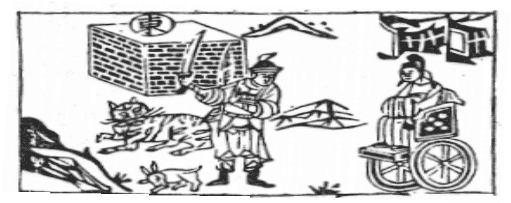

# 24地雷復

  
此卦唐太宗歸天，卜得之，七日復還魂也。

圖中：

**官人乘車，上兩隻旗，堠上東字，一將持刀立，一兔一虎。**

淘沙見金之課 反復往來之象

萬物無剝盡之理，故剝極必復來。復為之序卦。此卦一陽生於五陰之下，有陰極生陽象， 如同冬至極寒，則必生陽，亦同。雷在地下，有復生之象，外順內動，此為復之始。

卦圖象解

一、官人乘車：使節也；車姓、連姓也；軍隊也；官大也；調職也。二、上兩隻旗：鬥也；將、帥也；一方之主也。

三、堠上東字：猴發木形人。東：有心約束，十八日至。十日來人封侯象。四、一將持刀立：武威之人，司法執行人。

五、一兔：肖兔之人，劉姓之人。六、一虎：肖虎之人，王姓之人。

此卦云：君子之道，既消而復，始復必不能力勝小人，必待其朋類渐盛，協力致勝可也。

人間道

 復：亨，出入无疾，朋來无咎。

萬物既復則必亨，如君子之道將復，雖微，但同類將渐進，故亨且盛矣。故復之時至，並無法立勝小人，必待其同朋相繼，則協力能勝也。

## 反復其道，七日來復，利有攸往。

此為消長之道，易之論數，以立準則，小有七日乃復，大有七年方復，此復之道也。

## 彖曰：復，亨。剛反，動而以順行，是以出入无疾，朋來无咎。

此以卦才來論，復之道，陽剛因消弱至極而反來，其法動而取順行法，是故出入皆無災， 朋之來，亦因順而動來也。

## 反復其道，七日來復，天行也。利有攸往，剛長也；復其見天地之心乎！

復之返來，順天之運行，故言七日。因君子道長，故利前往，陽復生於下，乃是天地生物之心，以為動之始也，故外見動，而始生於內也。

## 象曰：雷在地中，復。先王以至日閉關，商旅不行，后不省方。

以卦象而言，如雷乃陰陽相搏而成聲，時陽之微，未能發也。如聖人順天之道，於日陽之

始生，安靜養之以閉關，使商旅不得行，人君不視四方，此順天也，於人亦以此安養其陽為復原之道。

## 初九：不遠復，无祇悔，元吉。

有失而後有復，此復之始時，因失之不遠， 故復必不至於悔，故吉。

## 六二：休復，吉。

二為切近初陽之位，君子道始生於下，若二位志向於陽，今陽在下從之，故能下之道為仁。吉。

## 六三：頻復，厲，无咎。

從復之道，又頻復履失，致危之道也。故須厲，即戒此可无咎，頻失致危，其過乃在失而不復也。今人迷途不知返，比之皆是，又知返而不戒又入迷，凶也。

## 六四：中行獨復。

四於眾陰之間，能自處於正，但因力弱， 不足克濟，此言獨復，不一定無災。

## 六五：敦復，无悔。

君王於復之道，能敦篤而行之，但臣下均陰柔之輩，因無助，但能無悔而不能無災，君子戒之。

## 上六：迷復，凶，有災眚，用行師， 終有大敗，以其國君凶，至于十年不克征。

陰柔居復之終，乃意終迷不復者，大凶。招凶，皆因己之迷而不返，動則必有過失，以之出師必大敗，以之為國君，大凶。迷於道，

## 象曰：不遠之復，以脩身也。

此即知不善而速改，為君子修身之道。學問之道即在此，知不對立改，為君子也。

## 象曰：休復之吉，以下仁也。

仁者天下之公，善之本源，能體會而近於下之仁，乃休復之美。

## 象曰：頻復之厲，義无咎也。

戒之在屢復，復而又失，失之過，故堅心於復不失，無災殃也。

## 象曰：中行獨復，以從道也。

以獨復於小人間，如從陽剛，君子之道也。

## 象曰：敦復无悔，中以自考也。

五以陰居尊位，能敦篤善道，以中道自成， 此可無悔也。

而終不可行也。

## 象曰：迷復之凶，反君道也。

人君居上而治天下，當從天下之善，如迷於復，反復無常，皆招凶也。

