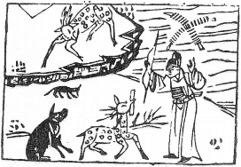

# 25天雷无妄

  
此卦李廣，卜得之，後凡為事皆不利也。

圖中：

**官人射鹿，鹿啣文書，錢一堆在水中，一鼠一豬。**

石中蘊玉之課 守舊安常之象

因復於道，合於正理，則无妄，故復之後受以无妄。卦乾上震下，此言動以天則為无妄， 如動以人慾則生妄矣。故无妄之義大也。

卦圖象解

一、官人射鹿：自亂陣腳。二、鹿啣文書：財訊至也。

三、錢一堆在水中：得財遇險之象。險中求財，憂心忡忡也。四、一鼠一豬：遇子、亥年吉，肖鼠人陰謀，肖豬人黑心。

又可以子、亥為孩，亦即孩無子為亥，缺子象。又六字不全，亥月凶，無尾凶， 不足六歲，為五歲凶死。

天機象：犬、豬、牛、羊：叱之即去。雞、魚、鵝、鴨：欲用則不生。

人間道

无妄：元，亨，利，貞，其匪正有眚，不利有攸往。

无妄即至誠也。至誠為天道。天能化育萬物，生生不息，且各正其性，此无妄也。人如能合於无妄之道，則能與天地合德，故大吉，君子行無妄之道，能致大吉，須戒在堅心，如失貞， 則致災。今人本無邪心，但如不合正理，則妄亦邪心也。

彖曰：无妄，剛自外來而爲主於内。動而健，剛中而應，大亨以正，天之命也。

動以天則无妄，今人動以人慾。剛自外而入主於內，乃以正去妄之象。上健而下動，內動而外健，其動乃剛，理正氣壯，道乃大亨，此天道也。今人動之以慾，而無法示誠於外，不夠剛明，乃因內不實，此致妄矣。

## 其匪正有眚，不利有攸往，无妄之往，何之矣。天命不祐，行矣哉？

无妄，即正也，小失於正，乃妄。入於妄，不知復，乃更往，則必悖天理，為天道所不容， 不可行也。

## 象曰：天下雷行，物與无妄，先王以茂對時育萬物。

雷行天下，陰陽和而成聲，生發萬物，各正性命，其發而无妄，先王觀此象，體天之道， 養育人民，使各正性命，乃對時育物之道也。

## 初九：无妄，往吉。

初進陽剛在內，以无妄之天理行之於外， 故往吉。

## 六二：不耕穫，不菑畬，則利有攸往。

人之欲即妄，理之自然者，非妄，今以耕穫喻之，農耕後之穫，乃理之自然也。田一歲為『菑』，三歲曰『畬』，有耕而有穫，有菑而有畬，聖人順時而作，乃為聖也，讀易之人， 能知時順勢，得易之道矣。

## 六三：无妄之災，或繫之牛，行人之得，邑人之災。

人之妄動，由己之欲也，妄動有得，亦必有失，陰柔居相位，動乃因妄，失之大在欲， 故妄得之福，災亦隨之，妄得之得，失亦來之， 皆非真得也。

## 九四：可貞，无咎。

四位剛而居之，剛則必無私，永不生妄。

## 九五：无亡之疾，勿藥有喜。

九五為尊位，以陽剛應之，下又以陽剛中正順應，則致善也。即令有小疵，不須去治而自癒，如持之以恆，則平安無災，戒之在動， 一動生妄，故人君之无妄道即在此。

## 上九：无妄，行有眚，无攸利。

此位為卦之極，无妄已至善，人至無妄， 又復行，理必過也。過於理，則生妄。

## 象曰：无妄之往，得志也。

无妄乃誠也，人之至誠，物無不動，君子以之修身則身正，以之治事則得理，以之待人則人化，无往不利也。

## 象曰：不耕穫，未富也。

心念於始耕菑之時，乃為求畬，此所以為富。心有欲而為，則妄。故易言人之行但求合於自然，不為人欲所動，故能勝己之欲為大勇也。

## 象曰：行人得牛，邑人災也。

有得有失，不足言得。聖人之得，乃無欲而得，不言有失。

## 象曰：可貞无咎，固有之也。

堅心守无妄之道，剛而無欲，則无災。

## 象曰：无妄之藥，不可試也。

人有妄必改，則致无妄，今反以藥治之， 反成妄矣。故不可試。

## 象曰：无妄之行，窮之災也。

无妄已為極點，今又復加進，乃生妄矣， 故窮極而生災也。

