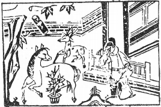

# 26山天大畜

  
此卦昔神堯，卜得之，果登天位也。

圖中：

**一鹿一馬，月下有文書，官人憑欄， 盆內蒼發茂盛。**

龍潛大壑之課 積小成大之象

無妄則至善，可以積畜，故大畜為序卦。畜為止，又為聚，止而後聚，此卦天至大，而在山中，有所畜至大之象。外止內健為畜象，吾人視萬物外則無欲，即止也。內則運行不斷，必有大積畜於其中。

卦圖象解

一、一鹿一馬：祿馬交馳，大富之象。

二、月下有文書：明而有往，中秋時節，文書在空中尚未到手。

三、官人憑欄：無事狀，遥望所失之國度。又欄為木，人靠木，休也。棺也。四、花在盆中：有限也。

## 此卦求官不利，求財大利。

人間道

大畜：利貞，不家食，吉，利涉大川。

大畜於人亦同，人之畜在學術道德充積於內，乃至大之畜，若為邪端異説畜又何用？今人重大畜於錢財，不重視學術修養，所畜何用？不為大畜。

## 彖曰：大畜剛健，篤實輝光，日新其德。

人须能剛健篤實，其畜乃大，又因充實而光辉，德必日新。

## 剛上而尚賢，能止健，大正也。

居尊位能剛明用賢，又能持之永恆，此大正之道。今之君王剛而不明，用人乃因私慾，而不以賢能為基準，故非大正之道。

## 不家食吉，養賢也；利涉大川，應乎天也。

大畜學術道德之人，施其所畜，利於天下，因而不在家食，乃吉。能涉大川而無險，乃應乎天地也。

## 象曰：天在山中，大畜，君子以多識前言往行，以畜其德。

君子觀天之至大而畜山中，故知人之能畜大，乃由學而大，學之道在多聞古聖賢之言行， 取長為己用，察言以求其內心，乃大畜之真義。

## 初九：有厲，利己。

初爻為陽剛，必上進不已，則有危厲，此時，利在己之畜而不進，待與上合志乃動。

## 九二：輿説輹。

二為六五位所對應，雖陽剛但亦不可力進，進則如車輪脱軸，不得行也。

## 九三：良馬逐，利艱貞，曰閑輿衛， 利有攸往。

三為相位，以剛健之才，能與上位合志而同進，就如良馬之馳，速也。唯雖速，但須切

## 六四：童牛之牿，元吉。

此言近君位之人，须上畜止人君之邪心， 下畜止天下之惡。凡人之惡能止於初始，則易如童牛加桎梏。俟惡盛而後禁，必相隔而難勝。故聖人止惡於初。

## 六五：豶豕之牙，吉。

豬之去勢，則雖有牙，而剛躁必自止。君子體之，知天下之惡，不可力制之，須査其根本，不靠刑法嚴峻而能止惡。聖人教修政教， 使人人足用，知廉恥之心，方為至善。

## 上九：何天之衢，亨。

大畜之道，能如行空中，橫行無阻，必散之天下，吉也。

## 象曰：有厲利己，不犯災也。

此即不度局勢而進，不利己，乃災至。戒不可犯危而行。

## 象曰：輿説輹，中无尤也。

至善為剛中，柔不可過柔，因位居下，仍不足以進。易之道，乃知所進退也。

忌不可持才之健，而忘戒備與謹慎也。

## 象曰：利有攸往，上合志也。

因能與上合志，故往而利也。

## 象曰：六四元吉，有喜也。

大畜之道在止惡於初，此大善而吉，必能不勞而易治。

## 象曰：六五之吉，有慶也。

在上者止惡有道，乃天下福慶也。反用強力嚴刑與民為敵，傷又無功矣。

## 象曰：何天之衢，道大行也。

道路空曠，而能大行，乃大畜之極也。

