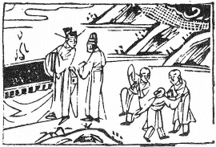

# 27山雷頤  

  

此卦張騫尋黄河源，卜得之，乃知登天位也。

圖中：

**雨下，三小兒，日當天，香案，金紫官人引一人。**

**龍隱清潭之課 遷善遠惡之象**

==萬物畜聚之後，必有所養，無養不成，故頤者，養也，次大畜之序卦。上艮下震，乃上止而下動，外實中虛象，如人頷頤物於口中象。人之口所以飲食，乃能養人之身，此為頤。此論頤養之道，大至於天地養萬物，聖人養賢，人之養生，養形，養德，養人，養才，皆屬頤養之道。==

# 卦圖象解

一、雨下：受恩澤也。

二、三小兒：乃合心之象，有德之國也。  

三、日當天：君明之象。父全。

四、香案：求取之象。

五、金紫官人：天子身側之人。  

六、引一人：提攜，推薦也。

# 人間道

**頤：貞吉，觀頤，自求口實。**

==頤之養人，君子觀之，自求口實之道，乃養君子。口不實又不知養，小人。==

## 彖曰：頤，貞吉，養正則吉也，觀頤，觀其所養也，自求口實，觀其自養也。天地養萬物，聖人養賢以及萬民，頤之時大矣哉！

吾人所養之人及養生之道，皆不外自求口實，皆以正則吉。聖人養賢，使之為天位，使之食天祿，為求賢才施惠於天下。此養賢即養萬民也。

## 象曰：山下有雷，頤。君子以慎言語，節飲食。

以象言，雷震於山下，萬物根動而萌芽，此天地養之象。君子知口所以養身，故慎言語以養其德，節制飲食以養身。

# 初九：舍爾靈龜，觀我朵頤，凶。

龜之性，能咽息不食，可以不求養於外， 故為靈，即明智，而人口腹之慾既動，則必失所養，故凶。

## 象曰：觀我朵頤，亦不足貴也。

人之動為慾，即使有剛健之才，再明智， 終亦必失，故不足貴也。

# 六二：顚頤，拂經，于丘頤，征凶。

養之道正，在以上養下，天子養天下，養臣子，臣食君祿，皆以上養下。今女不能自處必從男，陰不能獨立必從於陽，此二爻不能自養反求下之陽剛，故為顛倒，拂違常理，故不可行。丘即上九，為在外而高之物，故往而必凶，此即意示人之才不足以自養，見在上位勢足養人，即非同類之君子，妄往求之，取辱必矣。

## 象曰：六二征凶，行失類也。

征而從上，又非其類，故人求非同類，必得凶矣。

十為數之終，故終不可用，無所往而利。

# 六三：拂頤，貞凶，十年勿用，无攸利。

邪柔又動之不正，違反頤之正道，故凶。

## 象曰：十年勿用，道大悖也。

此戒之終不可用，凡人邪而柔，又欲動， 反正道大也，此戒之。

至矣。

# 六四：顚頤，吉，虎視眈眈，其欲逐逐，无咎。

陰柔居大臣之位，陰柔不足以自養，如何養天下？今如與初陽剛相應，而柔順於初陽之賢正，吉。故如己之才不足以養天下，但知求在下之賢而順從之，亦可吉也。但須養其威嚴， 眈眈如虎視，以免因己才之陰柔不足養，而受人輕視，造成犯上。但亦須注意所須用者，必逐逐相繼而不缺，若唯取於人又不能繼，困窮

## 象曰：顚頤之吉，上施光也。

吾人能顛倒求養而又吉者，皆得自陽剛以濟應其事，故能施光明于天下。

# 六五：拂經，居貞吉，不可涉大川。

君位乃養人者，但其質如陰柔，即才不足以養天下，而能順從於陽剛（師）之賢，賴其以濟天下，必須有居安篤信之心，全般信賴， 則可輔其身，德澤天下，故吉。但此種狀況可依賴賢能之人於平時，不可於有困艱生變故之時，否則招凶。

## 象曰：居貞之吉，順以從上也。

居上位之吉處，乃因能篤信委任剛賢之人，來養天下。

# 上九：由頤，厲吉，利涉大川。

此以陽剛之德，任師之職，君位從而篤信， 天下得養也，但須夕惕若厲，戒慎恐懼，方能濟天下之危，故利涉大川。

## 象曰：由頤厲吉，大有慶也。

若上九之大任能謹言慎行，安居已位，不妄圖權利，則必福慶至矣。

