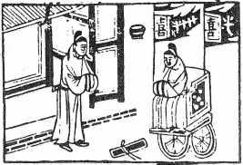

# 28澤風大過

  
此卦姜太公釣渭水，卜之，至八十方遇文王。

圖中：

**官人乘車上，插兩旗，旗上有喜字， 入朱門，門外貴人立，文書在地，一合子。**

寒木生花之課 本末俱弱之象

頤者，養也，萬物養而後能成，成而後動，動則有過，故大過次頤也。大過乃論過失之大與過人之大事也。舉凡世間事之大過於常者，皆是也，古聖人盡人道非過於理之正，如今之行過乎恭，喪過乎哀，用過乎儉，皆過之也。過人之大事，本不常見，故非常人能為之，如堯舜之襌讓，湯武之放伐，即立不世之功，乃過人之大事。

卦圖象解

一、官人乘車上插兩旗：車至官來，必有官司訴訟，軍人象。二、旗上有喜字且分開，乃喜有破損象，捨去婚姻象。

三、入朱鬥：乃豪門世家相請，或朱姓人。四，、門外貴人立：被棄於外象。

五、文書在地：合約，契約，不成之象。六、一合子：先成後破之象。

人間道

 大過：棟橈，利有攸往，亨。

小過與大過之分，乃小過為陰過於上下，大過乃陽過於中，上下皆弱，故有棟橈之象。此卦四陽居中，乃棟象，能任重也。即君子盛而小人衰，故利有攸往可亨。

## 彖曰：大過，大者過也。

犯過之大與成大過於人之事。

## 棟橈，本末弱也。

本末為陰而中為重陽，故為楝橈。

## 剛過而中，巽而説行，利有攸往，乃亨。

雖因陽剛有過，但處不失中道，巽順和悦，無以私心，必利攸往，所以亨。

## 大過之時大矣哉！

人能立非常之大事，立不世之大功，乃真大過，處之時得宜乃大哉。

## 象曰：澤滅木，大過。君子以獨立不懼，遯世无悶。

澤本潤養於木，今至滅沒於木，此過之甚矣，為天地之象。君子（人才）觀大過之象，以立其大過於人之行，其所以能大過於人者，乃其能獨立不懼，天下誹之亦無動其心，舉世不見

知而不悔，隱世而不憂悶，如此方能自守，此為其能大過於人也。

## 初六：藉用白茅，无咎。

此以陰柔而處卑下，易藉用茅為至薄之物，但用之亦很慎重，此為敬慎之至也，故可以無災。

## 九二：枯陽生稊，老夫得其女妻， 无不利。

二為柔位，陽剛居柔，是過剛之人而能以中自處，與柔相濟，其功如老夫之得女妻，則

## 九三：棟橈，凶。

九三以太過之陽剛自居，又不得中道，此剛過之甚，其動必違和於中，拂逆眾心，故即以棟樑之才，而無人自輔，安能當大過之任乎？故凶。君子居大過之時，立大過之功，非剛柔適中，得人之輔，則不能也。

## 九四：棟隆，吉 ，有它吝。

此近君之位，又當大過之任，以剛處柔則能相濟，是吉也。但如有異志，則剛必失中， 此加累於陽剛，雖不致有大害，但亦可吝也。

## 九五：枯楊生華，老婦得其士夫， 无咎无譽。

君位處大過之時，下無助援，就如枯楊不生根而生外表，其表秀雖可見，但卻無益於枯也。猶如老婦之與士夫，此雖无咎，但非美也， 其可醜乎。

## 上六：過涉滅頂，凶，无咎。

此陰柔又處過之極者，乃小人過之極也， 小人之大過，並非能做大過於人之事也，而是過越常理，不體恤危亡，犯險闖禍而已，如涉水而至滅頂，必凶。此自取其辱，无所怨尤。

## 象曰：藉用白茅，柔在下也。

此示意陰柔而居卑下，過於敬慎之意，此至慎之道。

亦能成生育之功。

## 象曰：老夫女妻，過以相與也。

老夫少妻之配，雖過於常份，但老夫能悦少女，而少女能順老夫，亦無災。

## 象曰：棟橈之凶，不可以有輔也。

此即剛強之過，必不能取於人，人亦無法輔之，此其凶也。

## 象曰：棟隆之吉，不橈乎下也。

棟能隆起則吉，不可曲橈就下。

## 象曰：枯楊生華，何可久也？老婦士夫，亦可醜也。

枯陽不生根而生華秀之外表，必不能長久。老婦得士夫，必不能成生育之功也。

## 象曰：過涉之凶，不可咎也。

過涉水以至於溺水，皆咎由自取，無可抱怨也。

