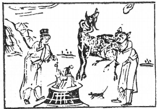

# 29坎爲水
  

此卦唐玄宗避祿山，卜得之，果身出九重也。 

圖中：  

**人在井中，人用繩引出，一牛一鼠，人身虎頭。**  

**船涉重灘之課 外虛中實之象**  

大過之後，過至極必陷，坎者，陷也。重坎即重險，險中有險，此卦專論處險之道，如何用險等。
# 卦圖象解  

一、人在井中：官司，牢獄，陷入險地象。 

二、人用繩引出：責人出手相救狀。  

三、一牛：勞苦也，春夏凶，秋冬吉，亦肖牛人。  

四、一鼠：肖鼠人，陰謀暗害者，暗藏也。  

五、人身虎頭：有權威之人，貴人也。  
# 人間道
**習坎：有孚，維心亨，行有尚。**  

陽實在中，乃中有孚信，惟心誠正一，則能亨通，俗謂：至誠可以通金石，入水火，有何險難不可亨？~~故出險之道在於誠一而行，否則常居險中也。~~  

**彖曰：習坎，重險也，水流而不盈，行險而不失其信。**  

習有重覆之意，上下皆坎，即險中有險，水流而不盈，即動於險中仍未出險之時，吾人行險须不失其信，乃可吉。  

**維心亨，乃以剛中也。行有尚，往有功也。**  

以剛中之道，抱持至誠之內實，天下何所不通，若止而不行，則常居險中也，故~~坎險以能行為功~~。  

**天險不可升也，地險山川丘陵也，王公設險以守其國。險之時用大矣哉！**  

天之險乃因高不可升，地之險為山川丘陵，諸王公觀坎之象，知險不可陵越，故設高牆深地為險，以守其國，保其人民，此用險之時也。人間亦然，凡知人之學，分尊卑，分貴賤，區分小人與君子，皆為用於杜絶災殃，限隔上下，此都是體悟了險之用也。  

**象曰：水洊至，習坎，君子以常德行，習敎事。**  

水勢就下，由小而大，歷久不變，君子觀坎水之象，取其有常，不變其德性為真。如人之德行常變，則偽也。政治上發令行教，必使民熟於聞，人人皆從之，故有謂三令五申，即此意。  

**初六：習坎，入于坎窞，凶。**  

初以陰柔居坎險之下，因無援，處不當， 不能出險，唯益陷深而已，故凶。  

**象曰：習坎入坎，失道凶也。**  

由險中而加陷入險，乃失正道，加凶。  

**九二：坎有險，求小得。**  

二爻位，乃陽陷二陰之中，即~~至險而有險狀，但其本為剛中之才，故雖未出險，亦可自救~~，不至於愈險，故~~君子處艱險而能自得，皆因剛中~~而已。~~能剛則有才，能執中則動不失所宜~~。  
**象曰：求小得，未出中也。**  

此即雖有小得，雖不致於陷險，然亦未能出險狀。  

**六三：來之坎坎，險且枕，入于坎富，勿用。**  
六三位在坎險之時，以陰柔居而處不正， 走下則入險，向上則重險，故有~~進與退皆遇險~~， 居又有險，枕乃處不安狀，此時唯~~戒勿用~~方是。  

**象曰：來之坎坎，終无功也。**  

以陰柔又處不正，動則唯益險，~~人出險须有道~~，如失道，但為能求去，只益增困窮而己。  

**六四：樽酒，簋貳，用缶，納約自牖，終无咎。**  

此言大臣當險難之時，唯有至誠於君，不可停交往，而又能打開使君能明之心，則可保无災。人欲求上之篤信，只有求質實而已，如多禮儀而尚服飾，反凶。一樽之酒，二簋之飯， 以瓦缶為器，乃求~~質實~~之意。再處明之地以明君之心，如此方能入君心，即令艱險，亦可無咎。自古以來，只求剛直攻訐直言不諱之人， 多忤逆君心，而屬~~温厚明辨~~者，反而能入君心， 改變君主。  

**象曰：樽酒簋貳，剛柔際也。**  

但求實質，又剛中有柔，必平安。君臣之交能長久，不外乎誠實而已。  

**九五：坎不盈，衹。既平，无咎。**  

此即九五之尊，有剛中之才，可以濟險， 但下無助，獨依君之力無法濟天下之險，則有咎，必待盈平，方可無咎。  

**象曰：坎不盈，中未大也。**  

剛中之才得居君位，時天下險難，但~~未至全險，其未能平險~~，乃因君臣無法協力相濟之故，故此君道未能救濟天下，乃因無臣，故曰不稱其位。  

**上六：係用徽纆，寘于叢棘，三歲不得，凶。**  
此意~~陰柔而深陷險中~~，聖人以牢獄比喻， 縛以徽纏，囚置於叢棘之中，其不能出，至少三年不可免，其凶如此。  

**象曰：上六失道，凶三歲也。**  

上六以陰柔而處險地，乃因其失道而成。其災延三年不得免，意久也。  

