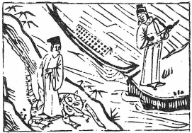

# 30離為火
  

此卦朱買臣被妻棄時，卜得之，知身必貴也。

圖中：

**人在虎背上立，官人執箭在岸上立，水中有船，二人分立兩岸。**

飛禽在網之課 大明當天之象

陷於險難之中，必有所附麗，理之自然，離者麗也。離為火，火體中虛而能明照，故能麗於物而明也。人之明，必經險難，大風大浪過後，其經驗之累積，而後能明，此猶可人。

今人雖歷災險，但仍不能明，吾人教授易經，其目的即希望世人，不須付出血的代價，亦能明，此中虛之廣義。

卦圖象解

一、人在虎背上立：行危不懼；難下也。

二、 一船在江心：口舌相爭，無所適從也。三、官人執箭岸上立：在位之人，欲殺之象。此卦夫妻破散成仇，兄弟分家各自為王之課。

人間道

 離：利貞，亨，畜牝牛，吉。

==天下萬物莫不有所麗，其形即麗。人之所麗，必得貞正，得正可以亨通，人能附麗於正， 必能順於正道，從善如流為人之性，如牝牛之吉，牛之順道，由養而成，人之順德亦同，既附麗於正道，當有養以成其德也。==

## 彖曰：離，麗也。日月麗乎天，百穀草木麗乎土 。

附麗狀，如日月麗於天，百穀草木麗於土 ，天下萬物必有所麗，無麗之物，人必視何麗方正，則能亨通也。

## 重明以麗乎正，乃化成天下。柔麗乎中正，故亨。是以畜牝牛吉也。

上下皆離故曰重明，乃意君臣皆有明之能，又處事中正，故可以教化天下成文明之俗也。人又能柔順於中正之明德如牝牛之順吉，乃更能將明德發乎光大，襯托明德之麗。

## 象曰：明兩作離，大人以繼明照于四方。

此卦若云兩離，則只見明，而不知繼明之德。君子觀離明相繼之象，知本身之明德能濟天下，為使以明德中正永傳後世，則須有進一步繼明之能，能明於選擇何人能承繼，乃繼明之義。如堯之擇舜，漢之蕭規曹隨等即是繼明之用。

## 初九：履錯然，敬之，无咎。

初爻陽居之，乃言初進有陽剛之才而進又躁動，卻因動之非宜，已失居下位之分而得咎， 但因為人才，只須知守義而戒慎之，則不至於有咎。

## 六二：黃離，元吉。

以柔居中乃得正位，黃為中色，人能文明而中正，則美之至極也。又有六五文明之君以順其德，其能明如此，乃大善之吉也。

## 九三：日昃之離，不鼓缶而歌，則大耋之嗟，凶。

易有八純卦，唯離為火於人事之義陳述最細。今九三吾人居下卦之終乃意前明將盡，後明當繼之時，人之有始，必有其終，此常道也。智慮通達之人，以順理為樂且常持之，如不能如此，則有將盡之悲，而日夜恐於死亡，故君子樂天，小人終日恐懼，此處易論生死之道也。

## 象曰：履錯之敬，以辟咎也。

能知履動之躁進為錯而敬慎之，因居下位，但求避之可也，不致有災。吾人有陽剛之才，仍須有明之能，能剛不能明，則因妄動生災也。

## 象曰：黃離元吉，得中道也。

能成文明乃由中之虛明，故元吉之因，是由其得中之道也。

## 象曰：日昃之離，何可久也。

日已倾，不可久也，能明之人，能求人以繼其事，知退而修其身，則可長久。

## 九四：突如、其來如、焚如、死如、棄如。

九四位，乃言繼明之初，承繼之意，但陽爻居之，有剛躁但不失中正之意，此非善繼者， 能知善繼之人，始繼必有謙讓之誠，知順承前賢之道。今突如其來，已失善繼，又剛勢凌主， 氣焰高張故焚如，必招禍害致死，故死如，以眾所棄之，故果為棄如。

## 六五：出涕沱若，戚嗟若，吉。

出涕戚嗟，皆形容人憂懼至深。君位以陰柔之才居之，又受於陽剛之在左右，此居尊位之明，能知憂且畏，故能吉。今若自持己才之不足，全然不知懼，必不能得其吉也。

## 上九：王用出征，有嘉。折首，獲匪其醜，无咎。

陽剛之才居離之終，有剛明至極之狀。此方式乃適用之於君王出征時，明則足以察邪惡，剛則能斷事，施以威行，如此則能去天下之邪惡，此有功也。世上事至刑不足以阻時， 必用征伐方法解決，此之時也。去天下之邪惡， 如明斷之極，則必無所宽宥，此時必取其魁首， 始作俑者方是，趕盡誅滅，必有暴殘之後悔也。

## 象曰：突如其來如，无所容也。

諸君試想，人之凌其君，而不順所承繼之前賢，必眾棄，天下不容也。

## 象曰：六五之士，離王公也。

居上位之吉，乃在明察事理，且以畏懼憂慮之心以持之，可以為吉也。

## 象曰：王用出征，以正邦也。

君王用此德，則能治其邦國，此剛明至上之道也。

