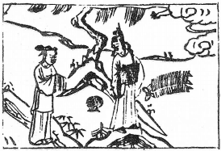

# 31澤山咸

  
此卦漢王昭君，卜得之，知和番不回也。

圖中：

**空中有一拳，錢寶一堆，貴人在山頂， 女人上山，一合子。**

**山澤通氣之課 至誠感神之象**

==易經上經乃論`天地萬物`之本，有天地後有萬物，聖人觀其間象，以巨視之角度來體察出天道。咸卦之始，為易經下經，其論`夫婦人倫`之始，較重於`人道`。咸之為卦，兌上艮下，乃少女少男之意，表示世上男女相感之深，莫過於少男少女，童稚之間無隔閡，人人皆以平常心處之， 男女相悦又無所求，互相以誠及悦相處對應，此時之感，即咸之深意。==

# 卦圖象解

一、空中有一拳：貴人提拔，憑空而得。  

二、錢寶一堆：求財得財。

三、貴人在山頂：孤立狀，即將下坡，退休狀。  

四、女人上山：夫妻吉，陰人卜之知走馬上任。  

五、合子：先成後破，因誠感方吉，物感必凶。

# 人間道

 **咸：亨，利，貞，取女吉。**

==咸，感也，舉凡君臣上下，夫婦、父子等皆有感之道，人人能以少男少女之童悦相感以誠悦，即以平常心相待，則必有亨通之理。今人皆以媚説，上下之位處以邪僻，皆感之不正也。艮為止，澤為悦，乃外悦內止之意，以此之意近女，乃得正而吉也。==

## 彖曰：咸，感也，柔上而剛下，二氣感應以相與，止而説，男下女，是以亨利貞，取女吉也。

陰陽相交，乃男女相感之義同，男女之交，男以篤實至誠之心，女以喜悦之心相應，此男女之感於正道，故能亨通得正。

## 天地感而萬物化生，聖人感人心而天下和平，觀其所感，而天地萬物之情可見矣。

感之道到極限時，聖人能以至誠之心感億兆人之心，使天下和平，其情之偉大可見，但須知感通之理，須以默而觀之，不可道破，此感方可久矣。

## 象曰：山上有澤，咸；君子以虛受人。

澤在山上有渐潤通澈狀，此感之道。君子觀山澤通氣知須虛其中方能受人，凡人之心能中虛必可受，實則不能入矣。

# 初六：咸其拇。

初與四相感，初之時感必未深，不能動人， 如拇指之動，不可進也，須識勢而為。

## 象曰：咸其拇，志在外也。

感應之志雖動，但未大，不足以進。初志之感與四相應，故曰在外。

# 六二：咸其腓，凶，居吉。

腓，足肚也，人之動，足必先行，足肚自動也。二位無法守道而妄求於上，故凶。進退之道乃安居其位，以待上求，此吉也。

## 象曰：雖凶，居吉，順不害也。

陰居二位，其得位中正，在咸之時，因質本柔，必戒以先動，求之必凶，守居不動吉。

# 九三：咸其股，執其隨，往吝。

股在身之下，足之上，不能自主，隨身而動。九三陽剛之才，感於所動而隨其動，如此已失其正道，其動必羞也。

## 象曰：咸其股，亦不處也，志在隨人，所執下也。

人有陽剛之質，卻又不能自主，反隨於人而動，此所執者必卑賤甚也。

所生處。

# 九四：貞吉，悔亡，憧憧往來，朋從爾思。

人之所動皆因感也，九四在中，乃當心臓之位，為心感之主，感之正則吉，不正則凶。今人以私心感人，所感狹小也。天地萬物各有不同，事亦變化萬千，能殊途同歸，此感之極至，必以公正無私方可行。人之向往，必有屈求，人之來至，必因有信，此屈信相感，利之

## 象曰：貞吉悔亡，未感害也。憧憧往來，未光大也。

人能正則必吉，事皆以私，則生害也，互相往來以私心相感，此感之道狹，必未光大也。

# 九五：咸其**脢**，无悔。

居尊位之人，必以至誠感於天下，脢，背肉也，其與心相背，目所不見狀，此意能背其私心，感於非所見而能悦者，以人君可以無悔。今人不知，皆感於所見而悦，所不見而仇視之， 此感不正，招自凶亡也。

## 象曰：咸其**脢**，志未也。

人感於所不見而生戒，其必淺也，此私心之用也。

# 上六：咸其輔，頰，舌。

上為感之極位，陰柔居之，此即不能以至誠感物，唯求於口舌之間感人，乃小人女子之常態，必不能動於人，故云頰。

## 象曰：咸其輔頰舌，滕口説也。

世間唯至誠能感人，如靠口舌説話之才， 感人必不能長久。

