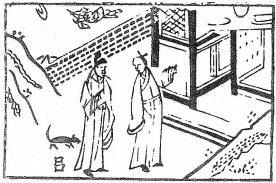

# 32雷風恆

  
此卦宋王奪韓朋妻，卜，得之也。

圖中：

**日在雲，鳳啣書，官人行路，道士手指門，鼠下兩口，牆擋路。**

日月常明之課 四時不沒之象

恆，乃論夫妻之道，終身不變者，前『咸』為少女少男之感，今『恆』乃長男長女之往， 男尊在上，女卑在下，此夫婦居室之道，男動於外，女順於內，此人倫之常，此恆久之道。

卦圖象解

一、日在雲中：昏暗之象，君主不明象。二 、鳳啣書：喜訊至，金榜题名也。

三、官人行路：將至也，貴人至。官人，倌人，丈夫也，人傍為倌也。四、道士手指鬥：入空門也，閃也。

五、鼠下兩口：陰謀在後之象；兩口，回也，呂姓也。六、時機：在春末，日為春之末尾也。

## 此即持之以恆，則有撥雲見日之喜也。

人間道

恆：亨，无咎，利貞，利有攸往。

恆為常久之道，人能恆之於善，此道可恆，君子之道。小人之道，乃恆於惡，已失可恆之道，故恆之道能常久，乃因所恆為正，恆不正，招凶也。

## 彖曰：恆，久也。剛上而柔下，雷風相與，巽而動，剛柔皆應，恆。

恆久之道，在於上剛下柔，君剛臣柔，夫剛婦柔，雷震風興，風中有雷，相互交應，助長其勢，天地之間能恆久不已，乃因能知順動而已。

恆，亨，无咎，利貞，久於其道也。

恆之道，可以令亨通，且無災，但須注意所恆為正，吉也，所恆不正，則反招辱。

## 天地之道，恆久而不已也。

人如能恆持可恆之道，則合於天地之理。必可長久。

## 利有攸往，終則有始也。

萬物之動，必有始終，今動而能恆，其間變化必多，能知隨時變易其外，神在內不變，此得易之神也。

## 日月得天而能久照，四時變化而能久成，聖人久於其道而天下化成， 觀其所恆，而天地萬物之情可見矣。

日月得天之道，能久照不已，四時往来生成萬物，也因得天，故常久不已，聖人用恆之道， 行之不已，能化成天下，成其美俗。觀天地之恆常，得天下常久之理，此聖人之道所以能常久也。常人孰能知。

## 象曰：雷風，恆；君子以立不易方。

人才君子觀恆之象，以恆久之德性，持立於中道，永不易其立足之道。

## 初六：浚恆，貞凶，无攸利。

初六以柔暗之人初進，只知守常卻不度勢而為，但求上之眷顧，又堅守此向，致凶之道也。因其心志在求上眷顧，必不能安居其位， 故凶也。

## 九二：悔亡。

恆能居其正位，常道也。今陽居陰位，處非其位，雖中正之才，不知輕重之勢，造成有

## 九三：不恆其德，或承之羞，貞吝。

得位乃可久，但於須持久時不知持之以恆，朝令夕改，人無所適從，反招羞辱矣。

## 九四：田无禽。

田獵又無獲禽，徙勞無功也，九四陰位而陽居之，處非其所，恆又何益？人之動必有道， 持之以恆則有功，不得道，即久亦無功也。

## 六五：恆其德，貞，婦人吉 ，夫子凶。

柔居剛位，又得九二之陽剛助應，此即居中正又有應乎中正，恆此以久，吉之道。婦人之道以順從為恆，此順從於婦人則吉，丈夫為剛陽，如以順從之道持恆，反致凶也。更何沉人君之道，君道切不以柔順為恆也。

## 上六：振恆，凶。

此恆之極位，乃振恆，即守之不常也，居上而動無節宜，再以此為恆，凶至也。故吾人動之必以正理，不逾矩，動如失正，又不及復， 反持恆下去，果致凶矣。

## 象曰：浚恆之凶，始求深也。

但求上之眷顧，不知度勢而行，安居其位， 失恆之道於始也。

悔。人能知所輕重，易之義即此。

## 象曰：九二悔亡，能久中也。

人能知恆久於中道，知所輕重，必可常久。

## 象曰：不恆其德，无所容也。

不知恆之道的人，終至無處容身也。

## 象曰：久非其位，安得禽也。

處不適位，雖久何益，猶徙獵而無功。

## 象曰：婦人貞吉，從一而終也，夫子制義，從婦凶也。

柔而順從於婦人則吉，乃從一而終也，君王之義，從婦人之順從，招凶。

## 象曰：振恆在上，大无功也。

居上之道，躁動不安，必無所成，此言持恆，知恆，用恆之重要性，人不知此即，令再大之勞亦無功也。

