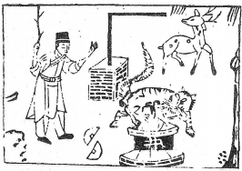

# 36地火明夷

  
此卦是文王囚姜里，見子不至，卜得知，果子歿也。

圖中：

**婦人在井中，虎在井上，錢破，人逐鹿， 堠上有工尺，珠聚。**

鳳凰重翼之課 出明入暗之象

物進不已，必有所傷，故明夷為序卦，夷者，傷也，此卦坤上離下，乃明入地中之象，為晉之反卦，故義亦反，晉為明且盛，上明君下群賢並進之時。明夷乃暗君在上，明者見傷之時， 日入於地中象。

卦圖象解

一、婦人在井中：女人招災，或頸部災，家內有災。二、虎在外：外人虎視眈眈。

三、錢缺：財傷也。

四、人逐鹿：財失也，爭相為祿，逐鹿中原。五、堠在人鹿中：猴作梗也。

六、「：尺也，工匠獨有，匠，將也，武官人。七、堠：不動也，尊位也，姓侯，肖猴。

八、鹿回頭：回祿也，火災。九、人手上木枝：休象。

見此課，必傷且凶矣。

人間道

明夷：利艱貞。

君子處明夷之時，須知時之艱難，必求不失正道，方為君子。小人則阿諛奉承，唯利是圖， 順附勢而為，不顧正道。

彖曰：明入地中，明夷，内文明而外柔順，以蒙大難，文王以之。

君子處明夷之時，知明者必見傷，故求內明外順之態勢，應對大難之時，如此可內不失明， 外又可遠禍患。易之妙即在此，卦之德本亦卦之解也。

## 利艱貞，晦其明也，内難而能正其志.箕子以之。

處艱難時，能知晦藏其明，不知藏晦，必生禍患，不能守正，必非賢人。

## 象曰：明入地中，明夷，君子以莅眾，用晦而明。

君子觀明入地中，明夷之道，乃知不極其明察而用晦之道，於莅眾之時，如此必能容物和眾，眾親而安，猶水至清則無魚，人至明則無徒亦然。

## 初九：明夷于飛，垂其翼。君子于行，三日不食，有攸往，主人有言。

明夷之初，乃見傷之始，暗君在上，陽剛之人不得上進，猶鳥飛而傷翼，小人害君子皆害其所以行。君子之人能見事於微末，始見傷， 則避之，即令困窮亦退避之，取適之位而往， 絶不以世俗之見而遲疑所行也。常人無法見傷於始，不知退避，至傷於己時，已不能退也。

## 象曰：君子于行，義不食也。

義之所至，即令困窮，亦不所為不正，故君子能安之於苦悶。

## 六二：明夷，夷于左股，用拯馬壯， 吉。

六二乃陰居陰位，得中正之德，順時知處， 乃至善也。但處明夷之時，亦不免有所損傷， 但須如馬之壯，可獲免傷而吉，如自處之道不壯，則傷之深矣。

## 九三：明夷於南狩，得其大首，不可疾貞。

因上卦暗極，而又正居明之極，明即將與暗衝突之時也。居此，君子必前進除害，以獲之魁首，為要務，至於舊疾敗俗，必不能立刻改變，須知渐進之道，教其渐改，如求劇革必令不安，非上策也。

## 象曰：六二之吉，順以則也。

順處且有原則，合於中正之道，故必能處明傷之時，而能保吉也。

## 象曰：南狩之志，乃大得也。

用下位之明，來除上位之暗，唯求目的在除害而已，如不然則為背亂之事也。

## 六四：入于左腹，獲明夷之心，于出門庭。

此爻意陰邪之小人，處近君之位，乃以柔順附於君主時，為保其固交，乃以柔邪之法， 隱敝之交而結於上。而君本陰邪之人，必受蠱惑其心，而行之於外。故君必求明，守正道， 而不為小人所煽動，所利用也，即此。

## 六五：箕子之明夷，利貞。

此爻言暗傷至極，乃謂明見傷之主，若於此時顯示其明，必見傷害。要如箕子之知晦藏， 則可免於難，若不知晦藏其明，則害大矣。

## 上六：不明晦，初登于天，後入于地。

明之至高而又傷於此時，本可遠照，今傷於明，必不明反昏悔，反失其道也。

## 象曰：入于左腹，獲心意也。

此以邪惡之陰道惑於君心，而逞其私慾， 君為小人，必始終不悟也。

## 象曰：箕子之貞，明不可息也。

箕子知晦藏其明於暗傷之時，且能不失意志，同與陰暗之人合污，其明必能不滅，小人若受禍患所逼，必失其節守也。

## 象曰：初登於天，照四國也，後入于地，失則也。

始登於天，能明照四方，今傷於昏暗，反失其道。

