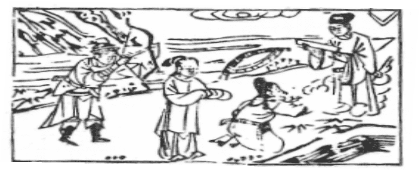

# 37風火家人
  

此卦董永喪父賣身，卜之。後感得仙女為妻。

圖中：

**一人張弓，一帶在水邊，雲中文書， 貴人拜綬，婦人攜手。三點。**

**入海求珠之課 開花結子之象**

==`人之傷於外而必後返於內`，故家人次明夷為序卦，此卦專論家內之道，父子、夫婦、長幼尊卑之倫理與恩義的家人之道。外風內火，乃風自火出，火愈熾則風生，有自內而出之象，故處家之道，有內明外順象。聖人之謂人能立於家，則必能施於國，以至天下大治。故治天下猶治家也。==

# 卦圖象解

一、一人張弓：暗算，破壞也。

二、一帶在水邊：事滯也，棄官也。  

三、雲中文書：突而來之喜訊也。  

四、貴人拜受：綬命也。

五、婦人攜手：家和之象，此卦卜婚姻大吉。

# 人間道

 **家人：利女貞。**

==家人之道，利在女正且堅，女能正，則家道正矣。==

## 彖曰：家人，女正位乎内，男正位乎外，男女正，天地之大義也。

家人之道，正位且堅心，男主外，女主內，其有尊卑有道，乃合乎天地陰陽之道。

## 家人有嚴君焉，父母之謂也。

父母為一家之君長，無尊嚴則無人孝，無大小，則倫理廢，故君嚴則家正。

## 父父子子，兄兄弟弟，夫夫婦婦，而家道正，正家而天下定矣。

父母兄弟夫妻各適其位，則家道正矣。能治家道，其道亦可推而治天下。

## 象曰：風自火出，家人。君子以言有物，而行有恆。

君子觀風自火出之象，知正身之道，皆由內出，故言必有物，行必有恆，身正而能治家。

# 初九：閑有家，悔亡。

家人道之始為初九，须以陽剛立家道，如無法則度量，則終至人情流放，必悔。

## 象曰：閑有家，志未變也。

閑即預防之法則也，閑必於始初而立。在正志未流散之前，變動而法規之，因始立規之時，必不傷恩，不失義，如於志變後再思治， 則多有傷，必有悔。

# 六二：无攸遂，在中饋，貞吉。

常人處家，唯骨肉親情，故常以情勝禮， 以恩去義，偏私之人多矣。獨有能剛之人不以私愛而不顧理。今以陰柔之人治家，必無可為， 唯婦人之道可以柔順，如能處正，居中協調， 則必能吉。

## 象曰：六二之吉，順以巽也。

今以陰柔居中，能順從而動其心，此為婦人之正道。

# 九三：家人**嗃嗃**，悔厲吉，婦子嘻嘻，終吝。

嗃嗃乃嚴厲約束意，家人之道如約束過嚴，必有悔，然能令人心敬畏，也比讓婦人之放肆，喜樂無節，終至家敗而來得好。同理， 人能剛立，必知忠義，喜愛玩樂必不能正倫理， 知恩義也。

## 象曰：家人**嗃嗃**，未失也；婦子嘻嘻，失家節也。

雖過嚴厲傷恩，但猶未失家人之道。但令婦人喜節無度，失家之道，必亂矣。

# 六四：富家，大吉。

能有其富，於家道大吉，保有富之人，而能保其家，此吉之大也。

## 象曰：富家大吉，順在位也。

以巽順之道而能保其家富，此家之大吉也。

# 九五：王假有家，勿恤，吉。

能剛又處君位，位尊而中正，又能順應內， 此治家之至正至善。是故修身來齊家，家家能正，則天下大治，此不須憂勞而天下自治矣。

## 象曰：王假有家，交相愛也。

尊位又能有家之道，不但能使其順從而已，必使其能從內心而化合。丈夫能愛內助， 婦能愛其威治於家，此交相愛，為家之至道。

# 上九：有孚威如，終吉。

此言治家之道，非至誠之心不能也。己能守其规如常則人自化，如己不能守，況於他人乎？家之患必在禮法不足，下犯上，上凌下。如能守正禮法，又有威嚴，則必能吉。

## 象曰：威如之吉，反身之謂也。

此即言治家之道，以正身為本，當先嚴其身，後有威望於人，則人能服。此反身之意。

