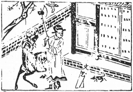

# 38火澤睽
  

此卦武則天聘尚賈至精魅成，卜此除之。

圖中：

**人執斧在手，文書半破，牛鼠，桃開鬥掩，雁飛鳴。**

猛虎陷井之課 二女同舟之象

家之道到窮途，則生乖違離散，故睽卦為之序。此卦上火下澤，二體相違，此睽之義，二女三女同居一室，但所歸各異，乃因志之不同也。

卦圖象解

一、人執斧在手：求快也，行刑之人，執法之人，有權柄也。二、文書半破：無望象，毁約也。

三、牛鼠：秋冬吉，春夏凶。四、桃開：逃開也。

五、門掩：牢獄之災，閉也，隔也。

六、雁飛鳴：悲也，孤單也，報凶訊也。

人間道

 睽：小事吉。

睽違之道於小之事，可言吉。如與不良之人乖離，與不正之事違背也。

## 象曰：睽，火動而上，澤動而下，二女同居，其志不同行。

睽，以卦才言火在上而動，澤在下位，此二物性反，其義猶二女三女其本志同而共處，及長所歸各異，其志不同也。

## 説而麗乎明，柔進而上行，得中而應乎剛，是以小事吉。

內悦順而又應乎外明，麗明居上，以柔求進，又能得中正之道相應，處睽之時雖無法去天下之睽，但於小處則吉矣。

## 天地睽而其事同也，男女睽而其志通也，萬物睽而其事類也，睽之時用大矣哉！

天上地下雖睽然天陽下降地陰上升而成萬物，其事本同也。男女之質不同，但互相求之志卻同也。天下萬物不同是暌，然皆稟天地之氣而成，則相同也。是故物雖異而其本同，聖人用睽之道，能令天下不同之群眾，合而為一，故其事大矣哉。

## 象曰：上火下澤，睽，君子以同而異。

火在上，澤在下，二物之性相違，為睽象，君子觀睽而知於世俗所同者，有時須獨異於世人，中庸曰和而不流，即義此也。

## 初九：悔亡，喪馬勿逐，自復；見惡人，无咎。

卦之初，即睽之始時，於睽時又剛動於下， 其悔可知，於此時因不能行而喪其馬如勿逐則馬自復回。因睽時小人必眾，若棄之，則必天下而仇己乎？就會喪失坤德之含弘功能，乃致凶地。不但無法使之化善，更遑論能合之，故有必見惡人之議，所以自古以來能化姦邪為善良，去仇敵而為臣民者，皆因不拒絶見之。

## 九二：遇主于巷，無咎。

睽違之時乃陰陽不合，且剛戾相對，即令為陽剛之中臣，當以委曲而婉轉之善道將就於主，期使之合，絶非求附君主而屈道相向也。

## 六三：見輿曳，其牛掣，其人天且劓，无初有終。

三爻位為下卦之上，本離下卦而求進於上，今逢四之剛為阻，而下二爻之陽剛於後， 處此之時又逢乖違不和，猶牛車之行具，牛受掣阻於前，後有車輿在後，如以此狀況，又求力進，則必重傷於上，宜剛守中正之道與其對

九四：睽孤，遇元夫，交孚，厲无咎。

四爻近君位，君不與應，乃睽乖之時，故為孤，唯求與同德之人相合，且至誠相與交往， 能如此，雖處危，但仍可無咎也。

## 六五：悔亡，厥宗噬膚，往何咎。

陰柔又居尊位，於睽時，其危可知，然有九二陽剛之賢相輔，可以悔亡，且陽剛之賢又能成黨，且深入之，則往而有慶也，如劉襌之庸，有孔明之輔，乃成中興之態勢。

## 上九：暌孤，見豕負塗，載鬼一車， 先張之弧，後説之弧，匪寇婚媾，往遇雨則吉。

睽極之時，必反復正道，猶人見污濁之豕， 且全身爛泥，又車載一群惡鬼，心厭惡之乃欲張弓射之，後思之如動必反，而弗射，化仇寇為婚媾，陰陽交合而成雨，故始因疑而睽，睽至極因不疑而合，猶天地陰陽上為雨，往而遇之，則吉也。

## 象曰：見惡人，以辟咎也？

於睽時人情乖違，為求和合，若因其惡人而避之，則生眾仇於君子，故見惡人乃為避免怨咎之悔也。

## 象曰：遇主于巷，未失道也。

此意即當以至誠以動君心，使明義理而能求相合，不可屈道迎逢，乃真未失道。今之小人明知不正，然於乖違，之時，只知迎合奉承， 為求己利，枉顧正道，故因時局而戀志之人乃真小人也。

應，待睽終極之時必合，方為善處之道。

## 象曰：見輿曳，位不當也，无初有終，遇剛也。

見車牛之負掣後拖曳而行，知位所不當， 聖人知理順行，知時而守，待遇剛而能合。

## 象曰：交孚无咎，志行也。

睽乖之時，上下至誠相交，不止無咎，且其志必可行，故救睽之道，唯君子以陽剛之才， 至誠相輔，何所不能濟也。

## 象曰：厥宗噬膚，往有慶也。

人君之才不足，如知信任賢輔，使其道能深入於己，亦可為也。今人不知己之才不足， 以為博士就是好的，不但不能成事，且造成乖違之勢愈烈，果必凶。

## 象曰：遇雨之吉，群疑亡也。

雨之成，乃因陰陽之和，故所以合和能成， 乃因疑慮盡消亡也。

