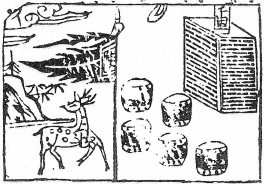

# 39水山蹇
  

此卦鍾離末將收楚，卜得之，乃知身不王矣。

圖中：

**日當天，旗一面上有使字，鼓五面中有一鹿、堠上千里字。**

飛雁啣草之課 背明向暗之象

睽，乖違也，乖離必生難，蹇即難也，因時之乖違，必有蹇難，故蹇次睽為序卦。此卦坎上艮下，坎，險也，艮，止也，前有險而止不進，為蹇之意也。

卦圖象解

一、日當天：君明之象，吳姓。

二、旗一面只有使字：出使，和平之象，使—二人一口，示單人也。

三、鼓五面者：時為五更天，佔五面地，王為君王，一方之主，有多國或多島之象。四、中有一鹿：攜財福至，旅客帶財來狀，商人至也。

五、堆子千里字：行西南，千里封候，候姓也。六、千里為重：有第二次方吉。

人間道

 蹇：利西南，不利東北，利見大人，貞吉。

西南為坤，坤体順，東北為艮，艮体險止，此言於蹇難之時，利處平易之地，不利止於危險，今人遇險而止，不知因險而止，乃更險也。

## 彖曰：蹇，難也，險在前也。見險而能止，知矣哉！

蹇有險阻之難也，因險在前，止而不進狀。處蹇之道，乃能見險而止，此知蹇難也，此止非真止也，乃不犯險而進之意。

## 蹇：利西南，往得中也：不利東北，其道窮也。

蹇之時，唯利處平易之地，乃得中正之位，東北為山，險阻在前，犯險而進，道必窮。

## 利見大人，往有功也，當位貞吉，以正邦也。蹇之時用大矣哉！

蹇難之時，唯聖賢能濟天下之蹇，故用賢人能往求而成功，在位之人堅心執意如此，必能正家邦，此即知蹇之時任用賢人，適時而動，量險而行，使至正之大道能濟天下之蹇。今之為政者，不知蹇之時難，乃因不知古聖先哲之智慧也。

## 象曰：山上有水，蹇；君子以反身修德。

山已為險阻，上又有水，故有上下險阻狀，為蹇，君子觀蹇象，知此時乃反求於己修身進德，故必省自身，以待時之至也。

## 初六：往蹇，來譽。

此蹇之初，以陰柔無助而求進，蹇之甚也， 是知止而不進，乃因知進退而成譽也。

## 六二：王臣蹇蹇，匪躬之故。

二爻為陰位，陰居之為正位，乃意為中正之臣，又與上五君同德而受信任，此即王臣， 今處蹇難時，即令中正之人，以陰柔之質，不能勝任，故有蹇中之蹇狀，因為中正之人，其所為必忠於君，非為私己，故即令不勝，亦因

## 九三：往蹇，來反。

以剛居下卦之上，處蹇時，下位之人皆柔， 依附於上狀。欲再上進，又逄陰柔，無法相濟， 故有來反，即還歸也，反回其所。

## 六四：往蹇，來連。

蹇之時以陰柔而往入坎險之深處為往蹇， 如能與同志之人，使合眾而附之，此即来連， 乃真得處蹇之道也。

## 九五：大蹇，朋來。

君處蹇難之時，必天下處難也，故名大蹇， 此時如能得朋來助，且須為陽剛中正之才來相輔方有效。

## 上六：往蹇，來碩，吉，利見大人。

六以陰柔居蹇之極處，蹇之極有將離蹇之態，如以陰柔必不得出，須有陽剛之助，以寛裕之大量，見有德之人，方可為吉。

## 象曰：往蹇來譽，宜待也。

於蹇之初，進必愈蹇，宜見幾而止，待時而進，不可燥進。

其能忠而可嘉勉。

## 象曰：王臣蹇蹇，終无尤也。

中正之臣所為必為其君，不為私，故於蹇難時，雖未成功，但終無過也。

## 象曰：往蹇來反，内喜之也。

下之陰柔無法獨立，必附於九三之陽剛。故吾人知，於處蹇之時，必得下之心可以求安， 此求內而喜之也。

## 象曰：往蹇來連，當位實也。

處蹇，居於上位，能不與下往而眾來，乃得眾志也，能得眾志之人，必始之於誠實待下方可得也。

## 象曰：大蹇朋來，以中節也。

大蹇之時，須陽剛中正之才，如臣之才不足濟蹇，只守於節義，不能濟世也，今之政客， 多屬此類，不知己之才不濟，而力進，徒顯其無能也。

## 象曰：往蹇來碩，志在内也，利見大人，以從貴也。

六位陰柔又處蹇之極，能近陽剛中正之君，來求自濟，此以從貴之義，吉也。

