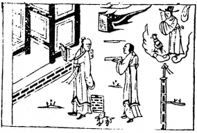

# 40雷水解

  
此卦項羽受困垓下，卜得之，後果士卒潰散也。

圖中：

**旗上提字，一刀插地，一兔走，貴人雲中，一雞在邊鳴，道士手指門，道人獻書，小堠在側。**

雷行風止之課 患難解散之象

解者散也，萬物無終難之理，難至極而散，故解為蹇之序。此卦震上坎下，外動內險，即動於險外，有出險之象，故為患難解散之時也。

卦圖象解

一、旗上提字：指名提凶，不利。有遠走他鄉之象。二、一刀插地：求快也，劉姓之人也。

三、一兔走：卯年，劉姓。

四、一雞在邊鳴：有競爭象，酉年適逢貴人救。五、貴人雲中：不及救也。

六、道士手指門：入空門也，逃亡方向，出家也。七、道人獻書：裝飾外表，示誠象。

人間道

 解：利西南，無所往，其來復吉，有攸往，夙吉。

西南即坤方，坤之体本含弘光大，於天下之難方解時，人始離困苦，當以宽大簡易之法待之，切不可使煩於苛政，人心必安，再求重修冶道，立綱紀，建法治，且宜早動，如俟難復則不及矣。

## 象曰：解，險以動，動而免乎險，解。

險則示難也，不險必不難，遇解時，如不動必不能出險，故此動是免於招險也。

## 解利西南，往得眾也。

此即解難之道，须廣大且平易之法以待民，則民心必歸。

## 其來復吉，乃得中也。

治世之道，必待解之時來臨方可往用，此為得宜。

## 有攸往夙吉，往有功也。

欲動而往，則必利速，愈早前往，功愈大，遲則害已生矣。

## 天地解而雷雨作，雷雨作而百果草木皆甲坼，解之時大矣哉！

天地之氣開而和暢生雷雨，雷雨生而萬物甲坼，故解能成天地之功，故聖人知解之時，大

也。讀易須体時之義，方成得易之道。易之道與天地合而同德。

## 象曰：雷雨作，解;君子以赦過宥罪。

天地解散而生雷雨，君子觀雷雨之象，体會發育之功，而知施恩仁，行宽法也。

## 初六：无咎。

初解之時，柔居陽剛，乃柔而能剛象,知剛柔之合宜，使患難解散。

## 九二：田獲三狐，得黃矢，貞吉。

二與五陰位相應，此言陰柔之君在上，陽剛之臣在之時也，古來如君柔則小人易蔽，威必受損，又不果斷且易受小人之惑，小人一近則心動矣，處此時又逢災難初解，聖人必以能去小人來正君之心，行其剛中之道，方可吉，

## 六三：負且乘，致寇至，貞吝。

小人本非在上之物，今居下之上位，猶負重而乘車，乃招寇至，終必悔矣。

## 九四：解而姆，朋至斯孚。

陽剛之人居陰柔君之側時，如居上位親近小人，必使賢士遠矣，須斥去小人則君子必進， 能得人之信孚。

## 六五：君子維有解，吉，有孚于小人。

君主之人必去小人，則君子必進，正道乃行，如不去小人，則天下不治，此可反看，即天下不治，乃小人不去也。

## 上六：公用射隼于高墉之上，獲之无不利。

解之至極如仍未解，必有堅強之害也，故於此時可強用弓矢如射鷹隼於高處，時至而發，如無良器又動不以時，射未成，必反生害， 故此言器之重要與動之時機，獲之必吉，不成

## 象曰：剛柔之際，義无咎也。

剛柔相接又得其時宜，必無災也。

狐為邪媚之獸，黄乃直中也。

## 象曰：九二貞吉，得中道也。

能得中正之道，除去邪惡乃正且吉也。

## 象曰：負且乘，亦可醜也。自我致戎，又誰咎也。

負重乘車，招寇致其之醜乃咎由自取，又可怪誰呢。小人不量力勉居君子之位處上，必終自招盜而奪之，自取其辱也。

## 象曰：解而姆，未當位也。

如與君子至誠以交，則必無擋，故小人如能介乎中，則示人其交必不誠至也。

## 象曰：君子有解，小人退也。

君子能解退小人，則君子之道方行，故能行君子之道，乃因能去小人也。

反招凶。

## 象曰：公用射隼以解悖也

至解之終仍未解，必害之大且堅，故須強硬如射隼以解悖亂，天下可治也。

