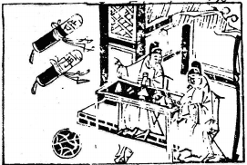

# 41山澤損

  
此卦薛仁貴將收燕，卜得之，大破燕軍。

圖中：

**二人對酌，酒瓶倒案上，毬在地上， 文書二策，有再告二字。**

鑿石見玉之課 握土爲山之象

解，散也，斥去也，其後必有所失，故損為序。此卦「艮」上「兑」下，山體高在上而澤體深在下乃有損下益上之義。如損上而益下，為益卦，取下而求益上，則為損，故居人上而施恩澤於下則益，如取下而求自足，乃損。

卦圖象解

一、二人對酌：二人夾木，來也。二、酒瓶倒案之：目前無指望也。三、毬在地上：所求不成狀。

四、文書二策有再告二字：再次求，方成。

居此之時唯求有益於人，乃得損之真道也，損其多餘，同志乃至。

人間道

損：有孚，元吉，无咎，可貞，利有攸往。

損之道須持之正理，來自誠正，則損因順理而至大善，此可吉也。堅固常行必利有所往。常人之損，有過或不及或不常皆不合乎正理。

曷之用？ 二簋可用享。

人間祭祀之禮，文繁節褥，常人多備祭品，聖人以儉為禮之本，示以至誠之心敬天，如求祭物過多，乃求飾其誠，實示人偽矣。故知凡人之慾望若有過者，其始初皆起於奉養，常久以後則成宮樓峻牆，酒池肉林，聖人有見於此，故先制其本以儉，故損之精義在損滅人欲以近乎天理而已。

## 彖曰：損，損下益上，其道上行。

損之成，乃損下而益於上，故道乃上行。

## 損而有孚，元吉，无咎，可貞，利有攸往。

損之道在至誠，堅心如此，乃可盡損之道也。

## 曷之用？二簋可用享，二簋應有時，損剛益柔有時。

吾人應損去外在浮飾，使至誠見，萬事之始，必有長幼尊卑，然於事之末，往往已流於形式，損之時乃知何時須損剛益柔，此損之道必以時乃吉。

## 損益盈虛，與時偕行。

須損須益，求盈求虛，只隨時之一念而已，易之於時義於此可見。

## 象曰：山下有澤，損，君子以懲忿窒欲。

君子觀損之象，以損己為上，修己之道在忿與欲上，能知損己之忿與欲，乃得真損之時義。

## 初九：已事遄往，无咎，酌損之。

損之道，在損剛益柔也。今居下之人為益上，當以功與之，不求己居，事畢則速去，不求居功，乃能無過。若求享其功之美，此離損下益上之道，不可也。

## 九二：利貞，征凶，弗損益之。

剛中之人與君位柔性相應，居損時，用柔悦態度求應於上，則有失剛中之德，其動必凶， 乃因不知堅心於陽剛也。此適足以損也。

## 六三：三人行，則損一人。一人行， 則得其友。

天下沒有獨一之人，必有二者，如男女之往，由其精一，故能生也。一陰一陽，無法加入故三人因志不專一，必生損一人，一人獨行， 由其志為專，故必有一友能同其志，故天地之間損義之明且大哉，莫過於此。

## 六四：換其疾，使遄有喜，无咎。

陰柔之人居損時，須自損以從陽剛中正之道，即損不善而從善，必有喜而無災。人之損過失，唯患不速，如速則此過必不至深，為可喜也。

## 六五：或益之，十朋之龜，弗克違， 元吉。

君王能柔順居尊位，處損之時，知虛中自損，順從在下陽剛之賢人，人君能如此，則天下人必從其德，咸以損己為美，故有眾民之公論助之，因合正理，即龜筮亦不相違，可謂大善之吉也。古云：「謀能從眾，則合天心。」

## 上九：弗損益之，无咎，貞吉，利有攸往，得臣无家。

損道之終極，能居上而不損其下又益增在下之人，則天下莫不服從，人心歸順，無遠近內外之區限。

## 象曰：已事遄往，尚合志也。

事畢後退居不居功，能與上合志也。

## 象曰：九二利貞，中以爲志也。

九二陽剛之人能守中正之道，則何有不吉。志存乎中道，則必自正也。

## 象曰：一人行，三則疑也。

一人行而能得友，三人行則易生疑，於此時須明損之道，損去一人，乃損多餘。

## 象曰：損其疾，亦可喜也。

知損之道，得損之時，速去其不善，此可喜也。

## 象曰：六五元吉，自上祐也。

人君能盡眾人之見，合於天地之理，天必降福祐也。

## 象曰：弗損益之，大得志也。

居上而不損下，又能增益之，君子必能遂行其志，故簡言之，君子之志，唯在如何益於人而已。

