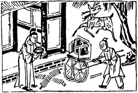

# 42風雷益

  
此卦冉伯牛有疾，卜得之，乃知謾師之過也。

圖中：

**官人抱合子，一人推車，一鹿一錢。**

鴻鵠遇風之課 河水溢出之象

損而不己必生益，自古盛，衰，損，益，天理循環，損至極生益，所以繼損也。此卦巽上震下，風雷二物互相增益，雷受風則迅，風受雷激則烈，互相助威，所以成益象。損上益下， 故為益，前卦乃損下益上故損，以其義而推，吾人可知，民厚則國安。

卦圖象解

一、官人抱合子：倌人，丈夫也，事必先成後破。二、一人推車：因時而動之象，空坐相請。

三、一鹿一錢：才祿俱備，有回祿之災，財有破損，憂心忡忡。

四、不為財货，不畏時尚之變，明知先成後破，仍走馬上任，以損上益下之道，天下或事業亦能平治。

人間道

 益：利有攸往，利涉大川。

益，乃有益於天下之道，故可濟險難，利涉大川。

## 彖曰：益，損上益下，民説无疆，自上下下，其道大光。

益之本義，其道在損於上而益於下，民必悦之且無盡無窮，從上而降，下之下亦受之，益道乃光顯而大也。

## 利有攸往，中正有慶。利涉大川，木道乃行。

以中正之道助益天下，天下受福，故往吉。萬物中唯木助益人類最大，舉凡葯材，車船， 築室等皆不離木，木於平時尚未顯其要，但於艱危困頓時，則助益乃大，益道亦如是。

## 益動而巽，日進无疆。天施地生，其益無方。凡益之道，與時偕行。

益道之動乃在乎順，動不順乎理，必不成益。天道滋始，地道成物，而化育萬物，各正性命，使益之道廣大無邊。聖人體天地之道，知能利乎天下之道，必須順乎時應乎理，因時制宜， 乃益之大道。

## 象曰：風雷，益，君子以見善則遷，有過則改。

風與雷二物相互助益，君子觀其象，而知益於己之道，乃在見善則遷，則可盡天下之善， 有過能改，則無過矣。

## 初九：利用爲大作，元吉，無咎。

初九為陽剛之賢，如遇六四上位之順時， 亦即居下位而有能力之賢才，能得上位之順從支持，必做大益於天下之事，此為大作，如不能持此原則，不但悔咎來臨，且又累上位，此是上位之過也。如益眾人，則必無過。今人多志得意滿，狐假虎威，欺上瞞下，唯圖利自己而已。

## 六二：或益之，十朋之龜，弗克違， 永貞吉，王用享于帝，吉。

人能處於中正之道，又知中虛來求益，且能順從無私，天下何不能受？必不相違，日久更吉。如此則必能通上位，獲吉，人皆相從矣。

## 六三：益之用凶事，无咎。有孚中行，告公用圭。

六三乃相位，居下民之上統管民事，如能居民上而剛決，其果為益民而決，即令是凶事， 亦可無咎。但仍須以誠意通於上，使上能信任， 如所為不合中道，即令上信亦不可為也。

## 六四：中行，告公從，利用爲依遷國。

居君側，以柔順從君，對下又順應於初陽之剛賢，如此則能令民順而從行。

## 九五：有孚惠心，勿問元吉，有孚惠我德。

陽剛君王，居尊心中又誠正，必能益於天下，不問可知，天下之人必至誠愛戴，因君之能施恩德也。

## 上九：莫益之，或擊之，立心勿恒， 凶。

以剛處益之極，此專欲利己，不與眾同欲， 必招怨，或受攻撃，聖人戒之在人欲，堅心不可有私欲，否則招凶。有則須速改。

## 象曰：元吉无咎，下不厚事也。

下位之人，本就不可擔重大之事，今得上位信賴而出任大事，必须能濟世助人，方可使上位有知人善任之譽，如只會壞事，民怨四起， 則上下皆有過失也。

## 象曰：或益之，自外來也。

能知益天下之道，且堅守此道，必令眾人自外而來歸矣。

## 象曰：益用凶事，固有之也。

居下凡事當稟明於上，乃得誠信。但如遇危難救災之事，可立以剛決，必能無咎，此其大義也。

## 象曰：告公從，以益志也。

其動之志在益天下，上必信從，因其為公不為私，故古人不患上之不從，患己之不正。

## 象曰：有孚惠心，勿問之矣，惠我德，大得志也。

人君有至誠增益天下之心，不须問，天下之民，必懷德承恩，益道大行，人君志必行。

## 象曰：莫益之，偏辭也，或擊之， 自外來也。

若以私利增益自己，人必與爭之，必不肯之。或言辭偏，或攻擊之，皆自外來。起因皆因己心不合正理，私欲專利而成。

