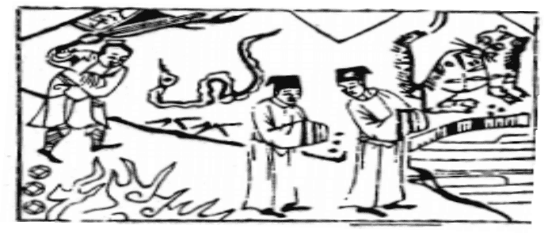

# 43澤天夬

  
此卦漢高祖欲拜韓信為將，卜得之，知有王佐才也。

圖中：

**二人同行，前水後火，虎蛇當道，一人斬蛇，竿上有文字，竿下有錢。**

神劍斬蛟之課 先損後益之象

益之至極，猶水之滿溢，必決出之，夬者，決也，必決而後止。以卦体而言，兌上乾下， 有水之聚高至頂，則潰決也。如以爻而言，五陽在下，陽之長而陰將退，有眾陽決去一陰之象， 故於人間道，則此為君子道長，小人道消之時也。

卦圖象解

一、二人同行：相輔相成，可成事也。

二、前水後火：前險而後明，宜進取象，土生金象。

三、虎蛇當道：虎，有權威之人。蛇—險奸之小人阻道。四、一人斬蛇：勇士也，得名將也。

五、竿上有文字：揚竿而起，正名出師。六、竿下有錢：行動有利也。

七、錢下有火：燒錢狀，主喪服。

人間道

 **夬**：揚于王庭，孚號，有厲。

夬之道，在小人式微，君子道長，必顯於公堂，使人明善惡，故揚于王庭。於此時敬戒之以至誠以命下民，使民戒之，居安思危，隨時生戒懼之心，必無後患。

## 告自邑，不利即戎，利有攸往。

夬之道能於至善，必不尚武力，從修已開始，齊家後能治國，以道服眾，如此則可進而往。

## 彖曰：**夬**，決也，剛決柔也。健而説，決而和。

五陽去一陰，下健而上悦，乃因健而能悦，能和，此決道之至善。

## 揚于王庭，柔乘五剛也。孚號有厲，其危乃光也。

陰居陽上，此不正也，君子去之，當揚其罪於公堂，使民眾知善惡也。以衷心至誠帶領民眾，使知戒懼，防危之至，君子之道方可顯其力大。

## 告自邑，不利即戎，所尚乃窮也。利有攸往，剛長乃終也。

夬之時，不可崇武以力取，必須從修治本身之地起，方可有利前進光大君子陽剛之道，待正道至剛時，決不可留一邪吝之道，此剛進至終可吉也。

## 象曰：澤上於天，**夬**，君子以施祿及下，居德則忌。

水之聚而上於天，為夬象，其終必決於上，而灌溉於下，君子觀象法天，故知必施祿於天下，則民皆向之，於安處之時，知須防禁，則無潰散之虞。

## 初九：壯于前趾，往不勝爲咎。

在下位剛健之人，於決之時，必強進執行， 如執行中受阻而失敗，必決之過，故凡事欲動之前，必戒之在燥，做最壞之打算，方可行進。

## 九二：惕號，莫夜有戎，勿恤。

君子去小人之時，必思懷戒備，不鬆懈一時，如此即令夜有兵戎，亦不驚也。

## 九三：壯于**頄**，有凶。君子**夬夬**， 獨行遇雨，若濡有慍，无咎。

九三居相位，上有君王，卻剛於果決，此決乃自任之決，必非合君意，果必招凶。故君子居夬之時，知己道之長，小人之道將消，必不獨與小人合，且面現愠色，必可無咎。今人皆自以為重要，見人之招凶，不論其因為何， 一律給予支持，此愚善之表現，徒令小人得逞， 不知反悔，反更盛其勢，此禍之端，乃肇因於人之愚善。

## 九四：臀无膚，其行次且，牽羊悔亡，聞言不信。

陽居陰位，乃示剛決不足之人所犯之過， 陽剛正理已明極時，如己之果決不足，必招居不安，行進又難之狀，若能法羊群之群行特性， 可無悔，但剛決不足之人，令其以柔進，必不能也，故即令告之，本性如此，必不能信用。自古以來，知過能改，知善能用，克己之欲能

## 九五：莧陸**夬夬**，中行无咎。

君為決定之主，居夬之時，必立決，以去小人之道，稟持中正之道，必無災。

## 上六：无號，終有凶。

此陰將盡之時，君子道顯，小人道必消之際，惟比附於君子之道方吉，否則即令不號咷畏懼，亦終獲凶。

## 象曰：不勝而往，咎也。

君子之行，必度量而進，知不可而力求， 必招咎也。小人無此之戒，不量力而進，其果自取其辱。

## 象曰：有戎勿恤，得中道也。

衣有兵戎，不驚憂，乃因自處之善，能行中道，知所戒懼也，故學易之人必知時識勢， 不知如此，惶論精易。

## 象曰：君子**夬夬**，終无咎也。

決必合於正理，君子於當決之時果決之， 終不至咎。常人须戒，在不明狀況之前，不做決定就是良策，切不可憑己之所好而蒙決，必害及他人。

如是之人，必剛明者方可做到。

## 象曰：其行次且，位不當也；聞言不信，聰不明也。

此行為受阻，受難，乃居位之人不適其職位。正理之言不信，因其聰聽不明也。

## 象曰：中行无咎，中未光也。

人能中心至誠，必決之無過也，但人心皆有私慾，一旦涉及私欲，必不能光大中道。

## 象曰：无號之凶，終不可長也。

如示人號咷畏懼，仍招凶，此道必不久也， 故君子思去小人之道，非斬盡小人也。

