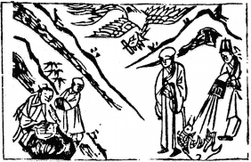

# 45澤地萃

  
此卦韓信被呂后疑惑，卜得知，果被其戮也。

圖中：

**貴人磨玉，一僧指小兒山路，一人救火，一魚在火上，一鳳啣書。**

**魚龍會聚之課 如水就下之象**

==物相遇而後，`同氣相求，則生聚象，萃，聚也`。物相聚成群，為萃，故次姤卦之後也此卦， 澤上地下，水之聚象，水之在地上，乃方聚之時也。==

# 卦圖象解

一、貴人磨玉：進修也，專心一致也，免破損也。

二、一僧指：指引也，局外人也，光頭人也，曾姓人也。   

三、小兒山路：退引山林，以退為進象，示上坡也。倪姓。  

四、一人救火：救災禍也；猶行醫濟世救人之道也。

五、一魚在火上：得救狀，或餐飲業。  

六、一鳳啣書：喜訊至也。

# 人間道

**萃：亨，王假有廟。利見大人，亨，利貞。用大牲吉，利有攸往。**

==人之至誠專一莫過於宗廟祭祀之時，王者能令天下之人其心專一，莫過於利用宗廟，故聖人制祭祀之禮以養民之德。此聚之義大也。民聚之時，能得賢才，則必聚而正，如不正，治之不以正理，則亂之生亦由人之聚，故聚必以道，非正之道，即令有聚，亦不能安處也。於聚時祭禮用大牲厚禮，乃示慎重且富是天下必同之，今人聚而人不能亨其豐盛，則必散也。是故古今皆然，凡能與大功立大業之人，第一必得其時，第二必聚而後能用，此動必吉，天理莫及此也。==

## 彖曰：萃，聚也，順以説，剛中而應，故聚也。

萃卦，乃上悦下順之象，上位以中道用民，合於民心，下又能順從於上之政令且又剛陽相應，堅心赤誠如此，必能聚天下之人才。

## 王假有廟，致孝享也。

王者要有聚民心之道，必立宗廟以示孝順之至誠，能順天下之人心，必以孝方成。

## 利見大人亨，聚以正也。

聚之以正道，必能得人才治之，乃因其正也。

## 用大牲吉，利有攸往，順天命也。

祭祀時用厚禮祭天，必可有為，此順天命也。

## 視其所聚，而天地萬物之情可見矣。

天地萬物間皆有聚，有動，有散等，聖人觀象，可見萬物之情性也。

## 象曰：澤上於地，萃，君子以除戎器，戒不虞。

澤上於地，為集聚之象，君子知始戒之慎，故眾民相聚之初，就也生戒，因眾聚必有爭， 私心所成，故先除兵械，乃能戒而無虞。

# 初六：有孚不終，乃亂乃萃，若號， 一握爲笑，勿恤，往无咎。

聚之始，柔居之，陰柔之人，必無法堅守正節，為求與人同而捨其正道，但為求同，此不終之戒。人心必亂，同氣相求而生聚，或哀號作苦以求相應，其果必為眾人之笑柄，若能堅心往從陽剛正道，必無過咎，否則成小人矣。

## 象曰：乃亂乃萃，其志亂也。

若人之心志受人惑而亂，必不能固守節志，乃失其正道也。

# 六二：引吉，无咎，孚乃利用**禴**。

二之位與五相對應，位雖有差距，此時乃當聚而未及合之時，如能相引聚則可無咎，此因其中正之德未變，如德變，則必不相吸引。故於群小人聚時能獨立其間，且與上位之德同，必能合，此其意也。即令不重外飾，專以至誠，則終必合矣。

## 象曰：引吉无咎，中未變也。

萃之時，以能聚為吉，同志相求，平安， 其位有差距，因中正誠心同德必能無咎。

# 六三：萃如磋如，无攸利，往无咎， 小吝。

不正之人，求能與人聚合，但人皆不應， 為人棄絶，上下皆不應，唯退求事外之賢與之相應，如此則可無咎。人之動有求，即令得之， 亦可羞也。

## 象曰：往无咎，上巽也。

上六居柔之極，故能往而無災。

# 九四：大吉无咎。

九四之位，能以陽剛，與君位對應，得君臣之萃，下又得群陰之聚，此上下能因其陽剛而聚，此至善也。

## 象曰：大吉无咎，位不當也。

能有吉且無災之果，即令位不當，因上下與已合德，故也。

# 九五：萃有位，无咎。匪孚，元永貞，悔亡。

九五居天下之尊，有萃聚天下之力，則無災，此時必自修其德，正其位，處不以私，為得其位也。如有人不信而未能歸從，當自省是否不正，堅固中正不變之德性，則無不歸矣。

## 象曰：萃有位，志未光也。

為王者，必以誠信以示天下，如此方有感於民，則人莫不歸矣。如仍有不從，乃已之志未能光顯也

# 上六：齎咨涕洟，无咎。

小人居高位，求人與其聚，而人皆不與，此可嘆也，人之棄絶，實出於已，怎可歸咎他人

如再不知自省，反嗟嘆而致涕泣，此小人狀也。

## 象曰：齎咨涕洟，未安上也。

小人之對人皆因貪而失所宜，以致终窮困，此起因於不能安居其位也

