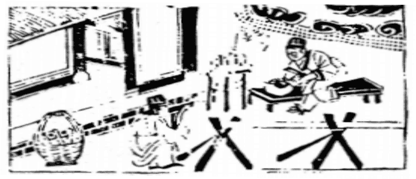

# 46地風升
  

此卦房玄齡去蓬萊採葯未回，卜得知，主不在也。

圖中：

**雲中雨點下，木匠下墨解木，一人磨鏡，一架子有鏡**

高山植木之課 積小成大之象

萃者聚也，聚之後能上，即升也，萬物咸因能聚方可升高，故升次萃也。此卦坤上巽下， 乃木在地下生於地中，長而愈高此升之象也。

卦圖象解

一、雲中雨點下：沾衣恩澤之象，昏暗之時將過也。

二、木匠下墨解木：有尺度法則，有依據之象。匠—將也。以武力去災也有改朝換代之象也。

三、一人磨鏡：可成始得之象。

四、一架子負大木：有不小之財也。

五、有鏡：指明鏡高懸，於商事指有競爭也。六、藍：難也，百廢待與之象。

人間道

 升：元亨，用見大人，勿恤，南征吉。

升之道，在於亨通，用此道来見大人，不靠体恤而能進，必吉。

## 彖曰：柔以時升，巽而順，剛中而應，是以大亨。

柔即順也，順時而升，以柔而進，此升之得時矣，二剛陽之位，得五柔順之君應則能大亨也。

## 用見大人，勿恤，有慶也。南征吉，志行也。

用巽順剛陽中正之道來見大人，必遂心志得升，從不去憂升之不遂，此吉慶也，前進則必升，必能遂行其志也。

## 象曰：地中生木，升；君子以順德，積小以高大。

地中生木，木長而高，此升也。君子觀升象，乃知修身之德，由積累微小，乃至高大，故積不善，則不足以成名，凡學問道德之高，皆由累積而成，升之義也。

## 初六：允升，大吉。

初進時柔順於九二之剛，因得信而升，此升吉也。

## 象曰：允升大吉，上合志也。

與上位之志合，得信而升，此因信於剛中之賢而能大吉也。

## 九二：孚乃利用**禴**，无咎。

九二陽剛之臣，處升之時，因上位君柔， 絶不可矯求外飾，必求以中心之至誠來感通於上，如此則可無咎。

## 九三：升虛邑。

九三陽剛之相，能正而順上，如此而升， 就如入無人之巿，無人抵禦。

## 六四：王用享于岐山，吉 ，无咎。

居諸候之位，能上柔順於君王，下又順天下之賢，舉之升進，於已則柔順謙恭，不求離本位，有德如是，必吉，且無災矣。人之戒， 切記在不可無事而升，升又必量力而進，方合君子之道。今人已不復如此，無功而升，比比

## 六五：貞，吉，升階。

君位之人性柔，必得貞正且固守之德，則人皆信而賢至，能知人善用，必因用賢而能再升，澤及天下也。

## 上六：冥升，利于不息之貞。

升之極乃致昏昧於升，只知進不知止，此為不明，君子之人終日乾乾，無時不警惕自己， 知所進退。小人貪求私慾之心盛，乃生不知進退之行為，凶也。

## 象曰：九二之孚，有喜也。

君臣之道，臣之事君能中心至誠，不但為臣無禍，又可遂行其大志，此可喜也。

## 象曰：升虛邑，无所疑也。

升而如入無人之邑，則此進，必無可疑慮也。

皆是，升之道，如出私欲，必令國致窮困矣。

## 象曰：王用享于岐山，順事也。

居君側之人，因知順時順事，能順處之， 得坤之性，可以無咎也。

## 象曰：貞吉升階，大得志也。

君能任用賢才，如此可致天下大治，故君王升之道在能用賢耳，必遂其志。

## 象曰：冥升在上，消不富也。

昏昧之人已至極上，猶求升之不已，其果唯消亡而已，無復增益也。

