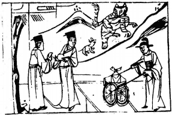

# 49澤火革

  
此卦彭越戰項王絶糧時，卜得之，遂能承恩改革也。

圖中：

**一人把柿全，一人把柿不全，一兔虎， 官人推車，車上一印，在大路上。**

豹變爲虎之課 改舊從新之象

井之為用，在甘潔寒洌，如中有穢物，任其存之必敗，清之則必潔，此乃革之義，故井後， 革為其序。此卦澤在上，火在下，乃水能滅火，火亦能涸水之象，人能外悦而內明，乃革之真義。

卦圖象解

一、一人把柿全，乃人肺腑之言。二、一人把柿不全，一人半真言也。三、一兔：躍進之象。

四、一虎：威權之象，大人之象，肖虎也。

五、官人推車有一印：如為武官，則訟至。今為文官帶印，主得掛印封帥，須力求變革， 果必成。丈夫推車，乃求婚也，帶印必成。

六、虎兔向山行：賢良大人退，後繼有人躍進同行。七、山頭四點：上位之人，黑暗不明之象。

八、大路：轉變為新且順之象。

人間道

 革：巳日乃孚，元亨利貞，悔亡。

革之道，在變其故舊，始初人必未能遽信，必俟至巳日乃人心信從。革之道在求變故後能亨通，但須誠正利於天下，乃能去故從新，不因有大變而生悔。

## 彖曰：革，水火相息，二女同居，其志不相得，曰革。

水火互息互滅，次女少女同居一室，其志不同，其所歸各異，如革也，有生變異之象。

## 巳日乃孚，革而信之。文明以説，大亨以正，革而當，其悔乃亡。

革之雖變，始初不令人信，但如以正道，日久乃信。能明且悦，則能盡事之理，無事不察， 人心和順，必致大亨，此革之至當，必不生悔。

## 天地革而四時成，湯武革命，順乎天而應乎人，革之時大矣哉！

天地有變革後，乃能生成四時寒暑，萬物因其時節而生。王者之與，能上順天命，下應人心，改舊去新，得易之神，此革之時義大也。

## 象曰：澤中有火。革，君子以治歷明時。

水火相消滅，為革道，除舊佈新，君子觀革之象，乃知推演歷數，知日月星辰之變，以明四時之序，則終能合於天地。

## 初九：鞏用黃牛之革。

變革之事為大事，必有時機，有人才，有其地位，謀慮而後動，則可無侮矣。猶如用黃牛之皮來侷束，但求自固而守，不求任意妄動之義。

## 六二：巳日乃革之，征吉 ，无咎。

陰居陰位，乃得才適用之時，此際足以去天下之弊乃上輔於君，行其正道而革之，吉而無災也。

## 九三：征凶，貞厲。革言三就，有孚。

九三相位，居下卦之上，上有君，於此以陽剛之勢而力革時，乃過於燥動，行之必有凶。但如慎戒敬懼，守貞正之道，知順從公論，行革不為人疑出於私利，則吉，因眾必孚服而順。

## 九四：悔亡，有孚，改命，吉。

此即以剛處柔位，近君側之人，剛柔互濟， 於革之時，行以至誠，致令上信下順，其吉必矣。

## 九五：大人虎變，未占有孚。

九五至尊之君，能以中正之道，居革之時， 乃能力革之，其必昭著天下，不須占決，知其行為之至當，天下必信。

## 上六：君子豹變，小人革面，征凶， 居貞吉。

革之終時，君子必從革後而大變，於至善， 小人昏愚難變，即令心智未化，但其面已改， 從上之教導。天下之事於始革必艱難，至革成， 則患無法自守，故於此須戒之守貞堅志，則果必 吉 。

## 象曰：鞏用黃牛，不可以有爲也。

初革之時，但求能自固守其位，不可妄求有功。

## 象曰：己日革之，行有嘉也。

時至人信乃革之，動則有喜慶。如時至而不動，則必無濟世之心，必因失時而生悔矣。

## 象曰：革言三就，又何之矣。

革之道經再三察合，知順乎天理，乃事之至當，何須再往呢？

## 象曰：改命之吉 ，信志也。

能改命致吉，必上下能順從信服方成，因至誠感召也。

## 象曰：大人虎變，其文炳也。

事理之明如虎紋之明盛，則天下無不信服。

## 象曰：君子豹變，其文蔚也。小人革面，順以從君也。

君子變革後，其更精進，如文采之蔚盛。小人因於革，不敢為惡，唯外飾臣服，以從君道，此革道成功矣。

