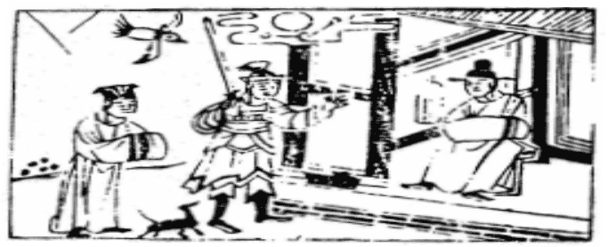

# 50火風鼎

  
此卦秦君卜得之，乃知得九鼎以象九州也。

圖中：

**雲中月現，鵲南飛，一子裹席帽，一人執刀，貴人端坐無畏，一鼠。**

調和鼎鼐之課 去故取新之象

能使物分隔，為鼎，故鼎之用在能革物，能使水火不同之物相合，易生為熟，易堅為柔， 使相合而不相害，此革物之功也，故鼎為革之序卦。此卦上火下風，乃木入火中，烹飪之象， 鼎之象即此。為器之大用。

卦圖象解

一、雲中月現：顯象，撥雲見月之象，清明也。二、鵲南飛：冬至來臨，北人執政。

三九一

三、一子裹席帽，不明之人，無知之人。果喜也。四、一人執刀：武官也，護衛將軍。

五、貴人端坐無畏：君王，老闆等人，至公無私。 六、一鼠：子年，暗謀之人，內有陰謀，肖鼠人也。

人間道

 鼎：元吉、亨。

鼎之道，能使不合之物相合，故必吉亨。

## 彖曰：鼎，象也。

鼎之為器，法自象也。古人以方代表實且正之象。兩耳對峙在上，三足分峙於下，周圓內外，皆有法而正，成安重之象。

## 以木巽火，烹飪也。聖人亨以享上帝，而大亨以養聖賢。

用木就火，烹飪之象，鼎器人賴以生，故聖人以鼎享上帝，用大亨以享聖人。

## 巽而耳目聰明，柔進而上行，得中而應乎剛，是以元亨。

人能如卦才，外明內順，上之頭面能中虛為明，乃耳聰目明之象，柔乃在下之物，能進上位，以明居尊，得乎中道，而陽剛之道相應，此乃元亨之因也。

## 象曰：木上有火，鼎，君子以正位凝命。

木之上有火，生火烹飪之象為鼎，君子觀象，知法象器，形體端正且安重，以正其位也

## 初六：鼎顚趾，利出否。得妾以其子，无咎。

初六乃最下之位，與四爻相應，今居鼎時， 有如趾之向上，顛也。鼎覆則趾顛，此非順道， 反道而行之理，利於天下敗壞之時，乃可為也。居卑下而從陽如妾，妾之從夫，則可無咎。

## 九二：鼎有實，我仇有疾，不我能即，吉。

二位為中位，以剛居中，乃鼎中有物之實象，但於陰位，有能才而密比於陰之意，居此當求己之守正，不求於人，使之能求於我，則不正亦终就之，此吉也。

## 九三：鼎耳革，其行塞，雉膏不食， 方雨虧悔，終吉。

九三相位，陽剛居之，乃正位，然五位之柔君不能與合，不信用之，其行必阻塞，道必不行。有才而不能得君祿命任用之時，君子必內其德，守其正道，終必吉。

## 九四：鼎折足，覆公**餗**，其形渥， 凶。

四為君側之位，與初下爻相應，乃示初陰柔之小人不可用；其不勝任而敗事，猶鼎足折也。居大臣之位，所用非人，至於覆敗，此不勝任，其凶可知。成因在於任不適之才，必來

## 六五：鼎黃耳，金鉉，利貞。

鼎之主在耳，執耳之意，有陽剛之體，又得其位，才必充實，乃能為大用，至善矣。

## 上九：鼎玉鉉，大吉，无不利。

鼎之終，功成也，玉為剛而温，居成功之項，唯小心善處，剛柔適用，動靜不可過，乃生大吉。無所不利也。

## 象曰：鼎顚趾，未悖也。利出否， 以從貴也。

鼎顛覆趾在上時，背道而行，只利天下敗壞之際，棄惡而從貴也。

## 象曰：鼎有實，慎所之也。我仇有疾，終无尤也。

鼎之有實，猶人之有才，必慎擇趨向，如往之不慎，必有對立之事，於此能自求守正， 則彼必不能影響我，亦可無過矣。

## 象曰：鼎耳革，失其義也。

有才居相位，與君之念不合，乃失其義也， 但上能明時，下之才必有能用，故吉。

自私心作用。

## 象曰：覆公餗，信如何也。

當大臣之人，須成天下之治，如任人之不當，以招不信，乃誤也。

## 象曰：鼎黃耳，中以爲實也。

能執鼎耳之才，乃由其得中道也。

## 象曰：玉鉉在上，剛柔節也。

鼎以能終為功成，致成功之地，以剛柔之並用，有法度之，無不利也。

