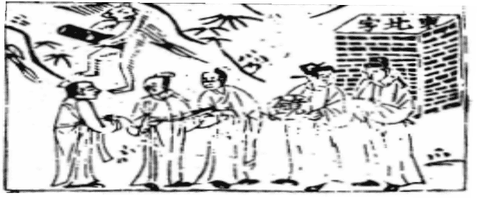

# 52艮為山

  
此卦是漢高祖困榮陽時，卜得知，只宜守舊。

圖中：

**猴上東北字，猴執文書，官吏執鏡，三人繩相繫縛**

游魚避網之課 積小成高之象

震乃動也，物之動其終必止，艮，止也，故為震之序卦。此卦上下皆艮，艮為山，故有安重堅實之象，外內皆止，皆靜，此止於其所也。人能知安於止，則得艮之道也。

卦圖象解

一、堠上東北字：候也，停滯等候也，陳姓。二、猴執文書：候其時，待公文命令至也。三、官吏執鏡：清明之法官，政治清明。

四、三人繩相繫縛：三人相牽連招訟事也。

人間道

 艮其背，不獲其身，行其庭，不見其人，无咎。

艮為止之道，人之不知止，乃私欲作為，背為不見之處，如不能見，則無欲以亂其心志人能忘我，則止矣，今人見利則欲據為己有，失止之道。知止之道，則可無咎也。

## 彖曰：艮，止也，時止則止，時行則行，動靜不失其時，其道光明。

艮之道，言止也，動靜之間不以時，失止之義也，君子貴乎時，時可行則行，時之義於君子，則重視之，人能不失時，知所進退，道乃光明。

## 艮其止，止其所也。上下敵應，不相與也。

艮止之道，其功在能止於適止之所，此唯聖人能成之。此卦上下二體皆為山，有因同而相敵應也，互相背而不相與也。

## 是以不獲其身，行其庭不見其人，无咎也。

相背而不見，行不見其人，則欲無處生則能止，能止則無咎也。

## 象曰：兼山，艮，君子以思不出其位。

上下皆山，故為兼山，乃重艮之象，君子觀艮止之道，知思安於所止，不越其本位。

## 初六：艮其趾，无咎，利永貞。

初六居最下，乃足趾之象，趾乃人動之最先，於始動即知止，必可無咎，且須患己之性陰柔，故戒之在堅心守道。

## 象曰：艮其趾 ，未失正也。

能止於始初，必易，乃不失正也。

## 六二：艮其腓，不拯其隨，其心不快。

陰居陰位，得止之正道，然居二位為猶人之腿肌位，股動則肌動，二雖正道，然受三爻之影響，即中正之道，無法救助於上位時，唯勉而隨之，因言不聽道不隨，故其心不快。

## 九三：艮其限，列其夤，厲薰心。

九三陽剛居陽位，乃意其剛極而使上下分隔，不復進退，其堅強如此，則必造成獨限一隅，而世人不相與，故無法安定其心。故止之道，貴在時宜，行止之間必以時，則吉。

## 六四：艮其身，无咎。

居君側之人，位高權重，然於艮止之時， 當止而不能止，乃因君位過陽剛，不能信孚於臣位之人，居此際，惟自止其身，可無咎，但如臨施政，則生咎矣。意即在上位之人只能獨

## 六五：艮其輔，言有序，悔亡。

人之所當止者，唯言與行，今陰柔居君位， 於止之時，其才不足任此位，如此則須言行一致，不可脱序，古言：君無戲言，即此，故雖己之才不足任此位，但謹言慎行，亦可無慮於敗亡。

## 上九：敦艮，吉。

以剛陽之性居艮之終極，可見其止之道， 性之堅實如此。常人於止之時，難於持久，晚節不保等事常見，人能敦厚知止，如此堅心， 此所以吉也。

## 象曰：不拯其隨，未退聽也。

上位之人，未能從下意，不須救助之，唯隨之可也。

## 象曰：艮其限，危薰心也。

堅固己之剛性，不能因時知進退，必有危懼生其心內也。

善其身，必無可取也。

## 象曰：艮其身，止諸躬也。

居大臣之位，卻只能獨善其身，不能行止之道，乃不適其位也。

## 象曰：艮其輔，以中正也。

君位之人能止於中道，言行不脱序於中正之道，即令無足之才能，亦可免禍故易示人之言行之重要如是。

## 象曰：敦艮之吉 ，以厚終也。

人常於始能行止之道，至終則無法堅持到底，始終如一是易之神，艮致终能吉，乃因其能終守不變。

