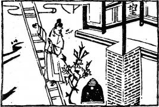

# 53風山漸
  

此卦齊晏子應舉，卜得之，後果為丞相也。

圖中：

**一望竽在爽高處，一藥爐在地，一官人登梯，一枝花在地上。**

高山植木之課 積小成大之象

艮止之後，必有所生，其生乃因前之有止，故此生必渐進，故渐為艮之序。渐，有渐進緩進之意，其進能緩，必有序，而不踰越。此卦上「巽」下「艮」，巽為木，而生於山上，此木之高乃因在山之上，故渐之道在知高之因，在知進退消息之理據。

卦圖象解

一、一望竿在爽高處：家人望歸象。二、 一藥爐在地：平安，無災也。

三、一官人登梯：升官之象，衣錦還鄉也，棺也。四、一枝花在地：落第象，不久之象。

人間道

 漸：女歸吉，利貞。

==渐之道，其有序，且緩進，吾人可於女之出嫁而見之，女歸時，以渐進有序，必吉，且始終如一，更吉。猶臣之入朝侍奉天子亦同，必當有序，如失序則為欺陵主上，必生禍害。==

## 彖曰：漸之進也，女歸吉也。進得位，往有功也。

渐乃論進之道，知進必有序，猶如女之歸夫，必吉。進時能剛柔並濟，適得其位，此進必有功也。進以正，可以正邦也。其位，剛得中也。止而巽，動不窮也。以正道而進，可以興邦正德也。故凡進皆須稟持以正道則吉。正得其位之定義，必以剛中而得，方可謂得位。內止外順，其人之進如此，方可得吉，如進之以欲，乃生燥，必失渐道，阻力乃生，故能做到內無欲， 而外和順，此進方可無窮無盡矣。

## 象曰：山上有木，漸.，君子以居賢德善俗。

木在山上，其高有自，故君子觀渐象，乃知居賢能正德，美化風俗，其能成功，皆歸之在渐，人之錯習，遽改生反，教化之於人，勢必以渐進方可入於人心，此渐之道也。

初六：鴻漸于干，小子厲，有言，无咎。

鴻鳥之以時而遷動，又群聚而生且有序， 此渐也。初陰居卑下，上又無援助，君子知時， 故處之不疑。但小人及無知之人只能見眼前之事，不知患於未來，洞察事理，唯以剛而求進， 失渐矣，進則生咎，不進無災。

## 象曰：小子之厲，義无咎也。

初始時，雖有小人之危懼不安之心，但因於義理仍合，故有無咎。

## 六二：鴻漸于磐，飲食衎衎，吉。

柔居柔位，得中位得當，居渐之時，進必不速，穩若磐石狀，其能安居如此，故可飲食和樂，其吉必然。

## 九三：鴻漸于陸，夫征不復，婦孕不育，凶，利禦寇。

九三陽剛居下卦之上，即將進入上卦，意言，人之將上進之時，理應守正道以得時至， 萬不可以欲而進，以遂私志，此己失渐道，猶為求進而不顧於道之夫，婦人受孕不以正，亦不可育同義，此凶即致矣。惟可堅守正道，摒除邪念，可得吉。

## 六四：鴻漸于木，或得其桷，无咎。

此陰柔在高位，下有陽剛欲進之人，必不得安處，猶鴻鳥近於木，立木高處，必不安也， 如能立在横枝上，自處安寧，則可無災。

## 九五：鴻漸于陵，婦三婦不孕，終莫之勝，吉。

鴻鳥所止於至高之地，象君之尊位，此渐之時至，乃知惟下二爻位，可與同心同德，居中之三，四位相隔，猶即令婦人三年不孕，亦無用於事，相隔正道之不正，其終必消，正道必合，惟時較久而已。終吉。

## 上九：鴻漸于陸，其羽可用爲儀， 吉。

鴻能飛於天上，毫無阻礙，人之賢能如此， 進至終極，又不失渐之道，其賢能通達之能可以為表率，猶鴻之羽，可以用禮儀一樣，必吉。

象曰：飲食**衎衎**，不素飽也。

中正之人，得正位，適居之狀，能飲食安樂，心志愉快，不光是飽食而已。

## 象曰：夫征不復，離群醜也，婦孕不育，失其道也，利用禦寇，順相保也。

夫但知征而不知復，乃因欲而失正道，叛離群類，可醜也。婦人之孕乃不正，故不可育也。皆因失其正道，唯利在堅守正道，棄絶邪惡，可因順正道而保平安也。

## 象曰：或得其桷，順以巽也。

此意求平安自寧之道，惟有順於義，行乎正，能如此者，何處會不安呢？

## 象曰：終莫之勝吉，得所願也。

君臣以中正之道相交，其終必合，所願必遂也。

## 象曰：其羽可用爲儀，吉，不可亂也。

君子之進，必有以渐，有序渐循之，乃可以為吉，此進因不失序，故吉，序亂招凶。故可以為禮法而遵循之。

