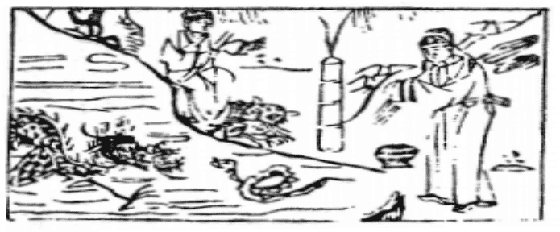

# 55雷火豐

  
此卦莊周説劍，臨行卜得之，果得劍也。

圖中：

**竹简灰起，龍蛇交錯者，官人著衣裳立，一合子，人吹笙竿，腳踏虎。**

日麗中天之課 藏暗向明之象

萬物與人能適得所歸，必能成大，故歸妹之後，受之以豐，豐有盛大之義，此卦上震下離， 有內明外動之象，能以明而動，動而能明，此為致豐之道，是故明而能照，動而能亨，可以致豐大也。

卦圖象解

一、竹简灰起：簡姓，竹有順象，堅節不變之象，灰起，中空之象。二、龍蛇交錯：辰巳之年，正邪相爭，蛇虺乃毒謀暗算也。

三、官人著衣裳立：官人、倌人、丈夫也，藏於內也。四、一合子：先成後破。

五、人吹笙竿：閒情逸志，主喜事臨門。六、腳踏虎：臨危不亂也，險在下也。 七、旱沼之旁：心力交瘁也。

八、池中無水：旱象，破財也。九、珠落盤中：先聚後散也。

人間道

 豐：亨，王假之，勿憂，宣日中。

豐之道，在能致亨通，能令天下百姓致豐，唯王者能。豐之道在令人民繁盛，事物豐發， 有如日中之明，無所不照，則可以無憂。

## 彖曰：豐，大也，明以動，故豐。王假之，尚大也。

豐之道，在論如何盛大，能明而動，必能成豐盛且大也。王者所追求之，為能及天下之大， 致人民以豐，必可永保其治世之道。

## 勿憂宜日中，宜照天下也。

致豐之道，能如日中之盛明，普照天下，無所不及，如此則可無憂，而能保其豐大及永久也。

## 日中則昃，月盈則食，天地盈虛，與時消息，而況於人乎？況於鬼神乎？

日正當中，也有暗時，月滿之後亦有缺虧，天地之盈虛，靠時為消息，更何况乎人？何沉

乎鬼神？此君子戒之在盛，知盛時须戒，方可長久。

## 象曰：雷電皆至，豐，君子以折獄致刑。

電雷並行，乃明動相濟，成豐之象，君子觀明動之象，知用刑制法，在求明與威並行，君子能明則無折獄，慎於用刑。能立威則民服無怨。

## 初九：遇其配主，雖旬无咎，往有尚。

初進之陽剛，居豐之時，知往有豐，雖非有君之對應，但有其左右高位之人能與同志， 此往可吉也，所謂「同舟能共濟也」，此於豐之時，可得無咎也。

## 六二：豐其蘚，日中見斗，往得疑疾，有孚發若，吉 。

六二乃柔將其位，又居明卦之中，為至明之才，但因所遇之君不明，而無法下求於己， 若居豐時，意往而求其君能明己才，必招致猜妒疑惑。惟有盡己之至誠，以求其感而能發，

## 九三：豐其沛，日中見沫，折其右肱，无咎。

九三乃居相位有賢才之人，於豐時，卻不見明主之相應，其日之晦更甚於六二將位，故有如人之折肱無法於行，賢能之人有才，但無法發揮乃因君之不明，故無可歸咎也。

## 九四：豐其薜，日中見斗，遇其夷主，吉。

九四為陽剛之人居君側大臣之位，遇君不明，其賢能陽剛受圍，如日中有缺晦，不得其用，亦無用也，故君子之才須得遇明主，方可有用能成濟世之功。

## 六五：來章，有慶譽，吉。

陰柔居君之尊位，己之才不足，但知用下位章美之才，必有福慶，且有美譽故吉。

## 上六：豐其屋，蔀其家，窺其户， 闋其無人，三歲不覿，凶。

上六居丰極之時，因處動之終，必燥動， 人於丰盛之時，必假謙虛方吉。如不知戒盛， 外丰其居，內不明，暗藏其家，又目中無人， 三年又不知變，一意孤行，终自招凶。

## 象曰：雖旬无咎，過旬災也。

聖人知時之所至，順時而為，能知降己以相求，若懷己之私意，必招患至。

則君之昏蒙可開，如此則吉矣。

## 象曰：有孚發君，信以發志也。

用己之至誠孚實，以求發上之知信，如可成，則吉必至矣。

## 象曰：豐其沛，不可大事也，折其右肱，終不可用也。

豐之時，不見上用，無法成大事，猶人折其肱，終無法受重用。

## 象曰：豐其蔀，位不當也。日中見斗，幽不明也。遇其夷主，吉行也。

有才能卻受圍困，無法致豐，乃位不適當也。豐之時，又有幽暗之處必因君不明，臣位又不適當而造成。惟求遇明主，吉乃可行。

## 象曰：六五之吉，有慶也。

君位能吉，於豐之時，必可有吉慶及於天下。此因君能用才也。

## 象曰：豐其屋，天際翔也，窺其户， 闃其无人，自藏也。

人處豐之極，不知謙卑，目中無人，猶鳥之翔於天際，不知己才之不足，居高自傲，必招人棄絶，其致如此，乃不知自藏也。

