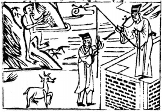

# 56火山旅

  
此卦陳後主得張麗華，卜得之，乃知先喜後悲。

圖中：

**三星者，貴人台上垂釣牽水畔人，一猴一羊，大溪者。**

始鳥焚巢之課 歡極哀生之象

豐至極時，不知戒盛，乃失其居，故序卦為旅。此卦「離」上「艮」下乃外明內止之象， 山為止而不動，火行而不居，有不與同流之意。故為旅象，又人之旅，必外麗，亦旅象。

卦圖象解

一、三星者：三台貴人，相位之人。

二、貴人台上垂釣：君主相求，老闆相求人才。

三、牽水畔人：賢能之人，離野入朝封候。或慕權勢而變志。四、一猴一羊：肖猴，肖羊，候、楊姓人，未申年應之。

五、大溪：脱險也，港口也，水側也。

人間道

 旅：小亨、旅貞吉。

旅之時，此因不同流而旅，故有小亨，且得之堅心，必吉。切不可假旅之道而有私欲其中。

## 彖曰：旅，小亨，柔得中乎外而順乎剛，止而麗乎明，是以小亨，旅貞吉也。旅之時義大矣哉！

旅之時至而旅，乃有亨，人能知所進退，內有中道外又知順於剛，止之在能外麗而內明， 是故有小亨，旅而堅貞其志，是故吉也。當旅不旅乃自求咎。故天下之事，當有時宜，因時而動，其義大也。

## 象曰：山上有火，旅。君子以明慎用刑，而不留獄。

火在山高處，其明及遠，旅之道也。君子觀此明照之象，知明慎以用刑，絶不依持己之明， 必有戒慎恐懼之心而施於用刑。因火行不留，故有不留獄之志，獄乃不得已而設，故不求留獄， 此觀火之行而體悟之。

## 初六：旅瑣瑣，斯其所取災。

陰柔無才之人，居卑下，居旅之時，因才質如此，故必畏畏瑣瑣，其必終自取其辱。

## 象曰：旅瑣瑣，志窮災也。

意志因困窮時，而生變，乃自取其災也。

## 六二：旅即次，懷其資，得童僕貞。

六二乃得適位之將才居旅時，因知中正處不失當，必能懷蓄財資，又能得僕人之忠心， 故吉。

## 九三：旅焚其次，喪其童僕，貞厲。

旅之時，必以柔順謙下為吉，如今自處過剛，又居高，乃招致災困。必失僕人之忠，終有危厲來臨。

## 九四：旅于處，得其資斧，我心不快。

陽剛又居柔位，有用柔之象。人居旅時， 能柔，得旅之道，必吉。此法居旅時可得財货之資助，但不能伸其大志，其心必不快。

## 六五：射雉，一矢亡，終以譽命。

人於旅時，不可有錯，一但犯之，災禍立至。就如射雉，能一箭而中，不虛發即無過失， 能如此，則於旅時，必可立名揚譽。

## 上九：鳥焚其巢，旅人先笑後號

**咷**，喪牛于易，凶。

旅時以過陽剛自處以高，不知謙卑，就如鳥高飛而自焚其巢，故終居無所安處，自負過剛，居旅時，始則可快意盡情，故生笑。繼而失安無居所，故後號咷。牛為順性之物，但也

## 象曰：得童僕貞，終无尤也。

旅行之人，所賴者為童僕，能得其忠心， 必可無災。

## 象曰：旅焚其次，亦以傷矣，以旅與下，其義喪也。

居旅時以過剛自高，手下必喪失忠心，危之至矣。

## 象曰：旅于處，未得位也，得其資斧，必未快也。

以剛居柔，合於旅之道，故旅時為善，但欲得行其志，卻不能也。心必不快。

## 象曰：終以譽命，上逮也。

旅之時，能令上下皆應，則可吉。其因旅之時乃困而未得其安之時為旅。

易於喪失，只一疏忽而己。故凶。

## 象曰：以旅在上，其義焚也。喪牛于易，終莫之聞也。

旅時以居高自處，必不能保安，猶鳥之焚巢，喪失順德極易，待凶至，乃不知自聞知也。

