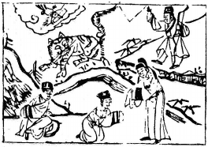

# 57巽為風

  
此卦范蠡辭官入湖，卜得之，乃知越國不久也。

圖中：

**貴人賜衣，一人跪受，雲中雁傳書， 人在虎下坐。一人射虎中箭，虎走。**

風行草偃之課 上行下放之象

巽者，入也。處旅時，親人不在，惟能巽順，方可平安，無所不入。故巽次旅也。此卦一陰居二陽之下，乃有陰順於陽象。

一、貴人賜衣：先破後成象。

卦圖象解

二、 一人跪受：貴綬也。如占疾病，則主壽衣，凶象。三、雲中雁傳書：意外喜訊。

四、人在虎下坐：身處險而不知。五、一人射虎中箭：貴人相救。 六、虎走：脱險，寅年也。

又虎乃有威望之人，利武官，主人在虎邊進退不得之時。亦言虎將須知功成身退，否則暗箭難防，以明哲保身為吉。

人間道

巽：小亨。利有攸往，利見大人。

巽順之道，得之可以小亨。故論柔之順性，能如此，利往進，可見貴人，必助。

彖曰：重巽以申命。剛巽乎中正而志行，柔皆順乎剛，是以小亨。利有攸往，利見大人。

巽之重卦，有上順下亦順象，苟能上順中道以出命，下順命而服從，則必吉。故君子申復命令，乃知巽也。能知順乎剛且中正，即令才不足亦可以小亨。能得巽順之道，必無往不入可出世見大人也。

## 象曰：隨風，巽。君子以申命行事。

物之隨風而動，巽之道也，君子觀巽象，乃知重復申令之重要，能有政令，上隨下以順服， 上下皆順，即重巽之象，為始切實，故重申命令。

## 初六：進退，利武人之貞。

居巽順之時，又處卑下，以陰柔之質，必畏而不安，無所適從，故此時惟利於武官，從武職之人，其巽赈必吉也。

## 九二：巽在床下，用史巫紛若，吉， 无咎。

九二乃示剛居陰位，外又有巽順之象，意即人有過於卑順之時，不是恐懼就是諂媚，皆非正也。但其雖非正禮，亦可遠恥辱，去

怨隙，亦可為吉，就如同用誠意來通於神明之史巫，其誠意能通，亦可無過。

## 九三：頻巽，吝。

九三為下卦之上極，剛居之，有剛亢之質， 居巽順之時，非真能順，乃出於勉強為之，必有所失，失後又頻順，頻順又再失，亦可卑吝也。

## 六四：悔亡，田獲三品。

六四僅乃陰柔居陰，此位居下之上，乃居上位而知順下，人能如此善處，必可不慮亡。猶田之收獲能遍及上下，能如此，何慮悔亡更且有功。

## 九五：貞吉，悔亡无不利，无初有終，先庚三日，後庚三日，吉。

陽居陽位又處君位，此為巽之主，其命令， 必合於中正之道，天下黎民莫不順從。能始終如此，必無往不利，如命令之出，有須變更時， 改始之不善，成終之善，則可變更，其中道，

## 上九：巽在床下，喪其資斧，貞凶。

床，人之所安處也。今在床下，有過於安之義，九為巽極，乃過於柔順，乃喪失剛斷， 必失居所，乃自失也，對正道而言為凶。

## 象曰：進退志疑也，利武人之貞， 志治也。

進退不知所安，其志必疑且懼，故堅心服從，利於武職之人，不生貳心。

## 象曰：紛若之吉，得中也。

人能得中道，亦以至誠，則人必信之，吉而無咎。

## 象曰：頻巽之吝，志窮也。

陽剛之才，本非能順巽，今處重巽之時， 因勢不能遂志，又必須以順，故必有所失，其志必困窮。

## 象曰：田獲三品，有功也。

巽能通於上下，如田之獲，上下受惠，此巽順之功。

必始終如一方可。

## 象曰：九五之吉，位正中也。

九五之尊，能處之吉，乃因能得中正之道， 過與不及皆不善。

## 象曰：巽在床下，上窮也，喪其資斧，正乎凶也。

居上之極本為陽剛，今卻過於巽順，必失正道，為凶道。

