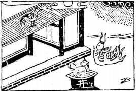

# 60水澤節

  
此卦是孟姜女送寒衣，卜得之，知夫落亡不吉之兆。

圖中：

**大雨下，火中魚躍出，雞在屋上，犬在井中，屋門開著。**

船行風黃之課 寒暑有節之象

渙者散也，物不可以終散，必當節止，故渙之後以節卦為序。此卦「澤」上有「水」，澤為有限之水地，如再置水，當滿不容，故有節制之象。

卦圖象解

一、大雨下：陰暗不明，凶象。

二、火中魚躍：飛騰而徒勞無功，又餐飲業。三、雞在屋上：酉年肖雞人，解救之時與人。

四、犬在井中：招陷，動彈不得，不知節制而招如此。五、屋門開著：仍可開張，须雞人來助大吉。

人間道

 節：亨，苦節，不可貞。

==節之道，在有制，萬事如知節，必可亨。節之貴在中庸，如限制太過則苦，如節至於苦， 必不可常久也，人事如此。==

## 彖曰：節亨，剛柔分，而剛得中。

節之道能致亨通，乃因知剛柔並濟，能剛又且能適中，此節之能亨。

## 苦節不可貞，其道窮也。

如節之致於苦極，必無法堅固守志，則節道必招困窮也。

## 説以行險，當位以節，中正以通。

此以卦才言，外險內悦，以能悦且又知止，此為節之大義，常人於悦時不知止，遇艱險方思止。當位居尊之人如明節之道，必能中正且亨通矣。今人之權力欲望無盡，居尊不思止，悦而無限，終必至凶，乃不知節之道，明矣。

## 天地節而四時成，節以制度，不傷財，不害民。

天地之間有節道故四季分明，聖人觀之知立制度，以為節道，所以必不傷財害民，此法治觀念之始，聖人立此道，即因知人之欲望無限，故以節制之，免流於人治，必因私欲，而終致勞民傷財。

## 象曰：澤上有水，節，君子以制數度，議德行。

澤之容水有限，故節。君子觀之，知節以制度來限制，下定義來區分君子小人之行為。

## 初九：不出户庭，无咎。

陽剛之性居節之初，必不能節，如居門庭之內，則可無咎。

## 九二：不出門庭，凶。

剛陽之性，居陰柔之位，爻義為，處陰且不正之人居當節之時，不知節必合於中道，過與不及皆非節，如此即令不出門庭，亦會招凶。

## 六三：不節若，則嗟若，无咎。

三爻本剛，今陰柔居之，須剛斷而柔性之人居其位，因其柔順，且知自節乃可順於義行， 亦可以無過。

## 六四：安節，亨。

陰居陰位，其正位，於節時，即居高位且有節之象，能安於此，則亨通。

## 九五：節，吉，往有尚。

九五尊位，乃居節時之主位，能甘之如飴， 盡節之道，必吉，功大矣。

## 上六：苦節，貞凶，悔亡。

上六乃居節之極，其必因節致苦，如堅守不改則必凶，終致亡而悔，易之節卦悔亡，與他卦之悔亡，辭同但意不同也。

## 象曰：不出户庭，知通塞也。

不出户庭可以無咎，但須知外之言與行， 必以時來定進退之機。

## 象曰：不出門庭凶，失時極也。

時之義在易中最為重要，不知節之義，又居節之時，失其時，因不合中道之節，過與不及皆不對，即令不出門庭，亦有凶矣。

## 象曰：不節之嗟，又誰咎也？

知節可以免過失，故不知自節而招禍，又能怪誰呢？

## 象曰：安節之亨，承上道也。

能行節之中道，且安居於此，必亨通義。

## 象曰：甘節之吉，居位中也。

君王能知節道，用節且甘如飴，必成大功， 因其居尊位故也。

## 象曰：苦節貞凶，其道窮也。

因節致苦，不知變，失易之神，其凶乃因道之窮盡。

