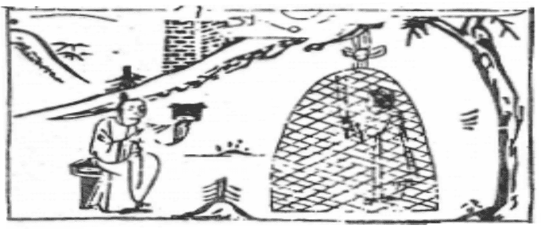

# 62雷山小過

  
此卦漢君有難，卜得之，後果脱險也。

圖中：

**明月當空，林下一人彈冠，人在網中。一人割網，猴子在山頭出。**

飛鳥遺音之課 上逆下順之象

人之有信後必行，行則生過，故小過所以為中孚序也。此卦山上有雷，雷震於高處，其聲必過，故為小過。小過者，可說為小事過，亦可説為過之小也。

卦圖象解

一、明月當空：政清狀，入法庭，刑堂。二、林下一人：林姓人。

三、人陷網中：不得脱身，受束縛。

四、一人彈冠：求去之象，但求去為形，束縛為神，合則有表裡不一狀。五、一人割網：貴人解救，脱困狀。

六、猴子在山頭：從新開始之課(候再出山)。

人間道

 小過：亨，利，貞。

過之意在過其正常也。如矯枉過正，此過為就正意。時不正，用過之道使正，此過之吉處， 吾人須知過之道，知用過之時機方如是。

## 可小事，不可大事，飛鳥遺之音，不宜上，宜下，大吉。

用過之道，乃為求中正。其過之限，可用小事，於大事不可用過。故曰不宜上，宜下，順之則吉，乃過能順理，吉反更大也。

## 彖曰：小過，小者過而亨也。過以利貞，與時行也。

小過之道，在過之小，有時當過，過而能致亨，過之能吉矣。但用過之道，須配合時機， 乃意當過則過，此非真過矣，此為以過養正也。

## 柔得中，是以小事吉也，剛失位而不中，是以不可大事也，有飛鳥之象焉。

小過之道，處小事之過，可得吉。但不可做大事，因剛失位又不得中，故不可以用在大事上，故有飛鳥之象，鳥飛之事小，過而餘音，但無災也。

## 飛鳥遺之音，不宜上宜下，大吉，上逆而下順也。

事之有過，當從其宜。如人之過恭，過哀，過儉，其太過，則不可。其過當如飛鳥之遺音，

其聲出，而身己過，事之過當如是，則吉宜。此順道之過，故也。

## 象曰：山上有雷，小過。君子以行過乎恭，喪過乎哀，用過乎儉。

雷震於山上，其聲至，而雷已過，故為小過，君子觀象，知天下事，有時當過，但不可過甚。故為小過，當過而過，乃其宜也。

## 初六：飛鳥以凶。

陰柔居下位，為小人之象，小人本躁易動， 今逢小過時，乃得理不饒人，其行為之過。必速且遠，救之莫及也，故凶。

## 六二：過其祖，遇其妣，不及其君， 遇其臣，无咎。

二與五爻位，其猶祖之象，今陰柔居其位， 越過三，四位，直與五相應，有越位之戒，今逢該過之時，如過越位，仍不失臣道，亦可無咎。於其他之卦，越過本位凶，但今於小過， 乃意當過之時，可過，無災，切忌失君臣之道，

## 九三：弗過防之，從或戕之，凶。

陽居正位，於小過之時，意味手下無能， 又為陰之小人蒙蔽。此時須過防之。如不加強防範，必招害。君子防小人之道，以正己為先， 堅守正道也。

## 九四：无咎，弗過遇之，往厲必戒， 勿用永貞。

剛居柔位，以剛而用柔，其剛必不過也。故無災咎。剛陽之道居小過時，須戒之隨宜， 不可固守不變，故君子隨時順處，不固守其常也。

## 六五：密雲不雨，自我西郊，公弋取彼在穴。

此陰柔居君位，居當過之時，乃不夠陽剛， 故雖欲過，但不能成功。故猶如密雲而不成雨， 其不成功，即令越過其位向二爻相應，三、四爻位不應，亦如同密雲集中，而無法成雨

## 上六：弗遇過之，飛鳥離之，凶， 是謂災眚。

六居小過之極，居過之極，不顧正理，必違常道，遠矣，故凶，必招人為災害也，此於天理人事皆同。

## 象曰：飛鳥以凶，不可如何也。

過之疾，如鳥之速，必救之不及，無有作為也。

及過之太過，反凶。

## 象曰：不及其君，臣不可過也。

下臣遇须過之時，可過越其上位，但不可至君位，至君前，則太過，過一爻可無咎。

## 象曰：從或戕之，凶如何也。

小人道盛，必害於君子。當防而不防，必傷矣。

## 象曰：弗過遇之，位不當也，往厲必戒，終不可長也。

陽剛居柔位，不當位時，於當過之時，能不過剛反柔，乃得其宜，於自保可也，但終不可成長至盛，故往則有危，須戒之。

## 象曰：密雲不雨，已上也。

陽下陰上，合則成雨，今陰已在上，即令雲再密，無陽而不成雨，終無功也。

## 象曰：弗遇過之，已亢也。

居過之終，失正理之甚，乃過至亢極，故招凶致。

