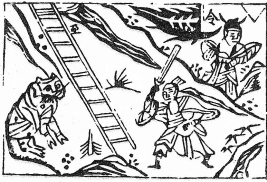

# 64火水未濟

  
此卦孔子穿九曲明珠未徹，卜得之，乃遇二女方始得穿也。

圖中：

**一人提刀斧，一虎坐，一旗卓在山上， 一人取旗，梯子有到字。**

碣火求珠之課 憂中望喜之象

物必不會終盡，故以未濟為易卦之終。既濟為物之終，易為變易而不盡，有生生之意，故未濟為其序。未濟為未窮盡也，此卦，上離下坎，火在水上，互不為用，為未濟之時義。

卦圖象解

一、一人提刀斧：劉姓，武官，手有生殺之權。二、 一虎坐：肖虎人，王姓，虎坐乃無威之象。三、一旗卓在山上：揭竿而起，正義之師。

四、一人取旗：代替也，高姓，宋姓，其人取代之象。

五、梯子有至字：無刀日至，桎梏受困象，六、（附註：峪：谷姓。旗揚：楊姓。\)有谷、楊合乃招凶象。

人間道

 未濟：亨。小狐汔濟，濡其尾，无攸利。

==未濟之時，亦有亨通之道。假如小狐不知慎，逞其壯勇，渡河不知慎，其終必不能濟，故無所利矣。==

## 彖曰：未濟亨，柔得中也。小狐汔濟，未出中也。

未濟之時，能亨通，乃因其柔居中得其時，慎處之於未濟時，可以亨通也。如小狐之果敢於渡河，如不憂其尾濕，必不可脱險也。

## 濡其尾，无攸利，不續終也。雖不當位，剛柔應也。

其進雖勇，因尾濡而不能進，故不利往也。若能慎重處之，剛柔並濟則雖不當位，亦有可濟之理處。

## 象曰：火在水上，未濟，君子以愼辨物居方。

火在水上，互不相交，此為未濟，君子觀象知，乃處不當之象，應慎處事物，辨其所當， 各居其位，止於其所。

## 初六：濡其尾，吝。

陰柔居下位，居未濟之時，求力進猶獸之渡河，必揭其尾，方可渡，此言人不度量其才而進，終必不濟，終招吝鄙也。

## 九二 ：曳其輪，貞吉。

陽剛居將位，有欲動之象，今居未濟之時， 有以剛凌柔水來勝火之象，故須知止，如曳車之輪使其止進，如此可吉。戒之在剛過，如此則犯上，其終必凶。

## 六三：未濟，征凶，利涉大川。

居未濟之時，柔居相位，在下卦之上，有領導之象，但才不足濟，居險而無才足以出險， 如此而行，其必招凶致。惟俟時至，俟上位之才相應，再涉險而出，乃可出險。

## 九四：貞吉 ，悔亡，震用伐鬼方， 三年有賞于大國。

陽剛之賢才，居於君側，上為中虛明順之君，故能濟天下之艱困，能伐鬼方示其力之大， 三年後乃有大功受國封賞。

## 六五：貞吉 ，无悔，君子之光， 有孚，吉。

中虛而明之才居君之尊位，能虛其心任剛賢之相為輔佐，且信任之而不悔，此處之至善， 即令己才不足，但亦由中心孚誠，終必大吉。

## 象曰：君子之光，其暉吉也。

上九：有孚于飲酒，无咎，濡其首， 有孚失是。

陽剛居極，在中虛卦之上，乃示其剛且明， 能如此，則必不生燥，決之以明，明能洞察事理，剛能行事，然居未濟之時，因無可濟之理， 故成樂天順命而已，可以無災。如過於禮法， 濡其首，亂如是，其必不知反省，則示不安於所居也。

## 象曰：濡其尾，亦不知極也。

不度其才而力進，乃不知至極點也。

## 象曰：九二貞吉，中以行正也。

九二能吉，乃因其能得中道，行之正，不過剛，犯上，故也。

## 象曰：未濟征凶，位不當也。

陰柔無能之才居領導之相位，處未濟時， 動必有凶，仍因其位不適。

## 象曰：貞吉悔亡，志行也。

賢相之才，能與時合，且貞固心志，必能吉而不慮悔亡也。

君子之能如是，則其功之光必明且亮，其光盛而吉也。

## 象曰：飲酒濡首，亦不知節也。

飲酒而至於弄濕其首，乃過樂也，必不能安於命，此不知命節制，必失其常理，人能安處劣勢，必能守其心志。此理之至然。

