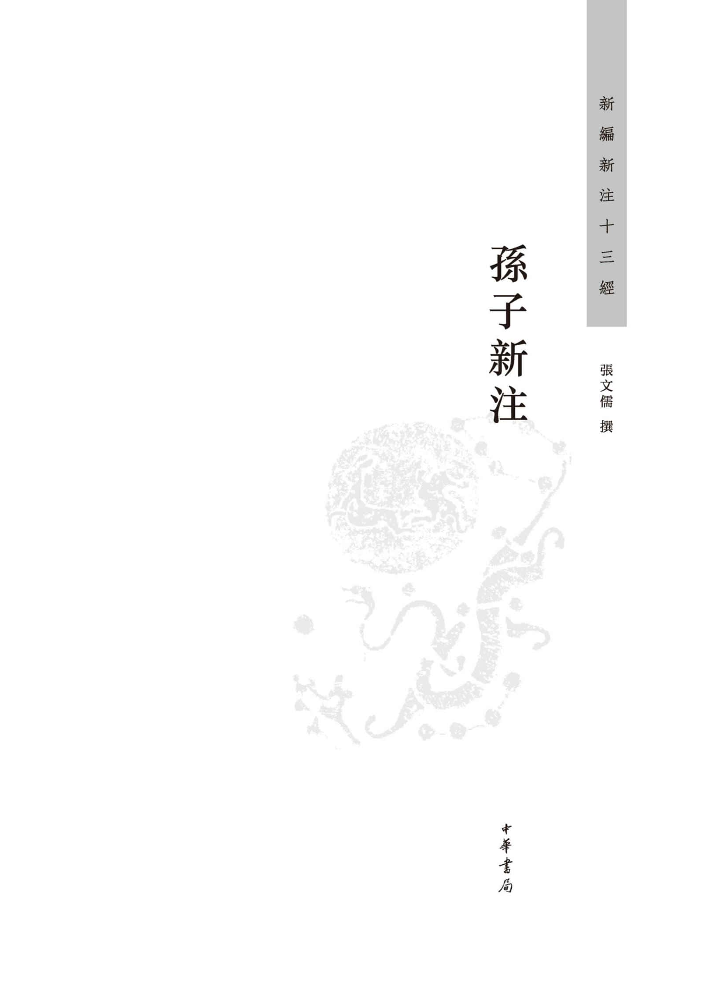

**圖書在版編目（CIP）數據** 

孫子新注/張文儒撰.—北京：中華書局，2018.8

（新編新注十三經/袁行霈主編）

ISBN 978-7-101-13252-6

Ⅰ.孫… Ⅱ.張… Ⅲ.①兵法-中國-春秋時代②《孫子兵法》-注釋 Ⅳ.E892.25

中國版本圖書館CIP數據核字（2018）第109984號

**書　　名** 孫子新注

**撰　　者** 張文儒

**叢 書 名** 新編新注十三經

**叢書主編** 袁行霈

**責任編輯** 朱立峰

**出版發行** 中華書局

　　　　 （北京市豐臺區太平橋西里38號 100073）

　　　　 http://www.zhbc.com.cn

　　　　 E-mail:zhbc@zhbc.com.cn

**印　　刷** 北京瑞古冠中印刷廠

**版　　次** 2018年8月北京第1版

　　　　 2018年8月北京第1次印刷

**規　　格** 開本/880×1230毫米 1/32

　　　　 印張 6 插頁 2 字數 154千字

**印　　數** 1-6000册

**國際書號** ISBN 978-7-101-13252-6

**定　　價** 20.00元

 文前辅文

國家古籍整理出版專項經費資助項目

 新編新注十三經芻議

袁行霈

一

今傳十三經有一個漫長的形成過程，其間經過多次變動。兹將十三經的形成過程作一簡要的論述。

孔子有“六藝”之説，指《詩》、《書》、《禮》、《樂》、《易》、《春秋》  [1]  ；湖北荆門郭店楚墓出土竹簡《六德》，講到《詩》、《書》、《禮》、《樂》、《易》、《春秋》  [2]  ，並未總稱爲“六經”。到西漢有“五經”之説，陸賈《新語·道基》：“禮義不行，綱紀不立，後世衰廢，於是後聖乃定五經，明六藝，承天統地，窮事察微，原情立本，以緒人倫。”  [3]  漢武帝時正式將“五經”立於學官，《漢書·武帝紀》：“（建元）五年（前136）春……置五經博士。”  [4]  五經的排列順序通常是《詩》、《書》、《禮》、《易》、《春秋》或《易》、《書》、《詩》、《禮》、《春秋》  [5]  。東漢又有“七經”之説，見《後漢書·張純傳》：“乃案七經讖、明堂圖……欲具奏之。”章懷太子注：“七經謂《詩》、《書》、《禮》、《樂》、《易》、《春秋》及《論語》也。”  [6]  

唐太宗貞觀七年（633）頒《新定五經》，是經學史上的一件大事  [7]  。此後，太宗又詔孔穎達等撰修《五經正義》，書成，因太學博士馬嘉運駁之，詔更令詳定，功竟未就  [8]  。高宗永徽間又經考正，於永徽四年（653）始頒行  [9]  。此外，唐代還有“九經”之稱  [10]  ，“九經”包括《易》、《書》、《詩》、《周禮》、《儀禮》、《禮記》、《春秋左傳》、《春秋公羊傳》、《春秋穀梁傳》。文宗大和四年（830）鄭覃以經籍訛謬，請召宿儒奥學，校定六籍，勒石於太學，從之  [11]  。文宗大和七年（833）籌備，至開成二年（837）告成，用楷書刻《周易》、《尚書》、《毛詩》、《周禮》、《儀禮》、《禮記》、《左傳》、《公羊》、《穀梁》、《孝經》、《論語》、《爾雅》十二經於長安太學，並以唐張參《五經文字》、唐玄度《九經字樣》爲附麗，共650252字，這就是《開成石經》，今藏西安碑林。宋趙希弁《讀書附志》經類，列《石經周易》、《石經尚書》、《石經毛詩》、《石經周禮》、《石經儀禮》、《石經禮記》、《石經春秋》、《石經公羊》、《石經穀梁》、《石經論語》、《石經孝經》、《石經孟子》、《石經爾雅》，曰：“以上石室十三經，蓋孟昶時所鐫，故《周易》後書：‘廣政十四年歲次辛亥五月二十日。’唯《三傳》至皇祐初方畢，故《公羊傳》後書：‘大宋皇祐元年歲次己丑九月辛卯朔十五日乙巳工畢。’”《石經孟子》下著録：“右《孟子》十四卷。不題經注字數若干，亦不題所書人姓氏。”  [12]  另據宋曾宏父《石刻鋪叙》卷上所云：“《孟子》十二卷，宣和五年九月帥席貢暨運判彭慥方入石，逾年乃成。”  [13]  可知《孟子》列入十三經，應當是北宋。南宋高宗紹興十三年（1143）又刻石經，也增加了《孟子》。清康熙年間陝西巡撫賈漢復在開成十二經之外，又補刻《孟子》，統稱“唐十三經”。十三經的順序爲《易》、《書》、《詩》、《周禮》、《儀禮》、《禮記》、《春秋左傳》、《春秋公羊傳》、《春秋穀梁傳》、《論語》、《孝經》、《爾雅》、《孟子》  [14]  。

明代已有《十三經注疏》刻本。清乾隆四年（1739）有武英殿刻本《十三經注疏》；嘉慶二十一年（1816）南昌府學重刊宋本《十三經注疏》附阮元《校勘記》刻成。後者流傳廣泛，成爲學者使用最廣的本子。

粗略地回顧上述歷史，我們由此可以得出三點結論：

第一，後來儒家所謂的“經”起初並未賦予“經”的名稱和地位。大概戰國中後期有學者尊稱某些儒家典籍爲“經”，如《荀子·勸學》謂學之數“始乎誦經，終乎讀禮”。（楊倞注：“經，謂《詩》、《書》；禮，謂典禮之屬也。”）  [15]  漢初學者陸賈等人以亡秦爲殷鑒，進一步推尊儒家典籍爲經。漢武帝“罷黜百家，獨尊儒術”，儒家思想取得了國家意識形態的地位，“五經”立於學官。自此之後，《易》、《書》、《詩》、《禮》、《春秋》這五部書才被正式尊稱爲“經”。此乃取其“恒常”之義，《白虎通·五經》所謂“經，常也”  [16]  ，《釋名》所謂“經者，徑也，常典也”  [17]  ，代表了漢儒對於“經”的理解。後來劉勰《文心雕龍·論説》云“聖哲彝訓曰經，述經叙理曰論”，是很有代表性的看法  [18]  。正如張舜徽先生在《漢書藝文志通釋》中所云，“古之六藝，本無經名。孔子述古，但言‘《詩》曰’、‘《書》云’，而不稱‘詩經’、‘書經’；但言‘學《易》’，而未嘗稱‘易經’。下逮孟、荀，莫不如此。……況經者綱領之謂，原非尊稱。大抵古代綱領性文字，皆可名之爲經。故諸子百家之書，亦多自名爲經”  [19]  。我們對儒家所謂“經”不必過於拘泥。

第二，十三經是在很長的時間内逐漸確定的  [20]  。在漢代爲五經、七經，到唐代擴充爲九經。其他如《孝經》、《爾雅》、《論語》都是後來增加進去的。而且在宋朝，《春秋》、《儀禮》、《孝經》還都曾一度被剔除出經部  [21]  。《孟子》十一篇在《漢書·藝文志》和《隋書·經籍志》中都屬於子書，到了宋代才歸入經書，從目録學的角度看來，所謂經書和子書的分類本來不很嚴格。既然如此，現在通行的十三經並不是不可調整的。

第三，漢武帝將五經立於學官，乃是將五經作爲學校的教科書。唐代實行科舉考試，則五經或九經又成爲科舉考試的標準用書。那時的朝廷是將經書作爲統一思想、治理國家、推行教化、選拔人才的依據。現在我們研究經書跟古代的出發點已有很大的區别，已不再需要那樣一套欽定的教科書或考試用書，而是將它們作爲中國傳統文化的源頭來研究，這是需要特别加以强調的。

二

今傳十三經全部是儒家的典籍。形成這種狀況，是漢武帝“罷黜百家，表章六經”的結果  [22]  。借用劉勰《文心雕龍》前三篇的標題，可以説十三經以原道、徵聖、宗經爲主線，道、聖、經三者關係密切。我們不禁要問：難道只有儒家的典籍才能稱爲“經”嗎？我們可不可以突破這種局限呢？以筆者的愚見，當初編纂儒家的經典，自然以這十三部典籍爲宜。如果不限於儒家，而是着眼於整個中國文化的原典，那就不應局限於現在通行的十三經。在儒家之外，道家、墨家、兵家、法家也有很重要的地位，應該納入中國文化的經書範圍之内。隨着社會的進步和學術的發展，以弘揚中華民族優秀傳統文化爲宗旨，對現在通行的十三經中所收各書需要重新審視，加以去取。顯而易見，我們今天研究中國傳統文化不應當限於儒家，所謂“國學”並不等於“儒學”，現在早已不是“罷黜百家，獨尊儒術”的時代了！我們應當改變儒家獨尊的地位，更廣泛地吸取各家之精華，以更廣闊的視野繼承和弘揚中國優秀的傳統文化。而這正是《新編新注十三經》努力的方向。從西周到春秋、戰國的幾百年間，是中華文明極其燦爛的時代，其多姿多彩的精神成果不僅體現在儒家典籍之中，也體現在儒家之外諸子百家的典籍之中。我們研究中國傳統文化，要從多個源頭清理中華文明的來龍去脈，廣泛地吸取其中的精華。

基於以上的學術理念，我倡議對十三經重新編選和校注。計劃中的《新編新注十三經》收入以下十三種典籍：《周易》、《尚書》、《詩經》、《禮記》、《春秋左傳》、《論語》、《孟子》、《荀子》、《老子》、《莊子》、《墨子》、《孫子》、《韓非子》，保留原來十三經中的七種，替换六種。

我們充分肯定傳統文化（包括儒家典籍）的重要價值，認爲上述十三種書具有長遠的意義，經過整理可以在今天充分發揮其作用。這是我們仍然沿襲“經”這個名稱的一個重要原因。又因爲“十三經”之稱如同《三字經》、《百家姓》、《千字文》、《唐詩三百首》，無論是學者還是一般讀者都已經習以爲常，而且中國本土文化中時代最早、可以稱之爲文化源頭而又流傳有緒的、帶有綱領性的重要典籍，恰好可以選擇十三種，仍然維持“十三經”的名稱是適宜的。

我們所謂的“經”，與傳統的“經”相比，含義有所同也有所不同。首先，稱“經”有以示尊崇之意，因此，新編十三經，也就是選擇那些在中國文化中具有重要地位的典籍，意在使讀者能够藉此把握中國文化的要旨。其次，“經”有“恒常”的意思，表明這些典籍不僅在歷史上具有重要的影響，而且其深刻、豐富的思想在今天也有值得弘揚之處，在未來仍將具有不可忽視的影響力。第三，我們所謂的“經”具有開放性和多元性，不再封閉於原來那十三種儒家典籍的範圍，這樣可以更全面地反映中華文化的豐富内涵。

接下來就將新增的六種經典作一簡單的論述。

屬於儒家的一種：《荀子》。

荀卿自稱爲儒，《漢書·藝文志》著録《孫卿子》三十三篇，歸屬於儒家，孫卿就是荀子。《韓非子·顯學》篇説孔子以後“儒分爲八”，其中“孫氏之儒”的“孫氏”就是指荀子  [23]  。但荀子的學説與孔子有所不同，他曾遊學齊國的稷下學宫，受到道家、法家、名家的影響。荀子主張“法後王”，又主張人性惡，並在《非十二子》中對子思、孟子等儒家學者進行了激烈的批判。《荀子》未能列入十三經，可能與他的這種思想傾向有關。其實，《荀子》中有不少值得注意的思想資源。其“王道”觀包含着豐富的内容，諸如“隆禮”、“賢能不待次而舉”、“平政愛民”等，都值得重視。其宇宙觀，主張“天行有常，不爲堯存，不爲桀亡。應之以治則吉，應之以亂則凶”，“制天命而用之”，也值得注意。其經濟思想，提出“富國裕民”之道，很有意義。其他如“解蔽”之説，“虚壹而静”之説，以及其音樂理論、教育理論，也都值得進一步發掘整理。至於它對中國歷史文化的影響，譚嗣同《仁學》所謂“二千年來之學，荀學也”一語  [24]  ，值得注意。藴含着如此豐富思想資源的《荀子》，列入《新編新注十三經》是適當的。

屬於道家的兩種：《老子》和《莊子》。

漢武帝“罷黜百家，獨尊儒術”之後，道家的地位雖然比不上儒家，但道家在中國傳統文化中的影響仍然足以跟儒家相提並論，儒道互補成爲中國傳統文化的一個重要特點。在古代已有稱之爲“經”者，特别值得注意的是《隋書·經籍志》著録《老子道德經》二卷，周柱下史李耳撰，漢文帝時河上公注。作爲道家之創始，《老子》一書中包含的樸素辯證法，關於人與自然關係的認識等，對中國文化的各個方面，如哲學、政治、文學、藝術等都有深遠的難以估量的影響。如果没有《老子》，就没有魏晉以後流行的玄學和唐代以後流行的禪學，中國文化就將失去不少多姿多彩的方面。道家關於清静無爲的説法，在戰亂之後社會需要休養生息之際，尤能顯示其在治國方面的重要意義。

郭店楚簡中發現了三種《老子》抄本，抄寫時間在公元前300年左右，雖然均不完整，但仍是目前所能見到的最古老的本子。湖南長沙馬王堆三號漢墓出土了兩種漢初的抄本，即帛書《老子》甲本和乙本，這是目前所能見到的較早的完整的本子。這些出土文獻，爲《老子》一書的校勘注釋和研究帶來了新的契機，已有許多新的研究成果問世。《新編新注十三經》收入《老子》，除原有的傳世《老子》版本外，可以利用楚簡本和帛書本及其研究成果，做出新的成績來。

《莊子》一書乃是莊周及其後學的著作。其内篇所闡述的“逍遥遊”代表着一種人生的理想，倡“無名”、“無功”、“無己”，以求無待，無待則可以得到精神的自由。其所主張的“齊物論”，有助於破除那種絶對、僵硬、呆板、滯塞的思維方式。作爲與儒家相對立的學説，《莊子》豐富多彩而又富於機辯，極具智慧之光芒，使中國文化帶上了靈動、活潑、通透的特點，具有充沛的想象力、創造力以及藝術感染力。在魏晉南北朝時期，莊子學復興，《莊子》與《老子》、《周易》並稱“三玄”，是名士們研習的經典。唐宋兩朝，《老子》、《莊子》還曾被尊爲“經”，並置博士員，立於學官  [25]  。而今《莊子》自然也應當和《老子》一併列入《新編新注十三經》之中。

屬於墨家的一種：《墨子》。

墨家的創始人是墨翟。墨家在當時影響很大，《孟子·滕文公下》云：“楊朱、墨翟之言盈天下。天下之言不歸楊，則歸墨。”《孟子·盡心下》又説：“逃墨必歸於楊，逃楊必歸於儒。”  [26]  孟子的話雖不免有點誇張，但從中仍然可以看出墨學在當時是一種顯學。《韓非子·顯學》就明確地説：“世之顯學，儒、墨也。”  [27]  《莊子·天下》云：“相里勤之弟子五侯之徒，南方之墨者苦獲、已齒、鄧陵子之屬，俱誦《墨經》，而倍譎不同，相謂别墨。”  [28]  《吕氏春秋·仲春紀·當染》稱：“（孔子與墨子）此二士者，無爵位以顯人，無賞禄以利人，舉天下之顯榮者必稱此二士也。皆死久矣，從屬彌衆，弟子彌豐，充滿天下。王公大人從而顯之，有愛子弟者隨而學焉，無時乏絶。”  [29]  可見，在《吕氏春秋》成書之際，墨子仍然具有與孔子同等的地位。直到漢武帝罷黜百家之後，墨家才消沉下來，而且迄今尚未得到廣泛的重視。其實，《墨子》一書中有不少思想資源值得我們發掘，其尚賢、兼愛、非攻、節用、非命等方面的思想，在今天仍然值得重視，而其在邏輯學方面的貢獻，在自然科學方面的論述，也很值得注意。《新編新注十三經》應當列入《墨子》。

屬於兵家的一種：《孫子》。

《史記·孫子吴起列傳》：“孫子武者，齊人也。以兵法見於吴王闔廬。闔廬曰：‘子之十三篇，吾盡觀之矣，可以小試勒兵乎？’對曰：‘可。’”  [30]  《漢書·藝文志·兵書略》於兵權謀家著録云“《吴孫子兵法》八十二篇。圖九卷”，顔師古注：“孫武也，臣於闔廬。”  [31]  中國古代典籍中兵家的著作是一大筆寶貴的遺産，而《孫子》是兵家中最重要的一部典籍。曹操《孫子序》指出其“審計重舉，明畫深圖”的特點  [32]  ，這已不限於用兵。《孫子》不僅有豐富的軍事思想，也有深厚的戰略思維，對人才、行政和經濟管理，乃至外交，都有啓發借鑒的意義。1972年山東臨沂銀雀山西漢墓葬出土的竹簡本《孫子兵法》十三篇，帶動了《孫子》的研究，今天看來，完全有理由將之列入《新編新注十三經》之中。

屬於法家的一種：《韓非子》。

《漢書·藝文志》曰：“法家者流，蓋出於理官，信賞必罰，以輔禮制。《易》曰‘先王以明罰飭法’，此其所長也。”  [33]  在韓非子之前，法家的商鞅重法，申不害重術，慎到重勢。韓非子綜合法、術、勢，成爲法家的集大成者。《韓非子》一書也就成爲《新編新注十三經》的必選經典。

此外，佛教自漢哀帝元壽元年（前2年）傳入中國以來，經過魏晉南北朝這個戰亂時期，在社會上逐漸傳播開來，到唐代取得與儒、道兩家並立的地位。《新編新注十三經》是否選入佛經，成爲筆者反復考慮的一個問題。考慮到新編乃着眼於那些中國本土文化中原生的、時代最早的、處於中國文化源頭的、在當時或後代具有廣泛深遠意義的典籍，而佛經是從印度翻譯過來的，唐代盛行的禪宗及其典籍雖然已經本土化，但時代晚了很多，因此佛經暫不入選爲宜。

三

《新編新注十三經》必須建立在學術研究的堅實基礎上，參考古代的各家之言，充分利用新出土的文獻資料，吸取最新的研究成果，使之成爲值得信賴的學術著作。我們的宗旨是爲讀者提供中華文化的元典，便於讀者從文獻的角度追溯中華文化的源頭，探尋中華文化的要義。編纂這套書是一項重要的文化建設和學術建設工作，對於弘揚中華民族優秀傳統文化意義重大，而且現在編纂時機已經成熟。我們的原則是取精用宏、守正出新。取精用宏對於這套書來説格外重要，因爲歷代的版本和研究成果浩如煙海，我們既要充分掌握已有的資料，又要去僞存真，去粗取精。守正出新是我在1995年主編《中國文學史》時提出來的，實踐證明取得了良好的效果。所謂守正就是繼承優良的學術傳統，所謂出新就是努力開拓新的學術格局，充分吸取新的研究成果，適當採用新的研究方法，使這套書具有時代的特色，以適應時代的要求。

近年來，古籍善本的普查和影印工作有了很大進展。以前的學者看不到的一些善本，我們有機會加以利用，這爲我們選擇底本和校本提供了很大方便，從而使新編工作有了堅實的基礎。自漢代以來，學者們圍繞這些經典所作的校勘、注釋和研究工作很多，成就卓著，爲《新編新注十三經》提供了極其重要的參考。此外，自二十世紀以來特别是近幾十年來出土了大量的文獻和文物，又爲經典的整理研究開拓了新的局面。例如臨沂銀雀山漢墓出土的竹書，長沙馬王堆漢墓出土的帛書，荆門郭店戰國楚墓出土的竹簡，上海博物館藏戰國楚竹書等，都向我們提供了大批極爲寶貴的新資料。由於這些新資料的出現，一些傳世的先秦古籍有了更早的古本，古籍中的一些錯誤得以糾正，古籍中的一些難點得到解釋  [34]  。充分利用這些新發現的資料，可以提高我們的工作質量。

二十世紀之後的學術是在中西文化交流的大背景下展開的。借用西方的哲學、宗教學、文學、史學和人類學等方面的觀念來解釋中國的典籍，已經取得不少成績。陳寅恪先生所謂“取外來之觀念與固有之材料互相參證”  [35]  ，已被證明是行之有效的方法。這也爲《新編新注十三經》提供了廣闊的空間，從而保證了“出新”的可能。

還有一點值得注意，以前的學者整理經書，各有其家法，而且經今古文之争十分激烈，各個門派互不相容；宋儒與漢儒又有所不同。今天我們重新整理，可以超越這類紛争，兼容並蓄，擇善而從，從而取得新的成果。

當然，要想將這套書編好還存在許許多多的困難。一是資料浩繁，要花很多時間才能搜集完備並加以消化；二是每部書都存在不少難點，聚訟紛紜，要想取得進展，提出新見，並經得起考驗，實在很難；三是這套書既定位爲學術著作，又希望有較多的讀者使用，如何在專家與普通讀者之間找到平衡點，需要認真摸索。但是我們相信，依靠參加工作的各位學者刻苦鑽研，虚心聽取各方面專家的意見，集思廣益，反復討論，有希望達到預期的目標。

（原刊於《北京大學學報》2009年第2期）

* * *

[1] 《史記·滑稽列傳》：“孔子曰：‘六蓺於治一也。《禮》以節人，《樂》以發和，《書》以道事，《詩》以達意，《易》以神化，《春秋》以義。’”（《史記》，北京：中華書局1982年版，第3197頁）至於《莊子·天運篇》：“孔子謂老聃曰：‘丘治《詩》、《書》、《禮》、《樂》、《易》、《春秋》六經，自以爲久矣，孰知其故矣；以奸者七十二君，論先王之道而明周、召之跡，一君無所鉤用。甚矣夫！人之難説也，道之難明邪？’老子曰：‘幸矣子之不遇治世之君也！夫六經，先王之陳跡也，豈其所以跡哉！……”（郭慶藩《莊子集釋》，北京：中華書局1961年版，第531—532頁）其中講到了“六經”，但此篇屬於《莊子》之外篇，其時代難以確定，僅録以備考。

[2] 《郭店楚墓竹簡·六德》：“觀諸《詩》、《書》則亦才矣，觀諸《禮》、《樂》則亦才矣，觀諸《易》、《春秋》則亦才矣。”（北京：文物出版社1998年版，第188頁）

[3] 王利器《新語校注》，北京：中華書局1986年版，第18頁。

[4] 《漢書》，北京：中華書局1962年版，第159頁。又《漢書·百官公卿表上》：“武帝建元五年初置五經博士，宣帝黄龍元年稍增員十二人。”（《漢書》，第726頁）《漢書·儒林傳》贊：“自武帝立五經博士，開弟子員，設科射策，勸以官禄，訖於元始，百有餘年，傳業者寖盛，支葉蕃滋，一經説至百餘萬言，大師衆至千餘人，蓋禄利之路然也。”（第3620頁）

[5] 《莊子·天下》篇：“《詩》以道志，《書》以道事，《禮》以道行，《樂》以道和，《易》以道陰陽，《春秋》以道名分。”（郭慶藩《莊子集釋》，第1067頁）或疑此六句爲注文，誤入正文。《史記·儒林列傳》在“及今上即位，趙綰、王臧之屬明儒學，而上亦鄉之，於是招方正賢良文學之士”這段話後所列五經也是這個順序（《史記》，第3118頁）。而《漢書·藝文志》所列順序則是《易》、《書》、《詩》、《禮》、《春秋》。《白虎通·五經》曰：“《五經》何謂？《易》、《尚書》、《詩》、《禮》、《春秋》也。”（陳立《白虎通疏證》，北京：中華書局1994年版，第448頁）《史記·司馬相如列傳》載相如《封禪文》云：“軒轅之前，遐哉邈乎，其詳不可得聞也。五三六經載籍之傳，維見可觀也。”司馬貞《索隱》：“胡廣云：‘五，五帝也。三，三王也……。’案：六經，《詩》、《書》、《禮》、《樂》、《易》、《春秋》也。”（《史記》，第3064—3065頁）周予同《群經概論》云：“六經的次第，今文學派主張（1）《詩》，（2）《書》，（3）《禮》，（4）《樂》，（5）《易》，（6）《春秋》。而古文學派主張（1）《易》，（2）《書》，（3）《詩》，（4）《禮》，（5）《樂》，（6）《春秋》。”（見《周予同經學史論著選集》，上海：上海人民出版社1996年版，第211頁）《樂經》不存，故實際只有五經。

[6] 《後漢書·張純傳》，北京：中華書局1965年版，第1196頁。又，東漢熹平石經，或云五經，或云六經，或云七經，文獻記載不同。王國維《魏石經考一》云“當爲《易》、《書》、《詩》、《禮》（《儀禮》）、《春秋》一經，並《公羊》、《論語》二傳”，見《王國維遺書》二，上海：上海書店1983年版，第376—377頁。

[7] 《舊唐書·太宗本紀》，北京：中華書局1975年版，第43頁。又，《舊唐書·顔師古傳》：“太宗以經籍去聖久遠，文字訛謬，令師古于秘書省考定五經。師古多所釐正，既成，奏之。太宗復遣諸儒重加詳議，于時諸儒傳習已久，皆共非之。師古輒引晉宋已來古今本，隨言曉答，援據詳明，皆出其意表，諸儒莫不歎服。於是兼通直郎、散騎常侍，頒其所定之書於天下，令學者習焉。”（《舊唐書》，第2594頁）

[8] 《舊唐書·孔穎達傳》：“先是，與顔師古、司馬才章、王恭、王琰等諸儒受詔撰定《五經》義訓，凡一百八十卷，名曰《五經正義》。太宗下詔曰：‘卿等博綜古今，義理該洽，考前儒之異説，符聖人之幽旨，實爲不朽。’付國子監施行，賜穎達物三百段。時又有太學博士馬嘉運駁穎達所撰《正義》，詔更令詳定，功竟未就。”（《舊唐書》，第2602—2603頁）

[9] 《舊唐書·高宗本紀》：“（永徽四年）三月壬子朔，頒孔穎達《五經正義》於天下，每年明經令依此考試。”（《舊唐書》，第71頁）

[10] 《舊唐書·儒學傳·谷那律傳》：“谷那律，魏州昌樂人也。貞觀中，累補國子博士。黄門侍郎褚遂良稱爲‘九經庫’。”（《舊唐書》，第4952頁）

[11] 《舊唐書·鄭覃傳》：“覃長於經學，稽古守正，帝尤重之。覃從容奏曰：‘經籍訛謬，博士相沿，難爲改正。請召宿儒奥學，校定六籍，準後漢故事，勒石於太學，永代作則，以正其闕。’從之。”（《舊唐書》，第4490頁）

[12] 以上兩條引文見宋晁公武撰、孫猛校證《郡齋讀書志校證》，上海：上海古籍出版社1990年版，第1086—1087頁。

[13] 然據宋晁公武《郡齋讀書志》“石經孟子十四卷”下所云：“右皇朝席旦（一作‘益’）宣和中知成都，刊石寘于成都學宫，云僞蜀時刻六經于石，而獨無《孟子》，經爲未備。”《知不足齋叢書》本，中華書局影印本第4册，第182頁。

[14] 乾隆《重刻十三經序》曰：“漢代以來儒者傳授，或言五經，或言七經。暨唐分三禮、三傳，則稱九經。已又益《孝經》、《論語》、《爾雅》，刻石國子學，宋儒復進《孟子》，前明因之，而‘十三經’之名始立。”（《御製文》初集卷一一，《影印文淵閣四庫全書》第1301册，臺北：商務印書館1986年版，第101頁）其所言未詳。以上所述，筆者除查閲《郡齋讀書志》及《讀書附志》外，又參考馬子雲、施安昌《碑帖鑒定》，桂林：廣西師範大學出版社1993年版，第358頁；孫欽善《中國古文獻學史》，北京：中華書局1994年版，第332—333頁；王錦民《古學經子》，北京：華夏出版社2008年版，第227頁。

[15] 王先謙《荀子集解》，北京：中華書局1988年版，第11頁。

[16] 陳立《白虎通疏證》，第447頁。

[17] 劉熙著、畢沅疏證《釋名疏證·釋典蓺第二十》，廣雅書局叢書本。

[18] 范文瀾《文心雕龍注》，北京：人民文學出版社1958年版，第326頁。後來有“六經皆史”之説，見清章學誠《文史通義·内篇·易教上》，倉修良《文史通義新編新注》，杭州：浙江古籍出版社2005年版，第1頁。

[19] 《張舜徽集·漢書藝文志通釋》（與《廣校讎略》合刊），武漢：華中師範大學出版社2004年版，第177頁。

[20] 漢代以來五經、七經、九經、十二經、十三經的演變情況十分複雜，本文並非專論經學史，只就其大概而言。

[21] 《宋史·選舉志》：“（熙寧四年）於是改法，罷詩賦、帖經、墨義，士各占治《易》、《詩》、《書》、《周禮》、《禮記》一經，兼《論語》、《孟子》。”（北京：中華書局1977年版，第3617頁）

[22] 《漢書·武帝紀》班固贊語，第212頁。

[23] 參閲王先慎《韓非子集解》，北京：中華書局1998年版，第456—457頁。

[24] 蔡尚思、方行編《譚嗣同全集》（增訂本），北京：中華書局1981年版，第337頁。

[25] 《舊唐書·禮儀志》：“丙申詔……改《莊子》爲《南華真經》。……兩京崇玄學各置博士、助教，又置學生一百員。”（《舊唐書》，第926頁）《宋史》：“丙戌，詔太學、辟雍各置《内經》、《道德經》、《莊子》、《列子》博士二員。”（《宋史》，第400頁）

[26] 朱熹《四書章句集注》，北京：中華書局1983年版，第272、第371頁。

[27] 王先慎《韓非子集解》，第456頁。

[28] 郭慶藩《莊子集釋》，第1079頁。

[29] 陳奇猷《吕氏春秋校釋》，上海：學林出版社1984年版，第96頁。

[30] 《史記》，第2161頁。

[31] 《漢書》，第1756—1757頁。

[32] 曹操等注《十一家注孫子校理》，北京：中華書局1999年版，第310頁。

[33] 《漢書》，第1736頁。

[34] 參看裘錫圭《中國出土古文獻十講》，上海：復旦大學出版社2004年版，第82—90頁。

[35] 陳寅恪《王静安先生遺書序》，《王國維遺書》，上海：上海書店1983年版。

 前言

《孫子兵法》是我國古代一部著名兵法，問世於公元前五世紀，相傳爲先秦大軍事家孫武所著，現已被世界各國公認爲最富哲理性和最具持久影響力的兵法。該書不僅幾千來被兵家奉爲圭臬，也是現代軍事家、政治家、外交家以及企業界精英人士共同享有的智慧寶庫。

**一、孫子其人** 

孫子，姓孫名武，字長卿（有時被尊稱爲孫武子），春秋末期人。其出生年代據推算在公元前550年至前540年之間，略晚於孔子。

司馬遷《史記·孫子吴起列傳》云：“孫子武者，齊人也，以兵法見於闔閭（《左傳》作闔廬），闔閭曰：‘子之十三篇吾盡觀之矣，可以小試勒兵乎？’曰：‘可。’……於是闔閭知孫子能用兵，卒以爲將。”此記叙乃孫武之名始見於史籍。

孫武的祖籍是春秋時之陳國，位於現今河南與安徽間。其七世祖陳完爲該國國君陳厲公之子。由於宫廷内訌，陳完怕禍及自身，逃往齊國  [1]  。齊桓公封陳完爲工正，始改姓田，掌管齊國的手工業生産。田完之四世孫無宇有二子，一爲恒，二爲書。田書被齊景公派去討伐齊之鄰國莒，立有戰功，被王室賜姓孫，食采於樂安（今山東省惠民縣境内。關於孫子的出生地，另有山東省博興和山東省廣饒兩説，備參）。由是，孫氏一家始成爲軍事世家。

及至孫書之子孫憑時，齊發生内亂，爲避禍計，孫憑舉家外遷至吴，約留居於今蘇州附近。當時的孫武據推算近而立之年  [2]  ，但由於其所在國爲齊，齊已是春秋時東方大國，齊桓公又最先稱霸，孫子繼承了本國及貴族家庭兵學研究遺産，加上本人之天才與勤奮，遂完成了《孫子》十三篇這樣的傑作。

相傳，中國父系氏族社會後期部族聯盟首領舜，爲陳國之遠祖。以祖籍論之，孫武應爲舜之後裔。《吴越春秋》載，孫武發怒時“兩目忽張，聲如駭虎，髮上沖冠，項旁絶纓”，可見其性格奔放，有英姿勃發之勢。

孫武至吴國，爲吴王闔閭的謀臣伍子胥所看重，並引爲知己；又在吴王前多次舉薦。孫武得見吴王並極受賞識；經過“吴宫教戰”，吴王確認其是一位能統兵作戰、安邦定國之奇才，遂封其爲將軍，協助王室經國治軍，並令他日夜練兵，準備伐楚。

楚乃春秋時期南方大國。據《左傳·宣公三年》記載，楚莊王曾北上問鼎中原，當時北方的晉採取聯吴制楚之策，使得吴楚兩國長期對峙。公元前五世紀楚昭王即位後，楚實力下降，同時又和唐、蔡等小國不斷發生戰爭衝突，吴王闔閭利用此時機，决定逼楚國决戰。吴軍以三萬人破楚二十萬之衆，五戰五捷，佔領楚國都城郢，這便是歷史上有名的柏舉之戰。

柏舉戰後，孫子掛冠歸隱，莫知所終。然而，他留給後世的一部兵法卻千古流傳。

**二、《孫子兵法》的問世與版本流變** 

《孫子兵法》究竟於何時問世？流傳中有哪些爭論？其版本又有何種變遷？

上面説過，關於孫子的最早記載是《史記》，其中又説到孫子著作爲十三篇。山東臨沂銀雀山出土的漢簡《孫子兵法》，也確證《孫子兵法》在西漢前已經成書；而且，其中的《見吴王篇》，記叙孫武見闔閭事較詳，當爲司馬遷作《史記》時所本。

《漢書·藝文志》根據劉歆《七略》著録了“兵書略”，與“六藝略”、“諸子略”並列。其中説：“自春秋至於戰國，出奇設伏，變詐之兵並作。漢興，張良、韓信序次兵法。凡百八十二家，删取要用，定著三十五家。”《孫子》（《漢書·藝文志》中稱《吴孫子》）十三篇當在其内。

對於《史記》之説，自漢代以至隋唐，從未有疑義；只是在宋以後，有人鑒於《漢書·藝文志》裏所載的《吴孫子兵法》八十二篇和《齊孫子兵法》八十九篇中的後者在《隋書·經籍志》裏未見著録，後又竟至失傳，於是懷疑孫武是否實有其人，或認爲孫武即是孫臏。此説曾引起學界長時間爭論。任繼愈先生主編之《中國哲學史》（第一册）也持此種看法，説：“現存的《孫子兵法》十三篇，歷史上一般都從《史記》的説法，認爲是吴孫子作；但《孫子兵法》所講的戰爭規模比較大，又有騎兵，倒像是戰國時期的戰爭情況。因此，可以認爲它導源於孫武完成於孫臏，是春秋到戰國中期作戰經驗的總結。”  [3]  （按：《孫子兵法》問世時主要是車戰，通篇無“騎”之説。）

但此説爲臨沂漢簡的出土所擊破。此次出土的漢簡中既有《孫子兵法》，又有《孫臏兵法》，兩部兵法的出土證明了《孫子兵法》如《史記》所言，確爲孫武所著。至於前説《吴孫子》八十二篇、《齊孫子》八十九篇，據推斷當爲後學加入的兵學内容，與原著無涉。

對於《孫子兵法》十三篇，歷代注本很多。其中，影響較大的是曹操的注本《孫子略解》。曹操作注時曾讚歎説：“吾觀兵書戰策多矣，孫武所著深矣。”（《曹操集·孫子序》）此注本雖略顯簡約，但語言明快，見解卓越，爲後人所推重。除曹注外，據《隋書·經籍志》載，有關孫子的注本，尚有王凌、張子尚、賈詡、孟氏、沈友諸家；《新唐書·藝文志》又增李筌、杜牧、陳皞、賈林諸家；晁公武《郡齋讀書志》復增紀燮、梅堯臣、王晳、何氏諸家。

就是説，由漢至唐，有關孫子的注本是以曹注本爲代表的諸家注本流傳於世。迄於宋代，吉天保搜集魏曹操，梁孟氏，唐李筌、杜牧、陳皞、賈林，宋梅堯臣、王皙、何氏、張預諸家編爲《孫子十家會注》，成爲孫子注本集大成者。學界大多將吉刊本稱爲孫子學研究的傳本或古本。可惜的是，吉宋刊原本已不可見，現存的有明《正統道藏》本和嘉靖談愷刊本，但多缺文脱簡，難窺其全貌。

與傳本相區别的注本是後起的《武經七書》本，或稱《武經》本。

該書於北宋神宗元豐年間由武學博士何去非校勘，國子司業朱服審定並由國子監頒行，是一套新的武學教本，稱《武經七書》。七書指《六韜》、《孫子》、《吴子》、《司馬法》、《三略》、《尉繚子》、《李衛公問對》。此書的刊行是繼漢代三次兵書大編訂之後的又一次官方修訂，標誌着在古傳本之外出現了一個新的注本，即《武經》本。

《武經》本的出現在一定意義上取代了傳本在兵學研究中的地位，但傳本並未就此消失，而是與《武經本》並存，這樣，就出現了孫子學研究中的兩個系統。

同傳本的狀況類似，元豐年間的武經官刻本也不可見。不同的是，另有一種與它類似的白文大字本（見《儀顧堂題跋》）保存下來，陸心源根據其避宋代諱的缺筆字定爲孝宗時刊本。此白文大字本與曹注本正文幾乎完全相同，刻本原藏陸心源皕宋樓。清光緒年間，皕宋樓藏書被日人岩崎氏購去，存東京靜嘉堂文庫，《武經七書》也隨之流落日本。1935年商務印書館所印《續古逸叢書》本《武經七書》即用中華學藝社借照靜嘉堂所藏皕宋樓故物影覆。

《武經七書》頒行後，宋時未發現爲全部七書作注的版本。元代的刊行本也已不存，到明代時，刊本迭多，但能見到的卻極少。明人爲《武經七書》作注的，最早當推劉寅。其著《武經七書直解》，簡明扼要，見解獨到，可謂同時代注本中之佼佼者。其次有趙本學的《孫子書校解引類》，此書對孫子的思想觀點多有新見。此外，尚有鄭録《孫武子十三篇本義》、陳天策《孫子斷注》、李贄《孫子參同》等，也都對《孫子》學説作了有價值的解讀。

現在的問題是，吉刻本的《孫子十家會注》本來是十位注者，何來《宋本十一家注孫子》中的十一位注者呢？

原來，《宋本》所謂十一家指曹操、李筌、杜佑、杜牧、王皙、張預、賈林、梅堯臣、陳皞、孟氏、何氏。其中包括了杜佑，是唐代注家中的一位。據考，杜佑没有專門注《孫子兵法》，只是在《通典》的引文中附以自己的意見。鑒於此，他被列於十家之外。余嘉錫《四庫提要辨證》説：“自曹操至何氏，實十一家。鄭友賢謂之十家者，蓋注中引及杜佑，乃《通典》之説，佑本不注《孫子》，去佑不數，則只十家耳。”本書以《辨證》之説爲是。

上面説過，吉輯《孫子十家會注》原刊本已不可見，它與後來發現的《宋本十一家注孫子》又是何種關係呢？

現有《十一家注孫子》約刊於南宋寧宗時，初見録於尤袤《遂初堂書目》，此書曾經清代内務府收藏，並經《天禄琳琅書目》著録。其中有十一家注者名，並附孫子本傳和鄭友賢撰寫的《孫子遺説並序》。一般認爲，《十一家注》就是《宋史·藝文志》所著録的吉天保輯《孫子十家會注》；至於爲什麽十家變爲十一家，已如前述。

《孫子十家會注》本未見元刻。明正統年間，刻入《道藏》（南藏），涵芬樓於民國初年予以影印，是爲通行《道藏》本。

上述兩大系統的版本，即《宋本十一家注孫子》和《武經》本，除了在篇名（如《武經》本標爲“始計第一”，《十一家注》標爲“計篇”；《武經》本爲“軍形第四”，《十一家注》爲“形篇”），及正文表述中若干差異外，其餘的注文基本相同。兩種版本可相互補充與印證，並無彼此排斥之處。

需要補充説明的是，在中國古代，尤其宋代以後，儒家作爲主流意識形態，逐漸滲透於一切方面，作爲兵家的孫子，常常被看作異端，無形中受到貶抑。此時期有新的注者零星出現，但未形成大的氣候。清代中葉有較大變化，就是孫星衍新校本的出現，使孫子的研究又熱絡起來。

孫星衍（1753—1818）是清代經學家。他以《道藏》中的集注本爲底本，另與《通典》、《御覽》等幾部書對照，對孫子十三篇正文進行了勘定，對傳本注家編排次序上的錯亂也作了訂正，並依據《宋志》直題爲《孫子十家注》。該本的出現，預示着《十家注》——《十一家注》——的注本系統取代了《武經》本系統在孫子兵學史上的地位  [4]  ，而且，在一定程度上，掀起了另一次學習與研究孫子的熱潮。這個注本成爲清中葉以來流行最廣也影響最大的孫子書。由於學術資料的散失（如孫未看到《宋本十一家注孫子》）和學術觀點上的某些差異，該注本也存在若干不確與武斷之處，但總體上説，它的推出是該時期孫子研究中的突破性成就，爲後人研究孫子提供了一份可貴的資料。

據專家考證，與孫校本同時或稍晚，尚有鄭達《孫子坿解》、鄭端《孫子匯徵》、魏源《孫子集注》（謹有序文存於《古微堂外集》中），以及王念孫、汪宗沂等人，對孫子學説也進行了有價值的探索  [5]  ，但傳播範圍有限，影響甚微。

**三、《孫子兵法》的軍事思想概要** 

《孫子兵法》共十三篇，由《計篇》始，至《用間篇》終，近六千字，可謂言簡意賅，令人回味無窮，對用兵之各側面，諸多環節，論述得細密而周全。書中所提若干戰略原則，至今仍具有重大的意義。

《孫子兵法》裏的軍事思想，既廣且深。概而言之，孫子是從實戰需要出發，提出了諸如“知彼知己者，百戰不殆”、“道、天、地、將、法”、“先爲不可勝，以待敵之可勝”以及“奇正之變，不可勝窮”等諸多重要論斷，包舉了從戰略構思到戰術技巧等各個方面的豐富内容，成爲後世兵家取之不盡的智慧寶庫。

“知彼知己者，百戰不殆”，是該兵法裏膾炙人口的名言，它指明了戰爭指導者對敵我雙方情況的瞭解，是戰爭中取勝的先决條件。所謂雙方情況指“道、天、地、將、法”五事，即五種决定戰爭勝負之因素，曾被譽爲“武經之綱”。意思是：假如這五方面都勝過對方，便可興兵作戰，有取勝把握；假如其中一項或兩項不合乎要求，又無相應之補償辦法，便不應興兵，即使興兵，也難以致勝。

“先爲不可勝，以待敵之可勝”，及“不可勝在己，可勝在敵”，是孫子對於戰爭的一種獨特看法，即“自保而全勝”（《形篇》，以下凡引用《孫子兵法》一書時，只舉篇名）。辦法是：先使自己立於不敗之地，後尋找破敵之機，集中優勢兵力，全面擊敵。故而他又强調説：“故用兵之法，無恃其不來，恃吾有以待也；無恃其不攻，恃吾有所不可攻也。”（《九變篇》）

“不戰而屈人之兵”是指：爭取以不流血的鬥爭方法，迫使敵方屈服，也就是孫子説的“兵不頓而利可全”，即不損傷我方的兵力、物力，也不破壞敵方的兵力、物力，從而最大限度地避免“用兵之害”。爲此，他詳舉戰爭之所費，陳利害之端，拳拳以速勝爲勉，以久暴爲戒，認爲殺人不事戰攻之力，不假歲月之久，惟於萬全爭於天下；並指出，所謂攻城拔寨等武裝衝突的辦法並非戰爭的理想形式，只是不得已而爲之。

“三軍之衆，可使必受敵而無敗者，奇正是也。”（《兵勢篇》）此論斷將“奇正相生”，即特殊打法與一般打法的交替使用與並用，視爲作戰的基本模式，乃兵學史上的創舉。

從世界軍事史的角度觀察，《孫子兵法》也屬上乘之作。英國著名的戰略問題專家利德爾·哈特在爲《孫子兵法》（英文版）作序時曾對孫子思想與西方的克勞塞維茨的軍事理論作了對比，他説：“孫子的現實主義和中庸思想與克勞塞維茨的强調理想主義和絶對觀念的思想形成了鮮明的對比。”又説，《孫子兵法》不只是“關於戰爭藝術的最早的論述，就其對戰爭論述的廣泛性和對戰爭藝術的理解深度而言，到目前爲止尚没有被超越”  [6]  。這一評論是中肯的。

還應特别指出，《孫子兵法》的主旨並非好戰，是慎戰與止戰。原因是：戰爭會造成人力、物力和財力的大量消耗和士兵與百姓的衆多傷亡，往往是卒計其所獲之數，不足以補所喪之多。所以，一國的君主和將領在决定用兵時必須慎之又慎。《孫子兵法》一開頭就强調説：“兵者，國之大事，死生之地，存亡之道。”（《計篇》）最後兩章，又不無感慨：“夫戰勝攻取，而不修其功者凶，命曰費留（白費力氣）。故曰：明君慮之，良將修之。非利不動，非得不用，非危不戰。 主不可以怒而興師，將不可以愠而致戰。合於利而動， 不合於利而止。怒可以復喜，愠可以復悦，亡國不可以復存，死者不可以復生。故明君慎之，良將警之，此安國全軍之道也。”（《火攻篇》）

孫子由教人善戰，進而主張“非戰”和“不戰而屈人之兵”，最終教人慎戰，充分表現了作爲軍事思想家所具有的人道主義精神，也證明了中華民族絶非是一個好戰之民族。

**四、《孫子兵法》的哲學智慧與人文底藴** 

人們會問：爲何一本誕生於兩千五百年前的著作，經受時間長河之水的沖刷蕩滌還青春永駐？又爲何作爲兵學著作的《孫子兵法》，推廣於其他非軍事領域還屢試不爽？這就不能不讓人們仔細地探尋它所體現的哲學智慧與人文底藴。

從哲學智慧説，《孫子兵法》藴涵了中國古代思想家的抽象思維、樸素的整體性思維和辯證思維，奠定了堅如磐石的哲學基礎。

人們看到，《孫子兵法》中的許多概念是高度抽象化的。如他説的“道”，既可以是道義，又可以是道路、軌道，還可以指實情或原因、緣由、行爲準則等。他説的“勢”，也有很大的包容性，可以指戰爭形勢，也可以擴及政治形勢、經濟形勢及心理態勢等。其他如“形”、“數”、“虚”、“實”、“動”、“靜”、“知”、“計”、“智”、“力”、“爭”、“節”、“時”、“險”等概念莫不如此。惟其爲抽象，便有了普遍的適用性。中國古人評論《孫子》一書是“捨事而言理”，此“理”便是指中國哲學中最一般的概念，也即是抽象思維的成果。

中國古代哲學也極重視整體思維。前面曾説過，孫子在概括戰爭的要素時，提出過道、天、地、將、法五項内容，稱之爲五事。意思是：判斷戰鬥力的强與弱，决定某一場戰爭可以打還是不可以打、打的後果會是什麽，不能單獨地看其中的一項或兩項强還是弱，而要看所有要素的强弱及其組合狀況。這種特有的思維方式，可名之爲樸素的整體性思維。這種整體思維告訴人們，在研究戰爭力量的强弱狀況時，應着重爲自己建立一個合乎標準的穩定的統一體，不應偏執其一；在預見戰爭的未來時，應對由於力量對比的强與弱而形成的各種可能性作科學論證，避開不好的前景，爭取好的結局。

辯證思維是《孫子兵法》的另一重要的思維特徵。孫武在《勢篇》裏指出，一切對立的事物是可以互相轉化的，而一切轉化又都是在一定條件下進行的。他舉例説：“亂生於治，怯生於勇，弱生於强。”這裏所謂的“生”，意爲發生或轉化。此種轉化，同自然界“五行無常勝，四時無常位，日有短長，月有死生”（《虚實篇》）是一樣的道理。孫子還説：“故軍爭爲利，軍爭爲危。”（《軍爭篇》）“故不盡知用兵之害者，則不能盡知用兵之利也。”（《虚實篇》）孫武這種把事物看成是活生生的，運動變化的，相互聯結而又彼此對立的觀點，便體現了辯證思維的特徵。書中提出的其他矛盾現象，如敵我、彼己、主客、動靜、進退、攻守、遲速、虚實、奇正、安危、險易、廣狹、遠近、衆寡、勞逸、强弱、勝負等均如此。

從人文底藴説，也是如此。《孫子兵法》雖然是以戰爭爲研究對象，但是在觀察戰爭問題時所包含的人文意識卻具有普遍的有效性。這裏所指，包括極具現代意義的競爭意識、支配意識、選擇意識、應變意識、時效意識以及數的意識等。

孫子説：“凡用兵之法，將受命於君，合軍聚衆，交和而舍，莫難於軍爭。”（《軍爭篇》）顯然，在他眼裏，在戰爭中爭奪取勝的有利條件，既是一件重要之事，又是一件困難之事。他之所以看重競爭，是因爲有競爭意識，就會重視對時間空間的利用，會重視速度、效率，也會最大限度地發揮自己的優勢以及想方設法尋找和利用對方的弱點。

孫子還重視支配意識。支配是一種特殊的文化意識現象，指的是一方轄制、控制或調動與之對立的另外一方。取得支配權或主動權和自由權，是關係戰爭勝負命脈之所在。孫子突出强調要“爲敵之司命”（使我軍成爲異軍之主宰），要“致人”（調動敵方），而不要“致於人”（被對方所調動），説的就是保持自己的支配權，而使對方處於被支配之地位。

選擇意識也是孫子所强調的。所謂選擇，是指人們在社會行爲裏，於不同的途徑、方式和方案中經過對可行性的研究、利弊得失的權衡，最終確定一種合乎目的的便於操作的最佳方案，是人的自覺能力的顯現。他在討論戰略問題時提出過四種不同的方案，即伐謀、伐交、伐兵、攻城（《謀攻篇》）。對於實際的作戰目標，孫子也主張精心選擇，不應一例對待，他説過：“途有所不由，軍有所不擊，城有所不攻，地有所不爭。”（《九變篇》）即有所爲，有所不爲。重視選擇，表示人們有區分和辨别事物以及權衡利弊的本領，説明人的意識能力趨向發達，也是中華文化意識早熟的一種彰示。

再有一種是應變意識。變，作爲一種人文意識，最初由《易經》所闡發。按照《易》學的解釋，“變”與“常”相對應，若將循規蹈矩視爲“常”，敢於打破成規則叫做“變”。《易傳》説的“窮則變，變則通”，表達了此種理念。所謂“變通者，趣時者也”（《易傳·繫辭下》），此處的“趣”同“趨”，“趣時”亦即“趨時”，即善於把握時機，依照條件的變化而靈活運用。孫子極重視“變”的概念，如“五聲之變”、“五味之變”，又説：“戰勝不過奇正，奇正之變，不可勝窮也。”（《勢篇》）

還有一種爲時效意識。在《孫子兵法》裏，有一句話是“兵之情主速”（《九地篇》）。分解開來，有兩層涵義：一是時效，即在相同的時間裏，爭取最高的時間利用率；二是時機，指善於掌握機緣、機會。兩者又係於一起。時機掌握得好，會增加時效；時效提高，又能反過來幫助人們選擇好的時機。無論時效或時機，都反映了孫子的時效意識。孫子説過：“其用戰也勝，久則鈍兵挫鋭，攻城則力屈，久暴師則國用不足。”又説：“故兵聞拙速，未睹巧之久也。”（均見《作戰篇》）即是此意。時間和空間，乃一切事物運動的存在形式。孫子重視對瞬間時機的利用，也反映了中華人文意識裏對時效的看重。

最後還有數的意識。數是一個極古老而又很現代的人文意識，它在很大程度上啓動人的智慧思考，被稱爲是人類文明皇冠上的鑽石。在《孫子兵法》裏，運用數字來説明一項事物或一個哲理的段落俯拾即是。如《計篇》説“一曰道，二曰天，三曰地，四曰將，五曰法”，使用的是“一”、“二”、“三”、“四”、“五”這樣的數字。《作戰篇》的開頭云“凡用兵之法，馳車千駟，革車千乘，帶甲十萬，千里饋糧……日費千金，然後十萬之師舉矣”，使用了“十”、“千”、“萬”這幾個數字。同一篇裏，又有“百姓之費，十去其七；公家之費，破車罷馬，甲胄矢弩，戟楯蔽櫓，丘牛大車、十去其六”之記載，使用了“十”、“六”、“七”這幾個數字。有人作過統計，在《孫子兵法》裏，通過數字解讀兵學内容的地方共計151處，用過的數字共計13個。其中，用的最多的是“五”（27處），其次是“三”（24處）、“一”（21處）、“十”（17處）。上述“五”、“三”、“一”、“十”這四個數字，約佔全書所用數詞量的57%。

我們之所以較爲詳盡地向讀者推薦《孫子兵法》所特有的哲學智慧與人文意識，意在説明：該書之所以能使人感到言簡義賅、回味無窮，是因爲它的許多認識與結論是超時空的，是有廣泛的實用性的。讀《孫子》書自會有通一竅而達百竅的效果。

人所周知，當今世界最享盛譽的中國古代先哲當推孔子、老子和孫子。這三位先哲的思想既相通又各具特色。老子是一位思辯色彩極濃的人物，他所提出的道，以及圍繞於道的有、無、動、靜等，以及“節欲”、“慎大”乃至保持“樸真”、回歸自然等相關理念，從思維方式的角度審視，都是要人們能全方位地、理性地看待事物，重視事物之正面，尤需重視事物之反面（有學者稱此種思維方式爲“不可行性論證”，它與可行性論證相互補充，相得益彰）。應當承認，這一“求異”思維（或稱“反向思維”）堪稱人類思維方式裏的極品。

至於孔子與孫子，則又有各自的思維定勢與價值取向。孔子與孫子，均誕生於公元前六世紀，並稱爲“文武雙聖”。孔子教人們如何做人；孫子則通過戰爭之事啓示人們如何做事。對整個人類社會説，二者是相互補充、缺一不可的。

孔子最核心的理念是“己所不欲，勿施於人”。這一理念已成爲世界各國的共識，被認爲是人們應共同遵守的“金律”或“金規則”。孫子的核心理念又是什麽？從更高的層面看，我以爲是“計”，即計算或計畫。他説的“多算勝，少算不勝，而況於無算乎”（《計篇》）是對這一理念的極好闡發。實際上，無論是誰，無論從事何種職業，也無論辦何種事，都要提前策劃，預先部署，都應有周密而詳盡的計畫（“計”），但又不死守計畫（“踐墨隨敵”），都應重視對周圍環境及自己所處的位置（“勢”）的認知，都要有時效觀念（“時”）和競爭意識（“爭”），都要詳盡地瞭解對手的情況（“間”），都要選擇適合於當時狀況的行爲方式（參見《謀攻》、《地形》、《九地》等篇），更要有前景預測及風險評估（“五事”、“七計”、“險”）。總之，計畫周密，措施得當，會事半而功倍；反之，計畫不周，措施失宜，又缺少相應之補救辦法，則會事倍而功半，甚或勞而無功。

就我國傳統文化而言，以我之觀察，由於儒家思想長期處於主導地位，因而從習慣看，比較重視人的道德評價，而輕視人的功利追求。其實，這是一個很大的缺失。應當承認，作爲一個有文化、有素養的現代人，既應會做人，又應會做事，才算是一個標準的完善的人，缺了任何一面，都會變成畸形；同樣，就一個國家而論，既重視發揮人們的道德良知，又注重挖掘人們的智力潛能，這個國家才會變得生機勃勃，前景光明，也才會永立不敗之地。單有前者或後者，均難以成功。早在四百多年前，我國明代思想家李贄（1527—1602）就建議把“七書”（《武經七書》）和“六經”（儒家經典《詩》、《書》、《易》、《禮》、《樂》、《春秋》）結合起來，教導天下萬世子民，實現富國强兵。七十多年前，胡適也盛讚墨家學派的倡導者墨子，説他在中國古代是一位了不起的學者兼實行家，之所以了不起，是因爲墨子不但重人格，重品德，更重實利，重實用，如他認爲打糧食能吃，蓋房子能住，這些都關係到人們的基本生活需要；又説墨家所提倡的興天下之利就是“使飢者得食，寒者得衣，亂者得治”（《墨子·尚賢下》），説到底，也是爲富國富民，並主張人的道德修養和人的能力與技巧應結合起來。當我們今天重讀《孫子兵法》時，不妨謹記這些教誨，以便正確評價這部兵法在中國思想史以及在當今現實生活中的位置與作用。

**五、體例説明** 

最後，對全書體例做一個説明：

一、本書正文以中華書局上海所1961年影印《宋本十一家注孫子》（該本爲吉天保輯宋刊本。此本明代刻入《道藏》即南藏，涵芬樓於民國初年予以影印，是爲通行《道藏》本）爲底本進行注釋。另以《銀雀山漢墓竹簡【壹】》（銀雀山漢墓竹簡整理小組編，文物出版社1985年版）作參校本。凡兩者有重要出入之處，則在相關校注中説明，供讀者參閲。

二、本書選用清代著名經學家孫星衍之《孫子十家注》爲參校本。此書據《岱南閣叢書》本。

三、本書設有“辨證”和“疏解”兩項。前者是對書中個别重要的概念與判斷以及學界的不同見解作適當評斷，後者是對注文中某些要點作展開説明。

四、本書在做注時，凡引用《宋本十一家注孫子》中各家注釋時，不再注明出處，只標《十一家注》。注文中參考與吸收了《武經七書·孫子》等的相關内容，以及歷代注者的有關成果，同時也有本人研究所得。鑒於有關《孫子》的注本大多止於《宋本十一家注孫子》，對宋代以後的學術研究成果鮮有涉及（清代孫星衍《孫子十家注》除外），本書在注釋時，則適當引用了明代學者劉寅《孫武子直解》（明成化二十二年刊本）與趙本學《孫子書校解引類》（美國國會圖書館藏明隆慶二年刊本）研究《孫子》的有關成果，補此缺失。

五、在本書的注文中，徵引的幾種《孫子》書目，皆用簡稱，即：《宋本十一家注孫子》稱《十一家注》，《武經七書》稱《武經》本，《銀雀山漢墓竹簡【壹】》稱《竹簡》本，孫星衍《孫子十家注》稱孫校本，劉寅《孫武子直解》稱劉寅本，趙本學《孫子書校解引類》稱趙注本。

* * *

[1] 《新唐書·宰相世系表》裏存“完奔齊，以國爲姓，既而食邑於田，又爲田氏”的記載。按：此説在學界多有歧見，因史料無確證，暫存前説。

[2] 關於孫武此時的年齡，學者有多重推敲，因無史料確切記載，故從略。

[3] 任斷愈主編《中國哲學史》，人民出版社1964年版，第124頁。

[4] 穆志超《孫子學文存》，白山出版社2010年版，第190頁。

[5] 穆志超《孫子學文存》，第219—220頁。

[6] 引自〈美〉塞繆爾·B·格里菲思《孫子兵法——美國人的解讀》之“序”，育委譯，學苑出版社2003年版，第1頁。

+  計篇  
+  作戰篇  
+  謀攻篇  
+  形篇  
+  勢篇  
+  虚實篇  
+  軍爭篇  
+  九變篇  
+  行軍篇  
+  地形篇  
+  九地篇  
+  火攻篇  
+  用間篇

