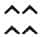
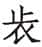
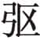
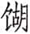
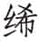
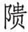
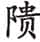
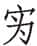
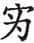

 隐公

***【题解】***

隐公名息姑，鲁惠公庶子，为声子所生。前723年鲁惠公死，惠公正妻仲子所生之子桓公年少，前722年遂由隐公摄政，在位十一年，前712年被羽父所杀。

鲁国乃周天子分封的诸侯国，姬姓，文王之子、武王之弟周公旦的后代，建都于曲阜（今山东曲阜）。相传孔子以鲁国旧史为依据修订《春秋》，按鲁君在位年代纪事，起于鲁隐公元年（前722），终于鲁哀公十四年（前481）。现在通行的《春秋左传》所附的《春秋》经文记至哀公十六年（前479）。《左传》纪事，仍然依照《春秋》的编年次序，只是下限至鲁哀公二十七年（前468），末又附鲁悼公四年（前463）至鲁悼公十四年（前453）韩、魏灭智伯之事。

《隐公》共记十一年之事，主要记载了春秋初年郑庄公强盛郑国并与周王朝的矛盾斗争。

***【传】***

惠公元妃孟子①。孟子卒，继室以声子②，生隐公。

宋武公生仲子③。仲子生而有文在其手，曰为鲁夫人，故仲子归于我④。生桓公而惠公薨⑤，是以隐公立而奉之⑥。

***【注释】***

①惠公：《史记·鲁世家》谓其名为弗湟，《索隐》引《世本》作“弗皇”，又引《年表》作“弗生”，隐公与桓公之父。惠公在位四十六年卒。元妃：诸侯原配正夫人。孟子：宋国国君之女。春秋时代，诸侯之女生下三月才起名。出嫁之后，便不再称名，其称谓，或由排行与母家姓组成，如“孟子”，孟是排行，即老大（孟、仲、叔、季），宋国子姓，所以称“孟子”；或以本国国名冠于姓上，如齐姜；或以丈夫国名冠于姓上，如秦嬴；或以丈夫的谥号冠于姓上，如庄姜；或以夫家之氏冠于母家之姓上，如栾祁；或另加谥号于姓上，如声子、厉妫等。周王之女则称为王姬。

②继室：续娶。《左传》凡四用“继室”，皆作动词，续娶之意。声子：孟子的妹妹。《史记·鲁世家》谓声子为贱妾，本书哀公二十四年《传》云：“若以妾为夫人，则固无其礼也。”似鲁未曾以妾为妻者，则声子不能视为正室夫人。

③宋武公：名司空。宋，国名，子姓，成汤的后裔。周武王灭纣，封其子武庚，武庚叛乱，为周公所败，改封纣的庶兄微子启为宋公，都城在今河南商丘。仲子：人名。是以排行加母家姓组成。

④“仲子生”至“归于我”：文，字。手，手掌。归，古代妇女出嫁称归。我，指鲁国。孔颖达《疏》云：“《石经》古文‘虞’作‘’，‘鲁’作‘’，手文容或似之。”据孔说，不以其手掌真有文字为可信，大约手纹似“鲁夫人”三字或似“虞”字，当时人或后世人因而附会之。宋仲子之嫁于鲁，盖附会其手纹似“鲁夫人”三字。

⑤薨（hōnɡ）：诸侯死称为薨。

⑥隐公立而奉之：指隐公摄政但仍奉戴桓公为君。之，此指鲁桓公。摄位称公亦犹周公摄位称王，固周礼也。此与下《传》“元年春王正月不书即位，摄也”为一《传》，后人分《传》之年，必以“某年”另起，故将此段提前而与下文隔绝。

***【译文】***

鲁惠公的原配夫人是孟子。孟子死后，惠公续娶了声子，生了隐公。

宋武公生了仲子。仲子生下来就有字在手掌上，说“为鲁夫人”，所以仲子嫁到鲁国。生了桓公不久鲁惠公就去世了，因此隐公摄政而奉戴桓公。

# 元年

***【经】***

1.1 元年春王正月①。

1.2 三月，公及邾仪父盟于蔑②。

1.3 夏五月，郑伯克段于鄢③。

1.4 秋七月，天王使宰咺来归惠公、仲子之赗④。

1.5 九月，及宋人盟于宿⑤。

1.6 冬十有二月，祭伯来⑥。

1.7 公子益师卒⑦。

***【注释】***

①元年：古代帝王或国君即位之年称为元年。鲁隐公元年，当周平王四十九年，前722。刘师培《春秋左氏传时月日古例考元年例》自注云：“《汉书·律历志下》引刘歆《世经》有‘周公摄政五年’之文，则摄位得纪年，自系古文说，天子与诸侯一也。”春：《春秋》纪月，必于每季之初标出春、夏、秋、冬四时，虽此季度无事可载，亦标明。周历以建子之月（今农历十一月）为正月，并以正月为春。但《春秋》之四时并不合于实际时令。周之春皆今之冬。《论语·卫灵公》：“行夏之时。”夏以建寅之月（今农历正月）为正月，则其春正今之春，考之以《诗经》，民间之四时皆夏时。王正（zhēnɡ）月：鲁国用周历，因此称周王正月。王，指周天子。

②邾（zōu）：《国语·郑语》、《晏子春秋·内篇上三》、《孟子》并作“邹”。国名，曹姓，在今山东邹城一带，后为楚所灭。仪父（fǔ）：邾国国君的字，名克。盟：盟法，先凿地为坎（即穴、洞），以牛、羊或马为牺牲，杀于其上，割牲左耳，盛在盘中，取其血，盛在敦中。读盟约告神，然后参加盟会者一一微饮血，古人谓之“歃血”。歃血毕，把盟约正本放于牲上掩埋，副本则参与盟会者各持归藏。蔑：鲁地名，即姑蔑，在今山东泗水东。

③郑伯克段于鄢（yān）：郑庄公在鄢打败了共叔段。本年《传》详载此事。郑伯，指郑庄公。郑，诸侯国名，姬姓，周宣王母弟桓公友之后。初在今陕西华县东北，郑武公时迁至今河南新郑，后为韩所灭。克，战胜。段，共叔段，郑庄公同母弟。鄢，旧国名，妘（yún）姓，在今河南鄢陵北偏西，为郑武公所灭。

④天王：周天子，指周平王。使：派遣。宰：官名。咺（xuān）：人名。归（kuì）：通“馈”，赠送。赗（fènɡ）：助丧用的车马束帛等财物。

⑤及宋人盟于宿：此谓鲁与宋人盟于宿。“及”上省“鲁”字。与盟者未书姓名。杨伯峻曰：“春秋初期，外大夫盟会侵伐，皆不书名。庄公二十二年《经》云‘及齐高傒盟于防’，此盟会外卿书名之始；文公八年《经》云‘公子遂会晋赵盾盟于衡雍’，此盟会内外大夫书名之始。”宿，国名，风姓，在今山东东平东南。

⑥祭（zhài）伯：周王卿士之一，祭为其食邑，在今河南郑州祭城镇。伯，指排行第一，部分学者认为是爵位。

⑦公子益师：鲁孝公之子，字众父。后为众氏，为众仲的祖先。公子，诸侯之子称公子。卒，大夫死称为卒。

***【译文】***

鲁隐公元年春周历正月。

三月，隐公与邾国国君仪父在蔑地会盟。

夏五月，郑庄公在鄢打败了共叔段。

秋七月，周天子派遣宰咺来馈送鲁惠公、仲子的丧礼。

九月，鲁国和宋人在宿会盟。

冬十二月，祭伯来鲁国。

公子益师去世。

***【传】***

1.1 元年春王周正月。不书即位，摄也①。

***【注释】***

①不书即位，摄也：依《春秋》书法，鲁国十二君，于其元年应书“元年春王正月公即位”。隐公因为是摄政，所以不书“即位”。书，记载。即位，开始做帝王或诸侯。摄，代理。

***【译文】***

元年春周历正月。《春秋》没有记载鲁隐公即位，因为他只是代理国政。

1.2 三月，公及邾仪父盟于蔑——邾子克也①。未王命，故不书爵②。曰“仪父”，贵之也③。公摄位而欲求好于邾，故为蔑之盟。

***【注释】***

①子：周朝第四等爵位。周王朝将贵族爵位分为公、侯、伯、子、男五等，在王廷为卿大夫，在诸侯国为国君。但考之《经》例，凡小国，或文化落后，或在偏远之地，所谓蛮、夷、戎、狄者，皆称其君为子。

②未王命，故不书爵：此是释《经》语。庄十六年《经》既书“邾子克卒”，子是爵；而此不云邾子，左氏以为此时尚未得王命。杜预《春秋左传注》以为附庸之君未王命，例称名。爵，爵位。

③曰“仪父”，贵之也：贵，尊重。杜预以为邾子克能自通于大国，继好息民，故书字贵之。

***【译文】***

三月，隐公和邾仪父在蔑地会盟——邾仪父就是邾子克。由于邾子还没有正式受周王室册封，所以《春秋》没有记载他的爵位。称他为“仪父”，是尊重他。隐公代行国政而想要和邾国友好，所以在蔑地举行了盟会。

1.3 夏四月，费伯帅师城郎①。不书，非公命也②。

***【注释】***

①费（bì）伯：鲁大夫，食邑在费。费，鲁地名，在今山东鱼台西南。帅，率领。师：军队。城：筑城。郎：鲁地名，在今山东鱼台东北。

②不书，非公命也：不书，指《经》不记载。《传》记此事，是由于城郎意出费伯本人，非奉隐公之命。

***【译文】***

夏四月，费伯率领军队在郎地筑城。《春秋》没有记载，这是因为不是奉鲁隐公的命令。

1.4 初，郑武公娶于申①，曰武姜②，生庄公及共叔段③。庄公寤生④，惊姜氏，故名曰“寤生”，遂恶之⑤。爱共叔段，欲立之。亟请于武公⑥，公弗许。

***【注释】***

①郑武公：姬姓，名掘突。《经》称郑“伯”，《传》称“公”，是因为不分公、侯、伯、子、男，诸侯可通称“公”。申：申国，姜姓，故城在今河南南阳。后为楚所灭。

②武姜：武公妻。武是武公之谥，姜为本人之姓。

③共（ɡōnɡ）叔段：郑庄公弟，名段；兄弟间年岁小，故称“叔段”。段后出奔共地，故称“共叔段”。共，本为国名，在今河南辉县。

④寤（wù）生：难产。寤，通“牾”，指胎儿出生时脚先出来。这样出生的孩子一般会难产。

⑤恶（wù）：厌恶。之：此指郑庄公。

⑥亟（qì）：屡次。

***【译文】***

当初，郑武公娶了申国的女子，后被称为武姜。武姜生了庄公和共叔段。庄公出生时难产，使姜氏受了惊吓，所以取名为“寤生”，姜氏因此讨厌他。姜氏喜欢共叔段，想立他为太子。她多次向武公请求，武公没答应。

及庄公即位，为之请制①。公曰：“制，岩邑也②，虢叔死焉③。佗邑唯命④。”请京⑤，使居之，谓之京城大叔⑥。

***【注释】***

①制：地名，又名虎牢关，在今河南荥阳。

②岩邑：险要的城邑。

③虢（ɡｕó）叔死焉：《汉书·地理志》臣瓒《注》云：“郑桓公寄帑与贿于虢、会之间。幽王既败，二年而灭会，四年而灭虢。”盖虢叔之死亦在此年。虢，有东虢和西虢，此指东虢，韦昭以东虢为虢仲所封，则虢叔乃虢仲之后。

④佗：同“他”。唯命：唯命是从。

⑤京：地名，故城在今河南荥阳东南。

⑥谓之京城大叔：大，同“太”。《郑世家》云：“庄公元年，封弟段于京，号太叔。”杨伯峻曰：“顾颉刚谓古人用‘太’字，本指其位列之在前，叔段之称太叔以其为郑庄公之第一个弟弟也。”

***【译文】***

到了庄公即位，姜氏为共叔段请求制这个地方作为封地。庄公说：“制，可是个险要的地方，虢叔就死在那里。其他的地方任他挑选吧。”姜氏就替他请求京地，并让共叔段住在那里，大家都称他“京城太叔”。

祭仲曰①：“都，城过百雉，国之害也②。先王之制：大都，不过参国之一③；中，五之一；小，九之一。今京不度④，非制也，君将不堪⑤。”公曰：“姜氏欲之，焉辟害⑥？”对曰：“姜氏何厌之有⑦？不如早为之所⑧，无使滋蔓⑨。蔓，难图也。蔓草犹不可除，况君之宠弟乎？”公曰：“多行不义，必自毙⑩，子姑待之。”

***【注释】***

①祭（zhài）仲：郑国大夫。祭为其食邑，即今河南中牟之祭亭，与祭伯之祭在郑州者为两地。

②都，城过百雉（zhì），国之害也：都，都邑。古之城邑皆可谓都。城，指城墙。过，超过。雉，古代城墙长三丈高一丈为一雉。古制侯伯之城方五里，计每面长九百丈，即三百雉。据后文大都不过其三分之一，故不能过百雉。

③参国之一：国都的三分之一。国，国都。参，通“三”。

④不度：不合法度。

⑤不堪：受不了。

⑥辟：逃避。

⑦何厌之有：有何厌。厌，满足。

⑧早为之所：犹言及早处置。所，处所，地方。

⑨滋蔓：滋生蔓延。比喻大叔段地益广，势益大。

⑩毙：倒仆，跌跤，此指失败。

***【译文】***

祭仲对庄公说：“都城的城墙周围超过三百丈，就会成为国家的危害。先王的制度：大的都城，不得超过国都的三分之一；中等的，不超过五分之一；小的，不超过九分之一。现在京地的城墙不符合规定，不是祖制所允许的，国君将来会难以忍受。”庄公说：“姜氏要这样，又哪能避免祸害呢？”祭仲回答说：“姜氏什么时候会满足啊？不如早点处置他，免得其贪欲蔓延滋长。一旦蔓延，就难以对付了。蔓延的野草尚且难以除掉，何况是国君您宠爱的弟弟呢？”庄公说：“多行不义之事，必定要失败。你且等着瞧吧。”

既而大叔命西鄙、北鄙贰于己①。公子吕曰②：“国不堪贰③，君将若之何④？欲与大叔⑤，臣请事之；若弗与，则请除之。无生民心。”公曰：“无庸⑥，将自及⑦。”大叔又收贰以为己邑⑧，至于廪延⑨。子封曰：“可矣，厚将得众⑩。”公曰：“不义不暱⑪，厚将崩⑫。”

***【注释】***

①既而：不久。鄙：边境之邑。贰：两属。

②公子吕：郑大夫，字子封。

③不堪贰：不能容忍两面听命的情况。

④若之何：怎么办。

⑤与（yǔ）：给予，指把君位让给太叔。

⑥无庸：不用，用不着。

⑦自及：自己遭祸。

⑧贰：指上述两属之邑，即西鄙、北鄙。《左传》凡数字皆用“二”，不用“贰”；“携贰”、“陪贰”之“贰”字皆用“贰”，不用“二”，分别极为明显。

⑨廪（lǐn）延：地名。在今河南延津。

⑩厚：势力雄厚。得众：得民心。

⑪不义不暱（nì）：不义则不昵。“昵”依《说文》当作“”，粘连之义。犹今言不义则不能团结其众。不义，不义于君。

⑫崩：崩溃。

***【译文】***

不久太叔命令西部和北部边境既听庄公的命令，又听自己的命令。公子吕说：“国家不能忍受这种两面听命的情况，您打算怎么办？您要把君位让给太叔，下臣就去事奉他；如果不给，那就请除掉他。不要让老百姓产生其他想法。”庄公说：“用不着，他会自食其果的。”太叔又收取原来两属的地方作为自己的封邑，并扩大到廪延地方。子封说：“可以动手了，他势力一大将会争得民心。”庄公说：“没有正义就不能号召人，势力大了，反而会崩溃。”

大叔完、聚①，缮甲、兵②，具卒、乘③，将袭郑④，夫人将启之⑤。公闻其期⑥，曰：“可矣！”命子封帅车二百乘以伐京⑦。京叛大叔段⑧。段入于鄢，公伐诸鄢。五月辛丑⑨，大叔出奔共。

***【注释】***

①完：修缮城郭。聚：收集粮草。

②缮：修补。甲、兵：指武器。

③具：备足。卒、乘：指战士。步兵曰卒，车兵曰乘。

④袭：行军不用钟鼓，今言偷袭。

⑤启：开启城门。

⑥期：袭郑的时间。

⑦车二百乘：杨伯峻曰：“春秋时多以车战，车一辆谓之一乘。杜预本《司马法》，谓车一乘有甲士三人，步卒七十二人。但《司马法》为战国时书，未必合于春秋制度。以《左传》考之，闵二年，齐侯使公子无亏帅车三百乘，甲兵三千人以戍曹，是一车用甲士十人。僖二十八年，晋文公献楚俘于王，驷介百乘，徒兵千，一车徒兵亦十人。”

⑧京：此指京邑人。

⑨五月辛丑：五月二十三日。

***【译文】***

太叔修理城郭，储备粮草，补充武器装备，充实步兵车兵，准备袭击郑国都城，姜氏则打算作为内应打开城门。庄公听到太叔起兵的日期，说：“可以了！”就命令子封率领二百辆战车进攻京城。京城的人叛离太叔。太叔逃到鄢地，庄公又赶到鄢地进攻他。五月二十三日，太叔又逃到共国。

书曰：“郑伯克段于鄢。”段不弟，故不言弟①；如二君，故曰克②；称郑伯，讥失教也③；谓之郑志④。不言出奔，难之也⑤。

***【注释】***

①段不弟，故不言弟：指叔段不守弟道，所以《春秋》不称他为庄公之弟。不弟，不像兄弟，不守弟道。

②如二君，故曰克：指叔段与庄公的对立，如同两个国君。庄公取胜，所以说“克”。

③称郑伯，讥失教也：指兄于弟本有教诲之责，而庄公于叔段不加教诲，养成其恶，故书其爵以示讥。

④郑志：郑庄公的意志。这里指阴谋。此言郑庄公本意即养成叔段之罪而诛之，书法是探其本心而言。

⑤不言出奔，难之也：“出奔”是有罪之辞。叔段出奔共国，有罪，庄公有意养成叔段之罪，也有罪，若书“出奔”则是专罪叔段，故不说“出奔”。这是史官下笔为难之处。按，本段是说明《经》文何以这样记述，即所谓的“春秋笔法”。

***【译文】***

《春秋》说：“郑伯克段于鄢。”太叔所作所为不像兄弟，所以不说“弟”字；兄弟相争，好像两个国君打仗一样，所以用个“克”字；把庄公称为“郑伯”是讥刺他没有尽教诲之责；《春秋》这样记载就表明了庄公的本来的意思。不说“出奔”，是因为史官下笔有困难。

遂置姜氏于城颍①，而誓之曰：“不及黄泉，无相见也②。”既而悔之。颍考叔为颍谷封人③，闻之，有献于公。公赐之食，食舍肉④。公问之，对曰：“小人有母，皆尝小人之食矣，未尝君之羹⑤，请以遗之⑥。”公曰：“尔有母遗，繄我独无⑦！”颍考叔曰：“敢问何谓也⑧？”公语之故，且告之悔。对曰：“君何患焉⑨？若阙地及泉⑩，隧而相见⑪，其谁曰不然？”公从之。公入而赋⑫：“大隧之中，其乐也融融⑬！”姜出而赋：“大隧之外，其乐也洩洩⑭！”遂为母子如初。

***【注释】***

①城颍（yǐnɡ）：地名。在今河南临颍。

②不及黄泉，无相见也：这两句犹言不死不相见。黄泉，地下之泉。

③颍考叔：郑大夫。颍，颍谷，地名。在今河南登封。封人：管理、镇守边疆的地方官。

④食舍肉：颍考叔吃肉时留下肉不吃。舍，置，谓食肉时将肉另置一边。

⑤羹（ɡēnɡ）：肉汁，此指上文所舍之肉，盖熟肉必有汁，故有汁的肉也可称羹。

⑥遗（wèi）：赠送。

⑦繄（ｙì）：发声词，无义，可译为“唉”等语气词。

⑧敢问何谓也：敢，谦辞。何谓，为什么这么说。按，上文既言颍考叔“闻之，有献于公”，此又问何谓，是明知故问。

⑨患：忧虑。

⑩阙：通“掘”。

⑪隧：动词，挖成地道。

⑫赋：赋诗。

⑬融融：和乐相得的样子。

⑭洩洩（yì）：和好欢乐的样子。“洩”本作“泄”，今作“洩”者，盖仍《唐石经》避唐太宗李世民讳改。

***【译文】***

郑庄公就把姜氏安置在城颍地方，发誓说：“不到黄泉，不再相见。”不久以后又后悔起来。当时颍考叔在颍谷做边疆护卫长官，听到这件事，就献给庄公一些东西。庄公赏赐他食物，在吃的时候，他把肉留下不吃。庄公问他为什么，他说：“我有母亲，我孝敬她的食物她都已尝过了，就是没有尝过您的肉汤，请让我带给她吃。”庄公说：“你有母亲可送，唉！我却没有！”颍考叔说：“请问这是什么意思？”庄公就对他说明了原因，并且告诉他自己很后悔。颍考叔回答说：“您有什么可忧虑的呢？如果挖地见到了泉水，开一条隧道在里面相见，谁又会说不对呢？”郑庄公听了颍考叔的意见。庄公进了隧道，赋诗说：“在大隧中相见，多么快乐啊！”姜氏走出隧道，赋诗说：“走出大隧外，多么舒畅啊。”于是母子关系恢复，和从前一样。

君子曰①：“颍考叔，纯孝也②，爱其母，施及庄公③。《诗》曰：‘孝子不匮，永锡尔类④。’其是之谓乎！”

***【注释】***

①君子曰：“君子曰”云云，《国语》、《国策》及先秦诸子多有之，或为作者自己之议论，或为作者取他人之言论。

②纯孝：纯一专精之孝。

③施（yì）：延及，扩展到。

④孝子不匮（kuì），永锡尔类：见《诗经·大雅·既醉》。匮，竭尽。锡，赐予。类，同类的人。

***【译文】***

君子说：“颍考叔可算是真正的孝子，爱他的母亲，扩大影响到庄公。《诗》说：‘孝子的孝心没有穷尽，永远可以影响到你的同类。’说的就是这样的事情吧！”

1.5 秋七月，天王使宰咺来归惠公、仲子之赗。缓①，且子氏未薨②，故名③。天子七月而葬④，同轨毕至⑤；诸侯五月，同盟至⑥；大夫三月，同位至⑦；士逾月⑧，外姻至⑨。赠死不及尸⑩，吊生不及哀⑪，豫凶事⑫，非礼也。

***【注释】***

①缓：迟。春秋时，旧君死之第二年新君始称元年，此时已是隐公元年七月，则惠公死已逾年。此时始来馈赠助丧之物，太迟缓了。

②子氏：惠公夫人，桓公之母仲子。仲子此时犹在，未死而助其丧，尤不合理。

③故名：依《春秋》体例，天子之卿大夫不宜书名，而此书“宰咺”，咺是其名，则是因天王之行事不合理故书之。

④七月：从死之月数到葬之月，一共七个月。下文“五月”、“三月”同。

⑤同轨：指诸侯。

⑥同盟至：同盟诸侯派使者参加。

⑦同位至：官位相同者参加。

⑧逾月：经二月。

⑨外姻，有婚姻关系的亲戚。按，以上解释当时的丧礼制度。

⑩尸：未葬前的尸体。

⑪哀：指人死后主人所行的哀礼。包括自始死及殡（将葬停棺）、自启（将葬举棺）及反哭（古礼，葬后返庙而哭）。也指这一段时间。

⑫豫凶事：豫，事先致礼。此指仲子未死，而赠以助丧之车马，是豫赠以凶事之物也。隐二年十二月乙卯，仲子薨，或此时已病重，周室闻之，故于赗惠公之便，而兼赗之。

***【译文】***

秋七月，周平王派遣宰咺来赠送鲁惠公和仲子的丧仪。惠公已经下葬，这是迟了，而仲子还没有死，所以《春秋》直接写了宰咺的名字。天子死后历七个月下葬，诸侯全部参加葬礼；诸侯历五个月下葬，同盟的诸侯参加葬礼；大夫历三个月下葬，官位相同的参加葬礼；士一个月以后下葬，亲戚参加葬礼。向死者赠送东西没有赶上下葬，向生者吊丧没有赶上举哀的时间，人没有死而预先赠送有关丧事的东西，这都不合于礼。

1.6 八月，纪人伐夷①。夷不告，故不书②。

***【注释】***

①纪：诸侯国名，姜姓，故城在今山东寿光南。古器铭作“己”。近年寿光、莱阳、烟台等地皆有纪国青铜器出土，似纪国辖地甚广。夷：诸侯国名，妘姓，故城在今山东即墨西壮武故城。

②夷不告，故不书：指纪国人讨伐夷国，夷国没来报告，所以《春秋》不加记载。

***【译文】***

八月，纪国人讨伐夷国。夷国没有前来报告鲁国，所以《春秋》不加记载。

1.7 有蜚①。不为灾，亦不书②。

***【注释】***

①蜚（fěi）：即蜚盘虫，一种小飞虫，发恶臭，生于草中，会吃稻花。

②亦不书：以上两章皆无《经》有《传》，《传》并释鲁史何以“不书”。下同。

***【译文】***

发现蜚盘虫。没有造成灾害，《春秋》也不加记载。

1.8 惠公之季年①，败宋师于黄②。公立而求成焉③。九月，及宋人盟于宿④，始通也⑤。

***【注释】***

①季年：晚年，末年。

②黄：地名，宋国之邑，在今河南民权东。

③成：讲和，媾和。

④及：与。

⑤通：通好。

***【译文】***

鲁惠公的晚年，在黄地打败了宋国。鲁隐公即位，要求和宋人讲和。九月，和宋人在宿地结盟，两国开始通好。

1.9 冬十月庚申①，改葬惠公。公弗临②，故不书。惠公之薨也，有宋师③，大子少④，葬故有阙⑤，是以改葬。

***【注释】***

①庚申：十四日。

②公弗临（lìn）：临，到场哭吊亡者。隐公是摄位，不敢以丧主自居，故弗临。

③有宋师：即上文“败宋师于黄”之事。

④太子：指桓公。

⑤阙：不完备。

***【译文】***

冬十月十四日，改葬鲁惠公。隐公不敢以丧主的身份到场哭吊，所以《春秋》不加记载。惠公死的时候，正好遇上和宋国打仗，太子又年幼，葬礼不完备，所以改葬。

1.10 卫侯来会葬①，不见公，亦不书。

***【注释】***

①卫侯：指卫桓公。卫，国名，姬姓，文王之子康叔之后，此时建都朝歌，即今河南淇县。

***【译文】***

卫桓公来鲁国参加葬礼，没有见到隐公，《春秋》也不加记载。

1.11 郑共叔之乱①，公孙滑出奔卫②。卫人为之伐郑，取廪延。郑人以王师、虢师伐卫南鄙③。请师于邾。邾子使私于公子豫④。豫请往，公弗许，遂行，及邾人、郑人盟于翼⑤。不书，非公命也。

***【注释】***

①共叔：即共叔段。

②公孙滑：共叔段之子。

③郑人以王师、虢师伐卫南鄙：郑人能指挥周王之师及虢师，是因为当时郑庄公为周王卿士，西虢公又与郑庄公同仕于周王朝。以，率领。王师，周王的军队。虢师，西虢军队。虢，指西虢国，在今河南陕县。

④邾子：指邾子克。公子豫：鲁大夫。

⑤翼：邾地名，在今山东费县西南。

***【译文】***

郑国共叔段叛乱，段的儿子公孙滑逃到卫国。卫国人替他进攻郑国，占领了廪延。郑国人率领周天子的军队、虢国的军队进攻卫国南部边境，同时又请求邾国出兵。邾子派人私下和公子豫商量，公子豫请求出兵援救，隐公不允许，公子豫就自己去了，和邾国、郑国在翼地会盟。《春秋》不加记载，因为不是出于隐公的命令。

1.12 新作南门①。不书，亦非公命也。

***【注释】***

①作：建造。

***【译文】***

新建南门，《春秋》不加记载，也由于不是出于隐公的命令。

1.13 十二月，祭伯来，非王命也。

***【译文】***

十二月，祭伯来，并不是奉了周王的命令。

1.14 众父卒。公不与小敛①，故不书日。

***【注释】***

①公不与（yù）小敛（liǎn）：杨伯峻曰：“襄公五年《传》云‘季文子卒，大夫入敛，公在位’，是卿大夫之丧，入敛公临之证。”与，参加。小敛，给死者穿衣。敛，通“殓”。

***【译文】***

众父去世。隐公没有参加小敛，所以《春秋》不记载死亡的日子。

# 二年

***【经】***

2.1 二年春①，公会戎于潜②。

2.2 夏五月，莒人入向③。

2.3 无骇帅师入极④。

2.4 秋八月庚辰⑤，公及戎盟于唐⑥。

2.5 九月，纪裂来逆女⑦。

2.6 冬十月，伯姬归于纪⑧。

2.7 纪子帛、莒子盟于密⑨。

2.8 十有二月乙卯⑩，夫人子氏薨⑪。

2.9 郑人伐卫⑫。

***【注释】***

①二年：鲁隐公二年当周平王五十年，前721。

②会：会见。戎：古代中原各国对北方少数民族的泛称。春秋时，华、戎犹杂处。潜：鲁地名，在今山东济宁西南。

③莒（jǔ）：诸侯国名，己姓，时都今山东胶州，后迁莒县。入：以兵侵入他国。向：诸侯国名，姜姓，在今山东莒县南。

④无骇：鲁国司空，公子展之孙，展禽（柳下惠）之父。极：鲁之附属国，在今山东金乡南。按，极以后不再出现，可能自此后遂为鲁所有。

⑤庚辰：按今历法推算，八月无庚辰日，此记日当有误。

⑥唐：鲁地名，在今山东鱼台。

⑦纪裂（xū）来逆女：纪君娶鲁惠公女，裂为之来迎亲。纪裂，纪国大夫。逆，迎接。

⑧伯姬：鲁惠公长女。

⑨纪子帛：纪裂的字。密：莒地名，在今山东昌邑密乡。

⑩乙卯：十五日。

⑪子氏：桓公之母仲子。薨：诸侯或诸侯的夫人、母夫人死都可以叫薨。杨伯峻曰：“《春秋》记鲁公或鲁夫人之死，除隐三年‘君氏卒’及哀十二年‘孟子卒’等特殊情况外，皆用‘薨’字；记其他诸侯之死，则用‘卒’字。”

⑫伐：凡行军时有钟鼓，堂堂正正地攻打别国叫伐。

***【译文】***

鲁隐公二年春，隐公在潜地会见戎人。

夏五月，莒国人攻入向国。

无骇领兵攻入极国。

秋八月庚辰日，隐公和戎人在唐地会盟。

九月，纪裂来我国迎亲。

冬十月，伯姬出嫁去纪国。

纪子帛、莒子在密地结盟。

十二月十五日，夫人仲子去世。

郑国人讨伐卫国。

***【传】***

2.1 二年春，公会戎于潜，修惠公之好也①。戎请盟，公辞②。

***【注释】***

①公会戎于潜，修惠公之好也：戎人与鲁惠公本有友好关系，今隐公会见戎人，是重修过去的友好关系。

②辞：不同意。

***【译文】***

鲁隐公二年春，隐公在潜地与戎人会见，再一次加强惠公时期的友好关系。戎人请求结盟，隐公婉言拒绝了。

2.2 莒子娶于向，向姜不安莒而归①。夏，莒人入向②，以姜氏还③。

***【注释】***

①向姜：向国国君之女。

②莒人入向：莒国军队攻入向国国都。入，率军深入其国都。

③还：带回。

***【译文】***

莒子在向国娶了妻子，向姜在莒国不安心而回到向国。夏，莒子领兵进入向国，带着向姜回国。

2.3 司空无骇入极，费庈父胜之①。

***【注释】***

①司空无骇入极，费庈父（qín fǔ）胜之：司空无骇率师侵入极国后，即行退走，而费庈父乘机灭了极国。据《读史方舆纪要》，废鱼台县西南有费亭，费与极均在今金乡南而稍东。郎与极亦在废鱼台县附近。无骇入极，费庈父因城郎而灭极。司空，官名，掌管工程。费庈父，即元年《传》文“费伯帅师城郎”中的费伯。胜之，灭之。

***【译文】***

司空无骇带兵进入极国，派费庈父灭亡了极国。

2.4 戎请盟。秋，盟于唐，复修戎好也。

***【译文】***

戎人请求结盟。秋季，在唐地结盟，这是为了再次加强和戎人的友好关系。

2.5 九月，纪裂来逆女，卿为君逆也①。

***【注释】***

①卿为君逆：春秋时代，诸侯娶妇，必派本国之卿出境迎接。此处特点明纪裂是为纪君迎女，而不是为自己。

***【译文】***

九月，纪裂来迎接隐公的女儿，这是纪卿为了国君而来迎娶。

2.6 冬，纪子帛、莒子盟于密，鲁故也①。

***【注释】***

①鲁故：鲁国和莒国之间不和睦。

***【译文】***

冬，纪子帛和莒子在密地结盟，这是为了调解鲁国和莒国间的不和睦。

2.7 郑人伐卫，讨公孙滑之乱也①。

***【注释】***

①郑人伐卫，讨公孙滑之乱也：上年卫人为公孙滑伐郑，所以郑国伐卫，以讨伐公孙滑。

***【译文】***

郑国人进攻卫国，讨伐公孙滑的叛乱。

# 三年

***【经】***

3.1 三年春王二月，己巳，日有食之①。

3.2 三月庚戌，天王崩②。

3.3 夏四月辛卯，君氏卒③。

3.4 秋，武氏子来求赙④。

3.5 八月庚辰，宋公和卒⑤。

3.6 冬十有二月，齐侯、郑伯盟于石门⑥。

3.7 癸未，葬宋穆公⑦。

***【注释】***

①三年春王二月，己巳，日有食之：此为前720年2月22日之日全食，是全世界最早的有确切日期的日食记录。隐公三年，当周平王五十一年，前720。己巳，初一。日食必在初一。

②三月庚戌，天王崩：庚戌，十二日。天王，此指周平王。崩，天子死叫崩。

③夏四月辛卯，君氏卒：辛卯，二十四日。君氏，隐公之母声子。

④武氏子来求赙（fù）：周平王死，周室使人来求助丧财物。按，对此古人有讥鲁不供奉王丧、讥周求赙非礼，以及周、鲁交讥三种意见。杨伯峻曰：“考《周礼·宰夫》郑玄《注》云：‘凡丧，始死，吊而含禭（送死者口中所含之珠玉及所着衣），葬而赗赠，其间加恩厚则有赙焉，《春秋》讥武氏子求赙。’推郑玄之意，则以为含禭赗赠是正礼，鲁已行之。赙以大量财币是加礼，鲁未如此，故使人求之，非礼。郑说可采。”武氏子，周大夫之子。赙，助丧用的金帛财物。

⑤八月庚辰，宋公和卒：庚辰，十五日。宋公和，指宋穆公，名和，武公司空之子，宣公力之弟，在位九年。卒，死。凡人死皆可谓卒。又《礼记·曲礼下》云“天子死曰崩，诸侯曰薨，大夫曰卒”。《春秋》之例，鲁君死书“薨”，其他诸侯死书“卒”，似为内（本国）外（他国）之别。

⑥齐侯：此指齐僖公。齐，国名，姜姓，姜太公之后，侯爵，建都于营丘，在今山东临淄。郑伯：郑庄公。石门：齐地名，在今山东长清。

⑦癸未：十二月二十日。

***【译文】***

鲁隐公三年春周历二月己巳日，发生日食。

三月十二日，周平王去世。

夏四月二十四日，隐公母声子去世。

秋，周大夫武氏之子来求取助丧的财物。

八月十五日，宋穆公和去世。

冬十二月，齐僖公、郑庄公在石门结盟。

十二月二十日，安葬宋穆公。

***【传】***

3.1 三年春，王三月壬戌①，平王崩。赴以庚戌，故书之②。

***【注释】***

①壬戌：二十四日。

②赴以庚戌，故书之：周平王是壬戌日死的，而讣告上说是庚戌日，《春秋》就记为庚戌日。杜预注云因天子葬期有一定期限，想让诸侯早日临丧，所以提前十二日，说是庚戌日死。杨伯峻非之，曰：“恐是臆测之辞。襄二十八年《经》云：‘十有二月甲寅，天王崩。’《传》云：‘癸巳，天王崩，未来赴，亦未书，礼也。王人来告丧，问崩日，以甲寅告，故书之，以征过也。’与此可以互相发明。”赴，同“讣”，告丧。

***【译文】***

鲁隐公三年春周历的三月二十四日，周平王逝世。讣告上写的是十二日，所以《春秋》也记载死日为十二日。

3.2 夏，君氏卒，声子也。不赴于诸侯，不反哭于寝，不祔于姑，故不曰薨。不称夫人，故不言葬①，不书姓，为公故，曰“君氏”②。

***【注释】***

①“不赴于诸侯”六句：声子虽是隐公之母，但非惠公之正夫人；隐公虽当时为鲁国之君，却自谓代桓公摄位，故去年十二月，桓公之母仲子死，以夫人之礼葬之，《春秋》亦书云“夫人子氏薨”，此时声子死则不按夫人之礼治丧。杨伯峻曰：“所谓以夫人之礼治丧者，当其初死，讣告于同盟诸侯，一也；既葬返哭于祖庙，虞于殡（虞为葬后迎死者之魂，祭而安乐之之礼）——此从沈钦韩说——二也；卒哭（虞后三月，卒无时之哭——意谓以后哭死者有时），以死者之主祔（以后死者祔于祖庙曰祔）于祖姑，三也。若三礼皆备，则书曰‘夫人某氏薨’，又书曰‘葬我小君某氏’。声子之死，既未向同盟诸侯讣告；葬后，隐公又未反哭于寝（祖庙）；卒哭后，亦未祔于祖姑，三者皆不具备，则是不以夫人看待声子，故《经》书其死用‘卒’字，而不用‘薨’字；只云‘某氏’，而不云‘夫人某氏’；又不书其葬。”赴于诸侯，讣告于同盟诸侯。反哭于寝，死者既葬后，亲属回到祖庙哭吊。寝，祖庙。祔（fù），以新亡者神主（牌位）附祭于宗庙。姑，婆婆，此指婆婆的神主。

②不书姓，为公故，曰“君氏”：声子姓子，依一般宫人死时记载惯例，宜曰“子氏卒”。但隐公时为鲁君，声子是其生母，如此对待声子，或者有伤隐公之心。当时习惯有“君夫人氏”之称，此故省“夫人”两字，称之为“君氏”。公，指隐公。

***【译文】***

夏，君氏去世，君氏就是声子。没有发讣告给诸侯，安葬后没有回到祖庙哭祭，没有把神主放在婆婆神主的旁边，所以《春秋》不称“薨”。又由于没有称她为“夫人”，所以不记载下葬的情况，也没有记载她的姓氏，只是因为她是隐公的生母的缘故，所以才称她为“君氏”。

3.3 郑武公、庄公为平王卿士①。王贰于虢②，郑伯怨王，王曰“无之”。故周、郑交质③。王子狐为质于郑④，郑公子忽为质于周⑤。王崩，周人将畀虢公政⑥。四月，郑祭足帅师取温之麦⑦。秋，又取成周之禾⑧。周、郑交恶⑨。

***【注释】***

①卿士：执政大臣。

②贰于虢：不专任郑伯，又同时将一些政事交给虢公处理。虢，西虢公。

③质：作抵押的人或物。此指人质。

④王子狐：周平王之子，后即位为周桓王。

⑤公子忽：郑庄公太子，后即位为郑昭公。

⑥王崩，周人将畀（bì）虢公政：此句指周平王一死，周人准备将执政权交给虢公。畀，给予。

⑦祭足：郑大夫祭仲。温：周王畿内的小国，在今河南温县南。

⑧成周：周的东都，遗址在今河南洛阳市王城公园。禾：稷类谷物。

⑨周、郑交恶：指郑国用武力强取了王室温地的麦子和成周的谷子，以示对周王重用虢君的抗议。这样一来，周王室和郑国结下了怨仇。

***【译文】***

郑武公、郑庄公先后担任周平王的卿士。平王暗中又将朝政分托给虢公，郑庄公埋怨周平王，平王说：“没有这回事。”所以周、郑交换人质。周王子狐在郑国作为人质，郑国的公子忽在宗周作为人质。平王死后，周王室的人想把政权交给虢公。四月，郑国的祭足带兵割取了温地的麦子。秋天，又割取了成周的谷子。宗周和郑国彼此怨恨。

君子曰：“信不由中①，质无益也。明恕而行②，要之以礼③，虽无有质，谁能间之④？苟有明信⑤，涧、谿、沼、沚之毛⑥，、蘩、蕰藻之菜⑦，筐、筥、锜、釜之器⑧，潢、污、行潦之水⑨，可荐于鬼神⑩，可羞于王公⑪，而况君子结二国之信，行之以礼，又焉用质？《风》有《采繁》、《采》⑫，《雅》有《行苇》、《泂酌》⑬，昭忠信也⑭。”

***【注释】***

①信不由中：诺言不发自内心。信，指人的言语。中，同“衷”。

②明恕：即对于自己是发自诚心，对于别人则能谅解。

③要（yāo）：约束。

④间（jiàn）：离间。

⑤苟：假如。明信：明显的诚信。

⑥涧、谿：山沟。沼、沚（zhǐ）：池塘。毛：凡地上所生植物都叫毛，此指野草。

⑦（pín）：浅水中所长的植物。蘩（fán）：白蒿，草本植物。蕰（wēn）：一种水草。

⑧筐、筥（jǔ）：均为竹木编的盛器，方的为筐，圆的为筥。锜（qí）、釜（fǔ）：均为烹饪用的器具，有脚的叫锜、无脚的叫釜。

⑨潢（huánɡ）污：此指不流动的死水。潢，积水池。污，池塘。行潦（hánɡ lǎｏ）：道路上的流水。

⑩荐（jiàn）：进献。

⑪羞（xiū）：进献食品。

⑫《风》：指《诗经》中的《国风》。《采繁》、《采》：《诗经·国风·召南》中的两篇，均写妇女采集野菜以供祭祀。

⑬《雅》：指《诗经》中的《大雅》。《行苇》、《泂酌（jiǒnɡ zhuó）》：《诗经·大雅》中的两篇，内容均有关宴享。

⑭昭：显示，表明。

***【译文】***

君子说：“诚意不发自内心，即使交换人质也没有益处。设身处地将心比心来办事，又用礼仪加以约束，虽然没有人质，又有谁能离间他们？假如确有诚意，即使是山沟、池塘里生长的野草，、蘩、蕰藻这一类的野菜，筐、筥一般的竹器和锜、釜一类的器皿，大小池塘的积水乃至道路上的流水，都可以献给鬼神，进给王公，何况君子建立两国的信约，按照礼仪办事，又哪里还用得着人质？《国风》有《采繁》、《采》，《大雅》有《行苇》、《泂酌》这些诗篇，就是为了表明忠信。”

3.4 武氏子来求赙，王未葬也。

***【译文】***

武氏的儿子来鲁国求取办丧事的财物，这是由于周平王还没有举行葬礼。

3.5 宋穆公疾，召大司马孔父而属殇公焉①，曰：“先君舍与夷而立寡人②，寡人弗敢忘。若以大夫之灵③，得保首领以没④，先君若问与夷，其将何辞以对？请子奉之⑤，以主社稷⑥，寡人虽死，亦无悔焉。”对曰：“群臣愿奉冯也⑦。”公曰：“不可。先君以寡人为贤，使主社稷，若弃德不让⑧，是废先君之举也⑨，岂曰能贤⑩？光昭先君之令德⑪，可不务乎⑫？吾子其无废先君之功⑬！”使公子冯出居于郑。八月庚辰，宋穆公卒。殇公即位。

***【注释】***

①大司马：宋国官名，掌邦政。孔父：名嘉，又称孔父嘉，正考父之子，孔子的祖先。属：嘱咐。殇（shānɡ）公：宋宣公之子与夷，宋穆公的侄子。

②先君舍与夷而立寡人：指当年宋宣公废弃太子与夷而立弟弟穆公。先君，指宋宣公。舍，舍弃，废弃。寡人，诸侯谦称，喻寡德之人。

③以大夫之灵：意即托大夫之福，仗大夫之力。灵，威灵。

④保首领以没：当时俗语，指善终。

⑤子：您，此是对孔父的尊称。奉：事奉，奉戴。

⑥主社稷：执政。土神叫社，谷神叫稷，社稷指代国家。

⑦冯：穆公之子，后为庄公。

⑧德：穆公以让国为德。让：让国。

⑨举：选拔。

⑩能贤：能够称为贤者。

⑪光昭：发扬光大。令德：美德。

⑫务：努力从事。

⑬吾子：表尊敬的代词，您或你们。

***【译文】***

宋穆公病重了，召见大司马孔父把殇公嘱托给他，说：“先君废弃了他的儿子与夷而立我为国君，我不敢忘记。如果托大夫的福，我能得善终，先君如果问起与夷，将用什么话回答呢？请您事奉与夷来主持国家事务，我虽死也没什么后悔的了。”孔父回答说：“群臣愿意事奉您的儿子冯啊！”穆公说：“不行。先君认为我有德行，才让我主持国家事务。如果丢掉道德而不让位，这就是废弃了先君的提拔，哪里还能说有什么德行？发扬先君的美德，难道能不努力从事吗？您不要废弃先君的功业！”于是命令公子冯到郑国去住。八月十五日，宋穆公去世，殇公即位。

君子曰：“宋宣公可谓知人矣①。立穆公，其子飨之②，命以义夫③。《商颂》曰：‘殷受命咸宜，百禄是荷。’④其是之谓乎！”

***【注释】***

①知人：能了解人。

②飨（xiǎnɡ）：通“享”，享有。宋宣公立穆公，穆公卒，仍立宣公子为君，所以说“其子飨之”。

③命：宣公的遗命。

④殷受命咸宜，百禄是荷：见《诗经·商颂·玄鸟》，意谓殷王受天命皆合道义，因此承受天赐百福。殷商王位多兄终弟及，宋国为殷商后裔，宋宣公也不传位儿子而传弟，所以作者引《商颂》赞扬他。

***【译文】***

君子说：“宋宣公可以说是能了解人了。立了弟弟穆公，他的儿子却仍然享受了君位，这是因为他的遗命出于道义。《诗经·商颂》说：‘殷王传授天命都合于道义，所以承受了各种福禄。’就是这种情况。”

3.6 冬，齐、郑盟于石门，寻卢之盟也①。庚戌②，郑伯之车偾于济③。

***【注释】***

①寻卢之盟：寻盟，当时俗语，重修旧好。寻，温。卢，地名，在今山东长清。卢之盟发生在春秋之前。

②庚戌：十二月无庚戌日，当是记日有误。

③偾（fèn）：翻车。济：济水，在山东齐河。

***【译文】***

冬，齐国和郑国在石门会盟，这是为了重温在卢地结盟的友好关系。庚戌日，郑伯在济水翻了车。

3.7 卫庄公娶于齐东宫得臣之妹①，曰庄姜②。美而无子，卫人所为赋《硕人》也③。又娶于陈④，曰厉妫⑤，生孝伯⑥，早死。其娣戴妫生桓公⑦，庄姜以为己子。

***【注释】***

①卫庄公：名扬，卫武公之子，在位二十三年。东宫：太子所居之地，后常称太子为东宫。得臣：齐庄公的太子，未即位便已死去。

②庄姜：卫庄公的妻子，是齐庄公嫡女，齐僖公姊妹。庄是丈夫谥号，姜是娘家的姓。

③所为：为之。赋：作诗。《硕人》：《诗经·国风·卫风》中的一篇，赞美庄姜之美。硕人，美人。硕，大。古人以硕大颀长为美。

④陈：诸侯国名，妫（ɡuī）姓，虞舜之后，都于宛丘，在今河南淮阳。

⑤厉妫：人名，其中厉为谥号，妫为姓。

⑥孝伯：卫庄公与厉妫之子，早死。

⑦娣（dì）：妹妹。古代诸侯嫁女，要以侄娣陪嫁，所以自嫡室以下诸妾都叫“娣”。戴妫：人名，厉妫之妹，谥号戴。桓公：卫庄公之子，名完。

***【译文】***

卫庄公娶了齐国东宫得臣的妹妹，称为庄姜。庄姜漂亮却没有生孩子，卫国人因此为她创作了《硕人》这首诗。卫庄公又在陈国娶了一个妻子，称为厉妫，生了孝伯，很早就死了。跟厉妫陪嫁来的妹妹戴妫生了卫桓公，庄姜就把他作为自己的儿子。

公子州吁①，嬖人之子也②，有宠而好兵，公弗禁，庄姜恶之。石碏谏曰③：“臣闻爱子，教之以义方④，弗纳于邪。骄、奢、淫、泆⑤，所自邪也⑥。四者之来，宠禄过也。将立州吁，乃定之矣，若犹未也，阶之为祸⑦。夫宠而不骄，骄而能降，降而不憾，憾而能眕者，鲜矣⑧。且夫贱妨贵，少陵长，远间亲，新间旧，小加大，淫破义，所谓六逆也⑨。君义，臣行，父慈，子孝，兄爱，弟敬，所谓六顺也⑩。去顺效逆，所以速祸也⑪。君人者将祸是务去⑫，而速之，无乃不可乎⑬？”弗听。其子厚与州吁游⑭，禁之，不可。桓公立，乃老⑮。

***【注释】***

①公子州吁（xū）：卫庄公之子。

②嬖（bì）人：指爱妾。嬖，宠幸。

③石碏（què）：卫大夫。

④义方：正确的礼仪规矩。

⑤泆（ｙì）：放荡恣肆。

⑥所自邪：邪恶由此而来。

⑦阶：阶梯。指以宠爱为阶梯作乱。

⑧“夫宠而不骄”四句：受宠爱则骄傲，地位下降则怨恨，怨恨则思作乱而不能自安自重，一般人常如此。石碏认为州吁也是如此。能降，安于地位下降。憾，恨。眕（zhěn），镇定自重的样子。鲜（xiǎn），少。

⑨“且夫贱妨贵”七句：州吁与桓公完相比，从地位说，州吁庶出为贱，完夫人嫡子为贵；以年龄说，州吁年少，完年长；以亲疏说，州吁疏远，完亲近；以历史关系说，州吁是新进之人，完是耆旧之人；以情势说，州吁小，完大；以道义说，州吁淫邪，完忠义。所以如果立州吁，是犯了“六逆”。妨，妨害。陵，凌驾。间，离间。加，侵凌。破，破坏。逆，悖理的行为。

⑩“君义”七句：国君行事得宜，臣下坚决服从，父亲慈爱儿女，儿女孝敬父母，兄长爱护弟妹，弟妹尊敬兄长，这就是大家所说的六顺。顺，顺理之事。

⑪速祸：加速祸患的到来。

⑫君人：为人之君。将祸是务去：即“将务去祸”，一定要把祸患去掉。

⑬无乃：恐怕，只怕。

⑭游：交游，往来密切。

⑮老：告老隐退。按，此本与下年《传》“四年春，卫州吁弑桓公而立”为一段，被后人割裂。

***【译文】***

公子州吁是庄公宠妾的儿子，受到庄公宠爱，喜好武事，庄公不加禁止，庄姜则讨厌州吁。大夫石碏劝庄公说：“我听说疼爱孩子应当用正道去教导他，不能使他走上邪路。骄横、奢侈、淫乱、放纵是导致邪恶的原因。这四种恶习的产生，是给他的宠爱和俸禄过了头。如果想立州吁为太子，就确定下来；如果定不下来，就会酿成祸乱。受宠而不骄横，骄横而能安于下位，地位下降而不怨恨，怨恨而能克制的人，是很少的。况且低贱妨害高贵，年轻欺凌年长，疏远离间亲近，新人离间旧人，弱小压迫强大，淫乱破坏道义，这是六件背离道理的事。国君仁义，臣下恭行，为父慈爱，为子孝顺，为兄爱护，为弟恭敬，这是六件顺理的事。背离顺理的事而效法违理的事，这就是很快会招致祸害的原因。作为统治民众的君主，应当尽力除掉祸害，而现在却加速祸害的到来，这大概是不行的吧？”卫庄公不听劝告。石碏的儿子石厚与州吁交往，石碏禁止，但未能如愿。到卫桓公即位做了国君，石碏就告老退休了。

# 四年

***【经】***

4.1 四年春王二月①，莒人伐杞②，取牟娄③。

4.2 戊申④，卫州吁弑其君完⑤。

4.3 夏，公及宋公遇于清⑥。

4.4 宋公、陈侯、蔡人、卫人伐郑⑦。

4.5 秋，翚帅师会宋公、陈侯、蔡人、卫人伐郑⑧。

4.6 九月，卫人杀州吁于濮⑨。

4.7 冬十有二月，卫人立晋⑩。

***【注释】***

①四年：鲁隐公四年当周桓王元年，前719。

②杞（qǐ）：诸侯国名，姒姓。《史记》言武王克殷后，求禹后东楼公封于杞。本在河南杞县一带，后东迁到今山东安丘。

③牟（móu）娄：地名，在今山东诸城。

④戊申：三月十六日。二月无戊申。

⑤卫州吁弑（shì）其君完：卫国的州吁杀了卫桓公完自立为国君。《春秋》记载弑君从此开始。弑，古代称臣杀君、子杀父母为弑。完，指卫桓公，名完，卫庄公之子。

⑥公及宋公遇于清：鲁隐公和宋殇公在清地草草相见。公，指鲁隐公。宋公，指宋殇公。遇，非正式会见。清，卫邑，在今山东东阿南。

⑦宋公、陈侯、蔡人、卫人伐郑：此次伐郑，宋、陈两国是国君亲自领兵，蔡、卫是大夫领兵，所以称为“蔡人”、“卫人”。陈侯，指陈桓公。蔡，国名，周武王之弟蔡叔度之后。此时建都上蔡，即今河南上蔡。《春秋传说汇纂》云：“此诸侯会伐之始，亦东诸侯分党之始。”

⑧翚（huī）帅师会宋公、陈侯、蔡人、卫人伐郑：《春秋传说汇纂》曰：“此大夫会伐之始。”翚，鲁大夫公子翚，字羽父。

⑨濮（pú）：陈国地名，在今安徽芡河上游。

⑩晋：指公子晋，此年被卫国人立为国君，号卫宣公。

***【译文】***

鲁隐公四年春周历二月，莒国人攻打杞国，占领牟娄。

三月十六日，卫国的州吁杀死了他的君主完。

夏，鲁隐公和宋殇公在清地草草相见。

宋殇公、陈桓公、蔡国人、卫国人攻打郑国。

秋，公子翚领兵会合宋殇公、陈桓公、蔡国人、卫国人攻打郑国。

九月，卫国人在濮地杀死州吁。

冬十二月，卫国人立公子晋为国君。

***【传】***

4.1 四年春，卫州吁弑桓公而立①。

***【注释】***

①四年春，卫州吁弑桓公而立：此句本是紧接上年末《传》文。

***【译文】***

鲁隐公四年春，卫国的州吁杀死了卫桓公而自立为国君。

4.2 公与宋公为会，将寻宿之盟①。未及期②，卫人来告乱。夏，公及宋公遇于清。

***【注释】***

①宿之盟：在鲁隐公元年。

②期（qī）：约定之日。

***【译文】***

隐公与宋殇公会面，打算重温在宿地盟会所建立的友好。还没有到约定之日，卫国人来报告说发生了叛乱。夏，隐公和宋殇公在清地非正式会见。

4.3 宋殇公之即位也，公子冯出奔郑①，郑人欲纳之②。及卫州吁立，将修先君之怨于郑③，而求宠于诸侯④，以和其民⑤。使告于宋曰⑥：“君若伐郑以除君害⑦，君为主，敝邑以赋与陈、蔡从⑧，则卫国之愿也⑨。”宋人许之。于是陈、蔡方睦于卫⑩，故宋公、陈侯、蔡人、卫人伐郑，围其东门⑪，五日而还。

***【注释】***

①公子冯出奔郑：公子冯，宋穆公之子，早年在郑国当人质。宋穆公传位于殇公，让他到郑国去，他即奔郑。

②纳之：即郑国打算送公子冯回国为君。

③修先君之怨于郑：郑、卫两国前代常有战争，隐公二年郑因公孙滑之乱又伐卫。修怨，指报复怨仇。先君之怨，指前代君主结下的怨仇。先君，当包括庄公、桓公以上诸君。

④求宠：讨好。

⑤和其民：使君民关系和谐，即安定百姓。

⑥使：派使者。

⑦君害：指宋公子冯，他对宋殇公的君位是个威胁。

⑧敝邑：谦词，卫国自称。赋：泛指战争所需的人力物力。

⑨卫国之愿：委婉的外交辞令。

⑩于是：这时。方：正，刚刚。睦：友好。

⑪东门：指郑国都城东门。按，以上记叙宋、卫、陈、蔡四国伐郑的原因及经过。

***【译文】***

当宋殇公即位的时候，公子冯逃到了郑国，郑国人想送他回国。等到州吁立为国君，准备向郑国报复前代国君结下的怨恨，以此对诸侯讨好，安定国内百姓。他派使者告诉宋国说：“国君如果攻打郑国，以除去国君的祸害，以国君为主帅，敝邑出兵出物，和陈、蔡两国一起作为属军，这就是卫国的愿望。”宋国答应了。这时候陈国、蔡国正和卫国友好，所以宋殇公、陈桓公、蔡国人、卫国人联合攻打郑国，包围了郑国国都的东门，五天以后才回去。

公问于众仲曰①：“卫州吁其成乎②？”对曰：“臣闻以德和民，不闻以乱③。以乱，犹治丝而棼之也④。夫州吁，阻兵而安忍⑤。阻兵，无众；安忍，无亲。众叛、亲离，难以济矣⑥。夫兵⑦，犹火也；弗戢⑧，将自焚也。夫州吁弑其君而虐用其民⑨，于是乎不务令德⑩，而欲以乱成⑪，必不免矣⑫。”

***【注释】***

①众仲：鲁国大夫。

②其成乎：能成功吗？指能否坐稳君位。

③乱：此指用兵伐郑。

④棼（fén）：纷乱。

⑤阻兵：凭借兵力。安忍：安于残忍。

⑥济：成功。

⑦兵：此指战争。

⑧戢（jí）：止息。

⑨虐用：暴虐地使用。

⑩不务令德：不致力于建立美德。

⑪以乱成：通过出兵乱行来达到成功。

⑫免：免祸。

***【译文】***

鲁隐公向众仲询问说：“卫国的州吁能成功吗？”众仲回答说：“我只听说用德行安定百姓，没有听说用祸乱的。用祸乱，如同要理出乱丝的头绪反而弄得更加纷乱。州吁这个人，仗恃武力而安于残忍。仗恃武力就没有民众，安于残忍就没有亲附的人。民众背叛，亲近离开，难以成功。战争，就像火一样，不去制止，将会焚烧自己。州吁杀了他的国君，又暴虐地使用百姓，不致力于建立美德，反而想通过祸乱来取得成功，就一定不能免于祸患了。”

4.4 秋，诸侯复伐郑。宋公使来乞师①，公辞之②。羽父请以师会之③，公弗许，固请而行④。故书曰“翚帅师”⑤，疾之也⑥。诸侯之师败郑徒兵⑦，取其禾而还。

***【注释】***

①宋公使来乞师：杨伯峻曰：“考之《春秋经》，他国来鲁乞师，除晋国外，皆不书，故此宋来乞师，不见于《春秋》。”乞师，请求出兵。

②辞之：拒绝出兵。

③羽父：公子翚之字。会之：出兵与诸侯之师会合。

④固请：坚决请求。

⑤故书曰“翚帅师”：指隐公拒绝出兵，而羽父擅自出兵，所以《春秋》记作“翚帅师”，以贬斥他的专横。

⑥疾：憎恶。

⑦徒兵：在车下作战的步卒。

***【译文】***

秋，诸侯再次进攻郑国。宋殇公派人前来请求出兵相救，隐公拒绝了。羽父请求出兵相会合，隐公不同意，羽父坚决请求以后前去。所以《春秋》记载说：“翚帅师”，这是表示憎恶他不听命令。诸侯的军队打败了郑国的步兵，割取了那里的谷子才回来。

4.5 州吁未能和其民，厚问定君于石子①。石子曰：“王觐为可②。”曰：“何以得觐？”曰：“陈桓公方有宠于王，陈、卫方睦，若朝陈使请③，必可得也④。”厚从州吁如陈⑤。石碏使告于陈曰：“卫国褊小⑥，老夫耄矣⑦，无能为也。此二人者，实弑寡君，敢即图之⑧。”陈人执之⑨，而请莅于卫⑩。九月，卫人使右宰丑莅杀州吁于濮⑪，石碏使其宰獳羊肩莅杀石厚于陈⑫。

***【注释】***

①厚：石厚，州吁党羽。定君：安定君位。石子：石厚之父石碏。

②王觐（jìn）为可：意谓如能朝觐周天子，得到周天子的认可，就能取得合法地位。王觐，即觐王。觐，诸侯朝见天子叫觐。

③朝陈使请：指朝见陈桓公让他请命于周天子。

④必可得：一定能得到朝觐周天子的机会。

⑤从：跟随。如：前往。

⑥褊（biǎn）小：狭小。

⑦老夫：据《曲礼》，大夫七十岁以上自称老夫。耄（mào）：八九十岁叫髦，此指昏乱，石碏自谦之词。

⑧即图之：就此机会擒拿他们。

⑨执：逮捕，捉住。

⑩请莅（lì）于卫：指请卫国来陈国处理此事。莅，来临。

⑪右宰：卫国官名，或因官名而为氏。丑：人名。

⑫宰：家臣之长叫宰。獳（nòu）羊肩：人名。

***【译文】***

州吁不能安定他的百姓，于是石厚向石碏询问安定君位的办法。石碏说：“朝觐周天子就可以取得合法地位。”石厚说：“如何才能去朝觐呢？”石碏说：“陈桓公正受到天子的宠信。现在陈、卫两国正互相和睦，如果朝见陈公，让他代为请求，就一定可以成功。”于是石厚就跟随州吁到了陈国。石碏派人告诉陈国说：“卫国地方狭小，我老头子年纪老迈，不能做什么事了。这两个人，确实杀死了我国君主，请您趁此机会除掉他们。”陈国人把这两人抓住，请卫国派人来陈国处理。九月，卫国人派右宰丑在陈国的濮地杀了州吁，石碏派他的家宰獳羊肩在陈国杀了石厚。

君子曰：“石碏，纯臣也①。恶州吁而厚与焉②。‘大义灭亲’，其是之谓乎！”

***【注释】***

①纯臣：忠臣，毫无私心之臣。《晋语》云“事君不贰是谓臣”。

②恶州吁而厚与焉：指石碏憎恶州吁，而石厚为其帮凶，所以连石厚一同处置。与，连及。

***【译文】***

君子说：“石碏真是个忠臣。讨厌州吁，同时连儿子石厚一起处置。‘大义灭亲’，说的就是这样的情况吧！”

4.6 卫人逆公子晋于邢①。冬十二月，宣公即位②。书曰“卫人立晋”，众也③。

***【注释】***

①逆：迎接。邢（xínɡ）：国名，姬姓，周公之后。金文常作“井侯”、“井伯”。今河北邢台襄国故城，即古邢国。

②宣公：指公子晋。

③众：多数人之意。

***【译文】***

卫国人到邢国迎接公子晋。冬十二月，卫宣公即位。《春秋》记载说“卫人立晋”，这是说出于大众的意志。

# 五年

***【经】***

5.1 五年春①，公矢鱼于棠②。

5.2 夏四月，葬卫桓公。

5.3 秋，卫师入郕③。

5.4 九月，考仲子之宫④。初献六羽⑤。

5.5 邾人、郑人伐宋。

5.6 螟⑥。

5.7 冬十有二月辛巳⑦，公子卒⑧。

5.8 宋人伐郑，围长葛⑨。

***【注释】***

①五年：鲁隐公五年当周桓公二年，前718。

②矢鱼：看渔人陈设渔具捕鱼，以此为乐。矢，陈设。棠，鲁地名，在今山东鱼台。

③郕（chénɡ）：诸侯国名，姬姓，据《史记·管蔡世家》，初受封者成叔武为文王之子，武王与周公之弟。故城在今山东范县。1975年于陕西岐山县董家村发现成伯孙父鬲，或疑郕本封于西周畿内，东迁后改封于山东。

④考：古时宗庙宫室或重要器物初成时举行的祭礼，也叫“落”或者“成”。仲子之宫：指仲子之庙。《春秋经》例，周公之庙称大庙，群公之庙不称庙而称宫。故此仲子之宫，即仲子之庙。仲子，鲁桓公之母。隐公本代桓公执政，实奉桓公为君，故为桓公尊异其母，为别立一庙。

⑤初献六羽：仲子神主入庙时所献上的六羽乐舞。六羽，即六佾。古代乐舞，以八人为一列，谓之一佾。舞时，文舞执野鸡羽而舞，故亦称羽。古礼制，天子八佾，诸侯六佾，大夫四佾，士二佾。鲁公为诸侯，但据《礼记·祭统》与《明堂位》，成王、康王命鲁公世世祭祀周公，特用天子之礼乐，因而相沿用八佾。而今独于祭仲子时改用六佾，故云“初献六羽”，而他处仍用八佾。但杨伯峻曰：“此与考仲子之宫虽相关，而是两事。……考仲子之宫是为庙成而举行落成之祭，所祭为门、户、井、灶、中霤之神。考宫之礼不用乐舞，故知初献六羽与上句不相蒙。”

⑥螟（mínɡ）：螟蛾的幼虫，会蛀食稻苗。螟害成灾，所以《春秋》加以记载。

⑦辛巳：二十九日。

⑧公子（kōu）：臧（zānɡ）僖伯，字子臧，鲁孝公之子。

⑨长葛：郑地名，在今河南长葛东北。

***【译文】***

鲁隐公五年春，鲁隐公在棠地看渔人陈设渔具捕鱼。

夏四月，安葬卫桓公。

秋，卫国军队攻入郕国。

九月，仲子之庙举行落成典礼。初献六羽乐舞。

邾国人、郑国人攻打宋国。

有螟虫为害。

冬十二月二十九日，公子去世。

宋国人攻打郑国，包围长葛。

***【传】***

5.1 五年春，公将如棠观鱼者①。臧僖伯谏曰②：“凡物不足以讲大事③，其材不足以备器用，则君不举焉④。君，将纳民于轨物者也。故讲事以度轨量谓之轨⑤，取材以章物采谓之物⑥，不轨不物，谓之乱政。乱政亟行⑦，所以败也。故春蒐、夏苗、秋狝、冬狩⑧，皆于农隙以讲事也。三年而治兵⑨，入而振旅⑩，归而饮至⑪，以数军实⑫。昭文章⑬，明贵贱，辨等列，顺少长，习威仪也。鸟兽之肉不登于俎⑭，皮革、齿牙、骨角、毛羽不登于器⑮，则公不射，古之制也。若夫山林川泽之实⑯，器用之资⑰，皂隶之事⑱，官司之守⑲，非君所及也。”公曰：“吾将略地焉⑳。”遂往，陈鱼而观之。僖伯称疾，不从。书曰“公矢鱼于棠”，非礼也，且言远地也(21)。

***【注释】***

①观鱼者：即矢鱼。

②臧僖伯：公子。孔《疏》云：“诸侯之子称公子，公子之子称公孙。公孙之子不得祖诸侯，乃以王父之字为氏。计僖伯之孙始得以臧为氏，今于僖伯之上已加‘臧’者，盖以僖伯是臧氏之祖，传家追言之也。”僖是其谥号。

③大事：春秋时国之大事专指祭祀和战争。

④举：举动，行动。

⑤讲事：演习大事。度（duó）：端正。轨量：法度。

⑥章：表明。物采：物色彩饰，即装饰车服旌旗之器。

⑦亟行：屡行。

⑧春蒐（ｓōｕ）、夏苗、秋狝（xiǎn）、冬狩（shòu）：四季打猎的名称，也指战斗演习。

⑨治兵：大演习。平常四时小演习，三年大演习。

⑩入而振旅：入国都整顿军队。一般演习是在郊外。

⑪饮至：国君外出归来，还告于宗庙，慰劳随从，叫做饮至。

⑫军实：俘获的战利品。

⑬昭文章：国君、大夫、士的车马、服饰、旌旗各有不同的花纹图案和色彩，要使它们文采鲜华。昭，表明。文章犹言文采，此指车服旌旗而言。

⑭俎（zǔ）：古代祭器，用来装已杀死的牺牲。

⑮皮革：用以作箭袋甲胄。齿牙：象牙，用以造弓。骨：用以饰弓的两端。角：用以造弓弩。毛羽：用以装饰旌旗。

⑯山林川泽之实：不仅指材木、樵薪、芡、鱼蟹之属，实包括一切不登于俎、不登于器而产于山川者。实，指产品。

⑰资：材料。

⑱皂（zào）隶：古代贱役。

⑲守：职分。

⑳吾将略地焉：略地，巡行视察边境。棠为鲁、宋两国交界之地，故隐公以略地为名。

(21)远地：棠距曲阜较远。

***【译文】***

鲁隐公五年春季，鲁隐公准备到棠地观看捕鱼。臧僖伯劝阻说：“凡是一种东西不能用到讲习祭祀和兵戎的大事上，它的材料不能制作礼器和兵器，国君对它就不会采取行动。国君是要把百姓引入正轨、善于取材的人。所以演习大事以端正法度叫做‘轨’，选取材料以制作重要器物叫做‘物’。事情不合于‘轨’、‘物’，叫做乱政。乱政屡次执行，国家将由此败亡。所以春蒐、夏苗、秋狝、冬狩这四种举动，都是在农业空闲时讲习。每三年举行一次大演习，进入国都整顿军队，回来祭祖告宗庙，宴请臣下，犒赏随员，以计算俘获的东西。要车服文采鲜明，贵贱有别，辨别等级，少长有序，这是讲习威仪。鸟兽的肉不摆进宗庙的祭器里，它的皮革、牙齿、骨角、毛羽不用到礼器上，国君就不去射它，这是古代的规定。至于山林河泽的产品，一般器物的材料，这是下等人关注的事情，有关官吏的职责，不是国君所应涉及的。”隐公说：“我是打算视察边境呀！”于是隐公就动身前往棠邑，让捕鱼者摆出捕鱼场面来观看。臧僖伯推说有病，没有跟随前去。《春秋》记载“公矢鱼于棠”，这是由于隐公的行为不合于礼制，而且暗示棠地离国都较远。

5.2 曲沃庄伯以郑人、邢人伐翼①，王使尹氏、武氏助之②。翼侯奔随③。

***【注释】***

①曲沃庄伯以郑人、邢人伐翼：杨伯峻曰：“晋国事始见于此，而《春秋经》不书，盖以晋五世有内乱，不及来告之故。”曲沃，晋国旧都，在今山西闻喜。庄伯，曲沃桓叔之子。翼，又称绛，晋都，在今山西翼城。《水经注》引郑氏《诗谱》云：“穆侯迁绛，孝侯继昭侯而立，改绛曰翼。武公子献公广其城，又命之曰绛，庄公二十六年‘士城绛以深其宫’是也。”

②王：指周桓王。尹氏、武氏：均为周世族大夫。

③翼侯：翼与绛是一地二名，故《史记·索隐》云：“翼本晋都，自孝侯以下，一号翼侯。”则翼侯即是晋侯。此翼侯是晋鄂侯，晋昭侯之子，晋孝侯之弟。随：晋地名，在今山西介休。

***【译文】***

曲沃庄伯带领郑军、邢军进攻晋都翼，周桓王派尹氏、武氏帮助他。晋鄂侯逃到随地。

5.3 夏，葬卫桓公。卫乱，是以缓①。

***【注释】***

①是以缓：《经》书“夏四月葬卫桓公”。卫桓公被杀于隐公四年三月，至此已一年有余，始能安葬。依隐公元年《传》及《礼记·礼器》《杂记下》，诸侯五月而葬，此因卫有州吁之乱，故葬缓。

***【译文】***

夏，安葬卫桓公。由于卫国发生动乱，所以迟缓了。

5.4 四月，郑人侵卫牧①，以报东门之役②。卫人以燕师伐郑③。郑祭足、原繁、洩驾以三军军其前④，使曼伯与子元潜军军其后⑤。燕人畏郑三军，而不虞制人⑥。六月，郑二公子以制人败燕师于北制⑦。君子曰：“不备不虞⑧，不可以师⑨。”

***【注释】***

①牧：郊外。

②东门之役：事见隐公四年。

③燕：有北燕、南燕之分，此指南燕国，姞姓，相传为黄帝之后，其地在今河南延津东北。

④祭足、原繁、洩驾：均为郑大夫。以三军军其前：前“军”为名词，作军队解；后“军”作动词，驻扎、布列之意。

⑤曼伯：郑昭公忽的字。杨伯峻认为是庄十四年《传》之子仪。子元：郑厉公的字。潜：偷偷地。

⑥虞：防备。制人：此即曼伯与子元所率军队。

⑦二公子：指曼伯、子元。北制：即虎牢关。

⑧不虞：意外之事。

⑨师：此指率军作战。

***【译文】***

四月，郑国人入侵卫国郊外，来报复去年东门那一战役。卫国人带领南燕军队进攻郑国。郑国的祭足、原繁、洩驾带领三军进攻燕军的前面，派曼伯和子元偷偷率领制地的军队袭击燕军的后面。燕国人害怕郑国的三军，而没有防备从制地来的军队。六月，郑国的两个公子曼伯和子元带领制人在虎牢关击败了燕军。君子说：“不防备意外，就不可以带兵作战。”

5.5 曲沃叛王①。秋，王命虢公伐曲沃，而立哀侯于翼②。

***【注释】***

①曲沃叛王：此前周桓王派尹氏、武氏帮助曲沃庄伯伐翼，此时双方关系已破裂，曲沃庄伯背叛周天子。

②哀侯：即晋哀侯，名光，晋鄂侯之子。

***【译文】***

曲沃背叛周桓王。秋，周桓王命令虢公进攻曲沃，而在翼地立哀侯为晋君。

5.6 卫之乱也①，郕人侵卫，故卫师入郕。

***【注释】***

①卫之乱：指州吁之乱。

***【译文】***

当卫国动乱的时候，郕国人入侵卫国，所以卫国的军队攻入郕国。

5.7 九月，考仲子之宫，将万焉①。公问羽数于众仲②。对曰：“天子用八，诸侯用六，大夫四，士二③。夫舞，所以节八音而行八风④，故自八以下。”公从之。于是初献六羽⑤，始用六佾也⑥。

***【注释】***

①万：古代乐舞名，包括文舞与武舞。文舞用雉羽和一种叫籥（yuè）的乐器，又叫籥舞、羽舞，模拟翟雉的春情；武舞用干戚，又叫干舞，模拟战术。万舞常用于宗庙祭祀。

②羽数：执羽的人数。

③“天子用八”四句：按周朝礼制，羽数的多少，有森严的等级规定，天子用八佾（yì）、诸侯用六佾、大夫用四佾、士只能用二佾。佾，乐舞的行列，以八人为一列，叫做一佾。

④所以：用以……的方法，表工具、方法。节：调节。八音：金、石、丝、竹、匏、土、革、木八种不同材料制作的乐器发出的乐音。行：传播。八风：指八方之风，谓东方谷风，东南清明风，南方凯风，西南凉风。西方阊阖风，西北不周风，北方广莫风，东北融风。《吕氏春秋·有始览》：“何谓八风？东北曰炎风，东方曰滔风，东南曰熏风，南方曰巨风，西南曰凄风，西方曰风，西北曰厉风，北方曰寒风。”八风之名，亦见《淮南子·地形训》与《史记·律书》，大同小异。

⑤六羽：指六佾。

⑥始用：才用。

***【译文】***

九月，祭仲子庙，准备在庙里献演万舞。隐公向众仲询问执羽舞的人数。众仲回答说：“天子用八佾，诸侯用六佾，大夫四佾，士二佾。舞，用来调节八种材料所制乐器的乐音而传播八方之风。所以人数在八佾以下。”隐公听从了。从此以后献演六羽乐舞，开始使用六佾舞人。

5.8 宋人取邾田。邾人告于郑曰：“请君释憾于宋①，敝邑为道②。”郑人以王师会之③，伐宋，入其郛④，以报东门之役。宋人使来告命⑤。公闻其入郛也，将救之，问于使者曰：“师何及⑥？”对曰：“未及国⑦。”公怒，乃止⑧，辞使者曰：“君命寡人同恤社稷之难⑨，今问诸使者，曰‘师未及国’，非寡人之所敢知也。”

***【注释】***

①释憾：泄愤而进行报复。犹今言“解恨”。

②道：同“导”，做向导。

③郑人以王师会之：指郑国人带领周天子的军队和邾军会合。郑庄公为周王卿士，以此能指挥周王军队伐宋。

④郛（fú）：郭，外城。

⑤告命：以君命告急求救。

⑥何及：到了哪里。

⑦国：指宋国国都。

⑧止：停止出兵，不与救援。

⑨恤（xù）：忧虑。难：灾难。

***【译文】***

宋国人掠取邾国的土地。邾国人告诉郑国说：“请国君攻打宋国，报仇雪恨，敝邑愿意做向导。”郑国人带领周天子的军队和邾军会合，进攻宋国，进入了外城，以报复去年东门那一战役。宋国派人前来用国君的名义告急请救。隐公听说军队已经进入外城，打算出兵救援宋国，询问使者说：“军队到了什么地方？”使者欺骗他说：“还没有到国都。”隐公发怒，不去救援。他辞谢使者说：“贵国国君命令我一起为宋国的危难分忧，现在询问使者，回答说‘军队还没有到国都’，这就不是我所敢知道的了。”

5.9 冬十二月辛巳，臧僖伯卒。公曰：“叔父有憾于寡人①，寡人弗敢忘。”葬之加一等②。

***【注释】***

①叔父：指臧僖伯，他为隐公父惠公之弟，是亲叔父。有憾于寡人：指臧僖伯谏往棠观鱼，隐公不听一事。憾，怨恨。

②葬之加一等：指鲁隐公对臧僖伯的葬礼在原等级上再加一级，以褒扬其贤。

***【译文】***

冬，十二月二十九日，臧僖伯死了。隐公说：“叔父对我有怨恨，我不敢忘记他。”于是按照原等级加一级的葬仪安葬他。

5.10 宋人伐郑，围长葛，以报入郛之役也。

***【译文】***

宋国进攻郑国，包围长葛，以报复攻进外城的战役。

# 六年

***【经】***

6.1 六年春①，郑人来渝平②。

6.2 夏五月辛酉③，公会齐侯盟于艾④。

6.3 秋七月⑤。

6.4 冬，宋人取长葛。

***【注释】***

①六年：鲁隐公六年为周桓王三年，前717。

②郑人来渝平：隐公为公子时，与郑人战于狐壤，为郑人所获，赂尹氏而逃归，固与郑结仇。隐公四年，宋、陈、蔡、卫诸国伐郑，鲁公子翚率师会之伐郑。宋、郑世怨，而鲁、宋则屡结同盟，是鲁、郑亦仇怨之国。此盖郑庄公见上年鲁公拒绝宋使之求援，因而派使来，约弃前嫌而修新好。渝平，弃旧怨而修新好，重立和约。渝，改变。平，和而不结盟。

③辛酉：十二日。

④齐侯：此指齐僖公。艾：古地名，杨伯峻认为在今山东新泰西北。

⑤秋七月：《春秋》中某一季度虽无大事，但仍然记下四时与四季首月，如隐公元年的“春王正月”，这里的“秋七月”，以及其他年里的“夏四月”、“冬十月”等，四时具备，以此编年。

***【译文】***

鲁隐公六年春，郑国来我国弃怨修好。

夏五月十二日，鲁隐公与齐僖公相会，在艾地结盟。

秋七月。

冬，宋国人攻下长葛。

***【传】***

6.1 六年春，郑人来渝平，更成也①。

***【注释】***

①更成：即渝平，重新修好。

***【译文】***

鲁隐公六年春，郑国人来我国要求弃怨修好，这种情况叫做“更成”。

6.2 翼九宗五正顷父之子嘉父逆晋侯于随①，纳诸鄂②。晋人谓之鄂侯③。

***【注释】***

①翼九宗五正顷父之子嘉父逆晋侯于随：嘉父迎晋侯于随。翼九宗五正顷父之子，说明嘉父的世系出身。翼，古地名，为顷父、嘉父所居之地。九宗五正，官名，顷父的官职。顷父，与其子嘉父皆为晋大夫。杨伯峻以为顷父或系当时极著声望之人，故叙其子嘉父，冠以其名位。又曰：“此只叙一人耳，而详其地，详其族，详其官，详其父，于以见晋之有强宗耳。”晋侯，即晋鄂侯，上年《传》文中奔随的翼侯。

②纳：安置。鄂：故地在今山西乡宁。

③晋人谓之鄂侯：上年《传》，晋人已立哀侯于翼，所以翼侯无法回翼，嘉父于是把他安置在鄂，成为鄂侯。此时晋有三君并存，即哀侯、鄂侯和曲沃庄伯。

***【译文】***

晋国翼都的九宗五正顷父的儿子嘉父到随邑迎接晋侯，让他居住在鄂地。晋国人称他为鄂侯。

6.3 夏，盟于艾，始平于齐也①。

***【注释】***

①始平于齐：春秋前，鲁与齐两国不和，今弃恶结好，所以说“始平”。平，讲和结好。

***【译文】***

夏季，在艾地结盟，开始和齐国结好。

6.4 五月庚申①，郑伯侵陈，大获②。

***【注释】***

①庚申：十一日。

②大获：俘获很多，大胜。

***【译文】***

五月十一日，郑庄公入侵陈国，得到全胜。

往岁，郑伯请成于陈①，陈侯不许②。五父谏曰③：“亲仁善邻④，国之宝也。君其许郑⑤。”陈侯曰：“宋、卫实难⑥，郑何能为？”遂不许。

***【注释】***

①请成：请求和解。

②陈侯：此指陈桓公。

③五父：即陈公子佗，陈文公之子，陈桓公之弟，桓公末年，杀太子免自立。

④亲仁善邻：亲近仁义而结交邻国。

⑤其：表祈请的副词。

⑥宋、卫实难：即“宋、卫是患”。实，是。难，患，祸害。

***【译文】***

往年，郑庄公请求与陈国讲和，陈桓公不答应。五父劝谏说：“亲近仁义而和邻国友好，这是国家可宝贵的措施，您还是答应郑国的请求吧！”陈侯说：“宋国和卫国才是真正的祸患，郑国能做什么？”于是就没有答应。

君子曰：“善不可失，恶不可长①，其陈桓公之谓乎！长恶不悛②，从自及也③。虽欲救之，其将能乎④？《商书》曰：‘恶之易也，如火之燎于原，不可乡迩，其犹可扑灭？⑤’周任有言曰⑥：‘为国家者，见恶如农夫之务去草焉，芟夷蕰崇之⑦，绝其本根，勿使能殖⑧，则善者信矣⑨。’”

***【注释】***

①长（zhǎnɡ）：作动词用，滋长。

②悛（quān）：悔改。

③从：随即，跟着。自及：自取祸害。

④其：通“岂”。

⑤“恶之易也”四句：今本《尚书·商书·盘庚上》无“恶之易也”句。意谓恶一蔓延，如星火燎原，难以自灭。易，蔓延。乡迩，接近。乡，同“向”。

⑥周任：周大夫，古代的良史。江永《群经补义》云：“疑即《书·盘庚》迟任。”

⑦芟（shān）夷：除草。蕰（yùn）崇：也作蕴崇，把草堆积在苗根发酵肥田。

⑧殖：生长。

⑨善者：既指庄稼之苗，也指善人善政善事。信：同“伸”，伸张发扬。

***【译文】***

君子说：“善不可丢失，恶不可滋长，这说的就是陈桓公吧！滋长了恶而不悔改，马上就会自取祸害。即便想挽救，又怎么能办得到呢？《商书》说：‘恶的蔓延，就如同火在原野上蔓延，人不可以靠拢，难道还能扑灭？’周任有句话说：‘治理国和家的人，见到恶，就要像农夫急于除掉杂草一样，锄掉它聚积起来肥田，挖掉它的老根，不要使它再生长，那么善的就能发展了。’”

6.5 秋①，宋人取长葛。

***【注释】***

①秋：此事《经》文记在冬季，而这里记作秋季，是因为《经》文用的是周历，而《传》文用的是夏历。

***【译文】***

秋，宋国人占取长葛。

6.6 冬，京师来告饥①。公为之请籴于宋、卫、齐、郑②，礼也③。

***【注释】***

①京师：指周都城。饥：饥荒，谷不熟曰饥。

②籴（dí）：买谷。

③礼：合乎礼仪。

***【译文】***

冬，京城派人来报告饥荒，隐公就代周向宋、卫、齐、郑诸国请求购买谷物，这是合于礼的。

6.7 郑伯如周，始朝桓王也①。王不礼焉②。周桓公言于王曰③：“我周之东迁，晋、郑焉依④。善郑以劝来者，犹惧不蔇⑤，况不礼焉？郑不来矣！”

***【注释】***

①郑伯如周，始朝桓王也：周桓王即位后，周郑交恶，如今桓王即位已三年，郑庄公才来朝见周王，所以曰“始朝”。何焯《义门读书记》云：“郑既结怨于陈，又惧王之将讨己也，故朝周。”

②王不礼焉：因隐公三年，周郑交恶。郑庄公虽第一次朝见周桓王，但周桓王心怀旧怨，因此不以礼待之。

③周桓公：周执政大臣，又称周公黑肩。

④我周之东迁，晋、郑焉依：周幽王被犬戎所杀后，平王东迁，晋文侯、郑武公辅卫王室。晋、郑焉依，即晋、郑是依。焉，是。

⑤蔇（ｊì）：同“塈”，至，来。

***【译文】***

郑庄公去周都，第一次朝见周桓王。周桓王不加礼遇。周桓公对周桓王说：“我们周室东迁，依靠的就是晋国和郑国。友好地对待郑国，用以鼓励后来的人，还恐怕人家不来，何况不以礼接待呢？郑国不会来了。”

# 七年

***【经】***

7.1 七年春王三月①，叔姬归于纪②。

7.2 滕侯卒③。

7.3 夏，城中丘④。

7.4 齐侯使其弟年来聘⑤。

7.5 秋，公伐邾。

7.6 冬，天王使凡伯来聘⑥。戎伐凡伯于楚丘以归⑦。

***【注释】***

①七年：鲁隐公七年当周桓王四年，前716。

②叔姬：即鲁伯姬之妹。隐公二年《经》记载“伯姬归于纪”，现在叔姬作为陪嫁嫁于纪。古代诸侯娶嫁，以侄女与妹妹陪嫁，叫做媵（yìnɡ）。伯姬出嫁时，叔姬年纪尚幼，所以六年后才嫁于纪。媵妾地位卑贱，嫁往夫家而竟书于《经》，或以为叔姬为纪侯所重之故，或以为叔姬有贤德，惟万斯大《学春秋随笔》本唐陆淳之意认为叔姬并非作为媵妾嫁与纪侯，而是嫁与纪侯之弟纪季。但此皆猜测之辞。

③滕：国名，姬姓，侯爵，开国君为文王之子错叔绣，地在今山东滕县。

④中丘：地名，在今山东临沂东北。

⑤齐侯：指齐僖公。弟：指夷仲年，齐侯同母弟。《春秋》所称“弟”，皆指同母弟。聘（pìn）：凡天子与诸侯、诸侯与诸侯之间派卿大夫相访问叫做聘。

⑥天王：指周桓王。凡：国名，姬姓，周公之后，伯爵，食邑在今河南辉县西南。此时凡伯为周王室卿士。

⑦戎伐凡伯：定公四年《传》云“君行，师从；卿行，旅从”，则凡伯之出使，人数一定不少，戎欲拦截袭击他们，也一定动用了相当兵力，所以叫“伐”。楚丘，古地名，在今山东成武西南。

***【译文】***

鲁隐公七年春周历三月，叔姬出嫁到纪国。

滕侯去世。

夏，修筑中丘城墙。

齐僖公派他的弟弟夷仲年来我国访问。

秋，鲁隐公攻打邾国。

冬，周桓王派凡伯来我国访问。戎国人在楚丘攻打凡伯，把他抓回国内。

***【传】***

7.1 七年春，滕侯卒。不书名，未同盟也。凡诸侯同盟，于是称名①，故薨则赴以名，告终、嗣也②，以继好息民③，谓之礼经④。

***【注释】***

①称名：春秋时同盟国结盟时以名告于神灵。

②告终：向同盟国报告国君之死。嗣：向同盟国报告继位者是什么人。

③继好息民：继续友好关系，安定人民。

④礼经：礼之大法。经，法则，原则。

***【译文】***

鲁隐公七年春季，滕侯去世。《春秋》没有记载滕侯的名字，是由于没有和鲁国同盟的缘故。凡是诸侯各国缔结过同盟，就彼此把国名向神明报告，所以当国君死后则在讣告上也写上名字，这是为了向同盟国报告国君逝世和继承的人，以便继续过去的友好关系，并以此安定人民，这是礼的大法。

7.2 夏，城中丘，书，不时也①。

***【注释】***

①不时：不合时宜。此时在中丘筑城，既非国防所急，又妨碍农时，《春秋》加以记载，有批评之意。

***【译文】***

夏季，在中丘筑城。《春秋》加以记载，是因为妨碍了农时。

7.3 齐侯使夷仲年来聘①，结艾之盟也②。

***【注释】***

①夷仲年：即《经》文中的齐侯弟年，仲是排行，夷是谥号。

②结：巩固。艾之盟：事在去年。

***【译文】***

齐僖公派夷仲年前来聘问，这是为了巩固艾地的盟约。

7.4 秋，宋及郑平。七月庚申①，盟于宿②。公伐邾，为宋讨也③。

***【注释】***

①庚申：十七日。

②宿：在今山东东平东南。

③为宋讨：隐公五年，邾、郑会合伐宋，隐公曾拒绝宋国的求援；六年初，又与郑弃旧嫌而媾和，欲依郑为援；现在宋、郑结盟，隐公惧怕，所以伐邾以讨好宋国。

***【译文】***

秋季，宋国和郑国讲和。七月十七日，在宿地结盟。隐公进攻邾国，这是为宋国而去进攻的。

7.5 初，戎朝于周，发币于公卿①，凡伯弗宾②。冬，王使凡伯来聘。还，戎伐之于楚丘以归。

***【注释】***

①发币：致币，贵宾朝君以后，又访问公卿，要献上财礼，叫致币。公卿受币之后，应设宴招待，并回送财礼。币，束帛。

②弗宾：不以贵宾之礼相待。凡伯为周室世卿，戎人送礼于凡伯，凡伯竟不回报，所以说“弗宾”。

***【译文】***

当初，戎人朝觐周王，向公卿送了财币，唯有凡伯不以宾礼款待。冬季，周天子派凡伯来鲁国聘问。在回去的路上，戎人在楚丘对他加以截击，将他俘虏回去。

7.6 陈及郑平①。十二月，陈五父如郑莅盟②。壬申③，及郑伯盟，歃如忘④，洩伯曰⑤：“五父必不免⑥，不赖盟矣⑦。”

***【注释】***

①陈及郑平：去年，郑侵陈大获，此时乃媾和。

②陈五父：指陈佗。莅：临，参加。

③壬申：初二。

④歃（shà）如忘：指陈佗歃血时心不在焉。歃，歃血。古代盟法，先凿地成一洞穴，以牛、羊或马为牲，杀于洞穴之上，割牲左耳，盛于盘，取其血，以敦（duì，一种容器）盛血。读盟约以告于神灵，然后参加盟会者——口微吸牲耳之血，叫歃血。歃血毕，加盟约正本于牲上埋掉，副本则与盟者各带回收藏。如，通“而”。

⑤洩伯：郑大夫洩驾。

⑥不免：不能免于祸害。

⑦不赖盟：不把结盟当做国家的利益。赖，善，利。

***【译文】***

陈国与郑国讲和。十二月，陈国的五父到郑国参与结盟。初二，和郑庄公盟誓，歃血的时候心不在焉。洩伯说：“五父一定不免于祸，因为他不认为结盟是国家的利益。”

郑良佐如陈莅盟①，辛巳②，及陈侯盟，亦知陈之将乱也。

***【注释】***

①良佐：郑大夫。

②辛巳：十一日。

***【译文】***

郑国的良佐到陈国参加结盟，十一日，和陈侯结盟，也看出了陈国将要发生骚乱。

7.7 郑公子忽在王所①，故陈侯请妻之②。郑伯许之，乃成昏③。

***【注释】***

①公子忽：郑昭公，隐公三年为质于周。王所：周王室所在地。

②妻（qì）：以女嫁人。

③成昏：这里指举行订婚仪式。据《仪礼·士昏礼》，古代结婚有六礼：纳采、问名、纳吉、纳征、请期、亲迎。纳征之后，婚姻即订。此言“成昏”，即男家已向女家纳征（《春秋》经传称为“纳币”），成有定义。公子忽迎娶是在明年四月。古代娶妻必在黄昏，所以叫昏（婚）礼。

***【译文】***

郑国的公子忽在周桓王那里，所以陈桓公请求把女儿嫁给他。郑庄公同意了，于是就订了婚。

# 八年

***【经】***

8.1 八年春①，宋公、卫侯遇于垂②。

8.2 三月，郑伯使宛来归祊③。庚寅④，我入祊。

8.3 夏六月己亥⑤，蔡侯考父卒⑥。

8.4 辛亥⑦，宿男卒⑧。

8.5 秋七月庚午⑨，宋公、齐侯、卫侯盟于瓦屋⑩。

8.6 八月，葬蔡宣公。

8.7 九月辛卯⑪，公及莒人盟于浮来⑫。

8.8 螟。

8.9 冬十有二月，无骇卒⑬。

***【注释】***

①八年：鲁隐公八年当周桓王五年，前715。

②宋公：此指宋殇公。卫侯：此指卫宣公。垂：卫地名，在今山东曹县。

③宛：郑国大夫。祊（bēnɡ）：地名，在今山东费县东。

④庚寅：二十一日。

⑤己亥：初二。

⑥蔡侯考父：即蔡宣公，侯爵，当时为周卿士。

⑦辛亥：十四日。

⑧宿男：宿国国君，男爵。

⑨庚午：初三。

⑩齐侯：此指齐僖公。瓦屋：周地名，在今河南温县西北。

⑪辛卯：二十五日。

⑫莒：国名，子爵，在今山东莒县一带。浮来：今山东莒县西有浮来山。山半有莒子陵，则浮来为莒邑。

⑬冬十有二月，无骇卒：杜预《注》云：“公不与小敛，故不书日。卒而后赐族，故不书氏。”无骇卒，鲁国之卿，展禽（柳下惠）之父。见隐公二年《经》。

***【译文】***

鲁隐公八年春，宋殇公、卫宣公在垂地非正式会面。

三月，郑庄公派大夫宛来归还祊地。二十一日，我国入驻祊地。

夏，六月初二，蔡宣公考父去世。

十四日，宿国国君去世。

秋，七月初三，宋殇公、齐僖公、卫宣公在瓦屋会盟。

八月，安葬蔡宣公。

九月二十五日，鲁隐公和莒国人在浮来会盟。

有螟虫为害。

冬，十二月，无骇去世。

***【传】***

8.1 八年春，齐侯将平宋、卫①，有会期②。宋公以币请于卫③，请先相见，卫侯许之，故遇于犬丘④。

***【注释】***

①齐侯将平宋、卫：下文云“齐人卒平宋、卫于郑”，此处当指齐侯居中调停，使宋、卫两国与郑国和好。杨伯峻曰：“《国语·郑语》云：‘齐庄、僖于是乎小伯。’韦昭《注》云：‘小伯，小主诸侯盟会。’此或者亦是齐僖公小伯之一事。”

②有会期：已经确定了结盟的日期，即下文四月“会于温，盟于瓦屋”之期。

③币：财币，礼物。

④犬丘：即垂，一地两名。

***【译文】***

鲁隐公八年春季，齐僖公准备调停宋、卫两国和郑国讲和，已经有了结盟的日期。宋殇公用财币向卫国请求，希望先行见面。卫宣公同意，所以在犬丘举行非正式会见。

8.2 郑伯请释泰山之祀而祀周公，以泰山之祊易许田①。三月，郑伯使宛来归祊，不祀泰山也。

***【注释】***

①郑伯请释泰山之祀而祀周公，以泰山之祊易许田：泰山之祀，郑庄公之祖郑桓公为周宣王同母弟，因此赐郑国以祊地，作为天子祭祀泰山时郑君助祭的汤沐之邑（按周制，诸侯朝见天子，天子赐以王畿以内供住宿和斋戒沐浴的封邑）。周王曾赐周公许田，作为鲁君朝见周王时朝宿之邑。春秋时天子不再祭祀泰山，因祊近鲁，许近郑，郑国于是提议以祊易许。因许地有周公之庙，郑伯恐鲁国以不愿废祀周公为由拒绝，所以申明愿释泰山之祀而祀周公，以祊地易许田。释，舍弃。许，地名，在今河南许昌市。田，田地。

***【译文】***

郑庄公请求免除对泰山的祭祀而祭祀周公，用泰山旁边的祊地交换鲁国在许地的田地。三月，郑庄公派遣宛来致送祊地，表示不再祭祀泰山了。

8.3 夏，虢公忌父始作卿士于周①。

***【注释】***

①虢公忌父始作卿士于周：隐公三年《传》已记载周王有意让虢公做卿士（执政大臣），并引起郑庄公的猜忌。此时虢公才担任卿士，所以用一“始”字。顾栋高《春秋大事表》引程启生云：“郑伯为左卿士，则虢公右卿士也。郑伯夺政之后，盖周公黑肩代之，故桓五年伐郑之役，虢公将右军，周公将左军。”

***【译文】***

夏季，虢公忌父开始在周王室做卿士。

8.4 四月甲辰①，郑公子忽如陈逆妇妫②。辛亥③，以妫氏归。甲寅④，入于郑。陈子送女⑤。先配而后祖⑥。子曰：“是不为夫妇。诬其祖矣⑦，非礼也，何以能育⑧？”

***【注释】***

①甲辰：初六。

②郑公子忽如陈逆妇妫：此句与上年《传》末章“乃成昏”相衔接。古人除天子外，都必须亲自前往女方迎娶。新婿先到女家，迎接新娘归。所以公子忽亲迎妇妫。妇妫，即新娘陈妫，陈国妫姓，所以又称妇妫。

③辛亥：十三日。

④甲寅：十六日。

⑤（qián）子：陈国大夫。

⑥先配而后：按古礼，公子忽迎娶陈妫归来，应先祭祖庙，报告迎娶之事，后同居。公子忽则先同居后祭祖，不合于礼法。配，同床共寝。祖，返国时告祭于祖庙。

⑦诬：欺骗。

⑧何以能育：此指养育子孙而繁盛郑国。育，《说文》：“养子使作善也。”杨伯峻曰：“郑公子忽果不终享郑国，则其纵有子孙，亦难以存于郑。”

***【译文】***

四月初六，郑公子忽到陈国迎娶妻子妫氏。十三日，带着妫氏回来。十六日，进入郑国，陈子送妫氏到郑国。他们先结婚而后告祭祖庙。子说：“这不能算夫妇，欺骗了他的祖先，这不合于礼，怎么能够使子孙繁衍兴旺呢？”

8.5 齐人卒平宋、卫于郑①。秋，会于温②，盟于瓦屋，以释东门之役③，礼也。

***【注释】***

①卒：终于。

②温：古地名，在今河南温县。

③以释东门之役：如果宋、卫仍因曾经围郑东门而唯恐郑会报复，则难于调停。齐僖公早与郑庄公相亲而谋议，足以代表郑国表示其尽弃旧嫌之心，故此会虽平宋、卫于郑，而郑庄公可以不与盟。释，捐弃，解开。

***【译文】***

齐国人终于让宋、卫两国和郑国讲和。秋季，在温地会见，在瓦屋结盟，捐弃东门这一役的旧怨，这是合于礼的。

8.6 八月丙戌①，郑伯以齐人朝王，礼也②。

***【注释】***

①八月丙戌：八月无丙戌日，当是记日有误。

②郑伯以齐人朝王，礼也：郑庄公为周王卿士，率领齐僖公朝周王，以示服从王室，这是合乎礼的。郑伯，指郑庄公。以，率领，引导。

***【译文】***

八月丙戌，郑庄公带着齐国人朝觐周桓王，这是合于礼的。

8.7 公及莒人盟于浮来，以成纪好也①。

***【注释】***

①成纪好：达成对纪国的友好。隐公二年《传》云：“纪子帛、莒子盟于密，鲁故也。”纪、莒两国既为鲁国而盟会，则鲁与莒盟，亦是表示与纪友好，故云“成纪好”。

***【译文】***

隐公和莒子在浮来结盟，以达成对纪国的友好。

8.8 冬，齐侯使来告成三国①。公使众仲对曰：“君释三国之图②，以鸠其民③，君之惠也④。寡君闻命矣，敢不承受君之明德⑤。”

***【注释】***

①告成三国：报告宋、卫、郑三国成功和解。

②三国之图：指三国互相侵伐报复的打算。图，打算，图谋。

③鸠（jiū）：安定。

④君之惠：国君所给予的恩惠。

⑤敢不承受君之明德：指齐僖公平三国之举，有如盟主之功，鲁隐公于是表示敬佩。

***【译文】***

冬，齐僖公派人来报告宋、卫、郑三国成功讲和的事。隐公派众仲回答说：“国君使三国舍弃相互侵伐报复的图谋，安定了他们的百姓，这都是国君的恩惠。寡君听到了，岂敢不承受国君的完美的德性。”

8.9 无骇卒。羽父请谥与族①。公问族于众仲。众仲对曰：“天子建德，因生以赐姓，胙之土而命之氏②。诸侯以字为谥，因以为族③。官有世功，则有官族④，邑亦如之⑤。”公命以字为展氏⑥。

***【注释】***

①谥（shì）：古代帝王、诸侯及大夫等死后，朝廷根据其生平言行给予的表褒贬的称号。此礼大约从周共王、周懿王开始实行。

②天子建德，因生以赐姓，胙（zuò）之土而命之氏：大意为，天子建立有德之人以做诸侯，根据他的生地而赐姓，分封土地而又赐给他氏。建德，选用有德之人为诸侯。胙，赐予。

③诸侯以字为谥，因以为族：大意为，诸侯以字作为谥号，他的后人又以这作为氏族。古制，诸侯之子称为公子，公子之子称为公孙，公孙之子不可再称公孙，便以祖父之字为氏。

④官有世功，则有官族：以先世有功之官名为族氏。

⑤邑亦如之：以先世所食之采邑以为族姓。

⑥展氏：无骇为公孙展之孙，所以以其字为氏，称为展氏。

***【译文】***

无骇去世，羽父为他请求谥号和族氏。隐公向众仲询问关于族氏的事。众仲回答说：“天子选用有德之人让他做诸侯，根据他的生地而赐姓，分封土地而又赐给他族氏。诸侯以字作为谥号，他的后人又以此作为族氏。世代做这种官职而有功绩，他的后人就以官名作为族氏。也有以封邑为族氏的。”隐公命令以无骇的字作为族氏，就是展氏。

# 九年

***【经】***

9.1 九年春①，天子使南季来聘②。

9.2 三月癸酉③，大雨，震电④。庚辰⑤，大雨雪⑥。

9.3 挟卒⑦。

9.4 夏，城郎⑧。

9.5 秋七月⑨。

9.6 冬，公会齐侯于防⑩。

***【注释】***

①九年：鲁隐公九年当周桓王六年，前714。

②南季：周王大夫。

③癸酉：初十。

④震电：大雷电，即霹雳。

⑤庚辰：十七日。

⑥雨（yù）雪：下雪。雨，在此作动词用，下。

⑦挟：人名，鲁国大夫。

⑧郎：鲁邑，在山东曲阜。与隐公元年费伯城郎之“郎”地为二地，后者在今山东鱼台东北。

⑨秋七月：记秋季的首月。

⑩防：鲁地名，在今山东费县东北。世为臧氏食邑。

***【译文】***

鲁隐公九年春，周天子派大夫南季来访问我国。

三月初十，下大雨，打霹雳。十七，下大雪。

挟去世。

夏，修筑郎地的城墙。

秋七月。

冬，隐公在防地和齐僖公相会。

***【传】***

9.1 九年春，王三月癸酉，大雨霖以震①，书始也②。庚辰，大雨雪，亦如之③。书，时失也④。凡雨，自三日以往为霖。平地尺为大雪⑤。

***【注释】***

①霖：久雨。以：与。震：雷电。

②书始：指癸酉日为霖雨雷电开始之日。

③大雨雪，亦如之：指庚辰日也是大雪开始之日。

④书，时失也：杨伯峻曰：“意谓《经》文所以书此者，当时误以王三月为夏正正月，不当有雷电；既有雷电，则不当有大雪。乃雷电之后八日复有大雪，皆节候不得其正，故言时失。”时失，天时不正常。

⑤平地尺：平地积雪一尺深。

***【译文】***

鲁隐公九年春周历三月初十，天久下大雨而且打雷闪电，《春秋》记载了开始的日期。十七日，又久下大雪，《春秋》也只记开始的日期。之所以记载，是由于天时不正常的缘故。凡是下雨，连续下三天以上就叫“霖”。平地雪深一尺就叫“大雪”。

9.2 夏，城郎，书，不时也①。

***【注释】***

①不时：妨碍农时。周历夏季，夏历正当春季，是农忙季节，筑城妨碍农时，所以说“不时”。

***【译文】***

夏，在郎地筑城。《春秋》记载这件事，是由于妨碍农时。

9.3 宋公不王①。郑伯为王左卿士②，以王命讨之，伐宋③。宋以入郛之役怨公，不告命④。公怒，绝宋使⑤。

***【注释】***

①不王：不朝，诸侯朝见天子叫王。

②左卿士：上年“虢公忌父始作卿士于周”，是虢公为右卿士，郑庄公为左卿士，共为执政大臣。

③以王命讨之，伐宋：杨伯峻曰：“春秋之世，朝王者极少。以鲁而论，十二公二百四十余年，据《春秋》所载，惟僖公因晋文之霸，两朝王所；成公因伐秦之役，一至京师；隐、桓二十九年间，王使来者不绝，而两公未尝一朝王。则郑伯以宋之不王而讨宋者，亦犹齐桓伐楚，责其包茅不入，皆藉辞而已。”

④宋以入郛之役怨公，不告命：入郛之役在隐公五年。隐公曾于七年为宋伐邾，想以此取悦于宋，而宋仍不释然，故虽被伐，也不来报告。不告命，没来报告。

⑤绝宋使：断绝与宋国的往来。

***【译文】***

宋殇公不去朝见周桓王。这时郑庄公正担任周桓王的左卿士，于是用天子的名义讨伐他。郑国进攻宋国。宋国由于被攻外城那次战役对隐公不满，不来报告。隐公发怒，就断绝与宋国的往来。

9.4 秋，郑人以王命来告伐宋①。

***【注释】***

①郑人以王命来告伐宋：郑来请求鲁出兵伐宋。杨伯峻曰：“前此郑伐宋，恐未尝得志，故郑再谋伐宋，而以王命来告。”

***【译文】***

秋，郑国人用天子的名义前来报告进攻宋国。

9.5 冬，公会齐侯于防，谋伐宋也①。

***【注释】***

①公会齐侯于防，谋伐宋也：杨伯峻曰：“郑伯未与会者，或以其国有北戎之役故。是以十年又有中丘之会。”

***【译文】***

冬，隐公和齐僖公在防地会面，策划进攻宋国。

9.6 北戎侵郑①，郑伯御之。患戎师，曰：“彼徒我车②，惧其侵轶我也③。”公子突曰④：“使勇而无刚者尝寇⑤，而速去之⑥。君为三覆以待之⑦。戎轻而不整⑧，贪而无亲⑨，胜不相让，败不相救。先者见获必务进，进而遇覆必速奔，后者不救，则无继矣。乃可以逞⑩。”从之。

***【注释】***

①北戎：指今山西交城、平陆一带的戎人。戎狄本多为西北游牧部落，随着周朝的衰弱而渐向东南入侵，春秋初期，常侵凌中原。

②徒：步兵。车：车兵。

③侵轶：从后面突然袭击。轶，《淮南子·览冥训》高诱《注》云：“自后过前曰轶。”

④公子突：即后来的郑厉公。

⑤使勇而无刚者尝寇：派勇而无刚的人前去诱敌。勇则敢于前往，无刚则不以后退为耻。尝，试探。

⑥去：离开。

⑦三覆：分三批设下伏兵。覆，伏兵。

⑧轻：轻率。不整：无秩序。

⑨无亲：不团结。

⑩逞：成功。

***【译文】***

北戎人侵略郑国，郑庄公率兵抵御他们。又忧心戎军力量强大，说：“他们是步兵，我们用战车，我很担心他们从后边突然绕到我军之前袭击我们。”公子突说：“派遣一些勇敢而不刚毅的兵士，和敌人一接触就赶紧退走，国君设下三批伏兵等待他们。戎人轻率而不整肃，贪婪而不团结，打赢了各不相让，打败了各不相救。前面的见到有财物俘虏，必然一意前进，前进而遭遇伏兵，必然赶快奔逃。后面的人不去救援，敌兵就没有后继者了。这样，我们就可以得胜。”郑庄公听从了公子突的意见。

戎人之前遇覆者奔。祝聃逐之①，衷戎师②，前后击之，尽殪③。戎师大奔。十一月甲寅④，郑人大败戎师⑤。

***【注释】***

①祝聃：郑国大夫。

②衷戎师：将戎师截为数段。衷，中断，截断。

③尽殪（yì）：全部歼灭。殪，死。

④十一月甲寅：十一月无甲寅日，记日不确。

⑤郑人大败戎师：戎军先行遇伏者被全歼，郑军又打败崩溃的后继部队，故总说“大败戎师”。

***【译文】***

戎人的前锋部队遇到了伏兵就奔逃。祝聃追逐他们，把戎军从中截断，前后夹攻，将戎军先行遇伏的军队全部歼灭。戎军后继部队拼命奔逃。十一月甲寅，郑人把戎军打得大败而逃。

# 十年

***【经】***

10.1 十年春王二月①，公会齐侯、郑伯于中丘②。

10.2 夏，翚帅师会齐人、郑人伐宋。

10.3 六月壬戌③，公败宋师于菅④。辛未⑤，取郜⑥。辛巳⑦，取防⑧。

10.4 秋，宋人、卫人入郑。宋人、蔡人、卫人伐戴⑨。郑伯伐取之。

10.5 冬十月壬午⑩，齐人、郑人入郕⑪。

***【注释】***

①十年：鲁隐公十年当周桓王七年，前713。

②齐侯：指齐僖公。郑伯：指郑庄公。中丘：在今山东临沂东北。

③壬戌：初七。

④菅（ɡuān）：宋地名，在今山东单县北。

⑤辛未：十六日。

⑥郜（ɡào）：宋邑，在今山东城武东南。

⑦辛巳：二十六日。

⑧防：指西防，在今山东金乡西南。

⑨戴（zài）：通“载”，姬姓诸侯国，在今河南民权东稍北。

⑩壬午：二十九日。

⑪郕（ｃhénɡ）：国名，故城在今山东范县。见隐公五年《经》。

***【译文】***

鲁隐公十年春周历二月，鲁隐公与齐僖公、郑庄公在中丘相会。

夏，公子翚率领军队会合齐国人、郑国人攻打宋国。

六月初七，鲁隐公在菅地打败宋国军队。十六日，攻取郜地。二十六日，攻取防地。

秋，宋国人、卫国人攻入郑国。宋国人、蔡国人、卫国人攻打戴国。郑庄公攻下了戴国，取得了戴地。

冬，十月二十九日，齐国人、郑国人攻入郕国。

***【传】***

10.1 十年春王正月，公会齐侯、郑伯于中丘。癸丑①，盟于邓②，为师期③。

***【注释】***

①癸丑：二十五日。

②邓：鲁地，在今山东兖州。

③为师期：决定出兵伐宋的日期。

***【译文】***

鲁隐公十年春周历正月，鲁隐公在中丘会见齐僖公、郑庄公。二月二十五日，在邓地结盟，决定出兵日期。

10.2 夏五月，羽父先会齐侯、郑伯伐宋①。

***【注释】***

①羽父：即公子翚。先会：先公而行以会师。

***【译文】***

夏季五月，羽父先行会合齐僖公、郑庄公，进攻宋国。

10.3 六月戊申①，公会齐侯、郑伯于老桃②。壬戌③，公败宋师于菅。庚午④，郑师入郜。辛未⑤，归于我。庚辰⑥，郑师入防。辛巳⑦，归于我。

***【注释】***

①戊申：六月无戊申日，当是记载误。

②老桃：宋地名，今址不详。

③壬戌：初七。

④庚午：十五日。

⑤辛未：十六日。

⑥庚辰：二十五日。

⑦辛巳：二十六日。

***【译文】***

六月戊申日，隐公在老桃会见齐僖公、郑庄公。初七，隐公在菅地打败宋军。十五日，郑国军队开进郜地。十六日，郑国把郜地归属于我国。二十五日，郑国军队又开进防地。二十六日，郑国把防地归属于我国。

君子谓郑庄公“于是乎可谓正矣①。以王命讨不庭②，不贪其土，以劳王爵③，正之体也④”。

***【注释】***

①正：行事合于正道。

②不庭：不朝。上年说“宋公不王”，所以说“不庭”。

③以劳王爵：郑伯为王左卿士，以王命讨宋，不宜接受此土，鲁国爵尊，郑伯爵卑，所以将此土归于鲁，所以说“劳王爵”。劳，慰劳。王爵，指接受天子爵位之国。

④正之体：治理政事的主体。正，通“政”。

***【译文】***

君子说郑庄公“这样做，可以说合于正道了。用天子的命令讨伐不来朝觐的诸侯，自己不贪求土地，而以犒赏受天子的爵位的鲁国，这是得到治理政事的本体了”。

10.4 蔡人、卫人、郕人不会王命①。

***【注释】***

①不会王命：去年郑伯以王命讨宋，三国不会同伐宋，所以说“不会王命”。

***【译文】***

蔡国人、卫国人、郕国人没有按照天子的命令会师讨伐宋国。

秋七月庚寅①，郑师入郊，犹在郊②。宋人、卫人入郑，蔡人从之伐戴。八月壬戌③，郑伯围戴。癸亥④，克之，取三师焉⑤。

***【注释】***

①庚寅：初五。

②犹在郊：指郑国军队从郜、防回师，还驻扎在远郊，未入国都。

③壬戌：初八。

④癸亥：初九。

⑤取三师：俘虏了宋、卫、蔡三国的军队。三国已入戴，郑伯围而克之，故能取三国之师。

***【译文】***

秋，七月初五，郑国的军队进入本国的远郊，仍然停留在那里。宋军、卫军趁此攻进郑国，蔡军跟在后面进攻戴地。八月初八，郑庄公包围戴地。初九，攻克戴地，俘虏了宋、卫、蔡三国军队。

宋、卫既入郑，而以伐戴召蔡人，蔡人怒，故不和而败。

***【译文】***

宋军、卫军已经攻入郑国，而又为了攻打戴地才联合蔡军，蔡国人发怒，所以因三国军队不合作而导致失败。

10.5 九月戊寅①，郑伯入宋。

***【注释】***

①戊寅：九月无戊寅日，当为记载之误。

***【译文】***

九月戊寅，郑庄公率军攻入宋国。

10.6 冬，齐人、郑人入郕，讨违王命也①。

***【注释】***

①违王命：郕人“不会王命”，所以以“违王命”讨伐它。

***【译文】***

冬，齐军、郑军攻入郕国，这是讨伐郕国违背天子的命令。

# 十一年

***【经】***

11.1 十有一年春①，滕侯、薛侯来朝②。

11.2 夏，公会郑伯于时来③。

11.3 秋七月壬午④，公及齐侯、郑伯入许⑤。

11.4 冬十有一月壬辰⑥，公薨⑦。

***【注释】***

①十有一年：鲁隐公十一年当周桓王八年，前712。

②滕：国名，姬姓，侯爵，在今山东藤县。此时国君名谥不详。薛：国名，任姓，侯爵，本居于薛城，在今山东藤县，春秋以后迁下邳，即今江苏徐州邳县。此时国君名谥不详。阎若璩《四书释地》谓齐湣王三年，封田文于薛，即薛亡之岁。

③郑伯：指郑庄公。时来：古地名，在今河南郑州市北。

④壬午：初三。

⑤齐侯：此指齐僖公。许：国名，姜姓，周武王封文叔于许，故城在今河南许昌东，后多次迁徙。战国初灭于魏。

⑥壬辰：十五日。

⑦公薨：指鲁隐公被羽父杀。

***【译文】***

鲁隐公十一年春，滕侯、薛侯来我国朝见。

夏，隐公在时来与郑庄公相会。

秋，七月初三，隐公与齐僖公、郑庄公进入许国。

冬，十一月十五日，隐公去世。

***【传】***

11.1 十一年春，滕侯、薛侯来朝，争长①。薛侯曰：“我先封②。”滕侯曰：“我，周之卜正也③。薛，庶姓也④，我不可以后之。”

***【注释】***

①争长（zhǎnɡ）：争居首位。居首者先行礼。

②先封：指薛国立国在滕国之先。薛之祖先奚仲，为夏朝车正之官，所以薛封于夏代，在滕国之先。

③卜正：官名，天子卜官之长。

④庶姓：指与周姓不同姓。滕国姬姓，薛国任姓。

***【译文】***

鲁隐公十一年春，滕侯和薛侯前来朝见鲁君，争执行礼的先后。薛侯说：“我先受封。”滕侯说：“我是宗周的卜正。薛国是外姓，我不能落后于他。”

公使羽父请于薛侯曰：“君与滕君辱在寡人①。周谚有之曰②：‘山有木，工则度之③；宾有礼，主则择之。’周之宗盟④，异姓为后⑤。寡人若朝于薛，不敢与诸任齿⑥。君若辱贶寡人⑦，则愿以滕君为请。”

***【注释】***

①辱在：问候。辱表示谦敬，二国来朝隐公，所以这么说。寡人：少德之人，国君的谦称。

②周谚：周代俗语。

③度（duó）：剖分，削治。度音踱（入声），《尔雅·释器》郭璞《注》引作“剫”，治木谓之剫。又可解为丈量长短。《汉书·律历志》所谓“分、寸、尺、丈、引也，所以度长短也”。

④宗盟：会盟。

⑤异姓为后：陶鸿庆《左传别疏》云：“《周礼·秋官·司仪职》云：‘土揖庶姓，时揖异姓，天揖同姓。’郑《注》云：‘庶姓，无亲者也；异姓，昏姻也。’……哀二十四年《传》，周公及武公娶于薛，薛于鲁固昏姻也，故滕侯言‘庶姓’，公言‘异姓’，庶有卑称，而异存敌体。滕侯意主指斥，公意主平亭。一语之殊，辞气宛然。左氏修词精当如此。”

⑥诸任：与薛国同姓诸国。齿：并列。

⑦贶（kuànɡ）：赐予。

***【译文】***

鲁隐公派羽父向薛侯商量说：“承蒙国君和滕侯问候寡人。周的俗话说：‘山上有树木，工匠就加以整治；宾客有礼貌，主人就加以选择。’宗周的会盟，异姓在后面。寡人如果到薛国朝见，就不敢和任姓诸国并列。如果承蒙国君加惠于我，那就希望国君同意滕侯的请求。”

薛侯许之，乃长滕侯⑪。

***【注释】***

①长滕侯：尊滕侯为先。

***【译文】***

薛侯同意，就让滕侯先行朝礼。

11.2 夏，公会郑伯于①，谋伐许也。

***【注释】***

①（lái）：或作“时来”，见《经》文。

***【译文】***

夏，隐公和郑庄公在地会见，策划进攻许国。

郑伯将伐许，五月甲辰①，授兵于大宫②。公孙阏与颍考叔争车③，颍考叔挟辀以走④，子都拔棘以逐之⑤。及大逵⑥，弗及，子都怒。

***【注释】***

①甲辰：二十四日。

②授兵：古者兵器藏于国家，有兵事则颁发；事毕，仍须缴还。大宫：即“太宫”，诸侯之太祖庙多叫太宫。此指郑国祖庙。

③公孙阏（è）：郑国大夫，即子都。

④颍考叔挟辀（zhōu）以走：辀，车辕，车驾居中的弯曲车杠。在太庙内颁发兵车及兵器，车尚未驾马，故颍考叔为争夺此车，因挟辀以奔驰。

⑤棘：戟。

⑥大逵（kuí）：大路，能同时行走九乘车马。杨伯峻曰：“盖国都必有其最宽阔而又四通之道路，皆可谓之逵。”

***【译文】***

郑庄公准备进攻许国时，五月二十四日，在太祖庙内颁发武器。公孙阏和颍考叔争夺兵车，颍考叔挟起车辕就跑，子都拔出戟追上去。追到大路上，没有追上，子都很愤怒。

11.3 秋七月，公会齐侯、郑伯伐许。庚辰①，傅于许②，颍考叔取郑伯之旗蝥弧以先登③，子都自下射之，颠④。瑕叔盈又以蝥弧登⑤，周麾而呼曰⑥：“君登矣！”郑师毕登。壬午⑦，遂入许。许庄公奔卫。

***【注释】***

①庚辰：初一。

②傅：附着，围近。

③蝥弧（máo hú）：郑伯旗名。

④颠：从城上坠下。

⑤瑕（xiá）叔盈：郑国大夫。

⑥周：遍。麾（huī）：同“挥”。挥动旗帜以招大军。

⑦壬午：初三。

***【译文】***

秋，七月，隐公会合齐僖公、郑庄公进攻许国。初一，军队汇合攻打许城。颍考叔拿着郑庄公的旗帜“蝥弧”争先登城，子都从下边用箭射他，颍考叔摔下来死了。瑕叔盈又举着“蝥弧”登城，向四周挥动旗帜，大喊说：“国君登城了！”于是郑国的军队全部登上了城墙。初三，郑庄公就进入了许城。许庄公逃亡到卫国。

齐侯以许让公。公曰：“君谓许不共①，故从君讨之。许既伏其罪矣，虽君有命，寡人弗敢与闻②。”乃与郑人。

***【注释】***

①不共：不恭，不服从。

②寡人弗敢与（yù）闻：杨伯峻曰：“鲁隐公一则曰许既伏罪，二则曰我不敢与闻，其意盖欲保存许国而不私有之。”与闻，参与听闻，意即过问此事。

***【译文】***

齐僖公把许国让给隐公。隐公说：“国君说许国不恭顺，所以寡人才跟随国君讨伐它。许国既然已经认罪了，虽然国君有这样的好意，我也不敢过问这件事。”于是就把许国领土送给了郑庄公。

郑伯使许大夫百里奉许叔以居许东偏①，曰：“天祸许国，鬼神实不逞于许君②，而假手于我寡人③。寡人唯是一二父兄不能共亿④，其敢以许自为功乎？寡人有弟，不能和协，而使其口于四方⑤，其况能久有许乎？吾子其奉许叔以抚柔此民也⑥，吾将使获也佐吾子⑦。若寡人得没于地⑧，天其以礼悔祸于许⑨？无宁兹许公复奉其社稷⑩。唯我郑国之有请谒焉⑪，如旧昏媾⑫，其能降以相从也⑬。无滋他族实逼处此⑭，以与我郑国争此土也。吾子孙其覆亡之不暇⑮，而况能禋祀许乎⑯？寡人之使吾子处此，不唯许国之为⑰，亦聊以固吾圉也⑱。”

***【注释】***

①奉：事奉。许叔：许庄公之弟，名郑，谥桓公。许东偏：许国东部。

②不逞：不满。

③假手：借某人之手。

④唯是：就是这。一二父兄：指同姓群臣。共亿：相安无事。

⑤寡人有弟，不能和协，而使（hú）其口于四方：指郑伯克段于鄢一事。和协，相安，和睦相处。口，寄食。

⑥吾子：尊称，相当于“您”。抚柔此民：安顿好这些百姓。抚柔，安抚。柔，和，安。

⑦获：郑国大夫公孙获。佐：协助。

⑧得没于地：指得以寿终。

⑨悔祸：撤除降予的祸害。

⑩无宁兹：愿使。无，发语词，无义。宁，宁可。兹，使。

⑪唯我郑国之有请谒：此句有省略，当为“唯我郑国之有请谒而是听”。请谒，请求。

⑫如旧昏媾：若旧通婚之国般相亲。昏媾，婚姻，姻亲。

⑬降以相从：屈己从人，即降格同意。

⑭无滋他族实逼处此：意为不要让旁人迫近这里。滋，同“兹”，使。

⑮吾子孙其覆亡之不暇：杨伯峻曰：“此句承上文而来，谓若使他族逼近而居于此，以与郑国相争，则郑国将忙于救护败亡。”覆亡，挽救危亡。覆，救护。

⑯禋（yīn）祀许：主持许国的祭祀。禋，虔诚斋戒。

⑰不唯许国之为：即不仅为许国。

⑱聊：姑且。圉（yǔ）：边境。

***【译文】***

郑庄公让许国大夫百里事奉许叔住在许都的东部，说：“上天降祸于许国，鬼神确实对许君不满意，而借寡人我的手惩罚他。寡人连一两个父老兄弟都不能相安，难道敢把讨伐许国作为自己的功绩？寡人有个兄弟，不能和睦相处，而使他四方求食，我难道还能长久占有许国？您应当帮着许叔来安抚这里的百姓，我准备让公孙获来辅助您。假如寡人得以善终，上天可能又依礼而撤回加于许国的祸害，愿意许公再来治理他的同家。那时候只要我郑国对许国有所请求，许国可能还是会像对待老亲戚一样，降格而同意的。不要让别国逼近住在这里，来和我郑国争夺这块土地。我的子孙挽救危亡还来不及，难道还能替许国敬祭祖先吗？我让您留在这里，不仅为了许国，也是姑且巩固我的边疆。”

乃使公孙获处许西偏①，曰：“凡而器用财贿②，无置于许③。我死，乃亟去之④。吾先君新邑于此⑤，王室而既卑矣⑥，周之子孙日失其序⑦。夫许，大岳之胤也⑧，天而既厌周德矣，吾其能与许争乎⑨？”

***【注释】***

①许西偏：许国西部。

②而：你。财贿：财产。

③无：不要。

④亟：急，赶紧。

⑤吾先君新邑于此：郑国初封于西周，国土在今陕西华县东北二十里。东迁而后，郑桓公伐虢、桧而其土地，因立国于今河南新郑一带。

⑥卑：衰微。

⑦序：所承受的功业。

⑧大岳之胤（yìn）：太岳的后代。大岳，尧时的四岳。大，同“太”。胤，后代。

⑨其：通“岂”。

***【译文】***

于是，就让公孙获住在许城的西部，对他说：“凡是你的器用财货，不要放在许国。我死后就赶紧离开这里。我祖先在这里新建城邑，周王室已经逐渐衰微，我们这些周朝的子孙一天天丢掉自己的事业。而许国，是四岳的后代，上天既然已经厌弃了宗周，我哪里还能和许国争夺呢？”

君子谓郑庄公“于是乎有礼①。礼，经国家②，定社稷③，序民人④，利后嗣者也。许，无刑而伐之⑤，服而舍之⑥，度德而处之⑦，量力而行之，相时而动⑧，无累后人⑨，可谓知礼矣”。

***【注释】***

①于是：在这件事上。

②经：经营治理。

③定：安定。

④序民人：使百姓有秩序。

⑤无刑：不守法度。

⑥服：服从。

⑦度德：指郑国根据自己的威望。

⑧相（xiànɡ）时而动：选择有利时机而后行动。此指“我死乃亟去之”而言。

⑨无累后人：不给后人留下忧惧。累，恐，忧。

***【译文】***

君子说郑庄公“在这件事情上合乎礼。礼，是治理国家、安定社稷、使百姓有秩序、使后代有利的大法。许国违背法度而庄公讨伐他们，服罪了就宽恕他们，揣度自己德行而决定事情，衡量自己的力量而办理事务，看准了时机而行动，不要给后人留下忧惧，可以说是懂得礼了”。

11.4 郑伯使卒出豭①，行出犬鸡②，以诅射颍考叔者③。君子谓郑庄公“失政刑矣④。政以治民，刑以正邪，既无德政⑤，又无威刑⑥，是以及邪⑦。邪而诅之，将何益矣”。

***【注释】***

①卒：古代的军队编制，百人为卒。豭（jiā）：公猪。

②行（hánɡ）：古代的军队编制，二十五人为行。出犬鸡：或出犬，或出鸡。《诗经·小雅·何人斯》“出此三物，以诅尔斯”，毛《传》云：“三物，豕、犬、鸡也。君以豕，臣以犬，民以鸡。”是古人祭神以诅人用豕、犬、鸡三物。

③以诅射颍考叔者：杨伯峻参石韫玉《读左卮言》曰：“射颍考叔者明知为公孙阏，而郑庄公佯为不知，使军士诅咒之。窃疑公孙阏即《诗经·郑风·山有扶苏》中“不见子都，乃见狂且”之子都。其人貌美，得庄公之宠幸，故庄公不欲加之以刑，为平众怒计，乃出此策。”诅，诅咒，祭神使之加祸于某人。

④失政刑：失去正常的政令和刑罚。

⑤德政：有道德的政治。

⑥威刑：有威信的刑罚。

⑦及邪：发生邪恶。此指战斗中郑国大臣不和，自相残杀。

***【译文】***

郑庄公让一百名士兵拿出一头公猪，二十五人拿出一条狗和一只鸡，来诅咒射死颍考叔的凶手。君子说郑庄公“失掉了政令和刑罚。政令用来治理百姓，刑罚用来纠正邪恶。既缺乏有道德的政治，又没有威严的刑法，所以才发生邪恶。已经发生邪恶而加以诅咒，有什么好处呢”？

11.5 王取邬、刘、、邘之田于郑①，而与郑人苏忿生之田②：温、原、、樊、隰郕、茅、向、盟、州、陉、、怀③。君子是以知桓王之失郑也。恕而行之④，德之则也，礼之经也。己弗能有而以与人，人之不至，不亦宜乎？

***【注释】***

①王：指周桓王。刘：在今河南偃师南。邬（wū）：在刘的西南。（wěi）：在今河南孟津东北。邘（yú）：在今河南沁阳西北邘台镇。

②苏忿生：周武王时为司寇，受封于温。

③温：即隐公三年“取温之麦”的温，故城在今河南温县西稍南。杨伯峻曰：“此所谓温田者，亦王田之在温者耳，非以其全邑与郑，故温仍得为苏氏邑。”原：在今河南济源北。（chī）：在今河南沁阳西。樊：又叫阳樊，在今河南济源东南。隰（xí）郕：在今河南武陟西南。（zuàn）茅：在河南修武。向：在今河南济源南。盟：在今河南孟县南。州：在今河南沁阳东。陉（xínɡ）：在今河南沁阳西北。（tuí）：在今河南获嘉北。怀：在今河南武陟西南。

④恕：恕道。

***【译文】***

周天子在郑国取得邬、刘、、邘的田地，却给了郑国人原来属于苏忿生的田地：温、原、、樊、隰郕、茅、向、盟、州、陉、、怀。君子因此而知道桓王会失去郑国了。按照恕道办事，是德的准则，礼的常规。自己不能保有，就拿来送给别人。别人不再来朝见，不也应该吗？

11.6 郑、息有违言①，息侯伐郑。郑伯与战于竟②，息师大败而还。君子是以知息之将亡也：不度德，不量力，不亲亲③，不征辞④，不察有罪⑤，犯五不韪⑥，而以伐人，其丧师也，不亦宜乎！

***【注释】***

①息：一作鄎，姬姓国，在今河南息县。违言：指责之言。

②竟：通“境”。此指郑国境内。

③亲亲：亲近亲戚。郑、息同为姬姓，应该相亲。

④征辞：明察其言语。指郑、息两国言语不和，应明辨是非。征，明察。

⑤察有罪：知道罪过在哪里，分清曲直。

⑥不韪（wěi）：不是，错误。

***【译文】***

郑国和息国之间言语上有了冲突，息侯就进攻郑国。郑庄公和息侯在郑国境内作战，息国的军队大败而回。君子因此而知道息国将要灭亡了：不衡量德行，不考虑力量，不亲近亲邻，不分辨是非，不知道罪过在哪里，息国犯了这五种错误，还去讨伐别人，他的丧失军队，不也是应该的吗！

11.7 冬十月，郑伯以虢师伐宋。壬戌①，大败宋师，以报其入郑也②。

***【注释】***

①壬戌：十四日。

②报：报复。

***【译文】***

冬十月，郑庄公带着虢国的军队攻打宋国。十四日，把宋国的军队打得大败，以报复宋国攻入郑国的那次战役。

宋不告命①，故不书。凡诸侯有命，告则书，不然则否。师出臧否②，亦如之。虽及灭国，灭不告败，胜不告克，不书于策③。

***【注释】***

①命：指国家大事，政令。

②臧否（zānɡ pǐ）：善恶得失。古人常以臧否二字用于师旅。

③“虽及灭国”四句：春秋时战争中即使国被灭，被灭的一方不报告战败，胜利的一方不报告战胜，也不记在简册上，这是《春秋》记史的惯例。策，册。春秋时期书写于竹木之上。用木的叫方或牍，用竹的叫简或册。

***【译文】***

宋国没有前来报告这件事，所以《春秋》没有记载。凡是诸侯发生大事，前来报告就记载，不然就不记载。出兵顺利或者不顺利，也是一样。即使国家被灭亡，被灭的不报告战败，胜利的不报告战胜，也不记载在简册上。

11.8 羽父请杀桓公①，将以求大宰②。公曰：“为其少故也③，吾将授之矣。使营菟裘④，吾将老焉⑤。”羽父惧，反谮公于桓公而请弑之⑥。

***【注释】***

①羽父：即公子翚。

②大宰：即太宰，官名，有二义，一指一般官职，一指冢宰、执政、卿相。各国情况不同，权位也不同。鲁国本无太宰之官，此指执政之官。羽父想杀掉桓公以求为执政。

③少：年少。

④营：营建。菟（tú）裘：古地名，在今山东泰安。《史记·秦本纪》云：“秦之先为嬴姓，其后分封，以国为姓，有菟裘氏。”则以前为嬴姓小国。

⑤老：告老退位。

⑥谮（zèn）：进谗言，诬陷。

***【译文】***

鲁国大夫羽父请求杀掉桓公，想借此求得执政的官职。隐公说：“从前由于他年轻的缘故，所以我代为摄政，现在我打算把国君的位子交还给他。我已经派人在菟裘建筑房屋，打算退休养老了。”羽父害怕了，反而在鲁桓公那里诬陷鲁隐公而请求桓公杀死隐公。

公之为公子也，与郑人战于狐壤①，止焉②。郑人囚诸尹氏③，赂尹氏，而祷于其主钟巫④，遂与尹氏归，而立其主。十一月，公祭钟巫，齐于社圃⑤，馆于氏⑥。壬辰⑦，羽父使贼弑公于氏⑧，立桓公而讨氏，有死者⑨。不书葬，不成丧也⑩。

***【注释】***

①狐壤：郑地名，在今河南许昌北。

②止：俘获。此指隐公被俘获。

③尹氏：郑国大夫。

④主钟巫：钟巫神牌位。钟巫，神名，尹氏所立之祭神。

⑤齐：同“斋”，斋戒，古人祭祀前须先斋戒。社圃：园名。

⑥馆：住宿。（wěi）氏：鲁国大夫。

⑦壬辰：十五日。

⑧贼：杀手。

⑨有死者：有被枉杀的。

⑩不书葬，不成丧也：意谓桓公没有按人君之礼安葬隐公。

***【译文】***

隐公还是公子的时候，曾率兵同郑国人在狐壤打仗，被俘获。郑国人把他囚禁在尹氏那里。隐公贿赂尹氏，并在尹氏所祭神主钟巫之前祷告，于是就和尹氏一起回国而在鲁国立了钟巫的神主。十一月，隐公将要祭祀钟巫，在社圃斋戒，住在氏那里。十五日，羽父让杀手在家刺杀隐公，立桓公为国君，并且讨伐氏，氏有人被杀害。《春秋》不记载安葬隐公，是因为桓公没有按国君的规格正式为隐公举行丧礼。

