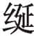
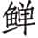
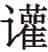
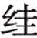
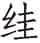
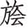

 桓公

***【题解】***

桓公，鲁国第十五代国君。名允，一名轨，鲁惠公之子，鲁隐公之弟。由于是惠公正室夫人仲子所生，所以被立为太子。惠公去世时年纪尚幼，由其兄公子息（鲁隐公）摄政。鲁隐公被弑后，于前711年即位，在位十八年。前694年桓公赴齐，齐襄公指使公子彭生杀桓公。鲁桓公有四子：庶长子庆父，庶次子叔牙，嫡长子公子同，嫡次子季友。桓公死后，鲁立太子同，是为庄公。庆父、叔牙、季友三兄弟后代演化成权分鲁国的“三桓”。在桓公时代，楚国初步登上中原争霸的政治舞台。

# 元年

***【经】***

1.1 元年春王正月①，公即位。

1.2 三月，公会郑伯于垂②，郑伯以璧假许田③。

1.3 夏四月丁未④，公及郑伯盟于越⑤。

1.4 秋，大水⑥。

1.5 冬十月。

***【注释】***

①元年：鲁桓公元年当周桓王九年，前711年。

②郑伯：指郑庄公。

③以璧假许田：指郑庄公以祊地加玉璧与鲁换许田。隐公八年，郑庄公曾派人请求用祊交换鲁国的许田。假，暂借。此为交易，讳言之，所以说“假”。

④丁未：初二。

⑤越：古地名，在今山东曹县一带。

⑥大水：大水成灾。

***【译文】***

鲁桓公元年春周历正月，鲁桓公即位。

三月，桓公在垂地与郑庄公相会，郑庄公用璧和祊地交换许田。

夏四月初二，桓公与郑庄公在越地会盟。

秋，大水成灾。

冬十月。

***【传】***

1.1 元年春，公即位，修好于郑。郑人请复祀周公，卒易祊田①。公许之。三月，郑伯以璧假许田，为周公、祊故也②。

***【注释】***

①郑人请复祀周公，卒易祊田：隐公八年记郑“以祊易许”，未说明鲁是否已送交许田，大概鲁接受祊地而不送许田，所以郑人乘修好之机再请祭祀周公，以促成这桩交易。

②为周公、祊故：为了请求祭祀周公和以祊交换许田的缘故。

***【译文】***

鲁桓公元年春，鲁桓公即位，对郑国恢复友好。郑人请求重新祭祀周公、完成祊田的交换。桓公答应了。三月，郑庄公又加上玉璧来做许田的交易，这是为了请求祭祀周公和以祊交换许田的缘故。

1.2 夏四月丁未，公及郑伯盟于越，结祊成也①。盟曰：“渝盟②，无享国③。”

***【注释】***

①结祊成：指巩固祊地的交换。

②渝（yú）盟：背弃盟约。

③享国：享有其国。

***【译文】***

夏四月初二，鲁桓公和郑庄公在越地结盟，这是为祊田的交换表示友好。誓词说：“如果违背盟约，就不能享有国家。”

1.3 秋，大水。凡平原出水为大水。

***【译文】***

秋，发大水。凡是平原被水淹了叫做大水。

1.4 冬，郑伯拜盟①。

***【注释】***

①拜盟：拜谢结盟。

***【译文】***

冬，郑庄公前来拜谢结盟。

1.5 宋华父督见孔父之妻于路①，目逆而送之②，曰：“美而艳③。”

***【注释】***

①华父督：名督，字华父，宋戴公之孙，好父说之子。孔父：名嘉，宋大司马。

②目逆而送之：人从对面来，先眼看着她走来，等她走过后，又盯着她的背影看她走远。逆，迎。

③美而艳：美丽动人。美指面目姣好，艳指光彩动人。按，此条应与下年《传》文“二年春，宋督攻孔氏，杀孔父而取其妻”连读。

***【译文】***

宋国的华父督在路上见到孔父的妻子，他眼看她从对面走过来，又回过头从后面盯着她走过去，说：“既美丽，又动人。”

# 二年

***【经】***

2.1 二年春①，王正月戊申②，宋督弑其君与夷及其大夫孔父③。

2.2 滕子来朝④。

2.3 三月，公会齐侯、陈侯、郑伯于稷⑤，以成宋乱⑥。

2.4 夏四月，取郜大鼎于宋⑦。戊申⑧，纳于大庙⑨。

2.5 秋七月，杞侯来朝⑩。

2.6 蔡侯、郑伯会于邓⑪。

2.7 九月，入杞⑫。

2.8 公及戎盟于唐⑬。

2.9 冬，公至自唐⑭。

***【注释】***

①二年：鲁桓公二年当周桓王十年，前710。

②正月戊申：正月无戊申日，当记日有误。

③与夷：即宋殇公。此年是宋殇公十年。

④滕子：滕国国君。

⑤齐侯：即齐僖公。陈侯：即陈桓公。郑伯：即郑庄公。稷：宋地名，在今河南商丘。

⑥以成宋乱：隐公三年，宋公子冯出居于郑。宋殇公与孔父多次与郑交战，华父督杀宋殇公而欲迎立公子冯，符合郑国的愿望。华父督又贿赂各国，因此鲁、齐、陈、郑会于稷，成全华父督之乱，树立华氏政权。成，成全。

⑦郜大鼎：鼎为郜国所铸，所以称为郜鼎。郜，在今山东成武东南，是年为宋所灭。

⑧戊申：初九。

⑨大庙：即鲁国太庙周公庙。大，同“太”。

⑩杞侯来朝：桓公即位，所以来朝。

⑪蔡侯：指蔡桓侯。邓：蔡国地名，其地在蔡之北、郑之南，在今河南郾城东南。

⑫入杞：指鲁国攻入杞国，《经》文不记名字，盖率兵者非卿。

⑬唐：鲁国地名，在今山东鱼台东北。

⑭公至自唐：指桓公从唐地回来。《春秋》凡记“至自”某地，都是回国后告于宗庙。

***【译文】***

二年春，周历正月戊申日，宋华父督杀害他的君主与夷和大夫孔父。

滕子来我国朝见。

三月，鲁桓公与齐僖公、陈桓公、郑庄公相会于稷地，是为了成全宋国之乱。

夏四月，从宋国取来郜国的大鼎。初九，把鼎放入太庙。

秋七月，杞侯来我国朝见。

蔡桓公、郑庄公相会于邓地。

九月，攻入杞国。

鲁桓公与戎国在唐地结盟。

冬，桓公从唐地回来告于祖庙。

***【传】***

2.1 二年春，宋督攻孔氏，杀孔父而取其妻①。公怒，督惧，遂弑殇公②。

***【注释】***

①孔氏：杨伯峻曰：“孔父此时犹未以孔为氏，‘孔氏’是追书之辞。”

②公怒，督惧，遂弑殇公：《公羊传》、《穀梁传》二处记此事，以为华父督欲弑殇公而先杀孔父，与《左传》所叙有出入。

***【译文】***

二年春，宋卿华父督攻打孔氏，杀死了孔父而占有他的妻子。宋殇公发怒，华父督害怕了，就把殇公也杀死了。

君子以督为有无君之心而后动于恶①，故先书弑其君。会于稷以成宋乱。为赂故，立华氏也。

***【注释】***

①君子以督为有无君之心而后动于恶：此句解释《经》文。君子认为《经》文先写宋督杀宋殇公，后写杀孔父，是宋督心中已无国君，然后才有此恶行。据隐公三年记载，孔父为顾命大臣，宋督杀孔父，则心目中已是无君了。动于恶，指杀害大臣的罪恶行为。

***【译文】***

君子认为华父督心里早已没有国君，然后才产生这种罪恶行动，所以《春秋》先记载弑其君。鲁桓公和齐僖公、陈桓公、郑庄公在稷地会见，商讨平定宋国的内乱。由于接受了贿赂的缘故，便建立华氏政权。

宋殇公立，十年十一战①，民不堪命②。孔父嘉为司马，督为大宰，故因民之不堪命③，先宣言曰④：“司马则然⑤。”已杀孔父而弑殇公，召庄公于郑而立之⑥，以亲郑。以郜大鼎赂公，齐、陈、郑皆有赂，故遂相宋公。

***【注释】***

①十年十一战：宋殇公在隐公四年即位，到隐公十一年，共打了十一仗。其中除了隐公五年取邾田与郑无关外，其余皆宋、郑交战。

②不堪：不能忍受。

③故：有意。因：承。

④宣言：扬言。

⑤司马则然：大司马要这样做。司马掌管全国军队，且孔父嘉为宋执政大臣，所以宋督早就宣扬说，频繁战争，是大司马要这样做的。把责任推给孔父嘉。

⑥庄公：即公子冯，其时出居于郑。

***【译文】***

宋殇公即位以后，十年之中发生了十一次战争，百姓不能忍受。孔父嘉做司马，华父督做太宰，华父督故意利用百姓的不能忍受，先宣扬说：“这都是司马要这样干的。”在杀了孔父和殇公之后，他把庄公从郑国召回并立他为国君，以此来亲近郑国。同时又把郜国的大鼎送给鲁桓公，对齐、陈、郑诸国也都馈送财礼，所以华父督就当了宋公的宰相。

2.2 夏四月，取郜大鼎于宋。戊申，纳于大庙。非礼也。

***【译文】***

夏四月，桓公从宋国取来了郜国的大鼎。初九，把大鼎安放在太庙里。这件事不符合礼制。

臧哀伯谏曰①：“君人者，将昭德塞违②，以临照百官③，犹惧或失之，故昭令德以示子孙。是以清庙茅屋④，大路越席⑤，大羹不致⑥，粢食不凿⑦，昭其俭也。衮、冕、黻、珽⑧，带、裳、幅、舄⑨，衡、、纮、⑩，昭其度也。藻、率、鞞、鞛⑪，鞶、厉、游、缨⑫，昭其数也⑬。火、龙、黼、黻⑭，昭其文也⑮。五色比象⑯，昭其物也。钖、鸾、和、铃⑰，昭其声也。三辰旂旗⑱，昭其明也⑲。夫德，俭而有度⑳，登降有数(21)。文、物以纪之(22)，声、明以发之(23)，以临照百官，百官于是乎戒惧，而不敢易纪律。

***【注释】***

①臧哀伯：鲁大夫，名达，僖伯之子。

②昭：显扬。塞：堵塞。违：邪，不合德义，违礼之事。

③临照：监视。

④清庙茅屋：以茅草盖屋作太庙。清庙，太庙。

⑤大路：一种车，此处用于祀天。其中木辂最朴素，玉辂最奢华。路，指君主所乘之车。越席：用蒲草结成的席，铺于大辂中作车垫。

⑥大羹：肉汁。祭祀用大羹。不致：仅煮而不用酸、苦、辛、咸、甘五味调和。

⑦粢食（zī sì）不凿：祭祀用的主食不舂。粢食，主食。《周礼·小宗伯》有六粢，即六种主食，黍、稷、稻、粱、麦、苽（ɡū，今谓之茭米）。祭祀以用黍、稷为常。凿，舂。

⑧衮（ɡǔn）：古代天子及上公的礼服。祭祀时穿用。冕：古代礼帽，大夫以上用。黻（fú）：祭服上用皮革做成以遮蔽腹膝之间的蔽膝。珽（tǐnɡ）：天子所用笏，长三尺，一名大圭。古代天子以至士，朝见皆执笏。

⑨带：指大带。礼服上用以束腰，其余下垂部分叫绅。等级不同，其带装饰不同。裳：下身的衣服，也叫裙。幅（bī）：绑脚布，古人以布缠足背，上至于膝。与近代的绑腿相似。舄（xì）：古代一种双底鞋，天子、诸侯有吉事时穿用。

⑩衡：衡笄，用来固定帽子。（dǎn）：冠冕上用以系瑱玉（又叫充耳）的带子。纮（hónɡ）：冠冕上的纽带，由颔下挽上而系在笄的两端。（yán）：冠冕上的一种装饰，盖在冕上的一块布。

⑪藻：垫玉的木板，上以粉白画水藻文。率（lǜ）：亦作“帨”，佩巾。鞞（bǐnɡ）：刀鞘。鞛（běnɡ）：佩刀刀把上的装饰物。

⑫鞶（pán）：皮做的束衣带。厉：鞶带下垂作为装饰的部分。游（liú）：同“旒”，古代旌旗上悬垂的飘带。缨（yīnɡ）：也叫“鞅”，套在马颈上的革带，驾车时用。

⑬昭其数：藻、率等八种物品各依地位之高低而不同。

⑭火、龙、黼（fǔ）、黻：皆衣裳上的花纹。火形是半环。龙即画成龙形。黼是黑白两色刺绣成一对斧头形。黻是用黑青两色刺绣成两个相背之弓形的花纹。

⑮昭其文：此四者均为文采，故云昭其文。

⑯五色：青、黄、赤、白、黑，古代以此为正色。比象：即用五色绘画山、龙、花、虫之象。

⑰钖（yánɡ）：马额头上的金属装饰，走时发出声响。鸾：通“銮”，古代的一种车铃。置于马嚼子或车衡上方。和：设在车轼（车前横木）上的小铃。铃：指设在旌旗上的小铃。

⑱三辰：日、月、星。旂（qí）旗：古代旗帜的总称。

⑲昭其明：旂旗所以为标志，且画有日、月、星、辰，故曰昭明。

⑳有度：有一定的制度。

(21)登降：增减。有数：有一定数量。

(22)文：指上文之火、龙、黼、黻。物：指五色比象。

(23)声：指钖、鸾、和、铃。明：指三辰旂旗。

***【译文】***

臧哀伯劝阻说：“作为百姓的君主，要发扬道德而阻塞邪恶，以为百官的表率，即使这样，仍然担心有所失误，所以显扬美德以示范于子孙。因此太庙用茅草盖屋顶，祭天之车用蒲草席铺垫，肉汁不加调料，主食不吃舂过的米，这是为了表示节俭。礼服、礼帽、蔽膝、大圭，腰带、裙子、绑腿、鞋子，横簪、瑱绳、冠系、冠布，都各有规定，用来表示衣冠制度。玉垫、佩巾、刀鞘、鞘饰、革带、带饰、飘带、马鞅，各级多少不同，用来表示各个等级规定的数量。画火、画龙、绣黼、绣黻，这都是为了表示文饰。五种颜色绘出各种形象，这都是为了表示色彩。钖铃、鸾铃、轼铃、旗铃，这都是为了表示声音。画有日、月、星的旌旗，这是为了表示标志。行为的准则应当节俭而有制度，增减也有一定的数量。用文饰、色彩来记录它，用声音、旗帜来发扬它，以此向文武百官作表率，百官才有警戒和畏惧，不敢违反纪律。

“今灭德立违，而置其赂器于大庙①，以明示百官，百官象之②，其又何诛焉③？国家之败，由官邪也。官之失德，宠赂章也④。郜鼎在庙，章孰甚焉？武王克商，迁九鼎于雒邑⑤，义士犹或非之，而况将昭违乱之赂器于大庙，其若之何？”公不听。

***【注释】***

①赂器：郜鼎本受贿而得，所以称之为赂器。

②象之：以此为榜样。

③诛：惩罚。

④章：显示，表明。

⑤武王克商，迁九鼎于雒邑：武王与商纣王战于牧野，灭商，纣王自焚死。成王七年，营建雒邑。迁鼎之事，恐非武王所为，臧哀伯顺口说及。九鼎，古代传说夏禹铸九鼎，象征九州，三代时奉为传国之宝。雒邑，即王城，在今河南洛阳。

***【译文】***

“现在废除道德而树立邪恶，把人家贿赂来的器物放在太庙里，公然展示给百官看，百官也模仿这种行为，还能惩罚谁呢？国家的衰败，由于官吏的邪恶。官吏的失德，由于受宠而贿赂公行。郜鼎放在太庙里，还有比这更明显的吗？周武王打败商朝，把九鼎迁到雒邑，当时的义士还有人认为他不对，更何况把表明邪恶叛乱的贿赂器物放在太庙里，这又该怎么办？”桓公不听。

周内史闻之曰①：“臧孙达其有后于鲁乎②！君违不忘谏之以德③。”

***【注释】***

①内史：周王室官名，掌策命诸侯及公卿大夫，凡四方之事书则读之。以当时人观之，通晓神道与天道，能言吉凶。详见庄公三十二年《传》。

②臧孙达其有后于鲁乎：有后，指臧哀伯之后代能长享禄位。杨伯峻曰：“以鲁大夫言，臧氏享世禄为最久，哀二十四年犹有鲁侯伐齐，乞灵于臧氏，臧石帅师会之，取廪丘之记载。”

③违：违背礼制。

***【译文】***

周朝的内史听说了这件事，说：“臧孙达的后代在鲁国恐怕能长享禄位吧！国君违背礼制，他没有忘记以道德来劝阻。”

2.3 秋七月，杞侯来朝，不敬。杞侯归，乃谋伐之。

***【译文】***

秋七月，杞侯来鲁国朝见，态度不够恭敬。杞侯回国，桓公就策划讨伐他。

2.4 蔡侯、郑伯会于邓，始惧楚也①。

***【注释】***

①始惧楚：此年为楚武王之三十一年，中原诸国患楚自此始。楚，又叫荆，芈姓国，初都丹阳（今湖北秭归），后迁枝江（也叫丹阳）。楚武王时迁郢，即今湖北江陵北之纪南城。

***【译文】***

蔡桓侯、郑庄公在邓地会见，从这时起两国开始对楚国有所畏惧。

2.5 九月，入杞，讨不敬也。

***【注释】***

①入杞，讨不敬也：杨伯峻曰：“僖二十七年《传》云：‘春，杞桓公来朝，用夷礼，故曰子。公卑杞，杞不共也。’又云：‘秋，入杞，责无礼也。’与此《传》事同而文异。”

***【译文】***

九月，攻入杞国，这是由于讨伐杞侯的不恭敬。

2.6 公及戎盟于唐，修旧好也①。

***【注释】***

①旧好：指隐公二年秋八月曾与戎结盟。

***【译文】***

桓公和戎在唐地结盟，这是为了重修过去的友好邦交。

2.7 冬，公至自唐，告于庙也。凡公行，告于宗庙；反行①，饮至②，舍爵③，策勋焉④，礼也。特相会⑤，往来称地⑥，让事也⑦。自参以上⑧，则往称地，来称会，成事也。

***【注释】***

①反：返回。

②饮至：诸侯朝天子、朝诸侯、参加盟会、征战，行前应亲自祭告祖庙，返回时，又应亲自祭告祖庙，祭后会群臣饮酒，叫饮至。

③舍（shè）爵：饮酒。舍，置。爵，酒杯。

④策勋：有功劳者书之于策，叫策勋，也叫书劳。

⑤特相会：指鲁公单独与另一国君相见。特，单独。

⑥往来称地：无论鲁公前往还是他国国君前来，都记载会见的地点。

⑦让事：二人单独相会，彼此谦让为主，叫让事。

⑧参：通“三”。

***【译文】***

冬季，桓公从唐地回来，《春秋》所以记载，是由于回来后祭告了宗庙。凡是国君出国之前，要祭告宗庙；回来，也要祭告宗庙，还要宴请臣下，互相劝酒，把功劳记载在档案里，这是合于礼的。两国国君单独会见，来回都只记载会见的地点，这是互相谦让谁为会首的会见。会见的国君在三个以上，那就在去他国时记载会见的地点，他国国君前来就不记载会见地点而仅仅记载会见，这是盟主已在会前决定，只是完成会见手续罢了。

2.8 初①，晋穆侯之夫人姜氏以条之役生太子②，命之曰仇③。其弟以千亩之战生④，命之曰成师。师服曰⑤：“异哉，君之名子也！夫名以制义⑥，义以出礼，礼以体政⑦，政以正民⑧。是以政成而民听，易则生乱⑨。嘉耦曰妃⑩，怨耦曰仇⑪，古之命也⑫。今君命大子曰仇，弟曰成师，始兆乱矣⑬，兄其替乎⑭？”

***【注释】***

①初：当初，此是追叙前事。

②姜氏：齐侯女。穆侯四年，娶齐女为夫人。条之役：据《史记·晋世家》，条之役在晋穆侯七年（前805），当周宣王二十三年，鲁孝公二年。《竹书纪年》载“王师及晋穆侯伐条戎、奔戎，王师败逋”。条，条戎，故地在今陕西安邑。

③仇：晋文侯之名。条之役王师与晋师俱败逃，晋穆侯不悦，正在此时姜氏生太子，所以叫他仇。

④千亩之战：发生在晋穆侯十年（前802），当周宣王二十六年，晋攻千亩获胜。千亩，在今山西安泽北。

⑤师服：晋国大夫。

⑥名以制义：名字是用来表示道义。

⑦礼以体政：礼为政治、政法之本体。体，本体。

⑧正民：端正百姓的行为。

⑨易：相反。

⑩嘉耦曰妃（pèi）：美好姻缘叫妃。

⑪怨耦曰仇：夫妻相恶叫仇。

⑫命：名。

⑬兆乱：预兆祸乱。

⑭兄：指太子仇。替：衰微。

***【译文】***

当初，晋穆侯的夫人姜氏在条之战的时候生了太子，此战晋国战败，所以取名叫仇。仇的兄弟是在千亩之战时生的，此战晋国获胜，因此取名叫成师。师服说：“奇怪呀，国君给儿子取这样的名字！取名表示一定的意义，意义产生礼仪，礼仪是政事的骨干，政事端正百姓行为，所以政事没有失误百姓就服从，相反就发生动乱。相爱的夫妻叫妃，相怨的夫妻叫仇，这是古代人命名的方法。现在国君给太子取名叫仇，他的兄弟叫成师，这就开始预示祸乱了。做哥哥的恐怕要衰微了吧？”

惠之二十四年①，晋始乱，故封桓叔于曲沃②，靖侯之孙栾宾傅之③。师服曰：“吾闻国家之立也，本大而末小④，是以能固。故天子建国⑤，诸侯立家⑥，卿置侧室⑦，大夫有贰宗⑧，士有隶子弟⑨，庶人、工、商，各有分亲，皆有等衰⑩。是以民服事其上而下无觊觎⑪。今晋，甸侯也⑫，而建国。本既弱矣，其能久乎？”

***【注释】***

①惠之二十四年：即前745。惠，即鲁惠公。

②封桓叔于曲沃：《史记·晋世家》：“文侯仇卒，子昭侯伯立。昭侯元年，封文侯弟成师于曲沃。曲沃邑大于翼。翼，晋君都邑也。成师封曲沃，号为桓叔。……桓叔是时年五十八矣，好德，晋国之众皆附焉。”

③靖侯：桓叔之高祖。栾宾：字宾父，为桓叔之叔祖。傅之：相之，辅佐他。

④本：根本。末：枝叶。

⑤天子建国：周天子分封诸侯，建立诸侯国。

⑥诸侯立家：诸侯分采邑与卿大夫，谓之立家。

⑦侧室：指庶子，亦为官名。

⑧贰宗：官名，以大夫宗室之弟担任。

⑨士有隶子弟：士自以其子弟为仆隶。

⑩等衰（cuī）：等差，等级。杨伯峻曰：“庶民以及工商，其中不再分尊卑，而以亲疏为若干等级之分别。”

⑪服事：服从。觊觎（jì yú）：非分的企图。

⑫甸侯：周王朝甸服的诸侯。甸服，周有天下，规定天子王城外方圆千里以内的诸侯为甸服。晋为甸侯，其地位原不甚高，不能封赐卿大夫立家。

***【译文】***

鲁惠公二十四年，晋国开始发生动乱，所以把桓叔封在曲沃，靖侯的孙子栾宾做他的辅相。师服说：“我听说国家的建立，根本大而枝节小，这样才能稳固。所以天子封建诸侯国，诸侯建立卿大夫的采邑，卿设置同宗兄弟为侧室官，大夫又有宗室子弟为贰宗官，士有仆隶子弟，庶人、工、商各有亲疏，都有大小不同的等级。所以百姓才肯事奉长上，身居下位的人也没有什么非分的念头。现在晋国是王畿之内的甸服侯国，而又另外建立侯国，它的根本既已衰弱，还能够长久吗？”

惠之三十年①，晋潘父弑昭侯而纳桓叔②，不克。晋人立孝侯③。惠之四十五年④，曲沃庄伯伐翼⑤，弑孝侯。翼人立其弟鄂侯⑥。鄂侯生哀侯⑦。哀侯侵陉庭之田⑧。陉庭南鄙启曲沃伐翼⑨。

***【注释】***

①惠之三十年：即前739。

②纳：接纳。曲沃本晋都，穆侯时迁都到绛（即翼）。昭侯把桓叔封在曲沃。潘父要迎桓叔入晋都，所以说“纳”。

③晋人立孝侯：《史记·晋世家》：“昭侯七年，晋大臣潘父弑其君昭侯，而迎曲沃桓叔。桓叔欲入晋，晋人发兵攻桓叔。桓叔败，还归曲沃。晋人共立昭侯子平为君，是为孝侯。诛潘父。”孝侯，即晋孝侯，姓姬名平，晋昭侯之子，晋国第十三任君主。

④惠之四十五年：即前724。

⑤庄伯：桓叔子。晋孝侯八年，桓叔死，子代之，称为曲沃庄伯。翼：即绛地，当时晋都，在今山西翼城东南。

⑥鄂侯：即晋鄂侯，姓姬名郄，晋孝侯之子，晋国第十四任君主，在位六年。

⑦哀侯：即晋哀侯，姓姬名光，晋国第十五任君主，在位九年。

⑧陉（xínɡ）庭：翼南边境小城。

⑨南鄙：此指陉庭南部边境的人。启，引导。

***【译文】***

鲁惠公三十年，晋国的潘父弑昭侯而准备接纳桓叔，没有成功。晋国人立了孝侯。鲁惠公四十五年，曲沃庄伯攻打翼城，弑孝侯。翼城人立他的兄弟鄂侯。鄂侯生了哀侯。哀侯侵占陉庭地方的田土。陉庭南部边境的人引导曲沃攻打翼城。

# 三年

***【经】***

3.1 三年春正月①，公会齐侯于嬴②。

3.2 夏，齐侯、卫侯胥命于蒲③。

3.3 六月，公会杞侯于郕④。

3.4 秋七月壬辰朔⑤，日有食之，既⑥。

3.5 公子翚如齐逆女⑦。

3.6 九月，齐侯送姜氏于⑧。

3.7 公会齐侯于⑨。

3.8 夫人姜氏至自齐⑩。

3.9 冬，齐侯使其弟年来聘⑪。

3.10 有年⑫。

***【注释】***

①三年：鲁桓公三年当周桓王十一年，前709。

②齐侯：指齐僖公。嬴：在今山东莱芜西北。

③卫侯：指卫宣公。胥命：互相申约，但不歃血设盟，泛指一般的会见。蒲：卫地名，在今河南长垣。

④郕：在今山东宁阳东北。

⑤朔：初一。此日为前709年7月17日。

⑥日有食之，既：即发生了日全食。《汉书·五行志》云：“京房《易传》以为桓三年日食，贯中央，上下竟而黄。”

⑦公子翚如齐逆女：杨伯峻曰：“旧礼，除天子外，取妻皆必亲迎。但《春秋》无诸侯迎夫人之文，恐诸侯之亲迎，不出国境，出国境则使卿代迎。”

⑧（huān）：鲁地名，在今山东肥城。

⑨公会齐侯于：此事无《传》文说明，可能为桓公迎亲。

⑩姜氏：齐侯女。

⑪聘：外交访问。

⑫有年：五谷皆熟叫有年，即丰年。

***【译文】***

鲁桓公三年春正月，桓公与齐僖公在嬴地相会。

夏，齐僖公、卫宣公在蒲地会谈。

六月，桓公与杞侯在郕地相会。

秋七月初一凌晨，发生日全蚀。

公子翚去齐国迎接齐女。

九月，齐僖公送姜氏到地。

桓公与齐僖公在地相会。

夫人姜氏从齐国来到我国。

冬，齐僖公派他的弟弟夷仲年来我国聘问。

五谷丰收。

***【传】***

3.1 三年春，曲沃武公伐翼①，次于陉庭②。韩万御戎③，梁弘为右④，逐翼侯于汾隰⑤，骖而止⑥。夜获之，及栾共叔⑥。

***【注释】***

①曲沃武公：隐公七年，曲沃庄伯死，其子称继位，是为武公。

②次：军队停留两宿以上。古代军队在外，住一夜叫“舍”，两夜叫“信”，两夜以上叫“次”。

③韩万：曲沃桓叔之子，武公的叔父，受封于韩，因以为姓。韩，国名，姬姓，在今山西河津东。据《竹书纪年》，春秋前晋文侯二十一年灭之。御戎：驾驭兵车。

④梁弘：曲沃之臣。为右：即车右，拿着戈盾，以防备非常。古代兵车，主将在中，御者在左，车右在右。

⑤逐翼侯于汾隰（xí）：汾水源出山西宁武西南之管涔山，西南流经静乐西，东南流经太原，折而西南，经介休、灵石、霍、洪洞、临汾诸地之西，至新绛东南折而西流，至河津西南入黄河。此逐翼侯之地当在今襄汾、曲沃之间。翼侯，即晋哀侯。汾，汾水。隰，水边低地。

⑥骖（cān）：古代兵车一车四马，中间两马叫服，两边二马叫骖。（ɡuà）：绊住，挂碍。

⑦栾共叔：即曲沃桓叔之傅栾宾之子，名成。《国语·晋语一》云：“武公伐翼，杀哀侯，止栾共子曰：‘苟无死，吾以子见天子，令子为上卿，制晋国之政。’共子辞而死之。”《晋世家》云：“哀侯九年，伐晋于汾旁，虏哀侯。”则哀侯与栾共叔俱死。

***【译文】***

鲁桓公三年春，曲沃武公进攻翼城，军队驻扎在陉庭。韩万为武公驾车，梁弘作为车右，在汾水边的低洼地追赶晋哀侯，由于骖马被绊住才停下来。夜里，俘获了晋哀侯和栾共叔。

3.2 会于嬴，成昏于齐也。

***【译文】***

桓公和齐僖公在嬴地会见，这是由于和齐女订婚。

3.3 夏，齐侯、卫侯胥命于蒲，不盟也。

***【译文】***

夏季，齐僖公、卫宣公在蒲地只是会谈，没有结盟。

3.4 公会杞侯于郕，杞求成也①。

***【注释】***

①求成：要求讲和。上年鲁“入杞，讨不敬”，所以此年杞侯要求讲和。

***【译文】***

桓公和杞侯在郕地会见，这是由于杞国要求议和。

3.5 秋，公子翚如齐逆女。修先君之好，故曰“公子”①。齐侯送姜氏于，非礼也。凡公女②，嫁于敌国③，姊妹，则上卿送之，以礼于先君；公子④，则下卿送之。于大国，虽公子，亦上卿送之。于天子，则诸卿皆行，公不自送。于小国，则上大夫送之⑤。

***【注释】***

①公子：公子翚此行是重修前代国君旧好，所以《春秋》称他为公子。

②公女：公室女子。

③敌国：对等的国家。敌，匹敌，同等。

④公子：男女通用，此指女公子，即国君之女。

⑤则上大夫送之：按，“凡公女”至此是解释为什么说齐侯“非礼”。诸侯嫁女不自送，齐侯自送，所以说“非礼”。杨伯峻曰：“《士昏礼》云：‘舅飨送者以一献之礼，酬以束锦。’郑玄《注》云：‘送者，女家有司也。’则纵大夫与士嫁女，主人亦不自送。”

***【译文】***

秋，公子翚到齐国迎接齐女。因为是重修前代国君的友好关系，所以《春秋》称翚为“公子”。齐僖公护送姜氏出嫁，到了地，这是不合于礼的。凡是本国的公室女子出嫁到同等级国家，如果是国君的姐妹，就由上卿护送她，以表示对前代国君的尊敬；如果是国君的女儿，就由下卿护送她。出嫁到大国，即便是国君的女儿，也由上卿护送她。嫁给天子，各位大臣都要去护送她，国君不亲自护送。出嫁到小国，就由上大夫护送她。

3.6 冬，齐仲年来聘①，致夫人也②。

***【注释】***

①齐仲年来聘：古时诸侯女子出嫁，又派大夫随后加以聘问。

②致：护送，此指对被护送者尽到责任。

***【译文】***

冬季，齐仲年前来聘问，这是为了把姜氏护送到鲁都。

3.7 芮伯万之母芮姜恶芮伯之多宠人也①，故逐之，出居于魏②。

***【注释】***

①芮（ruì）：诸侯国名，姬姓，在今陕西大荔东南。宠人：即宠姬。

②魏：此指古魏国，即《诗经·国风·魏风》之魏，在今山西芮城东北。杨伯峻曰：“芮城县西三十里郑村有芮伯城，当为芮伯万被逐所居之地。”此句为明年秦国侵芮一事张本。

***【译文】***

芮伯万的母亲芮姜嫌恶芮伯的宠姬太多，因此把他赶走，让他住到魏城。

# 四年

***【经】***

4.1 四年春正月①，公狩于郎②。

4.2 夏，天王使宰渠伯纠来聘③。

***【注释】***

①四年：鲁桓公四年当周桓王十二年，前708。

②狩：冬猎叫狩。郎：在今山东鱼台东北。

③宰：官名，掌管王家内外事务。渠伯纠：渠，本周室地名，此以封邑为氏。排行第一称伯，纠是其名。

***【译文】***

鲁桓公四年春周历正月，桓公在郎地狩猎。

夏，周天子派宰渠伯纠来我国聘问。

***【传】***

4.1 四年春正月，公狩于郎。书，时，礼也①。

***【注释】***

①书，时，礼也：杨伯峻曰：“《周礼·大司马》：‘中冬教大阅，遂以狩田。’周正之春正月，正夏正之仲冬十一月。但此年实是建丑，春正月为夏正之季冬十二月，亦农闲可以狩猎之时，故曰‘时’。”

***【译文】***

鲁桓公四年春正月，鲁桓公在郎地打猎。《春秋》记载这件事，是由于这正是狩猎之时，合于礼。

4.2 夏，周宰渠伯纠来聘。父在，故名①。

***【注释】***

①父在，故名：因为渠伯纠与他的父亲同在周王室任职，所以《春秋》记载他的名字。这是解释《春秋》书法。

***【译文】***

夏，周朝的宰官渠伯纠来鲁国聘问。由于他与他的父亲同在周王室任职，所以《春秋》写出他的名字。

4.3 秋，秦师侵芮①，败焉，小之也②。

***【注释】***

①秦师侵芮：按，这是《左传》首次记载秦国史事。秦，诸侯国名，嬴姓，相传周孝王封伯益之后非子于秦（今甘肃天水），作为附庸。后秦襄公护送周平王东迁有功，被分封为诸侯。秦宁公时迁都到平阳（今陕西宝鸡），秦德公时又迁都于雍（今陕西凤翔），献公时迁都栎阳（今陕西临潼），孝公迁都咸阳（今陕西咸阳）。

②小：轻敌。

***【译文】***

秋，秦国的军队袭击芮国，秦军战败，由于小看了敌人的缘故。

4.4 冬，王师、秦师围魏，执芮伯以归①。

***【注释】***

①芮伯：即芮伯万。

***【译文】***

冬，周桓王的军队和秦国军队联合包围芮国，俘虏了芮伯回来。

# 五年

***【经】***

5.1 五年春正月①，甲戌、己丑②，陈侯鲍卒③。

5.2 夏，齐侯、郑伯如纪④。

5.3 天王使仍叔之子来聘⑤。

5.4 葬陈桓公。

5.5 城祝丘⑥。

5.6 秋，蔡人、卫人、陈人从王伐郑⑦。

5.7 大雩⑧。

5.8 螽⑨。

5.9 冬，州公如曹⑩。

***【注释】***

①五年：鲁桓公五年当周桓王十三年，前707。

②甲戌：指上年十二月二十一日。己丑：指是年正月初六。

③陈侯鲍：指陈桓公。

④齐侯：指齐僖公。郑伯：指郑庄公。纪：国名，在今山东寿光。

⑤天王使仍叔之子来聘：仍叔年老，故使仍叔之子代其行事，因其本身在朝廷中没有爵位，所以不记其名。仍叔，世为周朝大夫。

⑥祝丘：鲁地名，在今山东临沂。

⑦蔡人、卫人、陈人从王伐郑：此次战役即《传》文中的葛之战。春秋间，唯此役天子亲征。

⑧雩（yú）：为求雨而举行的祭祀。

⑨螽（zhōnɡ）：飞蝗。此指飞蝗成灾。

⑩州：诸侯国名，姜姓，地在今山东安丘。曹：诸侯国名，姬姓，武王时封其弟叔振铎于曹，地在今山东定陶。

***【译文】***

鲁桓公五年春周历正月，去年十二月二十一日、今年正月初六，陈桓公鲍去世。

夏，齐僖公、郑庄公去纪国。

周天子派仍叔之子来我国聘问。

安葬陈桓公。

修筑祝丘的城墙。

秋，蔡国人、卫国人、陈国人跟随周桓王讨伐郑国。

举行求雨的祭祀。

发生蝗灾。

冬，州公去曹国。

***【传】***

5.1 五年春正月，甲戌，己丑，陈侯鲍卒，再赴也①。于是陈乱，文公子佗杀太子免而代之②。公疾病而乱作，国人分散，故再赴③。

***【注释】***

①再赴也：指甲戌、己丑两次讣告。甲戌至己丑，相距十六日。赴，报丧。

②文公子佗：指陈佗，即五父，太子免的叔父。太子免：陈桓公太子。

③故再赴：这是说明“再赴”的缘故。杨伯峻曰：“《公羊传》云：‘甲戌之日亡，己丑之日死（尸）而得，君子疑焉，故以二日卒之也。’《穀梁传》云：‘《春秋》之义，信以传信，疑以传疑。陈侯以甲戌之日出，己丑之日得，不知死之日，故举二日以包也。’推二《传》之意，盖以陈桓公患精神病，甲戌之日一人出走，经十六日而后得其尸，不知其气绝之日，故《春秋》作者举二日以包之。左氏则以为再赴，较为可信，故《史记》从之。”

***【译文】***

鲁桓公五年春正月，去年十二月二十一日，今年正月初六，陈侯鲍逝世。《春秋》所以记载两个日子，是由于发了两次讣告而日期不同。当时陈国发生动乱，文公的儿子佗杀了太子免而取代他。陈侯病危的时候动乱发生，国内臣民纷纷离散，因此发了两次讣告。

5.2 夏，齐侯、郑伯朝于纪，欲以袭之。纪人知之①。

***【注释】***

①纪人知之：齐、郑都是大国，且齐僖公、郑庄公都是当时雄主，此时一起来朝，可见别有用心，故纪人知之。

***【译文】***

夏，齐僖公、郑庄公去纪国访问，想要乘机袭击纪国。纪国人发觉了。

5.3 王夺郑伯政①，郑伯不朝。秋，王以诸侯伐郑②，郑伯御之。

***【注释】***

①王夺郑伯政：隐公三年，“王贰于虢”，周平王就想分郑庄公之政；隐公八年，“虢公忌父始作卿士于周”，周桓王始分郑庄公之政；隐公九年，“郑伯为王左卿士”，虢公为王右卿士，二人平起平坐；至此年，周桓王罢免了郑庄公卿士的官职，不让他参与周朝政。

②诸侯：此指蔡、卫、陈等国。

***【译文】***

周桓王不让郑庄公参与周朝政，郑庄公不再入周朝觐。秋，周桓王带领诸侯讨伐郑国，郑庄公出兵抵御。

王为中军；虢公林父将右军①，蔡人、卫人属焉；周公黑肩将左军②，陈人属焉。

***【注释】***

①虢公林父：即虢仲，时为周王卿士。

②周公黑肩：指周桓公，名黑肩。杨伯峻以为此时代郑庄公为卿士。

***【译文】***

周桓王率领中军；虢公林父率领右军，蔡军、卫军隶属于右军；周公黑肩率左军，陈军隶属于左军。

郑子元请为左拒以当蔡人、卫人①，为右拒以当陈人，曰：“陈乱②，民莫有斗心，若先犯之③，必奔。王卒顾之④，必乱。蔡、卫不枝⑤，固将先奔。既而萃于王卒⑥，可以集事⑦。”从之。曼伯为右拒⑧，祭仲足为左拒，原繁、高渠弥以中军奉公⑨，为鱼丽之陈⑩，先偏后伍，伍承弥缝⑪。

***【注释】***

①子元：郑庄公次子公子突。拒：或作“矩”，方形的阵势。当：抵敌，抵当。

②陈乱：指陈桓公死，公子佗杀太子免，国人散乱之事。

③犯：攻击。

④王卒顾之：指王卒一边要与郑军作战，一边要顾及陈国被击溃的军队。顾，顾及，照顾。

⑤不枝：不能支持。枝，支持，支撑。

⑥萃：集中。

⑦集事：成功。

⑧曼伯：郑庄公长子公子忽。

⑨原繁：郑大夫。高渠弥：郑卿，亦称高伯。以上诸人俱已见隐公五年《传》。公：指郑庄公。

⑩鱼丽之陈：古代的一种军阵。陈，同“阵”。

⑪先偏后伍，伍承弥缝：此两句解释鱼丽阵法。兵车一队分为若干偏，并用步卒来弥补偏之间的缝隙。偏，车战二十五乘为一偏。伍，五人为伍。

***【译文】***

郑国的子元建议用左方阵来对付蔡军和卫军，用右方阵来对付陈军，说：“陈国动乱，百姓都缺乏战斗意志，如果先攻击陈军，他们必定奔逃。周天子的军队要照顾陈军，就一定会发生混乱。蔡国和卫国的军队支撑不住，也一定会争先奔逃。这时我们可集中兵力对付周天子的中军，我们就可以获得成功。”郑庄公听从了。曼伯担任右方阵的指挥，祭仲足担任左方阵的指挥，原繁、高渠弥带领中军护卫郑庄公，摆开了叫做鱼丽的阵势，兵车在前，步卒在后，步卒来弥补兵车的空隙。

战于葛①，命二拒曰：“动而鼓②。”蔡、卫、陈皆奔，王卒乱，郑师合以攻之，王卒大败。祝聃射王中肩③，王亦能军④。祝聃请从之⑤。公曰：“君子不欲多上人⑥，况敢陵天子乎⑦！苟自救也，社稷无陨⑧，多矣⑨。”

***【注释】***

①（xū）葛：即隐公五年之长葛。在今河南长葛东北。

②（kuài）：大将所用军旗，用为号令。

③祝聃：郑国大臣。

④军：指挥军队。

⑤从：追逐。

⑥上：凌驾。

⑦陵：侵侮。

⑧陨：国家危亡。

⑨多矣：满足。当时的习惯用语。

***【译文】***

双方在葛交战，郑庄公命令左右两边方阵说：“看到大旗挥动，就击鼓进军。”郑国的军队发起进攻，蔡、卫、陈军一起奔逃，周军因此混乱，郑国的军队从两边合拢来进攻，周军终于大败。祝聃射中周桓王的肩膀，桓王还能指挥军队。祝聃请求前去追赶。郑庄公说：“君子不希望欺人太甚，哪里敢欺凌天子呢？只要能挽救自己，国家免于危亡，这就足够了。”

夜，郑伯使祭足劳王①，且问左右②。

***【注释】***

①劳：慰问。

②问左右：慰问周王左右之臣。

***【译文】***

夜间，郑庄公派遣祭仲足去慰问周桓王，同时也问候他的左右随从。

5.4 仍叔之子来聘，弱也①。

***【注释】***

①弱：年幼，年少。

***【译文】***

仍叔的儿子前来聘问。《春秋》所以记为“仍叔之子”而不记他的名字，是由于他年轻。

5.5 秋，大雩。书，不时也。凡祀，启蛰而郊①，龙见而雩②，始杀而尝③，闭蛰而烝④。过则书⑤。

***【注释】***

①启蛰：惊蛰。古之惊蛰在雨水前，为夏正正月之中气。《淮南子·天文训》改惊蛰在雨水后，为夏正二月节气。郊：夏历正月祈谷的祭礼。

②龙见：角、亢两宿于黄昏出现于东方。在夏正四月。龙，苍龙，是东方角、亢、氐、房、心、尾、箕七宿的总称。见，同“现”。

③始杀：指秋气来后，天气萧杀。在夏正七月。尝：秋祭名。《礼记·月令》所谓“孟秋之月，农乃登谷，天子尝新，先荐寝庙”。

④闭蛰：昆虫蛰伏。在夏正十月。烝（zhēnɡ）：冬祭名，杜预《春秋左传注》所谓“万物皆成，可荐者众，故烝祭宗庙”。

⑤过：非正常时节的祭祀。

***【译文】***

秋季，为求雨而举行大雩祭。《春秋》记载这件事，是由于这不是按时的祭祀。凡是祭祀，昆虫惊动举行郊祭，苍龙的角亢二宿出现举行雩祭，秋天寒气降临举行尝祭，昆虫蛰伏举行烝祭。如果过了规定的时间举行祭礼，就要记载。

5.6 冬，淳于公如曹①。度其国危，遂不复。

***【注释】***

①淳于公：即州公。州，国名，都于淳于，在今山东安丘东北。以都名代称国名，古时本有此例，如魏惠王迁都大梁，即可称梁惠王；韩迁都于郑，亦称郑国。

***【译文】***

冬季，淳于公到曹国。自己估计他的国家将发生危难，因此没有再回国了。

# 六年

***【经】***

6.1 六年春正月，寔来①。

6.2 夏四月，公会纪侯于成②。

6.3 秋八月壬午③，大阅④。

6.4 蔡人杀陈佗⑤。

6.5 九月丁卯⑥，子同生⑦。

6.6 冬，纪侯来朝。

***【注释】***

①六年春正月，寔来：此句本应接上年《经》文，主语为“州公”。自分《经》之年后，一事分属两年。六年，鲁桓公六年当周桓王十四年，前706。寔，同“实”。

②成：同“郕”，故城在今山东宁阳东北。

③壬午：初八日。

④大阅：阅兵，即检阅兵车及驾车之马。

⑤蔡人杀陈佗：此事本年无《传》，据庄公二十二年《传》，蔡国为立己国女子所生的公子跃为君，故杀陈佗。公子跃即陈厉公。是年即为陈厉公元年。陈佗，即上年之公子佗。

⑥丁卯：二十四日。

⑦子同：鲁桓公的儿子，名同，后来的鲁庄公。

***【译文】***

鲁桓公六年春周历正月，州公来我国。

夏四月，桓公与纪侯在成地相会。

秋八月初八，举行盛大的阅兵活动。

蔡国人杀死陈佗。

九月二十四日，桓公子同出生。

冬，纪侯来我国朝见。

***【传】***

6.1 六年春，自曹来朝。书曰“寔来”，不复其国也①。

***【注释】***

①复：回。

***【译文】***

鲁桓公六年春，州公从曹国前来朝见。《春秋》记载作“寔来”，是由于他真正不再回国了。

6.2 楚武王侵随①，使薳章求成焉②。军于瑕以待之③。随人使少师董成④。

***【注释】***

①楚武王：名熊通，前740年即位。是年为楚武王三十五年。随：诸侯国名，姬姓，在今湖北随州。

②薳（wěi）章：也作章。《潜夫论·志氏姓》云：“蚠冒生章者，王子无钩也。”因食邑在薳，故名薳章。蚠冒亦作“蚡冒”，是楚武王的父亲，则薳章为楚武王的兄弟。

③瑕：随国地名。今地不详。

④少师：官名。董成：主持和谈。董，主持。

***【译文】***

楚武王入侵随国，先派薳章去谈判，把军队驻扎在瑕地以等待结果。随国人派少师主持和谈。

斗伯比言于楚子曰①：“吾不得志于汉东也②，我则使然。我张吾三军③，而被吾甲兵④，以武临之，彼则惧而协来谋我，故难间也⑤。汉东之国，随为大，随张⑥，必弃小国⑦。小国离，楚之利也。少师侈⑧，请羸师以张之⑨。”熊率且比曰⑩：“季梁在⑪，何益？”斗伯比曰：“以为后图，少师得其君。”王毁军而纳少师⑫。

***【注释】***

①斗伯比：即后来的令尹子文之父。斗氏为芈姓，楚先王若敖的后代。

②得志：指扩张国土。汉东：汉水以东，多姬姓小国。

③张：扩大。

④被吾甲兵：整顿装备。

⑤间：离间。

⑥张：自高自大。

⑦弃：轻视。

⑧侈：骄傲。

⑨羸（léi）师：此处指让军队故意表现出衰弱的样子。羸，衰弱。

⑩熊率且比：楚国大夫。

⑪季梁：随国贤臣。

⑫毁军：故意乱其军阵。纳：迎于军中。

***【译文】***

斗伯比对楚武王说：“我国在汉水东边领土得不到扩张，是我们自己造成的。我们扩大军队，整顿装备，用武力逼迫别国，他们害怕因而共同来对付我们，所以就难于离间了。在汉水东边的国家中，随国最大，随国要是自高自大，就必然轻视小国。小国离心，对楚国有利。少师这个人很骄傲，请君王隐藏我军的精锐，而让他看到疲弱的士卒，助长他的骄傲。”熊率且比说：“有季梁在，这样做有什么好处？”斗伯比说：“这是为以后打算，因为少师可以得到他们国君的信任。”楚武王故意把军容弄得疲惫懈怠来接待少师。

少师归，请追楚师，随侯将许之。季梁止之曰：“天方授楚，楚之羸，其诱我也，君何急焉？臣闻小之能敌大也，小道大淫①。所谓道，忠于民而信于神也②。上思利民，忠也；祝史正辞③，信也。今民馁而君逞欲④，祝史矫举以祭⑤，臣不知其可也。”公曰：“吾牲牷肥腯⑥，粢盛丰备⑦，何则不信？”对曰：“夫民，神之主也。是以圣王先成民而后致力于神。故奉牲以告曰‘博硕肥腯’⑧，谓民力之普存也，谓其畜之硕大蕃滋也⑨，谓其不疾瘯蠡也⑩，谓其备腯咸有也⑪。奉盛以告曰‘洁粢丰盛’⑫，谓其三时不害而民和年丰也⑬。奉酒醴以告曰‘嘉栗旨酒’⑭，谓其上下皆有嘉德而无违心也⑮。所谓馨香⑯，无谗慝也⑰。故务其三时，修其五教⑱，亲其九族⑲，以致其禋祀⑳。于是乎民和而神降之福，故动则有成。今民各有心，而鬼神乏主(21)，君虽独丰，其何福之有！君姑修政而亲兄弟之国(22)，庶免于难。”随侯惧而修政，楚不敢伐。

***【注释】***

①小道大淫：小国有道而大国无度。

②信：诚信。

③祝史：主持祭祀祈祷之官。正辞：言辞正实不欺。

④馁：饥饿。逞欲：力图满足自己的欲望。

⑤矫举：用诈伪之辞称述功德。

⑥牲牷（quán）：祭祀用的牺牲。牷，毛色纯一的牛。肥腯（tú）：肥壮。

⑦粢盛（chénɡ）：祭祀用的粮食。粢，祭祀所用之黍稷等谷物。盛，盛在祭器中的祭品。

⑧博：广。硕：大。

⑨蕃滋：繁殖。

⑩不疾瘯蠡（cù luǒ）：不病、不瘦弱。瘯蠡，指六畜疥癣之疾。

⑪备腯咸有：品种齐全。

⑫洁粢丰盛：指谷物清洁，盛满祭器。

⑬三时：春、夏、秋，是务农之时。不害：指不违农时。

⑭醴：酒。嘉栗旨酒：清洌而美的好酒。栗，杨伯峻引俞樾《茶香室经说》以为借为“洌”。

⑮无违心：无异心。

⑯馨香：芳香远闻。杨伯峻曰：“馨香既指祭品言，古人亦以为祭品之馨香尤在祭者之德行有以副之。”

⑰谗：诬陷人的坏话。慝（tè）：邪恶。

⑱五教：指父义、母慈、兄友、弟恭、子孝。

⑲九族：从高祖、曾祖、祖父、父亲、本身，到子、孙、曾孙、玄孙共九代，称为九族。或说也包括异姓亲戚。

⑳禋（yīn）祀：祭祀鬼神。

(21)鬼神乏主：前云“民，神之主也”，如今民各有心则不和，则鬼神乏主。与前文照应。

(22)兄弟之国：指汉东诸姬姓国。

***【译文】***

少师回去，请求追逐楚军，随侯准备答应。季梁劝阻说：“上天正在帮助楚国，楚国军队显得疲惫懈怠的样子，是引诱我们。国君何必急于从事？下臣听说小国之所以能够抵抗大国，是小国有道，而大国君主放纵无度。所谓道，就是忠于百姓而取信于神明。上边的人想到对百姓有利，这是忠；祝史真实不欺地祝祷，这是信。现在百姓饥饿而国君放纵个人享乐，祝史浮夸功德来祭祀，下臣不知怎样行得通。”随侯说：“我祭祀用的牲口都既无杂色，又很肥大，黍稷也都丰盛完备，为什么不能取信于神明？”季梁回答说：“百姓，是神明的主人。因此圣王先团结百姓，而后才致力于神明。所以在奉献牺牲的时候祝告说‘牲口又大又肥’，这是说百姓的财力普遍富足，牲畜肥大而繁殖生长，并没有得病而瘦弱，又有各种优良品种。在奉献黍稷的时候祷告说‘洁净的粮食盛得满满的’，这是说不在春、夏、秋三季做有违农时的事，百姓和睦而收成很好。在奉献甜酒的时候祝告说‘美酒又好又清’，这是说上上下下都有美德而没有坏心眼。所谓的祭品芳香，就是人心没有邪念。因为春、夏、秋三季都努力于农耕，修明五教，敦睦九族，用这些行为来致祭神明。这样百姓便和睦，神灵也降福，所以做任何事情都能成功。现在百姓各有各的想法，鬼神没有依靠，国君一个人祭祀丰富，又能求得什么福气呢？国君姑且修明政治，亲近兄弟国家，看能否免于祸难。”随侯害怕了，从而修明政治，楚国就没有敢来攻打。

6.3 夏，会于成，纪来谘谋齐难也①。

***【注释】***

①谘谋：商量。谘，同“咨”。

***【译文】***

夏，鲁桓公和纪侯在成地相会，这是由于纪侯前来商谈如何对付齐国灭纪的企图。

6.4 北戎伐齐①，齐使乞师于郑。郑大子忽帅师救齐。六月，大败戎师，获其二帅大良、少良②，甲首三百③，以献于齐。于是，诸侯之大夫戍齐，齐人馈之饩④，使鲁为其班⑤。后郑。郑忽以其有功也⑥，怒，故有郎之师⑦。

***【注释】***

①北戎：也叫山戎。

②大良、少良：杨伯峻以为是山戎之二帅之名。章炳麟以为即大君、少君，都是部落首领之称，犹匈奴之左贤王、右贤王。

③甲首：带甲兵士的首级。

④饩（xì）：送人熟食叫饔（yōnɡ），送人生食叫饩。饩有牛、羊、豕、黍、粱、稷、禾等。

⑤为其班：安排次序。

⑥郑忽：郑太子忽。

⑦郎之师：指桓公十年，郑合齐、卫伐鲁之役。郎，鲁国地名，在今山东鱼台。

***【译文】***

北戎进攻齐国，齐国派人到郑国求援。郑国的太子忽率领军队救援齐国。六月，大败戎军，俘虏了它的两个主帅大良、少良，斩杀带甲戎军三百人，将其首级献给齐国。当时，诸侯的大夫在齐国防守边境，齐国人馈送他们食物，让鲁国来确定致送各国军队的先后次序。鲁国因依照周王朝所定的次序，把郑国排在后面。郑太子忽认为自己有功劳，很恼怒，所以四年之后就有郎地的战役。

公之未昏于齐也①，齐侯欲以文姜妻郑大子忽。大子忽辞，人问其故，大子曰：“人各有耦②，齐大，非吾耦也。《诗》云：‘自求多福③。’在我而已，大国何为？”君子曰：“善自为谋。”及其败戎师也，齐侯又请妻之，固辞。人问其故，大子曰：“无事于齐，吾犹不敢。今以君命奔齐之急④，而受室以归⑤，是以师昏也。民其谓我何？”遂辞诸郑伯。

***【注释】***

①公：指鲁桓公。昏：同“婚”。

②耦：配偶。

③自求多福：见《诗经·大雅·文王》，谓求福在己，非由人。故有下文“在我而已”的话。

④奔齐之急：奔救齐国的急难。

⑤受室：即娶妇。

***【译文】***

桓公在没有与齐国结亲以前，齐僖公想把文姜嫁给郑太子忽。太子忽辞谢，别人问为什么，太子忽说：“人人都有合适的配偶，齐国强大，不是我的配偶。《诗》说：‘求于自己，多受福德。’靠我自己就是了，要大国干什么？”君子说：“太子忽善于为自己打算。”等到他打败了戎军，齐僖公又请求把别的女子嫁给他。太子忽坚决辞谢。别人问为什么，太子忽说：“我没有为齐国做什么事情，尚且不敢娶他们的女子。现在由于国君的命令奔赴齐国解救危急，反而娶了妻子回国，这是利用战争而成婚。百姓将会对我有什么议论呢？”于是就用郑庄公的名义辞谢了。

6.5 秋，大阅，简车马也。

***【译文】***

秋，举行盛大的阅兵仪式，这是检阅战车和马匹。

6.6 九月丁卯，子同生，以大子生之礼举之，接以大牢①，卜士负之②，士妻食之③。公与文姜、宗妇命之④。

***【注释】***

①接：父亲接见儿子。大牢：祭祀时牛、羊、猪三牲齐全叫太牢。只用一牲叫特，用羊和猪叫少牢。大，同“太”。

②卜士负之：《礼记·内则》云：“三日，卜士负之。吉者宿齐（同斋），朝服寝门外，诗（持、承）负之。射人以桑弧蓬矢六射天地四方，保（保母）受乃负之。宰醴（礼）负子，赐之束帛。”卜，用占卜来选择。负，抱负。

③士妻食（sì）之：《礼记·内则》：“卜士之妻、大夫之妾使食子。”则其母不自己哺乳，士之妻或大夫之妾之有乳汁者，卜其吉者使之哺乳太子。食，喂养，此指哺乳。

④宗妇：同宗之妇。命之：取名。

***【译文】***

九月二十四日，桓公的儿子同出生，举行太子出生的礼仪：父亲接见儿子时用牛、羊、豕各一的太牢，用占卜选择士人抱他，用占卜选择士人的妻子给他喂奶。桓公和文姜、同宗妇人为他取名字。

公问名于申①。对曰：“名有五，有信，有义，有象，有假，有类。以名生为信②，以德命为义③，以类命为象④，取于物为假⑤，取于父为类⑥。不以国，不以官，不以山川⑦，不以隐疾⑧，不以畜牲⑨，不以器币⑩。周人以讳事神⑪，名，终将讳之。故以国则废名，以官则废职，以山川则废主⑫，以畜牲则废祀⑬，以器币则废礼⑭。晋以僖侯废司徒⑮，宋以武公废司空⑯，先君献、武废二山⑰，是以大物不可以命。”公曰：“是其生也，与吾同物⑱，命之曰同。”

***【注释】***

①申（xū）：鲁大夫。

②以名生为信：用出生的某一种情况来命名是信。如唐叔虞初生，手掌有字似“虞”，所以叫“虞”。杨伯峻引沈钦韩《左传补注》谓名生之子，所包甚广，唐叔虞、公子友之事，其属偶然。殷代质直，以生日名子，或听其声，以律定其名，这即是“名生为信”。

③以德命为义：用祥瑞的字眼来命名是义。如周文王叫“昌”，武王叫“发”，皆取其祥瑞。

④以类命为象：用相类似的事物来命名是象。据传孔子头顶像尼丘，因以类似的字眼“丘”命名之。

⑤取于物为假：假借某种事物的名称来命名是假。

⑥取于父为类：借用和父亲有关的字眼来命名是类。如鲁庄公与鲁桓公所生之日相同，所以叫“同”。

⑦不以国，不以官，不以山川：国、官、山川皆指本国山川。春秋国君多有以他国国名为名者。

⑧隐疾：疾病。疾病，人所不免，口难以避讳，故不以为名。

⑨畜牲：马、牛、羊、豕、狗、鸡。养之则为畜，用之以祭祀则为牲。

⑩器币：器，指礼器，如俎、豆、罍、彝、钟、磬之类，下文“以器币则废礼”可证。币，古者以礼物馈赠人曰“币”。圭、璋、璧、琮、琥、璜、马、皮、帛、锦、绣、黼等都是。

⑪周人以讳事神：杨伯峻曰：“明殷商无避讳之礼俗。以讳事神者，生时不讳，死然后讳之，《檀弓下》所谓‘卒哭而讳’。故卫襄公名恶，而其臣有石恶，君臣同名，不以为嫌。周人虽避讳，远不如汉以后禁忌日甚，嫌名、二名皆避，生时亦避。”

⑫以官则废职，以山川则废主：以官名为人名，则改其官名；以山川名为人名，则改其山川之名，如此则废职、废主。极言其不可。

⑬以畜牲则废祀：以牛、羊、豕等为人名，则不可以再用之为牺牲，所以是废祀也。

⑭以器币则废礼：器币都为行礼仪之物，以之为人名，由于避讳而不用其物，是废礼仪。

⑮晋以僖侯废司徒：晋僖侯名司徒，改司徒为中军。

⑯宋以武公废司空：宋武公名司空，改司空为司城。

⑰先君献、武废二山：鲁献公名具，武公名敖，故废具山、敖山之名，改以其乡名为山名。

⑱同物：据昭公七年《传》，岁、时、日、月、星、辰为六物。此指同日。

***【译文】***

桓公向申询问取名字的事。申回答说：“取名有五种方式，有信，有义，有象，有假，有类。用出生的某一种情况来命名是信，用祥瑞的字眼来命名是义，用相类似的事物来命名是象，假借某种事物的名称来命名是假，借用和父亲有关的字眼来命名是类。命名不用国名，不用官名，不用山川名，不用疾病名，不用牲畜名，不用器物礼品名。周朝人用避讳来奉事神明，名，在死了以后就要避讳。所以用国名命名，就会废除人名，用官名命名就会改变官称，用山川命名就会改变山川的名称，用牲畜命名就会废除祭祀，用器物礼品命名就会废除礼仪。晋国因为僖公而改司徒的官名，宋国因为武公而改司空之官名，我国因为先君献公、武公而改变两座山之名，所以大的事物不可以用来命名。”桓公说：“这孩子的出生，和我在同一日，把他命名叫做同。”

6.7 冬，纪侯来朝，请王命以求成于齐①，公告不能。

***【注释】***

①请王命：指请桓公代纪国求得周天子的命令。

***【译文】***

冬，纪侯前来朝见，请求鲁国代纪国取得周天子的命令去向齐国求和。桓公告诉他说自己做不到。

# 七年

***【经】***

7.1 七年春二月己亥①，焚咸丘②。

7.2 夏，穀伯绥来朝③。邓侯吾离来朝④。

***【注释】***

①七年：鲁桓公七年当周桓王十五年，前705。春二月：夏历为四月。己亥：二十八日。

②焚：放火烧地，使野兽外逃，以便围猎。咸丘：鲁地名，在今山东巨野东南。

③穀：诸侯国名，嬴姓，伯爵，在今湖北谷城西北。绥：穀伯之名。

④邓：诸侯国名，曼姓，侯爵，在今河南邓县。吾离：邓侯之名。

***【译文】***

鲁桓公七年春周历二月二十八日，放火焚烧咸丘田地。

夏，穀伯绥来我国朝见。邓侯吾离来我国朝见。

***【传】***

7.1 七年春①，穀伯、邓侯来朝。名，贱之也②。

***【注释】***

①七年春：《经》文作“夏”，传文作“春”，是因为《传》文用夏历。

②贱：轻视。

***【译文】***

鲁桓公七年春，穀伯绥、邓侯吾离来鲁国朝见。《春秋》记载他们的名字，是由于轻视他们。

7.2 夏，盟、向求成于郑①，既而背之。

***【注释】***

①盟、向求成于郑：盟、向，二邑名，隐公十一年周天子以之与郑交换者。郑当时对二邑名义上有所有权，实际上并未得到。有学者推测二邑与郑国必有兵事，所以现在与郑求和。

***【译文】***

夏，盟邑、向邑向郑国求和，不久又背叛郑国。

7.3 秋，郑人、齐人、卫人伐盟、向。王迁盟、向之民于郏①。

***【注释】***

①王迁盟、向之民于郏（jiá）：盟、向叛郑，周王无力抵抗郑、齐、卫三国军队，只能迁两地之民，而将地给郑国。郏，地名，即郏鄏，又曰王城，在今河南洛阳。

***【译文】***

秋，郑人、齐人、卫人攻打盟邑、向邑。周桓王把盟邑、向邑的百姓迁到郏地。

7.4 冬，曲沃伯诱晋小子侯，杀之①。

***【注释】***

①冬，曲沃伯诱晋小子侯，杀之：曲沃伯，即曲沃武公。晋小子侯，晋哀侯子，晋国第十六世君主。按，此应与下年《传》“八年春，灭翼”连读，被后人割裂。

***【译文】***

冬，曲沃武公诱骗晋国小子侯，把他杀死了。

# 八年

***【经】***

8.1 八年春正月己卯①，烝②。

8.2 天王使家父来聘③。

8.3 夏五月丁丑④，烝。

8.4 秋，伐邾。

8.5 冬十月，雨雪⑤。

8.6 祭公来，遂逆王后于纪⑥。

***【注释】***

①八年：鲁桓公八年当周桓王十六年，前704。春正月：此春正月为夏历十二月。己卯：十四日。

②烝：冬祭。根据桓公五年《传》，烝一般应在夏历十月，所以这是非正常之祭，即前所谓“过则书”。

③家父：周天子大夫。

④丁丑：十三日。

⑤冬十月，雨雪：十月，夏历为九月，不应有雪而下雪，所以记载。雨雪，下雪。

⑥祭公来，遂逆王后于纪：时周天子与纪国通婚，因纪国小，所以由鲁国代为主持，祭公因此先至鲁，后迎亲。古时通婚，男女双方必须地位相称。周是天子，与诸侯通婚，地位不同。周王娶后，由王室派遣公卿来鲁，然后迎王后直归京师，所以祭公迎接王后必须来鲁。祭公，周天子的三公。

***【译文】***

鲁桓公八年春周历正月十四日，举行烝祭。

周天子派大夫家父来我国聘问。

夏五月十三日，举行烝祭。

秋，进攻邾国。

冬十月，下雪。

祭公来我国，然后去纪国迎接王后。

***【传】***

8.1 八年春，灭翼。

***【译文】***

鲁桓公八年春，曲沃武公灭亡了翼邑。

8.2 随少师有宠。楚斗伯比曰：“可矣。仇有衅①，不可失也。”

***【注释】***

①仇：指随国。衅（xìn）：缝隙。

***【译文】***

随国少师受到宠信。楚国的斗伯比说：“可以了。敌国内部有隙可乘，不可以失掉机会。”

夏，楚子合诸侯于沈鹿①。黄、随不会②，使薳章让黄③。楚子伐随，军于汉、淮之间。

***【注释】***

①沈鹿：楚地名，在今湖北钟祥东。

②黄：诸侯国名，嬴姓，在今河南潢川西北。

③让：谴责。

***【译文】***

夏季，楚武王在沈鹿会合诸侯的军队。黄、随两国不参加会议，楚国派薳章去责备黄国。楚武王亲自讨伐随国，军队驻扎在汉水、淮水之间。

季梁请下之①：“弗许而后战，所以怒我而怠寇也②。”少师谓随侯曰：“必速战。不然，将失楚师。”随侯御之，望楚师。季梁曰：“楚人上左③，君必左④，无与王遇⑤。且攻其右，右无良焉⑥，必败。偏败⑦，众乃携矣⑧。”少师曰：“不当王，非敌也⑨。”弗从。战于速杞⑩，随师败绩。随侯逸⑪，斗丹获其戎车⑫，与其戎右少师⑬。

***【注释】***

①下之：表示屈服。

②怒我：激怒我军，振作士气。怠：松懈。

③楚人上左：楚国以左为尊。上，通“尚”，崇尚，看重。时诸侯多以右为尊。

④君：此指随君。

⑤王：此指楚武王。遇：对阵。

⑥无良：无良将。

⑦偏：偏师，非主力。

⑧携：离散。

⑨敌：匹敌。

⑩速杞：随地名，在今湖北应山西。

⑪逸：逃走。

⑫斗丹：楚大夫。戎车：此指随君所乘之兵车。

⑬戎右少师：少师有宠，所以为车右。戎右，车右。

***【译文】***

季梁建议向楚人表示屈服，说：“等他们不肯，然后作战，这样就可以激怒我军而使敌军懈怠。”少师对随侯说：“必须速战，不这样，就会失去战胜楚军的机会。”随侯率军抵御楚军，远望楚国的军队。季梁说：“楚人以左为尊，国君一定在左军之中，不要和楚王正面作战。姑且攻击他的右军，右军没有好指挥官，必然失败。他们的偏军一败，大军就离散了。”少师说：“不与楚王正面作战，这就表示我们和他不能对等。”随侯又没有听从季梁的话。两军在速杞交战，随军大败。随侯逃走，斗丹俘获了随侯的战车和车右少师。

秋，随及楚平。楚子将不许，斗伯比曰：“天去其疾矣，随未可克也。”乃盟而还。

***【译文】***

秋季，随国要同楚国讲和。楚武王本拟不同意。斗伯比说：“上天已经铲除了他们的疾患，随国还不可能战胜。”于是订立了盟约回国。

8.3 冬，王命虢仲立晋哀侯之弟缗于晋①。

***【注释】***

①王命虢仲立晋哀侯之弟缗（mín）于晋：《史记·晋世家》：“周桓王使虢仲伐曲沃武公。武公入于曲沃。乃立晋哀侯弟缗为晋侯。”则周并非仅派虢仲立晋侯，还讨伐了曲沃武公。虢仲，即周王卿士虢公林父。

***【译文】***

冬，周桓王命令虢仲立了晋哀侯的兄弟缗为晋侯。

8.4 祭公来，遂逆王后于纪，礼也。

***【译文】***

祭公到鲁国来，然后到纪国迎接王后，这是合于礼的。

# 九年

***【经】***

9.1 九年春①，纪季姜归于京师②。

9.2 夏四月③。

9.3 秋七月④。

9.4 冬，曹伯使其世子射姑来朝⑤。

***【注释】***

①九年：鲁桓公九年当周桓王十七年，前703。

②纪季姜：即上年祭公所迎之桓王后。京师：指周都洛邑。

③夏四月：夏季首月。

④秋七月：秋季首月。

⑤曹伯：即曹桓公。世子：即太子，射姑是其名。

***【译文】***

鲁桓公九年春，纪国季姜出嫁到京师。

夏四月。

秋七月。

冬，曹伯派他的太子射姑来我国朝见。

***【传】***

9.1 九年春，纪季姜归于京师。凡诸侯之女行①，唯王后书。

***【注释】***

①行：出嫁。

***【译文】***

鲁桓公九年春，纪国的季姜出嫁到京师。凡是诸侯的女儿出嫁，只有出嫁做王后才加以记载。

9.2 巴子使韩服告于楚①，请与邓为好②。楚子使道朔将巴客以聘于邓③。邓南鄙鄾人攻而夺之币④，杀道朔及巴行人⑤。楚子使薳章让于邓⑥，邓人弗受⑦。

***【注释】***

①巴：诸侯国名，姬姓，子爵，约在今湖北襄樊。韩服：巴国行人。

②为好：缔结友好关系。

③道朔：楚大夫。将：率领。巴客：指韩服。

④鄾（yōu）：地名，在今湖北襄阳东北。币：聘问的礼品。

⑤行人：官名，掌管朝觐聘问之事。此指韩服。

⑥让：责备。

⑦弗受：指拒绝接受责备。

***【译文】***

巴子派遣韩服向楚国报告，请求和邓国缔结友好关系。楚武王派遣道朔带领巴国的使者到邓国聘问。邓国南部边境的鄾地人攻击他们，并掠夺财礼，杀死了道朔和巴国的使者。楚武王派遣薳章责备邓国，邓国人拒不接受。

夏，楚使斗廉帅师及巴师围鄾①。邓养甥、聃甥帅师救鄾②。三逐巴师③，不克。斗廉衡陈其师于巴师之中以战④，而北⑤。邓人逐之，背巴师⑥。而夹攻之。邓师大败，鄾人宵溃。

***【注释】***

①斗廉：楚大夫。

②养甥、聃甥：邓大夫。

③逐：冲锋。

④衡：横。

⑤北：败逃。

⑥邓人逐之，背巴师：邓人不知楚军败退是计，追击楚军，于是巴军就到了邓人背后。

***【译文】***

夏季，楚国派遣斗廉率领楚军和巴军包围鄾地。邓国的养甥、聃甥率领邓军救援鄾地。邓军三次向巴军发起冲锋，不能得胜。斗廉率军在巴军之中列为横阵，交战时假装败逃。邓军追逐楚军，巴军就处于他们背后。楚、巴两军夹攻邓军。邓军大败。鄾地人黄昏后就溃散了。

9.3 秋，虢仲、芮伯、梁伯、荀侯、贾伯伐曲沃①。

***【注释】***

①梁：诸侯国名，嬴姓，伯爵，在今陕西韩城南。僖公十九年秦穆公灭之。荀：诸侯国名，姬姓，侯爵，今山西新绛东北临汾故城即古荀国。晋武公灭之。贾：诸侯国名，姬姓，伯爵，在今山西襄汾东。以上与虢、芮二国皆小国。

***【译文】***

秋，虢仲、芮伯、梁伯、荀侯、贾伯共同出兵讨伐曲沃。

9.4 冬，曹大子来朝。宾之以上卿，礼也。享曹大子，初献①，乐奏而叹。施父曰②：“曹大子其有忧乎？非叹所也③。”

***【注释】***

①初献：享客时首次敬酒。

②施父：鲁国大夫。

③非叹所：不是叹气的地方。杨伯峻引杨树达《读左传》云：“昭二十八年《传》云：‘谚曰：“唯食亡忧。”’曹大子当食而叹，故云非叹所。”

***【译文】***

冬，曹国的太子来鲁国朝见。用上卿之礼接待他，这是合于礼的。设享礼招待曹太子，在行初献之礼时，曹太子在奏乐时叹气。施父说：“曹太子恐怕会有什么忧心事吧？因为这不是叹息的地方。”

# 十年

***【经】***

10.1 十年春王正月①，庚申②，曹伯终生卒③。

10.2 夏五月，葬曹桓公。

10.3 秋，公会卫侯于桃丘④，弗遇⑤。

10.4 冬十有二月丙午⑥，齐侯、卫侯、郑伯来战于郎⑦。

***【注释】***

①十年：鲁桓公十年当周桓王十八年，前702。

②庚申：初六。

③曹伯终生：指曹桓公。

④桃丘：地名，在今山东东阿。

⑤弗遇：鲁公本来与卫侯相约在桃丘会晤，但卫侯既接受齐国请求伐鲁，故背约不来。

⑥十有二月丙午：十二月二十七日。

⑦齐侯、卫侯、郑伯：即齐僖公、卫宣公、郑庄公。郎：此为鲁都城曲阜近郊之郎。

***【译文】***

鲁桓公十年春周历正月，初六，曹桓公终生去世。

夏五月，安葬曹桓公。

秋，鲁桓公去桃丘与卫宣公会面，没有见到卫宣公。

冬十二月二十七日，齐僖公、卫宣公、郑庄公来到郎地与我国交战。

***【传】***

10.1 十年春，曹桓公卒。

***【译文】***

鲁桓公十年春，曹桓公去世。

10.2 虢仲谮其大夫詹父于王①。詹父有辞②，以王师伐虢。夏，虢公出奔虞③。

***【注释】***

①詹父：虢公大夫。

②有辞：有理。

③虞：诸侯国名，姬姓，在今山西平陆东北。

***【译文】***

虢仲在周桓王那里进谗言诬陷大夫詹父。詹父有理，带领周天子的军队进攻虢国。夏，虢公逃亡到虞国。

10.3 秋，秦人纳芮伯万于芮①。

***【注释】***

①秦人纳芮伯万于芮：芮伯万在桓公四年被秦所擒，现将其送回。纳，送回芮国。

***【译文】***

秋，秦国人把芮伯万送回芮国。

10.4 初，虞叔有玉①，虞公求旃②。弗献。既而悔之。曰：“周谚有之：‘匹夫无罪③，怀璧其罪。’吾焉用此，其以贾害也④？”乃献。又求其宝剑。叔曰：“是无厌也⑤。无厌，将及我⑥。”遂伐虞公，故虞公出奔共池⑦。

***【注释】***

①虞叔：虞公之弟。

②旃（zhān）：“之焉”的合音，“之”是代词，“焉”是语气词。

③匹夫：平民百姓。

④贾（ɡǔ）害：买祸。贾，买。

⑤厌：满足。

⑥及：及于难，指有祸患。

⑦共池：在今山西平陆。

***【译文】***

当初，虞公的兄弟虞叔藏有宝玉，虞公向他索求玉。虞叔没有进献。不久又为此后悔，说：“周的谚语说：‘百姓没有罪，怀藏玉璧就有了罪。’我哪用得着美玉，难道要用它买来祸害？”于是就把玉璧献给了虞公。虞公又向虞叔索求宝剑。虞叔说：“这是贪得无厌了。贪得无厌，祸害会连累到我身上。”于是就攻打虞公，所以虞公逃亡到共池。

10.5 冬，齐、卫、郑来战于郎，我有辞也。

***【译文】***

冬，齐国、卫国、郑国联军前来和我军在郎地作战，我国是有理的。

初，北戎病齐①，诸侯救之，郑公子忽有功焉。齐人饩诸侯，使鲁次之。鲁以周班后郑②。郑人怒，请师于齐。齐人以卫师助之。故不称侵伐。先书齐、卫，王爵也③。

***【注释】***

①病齐：使齐困。指桓公六年北戎伐齐。病，困。

②鲁以周班后郑：郑是伯爵，且受封时间是在西周末宣王时，时间最晚，所以次序靠后。周班，周室封爵次序。

③王爵：即“周班”。按，此段叙事，详见桓公六年。

***【译文】***

当初，北戎骚扰齐国，使它困疲，诸侯救援齐国，郑国的公子忽有功劳。齐国人给诸侯的军队馈送食物，让鲁国确定馈送的次序。鲁国按周室封爵的次序把郑国排在后面。郑国人发怒，请求齐国出兵。齐国人率领卫国军队帮助郑国。所以《春秋》不称这次战争为“侵伐”。先记载齐国和卫国是按照周室封爵的次序。

# 十一年

***【经】***

11.1 十有一年春正月①，齐人、卫人、郑人盟于恶曹②。

11.2 夏五月癸未③，郑伯寤生卒④。

11.3 秋七月，葬郑庄公。

11.4 九月，宋人执郑祭仲⑤。突归于郑⑥。郑忽出奔卫⑦。

11.5 柔会宋公、陈侯、蔡叔盟于折⑧。

11.6 公会宋公于夫钟⑨。

11.7 冬十有二月，公会宋公于阚⑩。

***【注释】***

①十有一年：鲁桓公十一年当周桓王十九年，前701。

②恶曹：地名，在今河南延津东南。

③癸未：初七。

④郑伯寤生：即郑庄公。

⑤祭仲：即祭足，也称祭仲足。仲是排行，足是名。

⑥突：郑公子突，郑庄公次子，即后来的郑厉公。

⑦郑忽出奔卫：忽为郑庄公太子，即后来的郑昭公。

⑧柔：鲁国大夫。宋公：即宋庄公。陈侯：即陈厉公。蔡叔：蔡国大夫，一云即蔡桓侯之弟。折：地名，不详。

⑨夫（fú）钟：鲁地名，在今山东汶上东北。

⑩阚：鲁地名，在山东汶上西。

***【译文】***

鲁桓公十一年春周历正月，齐人、卫人、郑人在恶曹结盟。

夏五月初七，郑庄公寤生去世。

秋七月，安葬郑庄公。

九月，宋国人逮捕郑祭仲。公子突回到郑国。郑忽逃亡到卫国。

柔与宋庄公、陈厉侯、蔡叔在折地会盟。

桓公与宋庄公在夫钟相会。

冬十二月，桓公与宋庄公在阚地相会。

***【传】***

11.1 十一年春，齐、卫、郑、宋盟于恶曹①。

***【注释】***

①宋：《经》文无宋，《传》文补上。

***【译文】***

鲁桓公十一年春，齐国、卫国、郑国、宋国在恶曹举行会盟。

11.2 楚屈瑕将盟贰、轸①。郧人军于蒲骚②，将与随、绞、州、蓼伐楚师③。莫敖患之④。斗廉曰：“郧人军其郊，必不诫⑤，且日虞四邑之至也⑥。君次于郊郢⑦，以御四邑。我以锐师宵加于郧⑧，郧有虞心而恃其城⑨，莫有斗志。若败郧师，四邑必离⑩。”莫敖曰：“盍请济师于王⑪？”对曰：“师克在和⑫，不在众。商、周之不敌⑬，君之所闻也。成军以出⑭，又何济焉？”莫敖曰：“卜之⑮？”对曰：“卜以决疑，不疑何卜？”遂败郧师于蒲骚，卒盟而还⑯。

***【注释】***

①屈瑕：楚国大夫。贰：诸侯国名，在今湖北广水。轸：诸侯国名，在今湖北应城西。两国后来都为楚国所灭。

②郧（yún）：诸侯国名，在今湖北安陆。蒲骚：郧地名，在今湖北应城西北。

③绞：诸侯国名，在今湖北郧县。州：诸侯国名，在今湖北监利东。蓼（liǎo）：诸侯国名，在今河南唐河南。

④莫敖：楚国官名，相当于大司马。主管军政。屈瑕时为莫敖。

⑤诫：警戒。

⑥虞：盼望。四邑：即四国，指随、绞、州、蓼。

⑦君：指屈瑕。君除指国君外，也可作一般敬称。次：止，驻扎。郊郢：地名，在今湖北钟祥。

⑧锐师：精锐部队。

⑨虞心：盼望四国救援之心。

⑩离：离散。

⑪盍：何不。济师：增派军队。济，增援，增加。

⑫克：取胜。和：团结。

⑬商、周之不敌：商指殷纣王。周指周武王。据《孟子·尽心下》，武王伐殷，革车三百辆，虎贲之士三千人。又据昭二十四年《传》引《大誓》，纣有亿兆夷人。则相传纣王之军多，武王之兵少，而武王卒灭纣。

⑭成军：整顿军队，使之团结。

⑮卜：占卜以求吉凶。

⑯卒盟而还：于此可见随与诸国之伐楚师是想破坏楚与两国之盟会。卒，终于。

***【译文】***

楚国的屈瑕打算和贰、轸两国结盟。郧国人的军队驻扎在蒲骚，准备和随、绞、州、蓼四国一起进攻楚国军队。莫敖为此忧心忡忡。斗廉说：“郧国的军队驻扎在他们的郊区，一定缺乏警戒，并且天天盼望四国军队的来到。您驻在郊郢来抵御这四个国家。我们用精锐部队夜里进攻郧国，郧国一心盼望四国军队，而且又依仗城郭坚固，没有人再有战斗意志。如果打败郧军，四国一定离散。”莫敖说：“何不向君王请求增兵？”斗廉回答说：“军队能够获胜，在于团结一致，不在于人多。商朝敌不过周朝，这是您所知道的。整顿军队而出兵，又增什么兵呢？”莫敖说：“占卜一下？”斗廉回答说：“占卜是为了决断疑惑，没有疑惑，为什么占卜？”于是就在蒲骚打败郧国军队，终于和贰、轸两国订立了盟约回国。

11.3 郑昭公之败北戎也①，齐人将妻之，昭公辞。祭仲曰：“必取之。君多内宠②，子无大援，将不立。三公子皆君也③。”弗从。

***【注释】***

①郑昭公：即原郑太子忽。

②内宠：指宠爱的妻妾。

③三公子皆君也：子突、子亹（ｗěi）、子仪，与子忽都非一母所生，且其母都有宠，都可能继承君位。

***【译文】***

郑昭公打败北戎的时候，齐侯打算把女儿嫁给他，昭公辞谢了。祭仲说：“您一定要娶她。国君宠爱的姬妾很多，您如果没有有力的外援，将不能继承君位。其他三位公子都可能做国君的。”昭公不同意。

夏，郑庄公卒。

***【译文】***

夏，郑庄公去世。

初，祭封人仲足有宠于庄公①，庄公使为卿。为公娶邓曼②，生昭公，故祭仲立之。宋雍氏女于郑庄公③，曰雍姞④，生厉公。雍氏宗⑤，有宠于宋庄公，故诱祭仲而执之，曰：“不立突，将死。”亦执厉公而求赂焉。祭仲与宋人盟，以厉公归而立之。

***【注释】***

①祭：郑地名，在今河南郑州东北。仲足：即祭仲足，祭是氏，仲是排行（第二），足是名。

②邓曼：邓国女。邓是国名，曼为邓国之姓。

③雍氏：宋国大夫。女（nǜ）：嫁女与人。

④姞（jí）：雍氏的姓。

⑤宗：为人所尊仰。

***【译文】***

当初，祭地封人仲足受到郑庄公的宠信，庄公任命他做卿。祭仲为庄公娶了邓曼，生了昭公，所以祭仲立他为国君。宋国的雍氏把女儿嫁给郑庄公，名叫雍姞，生了厉公。雍氏为人所尊重，受到宋庄公的宠爱，所以就诱骗祭仲把他抓起来，说：“不立突为国君，就杀死你。”雍氏还抓了厉公索取财货。祭仲和宋国人结盟，让厉公归国而立他为国君。

秋九月丁亥①，昭公奔卫。己亥②，厉公立。

***【注释】***

①丁亥：十三日。

②己亥：二十五日。

***【译文】***

秋，九月十三日，郑昭公逃亡到卫国。二十五日，郑厉公立为国君。

# 十二年

***【经】***

12.1 十有二年春正月①。

12.2 夏六月壬寅②，公会杞侯、莒子盟于曲池③。

12.3 秋七月丁亥④，公会宋公、燕人盟于谷丘⑤。

12.4 八月壬辰⑥，陈侯跃卒⑦。

12.5 公会宋公于虚⑧。

12.6 冬十有一月，公会宋公于龟⑨。

12.7 丙戌⑩，公会郑伯⑪，盟于武父⑫。

12.8 丙戌，卫侯晋卒⑬。

12.9 十有二月，及郑师伐宋。丁未⑭，战于宋。

***【注释】***

①十有二年：鲁桓公十二年当周桓王二十年，前700。

②壬寅：初二。

③杞侯：即杞靖侯。曲池：地名，在今山东宁阳东北。

④丁亥：十七日。

⑤宋公：指宋庄公。燕：指南燕。谷丘：宋地名，在今河南商丘东南。

⑥壬辰：八月无壬辰日，当误记。

⑦陈侯跃：陈厉公。

⑧虚：宋地名，在今河南延津东。

⑨龟：宋地名，在今河南睢县。

⑩丙戌：十八日。

⑪郑伯：指郑厉公。

⑫武父：郑地名，在今山东东明西南。

⑬卫侯晋：指卫宣公。

⑭丁未：初十。

***【译文】***

鲁桓公十二年春周历正月。

夏六月初二，桓公与杞靖侯、莒子相会，在曲池结盟。

秋七月十七日，桓公与宋庄公、燕国人相会，在谷丘结盟。

八月壬辰日，陈厉公跃去世。

桓公与宋庄公在虚地相会。

冬十一月，桓公与宋庄公在龟地相会。

十八日，桓公与郑厉公相会，在武父结盟。

十八日，卫宣公晋去世。

十二月，我军与郑军攻打宋国。初十，与宋国交战。

***【传】***

12.1 十二年夏，盟于曲池，平杞、莒也①。

***【注释】***

①平杞、莒：隐公四年，莒人伐杞，因此两国不和。鲁与两国相邻，桓公与杞侯、莒子盟于曲池，是为了调解杞、莒两国的关系。

***【译文】***

鲁桓公十二年夏，鲁桓公和杞侯、莒子在曲池会盟，这是让杞国和莒国讲和。

12.2 公欲平宋、郑①。秋，公及宋公盟于句渎之丘②。宋成未可知也，故又会于虚；冬，又会于龟。宋公辞平，故与郑伯盟于武父。遂帅师而伐宋，战焉，宋无信也。

***【注释】***

①公欲平宋、郑：宋国向郑国求取过多的财物，郑国无法负担，所以两国不和。

②句（ɡōu）渎之丘：即谷丘。

***【译文】***

桓公想让宋国、郑国和睦相处。秋，桓公和宋庄公在句渎之丘会盟。由于不知道宋国对议和有无诚意，所以又在虚地会见；冬，又在龟地会见。宋公拒绝议和，所以桓公和郑厉公在武父结盟。盟后就率领军队进攻宋国，发生这场战争，是因为宋国不讲信用。

君子曰：“苟信不继，盟无益也。《诗》云：‘君子屡盟，乱是用长②。’无信也。”

***【注释】***

①君子屡盟，乱是用长：见于《诗经·小雅·巧言》，意为君子多次结盟，反而使动乱滋长。是用，是以。

***【译文】***

君子说：“如果一再不讲信用，结盟也没有好处。《诗》说：‘君子多次结盟，反而使动乱滋长。’就是由于没有信用。”

12.3 楚伐绞，军其南门①。莫敖屈瑕曰：“绞小而轻，轻则寡谋。请无扞采樵者以诱之②。”从之。绞人获三十人。明日，绞人争出，驱楚役徒于山中③。楚人坐其北门④，而覆诸山下⑤，大败之，为城下之盟而还⑥。

***【注释】***

①军其南门：驻扎在绞城的南门。

②扞：同“捍”，保卫。采樵者：军中砍柴的人。

③役徒：指被获之采樵者。

④坐：待。

⑤覆：埋伏。

⑥城下之盟：兵临城下时被迫接受的屈辱盟约。

***【译文】***

楚国进攻绞国，军队驻扎在南门。莫敖屈瑕说：“绞国地小而人轻浮，轻浮就缺少主意。请对砍柴的人不设保卫，用这引诱他们。”楚王听从了屈瑕的意见。绞军俘获了三十个砍柴人。第二天，绞军争着出城，把楚国的砍柴人赶到山里。楚军坐守在北门，同时在山下设伏兵，大败绞军，强迫绞国订立城下之盟才回国。

12.4 伐绞之役，楚师分涉于彭①。罗人欲伐之②，使伯嘉谍之③，三巡数之④。

***【注释】***

①分涉：分兵渡河。彭：彭水，今名南河，发源于湖北房县西南。

②罗：诸侯国名，熊姓，在今湖北宜城西。

③伯嘉：罗国大夫。谍：侦察。

④巡：遍。数之：数楚军人数。

***【译文】***

在进攻绞国的这次战役中，楚军分兵渡过彭水。罗国准备攻打楚军，派遣伯嘉去侦探，三次遍数了楚军的人数。

# 十三年

***【经】***

13.1 十有三年春二月①，公会纪侯、郑伯②。己巳③，及齐侯、宋公、卫侯、燕人战④。齐师、宋师、卫师、燕师败绩⑤。

13.2 三月，葬卫宣公。

13.3 夏，大水。

13.4 秋七月。

13.5 冬十月。

***【注释】***

①十有三年：鲁桓公十三年当周桓王二十一年，前699。

②纪侯：纪靖侯。郑伯：郑厉公。

③己巳：初三。

④齐侯：齐僖公。宋公：宋庄公。卫侯：卫惠公。卫宣公已死，虽未下葬，但《春秋》之例，旧君死，新君立，当年称子，逾年即称爵。燕人：指南燕之君，因国小，不称君。

⑤败绩：大溃败称败绩。

***【译文】***

鲁桓公十三年春周历二月，鲁桓公与纪靖侯、郑厉公相会。初三，与齐僖公、宋庄公、卫惠公、燕国人交战。齐、宋、卫、燕的军队大败。

三月，安葬卫宣公。

夏，发大水。

秋七月。

冬十月。

***【传】***

13.1 十三年春，楚屈瑕伐罗，斗伯比送之。还，谓其御曰①：“莫敖必败。举趾高②，心不固矣③。”遂见楚子曰：“必济师。”楚子辞焉，入告夫人邓曼。邓曼曰：“大夫其非众之谓④，其谓君抚小民以信，训诸司以德⑤，而威莫敖以刑也⑥。莫敖狃于蒲骚之役⑦，将自用也⑧，必小罗⑨。君若不镇抚，其不设备乎？夫固谓君训众而好镇抚之⑩，召诸司而劝之以令德⑪，见莫敖而告诸天之不假易也⑫。不然，夫岂不知楚师之尽行也⑬？”楚子使赖人追之⑭，不及。

***【注释】***

①御：驾车的人。

②举趾高：趾高气扬。

③心不固：心志浮动。

④大夫：指斗伯比。非众之谓：指不在人数多少。

⑤诸司：众官吏。

⑥刑：法令。

⑦狃（niǔ）：习以为常。

⑧自用：自以为是。

⑨小：轻视。

⑩夫：那，指斗伯比。

⑪令德：美德。

⑫告诸：告之，即告诉莫敖。不假易：不宽恕。

⑬尽行：全部出发。

⑭赖：诸侯国名，在今湖北随州东北。

***【译文】***

鲁桓公十三年春季，楚国的屈瑕进攻罗国，斗伯比为他送行。回来时，对他的御者说：“莫敖一定会失败。他趾高气扬，表明他的心志浮动。”于是进见楚武王，说：“一定要增派军队！”楚武王拒绝了，回宫告诉夫人邓曼。邓曼说：“大夫斗伯比的意思不在人数的多少，而是说君王要以诚信来镇抚百姓，以德义来训诫官员，而以刑法来使莫敖畏惧。莫敖已经满足于蒲骚这一次战功，他会自以为是，必然轻视罗国。君王如果不加控制，不是等于不设防范吗！斗伯比的本意是请君王训诫百姓好好地安抚督察他们，召集官员们勉之以美德，见到莫敖告诉他上天对他的过错是不会宽恕的。不是这样，斗大夫难道不知道楚国军队已经全部出发了？”楚王派赖国人追赶屈瑕，没有追上。

莫敖使徇于师曰①：“谏者有刑。”及鄢②，乱次以济③。遂无次，且不设备。及罗，罗与卢戎两军之④，大败之。莫敖缢于荒谷⑤，群帅囚于冶父以听刑⑥。楚子曰：“孤之罪也。”皆免之。

***【注释】***

①徇（xùn）：号令。

②鄢：鄢水，发源于湖北保康西南。

③乱次：无次序，指军队混乱不成行列。济：渡河。

④卢戎：妫姓，南蛮之国，在今湖北南漳东北，后为楚国所灭，为庐邑。两军之：两面夹击。

⑤缢（yì）：上吊自杀。荒谷：楚地名，在今湖北江陵西。

⑥冶父：地名，在今湖北江陵西。听刑：听候处罚。

***【译文】***

莫敖派人在军中通告：“敢于进谏的人要受刑罚！”到达鄢水，楚军由于渡河而次序大乱。全军乱七八糟毫无秩序，而且又不设防。到达罗国，罗国和卢戎的军队从两边夹攻楚军，把楚军打得大败。莫敖在荒谷上吊自杀，其他将领们被囚禁在冶父，等待处罚。楚武王说：“这是我的罪过。”把将领们都赦免了。

13.2 宋多责赂于郑①，郑不堪命，故以纪、鲁及齐与宋、卫、燕战②。不书所战③，后也④。

***【注释】***

①责赂：即桓公十一年为立厉公而求财货于郑。责，索取。

②以：指挥。郑国是主战国，因此指挥纪、鲁之军。齐、宋、卫、燕联军，宋国是主战国。

③所战：指战于何处。

④后：迟到。

***【译文】***

宋国多次向郑国索取财货，郑国实在不能忍受，所以率领纪、鲁两国的军队和齐、宋、卫、燕四国的军队交战。《春秋》没有记载战争的地点，是由于桓公迟到了。

13.3 郑人来请修好①。

***【注释】***

①郑人来请修好：此当与十四年《传》“十四年春，会于曹”云云连接，被后人割裂。

***【译文】***

郑国派人来鲁国，请求重修旧好。

# 十四年

***【经】***

14.1 十有四年春正月①，公会郑伯于曹②。

14.2 无冰③。

14.3 夏五④，郑伯使其弟语来盟⑤。

14.4 秋八月壬申⑥，御廪灾⑦。

14.5 乙亥⑧，尝⑨。

14.6 冬十有二月丁巳⑩，齐侯禄父卒⑪。

14.7 宋人以齐人、蔡人、卫人、陈人伐郑。

***【注释】***

①十有四年：鲁桓公十四年当周桓王二十二年，前698。

②郑伯：郑厉公。

③无冰：不记载月份，可能是二月。二月份仍寒冷，却不结冰，说明天气不正常。杨伯峻以为根据昭四年《传》“日在北陆而藏冰”可知“藏冰”为古二月之礼，至此气候仍暖，无冰可藏，故史官书之。

④夏五：“五”下当有阙文。

⑤语：郑庄公之子，郑厉公之弟。

⑥壬申：十五日。

⑦御廪（lǐn）：天子储藏亲耕所获用以飨祀的粮食的仓库。灾：古人把“天火”叫灾。天火，可能是打雷起火，或自然之火。

⑧乙亥：十八日。

⑨尝：秋祭。

⑩丁巳：初二。

⑪齐侯禄父：齐僖公。

***【译文】***

鲁桓公十四年春周历正月，鲁桓公与郑厉公在曹国相会。

没有结冰。

夏五，郑厉公派他的弟弟语来我国结盟。

秋八月十五日，御廪发生天火火灾。

十八日，举行尝祭。

冬十二月初二，齐僖公禄父去世。

宋国人率领齐国人、蔡国人、卫国人、陈国人攻打郑国。

***【传】***

14.1 十四年春，会于曹。曹人致饩，礼也①。

***【注释】***

①曹人致饩，礼也：哀公十二年《传》述子服景伯之言曰：“夫诸侯之会，事既毕矣，侯伯致礼，地主归饩，以相辞也。”此会曹既为地主，亦于会毕致饩，故《传》曰“礼也”。

***【译文】***

鲁桓公十四年春，鲁桓公和郑厉公在曹国会见。曹国人送来食物，这是合于礼的。

14.2 夏，郑子人来寻盟①，且修曹之会。

***【注释】***

①子人：郑厉公弟弟语的字，后人便以字为氏。寻盟：指重温鲁桓公十二年武父之盟。

***【译文】***

夏，郑国的子人前来重温过去盟会的友好，并且也是重温在曹国的会见。

14.3 秋八月壬申，御廪灾。乙亥，尝。书，不害也①。

***【注释】***

①不害：指火灾救得及时，没有烧毁谷物。杨伯峻认为“不害”意为“不惧”，因为古人迷信，常以天道与人事相联系，以为凡有灾害，乃上天示警，人主必惧而反省。如今十五日御廪灾，三日后仍举行尝祭，不以天灾为惧，故书之。

***【译文】***

秋八月十五日，储藏祭祀谷物的仓库发生火灾。十八日，举行尝祭。《春秋》所以记载这件事，是表示火灾尚不足为害。

14.4 冬，宋人以诸侯伐郑，报宋之战也。焚渠门①，入，及大逵②。伐东郊，取牛首③。以大宫之椽归④，为卢门之椽⑤。

***【注释】***

①渠门：郑城门。

②大逵：城内四通八达的大街。

③牛首：郑郊，在今河南通许稍东北。

④大宫之椽（chuán）：太庙的梁上椽子。大宫，太庙，郑国祖庙。

⑤卢门：宋郊的城门。

***【译文】***

冬，宋国人联合诸侯进攻郑国，这是为了报复在宋国的那次战争。诸侯联军焚烧了郑国都城的渠门，进了城，到了大街上。攻打东郊，占取牛首。把郑国太庙的椽子拿回去做宋国卢门的椽子。

# 十五年

***【经】***

15.1 十有五年春二月①，天王使家父来求车②。

15.2 三月乙未③，天王崩。

15.3 夏四月己巳④，葬齐僖公。

15.4 五月，郑伯突出奔蔡⑤。

15.5 郑世子忽复归于郑⑥。

15.6 许叔入于许⑦。

15.7 公会齐侯于艾⑧。

15.8 邾人、牟人、葛人来朝⑨。

15.9 秋九月，郑伯突入于栎⑩。

15.10 冬十有一月，公会宋公、卫侯、陈侯于袲⑪，伐郑。

***【注释】***

①十有五年：鲁桓公十五年当周桓王二十三年，前697。

②家父：周大夫。

③乙未：十一日。

④己巳：十五日。

⑤郑伯突：郑厉公。

⑥郑世子忽：即郑昭公。世子，嫡长子。复归：回来复位。桓公十二年郑庄公死，昭公当年出奔卫，四年后返国，所以不称君，称为世子。

⑦许叔入于许：隐公十一年，郑庄公使许大夫百里奉许叔居许东偏。今入许，即自许东偏入许都。许叔，即许穆公新臣。

⑧齐侯：齐襄公。艾：在今山东新泰西北。

⑨邾人、牟（móu）人、葛人：三国均为小国，所以称为“某人”，不称君。牟，诸侯国名，在今山东莱芜东。葛，诸侯国名，嬴姓，大约在今山东枣庄。

⑩栎（lì）：郑国大都，即今河南禹州。

⑪宋公、卫侯、陈侯：分别为宋庄公、卫惠公、陈庄公。袲（ｃhǐ）：宋地名，在今安徽宿州西。

***【译文】***

鲁桓公十五年春周历二月，周桓王派家父来我国求索车辆。

三月十一日，周桓王去世。

夏四月十五日，安葬齐僖公。

五月，郑厉公突逃亡到蔡国。

郑世子忽回到郑国复位。

许叔进入许国。

桓公与齐襄公在艾地相会。

邾国、牟国、葛国国君来我国朝见。

秋九月，郑厉公突进入栎邑。

冬十一月，桓公与宋庄公、卫惠公、陈庄公在袲地相会，攻打郑国。

***【传】***

15.1 十五年春，天王使家父来求车，非礼也。诸侯不贡车、服①，天子不私求财。

***【注释】***

①诸侯不贡车、服：车、服是上赐下，所以诸侯不贡。车、服，车辆与戎服。

***【译文】***

鲁桓公十五年春，周桓王派大夫家父来鲁国索取车辆，这是不合于礼的。诸侯不进贡车辆、戎服，天子不求取个人财物。

15.2 祭仲专①，郑伯患之，使其婿雍纠杀之②。将享诸郊③。雍姬知之④，谓其母曰：“父与夫孰亲？”其母曰：“人尽夫也，父一而已，胡可比也？”遂告祭仲曰：“雍氏舍其室而将享子于郊⑤，吾惑之，以告。”祭仲杀雍纠，尸诸周氏之汪⑥。公载以出，曰：“谋及妇人⑦，宜其死也。”夏，厉公出奔蔡。

***【注释】***

①专：专权。

②雍纠：郑国大夫，祭仲女婿。

③将享诸郊：意谓准备在郊外宴请祭仲趁机杀掉他。诸，“之于”的合音。

④雍姬：雍纠的妻子，祭仲的女儿。

⑤舍其室：不在家里宴请。

⑥周氏之汪：周氏的池塘。周氏，郑国大夫。汪，池。

⑦谋及妇人：与妇人谋划。

***【译文】***

祭仲专权，郑厉公对此很担心，派祭仲的女婿雍纠去杀他。雍纠准备在郊外宴请祭仲趁机杀掉他。雍姬知道了，对她母亲说：“父亲与丈夫哪一个更亲近？”她母亲说：“任何男子，都可能成为一个女人的丈夫，父亲却只有一个，怎么能够相比呢？”于是雍姬就告诉祭仲说：“雍氏不在他家里而在郊外宴请您，我怀疑这件事，所以告诉您。”祭仲就杀了雍纠，把尸体摆在周氏的池塘边。郑厉公装载了雍纠尸体逃离郑国，说：“大事和妇女商量，死得活该。”夏，郑厉公逃亡到蔡国。

15.3 六月乙亥①，昭公入。

***【注释】***

①乙亥：二十二日。

***【译文】***

六月二十二日，郑昭公进入郑国。

15.4 许叔入于许。

***【译文】***

许叔进入许国都城。

15.5 公会齐侯于艾，谋定许也。

***【译文】***

桓公和齐襄公在艾地会见，目的是为了谋划安定许国。

15.6 秋，郑伯因栎人杀檀伯①，而遂居栎。

***【注释】***

①檀伯：郑守栎大夫。

***【译文】***

秋，郑厉公凭借栎地的人杀了檀伯，因而就居住在栎地。

15.7 冬，会于袲，谋伐郑，将纳厉公也。弗克而还。

***【译文】***

冬，鲁桓公与宋庄公、卫惠公、陈庄公在袲地会见，策划进攻郑国，以便护送厉公回国。可是战争失败了，军队各自回国。

# 十六年

***【经】***

16.1 十有六年春正月①，公会宋公、蔡侯、卫侯于曹②。

16.2 夏四月，公会宋公、卫侯、陈侯、蔡侯伐郑③。

16.3 秋七月，公至自伐郑。

16.4 冬，城向④。

16.5 十有一月，卫侯朔出奔齐。

***【注释】***

①十有六年：鲁桓公十六年当周庄王元年，前696。

②宋公、蔡侯、卫侯：分别指宋庄公、蔡桓侯、卫惠公。

③陈侯：陈庄公。

④向：诸侯小国名，姜姓，今山东莒县南有向城。

***【译文】***

鲁桓公十六年春周历正月，桓公与宋庄公、蔡桓侯、卫惠公在曹国相会。

夏四月，桓公与宋庄公、卫惠公、陈庄公、蔡桓侯会合攻打郑国。

秋七月，桓公从攻打郑国的战役回国。

冬，修筑向地的城墙。

十一月，卫惠公朔逃亡到齐国。

***【传】***

16.1 十六年春正月，会于曹，谋伐郑也①。

***【注释】***

①谋伐郑：去年冬谋划送郑厉公回国没有成功，所以再次商议。

***【译文】***

鲁桓公十六年春周历正月，鲁桓公和宋庄公、蔡桓侯、卫惠公在曹国会见，又策划进攻郑国。

16.2 夏，伐郑。

***【译文】***

夏季，进攻郑国。

16.3 秋七月，公至自伐郑，以饮至之礼也①。

***【注释】***

①饮至之礼：凡国君出外，行时必告于宗庙，归来亦必告于宗庙。归来告庙时要慰劳从者，即为饮至。

***【译文】***

秋七月，桓公进攻郑国回到国内，举行了祭告宗庙、大宴臣下的礼仪。

16.4 冬，城向。书，时也。

***【译文】***

冬，修筑向地城墙。《春秋》所以记载这件事，是由于不妨碍农时。

16.5 初，卫宣公烝于夷姜①，生急子②，属诸右公子③。为之娶于齐，而美，公取之，生寿及朔，属寿于左公子。夷姜缢。宣姜与公子朔构急子④。公使诸齐，使盗待诸莘⑤，将杀之。寿子告之，使行⑥。不可，曰：“弃父之命，恶用子矣⑦！有无父之国则可也。”及行，饮以酒，寿子载其旌以先⑧，盗杀之。急子至，曰：“我之求也。此何罪？请杀我乎！”又杀之。二公子故怨惠公⑨。

***【注释】***

①烝（zhēnɡ）：古时指以下淫上，与母辈通奸。夷姜：卫宣公父亲卫庄公之妾，是卫宣公庶母。

②急子：也叫伋子，本立为太子。

③属：使傅之。右公子：官名。左公子、右公子之称，缘由不详，或云“左右媵之子，因以为号”。

④宣姜：齐女。构：挑拨离间，诬陷。

⑤盗：派人伪装成强盗。莘：卫、齐之边境，在今山东莘县北，其地狭窄。

⑥行：逃走。

⑦恶：何。

⑧载其旌：卫宣公曾暗嘱贼人，载有旌旗的是急子。《史记·卫康叔世家》：“与太子白旄，而告界盗，见持白旄者杀之。”

⑨二公子：即左、右公子。惠公：卫惠公，即公子朔。

***【译文】***

当初，卫宣公和父亲的姬妾夷姜私通，生了急子，卫宣公让右公子作他的师傅。急子长大后为他到齐国娶妻，这个女人很美，卫宣公就自己娶了她，生了寿和朔，让左公子作寿的师傅。夷姜上吊自杀了。宣姜和公子朔诬陷急子。卫宣公派急子出使到齐国，派人伪装成强盗在莘地等着，打算杀死他。寿子把这件事告诉急子，让他逃走。急子不同意，说：“丢掉父亲的命令，哪里还用得着儿子！如果世界上有没有父亲的国家就可以逃到那里去了。”等到临走，寿子用酒把急子灌醉，在车上插上急子的旗帜先到了莘地，强盗就杀了寿子。急子赶到，说：“要杀的是我。他有什么罪？请杀死我吧！”强盗又杀了急子。左、右两公子因此怨恨惠公。

十一月，左公子洩、右公子职立公子黔牟⑩。惠公奔齐。

***【注释】***

①公子黔牟：亦名留，为周庄王所支持。

***【译文】***

十一月，左公子洩、右公子职立公子黔牟为国君。卫惠公逃亡到齐国。

# 十七年

***【经】***

17.1 十有七年春正月丙辰①，公会齐侯、纪侯盟于黄②。

17.2 二月丙午③，公会邾仪父④，盟于趡⑤。

17.3 夏五月丙午⑥，及齐师战于奚⑦。

17.4 六月丁丑⑧，蔡侯封人卒⑨。

17.5 秋八月，蔡季自陈归于蔡⑩。

17.6 癸巳⑪，葬蔡桓侯。

17.7 及宋人、卫人伐邾。

17.8 冬十月朔⑫，日有食之。

***【注释】***

①十有七年：鲁桓公十七年当周庄王二年，前695。丙辰：十三日。

②齐侯：齐襄公。纪侯：不详。黄：齐地名，在今山东淄川东北。

③二月丙午：二月无丙午日，当为误记。

④邾仪父：邾国国君，名克。

⑤趡（cuǐ）：鲁地名，在今山东泗水与邹县之间。

⑥丙午：初五。

⑦奚：地名，在今山东滕州南。

⑧丁丑：初六。

⑨蔡侯封人：即蔡桓侯，名封人。隐公九年立，在位二十年。

⑩蔡季自陈归于蔡：据成公十八年《传》“诸侯纳之曰归”，则蔡季之立，虽蔡召之，亦是由于陈国纳之。蔡季，即蔡哀侯，名献舞，是蔡桓侯之弟。

⑪癸巳：八月二十三日。

⑫朔：初一。

***【译文】***

鲁桓公十七年春周历正月十三日，桓公与齐襄公、纪侯在黄地结盟。

二月丙午日，桓公和邾仪父相会，在趡地结盟。

夏五月初五，我军与齐国军队在奚地交战。

六月初六，蔡桓侯封人去世。

秋八月，蔡季从陈国回到蔡国。

二十三日，安葬蔡桓侯。

我国与宋人、卫人攻打邾国。

冬十月初一，发生日食。

***【传】***

17.1 十七年春，盟于黄，平齐、纪①，且谋卫故也②。

***【注释】***

①平齐、纪：桓公五年，齐欲灭纪，十三年，纪又随鲁、郑败齐师，故鲁居间为之调停。

②谋卫：齐是卫惠公母舅之国，惠公奔齐，齐欲纳之。

***【译文】***

鲁桓公十七年春，鲁桓公和齐襄公、纪侯在黄地结盟，目的是为了促成齐、纪的和议，同时商量卫国的事情。

17.2 及邾仪父盟于趡，寻蔑之盟也①。

***【注释】***

①蔑之盟：隐公元年鲁与邾在蔑结盟。

***【译文】***

桓公和邾仪父在趡地结盟，这是由于重申蔑地的盟约。

17.3 夏，及齐师战于奚，疆事也①。于是齐人侵鲁疆②，疆吏来告，公曰：“疆埸之事③，慎守其一④，而备其不虞⑤。姑尽所备焉。事至而战⑥，又何谒焉⑦？”

***【注释】***

①疆事：边境冲突。

②于是：在这时。

③埸（yì）：边境。

④其一：其一方，指本国边境。

⑤备其不虞：防备发生意外之事。不虞，意外之事。

⑥事至：指他国突然袭击。事，戎事。

⑦谒（yè）：请示报告。

***【译文】***

夏，鲁军与齐国军队在奚地发生战争，这是边境局部冲突。当时齐国人入侵鲁国的边境，边境官吏前来报告，桓公说：“边境上的事情，谨慎地防守自己一边而且防备发生意外。暂且尽力防备就是了。发生了战事就迎战，又何必先行请示报告呢？”

17.4 蔡桓侯卒。蔡人召蔡季于陈。

***【译文】***

蔡桓侯去世了。蔡国人把蔡季从陈国召回来。

17.5 秋，蔡季自陈归于蔡，蔡人嘉之也。

***【译文】***

秋，蔡季从陈国回到蔡国，被立为国君，因为蔡国人都拥护他。

17.6 伐邾，宋志也①。

***【注释】***

①宋志：宋国的意愿。鲁伐邾违背了当年与邾国的盟约，是屈从于宋国的要求，所以强调“宋志”。

***【译文】***

进攻邾国，这是宋国的意愿。

17.7 冬十月朔，日有食之。不书日，官失之也①。天子有日官，诸侯有日御②。日官居卿以厎日③，礼也。日御不失日，以授百官于朝④。

***【注释】***

①官失之：这次日食是发生在前695年10月10日的日环食，《春秋》没记载具体日子，是史官漏记。

②天子有日官，诸侯有日御：日官、日御，都是掌管天文历数的官。

③日官居卿：天子日官即太史，非六卿而官位同六卿。厎（zhǐ）日：推算历象。

④日御不失日，以授百官于朝：天子之日官定历以颁于诸侯，诸侯之日御奉之以授百官。

***【译文】***

冬，十月初一，日食。《春秋》没有记载日子，这是史官的漏记。天子有日官，诸侯有日御。日官居于卿的地位以推算历象，这是合于礼的。日御详细记载每月大小和干支，无所遗漏，在朝廷上通告百官。

17.8 初，郑伯将以高渠弥为卿，昭公恶之，固谏，不听。昭公立，惧其杀己也。辛卯①，弑昭公，而立公子亹②。

***【注释】***

①辛卯：十月二十二日。

②弑昭公，而立公子亹（ｗěi）：《史记·郑世家》：“冬十月辛卯，渠弥与昭公出猎，射杀昭公于野。祭仲与渠弥不敢入厉公，乃更立昭公弟子亹为君。”公子亹，郑昭公之弟，无谥号。

***【译文】***

当初，郑庄公准备任命高渠弥做卿，昭公讨厌他，坚决劝阻，庄公不听从。昭公即位后，高渠弥畏惧昭公会杀掉自己，就在十月二十二日，杀死昭公，而立公子亹为国君。

君子谓昭公知所恶矣①。公子达曰②：“高伯其为戮乎③！复恶已甚矣④。”

***【注释】***

①君子谓昭公知所恶矣：《韩非子·难四篇》说此句云：“君子之举‘知所恶’，非甚之也，曰：知之若是其明也，而不行诛焉，以及于死，故曰‘知所恶’，以见其无权也。”所恶，所讨厌的人。

②公子达：鲁国大夫。

③高伯：即高渠弥，伯为其字。

④复恶：报怨。

***【译文】***

君子认为昭公了解他所讨厌的人。公子达说：“高伯恐怕要被诛杀的吧！因为他报仇报得太过分了。”

# 十八年

***【经】***

18.1 十有八年春王正月①，公会齐侯于泺②。公与夫人姜氏遂如齐③。

18.2 夏四月丙子④，公薨于齐⑤。

18.3 丁酉⑥，公之丧至自齐⑦。

18.4 秋七月。

18.5 冬十有二月己丑⑧，葬我君桓公。

***【注释】***

①十有八年：鲁桓公十八年当周庄王三年，前694。

②齐侯：指齐襄公。泺（luò）：地名，在今山东济南西北。

③姜氏：文姜。

④丙子：初十。

⑤公薨于齐：鲁桓公是被杀，《春秋》为本国君主讳言，所以说“薨”。

⑥丁酉：五月初一。

⑦丧：已入柩的尸体。

⑧己丑：二十七日。

***【译文】***

鲁桓公十八年春周历正月，桓公与齐襄公在泺地相会。桓公与夫人姜氏到齐国去。

夏，四月初十，桓公在齐国去世。

五月初一，桓公之灵柩从齐国运回鲁国。

秋七月。

冬十二月二十七日，安葬我国国君桓公。

***【传】***

18.1 十八年春，公将有行①，遂与姜氏如齐。申曰②：“女有家③，男有室④，无相渎也⑤，谓之有礼。易此⑥，必败。”

***【注释】***

①有行：打算出行。

②申：鲁大夫。

③家：丈夫。

④室：妻子。

⑤渎：轻慢。

⑥易：违反。

***【译文】***

鲁桓公十八年春，鲁桓公准备外出，便和姜氏到齐国去。申劝阻说：“女人有夫家，男人有妻室，不可以互相轻慢，这就叫有礼。违反这一点必然坏事。”

公会齐侯于泺，遂及文姜如齐。齐侯通焉①。公谪之②，以告。

***【注释】***

①通：通奸。

②谪：责备。

***【译文】***

桓公和齐襄公在泺地会见，然后就和文姜到了齐国。齐襄公和文姜通奸。桓公责怪文姜，文姜把这件事告诉了齐襄公。

夏四月丙子，享公①。使公子彭生乘公②，公薨于车③。

***【注释】***

①享：宴请。

②乘：扶持桓公上车。

③公薨于车：《公羊传》言齐襄公派彭生抱桓公上车时，故意拉折他的肋骨，所以桓公死在车上。

***【译文】***

夏四月初十，齐襄公设宴招待桓公。宴后齐襄公派公子彭生帮助桓公登车，桓公死在车中。

鲁人告于齐曰：“寡君畏君之威，不敢宁居①，来修旧好，礼成而不反②，无所归咎③，恶于诸侯④。请以彭生除之。”齐人杀彭生。

***【注释】***

①宁居：安居。

②反：返回。

③咎：罪责。

④恶于诸侯：在诸侯中产生不良影响。

***【译文】***

鲁国人告诉齐襄公说：“我们国君畏惧您的威严，不敢苟安，来到贵国重修旧好，礼仪完成后却没有回国。我国不知道该归罪于谁，在诸侯中造成了恶劣影响。请求用彭生来清除这种影响。”齐国人杀死了彭生。

18.2 秋，齐侯师于首止①，子亹会之，高渠弥相②。七月戊戌③，齐人杀子亹而高渠弥④。祭仲逆郑子于陈而立之⑤。是行也，祭仲知之，故称疾不往。人曰：“祭仲以知免⑥。”仲曰：“信也⑦。”

***【注释】***

①师：驻军。首止：地名，在今河南睢县东南。

②相（xiànɡ）：助手。古代盟会等仪式，必备有助手，其人叫相，其行事叫相礼。

③戊戌：初三。

④（hｕàn）：车裂。

⑤郑子：郑昭公之弟子仪。

⑥知：同“智”，此指有预见。

⑦信：确实。

***【译文】***

秋，齐襄公率领军队驻扎在首止，子亹前去会见，高渠弥作为相礼随从。七月初三，齐国人杀死了子亹而把高渠弥车裂。祭仲到陈国迎接子仪而立他为国君。这次会见，祭仲事先预料到情况不妙，所以假称有病而没有去。有人说：“祭仲由于有先见之明，所以才免祸。”祭仲说：“确实是。”

18.3 周公欲弑庄王而立王子克①。辛伯告王②，遂与王杀周公黑肩。王子克奔燕③。

***【注释】***

①周公：周公黑肩。王子克：周庄王之弟子仪。

②辛伯：周大夫。

③燕：此指南燕。

***【译文】***

周公打算杀死周庄王而立王子克。辛伯报告庄王，就帮着庄王杀了周公黑肩。王子克逃亡到燕国。

初，子仪有宠于桓王，桓王属诸周公。辛伯谏曰：“并后、匹嫡、两政、耦国①，乱之本也。”周公弗从，故及②。

***【注释】***

①并后：把妾媵等同于王后。匹嫡：把庶子等同于嫡子。两政：让权臣权力等同于正卿。政，正卿。耦国：城邑可以与国都抗衡。耦，匹敌，相对。

②及：及于难，被杀。

***【译文】***

当初，子仪受到桓王的宠爱，桓王把他嘱托给周公。辛伯曾劝谏周公说：“妾媵并同于王后，庶子相等于嫡子，权臣和卿士互争权力，大城和国都一样，这都是祸乱的根本。”周公不听，所以招致杀身之祸。

