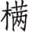

 庄公

***【题解】***

庄公，鲁国第十六任君主。名同，为鲁桓公嫡长子，文姜所生，前693年承袭鲁桓公国君位，在位三十二年。庄公在位期间，正是齐桓公称霸时期，鲁国与齐国发生了三次战争：一是庄公九年，鲁国战败，鲁国只好杀了与齐桓公争位的公子纠，把管仲归还齐国；二是庄公十年的长勺之战，鲁庄公采用曹刿的建议，以弱胜强，获得了长勺之战的胜利；三是庄公十三年，鲁庄公会齐桓公于柯，曹沫劫持齐桓公，逼齐桓公退还了齐侵占鲁的土地。庄公的夫人哀姜是齐国人，无子。庄公临死前欲立庶子般为嗣君，庄公弟叔牙建议立长弟庆父，另一弟季友则支持立般，季友以庄公之名逼叔牙饮毒酒自杀。鲁庄公三十二年八月，庄公病逝，季友立子般为君，十月庆父杀子般，立庄公另一庶子启为鲁君。

# 元年

***【经】***

1.1 元年春王正月①。

1.2 三月，夫人孙于齐②。

1.3 夏，单伯送王姬③。

1.4 秋，筑王姬之馆于外④。

1.5 冬十月乙亥⑤，陈侯林卒⑥。

1.6 王使荣叔来锡桓公命⑦。

1.7 王姬归于齐⑧。

1.8 齐师迁纪郱、鄑、郚⑨。

***【注释】***

①元年：鲁庄公元年当周庄王四年，前693。

②三月，夫人孙（xùn）于齐：鲁人责备文姜，文姜出奔齐国。桓公之丧至自齐，文姜未随丧回鲁国；及庄公即位，文姜犹未归。她在庄公即位后回过鲁国，三月出奔齐国。夫人，指文姜，庄公母。孙，逃遁，流亡。言“孙”，不言“出奔”是讳言。

③单（shàn）伯送王姬：天子嫁女于诸侯，必使同姓诸侯为之主，己不主婚，因为天子与诸侯尊卑不对等。周王准备嫁女于齐，请鲁公主婚，因此派单伯送女儿到鲁国，等待出嫁。单伯，周王之卿。王姬，周王之女的通称。

④馆：专供王姬住的房舍。

⑤乙亥：十七日。

⑥陈侯林：陈庄公。

⑦荣叔：周大夫。锡桓公命：这里指周天子追命桓公，褒扬他的德行。锡命，天子赐予诸侯爵服等赏命，是赏赐诸侯的一种荣宠。锡，通“赐”。

⑧归于齐：嫁于齐。

⑨郱（pínɡ）、鄑（zī）、郚（wú）：皆为纪国邑名。齐国打算灭纪，所以派军队强行迁走这三个地方的百姓，并夺其土地。郱，故城当在今山东安丘西。鄑，故城当在今山东昌邑西北。郚，故城当在今山东安丘西南。

***【译文】***

鲁庄公元年春周历正月。

三月，夫人避逃到齐国。

夏，单伯送王姬来我国。

秋，在城外修筑王姬的馆舍。

冬，十月十七日，陈庄公林去世。

周庄王派遣荣叔来我国赐桓公爵服等赏命。

王姬出嫁到齐国。

齐国军队迁徙纪国郱、鄑、郚三邑的居民。

***【传】***

1.1 元年春，不称即位，文姜出故也。

***【译文】***

鲁庄公元年春，《春秋》没有记载鲁庄公即位，这是由于文姜外出没有回国的缘故。

1.2 三月，夫人孙于齐。不称姜氏，绝不为亲，礼也①。

***【注释】***

①绝不为亲，礼也：因文姜有杀夫之罪，庄公不认其为母，是合乎礼的。绝不为亲，断绝母子关系。

***【译文】***

三月，鲁桓公夫人逃避到了齐国。《春秋》不称姜氏而称夫人，是由于断绝了母子关系，这是合于礼的。

1.3 秋，筑王姬之馆于外。为外，礼也①。

***【注释】***

①为外，礼也：王姬非鲁国之女，在城外建行馆，合于礼，显示了区别。外，非鲁国之女。

***【译文】***

秋，在城外建造王姬的行馆。因为王姬不是鲁国的女子，而是周天子的女儿，这是合于礼的。

# 二年

***【经】***

2.1 二年春王二月①，葬陈庄公。

2.2 夏，公子庆父帅师伐於余丘②。

2.3 秋七月，齐王姬卒③。

2.4 冬十有二月，夫人姜氏会齐侯于禚④。

2.5 乙酉⑤，宋公冯卒⑥。

***【注释】***

①二年：鲁庄公二年当周庄王五年，前692。

②庆父：鲁桓公二子，鲁庄公弟。庄公有三弟：庆父、叔牙、季友，后世称为“三桓”。於余丘：近鲁小国，在今山东临沂。

③齐王姬：齐襄公夫人。

④夫人姜氏：指文姜。齐侯：齐襄公。禚（zhuó）：齐地名，在今山东长清。

⑤乙酉：十二月初四。

⑥宋公冯：即宋庄公，在位十九年，死后子闵公捷立。

***【译文】***

鲁庄公二年春周历二月，安葬陈庄公。

夏，公子庆父率领军队攻打於余丘。

秋七月，齐王姬去世。

冬十二月，夫人姜氏与齐襄公在禚地相会。

十二月初四，宋庄公冯去世。

***【传】***

2.1 二年冬，夫人姜氏会齐侯于禚。书，奸也①。

***【注释】***

①书，奸也：杜预认为这是文姜的意思。

***【译文】***

二年冬季，夫人姜氏和齐襄公在禚地相会。《春秋》记载这件事，是为了揭露他们的奸情。

# 三年

***【经】***

3.1 三年春王正月①，溺会齐师伐卫②。

3.2 夏四月，葬宋庄公。

3.3 五月，葬桓王。

3.4 秋，纪季以酅入于齐③。

3.5 冬，公次于滑④。

***【注释】***

①三年：鲁庄公三年当周庄王六年，前691。

②溺：鲁国大夫。

③纪季：纪侯之弟。诸侯之弟常以排行仲、叔、季称呼。酅（xī）：纪邑名，在今山东淄博东。

④滑：郑地名，在今河南睢县西北。

***【译文】***

鲁庄公三年春周历正月，在溺会合齐国军队攻打卫国。

夏四月，安葬宋庄公。

五月，安葬周桓王。

秋，纪季带着酅地归入齐国。

冬，鲁庄公驻在滑地。

***【传】***

3.1 三年春，溺会齐师伐卫，疾之也①。

***【注释】***

①疾：厌恶。隐公四年公子翚违背君命帅师出征，《传》曰：“故书曰‘翚帅师，疾之也’。”此同例，意即溺此次会齐伐卫亦是未奉君命而行。

***【译文】***

鲁庄公三年春，公子溺会合齐国军队攻打卫国，《春秋》单称他的名字溺，不称公子，是表示对他的厌恶。

3.2 夏五月，葬桓王，缓也①。

***【注释】***

①缓：迟缓。周桓王死了七年才下葬，所以说缓。

***【译文】***

夏，五月，安葬周桓王。这在丧礼的时间上太迟缓了。

3.3 秋，纪季以酅入于齐，纪于是乎始判①。

***【注释】***

①纪于是乎始判：纪分为二，纪侯居纪，纪季以酅入齐而为附庸。判，分，一分为二。

***【译文】***

秋，纪季带着酅地做了齐国的附庸，纪国从这时候开始分裂。

3.4 冬，公次于滑，将会郑伯①，谋纪故也②。郑伯辞以难③。凡师，一宿为舍，再宿为信，过信为次。

***【注释】***

①郑伯：郑子仪。

②谋纪故也：纪国处于齐都临淄之东南，相距不过百余里，齐欲扩张，非并纪不可。所以纪侯多次向鲁求助，鲁也多方为之谋划，十余年间屡见于《经》、《传》。此时纪形势更为危急，于是鲁求助于郑。

③难（nàn）：指国家有祸难。时厉公居于栎，谋欲入郑，子仪自顾不暇，不能与大国齐为敌。

***【译文】***

冬，鲁庄公带领护卫军屯驻在滑地多夜，打算会见郑子仪，策划纪国的事务。郑伯用国内不安定为理由加以推脱。凡是军队在外，住一夜叫做舍，两夜叫做信，两夜以上叫做次。

# 四年

***【经】***

4.1 四年春王二月①，夫人姜氏享齐侯于祝丘②。

4.2 三月，纪伯姬卒③。

4.3 夏，齐侯、陈侯、郑伯遇于垂④。

4.4 纪侯大去其国⑤。

4.5 六月乙丑⑥，齐侯葬纪伯姬⑦。

4.6 秋七月。

4.7 冬，公及齐人狩于禚⑧。

***【注释】***

①四年：鲁庄公四年当周庄王七年，前690。

②享：宴请。齐侯：指齐襄公。祝丘：鲁地名，在今山东临沂。

③纪伯姬：鲁惠公长女。隐公二年嫁于纪。

④陈侯：指陈宣公。郑伯：指郑子仪。垂：卫地名，在今山东曹县。

⑤大去：永远离开不再回国。去，离开。

⑥乙丑：二十三日。

⑦齐侯葬纪伯姬：去年纪季以酅入齐，今年纪侯亦大去其国，故齐侯为之葬伯姬。

⑧齐人：指齐襄公。

***【译文】***

鲁庄公四年春周历二月，夫人文姜在祝丘宴请齐襄公。

三月，纪伯姬去世。

夏，齐襄公、陈宣公、郑子仪在垂地非正式相会。

纪侯永久离开他的国家。

六月二十三日，齐襄公安葬纪伯姬。

秋七月。

冬，庄公与齐襄公在禚地打猎。

***【传】***

4.1 四年春，王正月，楚武王荆尸①，授师孑焉②，以伐随。将齐③，入告夫人邓曼曰：“余心荡④。”邓曼叹曰：“王禄尽矣⑤。盈而荡⑥，天之道也⑦。先君其知之矣⑧，故临武事，将发大命⑨，而荡王心焉。若师徒无亏⑩，王薨于行，国之福也。”王遂行，卒于木之下⑪。令尹斗祁、莫敖屈重除道、梁溠⑫，营军临随⑬。随人惧，行成⑭。莫敖以王命入盟随侯，且请为会于汉汭而还⑮。济汉而后发丧。

***【注释】***

①荆尸：楚武王所创的一种阵法。

②孑（ｊié）：戟，一种兵器。

③齐（zhāi）：同“斋”。在太庙授以兵器，要先斋戒。

④心荡：心里不安。荡，动摇。

⑤王禄：王的寿命。

⑥盈：饱满。

⑦天之道：上天的启示。

⑧先君：指已逝的国君。

⑨大命：征伐之命。

⑩师徒：指军队。无亏：没有损失，不打败仗。

⑪（mán）木：武陵山别名，在今湖北钟祥东。一说为一种叫松心木的树。

⑫令尹：楚国官名，相当于宰相。除道：开路。梁：架设桥梁。溠（zhā）：河名，今名扶恭河，发源于湖北随州西北鸡鸣山，南流注于涓水。

⑬营军临随：杨伯峻曰：“楚武王新薨，军欲速退，而秘不发丧，开道筑桥，建筑营垒，佯示敌人以久战之计，促使敌人不战而降，此应变之方。”营军，为军队筑营垒。临随，兵临随国都下。

⑭行成：求和。

⑮汉：汉水。汭（ruì）：河流会合的地方或河流弯曲的地方。

***【译文】***

鲁庄公四年春周历正月，楚武王运用荆尸阵法，把戟发给士兵，要去攻打随国。准备斋戒时，武王入宫告诉夫人邓曼说：“我的心神动荡不安。”邓曼叹气说：“君王的福禄尽了。该精神饱满却心神散乱，这是上天的启示啊。我国去世的先君大概也知道了，所以在作战前，将要发布征伐命令时而使王的心不安。如果军队没有什么损失，而君王死在行军途中，这就是国家的福分了。”楚武王于是出征，死在木山下。令尹斗祁、莫敖屈重秘不发丧，开通新路，并在溠水筑桥，在随国都城外建筑营垒。随国人恐惧，向楚军求和。莫敖屈重以楚王的名义进入随国，和随侯结盟，而且邀请随侯在汉水汇合处会见，然后退兵。渡过了汉水以后才公布武王已薨的消息。

4.2 纪侯不能下齐①，以与纪季。夏，纪侯大去其国，违齐难也②。

***【注释】***

①下齐：屈降从齐。

②违：躲避。齐难：《年表》云：“齐襄八年伐纪，去其都邑。”则纪侯之离国，由齐伐之。

***【译文】***

纪侯不能屈从齐国，把国家政权让给了纪季。夏，纪侯永远离开了他的国家，以躲避齐国的祸害。

# 五年

***【经】***

5.1 五年春王正月①。

5.2 夏，夫人姜氏如齐师。

5.3 秋，郳犁来来朝②。

5.4 冬，公会齐人、宋人、陈人、蔡人伐卫。

***【注释】***

①五年：鲁庄公五年当周庄王八年，前689。

②郳（ní）：鲁国的附庸国，在今山东滕县。开国君主是邾文公之子肥，肥封于郳。其后附从齐桓公以尊周室，周室命之为小邾子。郳与小邾一地二名。犁来：肥的曾孙。

***【译文】***

鲁庄公五年春周历正月。

夏，夫人文姜去齐国军队中。

秋，郳国的犁来来我国朝见。

冬，鲁庄公会合齐国人、宋国人、陈国人、蔡国人攻打卫国。

***【传】***

5.1 五年秋，郳犁来来朝，名，未王命也①。

***【注释】***

①未王命：未受周王封爵。

***【译文】***

五年秋，郳国的犁来来我国朝见。《春秋》只记载他的名字，是因为他还没有得到周天子的封爵。

5.2 冬，伐卫，纳惠公也①。

***【注释】***

①纳惠公：卫惠公朔于鲁桓公十六年奔齐，故齐襄公会合诸侯伐卫以送其回国。纳，护送回国。按，此应与下年《传》“六年春，王人救卫”连读，被后人割裂。

***【译文】***

冬，攻打卫国，是为了护送卫惠公回国。

# 六年

***【经】***

6.1 六年春王正月①，王人子突救卫②。

6.2 夏六月，卫侯朔入于卫③。

6.3 秋，公至自伐卫。

6.4 螟。

6.5 冬，齐人来归卫俘④。

***【注释】***

①六年：鲁庄公六年当周庄王九年，前688。

②王人：周王室之属官。大概子突官职卑小，所以只称“王人”。

③卫侯朔：即卫惠公。

④归卫俘：诸《传》皆为“归卫宝”，杜预以为《经》文误。杨伯峻曰：“其实俘、保、宝古音皆近，得相通假。”

***【译文】***

鲁庄公六年春周历正月，周王室属官子突救援卫国。

夏六月，卫惠公朔回到卫国。

秋，鲁庄公从攻打卫国的前线回国。

发生螟灾。

冬，齐国人来我国归还卫国的俘虏。

***【传】***

6.1 六年春，王人救卫①。

***【注释】***

①六年春，王人救卫：当与上年《传》“冬，伐卫，纳惠公也”连读。

***【译文】***

鲁庄公六年春，周庄王的属官救援卫国。

夏，卫侯入①，放公子黔牟于周②，放甯跪于秦③，杀左公子洩、右公子职，乃即位。

***【注释】***

①卫侯入：王人救卫不成，鲁、齐、宋、陈、蔡等国送卫惠公入卫。

②放：放逐。公子黔牟：名留，受周庄王支持。

③甯跪：卫大夫。

***【译文】***

夏，卫惠公回国，放逐公子黔牟到周，放逐甯跪到秦，杀了左公子洩、右公子职，然后即国君位。

君子以二公子之立黔牟为不度矣①。夫能固位者②，必度于本末③，而后立衷焉④。不知其本，不谋⑤。知本之不枝⑥，弗强⑦。《诗》云：“本枝百世⑧。”

***【注释】***

①度：权衡、考虑，指权衡本末始终。

②固位：巩固君位。

③度于本末：沈钦韩《补注》云：“度其本者，其人于义当立者也；度其末者，其人立后能安固国家者也。”

④立衷：用适当的方式立为君。衷，中，中庸，指兼顾本末的主意。

⑤不谋：不立他。

⑥本之不枝：有本根无枝叶。即其人虽当立，然而孤立无助，不能安国家，固后世。

⑦弗强：不勉强立君。

⑧本枝百世：见《诗经·大雅·文王》，全句为：“文王孙子，本支百世。”这里借以说明有本有枝，百代相传。杨伯峻曰：“《左传》盖断章取义。古人引《诗》多如此，襄公二十八年《传》所谓‘赋《诗》断章，余取所求焉’者也。”

***【译文】***

君子认为左、右二公子扶立黔牟为国君，缺乏周到的考虑。凡对能够巩固自己地位的人，必须权衡他的各个方面，然后采取不偏不倚的适当主张。不了解他的根本，就不要考虑拥立他。了解他虽有根本却没有枝叶，也不要勉强拥立他。《诗》说：“有本有枝，繁衍百世。”

6.2 冬，齐人来归卫宝①，文姜请之也。

***【注释】***

①归卫宝：赠送卫国祭器。归，通“馈”，赠送。

***【译文】***

冬，齐国人前来归还卫国的宝器，这是由于文姜的请求。

6.3 楚文王伐申①，过邓②。邓祁侯曰③：“吾甥也④。”止而享之。骓甥、聃甥、养甥请杀楚子⑤，邓侯弗许。三甥曰：“亡邓国者，必此人也。若不早图，后君噬齐⑥。其及图之乎⑦？图之，此为时矣。”邓侯曰：“人将不食吾余⑧。”对曰：“若不从三臣，抑社稷实不血食⑨，而君焉取余？”弗从。还年⑩，楚子伐邓。十六年，楚复伐邓，灭之。

***【注释】***

①楚文王：楚武王之子。申：姜姓诸侯国，其地在今河南南阳。

②邓：曼姓诸侯国，其地在今河南祁县。

③邓祁侯：祁为邓侯谥号。

④吾甥也：据此，楚文王当是武王夫人邓曼之子。

⑤骓甥、聃甥、养甥：皆为邓国大夫，也都是邓侯外甥。

⑥噬齐：人不能咬到自己的肚脐，比喻后悔莫及，今有成语“噬脐莫及”。噬，咬。齐，通“脐”，肚脐。

⑦及：“及时”的省略。

⑧不食吾余：古代俗语，贱视唾弃之意。余，指祭神后剩余的东西。

⑨不血食：不祭祀，意味着亡国。血食，祭祀时必杀牲畜，称血食。

⑩还年：伐申回国的那一年。

***【译文】***

楚文王进攻申国，路过邓国。邓祁侯说：“他是我的外甥。”把他留下设宴招待他。骓甥、聃甥、养甥请求杀掉楚文王，邓侯不允许。这三甥都说：“灭亡邓国的，必定是这个人。如果不早打主意，以后您后悔都来不及。现在下手还来得及！下手吧，现在正是时候！”邓侯说：“如果这样做，人们会唾弃我而不吃我剩下的东西的。”三位外甥回答说：“如果不听我们三个人的话，土地和五谷的神明就得不到祭享，国君到哪里去取得祭神的剩余？”邓祁侯还是不答应。攻打申国回国的那一年，楚王进攻邓国。庄公十六年，楚国再次攻打邓国，灭亡了邓国。

# 七年

***【经】***

7.1 七年春①，夫人姜氏会齐侯于防②。

7.2 夏四月辛卯③，夜，恒星不见④。夜中，星陨如雨⑤。

7.3 秋，大水。

7.4 无麦、苗⑥。

7.5 冬，夫人姜氏会齐侯于谷⑦。

***【注释】***

①七年：鲁庄公七年当周庄王十年，前687。

②齐侯：指齐襄公。防：鲁地名，在今山东费县东北。

③辛卯：初五。

④恒星不见：日常所见的星不现。恒星，常见之星。见，同“现”。

⑤星陨如雨：据《传》，曰“与雨偕”，《穀梁》、《公羊》皆云星陨似雨。据推算，是前687年3月16日发生的流星雨，这是世界上最早的天琴座流星雨记录。如，而。

⑥无麦、苗：周历秋相当于夏历的夏季，成熟的麦遭雨无收，黍、稷的苗也被水漂没。

⑦谷：齐地名，在今山东东阿。

***【译文】***

鲁庄公七年春，夫人姜氏与齐襄公在防地相会。

夏四月初五，夜间，日常所见的星星都没有出现。半夜，星星陨落，天又下大雨。

秋，发大水。

麦子没有收成，禾苗漂没。

冬，夫人姜氏与齐襄公在谷地相会。

***【传】***

7.1 七年春，文姜会齐侯于防，齐志也①。

***【注释】***

①齐志：齐国的意愿。防是鲁地，齐襄公入鲁与文姜相会，这是出于齐襄公的意愿。志，意志，意愿。

***【译文】***

鲁庄公七年春，文姜和齐襄公在防地相会，这是出于齐襄公的意愿。

7.2 夏，恒星不见，夜明也。星陨如雨，与雨偕也①。

***【注释】***

①星陨如雨，与雨偕也：杜预解“偕”为“俱”，读“如”为“而”，意为流星雨和雨一起落下。

***【译文】***

夏，看不到常见的星星，这是由于夜空明亮的缘故。流星坠落而且带着雨点，这是和雨一起落下来的。

7.3 秋，无麦、苗，不害嘉谷也①。

***【注释】***

①不害嘉谷：此时黍稷之苗还小，水淹之后还可重种，尚不影响收成，所以说不害嘉谷。嘉谷，指黍稷，用于祭祀，故称嘉谷。

***【译文】***

秋，麦子不收，禾苗漂没，但没有影响黍稷的收成。

# 八年

***【经】***

8.1 八年春王正月①，师次于郎②，以俟陈人、蔡人③。

8.2 甲午④，治兵⑤。

8.3 夏，师及齐师围郕⑥，郕降于齐师。

8.4 秋，师还。

8.5 冬十有一月癸未⑦，齐无知弑其君诸儿⑧。

***【注释】***

①八年：鲁庄公八年当周庄王十一年，前686。

②郎：即隐公元年《传》文中之郎，在今山东鱼台。

③俟（sì）：等待。

④甲午：正月十三日。

⑤治兵：向军队分发武器。

⑥围郕：按，据杨伯峻《春秋左传注》，《春秋》书围国者二十五次，始于此。

⑦癸未：初七。

⑧无知：即公孙无知，齐庄公之孙，齐襄公堂弟。诸儿：即齐襄公。

***【译文】***

鲁庄公八年春周历正月，我军驻扎于郎地，等待陈国人、蔡国人。

正月十三日，发给兵士兵器。

夏，我军和齐军包围郕国，郕国向齐军投降。

秋，我军回国。

冬，十一月初七，齐无知杀死他的国君齐襄公诸儿。

***【传】***

8.1 八年春，治兵于庙，礼也。

***【译文】***

鲁庄公八年春，鲁庄公在太庙把武器发给军队，这是合于礼的。

8.2 夏，师及齐师围郕。郕降于齐师。仲庆父请伐齐师①。公曰：“不可。我实不德，齐师何罪？罪我之由②。《夏书》曰：‘皋陶迈种德，德，乃降③。’姑务修德④，以待时乎。”秋，师还。君子是以善鲁庄公⑤。

***【注释】***

①仲庆父：鲁庄公之弟。请伐齐师：因鲁与齐共同伐郕，而齐单独受降。

②罪我之由：即“罪由我”，罪因我而来。

③皋陶迈种德，德，乃降：意思是皋陶勉力培育德行，具备了德行，别人自然降服。所引《尚书》已佚，《古文尚书》将此文入《大禹谟》篇。皋陶，东夷族首领，舜命之掌刑狱事。迈，通“勱”。勤勉，勉力。

④务：致力于。

⑤善：赞美。

***【译文】***

夏，鲁军和齐军包围郕国。郕国单独向齐军投降。仲庆父请求进攻齐军。庄公说：“不行，我实在缺乏德行，齐军有什么罪？罪是由我引起的。《夏书》说：‘皋陶勉力培育德行，德行具备，别人就会降服。’我们姑且致力于修养德行，以等待时机吧！”秋，军队回国。君子因此而赞美鲁庄公。

8.3 齐侯使连称、管至父戍葵丘①。瓜时而往②，曰：“及瓜而代③。”期戍④，公问不至⑤。请代，弗许。故谋作乱。

***【注释】***

①连称、管至父：皆齐国大夫。戍：守卫。葵丘：在今山东临淄西有西安故城及蘧丘里，当即其地。

②瓜时：瓜熟时节，即夏历七月。《诗经·国风·豳风·七月》“七月食瓜”。

③及瓜而代：到第二年瓜熟时换防。

④期（jī）：一周年。

⑤问：指换防的通知。

***【译文】***

齐襄公派连称、管至父驻守葵丘。瓜熟的时节前去，说：“到明年瓜熟的时候派人替代你们。”驻守了一周年，齐襄公的命令并没有下来。连称、管至父请求派人替代，齐襄公不同意。因此两人就策划叛乱。

僖公之母弟曰夷仲年①，生公孙无知，有宠于僖公，衣服礼秩如適②。襄公绌之③。二人因之以作乱④。连称有从妹在公宫⑤，无宠，使间公⑥，曰：“捷⑦，吾以女为夫人⑧。”

***【注释】***

①母弟：同母弟。夷仲年：夷是其字或谥号，仲是排行，年是名。

②衣服礼秩如適：指服饰、章旗、待遇等级与嫡子相同。適，同“嫡”，嫡子。按，古代嫡子的衣服、章旗等与众子、庶子不同。

③绌（chù）：通“黜”，贬低。

④二人：指连称、管至父。因：依靠。

⑤从妹：堂妹。

⑥间（jiàn）：窥视，侦察。

⑦捷：事情成功。

⑧女：通“汝”。夫人：指国君正夫人。

***【译文】***

齐僖公的同母兄弟叫夷仲年，生了公孙无知，受到僖公的宠信，衣服礼仪等种种待遇都和嫡子一样。齐襄公降低了公孙无知的待遇。连称、管至父两个人就利用公孙无知发动叛变。连称有个堂妹在齐襄公的后宫，不得宠，就让她去侦察襄公的情况，公孙无知说：“事情成功，我把你立为君夫人。”

冬十二月，齐侯游于姑棼①，遂田于贝丘②。见大豕③，从者曰：“公子彭生也④。”公怒曰：“彭生敢见⑤！”射之，豕人立而啼⑥。公惧，队于车⑦，伤足，丧屦⑧。反，诛屦于徒人费⑨。弗得，鞭之，见血。走出，遇贼于门⑩，劫而束之⑪。费曰：“我奚御哉⑫！”袒而示之背⑬，信之。费请先入，伏公而出⑭，斗，死于门中。石之纷如死于阶下⑮。遂入，杀孟阳于床⑯，曰：“非君也，不类⑰。”见公之足于户下⑱，遂弑之，而立无知。

***【注释】***

①姑棼（fén）：即薄姑，齐地名，在今山东博兴。

②田：打猎。贝丘：齐地名，在今山东博兴。

③豕（shǐ）：猪。

④公子彭生：即桓公十八年杀死鲁桓公的彭生。

⑤见：同“现”。

⑥人立：猪后脚站立，前脚悬空，如人站立。

⑦队：同“坠”。

⑧屦（jù）：单底鞋。

⑨诛屦：责令其寻找屦。诛，责令。徒人：应为寺人，相当于后世的宦官。费：人名。

⑩贼：叛贼，此指公孙无知的党徒。

⑪束：捆。

⑫御：抵抗。

⑬袒（tǎn）：裸露。

⑭伏：藏匿。公：指齐襄公。

⑮石之纷如：人名，也是寺人。之，用来助音节的，如介之推、宫之奇等。

⑯杀孟阳于床：孟阳也应是寺人，为保护襄公而伪装成襄公睡在床上，遂被杀。

⑰不类：不像。

⑱户下：门背下面。

***【译文】***

冬十二月，齐襄公到姑棼游玩，接着在贝丘打猎。看到一头大野猪，随从说：“这是公子彭生啊！”齐襄公发怒说：“彭生胆敢出现！”就用箭射它，野猪像人一样站起身啼叫。齐襄公害怕，从车上摔下来，伤了脚，丢了鞋。回去以后，责令徒人费去找鞋。费找不着，齐襄公就鞭打他，打得皮开血出。费跑出去，在宫门口遇到叛贼，叛贼把他劫走并捆起来。费说：“我怎么会抵抗你们呢？”解开衣服让他们看自己受鞭刑的背，叛贼相信了。费请求为叛贼先进宫去刺探，他进去之后把齐襄公隐藏起来，然后和叛贼格斗，死在宫门里。石之纷如斗死在台阶下。叛贼于是入内，在床上杀了孟阳，说：“这不是国君，样子不像。”见到齐襄公的脚从门下边露出来，于是把他杀死了，拥立无知为国君。

初，襄公立，无常①。鲍叔牙曰②：“君使民慢③，乱将作矣。”奉公子小白出奔莒④。乱作，管夷吾、召忽奉公子纠来奔⑤。

***【注释】***

①无常：言行无准则，谓政令不守信用。《史记·齐太公世家》云：“初襄公之醉杀鲁桓公，通其夫人，杀诛数不当，淫于妇人，数欺大臣。”

②鲍叔牙：齐国大夫，公子小白之傅。

③君使民慢：言君主政令无常，使人民生出慢易之心。慢，松弛，放纵。

④公子小白：齐僖公之子，齐襄公之弟，无知死后入为桓公，春秋五霸之首。

⑤管夷吾：即管仲，齐国大夫，公子纠之傅。召忽：齐国大夫，亦公子纠之傅。公子纠：公子小白的庶兄，其母为鲁公族之女。

***【译文】***

当初，齐襄公即位，施政没有准则，使人不知所措。鲍叔牙说：“国君放纵，百姓懈怠，祸乱将要发生了。”就侍奉公子小白避乱到莒国。叛乱发生，管夷吾、召忽侍奉公子纠逃避到鲁国来。

8.4 初，公孙无知虐于雍廪①。

***【注释】***

①公孙无知虐于雍廪：按，此当与九年《传》“雍廪杀无知”相连，是以年分《传》者之妄分。虐，虐待。雍廪，齐地葵丘大夫。

***【译文】***

当初，公孙无知虐待雍廪。

# 九年

***【经】***

9.1 九年春①，齐人杀无知②。

9.2 公及齐大夫盟于蔇③。

9.3 夏，公伐齐纳子纠。齐小白入于齐。

9.4 秋七月丁酉④，葬齐襄公。

9.5 八月庚申⑤，及齐师战于乾时⑥，我师败绩。

9.6 九月，齐人取子纠杀之。

9.7 冬，浚洙⑦。

***【注释】***

①九年：鲁庄公九年当周庄王十二年，前685。

②齐人：指雍廪。

③蔇（xì）：鲁地名，在今山东枣庄。

④丁酉：二十四日。

⑤庚申：十八日。

⑥乾（ɡān）时：地名，在今山东临淄。

⑦浚（jùn）：疏通河道。洙：洙水，源出今山东泰安，后入泗水。

***【译文】***

鲁庄公九年春，齐国人杀死公孙无知。

鲁庄公及齐国大夫在蔇地会盟。

夏，鲁庄公攻打齐国，送子纠回国。齐国公子小白进入齐国。

秋，七月二十四日，安葬齐襄公。

八月十八日，我军与齐军在乾时交战，我军大败。

九月，齐国人索取子纠，把他杀了。

冬，疏通洙水的河道。

***【传】***

9.1 九年春，雍廪杀无知。

***【译文】***

鲁庄公九年春，雍廪杀死公孙无知。

9.2 公及齐大夫盟于蔇，齐无君也。

***【译文】***

鲁庄公和齐国的大夫在蔇地结盟，这是因为当时齐国没有国君的缘故。

9.3 夏，公伐齐，纳子纠。桓公自莒先入①。

***【注释】***

①公伐齐，纳子纠。桓公自莒先入：据《史记·齐太公世家》：“及雍林人杀无知，议立君，高、国先阴召小白于莒。鲁闻无知死，亦发兵送公子纠，而使管仲别将兵遮莒道，射中小白带钩。小白佯死，管仲使人驰报鲁。鲁送纠者行益迟，六日至齐，则小白已入，高傒立之，是为桓公。”

***【译文】***

夏，庄公进攻齐国，护送公子纠回国即位。齐桓公从莒国抢先回到齐国。

9.4 秋，师及齐师战于乾时，我师败绩。公丧戎路①，传乘而归②。秦子、梁子以公旗辟于下道③，是以皆止④。

***【注释】***

①丧戎路：放弃战车。戎路，兵车。

②传乘：转乘他车。

③秦子、梁子以公旗辟于下道：秦子、梁子，庄公的车御与车右。按，此欲以诱致齐师而使鲁公得以逃脱。

④止：被俘。

***【译文】***

秋，我军和齐军在乾时作战，我军大败。庄公丧失战车，乘坐轻车逃了回来。秦子、梁子打着庄公的旗号躲在小道上作掩护，都被齐军俘虏了。

9.5 鲍叔帅师来言曰：“子纠，亲也①，请君讨之。管、召，仇也②，请受而甘心焉。”乃杀子纠于生窦③，召忽死之④。管仲请囚，鲍叔受之，及堂阜而税之⑤。归而以告曰：“管夷吾治于高傒⑥，使相可也。”公从之。

***【注释】***

①亲：指亲兄弟。

②仇：仇敌。

③生窦：在今山东菏泽北。

④死之：为之死，指自杀。之，指公子纠。

⑤堂阜：齐地名，齐鲁交界处，在今山东蒙阴。税：通“脱”，释放。

⑥治于高傒：指政治才能超过高傒。高傒，齐国执政大臣。

***【译文】***

鲍叔率领军队代表齐桓公来鲁国说：“子纠，是我齐君的亲人，请国君代我齐国诛杀。管仲、召忽，是我齐君的仇人，请交给我们让我们称心快意地处置。”于是就在生窦杀死公子纠，召忽自杀。管仲请求把他押送回齐国，鲍叔接受请求，到了堂阜就把他释放了。回国后，鲍叔报告齐桓公说：“管仲治国的才能超过高傒，可以让他辅助国君。”齐桓公接纳了这个意见。

# 十年

***【经】***

10.1 十年春王正月①，公败齐师于长勺②。

10.2 二月，公侵宋③。

10.3 三月，宋人迁宿④。

10.4 夏六月，齐师、宋师次于郎。公败宋师于乘丘⑤。

10.5 秋九月，荆败蔡师于莘⑥，以蔡侯献舞归⑦。

10.6 冬十月，齐师灭谭⑧，谭子奔莒。

***【注释】***

①十年：鲁庄公十年当周庄王十三年，前684。

②长勺：在今山东曲阜。

③侵：古时出兵，有钟鼓之声叫伐，没有就叫侵。

④迁：迁走百姓，占有其土地。宿：在今江苏宿迁。

⑤乘丘：在今山东兖州。

⑥荆：即楚国。楚先王熊绎僻处荆山，后来常称楚为荆。莘：蔡国地名，在今河南汝南。

⑦以：俘获。蔡侯献舞：即蔡哀侯蔡季，名献舞。

⑧谭：诸侯国名，在今山东济南。

***【译文】***

鲁庄公十年春周历正月，鲁庄公在长勺打败齐军。

二月，鲁庄公攻打宋国。

三月，宋国人迁走宿地的百姓。

夏六月，齐军、宋军驻扎在郎地。鲁庄公在乘丘打败宋军。

秋九月，楚国在莘地打败蔡军，俘获了蔡哀侯献舞回国。

冬十月，齐军灭亡了谭国，谭子逃到莒国。

***【传】***

10.1 十年春，齐师伐我①。公将战，曹刿请见②。其乡人曰：“肉食者谋之③，又何间焉④。”刿曰：“肉食者鄙⑤，未能远谋。”乃入见。问何以战。公曰：“衣食所安，弗敢专也⑥，必以分人。”对曰：“小惠未遍⑦，民弗从也。”公曰：“牺牲玉帛⑧，弗敢加也⑨，必以信⑩。”对曰：“小信未孚⑪，神弗福也。”公曰：“小大之狱，虽不能察，必以情⑫。”对曰：“忠之属也⑬，可以一战，战则请从。”

***【注释】***

①齐师伐我：齐师伐鲁，是为了去年鲁欲送公子纠入齐即位的事。

②曹刿（ɡuì）：又叫曹沫，生卒年不详，春秋时鲁国大夫。事迹见《史记·刺客列传》。

③肉食者：当时习惯语，指当官的贵族，大夫以上。

④间（jiàn）：参与。

⑤鄙：鄙陋，无远见。

⑥弗敢专：不敢专有享用，必分给群臣。

⑦未遍：不能周遍，人人皆有。

⑧牺牲：祭祀用的猪、牛、羊。

⑨加：增加，此指虚报。

⑩信：诚信。

⑪未孚：未取得信任。孚，信任。

⑫必以情：指处理得合情合理。

⑬忠：忠诚无私，尽心竭力。

***【译文】***

鲁庄公十年春，齐国的军队来攻打我国。庄公准备迎战，曹刿请求接见。他的同乡人说：“那些每天都吃肉的人在那里谋划，你又去参与什么？”曹刿说：“吃肉的人鄙陋无远见，不能作长远考虑。”于是入宫进见庄公。曹刿问庄公：“凭什么来作战？”庄公说：“有吃有穿，不敢独自享受，一定分给别人。”曹刿回答说：“小恩小惠不能周遍，百姓不会服从的。”庄公说：“祭祀用的牛羊玉帛，不敢擅自增加，祝史的祷告一定反映真实情况。”曹刿回答说：“一点点诚心不会取得神明的信任，神明不会降福的。”庄公说：“大大小小的案件，虽然不能完全探明底细，但必定合情合理去办。”曹刿回答说：“这是为百姓尽力的一种表现，凭这个可以打一下。打起来，请让我跟着去。”

公与之乘，战于长勺。公将鼓之①。刿曰：“未可。”齐人三鼓，刿曰：“可矣。”齐师败绩。公将驰之②。刿曰：“未可。”下视其辙③，登轼而望之④，曰：“可矣。”遂逐齐师。

***【注释】***

①鼓：擂鼓进军。

②驰之：驱动战车追击齐军。

③辙：车轮走过的痕迹。

④轼：车前扶手横木，全车最高点。

***【译文】***

庄公和曹刿同乘一辆兵车，与齐军在长勺展开战斗。庄公准备击鼓进军。曹刿说：“还不行。”齐国人打了三通鼓，曹刿说：“可以了。”齐军大败。庄公准备追上去。曹刿说：“还不行。”下车，细看齐军的车辙，然后登上车前横木远望，说：“行了。”这才追击齐军。

既克，公问其故。对曰：“夫战，勇气也。一鼓作气，再而衰，三而竭。彼竭我盈，故克之。夫大国难测也，惧有伏焉。吾视其辙乱，望其旗靡①，故逐之。”

***【注释】***

①视其辙乱，望其旗靡：辙乱说明行列不整，旗倒则师失耳目，说明失去指挥，所以知其为真败。靡，倒下。

***【译文】***

战胜以后，庄公问曹刿取胜的缘故。曹刿回答说：“作战全凭勇气。第一通鼓振奋勇气，第二通鼓勇气就少了一些，第三通鼓勇气就没有了。他们的勇气没有了，而我们的勇气刚刚振奋，所以战胜了他们。大国的情况难于捉摸，还恐怕有埋伏。我细看他们的车辙已经乱了，远望他们的旗子已经倒下，所以才追逐他们。”

10.2 夏六月，齐师、宋师次于郎。公子偃曰①：“宋师不整②，可败也。宋败，齐必还，请击之。”公弗许。自雩门窃出③，蒙皋比而先犯之④，公从之，大败宋师于乘丘。齐师乃还。

***【注释】***

①公子偃：鲁国大夫。

②不整：军纪混乱。

③雩门：鲁南城西门。窃出：私自出击。

④蒙皋比：以虎皮蒙马。皋比，虎皮。

***【译文】***

夏六月，齐国和宋国的军队驻扎在郎地。公子偃说：“宋军的军容不整齐，可以打败他。宋军败了，齐军必然回国，请您攻击宋军。”庄公不同意。公子偃从雩门私自出击，把马蒙上老虎皮先攻宋军，庄公领兵跟着进击，在乘丘把宋军打得大败。齐军也就回国了。

10.3 蔡哀侯娶于陈，息侯亦娶焉。息妫将归①，过蔡②。蔡侯曰：“吾姨也③。”止而见之，弗宾④。息侯闻之，怒，使谓楚文王曰：“伐我，吾求救于蔡而伐之。”楚子从之。秋九月，楚败蔡师于莘，以蔡侯献舞归。

***【注释】***

①归：出嫁。

②过蔡：陈都宛丘，在今河南淮阳。蔡都在今河南上蔡西南，息妫由陈至息必过蔡。

③姨：妻子的姐妹。

④弗宾：不礼貌。据十四年《传》，息妫甚美，则此所谓弗宾，盖有轻佻之行。

***【译文】***

蔡哀侯在陈国娶妻，息侯也在陈国娶妻。息妫出嫁时路过蔡国。蔡侯说：“她是我妻子的姊妹。”留下来见面，很不礼貌。息侯听到这件事，发怒，派人对楚文王说：“请您假装进攻我国，我向蔡国求援，您就可以攻打它。”楚文王同意。秋九月，楚国在莘地击败蔡军，俘虏了蔡侯献舞回国。

10.4 齐侯之出也①，过谭，谭不礼焉②。及其入也③，诸侯皆贺，谭又不至。冬，齐师灭谭，谭无礼也。谭子奔莒，同盟故也。

***【注释】***

①齐侯：指齐桓公。出：指齐桓公外出逃亡。

②不礼：不加礼遇。

③入：指齐桓公回国登位。

***【译文】***

齐侯逃亡在外的时候，经过谭国，谭国人对他很不礼貌。等到他回国，诸侯都去祝贺，谭国又没有人去。冬，齐军就灭亡了谭国，这是由于谭国没有礼貌。谭子逃亡到莒国，这是因为两国同盟的缘故。

# 十一年

***【经】***

11.1 十有一年春王正月①。

11.2 夏五月戊寅②，公败宋师于鄑③。

11.3 秋，宋大水。

11.4 冬，王姬归于齐。

***【注释】***

①十有一年：鲁庄公十一年当周庄王十四年，前683。

②戊寅：十七日。

③鄑：鲁地名，与庄公元年之“鄑”不同地。具体所在不详。

***【译文】***

鲁庄公十一年春周历正月。

夏五月十七日，庄公在鄑地打败宋军。

秋，宋国发大水。

冬，王姬出嫁到齐国。

***【传】***

11.1 十一年夏，宋为乘丘之役故侵我。公御之。宋师未陈而薄之①，败诸鄑②。

***【注释】***

①陈：同“阵”。薄：逼近。

②诸：之于。

***【译文】***

鲁庄公十一年夏，宋国为了乘丘那次战役的缘故而入侵我国。庄公出兵迎战。宋国的军队还没有摆开阵势，我军就逼近压过去，在鄑地打败宋军。

凡师，敌未陈曰败某师①，皆陈曰战，大崩曰败绩②，得俊曰克③，覆而败之曰取某师④，京师败曰王师败绩于某⑤。

***【注释】***

①陈：同“阵”，摆开阵势。

②大崩：全军崩溃。

③得俊：俘虏对方勇将。

④覆：设伏兵。

⑤京师：周天子的军队。

***【译文】***

凡是作战，敌方没有摆开阵势叫做“败某师”，都摆开了阵势叫做“战”，大崩溃叫做“败绩”，俘虏敌方的勇士叫做“克”，伏兵而击败敌军叫做“取某师”，周天子的军队被打败叫做“王师败绩于某”。

11.2 秋，宋大水。公使吊焉①，曰：“天作淫雨②，害于粢盛③，若之何不吊④？”对曰：“孤实不敬⑤，天降之灾，又以为君忧，拜命之辱。”臧文仲曰⑥：“宋其兴乎。禹、汤罪己，其兴也悖焉⑦；桀、纣罪人，其亡也忽焉⑧。且列国有凶⑨，称孤，礼也。言惧而名礼⑩，其庶乎⑪。”既而闻之曰公子御说之辞也⑫，臧孙达曰⑬：“是宜为君，有恤民之心⑭。”

***【注释】***

①吊：慰问。

②淫雨：久雨。

③粢盛：指百谷。

④若之何：如何。

⑤孤：君主自己的谦称。此指宋闵公。

⑥臧文仲：鲁国大夫。即臧孙辰。

⑦悖：通“勃”，勃然兴起。

⑧忽：迅速。

⑨列国：诸侯国。凶：灾荒。

⑩言惧：言语惶恐。指前面宋公说的不敬天而降灾，这是罪己。名礼：指称孤。

⑪庶：庶几，有希望。

⑫既而：不久。公子御说（yuè）：宋桓公，宋庄公之子，宋闵公弟。

⑬臧孙达：臧哀伯。臧文仲的祖父。

⑭恤民：体恤、爱护百姓。

***【译文】***

秋，宋国发大水。庄公派使者去慰问，说：“上天降下大雨，危害了庄稼，怎么能不慰问呢？”宋闵公回答说：“孤对于上天不诚敬，上天降灾，还使贵国国君担忧，承蒙关注，实不敢当。”臧文仲说：“宋国恐怕要兴盛了吧！禹、汤责罚自己，他们勃然兴起；桀、纣责罚别人，他们马上灭亡。而且诸侯国发生灾荒，国君称孤，这是合于礼的。言语有所戒惧而称名合于礼制，这就差不多了吧！”不久，又听说上面那番话是公子御说所说的，臧孙达说：“这个人适合当国君，因为他有体恤百姓的心思。”

11.3 冬，齐侯来逆共姬①。

***【注释】***

①齐侯：指齐桓公。共姬：王姬。

***【译文】***

冬，齐桓公来鲁国迎娶共姬。

11.4 乘丘之役，公之金仆姑射南宫长万①，公右歂孙生搏之②。宋人请之③，宋公靳之④，曰：“始吾敬子。今子，鲁囚也。吾弗敬子矣。”病之。

***【注释】***

①仆姑：箭名。南宫长万：宋万，宋大夫，力士。南宫是氏，万是名，长是字。

②右：车右。歂（chuán）孙：人名。生搏：活捉。

③请之：请鲁国释放宋万回国。

④靳（jìn）：嘲笑。

***【译文】***

在乘丘战役中，庄公用叫金仆姑的箭射中南宫长万，庄公的车右歂孙活捉了他。宋国人请求把南宫长万释放回国。宋闵公开玩笑说：“原来我尊敬你，如今你成了鲁国的囚犯，所以我便不敬重你了。”南宫长万因此而怀恨他。

# 十二年

***【经】***

12.1 十有二年春王三月①，纪叔姬归于酅②。

12.2 夏四月。

12.3 秋八月甲午③，宋万弑其君捷及其大夫仇牧④。

12.4 冬十月，宋万出奔陈。

***【注释】***

①十有二年：鲁庄公十二年当周庄王十五年，前682。

②纪叔姬归于酅（xī）：纪叔姬，鲁女，嫁纪国，时纪季以酅入齐，国亡，故云“归于酅”。酅，纪国地名，在今山东益都。

③甲午：初十。

④宋万：即南宫长万。捷：即宋闵公。仇牧：宋国大夫。

***【译文】***

鲁庄公十二年春周历三月，纪叔姬从酅地归国。

夏四月。

秋八月初十，宋南宫长万杀死他的国君捷及其大夫仇牧。

冬十月，宋南宫长万逃亡到陈国。

***【传】***

12.1 十二年秋，宋万弑闵公于蒙泽①。遇仇牧于门，批而杀之②。遇大宰督于东宫之西③，又杀之。立子游④。群公子奔萧⑤。公子御说奔亳⑥。南宫牛、猛获帅师围亳⑦。

***【注释】***

①蒙泽：宋地名，在今河南商丘。

②遇仇牧于门，批而杀之：《公羊传》曰：“仇牧闻君弑，趋而至，遇之于门，手剑而叱之。万臂仇牧，碎其首。齿著乎门阖。”《史记·宋微子世家》云：“大夫仇牧闻之，以兵造公门。万搏牧，牧齿著门阖死。”批，反手击。

③大宰督：指华父督。东宫：诸侯小寝。

④子游：宋公子。

⑤萧：诸侯国名，本为宋邑，后为附庸国，在今安徽萧县西北。

⑥亳（bó）：宋地名，在今河南商丘北。

⑦南宫牛：南宫长万之子。猛获：南宫万同党。

***【译文】***

鲁庄公十二年秋，宋国的南宫长万在蒙泽杀死了宋闵公。他在城门口遇到仇牧，反手便打死了他。在东宫的西面遇到太宰华督，又杀了他。拥立子游为国君。公子们都逃亡到萧邑，而公子御说逃亡到亳地。南宫牛、猛获率领军队包围了亳地。

冬十月，萧叔大心及戴、武、宣、穆、庄之族以曹师伐之①。杀南宫牛于师，杀子游于宋，立桓公②。猛获奔卫。南宫万奔陈，以乘车辇其母③，一日而至④。

***【注释】***

①萧叔大心：萧国长官，大心是其名。萧叔讨南宫长万有功，所以萧被宋封为附庸国。戴、武、宣、穆、庄之族：指宋戴公、武公、宣公、穆公、庄公的族人。戴公之族有华氏、乐氏、老氏、皇氏，庄公之族有仲氏，其他则无所闻。

②桓公：指公子御说。

③乘车：非兵车，通常载人之车。辇（niǎn）：用人挽车。

④一日而至：据杜预《春秋左传注》，宋离陈二百六十里，“一日而至”，言南宫万之多力。

***【译文】***

冬十月，萧叔大心和宋戴公、武公、宣公、穆公、庄公的族人率领曹国的军队讨伐南宫牛和猛获。在阵前杀死了南宫牛，在宋国都城杀死了子游，拥立宋桓公为国君。猛获逃亡到卫国。南宫长万逃亡到陈国，长万自己拉车载着他母亲，一天就到达了。

宋人请猛获于卫，卫人欲勿与。石祁子曰①：“不可。天下之恶一也，恶于宋而保于我，保之何补？得一夫而失一国，与恶而弃好②，非谋也。”卫人归之。亦请南宫万于陈，以赂③。陈人使妇人饮之酒，而以犀革裹之。比及宋，手足皆见④。宋人皆醢之⑤。

***【注释】***

①石祁子：卫国大夫，石碏族人。

②与恶：袒护坏人。好：宋与卫本同盟，故曰好。

③赂：指送礼于陈国。

④手足皆见：此言南宫万力气大，能破犀牛之革。

⑤醢（hǎi）：古代酷刑，把人剁成肉酱。

***【译文】***

宋国人到卫国请求归还猛获，卫国人想不给他们。石祁子说：“不行。普天下的邪恶都是一样可恶的，在宋国作恶而在我国受到保护，保护了他有什么好处？得到一个人而失去一个国家，结交邪恶的人而丢掉友好的邦国，这不是好主意。”卫国人把猛获归还给了宋国。宋国又到陈国请求归还南宫长万，并且送上财礼。陈国人派女人把南宫长万灌醉后，用犀牛皮把他捆裹了起来。等到达宋国时，南宫长万的手脚都露出来了。宋国人把两人都剁成了肉酱。

# 十三年

***【经】***

13.1 十有三年春①，齐侯、宋人、陈人、蔡人、邾人会于北杏②。

13.2 夏六月，齐人灭遂③。

13.3 秋七月。

13.4 冬，公会齐侯，盟于柯④。

***【注释】***

①十有三年：鲁庄公十三年当周僖王元年，前681。

②齐侯、宋人、陈人、蔡人、邾人：指齐桓公和宋、陈、蔡、邾诸国的国君。北杏：齐地名，在今山东东阿。

③遂：妫姓小国，在今山东宁阳西北。

④柯：齐地名，在今山东阳谷东北。

***【译文】***

鲁庄公十三年春，齐桓公和宋、陈、蔡、邾诸国国君在北杏相会。

夏六月，齐国人灭亡了遂国。

秋七月。

冬，庄公与齐桓公相会，在柯地会盟。

***【传】***

13.1 十三年春，会于北杏，以平宋乱。遂人不至。夏，齐人灭遂而戍之①。

***【注释】***

①戍：戍守。

***【译文】***

鲁庄公十三年春，齐、宋、陈、蔡、邾等各国国君在北杏会见，这是为了平定宋国的动乱。遂国人没有来。夏，齐国人灭亡遂国并派人戍守。

13.2 冬，盟于柯，始及齐平也①。

***【注释】***

①盟于柯，始及齐平也：自庄公十年，鲁、齐两国发生了两次战争，至此讲和。盟于柯，《史记·齐太公世家》云：“（桓公）五年，伐鲁，鲁将师败。鲁庄公请献遂邑以平，桓公许，与鲁会柯而盟。鲁将盟，曹沫以匕首劫桓公于坛上，曰：‘反鲁之侵地！’桓公许之。于是遂与曹沫三败所亡地于鲁。”《左传》此年既无齐伐鲁之事，且长勺之役，鲁胜齐败，更无曹刿之三败。然《史记》所述，颇流行于战国。

***【译文】***

冬，鲁庄公和齐桓公在柯地结盟，开始和齐国讲和。

13.3 宋人背北杏之会①。

***【注释】***

①宋人背北杏之会：此当与下年《传》“十四年春，诸侯伐宋”云云相连，被后人割裂。

***【译文】***

宋国人违背了北杏的盟约。

# 十四年

***【经】***

14.1 十有四年春①，齐人、陈人、曹人伐宋。

14.2 夏，单伯会伐宋②。

14.3 秋七月，荆入蔡。

14.4 冬，单伯会齐侯、宋公、卫侯、郑伯于鄄③。

***【注释】***

①十有四年：鲁庄公十四年当周僖王二年，前680。

②单伯：周天子卿士。会伐宋：诸侯已伐宋国，单伯才到，故言“会伐宋”。

③齐侯、宋公、卫侯、郑伯：即齐桓公、宋桓公、卫惠公、郑厉公。鄄（juàn）：卫地名，在今山东鄄城。

***【译文】***

鲁庄公十四年春，齐国人、陈国人、曹国人进攻宋国。

夏，单伯领兵会合诸侯进攻宋国。

秋七月，楚国攻入蔡国。

冬，单伯与齐桓公、宋桓公、卫惠公、郑厉公在鄄地相会。

***【传】***

14.1 十四年春，诸侯伐宋，齐请师于周①。夏，单伯会之，取成于宋而还②。

***【注释】***

①齐请师于周：杜预《春秋左传注》：“齐欲崇天子，故请师，假王命以示大顺。”

②取成：讲和。

***【译文】***

鲁庄公十四年春，诸侯进攻宋国，齐国请求宗周出兵。夏，单伯带兵同诸侯相会，与宋国讲和后回国。

14.2 郑厉公自栎侵郑①，及大陵②，获傅瑕③。傅瑕曰：“苟舍我，吾请纳君。”与之盟而赦之。六月甲子④，傅瑕杀郑子及其二子⑤，而纳厉公。

***【注释】***

①栎：地名，在今河南禹州。

②大陵：地名，约在今河南新密与新郑之间。

③傅瑕：郑国大臣。

④甲子：二十日。

⑤郑子：即子仪。

***【译文】***

郑厉公从栎地带兵进攻郑国国都，到达大陵时，俘虏了傅瑕。傅瑕说：“如果放了我，我设法使你归国为君。”郑厉公和他盟誓后，便把他释放了。六月二十日，傅瑕杀死郑子仪和他的两个儿子，接纳厉公回国。

初，内蛇与外蛇斗于郑南门中，内蛇死①。六年而厉公入。公闻之，问于申曰②：“犹有妖乎③？”对曰：“人之所忌④，其气焰以取之，妖由人兴也。人无衅焉⑤，妖不自作。人弃常，则妖兴，故有妖⑥。”

***【注释】***

①内蛇与外蛇斗于郑南门中，内蛇死：郑南门，据《水经注》，名时门。按，所谓内蛇与外蛇争斗，自是迷信传说。

②申：鲁国大夫。

③妖：妖孽。

④所忌：指忌遇妖。

⑤无衅：无瑕疵、缺点。

⑥人弃常，则妖兴，故有妖：申实际怀疑妖怪之客观存在。认为妖不自作，人失常，而有衅隙，则妖怪兴。

***【译文】***

当初，在郑国国都的南门下面，一条在城里的蛇和一条在城外的蛇相斗，城里的蛇被咬死。过了六年，郑厉公回国。鲁庄公听说这件事，问申说：“这事与妖孽有关吗？”申回答说：“一个人是否会遇到他所忌讳的事，是由于他自己的气焰所招致的，妖孽是由于人而兴起。人如没有毛病，妖孽不会自己发生。人丢弃正道，妖孽就会兴起，所以才有妖孽。”

厉公入，遂杀傅瑕。使谓原繁曰①：“傅瑕贰②，周有常刑③，既伏其罪矣。纳我而无二心者，吾皆许之上大夫之事④，吾愿与伯父图之⑤。且寡人出，伯父无里言⑥；入⑦，又不念寡人⑧，寡人憾焉。”对曰：“先君桓公命我先人典司宗祏⑨。社稷有主而外其心，其何贰如之？苟主社稷，国内之民其谁不为臣？臣无二心，天之制也。子仪在位十四年矣，而谋召君者，庸非二乎。庄公之子犹有八人，若皆以官爵行赂劝贰而可以济事⑩，君其若之何？臣闻命矣。”乃缢而死。

***【注释】***

①原繁：郑国大夫，郑厉公的伯父。

②贰：贰心，不忠心。

③周有常刑：指按周王朝规定的刑法。

④上大夫：即卿。

⑤伯父：诸侯对同姓大夫的泛称。

⑥无里言：没有报告国内情况。

⑦入：回国。

⑧不念：不积极拥戴。

⑨典司宗祏（shí）：管理宗庙石室。宗祏，宗庙中藏神主的石室。

⑩济事：指夺取君位成功。

***【译文】***

郑厉公回国，就杀死了傅瑕。派人对原繁说：“傅瑕对国君有贰心，对此周王朝有规定的刑法，现在傅瑕已经得到惩处了。帮助我回国而没有贰心的人，我都答应给他上大夫的职位，我愿意跟伯父一起商量一下。再说我离开国家在外时，伯父没有向我通报国内的情况；回国以后，又并不亲附我，我对此感到遗憾。”原繁回答说：“先君桓公命令我的先人管理宗庙的石室，国家有君主而自己的心却在国外，还有比这更大的贰心吗？如果主持国家，国内的百姓谁不是他的臣下？做臣下的不应该有贰心，这是上天的规定。子仪居于君位已经有十四年了，现在策划请国君回国的人，难道不是贰心吗？庄公的儿子还有八人在世，如果都以封官爵为贿赂来劝说别人反叛而又能取得成功，国君又怎么办呢？下臣知道国君的意思了。”于是上吊而死。

14.3 蔡哀侯为莘故①，绳息妫以语楚子②。楚子如息，以食入享③，遂灭息④。以息妫归，生堵敖及成王焉。未言⑤。楚子问之，对曰：“吾一妇人而事二夫，纵弗能死，其又奚言？”楚子以蔡侯灭息，遂伐蔡。秋七月，楚入蔡。

***【注释】***

①为莘故：指庄公十年战于莘，蔡哀侯被俘之事。

②绳：赞美。楚子：楚文王。

③以食入享：设享礼招待息侯。

④遂灭息：此与下文“以息妫归”当为数年前之事。

⑤未言：指息妫从不主动开口说话。

***【译文】***

蔡哀侯由于莘地战役被俘的缘故，在楚文王面前赞美息妫。楚文王到息国，假装设享礼招待息侯，乘机攻打息国，灭亡了息国。他把息妫带回楚国，生了堵敖和成王。息妫从不主动开口，楚文王询问原因，她回答说：“我一个妇人却嫁了两个丈夫，既然不能以死守志，又能说什么呢？”楚文王由于蔡哀侯的挑拨而灭息国，为取悦息妫，于是进攻蔡国。秋七月，楚军攻入蔡国。

君子曰：“《商书》所谓‘恶之易也①，如火之燎于原，不可乡迩②，其犹可扑灭’者，其如蔡哀侯乎。”

***【注释】***

①易：蔓延。

②乡迩：接近。乡，通“向”。

***【译文】***

君子说：“《商书》所说‘恶蔓延时，就像大火在草原上燃烧，不能接近面对它，怎么能够扑灭呢？’恐怕就是指蔡哀侯这样的人吧！”

14.4 冬，会于鄄，宋服故也。

***【译文】***

冬，单伯和诸侯在鄄地会见，这是由于宋国顺服的缘故。

# 十五年

***【经】***

15.1 十有五年春①，齐侯、宋公、陈侯、卫侯、郑伯会于鄄②。

15.2 夏，夫人姜氏如齐③。

15.3 秋，宋人、齐人、邾人伐郳④。

15.4 郑人侵宋。

15.5 冬十月。

***【注释】***

①十有五年：鲁庄公十五年当周僖王三年，前679。

②齐侯、宋公、陈侯、卫侯、郑伯：分别指齐桓公、宋桓公、陈宣公、卫惠公、郑厉公。

③夫人姜氏：指文姜，齐僖公女。

④郳（ní）：宋国的附属国，在今山东枣庄，或云在今山东滕县。

***【译文】***

鲁庄公十五年春，齐桓公、宋桓公、陈宣公、卫惠公、郑厉公在鄄地相会。

夏，夫人姜氏去齐国。

秋，宋国人、齐国人、邾国人进攻郳国。

郑国人侵袭宋国。

冬十月。

***【传】***

15.1 十五年春，复会焉，齐始霸也。

***【译文】***

鲁庄公十五年春季，众诸侯再次相会，齐国开始称霸。

15.2 秋，诸侯为宋伐郳。郑人间之而侵宋①。

***【注释】***

①间（jiàn）：乘机。

***【译文】***

秋，各诸侯为宋国攻打郳国。郑国人便乘机入侵宋国。

# 十六年

***【经】***

16.1 十有六年春王正月①。

16.2 夏，宋人、齐人、卫人伐郑。

16.3 秋，荆伐郑。

16.4 冬十有二月，会齐侯、宋公、陈侯、卫侯、郑伯、许男、滑伯、滕子同盟于幽②。

16.5 邾子克卒③。

***【注释】***

①十有六年：鲁庄公十六年当周僖王四年，前678。

②许男：即许穆公。滑：姬姓诸侯国，在今河南偃师。幽：宋地名，在今河南兰考。

③邾子克：即邾仪父，名克。

***【译文】***

鲁庄公十六年春周历正月。

夏，宋国人、齐国人、卫国人攻打郑国。

秋，楚国攻打郑国。

冬十二月，鲁庄公会同齐桓公、宋桓公、陈宣公、卫惠公、郑厉公、许穆公、滑伯、滕子在幽地建立同盟关系。

邾子克去世。

***【传】***

16.1 十六年夏，诸侯伐郑，宋故也。

***【译文】***

鲁庄公十六年夏，诸侯进攻郑国，这是由于郑国侵袭宋国的缘故。

16.2 郑伯自栎入，缓告于楚。秋，楚伐郑，及栎，为不礼故也。

***【译文】***

郑厉公从栎地回到国都为君，没有及时通知楚国。秋，楚国进攻郑国，打到栎地，这是为了郑国对楚国无礼的缘故。

16.3 郑伯治与于雍纠之乱者①。九月，杀公子阏②，刖强③。公父定叔出奔卫④。三年而复之，曰：“不可使共叔无后于郑。”使以十月入⑤，曰：“良月也，就盈数焉。”

***【注释】***

①郑伯：指郑厉公。治：惩治。与：参与。雍纠之乱：在桓公十五年。厉公欲使雍纠杀祭仲，消息走漏，雍纠反被祭仲所杀，厉公被迫出逃。

②公子阏：应为公孙阏，与强（chú）同是祭仲党羽。

③刖（yuè）：断足，一种酷刑。

④公父定叔：公叔段之孙。

⑤使以十月入：古人忌讳奇数之月，以偶数之月为吉利，且十为满数，因此让公父定叔十月回国。

***【译文】***

郑厉公惩罚参与雍纠之乱的人。九月，杀死公子阏，砍去强的脚。公父定叔逃亡到卫国。三年后，郑厉公让他回国，说：“不能让共叔在郑国没有后代。”让他在十月回到国内，说：“这是好月份，十月是个满数呢。”

君子谓：“强不能卫其足。”

***【译文】***

君子说：“强不能保住他的两脚。”

16.4 冬，同盟于幽，郑成也①。

***【注释】***

①成：讲和。

***【译文】***

冬，诸侯在幽地一起结盟，这是为了对郑国讲和。

16.5 王使虢公命曲沃伯以一军为晋侯①。

***【注释】***

①王使虢公命曲沃伯以一军为晋侯：桓公七年《传》称“曲沃伯诱晋小子侯杀之”，八年《传》称“灭翼”，又称“王命虢仲立晋哀侯之弟缗于晋”。《史记·晋世家》云：“晋侯（缗）二十八年……曲沃武公伐晋侯缗，灭之，尽以其宝器赂献于周釐王。釐王命曲沃武公为晋君，列为诸侯，于是尽并晋地而有之。”至此曲沃伯完全吞并晋国，僖王因命为晋侯。王，指周僖王。曲沃伯，即曲沃武公、晋武公。一军，《周礼·夏官·叙官》云：“凡制军，万有二千五百人为军。王六军，大国三军，次国二军，小国一军。”

***【译文】***

周僖王派虢公命令曲沃伯建立一军，担任晋国国君。

16.6 初，晋武公伐夷①，执夷诡诸②。国请而免之③。既而弗报，故子国作乱④，谓晋人曰：“与我伐夷而取其地。”遂以晋师伐夷，杀夷诡诸。周公忌父出奔虢⑤。惠王立而复之⑥。

***【注释】***

①晋武公：即曲沃武公。夷：采地名。

②夷诡诸：周王室大夫，夷为其采地。

③国：周王室大夫，王子颓之师。

④子国：即国。

⑤周公忌父：周王室卿士。

⑥惠王：即周惠王，于庄公十八年即位。

***【译文】***

当初，晋武公进攻夷地，俘虏了夷诡诸。国为他求情而赦免了他。后来夷诡诸不加报答，所以国作乱，对晋国人说：“和我一起进攻夷地并占领它的土地。”于是领着晋军攻打夷地，杀死夷诡诸。周公忌父逃亡到虢国。周惠王立为君后让他回国复职。

# 十七年

***【经】***

17.1 十有七年春①，齐人执郑詹②。

17.2 夏，齐人歼于遂③。

17.3 秋，郑詹自齐逃来。

17.4 冬，多麋④。

***【注释】***

①十有七年：鲁庄公十七年当周僖王五年，前677。

②郑詹：郑国执政大臣。

③歼：歼灭。

④麋：麋鹿。

***【译文】***

鲁庄公十七年春，齐国人拘捕了郑詹。

夏，齐国人歼灭了遂国。

秋，郑詹从齐国逃来我国。

冬，多麋鹿。

***【传】***

17.1 十七年春，齐人执郑詹，郑不朝也。

***【译文】***

鲁庄公十七年春，齐国人拘捕了郑詹，是由于郑国不去朝见齐国。

17.2 夏，遂因氏、颌氏、工娄氏、须遂氏飨齐戍①，醉而杀之，齐人歼焉。

***【注释】***

①因氏、颌氏、工娄氏、须遂氏：均为遂国强族。飨：用酒食宴请。齐戍：庄公十三年齐国灭遂而戍之。

***【译文】***

夏，遂国的因氏、颌氏、工娄氏、须遂氏宴请在遂国戍守的齐军，把齐军灌醉后杀死。齐国人把遂国人全部杀尽。

# 十八年

***【经】***

18.1 十有八年春王三月①，日有食之②。

18.2 夏，公追戎于济西③。

18.3 秋，有蜮④。

18.4 冬十月。

***【注释】***

①十有八年：鲁庄公十八年当周惠王元年，前676。

②日有食之：此当为前676年4月15日之日全食。

③戎：此戎即己氏之戎。故城在今山东曹县。济西：济水之西。济水发源于河南济源。

④蜮（yù）：一种食禾苗的害虫。

***【译文】***

鲁庄公十八年春周历三月，发生日食。

夏，庄公在济水之西追击戎人。

秋，发现蜮虫。

冬十月。

***【传】***

18.1 十八年春，虢公、晋侯朝王①，王飨醴②，命之宥③，皆赐玉五瑴④，马三匹⑤。非礼也。王命诸侯，名位不同，礼亦异数，不以礼假人⑥。

***【注释】***

①虢公：虢公丑。晋侯：晋献公诡诸，晋武公上年已死。王：指周惠王。

②飨：设盛礼宴请宾客。醴（lǐ）：甜酒。

③命之宥（yòu）：指虢公、晋侯在周王敬酒之后回敬周王。宥，劝人饮食。

④瑴（jué）：白玉一双叫瑴。

⑤马三匹：当作马四匹，四古作，因脱一划而误。

⑥“王命诸侯”以下四句：虢公与晋侯名位不同，而所赐一样，所以左氏以此为“以礼假人”，认为是非礼。

***【译文】***

鲁庄公十八年春，虢公、晋献公朝觐周惠王。周惠王用甜酒招待，又允许他们回敬自己，都赐给他们五对玉，三匹马。这是不合于礼的。周天子策命诸侯，封爵地位不同，礼仪的等级也相应不同，不能随意将礼仪违例给人。

18.2 虢公、晋侯、郑伯使原庄公逆王后于陈①。陈妫归于京师，实惠后。

***【注释】***

①郑伯：郑厉公。原庄公：周王室卿士。原，即隐公十一年《传》中苏忿生十二田中的原。

***【译文】***

虢公、晋献公、郑厉公派原庄公去陈国迎接周王后陈妫。陈妫嫁到京城，就是惠王后。

18.3 夏，公追戎于济西。不言其来，讳之也。

***【注释】***

①讳之也：杜预《春秋左传注》以为戎来而鲁不知，沈钦韩以为戎狄为中国之患，故讳言其来；但鲁国捍御有素，故书追之。

***【译文】***

夏，庄公在济水的西边追逐戎人。《春秋》没有记载戎人来攻，是由于避讳。

18.4 秋，有蜮，为灾也。

***【译文】***

秋，有蜮虫，《春秋》所以记载，是由于造成了灾害。

18.5 初，楚武王克权①，使斗缗尹之②。以叛，围而杀之。迁权于那处③，使阎敖尹之④。

***【注释】***

①权：子姓诸侯国，在今湖北当阳东南。

②斗缗（mín）：楚国大夫。尹之：把权作为楚县，派斗缗为县尹。楚称县宰为县尹，亦称县公。《淮南子·览冥训》高诱《注》云“楚僭号称王，其守县大夫皆称公”。

③那处：楚地名，在今湖北荆门东南那口城。

④阎敖：楚国大夫。

***【译文】***

当初，楚武王攻克权国，派斗缗为权地的县尹。斗缗占据权地叛变楚国，楚国包围权地杀死了斗缗。把权地的百姓迁到那处，改派阎敖治理这个地方。

及文王即位①，与巴人伐申而惊其师。巴人叛楚而伐那处，取之，遂门于楚②。阎敖游涌而逸③。楚子杀之，其族为乱。冬，巴人因之以伐楚④。

***【注释】***

①文王：指楚文王，楚武王之子。鲁庄公五年为楚文王元年。

②门于楚：攻打楚国都城的城门。当时楚文王已迁都于郢，郢在今湖北江陵北之纪南城，那处即在其北。

③涌：湖名，即今湖北监利的乾港湖。逸：逃走。

④巴人因之以伐楚：按，此与下年《传》“十九年春，楚子御之，大败于津”云云本为一事，被后人割裂而分开。

***【译文】***

等到文王即位，楚军和巴国人一起攻打申国而惊扰巴军。巴国人背叛楚国，进攻那处，将之占领，接着攻打楚国都城的城门。阎敖游过涌湖逃走。楚文王把他杀死，他的族人起而作乱。冬，巴国人乘乱攻打楚国。

# 十九年

***【经】***

19.1 十有九年春王正月①。

19.2 夏四月。

19.3 秋，公子结媵陈人之妇于鄄②，遂及齐侯、宋公盟③。

19.4 夫人姜氏如莒④。

19.5 冬，齐人、宋人、陈人伐我西鄙⑤。

***【注释】***

①十有九年：鲁庄公十九年当周惠王二年，前675。

②公子结：鲁国大夫。媵（yìnɡ）：古时指随嫁。古代诸侯娶于某国，另一国以庶出女儿作陪嫁，叫媵。陈人之妇：陈侯夫人。因其尚未嫁入陈国，还没成为夫人，故称。

③遂及齐侯、宋公盟：此当是卫国之女嫁与陈宣公为夫人，鲁国以女陪嫁，使公子结往送女，本应送至卫国都城，使与陈侯夫人同行，但公子结送至鄄，闻齐侯、宋公有会，遂临时变更计划，使他人往送女，己则代表鲁国参与盟会。齐侯、宋公，指齐桓公、宋桓公。

④夫人姜氏：指文姜。

⑤鄙：边境。

***【译文】***

鲁庄公十九年春周历正月。

夏四月。

秋，公子结送卫国出嫁到陈国的女子之陪嫁鲁女到达鄄地，因此与齐桓公、宋桓公结盟。

夫人姜氏到莒国去。

冬，齐国人、宋国人、陈国人攻打我国西部边境。

***【传】***

19.1 十九年春，楚子御之，大败于津①。还，鬻拳弗纳②，遂伐黄③。败黄师于踖陵④。还，及湫⑤，有疾。夏六月庚申⑥，卒。鬻拳葬诸夕室⑦，亦自杀也，而葬于绖皇⑧。

***【注释】***

①津：地名，在今湖北江陵。

②鬻（yù）拳：楚国主管城门的大臣。

③黄：嬴姓诸侯国，在今河南潢川西。

④踖（què）陵：黄地名，在今河南潢川。

⑤湫（jiǎo）：楚地名，在今湖北宜城东南。

⑥庚申：十五日。

⑦夕室：楚文王陵墓所在地。

⑧绖（dié）皇：墓前甬道的门。一说指殿前之庭，此指楚文王陵墓地宫殿前之庭。鬻拳之尸葬于此，所以示愿侍君于地下为其守卫也。章炳麟《左传读》谓绖皇为墓门内庭中的甬道。

***【译文】***

鲁庄公十九年春，楚文王发兵抵御巴军，在津地被巴军打得大败。回国，鬻拳不开城门接纳，楚文王就转而进攻黄国，在碏陵打败了黄国的军队。楚文王回国，到达湫地时得了病。夏六月十五日，楚文王去世。鬻拳把他安葬在夕室，然后自己也自杀身亡，安葬在文王地宫的前庭。

初，鬻拳强谏楚子，楚子弗从，临之以兵，惧而从之。鬻拳曰：“吾惧君以兵，罪莫大焉。”遂自刖也。楚人以为大阍①，谓之大伯②，使其后掌之。君子曰：“鬻拳可谓爱君矣，谏以自纳于刑，刑犹不忘纳君于善。”

***【注释】***

①大阍（hūn）：为典守城门之官。古人常以刖者守门。

②大伯：同“太伯”。

***【译文】***

当初，鬻拳坚决劝阻楚文王，楚文王不听从。鬻拳拿起武器对准楚文王，楚文王害怕只好听从。鬻拳说：“我用武器威胁国君，没有比这再大的罪过了。”于是就自己砍去双脚。楚国人让他担任大阍，称之为太伯，并且让他的后代执掌此职。君子说：“鬻拳可以说是爱护国君了，由于谏阻而对自己施刑，受了刑仍不忘使自己的国君归于正道。”

19.2 初，王姚嬖于庄王①，生子颓。子颓有宠，国为之师。及惠王即位②，取国之圃以为囿③。边伯之宫近于王宫④，王取之。王夺子禽祝跪与詹父田⑤，而收膳夫之秩⑥。故国、边伯、石速、詹父、子禽祝跪作乱，因苏氏⑦。秋，五大夫奉子颓以伐王，不克，出奔温⑧。苏子奉子颓以奔卫⑨。卫师、燕师伐周⑩。冬，立子颓。

***【注释】***

①王姚：周庄王之妾。嬖（bì）：宠爱。

②惠王：即周惠王，周庄王之孙，周僖王之子，于去年即位。

③圃：种蔬菜、花果的园子。囿（yòu）：帝王蓄养禽兽的园林。

④边伯：周王室大夫。宫：古代对房屋、居室的通称。

⑤子禽祝跪与詹父：皆为周王室大夫。

⑥膳夫：掌管王室饮食的官，即下文的石速。秩：俸禄。

⑦因苏氏：桓王夺苏忿生十二邑之田以与郑，苏氏或因此不满王室。因，依靠。

⑧温：苏氏领地。

⑨苏子：即苏忿生。

⑩卫师、燕师伐周：《史记·卫康叔世家》云“二十五年，惠公怨周之容舍黔牟，与燕伐周”，则卫伐周，是为了泄助黔牟之忿。此燕，《史记》认为是姬姓北燕，现在普遍认为是姞姓的南燕。

***【译文】***

当初，王姚受宠于周庄王，生下了子颓。子颓也受到宠爱，国做他的师傅。到周惠王继承王位，夺取了国的菜园作为自己养牲畜的园囿。边伯的房子靠近王宫，周惠王也占取了。惠王又强取了子禽祝跪和詹父的田地，收回了膳夫石速的俸禄。因此国、边伯、石速、詹父、子禽祝跪发动叛乱，依靠苏氏。秋，五位大夫拥戴子颓攻打惠王，没有取胜，逃亡到温地。苏子拥奉子颓逃亡到卫国。卫国、燕国的军队进攻宗周。冬，立王子颓为天子。

# 二十年

***【经】***

20.1 二十年春王二月①，夫人姜氏如莒。

20.2 夏，齐大灾。

20.3 秋七月。

20.4 冬，齐人伐戎。

***【注释】***

①二十年：鲁庄公二十年当周惠王三年，前674。

***【译文】***

鲁庄公二十年春周历二月，夫人姜氏去莒国。

夏，齐国发生大火灾。

秋七月。

冬，齐国人攻打戎国。

***【传】***

20.1 二十年春，郑伯和王室①，不克②。执燕仲父③。夏，郑伯遂以王归，王处于栎。秋，王及郑伯入于邬④。遂入成周⑤，取其宝器而还。

***【注释】***

①郑伯：即郑厉公。和：调解。

②不克：调解无结果。克，能。

③燕仲父：南燕国君仲父。

④邬：即隐公十一年郑与周桓王换取苏忿生十二田之地。

⑤成周：在京师王城之东，今河南洛阳东郊。此时王子颓在王城。

***【译文】***

鲁庄公二十年春，郑厉公调解周惠王和子颓之间的纠纷，没有结果。拘捕了燕仲父。夏，郑厉公就带了周惠王回国，周惠王住在栎地。秋，惠王和郑厉公到了邬地。接着进入成周，取得成周的宝器后回国。

冬，王子颓享五大夫，乐及遍舞①。郑伯闻之，见虢叔，曰：“寡人闻之，哀乐失时，殃咎必至。今王子颓歌舞不倦，乐祸也。夫司寇行戮②，君为之不举③，而况敢乐祸乎！奸王之位④，祸孰大焉？临祸忘忧，忧必及之。盍纳王乎⑤？”虢公曰：“寡人之愿也。”

***【注释】***

①乐及遍舞：指奏舞六代之乐。六代之乐，黄帝之《云门》、《大卷》，尧之《大咸》，舜之《大韶》，禹之《大夏》，汤之《大濩》，周武王之《大武》也。

②司寇：掌管刑狱的官。

③不举：撤除丰盛的食品，并且不奏乐。

④奸王之位：此指篡夺王位。

⑤盍：何不。

***【译文】***

冬，王子颓宴享五位大夫，演奏音乐并遍舞六代舞蹈。郑厉公听到这件事，见到虢叔，对他说：“我听说，悲哀或者快乐的不是时候，灾祸一定会降临。现在王子颓观赏歌舞而不知疲倦，是以祸患为快乐啊。司寇行刑杀人，国君为此而减膳撤乐，何况敢以祸患而快乐呢？篡夺王位，还有比这更大的祸患吗？面临祸患而忘记忧患，忧患一定会到来。为什么不让惠王复位呢？”虢公说：“这正是我的愿望。”

# 二十一年

***【经】***

21.1 二十有一年春王正月①。

21.2 夏五月辛酉②，郑伯突卒③。

21.3 秋七月戊戌④，夫人姜氏薨。

21.4 冬十有二月，葬郑厉公。

***【注释】***

①二十有一年：鲁庄公二十一年当周惠王四年，前673。

②辛酉：二十七日。

③郑伯突：即郑厉公。

④戊戌：初五。

***【译文】***

鲁庄公二十一年春周历正月。

夏五月二十七日，郑厉公突去世。

秋七月初五，夫人姜氏去世。

冬十二月，安葬郑厉公。

***【传】***

21.1 二十一年春，胥命于弭①。夏，同伐王城②。郑伯将王自圉门入③。虢叔自北门入，杀王子颓及五大夫。

***【注释】***

①二十一年春，胥命于弭：此当与上年《传》相连接。胥命，诸侯相见，只会谈不歃血。弭，郑地名，在今河南密县。

②王城：在今河南洛阳。平王东迁至景王，周王都居住于此。

③将：事奉。圉门：王城南门。

***【译文】***

鲁庄公二十一年春，郑厉公和虢公在弭地会谈。夏，一起进攻王城。郑厉公事奉惠王从圉门入城。虢叔从北门入城，杀了王子颓和五个大夫。

郑伯享王于阙西辟①，乐备②。王与之武公之略③，自虎牢以东④。原伯曰⑤：“郑伯效尤⑥，其亦将有咎⑦。”五月，郑厉公卒。

***【注释】***

①阙：古代宫殿前的高建筑物，犹如现在的门楼，左右各一，称为双阙。阙西辟即西阙。

②乐备：六代之乐皆齐备。

③略：疆界。

④虎牢：即隐公元年的“制”。

⑤原伯：即原庄公。

⑥郑伯效尤：指乐备而言。郑伯既以王子颓“乐备”为非，而自己在享王时也“乐备”，即所谓“效尤”。尤，罪过。

⑦咎：灾殃。

***【译文】***

郑厉公在宫门外西阙设享礼招待周惠王，全套乐舞齐备。周惠王赐给他虎牢以东原郑武公的土地。原伯说：“郑伯学坏样，他也将会遭殃。”五月，郑厉公去世。

王巡虢守①。虢公为王宫于玤②，王与之酒泉③。

***【注释】***

①巡虢守：天子巡视虢公防守的土地。

②宫：行宫。玤（bànɡ）：地名，在今河南渑池。

③酒泉：周地名，具体所在不详。

***【译文】***

周惠王巡视虢公防守的土地，虢公为惠王在玤地建造了行宫，惠王就把酒泉赐给他。

郑伯之享王也，王以后之鞶鉴予之①。虢公请器，王予之爵②。郑伯由是始恶于王③。

***【注释】***

①鞶（pán）鉴：饰有镜子的大带。鞶，大带。鉴，镜子。

②爵：青铜酒杯。比鞶鉴贵重。

③郑伯：指郑文公。郑厉公死，其子捷即位，是为文公。

***【译文】***

郑厉公设享礼招待惠王时，惠王赐给他王后的鞶鉴。虢公也请求赏赐器物，惠王赐给他爵。郑文公因此开始怀恨周惠王。

冬，王归自虢。

***【译文】***

冬，周惠王从虢国回到王城。

# 二十二年

***【经】***

22.1 二十有二年春王正月①，肆大眚②。

22.2 癸丑③，葬我小君文姜④。

22.3 陈人杀其公子御寇⑤。

22.4 夏五月⑥。

22.5 秋七月丙申⑦，及齐高傒盟于防。

22.6 冬，公如齐纳币⑧。

***【注释】***

①二十二年：鲁庄公二十二年当周惠王五年，前672。

②肆大眚（shěnɡ）：赦有罪。眚，过失。

③癸丑：二十三日。

④小君：古时称呼诸侯的妻子为小君。

⑤公子御寇：陈国太子。

⑥夏五月：本年夏季季首应为四月。此“五”字恐为“四”之误。

⑦丙申：初九。

⑧纳币：送聘礼。

***【译文】***

鲁庄公二十二年春周历正月，大赦罪犯。

二十三日，安葬我国先君桓公的夫人文姜。

陈国人杀死他们的公子御寇。

夏五月。

秋七月初九，庄公与齐高傒在防地结盟。

冬，庄公到齐国去送聘礼。

***【传】***

22.1 二十二年春，陈人杀其大子御寇，陈公子完与颛孙奔齐①。颛孙自齐来奔。

***【注释】***

①陈公子完：陈厉公之子，后仕齐，卒谥敬仲，五代后昌大。颛孙：陈公子，与完均为太子党，到鲁后，为颛孙氏。

***【译文】***

鲁庄公二十二年春，陈国人杀了他们的太子御寇，陈公子完和颛孙逃亡到齐国。颛孙又从齐国逃来我国。

齐侯使敬仲为卿①。辞曰：“羇旅之臣幸若获宥②，及于宽政③，赦其不闲于教训④，而免于罪戾，弛于负担⑤，君之惠也，所获多矣。敢辱高位以速官谤⑥？请以死告。《诗》云：‘翘翘车乘⑦，招我以弓⑧，岂不欲往，畏我友朋⑨。’”使为工正⑩。

***【注释】***

①敬仲：即陈公子完。

②羇（jī）旅：做客他乡。羇，同“羁”。宥（yòu）：宽宥，宽恕。

③宽政：指齐桓公的优待。

④闲：通“娴”，熟悉。

⑤弛于负担：犹“放下包袱”。与“免于罪戾”同义。

⑥速：招致。官谤：指因不称职引来大臣们的指责。

⑦翘翘：车高大的样子。

⑧招我以弓：古代聘士用弓。敬仲自谦为士以下，盖羁旅之人已失禄位。

⑨畏我友朋：按：所引《诗》为逸《诗》，不在今《诗经》中。

⑩工正：管理工匠的官。

***【译文】***

齐桓公让敬仲做卿。敬仲辞谢说：“寄居在外的臣子，有幸得到陈国宽恕，深受齐国宽大的政令，赦免我的不熟谙教训，才得以免除罪过，放下负担，这是国君的恩惠。我所得的已经很多了，哪里敢接受这样高的职位，而招致不称职的指责？谨昧死以告。《诗》说：‘高高的车子，带着招聘我的弓。我难道不想去？怕的是我友朋的责讽。’”齐桓公于是让他做工正。

饮桓公酒①，乐。公曰：“以火继之②。”辞曰：“臣卜其昼，未卜其夜，不敢。”君子曰：“酒以成礼，不继以淫③，义也；以君成礼，弗纳于淫，仁也。”

***【注释】***

①饮：使饮，让……喝。

②火：灯火。继之：以继昼饮。

③淫：凡事过分叫淫。

***【译文】***

敬仲请齐桓公宴饮，桓公很高兴。天晚了，桓公说：“点上灯火继续喝酒。”敬仲辞谢说：“我只占卜白天招待您，没占卜晚上陪饮。不敢遵命。”君子说：“酒用来完成礼仪，不能没有节制，这是义；与君主饮酒完成了礼仪，不使君主过度，这是仁。”

初，懿氏卜妻敬仲①，其妻占之，曰：“吉，是谓‘凤皇于飞②，和鸣锵锵③，有妫之后④，将育于姜⑤。五世其昌，并于正卿⑥。八世之后，莫之与京⑦。’”

***【注释】***

①懿氏：陈国大夫。卜：因要嫁女给陈完，占卜吉凶。

②凤皇：即凤凰，古代相传为神鸟，雄为凤，雌为凰。

③锵锵：凤凰和鸣声。

④有：语助词。妫：陈国妫姓。

⑤育：繁育。姜：齐国姜姓。

⑥五世其昌，并于正卿：据《史记·田敬仲完世家》，敬仲生穉孟夷，穉孟夷生湣孟庄，湣孟庄生文子须无，文子生桓子无宇。则五世即陈无宇。正卿，卿之当权者。

⑦八世之后，莫之与京：据《史记·田敬仲完世家》，陈无宇生武子开与釐子乞，乞生成子常，成子常即杀齐简公之陈桓。陈桓于敬仲为七世，据其相代在位则八世。京，大。

***【译文】***

当初，懿氏要把女儿嫁给敬仲，占卜吉凶。他的妻子占卜，说：“吉利。这叫做‘凤凰飞翔，唱和的声音嘹亮。有妫的后人，养育于姜。五代要繁荣昌盛，与正卿并列朝班。八代以后，地位没有人能与他争强。’”

陈厉公，蔡出也①。故蔡人杀五父而立之②。生敬仲。其少也，周史有以《周易》见陈侯者③，陈侯使筮之④，遇《观》之《否》⑤。曰：“是谓‘观国之光，利用宾于王⑥。’此其代陈有国乎。不在此，其在异国；非此其身⑦，在其子孙。光，远而自他有耀者也。《坤》，土也。《巽》，风也。《乾》，天也。风为天，于土上，山也⑧。有山之材而照之以天光，于是乎居土上，故曰：‘观国之光，利用宾于王。’庭实旅百⑨，奉之以玉帛⑩，天地之美具焉，故曰：‘利用宾于王。’犹有观焉，故曰其在后乎⑪。风行而著于土，故曰其在异国乎⑫。若在异国，必姜姓也⑬。姜，大岳之后也⑭。山岳则配天，物莫能两大。陈衰，此其昌乎。”

***【注释】***

①蔡出：蔡女所生。

②蔡人杀五父：见桓公六年。五父，陈佗。

③周史：周太史。

④筮：用龟甲占卜叫卜，用蓍草占卜叫筮。

⑤遇《观》之《否》：《观（ɡuān）》、《否（pǐ）》，俱为《周易》六十四卦中的卦名。《观》卦为《坤》下《巽》上两卦组成。《否》卦包括《坤》下《乾》上两卦。《观》之六四爻为阴爻，一变而为阳则《观》卦变为《否》卦，当时术语谓之“《观》之《否》”。

⑥观（ɡuān）国之光，利用宾于王：杨伯峻曰：“《左传》《国语》引用《周易》爻辞，本无‘初六’、‘上九’、‘九四’、‘六三’诸词，本卦所变之爻，变为何卦，即用其卦名以指其爻。如此占，本卦为《观》，变在第四爻，则变为《否》卦，于是《观》之《否》，即指《观·六四》爻词。”《仪礼·聘礼》有请观之举，谓使者聘于他国，亦欲请观其国之光也。用，于。宾于王，为王上宾。

⑦此其身：指其本人。

⑧风为天，于土上，山也：杜预《春秋左传注》以为《巽》变为《乾》即风变为天，故曰风为天。但《坤》未变，代表土地。而自《否》卦之第二爻至第四爻，古所谓互体，为《艮》卦，《艮》为山，故云“山也”。

⑨庭实：诸侯朝见天子或相互聘问，将礼物陈列于庭内，叫庭实。《艮》有门庭之象，故云庭实。庭实多为车马等物。旅：陈。百：言其多。

⑩玉帛：《乾》为金玉，《坤》为布帛，故云。

⑪犹有观焉，故曰其在后乎：就《观》卦而言观，观者，看他人所作所为，而不是自己亲为，所以说“在其后”。

⑫风行而著于土，故曰其在异国乎：《巽》为风，《坤》为土，《观》卦《巽》在《坤》上，故云“风行而著于土”。风行，则自此处而落于他处，所以说“其在异国”。

⑬姜姓：指齐国。

⑭大岳：即太岳，见隐公十一年。

***【译文】***

陈厉公是蔡女所生，所以蔡国人杀了五父而立他为君，生了敬仲。在敬仲年少时，有一个周太史拿了《周易》去见陈厉公，陈厉公让他占筮，占得了《观》卦变为《否》卦。周太史说：“这就叫做‘出聘观光，利于作国君的上宾’。这个人恐怕要代替陈而享有国家吧！但不在本国，而在别国；不在其本身，而在他的子孙。光，是从另外地方照耀而来的。《坤》是土，《巽》是风，《乾》是天。风起于天而行于土上，这就是山。有了山上的物产，又有天光照射，这就居于土上，所以说‘出聘观光，利于作国君的上宾’。庭中陈列的礼物上百，另外奉有美玉绸帛，天上地下美好的东西都齐备了，所以说‘利于作国君的上宾’。还有等着观仰，所以说他的昌盛在于后代。风吹行而落在土上，所以说他的昌盛在于别国。如果在别国，必定是姜姓之国。姜，是太岳的后代。山岳高大可以与天相配，但事物不可能两者一样大。陈国衰亡时，是他后代昌盛时吧！”

及陈之初亡也①，陈桓子始大于齐②。其后亡也③，成子得政④。

***【注释】***

①初亡：指昭公八年楚国灭陈。

②陈桓子：敬仲五世孙陈无宇。

③后亡：指哀公十七年楚国再次灭陈。

④成子：即田成子陈常，又叫田常，敬仲八世孙，专齐国政。

***【译文】***

等到陈国第一次灭亡，陈桓子开始在齐国昌大。后来楚国再次灭亡陈国，陈成子执掌了齐国的政权。

# 二十三年

***【经】***

23.1 二十有三年春①，公至自齐。

23.2 祭叔来聘②。

23.3 夏，公如齐观社。

23.4 公至自齐。

23.5 荆人来聘③。

23.6 公及齐侯遇于谷④。

23.7 萧叔朝公⑤。

23.8 秋，丹桓宫楹⑥。

23.9 冬十有一月，曹伯射姑卒⑦。

23.10 十有二月甲寅⑧，公会齐侯盟于扈⑨。

***【注释】***

①二十有三年：鲁庄公二十三年当周惠王六年，前671。

②祭叔：周王室大夫。

③荆人来聘：自此楚始通鲁。

④齐侯：即齐桓公。谷：齐地名，在今山东东阿。

⑤萧：宋的附属国。庄公十二年有萧叔大心。

⑥丹：朱色，此处名词用作动词。桓宫：桓公之庙。楹：厅堂前的柱子。

⑦曹伯射姑：即曹庄公。

⑧甲寅：初五。

⑨扈：齐地名，在今山东观城。

***【译文】***

鲁庄公二十三年春，庄公从齐国回来。

祭叔来我国聘问。

夏，庄公到齐国观看祭祀社神。

庄公从齐国回来。

楚国人来我国聘问。

庄公和齐桓公在谷地相见。

萧叔朝见庄公。

秋，用朱漆漆桓公之庙的柱子。

冬十一月，曹庄公射姑去世。

十二月初五，庄公与齐桓公相会在扈地结盟。

***【传】***

23.1 二十三年夏，公如齐观社①，非礼也。曹刿谏曰：“不可。夫礼，所以整民也。故会以训上下之则，制财用之节；朝以正班爵之义②，帅长幼之序③；征伐以讨其不然④。诸侯有王⑤，王有巡守⑥，以大习之⑦。非是，君不举矣⑧。君举必书，书而不法，后嗣何观？”

***【注释】***

①社：祭祀社神。《墨子·明鬼下》云：“燕之有祖，当齐之社稷、宋之有桑林、楚之有云梦也，此男女之所属而观也。”则齐祭祀社神时男女相聚游观。

②义：同“仪”。

③帅长幼之序：诸侯之序，依爵位之贵贱，不依年龄之长幼，此云“帅长幼之序”，意为爵位相同者，则依年龄。帅，遵循。

④不然：不敬。

⑤诸侯有王：指诸侯朝觐天子。

⑥王有巡守：指天子巡视四方。

⑦大习之：熟悉会见和朝觐制度。

⑧举：出行。

***【译文】***

鲁庄公二十三年夏，鲁庄公到齐国去观看祭祀社神，这是不合于礼的。曹刿劝谏说：“您不能去。礼，是用来整饬百姓的。所以会见是用以训示上下之间的法则，制订节用财赋的标准；朝觐是用来申明排列爵位的仪式，遵循老少的次序；征伐是用以攻打对上的不尊敬。诸侯朝觐天子，天子视察四方，以熟悉会见和朝觐的制度。不是以上五种情况，国君是不出行的。国君出行史官一定要加以记载，记载而不合于法度，子孙后代如何作鉴戒？”

23.2 晋桓、庄之族逼①，献公患之。士曰②：“去富子③，则群公子可谋也已。”公曰：“尔试其事。”士与群公子谋，谮富子而去之④。

***【注释】***

①桓、庄之族：晋国大族。桓，曲沃桓叔。庄，曲沃庄伯。逼：逼迫，威胁。此指威胁到公族。

②士：晋国大夫，字子舆，又称士舆。

③富子：桓、庄之族中多谋足智者。

④谮（zèn）：说人坏话。

***【译文】***

晋国桓叔、庄伯的家族势力强盛而威逼公族，晋献公对此忧患不安。士说：“去掉富子，那么群公子就有办法可以对付了。”晋献公说：“你试着办这件事。”士与群公子谋议，乘机讲富子坏话而赶走了他。

23.3 秋，丹桓宫之楹。

***【译文】***

秋，在桓公庙的梁柱上涂上红漆。

# 二十四年

***【经】***

24.1 二十有四年春王三月①，刻桓宫桷②。

24.2 葬曹庄公③。

24.3 夏，公如齐逆女。

24.4 秋，公至自齐。

24.5 八月丁丑④，夫人姜氏入⑤。

24.6 戊寅⑥，大夫宗妇觌⑦，用币⑧。

24.7 大水。

24.8 冬，戎侵曹。

24.9 曹羁出奔陈⑨。

24.10 赤归于曹⑩。

24.11 郭公⑪。

***【注释】***

①二十有四年：鲁庄公二十四年当周惠王七年，前670。

②刻：雕镂。桷（jué）：方形的椽子。

③葬曹庄公：曹庄公于上年冬十一月死。

④丁丑：初二。

⑤夫人姜氏：指哀姜。

⑥戊寅：初三。

⑦大夫宗妇：指同姓大夫的夫人。觌（dí）：相见。

⑧用币：用玉帛作为进见的礼物。

⑨曹羁：曹国世子。

⑩赤归于曹：贾逵以赤是戎之外孙，故戎侵曹逐羁而立赤。赤，即曹僖公。

⑪郭公：此处《经》文有缺误，意不详。

***【译文】***

鲁庄公二十四年春周历三月，雕镂桓公庙的椽子。

安葬曹庄公。

夏，庄公去齐国迎亲。

秋，庄公从齐国回来。

八月初二，夫人哀姜到达我国。

初三，大夫、宗妇进见夫人，用玉帛作礼物。

发大水。

冬，戎国攻打曹国。

曹羁逃亡到陈国。

曹僖公赤回到曹国。

郭公。

***【传】***

24.1 二十四年春，刻其桷，皆非礼也①。御孙谏曰②：“臣闻之：‘俭，德之共也③；侈，恶之大也。’先君有共德而君纳诸大恶，无乃不可乎！”

***【注释】***

①刻其桷，皆非礼也：此句应接上年《传》之“丹桓宫之楹”。据《穀梁传》，天子诸侯之屋柱用微青黑色，大夫用青色，士用黄色。天子宫庙之桷，斫之砻之，又加以细磨；诸侯宫庙之桷，斫之砻之，不加细磨；大夫之桷，只斫不砻；士人之桷，砍断树根而已。自天子以至大夫士，皆不红漆柱，亦不雕刻桷，则此丹楹、刻桷均非制。庄公之所以丹楹、刻桷，历来注家均以为新从齐国迎娶的夫人哀姜将至，即将庙见，故修饰宫庙以相夸。

②御孙：鲁国掌管工匠的大夫。

③共（hónɡ）：大。

***【译文】***

鲁庄公二十四年春，雕镂桓公庙的椽子，这件事与去年用红漆漆庙柱，都是不合礼制的。御孙劝阻说：“下臣听说：‘节俭，是善行中的大德；奢侈，是邪恶中的大恶。’先君具有大德，而国君却把它放到大恶里去，恐怕不可以吧？”

24.2 秋，哀姜至。公使宗妇觌，用币，非礼也。御孙曰：“男贽①，大者玉帛，小者禽鸟，以章物也②。女贽，不过榛栗枣脩③，以告虔也④。今男女同贽，是无别也。男女之别，国之大节也。而由夫人乱之，无乃不可乎！”

***【注释】***

①贽（zhì）：古人相见时手执的礼物。公、侯、伯、子、男五等诸侯执玉，诸侯之太子及附庸国君与诸侯之孤卿执帛，卿执羔，大夫执雁，士执雉，庶人执鹜，工、商执鸡。

②以章物：以各人所执物之不同来显示其贵贱等差。

③榛（zhēn）：落叶灌木，果实叫榛子，可食。脩：干肉。

④告虔：表示诚敬。

***【译文】***

秋，哀姜来到鲁国。庄公令宗妇进见，用玉帛作礼物，这是不合于礼的。御孙说：“男人进见的礼物，大的用玉帛，小的用禽鸟，以所执物表明身份等级。女人进见的礼物，不超过榛、栗、枣、干肉，以表示诚敬而已。现在男女礼物相同，这是男女没有差别了。男女有别，是国家的大法。而由于夫人使之混乱，恐怕不可以吧！”

24.3 晋士又与群公子谋，使杀游氏之二子①。士告晋侯曰②：“可矣。不过二年，君必无患。”

***【注释】***

①游氏之二子：也是桓、庄之族人。

②晋侯：即晋献公。

***【译文】***

晋国的士又与群公子谋画，让他们杀死了游氏的两个儿子。士告诉晋献公说：“行了。不出两年，国君就必定没有忧患了。”

# 二十五年

***【经】***

25.1 二十有五年春①，陈侯使女叔来聘②。

25.2 夏五月癸丑③，卫侯朔卒④。

25.3 六月辛未朔，日有食之⑤。鼓，用牲于社⑥。

25.4 伯姬归于杞⑦。

25.5 秋，大水。鼓，用牲于社、于门⑧。

25.6 冬，公子友如陈⑨。

***【注释】***

①二十有五年：鲁庄公二十五年当周惠王八年，前669。

②陈侯：即陈宣公。女叔：陈国之卿，女为氏，叔为排行。

③癸丑：十二日。

④卫侯朔：卫惠公。

⑤六月辛未朔，日有食之：此当是前669年5月27日之日环食。

⑥社：土地神。

⑦伯姬：鲁庄公长女。嫁为杞成公夫人。

⑧门：指城门。

⑨公子友：鲁庄公幼弟，桓公幼子，又称季友。

***【译文】***

鲁庄公二十五年春，陈宣公派女叔来我国聘问。

夏，五月十二日，卫惠公朔去世。

六月初一清晨，发生日食。击鼓，用牺牲祭祀社神。

伯姬出嫁到杞国。

秋，发大水。击鼓，用牺牲祭祀社神、城门门神。

冬，公子友去陈国。

***【传】***

25.1 二十五年春，陈女叔来聘，始结陈好也。嘉之，故不名。

***【译文】***

鲁庄公二十五年春，陈国的女叔来我国聘问，这是开始和陈国结好。《春秋》赞美这件事，所以不记载女叔的名字。

25.2 夏六月辛未朔，日有食之。鼓，用牲于社，非常也①。唯正月之朔②，慝未作③，日有食之，于是乎用币于社，伐鼓于朝。

***【注释】***

①非常：指不合礼仪。据下文，此次日食，鲁于社只能用币，伐鼓只能于朝；则此伐鼓、用牲于社，是僭用天子之礼。

②正月：正阳之月，即夏历四月，周历六月。

③慝（tè）：阴气。

***【译文】***

夏六月初一，发生日食。击鼓，用牺牲祭祀社神，不合于常礼。只有夏历四月的初一，阴气没有发作，出现了日食，才用玉帛祭祀社神，在朝廷之上击鼓。

25.3 秋，大水。鼓，用牲于社、于门，亦非常也。凡天灾，有币，无牲①。非日月之眚不鼓②。

***【注释】***

①凡天灾，有币，无牲：此为诸侯之礼，天子可以用牲。

②日月之眚（ｓhěnɡ）：指日食、月食。

***【译文】***

秋，发大水。击鼓，用牺牲祭祀社神和城门门神，也不合于常礼。凡是天灾，祭祀时用玉帛不用牺牲。不是日食、月食，不击鼓。

25.4 晋士使群公子尽杀游氏之族，乃城聚而处之①。冬，晋侯围聚②，尽杀群公子。

***【注释】***

①聚：晋国邑名，在今山西绛县东南。

②晋侯：指晋献公。

***【译文】***

晋国士让群公子杀尽了游氏家族，于是在聚地筑城让公子们住进去。冬，晋献公包围聚城，把群公子全部杀掉。

# 二十六年

***【经】***

26.1 二十有六年春①，公伐戎。

26.2 夏，公至自伐戎。

26.3 曹杀其大夫②。

26.4 秋，公会宋人、齐人伐徐③。

26.5 冬十有二月癸亥，朔，日有食之④。

***【注释】***

①二十有六年：鲁庄公二十六年当周惠王九年，前668。

②大夫：是何人不详，可能没有告知鲁国。

③徐：嬴姓诸侯国，在今安徽泗县西北。

④冬十有二月癸亥，朔，日有食之：此当为前668年11月10日之日环食。

***【译文】***

鲁庄公二十六年春，鲁庄公攻打戎国。

夏，鲁庄公从伐戎的前线回国。

曹国人杀死他们的大夫。

秋，鲁庄公会合宋国人、齐国人一起攻打徐国。

冬十二月初一，发生日食。

***【传】***

26.1 二十六年春，晋士为大司空①。

***【注释】***

①大司空：官名，掌管工程，属卿一级。

***【译文】***

鲁庄公二十六年春，晋国的士做了大司空。

26.2 夏，士城绛①，以深其宫②。

***【注释】***

①绛：晋地名，在今山西翼城，本晋国都城。

②深其宫：加高宫墙。深，高。

***【译文】***

夏，士加固绛都的城墙，同时加高宫墙。

26.3 秋，虢人侵晋。冬，虢人又侵晋。

***【译文】***

秋，虢国人侵袭晋国。冬，虢国人再次侵袭晋国。

# 二十七年

***【经】***

27.1 二十有七年春①，公会杞伯姬于洮②。

27.2 夏六月，公会齐侯、宋公、陈侯、郑伯③，同盟于幽。

27.3 秋，公子友如陈，葬原仲④。

27.4 冬，杞伯姬来⑤。

27.5 莒庆来逆叔姬⑥。

27.6 杞伯来朝⑦。

27.7 公会齐侯于城濮⑧。

***【注释】***

①二十有七年：鲁庄公二十七年当周惠王十年，前667。

②杞伯姬：庄公之女。即二十五年嫁到杞国的伯姬。洮（táo）：鲁地名，在今山东泗水东南。

③齐侯、宋公、陈侯、郑伯：指齐桓公、宋桓公、陈宣公、郑文公。

④原仲：陈国大夫。

⑤来：即归宁，返回娘家向父母问安。

⑥莒庆：莒国大夫。叔姬：鲁庄公之女。

⑦杞伯：即杞惠公。

⑧城濮：卫地名，在今山东鄄城临濮集。

***【译文】***

鲁庄公二十七年春，鲁庄公与杞伯姬在洮地相会。

夏六月，鲁庄公会合齐桓公、宋桓公、陈宣公、郑文公，在幽地结盟。

秋，公子友去陈国，参加原仲的葬礼。

冬，杞伯姬回娘家探亲。

莒庆来我国迎娶叔姬。

杞惠公来我国朝见。

鲁庄公和齐桓公在城濮相会。

***【传】***

27.1 二十七年春，公会杞伯姬于洮，非事也①。天子非展义不巡守②，诸侯非民事不举，卿非君命不越竟③。

***【注释】***

①非事：与民事无关。

②展义：宣扬德义。

③竟：通“境”。

***【译文】***

鲁庄公二十七年春，鲁庄公和杞伯姬在洮地会见，与民事无关。天子不是为了宣扬德义不出去巡察，诸侯不是为了百姓的事情不出行，卿不是国君命令不出国。

27.2 夏，同盟于幽，陈、郑服也①。

***【注释】***

①陈、郑服也：二十二年陈人杀其太子御寇，陈完奔齐，桓公任其为工正，此时陈可能不服于齐。鲁文公十七年《传》载郑子家与赵宣子书有云“文公四年二月壬戌，为齐侵蔡，亦获成于楚”，郑文公四年，当鲁庄公二十五年，郑与楚交好，可见也曾不服于齐。

***【译文】***

夏，鲁庄公和齐桓公、宋桓公、陈宣公、郑文公在幽地结盟，是由于陈国和郑国顺服。

27.3 秋，公子友如陈，葬原仲，非礼也①。原仲，季友之旧也②。

***【注释】***

①公子友如陈，葬原仲，非礼也：据后文，原仲是季友旧交，其如陈会葬非出于君命。“卿非君命不越竟”，故云“非礼”。

②季友：即公子友。

***【译文】***

秋，公子友去陈国参加原仲的葬礼，这是不合于礼的。原仲，是公子友的朋友。

27.4 冬，杞伯姬来，归宁也①。凡诸侯之女，归宁曰来②，出曰来归③。夫人归宁曰如某，出曰归于某。

***【注释】***

①归宁：出嫁后的女子返回娘家向父母问安。

②来：说明仍将返回夫家。

③出：被夫家所弃。来归：说明其归来之后，不再返回。

***【译文】***

冬，杞伯姬来，是说她回娘家。凡是诸侯的女儿，回娘家叫做“来”，被夫家休弃叫做“来归”。本国国君夫人回娘家叫做“如某”，被丈夫休弃叫做“归于某”。

27.5 晋侯将伐虢，士曰：“不可。虢公骄，若骤得胜于我①，必弃其民。无众而后伐之，欲御我，谁与②？夫礼、乐、慈、爱，战所畜也③。夫民，让事、乐和、爱亲、哀丧④，而后可用也。虢弗畜也，亟战⑤，将饥⑥。”

***【注释】***

①骤得胜：一下子取胜。

②与：跟从。

③畜：具备。

④让事：谦让。此谓礼。乐和：和睦。此谓乐。爱亲：爱亲属。此谓慈。哀丧：对丧事哀痛。此谓爱。

⑤亟：屡次。

⑥饥：指失去民心、士气。

***【译文】***

晋献公准备进攻虢国，士说：“不行。虢公骄横，如果一下子与我国交战而得胜，必然会抛弃他的百姓。他没有百姓支持后我们再去攻打他，即使要抗拒，有谁会跟他呢？礼、乐、慈、爱，这是战争所应当具备的条件。百姓谦让、和睦、对亲属爱护、对丧事哀痛，这然后可以使用。现在虢国不具备这些，屡次对外作战，百姓会缺乏士气的。”

27.6 王使召伯廖赐齐侯命①，且请伐卫，以其立子颓也。

***【注释】***

①召伯廖（liáo）：周王室卿士。

***【译文】***

周惠王派遣召伯廖赐命齐桓公，并请求他进攻卫国，因为卫国拥立子颓为天子。

# 二十八年

***【经】***

28.1 二十有八年春①，王三月甲寅②，齐人伐卫。卫人及齐人战，卫人败绩。

28.2 夏四月丁未③，邾子琐卒④。

28.3 秋，荆伐郑，公会齐人、宋人救郑。

28.4 冬，筑郿⑤。

28.5 大无麦、禾⑥，臧孙辰告籴于齐⑦。

***【注释】***

①二十有八年：鲁庄公二十八年当周惠王十一年，前666。

②甲寅：三月无甲寅日，记日有误。

③丁未：二十三日。

④邾子琐：邾国国君。

⑤郿：鲁国邑名，在今山东寿张南。

⑥大无麦、禾：指五谷严重歉收，即闹灾荒。禾，指黍、稷、稻一类的庄稼。

⑦臧孙辰：即庄公十一年《传》的鲁国臧文仲。告：请。籴（dí）：买进粮食。

***【译文】***

鲁庄公二十八年春周历三月甲寅日，齐国人攻打卫国。卫国人与齐国人作战，卫国人大败。

夏四月二十三日，邾子琐去世。

秋，楚国攻打郑国，鲁庄公会合齐国人、宋国人救援郑国。

冬，修筑郿邑的城墙。

麦、禾严重歉收，臧孙辰向齐国请求购买粮食。

***【传】***

28.1 二十八年春，齐侯伐卫。战，败卫师。数之以王命①，取赂而还。

***【注释】***

①数：责备。

***【译文】***

鲁庄公二十八年春，齐桓公讨伐卫国。与卫国人作战，打败了卫国军队。用周天子的名义责备卫国，收取了财货后回国。

28.2 晋献公娶于贾①，无子。烝于齐姜②，生秦穆夫人及大子申生③。又娶二女于戎④，大戎狐姬生重耳⑤，小戎子生夷吾⑥。晋伐骊戎⑦，骊戎男女以骊姬⑧。归，生奚齐，其娣生卓子。

***【注释】***

①贾：姬姓诸侯国，在今山西襄汾。

②烝：与母辈通奸。齐姜：此为晋武公之妾。

③秦穆夫人：申生姐，后嫁于秦穆公。大：同“太”。

④戎：地在今山西交城。

⑤大戎：唐叔后代，姬姓，以狐为氏。

⑥小戎：允姓之戎。子：女子。

⑦骊戎：姬姓诸侯国，地在今山西析城、王屋两山之间。

⑧骊戎男：骊戎国君，男爵。女：纳女于人。

***【译文】***

晋献公娶了贾国女子，没有生儿子。他和齐姜私通，生了秦穆夫人和太子申生。又娶了戎人的两个女子，大戎狐姬生了重耳，小戎子生了夷吾。晋国攻打骊戎，骊戎国君把骊姬献给晋献公，回国后生了奚齐，她的妹妹生了卓子。

骊姬嬖，欲立其子，赂外嬖梁五与东关嬖五①，使言于公曰：“曲沃，君之宗也②。蒲与二屈③，君之疆也④，不可以无主。宗邑无主，则民不威⑤；疆埸无主⑥，则启戎心⑦。戎之生心，民慢其政⑧，国之患也。若使大子主曲沃，而重耳、夷吾主蒲与屈，则可以威民而惧戎，且旌君伐⑨。”使俱曰：“狄之广莫⑩，于晋为都。晋之启土，不亦宜乎？”晋侯说之。夏，使大子居曲沃，重耳居蒲城，夷吾居屈。群公子皆鄙⑪，唯二姬之子在绛。二五卒与骊姬谮群公子而立奚齐，晋人谓之“二五耦”⑫。

***【注释】***

①外嬖：也叫外宠，国君宠幸的臣子。梁五、东关嬖五：均为晋献公近臣。

②宗：宗邑。曲沃为晋献公始祖桓叔的封地，晋国宗庙所在。

③蒲：晋国邑名，在今山西隰县西北。与秦国交界。二屈：南屈、北屈二地。二屈毗邻，北屈在今山西吉县东北，与狄交界。

④疆：边境。

⑤不威：无所畏惧。

⑥疆埸（yì）：边境。

⑦启戎心：开启戎狄侵犯之心。

⑧慢其政：无视政令，即“不威”。

⑨旌（jīnɡ）：表彰。伐：功劳。

⑩广莫：广大无边。

⑪皆鄙：都居于边境之地。

⑫二五耦：指梁五与东关嬖五二人狼狈为奸。古人两人共作俱曰“耦”。

***【译文】***

骊姬受到宠爱，想立自己的儿子为太子，贿赂男宠梁五和东关嬖五，让他们对晋献公说：“曲沃是国君的宗邑，蒲地和二屈是国君的边疆，不可以没有人主管。宗邑没人主管，百姓就无所畏惧；边疆没人主管，就会导致戎狄生起侵犯之心。戎狄有侵犯之心，百姓轻视政令，这是国家的祸患。如果让太子主管曲沃，又让重耳、夷吾主管蒲地和二屈，就可以使百姓畏惧、戎狄害怕，而且可以宣扬国君您的功绩。”又让两人一起进言：“狄人广大无边的土地，晋国可以在那里建立都邑。晋国能开辟疆土，不是很好的事情吗？”晋献公听了很高兴。夏，派遣太子居住曲沃，重耳居住蒲地，夷吾居住屈地。群公子都住在边境上，只有骊姬和她妹妹的儿子住在绛城。梁五与东关嬖五最终和骊姬诬陷了群公子，而立了奚齐为太子，晋国人称他们为“两个叫五的人朋比为奸”。

28.3 楚令尹子元欲蛊文夫人①，为馆于其宫侧，而振万焉②。夫人闻之，泣曰：“先君以是舞也，习戎备也。今令尹不寻诸仇雠③，而于未亡人之侧④，不亦异乎！”御人以告子元⑤。子元曰：“妇人不忘袭仇，我反忘之！”

***【注释】***

①令尹：楚国官名，为楚国最高官职，掌军政大权。子元：楚文王之弟。蛊：引诱。文夫人：指文王夫人息妫。

②振万：指万舞中的武舞，舞时摇铃铎以和节奏，所以叫“振万”。万，万舞。

③寻：用。

④未亡人：古代寡妇自称。

⑤御人：息妫身边的侍者。

***【译文】***

楚国令尹子元想诱惑楚文王夫人，在她的宫殿旁建造馆舍，在里边摇铃铎跳万舞。夫人听见后，哭着说：“先君让人跳这个舞，是用来演习战备的。现在令尹不用于对付仇敌而用于我一个未亡人旁边，不是太不对头了吗？”侍者告诉了子元。子元说：“妇人都不忘记攻袭仇敌，我反倒忘了。”

秋，子元以车六百乘伐郑①，入于桔柣之门②。子元、斗御疆、斗梧、耿之不比为旆③，斗班、王孙游、王孙喜殿④。众车入自纯门⑤，及逵市⑥。县门不发⑦，楚言而出⑧。子元曰：“郑有人焉。”诸侯救郑，楚师夜遁。郑人将奔桐丘⑨，谍告曰⑩：“楚幕有乌⑪。”乃止。

***【注释】***

①六百乘（shènɡ）：六百辆兵车。一乘兵车甲士十人。

②桔柣（dié）之门：郑国远郊之门。

③斗御疆：又叫斗彊，若敖之子。旆（pèi）：前军，以兵车前驱。

④斗班：斗彊之子。殿：后军。

⑤纯门：郑外郭门。

⑥逵市：郑城外大路上的市场。

⑦县门不发：此为郑诱敌之空城计。县门，郑内城的闸门。襄十年《传》孔《疏》云：“县门者，编版，广长如门，施关机以县门上，有寇则发机而下之。”

⑧楚言：说楚语，也就是子元所说的话。

⑨桐丘：在今河南扶沟西。

⑩谍：间谍，侦察兵。

⑪楚幕有乌：乌鸦栖止在楚军帐幕上，说明楚幕已空，楚军已经撤退。

***【译文】***

秋，子元带领六百辆战车进攻郑国，进入桔柣之门。子元、斗御疆、斗梧、耿之不比为前军，斗班、王孙游、王孙喜为后队。车队从纯门进去，到达内城外大路上的市场。内城的闸门没有放下，楚军怀疑有埋伏，用楚国话商议了一阵就退了出来。子元说：“郑国有能人在。”诸侯救援郑国，楚军就夜里悄悄退走了。郑国人准备逃往桐丘，间谍报告说：“楚国的帐篷上有乌鸦。”于是就停止不逃。

28.4 冬，饥。臧孙辰告籴于齐，礼也①。

***【注释】***

①臧孙辰告籴于齐，礼也：《周书·籴匡篇》云：“大荒，卿参告籴。”

***【译文】***

冬，发生饥荒。臧孙辰向齐国请求购买粮食，这是合于礼的。

28.5 筑郿，非都也。凡邑有宗庙先君之主曰都，无曰邑。邑曰筑，都曰城。

***【译文】***

修筑郿邑的城墙，称“筑”是因为郿不是都城。凡是城邑，有宗庙和先君神主的称“都”，没有的称“邑”。修筑邑的城墙称“筑”，修筑都的城墙称“城”。

# 二十九年

***【经】***

29.1 二十有九年春①，新延厩②。

29.2 夏，郑人侵许。

29.3 秋，有蜚。

29.4 冬十有二月，纪叔姬卒。

29.5 城诸及防③。

***【注释】***

①二十有九年：鲁庄公二十九年当周惠王十二年，前665。

②新：新造。延厩：马棚。延，马厩之名。

③诸：鲁地名，在今山东诸城西南。防：鲁地名，在今山东费县。

***【译文】***

鲁庄公二十九年春，新造延厩。

夏，郑国人侵袭许国。

秋，出现蜚虫。

冬十二月，纪叔姬去世。

修筑诸及防地的城墙。

***【传】***

29.1 二十九年春，新作延厩。书，不时也。凡马，日中而出，日中而入①。

***【注释】***

①日中而出，日中而入：春分时百草始繁，牧于坰野；秋分农事始藏，水寒草枯，则皆还厩。日中，古时春分秋分都叫日中，因昼夜中分。杨伯峻曰：“据《周礼·夏官·圉师》及《牧师》，知马四季所居不同，春仲居牧，夏日居庌（ｙǎ，凉棚），秋仲居厩。《圉师》又云‘春除蓐衅厩始牧’，则必于始牧之时而后衅厩，其时为夏正之二月，周正之夏矣。今实于殷正之春（丑、寅、卯三月）新厩，故云不时。”

***【译文】***

鲁庄公二十九年春，新造延厩。《春秋》记载，是因为不合时令。凡是马，春分时放牧，秋分时入厩。

29.2 夏，郑人侵许。凡师有钟鼓曰伐，无曰侵，轻曰袭①。

***【注释】***

①轻：轻装部队。袭：袭其不备。

***【译文】***

夏，郑国人侵袭许国。凡是出兵，有钟鼓之声称“伐”，没有称“侵”，轻装部队快速突击称“袭”。

29.3 秋，有蜚，为灾也。凡物不为灾不书。

***【译文】***

秋，出现蜚虫，造成了灾害。凡是事物不造成灾害，《春秋》就不加记载。

29.4 冬十二月，城诸及防。书，时也。凡土功①，龙见而毕务②，戒事也③，火见而致用④，水昏正而栽⑤，日至而毕⑥。

***【注释】***

①土功：土木工程。

②龙见：指夏正九月、周正十一月，苍龙角、亢二宿早晨出现于东方。龙，苍龙，东方七宿总称。见，同“现”。毕务：夏收秋收完毕。

③戒事：告诫百姓做好土木工程的准备工作。

④火见：心宿夏正十月初，次角、亢之后，晨出于东方。火，心宿，也叫大火星。致用：建筑工具放到工场，准备开工。

⑤水：即定星（营室），今飞马座α、β二星，十月黄昏正见于南方。栽：筑墙立板打夯。

⑥日至：冬至。冬至以后不再施工。

***【译文】***

冬十二月，修筑诸地和防地的城墙。《春秋》记载，是因为合于时令。凡是土木工程，苍龙星出现而农事结束，就要做好准备工作，大火星出现，就要把用具放到工场上，大水星黄昏在南方出现就要夯土筑墙，冬至以后不再施工。

29.5 樊皮叛王①。

***【注释】***

①樊皮叛王：此本应与下年《传》“王命虢公讨樊皮”云云为一体，为后人割裂。樊皮，周王室大夫。

***【译文】***

樊皮背叛周惠王。

# 三十年

***【经】***

30.1 三十年春王正月①。

30.2 夏，次于成②。

30.3 秋七月，齐人降鄣③。

30.4 八月癸亥④，葬纪叔姬。

30.5 九月庚午朔，日有食之⑤。鼓，用牲于社。

30.6 冬，公及齐侯遇于鲁济⑥。

30.7 齐人伐山戎⑦。

***【注释】***

①三十年：鲁庄公三十年当周惠王十三年，前664。

②成：即隐公五年之郕，故城在今山东范县。

③鄣：也叫纪鄣，纪国城邑，在今江苏赣榆。纪国虽已灭亡，但纪季仍保有酅地，并兼有鄣邑，此齐桓公降之。

④癸亥：二十三日。

⑤九月庚午朔，日有食之：此当为前664年8月28日之日全食。

⑥齐侯：指齐桓公。鲁济：春秋时济水流经曹、卫、齐、鲁等国，在齐境内叫齐济，在鲁境内叫鲁济。

⑦山戎：即北戎，地在今河北北部迁安、滦县一带。

***【译文】***

鲁庄公三十年春周历正月。

夏，我军驻扎在成地。

秋七月，齐国人使鄣地降附。

八月二十三日，安葬纪叔姬。

九月初一，发生日食。击鼓，用牺牲祭祀社神。

冬，鲁庄公和齐桓公在鲁国境内的济水边非正式会见。

齐国人攻打山戎。

***【传】***

30.1 三十年春，王命虢公讨樊皮。夏四月丙辰①，虢公入樊，执樊仲皮②，归于京师。

***【注释】***

①丙辰：十四日。

②樊仲皮：即樊皮，仲为其排行（第二）。

***【译文】***

鲁庄公三十年春，周惠王命令虢公讨伐樊皮。夏，四月十四日，虢公进入樊国，擒获了樊皮，带回京城。

30.2 楚公子元归自伐郑①，而处王宫。斗射师谏②，则执而梏之③。秋，申公斗班杀子元④。斗穀於菟为令尹⑤，自毁其家以纾楚国之难⑥。

***【注释】***

①公子元：即令尹子元。

②斗射师：或谓即斗廉，或谓为斗般。

③梏：铐上手铐。

④申公斗班：斗班为申县之长，称为申公。申，本为姜姓诸侯国，楚文王时灭之，为楚县。

⑤斗穀於菟（wū tú）：即令尹子文。

⑥毁其家：拿出家中的财物。毁，减少。纾：缓和。

***【译文】***

楚国公子元从攻打郑国的战役回国，住在王宫里。斗射师劝阻他，子元就把他抓起来戴上手铐。秋，申公斗班杀死子元。斗穀於菟做了令尹，拿出自己的家财来缓和楚国的危难。

30.3 冬，遇于鲁济，谋山戎也，以其病燕故也①。

***【注释】***

①谋山戎也，以其病燕故也：《史记·齐太公世家》云：“桓公二十三年，山戎伐燕，燕告急于齐。齐桓公救燕，遂伐山戎，至于孤竹而还。燕庄公遂送桓公入齐境。桓公曰：‘非天子，诸侯相送不出境，吾不可以无礼于燕。’于是分沟割燕君所至与燕，命燕君复修召公之政，纳贡于周，如成、康之时。诸侯闻之，皆从齐。”病燕，指山戎攻打燕国。此燕为姬姓北燕，召公奭之后。

***【译文】***

冬，鲁庄公和齐桓公在鲁国济水非正式会见，是策划攻打山戎，因为山戎危害燕国的缘故。

# 三十一年

***【经】***

31.1 三十有一年春①，筑台于郎②。

31.2 夏四月，薛伯卒③。

31.3 筑台于薛④。

31.4 六月，齐侯来献戎捷⑤。

31.5 秋，筑台于秦⑥。

31.6 冬，不雨。

***【注释】***

①三十有一年：鲁庄公三十一年当周惠王十四年，前663。

②郎：鲁邑，在山东曲阜。隐公九年有“城郎”之事。

③薛伯：薛国国君。

④薛：此薛为鲁国的城邑，具体所在不详，非指薛国。

⑤齐侯：指齐桓公。献戎捷：战胜而有所获，献其所获曰献捷，亦曰献功。献，致物于人。捷，此指俘虏。

⑥秦：鲁地名，在今山东范县。

***【译文】***

鲁庄公三十一年春，在郎地筑台。

夏四月，薛国国君去世。

在薛地筑台。

六月，齐桓公来我国献上俘获的戎人。

秋，在秦地筑台。

冬，没有下雨。

***【传】***

31.1 三十一年夏六月，齐侯来献戎捷，非礼也。凡诸侯有四夷之功①，则献于王，王以警于夷；中国则否。诸侯不相遗俘②。

***【注释】***

①夷：古代中原国家对四边少数民族的称呼。

②遗（wèi）：赠送。

***【译文】***

鲁庄公三十一年夏六月，齐桓公来我国奉献俘获的戎人，这是不合于礼的。凡是诸侯讨伐四方夷狄取得胜利，要把俘获的人或物奉献给周天子，周天子用之来警戒四方夷狄；在中原作战便不献。诸侯之间不能互相赠送俘虏。

# 三十二年

***【经】***

32.1 三十有二年春①，城小谷②。

32.2 夏，宋公、齐侯遇于梁丘③。

32.3 秋七月癸巳④，公子牙卒⑤。

32.4 八月癸亥⑥，公薨于路寝⑦。

32.5 冬十月己未⑧，子般卒⑨。

32.6 公子庆父如齐⑩。

32.7 狄伐邢⑪。

***【注释】***

①三十有二年：鲁庄公三十二年当周惠王十五年，前662。

②小谷：即谷，齐国邑名，在今山东东阿。

③宋公、齐侯：即宋桓公、齐桓公。梁丘：宋地名，在今山东成武东北。

④癸巳：初四。

⑤公子牙：僖叔，即叔牙。

⑥癸亥：初五。

⑦公薨于路寝：当时之礼，以诸侯死于路寝为得其正。路寝，正寝。古代国君处理政事的宫室。

⑧己未：初二。

⑨子般：鲁庄公太子。

⑩公子庆父：庄公之弟。

⑪邢：姬姓诸侯国，在今河北邢台。

***【译文】***

鲁庄公三十二年春，修筑小谷的城墙。

夏，宋桓公、齐桓公在梁丘非正式会见。

秋七月初四，公子牙去世。

八月初五，鲁庄公在路寝去世。

冬十月初二，子般去世。

公子庆父去齐国。

狄人攻打邢国。

***【传】***

32.1 三十二年春，城小谷，为管仲也。

***【译文】***

鲁庄公三十二年春，修筑小谷的城墙，这是为管仲而筑的。

32.2 齐侯为楚伐郑之故，请会于诸侯①。宋公请先见于齐侯。夏，遇于梁丘。

***【注释】***

①请会：指会合诸侯商量为郑报仇之事。

***【译文】***

齐桓公由于楚国进攻郑国的缘故，请求与诸侯会见。宋桓公请求与齐桓公先行会见。夏，二人在梁丘非正式会见。

32.3 秋七月，有神降于莘①。惠王问诸内史过曰②：“是何故也③？”对曰：“国之将兴，明神降之，监其德也④；将亡，神又降之，观其恶也。故有得神以兴，亦有以亡，虞、夏、商、周皆有之。”王曰：“若之何？”对曰：“以其物享焉⑤，其至之日，亦其物也。”王从之。内史过往，闻虢请命⑥，反曰：“虢必亡矣，虐而听于神⑦。”

***【注释】***

①神：神灵。莘：虢地名，在今河南三门峡。

②内史过：周王室大夫。内史之官，代表周王室到诸侯行聘问庆吊之礼，也代表周王行策命之礼，时人认为他们通晓神道与天道，能预知吉凶。

③是：代词，这。

④监：与下句“观”俱有察看之意。

⑤物：指祭品、祭服。享：祭祀。

⑥请命：虢公请求神灵赐以土地。

⑦虐：暴虐。

***【译文】***

秋七月，有神明在莘地降临。周惠王向内史过询问说：“这是什么原因？”内史过回答说：“国家将要兴起，神明下降，观察它的德行；将要灭亡，神明也会下降，观察它的邪恶。所以有的得到神明而兴起，也有的得到神明而灭亡，虞、夏、商、周都有过这种情况。”周惠王说：“那应该怎么办？”内史过回答说：“用相应的物品来祭祀，依他来到的日子，就取那天的祭品祭祀他。”周惠王听从了。内史过前去祭祀，听到虢国请求神明赐予土地，回来说：“虢国必定要灭亡了，暴虐而听命于神明。”

神居莘六月。虢公使祝应、宗区、史嚚享焉①。神赐之土田。史嚚曰：“虢其亡乎！吾闻之：国将兴，听于民；将亡，听于神。神，聪明正直而壹者也，依人而行。虢多凉德②，其何土之能得！”

***【注释】***

①祝：太祝，掌祝辞祈祷之事。宗：宗人，掌祭祀之礼。史：太史，起草文书，记载史事。应、区、嚚（yín）：均为人名。

②凉德：薄德，缺德。

***【译文】***

神明在莘地住了六个月。虢公派遣祝应、宗区、史嚚去祭祀。神明答应赐给他疆土田地。史嚚说：“虢国恐怕要灭亡了吧！我听说：国家将要兴起，听百姓的；将要灭亡，听神明的。神明，是聪明正直而一心一意的，按照各人的不同而赐福降祸。虢国多行恶德坏事，又怎么能够得到土地？”

32.4 初，公筑台临党氏，见孟任①，从之。②。而以夫人言，许之，割臂盟公，生子般焉。雩③，讲于梁氏④，女公子观之⑤。圉人荦自墙外与之戏⑥。子般怒，使鞭之。公曰：“不如杀之，是不可鞭。荦有力焉，能投盖于稷门⑦。”

***【注释】***

①孟任：党氏女儿。

②（bì）：关闭，闭门拒绝。

③雩（yú）：求雨的祭祀。

④讲：演习。预先演习雩祭。梁氏：鲁国大夫。

⑤女公子：鲁庄公女儿。观之：观看雩祭。

⑥圉（yǔ）人：掌管养马、放牧之事的官。荦（luò）：人名。

⑦盖：指稷门的门扇。稷门：鲁城正南之门。

***【译文】***

当初，庄公建造高台，可以看到党家，在台上望见党氏的女儿孟任，就跟着她走。孟任闭门拒绝。庄公答应立她为夫人，她答应了，割破手臂和庄公盟誓，后来就生了子般。一次正当雩祭，事先在梁家演习，庄公的女公子观看演习，圉人荦从墙外对她进行调戏。子般发怒，派人鞭打圉人荦。庄公说：“不如杀掉他，这个人不能鞭打。他很有力气，能够投掷稷门的城门门扇。”

公疾，问后于叔牙①。对曰：“庆父材②。”问于季友，对曰：“臣以死奉般。”公曰：“乡者牙曰‘庆父材’③。”成季使以君命命僖叔④，待于巫氏⑤，使季鸩之⑥，曰：“饮此，则有后于鲁国⑦；不然，死且无后。”饮之，归，及逵泉而卒⑧。立叔孙氏⑨。

***【注释】***

①后：后事。此指继承人。叔牙：与后面的庆父、季友都是庄公的弟弟。

②材：有才能。

③乡者：刚才。

④成季：即季友。僖叔：叔牙。

⑤（qián）巫氏：即季，鲁国大夫。巫为职或名，季为字。

⑥鸩（zhèn）：一种鸟，羽毛有毒，古人用它浸酒以毒杀人。以毒酒饮人亦曰鸩。

⑦有后于鲁国：指后代在鲁国仍可享有禄位。

⑧逵泉：水名，在山东曲阜东南。

⑨叔孙氏：叔牙死，鲁国立他的儿子继承禄位，称为叔孙氏。

***【译文】***

庄公得了重病，向叔牙询问继承人的事。叔牙回答说：“庆父有才能。”向季友询问，季友回答说：“臣尽死力事奉子般。”庄公说：“刚才叔牙说‘庆父有才能’。”季友就派人用国君的名义让僖叔等待在巫家里，派巫用毒酒毒死叔牙，说：“喝了这个，你的后代在鲁国还可以享有禄位；不这样，你死了，后代还没有禄位。”叔牙喝了毒酒，回家时走到逵泉就死去了。鲁国立他的后人为叔孙氏。

32.5 八月癸亥，公薨于路寝。子般即位，次于党氏①。冬十月己未，共仲使圉人荦贼子般于党氏②。成季奔陈。立闵公③。

***【注释】***

①次：住。党氏：子般外婆家。

②共仲：即庆父。贼：刺死。

③立闵公：《史记·鲁周公世家》云：“八月癸亥，庄公卒，季友竟立子斑为君，如庄公命。侍丧，舍于党氏。先时，庆父与哀姜私通，欲立哀姜娣子开。及庄公卒而季友立斑。十月己未，庆父使圉人荦杀鲁公子斑于党氏。季友奔陈。庆父竟立庄公子开，是为湣公。”闵公，哀姜妹叔姜之子，名开。其时最大不过八岁。

***【译文】***

八月初五，鲁庄公在路寝去世。子般即位，住在党氏家里。冬十月初二，共仲派圉人荦在党家刺死了子般。季友逃亡到陈国。立闵公为国君。

