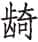
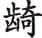
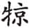

 闵公

***【题解】***

闵公，或作愍公、湣公，是鲁国第十七任君主。名启，鲁庄公庶子，母亲叔姜。前662年，庄公卒，季友按照庄公的命令，立子般为君。即位两个月，庆父使圉人荦杀子般于党氏，立闵公。时闵公年幼（至多八岁），大权为庆父把持。闵公在位仅两年（前661—前660）。前660年，庆父派卜袭杀闵公于武闱。

# 元年

***【经】***

1.1 元年春王正月①。

1.2 齐人救邢。

1.3 夏六月辛酉②，葬我君庄公。

1.4 秋八月，公及齐侯盟于落姑③。季子来归④。

1.5 冬，齐仲孙来⑤。

***【注释】***

①元年：鲁闵公元年当周惠王十六年，前661。

②辛酉：初七。

③齐侯：齐桓公。落姑：齐地名，在今山东平阴。

④季子：即季友，此时从陈国回到鲁国。

⑤仲孙：即仲孙湫，齐国大夫。

***【译文】***

鲁闵公元年春周历正月。

齐国人救援邢国。

夏六月初七，安葬我国国君鲁庄公。

秋八月，闵公与齐桓公在落姑结盟。季友回到国内。

冬，齐仲孙来我国。

***【传】***

1.1 元年春，不书即位，乱故也①。

***【注释】***

①乱：指上年之庆父之乱。子般被杀，成季奔陈。

***【译文】***

鲁闵公元年春，《春秋》没有记载闵公即位，是由于国内动乱的缘故。

1.2 狄人伐邢。管敬仲言于齐侯曰①：“戎狄豺狼，不可厌也②。诸夏亲昵，不可弃也。宴安鸩毒③，不可怀也。《诗》云：‘岂不怀归，畏此简书④。’简书，同恶相恤之谓也⑤。请救邢以从简书。”齐人救邢。

***【注释】***

①管敬仲：即管仲。

②厌：满足。

③宴安：安乐。

④岂不怀归，畏此简书：引诗见《诗经·小雅·出车》。简书，写在一片竹简上的文字，此指盟约。或曰指告急文书。沈钦韩《补注》云：“国有急难，不暇连简为策，单执简往告，犹今之羽檄矣。”

⑤同恶相恤：犹同仇敌忾，忧患与共。恤，救。

***【译文】***

狄人进攻邢国。管仲对齐桓公说：“戎狄好像豺狼，难以得到满足。中原各国互相亲近，不能够抛弃。安乐就像鸩酒毒药，不能够怀恋。《诗》说：‘难道不想回家乡，邻邦盟约不敢忘。’盟约，就是同仇敌忾、忧患与共的意思，请求您遵从盟约救援邢国。”于是齐国人出兵救援邢国。

1.3 夏六月，葬庄公。乱故，是以缓①。

***【注释】***

①是以缓：庄公死于去年八月，至此时已经十一个月。依古礼，诸侯五月而葬，而据《春秋》所载，多三月而葬。

***【译文】***

夏六月，安葬庄公。由于发生动乱的缘故，所以推迟了。

1.4 秋八月，公及齐侯盟于落姑，请复季友也①。齐侯许之，使召诸陈，公次于郎以待之。“季子来归”，嘉之也②。

***【注释】***

①复：回国。

②“季子来归”，嘉之也：《春秋经》多直书人名，此称行次而不书名，所以有褒意。

***【译文】***

秋八月，闵公和齐桓公在落姑结盟，请求齐桓公帮助季友回国。齐桓公同意了闵公的请求，派人从陈国召回季友，闵公驻扎在郎地等候他。《春秋》记载说“季子回到国内”，称“季子”，这是赞美他。

1.5 冬，齐仲孙湫来省难①。书曰“仲孙”，亦嘉之也。仲孙归曰：“不去庆父，鲁难未已②。”公曰：“若之何而去之？”对曰：“难不已，将自毙，君其待之。”公曰：“鲁可取乎？”对曰：“不可，犹秉周礼③。周礼，所以本也。臣闻之，国将亡，本必先颠④，而后枝叶从之。鲁不弃周礼，未可动也。君其务宁鲁难而亲之。亲有礼，因重固⑤，间携贰⑥，覆昏乱，霸王之器也⑦。”

***【注释】***

①省（xǐnɡ）：慰问。

②不去庆父，鲁难未已：庆父杀子般，后来又杀闵公，是鲁国内乱的祸首。成语“庆父不死，鲁难未已”，就是由这件事而来。

③秉：持，执。

④颠：颠仆。

⑤因：依。重固：稳定坚固。

⑥携贰：内部不和。

⑦器：策略，方法。

***【译文】***

冬，齐国仲孙湫来我国慰问祸难。《春秋》称之为“仲孙”，也是对他表示赞美。仲孙回国说：“不除掉庆父，鲁国的祸难没完没了。”齐桓公说：“怎么样才能除掉他？”仲孙回答说：“祸难不止，将会自取灭亡，您就等着瞧吧！”齐桓公说：“鲁国可以攻取吗？”仲孙说：“不行。它们还遵行周礼。周礼，是立国的根本。下臣听说：‘国家将要灭亡，如同大树，躯干必然先行仆倒，然后枝叶随着落下。’鲁国不抛弃周礼，是不能动它的。您应当从事于安定鲁国的祸难并且亲近它。亲近有礼仪的国家，依靠坚定稳固的国家，离间内部不和的国家，灭亡昏暗动乱的国家，这是称霸称王的策略。”

1.6 晋侯作二军①，公将上军，大子申生将下军。赵夙御戎②，毕万为右③，以灭耿、灭霍、灭魏④。还，为大子城曲沃。赐赵夙耿，赐毕万魏，以为大夫。

***【注释】***

①晋侯：晋献公。作二军：晋本有一军。

②赵夙：晋国大夫，赵衰的父亲。

③毕万：晋国大夫，周文王之子毕公高的后裔，姬姓。为后来晋国魏氏的先祖。

④耿：姬姓诸侯国，地在今山西河津东南。灭霍：《国语·晋语一》云：“（献公）十六年，公作二军。公将上军，太子申生将下军，以伐霍。太子遂行，克霍而反。”则灭霍者是太子之下军。霍，姬姓诸侯国，地在今山西霍县西南。魏：即桓公三年《传》的古魏国，姬姓诸侯国，地在今山西芮城。

***【译文】***

晋献公建立两个军，自己率领上军，太子申生率领下军。以赵夙为国君战车的驭手，以毕万作为车右，出兵灭掉耿国、霍国、魏国。回国后，为太子在曲沃建造城墙。把耿地赐给赵夙，把魏地赐给毕万，派他们做大夫。

士曰：“大子不得立矣，分之都城而位以卿①，先为之极②，又焉得立。不如逃之，无使罪至。为吴大伯③，不亦可乎？犹有令名，与其及也④。且谚曰：‘心苟无瑕，何恤乎无家⑤。’天若祚大子，其无晋乎⑥。”

***【注释】***

①都城：指曲沃。邑有宗庙先君之主曰都。位以卿：言申生将下军，位同卿。

②先为之极：言申生身为储君而位于卿，已经到了极点。

③吴大伯：即吴太伯，周太王嫡长子。太王准备立幼子季历，他与弟仲雍自动离开，一说逃至江南，断发文身，后立为吴太伯。

④与其及也：指与其留下来最终获罪被废。

⑤恤：忧虑。

⑥天若祚（zuò）大子，其无晋乎：祚，赐福。无晋，离开晋国。按，此句仍是劝太子逃亡之意。

***【译文】***

士说：“太子不能继续做储君了，分给他都城，并让他处在卿位，先让他做到了极点，又怎么能够继续做储君呢？不如逃走他地，不要等罪降临。像吴太伯那样，不也是很好吗？这样还能有好的名声，胜过留下获罪。而且俗话说：‘心里如果没有瑕疵，何必为无家而忧患呢？’上天如果赐福太子，他就一定会离开晋国。”

卜偃曰①：“毕万之后必大。万，盈数也②；魏③，大名也；以是始赏，天启之矣。天子曰兆民，诸侯曰万民。今名之大，以从盈数，其必有众④。”

***【注释】***

①卜偃：晋国大夫，掌占卜的官。杨伯峻曰：“以其职曰卜偃，以其姓氏则曰郭偃……参以《墨子》《吕览》，则卜偃之于晋文公，实变法称霸之功臣。”

②盈数：满数。

③魏：同“巍”，高大。

④必有众：一定能得到百姓。

***【译文】***

卜偃说：“毕万的后代必定昌大。万，是满数；魏，是高大的名号。用这地方作起始封赏地，上天已启示预兆了。天子主天下称‘兆民’，诸侯主一国称‘万民’。现在名号高大又随着满数，他一定会得到民众。”

初，毕万筮仕于晋①，遇《屯》之《比》②。辛廖占之③，曰：“吉。《屯》固、《比》入④，吉孰大焉？其必蕃昌⑤。《震》为土⑥，车从马⑦，足居之⑧，兄长之⑨，母覆之⑩，众归之⑪，六体不易⑫，合而能固⑬，安而能杀⑭。公侯之卦也。公侯之子孙，必复其始⑮。”

***【注释】***

①筮仕：占卜做官的吉凶。

②《屯》之《比》：《屯》卦变易为《比》卦，第一爻由阳爻变为阴爻。《屯》，六十四卦之一，震下坎上。《比》，六十四卦之一，坤下坎上。

③辛廖：周王室大夫。

④《屯》固、《比》入：《屯》艰险之象，所以坚固；《比》，亲密之象，所以能入。

⑤蕃昌：繁衍昌盛。

⑥《震》为土：《震》卦变为《坤》卦，《坤》为地，故言“为土”。

⑦车从马：《震》为车，《坤》为马，《震》变为《坤》，故言“从马”。

⑧足居之：《震》为足，《震》变为《坤》，安静之象，故言“足居之”。

⑨兄长之：《震》为长男，初爻变，为最长之意，故云。

⑩母覆之：《坤》为母，故云。

⑪众归之：《坤》为众。

⑫六体：指土、车、马、足、母、众六象。尚秉和《周易尚氏学附录》谓“《坎》数六，遇卦、之卦皆有《坎》。不易者，《坎》卦不变也”。

⑬合而能固：《比》卦有合众之义，《屯》卦有固守之义，故云。

⑭安而能杀：《比》卦有坤，坤为土安之象；《屯》卦有震，震为雷杀之象。以坤承震之变，故云。安为惠，杀为威，有惠有威，能生能杀。

⑮公侯之子孙，必复其始：毕万的祖毕公高为诸侯，他的后代一定可以恢复公侯的地位。始，指公侯之位。

***【译文】***

当初，毕万为在晋国做官而占卜，得到《屯》卦变成《比》卦。辛廖预测说：“吉利。《屯》坚固而《比》进入，还有比这更大的吉利吗？所以他必定繁衍昌盛。《震》卦变成了土，车跟随着马，脚踏实地，兄长抚育，母亲爱护，大众归附，这六条不变，能合又能固，安定又能杀戮。这是公侯的卦象。公侯的子孙，必定能恢复到他开始时公侯的地位。”

# 二年

***【经】***

2.1 二年春王正月①，齐人迁阳②。

2.2 夏五月乙酉③，吉禘于庄公④。

2.3 秋八月辛丑⑤，公薨。

2.4 九月，夫人姜氏孙于邾⑥。

2.5 公子庆父出奔莒。

2.6 冬，齐高子来盟⑦。

2.7 十有二月，狄入卫。

2.8 郑弃其师⑧。

***【注释】***

①二年：鲁闵公二年当周惠王十七年，前660。

②齐人迁阳：阳，姬姓诸侯国，地在今山东沂水西南。此盖齐人逼迫阳人迁走取其地。

③乙酉：初六。

④吉禘（ｄì）：古代诸侯死后，三年（实为二十五个月）丧期结束，将其神主送入太庙，合诸祖的神主举行的大祭叫禘。因为三年丧满，凶事已毕，故称吉禘。

⑤辛丑：二十四日。

⑥夫人姜氏：指鲁庄公夫人哀姜。孙（xùn）：奔逃。

⑦高子：齐国的高傒。子，尊称。来盟：指齐桓公派高傒来慰问鲁国庆父之难。

⑧弃其师：指郑高克的军队溃败。

***【译文】***

鲁闵公二年春周历正月，齐国人迁移阳国的百姓。

夏五月初六，为鲁庄公举行大祭。

秋八月二十四日，鲁闵公去世。

九月，夫人姜氏逃亡到邾国。

公子庆父逃亡到莒国。

冬，齐国高子来我国结盟。

十二月，狄人攻入卫国。

郑国抛弃了它的军队。

***【传】***

2.1 二年春，虢公败犬戎于渭汭①。舟之侨曰②：“无德而禄，殃也。殃将至矣。”遂奔晋。

***【注释】***

①犬戎：战国以后称为匈奴。渭汭：渭水注入黄河处，在今陕西华阴。

②舟之侨：虢国大夫。

***【译文】***

鲁闵公二年春，虢公在渭水流入黄河的地方打败犬戎。舟之侨说：“没有德行而受禄，这是灾殃。灾殃将要来临了。”于是逃亡到晋国。

2.2 夏，吉禘于庄公，速也①。

***【注释】***

①速：鲁庄公卒于三十二年八月，按二十五月丧毕，本应于八月吉禘，今五月就提前举行了，所以称“速”。

***【译文】***

夏，为庄公举行大祭。时间提前了。

2.3 初，公傅夺卜田①，公不禁。秋八月辛丑，共仲使卜贼公于武闱②。成季以僖公适邾③。共仲奔莒，乃入，立之④。以赂求共仲于莒，莒人归之。及密⑤，使公子鱼请⑥。不许，哭而往。共仲曰：“奚斯之声也。”乃缢。

***【注释】***

①公傅：闵公的保傅。当时诸侯贵族子弟皆有师有傅。卜（qí）：鲁国大夫。

②共仲：即庆父。武闱：路寝的旁门。路寝是古代天子、诸侯的正厅。

③僖公：闵公之弟。

④共仲奔莒，乃入，立之：共仲奔莒之后，成季复入鲁国而立僖公。

⑤密：鲁地名，在今山东费县北。

⑥公子鱼：鲁国贤臣，字奚斯。请：指请求恕罪。

***【译文】***

当初，闵公的保傅夺取卜的田地，闵公没有禁止。秋八月二十四日，庆父指使卜在武闱杀死了闵公。成季带着僖公去邾国。庆父逃亡到莒国，成季和僖公才回鲁国，立僖公为国君。用财货向莒国求取庆父，莒国人把他送回鲁国。到达密地，庆父派公子鱼入朝请求赦免，没有得到同意，公子鱼哭着回去。庆父听见了，说：“这是公子鱼的哭声啊！”于是上吊死了。

闵公，哀姜之娣叔姜之子也，故齐人立之。共仲通于哀姜，哀姜欲立之。闵公之死也，哀姜与知之，故孙于邾。齐人取而杀之于夷①，以其尸归。僖公请而葬之。

***【注释】***

①齐人取而杀之于夷：《列女传·孽嬖传》云：“齐桓公立僖公，闻哀姜与庆父通以危鲁。乃召哀姜酖而杀之。”夷，地名，具体所在不详。

***【译文】***

闵公是哀姜妹妹叔姜的儿子，所以齐人立他为国君。庆父和哀姜私通，哀姜想立他为国君。闵公的被害，哀姜事先知道内情，所以她逃亡到邾国。齐国人向邾国索取了哀姜，在夷地杀了她，把她的尸首带回国。鲁僖公请求归还她的尸首，把她安葬了。

2.4 成季之将生也，桓公使卜楚丘之父卜之①。曰：“男也。其名曰友，在公之右②。间于两社③，为公室辅④。季氏亡，则鲁不昌。”又筮之⑤，遇《大有》之《乾》⑥，曰：“同复于父，敬如君所⑦。”及生，有文在其手曰“友”，遂以命之。

***【注释】***

①卜楚丘之父：鲁国大夫，专掌占卜。

②在公之右：指当权用事。

③间于两社：指为鲁执政大臣。鲁有两社，即周社、亳社，两社之间即朝廷之所在和执政大臣治事之所在。

④辅：辅弼。

⑤又筮之：古代卜用龟，筮用蓍草，以动物灵于植物，故先卜后筮。

⑥《大有》：卦名，乾下离上。《乾》：卦名，乾下乾上。

⑦同复于父，敬如君所：同其父亲一样尊贵，国人敬重他如国君一样。按，这是筮者解释之言，不是卦爻辞。高亨《左传国语的周易说通解》云：“《大有》卦是上《离》下《乾》，《乾》卦是上《乾》下《乾》。《乾》为父，《离》为子，《大有》上卦的《离》变为《乾》，是象征子与其父同德，‘无改于父之道’，所以说‘同复于父’。《乾》又为君，《离》又为臣，《大有》上卦的《离》变为《乾》，又象征臣与其君同心，常在君的左右，所以又说‘敬如君所’。”

***【译文】***

成季将要出生时，鲁桓公让卜楚丘之父占卜。他说：“生的是男孩。他的名叫友，在公侯身边当权用事；他处于两社之间，为公室的辅弼。季氏灭亡，则鲁国不能昌盛。”又用筮草占，得到《大有》变为《乾》，卜楚丘之父说：“尊贵如同父亲，受到敬重如同国君。”等到他生下来，他的手上有纹像个“友”字，就以友命名。

2.5 冬十二月，狄人伐卫。卫懿公好鹤，鹤有乘轩者①。将战，国人受甲者皆曰②：“使鹤，鹤实有禄位，余焉能战！”公与石祁子玦③，与甯庄子矢④，使守，曰：“以此赞国⑤，择利而为之。”与夫人绣衣，曰：“听于二子⑥。”渠孔御戎，子伯为右，黄夷前驱，孔婴齐殿⑦。及狄人战于荧泽⑧，卫师败绩，遂灭卫。卫侯不去其旗，是以甚败。狄人囚史华龙滑与礼孔，以逐卫人。二人曰：“我，大史也，实掌其祭。不先，国不可得也⑨。”乃先之。至则告守曰：“不可待也⑩。”夜与国人出。狄入卫，遂从之⑪，又败诸河⑫。

***【注释】***

①鹤有乘轩者：汪中《述学》云：“谓以卿之秩宠之，以卿之禄食之也。”未必一定载以轩车。轩，四面有遮蔽的车，大夫以上所乘。

②国人：指当时的城市自由民。受甲：授兵，临战前在祖庙领取甲胄武器。

③石祁子：卫国大夫。玦：有缺的环形玉佩，标志裁决之权。

④甯庄子：名速，甯跪之孙，卫国大夫。矢：即箭，标志发布军令之权。

⑤赞：助理。

⑥二子：指石祁子和甯庄子。

⑦殿：殿后。

⑧荧泽：在黄河之北，今河南淇县。

⑨“我，大史也”五句：古人极重视祭祀与祭器，所以太史这样说来骗狄人。

⑩待：抵御。

⑪从之：指追击卫人。

⑫河：指黄河。

***【译文】***

冬十二月，狄人攻打卫国。卫懿公喜欢鹤，有的鹤享受大夫待遇。卫国将要与狄人作战，国内接受甲胄的人都说：“派鹤去吧！鹤享有官禄职位，我们怎么能作战！”卫懿公把玉玦交给石祁子，把令箭交给了甯庄子，派他们守御，说：“用这个来辅助国家，选择有利的事去做。”把绣衣交给了夫人，说：“听从祁、甯二位。”派渠孔驾驭战车，子伯为车右，黄夷为前锋，孔婴齐指挥后军。与狄人在荧泽交战，卫国军队大败，狄人于是灭亡了卫国。卫懿公不肯去掉自己的旗帜，所以惨败。狄人囚禁了太史华龙滑和礼孔，带着二人追逐卫军。二人说：“我们是太史，是执掌卫国祭祀的人。如果我们不先回国，你们是不可能得到卫国的。”狄人于是让他们先回国都。二人到了国都，告诉守御的人说：“没法抵御了。”夜里和国都的人一起撤离。狄人进入卫都，跟着追击卫国人，又在黄河边上打败了卫国人。

初，惠公之即位也少①，齐人使昭伯烝于宣姜②，不可，强之。生齐子、戴公、文公、宋桓夫人、许穆夫人③。文公为卫之多患也，先适齐。及败，宋桓公逆诸河，宵济④。卫之遗民男女七百有三十人⑤，益之以共、滕之民为五千人⑥，立戴公以庐于曹⑦。许穆夫人赋《载驰》⑧。齐侯使公子无亏帅车三百乘、甲士三千人以戍曹⑨。归公乘马⑩，祭服五称⑪，牛羊豕鸡狗皆三百，与门材⑫。归夫人鱼轩⑬，重锦三十两⑭。

***【注释】***

①惠公之即位也少：惠公即位时不过十五六岁。惠公，卫懿公父亲。

②昭伯：卫宣公之子公子顽，卫惠公庶兄。烝：以下犯上之意，或指通奸，此处指臣子娶君夫人之意。宣姜：齐女，惠公之母。

③齐子：或云即齐桓公宠姬之一的长卫姬。戴公：卫戴公，名申。文公：卫文公，名燬。宋桓夫人：宋桓公之夫人，宋襄公之母。

④宵济：乘夜渡河。盖因畏狄师。

⑤遗民：逃出来的卫人。

⑥共、滕：均为卫地名。共，在今河南辉县。滕，所在不详。

⑦立戴公以庐于曹：戴公实以闵二年十二月立，立而旋卒。庐，临时寄居。曹，卫地名，在今河南滑县西南之白马故城。

⑧《载驰》：诗见《诗经·国风·鄘风》。是许穆夫人闻知卫国败亡，星夜兼程赶赴曹邑吊唁祖国的危亡时面对赶来阻止她回去的许国大夫的悲愤之作。

⑨齐侯：指齐桓公。公子无亏：即公子武孟，母亲是卫姬。

⑩归（kuì）：通“馈”，赠送。乘马：指驾车之马。

⑪称：单衣复衣配套曰“称”。

⑫门材：建房做门用的木材。

⑬鱼轩：装饰着鱼皮的车子。

⑭重（chónɡ）锦：指精美的丝织品。三十两：三十匹。古代布帛，每匹四丈，分为两段，两两合卷，故谓之两，亦谓之匹。

***【译文】***

当初，卫惠公即位时年龄很小，齐国人让昭伯和宣姜成亲，昭伯不同意，齐国人就强迫他。生下齐子、戴公、文公、宋桓公夫人、许穆公夫人。文公由于卫国祸患太多，在与狄人交战前就去了齐国。等到卫国打败，宋桓公在黄河边迎接卫国败兵，夜间渡过了黄河。卫国的遗民男女共计七百三十人，加上共地、滕地的百姓共五千人，立戴公为国君，暂时寄居在曹邑。许穆夫人因此作《载驰》这首诗。齐桓公派遣公子无亏率领战车三百辆、甲士三千人守卫曹邑。赠送给戴公驾车的马，五套祭服，牛、羊、猪、鸡、狗各三百头，还有做门户的木材。赠送给夫人用鱼皮装饰的车子，厚实细锦三十匹。

2.6 郑人恶高克①，使帅师次于河上②，久而弗召。师溃而归，高克奔陈。郑人为之赋《清人》③。

***【注释】***

①郑人：指郑文公。高克：郑国大夫。

②帅师次于河上：据《诗经·国风·郑风·清人》疏，因狄侵卫，卫在河北，郑在河南，所以派高克帅师防备。

③《清人》：诗见《诗经·国风·郑风》。此诗讽刺高克率领部队在边界上无所事事，浪荡闲逛，终致部队溃散而归，自己也逃亡陈国，同时更是斥责郑文公在抵御外敌之时，因讨厌高克反而派他带领士兵去河边驻防的决策是完全错误的，是自弃其师的昏庸行为。清，清邑。在今河南中牟。

***【译文】***

郑文公厌恶高克，派他领兵驻扎在黄河边，很久不召他回来。军队溃散逃回，高克逃亡到陈国。郑国人为他作《清人》诗。

2.7 晋侯使大子申生伐东山皋落氏①。里克谏曰②：“大子奉冢祀③，社稷之粢盛④，以朝夕视君膳者也⑤，故曰冢子⑥。君行则守，有守则从。从曰抚军，守曰监国，古之制也。夫帅师，专行谋⑦，誓军旅⑧，君与国政之所图也⑨，非大子之事也。师在制命而已⑩。禀命则不威，专命则不孝，故君之嗣適不可以帅师⑪。君失其官，帅师不威，将焉用之。且臣闻皋落氏将战，君其舍之。”公曰：“寡人有子，未知其谁立焉。”不对而退。见大子，大子曰：“吾其废乎？”对曰：“告之以临民⑫，教之以军旅⑬，不共是惧⑭，何故废乎？且子惧不孝，无惧弗得立，修己而不责人，则免于难。”

***【注释】***

①东山皋落氏：赤狄的一支。故地在今山西垣曲东南皋落镇。

②里克：晋国大夫里季。

③冢祀：宗庙之祀。

④粢盛：祭祀用的粮食。

⑤视君膳：古代礼制，太子须早晚照看国君的饮食。

⑥冢子：太子。冢，大。

⑦行谋：对策略做出决断。

⑧誓军旅：号令军队。

⑨国政：国家的正卿。

⑩制命：拟订命令。古代行师，主帅制命，所谓“自阃以外，将军制之”，“将在外，君命有所不受”。

⑪嗣適：嫡嗣。適，同“嫡”。

⑫告之以临民：指命令太子居曲沃而治其民，是以治理百姓之道训太子。临民，治理百姓。

⑬教之以军旅：指派太子将下军，是以军旅之事教导太子。

⑭共：通“恭”。

***【译文】***

晋献公派太子申生攻打东山皋落氏。里克进谏说：“太子是奉事宗庙祭祀、社稷大祭，以及早晚照看国君饮食的人，所以叫做冢子。国君出行就守国，如国家已有人留守就跟随国君。跟随国君称抚军，守护国家称监国，这是古代的制度。领兵作战，专谋断略，号令将士，这是国君和正卿所应该策谋的，不是太子的事情。领兵作战的要点在于专制号令。太子领兵，如果遇事要向上请示就失去威严，擅自发号施令就是不孝，所以国君的嫡子不能统率军队。国君失去了任命职官的准则，太子统率军队也没有威严，将怎么用兵打仗呢？再说下臣听说皋落氏准备出兵迎战，国君还是收回命令为好。”晋献公说：“我有好几个儿子，还不知立谁为嗣君呢。”里克不回答，退了下去。进见太子，太子说：“我恐怕要被废黜了吧！”里克回答说：“国君命令您在曲沃治理百姓，教导您熟悉军事，您应害怕的是自己不恭敬，有什么缘故会废黜您呢？而且做儿子的应该害怕自己不孝，不应该害怕不能做嗣君，自己修身而不责备别人，就能够免于祸难。”

大子帅师，公衣之偏衣①，佩之金玦②。狐突御戎，先友为右③，梁馀子养御罕夷④，先丹木为右⑤。羊舌大夫为尉⑥。先友曰：“衣身之偏⑦，握兵之要⑧，在此行也，子其勉之。偏躬无慝⑨，兵要远灾⑩，亲以无灾，又何患焉⑪！”狐突叹曰：“时，事之征也⑫；衣，身之章也⑬；佩，衷之旗也⑭。故敬其事，则命以始⑮；服其身，则衣之纯⑯；用其衷，则佩之度⑰。今命以时卒⑱，其事也⑲；衣之尨服⑳，远其躬也(21)；佩以金玦，弃其衷也。服以远之，时以之；尨，凉(22)；冬，杀；金，寒(23)；玦，离；胡可恃也？虽欲勉之，狄可尽乎？”梁馀子养曰：“帅师者受命于庙，受脤于社(24)，有常服矣(25)。不获而尨，命可知也(26)。死而不孝，不如逃之。”罕夷曰：“尨奇无常(27)，金玦不复，虽复何为，君有心矣。”先丹木曰：“是服也(28)，狂夫阻之(29)。曰‘尽敌而反’(30)敌可尽乎！虽尽敌，犹有内谗(31)，不如违之(32)。”狐突欲行。羊舌大夫曰：“不可。违命不孝，弃事不忠。虽知其寒(33)，恶不可取(34)，子其死之。”

***【注释】***

①偏衣：左右异色的衣服，一半颜色与国君之服相同。偏，半。

②金玦：青铜做成的玦。

③狐突御戎，先友为右：此处表明太子是代晋侯将上军。狐突，晋国大夫，字伯行，狐偃的父亲，晋文公重耳的外祖父。先友，晋国大夫。

④梁馀子养御罕夷：太子本将下军，此时既将上军，则夷罕将下军。梁馀子养，晋国大夫，梁是姓，馀子为其字，养其名。罕夷，晋国下卿。

⑤先丹木：晋国大夫。

⑥羊舌大夫：叔向祖父，其名不详。尉：军尉。在军帅之下，众官之上。晋国各军都设尉，主管发众使民之事。

⑦衣身之偏：指太子所穿偏衣有一半是国君之服的颜色。

⑧握兵之要：指太子佩金玦，将上军，下军从行。

⑨慝（tè）：恶意。

⑩兵要远灾：兵权在手，可以远离灾祸。

⑪又何患焉：按，先友将之视为好事，或已心知非常，故意这样说来慰勉太子。

⑫时，事之征也：意谓献公以冬季举兵征伐，冬主杀，则献公心存杀意。时，指征伐的时间。时为冬季。征，征象。

⑬衣，身之章也：古代的服色表明各人的身份。章，标记。

⑭佩，衷之旗也：佩饰表明心意。佩，配饰。衷之旗，心意的旗帜。

⑮命以始：在春夏发布命令。始，四时之始，指春夏。

⑯衣之纯：纯，指纯色衣服。古代戎服，尤贵纯色，故谓之均服。

⑰佩之度：佩饰要合乎礼度。古人以佩玉为常度。

⑱时卒：四时之卒，指年终。

⑲（bì）其事：使事情难以成功。，关门。亦泛指关闭。

⑳尨（mánɡ）服：杂色服，指偏衣。

(21)远其躬：疏远太子。

(22)尨，凉：凉，《说文》引作“”，亦杂色之义。

(23)金，寒：古人谓玉之德温，而金之德寒。

(24)受脤（shèn）于社：出师前祭社稷，接受祭肉。脤，祭肉。

(25)常服：指规定的服饰。

(26)命可知也：指献公之命不怀善意。

(27)尨奇无常：《国语·晋语一》引仆人赞之语曰：“太子殆哉！君赐之奇，奇生怪，怪生无常，无常不立。”无常，非常，不正常。

(28)是服：指偏衣。

(29)阻：难。

(30)尽敌而反：这是献公命太子之辞。

(31)内谗：指骊姬。

(32)违：去。指逃亡。

(33)寒：指国君的心意不善。

(34)恶：指不忠不孝。

***【译文】***

太子申生带领军队，晋献公让他穿左右异色的偏衣，佩带有缺口的青铜环形佩器。狐突驾驭战车，先友作为车右。梁馀子养为罕夷驾驭战车，先丹木作为车右。羊舌大夫任军尉。先友说：“穿着一半与国君衣服相同的偏衣，掌握着军队大权，成败全在此一行，您要好好勉励自己。分出一半衣服给你是没有恶意，兵权在手可以远离灾祸，既得国君亲近又远离灾祸，又担心什么呢！”狐突叹息说：“时令，是事物的征象；衣服，是身分的标识；佩饰，是心志的旗帜。因此如果看重这件事，就应该在春、夏时发布命令；赐予衣服，就不要用杂色；使人衷心为己所用，就要让他佩带合于礼度的配饰。如今在年终发布命令，是要让事情不能顺利进行；赐给他穿杂色衣服，是有意要疏远他；让他佩带缺口青铜环佩器，是表示内心对他的决绝。现在是用衣服疏远他，用时令使他不能顺利进行；杂色，意味着凉薄；冬天，意味着肃杀；金，意味着寒冷；玦，意味着决绝，这怎么可以依靠呢？即使想勉力而为，狄人怎么能消灭干净呢？”梁馀子养说：“领兵的人，在太庙里接受命令，在土地神庙里接受祭肉，有规定的服饰。如今没得到规定的服饰而得到杂色衣服，命令的不怀好意可想而知了。死了以后还要落个不孝的罪名，不如逃走。”罕夷说：“杂色的奇装异服不合规定，青铜环形佩器表示决绝不归。这样，即使是回来又有什么意思？国君已经不怀好意了。”先丹木说：“这样的衣服，狂人也会对它产生疑惑。国君说‘将敌人消灭干净再回来’，敌人难道可以消灭得完吗？即使把敌人消灭干净了，还有内部的谗言，不如离开这里。”狐突想走，羊舌大夫说：“不行。违背君命是不孝，抛弃责任是不忠。虽然已经感到了国君心中寒薄，不孝不忠这样的邪恶也是不可取的，您还是为此而死吧！”

大子将战，狐突谏曰：“不可，昔辛伯谂周桓公云①：‘内宠并后②，外宠二政③，嬖子配適④，大都耦国，乱之本也。’周公弗从，故及于难。今乱本成矣，立可必乎？孝而安民⑤，子其图之，与其危身以速罪也。”

***【注释】***

①辛伯谂（shěn）周桓公：指桓公十八年子仪有宠于周桓王，桓王属之周公，辛伯谏周公之事。谂，规谏。

②内宠：暗指骊姬。

③外宠：暗指梁五与东关嬖五。

④嬖子：指奚齐、卓子。

⑤孝而安民：奉身为孝，不战为安民。

***【译文】***

太子准备作战，狐突劝阻说：“不行。从前辛伯劝阻周桓公说：‘妾媵并同于王后，宠臣相等于正卿，庶子和嫡子地位一样，大城和国都规模相同，这就是祸乱的根本。’周桓公没有听从，所以遭到祸难。现在祸乱的根本已经形成，您难道还能肯定会被立为嗣君吗？与其危害自身而加快罪过的到来，还不如奉身为孝、不战而安定百姓，您好好想想吧。”

2.8 成风闻成季之繇①，乃事之②，而属僖公焉③，故成季立之。

***【注释】***

①成风：鲁庄公之妾，僖公的母亲。繇（zhòu）：卜兆的占辞。

②事：结交。

③属：托付。

***【译文】***

成风听说了成季出生时占卜的卦辞，便与他结好，并且把僖公托付给他，所以成季立僖公为国君。

2.9 僖之元年，齐桓公迁邢于夷仪①。二年，封卫于楚丘②。邢迁如归，卫国忘亡。

***【注释】***

①夷仪：在今山东聊城。

②楚丘：在今河南滑县。

***【译文】***

僖公元年，齐桓公把邢国迁移到夷仪。二年，把卫国封在楚丘。邢国迁居后十分安定，好像回到原来的国土；卫国重建也安居乐业，忘记了自己的亡国之痛。

2.10 卫文公大布之衣①，大帛之冠②，务材训农③，通商惠工，敬教劝学，授方任能④。元年，革车三十乘⑤；季年⑥，乃三百乘。

***【注释】***

①大布：粗布。

②大帛：粗丝织成的厚帛。

③务材：努力从事生产。

④方：为官之道。

⑤革车：兵车。

⑥季年：末年。卫文公之末年在鲁僖公二十五年。

***【译文】***

卫文公穿着粗布衣服，戴着粗帛帽子，努力生产，教导农耕，便利商贩，加惠百工，重视教化，奖励求学，训导百官为官之道，举贤受能。元年时，战车只有三十辆；到末年，已有了三百辆。

