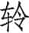
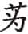
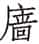
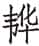
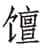

 僖公

***【题解】***

僖公，或作釐公，鲁国第十八任国君。名申，庄公少子，闵公弟，成风所生。前660年庆父杀闵公，鲁季友立申，是为僖公。在位三十三年，前627年死，子文公兴立。僖公在位的三十多年里，晋文公重耳经过十九年的流亡，重新回到晋国当上国君，振兴晋国，并在僖公二十八年城濮之战中打败楚国，成为霸主，建立了继齐桓公之后又一强大的霸业。僖公在位期间，诸侯国之间还发生了几次重要的战争，如僖公十五年的秦晋韩原之战，僖公二十二年的泓之战，僖公三十三年的崤之战，成为春秋中期争霸斗争中的重要事件。在这期间，五霸中的齐桓公、宋襄公、晋文公叱咤一时之后都死去。春秋的形势，进入一个新的时期。

# 元年

***【经】***

1.1 元年春王正月①。

1.2 齐师、宋师、曹伯次于聂北②，救邢③。

1.3 夏六月，邢迁于夷仪④。

1.4 齐师、宋师、曹师城邢。

1.5 秋七月戊辰⑤，夫人姜氏薨于夷，齐人以归⑥。

1.6 楚人伐郑⑦。

1.7 八月，公会齐侯、宋公、郑伯、曹伯、邾人于柽⑧。

1.8 九月，公败邾师于偃⑨。

1.9 冬十月壬午⑩，公子友帅师败莒师于郦⑪。获莒挐⑫。

1.10 十有二月丁巳⑬，夫人氏之丧至自齐⑭。

***【注释】***

①元年：鲁僖公元年当周惠王十八年，前659。

②曹伯：当作“曹师”。据《传》文“诸侯救邢”，则三国都是国君亲自率师，前二国皆称“师”，此不应独称“曹伯”。聂北：在今山东博平。

③救邢：庄公三十二年狄伐邢，此年诸侯救之。邢，姬姓国，在今河北邢台西南。

④夷仪：在今山东聊城西。

⑤戊辰：二十六日。

⑥夫人姜氏薨于夷，齐人以归：上年哀姜参与庆父之乱，齐人杀掉哀姜，现送回尸体。姜氏，哀姜。

⑦楚人：《春秋经》此前均称“楚”为“荆”，自此改称“楚”。

⑧柽（chēnɡ）：宋地，在今河南淮阳西北。

⑨偃：邾地，在今山东费县南。

⑩壬午：十二日。

⑪公子友：季友。郦（lí）：鲁地，今河南内乡东北。

⑫获：大夫被俘虏，不管生死都叫获。莒挐（ná）：莒君的弟弟。

⑬丁巳：十八日。

⑭夫人氏：指哀姜。丧：入殓的尸体。

***【译文】***

鲁僖公元年春周历正月。

齐国、宋国、曹国的军队驻扎在聂北，准备救邢国。

夏六月，邢人迁都到夷仪。

齐国、宋国、曹国的军队在夷仪为邢筑城。

秋七月二十六日，夫人姜氏死于夷，齐人送回她的灵柩。

楚国人攻打郑国。

八月，僖公和齐桓公、宋襄公、郑文公、曹昭公、邾君在柽地会盟。

九月，僖公在偃地打败邾国军队。

冬十月十二日，公子友率军队在郦地打败莒国的军队，抓获莒君的弟弟挐。

十二月十八日，姜氏的灵柩从齐国送回。

***【传】***

1.1 元年春，不称即位，公出故也①。公出复入，不书，讳之也。讳国恶②，礼也。

***【注释】***

①出：上年八月闵公死，僖公出奔邾。

②国恶：国家之乱。指上年鲁国庆父之乱。九月，庆父逃亡莒国，僖公才回鲁国即位。

***【译文】***

鲁僖公元年春，《春秋》不记载僖公即位，是因为僖公出奔在外的缘故。僖公因内乱出奔而回国，《春秋》不记载，是出于隐讳。隐讳国家的坏事，这符合礼法。

1.2 诸侯救邢。邢人溃，出奔师①。师遂逐狄人，具邢器用而迁之②，师无私焉③。

***【注释】***

①出奔师：奔逃到诸侯军队中。

②器用：指财货物品。

③私：指私下拿走邢国器用财物。

***【译文】***

齐、宋、曹三国军队救邢国。邢国的军队败溃，都逃到诸侯军中。诸侯军于是赶走了狄人，收拾了邢人的全部财货器用让他们迁走，军队没有私自占取邢人的财物。

1.3 夏，邢迁于夷仪，诸侯城之①，救患也。凡侯伯②，救患、分灾、讨罪③，礼也。

***【注释】***

①城之：为邢国筑城。《国语·齐语》云：“狄人攻邢，桓公筑夷仪以封之。男女不淫，牛马选具。”《管子·大匡篇》云：“狄人伐邢，邢君出，致于齐，桓公筑夷仪以封之，予车百乘，卒千人。”

②侯伯：诸侯之伯，即霸主，此指齐桓公。

③分灾：诸侯之国遭受天灾，用谷物布帛去救济。讨罪：率诸侯军讨伐有罪。

***【译文】***

夏，邢国迁到夷仪，诸侯为它修筑城墙，这是为它解救患难。凡霸主，解救患难、分担灾难、讨伐有罪，这是符合礼法的。

1.4 秋，楚人伐郑，郑即齐故也①。盟于荦②，谋救郑也。

***【注释】***

①即：亲近。

②荦（luò）：即《经》文的柽。鲁、齐、宋、郑、曹、邾等国在荦会盟。

***【译文】***

秋天，楚国人攻打郑国，是因为郑国人与齐国亲近。诸侯在荦地结盟，商量救郑之事。

1.5 九月，公败邾师于偃，虚丘之戍将归者也①。

***【注释】***

①虚丘：在今山东费县。上年哀姜逃到邾，邾人送还哀姜。邾国派兵戍守虚丘，准备侵犯鲁国。齐人送回哀姜之丧，邾人害怕，撤回虚丘之兵，被鲁国拦击。

***【译文】***

九月，僖公在偃地打败邾国军队，这是戍守虚丘将撤回的军队。

1.6 冬，莒人来求赂①。公子友败诸郦，获莒子之弟挐。非卿也，嘉获之也②。公赐季友汶阳之田及费③。

***【注释】***

①赂：财货。上年鲁国以财货向莒国求取庆父，现在莒国又以此为由向鲁国求取财货。

②非卿也，嘉获之也：莒挐不是卿，本不应予记载，但《经》文予以记载，是嘉奖季友擒获莒挐的功劳。

③汶阳之田：汶水之北的田地。阳，山南水北叫阳。费：故城在山东费县西北。

***【译文】***

冬，莒国人来求取财货。公子友在郦地打败他们，擒获莒君之弟挐。莒挐不是卿，《春秋》加以记载，是为了嘉奖季友的功劳。僖公将汶阳的田地和费地奖赏给季友。

1.7 夫人氏之丧至自齐。君子以齐人杀哀姜也为已甚矣①，女子，从人者也②。

***【注释】***

①已甚：太过分。已，太。

②从人者：古代礼制，女子未嫁从父，既嫁从夫，夫死从子。哀姜既已嫁鲁国，虽对鲁国有罪，也不应由娘家的齐国来处置。

***【译文】***

夫人姜氏的灵柩从齐国送回。君子认为齐国人杀哀姜是太过分了。女子，是跟从夫家的。

# 二年

***【经】***

2.1 二年春王正月①，城楚丘②。

2.2 夏五月辛巳③，葬我小君哀姜④。

2.3 虞师、晋师灭下阳⑤。

2.4 秋九月，齐侯、宋公、江人、黄人盟于贯⑥。

2.5 冬十月，不雨⑦。

2.6 楚人侵郑。

***【注释】***

①二年：鲁僖公二年当周惠王十九年，前658。

②城楚丘：此时卫尚庐于曹，先筑城而后迁徙，故云“城楚丘”。楚丘，在今河南滑县东。

③辛巳：十四日。

④小君：诸侯之妻。去年冬哀姜灵柩回来，此时才下葬。

⑤下阳：在今山西平陆北。

⑥江：嬴姓国，在今河南息县。黄：嬴姓国，在今河南潢川。贯：宋地，在今山东曹县南。

⑦不雨：不下雨，但没有发生旱灾。

***【译文】***

鲁僖公二年春周历正月，在楚丘筑城。

夏五月十四日，我国小君哀姜下葬。

虞国、晋国的军队攻灭下阳。

秋九月，齐桓公、宋襄公、江国、黄国的国君在贯地结盟。

冬十月，不下雨。

楚国人再次侵犯郑国。

***【传】***

2.1 二年春，诸侯城楚丘而封卫焉①。不书所会②，后也③。

***【注释】***

①封：封国，建国。卫国因狄人入侵而君死国灭，重新恢复，所以称为“封”。

②会：指会见。

③后：迟到。指鲁僖公迟到。

***【译文】***

二年春，诸侯在楚丘筑城并把卫国封在那里。因鲁僖公迟到，所以《春秋》没记载诸侯会见。

2.2 晋荀息请以屈产之乘与垂棘之璧①，假道于虞以伐虢②。公曰：“是吾宝也③。”对曰：“若得道于虞，犹外府也④。”公曰：“宫之奇存焉⑤。”对曰：“宫之奇之为人也，懦而不能强谏，且少长于君⑥，君昵之⑦，虽谏，将不听。”乃使荀息假道于虞，曰：“冀为不道⑧，入自颠⑨，伐鄍三门⑩。冀之既病，则亦唯君故⑪。今虢为不道，保于逆旅⑫，以侵敝邑之南鄙。敢请假道以请罪于虢⑬。”虞公许之，且请先伐虢。宫之奇谏，不听，遂起师。夏，晋里克、荀息帅师会虞师伐虢，灭下阳⑭。先书虞，贿故也。

***【注释】***

①荀息：晋大夫，名黯，字息，也叫荀叔。屈产之乘：北屈所产的马。北屈，在今山西吉县东北，与狄交界。垂棘：晋地，在山西潞城北。

②假道于虞以伐虢：虞，在今山西平陆东北。虢，此指北虢，其故都下阳据王夫之《稗疏》，在平陆大阳之南，滨河之北。虞在晋国南边，虢又在虞南边，所以晋伐虢要向虞借道。

③是：指屈产之乘与垂棘之璧。

④外府：外库。

⑤宫之奇：虞国的贤臣。

⑥少长于君：自小和虞君一起在宫中长大。

⑦昵：亲近。

⑧冀：国名，在今山西河津东北。不道：残暴。

⑨颠（línɡ）：也叫虞坂，虞国境内要道，即晋国想借之路。

⑩鄍（mínɡ）：虞地，在今山西平陆东北。

⑪亦唯君故：晋国曾为虞伐冀，因此说晋伐冀使冀受到损伤，完全是为了虞君。

⑫保：同“堡”，堡垒。逆旅：客舍，似后来的旅馆。

⑬请罪：问罪，此乃委婉之说法。

⑭下阳：虢国要塞，也是虢国宗庙所在。

***【译文】***

晋国的荀息请求用北屈出产的马和垂棘的玉璧作为礼物借路虞国以讨伐虢国。晋献公说：“这两项东西是我的宝贝啊。”荀息回答说：“如果能借得虞国的道路，那就等于把东西放在自己的外库里。”晋献公又说：“宫之奇在那里。”荀息回答说：“宫之奇的为人，懦弱又不能坚决进谏，而且从小和虞君一起在宫中长大，虞君很亲近他，即使进谏，虞君也不会听。”于是让荀息向虞国借路，说：“冀国残暴，从颠攻打虞国，从三面城门进攻鄍地。晋国攻打冀国使冀国受到重创，完全是为了虞君啊。现在虢国无道，在客舍里筑碉堡，攻打晋国南部边境。所以请让我们借路，以向虢国问罪。”虞君答应了，并且请求作为前导先攻打虢国。宫之奇劝阻虞君，虞君不听，虞国于是发兵。夏，晋国的里克、荀息率领军队和虞军会师，攻打虢国，灭了下阳。《春秋》先写虞国，因为虞国接受了贿赂。

2.3 秋，盟于贯，服江、黄也①。

***【注释】***

①服江、黄：江、黄本是楚国的属国，现在来亲附齐国，所以诸侯会盟。

***【译文】***

秋，在贯地结盟，因为江、黄两国归附于齐国。

2.4 齐寺人貂始漏师于多鱼①。

***【注释】***

①寺人貂：即坚貂。寺人，宦官。漏师：泄露军事机密。多鱼：地名，大概在今河南虞城。

***【译文】***

齐国的宦官貂开始在多鱼泄露军事机密。

2.5 虢公败戎于桑田①。晋卜偃曰②：“虢必亡矣。亡下阳不惧，而又有功③，是天夺之鉴④，而益其疾也⑤。必易晋而不抚其民矣⑥，不可以五稔⑦。”

***【注释】***

①桑田：地名，在今河南灵宝。

②卜偃：晋国的占卜官，名偃。

③有功：指打败戎人。

④鉴：镜子。

⑤疾：病，此借指罪恶。

⑥易晋：以晋为易，即轻视晋国。

⑦稔（rěn）：庄稼成熟叫稔。谷物一年一熟，所以“稔”又借为“年”。

***【译文】***

虢公在桑田打败戎人。晋国的卜偃说：“虢国必定要亡国了。下阳被灭了不害怕，反而有了武功，这是上天夺走了它的镜子，而加重了它的罪恶。它必然轻视晋国而不安抚其百姓，不会超过五年了。”

2.6 冬，楚人伐郑，斗章囚郑聃伯①。

***【注释】***

①斗章：楚国大夫。聃伯：郑国大夫。

***【译文】***

冬，楚国人攻打郑国，楚国大夫斗章囚禁了郑国的聃伯。

# 三年

***【经】***

3.1 三年春王正月①，不雨。

3.2 夏四月不雨。

3.3 徐人取舒②。

3.4 六月雨。

3.5 秋，齐侯、宋公、江人、黄人会于阳谷③。

3.6 冬，公子友如齐莅盟④。

3.7 楚人伐郑。

***【注释】***

①三年：鲁僖公三年当周惠王二十年，前657。

②徐：国名，嬴姓，在今安徽泗县西北。舒：偃姓国，在今安徽舒城一带。

③阳谷：齐地，在今山东阳谷北。

④莅盟：参加盟会。

***【译文】***

鲁僖公三年春周历正月，不下雨。

夏四月不下雨。

徐国人攻取了舒国。

六月下雨。

秋，齐桓公、宋襄公、江人、黄人在阳谷相会。

冬，公子友到齐国参加会盟。

楚国人攻打郑国。

***【传】***

3.1 三年春，不雨。夏六月雨。自十月不雨至于五月。不曰旱，不为灾也。

***【译文】***

鲁僖公三年春，不下雨。夏六月下雨。自上年十月一直到今年五月一直没有下雨。没有成灾，所以《春秋》的记载不说旱。

3.2 秋，会于阳谷，谋伐楚也。

***【译文】***

秋，诸侯在阳谷会见，商量讨伐楚国之事。

3.3 齐侯为阳谷之会，来寻盟。冬，公子友如齐莅盟。

***【译文】***

齐桓公为了阳谷的会见，派人来重续旧好。冬，鲁国派公子友到齐国参加盟会。

3.4 楚人伐郑，郑伯欲成①。孔叔不可②，曰：“齐方勤我③，弃德不祥。”

***【注释】***

①成：讲和。

②孔叔：郑国大夫。

③勤我：为我而勤，即指来救我。勤，劳。

***【译文】***

楚国人攻打郑国，郑文公想讲和。孔叔不同意，说：“齐国正要来救我，抛弃这种恩德不祥。”

3.5 齐侯与蔡姬乘舟于囿①，荡公②。公惧，变色。禁之，不可。公怒，归之，未之绝也。蔡人嫁之③。

***【注释】***

①蔡姬：蔡穆侯的妹妹，齐桓公夫人。囿：帝王的园林。

②荡：摇晃。

③蔡人嫁之：此本与下年侵蔡事连为一体，为后人割裂在此。

***【译文】***

齐桓公和蔡姬在花园里乘船玩，蔡姬摇晃着船逗桓公。桓公害怕，变了脸色。要蔡姬停下来，她却不停。桓公发怒了，把蔡姬送回娘家，但没有完全休弃她。蔡国人却把她嫁给别国。

# 四年

***【经】***

4.1 四年春王正月①，公会齐侯、宋公、陈侯、卫侯、郑伯、许男、曹伯侵蔡②。蔡溃，遂伐楚，次于陉③。

4.2 夏，许男新臣卒④。

4.3 楚屈完来盟于师⑤，盟于召陵⑥。

4.4 齐人执陈辕涛涂⑦。

4.5 秋，及江人、黄人伐陈。

4.6 八月，公至自伐楚。

4.7 葬许穆公。

4.8 冬十有二月，公孙兹帅师会齐人、宋人、卫人、郑人、许人、曹人侵陈⑧。

***【注释】***

①四年：鲁僖公四年当周惠王二十一年，前656。

②侵蔡：上年蔡国把齐桓公夫人蔡姬嫁给别国引起诸侯侵蔡。

③次：驻扎。陉（xínɡ）：楚地，在今河南郾城南。

④许男新臣：许穆公，男爵，名新臣。

⑤屈完：楚大夫。

⑥召陵：地名，在今河南郾城东。

⑦辕涛涂：陈国大夫。

⑧公孙兹：鲁叔牙之子叔孙戴伯。

***【译文】***

鲁僖公四年春周历正月，鲁僖公会合齐桓公、宋襄公、陈宣公、卫文公、郑文公、许穆公、曹昭公入侵蔡国。蔡国溃败，于是攻打楚国，军队驻扎在陉地。

夏，许穆公新臣死于军中。

楚大夫屈完到诸侯军中会盟，在召陵结盟。

齐国人抓住陈国大夫辕涛涂。

秋，齐国军队和江、黄二国攻打陈国。

八月，鲁僖公从伐楚的军中回国。

安葬许穆公。

冬十二月，公孙兹率领军队和齐国、宋国、卫国、郑国、许国、曹国的军队会合入侵陈国。

***【传】***

4.1 四年春，齐侯以诸侯之师侵蔡①。蔡溃，遂伐楚。

***【注释】***

①侵蔡：蔡国嫁了蔡姬，又亲楚，齐侵蔡是为伐楚作准备。

***【译文】***

鲁僖公四年春，齐桓公率领宋、鲁、陈、卫、郑、许、曹等国的军队去攻打蔡国。蔡国军队被打败，诸侯的军队于是讨伐楚国。

楚子使与师言曰：“君处北海，寡人处南海，唯是风马牛不相及也①，不虞君之涉吾地也，何故？”

***【注释】***

①风马牛不相及也：孔颖达《疏》引服虔曰：“牝牡相诱谓之风……此言‘风马牛’，谓马牛风逸，牝牡相诱，盖是末界之微事，言此事不相及，故以取喻不相干也。”一说：风，放逸，走失。谓齐楚两地相离甚远，马牛不会走失至对方地界。后用以比喻事物之间毫不相干。风，谓兽类雌雄相诱。

***【译文】***

楚成王派使者去军中质问齐桓公说：“贵国在北方，楚国在南方，两国相隔很远，就是牛马发情，也不能跑到一起呀，没想到您却侵入到我国来了，这是为什么呀？”

管仲对曰：“昔召康公命我先君大公曰①：‘五侯九伯②，女实征之③，以夹辅周室④。’赐我先君履⑤：东至于海⑥，西至于河⑦，南至于穆陵⑧，北至于无棣⑨。尔贡包茅不入⑩，王祭不共⑪，无以缩酒⑫，寡人是征⑬；昭王南征而不复⑭，寡人是问。”

***【注释】***

①召康公：周武王时太保召公奭。大公：即太公姜尚，齐国始封君。

②五侯九伯：五侯，指公、侯、伯、子、男五等爵位。九伯，指九州之长。

③女：通“汝”。

④夹（xié）：通“挟”。

⑤赐我先君履：赐履，指征伐的足迹所到的范围。

⑥东至于海：《齐语》“东至于纪酅”，则齐桓公之疆境东不至海。

⑦西至于河：《齐语》述齐桓公正其封疆，西至于济，则此“西至于河”及前“东至于海”，当为可以征伐之界。河，黄河。

⑧穆陵：楚地名，大约在湖北麻城西北一带。

⑨无棣：地名，在今山东、河北交界处，今属山东。

⑩尔：指楚王。包茅：古代祭祀时用以滤酒的菁茅。因以裹束菁茅置匣中，故称。

⑪共：同“供”。

⑫缩酒：用菁茅滤去酒糟。

⑬是征：即征是。征，问罪。

⑭昭王南征而不复：周昭王晚年不理国事，人民怨恨，当他巡狩南方渡过汉水时，当地人民故意让他乘一只用胶黏的船，行至中流，船解体下沉，昭王与臣子都淹死了。昭王，即周昭王，成王之孙。

***【译文】***

管仲回答楚国使者说：“从前，召康公为周天子命令我们齐国的先君太公说：‘天下的诸侯，不论谁犯了罪，你都可以征伐，以便辅佐王室。’并赐予我们先君讨伐的范围：东到大海，西到黄河，南到穆陵，北到无棣。你们楚国，该进贡裹束的菁茅却没有进贡，以致天子祭祀时供应不上，没有东西可以滤酒祭神，寡人特意为此来问罪；昭王南巡到汉水而没有回去，寡人因此责问你们。”

对曰：“贡之不入，寡君之罪也，敢不共给？昭王之不复，君其问诸水滨①。”师进，次于陉。

***【注释】***

①“贡之不入”五句：贡之不入，罪小，故认改；昭王之不复，罪大，故推诿。诸，“之于”的合音。

***【译文】***

楚国使者回答说：“贡品没有送上去，这是我们国君的罪过，我们岂敢不供给？昭王南巡而不返，您去汉水边打听打听吧！”诸侯军队前进，驻扎在陉地。

夏，楚子使屈完如师，师退，次于召陵。

***【译文】***

到了夏天，楚王派大夫屈完到诸侯联军那里，联军后撤，驻扎在离陉地不远的召陵。

齐侯陈诸侯之师，与屈完乘而观之。齐侯曰：“岂不穀是为①，先君之好是继。与不穀同好，如何？”对曰：“君惠徼福于敝邑之社稷②，辱收寡君③，寡君之愿也。”齐侯曰：“以此众战，谁能御之？以此攻城，何城不克？”对曰：“君若以德绥诸侯④，谁敢不服？君若以力，楚国方城以为城⑤，汉水以为池，虽众，无所用之！”屈完及诸侯盟。

***【注释】***

①不穀：国君自谦的称呼。

②君惠徼（ｙāｏ）福于敝邑之社稷：此句意为您为敝国的社稷求福。惠，表谦敬的副词。徼，求。

③辱：客气语。收：接纳。

④绥（suí）：安抚。

⑤方城：山名，今河南叶县南有方城山。

***【译文】***

齐桓公让诸侯的军队全部列好阵势，然后自己和屈完一起同乘一辆车去检阅军队。齐桓公说：“列国这样做难道是为了我吗？这是在继承我先君的友好精神呀！贵国和我们友好吧，怎么样？”屈完回答说：“您为敝国求福谋利，愿接受我楚君做盟友，这本是我楚君最大的愿望啊！”齐桓公又说：“用这样的军队去打仗，谁能抵挡得了？用这样的军队去攻城，什么样的城池不能攻下？”屈完回答说：“您如果以道德安定诸侯，哪个敢不服？如果要用武力，那我们楚国将把方城山作为城墙，汉水作为护城河，您的军队虽然众多，恐怕也用不上啊！”于是屈完代表楚国和诸侯签订了盟约。

4.2 陈辕涛涂谓郑申侯曰①：“师出于陈、郑之间，国必甚病②。若出于东方，观兵于东夷③，循海而归，其可也。”申侯曰：“善。”涛涂以告齐侯，许之。申侯见曰：“师老矣④，若出于东方而遇敌，惧不可用也⑤。若出于陈、郑之间，共其资粮屝屦⑥，其可也。”齐侯说，与之虎牢⑦。执辕涛涂。

***【注释】***

①申侯：郑国大夫。

②病：困乏。

③观兵：以兵力示威。东夷：指郯、莒、徐夷诸国。

④老：军队出兵久，疲惫不堪。

⑤惧不可用：不能对付敌人。

⑥资：也是粮。屝（ｆèi）屦：草鞋。常泛指行旅用品。

⑦虎牢：郑地，即制邑。

***【译文】***

陈国的辕涛涂对郑国的申侯说：“齐军经过陈国、郑国之间，陈、郑两国负担沉重，必十分困乏。如果出兵东方，向东夷诸国陈兵示威，再沿海路回国，这就好了。”申侯说：“对呀。”辕涛涂就把这个意见告诉齐桓公，齐桓公同意了。申侯去见齐桓公说：“军队出兵已久，疲惫不堪，如果从东方走，遇到敌人，恐怕不能抵御敌人啊。如果取道陈国、郑国之间，由他们供应粮食和草鞋，该更好。”齐桓公很高兴，把虎牢奖给申侯。把辕涛涂抓起来。

4.3 秋，伐陈①，讨不忠也②。

***【注释】***

①伐陈：指齐国和江、黄一起伐陈。

②不忠：指辕涛涂引诱齐军出东道。

***【译文】***

秋，齐国和江、黄等国一起讨伐陈国，是为惩罚它的不忠。

4.4 许穆公卒于师，葬之以侯①，礼也。凡诸侯薨于朝、会，加一等②；死王事③，加二等。于是有以衮敛④。

***【注释】***

①葬之以侯：许穆公是男爵，而以侯爵之礼葬之。

②加一等：葬礼加一等级。

③王事：指征伐。许男死于为周王伐楚，亦属王事。

④衮（ɡǔn）：衮衣，天子及上公的礼服。

***【译文】***

许穆公死于军中，用侯爵的礼节安葬他，这是合乎礼的。凡是诸侯死于朝觐、会盟，葬礼加一等；死于征战，加二等。因此用衮衣入殓。

4.5 冬，叔孙戴伯帅师会诸侯之师侵陈①。陈成②，归辕涛涂。

***【注释】***

①诸侯之师：即鲁、齐、宋、卫、郑、许、曹联军。

②成：求和。

***【译文】***

叔孙戴伯率领军队和诸侯联军攻打陈国。陈国服罪求和，齐人因此放回辕涛涂。

4.6 初，晋献公欲以骊姬为夫人，卜之①，不吉；筮之②，吉。公曰：“从筮。”卜人曰③：“筮短龟长④，不如从长。且其繇曰⑤：‘专之渝⑥，攘公之羭⑦。一薰一莸⑧，十年尚犹有臭⑨。’必不可。”弗听，立之。生奚齐，其娣生卓子⑩。

***【注释】***

①卜：占卜。卜用龟甲。

②筮：用蓍草占卜。

③卜人：主占卜的官。

④筮短龟长：古人认为卜较筮为灵验，所以说筮短龟长。

⑤繇（zhòu）：占卜所得的兆辞。

⑥专：专宠。渝：变。

⑦攘：窃取，偷。羭（yú）：公羊。此暗指申生。

⑧薰：香草，暗指申生。莸：臭草，暗指骊姬。

⑨臭（xiù）：气味。凡气味不论香臭，都可称臭。此指臭气。

⑩娣：妹妹。按，以上追述前事，参见庄公二十八年《传》。

***【译文】***

当初，晋献公想立骊姬为夫人，占卜，不吉利；占筮，吉利。献公说：“就依从占筮的吧。”占卜的人说：“占筮不灵验，占卜比较灵验，不如依从占卜。况且其爻辞说：‘专宠过分就会变出坏心，偷走你的公羊。香草臭草放在一起，十年之后还会有臭气。’一定不行。”晋献公不听，立了骊姬。骊姬生奚齐，她妹妹生了卓子。

及将立奚齐，既与中大夫成谋①，姬谓大子曰：“君梦齐姜，必速祭之②。”大子祭于曲沃③，归胙于公④。公田⑤，姬置诸宫六日。公至，毒而献之。公祭之地，地坟⑥。与犬，犬毙。与小臣⑦，小臣亦毙。姬泣曰：“贼由大子⑧。”大子奔新城⑨。公杀其傅杜原款。

***【注释】***

①中大夫：支持骊姬的宫中大夫。成谋：定下计谋。

②君梦齐姜，必速祭之：古人梦见先人，皆以食享之。齐姜，申生的生母。

③曲沃：晋献公祖庙所在，齐姜死后祔于祖姑，其庙也在曲沃。

④胙（zuò）：祭祀的酒肉。

⑤田：打猎。

⑥公祭之地，地坟：《史记·晋世家》曰：“献公从猎来还，宰人上胙献公，献公欲飨之。骊姬从旁止之，曰：‘胙所从来远，宜试之。’祭地，地坟……”祭之地，指饮前先酹酒，即将酒浇于地而祭。坟，地面隆起。

⑦小臣：献公身边太监。

⑧贼由大子：按，《史记·晋世家》记此语曰：“骊姬泣曰：‘太子何忍也！其父而欲弑代之，况他人乎？且君老矣，旦暮之人，曾不能待而欲弑之！’谓献公曰：‘太子所以然者，不过以妾及奚齐之故。妾愿子母辟之他国，若早自杀，毋徒使母子为太子所鱼肉也。始君欲废之，妾犹恨之；至于今，妾殊自失于此。’”更为阴险恶毒。贼，加害，干坏事。

⑨新城：即曲沃。

***【译文】***

到了晋献公准备立奚齐为太子时，骊姬已经和宫中大夫有了预谋。骊姬对太子申生说：“献公梦见你母亲齐姜，你要赶快去祭祀她。”太子就到曲沃去祭祀齐姜，回来把祭祀的酒肉献给献公。献公去打猎，骊姬把酒肉在宫中放了六天。献公回来，骊姬在酒肉中放了毒，然后献给献公。献公用酒来祭地，地上隆起一个土包来。拿肉去喂狗，狗吃了死了。给身边的太监吃，太监也死了。骊姬哭着说：“这是太子要加害于你。”太子申生逃亡到新城。献公杀了他的师父杜原款。

或谓大子：“子辞①，君必辩焉②。”大子曰：“君非姬氏，居不安，食不饱。我辞，姬必有罪。君老矣，吾又不乐。”曰：“子其行乎③！”大子曰：“君实不察其罪④，被此名也以出⑤，人谁纳我⑥？”

***【注释】***

①辞：申辩。

②辩：辨明是非。

③行：出逃。

④不察其罪：不了解我的罪过。

⑤被（pī）此名：带着弑父的恶名。

⑥人谁纳我：《国语·晋语二》云：“人谓申生曰：‘非子之悲，何不去乎？’申生曰：‘不可。去而罪释，必归于君，是怨君也。章父之恶，取笑诸侯，吾谁乡而入？内困于父母，外困于诸侯，是重困也。弃君、去罪，是逃死也。吾闻之：仁不怨君，智不重困，勇不逃死。若罪不释，去而必重。去而罪重，不智；逃死而怨君，不仁；有罪不死，无勇。去而厚怨，恶不可重，死不可避，吾将伏以俟命。’”

***【译文】***

有人对太子说：“你应该申辩，国君是能够明辨是非的。”太子说：“国君没有骊姬，睡也不安，吃也不饱。我去辩解，骊姬必定有罪。国君老了，如果失去骊姬，一定不快乐，我也不快乐。”那人说：“那你将要逃亡吗？”太子说：“国君还没查清我的罪过，背负着弑君的罪名出逃，谁会收留我呢？”

十二月戊申①，缢于新城。姬遂谮二公子曰②：“皆知之。”重耳奔蒲，夷吾奔屈③。

***【注释】***

①戊申：二十七日。

②谮（zèn）：诬陷。

③重耳奔蒲，夷吾奔屈：蒲与屈本是二人的采邑。

***【译文】***

十二月二十七日，太子在新城上吊自杀。骊姬诬陷两位公子说：“他们都参与了这件事情。”于是重耳逃到蒲地，夷吾逃到屈地。

# 五年

***【经】***

5.1 五年春①，晋侯杀其世子申生②。

5.2 杞伯姬来朝其子③。

5.3 夏，公孙兹如牟④。

5.4 公及齐侯、宋公、陈侯、卫侯、郑伯、许男、曹伯会王世子于首止⑤。

5.5 秋八月，诸侯盟于首止。

5.6 郑伯逃归不盟⑥。

5.7 楚子灭弦⑦，弦子奔黄⑧。

5.8 九月戊申朔，日有食之⑨。

5.9 冬，晋人执虞公。

***【注释】***

①五年：鲁僖公五年当周惠王二十二年，前655。

②晋侯杀其世子申生：申生自杀于上年十二月戊申，所用为夏历，以周历推算，正是今年春二月二十七日。世子，天子、诸侯的嫡长子，太子。

③伯姬：杞国君杞成公夫人。朝其子：派其子来朝于鲁。伯姬在庄公二十五年出嫁，其子此时最多不过十四岁。

④牟：鲁的邻国。

⑤王世子：周惠王太子郑，太子郑即后来的周襄王。首止：在今河南睢县东南。

⑥郑伯：郑文公。

⑦弦：姬姓国，在今河南潢川西北。

⑧黄：齐地，在今山东淄博南。

⑨九月戊申朔，日有食之：当为前655年8月19日之日全食。

***【译文】***

鲁僖公五年春周历正月，晋献公杀了他的太子申生。

杞伯姬派她的儿子来鲁国朝觐。

夏，公孙兹前往牟国。

鲁僖公和齐桓公、宋襄公、陈穆公、卫文公、郑文公、许僖公、曹昭公在首止会见周王太子。

秋八月，诸侯在首止结盟。

郑文公逃回不参加盟会。

楚成王灭了弦国，弦子逃奔黄地。

九月初一，日全食。

冬，晋国人俘虏了虞国国君。

***【传】***

5.1 五年春王正月辛亥朔，日南至①。公既视朔②，遂登观台以望③。而书，礼也。凡分、至、启、闭④，必书云物⑤，为备故也。

***【注释】***

①日南至：即今之冬至。周历正月初一为冬至。

②视朔：诸侯在每月初一以一只羊告祭于太庙叫告朔，也叫告月。告朔后，听取和处理一个月的政事叫视朔，也叫听朔。

③观（ɡuàn）台：天子、诸侯的宫门都筑台，台上有屋，叫台门，台门两旁格外高出的屋子，叫观台。望：望云气。望云气之后要加以记载。

④分：春分、秋分。至：夏至、冬至。启：立春、立夏。闭：立秋、立冬。

⑤必书云物：古礼，国君于二分二至及四立之日，必登台以望天象或日旁云气之色，占其吉凶而书之。云物，气色灾变。

***【译文】***

鲁僖公五年春周历正月初一，冬至。僖公在太庙听政和处理政事后，就登上观台遥望云气。对此加以记载，是合于礼的。凡是春分秋分、夏至冬至、立春立夏、立秋立冬，必定要记载云气变化，这是为灾害做准备的缘故。

5.2 晋侯使以杀大子申生之故来告。

***【译文】***

晋献公使者来报告杀太子申生的原因。

初，晋侯使士为二公子筑蒲与屈，不慎，置薪焉①。夷吾诉之②，公使让之。士稽首而对曰③：“臣闻之：‘无丧而戚④，忧必雠焉⑤。无戎而城，仇必保焉⑥。’寇仇之保，又何慎焉！守官废命⑦，不敬；固仇之保，不忠。失忠与敬，何以事君？《诗》云⑧：‘怀德惟宁⑨，宗子惟城⑩。’君其修德而固宗子，何城如之？三年将寻师焉⑪，焉用慎？”退而赋曰：“狐裘尨茸⑫，一国三公，吾谁適从⑬？”

***【注释】***

①置薪焉：把柴草放进城墙里。

②诉之：告诉献公。

③稽首：叩头到地。古代最恭敬之礼。

④戚：悲哀。

⑤雠：应，指忧与戚相应。

⑥仇：此指仇敌。保：据守。

⑦废命：不执行命令。

⑧《诗》云：引诗见《诗经·大雅·板》。

⑨怀德惟宁：怀德是修德，修德是为了安宁。

⑩宗子惟城：意为团结好宗子，就等于修了城墙，何必再修泥土的城墙呢。宗子，同宗公子，此指献公之子重耳、夷吾。

⑪寻师：用兵。

⑫尨茸（ménɡ rónɡ）：亦作“蒙戎”，皮裘蓬松散乱的样子。

⑬谁適（dí）从：服从谁。適，主，以谁为主。

***【译文】***

当初，晋献公派士为重耳、夷吾二位公子在蒲城和屈城加固城墙，士不认真，把柴草放进城墙里。夷吾报告给晋献公，献公责备士。士叩头回答说：“下臣听说：‘没有丧事而悲伤，忧愁就跟着来了。没有兵患而筑城，反而为内部的仇敌凭借据守。’敌人可以以此据守，又何必谨慎？守着官位而不执行命令，是对君不敬；为仇敌修筑坚固的城墙，是对国不忠。失去了忠与敬，如何侍奉国君？《诗》中说：‘修德才能安民，众公子就是你的城墙。’国君如果修养德行而使众公子地位巩固，又何必修城？三年之后将要用兵，哪里用得着谨慎？”士退下后作诗说：“狐皮大衣散乱蓬松，一国有三公，我该服从哪个公？”

及难①，公使寺人披伐蒲②。重耳曰：“君父之命不校③。”乃徇曰④：“校者，吾仇也。”逾垣而走。披斩其袪⑤，遂出奔翟⑥。

***【注释】***

①及难：指骊姬之难。

②寺人披：太监披。披，人名。

③校（jiào）：抵抗。

④徇：向众人宣布。

⑤袪（ｑū）：袖口。

⑥翟：同“狄”。

***【译文】***

等到发生骊姬之难，献公派寺人披攻打蒲城。重耳说：“奉了国君和父亲的命令来，不能抵抗。”于是向众人宣布：“抵抗者，就是我的仇敌。”重耳翻墙而逃。寺人披只砍掉了他的袖口，重耳逃奔到翟国。

5.3 夏，公孙兹如牟，娶焉。

***【译文】***

夏，公孙兹到牟国娶亲。

5.4 会于首止，会王大子郑，谋宁周也①。

***【注释】***

①宁周：周惠王宠爱少子带，有废太子郑之意，诸侯与太子郑相会，是表示对太子郑的支持。

***【译文】***

诸侯在首止相会，会见周太子郑，商量如何安定周王室。

5.5 陈辕宣仲怨郑申侯之反己于召陵①，故劝之城其赐邑②，曰：“美城之，大名也③，子孙不忘。吾助子请。”乃为之请于诸侯而城之，美。遂谮诸郑伯，曰：“美城其赐邑，将以叛也。”申侯由是得罪④。

***【注释】***

①辕宣仲：即辕涛涂。反己于召陵：见上年《传》，郑大夫申侯出卖了辕涛涂，使他被齐人拘捕。

②城：修筑、加固城墙。赐邑：即上年《传》中齐桓公赐给申侯的虎牢。

③大名：名声更大。

④申侯由是得罪：申侯于鲁僖公七年被杀。

***【译文】***

陈国的辕宣仲埋怨郑国的申侯在召陵的时候出卖了他，所以故意劝他在封邑筑城，说：“把城筑得美观一些，这样名声更大，子孙也不会忘记你。此事我可以帮你请求。”于是帮助申侯向诸侯请求筑城，城修筑得很美观。于是在郑文公面前说申侯的坏话，说：“把赐邑修筑得那么美观，是准备反叛了。”申侯因此得罪于郑文公。

5.6 秋，诸侯盟。王使周公召郑伯①，曰：“吾抚女以从楚，辅之以晋，可以少安②。”郑伯喜于王命而惧其不朝于齐也，故逃归不盟。孔叔止之曰③：“国君不可以轻④，轻则失亲⑤；失亲患必至。病而乞盟⑥，所丧多矣，君必悔之。”弗听，逃其师而归⑦。

***【注释】***

①周公：名宰孔。

②吾抚女以从楚，辅之以晋，可以少安：楚、晋未与齐盟，周惠王意为使郑投靠楚、晋而不与齐结盟。首止之盟是为了定王世子之位，并非惠王之意，惠王恨之，故召郑伯使之叛齐。少安，即稍安，稍稍得到安定。

③孔叔：郑国大夫。

④轻：轻举妄动。

⑤亲：援助。

⑥病：疲病。

⑦逃其师：诸侯赴盟，有军队随从，郑伯只身逃走，所以说“逃其师”。

***【译文】***

秋，诸侯会盟。周王派周公召见郑文公，说：“我安抚你，希望你去跟随楚国，以晋国作为辅助，这就可以稍稍安定了。”郑文公喜得王命，又惧怕不朝见齐国的威胁，所以只身逃回不参见盟会。孔叔阻止他，说：“国君不可轻举妄动，轻举妄动就会失去援助；失去援助，祸患一定来到。等国家疲病困难了再去乞求结盟，失去的将更多，国君你必定后悔。”郑文公不听，丢下军队自己逃回国内。

5.7 楚斗穀於菟灭弦①，弦子奔黄。于是江、黄、道、柏方睦于齐②，皆弦姻也③。弦子恃之而不事楚④，又不设备，故亡。

***【注释】***

①斗穀於菟：楚令尹子文。

②道：国名，在今河南确山北。柏：国名，在今河南舞阳东南。方睦于齐：僖公二年《经》记载：齐、宋、江、黄盟于贯。

③皆弦姻：此指这些国家与弦都有婚姻关系。

④恃之：依恃齐国。

***【译文】***

楚国的斗穀於菟灭了弦国，弦子逃奔到黄。此时江、黄、道、柏等国都与齐国友好，都与弦国有姻亲关系。弦子依仗这点而不亲近楚国，又不设防，所以被楚所灭。

5.8 晋侯复假道于虞以伐虢①。宫之奇谏曰：“虢，虞之表也②。虢亡，虞必从之。晋不可启③，寇不可玩④，一之谓甚，其可再乎？谚所谓‘辅车相依⑤，唇亡齿寒’者，其虞、虢之谓也。”公曰：“晋，吾宗也⑥，岂害我哉？”对曰：“大伯、虞仲，大王之昭也⑦。大伯不从，是以不嗣⑧。虢仲、虢叔，王季之穆也⑨，为文王卿士，勋在王室⑩，藏于盟府⑪。将虢是灭，何爱于虞？且虞能亲于桓、庄乎⑫？其爱之也，桓、庄之族何罪？而以为戮⑬，不唯逼乎？亲以宠逼⑭，犹尚害之，况以国乎？”公曰：“吾享祀丰洁，神必据我⑮。”对曰：“臣闻之，鬼神非人实亲⑯，惟德是依。故《周书》曰：‘皇天无亲，惟德是辅⑰。’又曰：‘黍稷非馨，明德惟馨⑱。’又曰：‘民不易物，惟德繄物⑲。’如是，则非德，民不和，神不享矣。神所冯依⑳，将在德矣。若晋取虞，而明德以荐馨香(21)，神其吐之乎？”弗听，许晋使。宫之奇以其族行，曰：“虞不腊矣(22)，在此行也，晋不更举矣(23)。”

***【注释】***

①晋侯复假道于虞以伐虢：晋献公第一次借道在僖公二年，灭下阳。

②表：指外围。

③启：开，指让晋扩张其野心。

④玩：轻慢，忽略。

⑤辅：车厢两旁的板。车载物必须用辅支持。

⑥宗：指同宗。晋、虞、虢都是姬姓诸侯国。

⑦大伯、虞仲，大王之昭也：意即大伯和虞仲是大王的儿子。大伯、虞仲，太王的长子和次子。“大”同“太”。大王，即古公亶父。昭，古代宗庙之制，始祖神位居中，子在左，叫昭；子之子在右，叫穆。

⑧大伯不从，是以不嗣：大伯知道大王想传位给小儿子王季，就和虞仲出走吴国，不继承王位。不从，不跟随在侧。不嗣，没继承王位。

⑨虢仲、虢叔，王季之穆也：虢仲、虢叔，虢国的开国祖先，王季的次子和三子。王季为昭，二人为穆。虢叔为东虢，此被伐之虢为西虢，盖虢仲后代。其分支为北虢，僖公二年晋初次借道已取其下阳。

⑩勋：功勋。

⑪盟府：主管盟誓的官署。策勋之时，必有誓词。策勋之策兼其盟誓之辞，并藏于盟府。

⑫桓、庄：桓叔和庄伯。桓叔，晋献公曾祖。庄伯，晋献公祖父。

⑬而以为戮：桓、庄之族人多势大，晋献公行士阴谋，尽杀群公子。详见庄公二十三、二十四、二十五年《传》。

⑭亲以宠逼：至亲恃宠，威胁君位。

⑮据：依靠。

⑯鬼神非人实亲：即“鬼神非亲人”。

⑰皇天无亲，惟德是辅：此句见于《古文尚书·周书·蔡仲之命》。

⑱黍稷非馨，明德惟馨：此句见于《古文尚书·周书·君陈》。黍稷，古代祭祀所用谷物。馨，香气。明德，光明之德，美德。

⑲民不易物，惟德繄（ｙī）物：此句见于《古文尚书·周书·旅獒》。易，变换。物，指祭品。繄，是。

⑳冯：同“凭”。

(21)荐：贡献。

(22)不腊：过不了腊祭。腊，年终祭祖先的大祭。通常在夏正之十月，周正之十二月。《左传》之腊是夏正十月。

(23)不更举：不用再举兵。

***【译文】***

晋献公又向虞国借路去攻打虢国。宫之奇劝告虞公说：“虢国，是虞国的外围。虢如果亡国了，虞国必然跟着被灭。切不可启发晋国的野心，不可忽视晋国这支军队。上一次借路已经是很严重的错误了，怎么可以再来第二次呢？谚语说的‘辅和车相互依存，没了嘴唇牙齿就感到寒冷’，就是说的虞和虢的关系啊！”虞公说：“晋国和我们是同宗，难道他会害我不成？”宫之奇答道：“太伯、虞仲，都是太王的儿子，太伯不在身旁，所以没有继承君位。虢仲、虢叔，都是王季的儿子，做过文王的卿士，对于王室有大功，受封的典册还藏在盟府里面。现在，晋国将要灭虢国了，对于虞国又有什么舍不得呢？再说，虞国能比桓叔和庄伯更亲近晋侯吗？晋侯与桓叔、庄伯两族关系那么亲密，桓叔、庄伯两族有什么罪过，晋侯却把他们杀掉，不就是因为晋侯感觉到他们的威胁吗？亲近而且受宠，一旦威胁到晋侯，都会被杀害，更何况一个国家呢？”虞公说：“我祭祀的祭品丰盛而且清洁，神灵一定会保佑我的。”宫之奇回答说：“我听说，神鬼不会随便亲近哪一个人，只是依从有德行的人。所以《周书》上说：‘上天不亲近哪个人，只帮助有德行的。’又说：‘祭祀的黍稷并不算芳香远扬，光明的美德才能芳香远播。’又说：‘人们不必改变自己的祭品，只有德行才可以充当祭品。’像这样，那么，不是有德之人，则百姓不知，祭品再丰洁，神也不会享用的。神所依靠的，是有德行的人。如果晋国占领了虞国，再发扬美德，给神灵献上芳香的祭品，神灵难道会吐出来吗？”虞公不听，答应了晋国使者的要求。宫之奇带领全族人离开虞国，说：“虞国过不了今年的腊祭了。晋在这一次就会灭掉虞国，不需要再发兵了。”

八月甲午①，晋侯围上阳②。问于卜偃曰：“吾其济乎③”？对曰：“克之。”公曰：“何时？”对曰：“童谣云：‘丙之晨④，龙尾伏辰⑤，均服振振⑥，取虢之旂⑦。鹑之贲贲⑧，天策焞焞⑨，火中成军⑩，虢公其奔。’其九月、十月之交乎⑪。丙子旦，日在尾，月在策⑫，鹑火中，必是时也。”

***【注释】***

①八月甲午：夏历是八月，周历十月十七日。

②上阳：在今河南陕县南。

③济：成功。

④丙：丙子日。

⑤龙尾：星宿名，东方苍龙七宿中的尾星。伏辰：日月会于尾星，故尾星伏而不见。辰，日月相会叫“辰”。

⑥均服：戎服，色黑。振振：威武美好的样子。

⑦旂（qí）：同“旗”。取旂意味获胜。

⑧鹑（chún）：鹑火星。柳宿亦名鹑火，为朱鸟七宿之第三宿。贲贲（bēn）：形容鹑火星的样子。

⑨天策：星名，也叫傅说星，靠近太阳。焞焞（tūn）：无光的样子。

⑩火中：鹑火星出现在南方。火，鹑火星。中，某星出现在南方。成军：整顿军队。

⑪交：晦朔交会之时。

⑫日在尾，月在策：此夜日月合朔于尾星，而月行较快，故旦而过在天策。

***【译文】***

八月十七日晋献公围攻上阳，问卜偃说：“我会成功吗？”卜偃回答说：“能攻克。”献公问：“什么时候？”卜偃回答说：“童谣说：‘丙子日的清晨，龙尾星暱伏不见，军服威武，必取虢国的旗帜。鹑火星形如大鸟，天策星暗淡无光，鹑火在南方，虢公将逃亡。’恐怕就在九月末十月初。丙子日清晨，日在尾星，月在天策星，鹑火在正南，正是虢国被灭时。”

冬十二月丙子朔①，晋灭虢，虢公丑奔京师②。师还，馆于虞③，遂袭虞，灭之④，执虞公及其大夫井伯，以媵秦穆姬⑤。而修虞祀⑥，且归其职贡于王⑦。故书曰：“晋人执虞公。”罪虞，且言易也⑧。

***【注释】***

①丙子朔：按夏历为十月初一。

②丑：虢公名。

③馆：驻扎。

④遂袭虞，灭之：《韩非子·十过篇》云：“荀息牵马操璧而报献公。献公说曰：‘璧则犹是也，虽然，马齿亦益长矣。’”

⑤以媵秦穆姬：指晋献公嫁女儿给秦穆公，把井伯等人作为陪嫁。媵，陪嫁的男女，此作动词。

⑥虞祀：指晋代为祭祀虞国境内的山川之神。

⑦职贡：赋税。

⑧易：指晋国取虞容易。

***【译文】***

冬十二月初一，晋国灭掉了虢国，虢公丑逃亡到京师。晋国军队回国的时候，驻扎在虞国，于是偷袭虞国，灭了它，逮捕了虞公和大夫井伯，把井伯作为秦穆姬的陪嫁。晋国不废虞国的祭祀，而且把虞国的赋税归于周王。所以《春秋》记载“晋人执虞公”，是怪罪虞国，并且表明晋国取虞很容易。

# 六年

***【经】***

6.1 六年春王正月①。

6.2 夏，公会齐侯、宋公、陈侯、卫侯、曹伯伐郑，围新城②。

6.3 秋，楚人围许③，诸侯遂救许。

6.4 冬，公至自伐郑。

***【注释】***

①六年：鲁僖公六年当周惠王二十三年，前654。

②新城：即《传》文中的新密，在今河南新密东南。以其为新筑之城，故称。

③楚人：指楚成王。

***【译文】***

鲁僖公六年春周历正月。

夏，鲁僖公会合齐桓公、宋襄公、陈宣公、卫文公、曹昭公攻打郑国，包围新城。

秋，楚人包围许国，诸侯于是救许国。

冬，鲁僖公伐郑回国。

***【传】***

6.1 六年春，晋侯使贾华伐屈①。夷吾不能守，盟而行②。将奔狄，郤芮曰③：“后出同走，罪也④。不如之梁。梁近秦而幸焉⑤。”乃之梁。

***【注释】***

①贾华：晋国大夫。伐屈：骊姬之乱，夷吾逃奔到屈，因此伐屈。

②盟：与屈人立盟约，要求不背叛自己。

③郤芮（xī ruì）：也叫冀芮，晋国大夫。

④后出同走，罪也：重耳已奔狄，夷吾也奔狄，好像证实了骊姬的诬辞。

⑤幸：亲近。

***【译文】***

六年春，晋献公派贾华攻打屈地。夷吾守不住了，与屈人订立盟约后出逃。准备逃亡到狄国，郤芮说：“后出逃的和先出逃的一同逃奔狄，是有罪的。不如去梁国。梁国靠近秦又与它亲近。”于是夷吾逃到梁国。

6.2 夏，诸侯伐郑，以其逃首止之盟故也。围新密，郑所以不时城也①。

***【注释】***

①不时城：郑文公从首止逃回，为防备诸侯讨伐，在农忙时节急忙筑城。

***【译文】***

夏，诸侯攻打郑国，因为在首止之盟时他先跑回去的缘故。包围新密，即郑国在农忙时节急忙所筑之城。

6.3 秋，楚子围许以救郑①，诸侯救许，乃还②。

***【注释】***

①楚子围许以救郑：上年《传》中周王召郑伯曰“吾抚女以从楚”，故楚救之。

②乃还：郑国解围，楚王目的达到，撤兵。

***【译文】***

秋，楚人围攻许国以救援郑国，诸侯去救援许国，楚人于是回国。

6.4 冬，蔡穆侯将许僖公以见楚子于武城①。许男面缚②，衔璧③，大夫衰绖④，士舆榇⑤。楚子问诸逢伯⑥，对曰：“昔武王克殷，微子启如是⑦。武王亲释其缚，受其璧而祓之⑧。焚其榇，礼而命之⑨，使复其所⑩。”楚子从之。

***【注释】***

①武城：在今河南南阳北。

②面缚：双手反绑于背而面向前。面，通“偭”，背。

③衔璧：古人死后口中含玉，这里表示不准备生还。

④衰绖（dié）：丧服，用粗麻布制成。

⑤舆榇（chèn）：抬着棺材。榇，棺材。

⑥逢伯：楚大夫。

⑦微子启：商纣的庶兄，周代宋国的始祖。武王克商后，微子曾面缚向周乞降。

⑧袚（fú）：为除灾去邪而举行的祭礼。

⑨礼：指给予礼遇。

⑩复其所：恢复微子之国。

***【译文】***

冬，蔡穆侯陪许僖公在武城面见楚成王。许僖公双手反绑，口中含玉，大夫穿着丧服，士抬着棺材。楚王询问逢伯，逢伯回答说：“从前周武王攻克了商朝，微子启也是这样。武王亲自松开他的捆绑，接受他的玉璧而为他举行袚礼。烧了他的棺材，依礼而任命他，恢复他的封国。”楚王听从了逢伯的意见。

# 七年

***【经】***

7.1 七年春①，齐人伐郑。

7.2 夏，小邾子来朝②。

7.3 郑杀其大夫申侯。

7.4 秋七月，公会齐侯、宋公、陈世子款、郑世子华盟于甯母③。

7.5 曹伯班卒④。

7.6 公子友如齐。

7.7 冬，葬曹昭公。

***【注释】***

①七年：鲁僖公七年当周惠王二十四年，前653。

②小邾子：即庄公五年《经》中的“郳犁来”。

③甯母：鲁地，在今山东鱼台。

④曹伯班：曹昭公，名班。

***【译文】***

鲁僖公七年春，齐国人攻打郑国。

夏，小邾子来鲁国朝觐。

郑国杀了他们的大夫申侯。

秋七月，鲁僖公和齐桓公、宋襄公、陈国太子款、郑国太子华在甯母会盟。

曹昭公班去世。

公子友到齐国修好。

冬，安葬曹昭公。

***【传】***

7.1 七年春，齐人伐郑。孔叔言于郑伯曰①：“谚有之曰：‘心则不竞②，何惮于病③。’既不能强，又不能弱，所以毙也④。国危矣，请下齐以救国⑤。”公曰：“吾知其所由来矣⑥。姑少待我。”对曰：“朝不及夕⑦，何以待君？”

***【注释】***

①孔叔：郑大夫。

②则：如果。竞：强。

③病：屈辱。

④毙：指国家败亡。

⑤下齐：向齐屈服。

⑥知其所由来：知道齐人来的目的。

⑦朝不及夕：指郑国之危朝不保夕。

***【译文】***

鲁僖公七年春，齐国人攻打郑国。孔叔对郑文公说：“有谚语这样说：‘心里如果不强，为什么怕屈辱？’既不能强，又不能弱，所以会灭亡。国家危险了，还是向齐国屈服以挽救郑国吧。”郑文公说：“我知道齐人来的目的，姑且稍等一下吧。”孔叔说：“郑国朝不保夕了，还怎么等待国君您呢？”

7.2 夏，郑杀申侯以说于齐①，且用陈辕涛涂之谮也②。

***【注释】***

①说：同“悦”，取悦，讨好。

②陈辕涛涂之谮：僖公五年，辕涛涂为报复而谮申侯欲据虎牢而叛，申侯由是得罪于郑文公。

***【译文】***

夏，郑国杀了申侯以讨好齐国，且因为辕涛涂的诬陷。

初，申侯，申出也①，有宠于楚文王。文王将死②，与之璧，使行③，曰：“唯我知女④，女专利而不厌⑤，予取予求⑥，不女疵瑕也⑦。后之人将求多于女⑧，女必不免⑨。我死，女必速行。无适小国，将不女容焉⑩。”既葬，出奔郑，又有宠于厉公⑪。子文闻其死也⑫，曰：“古人有言曰‘知臣莫若君。’弗可改也已。”

***【注释】***

①申出：申国女子所生。所谓某出，即某国女子所生。

②文王将死：楚文王死于鲁庄公十九年。

③使行：让他离开楚国。

④女：通“汝”，你。

⑤专利：垄断财货。

⑥予取予求：即取于我，求于我。

⑦不女疵瑕：不以女为疵瑕，不怪罪你。疵瑕，缺点或过失。

⑧后之人：指继位的楚君。求多于女：向你大量求取财物。

⑨不免：不免于刑罚。

⑩将不女容：将不会收留你。

⑪有宠于厉公：申侯逃奔到郑国，时郑厉公在位。

⑫子文：即斗穀於菟。

***【译文】***

当初，申侯，为申国女子所生，受宠于楚文王。楚文王临死的时候，给了申侯一块玉璧，让他离开楚国，说：“只有我了解你。你垄断财货而且不知满足，你可以从我这里取，从我这里求，我也不怪罪你。后继的人向你大量索取财物，你必然不免于获罪。我死后，你速离开楚国。不要去小国那里，小国不会收留你。”楚文王下葬后，申侯逃奔郑国，又受宠于郑厉公。子文听到他的死讯，说：“古人的话说：‘了解臣子的莫过于国君了。’此话不可改变啊。”

7.3 秋，盟于甯母，谋郑故也。

***【译文】***

秋，在甯母会盟，商量攻打郑国之事。

管仲言于齐侯曰：“臣闻之，招携以礼①，怀远以德②。德礼不易，无人不怀。”齐侯修礼于诸侯③，诸侯官受方物④。

***【注释】***

①招携：招抚离心之国。携，离，离心。

②怀远：使疏远之国归附。怀，思念，怀归，归附。

③修礼：此指按礼节对待。

④诸侯官受方物：齐国派有关官员接受诸侯贡献的土产献给天子。方物，本地产物，土产。

***【译文】***

管仲对齐桓公说：“臣下听说：以礼招抚有二心的国家，以德来安抚疏远的国家。不违背礼和德，无人不归附。”齐桓公依礼对待诸侯，派有关官员接受诸侯贡献的土产献给天子。

郑伯使大子华听命于会①，言于齐侯曰：“洩氏、孔氏、子人氏三族②，实违君命③。君若去之以为成，我以郑为内臣④，君亦无所不利焉。”齐侯将许之。管仲曰：“君以礼与信属诸侯⑤，而以奸终之⑥，无乃不可乎？子父不奸之谓礼⑦，守命共时之谓信⑧。违此二者，奸莫大焉。”公曰：“诸侯有讨于郑，未捷。今苟有衅⑨，从之，不亦可乎？”对曰：“君若绥之以德，加之以训⑩，辞⑪，而帅诸侯以讨郑，郑将覆亡之不暇⑫，岂敢不惧？若揔其罪人以临之⑬，郑有辞矣⑭，何惧？且夫合诸侯以崇德也⑮，会而列奸⑯，何以示后嗣？夫诸侯之会，其德刑礼义，无国不记。记奸之位⑰，君盟替矣⑱。作而不记，非盛德也。君其勿许，郑必受盟。夫子华既为大子，而求介于大国⑲，以弱其国，亦必不免。郑有叔詹、堵叔、师叔三良为政⑳，未可间也。”齐侯辞焉。子华由是得罪于郑(21)。

***【注释】***

①听命于会：在盟会上接受命令。

②洩氏、孔氏、子人氏三族：都是郑国大夫。

③实违君命：意指僖公五年逃首止之盟是三族的主意。这是太子华想谗害三族，故如此说。

④为内臣：指郑国侍奉齐国，如国内臣民。

⑤属：会合。

⑥奸：邪恶。

⑦子父不奸：不违抗父命。奸，违反。

⑧守命共时：犹言见机行事以完成君命。守命，承命。共时，完成使命。共，通“恭”。

⑨衅：空隙。杜预《春秋左传注》：“子华犯父命，是其衅隙。”

⑩训：以礼教训它。

⑪辞：指郑国不接受。

⑫覆亡：救亡。

⑬揔（zǒnɡ）：同“总”，率领。罪人：指违犯父命的太子华。临：征伐。

⑭有辞：有说辞，有理。

⑮崇德：尊崇德行。

⑯会：会合诸侯。列奸：使奸人列于君位。列，位，多指君位。奸，奸人，指太子华。

⑰记奸之位：记载奸人列于君位。

⑱替：废弃。

⑲求介：求助。介，借助。

⑳叔詹、堵叔、师叔：三人皆郑国贤臣。

(21)得罪于郑：僖公十六年，郑文公杀太子华。

***【译文】***

郑文公派太子华在盟会上接受命令，太子华对齐桓公说：“洩氏、孔氏、子人氏三族，实在是违背了您的命令。如果除掉他们以言和，我们郑国将如国内臣民那要侍奉齐国，这对于您也没什么不利。”齐桓公准备答应他。管仲说：“国君您以礼义和信用来会合诸侯，而以邪恶来结束它，恐怕不可以吧？儿子不违抗父命叫礼，见机行事完成使命叫信。违背这两项，没有比这更大的邪恶了。”齐桓公说：“诸侯讨伐郑国，还没有胜利。现在如果有机可乘，利用它，不是也很好吗？”管仲回答说：“国君您如果以德安抚它，再以理教训它，郑国仍不接受，就率领诸侯讨伐它。郑国救亡都来不及，哪里敢不怕？如果率领罪人来征讨，郑国就有理了，还怕什么？再说，会合诸侯应尊崇德行，会合诸侯却使奸人列于国君之位，将如何昭示后代？诸侯会盟，他们的德行、刑罚、礼仪、道义，没有哪国不记载的。如果记载了奸人之位，那盟约就等于废了。事情做了却不记载，不是崇高的道德。国君您一定不要答应！郑国一定会接受盟约的。太子华既然是太子，却求助于大国来削弱自己的国家，必定不免于祸患。郑国有叔詹、堵叔、师叔三位贤臣执政，不会受到离间。”齐桓公于是辞谢了太子华的请求。子华因此得罪于郑国。

7.4 冬，郑伯使请盟于齐。

***【译文】***

冬，郑文公派使者来齐国请求订立盟约。

7.5 闰月①，惠王崩。襄王恶大叔带之难②，惧不立，不发丧而告难于齐③。

***【注释】***

①闰月：指闰十二月。

②襄王：即周王太子郑，周襄王。恶：怕，担心。大叔带之难：太子郑怕王子带争位。大叔带，即王子带，襄王弟弟。

③不发丧而告难于齐：僖公五年齐桓公为首止之会，即为定襄王之位，故此时他告难于齐。此节本与八年春洮之盟为一体，后人割裂分为两段。

***【译文】***

闰月，周惠王去世。襄王担心王子带争位，害怕不能立为天子，因此秘不发丧，而先向齐国报告灾难。

# 八年

***【经】***

8.1 八年春王正月①，公会王人、齐侯、宋公、卫侯、许男、曹伯、陈世子款盟于洮②。郑伯乞盟③。

8.2 夏，狄伐晋。

8.3 秋七月，禘于大庙④，用致夫人⑤。

8.4 冬十有二月丁未⑥，天王崩⑦。

***【注释】***

①八年：鲁僖公八年当周襄王元年，前652。

②王人：周王室的使者。洮（táo）：地名，北边属鲁、南边属曹，在今山东鄄城西南。

③乞盟：郑伯初未参加会盟，后才请求加入。

④禘（dì）：天子诸侯的庙祭。此指三年终丧后的大祭。大庙：即太庙，鲁国始祖周公之庙。

⑤用：因。致：指把夫人的神主送于太庙而列于昭穆之位。夫人：指哀姜。

⑥丁未：十八日。

⑦天王：指周惠王。周惠王本上年闰十二月死，以今年十二月十八日告。

***【译文】***

鲁僖公八年春周历正月，鲁僖公和周王室使者、齐桓公、宋桓公、卫文公、许僖公、曹共公、陈国世子款在洮地结盟。郑文公请求加盟。

夏，狄人攻打晋国。

秋七月，在太庙举行禘祭，因为要把夫人的牌位送入太庙。

冬十二月十八日，周惠王去世。

***【传】***

8.1 八年春，盟于洮，谋王室也①。郑伯乞盟，请服也。襄王定位而后发丧②。

***【注释】***

①八年春，盟于洮，谋王室也：此句应连接上年《传》“惠王崩”一事。

②襄王定位而后发丧：洮之盟，拥立太子郑为周王，是为周襄王。襄王定位后才公布惠王死讯。

***【译文】***

鲁僖公八年春，诸侯在洮会盟，商量如何安定王室。郑文公请求参加盟会，表示归服。襄王即位后才公布惠王死讯，举行丧礼。

8.2 晋里克帅师，梁由靡御，虢射为右①，以败狄于采桑②。梁由靡曰：“狄无耻③，从之必大克。”里克曰：“惧之而已，无速众狄④。”虢射曰：“期年⑤，狄必至，示之弱矣⑥。”夏，狄伐晋，报采桑之役也。复期月⑦。

***【注释】***

①梁由靡御，虢射为右：梁由靡、虢射，皆晋大夫。

②采桑：地名，在今山西乡宁西。

③无耻：不以逃走为耻。

④速：招致。

⑤期（jī）年：一年。

⑥示之弱：显示晋军的懦弱。据下文“报采桑之役也”，此句以上是补叙去年之事。

⑦复：应验。期月：即期年。

***【译文】***

晋国的里克率领军队，梁由靡驾战车，虢射为车右，在采桑打败了狄人。梁由靡说：“狄人无羞耻之心，追击他们，必定大胜。”里克说：“吓吓他们而已，不要招致其他的狄人来。”虢射说：“一年之后狄人必来报复，因为我们显示我军懦弱。”夏，狄人进攻晋国，报复采桑之战，应验了一年后来报复的预言。

8.3 秋，禘而致哀姜焉，非礼也。凡夫人，不薨于寝①，不殡于庙②，不赴于同③，不祔于姑④，则弗致也。

***【注释】***

①不薨于寝：哀姜参与庆父之乱，被齐人杀于夷，见鲁闵公二年和僖公元年《传》。寝，正寝，指夫人的卧室。

②殡于庙：周代礼制，人死入棺，要停棺于祖庙。殡，停棺待葬。

③赴：讣告。同：同盟之国。

④祔（fù）：后死者附祭于先祖的活动。

***【译文】***

秋，禘祭后把哀姜的神主送进太庙，不符合礼制。凡是夫人，不死在自己的寝宫里，不在祖庙停棺，不讣告同盟国，不附祭于祖姑，就不能把神主送进太庙。

8.4 冬，王人来告丧①，难故也②，是以缓。

***【注释】***

①王人：周王室的使者。

②难故：因王室有难。

***【译文】***

冬，周王室的人来报告周惠王之丧，因王室有难，所以报告晚了。

8.5 宋公疾①，大子兹父固请曰②：“目夷长且仁③，君其立之。”公命子鱼④，子鱼辞，曰：“能以国让，仁孰大焉？臣不及也，且又不顺⑤。”遂走而退⑥。

***【注释】***

①宋公：宋桓公。

②兹父：即后来的宋襄公。

③目夷：兹父庶兄，字子鱼。

④命子鱼：命令立子鱼。

⑤不顺：指舍嫡立庶。

⑥遂走而退：本当与下年“春，宋桓公卒”云云为一体，后人割裂为两段。

***【译文】***

宋桓公生病，太子兹父再三地请求说：“目夷年长而又仁厚，您还是立他为国君吧。”桓公下令立子鱼为国君，子鱼辞让说：“能以国家相让的人，还有比这更仁厚的吗？臣下不如他啊，再说也不符合礼制。”于是跑着退出去。

# 九年

***【经】***

9.1 九年春王三月丁丑①，宋公御说卒②。

9.2 夏，公会宰周公、齐侯、宋子、卫侯、郑伯、许男、曹伯于葵丘③。

9.3 秋七月乙酉④，伯姬卒⑤。

9.4 九月戊辰⑥，诸侯盟于葵丘。

9.5 甲子⑦，晋侯佹诸卒⑧。

9.6 冬，晋里克杀其君之子奚齐⑨。

***【注释】***

①九年：鲁僖公九年当周襄王二年，前651。丁丑：十九日。

②御说（yuè）：宋桓公。

③宰周公：宰孔，周王太宰，食邑在周，所以叫宰周公。宋子：宋襄公，因宋桓公未葬，所以称“子”。葵丘：在今河南兰考东。

④乙酉：二十九日。

⑤伯姬卒：按《公羊传》、《穀梁传》的说法，伯姬订婚但未出嫁，死时就以成人之礼之丧，所以《经》文记作“伯姬卒”。

⑥戊辰：十三日。

⑦甲子：依夏历在九月，按周历为十一月十日。

⑧晋侯佹（ɡuǐ）诸：晋献公。

⑨杀其君之子奚齐：奚齐，晋公子，骊姬所生。奚齐未正式即位，所以称“其君之子”，称“杀”不称“弑”。

***【译文】***

鲁僖公九年春周历三月十九日，宋桓公御说去世。

夏，鲁僖公和宰周公、齐桓公、宋襄公、卫文公、郑文公、许僖公、曹共公在葵丘会见。

秋七月二十九日，伯姬去世。

九月十三日，诸侯在葵丘会盟。

十一月初十，晋献公去世。

冬，晋大夫里克杀死国君之子奚齐。

***【传】***

9.1 九年春，宋桓公卒。未葬而襄公会诸侯①，故曰子。凡在丧，王曰小童，公侯曰子②。

***【注释】***

①会诸侯：指参加葵丘之会。

②公侯曰子：《春秋》之例，旧君死，新君立，不论已葬未葬，当年称子，逾年称爵。公侯，包括公、侯、伯、子、男五等爵。

***【译文】***

鲁僖公九年春，宋桓公去世。还没有下葬宋襄公就会见诸侯，所以《春秋》称他为“子”。凡在丧期，天子称为“小童”，公侯称“子”。

9.2 夏，会于葵丘，寻盟①，且修好②，礼也。

***【注释】***

①寻盟：重温过去的盟约，以巩固过去的盟约。

②修好：继续友好关系。

***【译文】***

夏，诸侯在葵丘会见，重温原先的盟约，且继续原来的友好关系，这是合乎礼的。

王使宰孔赐齐侯胙①，曰：“天子有事于文武②，使孔赐伯舅胙③。”齐侯将下拜④。孔曰：“且有后命⑤。天子使孔曰：‘以伯舅耋老⑥，加劳⑦，赐一级，无下拜。’”对曰：“天威不违颜咫尺⑧，小白余敢贪天子之命⑨，无下拜？恐陨越于下⑩，以遗天子羞。敢不下拜？”下，拜；登，受⑪。

***【注释】***

①王使宰孔赐齐侯胙：致胙于齐桓公，乃因其强大，足以令诸侯。王，指周襄王。胙，祭肉。

②天子有事于文武：即周王祭祀祖庙。有事，指祭祀之事。文武，周文王、周武王。

③伯舅：天子对同姓诸侯称伯父或叔父，对异性诸侯称为伯舅。

④下拜：下阶行再拜稽首礼。此为当时臣对君之礼。

⑤有后命：指天子还有命令。

⑥耋（dié）老：指年纪大。耋，年七十叫耋。

⑦加劳：加上功劳。

⑧违：离。颜：颜面。咫尺：极言其近。咫，八尺为咫。

⑨小白：齐桓公名。

⑩陨越：颠坠。

⑪下，拜；登，受：先降于两阶之间，再拜稽首，然后升堂，又再拜稽首，然后受赐。下，下到两阶之间。登，登堂。

***【译文】***

周襄王派宰孔给齐桓公赠送祭肉，说：“天子祭祀文王、武王，派宰孔把祭肉赐给伯舅。”齐桓公将下阶行跪拜礼接受，宰孔说：“天子还有命令。天子派宰孔时说：‘因为伯舅年纪大，加上有功劳，加赐一等，不要下阶拜赐。’”齐桓公回答说：“天子的威严不离开脸面咫尺之遥，小白我哪敢贪天子之命而不下拜？不下拜只怕会跌倒在阶下，给天子带来羞耻。哪敢不下阶拜赐？”齐桓公下台阶，跪拜；再登堂，接受祭肉。

9.3 秋，齐侯盟诸侯于葵丘，曰：“凡我同盟之人，既盟之后，言归于好①。”宰孔先归，遇晋侯曰：“可无会也②。齐侯不务德而勤远略③，故北伐山戎④，南伐楚⑤，西为此会也。东略之不知⑥，西则否矣。其在乱乎⑦。君务靖乱⑧，无勤于行⑨。”晋侯乃还。

***【注释】***

①言归于好：言。语助词。按，关于葵丘之盟的誓词，《孟子·告子下》云：“葵丘之会，诸侯束牲载书而不歃血。初命曰：‘诛不孝，无易树子，无以妾为妻。’再命曰：‘尊贤、育才，以彰有德。’三命曰：‘敬老、慈幼，无忘宾、旅。’四命曰：‘士无世官，官事无摄。取士必得，无专杀大夫。’五命曰：‘无曲防，无遏籴，无有封而不告。’曰：‘凡我同盟之人，既盟之后，言归于好。’”《穀梁传》云：“葵丘之盟，陈牲而不杀，读书，加于牲上，壹明天子之禁，曰：‘毋雍泉，毋讫籴，毋易树子，毋以妾为妻，毋使妇人与国事。’”

②无会：不参加盟会。此会晋献公迟到，宰孔在回去的路上遇见晋献公。

③勤远略：指忙于远征。略，征伐。

④北伐山戎：伐山戎在鲁庄公三十一年。

⑤南伐楚：伐楚在鲁僖公四年。

⑥东略：伐东方诸侯。

⑦其在乱乎：指西方有乱，齐国借口伐西方。

⑧靖乱：平定内乱。晋国太子申生已死，奚齐立为太子，国人不服，内乱将要萌发。

⑨无勤于行：行，指去参加盟会。关于葵丘之会，《史记·齐太公世家》云：“秋，复会诸侯于葵丘，益有骄色。周使宰孔会。诸侯颇有叛者。晋侯病，后，遇宰孔。宰孔曰：‘齐侯骄矣，第无行！’从之。”《公羊传》亦云“葵丘之会，桓公震而矜之，叛者九国”。

***【译文】***

秋，齐桓公在葵丘盟会诸侯，说：“凡是我们一同结盟的国家，结盟之后，大家归于友好。”宰孔先回去，遇见晋献公，说：“可以不参加盟会。齐桓公不致力于修养德行而忙于远征，所以北边攻打山戎，南边攻打楚国，西边就在葵丘举行盟会。是否伐东方诸侯还未可知，西边则不可能。恐怕晋国将要有内乱了。您应该先安定内乱，不要忙于参加盟会。”晋献公于是也回去了。

9.4 九月，晋献公卒，里克、丕郑欲纳文公①，故以三公子之徒作乱②。

***【注释】***

①丕郑：晋国大夫。文公：即晋文公重耳。

②三公子之徒：申生、重耳、夷吾的党羽。

***【译文】***

九月，晋献公去世。里克、丕郑准备接纳重耳回国，所以率三位公子的党羽作乱。

初，献公使荀息傅奚齐①。公疾，召之，曰：“以是藐诸孤辱在大夫②，其若之何？”稽首而对曰：“臣竭其股肱之力③，加之以忠贞。其济④，君之灵也；不济，则以死继之。”公曰：“何谓忠贞？”对曰：“公家之利⑤，知无不为，忠也；送往事居⑥，耦俱无猜⑦，贞也。”及里克将杀奚齐，先告荀息曰：“三怨将作⑧，秦、晋辅之⑨，子将何如？”荀息曰：“将死之。”里克曰：“无益也。”荀叔曰⑩：“吾与先君言矣，不可以贰⑪。能欲复言而爱身乎⑫？虽无益也，将焉辟之⑬？且人之欲善，谁不如我？我欲无贰，而能谓人已乎⑭？”

***【注释】***

①傅：辅佐。

②以是藐诸孤辱在大夫：意谓将此弱小孤儿托付给你。藐，小，弱，指奚齐。孤，无父叫孤。辱在，当时习语。

③竭其股肱（ɡōnɡ）之力：竭尽全力。股肱，大腿和手臂。

④济：成功。

⑤公家之利：指有利于公室。

⑥往：指死者。居：指新君。

⑦耦：指死者新君双方。猜：猜疑。

⑧三怨：指三公子之徒。

⑨晋：指三怨之外的晋人。暗指反对者甚众。

⑩荀叔：即荀息。

⑪贰：二心。

⑫复言：实现诺言。爱身：爱惜己身，指贪生怕死。

⑬辟：躲避。

⑭能谓人已乎：其意亦不阻止里克之效忠于重耳等人。已，止。

***【译文】***

当初，晋献公让荀息辅佐奚齐。献公生病，召见荀息，说：“把这个弱小的孤儿托付给你，你将怎么办？”荀息叩头回答说：“臣下将竭尽全力，并加上忠贞。如果成功，那是国君在天之灵；不成功，我将一死谢罪。”献公问：“什么是忠贞？”回答说：“公家的利益，知道了没有不去做的，这是忠；送走死去的侍奉新即位的，两边都不会猜疑，这是贞。”等到里克将要杀掉奚齐时，事先告诉荀息说：“三方的怨恨将要发作，秦国、晋国的人都支持他，你将怎么办？”荀息说：“我将为之死。”里克说：“死无益啊！”荀息说：“我和先君有言在先，不可以有二心。哪能想要实践诺言又贪生怕死呢？即使无益，我又能躲到哪里去？再说人们要行善，哪个不像我一样？我不能有二心，哪能叫别人不要这样做？”

冬十月，里克杀奚齐于次①。书曰：“杀其君之子。”未葬也②。荀息将死之，人曰：“不如立卓子而辅之③。”荀息立公子卓以葬。十一月，里克杀公子卓于朝④，荀息死之。君子曰：“《诗》所谓‘白圭之玷，尚可磨也；斯言之玷，不可为也⑤。’荀息有焉。”

***【注释】***

①次：居丧的茅屋。

②未葬：献公未下葬。

③卓子：献公之子，骊姬之娣所生。参见僖公四年《传》。

④朝：朝廷。

⑤白圭之玷，尚可磨也；斯言之玷（diàn），不可为也：引《诗》见《诗经·大雅·抑》。圭，玉。玷，玉上的瑕疵。

***【译文】***

冬十月，里克在居丧的茅屋里杀了奚齐。《春秋》记载说：“杀其君之子。”是因为献公还未下葬。荀息准备为之死，有人说：“不如立卓子辅佐他。”荀息立了卓子并安葬了晋献公。十一月，里克在朝廷上杀了公子卓。荀息为此自杀。君子说：“《诗》所说的‘白玉上的瑕疵，还可以磨掉；言语有了斑点，就无法改变了。’荀息就是如此啊！”

9.5 齐侯以诸侯之师伐晋，及高梁而还①，讨晋乱也。令不及鲁②，故不书。

***【注释】***

①高梁：晋地，在今山西临汾东北。

②令不及鲁：命令没有发到鲁国。

***【译文】***

齐桓公率诸侯军队攻打晋国，到高梁就回国了，此次是为了讨伐晋国之乱。命令没有发到鲁国，所以《春秋》没有记载。

9.6 晋郤芮使夷吾重赂秦以求入①，曰：“人实有国②，我何爱焉③？入而能民④，土于何有⑤。”从之。齐隰朋帅师会秦师，纳晋惠公。秦伯谓郤芮曰⑥：“公子谁恃⑦？”对曰：“臣闻亡人无党⑧，有党必有仇。夷吾弱不好弄⑨，能斗不过⑩，长亦不改，不识其他⑪。”公谓公孙枝曰⑫：“夷吾其定乎⑬？”对曰：“臣闻之，唯则定国⑭。《诗》曰：‘不识不知，顺帝之则⑮。’文王之谓也。又曰：‘不僭不贼，鲜不为则⑯。’无好无恶，不忌不克之谓也⑰。今其言多忌克，难哉！”公曰：“忌则多怨，又焉能克？是吾利也⑱。”

***【注释】***

①郤芮：晋大夫。夷吾：即晋惠公。重赂秦：指送重礼给秦，此实为割地，以助其回国。

②人实有国：别人占有了国家。

③爱：爱惜，舍不得。

④能民：得民。

⑤土于何有：土地不足惜。

⑥秦伯：秦穆公。

⑦谁恃：依靠谁。

⑧亡人：指夷吾也逃亡在外。无党：没有党羽。

⑨弱不好弄：指幼小时不好侮弄人。

⑩能斗不过：能与人争斗，但不过分。

⑪不识其他：以上卻芮的答言，意谓夷吾在晋国无党无仇，无恩无怨，不会有人反对他。

⑫公孙枝：字子桑，秦大夫。

⑬其定乎：能否定国。

⑭则：准则，法则。

⑮不识不知，顺帝之则：引《诗》见《诗经·大雅·皇矣》。意为好像不知不识，却顺着上帝的法则。

⑯不僭（ｊiàn）不贼，鲜不为则：引《诗》见《诗经·大雅·抑》。僭，假，不信。贼，伤害。

⑰不忌：不猜忌。不克：不好胜。

⑱吾利：秦国之利。

***【译文】***

晋国大夫郤芮让夷吾给秦国送重礼以请求回国，说：“人家占有了国家，我们还有什么舍不得呢？回国而得到百姓，土地何足惜？”夷吾听从了郤芮的话。齐国的隰朋率领军队和秦军会合护送晋惠公回国。秦穆公问郤芮：“公子依靠谁？”郤芮回答说：“臣下听说逃亡之人没有党羽，有党羽则必有仇人。夷吾自小不好侮弄人，能与人争斗，但不过分。长大了也是这样，其他的就不知道了。”秦穆公对公孙枝说：“夷吾能安定国家吗？”公孙枝说：“臣下听说：只有符合准则才能安定国家。《诗》里说：‘不识不知，却顺应上帝的法则。’文王治国，就是如此。又说：‘不造假，不害人，少有不成为楷模的。’无爱好，无厌恶，就是说不猜忌也不好胜。现在他的话既猜忌又好胜，要回去定国，难啊！”秦穆公说：“忌刻就多怨恨，又怎么能取胜？这正是对秦有利啊。”

9.7 宋襄公即位①，以公子目夷为仁②，使为左师以听政③，于是宋治。故鱼氏世为左师④。

***【注释】***

①宋襄公：即太子兹父，见上年《传》。

②目夷：字子鱼，后以鱼为氏。

③左师：宋国六卿之一。

④世为左师：鲁文公七年，目夷之子公孙友继任左师。

***【译文】***

宋襄公即位，因为公子目夷仁厚，让他担任左师以主持政事，于是宋国大治。所以鱼氏世代做左师的官。

# 十年

***【经】***

10.1 十年春王正月①，公如齐。

10.2 狄灭温②，温子奔卫。

10.3 晋里克弑其君卓及其大夫荀息③。

10.4 夏，齐侯、许男伐北戎④。

10.5 晋杀其大夫里克。

10.6 秋七月。

10.7 冬，大雨雪⑤。

***【注释】***

①十年：鲁僖公十年当周襄王三年，前650。

②温：周王畿内小国，在今河南温县。

③晋里克弑其君卓及其大夫荀息：杀卓子和荀息《传》在去年，而《经》书于今年，盖因《传》仍晋史用夏正，卓被杀于夏正之十一月。但此时各国历法俱不精确，鲁太史不知何据列于此年。此用“弑”，因卓子父死逾年为君。但其为君仅数日。

④北戎：山戎。

⑤雨（yù）：作动词，雨雪，下雪。

***【译文】***

鲁僖公十年春周历正月，鲁僖公前往齐国。

狄人灭了温，温国君逃奔到卫国。

晋国大夫里克杀了他的国君卓和大夫荀息。

夏，齐桓公和许僖公攻打北戎。

晋国杀了他们的大夫里克。

秋七月。

冬，下了场大雪。

***【传】***

10.1 十年春，狄灭温，苏子无信也①。苏子叛王即狄②，又不能于狄③，狄人伐之，王不救，故灭④。苏子奔卫。

***【注释】***

①苏子：即《经》之温子，温国本苏忿生之田，所以又称苏子。

②叛王即狄：鲁庄公十九年周室五大夫之乱，苏子叛王，先逃于卫，大概后来又逃到狄。

③不能：不和。

④故灭：狄虽灭温，但不能占有其地，温仍为周所有，二十五年赐予晋。

***【译文】***

鲁僖公十年春，狄人灭了温，原因是苏子无信用。苏子背叛周王投奔狄人，又与狄人不和，狄人讨伐他，周王不救他，所以被灭。苏子逃奔到卫。

10.2 夏四月，周公忌父、王子党会齐隰朋立晋侯①。晋侯杀里克以说②。将杀里克，公使谓之曰：“微子则不及此③。虽然，子弑二君与一大夫④，为子君者，不亦难乎？”对曰：“不有废也，君何以兴？欲加之罪，其无辞乎？臣闻命矣。”伏剑而死。于是丕郑聘于秦，且谢缓赂⑤，故不及。

***【注释】***

①周公忌父：周王卿士。王子党：周大夫。晋侯：晋惠公。

②说：数说里克之罪。

③微子：如果没有你。微，无。

④二君：奚齐、公子卓。一大夫：荀息。

⑤谢缓赂：为推迟割地而致歉。

***【译文】***

夏四月，周公忌父、王子党会合齐国的隰朋立了晋惠公。晋惠公要杀里克并数说他的罪状。要杀里克之前，惠公派人对他说：“如果没有你，我没有今天。尽管如此，你杀了两个国君和一个大夫，做你的国君，不是也很难吗？”里克回答说：“没有被废的人，哪有你的兴起呢？要加给我罪名，还怕没有借口吗？臣下领命了。”里克拔剑自杀。此时丕郑正聘问于秦，是为了推迟割地而去秦国致歉，所以躲过了这场祸患。

10.3 晋侯改葬共大子①。秋，狐突适下国②，遇大子③。大子使登④，仆⑤，而告之曰：“夷吾无礼⑥，余得请于帝矣⑦。将以晋畀秦⑧，秦将祀余。”对曰：“臣闻之：‘神不歆非类，民不祀非族⑨。’君祀无乃殄乎⑩？且民何罪？失刑乏祀⑪，君其图之。”君曰：“诺。吾将复请。七日，新城西偏，将有巫者而见我焉⑫。”许之，遂不见。及期而往，告之曰⑬：“帝许我罚有罪矣⑭，敝于韩⑮。”

***【注释】***

①改葬共大子：即太子申生。共，通“恭”。申生自杀后，因国内乱，草草安葬，现重新安葬。

②下国：犹言陪都，曲沃新城。

③大子：太子，指申生，此指申生鬼魂。

④登：登上车。

⑤仆：驾车。狐突原本就是申生之御也。

⑥夷吾无礼：疑指惠公烝于申生夫人贾君。

⑦得请于帝：请求天帝并得到同意。

⑧畀（bì）：给予。

⑨神不歆非类，民不祀非族：上句就神言之，非其族之祀，神不受；下句就人言之，非其类之鬼，人不祭。歆，《说文》：“歆，神食气也。” 享神的食物，鬼神实不能食，以为神但嗅其气而已，故曰歆。非类，指异族人。非族，即非类。

⑩殄（ｔiǎn）：灭绝。

⑪失刑：处罚不当。晋民无罪而亡其国，则太子之请失其刑。

⑫巫者而见（xiàn）我：指自己将附在巫者身上来传话。见我，指巫者现其身说话。

⑬告之：巫者告诉狐突。

⑭有罪：有罪之人，指夷吾。

⑮敝：失败。韩：韩原。

***【译文】***

晋惠公改葬太子申生。秋，狐突到新城曲沃去，遇见太子。太子让他登上车，让他驾车。并告诉他说：“夷吾无礼，我请求天帝并得到同意，将把晋国送给秦国，秦国将会祭祀我。”狐突回答说：“臣下听说：‘神不享用异族人的祭祀，百姓也不祭祀不同族的鬼神。’您的祭祀恐怕要灭绝的。再说百姓有什么罪？刑罚不当，断绝祭祀，您要考虑考虑啊！”申生说：“好的。我将重新请求天帝。七日之后，新城的西边，将有一个巫人传达我的话。”狐突答应了，申生就不见了。到了时候，狐突前去，巫人告诉他：“天帝允许我惩罚有罪之人，他将在韩原大败。”

丕郑之如秦也，言于秦伯曰：“吕甥、郤称、冀芮实为不从①，若重问以召之②，臣出晋君③，君纳重耳，蔑不济矣④。”

***【注释】***

①吕甥：又叫瑕甥、瑕吕饴甥、阴饴甥。盖吕、瑕、阴皆其采邑，饴为其名；为晋侯之外甥，故配名而称之甥。郤称：晋大夫。冀芮：即郤芮。不从：指不给秦贿赂。

②重问：重礼。古人问好必有礼品。

③出晋君：赶走晋惠公。

④蔑：无。

***【译文】***

丕郑去秦国的时候，对秦穆公说：“吕甥、郤称、冀芮确实不同意贿赂秦国土地，如果用重礼慰问并把他们召来，臣下赶走晋君，国君您再送重耳回国，事情没有不成功的。”

冬，秦伯使泠至报问①，且召三子②。郤芮曰：“币重而言甘，诱我也。”遂杀丕郑、祁举及七舆大夫③：左行共华、右行贾华、叔坚、骓歂、累虎、特宫、山祁，皆里、丕之党也。丕豹奔秦④，言于秦伯曰：“晋侯背大主而忌小怨⑤，民弗与也⑥，伐之必出。”公曰：“失众⑦，焉能杀？违祸⑧，谁能出君？”

***【注释】***

①泠（línɡ）至：秦国大夫。报问：回拜丕郑的聘问。

②三子：即吕甥等三人。

③七舆大夫：晋国下军的将官，即下面的七人。

④丕豹：丕郑的儿子。

⑤大主：指秦国。小怨：指里克、丕郑一党。

⑥弗与：不会拥护。

⑦失众：失去众人支持。

⑧违祸：避祸逃亡。

***【译文】***

冬，秦穆公派泠至回拜丕郑的聘问，并且把吕甥等三人召来。郤芮说：“礼物厚重而且话语甜美，这是诱骗我啊。”于是杀了丕郑、祁举和七个军中大夫：左行共华、右行贾华、叔坚、骓歂、累虎、特宫、山祁，都是里克、丕郑的同党。丕豹逃奔到秦国，对秦穆公说：“晋君背叛大的主子而忌恨小的怨仇，百姓是不会拥护他的。如果攻打晋国，百姓必定会赶走晋君。”秦穆公说：“失去众人的支持，哪里还能杀大臣呢？大臣都避祸逃亡了，还有谁能赶走国君？”

# 十一年

***【经】***

11.1 十有一年春①。晋杀其大夫丕郑父②。

11.2 夏，公及夫人姜氏会齐侯于阳谷③。

11.3 秋八月，大雩④。

11.4 冬，楚人伐黄⑤。

***【注释】***

①十有一年：鲁僖公十一年当周襄王四年，前649。

②丕郑父：即丕郑。杀丕郑是去年，此处用的是周历。

③姜氏：声姜，鲁僖公夫人，齐桓公之女。阳谷：在今山东阳谷北。

④雩（yú）：求雨之祭。

⑤黄：在今河南潢川西北。

***【译文】***

鲁僖公十一年春，晋国杀了它的大夫丕郑。

夏，鲁僖公和夫人姜氏在阳谷和齐桓公相会。

秋八月，举行大规模的求雨雩祭。

冬，楚国人攻打黄国。

***【传】***

11.1 十一年春，晋侯使以丕郑之乱来告①。

***【注释】***

①十一年春，晋侯使以丕郑之乱来告：今年晋国才派人来鲁国报告杀丕郑，因此《经》文记在今年春。

***【译文】***

鲁僖公十一年春，晋惠公派使者来报告丕郑之乱。

11.2 天王使召武公、内史过赐晋侯命①。受玉惰②。过归，告王曰：“晋侯其无后乎！王赐之命而惰于受瑞③，先自弃也已，其何继之有④？礼，国之干也⑤；敬，礼之舆也⑥。不敬，则礼不行，礼不行，则上下昏，何以长世？”

***【注释】***

①召（shào）武公：周王卿士。内史过：周大夫，内史，官名，过，人名。赐命：新君即位，周天子给予册封，表示一种荣宠。

②受玉：接受赐玉。赐策命时必赐玉以为信。惰：懒洋洋的样子。《周语上》作“执玉卑，拜不稽首”，即其意。

③瑞：玉的通称。

④何继之有：即“有何继”。无继即无后。晋惠公之子怀公在鲁僖公二十四年被杀，未闻其有子，即有子，亦无位于晋。

⑤干：躯干。

⑥舆：载礼的车子，此用比喻。

***【译文】***

周天子派召武公、内史过来为晋惠公册封并赐予荣宠。晋惠公接受玉时懒洋洋的。内史过回去，告诉周天子说：“晋侯恐怕不会有后代继承禄位了。天子赐予荣宠，而他接受时无精打采，这是先自暴自弃啊，哪还会有继位的？礼仪，是国家的躯干；恭敬，是载礼的车子。不恭敬则礼仪不能施行，礼仪不施行则上下昏乱，又怎么能够长世不衰？”

11.3 夏，扬、拒、泉、皋、伊、雒之戎同伐京师①，入王城②，焚东门，王子带召之也③。秦、晋伐戎以救周。秋，晋侯平戎于王④。

***【注释】***

①扬、拒、泉、皋：四处皆戎人城邑，都在今河南洛阳西南。伊、雒之戎：居于今伊河、洛河之间的戎人。

②王城：今在河南洛阳西北隅。

③王子带召之：王子带企图叛乱篡位，因此招来戎人并作为内应。王子带，周惠王之子，襄王叔父。

④平：讲和。

***【译文】***

夏，扬、拒、泉、皋、伊、雒等地的戎人一同攻打京城，进入到王城，烧了东门，这是王子带招来的。秦、晋攻打戎人以救周王。秋，晋惠公让戎人和周天子讲和。

11.4 黄人不归楚贡①。冬，楚人伐黄国。

***【注释】***

①不归楚贡：不给楚国贡品。黄本是楚国盟国，后又亲齐，大概恃齐而不给楚国进贡。

***【译文】***

黄国人不给楚人进贡。冬，楚人攻打黄。

# 十二年

***【经】***

12.1 十有二年春王三月庚午①，日有食之②。

12.2 夏，楚人灭黄。

12.3 秋七月。

12.4 冬十有二月丁丑③，陈侯杵臼卒④。

***【注释】***

①十有二年：鲁僖公十二年当周襄王五年，前648。

②日有食之：日食。此为前648年4月6日之日全食。

③丁丑：十一日。

④陈侯杵臼：陈宣公，名杵臼。

***【译文】***

鲁僖公十二年春周历三月初一，日食。

夏，楚人灭了黄国。

秋七月。

冬十二月十一日，陈宣公杵臼去世。

***【传】***

12.1十二年春，诸侯城卫楚丘之郛①，惧狄难也②。

***【注释】***

①卫楚丘之郛（fú）：卫在鲁僖公二年迁到楚丘。楚丘，在今河南滑县东。郛，郭，外城。

②惧狄难：防备狄人再次入侵。

***【译文】***

鲁僖公十二年春，诸侯一起为卫国的楚丘修筑外城，是惧怕狄人再次入侵。

12.2 黄人恃诸侯之睦于齐也，不共楚职①，曰：“自郢及我九百里②，焉能害我？”夏，楚灭黄。

***【注释】***

①共：通“供”。职：贡。

②自郢及我九百里：郢，楚都，在湖北江陵。黄，在今河南潢川。以古代里数，相距约九百里。

***【译文】***

黄人依恃着诸侯都和齐国和睦，不再给楚国进贡，说：“从郢都到我国有九百里远，楚人哪能危害我？”夏，楚人灭了黄国。

12.3 王以戎难故①，讨王子带。秋，王子带奔齐。

***【注释】***

①戎难：即上年王子带召戎人入侵京师。

***【译文】***

周王因为戎人攻打京师的缘故，讨伐王子带。秋，王子带逃亡齐国。

12.4 冬，齐侯使管夷吾平戎于王，使隰朋平戎于晋①。

***【注释】***

①齐侯使管夷吾平戎于王，使隰朋平戎于晋：上年晋侯曾“平戎于王”，未成功，所以齐桓公又派管仲和隰朋去调解。管夷吾，管仲。

***【译文】***

冬，齐桓公派管仲去让戎人和周天子讲和，派隰朋去让戎人和晋人讲和。

王以上卿之礼飨管仲，管仲辞曰：“臣，贱有司也①，有天子之二守国、高在②，若节春秋来承王命③，何以礼焉？陪臣敢辞④。”王曰：“舅氏⑤！余嘉乃勋⑥，应乃懿德⑦，谓督不忘⑧。往践乃职⑨，无逆朕命⑩。”管仲受下卿之礼而还。君子曰：“管氏之世祀也宜哉⑪！让不忘其上⑫。《诗》曰：‘恺悌君子，神所劳矣⑬。’”

***【注释】***

①贱有司：指低级的官员。管仲是下卿，齐桓公所任命。

②国、高：国氏、高氏是大族，世代为齐国上卿，是天子所任命。

③节：依时节。春秋来承王命：指春秋时节朝聘之礼。

④陪臣：诸侯的大夫，对天子自称陪臣。

⑤舅氏：舅父。齐国与周王异姓，所以称舅父。

⑥乃：你。

⑦应：接受。懿德：美德。

⑧督：通“笃”，深厚。

⑨往践乃职：管仲虽位为下卿，然在齐执政，职高而位卑，此仍劝其受上卿之礼。践，履行。

⑩逆：违背。

⑪宜：应当。

⑫让：谦让。其上：指高、国二氏。

⑬恺悌君子，神所劳矣：引诗见《诗经·大雅·旱麓》，意思是和乐平易的君子，神灵一定会保佑他。

***【译文】***

周王用上卿的礼仪设宴招待管仲，管仲辞让说：“我，只是个低级的官员。有天子任命的国氏、高氏在，如果他们按季节在春秋两季来接受天子之命，那将用什么礼节呢？下臣谨辞谢。”周天子说：“舅父！我赞美你的勋劳，接受你的美德，这是深厚而难以忘记的。来履行你的职责吧，不要违背我的命令！”管仲还是坚持接受下卿的礼节后回国。君子说：“管氏世世代代受到祭祀是应该的啊！谦让而不忘他的上卿。《诗》里说：‘和乐平易的君子，神灵会保佑他的！’”

# 十三年

***【经】***

13.1 十有三年春①，狄侵卫②。

13.2 夏四月，葬陈宣公。

13.3 公会齐侯、宋公、陈侯、卫侯、郑伯、许男、曹伯于咸③。

13.4 秋九月，大雩。

13.5 冬，公子友如齐。

***【注释】***

①十有三年：鲁僖公十三年当周襄王六年，前647。

②狄侵卫：依《传》文，狄侵卫在去年春。

③咸：卫地，在今河南濮阳东南。

***【译文】***

鲁僖公十三年春，狄人入侵卫国。

夏四月，安葬陈宣公。

鲁僖公在咸地与齐桓公、宋襄公、陈穆公、卫文公、郑文公、许僖公、曹共公等会见。

秋九月，举行盛大的求雨雩祭。

冬，公子友到齐。

***【传】***

13.1 十三年春，齐侯使仲孙湫聘于周①，且言王子带②。事毕，不与王言③。归，复命曰：“未可。王怒未怠④，其十年乎？不十年，王弗召也⑤。”

***【注释】***

①仲孙湫：齐大夫。

②言王子带：去年王子带逃到齐国，此时齐桓公想让仲孙湫替他求情，请周襄王召他回去。

③不与王言：不提王子带之事。

④未怠：未息，未缓和。

⑤不十年，王弗召也：僖公二十二年《传》云：“王子带自齐复归于京师，王召之也。”果于十年之后召之。

***【译文】***

鲁僖公十三年春，齐桓公派仲孙湫到周朝廷聘问，并要谈王子带之事。聘问事情结束，仲孙湫却不提王子带之事。回到齐国，他向齐桓公回复说：“不可以提。天子怒气未消，恐怕要十年以后吧？不到十年，天子是不会召他回去的。”

13.2 夏，会于咸，淮夷病杞故①，且谋王室也②。

***【注释】***

①淮夷：指淮河南北一带的小民族。病杞：淮夷觊觎杞国，让杞国感到威胁。

②谋王室：商量如何安定王室。

***【译文】***

夏，诸侯在咸地会见，是因为淮夷使杞国感到威胁，并且为了商量如何安定周王室。

13.3 秋，为戎难故，诸侯戍周，齐仲孙湫致之①。

***【注释】***

①致：送。送戍周的军队。

***【译文】***

秋，为了防备戎人入侵，诸侯军戍守周城。齐国的仲孙湫率军前往。

13.4 冬，晋荐饥①，使乞籴于秦②。秦伯谓子桑③：“与诸乎？”对曰：“重施而报④，君将何求？重施而不报，其民必携⑤，携而讨焉，无众必败⑥。”谓百里⑦：“与诸乎？”对曰：“天灾流行，国家代有⑧，救灾恤邻，道也。行道有福。”丕郑之子豹在秦，请伐晋。秦伯曰：“其君是恶，其民何罪？”秦于是乎输粟于晋，自雍及绛相继⑨，命之曰“泛舟之役”⑩。

***【注释】***

①荐饥：连年歉收引起饥荒。

②乞籴（dí）：请求购买粮食。

③子桑：公孙枝。

④重（chónɡ）施：指既护送夷吾回国，又支援其粮食。

⑤携：离，离心。

⑥无众：没有众人支持。

⑦百里：即百里奚，秦大夫。

⑧代有：轮流发生。代，更替。

⑨雍：秦国都城，在今陕西凤翔南。绛：晋国都城，在今山西翼城东南。

⑩泛舟之役：用船运粮，所以叫“泛舟之役”。自雍及绛，大约是沿渭河而东，至华阴转黄河，又东入汾河转浍河。泛，浮。

***【译文】***

冬，晋国再次发生饥荒，派人到秦国请求购买粮食。秦穆公问子桑：“给他吗？”子桑回答说：“多次给予恩惠而后报答我们，国君还有什么祈求的呢？多次施恩而不报答，其百姓必然离心。离心之后再去讨伐它，失去众人支持，必败无疑。”问百里奚：“给他吗？”百里奚回答说：“天灾到处流行，各国都会有。救济灾荒，施援邻国，本是正道。实行正道，国家有福。”丕郑的儿子丕豹正在秦国，请求乘此机会攻打晋国。秦穆公说：“我们厌恶他的国君，他的百姓有什么罪呢？”秦国于是把粮食送到晋国去，运粮的船队从雍城到绛城接连不断，所以把它叫做“泛舟之役”。

# 十四年

***【经】***

14.1 十有四年春①，诸侯城缘陵②。

14.2 夏六月，季姬及鄫子遇于防③。使鄫子来朝。

14.3 秋八月辛卯④，沙鹿崩⑤。

14.4 狄侵郑。

14.5 冬，蔡侯肸卒⑥。

***【注释】***

①十有四年：鲁僖公十四年当周襄王七年，前646。

②缘陵：地名，在今山东昌乐东南。

③季姬：鄫子夫人，鲁僖公之女。鄫（zēnɡ）：姒姓国，在今山东枣庄东。鲁襄公六年被莒国所灭。

④辛卯：初五。

⑤沙鹿：山名，在今河北大名东。

⑥蔡侯肸（xī）：蔡穆侯。

***【译文】***

鲁僖公十四年春，诸侯在缘陵筑城。

夏六月，季姬和鄫子在防地见面。派鄫子来朝见。

秋八月初五，沙鹿山崩塌。

狄人入侵郑国。

冬，蔡穆侯肸去世。

***【传】***

14.1 十四年春，诸侯城缘陵而迁杞焉①。不书其人，有阙也②。

***【注释】***

①迁杞：淮夷侵伐杞国，因此诸侯修筑缘陵城并把杞国迁过去。

②有阙：指《经》文文字有缺漏。

***【译文】***

鲁僖公十四年春，诸侯修筑缘陵城并把杞国迁过去。《春秋》不记载具体的人，是因为文字有缺漏。

14.2 鄫季姬来宁①，公怒，止之②，以鄫子之不朝也。夏，遇于防，而使来朝。

***【注释】***

①宁：归宁，回娘家。

②止之：留住她。

***【译文】***

鄫国的季姬来鲁国回娘家，鲁僖公发怒，留住季姬不让她回去，因为鄫子不来朝见。夏，在防地让他们相见，并使鄫子来朝见。

14.3 秋八月辛卯，沙鹿崩。晋卜偃曰①：“期年将有大咎②，几亡国。”

***【注释】***

①卜偃：晋国史官。

②期（jī）年：一周年。大咎：大难。

***【译文】***

秋八月初五，沙鹿山崩塌。晋国的卜偃说：“一年内晋国将有大难，几乎亡国。”

14.4 冬，秦饥，使乞籴于晋，晋人弗与。庆郑曰①：“背施②，无亲；幸灾③，不仁；贪爱④，不祥；怒邻⑤，不义。四德皆失，何以守国？”虢射曰⑥：“皮之不存，毛将安傅⑦？”庆郑曰：“弃信，背邻，患孰恤之？无信患作，失授必毙⑧。是则然矣。”虢射曰：“无损于怨⑨，而厚于寇⑩，不如勿与。”庆郑曰：“背施、幸灾，民所弃也。近犹仇之⑪，况怨敌乎⑫？”弗听。退曰：“君其悔是哉！”

***【注释】***

①庆郑：晋国大夫。

②背施：背弃施恩者。

③幸灾：幸灾乐祸。

④贪爱：贪图所爱惜的东西。

⑤邻：指秦国。

⑥虢射：晋大夫。

⑦皮之不存，毛将安傅：皮比喻曾许割给秦国的城池，毛比喻借给秦国粮食。意谓已背弃秦国的施恩而不与其城，结怨已深，如今虽给秦国粮食，犹毛之无皮，无所附着。傅，通“附”。

⑧毙：失败。

⑨无损于怨：意为即使给粮食，也不会减少秦国的怨恨。

⑩厚于寇：增加秦国力量。

⑪近：指国内人。

⑫怨敌：指秦国。

***【译文】***

冬，秦国闹饥荒，派人到晋国希望购买粮食，晋国不同意。庆郑说：“背弃恩惠，就会失去亲人；幸灾乐祸，就是不仁；贪图所爱，就是不祥；激怒邻国，就是不义。四种德行都失去了，你凭什么守卫国家？”虢射说：“皮已经不存在了，毛还附着在哪里？”庆郑说：“丢弃信义，背弃邻国，有祸患时谁来支援你？无信用，祸患就会来；失去援助，必定失败。这是必然的结果啊。”虢射说：“就是给粮食，也不会减少秦国的怨恨，反而增加了它的力量，不如不给。”庆郑说：“背弃恩惠，幸灾乐祸，百姓也会抛弃你。国内百姓把你当仇敌，更何况怨恨你的敌人呢？”晋惠公不听。庆郑退出去时说：“国君对此一定会后悔的！”

# 十五年

***【经】***

15.1 十有五年春王正月①，公如齐。

15.2 楚人伐徐②。

15.3 三月，公会齐侯、宋公、陈侯、卫侯、郑伯、许男、曹伯盟于牡丘③，遂次于匡④。公孙敖帅师及诸侯之大夫救徐⑤。

15.4 夏五月，日有食之。

15.5 秋七月，齐师、曹师伐厉⑥。

15.6 八月，螽⑦。

15.7 九月，公至自会⑧。

15.8 季姬归于鄫。

15.9 己卯晦⑨，震夷伯之庙⑩。

15.10 冬，宋人伐曹。

15.11 楚人败徐于娄林⑪。

15.12 十有一月壬戌⑫，晋侯及秦伯战于韩⑬，获晋侯⑭。

***【注释】***

①十有五年：鲁僖公十五年当周襄王八年，前645。

②徐：徐国，在今安徽泗县西北。

③牡丘：在今山东聊城东北。

④次：驻扎。匡：宋地，在今河南睢县西。

⑤公孙敖：鲁国庆父的儿子孟穆伯。

⑥厉：国名，在今河南鹿邑东。

⑦螽（zhōnɡ）：蝗灾。

⑧至自会：由牡丘会盟后回国。

⑨己卯：九月三十日。晦：阴历每月的最后一天。

⑩震：雷击。夷伯：鲁大夫展氏的祖父。

⑪娄林：在今安徽泗县东北。

⑫壬戌：十四日。

⑬韩：韩原，在今山西河津、万泉之间。

⑭获：生擒。

***【译文】***

鲁僖公十五年春周历正月，鲁僖公到齐国去。

楚人讨伐徐国。

三月，鲁僖公会见齐桓公、宋襄公、陈穆公、卫文公、郑文公、许僖公、曹共公，并在牡丘结盟。诸侯军驻扎在匡地。公孙敖率领军队和诸侯军一起救徐国。

夏五月，日食。

秋七月，齐国、曹国军队攻打厉国。

八月，发生蝗灾。

九月，僖公从牡丘会盟后回国。

季姬回到鄫国。

九月三十日晦日，雷击了夷伯之庙。

冬，宋国人攻打曹国。

楚人在娄林打败徐国。

十一月十四日，晋惠公和秦穆公在韩原交战，秦生擒了晋惠公。

***【传】***

15.1 十五年春，楚人伐徐，徐即诸夏故也①。三月，盟于牡丘，寻葵丘之盟，且救徐也。孟穆伯帅师及诸侯之师救徐②，诸侯次于匡以待之③。

***【注释】***

①诸夏：中原诸国，这里指以齐国为首的中原诸侯联盟。

②孟穆伯：即公孙敖。

③待之：等候孟穆伯。

***【译文】***

鲁僖公十五年春，楚人攻打徐国，因为徐国亲近中原诸国。三月，诸侯在牡丘会盟，重温葵丘的盟约，同时商量救援徐国。孟穆伯率军和诸侯军一起救徐，诸侯军驻扎在匡地以等待孟穆伯。

15.2 夏五月，日有食之。不书朔与日①，官失之也②。

***【注释】***

①朔：初一。

②官失之：史官记日食月食，按例当注明日期与朔望，此是史官漏记。

***【译文】***

夏五月，日食。《春秋》不记朔日和日期，是史官漏记了。

15.3 秋，伐厉，以救徐也。

***【译文】***

秋，攻打厉国，是为了救援徐国。

15.4 晋侯之入也，秦穆姬属贾君焉①，且曰：“尽纳群公子②。”晋侯烝于贾君③，又不纳群公子，是以穆姬怨之。晋侯许赂中大夫④，既而皆背之。赂秦伯以河外列城五⑤，东尽虢略⑥，南及华山⑦，内及解梁城⑧，既而不与。晋饥，秦输之粟；秦饥，晋闭之籴。故秦伯伐晋。

***【注释】***

①秦穆姬：秦穆公夫人，晋献公之女。贾君：太子申生的妃子。晋惠公的嫂子。

②群公子：指因骊姬之乱逃亡在外的众公子。

③烝于贾君：指与贾君通奸。

④晋侯：晋惠公。中大夫：指晋国内执政大臣。如里克、丕郑等。

⑤河外：指河西与河南。黄河自龙门至华阴，自北而南，晋都于绛，故以河西与河南为外。

⑥虢略：虢国的边界。略，边界。

⑦华山：山名，在今陕西华阴境内。

⑧解梁城：今山西解、临晋、虞乡三县之地。

***【译文】***

晋惠公从秦国回晋国时，秦穆夫人曾将贾君托付给晋惠公，并且对他说：“应该让公子们都回国。”晋惠公回国后，竟和贾君通奸，又不肯接纳众公子，因此秦穆夫人怨恨晋惠公。晋惠公答应给中大夫财礼，后来又背弃了诺言。答应将黄河以西以南的五座城割给秦国，东边到虢国的边界，南到华山，还包括河内的解梁城，后来也都反悔不给了。晋国闹饥荒，秦国送给他粮食；秦国闹饥荒，晋惠公却拒绝卖粮食给秦国。所以秦穆公发兵攻打晋国。

卜徒父筮之①，吉：“涉河，侯车败②。”诘之，对曰：“乃大吉也。三败，必获晋君。其卦遇《蛊》③，曰：‘千乘三去，三去之余，获其雄狐④。’夫狐《蛊》⑤，必其君也。《蛊》之贞，风也；其悔⑥，山也。岁云秋矣⑦，我落其实而取其材⑧，所以克也。实落材亡，不败何待？”

***【注释】***

①卜徒父：秦国卜官，名徒父。

②涉河，侯车败：这是筮辞。侯车，晋侯之车。

③《蛊》：《周易》卦名。《巽》下《艮》上。

④千乘（shènɡ）三去，三去之余，获其雄狐：此三句是繇辞。千乘，一千辆兵车，作为大国诸侯的代称。三去，石韫玉《读左卮言》之说：“三去即三驱，其词应于下文之‘三败及韩’，盖晋人三败，则秦人三驱之矣。”雄狐，指晋侯。《蛊》外卦为《艮》，《九家易》，《艮》为狐，是其象为狐。主五爻，五为君位，则其象为雄狐。古人喜以雄狐喻君。

⑤狐《蛊》：《蛊》卦中的雄狐。

⑥《蛊》之贞，风也；其悔，山也：下卦为贞，内卦，代表己方；上卦为悔，外卦，代表对方。《蛊》卦由《巽》下《艮》上构成，贞为《巽》为风，是秦的象征；悔为《艮》为山，是晋的象征。

⑦岁云秋矣：下文云“九月”，是夏正九月。“云”为语中助词，无义。

⑧我落其实而取其材：《巽》为风象秦，《艮》为山象晋，风经山上，故附会为落实取材之象。

***【译文】***

卜徒父占筮，得到吉卦，占词上说：“渡过黄河，晋侯的车子将败。”秦穆公追问他，卜徒父回答说：“这是大吉大利啊！连败他们三次，一定能抓住晋国的国君。占筮得到《蛊》卦，卦辞说：‘千乘之国三次进军，三次进军之后，能逮住那只雄狐。’那只雄狐，指的就是他们的国君。《蛊》的内卦是风，外卦是山。时节已到了秋天，树上的果实都让风吹落了，山上的木材也可为我所用，所以一定能打胜仗。果实落地，木材也丧失了，此时不败，还等何时？”

三败及韩①，晋侯谓庆郑曰：“寇深矣，若之何？”对曰：“君实深之，可若何！”公曰：“不孙②。”卜右③，庆郑吉，弗使。步扬御戎④，家仆徒为右⑤。乘小驷⑥，郑入也⑦。庆郑曰：“古者大事⑧，必乘其产，生其水土而知其人心，安其教训而服习其道⑨。唯所纳之⑩，无不如志⑪。今乘异产，以从戎事，及惧而变，将与人易⑫。乱气狡愤⑬，阴血周作，张脉偾兴⑭，外强中干，进退不可，周旋不能。君必悔之。”弗听。

***【注释】***

①及韩：指晋军退到韩原。

②孙：通“逊”，指出言无礼。

③卜右：占卜担任车右的人。

④步扬：晋国公族大夫。郤氏之后。御戎：驾驭兵车。

⑤家仆徒：晋大夫。

⑥小驷：马的名称，比较矮小。

⑦郑入：郑人进贡的。

⑧大事：此指战争。成公十三年《传》云：“国之大事，在祀与戎。”

⑨服习：熟悉，习惯。

⑩纳之：使之。

⑪志：意愿。

⑫易：相反。指马与人的意图相反。

⑬乱气狡愤：指马呼吸、喘气而发怒。

⑭脉：血管。偾（fèn）兴：紧张突起。

***【译文】***

晋国战败了三次，一直退到韩地。晋惠公对庆郑说：“敌人深入国境，怎么办？”庆郑说：“是您让敌人深入的，又能怎么办？”晋惠公说：“你这话太放肆了！”晋国占卜车右的人选，庆郑得吉卦，但晋惠公不用他。惠公让步扬驾驭战车，家仆徒为车右。用郑国所献的马小驷拉车。庆郑说：“古代战争，必定要用本国产的马驾车。本国产的马熟悉水土，知人心意，听从教训，任凭怎样使用它，无不如意。现在用别国产的马来驾车打仗，一旦遇到意外情况，将因恐惧而改变常态，必然违反人的意图。那时它因受刺激而紧张地呼吸，血液在全身急促奔流，血管膨胀，外似强壮而内里已气虚力竭，进退不能，旋转不便。那时国君一定要后悔的。”晋惠公不听。

九月，晋侯逆秦师。使韩简视师①，复曰②：“师少于我，斗士倍我③。”公曰：“何故？”对曰：“出因其资④，入用其宠⑤，饥食其粟：三施而无报，是以来也。今又击之，我怠秦奋，倍犹未也⑥。”公曰：“一夫不可狃⑦，况国乎？”遂使请战。曰：“寡人不佞，能合其众而不能离也⑧，君若不还⑨，无所逃命。”秦伯使公孙枝对曰：“君之未入⑩，寡人惧之⑪；入而未定列⑫，犹吾忧也。苟列定矣，敢不承命！”韩简退曰：“吾幸而得囚⑬。”

***【注释】***

①韩简：晋大夫。视师：探视秦国兵力。

②复：复命。

③斗士：拼死敢斗之士。

④出因其资：夷吾出奔，曾依靠秦国的资助。

⑤入用其宠：回国也靠秦国帮助。

⑥倍：相差一倍。

⑦一夫：普通人。狃（niǔ）：轻慢。

⑧能合其众而不能离也：意为既已把军队集合起来，就无法解散他们。言外非得较量一下不可。

⑨君：指秦君。

⑩未入：未回到国内。

⑪惧之：替晋侯担心。

⑫未定列：君位未安定。

⑬幸而得囚：做俘虏已是幸运了。言外此战晋国必败。

***【译文】***

九月，晋惠公迎战秦军。晋方派韩简去探视秦兵的虚实。韩简回来说：“军队比我们少，拼死敢斗之士却比我们多一倍。”晋惠公说：“此话怎讲？”韩简回答说：“国君您逃离晋国时得到过秦国的资助；返国即位，也是得到秦国的帮助；有饥荒时吃了他们送的粟米，三次的恩惠都没有报答，秦国正是由于这样才来讨伐我们的。现在您又迎击他们，我军懈怠，秦军振奋，斗志相差一倍还不止呢。”晋惠公说：“一介匹夫还不可让人轻辱，何况一个国家？”于是派韩简向秦军约战，说：“我实不才，既已把军队集合起来，就无法解散他们。秦军如果不撤兵，我们实在无法回避进军的命令了。”秦穆公派公孙枝回答说：“当初国君未能回国，我替他担忧；回国后君位未巩固，我仍然替他担忧。现在君位如果安定了，我岂敢不接受贵君作战的命令呢？”韩简回去的时候说：“我如果能做俘虏，免死于战场，已经是非常幸运的了。”

壬戌①，战于韩原。晋戎马还泞而止②。公号庆郑，庆郑曰：“愎谏违卜③，固败是求④，又何逃焉？”遂去之。梁由靡御韩简，虢射为右，辂秦伯⑤，将止之，郑以救公误之⑥，遂失秦伯。秦获晋侯以归⑦。

***【注释】***

①壬戌：十四日。

②戎马：指小驷。还（xuán）泞而止：马陷于泥潭之中，回旋不得出来。还，盘旋。

③愎谏：不接受劝谏。违卜：违反卜辞。指不用庆郑为车右。

④固败是求：即“固求败”，本来是自找失败。

⑤辂（yà）：通“迓”。迎上前去。

⑥郑以救公误之：此句讲韩简遇到秦穆公，正要抓获，庆郑招呼他去救惠公，因此耽误了抓秦穆公的机会。

⑦秦获晋侯以归：《史记·晋世家》、《吕氏春秋·爱士篇》、《韩诗外传》十、《淮南子·泛论训》、《说苑·复恩篇》及《金楼子·说蕃篇》等都有秦伯尝赦食乘马肉之壮士三百人，韩之战危急时，此三百人救护秦伯，击退晋军，并俘获晋侯之事。

***【译文】***

九月十四日，秦、晋在韩原开战，晋惠公所乘兵车的马陷进泥潭之中，回旋不得出来。晋惠公向庆郑呼救，庆郑说：“不接受劝谏，又违反卜辞，实在是自找失败，还要逃走干什么？”于是离开晋惠公。梁由靡给韩简驾车，虢射为车右，迎战秦穆公，准备抓获秦穆公，因庆郑招呼他们去搭救晋惠公，因此耽误了抓秦穆公的时机。秦军反而抓获晋惠公回国了。

晋大夫反首拔舍从之①，秦伯使辞焉，曰：“二三子何其戚也②！寡人之从晋君而西也③，亦晋之妖梦是践④，岂敢以至⑤？”晋大夫三拜稽首⑥，曰：“君履后土而戴皇天⑦，皇天后土，实闻君之言。群臣敢在下风⑧。”

***【注释】***

①反首：头发披散，向下垂着。拔舍：拔起帐篷，露宿于野。

②戚：忧伤。

③从晋君而西：指俘虏晋惠公西归秦国。此为委婉说法。

④晋之妖梦：指僖公十年，晋大夫狐突遇到太子申生的鬼魂，申生斥责惠公无道，必败于韩，晋人称此事为妖梦。

⑤以：太。至：过分。

⑥三拜稽首：古人有再拜稽首之礼，此是变礼，是将亡或已亡国之人所行之礼。

⑦后土、皇天：都是对天的尊称。

⑧群臣敢在下风：意即我们也听到了您岂敢以至的话。下风，比喻处于下位，卑位。

***【译文】***

晋国的大夫们都披头散发，拆除帐篷，露宿于野，跟随着晋惠公。秦穆公派人安慰他们说：“你们这些人何必那么忧伤呢？我跟随着晋侯西去，只是应验了晋国的妖梦罢了，哪里敢把事情做得太过分呢！”晋国大夫们三拜叩头说：“国君头上有天，脚下有地，皇天后土，都听到您的话了，下臣们都在下面听候吩咐。”

穆姬闻晋侯将至，以太子、弘与女简璧登台而履薪焉①。使以免服衰绖逆②，且告曰：“上天降灾，使我两君匪以玉帛相见③，而以兴戎。若晋君朝以入，则婢子夕以死；夕以入，则朝以死。唯君裁之！”乃舍诸灵台④。

***【注释】***

①太子（yīnɡ）：即后来的秦康公。登台而履薪：撤掉上台的木梯，积薪其下，人站于薪上，表示要自焚而死。

②免（wèn）服、衰绖（cuī dié）：都是丧服。初死则有免，服成则衰绖。免，去冠括发，以布缠头。衰绖，古人丧服胸前当心处缀有长六寸、广四寸的麻布，名衰，因名此衣为衰；围在头上的散麻绳为首绖，缠在腰间的为腰绖。衰、绖两者是丧服的主要部分。

③匪：同“非”。

④灵台：秦国的灵台，在秦都郊外。

***【译文】***

秦穆夫人听说晋惠公被抓来了，领着太子、儿子弘和女儿简璧登上堆着柴草的高台。她派使者拿着丧服去迎接秦穆公，并且说：“老天降下灾祸，让我们两国国君不是用玉帛以礼相见，而是大动干戈。如果晋君早晨进入国都，那么贱妾就晚上死；晚上进入国都，就早上死。请国君考虑！”于是，秦穆公只好把晋惠公安置在郊外的灵台。

大夫请以入①。公曰：“获晋侯，以厚归也②。既而丧归③，焉用之？大夫其何有焉④？且晋人慼忧以重我⑤，天地以要我⑥。不图晋忧，重其怒也⑦；我食吾言⑧，背天地也。重怒难任，背天不祥，必归晋君。”公子絷曰⑨：“不如杀之，无聚慝焉⑩。”子桑曰：“归之而质其大子⑪，必得大成。晋未可灭而杀其君，只以成恶⑫。且史佚有言曰⑬：‘无始祸⑭，无怙乱⑮，无重怒。’重怒难任，陵人不祥⑯。”乃许晋平。

***【注释】***

①请以入：请把惠公带回秦国都。

②以厚归：俘获晋君，是重大胜利，是“厚”。

③丧归：穆姬要自杀，是“丧”。

④何有：有何益处。

⑤慼忧以重我：指晋大夫反首拔舍，以忧愁来感动我。

⑥要：约束。

⑦重其怒：加重他们的怨恨。

⑧食吾言：指前已答应“岂敢以至”，所以不敢食言。

⑨公子絷：秦大夫，秦公子子显。穆公的儿子。

⑩聚慝（tè）：指晋惠公回国后仍将与秦为敌。慝，邪恶。

⑪质其大子：以其太子为质。

⑫成恶：造成更大的怨恨。

⑬史佚：西周初年的史官。

⑭无始祸：不要首发祸患。

⑮怙乱：等于说乘人之危。怙，依靠。

⑯陵人：欺凌别人。

***【译文】***

秦国大夫都请求把晋侯带进国都。秦穆公说：“俘获晋君，本是大胜而归。如果闹出丧事，那有什么用？大臣们又有什么好处呢？再说晋大夫们用忧愁来感动我，指着天地和我相约，不考虑晋人的忧虑，会加重对我的怨恨。我如果说话不算数，就违背了天地。增加愤怒则难以承当，违背天意将不吉利，所以一定要放回晋君。”公子絷说：“不如杀掉他，免得聚积邪恶。”子桑说：“把晋君送回国，让他的太子留下作人质，必定更有好处。晋国还不会被灭亡，如果杀掉他们的国君，只能增加互相的仇恨。况且史佚说过：‘不要先发动祸患，不要依靠动乱，不要加重愤怒。’加重愤怒，使人难以承受；欺凌别人，不吉利。”于是秦国同意晋国讲和。

晋侯使郤乞告瑕吕饴甥①，且召之。子金教之言②，曰：“朝国人而以君命赏③。且告之曰：‘孤虽归，辱社稷矣。其卜贰圉也④。’”众皆哭。晋于是乎作爰田⑤。吕甥曰：“君亡之不恤⑥，而群臣是忧，惠之至也。将若君何？”众曰：“何为而可？”对曰：“征缮以辅孺子⑦。诸侯闻之，丧君有君，群臣辑睦⑧，甲兵益多，好我者劝⑨，恶我者惧，庶有益乎。”众说⑩，晋于是乎作州兵⑪。

***【注释】***

①郤乞：晋大夫。瑕吕饴甥：晋大夫，姓吕，字子金，又称吕甥，食邑于瑕、阴二地，又称阴饴甥。

②教之：教郤乞怎么说话。

③朝国人：使国人朝。

④卜贰圉（yǔ）：意即立太子圉为君。卜，占卜。贰，指太子。《晋语一》云：“夫太子，君之贰也。”《礼记·坊记》云：“卜之日称贰君。”圉，惠公太子，即晋怀公。

⑤作爰田：谓变更旧日田土所有制，以公田赏赐众人。也称辕田。杨伯峻曰：“盖晋惠既以大量田土分赏众人，自必变更旧日田土所有制，一也；所赏者众，所得必分别疆界，又不能不开阡陌以益之，二也。商鞅‘制辕田，开阡陌’，然后秦孝公得以‘东雄诸侯’，则晋此之作爰田，其作用亦可知矣。”

⑥恤：忧。

⑦征：征收赋税。缮：修整军备。孺子：即太子圉。

⑧辑睦：和睦。

⑨劝：勉励。

⑩说：同“悦”。

⑪作州兵：改革兵制，训练地方武装。

***【译文】***

晋惠公派郤乞回国告诉瑕吕饴甥，并召他来进行谈判。瑕吕饴甥教郤乞说：“你接见国人并以晋君的名义赏赐东西给他们。并且告诉他们说：‘我虽然将回国，但已经给国家带来耻辱了，还是占卜一下立圉继承君位吧！’”众人听了郤乞的话，都感动得哭了。晋国从此时开始改易田制作爰田。吕甥说：“国君被俘流亡在外不忧愁自己，而担心着国内群臣，这是最大的恩惠啊。我们将怎样对待国君呢？”众人问道：“怎么办才好呢？”吕甥对大家说：“征收赋税，修整军备，辅助新君圉。诸侯知道我们虽失去了国君，又有了新君，群臣和睦，武器装备更多，与晋国友好的国家会勉励我们，憎恶晋国的会害怕我们，这也许更有好处。”众人很高兴。晋国从此开始改革兵制作州兵。

初，晋献公筮嫁伯姬于秦①，遇《归妹》之《睽》②。史苏占之曰③：“不吉。其繇曰④：‘士刲羊⑤，亦无衁也⑥。女承筐，亦无贶也⑦’。西邻责言⑧，不可偿也。《归妹》之《睽》，犹无相也⑨。《震》之《离》，亦《离》之《震》⑩。‘为雷为火，为嬴败姬⑪。车说其⑫，火焚其旗，不利行师，败于宗丘⑬。《归妹》《睽》孤⑭，寇张之弧⑮，侄其从姑，六年其逋⑯，逃归其国，而弃其家⑰，明年其死于高梁之虚⑱。’”及惠公在秦，曰：“先君若从史苏之占，吾不及此夫。”韩简侍，曰：“龟，象也⑲；筮，数也⑳。物生而后有象，象而后有滋(21)，滋而后有数。先君之败德，及可数乎(22)？史苏是占，勿从何益(23)？《诗》曰：‘下民之孽，匪降自天。僔沓背憎，职竞由人(24)。’”

***【注释】***

①筮嫁：出嫁时进行占筮。

②《归妹》：卦名，《兑》下《震》上。之：变为。《睽（kuí）》：卦名，《兑》下《离》上。

③史苏：晋献公之时的占卜官。

④繇：占辞。

⑤刲（kuī）：刺。

⑥衁（huānɡ）：血。

⑦无贶（kuànɡ）：无实，无所得。贶，赐予。

⑧西邻：指秦国。责言：指责的话。

⑨《归妹》之《睽》，犹无相也：此二句从卦名来讲，“归妹”是嫁女之意，“睽”是隔绝之意，所以《归妹》变为《睽》，是婚姻走向绝交，是没有帮助的。相，助。

⑩《震》之《离》，亦《离》之《震》：《归妹》卦是《兑》下《震》上；《睽》卦是《兑》下《离》上。《归妹》之《睽》就等于《震》变《离》，而《震》变《离》和《离》变《震》是一样的。

⑪为雷为火，为嬴败姬：《震》代表雷，《离》代表火，是晋国的象征，也是火气太盛的象征。火盛是女子嫁后反害其娘家的预兆，所以说“为嬴败姬”。 嬴，秦国姓。姬，晋国姓。

⑫车说其（fù）：《说卦》云，《震》为车，《兑》为毁折，故谓“车脱其”。说，通“脱”。，车厢下面钩住车轴的木头。

⑬宗丘：即韩原。

⑭孤：孤绝。

⑮弧：弓。

⑯侄其从姑，六年其逋（bū）：意为太子圉是伯姬侄子，二年后即鲁僖公十七年，太子圉入秦为人质，因此说“侄其从姑”；僖公二十二年圉逃归本国，所以是“六年其逋”。逋，逃亡。

⑰弃其家：弃其家犹言弃其妻。圉在秦娶秦穆公女儿怀嬴，逃回时怀嬴留在秦没有回晋国，因此说“弃其家。”

⑱明年其死于高梁之虚：以上几句是卜筮之辞，是预言，其实是事后追记的。高梁，晋地，在今山西临汾东北。

⑲龟，象也：用龟甲来占卜，吉凶表现在形象上。象，指火灼龟甲之后裂纹的形象。

⑳筮，数也：用蓍草占筮，吉凶表现在数目上。数，筮草成卦所得的数目。

(21)滋：滋生，长。

(22)及可数：倒装句，即“数可及”。

(23)勿：语首助词，无义。

(24)下民之孽，匪降自天。僔沓（zǔn tà）背憎，职竞由人：引《诗》见《诗经·小雅·十月之交》。孽，妖孽。僔沓，指在一起热烈谈论。僔，聚语。沓，杂沓。背憎，背地里互相憎恨。职，语助词。竞，通“竟”，终究。

***【译文】***

当初，晋献公为了嫁伯姬给秦国曾经占筮过，得到《归妹》卦变成《睽》卦。史苏占卜说：“不吉利啊！爻辞说：‘男人刺羊而没有血，女子提着筐而没东西装，这是做事而无所得。’西边的邻国责备下来，晋国无法应付。《归妹》变成《睽》，说明没有人帮忙。《震》卦变成《离》卦，也就是《离》卦变成《震》卦。‘《震》是雷，《离》是火。又是雷又是火，姓嬴的将打败姓姬的。战车将脱落车，大火将烧掉军旗，不利于出师，必将败于宗丘。《归妹》嫁女，《睽》卦孤单，敌人将张弓向自己进攻。侄儿跟随着姑姑，六年之后才会逃回自己的国家，但是将抛弃自己的妻室，第二年将死在高梁的废墟上。’”到了晋惠公被俘在秦国时，说：“先君当初如果听从了史苏的占卜，我也不会落到这个地步了。”韩简随侍在旁，说：“龟甲，是用形象来占卜的；筮草，是凭数目来占筮的。事物要先生成，才有形象，有形象之后才能演变，演变以后才有数目。先君所做败德之事太多了，难道数得完吗？史苏的占卜，就是听从了又有什么好处？《诗》里面说：‘下民的罪孽，不是自天而降的。当面谈笑奉承，背后相互憎恨，这终究是人为的啊。’”

15.5 震夷伯之庙，罪之也，于是展氏有隐慝焉①。

***【注释】***

①隐慝：隐恶。

***【译文】***

雷击夷伯庙，是降罪于他，从这里可以知道展氏有隐匿的罪恶。

15.6 冬，宋人伐曹，讨旧怨也①。

***【注释】***

①旧怨：指鲁庄公十四年曹与齐、陈伐宋，此乃旧怨。

***【译文】***

冬，宋国人攻打曹，是要讨伐过去的怨恨。

15.7 楚败徐于娄林，徐恃救也①。

***【注释】***

①恃救：等待齐国等诸侯国去救援。

***【译文】***

楚人在娄林打败徐国，因为徐国在等待救援。

15.8 十月，晋阴饴甥会秦伯，盟于王城。秦伯曰：“晋国和乎①？”对曰：“不和。小人耻失其君而悼丧其亲②，不惮征缮以立圉也③，曰：‘必报仇，宁事戎狄。’君子爱其君而知其罪④，不惮征缮以待秦命⑤，曰：‘必报德，有死无二⑥。’以此不和。”秦伯曰：“国谓君何？”对曰：“小人戚，谓之不免⑦；君子恕⑧，以为必归。小人曰：‘我毒秦⑨，秦岂归君？’君子曰：‘我知罪矣，秦必归君。贰而执之⑩，服而舍之，德莫厚焉，刑莫威焉⑪！服者怀德，贰者畏刑，此一役也，秦可以霸。纳而不定⑫，废而不立，以德为怨，秦不其然⑬！’”秦伯曰：“是吾心也。”改馆晋侯⑭，馈七牢焉⑮。

***【注释】***

①和：团结一致。

②失其君：指惠公被俘。丧其亲：指将士战死。

③不惮：不怕。

④知其罪：了解惠公的错误。

⑤待秦命：等待秦国送惠公回国的命令。

⑥死无二：死无二心。

⑦不免：指秦君不肯赦免惠公。

⑧恕：宽恕。

⑨毒秦：害苦了秦。

⑩贰而执之：心怀二心，就俘虏他。

⑪威：威严。

⑫纳而不定：既送惠公回国，又不能使他安定君位。

⑬不其然：不会这样。

⑭馆：作动词，安置在宾馆。

⑮馈七牢：即待之以诸侯之礼，准备送他回国。馈，赠送。牢，牛、羊、猪各一头为一牢。

***【译文】***

十月，晋国的阴饴甥会见秦穆公，并在王城订立盟约。秦穆公问：“晋国内和睦吗？”阴饴甥回答说：“不和睦。小人因失去国君而感到耻辱，又哀悼亲人的战死，不怕征税和整顿武备之劳以立太子圉，说：‘宁可事奉戎狄，也一定要报仇。’君子爱他的国君了解他的错误，不辞征税和整顿武备的劳苦以等待秦国送回国君的命令，说：‘一定要报答秦国的恩德，死也不敢有二心。’所以说不和睦。”秦穆公又问：“晋人会认为秦国将如何处置晋君呢？”阴饴甥回答说：“小人忧愁，认为秦国不会赦免国君；君子宽恕，认为国君必定会回来。小人说：‘我们害苦了秦国，秦国岂能让国君回来？’君子说：‘我们知罪了，秦国必定会让国君回来。心怀二心，便俘虏他；既已服罪，便放了他。德行没有比这个更宽厚的，刑罚也没有比这更威严的了。这样，服罪的怀念秦国的恩德，有二心的害怕受刑罚，这一仗，秦国可以成为诸侯霸主。当初贵国送国君回国，又不能使他安于君位，或者废了他又不立新君，使当初的恩德反变成怨恨，秦国必不会这样做的吧！”秦穆公又说：“这可是说到我的心坎上了。”于是改变态度，将晋惠公安置到宾馆里，并赠送了牛、羊、猪各七头。

蛾析谓庆郑曰：“盍行乎①？”对曰：“陷君于败②，败而不死，又使失刑③，非人臣也。臣而不臣，行将焉入？”十一月，晋侯归。丁丑④，杀庆郑而后入。

***【注释】***

①盍：何不。行：逃走。

②陷君于败：谓惠公呼救而不救，又因使韩简救惠公而失秦伯。

③失刑：当受刑罚而逃走，使晋不得罚之。

④丁丑：二十九日。

***【译文】***

蛾析对庆郑说：“你何不逃走呢？”庆郑回答说：“是我使国君陷于失败，失败了自己又没有殉国，如果再逃走，使国君无法施行刑罚，那就更失人臣之道了。做人臣子而有失人臣之道，即使逃走，又能逃到哪里去？”十一月，晋惠公回国。二十九日，惠公杀了庆郑然后才进入国都。

是岁，晋又饥，秦伯又饩之粟①，曰：“吾怨其君，而矜其民②。且吾闻唐叔之封也③，箕子曰④：‘其后必大。’晋其庸可冀乎⑤？姑树德焉，以待能者⑥！”

***【注释】***

①饩（xì）：赠送。

②矜：哀怜。

③唐叔：武王之子，成王时始封于晋，为晋始祖。

④箕子：殷纣王的叔父。

⑤其庸：难道。冀：希望得到，图谋它。

⑥能者：有才能的人。

***【译文】***

这一年，晋国又发生饥荒，秦穆公又送给他们粮食，说：“我怨恨他们的国君，但哀怜他的百姓。再说我听说唐叔受封的时候，箕子曾说过：‘唐叔的后代必定会强大。’晋国难道是可以随便得到的吗？我姑且多树立德行，以等待有才能的人。”

于是秦始征晋河东①，置官司焉②。

***【注释】***

①征：赋税，此作动词，征收赋税。河东：黄河之东，即“东尽虢略，南及华山，内及解梁城”者，地当在今山西、河南两省境内。

②置官司：设置官吏，负责管理。

***【译文】***

从这时候起，秦国开始在黄河以东征收赋税，设置官吏，负责管理。

# 十六年

***【经】***

16.1 十有六年春王正月戊申朔①，陨石于宋五。是月，六鹢退飞②，过宋都。

16.2 三月壬申③，公子季友卒④。

16.3 夏四月丙申⑤，鄫季姬卒⑥。

16.4 秋七月甲子⑦，公孙兹卒⑧。

16.5 冬十有二月，公会齐侯、宋公、陈侯、卫侯、郑伯、许男、邢侯、曹伯于淮⑨。

***【注释】***

①十有六年：鲁僖公十六年当周襄王九年，前644。

②鹢（yì）：鸟名。

③壬申：二十五日。

④公子季友：鲁国大臣，又称季子，成季，执鲁国之政十六年。参见闵公元年《经》、《传》。

⑤丙申：二十日。

⑥鄫季姬：鲁国女子嫁给鄫国为夫人者。

⑦甲子：十九日。

⑧公孙兹：即鲁国的叔孙戴伯。

⑨淮：地名，在今江苏盱眙。

***【译文】***

鲁僖公十六年春周历正月初一，在宋国有五颗陨石从天上坠落。这个月，六只鹢鸟后退着飞过宋国的国都。

三月二十五日，公子季友去世。

夏四月二十日，鄫国季姬去世。

秋七月十九日，公孙兹去世。

冬十二月，僖公在淮地与齐桓公、宋襄公、陈穆公、卫文公、郑文公、许僖公、邢侯、曹共公相会。

***【传】***

16.1 十六年春，陨石于宋五，陨星也①。六鹢退飞过宋都，风也②。周内史叔兴聘于宋③，宋襄公问焉，曰：“是何祥也④？吉凶焉在⑤？”对曰：“今兹鲁多大丧⑥，明年齐有乱⑦，君将得诸侯而不终⑧。”退而告人曰：“君失问⑨。是阴阳之事，非吉凶所生也⑩。吉凶由人，吾不敢逆君故也。”

***【注释】***

①陨星：坠落之星，实即陨石。

②风也：此解释“退飞”，是因为风太大。

③内史：史官，名叔兴。

④祥：吉凶的征兆。

⑤焉在：将发生在哪里。

⑥今兹：今年。鲁多大丧：今年鲁国有季友、公孙兹之死，所以说大丧。

⑦明年齐有乱：明年齐桓公死，孝公奔宋。

⑧君将得诸侯而不终：意指宋襄公图霸，最终却不能成功。

⑨失问：问得不恰当，不得体。

⑩是阴阳之事，非吉凶所生也：指陨石与六鹢之事是宇宙阴阳之气所产生的，非关人事吉凶。

***【译文】***

鲁僖公十六年春，在宋国有五颗陨石从天上坠落，那是坠落的星星。六只鹢鸟倒退着飞过宋国的都城，是风太大的缘故。周朝内史叔兴到宋国聘问，宋襄公问此事，说：“这是什么样的预兆啊？吉凶将出现在哪里？”叔兴回答说：“今年鲁国多大的丧事，明年齐国有内乱，国君你将得到诸侯支持却不能成功。”叔兴退出去后告诉别人说：“宋君问得不得体。这是阴阳的事情，非与人事吉凶有关。吉凶是由人事来定的，我只是不好违背国君之意才这样回答。”

16.2 夏，齐伐厉不克，救徐而还①。

***【注释】***

①齐伐厉不克，救徐而还：上年秋齐伐厉国以救徐，此再伐厉以救援徐国。

***【译文】***

夏，齐国攻打厉国，没有攻下，救援徐国后班师回国。

16.3 秋，狄侵晋，取狐、厨、受铎①，涉汾，及昆都②，因晋败也③。

***【注释】***

①狐、厨、受铎：三地都在山西汾水西的襄汾一带。

②昆都：在今山西临汾南。

③晋败：指晋国韩原之败。

***【译文】***

秋，狄人入侵晋国，攻入狐、厨、受铎三地，渡过汾水，到达昆都。因为晋国在韩原打败，因此入侵。

16.4 王以戎难告于齐①，齐征诸侯而戍周②。

***【注释】***

①王以戎难告于齐：僖公十一年夏，诸戎攻打京师，此后戎人常来骚扰。

②征：此指调集。

***【译文】***

周王把戎人入侵的灾难告诉齐国，齐国征集诸侯军队戍守京城。

16.5 冬，十一月乙卯①，郑杀子华②。

***【注释】***

①乙卯：十二日。

②子华：太子华。宁母之盟，子华请齐国杀洩氏等三族，齐国拒绝。子华因此得罪于郑。事见僖公七年《传》。

***【译文】***

冬，十一月十二日，郑国杀了太子华。

16.6 十二月会于淮，谋鄫①，且东略也②。城鄫，役人病③。有夜登丘而呼曰④：“齐有乱。”不果城而还⑤。

***【注释】***

①谋鄫：淮夷侵凌鄫国，因此齐国与诸侯会于淮，商量救鄫国。

②东略：攻打东方。

③病：疲困。

④有：或，有人。

⑤不果城：未筑完城。役人不堪劳苦，对筑城不满，一哄而散。

***【译文】***

十二月诸侯在淮会合，商量救鄫国之事，并准备攻打东方。在鄫国筑城，服劳役的人困苦不堪。夜里有人登上小山高呼说：“齐国有动乱！”没有筑完城就都回国了。

# 十七年

***【经】***

17.1 十有七年春①，齐人、徐人伐英氏②。

17.2 夏，灭项③。

17.3 秋，夫人姜氏会齐侯于卞④。

17.4 九月，公至自会⑤。

17.5 冬十有二月乙亥⑥，齐侯小白卒⑦。

***【注释】***

①十有七年：鲁僖公十七年当周襄王十年，前643。

②英氏：偃姓国，在今安徽金寨东南。

③项：国名，在今河南项城。

④卞：鲁地，在今山东泗水东。

⑤至自会：因鲁军灭项，僖公被齐扣留，后才放回。详见《传》文。

⑥乙亥：初八。

⑦小白：齐桓公。

***【译文】***

鲁僖公十七年春，齐国、徐国人攻打英氏。

夏，灭了项国。

秋，鲁国夫人姜氏在卞地会见齐桓公。

九月，僖公从淮地的会见返回。

冬十二月初八，齐桓公小白去世。

***【传】***

17.1 十七年春，齐人为徐伐英氏，以报娄林之役也①。

***【注释】***

①报娄林之役：僖公十五年，楚败徐于娄林。英氏是楚的盟国，可能参加了娄林之役。

***【译文】***

鲁僖公十七年春，齐国因为徐国的缘故攻打英氏，以报复娄林的战役。

17.2 夏，晋大子圉为质于秦，秦归河东而妻之①。

***【注释】***

①秦归河东而妻之：僖公十五年，秦征河东且置官司，现将河东之地还晋，并嫁女给太子圉。

***【译文】***

夏，晋太子圉到秦国作人质，秦国归还河东之地并嫁女给太子圉。

惠公之在梁也①，梁伯妻之。梁嬴孕②，过期③，卜招父与其子卜之④。其子曰：“将生一男一女。”招曰：“然。男为人臣，女为人妾⑤。”故名男曰圉，女曰妾⑥。及子圉西质⑦，妾为宦女焉⑧。

***【注释】***

①惠公之在梁：惠公奔梁在僖公六年，这里补叙前事。

②梁嬴：惠公所娶梁伯女儿。

③过期：超过十个月还未生。

④卜招父：梁国太卜。

⑤男为人臣，女为人妾：臣、妾本义为奴婢。

⑥名男曰圉，女曰妾：圉指养马奴隶。惠公给男孩取名叫圉，女孩取名叫妾，是想借此来消除不祥。

⑦西质：即质于秦。

⑧宦女：妾媵。

***【译文】***

晋惠公在梁国的时候，梁伯把女儿嫁给他。梁嬴怀孕，过了分娩期还未生。卜招父和他的儿子占卜。他的儿子说：“梁嬴将生一男一女。”招父说：“是的。男的将做人家的奴仆，女的将做人家的奴婢。”所以把男的叫做圉，女的叫做妾。后来子圉去秦国做人质，妾在秦国做了侍女。

17.3 师灭项。淮之会①，公有诸侯之事，未归，而取项②。齐人以为讨③，而止公④。

***【注释】***

①淮之会：在去年冬十二月。

②公有诸侯之事，未归，而取项：僖公参加淮之会，未归，鲁军就灭了项国。

③以为讨：以为是僖公下命令进攻。

④止：留，扣留。

***【译文】***

鲁国军队灭了项国。淮地会盟时，僖公因参加诸侯会盟，未回来，而鲁军就占领了项国。齐人认为是僖公下令灭项，因此扣留了僖公。

17.4 秋，声姜以公故①，会齐侯于卞。九月，公至。书曰：“至自会。”犹有诸侯之事焉②，且讳之也③。

***【注释】***

①声姜：僖公夫人，齐侯女。

②犹有：尚有，指事情未完。

③讳之：讳言僖公被扣留，所以《春秋》记作“至自会”。

***【译文】***

秋，声姜因为僖公的缘故，在卞地会见齐桓公。九月，僖公回国。《春秋》记作“至自会”。这是因为淮之会还没结束，且讳言被扣留。

17.5 齐侯之夫人三：王姬，徐嬴，蔡姬，皆无子。齐侯好内①，多内宠②，内嬖如夫人者六人③：长卫姬，生武孟④；少卫姬，生惠公⑤；郑姬，生孝公⑥；葛嬴，生昭公⑦；密姬，生懿公⑧；宋华子⑨，生公子雍。公与管仲属孝公于宋襄公⑩，以为大子。雍巫有宠于卫共姬⑪，因寺人貂以荐羞于公⑫，亦有宠⑬，公许之立武孟⑭。管仲卒，五公子皆求立⑮。冬十月乙亥⑯，齐桓公卒。易牙入，与寺人貂因内宠以杀群吏⑰，而立公子无亏。孝公奔宋。十二月乙亥⑱，赴⑲。辛巳⑳，夜殡(21)。

***【注释】***

①内：指妇女。

②内宠：国君宠爱的人。

③内嬖：同“内宠”。如夫人：如同夫人，后用以称妾。

④长卫姬，生武孟：长卫姬，卫姬有二，所以分长少。武孟，公子无亏，武孟是其字。

⑤惠公：公子元。

⑥孝公：公子昭。

⑦昭公：公子潘。

⑧懿公：公子商人。

⑨宋华子：宋国华氏之女。

⑩属：托付。

⑪雍巫：即易牙。雍，通“饔”。古代掌烹饪之官。卫共姬：长卫姬。

⑫因：通过。寺人貂：竖刁。荐：进献。羞：精美的食品。

⑬亦有宠：指易牙、寺人貂等也受宠。《史记·齐太公世家》云：“管仲病，桓公问曰：‘群臣谁可相者？’管仲曰：‘知臣莫如君。’公曰：‘易牙如何？’对曰：‘杀子以适君，非人情，不可。’公曰：‘开方如何？’对曰：‘倍亲以适君，非人情，难近。’公曰：‘竖刀如何？’对曰：‘自宫以事君，非人情，难亲。’管仲死，而桓公不用管仲言，卒近用三子，三子专权。”

⑭公许之立武孟：武孟为长卫姬所生，因此长卫姬和雍巫等请求立其为太子。

⑮五公子皆求立：孝公已立为太子，但非嫡长子，所以五人都求立。

⑯乙亥：初七。

⑰内宠：指六位如夫人。群吏：诸大夫。

⑱乙亥：初八。

⑲赴：同“讣”，发讣告。

⑳辛巳：十四日。

(21)夜殡：夜间入殓。沈钦韩《补注》曰：“按礼，殡于日出时，言夜殡，明其非常。”按，自卒至殡已过了六十七日。《史记·齐太公世家》云：“及桓公卒，遂相攻，以故宫中空，莫敢棺。桓公尸在床上六十七日，尸虫出于户。……辛巳夜，敛殡。”

***【译文】***

齐桓公的三个夫人：王姬、徐嬴、蔡姬，都没有儿子。齐桓公喜欢女色，有很多内宠，宫内被宠爱如同夫人的有六人：长卫姬，生了武孟；少卫姬，生了惠公；郑姬，生了孝公；葛嬴，生了昭公；密姬，生了懿公；宋华子，生了公子雍。齐桓公和管仲把孝公托付给宋襄公，立为太子。雍巫受长卫姬的宠信，通过寺人貂进献了精美的食品给齐桓公，因此也受到宠信。齐桓公答应立武孟为太子。管仲死后，五个公子都求立为太子。冬十月初七，齐桓公死去。易牙进入宫中，和寺人貂依靠那些内宠杀了诸大夫，而立了公子无亏。孝公逃奔到宋国。十二月初八，发出讣告。十四日，夜里将齐桓公入殓。

# 十八年

***【经】***

18.1 十有八年春王正月①，宋公、曹伯、卫人、邾人伐齐②。

18.2 夏，师救齐③。

18.3 五月戊寅④，宋师及齐师战于甗⑤，齐师败绩。

18.4 狄救齐。

18.5 秋八月丁亥⑥，葬齐桓公。

18.6 冬，邢人、狄人伐卫。

***【注释】***

①十有八年：鲁僖公十八年当周襄王十一年，前642。

②宋公、曹伯、卫人、邾人伐齐：宋襄公为护送齐孝公回国，因此召集诸侯伐齐。

③师：鲁师。

④戊寅：十四日。

⑤甗（yǎn）：齐地，在今山东济南附近。

⑥丁亥：八月无丁亥日，恐《经》文记日有误。

***【译文】***

鲁僖公十八年春周历正月，宋襄公、曹共公、卫国人、邾国人一起攻打齐国。

夏，鲁国的军队救援齐国。

五月十四日，宋军和齐军在甗地开战，齐军打败了。

狄人救援齐军。

秋八月丁亥日，安葬齐桓公。

冬，邢国人、狄人攻打卫国。

***【传】***

18.1 十八年春，宋襄公以诸侯伐齐①。三月，齐人杀无亏②。

***【注释】***

①以：率领。

②齐人杀无亏：宋襄公以兵护送齐太子昭（孝公）回国，齐人恐惧，杀无亏。

***【译文】***

鲁僖公十八年春，宋襄公率诸侯攻打齐国。三月，齐国人杀了无亏。

18.2 郑伯始朝于楚①，楚子赐之金②，既而悔之，与之盟曰：“无以铸兵③。”故以铸三钟。

***【注释】***

①郑伯始朝于楚：齐桓公一死，郑国就亲附楚国。

②楚子：楚成王。金：铜。

③铸兵：铸造兵器。

***【译文】***

郑文公初次到楚国朝见，楚成王赐给他很多铜，不久又后悔了，于是和郑国人盟誓说：“不要用它来铸造兵器！”所以郑国人就铸造了三座钟。

18.3 齐人将立孝公，不胜①，四公子之徒遂与宋人战②。夏五月，宋败齐师于甗③，立孝公而还。

***【注释】***

①不胜：挡不住。指挡不住四公子一伙人的反对。

②遂与宋人战：孝公逃到宋国，四公子一伙便与宋军作战。

③齐师：此齐师实际上是四公子一伙人。

***【译文】***

齐国人准备立孝公，挡不住四公子一伙人，四公子一伙与宋军作战。夏五月，宋军在甗地打败齐人，立了孝公回国。

秋八月，葬齐桓公。

***【译文】***

秋八月，安葬齐桓公。

18.4 冬，邢人、狄人伐卫，围菟圃①。卫侯以国让父兄子弟及朝众②，曰：“苟能治之，燬请从焉③。”众不可，而后师于訾娄④。狄师还。

***【注释】***

①菟圃：卫地，在今河南长垣。

②卫侯：卫文公。让：让位。朝众：指朝廷上的人。

③燬（hｕǐ）：卫文公名。

④师：摆开阵势，准备迎战。訾（zī）娄：在今河南滑县西南。

***【译文】***

冬，邢人、狄人一起攻打卫国，包围了菟圃。卫文公想把君位让给父兄子弟和其他人，说：“谁如果能治理好国家，我就让位并服从他。”大家不同意，于是就在訾娄摆开阵势。狄人的军队于是退回去了。

18.5 梁伯益其国而不能实也①，命曰新里②，秦取之③。

***【注释】***

①益其国：开拓了疆土。不能实：不能把百姓迁入充实其地。

②新里：在今陕西澄县东北。

③秦取之：此与下“十九年春遂城而居之”本为一体，为后人割裂分为二。

***【译文】***

梁国国君开拓了疆土却不能把百姓迁进去，他把新的国土命名为“新里”，但被秦国占领了。

# 十九年

***【经】***

19.1 十有九年春王三月①，宋人执滕子婴齐②。

19.2 夏六月，宋公、曹人、邾人盟于曹南③。

19.3 鄫子会盟于邾④。己酉⑤，邾人执鄫子，用之⑥。

19.4 秋，宋人围曹⑦。

19.5 卫人伐邢⑧。

19.6 冬，会陈人、蔡人、楚人、郑人盟于齐。

19.7 梁亡。

***【注释】***

①十有九年春：鲁僖公十九年当周襄王十二年，前641。

②滕子：即滕宣公，滕国国君，名婴齐。

③曹南：曹国南部边境。

④鄫子会盟于邾：鄫子未赶上曹南之盟，因此会盟于邾。

⑤己酉：二十一日。

⑥用之：杀了他用以祭祀。

⑦宋人围曹：曹南之盟，曹人未尽地主之谊，宋襄公怒而伐曹。

⑧伐邢：卫人报复上年菟圃之围。

***【译文】***

鲁僖公十九年春周历三月，宋国人抓走了滕国国君婴齐。

夏六月，宋襄公、曹国人、邾国人在曹南会盟。

鄫子在邾国结盟。二十一日，邾国人抓住鄫子，杀了他用以祭祀。

秋，宋国围攻曹国。

卫国人攻打邢国。

冬，僖公与陈国、蔡国、楚国、郑国的使者会见，并在齐国结盟。

梁国灭亡。

***【传】***

19.1 十九年春，遂城而居之。

***【译文】***

鲁僖公十九年春，秦国人在新里筑了城并居住在那里。

19.2 宋人执滕宣公。

***【译文】***

宋国人拘捕了滕国国君滕宣公。

19.3 夏，宋公使邾文公用鄫子于次睢之社①，欲以属东夷②。司马子鱼曰③：“古者六畜不相为用④，小事不用大牲，而况敢用人乎？祭祀以为人也。民，神之主也。用人，其谁飨之⑤？齐桓公存三亡国以属诸侯⑥，义士犹曰薄德⑦。今一会而虐二国之君⑧，又用诸淫昏之鬼⑨，将以求霸，不亦难乎？得死为幸⑩。

***【注释】***

①邾文公：即邾子。名蘧蒢。次睢：地名，在今江苏铜山县附近。社：土地神。此指社祭。

②以属东夷：以此使东夷诸国来归属。

③司马子鱼：公子目夷。

④六畜不相为用：如祭马神则不用马作牺牲。此意指社祭不应用人。六畜，马、牛、羊、豕、犬、鸡。

⑤飨：通“享”。

⑥齐桓公存三亡国以属诸侯：鲁、卫、邢三国，皆因内乱或外患而靠齐桓公援助才得以转危为安，亡而复存。《国语·齐语》云：“桓公忧天下诸侯，鲁有夫人、庆父之乱，二君弑死，国绝无嗣。桓公闻之，使高子存之。狄人攻邢，桓公筑夷仪以封之。狄人攻卫，卫人出庐于曹，桓公城楚丘以封之。天下诸侯称仁焉，是故诸侯归之。”三亡国，指鲁、卫、邢三国。

⑦义士：有义之人。薄德：德不厚。

⑧一会：指曹南之会。虐二国之君：指执滕宣公和用鄫子于次睢之社。

⑨淫昏之鬼：指睢人之社。

⑩得死：善终。子鱼预言宋襄公能善终就不错了。

***【译文】***

夏，宋襄公让邾文公杀死鄫子并用来祭祀次睢的土地神，想以此使东夷各国来归附。司马子鱼说：“古人六种牲畜不能互相用来祭祀，小祭祀不用大牺牲，何况用人呢？祭祀本来是为了人的。百姓，是神的主人。用人祭祀，有谁来享用啊？齐桓公保存了三个已灭亡的国家来使诸侯归附，义士还说他是德薄。现在一次会盟就伤害了两国的国君，又杀人祭昏邪的鬼神，这样想称霸诸侯，不是很困难吗？能善终就算幸运了。”

19.4 秋，卫人伐邢，以报菟圃之役。于是卫大旱①，卜有事于山川②，不吉。甯庄子曰③：“昔周饥，克殷而年丰④。今邢方无道，诸侯无伯⑤，天其或者欲使卫讨邢乎？”从之，师兴而雨⑥。

***【注释】***

①于是：此时。

②卜有事于山川：占卜祭祀山川。

③甯庄子：名速，卫大夫。

④年丰：年成好，收成丰足。

⑤无伯：此时齐桓公已死，无霸主。伯，通“霸”。

⑥师兴而雨：军队刚集结就下雨。

***【译文】***

秋，卫国人攻打邢国，以报复菟圃之役。此时卫国大旱，为祭祀山川进行占卜时，卦象显示不吉利。甯庄子说：“过去周发生饥荒，打败了殷商后就丰收了。现在邢国无道，诸侯无霸主，老天或许是要让卫国讨伐邢国吧？”卫军听从了他的话，军队刚集结就下雨了。

19.5 宋人围曹，讨不服也①。子鱼言于宋公曰：“文王闻崇德乱而伐之②，军三旬而不降③，退修教而复伐之④，因垒而降⑤。《诗》曰：‘刑于寡妻，至于兄弟，以御于家邦⑥。’今君德无乃犹有所阙⑦，而以伐人，若之何？盍姑内省德乎⑧？无阙而后动⑨。”

***【注释】***

①不服：曹不服于宋国。

②崇：古国名，在今陕西户县东，到崇侯虎为君时，被周文王所灭。

③军三旬：军队攻了三十天。

④退：退兵。修教：修明教化。

⑤因垒而降：与上“军三旬不降”为对比。因垒，靠着原来的工事，指文王未增修工事。垒，指工事。

⑥刑于寡妻，至于兄弟，以御于家邦：诗见《诗经·大雅·思齐》。刑，通“型”，典范，此作动词。寡妻，嫡妻。至于兄弟，推及到兄弟。御，治理。

⑦无乃：恐怕。阙：缺误，疏失。

⑧盍：何不。省（xǐnɡ）德：反思一下自己的德行。

⑨动：动兵。

***【译文】***

宋国人围攻曹国，是因曹国不服宋国。子鱼对宋襄公说：“文王听说崇国国内德行混乱，于是讨伐它，军队攻了三十天而崇军不投降。文王就退兵回去，修明教化然后再攻打。文王靠着原来的工事进攻，崇国人就投降了。《诗》里说：‘先给嫡妻作典范，再推及到兄弟，以此来治理一家一国。’现在国君您的德行恐怕还有所欠缺，就要攻打别人，怎么可能呢？您何不先退兵，反思一下自己的德行，没有欠缺再动兵吧。”

19.6 陈穆公请修好于诸侯①，以无忘齐桓之德。冬，盟于齐，修桓公之好也②。

***【注释】***

①修好：重修友好关系。

②修桓公之好：此次盟会，由陈国建议，实为想结成一个与宋对抗的联盟。

***【译文】***

陈穆公请在诸侯中间重修友好关系，以不忘记齐桓公的德行。冬，诸侯盟会于齐国，以重修齐桓公建立的友好关系。

19.7 梁亡，不书其主①，自取之也。初，梁伯好土功②，亟城而弗处③，民罢而弗堪④，则曰：“某寇将至。”乃沟公宫⑤，曰：“秦将袭我⑥。”民惧而溃，秦遂取梁。

***【注释】***

①不书其主：《春秋》不记载灭亡梁国的人。

②梁伯：梁国国君。好土功：喜欢大兴土木。

③亟城而弗处：多次兴建，又无人居住。亟，屡次。

④罢：疲惫。

⑤沟公宫：在国君所住的公室外挖深沟。

⑥秦将袭我：此句呼应上面“某寇将至”。

***【译文】***

梁国灭亡，《春秋》不记载灭梁的人，是因为梁国乃自取灭亡。当初，梁国国君喜欢大兴土木，多次建城建好后又没人居住。百姓疲惫不堪，于是说：“某某敌寇就要来了。”于是在国君住的宫室外挖深沟，有人说：“秦国将来偷袭我。”百姓害怕而溃逃，秦国于是占领了梁国。

# 二十年

***【经】***

20.1 二十年春①，新作南门②。

20.2 夏，郜子来朝③。

20.3 五月乙巳④，西宫灾⑤。

20.4 郑人入滑⑥。

20.5 秋，齐人、狄人盟于邢。

20.6 冬，楚人伐随。

***【注释】***

①二十年：鲁僖公二十年当周襄王十三年，前640。

②南门：鲁国都城南门，本名稷门。

③郜子：郜国国君。

④乙巳：二十三日。

⑤西宫：诸侯之宫有东宫、西宫、北宫。此西宫发生火灾。

⑥滑：国名。姬姓国，在今河南偃师。

***【译文】***

鲁僖公二十年春，重新建造鲁国南门。

夏，郜国国君来朝见。

五月二十三日，西宫发生火灾。

郑国入侵滑国。

秋，齐国和狄人在邢结盟。

冬，楚国攻打随国。

***【传】***

20.1 二十年春，新作南门。书，不时也①。凡启塞②，从时③。

***【注释】***

①不时：违反农时。此次作南门是已过冬至而兴土木，所以说“不时”。

②启塞：启，门户。塞，门闩。此“启、塞”都作动词，指修造门户和门闩。

③从时：符合农时。

***【译文】***

鲁僖公二十年春，重新修造南门。《春秋》记载此事，因违反农时。凡是修造城门和门闩，应不违农时。

20.2 滑人叛郑而服于卫。夏，郑公子士、洩堵寇帅师入滑①。

***【注释】***

①郑公子士、洩堵寇帅师入滑：滑地近郑，郑在所必争。公子士，郑文公之子。洩堵寇，郑国大夫。

***【译文】***

滑国背叛郑国而归附卫国。夏，郑国的公子士、洩堵寇率领军队入侵滑国。

20.3 秋，齐、狄盟于邢，为邢谋卫难也①。于是卫方病邢②。

***【注释】***

①为邢谋卫难：上一年卫伐邢。齐、狄会盟为策划救援邢国。

②病：担心，防备。明年狄为邢伐卫。

***【译文】***

秋，齐国、狄人在邢国结盟，是为邢国谋划如何对付卫国的入侵。从这时起卫国开始担心邢国的威胁。

20.4 随以汉东诸侯叛楚。冬，楚斗穀於菟帅师伐随，取成而还。君子曰：“随之见伐，不量力也。量力而动，其过鲜矣①。善败由己②，而由人乎哉？《诗》曰：‘岂不夙夜，谓行多露③。’”

***【注释】***

①鲜（xiǎn）：少。

②善败：成败。

③岂不夙夜，谓行多露：引诗见《诗经·召南·行露》。君子引此诗是比喻有所畏惧则不动，要量力而动。夙夜，早夜，夜未尽天未明的时候。谓，通“畏”，害怕。行，路。

***【译文】***

随国率领汉水以东的诸侯国背叛楚国。冬，楚国的斗穀於菟率领军队攻打随国，取得随国人的合约后回师。君子说：“随国被讨伐，是自己不自量力啊。度量自己的力量后再行动，它的过失就少了。成败是由自己，难道是由别人吗？《诗》里说：‘哪里是不早点赶路，我是怕路上露水太多。’”

20.4 宋襄公欲合诸侯①，臧文仲闻之，曰：“以欲从人②，则可；以人从欲，鲜济③。”

***【注释】***

①欲合诸侯：想会合诸侯，其实是想当霸主。

②以欲从人：让自己的欲望服从别人。

③济：成功。

***【译文】***

宋襄公准备会合诸侯。臧文仲听到了，说：“以自己的欲望去服从别人，可以；强迫别人服从自己的意愿，很少能成功。”

# 二十一年

***【经】***

21.1 二十有一年春①，狄侵卫②。

21.2 宋人、齐人、楚人盟于鹿上③。

21.3 夏，大旱。

21.4 秋，宋公、楚子、陈侯、蔡侯、郑伯、许男、曹伯会于盂④。执宋公以伐宋。

21.5 冬，公伐邾。

21.6 楚人使宜申来献捷⑤。

21.7 十有二月癸丑⑥，公会诸侯盟于薄⑦。释宋公。

***【注释】***

①二十有一年：鲁僖公二十一年当周襄王十四年，前639。

②狄侵卫：僖公十九年，卫伐邢，狄人为邢报复卫国。参见上年《传》。

③鹿上：宋地，在今山东巨野西南。

④盂：宋地，在今河南睢县。

⑤宜申：楚大夫斗宜申。献捷：进献战利品。

⑥癸丑：初十。

⑦诸侯：指楚子、陈侯等。薄：即亳，宋邑，在今河南商丘北。

***【译文】***

鲁僖公二十一年春，狄人入侵卫国。

宋国人、齐国人、楚国人在鹿上结盟。

夏，大旱。

秋，宋襄公、楚成王、陈穆公、蔡庄公、郑文公、许僖公、曹共公在盂地会盟。抓了宋襄公并且攻打宋国。

冬，鲁僖公攻打邾国。

楚人派斗宜申来鲁国进献攻打宋国的战利品。

十二月初十，鲁僖公在薄地与诸侯会盟。释放了宋襄公。

***【传】***

21.1 二十一年春，宋人为鹿上之盟①，以求诸侯于楚②。楚人许之。公子目夷曰：“小国争盟，祸也。宋其亡乎，幸而后败③。”

***【注释】***

①为鹿上之盟：此盟乃宋襄公欲求称霸。

②求诸侯于楚：僖公十七年，齐桓公卒；十八年，郑始朝楚；十九年，楚又与陈、蔡、郑盟于齐，则此时部分中原诸侯已归附楚国。宋襄公要想称霸，需请求楚国支持，要求归附楚国的中原诸侯奉己为盟主。

③幸而后败：战败不亡算是幸运了。

***【译文】***

鲁僖公二十一年春，宋国人和诸侯举行鹿上之盟，要求归附楚国的诸侯奉自己为盟主，楚人答应了。公子目夷说：“小国争当盟主，灾祸啊。宋恐怕会亡国！如果战败了而不亡，那是幸运了。”

21.2 夏，大旱。公欲焚巫尫①。臧文仲曰：“非旱备也②。修城郭、贬食、省用、务穑、劝分③，此其务也。巫尫何为？天欲杀之，则如勿生；若能为旱，焚之滋甚④。”公从之。是岁也，饥而不害⑤。

***【注释】***

①公欲焚巫尫（wānɡ）：僖公要烧死巫尫来求雨。这种习俗起源很早。巫，女巫，主持祈祷求雨。尫，指患骨骼弯曲症而面朝天的人。

②非旱备也：这不是防备旱灾的办法。

③贬食：节约饮食。省用：节省开支。务穑：致力于农业以救荒。劝分：劝有积蓄的人分施给别人。

④滋甚：更加厉害。

⑤不害：不伤害民众。

***【译文】***

夏，大旱。僖公准备烧死巫尫来求雨。臧文仲说：“这不是防备大旱的办法。修好城郭、节约饮食、节省开支、致力农业、劝人施舍，这才是当务之急啊。巫尫能做什么？天如果要杀他们，则不如不要生他们；如果他们能造成旱灾，烧死他们旱灾更厉害。”僖公听从了他的话。这年，有饥荒而不伤害人。

21.3 秋，诸侯会宋公于盂。子鱼曰：“祸其在此乎！君欲已甚，其何以堪之？”于是楚执宋公以伐宋①。

***【注释】***

①于是楚执宋公以伐宋：《史记·楚世家》云：“宋襄公欲为盟会，召楚。楚王怒曰：‘召我，我将好往袭辱之。’遂行，至盂，遂执辱宋公，已而归之。”

***【译文】***

秋，诸侯和宋襄公在盂会盟。子鱼说：“祸患恐怕就在这里吧！国君的欲望太过分了，别人怎么受得了？”在这次盟会上，楚国抓住宋襄公并攻打宋国。

21.4 冬，会于薄以释之①。子鱼曰：“祸犹未也②，未足以惩君。”

***【注释】***

①会于薄以释之：据《经》文，是鲁国从中调停，楚国才释放宋襄公。

②犹未：还未完。

***【译文】***

冬，诸侯在薄地相会并释放了宋襄公。子鱼说：“祸患还没有完结啊，还不足以惩罚国君。”

21.5 任、宿、须句、颛臾①，风姓也。实司大皞与有济之祀②，以服事诸夏③。邾人灭须句，须句子来奔，因成风也④。成风为之言于公曰：“崇明祀⑤，保小寡⑥，周礼也；蛮夷猾夏⑦，周祸也。若封须句，是崇皞、济而修祀，纾祸也⑧。”

***【注释】***

①任：国名，在今山东济宁。宿：国名，在今山东东平。须句：亦作“须朐（qú）”，国名，在山东东平。颛臾（zhuān yú）：在山东费县。以上几国都是风姓国。

②司：主持。大皞：亦作“太皓”、“太昊”，传说中古代东夷族首领。一说太皞即帝喾。上述四国都是太皞后代。有济：济水。

③诸夏：周王室所分封的诸国。

④因成风：须句是成风娘家，所以须句子奔逃到鲁国。成风，庄公妾，僖公之母。

⑤崇：尊崇。明祀：即指太皞与济水之祀。

⑥保小寡：保护小国寡民，指须句。

⑦蛮夷：此指邾。邾国地近诸戎，故称其为蛮夷，有蔑视之意。猾：扰乱。

⑧纾祸：解除祸患。

***【译文】***

任、宿、须句、颛臾，都是风姓国。他们主持太皞和济水的祭祀，并服从侍奉中原诸国。邾国灭了须句，须句君逃奔到鲁国，因为须句是成风的娘家。成风为此对鲁僖公说：“尊崇对太皞和济水的祭祀，保护小国，这是周朝的礼仪；蛮夷的邾国扰乱诸夏，是周朝的祸患。如果封须句，就是尊崇对太皞和济水的祭祀，纾解祸患啊。”

# 二十二年

***【经】***

22.1 二十有二年春①，公伐邾，取须句。

22.2 夏，宋公、卫侯、许男、滕子伐郑②。

22.3 秋八月丁未③，及邾人战于升陉④。

22.4 冬十有一月己巳朔，宋公及楚人战于泓⑤，宋师败绩。

***【注释】***

①二十有二年：鲁僖公二十二年当周襄王十五年，前638。

②伐郑：郑国亲附楚国，所以宋襄公率诸侯攻打郑国。

③丁未：初八。

④升陉（xínɡ）：鲁地，今地不详。

⑤泓：水名，在今河南柘城北。

***【译文】***

鲁僖公二十二年春，僖公攻打邾国，夺取了须句。

夏，宋襄公、卫文公、许僖公、滕国君一起攻打郑国。

秋八月初八，和邾人在升陉作战。

冬十一月初一，宋襄公和楚国人在泓水作战，宋国军队大败。

***【传】***

22.1 二十二年春，伐邾，取须句，反其君焉①，礼也。

***【注释】***

①反其君：让其君返回须句。

***【译文】***

鲁僖公二十二年春，鲁国攻打邾国，夺取了须句，让须句国君返回须句，这是合于礼的。

22.2 三月，郑伯如楚。

***【译文】***

三月，郑文公到楚国去。

22.3 夏，宋公伐郑。子鱼曰：“所谓祸在此矣①。”

***【注释】***

①所谓祸在此矣：郑自齐桓公死后即归附楚国，今年又朝楚。宋公伐郑，即是与楚争霸，所以说祸在此。

***【译文】***

夏，宋襄公攻打郑国。子鱼说：“所说的祸患就在这里了。”

22.4 初，平王之东迁也①，辛有适伊川②，见被发而祭于野者③，曰：“不及百年，此其戎乎④！其礼先亡矣。”秋，秦、晋迁陆浑之戎于伊川⑤。

***【注释】***

①平王之东迁：周平王东迁洛邑，在前770年，是为东周。

②辛有：周大夫。伊川：伊河所经之地，在今河南嵩县及伊川一带。

③被发而祭：此为夷狄之俗。被，同“披”。

④此其戎乎：指这里将成为戎人居住的地方。

⑤陆浑之戎：允姓之戎人，居于陆浑。陆浑在今甘肃敦煌西。

***【译文】***

当初，平王东迁的时候，辛有到伊川去，见到披散头发在野外祭祀的人，说：“等不到百年，这里将是戎人居住的地方了！因为它的礼仪已经先消亡了。”秋，秦国、晋国将陆浑的戎人迁到伊川。

22.5 晋大子圉为质于秦，将逃归，谓嬴氏曰①：“与子归乎？”对曰：“子，晋大子，而辱于秦②，子之欲归，不亦宜乎？寡君之使婢子侍执巾栉③，以固子也④。从子而归，弃君命也。不敢从，亦不敢言⑤。”遂逃归。

***【注释】***

①嬴氏：怀嬴。僖公十七年太子圉为质于秦，秦国将怀嬴嫁给他。

②辱：屈居，指为质于秦。

③婢子：妇人自己的卑称。侍执巾栉（zhì）：意为侍候你。巾，手巾。栉，梳子。

④固子：使子固，使你安心。

⑤不敢言：意为不敢泄密。

***【译文】***

晋太子圉在秦国做人质，准备逃回晋国，对怀嬴说：“和你一起回去吧？”怀嬴回答说：“你，是晋太子，而屈居于秦。你要回去，不是应该的吗？我们国君让贱妾来侍候你，是为了使你安心。我跟随你回去，是背弃了我们国君的命令。我不敢随你回去，也不敢泄露你的秘密。”太子圉于是逃归晋国。

22.6 富辰言于王曰①：“请召大叔②。《诗》曰：‘协比其邻，昏姻孔云③。’吾兄弟之不协，焉能怨诸侯之不睦④？”王说⑤。王子带自齐复归于京师，王召之也⑥。

***【注释】***

①富辰：周大夫。

②大叔：王子带。王子带于僖公十二年逃奔齐国。

③协比其邻，昏姻孔云：引诗见《诗经·小雅·正月》。协，和谐。比，亲近。孔，很，甚。云，友好。

④不睦：指不服于周。

⑤说：同“悦”。

⑥王召之也：按，僖公十三年，仲叔湫曾说：“不十年，王弗召也。”至此应验。

***【译文】***

富辰对周襄王说：“请把太叔带召回来。《诗》里说：‘与邻居亲近团结，婚姻亲戚也甚为友好。’我们兄弟都不和谐，哪能埋怨诸侯不服宗周呢？”周襄王听了很高兴。王子带从齐国回到京师，是周襄王把他召回来的。

22.7 邾人以须句故出师。公卑邾①，不设备而御之②。臧文仲曰：“国无小，不可易也③。无备，虽众，不可恃也④。《诗》曰：‘战战兢兢，如临深渊，如履薄冰⑤。’又曰：‘敬之敬之，天惟显思，命不易哉⑥。’先王之明德，犹无不难也，无不惧也⑦，况我小国乎！君其无谓邾小。蜂虿有毒⑧，而况国乎？”弗听。八月丁未，公及邾师战于升陉，我师败绩。邾人获公胄⑨，县诸鱼门⑩。

***【注释】***

①卑：轻视。

②不设备：不防备。

③易：轻视。

④恃：依靠。

⑤战战兢兢，如临深渊，如履薄冰：引《诗》见《诗经·小雅·小旻》。

⑥敬之敬之，天惟显思，命不易哉：引《诗》见《诗经·周颂·敬之》。敬，戒慎。显，明。思，语气词，无义。不易，即“难”。意谓做事必须认真严肃，天监临在上而无所不照，获得与保守天命极不容易。

⑦惧：戒惧。

⑧虿（chài）：蝎子类的毒虫。

⑨胄：头盔。

⑩县：悬挂。鱼门：邾国城门。

***【译文】***

邾国人因为须句的缘故而出兵攻鲁。鲁僖公轻视邾国，不设防就抵御邾国军队。臧文仲说：“国家无所谓小，不能轻视它。不设防，虽是人多，也不可靠。《诗》里说：‘战战兢兢，如同面对着深渊，如同行走在薄冰上。’又说：‘戒慎啊戒慎！上天光明普照，得天命不易啊！’以先王那样的美德，尚且会碰到困难，没有不戒惧的，何况我们小国呢。国君不要以为邾国小，蜂、虿虽小却有毒，而况国家呢？”僖公不听。八月初八，僖公和邾国军队在升陉作战，鲁军大败。邾国人缴获僖公的头盔，把它悬挂在鱼门上。

22.8 楚人伐宋以救郑。宋公将战，大司马固谏曰①：“天之弃商久矣②，君将兴之，弗可赦也已③。”弗听。

***【注释】***

①大司马：即下文的子鱼，宋公子目夷，时为大司马，掌管军队。固谏：坚决劝阻。固，或认为是人名，即公孙固。

②商：此指宋。宋本是商的后裔，商为周所灭。

③弗可赦：违天之罪是不可赦免的。

***【译文】***

楚国派兵进攻宋国以救援郑国。宋襄公准备应战。大司马坚决劝阻道：“上天抛弃我们已经很久了，您想复兴它，违背天意，恐怕不可赦免啊。”宋襄公不听。

冬十一月己巳朔，宋公及楚人战于泓。宋人既成列①，楚人未既济②。司马曰：“彼众我寡，及其未既济也，请击之。”公曰：“不可。”既济而未成列③，又以告。公曰：“未可。”既陈而后击之④，宋师败绩。公伤股⑤，门官歼焉⑥。

***【注释】***

①既成列：已经摆好阵势。

②既济：全部渡过泓水。

③成列：形成队列，排成行列。

④陈：同“阵”，军阵。此为动词，列好阵势。

⑤公伤股：《史记·楚世家》云：“射伤宋襄公。”股，大腿。

⑥门官：国君的亲兵。

***【译文】***

冬十一月初一，宋襄公和楚军在泓水边交战。宋国的军队已经列好了阵势，楚国的军队还没有完全渡过泓水。司马子鱼劝宋襄公说：“楚军人多，我军人少，趁他们还没有全部渡过河，赶紧下令进攻。”宋襄公说：“不可以。”楚军渡过河还未摆成阵势，司马子鱼又劝宋襄公进攻，宋襄公说：“还是不可以。”等到楚人摆好阵势，宋襄公才下令进攻，结果宋军大败，宋襄公自己也大腿受了伤，亲兵全部被杀死。

国人皆咎公①。公曰：“君子不重伤②，不禽二毛③。古之为军也，不以阻隘也④。寡人虽亡国之余，不鼓不成列⑤。”子鱼曰：“君未知战。勍敌之人⑥，隘而不列⑦，天赞我也。阻而鼓之⑧，不亦可乎？犹有惧焉。且今之勍者，皆吾敌也。虽及胡耇⑨，获则取之，何有于二毛⑩？明耻教战⑪，求杀敌也。伤未及死，如何勿重？若爱重伤，则如勿伤；爱其二毛，则如服焉⑫。三军以利用也⑬，金鼓以声气也⑭。利而用之，阻隘可也；声盛致志⑮，鼓儳可也⑯。”

***【注释】***

①咎：归罪。

②重（chónɡ）伤：对已受伤的敌人再加以伤害。

③禽：同“擒”。二毛：头发两种颜色，指头发花白的老人。

④不以阻隘：不把敌人逼到险要地方以取胜。

⑤鼓：作动词，击鼓进军。

⑥勍（qínɡ）敌：强敌。勍，强。

⑦隘而不列：处于险隘之地还未列阵。

⑧阻而鼓之：凭险而进攻。

⑨胡耇（ɡǒu）：老年人。

⑩何有：有何可怜惜呢？有何舍不得呢？

⑪明耻：明白国耻之心。教战：教以战术。

⑫如：应该。服：投降。

⑬以利用：抓住有利时机用兵。

⑭金鼓以声气：金鼓是用来鼓舞士气的。

⑮声盛：金鼓洪亮。致志：鼓舞士气。

⑯儳（chán）：队列参差不齐。

***【译文】***

宋国国内人都怪罪宋襄公。宋襄公说：“有德之人是不忍心伤害已经受了伤的敌人的，不捉拿头发花白的老年人。古人行军打仗，不凭险要地方来求得胜利。我虽是殷商亡国的后代，也不进攻还没摆好阵势的敌人。”子鱼说：“您还不知道怎样打仗。强大的敌人被逼在险要的地方来不及摆开阵势，这是上天在帮助我们呀！凭着险阻进攻敌人，怎么不可以呢？我还怕打不赢呢！再说这些强大的士兵，都是我们的敌人。即使是老年的，抓到了就是俘虏，管他什么头发花白？训练士兵，先让他们明白国耻之心，然后教他们战术，就是为了杀死敌人。敌人受了伤，还没有死，怎么就不可以再杀伤他呢！您如果舍不得再伤害他，还不如一开始就不杀伤；如果怜悯他头发花白，就干脆向他投降。军队打仗，就应抓住有利时机作战，鸣金、击鼓，是用来鼓舞士气的。敌人在险隘之处，正是可利用的时机。鼓声大作，激发士气，进攻未成列的敌人，完全是应该的啊！”

22.9 丙子晨①，郑文夫人芈氏、姜氏劳楚子于柯泽②。楚子使师缙示之俘馘③。君子曰：“非礼也。妇人送迎不出门④，见兄弟不逾阈⑤，戎事不迩女器⑥。”

***【注释】***

①丙子：初八。

②芈（mǐ）氏：楚贵族之女。芈，楚姓。姜氏：齐女。劳：慰问。柯泽：郑国之地。

③师缙：楚国乐师。示之俘馘（ɡｕó）：这是为了显示战绩。俘，生擒的俘虏。馘，战时割取的所杀敌人的左耳，用以计功。此指死俘。

④送迎不出门：指送迎不出房门。

⑤不逾阈（yù）：不越过门槛。阈，门槛。

⑥不迩女器：不接近妇女的用具。迩，近。

***【译文】***

十一月初八早晨，郑文公夫人芈氏、姜氏到柯泽慰劳楚成王。楚成王派师缙将俘虏与杀死的敌人的左耳给她们看。君子说：“这是不合于礼的。妇人迎送客人不出房门，见兄弟不跨越门槛，有战事时不接近妇女的用具。”

丁丑①，楚子入飨于郑②，九献③，庭实旅百④，加笾豆六品⑤。飨毕，夜出，文芈送于军⑥，取郑二姬以归⑦。叔詹曰⑧：“楚王其不没乎⑨！为礼卒于无别⑩！无别不可谓礼，将何以没？”诸侯是以知其不遂霸也⑪。

***【注释】***

①丁丑：初九。

②入飨于郑：楚成王入郑都，郑文公宴请他。

③九献：九次向宾客敬酒。为国君飨燕之礼。

④庭实旅百：陈列于庭中的礼品有百种。旅，陈列。亦为国君飨燕之礼。

⑤加：在正礼之外又增添其他。笾（biān）豆：古代礼器，用以装礼品。六品：六件。

⑥文芈：即郑文夫人芈氏。

⑦取郑二姬：指楚成王带走了郑国两位姬姓女子做侍妾。

⑧叔詹：郑大夫。

⑨不没：不得善终。没，善终。鲁文公元年，楚成王为其子商臣所杀。

⑩无别：男女无别。古人讲男女大防。郑文公夫人劳军，夜间送楚王回楚军，楚王取走二姬，都有妇女参与，因此说是男女无别，不合于礼。

⑪不遂霸：不能完成霸业。僖公二十八年，楚为晋败于城濮。

***【译文】***

初九，楚王入郑国都，郑文公宴享他，主人敬了九次酒，在庭院中陈列礼品有百种，另加用笾豆装的食品六件。宴享结束，到夜里才出来，文芈一直送他到军营中。楚王还带了郑国的二位侍妾回去。叔詹说：“楚王恐怕要不得善终了！施行礼仪最后连男女都无区别！男女无别不可以认为是有礼。楚王怎么能善终呢？”诸侯因此知道楚成王不会成就霸业。

# 二十三年

***【经】***

23.1 二十有三年春①，齐侯伐宋，围缗②。

23.2 夏五月庚寅③，宋公兹父卒④。

23.3 秋，楚人伐陈。

23.4 冬十有一月，杞子卒⑤。

***【注释】***

①二十有三年：鲁僖公二十三当周襄王十六年，前637。

②缗（mín）：古国名，在今山东金乡东北。

③庚寅：二十五日。

④宋公兹父：宋襄公。

⑤杞子：杞国国君杞成公。

***【译文】***

鲁僖公二十三春，齐孝公攻打宋国，包围了缗。

夏五月二十五日，宋襄公去世。

秋，楚国攻打陈国。

冬十一月，杞成公去世。

***【传】***

23.1 二十三年春，齐侯伐宋，围缗，以讨其不与盟于齐也①。

***【注释】***

①不与盟于齐：僖公十九年，陈穆公“请修好于诸侯”，盟于齐。宋国不参加会盟。

***【译文】***

鲁僖公二十三年春，齐孝公攻打宋国，包围缗地，是为讨伐它不参加齐国的会盟。

23.2 夏五月，宋襄公卒，伤于泓故也。

***【译文】***

夏五月，宋襄公去世，是因为在泓之战中受伤的缘故。

23.3 秋，楚成得臣帅师伐陈①，讨其贰于宋也②。遂取焦、夷③，城顿而还④。子文以为之功⑤，使为令尹。叔伯曰⑥：“子若国何⑦？”对曰：“吾以靖国也⑧。夫有大功而无贵仕⑨，其人能靖者与有几⑩？”

***【注释】***

①成得臣：楚臣，字子玉。

②贰于宋：对楚国二心而对宋国亲近。

③焦、夷：二地都属陈国。焦当今安徽亳州，夷在亳州东南。

④顿：国名，姬姓，在今河南项城西。

⑤之：代词，其，指成得臣子玉。

⑥叔伯：楚大夫薳吕臣。

⑦若国何：拿国家怎么办。叔伯认为子玉不能胜任令尹之职。

⑧靖国：安定国家。靖，安定。

⑨贵仕：高位。

⑩与：语气词。

***【译文】***

秋，楚国的成得臣率领军队攻打陈国，讨伐它背叛楚国亲近宋国。于是攻入焦、夷二地，并在顿修筑城墙后回国。子文认为这是他的功劳，就让他做令尹。叔伯说：“你将拿国家怎么办啊？”子玉回答说：“我将以此安定国家。有大功而无高位，这样的人能安定国家的有几人？”

23.4 九月，晋惠公卒①。怀公立②，命无从亡人③。期④，期而不至，无赦。狐突之子毛及偃从重耳在秦，弗召。冬，怀公执狐突曰：“子来则免。”对曰：“子之能仕，父教之忠⑤，古之制也。策名、委质⑥，贰乃辟也⑦。今臣之子，名在重耳⑧，有年数矣。若又召之，教之贰也。父教子贰，何以事君？刑之不滥⑨，君之明也，臣之愿也。淫刑以逞⑩，谁则无罪？臣闻命矣⑪。”乃杀之。

***【注释】***

①晋惠公卒：《春秋》记载晋惠公死在明年冬，可能《经》文记载有误。

②怀公：晋太子圉。

③无从：不要跟随。亡人：逃亡之人，指重耳，因其逃亡在外。

④期：对跟随重耳逃亡的人规定了返回的期限。

⑤父教之忠：父亲应教儿子忠诚。

⑥策名：把名字写在简册上。古时出仕之初，必须先把名字写在简策上。委质：出仕时需要送上见面的礼物。质，通“贽”，见面礼。无质就不能为人臣。

⑦贰：二心。辟：罪过。

⑧名在重耳：指做重耳的臣子。

⑨刑之不滥：不滥用刑罚。

⑩淫刑以逞：滥用刑罚以图快意。

⑪闻命：听到命令了。

***【译文】***

九月，晋惠公去世。晋怀公即位，命令不要跟随逃亡在外的重耳等人。并限定了返回的期限，到了期限不回来，不赦罪。狐突的儿子狐毛和狐偃跟随重耳在秦国，狐突不肯召他们回来。冬，怀公抓住狐突，对他说：“儿子回来就赦免你。”狐突回答说：“儿子能做官，父亲要教育他做到忠诚，这是自古的制度。把自己的名字写在简册上，给主人送上见面礼，如果有二心，就是罪过。现在臣下的儿子，名字列在重耳那边已经有好几年了。如果又召他们回来，那是教他们有二心啊。父亲教儿子三心二意，他怎么事奉国君呢？刑罚不滥用，是国君的圣明，下臣的希望。滥用刑罚以逞快意，谁能无罪呢？下臣听你的命令就是了。”晋怀公于是杀了狐突。

卜偃称疾不出，曰：“《周书》有之①：‘乃大明服②。’己则不明③，而杀人以逞，不亦难乎？民不见德④，而唯戮是闻⑤，其何后之有⑥？”

***【注释】***

①《周书》：指《尚书·康诰》篇。

②大明：指君主贤明。服：百姓顺服。

③则：如果。

④不见德：看不到德行，指君主不明。

⑤唯戮是闻：即“唯闻戮”，指滥用刑罚，杀人以逞。

⑥其何后之有：杜预《春秋左传注》：“言怀公必无后于晋，为二十四年杀怀公张本。”

***【译文】***

卜偃称病不出门，说：“《周书》里说：‘君主贤明，臣民顺服。’如果自己不贤明，而杀人以图快意，不是也很难稳固吗？百姓看不到君主的恩德，只听到杀戮，其后代还能长享有君位吗？”

23.5 十一月，杞成公卒。书曰“子”，杞，夷也①。不书名②，未同盟也③。凡诸侯同盟，死则赴以名④，礼也。赴以名，则亦书之，不然则否，辟不敏也⑤。

***【注释】***

①杞，夷也：指杞国用夷人之礼仪。襄公二十九年《传》云：“杞，夏余也，而即东夷。”则杞本非夷，因其用夷礼，因而将其视为夷。

②不书名：不记载杞成公的名字。

③未同盟：指未和鲁国结为同盟国。以上解释《经》文为何记为“杞子”。

④赴以名：在讣告上写上名字。赴，同“讣”。

⑤辟：避免。敏：通“审”，明悉。

***【译文】***

十一月，杞成公去世。《春秋》记载为“子”，是因为杞国用夷礼。不记载名字，是因为没有和鲁国结盟。凡结盟的诸侯国，死后在讣告上写上名字，是合乎礼的。讣告上写名字，《春秋》就加以记载，否则就不记载，避免弄不清楚而误记。

23.6 晋公子重耳之及于难也①，晋人伐诸蒲城②。蒲城人欲战。重耳不可，曰：“保君父之命而享其生禄③，于是乎得人④。有人而校⑤，罪莫大焉。吾其奔也。”遂奔狄⑥。从者狐偃、赵衰、颠颉、魏武子、司空季子⑦。狄人伐咎如⑧，获其二女：叔隗、季隗，纳诸公子。公子取季隗，生伯儵、叔刘，以叔隗妻赵衰，生盾⑨。将适齐，谓季隗曰：“待我二十五年，不来而后嫁。”对曰：“我二十五年矣⑩，又如是而嫁，则就木焉⑪。请待子。”处狄十二年而行。

***【注释】***

①及于难：指太子申生之难。僖公四年，晋献公听信宠姬骊姬的谗言，逼死太子申生，公子重耳、夷吾同时出逃。

②蒲城：今山西隰县，重耳的封邑。

③保：依靠。生禄：养生的禄邑。

④得人：得到众人拥护。

⑤有人：即“得人”。校：同“较”，较量，对抗。

⑥狄：古代北方的少数民族。

⑦狐偃：重耳的舅父，字子犯。赵衰（cuī）：字子余。颠颉（xié）：晋大夫。魏武子：名犨（chōu）。司空季子：一名胥臣。食邑于臼，又称臼季。

⑧咎（qiánɡ ɡāo）如：狄族的别种，隗姓。在今河南安阳西南。

⑨盾：即赵盾。

⑩二十五年：指已经二十五岁了。

⑪就木：进棺材。木，棺材。

***【译文】***

晋公子重耳在骊姬之乱的时候，晋献公派人攻打蒲城。蒲城人要迎战。重耳不同意，说：“我是靠了国君的命令才有了养生的禄邑，因此才得到众人的拥护。有了百姓的拥护就要与国君对抗，没有比这更大的罪过了。我还是逃亡吧。”于是逃奔到狄国。狐偃、赵衰、颠颉、魏武子、司空季子等人都跟随他出逃。狄国人攻打咎如，抓获了他们的两个女儿叔隗和季隗，把她们送给公子重耳。重耳娶了季隗，生了伯儵、叔刘。他把叔隗给了赵衰，生了赵盾。重耳准备到齐国去，对季隗说：“等我二十五年，我如果不回来，你再出嫁。”季隗回答说：“我已经二十五岁了，再过二十五年出嫁，我将进棺材了。我还是等您吧！”重耳在狄国呆了十二年才离开。

过卫，卫文公不礼焉①。出于五鹿②，乞食于野人③，野人与之块④。公子怒，欲鞭之。子犯曰：“天赐也⑤。”稽首，受而载之。

***【注释】***

①不礼：不以礼待之。焉：之，代词，指重耳。

②五鹿：卫地，在今河南濮阳东北莎鹿城。

③野人：乡下人。

④块：土块。

⑤天赐：上天的赐予。子犯认为土块是土地的象征，表示上天将赐予重耳土地，即能回国当国君。

***【译文】***

重耳过卫国的时候，卫文公没有以礼接待他。经过五鹿这个地方，重耳一行人向乡下人要饭吃，乡下人给了他一块泥土。重耳发怒了，要鞭打乡下人。子犯忙说：“这是上天赐予我们的啊！”行了稽首之礼后，把土块接过来放在了车上。

及齐，齐桓公妻之，有马二十乘①，公子安之②。从者以为不可③。将行，谋于桑下④。蚕妾在其上⑤，以告姜氏⑥。姜氏杀之，而谓公子曰：“子有四方之志⑦，其闻之者吾杀之矣。”公子曰：“无之⑧。”姜曰：“行也。怀与安⑨，实败名⑩。”公子不可。姜与子犯谋，醉而遣之⑪。醒，以戈逐子犯。

***【注释】***

①二十乘（shènɡ）：八十匹马。一乘四匹马，古时一车四马为一乘。

②安之：安居于齐，不想走了。

③从者：即跟随重耳逃亡的狐偃等人。

④桑下：桑树下。

⑤蚕妾：养蚕的女奴。

⑥姜氏：齐桓公嫁给重耳的齐女。

⑦四方之志：指远大的志向。

⑧无之：重耳想安于齐国，因此不承认。

⑨怀与安：眷恋享受，安于现状。

⑩败名：败坏功名。

⑪遣之：把重耳送出齐国。

***【译文】***

到了齐国，齐桓公将宗室女儿嫁给重耳，又赠马八十匹。重耳便安于齐国的生活不想再走了。跟随出逃的人都认为这样不行。他们准备让重耳离开齐国，并在桑树下商量。养蚕的女奴在桑树上听到了，便报告给姜氏。姜氏把女奴杀了，然后对公子重耳说：“您有远大的志向，那些听到秘密的人，我已经杀了。”重耳说：“没有这回事。”姜氏说：“您走吧！眷恋享受，安于现状，只能败坏功名。”公子不愿走，姜氏与子犯商量，把重耳灌醉，然后把他送走。重耳醒来之后，生气地拿起戈来追赶子犯。

及曹，曹共公闻其骈胁①，欲观其裸②。浴，薄而观之③。僖负羁之妻曰④：“吾观晋公子之从者，皆足以相国⑤。若以相，夫子必反其国⑥。反其国，必得志于诸侯⑦。得志于诸侯，而诛无礼，曹其首也。子盍蚤自贰焉⑧。”乃馈盘飧，置璧焉⑨。公子受飧反璧⑩。

***【注释】***

①骈胁：腋下肋骨连成一片。

②裸：裸体。指想乘重耳裸身时看看。

③薄：迫近。

④僖负羁：曹国大夫。

⑤相国：做国家的辅佐之臣。

⑥夫子：那个人，指重耳。

⑦得志于诸侯：指称霸诸侯。

⑧盍：“何不”的合音词。蚤：通“早”。

⑨乃馈盘飧（sūn），置璧焉：意即以璧为贽，向重耳示好。因臣不能与外人结交，所以把璧藏在饭里，不让外人知道。飧，晚饭。

⑩反璧：表示不贪财。

***【译文】***

到了曹国，曹共公听说重耳腋下肋骨连成一片，便想要乘重耳裸露身体的时候看一看。重耳洗澡的时候，他便迫近前去观看。曹大夫僖负羁的妻子说：“我看晋公子的随从，都是足以做国家辅臣的人才。如果用他们做辅政大臣，公子必定会返回晋国即位。返国之后，一定会称霸诸侯。称霸之后而惩罚对他无礼的国家，曹国必首当其冲。你何不早一点表示自己与曹君不同呢？”于是僖负羁就赠送给重耳一盘晚餐，把一块玉璧放置在食物中。重耳接受了他的晚餐而送还了玉璧。

及宋，宋襄公赠之以马二十乘。

***【译文】***

到了宋国，宋襄公赠送给重耳八十匹马。

及郑，郑文公亦不礼焉。叔詹谏曰①：“臣闻天之所启②，人弗及也。晋公子有三焉③，天其或者将建诸④，君其礼焉。男女同姓，其生不蕃⑤。晋公子，姬出也⑥，而至于今，一也。离外之患⑦，而天不靖晋国⑧，殆将启之，二也。有三士足以上人而从之⑨，三也。晋、郑同侪⑩，其过子弟⑪，固将礼焉，况天之所启乎？”弗听。

***【注释】***

①叔詹：郑大夫郑詹。

②启：开，赞助，指天所帮助的人。

③三焉：三项与众不同的地方。

④其或者：其、或者，都是揣测副词。建诸：指天有意立他为君。

⑤蕃：繁盛。

⑥姬出：姬姓女所生。重耳之母为大戎狐姬。

⑦离：同“罹”，遭受。外：指逃亡国外。

⑧不靖晋国：重耳逃亡国外，晋国内一直不能安定。

⑨三士：指狐偃、赵衰和贾佗。上人：超过一般人。

⑩同侪（chái）：同等地位。

⑪其过子弟：那些来往经过郑国的晋国子弟。

***【译文】***

重耳到了郑国，郑国国君郑文公对他也不加礼遇。叔詹劝告郑文公说：“我听说上天所要帮助的人，一般人是比不上的。晋公子重耳有三件特殊的事非他人所能比。上天或者将要立他为君，您还是以礼相待的好。男女同姓通婚，他们的子孙不能繁盛。姬姓的晋公子重耳，又是姬姓女所生，但他至今仍健康地活着，这是第一件特殊的事。他遭受了逃亡在外的忧患，而晋国国内却不能安定，上天替重耳创造有利条件，这是第二件特殊的事。有三个超出一般人的人跟着他，这是第三件。晋国和郑国是同等地位的国家，平时他们的子弟来往，本该以礼相待，更何况是天要帮助的人！”郑文公不听。

及楚，楚子飨之①，曰：“公子若反晋国，则何以报不穀②？”对曰：“子、女、玉、帛③，则君有之，羽、毛、齿、革则君地生焉④。其波及晋国者⑤，君之余也，其何以报君？”曰：“虽然，何以报我？”对曰：“若以君之灵，得反晋国，晋、楚治兵⑥，遇于中原⑦，其辟君三舍⑧。若不获命⑨，其左执鞭、弭⑩，右属櫜、鞬⑪，以与君周旋⑫。”子玉请杀之。楚子曰：“晋公子广而俭⑬，文而有礼⑭。其从者肃而宽⑮，忠而能力⑯。晋侯无亲⑰，外内恶之。吾闻姬姓，唐叔之后⑱，其后衰者也⑲，其将由晋公子乎⑳。天将兴之，谁能废之？违天必有大咎。”乃送诸秦。

***【注释】***

①楚子：楚成王。

②不穀：君王自称之词。

③子、女：指男女奴隶。

④羽：鸟羽，翡翠、孔雀之类。毛：旄牛。齿：象牙。革：犀牛皮。

⑤波及：流散到。

⑥治兵：交战。

⑦中原：即原中，原野之中，指战场。

⑧辟：躲避。三舍：一舍三十里，共九十里。

⑨获命：获得退兵的命令。

⑩鞭：马鞭。弭（mǐ）：不加装饰的弓。

⑪属：手摸着。櫜（ɡāｏ）：箭袋。鞬（ｊiān）：弓套。

⑫周旋：应酬，此引申作交战。

⑬广：志向远大。俭：检束，指严于律己。

⑭文：说话有文采。

⑮肃：态度严肃。宽：待人宽厚。

⑯能力：能为重耳效力。

⑰晋侯：指晋惠公。

⑱唐叔：晋国始祖，周成王弟弟。

⑲其后衰者也：指晋国德泽久长，不会马上衰落。

⑳将由晋公子乎：指将由重耳振兴晋国。

***【译文】***

到了楚国，楚成王设宴招待他，说：“公子如果返回晋国即位，那么将如何报答我呢？”重耳回答说：“男女奴仆，宝玉丝帛，君王已经有了；鸟羽、兽毛、象牙、犀牛皮，是贵国的土产。晋国生产的这些东西，不过是贵国流散到晋国的剩余罢了。我拿什么报答您好呢？”楚王说：“虽说是这样，您究竟用什么来报答我？”重耳回答说：“如果托您的福，能够返回晋国，一旦晋、楚两国交战，在战场上相遇，那我将把军队后撤九十里。如果还得不到君王的谅解而退兵，那只好左手拿着马鞭、弓箭，右手抚着箭袋、弓套与君王较量一番了。”令尹子玉请求楚王杀掉重耳。楚王说：“晋公子重耳志向广大严于律己，文辞华美而有礼节。他的随从态度严肃，待人宽厚，忠诚而能为主人效力。现在的晋国国君没有亲近的人，国内外均不得人心。我听说唐叔的后代，是姬姓中最后衰亡的，这大概要由重耳来重振国势吧！上天要振兴他，谁又能够废掉他呢？违背天意，必定会有大灾难。”于是就把重耳送到秦国。

秦伯纳女五人，怀嬴与焉①。奉匜沃盥②，既而挥之③。怒曰：“秦、晋匹也④，何以卑我⑤！”公子惧，降服而囚⑥。

***【注释】***

①怀嬴：秦穆公之女，原嫁给晋怀公，怀公逃归后，又嫁给晋文公重耳，后又称辰嬴。

②奉匜（yí）沃盥（ɡuàn）：怀嬴执洗手的盘子注水其中，重耳洗手。奉，捧着。匜，盛水的盘子。沃，注水。盥，洗。

③挥之：挥手甩干水。此为不礼貌的行为。怀嬴本为重耳侄媳，现在又嫁重耳，重耳心中不快，故有此下意识的动作。

④匹：匹敌，相等。

⑤卑我：以我为卑。卑我即是卑秦。

⑥降服而囚：脱去上衣，自囚以谢罪。

***【译文】***

秦穆公送给重耳五个女子，怀嬴也在其中。一次，怀嬴捧着水盘，倒水给重耳洗手。洗完之后，重耳挥手甩干。怀嬴生气地说：“秦国和晋国地位相等，您为何蔑视我？”公子重耳害怕了，脱去上衣，把自己拘禁起来向怀嬴谢罪。

他日，公享之①。子犯曰：“吾不如衰之文也②，请使衰从。”公子赋《河水》③，公赋《六月》④。赵衰曰：“重耳拜赐⑤。”公子降⑥，拜，稽首。公降一级而辞焉⑦。衰曰：“君称所以佐天子者命重耳⑧，重耳敢不拜？”

***【注释】***

①公：秦穆公。

②文：有文辞，善外交辞令。

③赋：宴会上宾主都可以指定诗篇，让乐工演奏，称赋诗。《河水》：杜预以为逸《诗》篇名。表示对秦穆公尊敬。《国语·晋语四》韦昭《注》云：“河当作沔，字相似误也。其诗曰：‘沔彼流水，朝宗于海。’言己反国，当朝事秦。”江永《群经补义》曰：“此说是也。余谓‘嗟我兄弟，邦人诸友，莫肯念乱，谁无父母’，亦欲以此感动秦伯，望其念乱而送己归也。”按，《左传》记赋《诗》始于此，终于定公四年秦哀公赋《无衣》。杨伯峻曰：“始于此，非前此无赋《诗》者，盖不足记也。终于定四年者，盖其时赋《诗》之风渐衰，后竟成绝响矣。”

④《六月》：《诗经·小雅》篇名。《国语·晋语四》韦昭《注》云：“《小雅·六月》道尹吉甫佐宣王征伐，复文、武之业。其诗云：‘王于出征，以匡王国。’其二章曰：‘以佐天子。’三章曰：‘共武之服，以定王国。’此言重耳为君，必霸诸侯，以匡佐天子。”

⑤拜赐：拜谢秦穆公的好意。

⑥降：下阶退到堂下。

⑦降一级而辞：秦穆公下阶一级，表示不敢接受降拜的大礼。

⑧佐天子者：《六月》是歌颂尹吉甫辅佐周宣王北伐的诗，所以称“佐天子者”。

***【译文】***

有一天，秦穆公宴享重耳。子犯说：“我不如赵衰善于文辞，请让赵衰跟您去。”在宴会上，重耳教乐工奏《河水》这首诗以表示对秦穆公的尊敬，秦穆公叫人奏了《六月》这首诗作为回谢。赵衰忙说：“重耳快拜谢君王的美意！”重耳退到阶下，拜，叩头。秦穆公下阶一级表示辞让。赵衰说：“君主用辅佐天子的诗来命令重耳，重耳岂敢不拜？”

# 二十四年

***【经】***

24.1 二十有四年春王正月①。

24.2 夏，狄伐郑②。

24.3 秋七月。

24.4 冬，天王出居于郑③。

24.5 晋侯夷吾卒④。

***【注释】***

①二十有四年：鲁僖公二十四年当周襄王十七年，前636。

②狄伐郑：此次狄人攻打郑国，是周襄王所引。

③天王出居于郑：周襄王因王子带之乱逃奔到郑国。天王，天子，此指周襄王。

④夷吾：晋惠公。实死于上年九月。见上年《传》。

***【译文】***

鲁僖公二十四年周历正月。

夏，狄人攻打郑国。

秋七月。

冬，周襄王出奔到郑国。

晋侯夷吾去世。

***【传】***

24.1 二十四年春王正月，秦伯纳之①。不书，不告入也。

***【注释】***

①秦伯纳之：此与上年重耳事本为一体，被后人割裂置此。纳之，派兵护送重耳回国。

***【译文】***

鲁僖公二十四年春周历正月，秦穆公派兵护送重耳回国。《春秋》没有记载这件事，因为重耳回国之事没有向鲁国报告。

及河①，子犯以璧授公子，曰：“臣负羁绁从君巡于天下②，臣之罪甚多矣，臣犹知之，而况君乎？请由此亡③。”公子曰：“所不与舅氏同心者④，有如白水⑤。”投其璧于河⑥。

***【注释】***

①河：黄河。

②负羁绁（xiè）：指任仆役随从奔走。羁，马络头。绁，马缰绳。巡于天下：逃亡的委婉说法。

③亡：奔逃，指离开重耳。

④所：假设连词，如果。舅氏：舅父。

⑤有如白水：指河水发誓。有如，誓词中的常用语。

⑥投其璧于河：表示取信于河神。

***【译文】***

到了黄河，子犯把一块玉璧交给重耳说：“臣下为您任仆役跟随着您奔走巡行天下，臣下的罪过很多，臣下自己都知道，何况您呢！请允许我从此离开您吧！”重耳说：“我如果不与舅父一条心，可以指着黄河水发誓。”就把那块玉璧扔进黄河。

济河，围令狐①，入桑泉②，取臼衰③。二月甲午④，晋师军于庐柳⑤。秦伯使公子絷如晋师⑥。师退，军于郇⑦。辛丑⑧，狐偃及秦、晋之大夫盟于郇。壬寅⑨，公子入于晋师⑩。丙午⑪，入于曲沃⑫。丁未⑬，朝于武宫⑭。戊申⑮，使杀怀公于高梁⑯。不书，亦不告也。

***【注释】***

①令狐：在今山西临猗西。

②桑泉：在临猗东北。

③臼衰（cuī）：在今山西解县西北。

④甲午：二月无甲午日，恐记日有错。

⑤晋师：指晋怀公的军队。庐柳：在临猗。

⑥公子絷：秦公子。如：前往。

⑦郇（xún）：在临猗西南。

⑧辛丑：甲午后第七天。

⑨壬寅：辛丑第二天。

⑩公子入于晋师：晋军转向重耳，所以重耳能进入晋军中。

⑪丙午：壬寅后第四天。

⑫曲沃：在今山西闻喜东北。曲沃是晋国祖宗庙所在地。

⑬丁未：丙午第二天。

⑭武宫：晋曲沃武公之庙。晋侯每即位，必朝之。

⑮戊申：丁未第二天。

⑯高梁：在今山西临汾。

***【译文】***

渡过黄河，重耳一行包围了令狐，进入桑泉，攻取了臼衰。二月甲午日，晋怀公的军队驻扎在庐柳。秦穆公派公子絷到怀公军队中传达秦国的命令。晋军退，驻扎在郇地。辛丑日，狐偃和秦国、晋怀公的大夫在郇地结盟。壬寅日，重耳进入晋国军队，掌握了军队。丙午日，进入曲沃。丁未日，朝拜祖庙武宫。戊申日，派人在高梁杀了晋怀公。《春秋》没有记载这些事，也是因为晋人没来鲁国报告。

吕、郤畏逼①，将焚公宫而弑晋侯②。寺人披请见，公使让之，且辞焉，曰：“蒲城之役③，君命一宿④，女即至⑤。其后余从狄君以田渭滨⑥，女为惠公来求杀余，命女三宿，女中宿至⑦。虽有君命，何其速也。夫袪犹在⑧。女其行乎。”对曰：“臣谓君之入也，其知之矣⑨。若犹未也，又将及难⑩。君命无二⑪，古之制也。除君之恶，唯力是视⑫。蒲人、狄人，余何有焉⑬？今君即位，其无蒲、狄乎？齐桓公置射钩而使管仲相⑭，君若易之⑮，何辱命焉⑯？行者甚众，岂唯刑臣⑰。”公见之，以难告⑱。三月，晋侯潜会秦伯于王城⑲。己丑晦⑳，公宫火，瑕甥、郤芮不获公，乃如河上，秦伯诱而杀之。晋侯逆夫人嬴氏以归(21)。秦伯送卫于晋三千人，实纪纲之仆(22)。

***【注释】***

①吕、郤：吕，吕甥，即瑕甥。郤，郤芮。二人是晋惠公旧臣。

②公宫：晋侯的宫庭。晋侯：指重耳，此时已即君位，后又称晋文公。

③蒲城之役：指僖公五年，寺人披曾奉晋献公之命至蒲城迫杀重耳之事。

④一宿：一夜。此指住一夜后到蒲城。

⑤女：通“汝”，你。即至：指当天就到了。

⑥田：打猎。渭滨：渭水之滨。

⑦中宿：第二宿后第三日。

⑧袪（qū）：袖管。寺人披伐蒲城，重耳越墙逃走，寺人披斩得重耳一只袖口。详见僖公五年《传》。

⑨知之：知道为君之道。

⑩及难：赶上灾难。及，赶上，指遭受。

⑪无二：无二心。

⑫唯力是视：即唯视力，尽自己能力之所及。

⑬余何有：对我有什么关系呢？

⑭齐桓公置射钩而使管仲相：齐桓公和公子纠争位时，管仲是公子纠之臣，为使公子纠继位，与桓公在回齐路上相遇时欲射杀桓公，误中衣带钩。后因鲍叔牙推荐，齐桓公又重用管仲。

⑮易之：改变齐桓公的做法。

⑯何辱命焉：何须你下命令。

⑰刑臣：受过宫刑之臣，寺人披自称。

⑱难：指吕、郤焚烧公宫的阴谋。

⑲潜会：秘密地会见。王城：秦地，在今陕西大荔东。

⑳晦：月终之日。

(21)嬴氏：指怀赢。

(22)纪纲之仆：得力之仆人。

***【译文】***

吕甥、郤芮害怕受到重耳的迫害，准备焚烧公宫并杀死晋君重耳。寺人披请求进见重耳，重耳派人去责备他，拒绝接见他，说：“蒲城之战，献公命令你一夜之后到达蒲城，你当天就到了。后来我跟狄君一起在渭水之滨打猎，你奉惠公之命来追杀我。命令你三个晚上以后赶到，你第二晚就到了。虽然有国君的命令，可是追杀我你却那么快！当初被你砍掉的那只袖子还在呢，你还是走吧！”寺人披回答说：“我以为您回国为君，应该懂得为君之道了。如果还不懂，又将会有灾难啊。执行国君的命令不能三心二意，这是自古以来的制度。铲除国君所厌恶的人，我是尽力而为。杀一个蒲人或狄人，于我有什么关系呢？现在您当了国君，难道就没有像当年在蒲城和在狄那样的反对者吗？齐桓公能不计射钩之仇而重用管仲为相，您如果没有齐桓公的度量，改变他那样的做法，那我自然会走开，不必劳烦您下命令。那样的话要走的人很多，岂止我一个？”重耳于是接见了他。寺人披把吕、郤将作乱的事报告了重耳。三月，重耳秘密地到王城会见秦穆公。三月三十日，公宫被烧，瑕甥、郤芮没有抓到重耳，就追赶到黄河边上，秦穆公把二人诱骗过去杀掉。重耳把怀嬴接回国内，秦穆公送给晋国三千名卫士，作为得力的仆人。

初，晋侯之竖头须①，守藏者也②。其出也，窃藏以逃，尽用以求纳之③。及入④，求见。公辞焉以沐⑤。谓仆人曰：“沐则心覆⑥，心覆则图反⑦，宜吾不得见也。居者为社稷之守⑧，行者为羁绁之仆，其亦可也⑨，何必罪居者？国君而仇匹夫，惧者甚众矣。”仆人以告，公遽见之⑩。

***【注释】***

①竖头须：竖，古代地位低微的小吏。头须，人名。

②藏（zànɡ）：库藏。

③纳：接纳重耳回国。

④入：指重耳回国。

⑤辞焉以沐：以洗头为借口辞谢不接见。沐，洗头。

⑥沐则心覆：洗头时低头向下，心也向下，所以说心覆。

⑦图反：考虑问题颠倒。

⑧居者：留在国内的人。社稷之守：看守社稷。

⑨其：指居者和行者。

⑩遽：立即，马上。

***【译文】***

当初，晋君有个小臣，名叫头须，是个监守府库的人。当年重耳逃亡时，头须偷走府库中的财物，全部用在接纳重耳回国这件事上。等到重耳回国了，头须请求进见重耳。重耳借口正在洗头而不愿见他。头须对重耳的仆人说：“洗头的时候心是向下倒过来的，心倒过来，考虑问题就颠倒了，该我不能够进见他。在国内居留的人为您看守国家，跟您逃亡的人替您奔走服役，这两种人都是一样的。何必把留守的人看成是有罪的人呢？做国君的如果仇视普通人，那么害怕的人就多了。”仆人把这些话告诉给重耳，重耳马上接见了他。

狄人归季隗于晋，而请其二子①。文公妻赵衰，生原同、屏括、楼婴②。赵姬请逆盾与其母③，子馀辞④。姬曰：“得宠而忘旧，何以使人？必逆之！”固请，许之。来，以盾为才⑤，固请于公，以为嫡子，而使其三子下之⑥，以叔隗为内子⑦，而己下之。

***【注释】***

①请：请求留下。二子：指伯、叔刘。

②生原同、屏括、楼婴：赵同、赵括、赵婴齐各食邑于原、屏、楼三地，故谓之原同、屏括、楼婴。原，在今河南济源西北。屏地未详。楼，在今山西永和南。

③赵姬：重耳女，即妻赵衰者。

④子馀：赵衰字。

⑤才：有才干。

⑥下之：居于赵盾之下。

⑦内子：嫡妻。

***【译文】***

狄国人将季隗送回晋国，而请求留下伯儵、叔刘二人。晋文公把女儿嫁给赵衰，生了原同、屏括、楼婴。赵姬请求接回赵盾和他的母亲叔隗，赵衰辞谢不同意。赵姬说：“得到了宠爱而忘记了旧人，还如何使唤别人？一定要接他们回来。”坚决向赵衰请求，赵衰同意了。于是把叔隗和赵盾接回来。赵姬认为赵盾有才干，坚决向晋文公请求，要把赵盾立为嫡子，而使亲生的三个儿子居于赵盾之下；又以叔隗为正妻，自己居于叔隗之下。

晋侯赏从亡者，介之推不言禄①，禄亦弗及。推曰：“献公之子九人，唯君在矣。惠、怀无亲，外内弃之。天未绝晋，必将有主。主晋祀者②，非君而谁？天实置之，而二三子以为己力③，不亦诬乎④？窃人之财，犹谓之盗，况贪天之功以为己力乎？下义其罪⑤，上赏其奸，上下相蒙⑥，难与处矣！”其母曰：“盍亦求之？以死，谁怼⑦？”对曰：“尤而效之⑧，罪又甚焉。且出怨言，不食其食。”其母曰：“亦使知之，若何？”对曰：“言，身之文也⑨。身将隐⑩，焉用文之？是求显也⑪。”其母曰：“能如是乎？与女偕隐⑫。”遂隐而死。晋侯求之，不获，以绵上为之田⑬，曰：“以志吾过，且旌善人⑭。”

***【注释】***

①介子推：晋大夫，姓介，名推。之，为语助。

②主晋祀者：主持晋国宗庙祭祀的人。指继位为国君。

③二三子：那些人，指从亡者。

④诬：欺骗。

⑤义其罪：以其罪为义。

⑥相蒙：相互欺骗蒙蔽。

⑦怼（duì）：怨恨。

⑧尤：过失，罪过。

⑨文：文饰。

⑩隐：隐居。

⑪求显：求显达，求为人所知。

⑫偕隐：一起隐居。

⑬晋侯求之，不获，以绵上为之田：《史记·晋世家》云：“介子推从者怜之，乃悬书宫门曰：‘龙欲上天，五蛇为辅，龙已升云，四蛇各入其宇。一蛇独怨，终不见处所。’文公出，见其书，曰：‘此介子推也。吾方忧王室，未图其功。’使人召之，则亡。遂求所在，闻其入绵上山中，于是文公环绵上山中而封之，以为介推田。号曰介山。”《新序》且谓“求之不能得，以谓焚其山宜出。及焚其山，遂不出而焚死”。绵上，地名，在今山西介休东南。田，祭田。

⑭旌：表扬。

***【译文】***

晋文公奖赏跟随他逃亡的臣子，介子推没有提出要求赏赐，赏赐也没加给介之推。介之推说：“献公有儿子九个，现今只有国君在了。惠公、怀公没亲近之人，国内外的人都抛弃他。上天不愿灭绝晋国，必定会有新君。主持晋国宗庙祭祀的人，不是国君还有谁呢？上天一定要立国君为君，而他们几位随从逃亡的人却贪天之功以为己力，这不是欺蒙上天吗？偷人家的财物，尚且叫他盗贼，何况贪天之功以为自己的力量呢？在下的人把罪恶当做正义的行为，在上的又对他们所做的坏事加以赞赏，上下互相欺诈蒙骗，这就难以和他们相处了。”介之推的母亲说：“你何不也去求得封赏？否则就这样死去，又怨谁呢？”介之推回答说：“明知他们是错的又去效仿它，罪过就更大了。再说我已口出怨言，不能再接受他的俸禄。”他的母亲说：“要不然也让他知道一下，怎么样？”介之推回答说：“言辞，是身体上的装饰。身体将要隐藏起来，还要装饰干什么？这反而是去求得显达了。”他母亲说：“你能做到这样吗？那么我和你一起隐居吧！”于是母子俩一起隐居到死。重耳派人到处寻找他们没找到，就把绵上作为介之推的祭田，说：“就用这来记载我的过错，并表扬好人吧！”

24.2 郑之入滑也，滑人听命①。师还，又即卫②。郑公子士、洩堵俞弥帅师伐滑③。王使伯服、游孙伯如郑请滑④。郑伯怨惠王之入而不与厉公爵也⑤，又怨襄王之与卫、滑也⑥，故不听王命而执二子⑦。王怒，将以狄伐郑。富辰谏曰：“不可。臣闻之：大上以德抚民⑧，其次亲亲⑨，以相及也⑩。昔周公吊二叔之不咸⑪，故封建亲戚以蕃屏周⑫。管、蔡、郕、霍、鲁、卫、毛、聃、郜、雍、曹、滕、毕、原、酆、郇⑬，文之昭也⑭。邘、晋、应、韩⑮，武之穆也⑯。凡、蒋、刑、茅、胙、祭⑰，周公之胤也⑱。召穆公思周德之不类⑲，故纠合宗族于成周而作诗⑳，曰：‘常棣之华，鄂不(21)。凡今之人，莫如兄弟。’其四章曰：‘兄弟阋于墙，外御其侮(22)。’如是，则兄弟虽有小忿(23)，不废懿亲(24)。今天子不忍小忿以弃郑亲，其若之何？庸勋、亲亲、昵近、尊贤(25)，德之大者也。即聋、从昧、与顽、用嚚(26)，奸之大者也。弃德崇奸，祸之大者也。郑有平、惠之勋(27)，又有厉、宣之亲(28)，弃嬖宠而用三良(29)，于诸姬为近(30)四德具矣(31)。耳不听五声之和为聋(32)，目不别五色之章为昧(33)，心不则德义之经为顽(34)，口不道忠信之言为嚚。狄皆则之，四奸具矣(35)。周之有懿德也，犹曰‘莫如兄弟’，故封建之。其怀柔天下也(36)，犹惧有外侮。扞御侮者(37)，莫如亲亲，故以亲屏周(38)。召穆公亦云。今周德既衰，于是乎又渝周、召(39)，以从诸奸(40)，无乃不可乎？民未忘祸(41)，王又兴之，其若文、武何(42)？”王弗听，使颓叔、桃子出狄师(42)。

***【注释】***

①郑之入滑也，滑人听命：僖公二十年滑人叛郑，郑军入滑。听命，听从命令。此指服从郑国。

②即卫：滑人又亲卫。

③公子士、洩堵俞弥：郑国大夫。洩堵俞弥，即洩堵寇。

④王：周襄王。伯服、游孙伯：周大夫。请滑：请求不要讨伐滑。

⑤惠王之入而不与厉公爵：此事见庄公二十一年《传》。厉公，指郑厉公。

⑥与卫、滑：偏袒卫、滑二国。

⑦二子：伯服、游孙伯二人。

⑧大上：即“太上”，最上等。

⑨亲亲：亲近自己的亲属。

⑩相及：及于他人。

⑪吊：伤悼。二叔之不咸：指管叔、蔡叔联合商纣之子武庚叛乱被周公平定，管叔被杀，蔡叔被流放而死。二叔，指管叔、蔡叔，二人都是周武王弟弟。不咸，不得善终。

⑫封建：分封土地，建立国家。蕃屏周：为周室作藩篱、屏障。

⑬管、蔡、郕、霍、鲁、卫、毛、聃、郜、雍、曹、滕、毕、原、酆、郇：都是周初封国名。管，在今河南郑州，始封君为武王之弟叔鲜。毛，西周时在扶风，东迁后在洛阳附近，始封君为毛公。聃，当在今河南开封，始封君为季载。雍，在今河南修武西，沁阳东北，始封君为文王第十三子雍伯。毕，在今陕西西安与咸阳西北，横跨渭水南北。酆，在今陕西户县东，咸阳南。郇，今山西临猗西南。

⑭文之昭：文王的儿子。

⑮邘（yú）、晋、应、韩：也是封国国名。邘，在今河南沁阳西北，始封君为周武王第二子邘叔。一说当在大、小盂鼎出土地陕西眉县。应，在今河南鲁山东，始封君为武王第四子。韩，其封本当在今河北固安东南韩寨营，后迁陕西韩城。

⑯武之穆：武王的儿子。

⑰凡、蒋、邢、茅、胙、祭：也是封国国名。蒋，在今河南固始东北，始封君为周公第三子伯龄。茅，在今山东金乡茅乡，始封君为茅伯，后属邾。胙，在今河南延津北故胙城东。祭，在今河南郑州东北，始封君为周公第五子。

⑱胤（yìn）：后代。

⑲召（shào）穆公：又称召伯虎，周厉王、宣王时大臣。不类：指周德衰微。类，善。

⑳纠合：集合。诗：据后文，是《诗经·小雅·常棣》。

(21)常棣之华，鄂不：常棣，又作“棠棣”。花名，又叫郁李。鄂，通“萼”，花萼，花蒂。不，萼足。，光明貌。

(22)兄弟阋（xì）于墙，外御其侮：意即兄弟内部虽然不和，犹同心抵御外侮。阋，争吵，争斗。

(23)忿：怨恨。

(24)懿亲：好亲戚。

(25)庸勋：酬劳有功。庸，酬劳。

(26)即聋：接近耳背的人。从昧：跟从昏暗的人。与顽：赞成固陋的人。用嚚（yín）：使用奸诈的人。

(27)平、惠之勋：周平王东迁，曾依靠郑国帮助。周惠王因王子颓之乱出奔，也靠郑国帮助返国。事见庄公二十年、二十一年《传》。

(28)厉、宣之亲：郑国始封君桓公友是周厉王儿子，周宣王弟弟。厉、宣，指周厉王、宣王。

(29)弃嬖宠：指僖公七年郑文公杀嬖臣申侯及十六年杀太子华。用三良：信任叔詹、堵叔、师说等贤臣。

(30)于诸姬为近：郑国出自周厉王，在姬姓诸国中与王室血缘最近。

(31)四德：即庸勋、亲亲、暱近、尊贤。

(32)五声：宫、商、角、徵（zhǐ）、羽五音。和：唱和。

(33)五色：青、赤、黄、白、黑五色。章：文采。

(34)则：法则。

(35)四奸：聋、昧、顽、嚚。

(36)怀柔：笼络。

(37)扞御：抵御。

(38)以亲屏周：以亲属来作为周室的屏障。

(39)渝：改变。

(40)从诸奸：指用狄军。

(41)民未忘祸：周室前有王子颓之乱，僖公十一年王子带又勾结狄人入侵，人们尚未忘记。

(42)若文、武何：意指必将废弃文、武二王建立的功业。

(43)颓叔、桃子：二人皆周大夫。出狄师：出动狄军伐郑。

***【译文】***

郑军攻入滑国的时候，滑人听从命令服了郑。郑军回去，滑国又亲附了卫国。郑国的公子士、洩堵俞弥又率军队讨伐滑国。周王派伯服、游孙伯到郑国去请求不要打滑国。郑文公怨恨当年周惠王回到王城时不给郑厉公酒爵，又埋怨周襄王偏袒卫、滑二国，所以不听周王之命而抓了伯服和游孙伯。周襄王大怒，准备率领狄人攻打郑国。富辰劝阻说：“不可以。臣下听说：上等的策略是用德行来安抚百姓，其次是亲近自己的亲属，然后推及到别人。过去周公伤悼管叔、蔡叔不得善终，所以为亲属分封土地，建立国家，以保卫周室。管、蔡、郕、霍、鲁、卫、毛、聃、郜、雍、曹、滕、毕、原、酆、郇各国，都是文王的儿子。邘、晋、应、韩四国，都是武王的儿子。凡、蒋、刑、茅、胙、祭各国，是周公的后代。召穆公担忧周德衰微，所以召集宗族在成周作诗，说：‘常棣的花儿，花蒂都有光彩。现在的人们，总不能像兄弟一样亲近。’诗的第四章又说：‘兄弟在家争吵，遇到外侮共同抵抗。’像这样，那么，兄弟即使有小小的怨恨，也不能废弃友好亲戚。今天你不能忍耐小小的怨恨而要抛弃郑国这个亲戚，那又能怎么样呢？酬劳有功、亲爱亲戚、亲近近亲、尊敬贤者，这是最大的德行啊。接近聋子、跟从昏昧的人、支持固陋的人、重用奸诈的人，是最大的邪恶。抛弃大德，崇尚邪恶，是最大的祸患！郑国有辅佐平王、惠王的功劳，又是厉王、宣王的亲属，郑国能抛弃那奸佞的宠臣而重用三良，在姬姓诸国中属于近亲，它四种德行都具备了。耳朵听不到和谐的五音是聋子，眼睛分不清五色的文采是昏昧，心不以德义为准则是顽固，口不说忠信之言是奸诈。狄人都效法这些，四种奸邪都具备了。周室有美德的时候，尚且说‘不如兄弟亲近’，所以要分封建国。在它能笼络天下的时候，还担心有外来的侵略。抵御外来的侵犯，没有比近亲更好的了，所以以近亲来保卫周室。召穆公也是这样说的。现在周室德行已经衰败，在此时又要改变周公、召公的做法，而跟从邪恶用狄人，恐怕不可以吧？百姓不会忘记当年的祸乱，君王又要把它挑起来，怎么向文王、武王交代呢？”周襄王不听，仍派颓叔、桃子出动狄军攻打郑国。

夏，狄伐郑，取栎①。王德狄人②，将以其女为后。富辰谏曰：“不可。臣闻之曰：‘报者倦矣③，施者未厌④。’狄固贪惏⑤，王又启之。女德无极⑥，妇怨无终⑦，狄必为患。”王又弗听。

***【注释】***

①栎：郑地，在今河南禹县。

②德：感谢。

③报者：报德者，指周襄王。

④施者：施德者，指狄人。厌：满足。

⑤贪惏：同“贪婪”。

⑥女德无极：指妇女受恩不知止境。

⑦妇怨无终：妇人的怨恨永无终了。

***【译文】***

夏，狄人攻打郑国，夺取了栎。周襄王感谢狄人，准备把狄人的女儿作为王后。富辰劝阻说：“不可以。臣下听说：‘报答的人已经疲倦了，施恩的人还未满足。’狄人本来就贪婪，君王又开启了他们的贪心。女人受恩没有止境，她的怨恨也就不会终了，狄人必定会成为祸患。”周襄王还是不听。

初，甘昭公有宠于惠后①，惠后将立之，未及而卒②。昭公奔齐③，王复之④。又通于隗氏⑤。王替隗氏⑥。颓叔、桃子曰：“我实使狄⑦，狄其怨我。”遂奉大叔以狄师攻王。王御士将御之⑧，王曰：“先后其谓我何⑨？宁使诸侯图之。”王遂出。及坎欿⑩，国人纳之。

***【注释】***

①甘昭公：王子带，周襄王弟弟，即下文的大叔。甘，在今河南洛阳南。

②卒：指惠后死。

③昭公奔齐：事见僖公十二年《传》。

④王复之：事见僖公二十二年《传》。

⑤隗氏：指周襄王所娶狄女。

⑥替：废弃。

⑦我实使狄：指狄人之所以如此，实是由我们指使。

⑧御士：侍卫之士。

⑨先后：指死去的惠后。

⑩坎欿（kǎn）：地名，在今河南巩县东南。

***【译文】***

当初，甘昭公被惠后宠爱，惠后想立他为太子，没来得及实现惠后就死了。甘昭公逃奔到齐国，周天子又让他回来。他又和隗氏私通。周襄王把隗氏废了。颓叔、桃子说：“狄人之所以这样，实在是我们造成的。狄人恐怕要怨恨我们的。”于是就拥戴王子带率狄军攻打周王。周王的侍卫要抵抗，周襄王说：“如果杀死太叔，惠后将会怎么说呢？宁可让诸侯国来想办法解决。”周襄王于是出逃，到了坎欿，国都的人又把他接回去。

秋，颓叔、桃子奉大叔以狄师伐周，大败周师，获周公忌父、原伯、毛伯、富辰①。王出适郑，处于氾②。大叔以隗氏居于温③。

***【注释】***

①获周公忌父、原伯、毛伯、富辰：《国语·周语中》云：“王黜狄后。狄人来，诛杀谭伯。富辰曰：‘昔吾骤谏王，王弗从，以及此难。若我不出，王其以我为怼乎？’乃以其属死之。”则此四人当皆被杀。

②氾（fàn）：地名，在今河南襄城南。

③温：今河南温县西南。

***【译文】***

秋，颓叔、桃子拥戴太叔率狄军攻打周王，大败周王军队，俘虏了周公忌父、原伯、毛伯、富辰。周王逃奔到郑国，居住在氾地。太叔带着隗氏居住在温地。

24.3 郑子华之弟子臧出奔宋①，好聚鹬冠②。郑伯闻而恶之，使盗诱之。八月，盗杀之于陈、宋之间。君子曰：“服之不衷③，身之灾也。《诗》曰：‘彼己之子，不称其服④。’子臧之服，不称也夫。《诗》曰：‘自诒伊戚⑤。’其子臧之谓矣。《夏书》曰‘地平天成’⑥，称也。”

***【注释】***

①郑子华之弟子臧出奔宋：僖公十六年郑杀太子华，大概其时子臧也逃亡。

②鹬（yù）冠：用鹬毛做的帽子。鹬，鸟名。

③不衷：不合适。

④彼己之子，不称其服：引《诗》见《诗经·国风·曹风·候人》。古人知天文者冠鹬冠，子臧不知天文而鹬冠，故以为不称。彼己之子，那个人。

⑤自诒（yí）伊戚：引《诗》见《诗经·小雅·小明》。意为给自己留下忧伤。诒，留下。伊，此。戚，忧伤。

⑥地平天成：此句所引的《夏书》是逸书。意为大地平静，上天成全。

***【译文】***

郑子华的弟弟子臧逃奔到宋国，他喜欢收集鹬冠。郑文公听说了非常讨厌，就派盗贼把子臧骗出来。八月，盗贼在陈国和宋国交界处把子臧杀了。君子说：“服饰不合适，是身体的灾祸。《诗》里说：‘那个人哪，他的服饰不相称。’子臧的服饰，就是不相称。《诗》里说，‘自己给自己找忧愁’，说的不就是子臧吗？《夏书》说，‘大地平静，上天成全’，就是说要上下相称。”

24.4 宋及楚平。宋成公如楚，还，入于郑。郑伯将享之，问礼于皇武子①。对曰：“宋，先代之后也②，于周为客③。天子有事④，膰焉⑤；有丧，拜焉⑥。丰厚可也。”郑伯从之，享宋公，有加⑦，礼也。

***【注释】***

①皇武子：郑卿。

②先代之后：宋为殷商之后。先代，指殷商。

③于周为客：郑国是姬姓国，周室宗亲，宋对于郑来说是客人。

④有事：指祭祀。

⑤膰（fán）：祭肉，此作动词，送上祭肉。

⑥拜焉：答拜。

⑦有加：在正礼之外又有所增加。

***【译文】***

宋国和楚国讲和。宋成公到楚国去，回国时，进入郑国。郑文公准备宴享他，向皇武子问礼节。皇武子回答说：“宋国，是先朝的后代，对于周室来说，是客人。天子祭祀，要分给他祭肉；有丧事，宋国来吊唁，天子要答拜。招待丰盛是可以的。”郑文公听从了，宴享宋成公，礼节有所增加，这是合于礼的。

24.5 冬，王使来告难①，曰：“不穀不德②，得罪于母弟之宠子带③，鄙在郑地氾④，敢告叔父。”臧文仲对曰：“天子蒙尘于外⑤，敢不奔问官守⑥。”王使简师父告于晋⑦，使左鄢父告于秦⑧。天子无出⑨，书曰“天王出居于郑”，辟母弟之难也。天子凶服、降名⑩，礼也。

***【注释】***

①告难：告王子带之乱。

②不穀：不善，诸侯自称的谦辞。

③母弟：王子带是周襄王的弟弟。母弟，应为“母氏”。

④鄙：野居。天子离开王都叫野居。

⑤蒙尘：受难。

⑥奔问：赶去慰问。官守：本指天子左右群臣，此代指天子以表恭敬。

⑦简师父：周大夫。

⑧左鄢父：周大夫。

⑨无出：天子无所谓出国。

⑩凶服：穿着凶服。降名：周王使者称“不穀”，是以诸侯自称天子，是自降身份，因此是降名。

***【译文】***

冬，周王派使者来报告王子带之乱，说：“不穀没有德行，得罪了母亲的宠弟王子带，野居在郑国的氾地，谨以报告叔父。”臧文仲回答说：“天子受难在外，哪敢不赶去慰问呢？”周王还派简师父去晋国报告，派左鄢父到秦国报告。天子是无所谓出国的，《春秋》记载说“天王出居于郑”，是说因为躲避兄弟的祸难。天子穿着凶服，以诸侯之名自称，这合乎礼制。

24.6 郑伯与孔将、石甲父、侯宣多省视官具于氾①，而后听其私政②，礼也。

***【注释】***

①孔将、石甲父、侯宣多：此三人都是郑国大夫。官：官司，指天子的工作人员。具：器用。

②私政：指属于郑国的政事。天子出居郑国，郑文公巡视官、具后，方谈郑国的政事。

***【译文】***

郑文公和孔将、石甲父、侯宣多三人一起到氾地去慰问天子的随行人员并巡视供天子用的器物，然后听取郑国的政事，这合乎礼。

24.7 卫人将伐邢，礼至曰①：“不得其守②，国不可得也。我请昆弟仕焉③。”乃往，得仕④。

***【注释】***

①礼至：卫大夫。

②不得其守：实指不杀掉其正卿。守，官，指邢国正卿国子。

③昆弟：兄弟。

④得仕：此与下年“春卫人伐邢”本为一体，为后人割裂为二。

***【译文】***

卫国人准备攻打邢国，礼至说：“不杀掉他们的正卿，邢国不可能得到。我让我的兄弟先去做官。”于是他们去了邢国，做了官。

# 二十五年

***【经】***

25.1 二十有五年春王正月①，丙午②，卫侯燬灭邢③。

25.2 夏四月癸酉④，卫侯燬卒。

25.3 宋荡伯姬来逆妇⑤。

25.4 宋杀其大夫。

25.5 秋，楚人围陈，纳顿子于顿⑥。

25.6 葬卫文公。

25.7 冬十有二月癸亥⑦，公会卫子、莒庆盟于洮⑧。

***【注释】***

①二十有五年：鲁僖公二十五年当周襄王十八年，前635。

②丙午：二十日。

③卫侯燬：卫文公，名燬。

④癸酉：十九日。

⑤荡伯姬：鲁国女，嫁与宋大夫荡氏为妻。逆妇：为儿子娶媳妇。

⑥楚人围陈，纳顿子于顿：僖公二十三年，陈国威胁顿国，顿子逃亡到楚国，因此楚围攻陈，并护送顿子回国。

⑦癸亥：十二日。

⑧卫子：卫国新君卫成公郑，因卫文公死去未满一年，所以称卫子。莒庆：莒国大夫。洮：鲁地，在今山东泗水东南。

***【译文】***

鲁僖公二十五年周历正月，二十日，卫国国君燬灭了邢国。

夏四月十九日，卫文公燬去世。

宋国的荡伯姬来迎娶媳妇。

宋国杀了他们的大夫。

秋，楚人包围陈国，并把顿子护送回国。

安葬卫文公。

冬十二月十二日，僖公在洮地和卫君、莒庆会盟。

***【传】***

25.1 二十五年春，卫人伐邢①。二礼从国子巡城②，掖以赴外③，杀之④。正月丙午，卫侯燬灭邢，同姓也，故名⑤。礼至为铭⑥曰：“余掖杀国子，莫余敢止⑦。”

***【注释】***

①二十五年春，卫人伐邢：此事与上年《传》末“卫人将伐邢”同为一事。

②二礼：指卫大夫礼至及其弟弟。

③掖以赴外：挟持住扔到城墙外。掖，抓住人的手臂。

④杀之：上年《传》礼至说灭邢必先杀国子，因此先杀了他。

⑤同姓也，故名：卫国无罪而灭了同姓的邢国，所以《经》文直接记载卫侯的名。有批评之意。

⑥为铭：在铜器上作铭文。

⑦止，阻止。

***【译文】***

鲁僖公二十五年春，卫国人攻打邢国。礼至兄弟跟随国子巡城，挟持着把他扔到城墙外，杀了他。正月二十日，卫侯燬灭了邢国。卫国和邢国同姓，《春秋》所以记载卫侯之名。礼至还在铜器上作铭文说：“我挟持杀了国子，没有人敢阻止我。”

25.2 秦伯师于河上，将纳王①。狐偃言于晋侯曰②：“求诸侯，莫如勤王③。诸侯信之，且大义也④。继文之业⑤，而信宣于诸侯⑥，今为可矣。”

***【注释】***

①将纳王：上年王子带之乱，周襄王逃亡到氾地，秦穆公准备以武力护送襄王回朝。

②晋侯：晋文公。

③勤王：为王事勤劳。此指纳王。

④诸侯信之，且大义也：勤王可以得到诸侯信任，且合乎大义。

⑤继文之业：文，指晋文侯，曾辅佐周平王东迁。

⑥信宣于诸侯：在诸侯中宣扬信用。

***【译文】***

秦穆公的军队驻扎在黄河边，准备以武力护送周襄王回朝。狐偃对晋文公说：“求霸于诸侯，不如起兵救援天子。这样可以得到诸侯的信任，而且合乎大义。既继承了文侯的事业，而且在诸侯中宣扬了信用。现在做这个事情可以了。”

使卜偃卜之①，曰：“吉。遇黄帝战于阪泉之兆②。”公曰：“吾不堪也③。”对曰：“周礼未改。今之王，古之帝也④。”公曰：“筮之⑤。”筮之，遇《大有》之《睽》⑥，曰：“吉。遇‘公用享于天子’之卦也⑦。战克而王飨，吉孰大焉⑧？且是卦也，天为泽以当日⑨，天子降心以逆公⑩，不亦可乎？《大有》去《睽》而复，亦其所也⑪。”

***【注释】***

①卜偃：占卜之官。此句主语是晋文公。

②黄帝战于阪泉：传说黄帝与赤帝战于阪泉之野，三战获胜。阪泉，在今河北逐鹿。

③不堪：不敢当。黄帝战于阪泉，是天子征伐之事，晋为诸侯，所以说不敢当。

④周礼未改。今之王，古之帝也：卜偃的意思是说黄帝战于阪泉之兆是指襄王与王子带之争，周德虽衰，其命未改，典章制度也未改，因此战争名义上由周王领衔，周王和黄帝地位相当。

⑤筮之：古代先卜后筮。

⑥《大有》：卦名，《乾》下《离》上。《睽》：卦名，《兑》下《离》上。

⑦公用享于天子：《易·大有·九三》的爻辞。《大有》之《睽》，第三爻由阳爻变为阴爻，所以用这一爻的爻辞。享，今《易》作“亨”。

⑧战克而王飨，吉孰大焉：卜偃根据《大有》的爻辞说明这是战胜狄兵，周王请公赴宴，大吉。

⑨天为泽以当日：此句是解释卦象。《大有》中《离》下的《乾》（天）变为《睽》中《离》下的《兑》（泽），就是天为泽迎着太阳。

⑩天子降心以逆公：《乾》为天，《离》为火，《乾》在《离》下，这是天子屈心下意来接待公侯。

⑪《大有》去《睽》而复，亦其所也：本卦转为之卦，终要回到本卦。《大有》变为《睽》；《睽》终将回到《大有》，象征天子离开王朝，终要回到王朝。这是理所当然的。

***【译文】***

晋文公让卜偃占卜，卜偃说：“吉利。得到的是皇帝战于阪泉的征兆。”文公说：“我不敢当啊！”卜偃回答说：“周朝的礼制没有改变，现在的王，就是古代的帝啊。”文公说：“占筮看看。”占筮结果得到《大有》卦变为《睽》卦，卜偃说：“吉利。得到‘公被天子招待’这样的卦，象征战胜之后天子设宴席招待，还有比这更大的吉利吗？再说这卦，天为水泽迎着太阳，象征天子屈心下意来接待公侯，这不也是很好吗？《大有》变为《睽》，终将回到《大有》，也是理所当然的。”

晋侯辞秦师而下①。三月甲辰②，次于阳樊③。右师围温④，左师逆王。夏四月丁巳⑤，王入于王城，取大叔于温⑥，杀之于隰城⑦。

***【注释】***

①辞秦师而下：辞退秦军，晋军顺流而下。

②甲辰：十九日。

③阳樊：即“樊”，在今河南济源。

④围温：王子带及狄后居住在温地。

⑤丁巳：初三。

⑥大叔：王子带。

⑦隰城：即隰郕，在今河南武涉。

***【译文】***

晋文公辞退秦军，顺流而下。三月十九日，晋军驻扎在阳樊。右军包围温，左军迎接周襄王。夏四月初三，周王进入王城，在温地抓获大叔王子带，在隰城把他杀了。

戊午①，晋侯朝王，王飨醴，命之宥②。请隧③，弗许，曰：“王章也④。未有代德⑤，而有二王⑥，亦叔父之所恶也⑦。”与之阳樊、温、原、茅之田⑧。晋于是始启南阳⑨。

***【注释】***

①戊午：初四。

②王飨醴，命之宥：飨醴、命宥，设宴招待。醴，甜酒。命之宥，敬酒后再回敬。宥，劝人饮食。

③请隧：晋文公请求周王允许他死后以天子之礼下葬。隧，隧道，全在地下的地道，天子葬以隧道。诸侯葬以露出地面的羡道。

④王章：周王所用的典章制度。

⑤代德：指新王朝成立。

⑥二王：诸侯而用天子之礼，等于是有二王。

⑦叔父：晋国为武王子唐叔虞之后，故周王称叔父。恶：厌恶。

⑧田：即地。

⑨启：开辟。南阳：在今河南新乡一带。即阳樊诸邑所在地。

***【译文】***

初四，晋文公朝见周王。周王用甜酒设宴招待，晋文公回敬周王酒。晋文公请求死后用隧道之礼下葬，周王不允许，说：“这是周王的礼制。还没有取代周朝，而有两个天子，这是叔父所厌恶的。”周王赐给晋文公阳樊、温、原、茅等地。晋国在此时开始开辟南阳。

阳樊不服，围之①。苍葛呼曰②：“德以柔中国，刑以威四夷③，宜吾不敢服也。此④，谁非王之亲姻，其俘之也。”乃出其民⑤。

***【注释】***

①围之：晋军围阳樊。

②苍葛：阳樊人。

③刑以威四夷：此指不应以武力威胁阳樊。威，威胁。

④此：此地，指阳樊。

⑤出其民：阳樊人不愿归属晋国，晋人只好听任其民迁走。

***【译文】***

阳樊不归服，晋军包围阳樊。苍葛高呼说：“要用德来安抚中原国家，刑罚只用于四方夷狄。你们用武力，难怪我们不敢归服啊！在这里，谁不是周王亲戚，岂能做俘虏呢？”晋人只好让阳樊人迁出城去。

25.3 秋，秦、晋伐鄀①。楚斗克、屈御寇以申、息之师戍商密②。秦人过析③，隈入而系舆人④，以围商密，昏而傅焉⑤。宵，坎血加书⑥，伪与子仪、子边盟者。商密人惧，曰：“秦取析矣！戍人反矣⑦。”乃降秦师。秦师囚申公子仪、息公子边以归。楚令尹子玉追秦师，弗及，遂围陈，纳顿子于顿。

***【注释】***

①鄀（ruò）：秦、楚边界上的小国，受楚国保护，都商密，在今河南淅川西南。

②斗克：字子仪，楚申地的地方长官，称申公。屈御寇：字子边，楚息地的长官，称息公。楚国地方官称“公”，如申公、息公。商密：鄀的国都。

③析：鄀国的城邑。包括今湖南内乡、淅川西北。

④隈（wēi）：河流弯曲处，此指丹水河。系舆人：捆绑着自己的士兵假装成析地的俘虏。舆人，众人，此指秦军士兵。

⑤昏：黄昏。傅：逼近城下。

⑥坎血加书：在地上掘坎，杀牲其上，歃血而盟，并把盟书放在上面。

⑦戍人：指楚军。

***【译文】***

秋，秦国、晋国攻打鄀国。楚斗克、屈御寇率申地、息地的军队戍守商密。秦人经过析地，绕道丹水河湾道，并捆绑着自己的士兵假扮成俘虏，来包围商密，黄昏时逼近到城下。夜里，秦人挖地掘坎，杀牲歃血，并把盟书放在上面，假装与楚国的子仪、子边盟誓。商密人害怕了，说：“秦人占领析地了！戍守的楚人反叛了！”于是就投降了秦军。秦军囚禁了申公子仪、息公子边回国。楚国令尹子玉追赶秦军，赶不上了。于是包围陈国，把顿子送回顿国。

25.4 冬，晋侯围原，命三日之粮①。原不降，命去之②。谍出③，曰：“原将降矣。”军吏曰：“请待之④。”公曰：“信，国之宝也，民之所庇也⑤。得原失信，何以庇之？所亡滋多⑥。”退一舍而原降⑦。迁原伯贯于冀⑧。赵衰为原大夫，狐溱为温大夫⑨。

***【注释】***

①命三日粮：下令准备三天的军粮。即准备三天内攻下。

②去之：撤军。

③谍：晋军间谍。出：从围城中出来。

④待之：不要急于撤军，等待原国投降。

⑤庇：庇护。

⑥所亡滋多：得原与失信相比，失去的东西更多。

⑦一舍：三十里。

⑧原伯贯：原邑长官。冀：在今山西河津东北。

⑨狐溱：狐毛之子。

***【译文】***

冬，晋文公围攻原邑，下令准备三天的军粮。三天后，原邑不降，晋文公下令撤军。间谍从城里出来说：“原邑准备投降了。”晋国的军官说：“请再等等看。”文公说：“信用，是国家的宝贝，庇护百姓的东西。得到原邑却失去信用，用什么庇护百姓？失去的东西将更多！”晋军后退三十里而原邑投降。晋人把原伯贯迁到冀地。命赵衰为原大夫，狐溱为温大夫。

25.5 卫人平莒于我①，十二月，盟于洮，修卫文公之好，且及莒平也。

***【注释】***

①卫人平莒于我：僖公元年，鲁国打败莒国，获莒挐。此后鲁、莒结怨。卫国从中调停，使两国言归于好。

***【译文】***

卫国人调停莒国和我国的关系，十二月，在洮地结盟，重修与卫文公的旧好，并且和莒国讲和。

25.6 晋侯问原守于寺人勃鞮①，对曰：“昔赵衰以壶飧从②，径③，馁而弗食④。”故使处原⑤。

***【注释】***

①寺人勃鞮（dī）：寺人披。

②壶飧（ｓūn）：用壶装食物。

③径：走小路。

④馁：饿。

⑤故使处原：以上补叙任命赵衰为原大夫的原因。

***【译文】***

晋文公就镇守原邑的人选询问寺人勃鞮，勃鞮回答说：“当年赵衰带着用壶装的食物跟着您，一个人走在小路上，饿了也不吃带的食物。”所以就任命赵衰为原大夫。

# 二十六年

***【经】***

26.1 二十有六年春王正月①，己未②，公会莒子、卫甯速盟于向③。

26.2 齐人侵我西鄙，公追齐师，至酅④，弗及。

26.3 夏，齐人伐我北鄙⑤。

26.4 卫人伐齐⑥。

26.5 公子遂如楚乞师⑦。

26.6 秋，楚人灭夔⑧，以夔子归。

26.7 冬，楚人伐宋，围缗⑨。公以楚师伐齐，取谷⑩。

26.8 公至自伐齐。

***【注释】***

①二十有六年：鲁僖公二十六年当周襄王十九年，前634。

②己未：初九。

③甯速：卫大夫甯庄子。向：莒地。在今山东莒县南。

④酅（xī）：齐地，在今山东东阿南。

⑤齐人伐我北鄙：齐侵西鄙未得逞，因此再入侵北鄙。

⑥卫人伐齐：卫人伐齐以救鲁。

⑦公子遂：《传》称东门襄仲，也叫东门遂，鲁庄公之子。

⑧夔：楚同姓国，在今湖北秭归。

⑨缗（mín）：宋邑，今山东金乡。

⑩谷：齐地，在今山东东阿。

***【译文】***

鲁僖公二十六年周历正月初九，鲁僖公在向地会见莒子、卫国的甯速并结盟。

齐国人入侵我西部边境，僖公追逐齐国军队，到达酅地，没追上。

夏，齐国人攻打我北部边境。

卫国攻打齐国。

公子遂到楚国请求出兵。

秋，楚人灭了夔国，抓获了夔子回国。

冬，楚国人攻打宋国，包围缗地。僖公率领楚军攻打齐国，攻取了谷地。

僖公由伐齐回国。

***【传】***

26.1 二十六年春王正月，公会莒兹丕公、甯庄子盟于向①，寻洮之盟也②。

***【注释】***

①兹丕公：莒子。

②寻洮之盟：洮之盟在去年。

***【译文】***

鲁僖公二十六年周历正月，僖公和莒兹丕公、卫国的甯庄子在向地结盟，巩固洮地之盟。

26.2 齐师侵我西鄙，讨是二盟也①。

***【注释】***

①二盟：指洮之盟和向之盟。齐孝公仍以霸主自居，不许鲁与他国盟会。

***【译文】***

齐国军队入侵我西部边境，这是因二次结盟而加以讨伐。

26.3 夏，齐孝公伐我北鄙。卫人伐齐，洮之盟故也①。

***【注释】***

①卫人伐齐，洮之盟故也：鲁、卫结盟，齐人伐鲁，卫于是伐齐以救鲁。

***【译文】***

夏，齐孝公出兵侵犯我国北部边境。卫国出兵攻打齐国，这是因为鲁、卫两国有洮地之盟的缘故。

公使展喜犒师①，使受命于展禽②。齐侯未入竟，展喜从之③，曰：“寡君闻君亲举玉趾④，将辱于敝邑⑤，使下臣犒执事⑥。”齐侯曰：“鲁人恐乎？”对曰：“小人恐矣，君子则否。”齐侯曰：“室如县罄⑦，野无青草，何恃而不恐？”对曰：“恃先王之命。昔周公、大公股肱周室⑧，夹辅成王。成王劳之，而赐之盟，曰：‘世世子孙，无相害也。’载在盟府⑨，大师职之⑩。桓公是以纠合诸侯，而谋其不协，弥缝其阙⑪，而匡救其灾⑫，昭旧职也。及君即位，诸侯之望曰：‘其率桓之功⑬。’我敝邑用不敢保聚⑭，曰：‘岂其嗣世九年⑮，而弃命废职⑯？其若先君何？君必不然。’恃此以不恐。”齐侯乃还。

***【注释】***

①展喜：鲁大夫。犒（kào）：慰劳。

②展禽：鲁大夫，名获，食邑于柳下，谥为“惠”，故又称柳下惠。

③展喜从之：展喜出境出会齐侯。

④玉趾：犹言“贵步”，委婉之辞。

⑤将辱于敝邑：屈辱你莅临我国。委婉之辞。

⑥执事：不敢直接称呼齐侯而托辞左右办事的人，实指齐侯。

⑦室如县罄（qìnɡ）：指室内空洞无物。罄，通“磬”。

⑧周公：名旦，鲁国始祖。大公：姜尚，齐国的始祖。股肱（ɡōnɡ）：大腿和胳膊，比喻辅助之臣。

⑨载：载书，指盟约。盟府：管理盟约、文书档案的官府。

⑩大师：司盟之官，周初太公为大师，兼主司盟。大，同“太”。职：主。

⑪弥缝：补救。阙：过失。

⑫匡救：拯救。

⑬其率桓之功：指齐孝公一定会继承齐桓公的功业。率，遵循。

⑭用：因。保聚：聚众防守。

⑮嗣世九年：齐孝公继桓公之位已九年。嗣世，嗣位。

⑯弃命废职：抛弃先王之命，废太公之职。

***【译文】***

鲁僖公派展喜去犒劳齐国军队，并让他向展禽请教犒劳齐军的辞令。齐孝公的军队还没有进入鲁国境内，展喜先出境迎接齐孝公，然后跟随着他，说：“我们国君听说您亲自举贵步前来，将驾临我国，所以派下臣来犒劳您的军队。”齐孝公问：“鲁国人害怕吗？”展喜回答说：“小人害怕，君子则不是这样。”齐孝公说：“你们屋内空空，连粮食都没有，田野里连草都不长，你们依靠什么而不害怕？”展喜回答说：“靠的是先王的命令。从前，我们的始祖周公，贵国的太公，都是周天子有力的助手，他们共同辅佐成王，成王慰劳他们，给他们订立盟约，说：‘你们的子孙，世世代代不要互相侵害。’这些盟辞，仍藏在盟府之中，由太师保管着。贵国的先君齐桓公所以联合诸侯会盟，对不团结的进行调解，纠正诸侯的错误，救助他们的灾难，以此显扬贵国太公的职责。等到您当上国君之后，各国都盼望说：‘他一定会遵循桓公的功业的。’因此我们鲁国不敢聚众防守，都说：‘难道齐侯继位才九年，就背弃成王之命而废除太公之职了吗？否则，怎么对得起太公和桓公呢？齐侯一定不会这样做的。’靠着这一点，所以他们不怕。”齐孝公于是撤兵回国。

26.4 东门襄仲、臧文仲如楚乞师①，臧孙见子玉而道之伐齐、宋②，以其不臣也③。

***【注释】***

①东门襄仲：公子遂。臧文仲：臧孙辰。

②子玉：楚国令尹成得臣。道：引导。

③不臣：不臣事周室。不臣是借口，实因齐、宋不侍奉楚国。

***【译文】***

东门襄仲、臧文仲到楚国请求出兵。臧孙辰会见子玉并且引导他们攻打齐、宋两国，因为两国不侍奉楚国。

26.5 夔子不祀祝融与鬻熊①，楚人让之。对曰：“我先王熊挚有疾②，鬼神弗赦③，而自窜于夔。吾是以失楚④，又何祀焉？”秋，楚成得臣、斗宜申帅师灭夔⑤，以夔子归。

***【注释】***

①夔子不祀祝融与鬻（yù）熊：《史记·楚世家》：“楚之先祖出自帝颛顼高阳。高阳生称，称生卷章，卷章生重黎。重黎为帝喾高辛居火正，甚有功，能光融天下，帝喾命曰祝融。帝诛重黎，而以其弟吴回为重黎后，复居火正，为祝融。吴回生陆终。陆终生子六人，六曰季连，芈姓，楚其后也。周文王之时，季连之苗裔曰鬻熊。”祝融与鬻熊都是楚国的先祖，夔与楚同姓，礼应祭祀二祖。

②熊挚：楚始祖熊绎的后人。

③鬼神弗赦：祈祷于鬼神，病不见好，所以说“弗赦”。

④失楚：失去楚国的援助。

⑤斗宜申：司马子西。

***【译文】***

夔子不祭祀祝融与鬻熊，楚国人责怪他。夔子回答说：“我们的先王熊挚有病，鬼神不赦免他，所以自己跑到夔。我们因此失去楚国的援助，又祭祀什么呢？”秋，楚成得臣、斗宜申率军队灭夔，俘虏了夔子回国。

26.6 宋以其善于晋侯也①，叛楚即晋。冬，楚令尹子玉、司马子西帅师伐宋，围缗。

***【注释】***

①善于晋侯：僖公二十三年《传》载，重耳出亡过宋，宋襄公赠马二十乘，即指此事。

***【译文】***

宋国因为曾对晋侯表示友善，背叛楚国亲近晋国。冬，楚国命令尹子玉、司马子西率领军队讨伐宋国，包围了缗地。

公以楚师伐齐，取谷。凡师，能左右之曰以①。置桓公子雍于谷，易牙奉之以为鲁援②。楚申公叔侯戍之③。桓公之子七人，为七大夫于楚。

***【注释】***

①左右之：指随意指挥别国军队。

②易牙：即雍巫。

③申公叔侯：申公名叔侯。

***【译文】***

鲁僖公率楚国军队攻打齐国，占领了谷地。凡是出兵，能随意指挥别国军队的叫做“以”。把齐桓公的儿子雍安置在谷地，易牙侍奉他并作为鲁国的后援。楚国申公叔侯戍守谷地。齐桓公有七个儿子，都在楚国做大夫。

# 二十七年

***【经】***

27.1 二十有七年春①，杞子来朝。

27.2 夏六月庚寅②，齐侯昭卒③。

27.3 秋八月乙未④，葬齐孝公。

27.4 乙巳⑤，公子遂帅师入杞⑥。

27.5 冬，楚人、陈侯、蔡侯、郑伯、许男围宋。

27.6 十有二月甲戌⑦，公会诸侯⑧，盟于宋。

***【注释】***

①二十有七年：鲁僖公二十七年当周襄王二十年，前633。

②庚寅：十八日。

③齐侯昭：齐孝公。

④乙未：二十四日。

⑤乙巳：九月初四。

⑥公子遂帅师入杞：杞子朝鲁时不敬，鲁国因此派兵讨伐。

⑦甲戌：初五。

⑧诸侯：指楚子、陈穆公、蔡庄公、郑文公、许僖公。

***【译文】***

鲁僖公二十七年春，杞子来朝见。

夏六月十八日，齐孝公昭去世。

秋八月二十四日，安葬齐孝公。

九月初四，公子遂率军队入侵杞国。

冬，楚国人、陈穆公、蔡庄公、郑文公、许僖公包围宋国。

十二月初五，鲁僖公会见诸侯，在宋国之地结盟。

***【传】***

27.1 二十七年春，杞桓公来朝，用夷礼①，故曰子。公卑杞，杞不共也②。

***【注释】***

①用夷礼：用夷狄的礼节。

②不共：不恭敬。共，通“恭”。

***【译文】***

鲁僖公二十七年春，杞桓公来鲁国朝见，用夷狄的礼节，所以《春秋》称他为“子”。鲁僖公瞧不起他，认为杞桓公不恭敬。

27.2 夏，齐孝公卒。有齐怨①，不废丧纪②，礼也。

***【注释】***

①有齐怨：去年齐两次伐鲁。

②丧纪：丧事的礼数。

***【译文】***

夏，齐孝公去世。鲁国对齐国虽有怨恨，仍然不废弃丧礼的礼数，这是符合于礼的。

27.3 秋，入杞，责无礼也。

***【译文】***

秋，鲁国公子遂攻入杞国，以责备其无礼。

27.4 楚子将围宋①，使子文治兵于睽②，终朝而毕，不戮一人③。子玉复治兵于④，终日而毕，鞭七人，贯三人耳⑤。国老皆贺子文⑥，子文饮之酒。贾尚幼⑦，后至，不贺。子文问之，对曰：“不知所贺。子之传政于子玉⑧，曰：‘以靖国也⑨。’靖诸内而败诸外，所获几何？子玉之败，子之举也。举以败国，将何贺焉？子玉刚而无礼，不可以治民⑩。过三百乘⑪，其不能以入矣⑫。苟入而贺，何后之有？”

***【注释】***

①楚子：楚成王。围宋：是因为宋叛楚。

②子文：名斗穀於菟，曾为楚国令尹。睽（ｋｕí）：楚地名。

③终朝而毕，不戮一人：此言子文之宽简。终朝，一个上午。自旦至食时。戮，惩罚。

④子玉：名得臣，此时已代子文任楚国令尹。（wěi）：楚地名。

⑤贯三人耳：贯耳，军中刑罚，用箭穿耳，比鞭刑重。

⑥国老皆贺子文：古礼，举拔得人，乃为之庆贺。国老，国中退职老臣。

⑦贾：一名伯嬴，楚名相孙叔敖之父。

⑧传政：指将令尹之职传给子玉。

⑨以靖国也：僖公二十三年，子玉伐陈有功，子文使为令尹。叔伯曰：“子若国何？”子文答“吾以靖国也”。靖，安定。

⑩治民：此指治军。

⑪过三百乘（shènɡ）：兵车超过三百乘。一车四马为一乘。按每乘七十五人计，共二万二千五百人。

⑫不能以入：不能全师回国。

***【译文】***

楚成王准备攻打宋国，派子文在睽地练兵。子文一个上午就完事了，不惩罚一个人。令尹子玉又在地练兵，演练了一整天才结束，鞭打了七个军士，用箭穿了三个人的耳朵。楚国的老臣们都来向子文祝贺，子文便招待他们喝酒。贾当时还年幼，后到，却不祝贺。子文问他为什么，贾回答说：“我不知道该祝贺什么。您把政权传给了子玉，说是‘为了安定国家’。这样国内虽可获得暂时的安定，但对外却可能要失败，岂非得不偿失？子玉的作战失败，是由于您的推荐。推荐人却导致国家失败，我祝贺什么呢？子玉其人刚强无礼，不可以让他治理军队，他统帅军队，兵车超过三百乘的话，恐怕就不能胜利回国了。如果凯旋了，再来祝贺也不迟呀。”

冬，楚子及诸侯围宋①。宋公孙固如晋告急②。先轸曰③：“报施、救患④，取威、定霸，于是乎在矣⑤。”狐偃曰：“楚始得曹，而新昏于卫⑥，若伐曹、卫，楚必救之，则齐、宋免矣⑦。”于是乎蒐于被庐⑧，作三军⑨，谋元帅⑩。赵衰曰：“郤縠可⑪。臣亟闻其言矣，说礼、乐而敦《诗》、《书》⑫。《诗》、《书》，义之府也⑬；礼、乐，德之则也；德、义，利之本也。《夏书》曰：‘赋纳以言，明试以功，车服以庸⑭。’君其试之。”乃使郤縠将中军，郤溱佐之⑮；使狐偃将上军，让于狐毛⑯，而佐之。命赵衰为卿，让于栾枝、先轸⑰。使栾枝将下军，先轸佐之。荀林父御戎⑱，魏犨为右⑲。

***【注释】***

①及诸侯：据《经》文记载，随楚成王一起围宋的诸侯还有陈、蔡、郑、许等国。

②宋公孙固：宋庄公的孙子，曾为大司马。

③先轸：晋国将领，又称原轸。

④报施：指晋文公重耳流亡于宋国，当时宋襄公赠马八十匹，现应报恩。救患：救宋被围之患。

⑤于是乎在：在此一举。

⑥昏：同“婚”。

⑦齐、宋免矣：去年楚伐齐，侵占谷地，狐偃估计晋伐曹、卫，即可使齐、宋免于楚国的侵略，又可用以激楚。

⑧蒐（sōu）：检阅军队，亦指演习。被庐：晋国地名。

⑨作三军：闵公元年晋献公作二军，文公乘此机会建立三军，即中军、上军、下军。

⑩谋元帅：商量元帅的人选。晋国三军各置将、佐，称为六卿。中军主将为元帅、正卿。

⑪郤縠（hú）：晋大夫

⑫说：同“悦”。敦：崇尚。

⑬义之府：道义的府库，指道义集中的著作。

⑭赋纳以言，明试以功，车服以庸：引文见《尚书·益稷》。赋纳，听取。赋，通“敷”，遍。试，尝试。功，事，具体任务。庸，功绩。

⑮佐之：为副手。

⑯狐毛：狐偃的哥哥。

⑰栾枝：又称栾贞子。

⑱荀林父：僖公二十八年《传》称荀林父将中行，故又以中行为氏，谥桓，又称中行桓子。

⑲魏犨（chōu）：即僖公二十三年《传》中的魏武子。

***【译文】***

这年冬天，楚成王和诸侯包围宋国。宋国的公孙固到晋国告急。先轸说：“报答宋国的施恩，救援宋国的患难，在诸侯中取得威望，奠定霸业，就在这一仗了。”狐偃说：“楚国刚得到曹国的同盟，新近又与卫国结为婚姻。如果攻打曹、卫两国，楚国必定救援，那么，齐国和宋国就可免于被攻了。”晋国因此在被庐阅兵，建立上、中、下三军，并商量中军元帅的人选。赵衰说：“郤縠可以胜任。我屡次听他谈论，他喜爱礼、乐而熟悉《诗》、《书》这些典籍。《诗》、《书》这两部典籍，道义都蕴藏其中；礼、乐，又是道德修养的准则。德与义，是利益的根本。《夏书》上说：‘使用一个人，应全面听取他的意见，把具体的任务交给他，使他受到明白的考验，如果成功，就赏赐给他车马服饰作为酬劳。’您不妨试用一下吧。”于是晋文公就派郤縠统帅中军，郤溱辅佐他；派狐偃率领上军，狐偃让给狐毛而自己为副。任命赵衰为卿，赵衰让给栾枝、先轸。派栾枝率领下军，先轸辅佐他。荀林父为晋文公驾驭战车，魏犨担任车右。

晋侯始入而教其民①，二年，欲用之。子犯曰：“民未知义②，未安其居。”于是乎出定襄王③，入务利民④，民怀生矣⑤。将用之。子犯曰：“民未知信，未宣其用⑥。”于是乎伐原以示之信⑦。民易资者⑧，不求丰焉⑨，明征其辞⑩。公曰：“可矣乎？”子犯曰：“民未知礼，未生其共⑪。”于是乎大蒐以示之礼⑫，作执秩以正其官⑬。民听不惑⑭，而后用之。出谷戍⑮，释宋围，一战而霸⑯，文之教也。

***【注释】***

①教其民：训练百姓作战。

②未知义：不懂得道义。

③出定襄王：事见僖公二十五年《传》。当时周王朝发生王子带之乱，晋文公平定其乱。

④入务利民：《国语·晋语四》：“弃责（债）薄敛，施舍分寡，救乏振滞，匡困资无，轻关易道，通商宽农，懋穑劝分，省用足财，利器明德，以厚民性（生）。”

⑤怀生：即指安居乐业。怀，眷恋。生，产业。

⑥宣：明白。明白信义的作用。

⑦伐原以示之信：按，伐原在僖公二十五年。

⑧易资：交换商品，即做买卖。

⑨不求丰：不过分的求利。

⑩明征其辞：明码实价。

⑪共：通“恭”，恭敬之心。

⑫大蒐：指蒐于被庐。

⑬执秩：负责管理爵禄秩位的官。

⑭民听不惑：百姓听从指挥，明辨是非。

⑮出谷戍：赶走楚在谷地的驻军。事见下年《传》。

⑯一战而霸：指明年的城濮之战。此段文字综述晋文公经城濮之战成为霸主。

***【译文】***

晋文公一回国即位，就训练百姓作战。过了两年，就想用他们。子犯说：“百姓还不懂道义，还没能安守自己的本位。”于是在外，晋文公为周襄王平定王子带之乱；在内，则注重为百姓谋福利。百姓于是都安于他们的生计。晋文公又准备用他们作战。子犯说：“百姓还不知道信用，还不明白信义的作用。”于是文公就去攻打原邑来让百姓明白信义的作用。做买卖不求多获利益，讲究明码实价，以示信义。晋文公问：“现在可以用百姓作战了吧？”子犯说：“百姓还不知道礼义，未养成恭敬尊上的习惯。”因此举行盛大的演习来让百姓知道礼义，建立管理爵禄佚位之官来规定官员的职责。等到百姓听从指挥，明辨是非，服从命令而不疑惑，然后才使用他们作战。于是，使楚国撤去戍守谷地的军队，解除宋国的包围，一战而成就霸业，这都是文公的教化所致。

# 二十八年

***【经】***

28.1 二十有八年春①，晋侯侵曹，晋侯伐卫。

28.2 公子买戍卫②，不卒戍③，刺之④。

28.3 楚人救卫⑤。

28.4 三月丙午⑥，晋侯入曹，执曹伯⑦。畀宋人⑧。

28.5 夏四月己巳⑨，晋侯、齐师、宋师、秦师及楚人战于城濮⑩，楚师败绩。

28.6 楚杀其大夫得臣⑪。

28.7 卫侯出奔楚⑫。

28.8 五月癸丑⑬，公会晋侯、齐侯、宋公、蔡侯、郑伯、卫子、莒子盟于践土⑭。

28.9 陈侯如会。

28.10 公朝于王所⑮。

28.11 六月，卫侯郑自楚复归于卫⑯。卫元咺出奔晋⑰。

28.12 陈侯款卒⑱。

28.13 秋，杞伯姬来⑲。

28.14 公子遂如齐。

28.15 冬，公会晋侯、齐侯、宋公、蔡侯、郑伯、陈子、莒子、邾子、秦人于温⑳。

28.16 天王狩于河阳(21)。

28.17 壬申(22)，公朝于王所(23)。

28.18 晋人执卫侯(24)，归之于京师。卫元咺自晋复归于卫。

28.19 诸侯遂围许(25)。

28.20 曹伯襄复归于曹(26)，遂会诸侯围许。

***【注释】***

①二十有八年：鲁僖公二十八年当周襄王二十一年，前632。

②公子买：鲁大夫，字子丛。

③不卒戍：驻守期未满就离开。

④刺：杀。

⑤楚人救卫：鲁、卫都是楚国的盟国，晋要伐卫，于是楚人救援卫。

⑥丙午：初八。

⑦曹伯：曹共公。

⑧畀（bì）宋人：把曹国祭田给予宋人。畀，给予。

⑨己巳：初二。

⑩城濮：卫地，在今山东鄄城临濮集。

⑪楚杀其大夫得臣：子玉自杀。得臣，即子玉。

⑫卫侯：卫成公，知道楚军败，逃奔到楚。

⑬癸丑：十六日。

⑭卫子：卫成公出奔，其弟叔武代理参加会盟，所以称卫子。践土：郑地，在今河南原阳西南。

⑮公朝于王所：周襄王参加践土之盟，鲁僖公借此机会朝见周王。

⑯卫侯郑：卫成公。

⑰元咺（xuān）：卫大夫。其先采邑在元，因以为氏。元，在今河北元氏。

⑱陈侯款：陈穆公。

⑲杞伯姬：鲁庄公女，杞成公夫人、桓公母亲。

⑳陈子：指刚即位的陈共公。

(21)狩：冬猎。河阳：在今河南孟县西。

(22)壬申：十月初七。

(23)公朝于王所：僖公再次朝见周王。

(24)卫侯：卫成公。

(25)诸侯遂围许：许国亲楚，又不参加践土之盟，因此包围许国加以讨伐。

(26)曹伯襄：曹共公。

***【译文】***

鲁僖公二十八年春，晋文公入侵曹国，攻打卫国。

公子买戍守卫国，驻守期限未到就离开，鲁国杀了他。

楚人救援卫国。

三月初八，晋文公攻入曹国，抓住曹共公，并把曹国的祭田送给宋国。

夏四月初二，晋文公和齐国、宋国、秦国的军队在城濮与楚国人作战，楚军大败。

楚国杀了大夫子玉。

卫成公逃奔楚国。

五月十六日，鲁僖公和晋文公、齐昭公、宋成公、蔡庄公、郑文公、卫叔武、莒子会见，在践土结盟。

陈穆公前往参加会盟。

鲁僖公到周王行宫朝见。

六月，卫侯郑从楚国又回到卫国。卫元咺逃奔到晋国。

陈穆公款去世。

秋，杞伯姬来鲁国归宁。

公子遂到齐国。

冬，鲁僖公在温地和晋文公、齐昭公、宋成公、蔡庄公、郑文公、陈共公、莒子、邾子、秦人会见。

周天子在河阳狩猎。

十月初七，僖公再次到周王行宫朝见。

晋国人抓住卫成公，送到京师交周王处置。卫国的元咺从晋国又回到卫国。

诸侯围攻许国。

曹共公回归曹国，未回国就参加诸侯围攻许国。

***【传】***

28.1 二十八年春，晋侯将伐曹，假道于卫①，卫人弗许。还，自南河济②。侵曹伐卫。正月戊申③，取五鹿④。二月，晋郤縠卒。原轸将中军⑤，胥臣佐下军⑥，上德也⑦。晋侯、齐侯盟于敛盂⑧。卫侯请盟，晋人弗许。卫侯欲与楚，国人不欲，故出其君以说于晋。卫侯出居于襄牛⑨。

***【注释】***

①假道于卫：曹国在今山东境内，卫在河南境内，晋伐曹向卫借道路最近。

②自南河济：卫不肯借道，晋军只得南下渡过黄河，绕道去攻打曹国。南河，即南津，也称棘津、济津、石济津，在河南淇县之南，延津之北，河道今已湮。

③戊申：初九。

④取五鹿：僖公二十三年《传》，重耳“出于五鹿，乞食于野人，野人与之块”，子犯认为土块是土地的象征，表示上天将赐予重耳土地，今故取之以应其兆。

⑤原轸将中军：起用先轸为中军元帅。《国语·晋语四》：“取五鹿，先轸之谋也。郤縠卒，使先轸之代。”原轸，即先轸。

⑥胥臣佐下军：胥臣接替先轸原先职务。

⑦上德：先轸以下军佐跃为中军帅，故云尚德。上，通“尚”，崇尚。

⑧敛盂：卫地，在今河南濮阳东南。

⑨襄牛：卫国东部边境，在今山东范县。

***【译文】***

鲁僖公二十八年春，晋文公准备攻打曹国，向卫国借道路。卫国不同意。晋军回师，南下渡过黄河，绕道去入侵曹国、攻打卫国。正月初九，攻占了五鹿。二月，晋中军将郤縠死了，由先轸率中军，胥臣为下军佐，这是崇尚德行。晋文公、齐昭公在敛盂结盟。卫成公请求参加结盟，晋人不答应。卫成公想转而结好楚国，国内人不愿意，所以赶走了卫成公，以此取悦于晋国。卫成公逃离国都住到襄牛去了。

28.2 公子买戍卫，楚人救卫，不克。公惧于晋①，杀子丛以说焉②。谓楚人曰：“不卒戍也。”

***【注释】***

①公惧于晋：鲁、卫本是楚国的盟国，晋国强大了，鲁国害怕。

②杀子丛以说焉：杀公子买以讨好晋国。子丛，公子买。

***【译文】***

公子买戍守卫国，楚人救援卫国，没有成功。鲁僖公害怕晋国，于是杀了他以讨好晋国。对楚人则说：“戍守期限未到就撤走，所以杀了他。”

28.3 晋侯围曹，门焉①，多死。曹人尸诸城上②，晋侯患之。听舆人之谋曰③：“称舍于墓④。”师迁焉。曹人凶惧⑤，为其所得者，棺而出之⑥。因其凶也而攻之⑦。三月丙午，入曹。数之以其不用僖负羁⑧，而乘轩者三百人也⑨。且曰：“献状⑩。”令无入僖负羁之宫而免其族⑪，报施也⑫。魏犨、颠颉怒曰：“劳之不图⑬，报于何有！”爇僖负羁氏⑭。魏犨伤于胸。公欲杀之，而爱其材。使问⑮，且视之。病⑯，将杀之。魏犨束胸见使者，曰：“以君之灵，不有宁也⑰。”距跃三百，曲踊三百⑱。乃舍之。杀颠颉以徇于师⑲，立舟之侨以为戎右⑳。

***【注释】***

①门：做动词，攻打城门。

②尸诸城上：将晋军尸体堆列城上。

③舆人：役卒。

④舍于墓：将军队驻扎在曹人墓地上。

⑤凶惧：恐惧。曹人恐晋师掘其墓地，故恐惧。

⑥棺而出之：将晋军尸体装入棺材中送出来。

⑦因其凶：乘着他们恐惧时。

⑧数之：列数曹共公的罪状。

⑨乘轩者三百人：乘轩者，指贵族被封官爵的人。明郝敬《读左传日钞》卷三谓：“曹蕞尔国，举群臣不能三百人，而况大夫？言三百者，极道其滥耳。”

⑩献状：晋文公流亡于曹国，曹共公曾乘文公洗澡时偷看文公骈胁。现责其当初无礼罪状。详僖公二十三年《传》。

⑪宫：住宅。免其族：赦免僖负羁同族的人。

⑫报施：报“盘飱置璧”之恩。

⑬劳之不图：即不图劳。劳，功劳。图，考虑。杨伯峻曰：“二人各有从亡之劳，见僖二十三年《传》；而作三军时，除狐毛、狐偃、赵衰外，若郤縠、郤溱、栾枝、先轸皆非从亡者，魏犨仅为戎右，颠颉不言其官，则位又在其下矣。二人有不平之忿，因有劳之不图语。”

⑭爇（ruò）：烧。

⑮问：慰劳。

⑯病：伤重。

⑰不有宁：意为很安宁，安康。

⑱距跃三百（mò），曲踊三百（mò）：魏犨以此表示自己伤并不重。距跃，直跃向前。或曰向上跳。百，杜预注：“百，犹励也。”陆德明释文：“百，音陌，劢也……劢，音迈。”孔颖达疏：“言每跳皆勉力为之。”一说踊跃之度大约有此。曲踊，回身耸跳。或曰向前跳。

⑲徇：示众。

⑳舟之侨：本虢国旧臣，鲁闵公二年奔晋，为晋大夫。

***【译文】***

晋文公包围了曹国，攻城门时死了很多人。曹军把晋军的尸体都堆列在城上，晋文公很担心。他听到士兵们在议论说：“把军队驻扎在他们的墓地上，挖他们的祖坟。”晋文公就把军队迁往曹人墓地。曹国人十分恐惧，就把他们所得到的晋军尸体用棺材装好送出来。趁着曹国人恐惧的时候，晋军发起进攻。三月初八，晋军攻入曹国都城。晋人列举曹共公的罪状，责备他不任用大臣僖负羁，而乘车的佞臣反而有三百人，并责令说：“要供认当年偷看晋文公洗澡的罪状。”晋文公下令不得进入僖负羁的家里，同时赦免他的族人，以此来报答僖负羁当年的恩惠。魏犨、颠颉发怒说：“我们这些有功劳的不考虑奖赏，还谈什么报答僖负羁？”于是放火烧了僖负羁的房屋。魏犨胸部受了伤，晋文公想杀他，但又爱惜他的才能，因此派使者去慰劳他，并察看他的病情，如果伤得厉害，就杀了他。魏犨把胸部捆得紧紧的出来见使者，说：“托国君的福，我不是好好的吗？”说完就向前跳三次，又回身耸跳三次。于是晋文公饶恕他，把颠颉杀了在军中示众，立舟之侨为车右。

宋人使门尹般如晋师告急①。公曰：“宋人告急，舍之则绝②，告楚不许③。我欲战矣，齐、秦未可，若之何？”先轸曰：“使宋舍我而赂齐、秦，藉之告楚④。我执曹君，而分曹、卫之田以赐宋人。楚爱曹、卫，必不许也。喜赂、怒顽⑤，能无战乎？”公说，执曹伯，分曹、卫之田以畀宋人。

***【注释】***

①门尹般：宋大夫。门尹，相当于楚之大阍，为宋重臣。

②舍之则绝：不救宋，宋将与晋绝交。

③告楚不许：请楚退兵，楚必不许。

④藉之告楚：让齐、秦两国替宋向楚请求退兵。

⑤喜赂、怒顽：齐、秦两国喜得宋国的财物，又恼怒楚国的顽抗。

***【译文】***

宋国派门尹般向晋军求救。晋文公说：“宋国来告急，不救他，就断绝了交往；要求楚国撤兵，楚人一定不答应。我们要同楚国作战，齐国和秦国又不同意，怎么办呢？”先轸说：“让宋国不要来向我们求救，而去给齐、秦赠送财礼，假手他们两国去请楚国退兵。我们则拘留曹君，把曹、卫两国的田地分赐给宋人。楚国与曹、卫亲善，必定不会答应齐、秦两国的请求。齐、秦两国既高兴于得了宋国的贿赂，又恼怒楚人的顽抗，这样，他们能不参战吗？”晋文公听了很高兴，就扣住曹君，把曹、卫两国的田地分给了宋人。

楚子入居于申①，使申叔去谷②，使子玉去宋，曰：“无从晋师③。晋侯在外十九年矣，而果得晋国。险阻艰难，备尝之矣；民之情伪，尽知之矣。天假之年④，而除其害⑤。天之所置，其可废乎？《军志》曰⑥：‘允当则归⑦。’又曰：‘知难而退。’又曰：‘有德不可敌。’此三志者⑧，晋之谓矣。”子玉使伯棼请战⑨，曰：“非敢必有功也，愿以间执谗慝之口⑩。”王怒，少与之师，唯西广、东宫与若敖之六卒实从之⑪。

***【注释】***

①申：本姜姓小国，后为楚所吞并，在今河南南阳。

②申叔：即申公叔侯，楚大夫。去谷：两年前，楚伐齐，占领齐国谷地，命申叔驻防那里。现在命其撤兵，以消除齐国的怨恨。

③无从晋师：避免与晋军交战。

④天假之年：文公入国时已六十二岁。假，给予。之，指晋文公。

⑤除其害：指与文公对立的惠公、怀公、吕甥、郤芮等都被除掉。

⑥《军志》：古代兵书。

⑦允当则归：适可而止。允当，恰如其分。

⑧三志：三条记载。

⑨伯棼：楚大夫，即斗椒，一字子越。斗伯比之孙。

⑩间执：防止，杜塞。谗慝（tè）之口：播弄是非的话，指前面贾批评子玉会失败的话。

⑪西广、东宫与若敖之六卒：楚军队名称。西广，右军。东宫，太子属下的部队。若敖之六卒，即若敖氏的亲兵六百人。若敖，子玉的祖父。

***【译文】***

楚成王驻兵于申，下令叫申叔撤离谷地，叫子玉撤离宋国，告诫子玉说：“不要去追逐晋军。晋侯流亡在外十九年，居然得到了晋国，当了国君。艰难险阻，他都经历过；民情真伪，他都明白。上天给他这样长的寿命，又帮他把政敌都剪除了，这是上天要树立他，能够废得了吗？兵书《军志》上说：‘适可而止。’又说：‘知难而退。’又说：‘有德的人是不可与之为敌的。’这三条，都适用于晋国。”子玉派伯棼去向楚成王请战，说：“不敢说一定能立功，只是想以此堵住播弄是非说闲话的人的嘴。”楚成王很不高兴，就给他少量的军队，只有右军西广、东宫太子属下和若敖氏的亲兵六百人跟着去。

子玉使宛春告于晋师曰①：“请复卫侯而封曹②，臣亦释宋之围。”子犯曰：“子玉无礼哉！君取一③，臣取二④，不可失矣。”先轸曰：“子与之！定人之谓礼⑤，楚一言而定三国，我一言而亡之。我则无礼，何以战乎？不许楚言，是弃宋也。救而弃之⑥，谓诸侯何？楚有三施，我有三怨⑦，怨仇已多⑧，将何以战？不如私许复曹、卫以携之⑨，执宛春以怒楚，既战而后图之⑩。”公说，乃拘宛春于卫，且私许复曹、卫。曹、卫告绝于楚⑪。

***【注释】***

①宛春：楚大夫。

②复卫侯：恢复卫侯君位。封曹：恢复曹国之地。

③君：指晋文公。取一：只得到释宋围一桩好处。

④臣：指子玉。取二：可得复卫封曹两桩好处。

⑤定人：使人定，安定别人的国家。

⑥救而弃之：本为救宋而来，结果反弃之不顾。

⑦楚有三施，我有三怨：三施，对宋、曹、卫三国都有恩惠。三怨，不答应子玉，三国都对晋有怨恨。

⑧已：太。

⑨携：离间。离间曹、卫与楚的同盟。

⑩既战而后图之：打完仗后再说。

⑪曹、卫告绝于楚：晋用先轸之计，拆散了楚、曹、卫联盟。

***【译文】***

子玉于是派宛春通知晋军说：“请你们让卫侯复位，同时把土地退还曹国，我也就解除宋国的包围。”子犯说：“子玉好无礼！我们国君只得宋国解围这一样好处；他为人臣，倒得恢复曹、卫两样好处。不要失掉这样的作战机会。”先轸说：“国君应该答应他！能安定别人的国家就是有礼。楚国一句话安定了三国，我们一句话送掉了三国。那是我们无礼，这样，还拿什么作战呢？不答应楚国的请求，就是抛弃宋国；既然来救宋国，结果又抛弃了它，怎么向诸侯列国交代呢？楚国一句话给三国带来恩惠，我方一句话使三国都埋怨我们，怨仇太多，将凭什么作战？不如私下答应恢复曹、卫来离间他们，再扣留宛春以激怒楚国，其余的等打完仗再说吧。”晋文公赞成。于是就把宛春囚在卫国，并且私下答应恢复曹国、卫国。曹、卫两国于是宣告与楚国断绝关系。

子玉怒，从晋师。晋师退。军吏曰：“以君辟臣①，辱也。且楚师老矣②，何故退？”子犯曰：“师直为壮，曲为老③。岂在久乎？微楚之惠不及此④，退三舍辟之，所以报也⑤。背惠食言，以亢其仇⑥，我曲楚直。其众素饱⑦，不可谓老。我退而楚还，我将何求？若其不还，君退臣犯，曲在彼矣。”退三舍。楚众欲止，子玉不可。

***【注释】***

①辟：躲避。

②老：指军队疲弊已极，士气衰落不振。楚师去年冬围宋，至此已五六月，故言“老”。

③师直为壮，曲为老：曲、直，指道理。

④微：如果没有。

⑤退三舍辟之，所以报也：晋文公流亡于楚时，曾许诺交战时退让三舍。见僖公二十三年《传》。三舍，九十里。

⑥亢：捍御，庇护。

⑦素：向来。饱：士气饱满。

***【译文】***

子玉非常恼怒，追逐晋军。晋军朝后撤退。军官们说：“我们国君倒要躲避他们臣子，这是耻辱啊！况且楚军士气已经衰疲不振，我们为什么要撤退？”子犯说：“出兵打仗，理直者就气壮，理曲者就气衰，哪在时间的长短呢？如果没有楚国的恩惠，我们没有今天，后退九十里避让，就是为了报答楚王的恩惠。如果忘恩失信，又去保护他们的仇敌，那么，我们理亏，他们理直。他们的士气一向很旺盛，不能算是衰疲。我们退兵之后，楚国如果也撤回去，那我们还苛求什么？如果他们不撤兵，那么，为君的已经退了，为臣的还要进犯，这就是他们理亏了。”晋军退了九十里。楚国将士要求就此罢休，子玉不同意。

夏四月戊辰①，晋侯、宋公、齐国归父、崔夭、秦小子慭次于城濮②。楚师背酅而舍③，晋侯患之，听舆人之诵④，曰：“原田每每⑤，舍其旧而新是谋⑥。”公疑焉。子犯曰：“战也。战而捷，必得诸侯。若其不捷，表里山河⑦，必无害也。”公曰：“若楚惠何？”栾贞子曰：“汉阳诸姬，楚实尽之⑧，思小惠而忘大耻⑨，不如战也。”晋侯梦与楚子搏，楚子伏己而盬其脑⑩，是以惧。子犯曰：“吉。我得天⑪，楚伏其罪⑫，吾且柔之矣⑬。”

***【注释】***

①戊辰：初一。

②宋公：宋成公。国归父、崔夭：都是齐大夫。小子慭（yìn）：秦穆公的儿子。

③背酅（xī）而舍：背靠险要之地驻扎。酅，丘陵险阻之地。

④诵：宜于诵读的韵文，如诗歌、顺口溜之类。

⑤原田：即休耕地。每每：草盛的样子。

⑥舍其旧而新是谋：去年已耕种的，今年即不再用，而用休耕地，故曰“舍其旧而新是谋”。新是谋，谋新。

⑦表里山河：表是外，里是内，指晋外有黄河，内有太行之险。

⑧汉阳诸姬，楚实尽之：《史记·楚世家》载楚武王三十五年伐随，始开濮地而有之；文王六年伐蔡；楚强，陵江、汉间小国，皆畏之；成王时楚地千里云云；则汉水之北的姬姓小国多为楚吞并。汉阳诸姬，汉水之北许多姬姓小国。阳，水北为阳。

⑨思小惠而忘大耻：楚当年厚待重耳，是小惠；晋同姓诸国被灭，是大耻。

⑩盬（ɡǔ）其脑：吮吸他的脑髓。盬，咬，吮吸。

⑪得天：晋文公被压在下面，面朝天，所以说得天帮助。

⑫伏其罪：楚王面向地，是伏罪。

⑬柔：柔服之意。脑髓为柔软之物，或曰脑髓性属阴柔。

***【译文】***

夏四月初一，晋文公、宋成公、齐国大夫国归父和崔夭以及秦国的小子慭一起驻军城濮。楚军背靠险要之地扎营。晋文公很是担心楚人凭险进攻。他听到众人唱到：“休耕之地绿油油，旧的不要了，新的多犁锄。”晋文公仍然犹豫不决。子犯说：“打吧！战而得胜，必定获得诸侯拥戴。万一不胜，我们外有黄河，内有大山，一定不妨事的。”文公说：“那楚国的恩惠怎么办？”栾贞子说：“汉水以北的姬姓小国都被楚国灭了，何必还记着他那点小恩惠而忘记大的耻辱，不如就交战吧。”晋文公梦见和楚王搏斗，楚王伏在他的身上吮吸他的脑髓，所以有些害怕。子犯说：“这是吉兆。我在下面脸朝天，是我得天助；他在上面脸朝地，是他伏罪，我们将要以柔制服他们了。”

子玉使斗勃请战①，曰：“请与君之士戏②，君冯轼而观之③，得臣与寓目焉④。”晋侯使栾枝对曰：“寡君闻命矣。楚君之惠，未之敢忘，是以在此⑤。为大夫退⑥，其敢当君乎⑦？既不获命矣，敢烦大夫，谓二三子⑧：‘戒尔车乘，敬尔君事，诘朝将见⑨。’”

***【注释】***

①斗勃：楚大夫。

②戏：游戏。此是轻视晋军的话。

③冯轼：靠着车前的横木。冯，同“凭”。

④寓目：看。

⑤是以在此：指退避三舍，撤退到这里。

⑥为大夫退：以为楚军也已退。为，通“谓”，以为。大夫，指子玉。

⑦其：通“岂”。君：指晋文公。

⑧二三子：等于说“你们将领”，指楚国诸将士。

⑨诘朝：明天早晨。

***【译文】***

子玉派斗勃来要求交战，说：“我军愿与晋军游戏一番，请贵君靠着车轼看看，得臣也将陪同观看。”晋文公派栾枝答复他说：“我们的国君听到贵国的命令了。楚君的恩惠，我们是不敢忘记的，所以才撤到这里。我们以为得臣已经退兵了，难道还敢抵挡国君吗？既然不退兵，那么，只好麻烦您转告你们将领：‘准备好你们的战车，忠于你们的国事，明天早上见面。’”

晋车七百乘，韅、靷、鞅、靽①。晋侯登有莘之虚以观师②，曰：“少长有礼③，其可用也。”遂伐其木，以益其兵④。己巳⑤，晋师陈于莘北⑥，胥臣以下军之佐当陈、蔡⑦。子玉以若敖之六卒将中军，曰：“今日必无晋矣⑧。”子西将左，子上将右⑨。胥臣蒙马以虎皮，先犯陈、蔡⑩。陈、蔡奔，楚右师溃。狐毛设二旆而退之⑪。栾枝使舆曳柴而伪遁⑫，楚师驰之⑬。原轸、郤溱以中军公族横击之⑭。狐毛、狐偃以上军夹攻子西⑮，楚左师溃。楚师败绩。子玉收其卒而止⑯，故不败。

***【注释】***

①韅（xiǎn）靷（ｙǐn）鞅（ｙānɡ）靽（bàn）：指马身上的缰绳络头之类，形容车马装备齐全。晋军战车七百乘，共有军士五万二千五百人。韅，系在马背部分的皮带。一说，指马腹带。靷，引车前行的皮带。骖马的外辔穿过服马的游环，系于车轴，以引车前进。鞅，套在牛马颈上的皮带。一说在马腹上。靽，驾车时套在牲口后股的皮带。

②有莘：古国名，在今河南陈留东北。虚：同“墟”，旧城废址。

③少长有礼：指晋军壮者在前，年长者在后，说明已懂得礼让。

④益：增加。

⑤己巳：初二。

⑥莘北：即城濮。

⑦陈、蔡：陈国、蔡国是楚国的同盟国，两国军队为楚方右翼。

⑧无晋：指消灭晋军。

⑨子西将左，子上将右：子西，楚司马斗宜申。子上，即斗勃。

⑩胥臣蒙马以虎皮，先犯陈、蔡：胥臣为晋下军佐，引一支部队攻击楚右师。

⑪狐毛设二旆（pèi）而退之：古代行军，只有中军主帅才树立二旆，狐毛是上军主将，故意设二旆且战且退以迷惑楚军。旆，军中大旗。

⑫栾枝使舆曳柴而伪遁：晋下军用战车拖着树枝，扬起灰尘，假装败逃，以诱楚中军。舆，战车。曳柴，拖着树枝。

⑬楚师：楚之中军。

⑭中军公族：由晋国贵族子弟所组成的中军。

⑮夹攻子西：狐毛本伪装撤退，此时也回头分两路夹攻子西率领的左师。

⑯子玉收其卒：子玉所收当为若敖之六卒。

***【译文】***

晋军兵车七百辆，装备非常齐全。晋文公登上莘国的旧城检阅全军，说：“少壮的在前，年长的在后，军队已知道礼让，可以使用了。”于是命令士兵砍下山上的树木，补充兵器。初二这一天，晋军在莘北摆开阵势，下军副帅胥臣率部队抵御陈、蔡两国军队。子玉以若敖的亲兵作为中军，说：“今天一定会消灭晋军。”楚子西统帅左军，子上统帅右军。晋军胥臣用虎皮蒙在战马身上，先攻陈、蔡两国军队。陈、蔡两军败逃，楚方右翼部队溃散。狐毛树起两面大旗，冒充晋中军撤退，栾枝则让兵车拖着树枝假装逃走，楚兵狂奔追上去。先轸、郤溱率中军的亲兵从中间拦腰攻击楚军，狐毛、狐偃率上军夹攻子西，楚国的左翼部队也溃败。子玉收兵不动，所以没有败。

晋师三日馆、谷①，及癸酉而还②。甲午③，至于衡雍④，作王宫于践土。

***【注释】***

①三日馆：歇兵三日。谷：做动词，吃楚军的粮食。

②癸酉：初六。

③甲午：二十七日。

④衡雍：郑国地名，在今河南原阳西北。

***【译文】***

晋军进驻楚人军营休整三天，吃楚军留下的粮食，到初六才起程回国。四月二十七日，晋军到达衡雍，晋文公在践土为天子建了一座行宫。

乡役之三月①，郑伯如楚致其师②。为楚师既败而惧，使子人九行成于晋③。晋栾枝入盟郑伯。五月丙午④，晋侯及郑伯盟于衡雍。

***【注释】***

①乡役：指这次城濮之战。乡，通“向”。

②致其师：把军队交给楚国指挥，一起对晋国作战。

③子人九：郑国大夫。行成：求和。

④丙午：初九。

***【译文】***

这一战役之前的三个月，郑文公到楚国把军队交给楚国指挥。楚军失败后郑文公害怕，就派遣子人九去向晋国求和。晋国的栾枝进入郑国和郑文公订立盟约。五月初九，晋文公和郑文公在衡雍结盟。

丁未①，献楚俘于王，驷介百乘②，徒兵千③。郑伯傅王④，用平礼也⑤。己酉⑥，王享醴，命晋侯宥⑦。王命尹氏及王子虎、内史叔兴父策命晋侯为侯伯⑧，赐之大辂之服⑨，戎辂之服⑩，彤弓一、彤矢百⑪，玈弓矢千⑫，秬鬯一卣⑬，虎贲三百人⑭，曰：“王谓叔父，敬服王命，以绥四国。纠逖王慝⑮。”晋侯三辞，从命。曰：“重耳敢再拜稽首，奉扬天子之丕显休命⑯。”受策以出。出入三觐⑰。

***【注释】***

①丁未：初十。

②驷介：四匹披甲的马驾的战车。

③徒兵：步兵。

④傅王：给周王担任赞礼的职务。傅，相，负责赞礼的人。

⑤用平礼：按周平王接待晋文侯的礼仪来接待晋文公。

⑥己酉：十二日。

⑦王享醴，命晋侯宥：周王设盛礼宴请宾客，晋侯在周王敬酒之后回敬周王。

⑧尹氏、王子虎：周王卿士。内史叔兴父：周大夫，任内史之职。策命：书面任命。侯伯：诸侯的领袖，即霸主。

⑨大辂（lù）之服：金路，衮冕。大辂，古时天子所乘之车。以金辂赐同姓诸侯。服，指乘大辂时相配的冕服。

⑩戎辂之服：革路，韦弁服。戎辂，兵车。服，指乘戎辂时相配的韦弁，即熟皮所制的冠。

⑪彤弓、彤矢：漆了红色的弓箭。

⑫玈（lú）弓矢：黑色的弓箭。

⑬秬鬯（chànɡ）：古代宗庙祭祀用的香酒。以郁金香合黑黍酿成。秬，黑黍。卣（yǒu）：酒器。

⑭虎贲：勇士，指天子的侍卫。

⑮纠：劾责。逖（tì）：剔除。慝（tè）：恶。

⑯丕显休命：此形容天子的命令伟大、光明、美好。丕，大。显，明。休，美。

⑰出入三觐：一共朝见了三次。觐，进见。

***【译文】***

五月初十，晋文公把楚俘献给周天子，有驷马披甲的兵车一百辆，步卒一千人。郑文公担任相礼，用的是从前周平王接待晋文侯的礼节。五月十二日，周天子设享宴，用甜酒招待晋文公，并允许文公向自己敬酒。周天子还命令卿士尹氏、王子虎和内史叔兴父以书面命令晋文公为诸侯的领袖，赐给晋文公祭祀用的大辂和服饰、举行兵礼时用的戎辂和服饰，红色的弓一张，红色的箭一百枝，黑色的弓十张，黑色的箭一千枝，黑黍造的香酒一卣，勇士三百人，说：“天子对叔父说：请恭敬地服从天子的命令，好好地安抚四方诸侯惩治那些邪恶的坏人吧。”晋文公辞让了几次，才接受命令，说：“重耳谨再拜叩头，接受并发扬天子重大而美好的赐命。”于是晋文公接受了策书离开王宫。晋文公前后一共朝见周天子三次。

卫侯闻楚师败，惧，出奔楚①，遂适陈，使元咺奉叔武以受盟②。癸亥③，王子虎盟诸侯于王庭，要言曰④：“皆奖王室⑤，无相害也。有渝此盟⑥，明神殛之⑦，俾队其师⑧，无克祚国⑨，及而玄孙，无有老幼。”君子谓是盟也信⑩，谓晋于是役也，能以德攻⑪。

***【注释】***

①出奔楚：从襄牛逃往楚国。

②使元咺（xuǎn）奉叔武以受盟：即使叔武摄政。元咺，卫国大夫。叔武，卫成公的兄弟。

③癸亥：二十六日。

④要言：约言，立誓言。

⑤奖：扶助。

⑥渝：变，背叛。

⑦殛（jí）：诛，惩罚。

⑧俾：使。队：同“坠”，丧失。

⑨无克：不能够。祚国：享有国家。

⑩信：讲信义。

⑪以德攻：以德义战胜敌国。

***【译文】***

卫成公听说楚国兵败，非常害怕，从襄牛逃往楚国，又逃到陈国，并派元咺事奉着叔武去接受诸侯的盟约。五月二十六日，王子虎在周王的住处与诸侯订立盟约，立下誓言说：“大家都应扶助王室，不能互相残害。谁要违背盟约，神灵就要严惩他，使他的军队败亡，不能享有国家，而且一直殃及到子孙，不论老幼都是一样。”君子认为这次盟约是守信用的，并认为在这次战役中晋国能够做到用道德的力量来讨伐楚国。

28.4 初，楚子玉自为琼弁、玉缨①，未之服也。先战，梦河神谓己曰：“畀余，余赐女孟诸之麋②。”弗致也。大心与子西使荣黄谏③，弗听。荣季曰：“死而利国④，犹或为之，况琼玉乎？是粪土也⑤，而可以济师⑥，将何爱焉？”弗听。出，告二子曰：“非神败令尹，令尹其不勤民⑦，实自败也。”既败，王使谓之曰：“大夫若入⑧，其若申、息之老何⑨？”子西、孙伯曰：“得臣将死，二臣止之曰：‘君其将以为戮。’”及连穀而死⑩。晋侯闻之而后喜可知也，曰：“莫余毒也已⑪！吕臣实为令尹⑫，奉己而已⑬，不在民矣。”

***【注释】***

①琼：红色的玉。弁：马冠。玉缨：以玉装饰的马鞅。

②孟诸：宋国的沼泽地。麋：通“湄”，水边之地。

③大心：子玉的儿子，即下文的孙伯。荣黄：楚臣，即下文的荣季。

④而：如果。

⑤是：此，指琼弁、玉缨。

⑥济师：帮助军队打胜仗。

⑦不勤民：不以民事为重。

⑧大夫：指子玉。

⑨其若申、息之老何：申、息二邑子弟皆从子玉出征而死，子玉将如何对其父兄。与项羽无面目对江东父老义有相似处。

⑩连穀：楚地名。今地不详。

⑪毒：害，指再也没有危害我的人。

⑫吕臣：楚大夫叔伯，继子玉为令尹。

⑬奉己而已：只知保全自己罢了。

***【译文】***

当初，子玉曾为自己制作了镶玉的马冠马鞅，但还不曾用过。在战斗之前，子玉梦见河神对他说：“把这些东西送给我，我赐给你孟诸沼泽地。”子玉不肯送。子玉之子大心和子西让荣黄去劝他，子玉不听。荣黄说：“如果有利于国家，牺牲性命也要做，何况是美玉呢？这些东西，不过是粪土而已。如果能保佑军队打胜仗，还有什么舍不得呢？”子玉仍然不肯。荣黄出来告诉大心、子西说：“不是神灵要让令尹失败，而是令尹不肯为百姓办事，实在是自讨失败啊。”子玉战败后，楚成王派人对他说：“申、息的子弟大多战死了，大夫如果回来，怎么向申、息两地的父老交代呢？”子西、孙伯对使者说：“子玉打算自杀的，是我们二人阻止了他，说：‘不要自杀，等着楚王来制裁你吧。’”走到连穀，楚王还没有赦令下来，子玉就自杀了。晋文公得到这个消息，喜形于色，说：“子玉一死，再没有人能害我了。吕臣接任楚国的令尹，不过是保住自己而已，他是不会为老百姓的事用心的。”

28.5 或诉元咺于卫侯曰①：“立叔武矣②。”其子角从公③，公使杀之。咺不废命④，奉夷叔以入守⑤。

***【注释】***

①或：有人。诉：谮，说人坏话。

②立叔武矣：诬告元咺要立叔武。

③角：元咺之子元角。

④废命：废弃卫成公之命。

⑤奉夷叔以入守：仍侍奉叔武回国摄政。

***【译文】***

有人在卫成公面前诬告元咺说：“他要立叔武做国君。”元咺的儿子角跟随着卫成公，卫成公派人杀了他。元咺并没有因此废弃卫成公之命，仍然侍奉叔武回国摄政。

六月，晋人复卫侯①。甯武子与卫人盟于宛濮②，曰：“天祸卫国，君臣不协③，以及此忧也。今天诱其衷④，使皆降心以相从也⑤。不有居者，谁守社稷？不有行者，谁扞牧圉⑥？不协之故，用昭乞盟于尔大神以诱天衷⑦。自今日以往，既盟之后，行者无保其力⑧，居者无惧其罪。有渝此盟，以相及也⑨。明神先君，是纠是殛⑩。”国人闻此盟也，而后不罚。

***【注释】***

①复卫侯：让卫成公返回。

②甯武子：卫大夫。宛濮：在今河南长垣西南。

③不协：指“卫侯欲与楚，国人不欲”。

④天诱其衷：当时习惯语，意指天保佑我。

⑤降心：放弃成见。

⑥扞：保卫，捍卫。牧圉：指国君外出所带的财产。牧，养牛。圉，养马。

⑦昭：彰明。以诱天衷：乞求天心佑护我。天衷，天心。

⑧保：依恃。力：功劳。

⑨相及：灾祸将降临到他头上。

⑩是纠是殛：即“纠是殛是”，指将加以惩罚、诛杀。

***【译文】***

六月，晋人让卫成公回国。甯武子和卫国人在宛濮签署盟约，说：“上天降祸卫国，君臣不和谐，因此才有这样的忧虑。现在上天保佑我，让大家放弃成见互相听从。没有留守的人，谁来守卫国家？没有跟随国君出去的人，谁来保卫国君的财产？因为不和谐，所以大家在大神面前明白地盟誓，以求天保佑。从今日订立盟约以后，跟随国君出去的人不要依恃自己的功劳，留守的人不必害怕有罪。如果有谁违背此盟约，灾祸将降临到他头上。神灵和先君有灵，将加以惩罚诛杀。”国内的人听到这个盟约，就不再三心二意了。

卫侯先期入①，甯子先②，长牂守门③，以为使也，与之乘而入④。公子歂犬、华仲前驱⑤。叔孙将沐⑥，闻君至，喜，捉发走出⑦，前驱射而杀之。公知其无罪也，枕之股而哭之⑧。颛犬走出，公使杀之。元咺出奔晋。

***【注释】***

①先期入：卫成公本与卫人约定回国日期，但不到期先入，是因为不放心叔武。

②甯子先：甯武子又先于卫成公回国，为卫成公疏通。

③长牂（zānɡ）：卫守城门者。

④与之乘而入：长牂与甯武子一起乘车进城。按，长牂没守在城门，所以卫成公能直入而杀叔武。

⑤公子颛犬、华仲前驱：二人为卫侯之前驱。

⑥叔孙：即叔武。

⑦捉：握住。

⑧枕之股：把头枕在尸体的大腿上。

***【译文】***

卫成公比约定的时间先回到国内。甯武子又比卫成公先回国。长牂守城门，以为他是卫成公的使者，就和他一同乘车进入。公子颛犬、华仲作为前驱。叔武正要洗头，听说国君回来了，非常高兴，握住头发跑出去迎接，前驱一箭把他射死了。卫成公知道他是无辜的，把头枕在死者大腿上哭。颛犬逃跑了，卫成公派人杀了他。元咺逃奔到晋国。

28.6 城濮之战，晋中军风于泽①，亡大旆之左旃②。祁瞒奸命③，司马杀之④，以徇于诸侯，使茅筏代之⑤。师还。壬午⑥，济河。舟之侨先归，士会摄右⑦。秋七月丙申⑧，振旅⑨，恺以入于晋⑩。献俘、授馘⑪，饮至、大赏⑫，征会讨贰⑬。杀舟之侨以徇于国⑭，民于是大服。

***【注释】***

①风于泽：行军于大泽中遇大风。

②大旆之左旃（zhān）：前军之左旃。旃，赤色的旗。

③奸命：违犯军令。奸，犯。

④司马：官名，掌管军法。

⑤茅筏：晋大夫。

⑥壬午：十六日。

⑦摄：代理。舟之侨本为戎右，因先行回国，士会代替他。

⑧七月丙申：实应为六月三十日。

⑨振旅：军队胜利归来。

⑩恺：奏凯歌。

⑪俘：指活的俘虏。馘（ɡｕó）：割取所杀敌人的左耳，用以记功。

⑫饮至：国君从外归来，在宗庙告祭，慰劳随从。大赏：赏赐全体有功人员。

⑬征会：征召诸侯会盟，指冬天会于温。讨贰：讨伐有二心的诸侯。

⑭杀舟之侨：舟之侨自行先回国，违反军令，故被杀。

***【译文】***

城濮战役，晋军中军在大泽中遇到了大风，丢失了前军中左边的大旗。祁瞒违犯军令，司马把他杀了，并通告诸侯，由茅筏代替他。晋军回国。六月十六日，渡过黄河。舟之侨自行先回国，士会代理戎右。秋七月丙申日（六月三十日），军队胜利归来，奏凯歌进入晋国都，在太庙献上俘虏和杀敌的数目，慰劳全体随从，犒赏有功将士，征召诸侯，讨伐二心之国。杀了舟之侨并通告全国，百姓因此大为顺服。

君子谓：“文公其能刑矣①，三罪而民服②。《诗》云：‘惠此中国，以绥四方③。’不失赏刑之谓也。”

***【注释】***

①能刑：刑罚严明。

②三罪：三罪人，指颠颉、祁瞒、舟之侨。

③惠此中国，以绥四方：引《诗》见《诗经·大雅·民劳》。中国，中原国家。

***【译文】***

君子认为：“晋文公赏罚严明，杀三个罪人而百姓顺服。《诗》里说：‘施惠于中原国家，安定四方诸侯。’正是不失赏罚分明啊。”

28.7 冬，会于温，讨不服也。

***【译文】***

冬，诸侯在温地会合，讨伐不服的诸侯国。

28.8 卫侯与元咺讼①，甯武子为辅②，庄子为坐③，士荣为大士④。卫侯不胜。杀士荣，刖庄子⑤，谓甯俞忠而免之。执卫侯，归之于京师，置诸深室⑥。甯子职纳橐焉⑦。元咺归于卫，立公子瑕⑧。

***【注释】***

①讼：争讼。为杀叔武之事到晋国告状。

②辅：甯武子做卫成公的诉讼人。

③坐：诉讼代理人。

④大士：辩护人。

⑤刖（yuè）：砍断脚。

⑥深室：囚室。

⑦职：职务。橐（tuó）：袋子，用来装衣服。（zhān）：稠的粥，此指食物。

⑧公子瑕：卫公子适。

***【译文】***

卫成公和元咺打官司，叫甯武子做诉讼人，庄子做代理人，士荣为辩护人。卫成公没有胜诉。晋国于是杀了士荣，砍了庄子的脚，认为甯武子忠心耿耿而赦免了他。晋国逮捕了卫成公，并把他押解到京师，关在深牢里。甯子负责给他送衣服和吃的。元咺回到卫国，立公子瑕为君。

28.9 是会也①，晋侯召王，以诸侯见，且使王狩②。仲尼曰：“以臣召君，不可以训③。”故书曰：“天王狩于河阳。”言非其地也，且明德也④。

***【注释】***

①是会：指温之会。

②晋侯召王，以诸侯见，且使王狩：晋文公带领诸侯朝见，并让天子打猎，有“挟天子以令诸侯”之势。

③以臣召君，不可以训：召只可用于上对下，晋文公召天子，是无礼。

④言非其地也，且明德也：解释《经》文，说明狩猎地点河阳非周天子之地，隐去晋文公以臣召君之失，同时表明晋国勤王的功德。

***【译文】***

这次盟会，晋文公召周王前来，率领诸侯朝见，并且让周王狩猎。孔子说：“以臣的身份召王，不足为训。”所以《春秋》记为：“天王在河阳狩猎。”说明并非天子之地，且表明晋国的功德。

28.10 壬申①，公朝于王所。

***【注释】***

①壬申：初七。

***【译文】***

十月初七，鲁僖公到周王的行宫朝觐。

28.11 丁丑①，诸侯围许。

***【注释】***

①丁丑：十二日。

***【译文】***

十一月十二日，诸侯包围许国。

28.12 晋侯有疾，曹伯之竖侯獳货筮史①，使曰以曹为解②：“齐桓公为会而封异姓③，今君为会而灭同姓④。曹叔振铎⑤，文之昭也。先君唐叔⑥，武之穆也。且合诸侯而灭兄弟⑦，非礼也。与卫偕命，而不与偕复，非信也⑧。同罪异罚⑨，非刑也。礼以行义，信以守礼，刑以正邪，舍此三者⑩，君将若之何？”公说，复曹伯，遂会诸侯于许⑪。

***【注释】***

①竖侯獳（nòu）：名叫侯獳的小臣。竖，小臣。货：贿赂。筮史：晋国掌卜筮的官。

②为解：为辞。

③齐桓公为会而封异姓：指封邢、卫。邢、卫于齐为异姓。

④灭同姓：晋与曹同姓。

⑤叔振铎：曹国始封君，文王儿子。

⑥唐叔：晋国始封君唐叔虞是武王儿子。

⑦兄弟：晋、曹同为姬姓，所以说兄弟之国。

⑧与卫偕命，而不与偕复，非信也：意为晋已许诺复曹、卫，现只复卫而不复曹，是不讲信用。

⑨同罪异罚：曹、卫同罪，惩罚却不同。

⑩三者：指礼、信、刑。

⑪会诸侯于许：曹共公未回国，先到许国会诸侯。

***【译文】***

晋文公有病，曹共公的小臣侯獳贿赂卜筮之官，让卜筮官把文公得病的原因说成是由于灭了曹国，说：“齐桓公召集盟会而封异姓诸侯，现在国君主持盟会而灭同姓之国。曹叔振铎，是文王的儿子；先君唐叔虞，是武王的儿子。再说你会合诸侯而灭掉兄弟之国，这是不符合礼义的。曹和卫都得到国君的许诺，却不能一样的复国，这不符合信用。相同的罪过而惩罚不同，不是正当的刑罚。礼是用来施行道义的，信用要恪守礼义，刑罚是用来纠正邪恶的，舍弃了这三项，国君将怎么办啊？”晋文公听了很高兴，恢复了曹共公的君位，曹共公未回国，先到许国会诸侯。

28.13 晋侯作三行以御狄①，荀林父将中行，屠击将右行，先蔑将左行②。

***【注释】***

①作三行：行，步兵。晋国原有步兵两行，晋文公又建一行，为三行。

②荀林父将中行，屠击将右行，先蔑将左行：荀林父、屠击、先蔑，皆晋大夫。

***【译文】***

晋文公建立三个步兵军来抵御狄人，荀林父率中军，屠击率右军，先蔑率左军。

# 二十九年

***【经】***

29.1 二十有九年春①，介葛卢来②。

29.2 公至自围许。

29.3 夏六月，会王人、晋人、宋人、齐人、陈人、蔡人、秦人盟于翟泉③。

29.4 秋，大雨雹④。

29.5 冬，介葛卢来。

***【注释】***

①二十有九年：鲁僖公二十九年当周襄王二十二年，前631。

②介：鲁国南部的东夷小国。葛卢：介国国君名。

③翟泉：在今河南洛阳内。

④雨（yù）雹：下冰雹。

***【译文】***

鲁僖公二十九年春，介国国君葛卢来鲁朝见。

鲁僖公从围许国那里回国。

夏六月，僖公在翟泉与周王使者以及晋国、宋国、齐国、陈国、蔡国、秦国使者会盟。

秋，下大冰雹。

冬，介国国君葛卢再来鲁国朝见。

***【传】***

29.1 二十九年春，介葛卢来朝，舍于昌衍之上①。公在会②，馈之刍、米③，礼也。

***【注释】***

①昌衍：昌平山，在今山东曲阜东南。

②在会：会诸侯围许。

③刍：干草。

***【译文】***

鲁僖公二十九年春，介国君葛卢来朝见，住在昌平山上。僖公参加诸侯围许国的会见，赠送给他干草和大米，这是合于礼的。

29.2 夏，公会王子虎、晋狐偃、宋公孙固、齐国归父、陈辕涛涂、秦小子慭盟于翟泉，寻践土之盟，且谋伐郑也①。卿不书，罪之也②。在礼，卿不会公、侯③，会伯、子、男可也。

***【注释】***

①谋伐郑：此时郑国又亲楚，因此诸侯谋伐郑。

②卿不书，罪之也：参加会盟的是各国的卿大夫，《经》文只记某人，有谴责之意。会盟曰“卿不书”始于此。践土之会以前，卿书或不书，无所谓褒贬；以后，卿称人，始为贬。

③不会公、侯：按礼，卿不能参加公、侯的会见。此盟会王子虎是周卿士，鲁僖公是公侯。

***【译文】***

夏，僖公在翟泉和王子虎、晋狐偃、宋公孙固、齐国归父、陈辕涛涂、秦小子慭会盟，重温践土之盟的旧好，并且商量讨伐郑国之事。《春秋》不记载参加会盟的卿的名字，有谴责之意。按照礼制，卿不能参加公、侯的会见，参加伯、子、男的会见是可以的。

29.3 秋，大雨雹，为灾也。

***【译文】***

秋，下大冰雹，且冰雹成灾。

29.4 冬，介葛卢来，以未见公故，复来朝。礼之，加燕好①。介葛卢闻牛鸣，曰：“是生三牺②，皆用之矣③。其音云④。”问之而信⑤。

***【注释】***

①加燕好：飨宴时更盛于常礼。用宴礼并赠送上等礼品。

②牺：用于宗庙祭祀的小牛。

③用：杀了用以祭祀。

④云：如此，指牛叫的声音就是这样。

⑤信：果真如此。

***【译文】***

冬，介国君葛卢来朝见，因为上次未见到僖公，所以再来朝见。鲁国以礼接待，用宴礼并送给上等礼品。介君葛卢听到牛叫，说：“这头牛生了三头小牛，都杀了用来祭祀。它的叫声是这样。”问外面的人，果真如此。

# 三十年

***【经】***

30.1 三十年春王正月①。

30.2 夏，狄侵齐。

30.3 秋，卫杀其大夫元咺及公子瑕②。卫侯郑归于卫③。

30.4 晋人、秦人围郑。

30.5 介人侵萧④。

30.6 冬，天王使宰周公来聘⑤。

30.7 公子遂如京师，遂如晋。

***【注释】***

①三十年：鲁僖公三十年当周襄王二十三年，前630。

②卫杀其大夫元咺及公子瑕：僖公二十八年元咺立公子瑕。

③卫侯郑：卫成公。

④萧：宋地。在今安徽萧县西北。

⑤周公：即《传》文的周公阅。

***【译文】***

鲁僖公三十年周历正月。

夏，狄人入侵齐国。

秋，卫国杀了大夫元咺和公子瑕。卫成公回到卫国。

晋人、秦人围攻郑国。

介人入侵萧地。

冬，周天子派周公阅来鲁国聘问。

公子遂要去京师，于是到了晋国。

***【传】***

30.1 三十年春，晋人侵郑，以观其可攻与否。狄间晋之有郑虞也①，夏，狄侵齐②。

***【注释】***

①间：乘隙，乘机，钻空子。虞：忧虑。

②狄侵齐：齐、晋是盟国，晋侵郑，便无暇救齐。

***【译文】***

鲁僖公三十年春，晋人入侵郑国，试探一下郑国是否可以攻打。狄人乘着晋国忧虑郑国的这个空子，夏，入侵齐国。

30.2 晋侯使医衍鸩卫侯①。甯俞货医②，使薄其鸩，不死。公为之请③，纳玉于王与晋侯，皆十瑴④。王许之。秋，乃释卫侯。卫侯使赂周歂、冶廑⑤，曰：“苟能纳我，吾使尔为卿。”周、冶杀元咺及子適、子仪⑥。公入，祀先君。周、冶既服⑦，将命⑧，周歂先入，及门，遇疾而死⑨。冶廑辞卿⑩。

***【注释】***

①衍：医生名。鸩（zhèn）：用毒酒害人。

②甯俞：甯武子。

③公为之请：鲁僖公为卫成公向周王请求。公，指鲁僖公。

④瑴（jué）：白玉一双。

⑤周歂（chuán）、冶廑（jǐn）：二人皆卫国大夫。

⑥子適：公子瑕。子仪：子適弟。

⑦既服：穿好礼服。

⑧将命：准备接受卿位的任命。

⑨遇疾：突然发病。

⑩冶廑辞卿：冶廑见周歂暴死，害怕，因此辞卿。

***【译文】***

晋文公派医生衍用毒酒毒死卫成公。甯俞贿赂医生，让他冲淡了毒酒，卫成公没死。鲁僖公为卫成公向周王求情，把白玉献给周王和晋文公，都是十对。周王答应了。秋，就释放了卫成公。卫成公派人贿赂周歂和冶廑，说：“如果能接纳我回国，我让你们当卿。”周歂、冶廑二人于是杀了元咺和子適、子仪。卫成公进入国都，在太庙祭祀先王。周、冶二人穿好礼服，准备接受卿位的任命，周歂先进入太庙，突然发病而死。冶廑赶紧辞去了卿位。

30.3 九月甲午①，晋侯、秦伯围郑，以其无礼于晋②，且贰于楚也③。晋军函陵④，秦军氾南⑤。

***【注释】***

①甲午：初十。

②无礼于晋：僖公二十三年晋文公重耳出亡经过郑国，郑文公不接待他。

③贰于楚：亲近楚国。指城濮之战时，郑国把军队交给楚国攻打晋国。

④军：驻扎。函陵：在今河南新郑北。

⑤氾南：水名，在河南中牟南。

***【译文】***

九月初十，晋文公和秦穆公率领军队包围郑国，因为郑国当年对晋文公无礼，而且又亲附楚国。晋国的军队驻扎在函陵，秦国军队驻扎在氾南。

佚之狐言于郑伯曰①：“国危矣，若使烛之武见秦君②，师必退。”公从之。辞曰：“臣之壮也，犹不如人，今老矣，无能为也已。”公曰：“吾不能早用子，今急而求子，是寡人之过也。然郑亡，子亦有不利焉。”许之，夜缒而出③，见秦伯，曰：“秦、晋围郑，郑既知亡矣。若亡郑而有益于君，敢以烦执事④。越国以鄙远⑤，君知其难也，焉用亡郑以陪邻⑥？邻之厚，君之薄也⑦。若舍郑以为东道主⑧，行李之往来⑨，共其乏困⑩，君亦无所害⑪。且君尝为晋君赐矣⑫，许君焦、瑕⑬，朝济而夕设版焉⑭，君之所知也。夫晋，何厌之有？既东封郑⑮，又欲肆其西封⑯，若不阙秦⑰，将焉取之？阙秦以利晋，唯君图之。”秦伯说，与郑人盟，使杞子、逢孙、扬孙戍之⑱，乃还。

***【注释】***

①佚（ｙì）之狐：郑国大夫。郑伯：郑文公。

②烛之武：郑国大夫。

③缒（zhｕì）：用绳子绑住身子，从城墙下吊下去。

④执事：办事的人。此为敬辞，实指秦穆公。

⑤越国以鄙远：秦如要得郑以为鄙邑，必须越过晋国。鄙远，以远方之国为边境。鄙，边境。

⑥焉用：何用。陪：通“倍”，增益。

⑦邻之厚，君之薄也：按，以上说亡郑于秦无利有害。

⑧东道主：东方道路上的主人。秦如要参与中原诸侯事务，必须向东行，多须经过郑国国境，郑可担任招待。

⑨行李：外交使节。

⑩共：能“供”。

⑪君亦无所害：按，此段又动秦穆公以利。

⑫君尝为晋君赐：指纳晋惠公夷吾事。晋君，指晋惠公。

⑬许君焦、瑕：晋惠公曾答应割“河外列城五”给秦国作为报答，焦、瑕是其中两地。焦，在今河南三门峡西。瑕，在今山西芮城南。

⑭朝济而夕设版焉：早晨渡河归国，晚上即筑城以备秦。言晋人背约之速。设版，指筑城抵御秦国。版，打土墙用的夹板。

⑮东封郑：东向略郑拓展东部边界。封，疆界。

⑯肆：伸张，扩展。一说，放恣。

⑰阙：损害。

⑱杞子、逢孙、扬孙：三人都是秦国大夫。

***【译文】***

大夫佚之狐对郑文公说：“国家非常危险了。如果派烛之武去会见秦穆公，秦、晋两国一定会退兵。”郑文公听从了佚之狐的建议。烛之武推辞说：“我在壮年的时候，还赶不上别人；现在老了，还能做什么呢？”郑文公说：“我不能早重用您，现在事情危急了才来求您，这是我的过错。但是郑国被灭亡了，对您也不利啊。”于是烛之武答应了。夜里，郑人用绳子绑住烛之武的身体，把他从城上吊下去。烛之武见到秦穆公，说：“秦军、晋军包围郑国，郑国自知必定要亡国了。如果灭亡了郑国对您有利，那就麻烦你们进攻吧。秦国要越过邻国到郑国来占领土地，使郑国成为你们的边境，您知道这是很困难的。那么，又何必灭亡了郑国去增加您的邻国——晋国的土地呢？邻国的实力雄厚了，你们可就要削弱了！如果不灭亡郑国，让郑国做东方大路上的主人，贵国的使节经过郑国，郑国还可以给他们提供所缺乏的物资，这样，对您也没有害处。再说，国君曾经给晋惠公施加过恩惠，他答应把焦和瑕两地送给您作为报答。可是，他早晨刚渡过黄河回国，晚上就设版筑城以防备秦国，这可是您知道的啊！晋国，它何时能满足呢？如果灭了郑国，晋国把郑国作为它东边的疆界，就必定要扩张它西边的疆界。扩张西边的疆界，不侵占秦国的领土，又到哪里去占有土地？这样，削弱秦国而使晋国得到好处，请国君好好考虑考虑吧。”秦穆公听了很高兴，就和郑国人订立了盟约，留下杞子、逢孙、扬孙三位将领帮助郑国防守，自己撤兵回去了。

子犯请击之，公曰：“不可。微夫人之力不及此①。因人之力而敝之②，不仁；失其所与③，不知④；以乱易整⑤，不武⑥。吾其还也。”亦去之。

***【注释】***

①微：非。夫人：那人，指秦穆公。

②因：依凭。敝：损害。

③所与：同盟国。秦、晋是同盟国。

④知：同“智”。明智。

⑤乱：指秦、晋发生冲突。整：指秦、晋和睦一致。

⑥武：指使用武力所应遵守的道义准则。

***【译文】***

子犯请求晋文公攻击秦军，晋文公说：“不行，没有那个人的帮助，我们不能有今天。依靠了别人的力量，又反过来伤害他，这是不仁义的做法；失掉了自己的同盟国，这是不明智的；用秦、晋内部的冲突动乱代替原来的和睦一致，这是不威武。我们还是回去吧。”也撤兵离开了郑国。

30.4 初，郑公子兰出奔晋①，从于晋侯伐郑，请无与围郑②。许之，使待命于东③。郑石甲父、侯宣多逆以为大子④，以求成于晋，晋人许之。

***【注释】***

①公子兰：郑文公子，后继位为郑穆公。

②请无与围郑：公子兰请求不参加围攻郑国。

③东：晋国东部边境。

④石甲父、侯宣多：二人皆郑国大夫。石甲父，名癸，字甲父。

***【译文】***

当初，郑公子兰逃奔到晋国，跟随着晋文公讨伐郑国，他请求不参加围攻郑国。晋文公答应了，并让公子兰在东部边境等候命令。郑国的石甲父、侯宣多迎立公子兰为太子，以请求和晋国讲和，晋人答应了。

30.5 冬，王使周公阅来聘，飨有昌歜、白黑、形盐①。辞曰：“国君，文足昭也②，武可畏也，则有备物之飨，以象其德③。荐五味，羞嘉谷④，盐虎形，以献其功⑤。吾何以堪之？”

***【注释】***

①飨：用酒食招待人。昌歜（zàn）：也叫昌蒲菹（zū），用昌蒲根做的腌菜。白：白米糕。黑：黑黍糕。形盐：虎形盐块。这些都是僖公招待周公阅的食物。

②文足昭：文治足以显扬四方。

③以象其德：宴请时所备物品须象征他的德行。

④荐五味，羞嘉谷：荐、羞，都指进献。五味，指昌歜。嘉谷，指稻、黍。

⑤献（yí）：通“仪”。效法，模拟。

***【译文】***

冬，周天子派周公阅来聘问，招待他的食物有昌歜、白米糕、黑黍糕和虎形盐块。周公阅辞谢说：“君主，文治要足以显扬四方，武功要足以使人畏惧，才备有特殊的食物来宴享他，以象征他的德行。进献五味、嘉谷，虎形盐块，来象征他的功业。而我怎么担当得起呢？”

30.6 东门襄仲将聘于周①，遂初聘于晋②。

***【注释】***

①东门襄仲：公子遂。聘于周：公子遂聘问于周，是回报宰周公之聘。

②遂初聘于晋：同时顺便到晋国作首次聘问。

***【译文】***

东门襄仲将到周朝廷聘问，乘此机会到晋国作首次聘问。

# 三十一年

***【经】***

31.1 三十有一年春①，取济西田②。

31.2 公子遂如晋。

31.3 夏四月，四卜郊③，不从，乃免牲④。犹三望⑤。

31.4 秋七月。

31.5 冬，杞伯姬来求妇⑥。

31.6 狄围卫。十有二月，卫迁于帝丘⑦。

***【注释】***

①三十有一年：鲁僖公三十一年当周襄王二十四年，前629。

②济：济水，发源于河南济源。

③四卜郊：四次占卜是否适宜郊祭。郊，郊祭，春天祈谷之祭。

④免牲：占卜不吉，因此不杀牲。牲，牺牲，祭祀用的赤毛牛犊。

⑤三望：鲁国三望为祭东海、泰山和淮水。望，祭山川。

⑥求妇：为其子来求娶媳妇。

⑦帝丘：在今河南濮阳西南。

***【译文】***

鲁僖公三十一年春，鲁国取得济水以西的田地。

公子遂到晋国。

夏四月，四次占卜郊祭，不吉利，于是不杀牲。仍然举行三次望祭。

秋七月。

冬，杞伯姬来求娶媳妇。

狄人围攻卫国。十二月，卫国迁到帝丘。

***【传】***

31.1 三十一年春，取济西田，分曹地也①。使臧文仲往，宿于重馆②。重馆人告曰：“晋新得诸侯，必亲其共③。不速行，将无及也④。”从之。分曹地，自洮以南⑤，东傅于济⑥，尽曹地也。

***【注释】***

①分曹地：僖公二十八年晋国讨伐曹、卫，分曹、卫之田给诸侯，当时未分，现在才分。

②重：鲁地，在今山东鱼台西。馆：候馆，驿馆。

③共：通“恭”。

④无及：赶不上。

⑤洮：在今山东鄄城西南。原本北边属鲁、南边属曹。

⑥傅：接近。

***【译文】***

鲁僖公三十一年春，取得了济水以西的田地，这是瓜分曹国的土地。鲁国派臧文仲前去，住在重地的宾馆里。重地宾馆的人告诉他说：“晋国新近得到诸侯支持，必定亲近恭顺它的国家。不快点去，恐怕赶不上了。”臧文仲听从了那人的话，分得了曹国的土地，自洮地以南，东边接近济水，都是曹国的土地。

31.2 襄仲如晋，拜曹田也。

***【译文】***

公子遂到晋国去，拜谢分得曹国的田地。

31.3 夏四月，四卜郊，不从，乃免牲，非礼也。犹三望，亦非礼也。礼不卜常祀①，而卜其牲、日②。牛卜日曰牲③。牲成而卜郊，上怠慢也④。望，郊之细也⑤。不郊，亦无望可也。

***【注释】***

①常祀：常规的祭祀。

②卜其牲、日：占卜使用的牺牲和日期。

③牛卜日曰牲：意为牛在占卜定日子以后就改称为牲。

④牲成而卜郊，上怠慢也：意为牛已经成为牲了还要占卜郊祭的吉凶，这是在上者怠慢了大典，亵渎了龟甲。

⑤细：细节，指望祭只是郊祭中的一个细节，一小部分。

***【译文】***

夏四月，四次占卜郊祭的吉凶，都不吉利，于是不杀牲牛，这是不合于礼的。但仍举行三次望祭，这也是不合于礼的。依照礼制，常规的祭祀不用占卜吉凶，只须占卜使用的牺牲和日期。牛在占卜定下日期以后就改成为牲。已经成为牲了还占卜郊祭的吉凶，这是在上者怠慢了大典了。望祭，不过是郊祭的细节罢了。不举行郊祭，也不必举行望祭。

31.4 秋，晋蒐于清原①，作五军以御狄②。赵衰为卿③。

***【注释】***

①蒐（sōu）：阅兵。清原：在今山西稷山东南。

②五军：僖公二十八年晋“作三行”，现在又把三行改为上、下新军（步兵改为车兵），与原三军合为五军。

③赵衰为卿：任命赵衰为卿，率领新上军。《国语·晋语四》：“以赵衰之故，蒐于清原，作五军。使赵衰将新上军，箕郑佐之；胥婴将新下军，先都佐之。”

***【译文】***

秋，晋国在清原阅兵，并建立五军来抵御狄人。任命赵衰为卿。

31.5 冬，狄围卫，卫迁于帝丘。卜曰三百年。

***【译文】***

冬，狄人围攻卫国，卫国迁到帝丘。占卜结果说可以立国三百年。

卫成公梦康叔曰①：“相夺予享②。”公命祀相。甯武子不可，曰：“鬼神非其族类，不歆其祀③。杞、鄫何事④？相之不享于此久矣，非卫之罪也，不可以间成王、周公之命祀⑤。请改祀命⑥。”

***【注释】***

①康叔：卫国的始祖。

②相：夏后帝启之孙，原居于帝丘。享：祭献的供品。

③不歆其祀：不享用其祭品。

④杞、鄫何事：杞、鄫本是夏的后代，本该祭祀相，为何不祭。

⑤不可以间成王、周公之命祀：卫国所祭祀的，由成王、周公所规定，祭相不合规定。间，借为“干”，违犯。

⑥改祀命：更改祭相的命令。

***【译文】***

卫成公梦见康叔对他说：“相夺走了我的祭祀供品。”于是命令祭祀相。甯武子不同意，说：“鬼神与祭祀者如果不是同族，就不会享用他的供品。杞国和鄫国何事不祭祀呢？相没有得到祭祀已经很久了，这不是卫国的罪过。我们不能违犯成王、周公定下的祭祀规矩，请你改变祭祀相的命令吧。”

31.6 郑洩驾恶公子瑕①，郑伯亦恶之，故公子瑕出奔楚。

***【注释】***

①洩驾：郑国大夫。

***【译文】***

郑国的洩驾讨厌公子瑕，郑文公也讨厌他，所以公子瑕逃奔到楚国。

# 三十二年

***【经】***

32.1 三十有二年春王正月①。

32.2 夏四月己丑②，郑伯捷卒③。

32.3 卫人侵狄。秋，卫人及狄盟。

32.4 冬十有二月己卯④，晋侯重耳卒⑤。

***【注释】***

①三十有二年：鲁僖公三十二年当周襄王二十五年，前628。

②己丑：十五日。

③郑伯捷：郑文公。

④己卯：初九。

⑤晋侯重耳卒：晋文公死，在位九年。

***【译文】***

鲁僖公三十二年春周历正月。

夏四月十五日，郑文公捷去世。

卫国人侵入狄国。秋，卫人和狄人结盟。

冬十二月初九，晋文公重耳去世。

***【传】***

32.1 三十二年春，楚斗章请平于晋①，晋阳处父报之②。晋、楚始通。

***【注释】***

①斗章：楚大夫。请平：求和。

②阳处父：晋大夫。报：回聘。

***【译文】***

鲁僖公三十二年春，楚国派斗章到晋国求和，晋国派阳处父到楚国回聘。晋国、楚国开始正式通好。

32.2 夏，狄有乱。卫人侵狄，狄请平焉。秋，卫人及狄盟。

***【译文】***

夏，狄人发生内乱。卫国乘机入侵狄，狄人请求讲和。秋，卫人和狄人结盟。

32.3 冬，晋文公卒。庚辰①，将殡于曲沃②，出绛③，柩有声如牛④。卜偃使大夫拜⑤，曰：“君命大事⑥，将有西师过轶我⑦，击之，必大捷焉。”

***【注释】***

①庚辰：初十。

②殡：停棺待葬。曲沃：晋君祖坟宗庙所在地，在今山西闻喜。

③绛：晋国都，在今山西翼城东。

④柩：棺材。

⑤卜偃：晋国卜筮之官。

⑥大事：指军事。

⑦西师：指秦军。过轶：指秦军越境而过。

***【译文】***

冬天，晋文公去世。十二月初十，晋文公的灵柩将送往曲沃停放。离开绛城的时候，棺材里发出像牛叫的声音。卜偃让晋大夫们都跪地而拜，说：“文公在发布军事命令：西边的军队将越过我国境内，如果我们攻击他们，必定大胜。”

杞子自郑使告于秦曰①：“郑人使我掌其北门之管②，若潜师以来③，国可得也。”穆公访诸蹇叔④，蹇叔曰：“劳师以袭远⑤，非所闻也。师劳力竭，远主备之⑥，无乃不可乎！师之所为，郑必知之。勤而无所⑦，必有悖心⑧。且行千里，其谁不知？”公辞焉。召孟明、西乞、白乙⑨，使出师于东门之外。蹇叔哭之，曰：“孟子⑩，吾见师之出而不见其入也。”公使谓之曰：“尔何知？中寿，尔墓之木拱矣⑪。”蹇叔之子与师⑫，哭而送之，曰：“晋人御师必于崤⑬。崤有二陵焉⑭。其南陵，夏后皋之墓也⑮；其北陵，文王之所辟风雨也。必死是间，余收尔骨焉。”秦师遂东⑯。

***【注释】***

①杞子：秦将领，鲁僖公三十年时与扬孙、逢孙戍郑。

②北门：都城北门。管：钥匙。

③潜师：偷偷地派军队。

④蹇（ｊiǎn）叔：秦国老臣。

⑤劳师：使师劳。劳，辛苦。袭远：袭击远方之国。

⑥远主：指郑国。

⑦勤：劳苦。无所：无所得。

⑧悖心：怨恨之心。

⑨孟明、西乞、白乙：即秦将百里孟明视、西乞术、白乙丙。

⑩孟子：即孟明。

⑪中寿，尔墓之木拱矣：意谓假如你仅得中寿，你墓上之树木早已成抱了。言其老而不死，昏悖而不可用。中寿，中等寿命，指六七十岁。拱，两手合抱。

⑫与师：在军队之中。

⑬崤：山名，在河南洛宁西北，西接陕县界，东接渑池界。

⑭二陵：二山，指东崤山与西崤山。

⑮夏后皋：夏代的天子皋，夏桀的祖父。

⑯秦师遂东：按，此当与下年《传》连读。

***【译文】***

秦将杞子从郑国派人向秦穆公报告说：“郑国人让我掌管都城北门的钥匙，如果秘密派军队前来，郑国一定可以攻下。”秦穆公为此咨询老臣蹇叔，蹇叔说：“辛辛苦苦调动军队去袭击远方的国家，我还没听说过。军队疲劳，战斗力衰竭，远方的国家又有了防备，这恐怕不行吧！军队的行动，郑国必定会知道。辛辛苦苦而无所得，军队将产生懊丧怨恨的心情，再说军队远行千里，又有谁会不知道？”秦穆公不听蹇叔的劝告，召见孟明、西乞、白乙三位将领，派他们率军从东门外出兵。蹇叔哭着送他们说：“孟明啊，我只看到军队出国而去，却看不到他们回来啊。”秦穆公派人去对蹇叔说：“你知道什么！如果你只活到六七十岁就死去的话，那么现在你墓上的树可以长到一抱粗了。”蹇叔的儿子也在这次出征的队伍之中，蹇叔哭着送他说：“晋国人必定会在崤山伏击你们。崤山有两座山陵，它的南山，是夏后皋的坟墓；它的北山，是周文王躲避风雨的地方。你们一定会死在这两座山之间，我只好到那里去收你们的尸骨了。”秦国的军队于是向东进发。

# 三十三年

***【经】***

33.1 三十有三年春王二月①，秦人入滑②。

33.2 齐侯使国归父来聘。

33.3 夏四月辛巳③，晋人及姜戎败秦师于崤④。

33.4 癸巳⑤，葬晋文公。

33.5 狄侵齐。

33.6 公伐邾，取訾娄⑥。

33.7 秋，公子遂帅师伐邾。

33.8 晋人败狄于箕⑦。

33.9 冬十月，公如齐⑧。

33.10 十有二月，公至自齐。

33.11 乙巳⑨，公薨于小寝⑩。

33.12 陨霜不杀草⑪。李、梅实⑫。

33.13 晋人、陈人、郑人伐许。

***【注释】***

①三十有三年：鲁僖公三十三年当周襄王二十六年，前627。

②滑：国名，在今河南偃师。

③辛巳：十三日。

④姜戎：姜姓之戎人，居住在晋国南部边境。

⑤癸巳：二十五日。

⑥訾娄：邾国之地，与僖公十八年《传》的卫邑訾娄非同一地。

⑦箕：地名，在今山西蒲县东北。

⑧公如齐：僖公到齐国，回报国归父来聘，并慰问齐受狄人入侵。

⑨乙巳：十一日。

⑩小寝：也叫燕寝，君主休息安寝的地方，与路寝相对，路寝是办公的地方。

⑪不杀草：周历十二月是夏历十月，虽降霜，但草木不枯黄。

⑫李、梅实：李、梅结果。此和草木不黄都说明时令反常。

***【译文】***

鲁僖公三十三年春周历二月，秦人侵入滑国。

齐昭公派国归父来聘问。

夏四月十三日，晋国人和姜戎一起在崤地打败秦军。

二十五日，安葬晋文公。

狄人入侵齐国。

鲁僖公攻打邾国，夺得訾娄。

秋，公子遂率军队攻打邾国。

晋人在箕地打败狄人。

冬十月，鲁僖公到齐国去。

十二月，鲁僖公从齐国回国。

十一日，鲁僖公在燕寝去世。

下霜但草木不枯黄，李和梅结果。

晋人、陈人、郑人讨伐许国。

***【传】***

33.1 三十三年春，秦师过周北门①，左右免胄而下②，超乘者三百乘③。王孙满尚幼④，观之，言于王曰：“秦师轻而无礼⑤，必败。轻则寡谋，无礼则脱⑥。入险而脱，又不能谋，能无败乎？”

***【注释】***

①周北门：周朝都城洛邑的北门，在今洛阳。

②左右：古代的兵车，若非将帅之车，则御者居中，射者在左，持戈盾勇力之士在右。免胄：脱下头盔。胄，头盔。《吕氏春秋·悔过篇》载王孙满之曰：“过天子之城，宜橐甲乘兵，左右皆下，以为天子礼。”免胄，则仅脱去头盔，并不去甲，也未必束其兵，不合于当时之礼。

③超乘：一跃而登车。指刚一下车又跳上车，以示其勇。此是无礼的行为。

④王孙满：周共王儿子圉的曾孙。

⑤轻：轻狂放肆。指其超乘。无礼：指其仅免胄而不卷甲束兵。

⑥脱：粗疏，粗心大意。

***【译文】***

鲁僖公三十三年春天，秦国的军队经过周朝都城的北门，车左车右都把头盔脱下，下车步行；有三百辆战车的将士，刚下车又轻率地一跃登车而去。王孙满年纪还小，观看秦国的军队经过，对周襄王说：“秦军轻狂放肆而无礼节，必定会打败仗。轻狂就缺少谋略，无礼节就粗疏大意。进入险要之地，粗疏，又没有谋略，能不打败仗吗？”

及滑，郑商人弦高将市于周①，遇之，以乘韦先②，牛十二犒师，曰：“寡君闻吾子将步师出于敝邑③，敢犒从者④。不腆敝邑⑤，为从者之淹⑥，居则具一日之积⑦，行则备一夕之卫。”且使遽告于郑⑧。

***【注释】***

①市于周：到周王京城去做生意。

②乘韦：四张熟牛皮。乘，四。古代兵车四马驾车为一乘，故以乘代称四。

③寡君：指郑穆公。步师：行军，指行军路过敝国。

④从者：指部下。

⑤不腆（tiǎn）敝邑：即敝邑不腆。不腆，当时客套之习语。腆，丰厚。

⑥淹：留，逗留，耽搁。

⑦积：指每天食用的米、菜、薪、刍（马吃的草料）等物品。

⑧遽：驿车。古代传递紧急公文，每隔若干里设驿站，接力换马，以求迅速。

***【译文】***

秦军到达滑国，郑国的商人弦高正要到周王京城去做生意，恰巧遇到秦军。郑弦高先拿出四张熟牛皮，又带着十二头牛犒劳秦军，对秦军说：“我们国君听说贵军行军将经过敝国，谨派我来慰劳您的部下。敝国虽不富裕，不过为了贵军的居留，驻扎在这里一天，我们就准备一天的给养；住一夜，我们就准备一晚的守卫。”弦高又马上派驿车紧急向郑国国内报告。

郑穆公使视客馆①，则束载、厉兵、秣马矣②。使皇武子辞焉③，曰：“吾子淹久于敝邑，唯是脯资饩牵竭矣④。为吾子之将行也，郑之有原圃⑤，犹秦之有具囿也⑥，吾子取其麋鹿，以闲敝邑，若何？”杞子奔齐，逢孙、扬孙奔宋。孟明曰：“郑有备矣，不可冀也。攻之不克，围之不继⑦，吾其还也。”灭滑而还。

***【注释】***

①客馆：即秦将杞子、逢孙、扬孙所住的住所。

②束载：捆好行装。厉兵：磨砺好兵器。秣马：喂饱马。

③皇武子：郑国大夫。辞：辞谢。

④脯：干肉。资：食粮。饩（xì）：已宰杀的牲畜的肉。牵：活的牲口。

⑤原圃：郑国的猎场，在今河南中牟西北。

⑥具囿：秦国的猎场，在今陕西凤翔境。

⑦不继：没有后援。

***【译文】***

郑穆公派人去探视秦将杞子等人驻扎的馆舍，发现他们已经捆束好行装，磨好了兵器，喂饱了马匹。郑穆公派皇武子去辞谢他们，说：“诸位在敝国耽搁得太久了，只是敝国的干肉、粮食、牲口，一切吃的用的都没有了。现在你们要回去了，郑国的猎场原圃，同秦国的猎场具圃都是一样的；请诸位去那里猎取麋鹿，以便让敝国得到休息，诸位认为怎样？”于是杞子赶紧逃奔到齐国，逢孙、扬孙逃奔到宋国。孟明说：“郑国已有防备了，袭击郑国已无指望。攻打它不能取胜，围困它又没有后援，我们还是回去吧。”于是灭掉了滑国回师。

33.2 齐国庄子来聘①，自郊劳至于赠贿②，礼成而加之以敏③。臧文仲言于公曰：“国子为政④，齐犹有礼，君其朝焉。臣闻之，服于有礼，社稷之卫也⑤。”

***【注释】***

①国庄子：齐大夫国归父。

②自郊劳至于赠贿：聘问之礼的全过程。郊劳，使者到别国聘问，受聘之国派卿士到郊外迎接、慰劳。赠贿，聘问结束，使者要走，赠以礼物。

③礼成而加之以敏：指国庄子自始至终都有礼仪而且处事又谨慎恰当。

④国子：国归父。

⑤社稷之卫：社稷的保障。

***【译文】***

齐国的国庄子来聘问，从郊劳一直到赠贿，礼仪周全而又谨慎恰当。臧文仲对僖公说：“国子执政，齐国是有礼的，国君还是去朝见吧。下臣听说：顺服于有礼之国，是国家的保障啊。”

33.3 晋原轸曰：“秦违蹇叔，而以贪勤民①，天奉我也②。奉不可失，敌不可纵③。纵敌患生，违天不祥。必伐秦师。”栾枝曰：“未报秦施而伐其师，其为死君乎④？”先轸曰：“秦不哀吾丧而伐吾同姓⑤，秦则无礼，何施之为？吾闻之，一日纵敌，数世之患也。谋及子孙，可谓死君乎⑥？”遂发命，遽兴姜戎⑦。子墨衰绖⑧，梁弘御戎，莱驹为右⑨。

***【注释】***

①以贪勤民：因为贪婪而使百姓劳苦。

②奉：助。

③纵：放纵，放走。

④死君：指死去的晋文公。

⑤吾丧：晋文公死去不久，晋国还在丧期。同姓：指郑国和滑国，晋、郑、滑皆姬姓。

⑥谋及子孙，可谓死君乎：意为伐秦是替后世子孙打算，怎能说忘记先君的遗命呢？

⑦遽：马上。姜戎：居于秦、晋两国间的戎人部族，与晋国友好。

⑧子墨衰绖：子，指晋文公子晋襄公，文公未葬，所以称子。墨，作动词，染成黑色。衰绖，丧服。衰，麻衣。绖，麻腰带。

⑨梁弘御戎，莱驹为右：梁弘、莱驹，二人皆晋大夫。右，做襄公的车右。

***【译文】***

晋国的先轸说：“秦穆公违背了蹇叔的忠告，因为他的贪婪之心而使百姓劳苦，这是天助我也。天助我，机不可失；敌人不可随便放走。放走敌人，必生祸患；违背天意，是不吉利。一定要进攻秦国军队。”栾枝说：“还没报答秦国的恩惠反而去攻打它的军队，心中还有死去的国君吗？”先轸说：“秦国不为我们的丧事哀伤，反而攻打我们的同姓之国，秦国实在无礼。还讲什么恩惠？我听说：一天放走了敌人，会带来几辈子的祸患。我们要为子孙后代打算，这才是不忘先君的遗命呢。”于是下达了出击秦军的命令，并且紧急发动姜戎的军队参战。文公儿子晋襄公穿着染成黑色的丧服出征，梁弘为他驾驭战车，莱驹作车右。

夏四月辛巳①，败秦师于崤，获百里孟明视、西乞术、白乙丙以归②，遂墨以葬文公③。晋于是始墨④。

***【注释】***

①辛巳：十三日。

②获百里孟明视、西乞术、白乙丙以归：三帅被俘，《公羊传》、《穀梁传》俱云：“匹马只轮无反者。”

③遂墨以葬：穿着黑色孝服安葬文公。

④始墨：开始以黑色丧服为习俗。

***【译文】***

夏四月十三日，晋军在崤山打败了秦军，抓获了秦将百里孟明视、西乞术、白乙丙三人。于是穿上黑色孝服安葬晋文公。晋国从此开始以黑色丧服为俗。

文嬴请三帅①，曰：“彼实构吾二君②，寡君若得而食之③，不厌④，君何辱讨焉⑤！使归就戮于秦⑥，以逞寡君之志⑦，若何？”公许之。先轸朝，问秦囚。公曰：“夫人请之，吾舍之矣。”先轸怒曰：“武夫力而拘诸原⑧，妇人暂而免诸国⑨。堕军实而长寇仇⑩，亡无日矣。”不顾而唾⑪。公使阳处父追之⑫，及诸河，则在舟中矣。释左骖⑬，以公命赠孟明⑭。孟明稽首曰：“君之惠，不以累臣衅鼓⑮，使归就戮于秦，寡君之以为戮，死且不朽。若从君惠而免之⑯，三年将拜君赐⑰。”

***【注释】***

①文嬴：晋文公夫人。秦穆公嫁与重耳之女，襄公嫡母。三帅：孟明等三人。

②构：挑拨，离间。

③寡君：指秦穆公。

④不厌：不满足，指不解恨。

⑤讨：指惩罚孟明三人。

⑥就戮于秦：回到秦国受刑罚。

⑦逞：满足。

⑧力：拼力，努力。原：原野，指战场。

⑨暂：通“渐”，欺诈。免：放走。

⑩堕：毁弃。军实：战斗成果。

⑪不顾而唾：不回头就吐唾沫。这是极怒而失礼的举动。

⑫阳处父：晋大夫。

⑬左骖：驾车时最左边的那匹马。

⑭以公命：以晋襄公的名义。

⑮累臣：囚臣，俘虏之臣。衅鼓：以血涂鼓，祭鼓。古代有以俘囚祭鼓者。此处指处死。

⑯从君惠：托晋君之福。免：赦免，不用被杀。

⑰拜君赐：拜领晋君的礼物。意为再来报仇。

***【译文】***

文嬴请求释放孟明等三人，对晋襄公说：“他们三人实在是挑拨离间秦、晋两国国君的关系，秦君如果抓到他们，就是吃了他们的肉也不会解恨，何必劳驾您去惩罚他们呢？让他们回秦国去受刑，以满足秦君的意愿，怎么样？”晋襄公同意了。先轸朝见襄公的时候，问起秦国的俘虏，襄公说：“夫人代他们求情，我已经放掉他们了。”先轸大怒，说：“勇士们花了大力气才在战场上抓获他们，一个女人几句谎话就在国都里把他们放了。这是毁弃自己的战果而长敌人的志气，这样下去，离亡国的日子不远了。”说完面对着襄公不回头就啐了一口唾沫。襄公派了阳处父去追赶孟明等三人，赶到黄河边上，孟明等人已登上船离岸了。阳处父解下左边的骖马，以襄公的名义要赠送给孟明。孟明叩头拜谢说：“承蒙贵国国君的恩惠，不杀我们这些被囚之臣去祭鼓，而让我们回秦国去受刑，我们国君如果杀了我们，我们死也是不朽的。如果托贵君的福不杀我们，三年之后我们再来拜谢贵君的恩赐。”

秦伯素服郊次①，乡师而哭②，曰：“孤违蹇叔，以辱二三子，孤之罪也。”不替孟明③，曰：“孤之过也，大夫何罪？且吾不以一眚掩大德④。”

***【注释】***

①素服：凶服。据《周礼·大宗伯》及《注》，古代凶礼以哀邦国之忧者有五，死亡、凶札、祸灾、围败、寇乱是也。郊次：在郊外等待。

②乡：通“向”。

③替：废，撤换。

④眚（shěnɡ）：眼病，引申为过失。

***【译文】***

秦穆公穿着白色丧服在郊外等待孟明他们，并对着回来的将士哭着说：“我违背了蹇叔的忠告，而使你们几位都蒙受了耻辱，这是我的罪过啊！”秦穆公没有撤换孟明的职务，说：“是我的罪过，大夫们有什么罪啊？再说我也不能因一次过错来掩盖你们的大德啊。”

33.4 狄侵齐，因晋丧也。

***【译文】***

狄人侵犯齐国，是乘着晋国有丧事。

33.5 公伐邾，取訾娄，以报升陉之役①。邾人不设备。秋，襄仲复伐邾②。

***【注释】***

①报升陉之役：僖公二十二年，鲁僖公与邾人战于升陉，鲁国败。

②襄仲：公子遂。

***【译文】***

鲁僖公攻打邾国，夺取訾娄，这是为报复升陉那次的败仗。邾国人不设防备。秋，襄仲再一次攻打邾国。

33.6 狄伐晋，及箕。八月戊子①，晋侯败狄于箕。郤缺获白狄子②。先轸曰：“匹夫逞志于君③，而无讨④，敢不自讨乎？”免胄入狄师，死焉。狄人归其元⑤，面如生。

***【注释】***

①戊子：二十二日。

②白狄子：白狄的首领。白狄是狄人的一族，在今陕西延安、安塞一带。

③逞志于君：指前面自己因襄公释放秦囚不顾而唾之事。

④无讨：没受到惩罚。

⑤元：头颅。

***【译文】***

狄人攻打晋国，一直打到箕地。八月二十二日，晋襄公在箕地打败狄人。郤缺俘虏了白狄人的首领。先轸说：“我一介匹夫在国君面前发泄自己的快意，而没有受到惩罚，我还敢不自己惩罚自己吗？”不戴头盔冲入狄人军阵，结果战死了。狄人送回他的头颅，面色像活着一样。

初，臼季使①，过冀②，见冀缺耨③，其妻馌之④。敬，相待如宾。与之归⑤，言诸文公曰：“敬，德之聚也⑥。能敬必有德。德以治民，君请用之。臣闻之：出门如宾，承事如祭，仁之则也。”公曰：“其父有罪⑦，可乎？”对曰：“舜之罪也殛鲧⑧，其举也兴禹⑨。管敬仲，桓之贼也⑩，实相以济⑪。《康诰》曰⑫：‘父不慈，子不祗，兄不友，弟不共，不相及也⑬。’《诗》曰：‘采葑采菲，无以下体⑭。’君取节焉可也⑮。”文公以为下军大夫。反自箕，襄公以三命命先且居将中军⑯，以再命命先茅之县赏胥臣⑰，曰：“举郤缺，子之功也。”以一命命郤缺为卿，复与之冀⑱，亦未有军行⑲。

***【注释】***

①臼季：晋大夫胥臣。臼是其食邑，季是其字。使，出使。

②冀：在今山西平陆。

③冀缺：即郤缺。耨（nòu）：除草。

④馌（yè）：向田间送饭。

⑤之：指冀缺。

⑥德之聚：聚德成敬。

⑦其父有罪：郤缺父亲郤芮乃晋惠公之党，曾想烧死文公，为秦穆公所诱杀。事见僖公二十四年《传》。

⑧罪：作动词，惩办罪人。殛：流放。鲧（ɡǔn）：相传是禹的父亲，因治水无功，被舜流放而死。

⑨举：选拔人才。兴：起用。

⑩管敬仲，桓之贼也：指管仲曾射齐桓公。管敬仲，管仲。桓，齐桓公。

⑪相（xiànɡ）：作动词，任命他为相。济：成功。

⑫《康诰》：《尚书·康诰》篇。

⑬“父不慈”五句：《康诰》篇无此文，恐是脱文。祗（zhī），敬。

⑭采葑采菲，无以下体：引《诗》见《诗经·国风·邶风·谷风》。葑，类似大头菜的植物。菲，萝卜。无以下体，不要只采叶子不要根。

⑮取节焉：节取其长处。

⑯三命：诸侯任命卿，有一命、再命、三命之分。三命是最高等级的命令，表示尊贵。先且（jū）居：先轸之子。

⑰命先茅之县赏胥臣：因先茅已无后人，所以将先茅的县赏给胥臣。先茅，晋大夫。

⑱复与之冀：把冀地重新给郤缺。

⑲未有军行：虽任命为卿，但还未担任军职。

***【译文】***

当初，臼季出使的时候，路过冀地，看见郤缺在除草，他的妻子到田里给他送饭。二人相敬如宾。臼季和他一起回来，对晋文公说：“好德行集中在一起，便成为恭敬。能恭敬，必定有德行。有德的人可以治理百姓，国君可以任用他！下臣听说，出门好像会见宾客，承担事情好像参加祭祀一样，这是仁的准则啊。”晋文公说：“他父亲有罪，可以任用吗？”臼季回答说：“舜惩办鲧之罪，把他流放，选拔人才却起用鲧的儿子禹。管仲是齐桓公的敌人，桓公任命他为相得到了成功。《康诰》说：‘父亲不慈爱，儿子不诚敬，兄长不友爱，弟弟不恭敬，不要牵涉到别人。’《诗》里说：‘采食葑和菲，不要只采叶子不要根。’国君您取他的长处就可以了。”晋文公于是让他担任下军大夫。从箕地返回后，晋襄公以三命的级别命令先且居率中军，以再命的级别命令把先茅的县赏给胥臣，说：“推举郤缺，是你的功劳啊！”用一命的级别命令郤缺担任卿，并把冀地重新给他，只是还未担任军职。

33.7 冬，公如齐朝，且吊有狄师也。反，薨于小寝，即安也①。

***【注释】***

①薨于小寝，即安也：疾病当居路寝。鲁僖公病，未尝移居路寝，就在小寝中死去，故《传》云“即安”。

***【译文】***

冬，鲁僖公到齐国朝见，同时慰问齐国遭到狄人的进攻。返回后，在小寝中死去。是在休息时死去。

33.8 晋、陈、郑伐许，讨其贰于楚也。

***【译文】***

晋国、陈国、郑国攻打许国，因其亲附楚国，所以攻打它。

33.9 楚令尹子上侵陈、蔡。陈、蔡成①，遂伐郑，将纳公子瑕②。门于桔柣之门③。瑕覆于周氏之汪④，外仆髡屯禽之以献⑤。文夫人敛而葬之郐城之下⑥。

***【注释】***

①陈、蔡成：陈、蔡两国求和附楚。

②将纳公子瑕：僖公三十一年，公子瑕逃奔楚国。

③门：攻城。桔柣（dié）之门：郑国远郊之门。

④覆：战车翻倒。汪：污水池。

⑤外仆髡屯：外勤仆人，名叫髡屯。外仆，外勤仆人。以献：杀了公子瑕献给郑穆公。

⑥文夫人：郑文公夫人，公子瑕的母亲。郐（kuài）：地名，在今河南密县东南。

***【译文】***

楚国的令尹子上入侵陈、蔡二国。陈、蔡二国求和，于是攻打郑国，准备将公子瑕送回郑国。攻打桔柣之门的城门。公子瑕的战车翻倒在周氏的污水池里，外勤的仆人髡屯抓住了公子瑕，并把他杀了献给郑穆公。文公夫人把他殡敛了安葬在郐城之下。

33.10 晋阳处父侵蔡，楚子上救之，与晋师夹泜而军①。阳子患之，使谓子上曰：“吾闻之：‘文不犯顺②，武不违敌③。’子若欲战，则吾退舍，子济而陈④，迟速唯命⑤。不然，纾我⑥。老师费财⑦，亦无益也。”乃驾以待⑧。子上欲涉，大孙伯曰⑨：“不可。晋人无信，半涉而薄我⑩，悔败何及⑪？不如纾之。”乃退舍。阳子宣言曰：“楚师遁矣⑫。”遂归。楚师亦归。大子商臣谮子上曰：“受晋赂而辟之⑬，楚之耻也，罪莫大焉。”王杀子上⑭。

***【注释】***

①夹泜（zhì）而军：隔泜水对峙。泜，水名，今叫沙河，源出于河南鲁山县。

②文不犯顺：此为当时人习语，意为我文辞顺理，当从我言。

③违：避。

④济：渡河。陈：同“阵”，布阵。

⑤迟速：迟打早打。

⑥不然，纾我：如果楚不进兵开战，就退一舍之地而让我渡河布阵。纾，缓。

⑦老师：军队在外面日久疲劳。

⑧驾以待：驾上战车等着。

⑨大孙伯：大心，子玉之子。

⑩薄：迫，迫近。

⑪悔败：失败以后再来后悔。

⑫遁：逃。

⑬辟：躲避。

⑭王杀子上：楚成王欲立商臣为太子，令尹子上尝反对劝阻，所以商臣因此怀恨而诬陷他。王，楚成王。

***【译文】***

晋国的阳处父入侵蔡国，楚国的子上去救援它，和晋军隔着泜水对峙。阳处父担心，派人对子上说：“我听说：‘文辞顺理，动武就不躲避敌人。’你如果想打，那么我退让三十里，你可以渡过河来布阵，迟打早打都由你决定。不然的话，让我缓口气吧。军队在外日久疲劳，耗费钱财，也没什么好处。”于是驾上战车等待他。子上要渡河，大孙伯说：“不行。晋国人不讲信用，如果我们渡过一半它逼近进攻我们，失败了再后悔，还来得及吗？不如让他们缓口气吧。”于是退三十里让晋军渡河。阳处父宣告说：“楚军败逃了。”于是班师回国。楚军也回国去了。太子商臣诬告子上说：“子上接受了晋国的贿赂而退兵，这是楚国的耻辱。没有比这更大的罪过了。”楚成王就杀了子上。

33.11 葬僖公，缓作主①，非礼也。凡君薨，卒哭而祔②，祔而作主③，特祀于主④，烝、尝、禘于庙⑤。

***【注释】***

①缓：迟了，不及时。主：也称神主，即灵牌，用木制成，上写死者名字，作为祭祀的对象。

②卒哭：死者灵柩在家，孝子早晚要哭，安葬之后就不再哭。孝子送葬归来举行祭祀，名叫虞祭，虞祭之后就要罢哭，叫卒哭。祔：即附，将死者神位附置于祖庙，附庙时有祭祀，叫祔祭。

③祔而作主：作神主是为了祔祭用，所以说“祔而作主”。

④特祀于主：单独向新死者的神主祭祀。

⑤烝：冬祭。尝：秋祭。禘（ｄì）：五年一次的大祭。

***【译文】***

安葬鲁僖公，没有及时做僖公的神主，这不合于礼。凡国君死去，安葬之后罢哭，然后举行祔祭，祔祭时就要制作神主，这时单独祭祀新死的死者神主，还在冬祭、秋祭和五年一次的大祭时在祖庙里和其他祖先一同祭祀。

