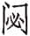
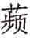
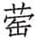
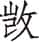

 文公

***【题解】***

文公，鲁国第十九任国君。名兴，僖公之子，声姜所生，前626年即位，在位十八年，前609年死，庶子俀立，是为宣公。

文公三年，秦穆公称霸西戎。文公六年，晋国罢新军，恢复三军之制，赵盾将中军，执政；秦穆公死，用177人殉葬，子车氏三子在内。文公十六年，楚与秦、巴一起灭庸，平定了西南蛮夷。文公十八年，鲁襄仲杀嫡立庶，此后鲁国公族衰微，三桓（仲孙、叔孙、季孙，均桓公之族）逐渐强大。综观鲁文公在位十八年期间，晋国的霸业仍在继续，但诸侯间没有太大的争斗，而在各诸侯国内，如鲁国、宋国，已经发生了一些势力的变化。

# 元年

***【经】***

1.1 元年春王正月①，公即位。

1.2 二月癸亥②，日有食之。

1.3 天王使叔服来会葬③。

1.4 夏四月丁巳④，葬我君僖公。

1.5 天王使毛伯来锡公命⑤。

1.6 晋侯伐卫。

1.7 叔孙得臣如京师⑥。

1.8 卫人伐晋。

1.9 秋，公孙敖会晋侯于戚⑦。

1.10 冬十月丁未⑧，楚世子商臣弑其君⑨。

1.11 公孙敖如齐⑩。

***【注释】***

①元年：鲁文公元年当周襄王二十七年，前626。

②癸亥：此日实为三月初一。

③叔服：周内史。

④丁巳：二十六日。

⑤毛伯：周大夫，据《传》文，名卫。锡公命：天子赐予诸侯爵服等赏命，是赏赐诸侯的一种荣宠。锡，通“赐”。

⑥叔孙得臣：鲁桓公子僖叔牙之孙。

⑦公孙敖：鲁国庆父之子。戚：卫地，在今河南濮阳北。

⑧丁未：十八日。

⑨商臣：楚穆王。（yūn）：熊，楚成王。

⑩如齐：鲁文公新即位，派公孙敖到齐国聘问。

***【译文】***

鲁文公元年春周历正月，文公即位。

二月癸亥日，有日食。

周天子派叔服来参加鲁僖公的葬礼。

夏四月二十六日，葬我国君僖公。

周天子派毛伯来鲁国赐予文公策命荣宠。

晋襄公攻打卫国。

叔孙得臣到京师。

卫国人攻打晋国。

秋，公孙敖在戚地会见晋襄公。

冬十月十八日，楚国太子商臣杀了楚成王熊。

公孙敖到齐国去。

***【传】***

1.1 元年春，王使内史叔服来会葬①。公孙敖闻其能相人也②，见其二子焉③。叔服曰：“穀也食子④，难也收子⑤。穀也丰下⑥，必有后于鲁国⑦。”

***【注释】***

①内史：官名，掌管著作简册等事宜。

②相人：给人相面。

③见（xiàn）其二子：让二子与叔服相见。

④穀也食子：穀，公孙敖之子名。即文伯。食子，使子食，指能祭祀供养你。

⑤难也收子：难，公孙敖之子名。即惠叔。收子，安葬你。

⑥丰下：下颌丰满。

⑦有后于鲁国：指后嗣将在鲁国昌盛。

***【译文】***

鲁文公元年春，周王派内史叔服来鲁国参加葬礼。公孙敖听说他能相面，就让他的两个儿子与叔服相见。叔服说：“穀啊，可以供养祭祀你；难呢，可以安葬你。穀下颌丰满，其后代在鲁国必定昌盛。”

1.2 于是闰三月，非礼也①。先王之正时也②，履端于始③，举正于中④，归余于终⑤。履端于始，序则不愆⑥。举正于中，民则不惑⑦。归余于终，事则不悖⑧。

***【注释】***

①闰三月，非礼：《左传》作者认为置闰应在年终，此年在三月置闰，不合礼制。

②正时：安排时令。

③履端于始：年历的推算以冬至作为开始。始，冬至。

④举正于中：以春分、秋分、夏至、冬至的月份作为四时的中月。

⑤归余于终：把剩余的日子归总在年终，即年终置闰月。

⑥序则不愆（ｑiān）：四时的次序就不会错乱。愆，错乱。

⑦不惑：不会迷惑。

⑧不悖：没有谬误。

***【译文】***

在这时闰三月，不符合礼制。先王安排时令时，年历以冬至作为开始，把春分、秋分、夏至、冬至的月份作为四时的中月，剩余的日子归到年终。以冬至作为开始，四时的次序就不会错乱，以分、至作为四时的中月，百姓就不会糊涂。把剩余的日子归到年终，做事情就不会有误差。

1.3 夏四月丁巳，葬僖公。

***【译文】***

夏四月二十六日，安葬鲁僖公。

1.4 王使毛伯卫来锡公命。叔孙得臣如周拜。

***【译文】***

周王派毛伯卫来赐予周王的策命。叔孙得臣到周拜谢赐命。

1.5 晋文公之季年①，诸侯朝晋。卫成公不朝，使孔达侵郑②，伐绵、訾及匡③。晋襄公既祥④，使告于诸侯而伐卫，及南阳⑤。先且居曰：“效尤⑥，祸也。请君朝王，臣从师⑦。”晋侯朝王于温，先且居、胥臣伐卫。五月辛酉朔⑧，晋师围戚。六月戊戌⑨，取之，获孙昭子⑩。

***【注释】***

①季年：晚年。

②孔达：卫大夫。

③绵、訾、匡：三地本卫地，后属郑，此时卫又夺回了它。绵，今地不详。当与匡邑相近。訾，疑即訾娄。匡，在今河南长垣西南。

④既祥：古代丧礼，合葬之后十三个月举行的祭礼叫小祥，二十五个月之祭叫大祥。既祥，举行小祥祭祀之后。

⑤南阳：在今河南新乡。

⑥效尤：效法错误。尤，错误。指像卫成公那样不朝。

⑦从师：率师伐卫。

⑧辛酉朔：初一。

⑨戊戌：初八。

⑩孙昭子：卫大夫。

***【译文】***

晋文公的晚年，诸侯朝见晋国。独卫成公不去朝见，反而派了孔达入侵郑国，攻打绵、訾和匡三地。晋襄公在结束小祥祭礼之后，派使者昭告诸侯然后攻打卫国，到达南阳。先且居说：“效法错误，这是取祸之道。请国君去朝见周王，由下臣率师伐卫。”晋襄公就到温地去朝见周王。先且居、胥臣攻打卫国。五月初一，晋军包围戚地。六月初八，打下戚地，俘获卫大夫孙昭子。

卫人使告于陈。陈共公曰：“更伐之，我辞之①。 ”卫孔达帅师伐晋。君子以为古②。古者，越国而谋③。

***【注释】***

①更伐之，我辞之：陈共公劝卫国转过去攻晋，然后由他向晋请和。

②古：通“沽”，简略，此指粗心忽略。

③越国而谋：让别国给自己出主意。

***【译文】***

卫国派人向陈国报告。陈共公说：“你转过去进攻晋国，然后我向晋国请和。”卫孔达于是率军攻打晋国。君子认为这是“古”。“古”的意思，指的是粗心忽略，让别国给自己出主意。

1.6 秋，晋侯疆戚田①，故公孙敖会之②。

***【注释】***

①疆戚田：划定戚地田地的疆界。

②公孙敖会之：戚地接近鲁国，所以公孙敖去会见晋襄公，为鲁文公表示敬意。

***【译文】***

秋，晋襄公划定戚地田地的疆界，所以公孙敖去会见他。

1.7 初，楚子将以商臣为大子①，访诸令尹子上。子上曰：“君之齿未也②，而又多爱③，黜乃乱也④。楚国之举⑤，恒在少者⑥。且是人也⑦，蜂目而豺声，忍人也⑧，不可立也。”弗听。既⑨，又欲立王子职而黜大子商臣⑩。商臣闻之而未察⑪，告其师潘崇曰：“若之何而察之？”潘崇曰：“享江芈而勿敬也⑫。”从之。江芈怒曰：“呼，役夫⑬！宜君王之欲杀女而立职也⑭。”告潘崇曰：“信矣。”潘崇曰：“能事诸乎⑮？”曰：“不能。”“能行乎⑯？”曰：“不能。”“能行大事乎⑰？”曰：“能。”

***【注释】***

①楚子：楚成王。

②齿未：还年轻。

③多爱：多内宠。

④黜：指立了商臣又废黜他。

⑤举：立国君。

⑥恒在少者：指以立少子为常。

⑦是人：此人，指商臣。

⑧忍人：残忍之人。

⑨既：立商臣为太子之后。

⑩王子职：楚成王的庶子，商君的异母弟。

⑪闻之未察：只听说但未核实。

⑫江芈（mǐ）：楚成王之妹。芈为姓，因其嫁与江国，故称“江芈”。

⑬役夫：贱骨头。骂人的俗语。

⑭杀女：废汝。

⑮事诸：侍奉王子职。

⑯行：逃亡。

⑰大事：此指弑君夺位。

***【译文】***

起初，楚成王准备立商臣为太子，他去咨询令尹子上。子上说：“君王的年纪还不大，又有众多的爱妃，要是立了之后又废黜太子，就会招致内乱。楚国立太子，常立年少的。况且商臣这个人，眼睛像胡蜂，声音如豺狼，是残忍之人，不能立他为太子。”成王不听。不久，成王又想立王子职而废黜太子商臣。商臣听到了这一消息，但尚未核实清楚，他告诉老师潘崇，并问道：“用什么办法加以核实？”潘崇说：“宴请江芈却对她无礼。”商臣按他的话去做。江芈愤怒地骂道：“呸，贱骨头！难怪君王要杀你立王子职。”商臣把这话告诉潘崇，说：“果有此事。”潘崇问：“你能事奉王子职吗？”商臣答道：“不能。”“你能逃亡出国吗？”答道：“不能。”“能干大事吗？”答道：“能。”

冬十月，以宫甲围成王①。王请食熊蹯而死②，弗听。丁未③，王缢。谥之曰“灵”，不瞑；曰“成”，乃瞑④。

***【注释】***

①宫甲：太子宫中的卫队。

②王请食熊蹯而死：熊掌难熟，成王想借此拖延时间，等待外援。熊蹯，熊掌。

③丁未：十八日。

④谥之曰“灵”，不瞑：“灵”为恶谥，意为“乱而不损”，故“不瞑”，即不闭眼。

⑤曰“成”，乃瞑：“成”为美谥，意为“安民立政”，故“乃瞑”，即闭上眼。

***【译文】***

冬十月，商臣带领着宫中甲士包围了成王。成王请求吃了熊掌再死，商臣不答应。十八日，成王自缢而死。给他的谥号为“灵”，尸体的眼睛不闭上；换成谥号“成”，才闭上眼睛。

穆王立①，以其为大子之室与潘崇②，使为大师，且掌环列之尹③。

***【注释】***

①穆王立：商臣即位在明年，此提前叙述。

②大子之室：做太子时的宫室及宫室内的财物、男女奴仆。

③环列之尹：掌管宫中警卫军的长官。环列，指环列于王宫的兵卒。

***【译文】***

商臣即位，是为穆王，他将做太子时的宫室、财物、奴仆赠与潘崇，任命他为太师，并担任王宫禁卫军的长官。

1.8 穆伯如齐①，始聘焉，礼也。凡君即位，卿出并聘②，践修旧好③，要结外援，好事邻国④，以卫社稷，忠、信、卑让之道也⑤。忠，德之正也；信，德之固也；卑让，德之基也。

***【注释】***

①穆伯：公孙敖。

②并聘：遍聘诸侯。古代礼节，新君即位，应与各国聘问通好。

③践（zuǎn）：通“缵”，继续。

④好事邻国：善待邻国。

⑤卑让：谦让。

***【译文】***

穆伯到齐国去，开始聘问诸侯，这是合乎礼制的。凡是新君即位，派卿出去聘问各国诸侯，继续巩固过去的友好关系，团结外援，善待邻国，以保卫国家，这是忠、信、谦让之道。忠，显示德行的纯正；信，表示德行的巩固；谦让，更是德行的基础。

1.9 崤之役，晋人既归秦帅①，秦大夫及左右皆言于秦伯曰②：“是败也，孟明之罪也，必杀之。”秦伯曰：“是孤之罪也。周芮良夫之诗曰③：‘大风有隧，贪人败类。听言则对，诵言如醉。匪用其良，覆俾我悖④。’是贪故也，孤之谓矣。孤实贪以祸夫子⑤，夫子何罪？”复使为政⑥。

***【注释】***

①秦帅：指孟明、西乞、白乙三帅。

②秦伯：秦穆公。

③芮良夫：周厉王时卿士。

④“大风有隧”六句：引诗见于《诗经·大雅·桑柔》，是芮良夫为讽刺周厉王而作。有隧，形容风之迅疾。贪人，贪婪之人。类，善。诵言，劝谏之言。覆，反而。俾，使。悖，违背道义。

⑤夫子：指孟明。

⑥复使为政：此段当与明年《传》“二年春，秦孟明视帅师伐晋以报崤之役”连读。其实秦伯僖公三十三年已复孟明之位，非此年事。

***【译文】***

崤之战，晋国人放回了秦国主帅，秦大夫以及秦穆公左右的人都对秦穆公说：“这次战役的失败，是孟明的罪过，一定要杀了他。”秦穆公说：“这是我的罪过。周朝的芮良夫的诗说：‘大风迅猛把一切摧毁，贪婪的人把善良屏退。听到不相干的话就答对，听到劝阻之言就昏昏如醉。不能任用有才能的人，反而使我违背了道义。’这是由于我的贪婪，说的就是我。实因为我的贪婪害了孟明，孟明有何罪过？”重新任用孟明执政。

# 二年

***【经】***

2.1 二年春王二月甲子①，晋侯及秦师战于彭衙②，秦师败绩。

2.2 丁丑，作僖公主③。

2.3 三月乙巳④，及晋处父盟⑤。

2.4 夏六月，公孙敖会宋公、陈侯、郑伯、晋士縠盟于垂陇⑥。

2.5 自十有二月不雨，至于秋七月。

2.6 八月丁卯⑦，大事于大庙⑧，跻僖公⑨。

2.7 冬，晋人、宋人、陈人、郑人伐秦。

2.8 公子遂如齐纳币⑩。

***【注释】***

①二年：鲁文公二年当周襄王二十八年，前625。甲子：初七。

②彭衙：秦地，在今陕西白水东北。

③丁丑：二十日。主：死者牌位。

④乙巳：十九日。

⑤及晋处父盟：晋人派阳处父与鲁文公结盟。处父，阳处父。

⑥垂陇：郑地，在今河南荥阳东北。

⑦丁卯：十三日。

⑧大事：在太庙举行吉禘。即将其神主送入太庙，合诸祖的神主举行的大祭。大庙：周公之庙。

⑨跻僖公：把僖公的神主升到闵公之上。跻，升。

⑩如齐纳币：鲁文公准备娶齐女，公子遂为之送聘礼。

***【译文】***

鲁文公二年春周历二月初七，晋襄公和秦军在彭衙交战，秦军被打败。

二十日，制作僖公的神主。

三月十九日，和晋国的阳处父结盟。

夏六月，公孙敖在垂陇和宋成公、陈共公、郑穆公、晋国的士縠盟会。

自从十二月不下雨，一直到秋七月。

八月十三日，在太庙举行吉禘祭祀，把僖公的神主升到闵公之上。

冬，晋人、宋人、陈人、郑人攻打秦国。

公子遂到齐国送聘礼。

***【传】***

2.1 二年春，秦孟明视帅师伐晋，以报崤之役①。二月，晋侯御之。先且居将中军，赵衰佐之。王官无地御戎②，狐鞫居为右③。甲子④，及秦师战于彭衙，秦师败绩。晋人谓秦“拜赐之师”⑤。

***【注释】***

①以报崤之役：僖公三十三年，孟明视曾说“三年将拜君赐”。

②王官无地：晋大夫。王官为地名，可能此人以采邑为氏。

③狐鞫（jú）居：晋大夫，即下文的续简伯。

④甲子：初七。

⑤晋人谓秦“拜赐之师”：此句是晋人讥笑孟明“三年将拜君赐”的话。

***【译文】***

鲁文公二年春，秦孟明视率军攻打晋国，以报复崤之战。二月，晋襄公亲率军抵抗秦军。先且居率中军，赵衰辅佐他。王官无地为他驾驭战车，狐鞫居为车右。初七，和秦军在彭衙交战，秦军大败。晋人讥笑说秦人是“来拜谢恩赐的军队”。

战于崤也①，晋梁弘御戎，莱驹为右。战之明日，晋襄公缚秦囚，使莱驹以戈斩之。囚呼，莱驹失戈②，狼瞫取戈以斩囚③，禽之以从公乘④，遂以为右。箕之役⑤，先轸黜之，而立续简伯。狼瞫怒。其友曰：“盍死之⑥？”瞫曰：“吾未获死所⑦。”其友曰：“吾与女为难⑧。”瞫曰：“《周志》有之⑨：‘勇则害上，不登于明堂⑩。’死而不义⑪，非勇也。共用之谓勇⑫。吾以勇求右，无勇而黜，亦其所也⑬。谓上不我知⑭，黜而宜，乃知我矣。子姑待之。”及彭衙，既陈，以其属驰秦师⑮，死焉。晋师从之，大败秦师⑯。君子谓：“狼瞫于是乎君子。《诗》曰：‘君子如怒，乱庶遄沮⑰。’又曰：‘王赫斯怒，爰整其旅⑱。’怒不作乱，而以从师，可谓君子矣。”

***【注释】***

①战于崤也：此处追述崤之战时的事情。

②失戈：因俘虏大叫，莱驹受惊，戈掉地上。

③狼瞫（shěn）：晋大夫。

④禽：同“擒”。之：指莱驹。

⑤箕之役：在僖公三十三年。

⑥盍：何不。

⑦死所：死的地方。意为还没有死的机会。

⑧与：为。为难（nàn）：发难。指先杀掉先轸。

⑨《周志》：即《周书》。

⑩勇则害上，不登于明堂：引言今见《逸周书·大匡篇》，作“勇如害上，则不登于明堂”。登明堂，国君享祀先祖，以功臣配食。

⑪死而不义：杀先轸，自己也必死，这是不义之死。

⑫共用：为国家所用。

⑬亦其所：也是恰当的。

⑭上不我知：即“上不知我”。上，指先轸。

⑮属：部下。

⑯大败秦师：以上补叙彭衙之役晋国取胜的原因。

⑰君子如怒，乱庶遄（chuán）沮：引《诗》见《诗经·小雅·巧言》。遄，迅疾。沮，阻止。

⑱王赫斯怒，爰整其旅：引《诗》见《诗经·大雅·皇矣》。赫斯，赫然，发怒的样子。爰，于是。

***【译文】***

崤之战的时候，晋国梁弘为晋襄公驾驭战车，莱驹为车右。交战的第二天，晋襄公捆绑了秦国的俘虏，让莱驹用戈杀掉俘虏。俘虏突然大声喊叫，莱驹受惊，戈掉在地上。狼瞫拾起戈，斩了俘虏，并抓起莱驹追上晋襄公的战车，晋襄公于是任命他为车右。箕之役的时候，先轸罢黜了狼瞫，让续简伯代为车右。狼瞫发怒了。他的朋友对他说：“何不去死呢？”狼瞫说：“我还没有找到死的地方。”他的朋友说：“我为你发难吧。”狼瞫说：“《周志》里说：‘因勇敢而杀害上面的长官，死后不能进入明堂。’不义而死，不是真勇敢。为国家所用而死，才叫勇敢。我因为勇敢担任车右，没有勇敢而被废黜，也是理所当然的。说上面的人不了解我，如果废黜恰当，那也就是了解我了。你且等着吧。”到了彭衙之战，布好战阵之后，狼瞫率领他的部下冲入秦军，战死在那里。晋军紧跟着冲上去，把秦军打得大败。君子认为：“狼瞫这算得上是君子。《诗》里说：‘君子如果发怒，战乱差不多很快就可以阻止。’又说：‘文王勃然发怒，于是就整顿军队。’狼瞫发怒不作乱，而冲进秦军战死，可算得上是君子了。”

秦伯犹用孟明。孟明增修国政，重施于民①。赵成子言于诸大夫曰②：“秦师又至，将必辟之。惧而增德③，不可当也。《诗》曰：‘毋念尔祖，聿修厥德④。’孟明念之矣⑤，念德不怠⑥，其可敌乎⑦？”

***【注释】***

①重施：给予优厚的好处。

②赵成子：赵衰。

③惧而增德：孟明因失败而畏惧，进一步修明德行。

④毋念尔祖，聿修厥德：引《诗》见《诗经·大雅·文王》。毋念，念。毋、聿，都是语助词。

⑤念之：知道这个道理。

⑥不怠：不松懈。

⑦其：难道。

***【译文】***

秦穆公仍然重用孟明。孟明进一步修明政事，对百姓给予优厚的恩惠。赵衰对晋国的大夫们说：“秦军如果再来，一定要避开它。孟明因失败而警惧，因而增进了德行，不可抵抗了。《诗》里说：‘怀念你的祖先，修明你的德行。’孟明知道这个道理啊。记住这个道理而努力不懈，难道是可以抵御的吗？”

2.2 丁丑，作僖公主，书，不时也①。

***【注释】***

①书，不时也：古礼“卒哭而祔，祔而作主”，则僖公葬后之第十四日当作主。今过葬十月始作主，故僖公三十三年《传》云“缓作主”，此《传》又云“书，不时也”。

***【译文】***

二十日，制作僖公神主。《春秋》记载此事，是因为其不及时。

2.3 晋人以公不朝来讨，公如晋。夏四月己巳①，晋人使阳处父盟公以耻之②。书曰：“及晋处父盟。”以厌之也③。适晋不书，讳之也④。

***【注释】***

①己巳：十三日。

②晋人使阳处父盟公以耻之：阳处父是大夫，晋国有意降低使者级别来羞辱鲁文公。

③厌：憎恶。

④讳之：隐讳。

***【译文】***

晋人因为鲁文公不来朝见而来讨伐，鲁文公于是去了晋国。夏四月十三日，晋国派大夫阳处父与文公结盟以此羞辱他。《春秋》记载说：“和晋处父结盟。”是表示憎恶。文公到晋国去，《春秋》不加以记载，是出于隐讳。

2.4 公未至，六月，穆伯会诸侯及晋司空士縠盟于垂陇①，晋讨卫故也②。书士縠，堪其事也③。

***【注释】***

①士縠：士之子。士原为晋国大司空，士縠承袭父职。

②讨卫故：上年卫派孔达伐晋，因此晋准备报复。

③堪其事：能胜任其事。

***【译文】***

文公还未回到鲁国，六月，穆伯和诸侯以及晋国的司空士縠等在垂陇结盟，这是因为晋国要攻打卫国的缘故。《春秋》记载直称“士縠”，是认为他能胜任此事。

陈侯为卫请成于晋，执孔达以说①。

***【注释】***

①说：解说，解释。

***【译文】***

陈共公为了替卫国向晋国求情讲和，抓住孔达以向晋国解释。

2.5 秋八月丁卯，大事于大庙，跻僖公，逆祀也①。于是夏父弗忌为宗伯②，尊僖公，且明见曰③：“吾见新鬼大④，故鬼小⑤。先大后小，顺也。跻圣贤⑥，明也。明、顺，礼也。”

***【注释】***

①逆祀：不按顺序的祭祀。

②夏父弗忌：鲁大夫。宗伯：古代掌礼之官。

③明见：宣布他所见到的。

④新鬼：新死之鬼，指僖公。

⑤故鬼：死去已久的鬼，指闵公。

⑥圣贤：指僖公。齐召南《考证》云：“鲁人甚重僖公，《鲁颂》之文铺张扬厉，赞不容口，宜乎夏父弗忌之以为圣贤也。”

***【译文】***

秋八月十三日，在太庙举行吉禘的祭祀，把僖公的神主升到闵公之上，这是不按顺序的祭祀。此时夏父弗忌担任宗伯，他尊崇僖公，而且宣布说：“我看到新鬼大，旧鬼小。先大后小，这是顺序。让圣贤升到前面，这是明智。明智、和顺，合乎礼制。”

君子以为失礼：“礼无不顺①。祀，国之大事也，而逆之，可谓礼乎？子虽齐圣②，不先父食久矣③。故禹不先鲧④，汤不先契⑤，文、武不先不窋⑥。宋祖帝乙⑦，郑祖厉王⑧，犹上祖也⑨。是以《鲁颂》曰：‘春秋匪解，享祀不忒。皇皇后帝，皇祖后稷⑩。’君子曰‘礼’，谓其后稷亲而先帝也⑪。《诗》曰：‘问我诸姑，遂及伯姊⑫。’君子曰‘礼’，谓其姊亲而先姑也⑬。”

***【注释】***

①不顺：不合顺序。

②齐（jì）圣：当时习语，聪明圣哲。齐，通“斋”，明智。

③不先父食：不能在父亲之前享受祭品。意即后立之君不能在先立之君前享受祭祀。

④鲧：禹的父亲。

⑤契（xiè）：商汤的先祖。

⑥不窋（zhú）：周始祖后稷的儿子。

⑦帝乙：宋始祖微子的父亲。

⑧厉王：周厉王，郑国始封君桓公的父亲。

⑨上：同“尚”，崇尚。

⑩春秋匪解，享祀不忒。皇皇后帝，皇祖后稷：引诗见《诗经·鲁颂·宫》。春秋，四时。解，同“懈”。忒（tè），差错。皇皇后帝，指天。皇皇，称美的形容词。

⑪后稷亲而先帝：后稷虽然亲近，然而仍先称天帝。

⑫问我诸姑，遂及伯姊：引《诗》见《诗经·国风·邶风·泉水》。姑，父亲的姊妹叫姑。

⑬姊亲而先姑：姊妹虽更亲，但仍先问候我的姑母。

***【译文】***

君子认为这是失礼：“礼是没有不符合顺序的。祭祀，是国家的大事，而不按照顺序，这是合于礼吗？儿子即使聪明圣哲，也不能在父亲之前享受祭品，历来如此。所以禹不能先于鲧，汤不能先于契，文王、武王不能先于不窋。宋以帝乙为祖宗，郑以厉王为祖宗，这是尊崇祖先。所以《鲁颂》说：‘四时祭祀不懈怠，享礼不变没差错。伟大的天啊，伟大的先祖后稷。’君子说这是合于礼，因为后稷虽是亲近而仍然先称天帝。《诗》里说：‘先问候我的姑母，再问及各位姐姐。’君子说这合于礼，因为其姐虽亲然而仍先称姑母。”

仲尼曰：“臧文仲①，其不仁者三，不知者三。下展禽②，废六关③，妾织蒲④，三不仁也。作虚器⑤，纵逆祀⑥，祀爰居⑦，三不知也。”

***【注释】***

①臧文仲：鲁大夫臧孙辰。臧文仲自庄公立于鲁之朝廷，历闵公、僖公以至文公，已为四朝老臣，其言行足以左右当时。

②下展禽：使展禽居下位。展禽，柳下惠。《论语·卫灵公》云：“臧文仲其窃位者与，知柳下惠之贤而不与立也。”

③废：设立。六关：关卡名，用以收税。

④妾织蒲：让妾织蒲席贩卖，这是与民争利。

⑤作虚器：臧文仲曾私藏大蔡之龟（古人把大乌龟叫蔡），并为它盖了一间非常漂亮的屋子，让它住在里面。

⑥纵逆祀：上面夏父弗忌的主张，大概得到臧文仲的允许和纵容。

⑦祀爰居：据传，有一只名叫爰居的海鸟，歇于鲁东门外三日，臧文仲让人祭祀它。《国语·鲁语上》：“海鸟曰爰居，止于鲁东门之外三日，臧文仲使国人祭之。展禽曰：‘今海鸟至，己不知而祀之，以为国典，难以为仁且知矣。’”

***【译文】***

孔子说：“臧文仲，有三件不仁的事情，有三件不明智的事情。使展禽屈居下位，设立六关，让妾织蒲席，这是三项不仁之事。做房屋以藏大龟，纵容不合顺序的祭祀，祭祀海鸟爰居，这是三项不明智的事情。”

2.6 冬，晋先且居、宋公子成、陈辕选、郑公子归生伐秦①，取汪及彭衙而还②，以报彭衙之役。卿不书③，为穆公故④，尊秦也，谓之崇德⑤。

***【注释】***

①公子成：宋庄公之子。辕选：陈国辕涛涂的后裔。公子归生：郑灵公之弟。

②汪：地名，接近彭衙。在今陕西境内。

③卿不书：先且居为晋中军帅，公子成等亦皆各国之卿，而《经》书“晋人、宋人、陈人、郑人”，故云“卿不书”。自践土以来，晋元帅率诸侯之卿伐国，以此役为始。而明年阳处父伐楚，《经》书其名，则此役先且居等亦宜书名。

④穆公：秦穆公。

⑤崇德：尊崇德行。作者认为秦穆公有德行。

***【译文】***

冬，晋先且居、宋公子成、陈辕选、郑公子归生攻打秦国，夺取汪地和彭衙后回国，这是报复彭衙之战。《春秋》不记载卿的名字，是因为秦穆公的缘故，尊重秦国，叫作尊崇德行。

2.7 襄仲如齐纳币，礼也。凡君即位，好舅甥①，修昏姻②，娶元妃以奉粢盛③，孝也。孝，礼之始也。

***【注释】***

①好舅甥：齐、鲁世为婚姻之国，是舅甥关系，襄仲如齐，是巩固舅甥国家的友好关系。

②昏姻：即婚姻。

③元妃：文公是初娶，所以说元妃。奉粢盛：粢，祭祀所用的黍稷等。盛，把粢盛于器皿中，此指祭祀。古人认为娶妻以助祭祀，因此说奉粢盛。

***【译文】***

襄仲到齐国去送聘礼，合乎礼仪。凡国君即位，巩固舅甥国之间的友好关系，商量婚姻之事，娶原配夫人一起主持祭祀，这是孝道。孝道，这是礼的开始。

# 三年

***【经】***

3.1 三年春王正月①，叔孙得臣会晋人、宋人、陈人、卫人、郑人伐沈②。沈溃。

3.2 夏五月③，王子虎卒④。

3.3 秦人伐晋。

3.4 秋，楚人围江⑤。

3.5 雨螽于宋⑥。

3.6 冬，公如晋。十有二月己巳⑦，公及晋侯盟。

3.7 晋阳处父帅师伐楚以救江⑧。

***【注释】***

①三年：鲁文公三年当周襄王二十九年，前624。

②叔孙得臣：即《传》文的庄叔。沈：国名，在今安徽阜阳西北。为周公后裔的封国。

③夏五月：《传》文作夏四月，恐《经》文有误。

④王子虎：周王卿士。《传》文作王叔文公。

⑤江：嬴姓国，在今河南息县。

⑥螽（zhōnɡ）：螽斯，像蚱蜢一样的昆虫。

⑦己巳：二十二日。

⑧晋阳处父帅师伐楚以救江：杨伯峻曰：“《春秋》书帅师者百三十次，而僖公以前仅九次，且皆为内大夫。文公、宣公以后，外大夫亦多书帅师，定公、哀公之间所书尤多，可见诸侯大夫之权日益增重，而史书体例因之有变。”

***【译文】***

鲁文公三年春周历正月，叔孙得臣和晋人、宋人、陈人、卫人、郑人会合攻打沈国。沈国百姓溃散逃亡。

夏五月，王子虎去世。

秦人攻打晋国。

秋，楚人围攻江国。

螽斯虫像雨一样落到宋国。

冬，文公到晋国去。十二月二十二日，文公与晋襄公结盟。

晋国的阳处父率领军队攻打楚国以救援江国。

***【传】***

3.1 三年春，庄叔会诸侯之师伐沈，以其服于楚也①。沈溃。凡民逃其上曰溃②，在上曰逃③。

***【注释】***

①服于楚：归服楚国。

②逃其上：背叛他们的统帅。

③在上：统帅或将领。

***【译文】***

鲁文公三年春，庄叔会合诸侯的军队攻打沈国，因为它亲服于楚国。沈国百姓溃逃。凡是百姓背叛他们的统帅而逃散的叫溃，统帅或将领逃走叫逃。

3.2 卫侯如陈，拜晋成也。

***【译文】***

卫成公到陈国去，拜谢他替卫国向晋国求和。

3.3 夏四月乙亥①，王叔文公卒②，来赴，吊如同盟③，礼也。

***【注释】***

①乙亥：二十四日。

②王叔文公：王子虎。文乃其谥号。

③如同盟：如同同盟诸侯国。王子虎乃周室卿士，非诸侯，故曰“如”。

***【译文】***

夏四月二十四日，王子虎去世，发来讣告，鲁国以同盟国诸侯之礼加以吊唁，这合乎礼制。

3.4 秦伯伐晋，济河焚舟①，取王官及郊②。晋人不出。遂自茅津济③，封崤尸而还④。遂霸西戎⑤，用孟明也。

***【注释】***

①济河焚舟：示必死之决心。后项羽巨鹿之战破釜沉舟亦如此。

②王官：在今山西闻喜西。郊：在王官附近。

③茅津：今山西平陆的茅津渡。对岸不远就是崤山。

④封崤尸：为在崤山战死的将士遗骨埋葬堆土树立标记。《史记·秦本纪》：“（秦穆公）三十六年，……于是缪公乃自茅津渡河，封崤中尸，为发丧，哭之三日。”

⑤遂霸西戎：《史记·秦本纪》：“（秦穆公）三十七年，秦用由余谋，伐戎王，益国十二，开地千里，遂霸西戎。”西戎，对当时活动在今陕、甘一带的各兄弟民族的通称。

***【译文】***

秦穆公攻打晋国，渡过黄河后就把船烧了，攻取了王官和郊地。晋国人不出战。秦军于是从茅津渡河，到崤山把战死的将士遗骨埋葬并堆土树立了标志，然后回国。秦穆公于是称霸了西戎，这都是任用了孟明的缘故。

君子是以知“秦穆公之为君也，举人之周也①，与人之壹也②；孟明之臣也③，其不解也④，能惧思也⑤；子桑之忠也⑥，其知人也，能举善也⑦。《诗》曰：‘于以采蘩？于沼于沚，于以用之？公侯之事⑧。’秦穆有焉。‘夙夜匪解，以事一人’⑨，孟明有焉。‘诒阙孙谋，以燕翼子’⑩，子桑有焉”。

***【注释】***

①举人：选拔人才。周：备，全面衡量。

②与人：任用人才。壹：专一，用人不疑。指孟明数败仍用之。

③臣：作动词，为臣尽心。

④解：通“懈”，懈怠。

⑤惧思：因败而惧，因惧而思修德，指从失败中汲取教训。

⑥子桑：公孙枝。

⑦举善：子桑举荐孟明，所以说能举善。

⑧“于以采蘩”四句：引《诗》见《诗经·国风·召南·采蘩》。隐公三年《传》云：“《风》有《采蘩》、《采》，《雅》有《行苇》、《泂酌》，昭忠信也。”此处引诗谓秦穆公能以忠信待人，故人能为其所用。于以，于何，在何处。蘩，一种野菜。沼，沼泽。沚，小洲。事，祭祀。

⑨夙夜匪解，以事一人：引诗见《诗经·大雅·烝民》。一人，指秦穆公。

⑩诒厥孙谋，以燕翼子：引《诗》见《诗经·大雅·文王有声》。诒，给予，赠送。燕，安。翼，辅佐。

***【译文】***

君子因此知道“秦穆公作为一个国君，选拔人才能全面考量，任用人才能深信不疑；孟明作为一个臣子，能努力不懈怠，能因畏惧而深思；子桑的忠诚，能了解别人，举荐善人。《诗》里说：‘哪里采野菜？在沼泽在沙洲。用它做什么？用在公侯的祭祀上。’秦穆公就是这样的。‘早晚努力不懈，忠心事奉一人。’孟明就是这样啊。‘把他的谋略留给子孙，辅佐并使他们安定。’子桑就是这样”。

3.5 秋，雨螽于宋，队而死也①。

***【注释】***

①队而死：指大批螽斯虫如雨般落下，落地而死。这是怪异现象，《春秋》特加以记载。队，同“坠”。

***【译文】***

秋，螽斯虫如雨般落下，落下地就死了。

3.6 楚师围江，晋先仆伐楚以救江①。冬，晋以江故告于周。王叔桓公、晋阳处父伐楚以救江②。门于方城③，遇息公子朱而还④。

***【注释】***

①先仆：晋大夫。

②王叔桓公：周王卿士，王叔文公之子。

③方城：山名，今河南叶县南有方城山。

④息公：息县尹，名子朱。杜预《注》以为即楚伐江主帅。

***【译文】***

楚国军队围攻江国，晋大夫先仆攻打楚国以救江。冬，晋国把江国的战事报告周王。王叔桓公和晋阳处父攻打楚国以救援江国。攻打方城城门，碰到楚国的息公子朱，于是回师。

3.7 晋人惧其无礼于公也，请改盟①。公如晋，及晋侯盟。晋侯飨公，赋《菁菁者莪》②。庄叔以公降、拜③，曰：“小国受命于大国，敢不慎仪④？君贶之以大礼⑤，何乐如之？抑小国之乐⑥，大国之惠也。”晋侯降、辞⑦。登，成拜⑧。公赋《嘉乐》⑨。

***【注释】***

①晋人惧其无礼于公也，请改盟：去年阳处父与鲁文公结盟，有意羞辱文公，是无礼，因此晋国请求改订盟约。

②《菁菁者莪》：《诗经·小雅》中的一篇。诗中有“既见君子，乐且有仪”之句，晋侯以此诗称赞文公是君子。

③降、拜：降阶下拜。

④慎仪：对礼仪谨慎。

⑤贶（kuànɡ）：赐予。大礼：享礼。

⑥抑：发语词，无义。

⑦降、辞：降阶辞让。

⑧登，成拜：两人皆升阶至堂上，然后完成拜礼。

⑨《嘉乐》：《诗经·大雅》中的一篇。诗中有“显显令德，宜民宜人，受禄于天”之句，文公以此回敬晋侯，称颂晋侯美德。

***【译文】***

晋人担心当初对文公无礼，请求改订盟约。文公就到晋国去，和晋襄公结盟。晋襄公宴请文公，赋《菁菁者莪》这首诗。庄叔让文公降阶下拜，说：“小国在大国接受命令，哪敢对礼仪不谨慎？晋君把这样重大的享礼赐予我们，还有比这更快乐的吗？小国的快乐，是大国的恩赐啊。”晋襄公降阶辞让。两人一起登上台阶，到堂上，完成拜礼。文公赋《嘉乐》这首诗。

# 四年

***【经】***

4.1 四年春①，公至自晋。

4.2 夏，逆妇姜于齐②。

4.3 狄侵齐。

4.4 秋，楚人灭江。

4.5 晋侯伐秦③。

4.6 卫侯使甯俞来聘④。

4.7 冬十有一月壬寅⑤，夫人风氏薨⑥。

***【注释】***

①四年：鲁文公四年当周襄王三十年，前623。

②逆妇姜于齐：鲁国为文公到齐国迎娶姜氏。

③伐秦：为报复王官之役。

④甯俞：甯武子。

⑤壬寅：初一。

⑥夫人风氏：成风，鲁庄公妾，僖公母。

***【译文】***

鲁文公四年春，鲁文公从晋国回鲁国。

夏，鲁国为文公到齐国迎娶姜氏。

狄人入侵齐国。

秋，楚国灭了江国。

晋襄公攻打秦国。

卫成公派甯俞来聘问。

冬十一月初一，夫人成风去世。

***【传】***

4.1 四年春，晋人归孔达于卫①，以为卫之良也②，故免之。

***【注释】***

①归孔达于卫：文公二年，陈侯为卫国向晋求和，抓住孔达交给晋。

②卫之良：卫国的突出人才。

***【译文】***

鲁文公四年春，晋国人把孔达送还给卫国，认为孔达是卫国的人才，所以赦免了他。

4.2 夏，卫侯如晋拜。

***【译文】***

夏，卫成公到晋国去拜谢释放孔达。

4.3 曹伯如晋会正①。

***【注释】***

①会正：当时小国诸侯有向霸主缴纳贡赋的义务，“会正”即商谈纳贡的事情。正，通“政”，贡赋之额。

***【译文】***

曹共公到晋国去商谈纳贡之事。

4.4 逆妇姜于齐，卿不行①，非礼也。君子是以知出姜之不允于鲁也②，曰：“贵聘而贱逆之③，君而卑之④，立而废之⑤，弃信而坏其主⑥，在国必乱，在家必亡⑦。不允宜哉？《诗》曰：‘畏天之威，于时保之⑧。’敬主之谓也。”

***【注释】***

①卿不行：指鲁国不派卿而只派地位较低的大夫去迎接。

②出姜：即姜氏。不允于鲁：不终于鲁。文公十八年出姜之子被杀，自己归于齐。允，借为“遂”，终。

③贵聘：文公二年公子遂到齐国送聘礼，是贵聘。贱逆：现在派一般的大夫去迎娶，是贱逆。

④君：指小君，国君之妻叫小君。卑之：不以国君夫人之礼迎接她，是“卑之”。

⑤立而废之：不以其礼迎接，等于是立为夫人又废弃她。

⑥弃信：指贵聘贱逆。主：内主，夫人是宫内之主，所以称内主。

⑦家：指卿大夫。古代卿大夫有采邑，称为家。

⑧畏天之威，于时保之：引诗见《诗经·周颂·我将》。于时，因此。之，内主。

***【译文】***

到齐国去迎接姜氏，卿大夫不去，不符合礼制。君子因此知道出姜不会终老于鲁国，说：“以尊贵的级别送聘礼而用低贱的级别去迎娶，身份是小君却又轻视她，这等于是立了她又废了她，抛弃了信用且损害了内主的身份，此事如发生在国内，必定引发动乱；在卿大夫家，必定会亡家。不终老于鲁，也是必然的了。《诗》里说：‘敬畏上天的威灵，因此才能保有福禄。’说的是内主也要敬重。”

4.5 秋，晋侯伐秦，围邧、新城①，以报王官之役。

***【注释】***

①邧（yuán）：秦地，在今陕西澄城。新城：在澄城东北。

***【译文】***

秋，晋襄公攻打秦国，围攻邧和新城，为报复王官之役。

4.6 楚人灭江，秦伯为之降服、出次、不举①，过数②。大夫谏，公曰：“同盟灭③，虽不能救，敢不矜乎④！吾自惧也。”君子曰：“《诗》云：‘惟彼二国，其政不获。惟此四国，爰究爰度⑤。’其秦穆之谓矣。”

***【注释】***

①降服：穿上素服。出次：不住在正寝。不举：减膳撤乐。

②过数：哀悼他国被灭，有一定的礼数，秦穆公已超过应有的礼数。

③同盟：秦、江是同盟国。

④矜：哀怜。

⑤惟彼二国，其政不获。惟此四国，爰究爰度：引《诗》见《诗经·大雅·皇矣》。二国，指殷、夏。不获，不得人心。四国，四方之国。爰，于是。究，推寻。度，谋划。

***【译文】***

楚人灭了江国，秦穆公为它穿上素服，离开正寝居住，减膳撤乐，已超过了应有的礼数。秦国大夫劝阻他。秦穆公说：“同盟国被灭了，即使不能救援它，哪敢不哀怜它呢？我要自己警惕啊。”君子说：“《诗》里说：‘想到夏政、殷政，不得人心。想到四方之国，如何谋划安身。’这说的就是秦穆公吧。”

4.7 卫甯武子来聘，公与之宴，为赋《湛露》及《彤弓》①。不辞，又不答赋②。使行人私焉③。对曰：“臣以为肄业及之也④。昔诸侯朝正于王⑤，王宴乐之⑥，于是乎赋《湛露》⑦，则天子当阳⑧，诸侯用命也⑨。诸侯敌王所忾⑩，而献其功⑪，王于是乎赐之彤弓一，彤矢百，玈弓矢千，以觉报宴⑫。今陪臣来继旧好，君辱贶之⑬，其敢干大礼以自取戾⑭？”

***【注释】***

①赋：让乐工演奏。《湛露》、《彤弓》：《诗经·小雅》中的两篇。

②不辞，又不答赋：这是失礼行为。不辞，没有言辞表示。或曰不辞谢。不答赋，不赋诗回答。

③私焉：以私人身份探问甯武子。

④臣以为肄业及之也：此二诗是天子宴享诸侯之诗，文公赋此，不合于礼。甯武子佯为不知，说是乐工为练习而演奏，不是为我所奏。肄业，练习。

⑤朝正于王：正月时去京师向天子朝贺。

⑥王宴乐之：古时设宴必奏乐。

⑦于是乎赋《湛露》：《湛露·序》云：“天子燕诸侯也。”

⑧天子当阳：《湛露》首章有云：“湛湛露斯，匪阳不晞。”当阳，对着太阳而坐，即面向南方。甯武子解此诗，又以阳喻天子，当阳谓天子向明而治。

⑨用命：效劳听命。

⑩敌王所忾：与王同仇敌忾。忾，愤恨。

⑪献其功：献四夷之功。

⑫觉报宴：指计算诸侯之功而报答以相应的宴乐。觉，借为“校”，计算。按，《彤弓·序》云：“天子赐有功诸侯也。”以上盖言赋《彤弓》之礼。

⑬辱：谦敬副词。贶（ｋｕànɡ）：赐宴。

⑭干：犯。大礼：指天子飨诸侯之礼。戾：罪过。

***【译文】***

卫国的甯武子来聘问，文公设宴招待他，并让乐工为他演奏《湛露》与《彤弓》。甯武子不辞谢，也不赋诗回答。文公派人私下去探问原因，他回答说：“下臣以为是乐工在练习。从前诸侯在正月时去京师朝贺天子，天子设宴招待并奏乐，这时就赋《湛露》这首诗，表示天子对着太阳南面而坐，诸侯效劳听命于天子。诸侯和天子同仇敌忾，向天子献上讨伐四方夷狄的俘虏，天子因此赏赐给予红色的弓一张，红色的箭一百支，黑色的弓十张和箭一千支，以计算诸侯的功劳而报以相应的宴乐。现在下臣前来继续过去的友好，承国君赐宴，岂敢犯大礼而自取罪过呢？”

4.8 冬，成风薨。

***【译文】***

冬，成风去世。

# 五年

***【经】***

5.1 五年春王正月①，王使荣叔归含②，且赗③。

5.2 三月辛亥④，葬我小君成风。

5.3 王使召伯来会葬⑤。

5.4 夏，公孙敖如晋。

5.5 秦人入鄀⑥。

5.6 秋，楚人灭六⑦。

5.7 冬十月甲申⑧，许男业卒⑨。

***【注释】***

①五年：鲁文公五年当襄王三十一年，前622。

②归：通“馈”，馈赠。含：把珠玉等物放入死者口中。故放入的珠玉也叫“含”。致送死者的含玉，不必真置于死者口中，盖远道致送，死者入殓已久。

③赗（fènɡ）：送给丧家的送葬之物，如助丧的车马。此作动词，赠送赗物。此为助成风之丧。

④辛亥：十二日。

⑤召（shào）伯：即《传》文的召昭公。召氏世为周王卿士。

⑥鄀（ｒｕò）：秦、楚边界上的小国，受楚国保护，都商密，在今河南淅川西南。

⑦六：国名，皋陶后代，地在今安徽六安。

⑧甲申：十八日。

⑨许男业卒：许僖公死。

***【译文】***

鲁文公五年春周历正月，周王派荣叔来赠送含玉，并且赠送其他陪葬物。

三月十二日，安葬小君成风。

周王派召伯来参加成风的葬礼。

夏，公孙敖到晋国去。

秦人入侵鄀国。

秋，楚人灭了六国。

冬十月十八日，许僖公业去世。

***【传】***

5.1 五年春，王使荣叔来含，且赗，召昭公来会葬，礼也①。

***【注释】***

①礼也：孔《疏》引郑玄《箴膏肓》云，天子于诸侯及夫人之丧：“于诸侯，含之，赗之；小君亦如之。”使卿来会葬，亦是当时之礼，故曰“礼也”。

***【译文】***

鲁文公五年春，周王派荣叔来赠送含玉，还有其他丧葬品，召昭公来参加葬礼，这是合于礼的。

5.2 初，鄀叛楚即秦，又贰于楚①。夏，秦人入鄀②。

***【注释】***

①贰于楚：与秦有二心而亲楚。

②秦人入鄀：秦军进入鄀的国都。按，鄀未亡，迁都到今湖北宜城。

***【译文】***

当初，鄀国背叛楚国亲近秦国，后又亲附楚国。夏，秦人攻入鄀国。

5.3 六人叛楚即东夷①。秋，楚成大心、仲归帅师灭六②。

***【注释】***

①东夷：指东方郯、莒、徐夷诸国。

②成大心：楚大夫。仲归：楚大夫，字子家。

***【译文】***

六国人背叛楚国亲近东夷。秋，楚国成大心、仲归率军队灭了六国。

5.4 冬，楚公子燮灭蓼①。臧文仲闻六与蓼灭，曰：“皋陶、庭坚不祀忽诸②。德之不建③，民之无援，哀哉！”

***【注释】***

①蓼（liǎo）：国名，相传为庭坚后裔，在今河南固始东北。

②皋陶：传说中东夷族的首领，曾被舜任为掌管刑法的官。庭坚：传说为高阳氏颛顼的后代。不祀忽诸：即“忽焉不祀”，一下子就没人祭祀了。

③德之不建：即“不建德”。

***【译文】***

冬，楚国公子燮灭了蓼国。臧文仲听说了六国和蓼国被灭，说：“皋陶、庭坚一下子就没人祭祀了。不建立自己的德行，百姓没有救援，可悲啊。”

5.5 晋阳处父聘于卫，反过甯①，甯嬴从之②，及温而还。其妻问之，嬴曰：“以刚③。《商书》曰：‘沈渐刚克，高明柔克④。’夫子壹之⑤，其不没乎⑥！天为刚德，犹不干时⑦，况在人乎？且华而不实，怨之所聚也，犯而聚怨⑧，不可以定身⑨。余惧不获其利而离其难⑩，是以去之。”

***【注释】***

①反：返回。甯：晋地名，在今河南获嘉西北。

②甯嬴：人名，掌管宾馆的大夫。

③以刚：太刚强。以，甚。

④沈渐刚克，高明柔克：《商书》二句见《尚书·洪范》。沈渐，指性格迟缓软弱。高明，指性格爽朗。柔，柔弱。

⑤壹之：只有一点，指阳处父本性爽朗，又太刚。

⑥不没：不得善终。

⑦天为刚德，犹不干时：意为天乃纯阳，属于刚强之德，尚且有不违犯四时运行次序的柔德。

⑧犯：触犯别人。

⑨定身：安定自身。

⑩离其难：指同阳处父一起受难。明年，阳处父被杀。离，同“罹”，遭受。

***【译文】***

晋阳处父到卫国聘问，返回时经过甯邑，甯嬴跟随着他，但甯嬴到温地又回来了。他的妻子问他，甯嬴回答说：“阳处父太刚强。《商书》说：‘深沉的人用刚强来克服，爽朗的人用柔弱来克服。’阳处父只有一面的性格，恐怕不得善终！上天是刚强之德，尚且不违背时令，更何况人呢？而且阳处父华而不实，怨恨就会聚集到身上。触犯别人又聚集怨恨，不可以安身自保。我怕没有得到他的好处反而和他一起遭受祸害，所以离开了他。”

晋赵成子、栾贞子、霍伯、臼季皆卒⑪。

***【注释】***

①赵成子：赵衰。栾贞子：栾枝。霍伯：先且居，先轸的儿子。臼季：胥臣。此句应与下年《传》“六年春”一节连读。

***【译文】***

晋国的赵衰、栾枝、先且居、胥臣都去世了。

# 六年

***【经】***

6.1 六年春①，葬许僖公。

6.2 夏，季孙行父如陈②。

6.3 秋，季孙行父如晋。

6.4 八月乙亥③，晋侯卒④。

6.5 冬十月，公子遂如晋⑤。

6.6 葬晋襄公。

6.7 晋杀其大夫阳处父。

6.8 晋狐射姑出奔狄⑥。

6.9 闰月不告月⑦，犹朝于庙⑧。

***【注释】***

①六年：鲁文公六年当周襄王三十二年，前621。

②季孙行父：季文子。季友之孙。

③乙亥：十四日。

④晋侯：晋襄公。

⑤公子遂如晋：公子遂到晋国参加晋襄公葬礼。

⑥狐射（yè）姑：狐偃之子。食邑于贾，字季，故一曰贾季。

⑦告月：告朔，诸侯在每月初一以一只羊告祭于太庙。

⑧朝于庙：告朔之后应视朔，然后祭于诸庙，即朝于庙，朝祭宗庙。

***【译文】***

鲁文公六年春，安葬许僖公。

夏，季孙行父到陈国去。

秋，季孙行父到晋国去。

八月十四日，晋襄公去世。

冬十月，公子遂到晋国去。

安葬晋襄公。

晋国杀了他们的大夫阳处父。

晋国的狐射姑逃亡狄国。

闰月不举行告朔的祭礼，但还朝祭宗庙。

***【传】***

6.1 六年春，晋蒐于夷①，舍二军②。使狐射姑将中军，赵盾佐之③。阳处父至自温④，改蒐于董⑤，易中军。阳子，成季之属也⑥，故党于赵氏⑦，且谓赵盾能，曰：“使能，国之利也。”是以上之⑧。宣子于是乎始为国政⑨。制事典⑩，正法罪⑪，辟刑狱⑫，董逋逃⑬，由质要⑭，治旧洿⑮，本秩礼⑯，续常职⑰，出滞淹⑱。既成，以授大傅阳子与大师贾佗⑲，使行诸晋国，以为常法。

***【注释】***

①蒐：检阅、检查。夷：采邑名，未知今地何处。

②舍二军：僖公三十一年，晋蒐于清原，作五军以御狄。今则废新上军、新下军，恢复晋文公四年三军之旧制。舍，撤销。

③赵盾：赵宣子，赵衰之子。

④至自温：温为阳处父采邑。上年阳处父聘卫，回国时在温停留。

⑤董：地名，在今山西万荣。

⑥阳子，成季之属：洪亮吉《春秋左传诂》曰：“处父盖尝为赵衰属大夫。《说苑》，师旷对晋平公曰：‘阳处父欲臣文公，因咎犯，三年不达；因赵衰，三日而达。’是处父由赵衰方得进用。”成季，赵衰，成是谥号，季是字。

⑦党：偏私。

⑧上之：使赵盾居上位，做中军将。

⑨为国政：为执政。晋国以中军将为执政。

⑩制事典：制定章程。

⑪正法罪：修订刑罚律令。

⑫辟刑狱：清理诉讼积案。

⑬董：督查。逋逃：追捕逃亡之人。

⑭由质要：使用契约。由，用。

⑮治旧洿（wū）：清除政事上的污垢。

⑯本秩礼：恢复被破坏的等级制度。

⑰续常职：重建被废弃的官职。

⑱出滞淹：选用屈居下位的贤人。

⑲大傅：太傅，位卿。晋太傅主管礼刑之事。大师：太师，也是三公之一。贾佗：晋公族，文公旧臣，尝从重耳出亡，年幼于狐偃、赵衰。

***【译文】***

六年春，晋国在夷地检阅军队，撤销二军。让狐射姑率领中军，赵盾辅佐他。阳处父从温地回来，把阅兵改在董地，并撤换中军主将。阳处父曾是赵衰的下属，所以对赵氏有偏私，而且认为赵盾有才干，说：“任用有才干的人，这是国家的利益。”所以让赵盾居上位。赵盾从此开始执掌晋国的政权。他制定国家章程，修订刑罚律令，清理诉讼积案，督查和追捕逃犯，办事使用契约，清除政治上的污垢，恢复被破坏的等级制度，重建被废弃的官职，选用屈居下位的贤人。政令法规制定之后，就交给太傅阳处父和太师贾佗，由他们在晋国内施行，成为国家的常用法规。

6.2 臧文仲以陈、卫之睦也，欲求好于陈。夏，季文子聘于陈，且娶焉。

***【译文】***

臧文仲因为陈国和卫国和睦友好，也想和陈国结好。夏，季文子到陈国聘问，并乘此机会娶陈国女子为妻。

6.3 秦伯任好卒①。以子车氏之三子奄息、仲行、虎为殉②。皆秦之良也。国人哀之，为之赋《黄鸟》③。

***【注释】***

①任好：秦穆公之名。

②奄息、仲行、（qián）虎：三人皆为勇士。据《史记·秦本纪》，秦穆公死时以一百七十七人殉葬，子车氏三子也在其中。

③《黄鸟》：诗见《诗经·国风·秦风》。其《序》曰：“《黄鸟》，哀三良也。国人刺穆公以人从死而作是诗也。”

***【译文】***

秦穆公任好去世，用子车氏的三个儿子奄息、仲行、虎殉葬，他们都是秦国的善人。国人哀伤，为此作《黄鸟》诗以示哀悼。

君子曰：“秦穆之不为盟主也宜哉。死而弃民。先王违世①，犹诒之法②，而况夺之善人乎③？”《诗》曰：‘人之云亡，邦国殄瘁④。’无善人之谓。若之何夺之？古之王者知命之不长，是以并建圣哲⑤，树之风声⑥，分之采物⑦，著之话言⑧，为之律度⑨，陈之艺极⑩，引之表仪⑪，予之法制，告之训典⑫，教之防利⑬，委之常秩⑭，道之礼则⑮，使毋失其土宜⑯，众隶赖之⑰，而后即命⑱。圣王同之。今纵无法以遗后嗣，而又收其良以死，难以在上矣⑲。”君子是以知秦之不复东征也⑳。

***【注释】***

①违世：离世，去世。

②诒（yí）：遗，留下。

③夺之善人：夺去百姓中善人的生命。

④人之云亡，邦国殄瘁：引诗见《诗经·大雅·瞻卬》。殄瘁，同义词连用，困苦。

⑤并：遍，普遍。圣哲：贤能。

⑥风声：教化风气。

⑦采物：即物采，指旗帜服饰等物品。

⑧话言：指有益的话语。

⑨律度：法度。

⑩艺极：准则。

⑪表仪：表率。

⑫训典：指先王遗训。

⑬防利：防止谋求私利。

⑭委：委任。常秩：常设的官职。

⑮道：教导。礼则：礼仪。

⑯土宜：因地制宜。

⑰众隶：指众人。赖：信赖。

⑱即命：就命，死去。

⑲在上：指做国君。

⑳不复东征：不能再向东征伐。秦国此后相当一个时期内没有再强盛，不能东进一步。

***【译文】***

君子说：“秦穆公没有当上盟主也是理所当然的了。死了还抛弃百姓！先王去世，还留下了法则，怎么能夺走好人的命呢？《诗》里说：‘贤人死亡，国家就要衰弱了。’说的就是没有好人。只怕没有好人，怎么还去夺走他们的生命呢？古代身居王位的人知道寿命不会长久，所以到处选贤任能，树立好的教化风气，分给大家旗帜服饰等各种物品，把有益的话语著于典册留给后人，并为他们制定法度，把各种准则颁布出去，树立表率以引导他们，教他们使用法规，告诉他们先王的遗训，教导他们如何防止谋求私利，委任他们一定的官职，教导他们各种礼仪，让他们不要失去因地制宜的规律，众人都能信赖他们，然后才离世死去。圣人和先王都是这样做的。现在不仅没有法则留给后人，还用那些善人来殉葬，就难以成为一个国君了。”君子因此知道秦国不可能再向东征伐了。

6.4 秋，季文子将聘于晋，使求遭丧之礼以行①。其人曰②：“将焉用之？”文子曰：“备豫不虞③，古之善教也。求而无之，实难④。过求⑤，何害？”

***【注释】***

①遭丧之礼：碰到丧事应备的礼仪物品。

②其人：指随行人员。

③备、豫：同义词，防备。不虞：意外。

④实难：将处于困境。

⑤过求：有准备而一时用不着。

***【译文】***

秋，季文子准备到晋国去聘问，派人准备一些丧事需用的礼仪物品然后才动身。他的随行人员问：“准备这些做什么用？”文子说：“防备意外，这是古人的好教训。临时需要却没有，那将处于尴尬的境地。有准备虽一时用不上，有什么害处？”

6.5 八月乙亥，晋襄公卒。灵公少①，晋人以难故，欲立长君②。赵孟曰③：“立公子雍④。好善而长，先君爱之⑤，且近于秦⑥。秦，旧好也。置善则固⑦，事长则顺，立爱则孝⑧，结旧则安⑨。为难故，故欲立长君。有此四德者⑩，难必抒矣⑪。”贾季曰⑫：“不如立公子乐⑬。辰嬴嬖于二君⑭，立其子，民必安之。”赵孟曰：“辰嬴贱，班在九人⑮，其子何震之有⑯？且为二君嬖，淫也。为先君子，不能求大，而出在小国⑰，辟也⑱。母淫子辟，无威；陈小而远，无援。将何安焉？杜祁以君故⑲，让偪姞而上之⑳；以狄故，让季隗而己次之(21)，故班在四(22)。先君是以爱其子，而仕诸秦，为亚卿焉(23)。秦大而近，足以为援，母义子爱，足以威民。立之，不亦可乎？”使先蔑、士会如秦，逆公子雍。贾季亦使召公子乐于陈。赵孟使杀诸郫(24)。

***【注释】***

①灵公少：晋灵公此时还在襁褓之中。

②立长君：立年长的为国君。如此则要废太子。

③赵孟：赵盾。自赵盾以后，赵氏世称孟。

④公子雍：晋文公儿子，襄公庶弟。

⑤先君：指晋文公。

⑥近于秦：公子雍当时仕于秦。

⑦置善：前说公子雍是“好善而长”，因此立他为君便是置善，也是事长。固：国家巩固。

⑧立爱则孝：先君爱之，所以立他符合孝道。

⑨结旧：结交旧好，指秦。

⑩四德：指固、顺、孝、安。

⑪抒：缓解。

⑫贾季：狐射姑，狐偃之子。

⑬公子乐：公子雍庶弟，怀嬴儿子。

⑭辰嬴：即怀嬴，先嫁怀公，又嫁文公，死后谥“辰”。嬖：宠爱。二君：指怀公、文公。

⑮班在九人：文公妃妾中，怀嬴位在第九。班，位次。

⑯震：威，威望。

⑰出在小国：指公子乐出居在陈国。

⑱辟：鄙陋。

⑲杜祁：公子雍的母亲。杜，祁姓国，在今陕西西安。

⑳让偪姞而上之：襄公立为太子后，杜祁让位给偪姞，使她在上位。偪姞，襄公的母亲。偪，姞姓国，今地不详。

(21)以狄故，让季隗而己次之：狄人是晋国强邻，杜祁让季隗居于己上，是为了结好狄人。季隗，晋文公重耳流亡狄时所娶的夫人。

(22)班在四：杜祁本位居第二，让位后才居于第四。

(23)亚卿：位仅次于卿。

(24)郫（pí）：又叫郫邵，晋地，在今河南济源西。

***【译文】***

八月十四日，晋襄公去世。晋灵公还小，晋国人因为国难的缘故，准备立年长的为国君。赵孟说：“立公子雍。他生性善良而且年长，先君喜欢他，而且与秦国亲近。秦国，是我们的老朋友。立善良之人国家就巩固，事奉年长的为君名正言顺，立先君所喜欢的人符合孝道，结交老朋友就能安定。国家有难，所以要立年长者为君。有这四项德行，国难就可以缓解了。”贾季说：“不如立公子乐。辰嬴受到二位国君的宠爱，立她的儿子，百姓必能安定。”赵孟说：“辰嬴低贱，文公妃妾中位次第九。她的儿子有何威望？而且她受两位国君宠爱，那是淫荡。作为先君的儿子，不能求得大国保护而出居在小国，这是鄙陋。母亲淫荡，儿子鄙陋，没有威望；陈国小而且鄙远，有事无法救援，将如何安定呢？杜祁由于国君的缘故，让偪姞居于上位；因为狄人的缘故，让季隗居于自己之上，所以位次在第四。先君因此喜欢她的儿子，让他在秦国做官，位居亚卿。秦国大而且近，有事可以救援；母亲有义儿子有爱，足以君临百姓。立他，不是可以吗？”赵盾派先蔑、士会到秦国去迎接公子雍。贾季也派人到陈国去召回公子乐。赵孟派人在郫地把他们杀了。

6.6 贾季怨阳子之易其班也①，而知其无援于晋也。九月，贾季使续鞫居杀阳处父②。书曰：“晋杀其大夫。”侵官也③。

***【注释】***

①易其班：指贾季本为中军帅，后被阳处父贬为中军佐一事。

②续鞫居：即狐鞫居。

③侵官：侵夺了官职。贾季已任命为中军帅，阳处父又改换了他，是侵官。

***【译文】***

贾季怨恨阳处父贬了他的官职，又知道他在晋国孤立无援。九月，贾季派续鞫居杀了阳处父。《春秋》记载说：“晋国杀其大夫。”是因为剥夺官职的缘故。

6.7 冬十月，襄仲如晋葬襄公。

***【译文】***

冬十月，襄仲到晋国去参加晋襄公的葬礼。

6.8 十一月丙寅①，晋杀续简伯②。贾季奔狄。宣子使臾骈送其帑③。夷之蒐，贾季戮臾骈④，臾骈之人欲尽杀贾氏以报焉⑤。臾骈曰：“不可。吾闻《前志》有之曰：‘敌惠敌怨⑥，不在后嗣，忠之道也。’夫子礼于贾季⑦，我以其宠报私怨⑧，无乃不可乎？介人之宠⑨，非勇也。损怨益仇⑩，非知也。以私害公，非忠也。释此三者⑪，何以事夫子？”尽具其帑，与其器用财贿⑫，亲帅扞之⑬，送致诸竟⑭。

***【注释】***

①丙寅：十一月无丙寅日，恐记日有误。

②续简伯：即续鞫居。

③宣子：赵盾。臾骈：赵盾家臣。帑：通“孥”，妻子儿女。

④戮：侮辱。

⑤臾骈之人：臾骈的随从。

⑥敌惠敌怨：有惠于人，有怨于人。敌，对。

⑦夫子：指赵盾。

⑧以其宠：因受到赵盾的宠信。

⑨介：因，依赖。

⑩损怨益仇：减少自己的怨气，增加他人对我的仇恨。

⑪释：舍弃。三者：指勇、智、忠。

⑫器用财贿：器用财物。

⑬扞：保卫。

⑭竟：通“境”。

***【译文】***

十一月丙寅日，晋国杀了续简伯。贾季逃奔到狄国。赵宣子派臾骈把他的家小送到狄国去。在夷地阅兵时，贾季侮辱了臾骈，臾骈的随从准备把贾季的家小全部杀死以报仇。臾骈说：“不可以。我听说《前志》这部书里说过：‘有惠于人，有怨于人，都与他的后代无关。这才合于忠恕之道啊。’赵宣子待贾季以礼，我却因为受到宠信而报私怨，恐怕不可以吧？依赖别人的宠信来报仇，不算勇夫。虽消除了自己的怨气，却增加他人对我的仇恨，是不明智。以私仇损害公事，不是忠诚。抛弃了这三样，拿什么去事奉赵宣子呢？”于是把贾季的全部家小和器用财物集中好，亲自率领着卫队保护，送到边境上。

6.9 闰月不告朔①，非礼也。闰以正时②，时以作事③，事以厚生④，生民之道，于是乎在矣。不告闰朔，弃时政也⑤，何以为民⑥？

***【注释】***

①不告朔：文公因闰月便不举行告朔的仪式。

②闰以正时：闰月是用来补正四时的。

③时以作事：根据四时来安排农事。事，指农事。

④厚生：使百姓富裕。

⑤弃时政：违背了施政的时令。

⑥为民：即治民。

***【译文】***

闰月不举行告朔的祭礼，不合于礼。闰月是用来补正四时的，四时是用来安排农事的，农事不失时，可使百姓富足，养活百姓的方法，就在于此。闰月不告朔，是丢弃了施政的时令，如何能治理好百姓？

# 七年

***【经】***

7.1 七年春①，公伐邾。

7.2 三月甲戌②，取须句③。

7.3 遂城郚④。

7.4 夏四月，宋公王臣卒⑤。

7.5 宋人杀其大夫。

7.6 戊子⑥，晋人及秦人战于令狐⑦。晋先蔑奔秦。

7.7 狄侵我西鄙。

7.8 秋八月，公会诸侯、晋大夫盟于扈⑧。

7.9 冬，徐伐莒。

7.10 公孙敖如莒莅盟⑨。

***【注释】***

①七年：鲁文公七年当周襄王三十三年，前620。

②甲戌：十七日。

③须句：在今山东东平。僖公二十一年，须句灭于邾，须句子奔鲁，二十二年鲁伐邾，取须句，返其君。此时须句又为邾所占，所以文公伐邾取须句。

④郚（wú）：鲁邑，在今山东泗水县东南。

⑤宋公王臣：宋成公。

⑥戊子：初一。

⑦令狐：在今山西临猗西。

⑧公会诸侯、晋大夫盟于扈：晋国新君即位，诸侯会盟祝贺。晋大夫，指赵盾。扈，郑地，在今河南原阳西。

⑨公孙敖如莒莅盟：徐国攻打莒国，莒人来请求结盟，公孙敖到莒国参加盟会。公孙敖，穆伯。

***【译文】***

鲁文公七年春，文公攻打邾国。

三月十七日，夺取须句。

于是在郚地筑城。

夏四月，宋成公王臣去世。

宋人杀了他们的大夫。

四月初一，晋国人和秦国人在令狐作战。晋国的先蔑逃奔到秦国。

狄人入侵我国西部边境。

秋八月，文公和诸侯、晋国大夫在扈地会盟。

冬，徐国攻打莒国。

公孙敖到莒国参加盟会。

***【传】***

7.1 七年春，公伐邾。间晋难也①。

***【注释】***

①间（jiàn）晋难：晋国内因争立新君发生祸难，无法救援邾，鲁国利用这个机会伐邾。

***【译文】***

鲁文公七年春，文公攻打邾国，是利用晋国内部有难的机会。

7.2 三月甲戌，取须句，置文公子焉①，非礼也。

***【注释】***

①文公子：指邾文公儿子。其时叛在鲁国，鲁国让他做须句的守官，以抵御邾国。

***【译文】***

三月十七日，攻取须句，把邾文公儿子安置在那里，这不符合礼。

7.3 夏四月，宋成公卒。于是公子成为右师①，公孙友为左师②，乐豫为司马③，鳞矔为司徒④，公子荡为司城⑤，华御事为司寇⑥。

***【注释】***

①公子成：宋庄公之子。

②公孙友：宋桓公之孙，公子目夷之子。

③乐豫：宋戴公玄孙。

④鳞矔：宋桓公之孙。

⑤公子荡：宋桓公之子。司城：即司空。宋武公名司空，宋故改司空之官为司城。

⑥华御事为司寇：华御事，华督之孙，华元之父。按，宋以右师、左师、司马、司徒、司城、司寇为六卿。随时代不同，六卿之轻重也不同。

***【译文】***

夏四月，宋成公去世。此时公子成担任右师，公孙友任左师，乐豫任司马，鳞矔任司徒，公子荡任司城，华御事任司寇。

昭公将去群公子①，乐豫曰：“不可。公族②，公室之枝叶也，若去之，则本根无所庇阴矣。葛藟犹能庇其本根③，故君子以为比④，况国君乎？此谚所谓‘庇焉而纵寻斧焉’者也⑤。必不可，君其图之！亲之以德，皆股肱也，谁敢携贰⑥？若之何去之？”不听。穆、襄之族率国人以攻公⑦，杀公孙固、公孙郑于公宫⑧。六卿和公室⑨，乐豫舍司马以让公子卬⑩，昭公即位而葬⑪。书曰：“宋人杀其大夫。”不称名，众也，且言非其罪也。

***【注释】***

①昭公：宋成公之子，名杵臼。群公子：公族中之一部分。

②公族：诸侯的同族。

③葛藟（lěi）：一种藤类植物。

④君子以为比：《诗经·王风·葛藟·序》云：“《葛藟》，王族刺平王也。周室道衰，弃其九族焉。”

⑤纵、寻：都是“用”的意思。

⑥携贰：三心二意。

⑦穆、襄之族：指宋穆公、襄公的子孙，即昭公欲去之群公子。

⑧公孙固、公孙郑：皆昭公亲信。

⑨六卿：右师、左师、司马、司徒、司城、司寇为宋国六卿。和：调和。

⑩公子卬：昭公弟。

⑪葬：葬宋成公。

***【译文】***

宋昭公准备杀掉众公子，乐豫说：“不行。国君的同族，是公室的枝叶，如果剪除它，那么树干和树根就无所庇护了。葛藟尚且能庇护它的干和根，所以君子拿它来打比方，更何况国君呢？这就是谚语所说的‘树可以遮阴，你偏偏要用斧头去砍掉它’。一定不可以，国君您要好好考虑一下。应该用德行去亲近他们，他们都是左右辅弼之臣，谁敢三心二意？为什么要除掉他们呢？”昭公不听劝。穆公、襄公的族人率领国人进攻昭公，在宫内杀了公孙固、公孙郑。六卿出面进行调和，乐豫放弃司马的职位让给公子卬，昭公即位，安葬宋成公。《春秋》记载说：“宋人杀了他们的大夫。”不记载被杀大夫的名字，因为人太多了，而且他们是无罪的。

7.4 秦康公送公子雍于晋①，曰：“文公之入也无卫，故有吕、郤之难②。”乃多与之徒卫③。

***【注释】***

①秦康公：秦穆公太子，其母为秦穆姬，晋文公异母姊。

②吕、郤之难：文公回国，吕甥、郤芮欲杀之。事见僖公二十四年《传》。

③徒卫：步兵。用为护卫。

***【译文】***

秦康公把公子雍送回晋国，说：“文公回国时没有护卫，所以发生了吕、郤之难。”于是就多给予了他步兵卫队。

穆嬴日抱大子以啼于朝①，曰：“先君何罪？其嗣亦何罪？舍適嗣不立②，而外求君③，将焉置此④？”出朝，则抱以适赵氏，顿首于宣子⑤，曰：“先君奉此子也而属诸子⑥，曰：‘此子也才，吾受子之赐；不才，吾唯子之怨⑦。’今君虽终，言犹在耳，而弃之，若何？”宣子与诸大夫皆患穆嬴，且畏逼⑧，乃背先蔑而立灵公⑨，以御秦师。箕郑居守。赵盾将中军，先克佐之⑩；荀林父佐上军；先蔑将下军，先都佐之。步招御戎，戎津为右。及堇阴⑪。宣子曰：“我若受秦⑫，秦则宾也；不受，寇也⑬。既不受矣，而复缓师⑭，秦将生心⑮。先人有夺人之心⑯，军之善谋也。逐寇如追逃⑰，军之善政也。”训卒，利兵，秣马，蓐食⑱，潜师夜起。戊子，败秦师于令狐，至于刳首⑲。

***【注释】***

①穆嬴：晋襄公夫人，晋灵公母亲。

②適嗣：指太子夷皋，后继位为灵公。適，同“嫡”。

③外求君：指迎接公子雍。

④此：指太子。

⑤顿首：叩头。

⑥属：托付。

⑦“此子也才”四句：襄公嘱赵盾训导太子夷皋。唯子之怨，即唯怨子，将埋怨你。

⑧畏逼：怕穆嬴党徒威逼。

⑨背先蔑而立灵公：上年赵盾已派先蔑等去秦国迎接公子雍，此时先蔑已回国，背先蔑实际是背公子雍。

⑩先克：先且居之子。

⑪堇（jǐn）阴：晋地，在今山西临猗东，与令狐相近。

⑫受秦：指接受秦国护送的公子雍。

⑬不受，寇也：不接受，就是敌人。

⑭缓师：慢腾腾地出兵。

⑮生心：产生其他的念头，指以武力送公子雍回国为君。

⑯先人：先发制人，争取主动。夺人之心：破坏对方作战信心，动摇对方军心。

⑰追逃：追赶逃犯。

⑱蓐（rù）食：厚食，战前让士卒饱餐。

⑲刳（kū）首：在今山西临猗。

***【译文】***

穆嬴每天抱着太子在朝廷中哭，说：“先王有什么罪？他的后代继承人有什么罪？抛弃嫡子不立，反而到国外去迎接国君，那么太子将怎么安置啊？”出了朝廷，她就抱着太子到赵盾家去，向赵盾叩头，说：“先君把这孩子托付给你，说：‘这孩子如果成才，这就是您赐予我的恩惠；如果不成才，我将要怨你了。’今日先君虽然去世，话还在耳边响着，你要抛弃他，怎么着？”赵盾和众大夫都怕穆嬴，且怕穆嬴的党徒威逼，于是就违背了先蔑而立了灵公，并发兵抵御秦国军队。箕郑留守。赵盾率领中军，先克辅佐他；荀林父辅佐上军；先蔑率领下军，先都辅佐他。步招驾驭战车，戎津为车右。一直到达堇阴。赵宣子说：“我如果接受秦国护送的公子雍，就应把他当做客人；不接受，就是敌人。现在已经不接受了，又慢腾腾地出兵，秦国必将产生别的念头。先发制人，可以夺取敌人的军心，这是用兵的好计谋。追逐敌人好比追逐逃犯，这是打仗的好办法。”于是训练士兵，磨砺兵器，喂饱战马，部队吃饱，秘密发兵，夜里出动。四月初一，在令狐把秦军打败，而且追逐秦军到刳首。

己丑①，先蔑奔秦，士会从之。

***【注释】***

①己丑：四月初二。

***【译文】***

四月初二，先蔑逃亡到秦国，士会跟随他逃亡。

先蔑之使也①，荀林父止之，曰：“夫人、大子犹在，而外求君，此必不行。子以疾辞②，若何？不然，将及③。摄卿以往④，可也，何必子？同官为寮⑤，吾尝同寮⑥，敢不尽心乎？”弗听。为赋《板》之三章⑦。又弗听。及亡，荀伯尽送其帑及其器用财贿于秦，曰：“为同寮故也。”

***【注释】***

①先蔑之使：指先蔑、士会到秦国迎接公子雍。

②以疾辞：借口生病不去。

③将及：将及祸，将赶上灾祸。

④摄卿以往：派一个大夫代理卿职前往。摄，代理。

⑤寮：同在一个部门做官叫同僚。

⑥吾尝同寮：僖公二十八年荀林父将中行，先蔑将左行，因此说“同僚”。

⑦《板》之三章：《诗经·大雅·板》第三章有“我虽异事，及尔同僚。我及尔谋，听我嚣嚣”等句。荀林父取其“同僚为你考虑，你应听从”之意来劝阻先蔑。

***【译文】***

先蔑出使秦国迎接公子雍的时候，荀林父曾阻止他，说：“夫人、太子都在，而你到国外去迎接国君，这一定是行不通的。你以生病借口不去，怎么样？不然，将遭受灾祸了。派一个代理卿的职位的大夫前去就可以了，为何一定要你去呢？一起做官叫作同僚，我们曾是同僚，哪敢对你不尽心呢？”先蔑不听。荀林父为他赋诵了《板》这首诗的第三章，还是不听。等到他逃亡时，荀林父把他的家小和器用财物全部送到秦国，说：“因为我们是同僚。”

士会在秦三年，不见士伯①。其人曰②：“能亡人于国③，不能见于此，焉用之？”士季曰④：“吾与之同罪⑤，非义之也，将何见焉？”及归⑥，遂不见。

***【注释】***

①士伯：即先蔑。

②其人：士会随从。

③能亡人于国：意为和别人一起逃亡到这个国家。

④士季：即士会。

⑤同罪：指同去迎接公子雍。

⑥及归：士会在文公十三年才回晋国，而先蔑终老于秦。此是提前叙述。

***【译文】***

士会在秦国三年，都不和先蔑相见。他的随从说：“你和别人一起逃亡到这个国家，又不愿在此见面，何必这样呢？”士会说：“我和他一同去迎接公子雍，这是不义的事，怎么见？”士会一直到回国，都不见先蔑。

7.5 狄侵我西鄙，公使告于晋①。赵宣子使因贾季问酆舒②，且让之③。酆舒问于贾季曰：“赵衰、赵盾孰贤？”对曰：“赵衰，冬日之日也。赵盾，夏日之日也④。”

***【注释】***

①告于晋：鲁国是想向晋国求援。

②因：通过。酆（fēnɡ）舒：狄人的执政者。

③让：责备。责备狄人入侵鲁国。

④“赵衰”四句：冬日、夏日是比喻，冬日太阳可爱，夏日太阳可畏。

***【译文】***

狄人侵犯我鲁国西部边境，文公派人向晋国报告。赵宣子派人通过贾季问酆舒，并且责备酆舒。酆舒问贾季说：“赵衰、赵盾谁贤明？”贾季回答说：“赵衰，好比冬天的太阳；赵盾，好比夏天的太阳。”

7.6 秋八月，齐侯、宋公、卫侯、陈伯、郑伯、许男、曹伯会晋赵盾盟于扈，晋侯立故也。公后至，故不书所会①。凡会诸侯，不书所会，后也②。后至，不书其国，辟不敏也③。

***【注释】***

①不书所会：鲁文公晚到，所以《春秋》不具列与会的国家及卿大夫名。

②后：后至。

③辟不敏：避免由于弄不清楚而误记。

***【译文】***

秋八月，齐昭公、宋成公、卫成公、陈共公、郑穆公、许昭公、曹共公在扈地和晋国的赵盾会盟，是因为晋侯新即位。鲁文公后到，所以《春秋》不记载与会的国家和卿大夫的名。凡诸侯盟会，不记载会盟的国家，就是因为有人晚到。晚到，不记载国家，是为了避免弄不清楚而误记。

7.7 穆伯娶于莒①，曰戴己，生文伯②，其娣声己生惠叔③。戴己卒，又聘于莒，莒人以声己辞④，则为襄仲聘焉⑤。

***【注释】***

①穆伯：公孙敖。

②曰戴己，生文伯：戴，谥号。文伯，与下文惠叔即公孙敖请叔服相面的二子。

③娣：女弟，妹妹。

④以声己辞：认为声己可作继室，不必再聘娶。声，谥号。

⑤襄仲：公子遂。公孙敖之从父弟。

***【译文】***

穆伯从莒国娶了女子，叫作戴己，生了文伯；她的妹妹声己生了惠叔。戴己死了，穆伯又要到莒国聘娶，莒人辞谢，认为已有声己，于是为襄仲行聘。

冬，徐伐莒。莒人来请盟①。穆伯如莒莅盟，且为仲逆②。及鄢陵③，登城见之④，美，自为娶之。仲请攻之，公将许之。叔仲惠伯谏曰⑤：“臣闻之：‘兵作于内为乱，于外为寇。寇犹及人⑥，乱自及也。’今臣作乱而君不禁，以启寇仇⑦，若之何？”公止之，惠伯成之⑧：使仲舍之⑨，公孙敖反之⑩，复为兄弟如初。从之⑪。

***【注释】***

①莒人来请盟：莒人来鲁结盟，想求得鲁国救援。

②为仲逆：为襄仲迎接莒女。

③鄢陵：此为莒邑，在今山东临沭。

④之：指莒女。

⑤叔仲惠伯：叔牙之孙。

⑥及人：伤及外人。

⑦以启寇仇：国有内乱，外部敌人必乘机进攻。

⑧成：调解。

⑨舍之：不娶莒女。舍，放弃。

⑩反之：送莒女回国。

⑪从之：按，二人因惠伯的面子，听从了劝告，但并未真正和好。

***【译文】***

冬，徐国攻打莒国，莒人来鲁国请求结盟。穆伯到莒国参加盟会，同时为襄仲迎接莒女。穆伯到了鄢陵，登上城楼见到莒女，认为很美，就把莒女占为己有。襄仲请求攻打穆伯，文公准备答应。叔仲惠伯劝阻说：“臣下听说：‘战争发生于内部叫作乱，起于外部叫作寇。寇来了必伤人，乱来了就是自己伤自己。’现在臣子作乱而国君不制阻，必引来外部敌人乘机进攻，那将怎么办？”文公阻止了襄仲。惠伯为他们调解：要襄仲不娶莒女，穆伯也把莒女送回国，二人像兄弟一样和好如初。二人都听从了。

7.8 晋郤缺言于赵宣子曰：“日卫不睦①，故取其地②。今已睦矣，可以归之。叛而不讨，何以示威？服而不柔③，何以示怀④？非威非怀⑤，何以示德？无德，何以主盟⑥？子为正卿，以主诸侯⑦，而不务德⑧，将若之何？《夏书》曰：‘戒之用休，董之用威，劝之以《九歌》，勿使坏⑨。’九功之德皆可歌也，谓之《九歌》。六府、三事，谓之九功。水、火、金、木、土、谷，谓之六府；正德、利用、厚生⑩，谓之三事。义而行之⑪，谓之德、礼。无礼不乐，所由叛也⑫。若吾子之德，莫可歌也⑬，其谁来之？盍使睦者歌吾子乎⑭？”宣子说之。

***【注释】***

①日：往日。不睦：指不服于晋国。

②故取其地：文公元年，卫不朝晋，晋攻取卫戚地。

③柔：怀柔，笼络。

④示怀：安抚它以示施恩。

⑤非：不。

⑥主盟：主持盟会，亦即当霸主。

⑦主诸侯：赵盾是中军帅，主晋国之政，晋国又是霸主，所以说主诸侯。

⑧不务德：不致力于德行修养。

⑨“戒之用休”四句：语见《古文尚书·大禹谟》。戒，告诉。休，美，指喜庆事。董，督察。《九歌》，相传为夏后启之歌。

⑩正德：端正德行。利用：利于使用。厚生：富裕民生。

⑪行之：推行六府三事之九功。

⑫无礼不乐，所由叛也：意为无礼则无德，无礼无德则不快乐，由是发生叛变。

⑬莫可歌：无德，便没有可歌颂的。

⑭使睦者歌吾子：意为施德于卫，让它归服并歌颂你。

***【译文】***

晋国的郤缺对赵宣子说：“往日卫国不服于晋，所以占领它的土地。现在已经归服了，可以归还所占之地。背叛你而不讨伐，怎么显示你的声威？归服了而不怀柔它，又怎么显示你的恩惠？不威不怀，怎么显示你的德行？没有德行，怎么主持盟会？你是晋国的正卿，主持诸侯盟会之事，如果不致力于德行修养，那将怎么办？《夏书》说：‘把喜事告诉他，用威刑督察他，拿《九歌》勉励它，不让他学坏。’九功的德行都可以歌颂，叫作《九歌》。六府三事叫作九功。水、火、金、木、土、谷，叫作六府；端正德行，利于使用，富裕民生，叫作三事。合乎道义就推行它，就叫作德和礼。无礼则不快乐，背叛之心由此产生。如果你的德行，没有一点儿可以歌颂的，那又有谁来归服你呢？为何不让归服你的人来歌颂你呢？”赵宣子听了很高兴。

# 八年

***【经】***

8.1 八年春王正月①。

8.2 夏四月。

8.3 秋八月戊申②，天王崩③。

8.4 冬十月壬午④，公子遂会晋赵盾盟于衡雍⑤。

8.5 乙酉⑥，公子遂会雒戎盟于暴⑦。

8.6 公孙敖如京师，不至而复⑧。丙戌⑨，奔莒。

8.7 螽⑩。

8.8 宋人杀其大夫司马⑪。宋司城来奔⑫。

***【注释】***

①八年：鲁文公八年当周襄王三十四年，前619。

②戊申：二十八日。

③天王：周襄王。周襄王死，儿子顷王壬臣即位。

④壬午：初三。

⑤衡雍：郑地，在今河南原阳西北。

⑥乙酉：初六。

⑦雒戎：即《传》文的伊雒之戎。暴：又称暴隧，在今河南原阳。

⑧不至而复：未到京师返回。

⑨丙戌：初七。

⑩螽：螽斯虫成灾。

⑪司马：指公子卬。

⑫宋司城来奔：司城荡意诸逃奔鲁国。

***【译文】***

鲁文公八年春周历正月。

夏四月。

秋八月二十八日，周襄王去世。

冬十月初三，公子遂会见晋国的赵盾并在衡雍结盟。

初六，公子遂会见雒戎并在暴地结盟。

公孙敖前往京师，未到京师又返回。初七，逃奔到莒国。

螽斯虫成灾。

宋人杀了大夫司马公子卬。宋国司城逃奔鲁国。

***【传】***

8.1 八年春，晋侯使解扬归匡、戚之田于卫①，且复致公壻池之封②，自申至于虎牢之竟③。

***【注释】***

①解扬：晋大夫，食邑在解，今山西运城。匡、戚之田：匡、戚本卫地，匡被郑占领，戚被晋攻取，现全部归还卫国。

②公壻池：晋大夫。封：疆界。

③申：在今河南巩县。虎牢：在今河南荥阳。

***【译文】***

鲁文公八年春，晋灵公派解扬将匡和戚的田地归还给卫国，而且重新承认公壻池所划定的疆界，从申地一直到虎牢边境。

8.2 夏，秦人伐晋，取武城①，以报令狐之役②。

***【注释】***

①武城：晋邑，在今陕西华县东北。

②令狐之役：去年秦送公子雍，晋败之于令狐。

***【译文】***

夏，秦人攻打晋国，攻取武城，此为报复令狐之役。

8.3 秋，襄王崩。

***【译文】***

秋，周襄王去世。

8.4 晋人以扈之盟来讨①。冬，襄仲会晋赵孟，盟于衡雍，报扈之盟也②。遂会伊雒之戎③。书曰“公子遂”，珍之也④。

***【注释】***

①晋人以扈之盟来讨：去年扈之盟，鲁文公晚到。

②报：补偿。

③会伊雒之戎：杜预《春秋左传注》以为伊雒之戎将伐鲁，襄仲来不及回鲁报告，就在暴地与戎会盟。

④珍之：襄仲阻止了戎人伐鲁的企图，因此《经》文称他为“公子遂”，以示尊敬。

***【译文】***

晋人因为扈之盟会来讨伐。冬，襄仲和晋国的赵盾在衡雍会盟，以补偿扈之盟的晚到。乘此机会又和伊雒的戎人会盟。《春秋》称他为“公子遂”，是表示尊敬。

8.5 穆伯如周吊丧，不至①，以币奔莒②，从己氏焉③。

***【注释】***

①不至：未到京师。

②币：所带的吊丧礼物。

③从己氏焉：己氏，即上年穆伯为襄仲行聘后又自娶之的莒女。按，公孙敖于僖公十五年帅师，应已成年，至此又二十七年，当年近六十。

***【译文】***

穆伯到周去吊周王之丧，没到京师，就带着吊丧的礼物跑到莒国，跟随莒女去了。

8.6 宋襄夫人，襄王之姊也①，昭公不礼焉②。夫人因戴氏之族③，以杀襄公之孙孔叔、公孙钟离及大司马公子卬，皆昭公之党也。司马握节以死④，故书以官⑤。司城荡意诸来奔⑥，效节于府人而出⑦。公以其官逆之⑧，皆复之⑨。亦书以官，皆贵之也⑩。

***【注释】***

①襄王：周襄王。

②昭公不礼：宋襄公是昭公祖父，因此宋襄公夫人是他祖母。

③因：依靠。戴氏之族：戴公之后，华、乐、皇三族。

④司马握节以死：以表示自己死都不废弃君命。节，符节。

⑤书以官：记下他的官职。

⑥荡意诸：公子荡之孙。

⑦效节于府人而出：荡意诸送还符节，表示自免其官，然后出奔，以免辱没国体。效，送还。府人，管理府库的人。

⑧以其官逆：以迎接司城官职的礼仪接待他。

⑨皆复之：随从也以原官职之礼接待。

⑩贵之：表示尊重。

***【译文】***

宋襄公夫人，是周襄王的姐姐，宋昭公不以礼对待她。夫人依靠戴公的族人，杀了襄公的孙子孔叔、公孙钟离及大司马公子卬，他们都是昭公的党羽。大司马手握着符节而死，所以《春秋》记下他的官职。司城荡意诸逃奔到鲁国来，他把符节交还给管府库的人，然后出奔。文公仍然以迎接司城的礼仪接待他，他的随从文公也按照原官职的礼仪接待。《春秋》都记载官名，表示尊重。

8.7 夷之蒐①，晋侯将登箕郑父、先都②，而使士縠、梁益耳将中军③。先克曰：“狐、赵之勋④，不可废也。”从之⑤。先克夺蒯得田于堇阴⑥。故箕郑父、先都、士縠、梁益耳、蒯得作乱。

***【注释】***

①夷之蒐：在文公六年。

②登：提升，提拔。箕郑父：即箕郑。

③梁益耳：晋大夫。

④狐、赵之勋：指当年狐偃、赵衰跟随重耳流亡的功勋。

⑤从之：晋襄公本想任命士縠、梁益耳将中军，因先克之言而改为由狐射姑（贾季）将中军，赵盾佐之。以上是追叙前事。

⑥蒯（kuǎi）得：晋大夫。

***【译文】***

在夷地阅兵的时候，晋襄公准备提拔箕郑父和先都，而让士縠、梁益耳率领中军。先克说：“狐偃、赵衰二人的功勋不可没。”晋襄公听从了他的话。先克夺取蒯得在堇阴的田地。所以箕郑父、先都、士縠、梁益耳、蒯得发动叛乱。

# 九年

***【经】***

9.1 九年春①，毛伯来求金②。

9.2 夫人姜氏如齐③。

9.3 二月，叔孙得臣如京师④。辛丑⑤，葬襄王。

9.4 晋人杀其大夫先都。

9.5 三月，夫人姜氏至自齐。

9.6 晋人杀其大夫士縠及箕郑父。

9.7 楚人伐郑。

9.8 公子遂会晋人、宋人、卫人、许人救郑。

9.9 夏，狄侵齐。

9.10 秋八月，曹伯襄卒⑥。

9.11 九月癸酉⑦，地震。

9.12 冬，楚子使椒来聘⑧。

9.13 秦人来归僖公、成风之襚⑨。

9.14 葬曹共公。

***【注释】***

①九年：鲁文公九年当周顷王元年，前618。

②毛伯：毛伯卫，周王卿士。求金：即求赙。赙，助丧的财物。

③夫人姜氏如齐：文公夫人姜氏归宁齐国。

④叔孙得臣：即庄叔。如京师：参加周襄王的葬礼。

⑤辛丑：二十四日。

⑥曹伯襄：曹共公。

⑦癸酉：九月无癸酉日，记日有误。

⑧椒：子越椒，也叫斗椒，楚大夫。

⑨秦人来归僖公、成风之襚（suì）：成风死于文公四年，僖公已死十年，但古人有死后馈襚之例。归，同“馈”，赠送。襚，送死人的衣被。

***【译文】***

鲁文公九年春，毛伯来求取助丧的财物。

文公夫人姜氏到齐国归宁。

二月，叔孙得臣到京师去。二十四日，安葬周襄王。

晋人杀了他们的大夫先都。

三月，夫人姜氏从齐国返回。

晋人杀了他们的大夫士縠和箕郑父。

楚人攻打郑国。

公子遂会同晋人、宋人、卫人、许人救援郑国。

夏，狄人入侵齐国。

秋八月，曹共公襄去世。

九月癸酉，地震。

冬，楚王派斗椒来鲁国聘问。

秦人来赠送僖公、成风死后的衣被。

安葬曹共公。

***【传】***

9.1 九年春王正月己酉①，使贼杀先克②。乙丑③，晋人杀先都、梁益耳。

***【注释】***

①己酉：初二。

②使贼杀先克：此事接上年《传》“故箕郑父……作乱”。主语为箕郑父等人。

③乙丑：十八日。此事《经》文记作二月，是《经》文用周历，《传》依晋国用夏历。

***【译文】***

鲁文公九年春周历正月初二，箕郑父派杀手杀了先克。十八日，晋人杀先都、梁益耳。

9.2 毛伯卫来求金，非礼也。不书王命，未葬也。

***【译文】***

毛伯卫来求取助丧的财物，这不符合礼法。《春秋》不说是天子的命令，因周襄王未安葬。

9.3 二月，庄叔如周葬襄王。

***【译文】***

二月，庄叔到周参加周襄王的葬礼。

9.4 三月甲戌①，晋人杀箕郑父、士縠、蒯得②。

***【注释】***

①甲戌：二十八日。

②晋人杀箕郑父、士縠、蒯得：箕郑父等五人作乱，先后被杀。

***【译文】***

三月二十八日，晋人杀了箕郑父、士縠、蒯得。

9.5 范山言于楚子曰①：“晋君少，不在诸侯②，北方可图也。”楚子师于狼渊以伐郑③。囚公子坚、公子尨及乐耳④。郑及楚平。公子遂会晋赵盾、宋华耦、卫孔达、许大夫救郑⑤，不及楚师⑥。卿不书⑦，缓也⑧，以惩不恪⑨。

***【注释】***

①范山：楚大夫。

②不在诸侯：心志不在称霸诸侯。

③狼渊：地名，在今河南许昌西。

④公子坚、公子尨及乐耳：三人都是郑国大夫。

⑤华耦：华御事之子。

⑥不及：没赶上，没碰上楚军。

⑦卿不书：赵盾、华耦、孔达都是卿，《经》不书，仅书“晋人、宋人、卫人”。

⑧缓：迟缓，指出兵太慢，以致来不及救郑。

⑨以惩不恪：惩戒他们办事不严肃认真，出兵迟缓。恪，恭敬。

***【译文】***

范山对楚王说：“晋国君年少，心志还不在于称霸诸侯，我们可以打北方的主意。”楚王出兵狼渊攻打郑国。楚人囚禁了郑国的公子坚、公子尨和乐耳。郑国和楚国讲和。公子遂会合晋赵盾、宋华耦、卫孔达、许国大夫一起救郑国，没碰上楚军。《春秋》不记载卿的名字，是因为他们出兵迟缓，来不及救郑，以此惩戒他们的办事不认真。

9.6 夏，楚侵陈，克壶丘①，以其服于晋也。

***【注释】***

①壶丘：陈邑，在今河南新蔡东南。

***【译文】***

夏，楚国入侵陈国，攻克壶丘，因为陈国归服晋国。

9.7 秋，楚公子朱自东夷伐陈①，陈人败之，获公子茷②。陈惧③，乃及楚平。

***【注释】***

①公子朱：即文公三年《传》的息公子朱。

②公子茷：楚国公子。

③陈惧：陈是小国，虽胜楚，怕楚国报复。

***【译文】***

秋，楚公子朱从东夷那里攻打陈国，陈人打败了他，抓获了公子茷。陈人害怕了，又和楚国讲和。

9.8 冬，楚子越椒来聘，执币傲①。叔仲惠伯曰：“是必灭若敖氏之宗②。傲其先君，神弗福也③。”

***【注释】***

①币：礼物。

②是必灭若敖氏之宗：此预言若敖氏将被灭。宗，宗族。子越椒是若敖氏斗伯比的孙子。

③神弗福也：宣公四年，楚灭若敖氏。此为伏笔。

***【译文】***

冬，楚国的子越椒来鲁国聘问，手持礼物时态度傲慢。叔仲惠伯说：“这个人必定会使若敖氏的宗族灭亡。对他的先君如此傲慢，神不会保佑他。”

9.9 秦人来归僖公、成风之襚，礼也。诸侯相吊贺也，虽不当事①，苟有礼焉，书也，以无忘旧好。

***【注释】***

①不当事：不及时。

***【译文】***

秦人来赠送僖公、成风的丧葬衣衾，合于礼制。诸侯间互相吊丧或是贺喜，虽不及时，如果合于礼节，《春秋》必加以记载，以表示不忘记过去的友好。

# 十年

***【经】***

10.1 十年春王三月辛卯①，臧孙辰卒②。

10.2 夏，秦伐晋。

10.3 楚杀其大夫宜申③。

10.4 自正月不雨，至于秋七月。

10.5 及苏子盟于女栗④。

10.6 冬，狄侵宋。

10.7 楚子、蔡侯次于厥貉⑤。

***【注释】***

①十年：鲁文公十年当周顷王二年，前617。辛卯：二十一日。

②臧孙辰：臧文仲。庄公二十八年即为卿，至今五十年。

③宜申：斗宜申，字子西。

④苏子：周王卿士。僖公十年狄灭温，苏子奔卫。此又有苏子，当是狄灭其采邑而苏氏未亡。或周王复立苏氏旁支。女栗：地名，今地不详。

⑤厥貉：地名，在今河南项城。

***【译文】***

鲁文公十年春周历三月二十一日，臧孙辰去世。

夏，秦国攻打晋国。

楚国杀了他们的大夫斗宜申。

从正月不下雨，一直到秋七月。

鲁文公与苏子在女栗结盟。

冬，狄人入侵宋国。

楚穆王、蔡庄公帅军队驻扎在厥貉。

***【传】***

10.1 十年春，晋人伐秦，取少梁①。夏，秦伯伐晋，取北徵②。

***【注释】***

①少梁：梁国，嬴姓国，在今陕西韩城。僖公十九年亡于秦。

②北徵：晋地，在今陕西澄城。

***【译文】***

鲁文公十年春，晋人攻打秦国，攻取少梁。夏，秦康公攻打晋国，攻取北徵。

10.2 初，楚范巫矞似谓成王与子玉、子西曰①：“三君皆将强死②。”城濮之役，王思之③，故使止子玉曰：“毋死。”不及④。止子西，子西缢而县绝⑤，王使适至，遂止之⑥，使为商公⑦。沿汉溯江⑧，将入郢⑨。王在渚宫⑩，下，见之。惧，而辞曰⑪：“臣免于死，又有谗言，谓臣将逃，臣归死于司败也⑫。”王使为工尹⑬，又与子家谋弑穆王⑭。穆王闻之，五月杀斗宜申及仲归。

***【注释】***

①范巫矞（yù）似：范邑的巫人名叫矞似。范，楚邑。

②三君：指成王、子玉、子西。强死：无病而死。意即被杀。强，健。

③思之：想起矞似的话。

④不及：未赶上。

⑤县：挂。绝：断。

⑥遂止之：阻止了子西自杀。

⑦商：商密，在今河南淅川西南。

⑧沿：顺流。

⑨郢：楚都，在今湖北江陵北的纪南城。子西入郢，乃图谋叛乱。

⑩渚宫：楚王别宫，在湖北沙市。

⑪辞：找借口解说。子西以下说辞，表示自己是入郢请死。

⑫归死于司败：等于说让司败判自己死罪。司败，楚人称司寇为司败。

⑬工尹：工正，掌百工之官。

⑭子家：仲归。

***【译文】***

当初，楚国范巫矞似对成王与子玉、子西说：“你们三位都将横死。”城濮之战的时候，楚成王想起矞似的话，所以派人阻止子玉说：“你不要自杀。”但没来得及。要阻止子西，子西上吊时绳子断了，成王的使者刚到，于是阻止了子西自杀，并让他做了商公。子西沿汉水顺流而下，然后溯长江逆流而上，准备进入郢都。成王在渚宫，下来见子西。子西害怕了，就找借口说：“下臣免于一死，又有人进谗言，说下臣准备逃亡，那么现在下臣愿意去司败那里领死。”成王又让他做了工尹。如今子西又与子家谋杀楚穆王。穆王知道了，五月杀了斗宜申子西和仲归。

10.3 秋七月，及苏子盟于女栗，顷王立故也。

***【译文】***

秋七月，文公和苏子在女栗结盟，因为周顷王新即位的缘故。

10.4 陈侯、郑伯会楚子于息。冬，遂及蔡侯次于厥貉，将以伐宋。宋华御事曰①：“楚欲弱我也②，先为之弱乎③？何必使诱我④？我实不能，民何罪？”乃逆楚子，劳且听命⑤。遂道以田孟诸⑥。宋公为右盂⑦，郑伯为左盂。期思公复遂为右司马⑧，子朱及文之无畏为左司马⑨。命夙驾载燧⑩，宋公违命，无畏抶其仆以徇⑪。

***【注释】***

①华御事：其时为司寇。

②弱我：使我归服。

③先为之弱：先主动归服。

④何必使诱我：指何必摆出这种架势来逼迫人？

⑤劳且听命：慰劳楚王，表示归服。

⑥道：引导。孟诸：宋地，在今河南商丘。

⑦盂：田猎时的阵名，为圆形，分左右阵。

⑧期思：楚县名，在今河南固始西北。复遂：期思公之名。

⑨子朱：息公子朱。文之无畏：楚大夫，食邑于申，字舟，故又名申舟。

⑩夙驾：早点驾车。载燧：准备烧山打猎。燧，取火工具，如钻燧取火。

⑪抶（chì）：笞打。徇：在全军示众。古代打猎，相当于军事演习。

***【译文】***

陈共公、郑穆公在息和楚穆王会见。冬，他们和蔡庄公一起将军队驻扎在厥貉，准备进攻宋国。宋华御事说：“楚国是想让我们归服，不如先主动归服它吧？楚国何必摆出这种架势来逼迫人呢？我等无能，但百姓有何罪啊？”于是亲自去厥貉迎接楚王，慰劳楚军并表示归服听命。于是引导楚王在孟诸打猎。宋昭公亲自为右阵，郑穆公为左阵，期思公复遂为右司马，子朱和文之无畏做左司马。命令下属一早驾车并装上取火工具出发准备烧山打猎，宋昭公违反了命令，文之无畏鞭打他的仆人并在全军示众。

或谓子舟曰：“国君不可戮也①。”子舟曰：“当官而行②，何强之有③？《诗》曰：‘刚亦不吐，柔亦不茹④。’‘毋纵诡随，以谨罔极⑤。’是亦非辟强也⑥，敢爱死以乱官乎⑦！”

***【注释】***

①国君不可戮：意为鞭打仆人等于侮辱国君。戮，辱。

②当官：当其官守。行：行使职责。

③强：强横。

④刚亦不吐，柔亦不茹：引《诗》见《诗经·大雅·烝民》，原作：“柔亦不茹，刚亦不吐。”茹，吃。柔物不吞，刚物不吐，意即“不侮矜寡，不畏强御”。

⑤毋纵诡随，以谨罔极：引《诗》见《诗经·大雅·民劳》。诡随，狡诈的人。罔极，无准则。

⑥非辟强：不避强横。

⑦爱死：爱惜生命。乱官：放弃职责。

***【译文】***

有人对子舟说：“国君是不能随便侮辱的。”子舟说：“我当这个官，按职责办事，有什么强横的呢？《诗》里说：‘硬的不吐出来，软的也吞不下去。’‘不要放任狡诈的人，谨防行事无准则。’说的就是要不避强横，我岂敢爱惜自己的生命而乱了职责呢？”

10.5 厥貉之会，麇子逃归①。

***【注释】***

①厥貉之会，麇（jūn）子逃归：此二句应与下年《传》“春，楚子伐麇”连读。麇，国名，在今湖北郧县。麇子，麇国君。

***【译文】***

厥貉会见时，麇国君逃回国去。

# 十一年

***【经】***

11.1 十有一年春①，楚子伐麇。

11.2 夏，叔仲彭生会晋郤缺于承匡②。

11.3 秋，曹伯来朝。

11.4 公子遂如宋。

11.5 狄侵齐。

11.6 冬十月甲午③，叔孙得臣败狄于咸④。

***【注释】***

①十有一年：鲁文公十一年当周顷王三年，前616。

②叔仲彭生：或作“叔彭生”，即鲁大夫叔仲惠伯，叔牙之孙。承筐：承匡，宋地，在今河南睢县西。

③甲午：初三。

④咸：鲁地，在今山东巨野南。

***【译文】***

鲁文公十一年春，楚穆王攻打麇国。

夏，叔仲彭生在承匡和晋国的郤缺会见。

秋，曹文公来朝见。

公子遂到宋国去。

狄人入侵齐国。

冬十月初三，叔孙得臣在咸打败狄人。

***【传】***

11.1 十一年春，楚子伐麇，成大心败麇师于防渚①。潘崇复伐麇②，至于钖穴③。

***【注释】***

①成大心：楚成得臣儿子，字孙伯。防渚：麇地，在今湖北房县。

②潘崇：楚穆王为太子时师傅。曾助穆王弑成王继王。后为楚太师。

③钖（yánɡ）穴：在今陕西白河东。

***【译文】***

鲁文公十一年春，楚穆王攻打麇国，成大心在防渚打败麇国军队。潘崇再次攻打麇国，一直到达钖穴。

11.2 夏，叔仲惠伯会晋郤缺于承匡，谋诸侯之从于楚者。

***【译文】***

夏，叔仲惠伯在承匡会见晋国的郤缺，商量对付亲近楚国的国家。

11.3 秋，曹文公来朝，即位而来见也①。

***【注释】***

①即位而来见：曹共公九年去世，文公当于去年即位。

***【译文】***

秋，曹文公来鲁国朝见，因其即位不久而来朝见。

11.4 襄仲聘于宋，且言司城荡意诸而复之①。因贺楚师之不害也②。

***【注释】***

①言司城荡意诸而复之：文公八年，荡意诸因宋襄夫人之乱逃鲁。襄仲聘宋，请宋接纳荡意诸回国。

②楚师不害：上年楚伐宋，宋先顺服，因此未曾受害。

***【译文】***

襄仲到宋国聘问，并且向宋国进言请宋接纳荡意诸回国。襄仲是去祝贺宋国未曾受到楚军侵害的缘故。

11.5 鄋瞒侵齐①，遂伐我。公卜使叔孙得臣追之，吉②。侯叔夏御庄叔③，绵房甥为右，富父终甥驷乘④。冬十月甲午，败狄于咸，获长狄侨如⑤。富父终甥摏其喉以戈⑥，杀之，埋其首于子驹之门⑦。以命宣伯⑧。

***【注释】***

①鄋（sōu）瞒：长狄的一支，或说在今山东境内。长狄为狄人的一支。

②吉：指占卜叔孙得臣追击狄人的结果。

③庄叔：即得臣。

④驷乘：古代兵车一车三人，此四人共乘，第四人叫驷乘，作为车右的副手。

⑤侨如：长狄的首领。

⑥摏（chōnɡ）：撞击。

⑦子驹之门：鲁北郭西门。

⑧命：命名。宣伯：叔孙得臣之子叔孙侨如。

***【译文】***

鄋瞒入侵齐国，并因此攻打我国。文公占卜派叔孙得臣追击狄人的结果，得吉卦。侯叔夏驾驭得臣的战车，绵房甥为车右，富父终甥为驷乘。冬十月初三，在咸地打败狄人，俘虏了长狄首领侨如。富父终甥用戈抵住他的喉咙，杀死他，并把他的头颅埋在子驹之门下边。叔孙得臣将宣伯命名为叔孙侨如。

初，宋武公之世，鄋瞒伐宋。司徒皇父帅师御之。耏班御皇父充石①，公子穀甥为右，司寇牛父驷乘，以败狄于长丘②，获长狄缘斯③。皇父之二子死焉④。宋公于是以门赏耏班⑤，使食其征⑥，谓之耏门。

***【注释】***

①耏（ér）班：宋大夫。皇父充石：名充石，宋戴公儿子。

②长丘：宋地，在今河南封丘南。

③缘斯：侨如祖先。

④之：与。二子：指穀甥和牛父。

⑤门：指城门。

⑥食其征：征收城门税，此作为对耏班的奖赏。

***【译文】***

当初，宋武公在世时，鄋瞒攻打宋国。司徒皇父率领军队抵抗。耏班给皇父充石驾战车，公子穀甥为车右，司寇牛父为驷乘，在长丘打败了狄人，俘虏了长狄缘斯。皇父和穀甥、牛父皆战死。宋武公因此把城门奖赏给耏班，让耏班征收城门税，把城门叫作耏门。

晋之灭潞也①，获侨如之弟焚如。齐襄公之二年②，鄋瞒伐齐。齐王子成父获其弟荣如③，埋其首于周首之北门④。卫人获其季弟简如⑤，鄋瞒由是遂亡。

***【注释】***

①晋之灭潞：据《传》文，晋灭潞在鲁宣公十五年。

②齐襄公之二年：即鲁桓公十六年。另据《史记·鲁世家》，此事在齐惠公二年，即鲁宣公二年。

③王子成父：齐大夫。其弟：侨如之弟。

④周首：齐邑，在今山东东阿东。

⑤季弟：小弟弟。

***【译文】***

晋国灭潞国的时候，俘虏了侨如的弟弟焚如。齐襄公二年，鄋瞒攻打齐国。齐国的王子成父抓获侨如的弟弟荣如，把他的头颅埋在周首的北门。卫国人抓获他的小弟弟简如。鄋瞒从此灭亡。

11.6 郕大子朱儒自安于夫钟①，国人弗徇②。

***【注释】***

①郕：国名，古城在今山东范县。安：安居。夫钟：郕邑，在今山东汶上。

②国人弗徇：此章当与下年《传》“春，郕伯卒”连读，或本为一体。徇，顺，顺服。

***【译文】***

郕太子朱儒自己安居在夫钟，国内人对他不顺服。

# 十二年

***【经】***

12.1 十有二年春王正月①，郕伯来奔②。

12.2 杞伯来朝③。

12.3 二月庚子④，子叔姬卒⑤。

12.4 夏，楚人围巢⑥。

12.5 秋，滕子来朝⑦。

12.6 秦伯使术来聘⑧。

12.7 冬十有二月戊午⑨，晋人、秦人战于河曲⑩。

12.8 季孙行父帅师城诸及郓⑪。

***【注释】***

①十有二年：鲁文公十二年当周顷王四年，前615。

②郕伯：指郕太子朱儒。

③杞伯：杞桓公。

④庚子：十一日。

⑤子叔姬：杞桓公夫人。

⑥巢：国名，偃姓，今安徽巢县东北有居巢古城址，即古巢国。

⑦滕子：滕昭公。

⑧术：秦将西乞术。

⑨戊午：初四。

⑩河曲：晋地，在今山西永济南。黄河自此折向东，所以叫河曲。

⑪诸：鲁地，在今山东诸城西南。郓：鲁地，鲁有东西二郓，此为东郓，在今山东沂水东。西郓在山东郓城东。

***【译文】***

鲁文公十二年春周历正月，郕伯逃亡来鲁国。

杞桓公来鲁国朝见。

二月十一日，子叔姬去世。

夏，楚国人围攻巢国。

秋，滕昭公来鲁国朝见。

秦康公派西乞术来鲁国聘问。

冬十二月初四，晋人、秦人在河曲交战。

季孙行父率兵在诸和郓筑城。

***【传】***

12.1 十二年春，郕伯卒，郕人立君①。大子以夫钟与郕邽来奔②。公以诸侯逆之，非礼也③。故书曰：“郕伯来奔。”不书地，尊诸侯也。

***【注释】***

①郕人立君：郕太子朱儒安居于夫钟，国人不拥护，因此郕伯死后，国人另立新君。

②以：带着。邽：即圭，指郕国的宝玉。

③非礼：郕太子非君，不宜用诸侯之礼迎接。

***【译文】***

鲁文公十二年春，郕伯去世，郕人另立新君。太子朱儒带着夫钟之地和郕国的宝圭逃奔到鲁国来。文公用诸侯之礼迎接他，这不合于礼。所以《春秋》记载说：“郕伯逃奔到鲁。”不记载他所献之地，是为了讳言文公失礼而把朱儒作为诸侯来尊重。

12.2 杞桓公来朝，始朝公也①。且请绝叔姬而无绝昏②，公许之。二月，叔姬卒，不言杞，绝也③。书叔姬，言非女也④。

***【注释】***

①始朝：指文公即位后第一次来朝见。

②绝叔姬：休弃叔姬。无绝昏：叔姬嫁与杞桓公，本有女弟（妹妹）陪嫁，今杞桓公请休弃叔姬，女弟本应一同被休弃返回娘家，杞桓公希望女弟留下，请求同意。即“无绝昏”。

③绝也：和杞桓公断绝了关系。

④非女：指已不是未嫁的女子。

***【译文】***

杞桓公来鲁国朝见，这是第一次来朝见鲁文公。并且请求休弃叔姬，但不要断绝婚姻，鲁文公答应了。二月，叔姬去世。《春秋》不称“杞叔姬”，是由于已经和杞桓公断绝了夫妻关系。记载称“叔姬”，说明她已经不是未出嫁的女子。

12.3 楚令尹大孙伯卒①，成嘉为令尹②。群舒叛楚③。夏，子孔执舒子平及宗子④，遂围巢⑤。

***【注释】***

①大孙伯：成大心。

②成嘉：也是子玉的儿子，孙伯之弟。

③舒：偃姓国，因有舒庸、舒蓼、舒鸠、舒龙、舒鲍、舒龚等小国，故称群舒。

④子孔：即成嘉。舒子平：舒国君名平。宗子：宗国之君。宗国之地在今安徽舒城一带。

⑤围巢：巢与群舒之地相近，故乘机围巢。

***【译文】***

楚令尹大孙伯去世，成嘉接任令尹。众舒国背叛楚国。夏，成嘉抓住舒君平和宗国国君，于是乘机包围巢地。

12.4 秋，滕昭公来朝，亦始朝公也。

***【译文】***

秋，滕昭公来鲁朝见，也是第一次来鲁国朝见。

12.5 秦伯使西乞术来聘，且言将伐晋。襄仲辞玉①，曰：“君不忘先君之好，照临鲁国②，镇抚其社稷③，重之以大器④，寡君敢辞玉⑤。”对曰：“不腆敝器⑥，不足辞也。”主人三辞。宾答曰：“寡君愿徼福于周公、鲁公以事君⑦，不腆先君之敝器⑧，使下臣致诸执事，以为瑞节⑨，要结好命⑩，所以藉寡君之命⑪，结二国之好，是以敢致之。”襄仲曰：“不有君子，其能国乎？国无陋矣⑫。”厚贿之。

***【注释】***

①玉：行聘使者所带来的圭、璋一类的聘礼，一般为国宝。

②照临：犹言光临。

③镇抚：安定，安抚。

④重：作动词，厚厚地赠予。大器：指圭、璋等宝器。

⑤敢辞玉：襄仲表示鲁不敢接受宝玉以助秦伐晋。

⑥不腆：当时谦辞习语。腆，厚。

⑦徼（yāo）福：祈福，求福。徼，通“邀”。招致，求福。周公：周公旦。鲁公：周公之子伯禽。

⑧先君之敝器：古代出聘前都要告祭于祖庙，所以说先君之敝器。

⑨瑞节：祥瑞的信物。节，信物。

⑩要（yāo）：约，引申为“缔结”，与“结”同义。好命：友好关系。

⑪所以藉寡君之命：意谓送玉是借以表达国君的命令。藉，以草类物衬垫。送玉时必有衬垫之物。

⑫无陋：并不鄙陋。

***【译文】***

秦康公派西乞术来朝聘，并且报告说秦将攻打晋国。襄仲辞谢西乞术带来的圭玉，说：“您不忘和先君的友好，光临鲁国，安抚我们国家，厚重地赠给我们贵重宝器，寡君不敢接受圭玉。”西乞术回答说：“菲薄的一块圭玉，不值得你辞谢。”襄仲辞让了几次。来宾回答说：“寡君愿意在周公、鲁公面前求得福禄来事奉贵国国君，一点菲薄的先君的玉器，让下臣送达执事面前，作为祥瑞的信物，以此来缔结友好关系，借此表达寡君的命令，缔结两国的友好关系，所以敢献上它。”襄仲说：“没有君子，哪能治理好国家？秦国并不鄙陋。”送了重礼给西乞术。

12.6 秦为令狐之役故①，冬，秦伯伐晋，取羁马②。晋人御之。赵盾将中军，荀林父佐之；郤缺将上军，臾骈佐之；栾盾将下军③，胥甲佐之④。范无恤御戎⑤，以从秦师于河曲⑥。臾骈曰：“秦不能久，请深垒固军以待之⑦。”从之。

***【注释】***

①令狐之役：文公七年晋军在令狐袭击了秦国护送晋公子雍回国的人。

②羁马：晋邑，在今山西永济南。

③栾盾：栾枝之子。

④胥甲：胥臣之子。

⑤范无恤：代替步招。

⑥以从秦师：迎战秦军。

⑦深垒固军：高筑营垒巩固军营。

***【译文】***

秦国因为令狐之役的原因，冬，秦康公攻打晋国，夺取羁马。晋国人发兵抵抗。赵盾率领中军，荀林父辅佐他；郤缺率领上军，臾骈辅佐他；栾盾率领下军，胥甲辅佐他。范无恤驾驭战车，在河曲迎战秦军。臾骈说：“秦军不能久战，请用深垒固军之计等待他们。”赵盾听从了。

秦人欲战，秦伯谓士会曰①：“若何而战②？”对曰：“赵氏新出其属曰臾骈③，必实为此谋，将以老我师也。赵有侧室曰穿④，晋君之婿也⑤，有宠而弱⑥，不在军事⑦，好勇而狂，且恶臾骈之佐上军也，若使轻者肆焉⑧，其可。”秦伯以璧祈战于河⑨。

***【注释】***

①秦伯谓士会：晋士会于文公七年逃奔秦，此时为秦军谋士。

②若何而战：意谓采取什么措施可打破“深垒固军”的局面，诱使晋军出战。

③赵氏新出其属曰臾骈：由此可知臾骈是赵盾家臣。

④侧室：旁支子弟。

⑤晋君之婿：当是晋襄公的女婿。

⑥弱：年少。

⑦不在军事：不懂作战。在，善于，擅长。

⑧轻者：勇敢而不刚强的人。肆：突然袭击。

⑨祈战：祈求胜利。

***【译文】***

秦人准备出战，秦康公对士会说：“用什么办法对付晋军？”士会回答说：“赵盾新启用他的家臣叫臾骈，必定是他出的主意，准备拖住我军使其疲劳。赵盾有个旁系子弟赵穿，是晋国国君的女婿，受赵盾宠爱而且年少，不懂作战，喜欢逞勇而又狂妄，而且讨厌臾骈辅佐上军。如果派一些勇敢而又不刚强的人去突然袭击，也许可以取胜。”秦康公把玉璧投到黄河中，以此祈求胜利。

十二月戊午，秦军掩晋上军①，赵穿追之②，不及。反，怒曰：“裹粮坐甲③，固敌是求。敌至不击，将何俟焉④？”军吏曰：“将有待也。”穿曰：“我不知谋，将独出⑤。”乃以其属出⑥。宣子曰：“秦获穿也，获一卿矣⑦。秦以胜归，我何以报⑧？”乃皆出战，交绥⑨。

***【注释】***

①掩：肆，突然袭击。

②赵穿追之：上军不动，赵穿独自率军追赶。

③裹粮坐甲：装好粮食，披着甲胄，即准备战斗。

④俟：等待。

⑤独出：独自出击。

⑥以其属：带领自己的部属。

⑦秦获穿也，获一卿矣：赵穿不在六卿之列，杜预《春秋左传注》云：“晋自有散位从卿者。”

⑧报：回报国人。

⑨交绥（suí）：刚一接触就退兵。绥，退军。

***【译文】***

十二月初四，秦军突然袭击晋国的上军，赵穿追赶秦军，没赶上。返回时，发怒说：“装好了粮食，披上了甲胄，本为寻求敌人决战。敌人来了却不出击，还等什么呢？”军吏说：“将要有所等待。”赵穿说：“我不懂得你们的计谋，我准备独自出击。”于是带领他的部属出击。赵宣子说：“秦军如果俘虏了赵穿，就是抓获了一个卿了。秦军获大胜而归，我将何以回报国人？”于是全军出战，双方刚一接触就都退兵。

秦行人夜戒晋师曰①：“两君之士皆未慭也②，明日请相见也。”臾骈曰：“使者目动而言肆③，惧我也，将遁矣。薄诸河④，必败之。”胥甲、赵穿当军门呼曰⑤：“死伤未收而弃之，不惠也⑥。不待期而薄人于险⑦，无勇也。”乃止。秦师夜遁。复侵晋，入瑕⑧。

***【注释】***

①行人：使者。戒：告请，约请。

②慭（yìn）：愿意。

③目动：眼珠转动，表明心中不安。言肆：声音失常，说明心中恐惧。

④薄：逼近。

⑤当军门：挡在军门，此为阻止晋军“薄诸河”。军门，营门。

⑥不惠：不仁慈。

⑦不待期：秦使者约明日再战，而晋军夜出，是不等到约定的时间，所以说不待期。

⑧瑕：在今山西芮城南。即晋惠公曾答应割给秦国的“河外列城五”中的一城。

***【译文】***

秦军使者夜里通知晋军说：“两国军队都还没满足心愿，明日请再决战。”臾骈说：“使者眼珠转动而声音失常，是害怕我们了，他们打算逃跑了。把他们逼到黄河边上去，一定能打败他们。”胥甲、赵穿却挡住军营大门高喊：“战死的人还没有收尸而抛弃他们，不仁慈啊。不等到约定的时间就出击而把人逼到险处，这不算勇气。”于是晋军停止出击。秦军连夜逃跑。后来又攻打晋国，攻入瑕地。

12.7 城诸及郓，书，时也。

***【译文】***

在诸地和郓地筑城，《春秋》加以记载，因为合乎时令。

# 十三年

***【经】***

13.1 十有三年春王正月①。

13.2 夏五月壬午②，陈侯朔卒③。

13.3 邾子蘧蒢卒④。

13.4 自正月不雨，至于秋七月。

13.5 大室屋坏⑤。

13.6 冬，公如晋。卫侯会公于沓⑥。

13.7 狄侵卫。

13.8 十有二月己丑⑦，公及晋侯盟。

13.9 公还自晋，郑伯会公于棐⑧。

***【注释】***

①十有三年：鲁文公十三年当周顷王五年，前614。

②壬午：五月无壬午日，或记日有误。

③陈侯朔：陈共公。

④籧蒢（qú chú）：邾文公名。

⑤大室：指鲁太庙之室。屋：屋顶。

⑥沓：卫地，今地不详。

⑦己丑：当为“乙丑”之误。乙丑，十六日。

⑧棐（fěi）：郑地，在今河南新郑东。

***【译文】***

鲁文公十三年春周历正月。

夏五月壬午，陈共公朔去世。

邾子籧蒢去世。

从正月不下雨，一直到秋七月。

鲁太庙屋顶损坏。

冬，文公到晋国朝聘。卫成公和文公在沓地会见。

狄人入侵卫国。

十二月十六日，文公和晋灵公会盟。

文公从晋国返国，郑穆公和文公在棐地会见。

***【传】***

13.1 十三年春，晋侯使詹嘉处瑕①，以守桃林之塞②。

***【注释】***

①晋侯使詹嘉处瑕：意即将瑕赐与詹嘉。故詹嘉又称瑕嘉。詹嘉，晋大夫。

②桃林之塞：在今河南灵宝以西，与瑕隔河相对。处瑕可以守住桃林，以遏制秦师东侵。

***【译文】***

鲁文公十三年春，晋灵公派詹嘉住在瑕地，以便防守桃林要塞。

13.2 晋人患秦之用士会也①，夏，六卿相见于诸浮②，赵宣子曰：“随会在秦③，贾季在狄④，难日至矣，若之何？”中行桓子曰⑤：“请复贾季⑥，能外事⑦，且由旧勋⑧。”郤成子曰⑨：“贾季乱⑩，且罪大⑪，不如随会。能贱而有耻⑫，柔而不犯⑬，其知足使也，且无罪。”

***【注释】***

①用士会：上年秦、晋河曲之役，士会为秦国出主意。

②六卿相见于诸浮：孔颖达《疏》：“特云‘相见于诸浮者’，将欲密谋，虑其漏泄，故出就外野，屏人私议。”六卿，晋三军将佐。诸浮，晋国都城外近郊之地。

③随会：即士会。

④贾季在狄：文公六年，贾季派续鞫居杀了阳处父，晋杀续鞫居，贾季逃奔狄国。

⑤中行桓子：荀林父。

⑥复：让其回国。

⑦能外事：了解国外之事。

⑧由：因为。旧勋：指其父狐偃有大功。

⑨郤成子：郤缺。

⑩贾季乱：指其文公六年自作主张召公子乐回国欲立之之事。

⑪罪大：指文公六年杀阳处父事。

⑫贱而有耻：卑贱而有羞耻之心。

⑬柔而不犯：柔弱而不受侵犯。以上二句指士会。

***【译文】***

晋人担心秦国任用士会，夏，晋六卿在诸浮相见，赵宣子说：“随会在秦国，贾季在狄国，灾难每天都可能到来，怎么办？”中行桓子说：“请让贾季回国，他了解国外的事务，而且还有父辈的功劳。”郤成子说：“贾季好作乱，而且罪更大，不如让随会回来。能做到卑贱而有羞耻之心，柔弱而不受到侵犯，他的智谋足可使用，而且没有罪。”

乃使魏寿余伪以魏叛者①，以诱士会。执其帑于晋②，使夜逸。请自归于秦③，秦伯许之。履士会之足于朝④。秦伯师于河西，魏人在东⑤。寿余曰：“请东人之能与夫二三有司言者⑥，吾与之先⑦。”使士会。士会辞，曰：“晋人，虎狼也。若背其言⑧，臣死，妻子为戮，无益于君，不可悔也⑨。”秦伯曰：“若背其言，所不归尔帑者，有如河。”乃行。绕朝赠之以策⑩，曰：“子无谓秦无人，吾谋适不用也。”既济，魏人噪而还⑪。秦人归其帑。其处者为刘氏⑫。

***【注释】***

①魏寿余：即闵公元年《传》毕万的后代。魏犨的近亲。

②执其帑：抓走魏寿余的家小。

③请自归于秦：请求把魏地并魏地臣民归入秦国。

④履士会之足于朝：魏寿余在朝廷上见到士会，悄悄踩一下士会的脚作暗示。

⑤东：黄河东。

⑥东人：指晋人。因晋国在黄河东，此暗指士会。晋人在秦而能与魏地官员说话者，只有士会。二三有司：指魏地的官吏。

⑦先：先渡河到魏地。此为以过河接收降邑为由让士会与自己先走。

⑧背其言：指晋食言不放回士会。

⑨妻、子为戮，无益于君，不可悔也：士会已知魏寿余之意，但怕归晋后妻室被秦杀掉，故有此言。

⑩绕朝：秦大夫。策：马鞭。

⑪魏人：指魏寿余等人。噪：因为计策成功而群呼乱叫。

⑫处者：指留在秦国者。

***【译文】***

于是派魏寿余假装带领魏地的人叛变，以引诱士会。晋人在晋国抓走魏寿余的妻室家小，让他连夜逃往秦国。魏寿余请求把魏地献给秦国，秦康公同意了。魏寿余在朝廷上暗暗踩了一下士会的脚作暗示。秦康公驻军在黄河之西，魏地人在黄河东。寿余说：“请派一位东边的人能与魏地官员们说话的，我和他先到魏地去。”秦国果然派士会一起去。士会却谢绝，说：“晋人，就像是老虎豺狼。如果他们背信食言，臣下被杀死了，我的妻子儿女也将被杀，这于国君没什么好处，那将后悔莫及。”秦康公说：“如果背信食言，而不送还你的妻子家小，我指河为证。”士会准备出发。绕朝把马鞭送给他，说：“你不要以为秦国无人，我的计谋他们不用罢了。”等渡过黄河后，魏地人群呼乱叫着回去。秦人还是送还士会的妻室。士会有留在秦国的亲属，后以刘为氏。

13.3 邾文公卜迁于绎①。史曰：“利于民而不利于君。”邾子曰：“苟利于民，孤之利也。天生民而树之君②，以利之也。民既利矣，孤必与焉③。”左右曰：“命可长也④，君何弗为？”邾子曰：“命在养民⑤。死之短长，时也⑥。民苟利矣，迁也，吉莫如之！”遂迁于绎。五月，邾文公卒⑦。君子曰：“知命。”

***【注释】***

①卜迁：为迁都而占卜。绎：邾邑，在今山东邹县东。

②树：立，设立。

③与：参与其中。

④命：指寿命。意为寿命是可以延长的。

⑤命：此“命”指活着的职责。

⑥死之短长，时也：指死或迟或早，是由于命运。

⑦邾文公卒：按，邾文公即位至此已五十一年。

***【译文】***

邾文公为迁都到绎地而占卜吉凶。史官说：“有利于百姓而不利于国君。”邾文公说：“如果有利于百姓，也就是对我有利。上天生了百姓而设立国君，就是要有利于他们。百姓有利了，我也在其中了。”左右的人说：“寿命是可以延长的，国君为何不这样做呢？”邾文公说：“活着就要长养百姓。死或早或晚，那是由于命运。百姓如果有利，那就迁都吧，没有比这更吉利的了。”于是迁都于绎。五月，邾文公去世。君子说：“邾文公知天命。”

13.4 秋七月，大室之屋坏，书，不共也。

***【译文】***

秋七月，鲁太庙屋顶毁坏，《春秋》加以记载，是批评文公不恭敬。

13.5 冬，公如晋朝，且寻盟①。卫侯会公于沓，请平于晋②。公还，郑伯会公于棐，亦请平于晋。公皆成之③。

***【注释】***

①寻盟：重温文公八年衡雍之盟。

②请平于晋：向晋求和。卫成公是在半路上会见文公，请文公代向晋求和。

③成之：帮助他们与晋达成和议。

***【译文】***

冬，文公到晋国朝觐，并且重温衡雍之盟。卫成公在沓地会见文公，请文公代卫向晋求和。文公回国时，在棐地和郑穆公会见，郑也请文公向晋求和。文公都帮助他们与晋达成和议。

郑伯与公宴于棐①。子家赋《鸿雁》②。季文子曰：“寡君未免于此③。”文子赋《四月》④。子家赋《载驰》之四章⑤。文子赋《采薇》之四章⑥。郑伯拜⑦。公答拜。

***【注释】***

①郑伯与公宴于棐：此段为补叙会于棐之事。郑穆公是在文公返回鲁国的路上与文公相会。

②子家赋《鸿雁》：《鸿雁》之首章云：“鸿雁于飞，肃肃其羽。之子于征，劬劳于野。爰及矜人，哀此鳏寡。”子家赋《鸿雁》首章，以鳏寡自比郑国，请文公怜惜，返晋为郑向晋求和。子家，郑大夫公子归生的字。《鸿雁》，《诗经·小雅》篇名。《左传》记赋诗某篇，不说某章，通指首章。

③未免于此：此本推诿之词。

④文子赋《四月》：《四月》之首章云：“四月维夏，六月徂暑。先祖匪人，胡宁忍予？”文子取首章之意，说明思归祭祀，不愿再返晋。《四月》，《诗经·小雅》篇名。

⑤子家赋《载驰》之四章：诗中有“控于大邦，谁因谁极”之句。寓意小国有急，请鲁国偏劳。《载驰》，《诗经·鄘风》篇名。

⑥文子赋《采薇》之四章：诗中有“戎车既驾，四牡业业。岂敢定居？一月三捷”之句。义取不敢定居，愿为郑国再往晋国求和。《采薇》，《诗经·小雅》篇名。

⑦郑伯拜：郑穆因为鲁文公答应再回晋国为之请成而拜。

***【译文】***

郑穆公和文公在棐地宴饮，子家赋《鸿雁》诗。季文子说：“我们国君也未能免于鳏寡啊。”文子赋了《四月》。子家又赋《载驰》的第四章。文子又赋了《采薇》的第四章。郑穆公拜谢文公。文公回答了拜谢。

# 十四年

***【经】***

14.1 十有四年春王正月①，公至自晋。

14.2 邾人伐我南鄙，叔彭生帅师伐邾②。

14.3 夏五月乙亥，齐侯潘卒③。

14.4 六月，公会宋公、陈侯、卫侯、郑伯、许男、曹伯、晋赵盾。癸酉，同盟于新城④。

14.5 秋七月，有星孛入于北斗⑤。

14.6 公至自会。

14.7 晋人纳捷菑于邾⑥。弗克纳⑦。

14.8 九月甲申⑧，公孙敖卒于齐⑨。

14.9 齐公子商人弑其君舍⑩。

14.10 宋子哀来奔⑪。

14.11 冬，单伯如齐⑫。齐人执单伯。

14.12 齐人执子叔姬⑬。

***【注释】***

①十有四年：鲁文公十四年当周顷王六年，前613。

②叔彭生：鲁叔仲惠伯。

③夏五月乙亥，齐侯潘卒：乙亥，五月无乙亥，恐为“己亥”之误。己亥，五月二十三日。齐侯潘：齐昭公，在位二十年。

④癸酉，同盟于新城：癸酉，二十七日。新城，宋地，在今河南商丘西南。

⑤孛（bèi）：彗星。此是世界上最早的关于哈雷彗星的记载，比西方早六百七十多年。

⑥捷菑（zī）：邾文公次妃所生儿子。

⑦弗克纳：晋送捷菑回邾是想立其为君，没有成功。

⑧甲申：初十。

⑨公孙敖：穆伯，文公八年逃奔莒国。

⑩齐公子商人弑其君舍：齐昭公死，太子舍即位，公子商人弑之而自立，是为懿公。

⑪子哀：宋大夫高哀。子哀是其字。

⑫单伯：周王卿士。如齐：是到齐国为鲁求取子叔姬。

⑬子叔姬：鲁女，齐太子舍母亲，与文公十二年的子叔姬非同一人。

***【译文】***

鲁文公十四年春周历正月，鲁文公从晋国回国。

邾人攻打我国南部边境，叔彭生率领军队攻打邾国。

夏五月二十三日，齐侯潘去世。

六月，文公会见宋昭公、陈灵公、卫成公、郑穆公、许昭公、曹文公和晋国的赵盾。二十七日，在新城结盟。

秋七月，有彗星进入北斗。

文公从新城之会回国。

晋人想把捷菑送回邾国，没有成功。

九月初十，公孙敖在齐国去世。

齐公子商人杀了他的国君舍。

宋大夫子哀逃奔来鲁。

冬，单伯到齐国，齐人扣留了单伯。

齐人扣留了子叔姬。

***【传】***

14.1 十四年春，顷王崩①。周公阅与王孙苏争政②，故不赴③。凡崩、薨，不赴，则不书。祸、福，不告，亦不书。惩不敬也④。

***【注释】***

①崩：天子死。周顷王在位六年，死后儿子匡王班即位。

②周公阅：周太宰。争政：争夺执政权。

③赴：同“讣”。

④“凡崩、薨”七句：以上解释《春秋》惯例。

***【译文】***

鲁文公十四年春，周顷王去世。周公阅和王孙苏争夺执政权，所以没有发送讣告。凡是天子死、诸侯死，不发送讣告，《春秋》就不记载。灾祸、喜庆之事，不报告，也不记载。这是为了惩罚不恭敬。

14.2 邾文公之卒也①，公使吊焉，不敬②。邾人来讨，伐我南鄙，故惠伯伐邾。

***【注释】***

①邾文公之卒：邾文公去年死。

②不敬：指吊丧时礼仪不完备。

***【译文】***

邾文公去世时，文公派人去吊丧，礼仪不完备。因此邾人来讨伐，攻打我国南部边境，所以惠伯攻打邾国。

14.3 子叔姬妃齐昭公①，生舍②。叔姬无宠，舍无威③。公子商人骤施于国④，而多聚士⑤，尽其家，贷于公有司以继之⑥。夏五月，昭公卒，舍即位⑦。

***【注释】***

①妃：同“配”。

②舍：太子舍。

③无威：无威信。

④公子商人：齐桓公夫人密姬所生。参见僖公十七年《传》。骤：多次。

⑤多聚士：此指养了许多门客。

⑥贷：借。公有司：掌管公室财物的官员。此指商人自己家财用尽之后，又借公室之财以继续施舍。

⑦舍即位：此段应与下面“齐商人杀舍”一段连读。

***【译文】***

子叔姬嫁给齐昭公，生太子舍。叔姬不受宠爱，太子舍也就无威信。公子商人多次在国内施舍财物，而且养了许多门客，把家财都用尽，又借公室的财物继续施舍。夏五月，齐昭公去世，太子舍即位。

14.4 邾文公元妃齐姜，生定公，二妃晋姬①，生捷菑。文公卒，邾人立定公，捷菑奔晋②。

***【注释】***

①二妃：次妃。

②捷菑奔晋：晋为捷菑母舅之国，所以逃奔晋。

***【译文】***

邾文公原配齐姜，生定公；次妃晋姬，生捷菑。邾文公去世，邾人立了定公。捷菑逃奔到晋国。

14.5 六月，同盟于新城，从于楚者服①，且谋邾也②。

***【注释】***

①从于楚者：原来服楚的陈、郑、宋等国。

②谋邾：商量护送捷菑回国。

***【译文】***

六月，文公和诸侯在新城会盟，这是因为原先服楚的国家现在顺服了，并且商量护送捷菑回国之事。

14.6 秋七月乙卯①，夜，齐商人杀舍②，而让元③。元曰：“尔求之久矣④。我能事尔，尔不可使多蓄憾⑤，将免我乎⑥？尔为之⑦！”

***【注释】***

①乙卯：七月无乙卯日，当是记日有误。

②齐商人杀舍：《史记·齐太公世家》云：“及昭公卒，子舍立，孤弱，即与众十月即墓上弑齐君舍。”

③元：齐惠公，商人兄，齐桓公少卫姬所生。

④求之：想要君位。之，指君位。

⑤蓄憾：积下怨恨。

⑥免我：不杀我。元之意，如果我接受君位，必将积怨于你而成为舍之第二被杀。

⑦尔为之：此段应与下面“齐人定懿公”一段连读。

***【译文】***

秋七月乙卯日，夜里，齐商人杀了太子舍，并且准备让位给元。元说：“你想得到这个君位已经很久了。我能事奉你，我不能让你积怨太多，否则你能赦免我吗？你做国君吧。”

14.7 有星孛入于北斗，周内史叔服曰：“不出七年，宋、齐、晋之君皆将死乱。”

***【译文】***

有彗星冲入北斗，周内史叔服说：“不出七年，宋国、齐国、晋国的国君都将死于动乱。”

14.8 晋赵盾以诸侯之师八百乘纳捷菑于邾。邾人辞曰：“齐出玃且长①。”宣子曰：“辞顺②，而弗从，不祥。”乃还。

***【注释】***

①齐出玃且（jué jū）：齐女所生的玃且。长：年长。

②辞顺：指邾人立长为君，合乎情理。

***【译文】***

晋赵盾率诸侯的军队八百乘战车送捷菑回邾国。邾国人辞谢说：“齐女所生的玃且年长。”赵宣子说：“他们的话说得合情合理，如果不顺从他们，不吉祥。”于是撤兵回去。

14.9 周公将与王孙苏讼于晋①，王叛王孙苏②，而使尹氏与聃启讼周公于晋③。赵宣子平王室而复之④。

***【注释】***

①讼：争讼，打官司。

②王叛王孙苏：匡王本答应帮助王孙苏，后来又改助周公阅。王，周匡王。叛，违背诺言。

③尹氏：周卿士。聃启：周大夫。讼周公：为周公诉冤求理。

④平王室：调解周公与王孙苏的纠纷。平，调解。

***【译文】***

周公阅准备和王孙苏到晋国去争讼，周匡王违背了帮助王孙苏的诺言，而派尹氏和聃启到晋国帮周公阅打官司。赵宣子调解了他们的纠纷并恢复了各人的职位。

14.10 楚庄王立①，子孔、潘崇将袭群舒②，使公子燮与子仪守③，而伐舒蓼。二子作乱④，城郢⑤，而使贼杀子孔，不克而还。八月，二子以楚子出⑥。将如商密⑦。庐戢梨及叔麇诱之⑧，遂杀斗克及公子燮。

***【注释】***

①楚庄王：名旅。楚穆王去年死，庄王今年立。

②子孔：成嘉，时为令尹。群舒：大致宗国在今安徽舒城，而散居于舒城、庐江至巢湖一带。

③子仪：即斗克。守：留守。其时楚庄王年幼，以子仪为师，公子燮为傅，因此让二人留守。

④二子：指公子燮与子仪。

⑤城郢：加筑郢都的城墙，以抵抗子孔回师入郢。城，作动词，常指加筑城墙。

⑥以楚子出：二人估计敌不过子孔，因此挟持楚王离开郢都。

⑦商密：在今河南淅川西。

⑧庐：楚邑，在今湖北南漳东。戢梨：庐大夫。叔麇：戢梨副手。

***【译文】***

楚庄王即位，子孔、潘崇准备袭击各个舒氏部落，让公子燮和子仪留守，而进攻舒蓼。公子燮和子仪乘机作乱。二人加筑郢都城墙，而派杀手去刺杀子孔，刺客没有成功而返回。八月，二人挟持楚庄王出走，准备到商密去。庐戢梨和叔麇设计引诱他们，于是杀了斗克和公子燮。

初，斗克囚于秦①，秦有崤之败，而使归求成②。成而不得志③，公子燮求令尹而不得，故二子作乱④。

***【注释】***

①斗克囚于秦：僖公二十五年，秦、晋伐鄀，斗克等戍商密，秦用计取商密，囚斗克等归秦。

②使归求成：秦国崤之战失败后，放回斗克，请他向楚求和，联楚抗晋。

③不得志：秦楚结盟后，斗克自以为有功，却没得到封赏。

④故二子作乱：按，此段补叙二人作乱的原因。

***【译文】***

当初，斗克被囚禁在秦国，秦国刚好有崤之战的失败，于是秦国放回斗克请他向楚求和。求和成功后斗克却没有得到封赏，公子燮想当令尹也没有当上，所以二人作乱。

14.11 穆伯之从己氏也①，鲁人立文伯②。穆伯生二子于莒③，而求复④，文伯以为请⑤。襄仲使无朝⑥。听命⑦，复而不出⑧。三年而尽室以复适莒⑨。文伯疾，而请曰：“穀之子弱⑩，请立难也⑪。”许之。文伯卒，立惠叔。穆伯请重赂以求复，惠叔以为请，许之。将来，九月，卒于齐。告丧⑫，请葬⑬，弗许。

***【注释】***

①穆伯之从己氏：文公七年，穆伯为襄仲如莒聘女，莒女己氏美，穆伯自娶之，遂与襄仲有隙。后经调停，送己氏归莒。文公八年，穆伯后借如周吊丧之机奔莒从己氏。

②文伯：穆伯之子穀。

③二子：为己氏所生。

④复：返回鲁国。

⑤以为请：在朝廷上代父请求。

⑥使无朝：让他不得上朝参与政事。襄仲与穆伯有旧怨，虽同意穆伯返回，但不让参与朝政。

⑦听命：穆伯听从这个命令。

⑧复而不出：虽返国，但始终未外出。

⑨尽室：带走全部家财。

⑩穀之子：指孟献子仲孙蔑，当时尚年幼。

⑪难：文伯之弟。即惠叔。

⑫告丧：向鲁国讣告丧事。

⑬请葬：请求归葬鲁国。

***【译文】***

穆伯跟随己氏走后，鲁国人立了文伯。穆伯在莒国和己氏生了两个儿子，他请求返回鲁国。文伯为父亲向朝廷请求。襄仲让他不得参与朝廷政事。穆伯听从了，回来后不再出仕。三年后又把全部家财带走返回莒国。文伯生病，于是请求说：“穀的儿子尚年幼，请立难吧。”朝廷同意了。文伯死，立惠叔。穆伯拿出丰厚的贿赂再次要求回国，惠叔为他请求，同意了。穆伯准备回国，九月，死在齐国。向鲁国告丧，请求归葬鲁国，没有得到允许。

14.12 宋高哀为萧封人①，以为卿，不义宋公而出②，遂来奔。书曰：“宋子哀来奔。”贵之也③。

***【注释】***

①萧：宋邑，在今安徽萧县。封人：镇守边疆的地方官。

②不义宋公：以为宋公不义。指宋昭公多行不义。

③贵之：表示尊重。诸侯大夫来奔，《春秋》一般称名，这里称字，表示尊重。

***【译文】***

宋高哀担任萧地的封人，宋昭公任用他为卿。高哀认为宋昭公多行不义因而出走，于是逃奔来鲁国。《春秋》记载说：“宋子哀来奔。”这是表示尊重。

14.13 齐人定懿公①，使来告难②，故书以“九月”③。齐公子元不顺懿公之为政也④，终不曰“公”，曰“夫己氏”⑤。

***【注释】***

①定懿公：稳定懿公君位。此段应与上文“齐商人杀舍”一段连读。

②告难：报告舍被杀之难。

③故书以“九月”：杀舍本在七月，因政局未定，齐人九月才承认商人的君位，才来告难，因此《春秋》记在九月。

④不顺：不服。

⑤夫己氏：等于说“那个人”。或曰己在十天干中为第六位，商人在桓公诸子中行六，故称“夫己氏”。

***【译文】***

齐人稳定了齐懿公的君位，才派人来报告齐国的祸难，所以《春秋》记载说“九月”。齐公子元不服齐懿公执政，始终不称他为“公”，只称“那个人”。

14.14 襄仲使告于王，请以王宠求昭姬于齐①，曰：“杀其子，焉用其母②？请受而罪之③。”冬，单伯如齐，请子叔姬，齐人执之④。又执子叔姬⑤。

***【注释】***

①以王宠求昭姬：以天王的荣宠请求让叔姬回鲁国。昭姬，齐昭公妃叔姬。

②杀其子，焉用其母：太子舍为叔姬所生。

③受：指让她回鲁国。

④齐人执之：齐人恨鲁国恃王宠来求叔姬，因此扣留单伯以抗王命。

⑤又执子叔姬：扣留叔姬以侮辱鲁国。

***【译文】***

襄仲派人报告周王，请求以天子的荣宠请求齐国让叔姬回鲁国，说：“既然杀了她的儿子，还留着母亲干什么？请让她回国并让鲁国惩办她。”冬，单伯到齐国请求送回子叔姬，齐人把他抓了起来，又把子叔姬抓了起来。

# 十五年

***【经】***

15.1 十有五年春①，季孙行父如晋②。

15.2 三月，宋司马华孙来盟③。

15.3 夏，曹伯来朝④。

15.4 齐人归公孙敖之丧⑤。

15.5 六月辛丑朔，日有食之⑥。鼓，用牲于社⑦。

15.6 单伯至自齐⑧。

15.7 晋郤缺帅师伐蔡。戊申⑨，入蔡。

15.8 秋，齐人侵我西鄙。

15.9 季孙行父如晋⑩。

15.10 冬十有一月，诸侯盟于扈⑪。

15.11 十有二月，齐人来归子叔姬⑫。

15.12 齐侯侵我西鄙，遂伐曹，入其郛⑬。

***【注释】***

①十有五年：鲁文公十五年当周匡王元年，前612。

②季孙行父如晋：季孙行父，上年齐扣留单伯与叔姬，季文子请晋去向齐国请求。

③华孙：名耦。

④曹伯：曹文公。

⑤齐人归公孙敖之丧：公孙敖上年死于齐，今归葬鲁国。

⑥六月辛丑朔，日有食之：此当是前612年4月21日之日食。辛丑朔，初一。

⑦社：土地神庙。

⑧单伯至自齐：齐国释放单伯，单伯从齐到鲁国。

⑨戊申：初八。

⑩季孙行父如晋：向晋报告齐入侵之事。

⑪扈：郑地，在今河南原阳西。

⑫齐人来归子叔姬：上年鲁国向齐请求召回子叔姬，齐不肯，今送叔姬回鲁。

⑬郛（fú）：郭，外城。

***【译文】***

鲁文公十五年春，季孙行父到晋国去。

三月，宋国司马华孙来鲁会盟。

夏，曹文公来鲁朝见。

齐人送回公孙敖的灵柩。

六月初一，有日食。击鼓，并在土地神庙用牺牲祭祀。

单伯从齐国回来。

晋郤缺率领军队攻打蔡国。六月初八，晋军进入蔡国。

秋，齐人侵入我国西部边境。

季孙行父到晋国去。

冬十一月，诸侯在扈地会盟。

十二月，齐人送子叔姬回鲁。

齐人入侵我国西部边境，并且攻打曹国，进入其都城的外城。

***【传】***

15.1 十五年春，季文子如晋，为单伯与子叔姬故也。

***【译文】***

鲁文公十五年春，季文子到晋国去，是为了单伯和子叔姬的事情去的。

15.2 三月，宋华耦来盟，其官皆从之①。书曰“宋司马华孙”，贵之也。公与之宴，辞曰：“君之先臣督②，得罪于宋殇公，名在诸侯之策③。臣承其祀，其敢辱君④？请承命于亚旅⑤。”鲁人以为敏⑥。

***【注释】***

①其官：指华耦的部属。

②先臣督：指华耦的曾祖华督。华督在桓公二年杀其君宋殇公。

③名在诸侯之策：桓公二年《经》有“宋督弑其君与夷”的记载，即“名在诸侯之策”。策，简册。

④其敢辱君：华耦自以为罪人之孙，不敢屈辱文公与之共宴。故如此说。

⑤亚旅：上大夫。指请改用上大夫之礼。

⑥敏：对答敏捷。

***【译文】***

三月，宋国的华耦来，他的属官都跟随前来。《春秋》记载“宋司马华孙”，是表示尊重他。文公要宴请他，华耦辞谢说：“国君的先臣督开罪了宋殇公，名字记在诸侯的简册上。下臣继承他的祭祀，哪里敢使国君蒙羞？请用上大夫之礼吧。”鲁人认为他对答很敏捷。

15.3 夏，曹伯来朝，礼也。诸侯五年再相朝①，以修王命，古之制也②。

***【注释】***

①五年：文公十一年曹文公来朝，今又来，前后已五年。

②古之制：古代制度，诸侯每五年互相朝见一次，以重温天子的命令。

***【译文】***

夏，曹文公来鲁朝见，合乎礼制。诸侯间五年再互相朝见一次，以重温天子的命令，这是自古以来的制度。

15.4 齐人或为孟氏谋①，曰：“鲁，尔亲也，饰棺置诸堂阜②，鲁必取之。”从之。卞人以告③。惠叔犹毁以为请④，立于朝以待命⑤。许之，取而殡之。齐人送之⑥。书曰：“齐人归公孙敖之丧。”为孟氏，且国故也⑦。葬视共仲⑧。声己不视⑨，帷堂而哭⑩。襄仲欲勿哭⑪，惠伯曰⑫：“丧，亲之终也⑬。虽不能始⑭，善终可也⑮。史佚有言曰⑯：‘兄弟致美⑰。救乏、贺善、吊灾、祭敬、丧哀⑱，情虽不同，毋绝其爱，亲之道也⑲。’子无失道，何怨于人？”襄仲说，帅兄弟以哭之。

***【注释】***

①孟氏：穆伯公孙敖为庆父之子，其家族称为孟孙氏，或叫孟氏。

②饰棺：古代死人的棺木及其载柩之车，根据死者身份等级不同而有不同的装饰，叫饰棺。此指公孙敖的饰棺。堂阜：齐地，齐鲁交界处，在今山东蒙阴。

③卞人：卞邑大夫。邑大夫后称为县宰。

④毁：因居丧悲哀得面容消瘦。请：请归葬公孙敖。

⑤立于朝：表示不得允许不退。

⑥送之：送公孙敖之丧。

⑦为孟氏，且国故也：此二句解释《春秋》记载“齐人归公孙敖之丧”的原因。为孟氏，孟氏世代为鲁卿，公孙敖又为孟氏之祖。国故，指孟氏为鲁国公族。

⑧视：比，比照。共仲：庆父。

⑨声己：公孙敖次妻，惠叔母亲。不视：不去看灵柩。

⑩帷堂而哭：声己在帷堂外哭，是怨恨公孙敖从莒女。帷堂，古人初死，置于堂中，四周以帷幕围上，叫帷堂。

⑪襄仲欲勿哭：襄仲与公孙敖为堂兄弟，礼应哭，因仍怀旧怨，所以也不哭。

⑫惠伯：叔彭生。

⑬亲之终：最后一次对待亲人。

⑭虽不能始：指当初二人争莒女。始，善始。

⑮善终：指丧礼应好好对待。

⑯史佚：西周初年史官。

⑰致美：尽力做到完美。

⑱救乏：救济困乏。贺善：祝贺喜庆。吊灾：慰问灾祸。祭敬：祭祀恭敬。丧哀：丧事悲哀。

⑲亲之道：对待亲人之道。

***【译文】***

齐国有的人为孟孙氏出谋划策，说：“鲁国，是你的宗亲，把公孙敖的饰棺放在堂阜，鲁国一定会去取回的。”孟孙氏听从了。卞邑大夫把此事报告给鲁国。惠叔仍因居丧悲哀而面容消瘦，向朝廷请求归葬公孙敖，并站立在朝廷上等待允许。鲁国同意了。取回公孙敖的饰棺停放。齐人送他的饰棺。《春秋》记载说：“齐人归公孙敖之丧。”是为了孟氏，也是为了鲁国的缘故。鲁国对公孙敖的葬礼等同于共仲。声己不肯去看灵柩，只在帷堂外哭泣。襄仲也不想哭泣，惠伯说：“丧事，是最后一次对待死者了。即使不能善始，也应该善终啊。史佚曾说过：‘兄弟之间应尽力做到完美。救济困乏、祝贺喜庆、慰问灾祸、祭祀恭敬、丧事悲哀，感情虽然不一样，也不要断绝了他们的友爱，这是对待亲人的道理。’你不要失去为人之道，埋怨别人什么呢？”襄仲听了很高兴，带领众兄弟一起去哭灵。

他年①，其二子来②，孟献子爱之③，闻于国④。或谮之⑤，曰：“将杀子。”献子以告季文子。二子曰：“夫子以爱我闻⑥，我以将杀子闻，不亦远于礼乎？远礼不如死⑦。”一人门于句鼆，一人门于戾丘，皆死⑧。

***【注释】***

①他年：此后若干年。

②二子：穆伯生于莒之二子。

③孟献子：文伯之子仲孙蔑，当时年少。

④闻于国：指国内人都知道他爱二子。闻，闻名。

⑤谮（zèn）之：向孟献子诬告二子。

⑥夫子：指孟献子。孟献子论辈份是二子之侄，但为孟氏嫡嗣，且继承卿位，可能其年龄也长于二子，故二子称之为“夫子”。

⑦远礼不如死：二子宁可受屈而死。

⑧一人门于句鼆（ɡōu měnɡ），一人门于戾丘，皆死：句鼆、戾丘，均鲁邑。二子一人在句鼆守门，一人在戾丘守门，都战死。以上都是后事。

***【译文】***

过了几年，穆伯的两个儿子回来了，孟献子很喜欢他们，国内人都知道。有的人就向孟献子诬告他们，说：“二人将杀你。”孟献子把这话告诉季文子。这二人说：“孟献子他老人家以喜欢我们而闻名，而我们以打算杀死他而出名，这不是远离礼义了吗？离开了礼义之道还不如去死。”后来一人在句鼆守门，一人在戾丘守门，都战死。

15.5 六月辛丑朔，日有食之，鼓，用牲于社，非礼也。日有食之，天子不举①，伐鼓于社②；诸侯用币于社③，伐鼓于朝，以昭事神、训民、事君④，示有等威⑤，古之道也⑥。

***【注释】***

①不举：撤除丰盛的食品，且不奏乐。

②伐鼓：击鼓。

③币：玉帛。用玉帛祭祀土地神。

④昭：表明。训：教训。

⑤等威：威仪有一定的等级。

⑥古之道也：以上解释“非礼”。“鼓、用牲于社”，乃用天子之礼，故曰“非礼”。

***【译文】***

六月初一，发生日食，击鼓，在土地神庙用牺牲祭祀，这不合于礼制。发生日食，天子减膳撤乐，在土地神庙击鼓；诸侯在土地神庙用玉帛祭祀，在朝廷上击鼓，以表明敬奉神灵、教导百姓、事奉国君，表示威仪有不同的等级，这是自古以来的制度。

15.6 齐人许单伯请而赦之①，使来致命②。书曰：“单伯至自齐。”贵之也。

***【注释】***

①齐人许单伯请而赦之：上年《传》“单伯如齐请子叔姬”，齐人执之。

②使来致命：齐释放了单伯，让他来鲁国传达愿意送回子叔姬的命令。

***【译文】***

齐人答应了单伯的请求而释放了他，并让他到鲁国传达命令。《春秋》记载“单伯至自齐”，是表示尊重他。

15.7 新城之盟，蔡人不与①。晋郤缺以上军、下军伐蔡，曰：“君弱②，不可以怠③。”戊申，入蔡，以城下之盟而还。凡胜国，曰灭之④；获大城焉，曰入之⑤。

***【注释】***

①不与：不参与会盟，亦即表示不服。去年新城之盟，原从楚的陈、郑、宋诸国都参加。

②君弱：指晋灵公尚年少。

③怠：懈怠。

④凡胜国，曰灭之：战胜一个国家，断绝其社稷祭祀，占有其土地，就叫灭。胜国，战胜一个国家。

⑤获大城焉，曰入之：得到大城邑，入可占有其地，也有不占有其地。郤缺入蔡，不占有其地。

***【译文】***

新城的盟会，蔡国不参加。晋国郤缺就率领上军和下军攻打蔡国，说：“不要因为国君年少，就懈怠了。”六月初八，进入蔡国，订立了城下之盟然后返回。凡是战胜一个国家，叫作“灭”；得到大城市，叫作“入”。

15.8 秋，齐人侵我西鄙，故季文子告于晋。

***【译文】***

秋，齐人侵入我国西部边境，所以季文子去向晋国报告。

15.9 冬十一月，晋侯、宋公、卫侯、蔡侯、陈侯、郑伯、许男、曹伯盟于扈①，寻新城之盟，且谋伐齐也②。齐人赂晋侯，故不克而还。于是有齐难③，是以公不会④。书曰“诸侯盟于扈”⑤，无能为故也。凡诸侯会，公不与，不书，讳君恶也⑥。与而不书，后也。

***【注释】***

①晋侯、宋公、卫侯、蔡侯、陈侯、郑伯、许男、曹伯盟于扈：按，阮刻本无“陈侯”二字，陈侯参加了盟会，应补上。

②谋伐齐：因齐侵鲁，且曾执王使单伯，所以诸侯商量伐齐。

③有齐难：即下文“侵我西鄙”。

④公不会：因齐国入侵，文公未能参加扈之盟。

⑤书曰“诸侯盟于扈”：因晋侯受贿，不克而还，所以《经》文只记“诸侯”二字，而不列各国。

⑥讳君恶：隐瞒国君的过失。

***【译文】***

冬十一月，晋灵公、宋昭公、卫成公、蔡庄公、陈灵公、郑穆公、许昭公、曹文公在扈地会盟，重温新城之盟，并且商量攻打齐国之事。齐人贿赂晋灵公，所以没有开战就撤兵回去了。此时鲁国有齐人之难，所以文公没有参加会盟。《春秋》只记载“诸侯盟于扈”，是因为没能伐成齐国的缘故。凡诸侯盟会，鲁公不参加，就不加以记载，是为了隐瞒国君的过失。参加了而不加以记载，是由于晚到了。

15.10 齐人来归子叔姬，王故也。

***【译文】***

齐人送子叔姬回来，是因为有天子的命令。

15.11 齐侯侵我西鄙，谓诸侯不能也①。遂伐曹，入其郛，讨其来朝也②。季文子曰：“齐侯其不免乎③？己则无礼④，而讨于有礼者，曰：‘女何故行礼⑤！’礼以顺天，天之道也。己则反天⑥，而又以讨人，难以免矣。《诗》曰：‘胡不相畏，不畏于天⑦？’君子之不虐幼贱，畏于天也。在《周颂》曰：‘畏天之威，于时保之⑧。’不畏于天，将何能保？以乱取国⑨，奉礼以守，犹惧不终。多行无礼，弗能在矣⑩！”

***【注释】***

①不能：指诸侯不能伐齐救鲁。

②讨其来朝：讨伐曹国夏天朝见鲁国。

③不免：不免于难。文公十八年齐懿公被杀，此为预言。

④无礼：指齐扣留单伯，又侵鲁、曹。

⑤女何故行礼：此句是模拟齐侯的口吻。曹国朝鲁是行礼。

⑥反天：反礼。

⑦胡不相畏？不畏于天：引诗见《诗经·小雅·雨无正》，意谓为何不互相畏惧？因为不畏惧上天。

⑧畏天之威，于时保之：引诗见《诗经·周颂·我将》，意谓敬畏上天的威命，就能保有福禄。

⑨以乱取国：齐懿公本是杀太子舍自立的，是乱。

⑩在：指善终。

***【译文】***

齐懿公入侵我国西部边境，认为诸侯不能救援。于是攻打曹国，进入它的外城，以讨伐它夏天曾来我国朝见。季文子说：“齐懿公将不免于灾难了吧？自己本来无礼，而要讨伐有礼之人，还说：‘你为何要遵循礼啊？’行礼顺从上天，这是上天的常道。自己已经违反上天之礼了，而又要讨伐别人，灾难是免不了的了。《诗》中说：‘为何不互相畏惧呢？因为不畏惧上天！’君子不虐待幼小和卑贱之人，就是由于敬畏上天。在《周颂》里说：‘敬畏上天的威命，就能保有福禄。’上天都不敬畏，有什么能保住？凭着动乱夺取了君位，就要尊奉礼来守住君位，如此还怕不得善终呢。多做非礼的事情，必不得善终了。”

# 十六年

***【经】***

16.1 十有六年春①，季孙行父会齐侯于阳谷②，齐侯弗及盟③。

16.2 夏五月，公四不视朔④。

16.3 六月戊辰⑤，公子遂及齐侯盟于郪丘⑥。

16.4 秋八月辛未⑦，夫人姜氏薨⑧。

16.5 毁泉台⑨。

16.6 楚人、秦人、巴人灭庸⑩。

16.7 冬十有一月，宋人弑其君杵臼⑪。

***【注释】***

①十有六年：鲁文公十六年当周匡王二年，前611。

②阳谷：齐地，在今山东阳谷北。

③弗及盟：指季文子会齐懿公，是欲与齐讲和，但齐懿公不肯结盟。

④视朔：诸侯每月初一以一只羊祭告太庙，叫告朔；告朔后，处理一个月的政事叫视朔。

⑤戊辰：初四。

⑥郪（ｑī）丘：齐地，在今山东东阿。或曰在今山东临淄附近。

⑦辛未：初八。

⑧姜氏：声姜，鲁僖公夫人，文公母亲。

⑨泉台：即郎台。郎为鲁国南郊之邑。庄公三十一年《经》文有“筑台于郎”的记载。

⑩巴：姬姓国，在今湖北襄樊附近。庸：属楚的小国，在湖北竹山东。

⑪杵臼：宋昭公。

***【译文】***

鲁文公十六年春，季孙行父在阳谷与齐懿公会见，齐懿公不肯结盟。

夏五月，鲁文公四次在初一不理朝政。

六月初四，公子遂和齐懿公在郪丘结盟。

秋八月初八，夫人姜氏去世。

拆毁泉台。

楚人、秦人、巴人联合灭了庸。

冬十一月，宋人杀了它的国君杵臼。

***【传】***

16.1 十六年春王正月，及齐平①。公有疾，使季文子会齐侯于阳谷。请盟，齐侯不肯，曰：“请俟君间②。”

***【注释】***

①及齐平：和齐国讲和。

②请俟君间：齐懿公认为与大夫盟有失体统，因此推辞说等文公病好后再结盟。俟，等待。间，病愈。

***【译文】***

十六年春周历正月，和齐国讲和。文公有病，派季文子和齐懿公在阳谷会见，并请求结盟。齐懿公不愿意，回答说：“请等贵君病好吧。”

16.2 夏五月，公四不视朔，疾也。公使襄仲纳赂于齐侯①，故盟于郪丘。

***【注释】***

①纳赂于齐侯：正月齐懿公不肯与季文子结盟，文公派襄仲送财礼后才肯结盟。

***【译文】***

夏五月，文公四次不视朔理朝政，是因为生病。文公派襄仲送财礼给齐懿公，所以才在郪丘结盟。

16.3 有蛇自泉宫出①，入于国②，如先君之数③。秋八月辛未，声姜薨，毁泉台④。

***【注释】***

①泉宫：即泉台。

②入于国：进入国都曲阜。

③如先君之数：据《史记·鲁世家》记载，鲁国自伯禽至僖公共十七君，进入国都的蛇有十七条，因此说“如先君之数”。

④毁泉台：鲁人认为蛇妖从泉宫出来，声姜就死了，因此要拆毁泉台。

***【译文】***

有蛇从泉宫里出来，又进入国都，正和鲁国去世的先君数一样。秋八月初八，声姜去世。鲁人拆毁了泉台。

16.4 楚大饥，戎伐其西南①，至于阜山②，师于大林③。又伐其东南，至于阳丘④，以侵訾枝⑤。庸人帅群蛮以叛楚⑥。麇人率百濮聚于选⑦，将伐楚。于是申、息之北门不启⑧。

***【注释】***

①戎：散处于楚国山区的戎人。

②阜山：楚邑，在今湖北房县南。

③师：驻军。大林：楚邑，在今湖北荆门西北。

④阳丘：亦楚邑，今地不详。

⑤訾枝：楚邑，在今湖北枝江。

⑥群蛮：当时散处在楚国西南的少数民族。

⑦麇：国名，在今湖北郧县。百濮：散居在楚西南的濮人。濮人部族多，散居各处，因称百濮。选：楚地，在今湖北枝江。

⑧申、息之北门不启：申、息，二地均在今河南南阳，为楚北境防备中原诸国的重镇。西南诸少数民族叛乱，楚抽调军队南防，因此北门不敢开启，以防中原诸侯。

***【译文】***

楚国闹大饥荒，戎人攻打它的西南部，一直到达阜山，军队驻扎在大林。又攻打它的东南，到达阳丘，以便进攻訾枝。庸国人率领蛮人各部背叛楚国。麇国人率百濮人聚集在选地，准备攻打楚国。这时，楚国申、息两地的北门都不敢开启。

楚人谋徙于阪高①。贾曰②：“不可。我能往，寇亦能往。不如伐庸。夫麇与百濮，谓我饥不能师③，故伐我也。若我出师，必惧而归。百濮离居④，将各走其邑，谁暇谋人⑤？”乃出师。旬有五日，百濮乃罢。

***【注释】***

①徙于阪高：楚人商量迁都到阪高。阪高，在今湖北当阳东北之长阪。

②贾：字伯嬴，孙叔敖的父亲。

③饥不能师：因饥荒不能出兵。

④离居：即散居。

⑤谁暇谋人：贾认为，楚如果伐庸，百濮各自逃散，不再会想去攻打别人。

***【译文】***

楚国人商量着要把国都迁徙到阪高去。贾说：“不可以。我能去，敌人也能去，不如去攻打庸国。那个麇国和百濮以为我们闹饥荒不能出兵，所以敢于攻打我们。如果我们出兵，必定害怕而撤兵回去。百濮族分散居住，必将各自跑回自己的地方，谁还有时间去算计别人呢？”楚国于是出兵。十五日之后，百濮果然罢兵回去。

自庐以往，振廪同食①。次于句澨②。使庐戢黎侵庸，及庸方城③。庸人逐之，囚子扬窗④。三宿而逸⑤，曰：“庸师众，群蛮聚焉，不如复大师⑥，且起王卒⑦，合而后进。”师叔曰⑧：“不可。姑又与之遇以骄之⑨。彼骄我怒⑩，而后可克，先君蚡冒所以服陉隰也⑪。”又与之遇，七遇皆北⑫，唯裨、、鱼人实逐之⑬。

***【注释】***

①自庐以往，振廪同食：楚军从郢都出发伐庸，必经过庐。到庐之前，尚自带军粮，到庐之后，便打开当地粮仓让将士一起食用。庐，楚邑，在今湖北南漳东。振，散发。廪，粮仓。

②句澨（ｓhì）：在今湖北均县西。

③方城：此为庸方城，在今湖北竹山东，与楚之方城不是同一地。

④子扬窗：庐戢梨的部属。字子扬，名窗。

⑤逸：子扬窗逃回。

⑥复大师：再发大兵。

⑦王卒：楚王的直属部队。

⑧师叔：楚大夫潘尫。

⑨姑又与之遇以骄之：意为以原先的部队再接战，以麻痹敌人。

⑩怒：士气奋发。

⑪蚡（fén）冒：楚武王之兄，楚国第十六君。谥为“厉王”。陉隰：顾栋高《春秋大事表》云：“荆州府以东多山溪之险，因名。”

⑫七遇皆北：楚军伪装败走。北，败。

⑬唯裨（pí）、、鱼人实逐之：意为庸人轻敌，只用少数部队追击楚军。裨、、鱼，皆群蛮部落。

***【译文】***

楚军从庐地出兵后，每到一地便打开粮仓让将士一起食用。楚军驻扎在句澨。派庐戢梨入侵庸，到达庸的方城。庸人追逐楚军，囚禁了子扬窗。过了三个晚上，子扬窗逃回来，说：“庸人军队众多，蛮人各部族都聚集在那里，不如再发动大部队，同时出动君王的直属部队，会合以后再进攻。”师叔说：“不可以。姑且用原先的军队再接战，以麻痹敌人使他们骄傲。敌人骄傲我军士气奋发，才可以战胜敌人。先王蚡冒曾经用此计战胜陉隰之敌。”楚军又和庸蛮接战，交战七次，楚军都佯装败走，庸蛮人中只有裨、、鱼人追击楚军。

庸人曰：“楚不足与战矣。”遂不设备①。楚子乘驲②，会师于临品③，分为二队，子越自石溪、子贝自仞以伐庸④。秦人、巴人从楚师，群蛮从楚子盟⑤。遂灭庸。

***【注释】***

①遂不设备：楚军佯败，庸人轻敌，果然中计，不再设防。

②驲（rì）：驿站用的专车。

③临品：在今湖北均县。

④子越：斗椒。子贝：楚大夫。石溪、仞：二地都在均县。

⑤群蛮从楚子盟：群蛮见楚军强大，脱离庸人与楚结盟。

***【译文】***

庸人说：“楚人不足以一战了。”于是不设防备。楚庄王乘驿站的专车，和其他楚军在临品会师，并将军队分为二支，子越从石溪，子贝从仞地同时进攻庸人。秦军、巴军跟随着楚军，蛮人各部都和楚王结盟。楚人于是灭了庸。

16.5 宋公子鲍礼于国人①，宋饥，竭其粟而贷之②。年自七十以上，无不馈诒也③，时加羞珍异④。无日不数于六卿之门⑤。国之材人⑥，无不事也；亲自桓以下，无不恤也⑦。公子鲍美而艳，襄夫人欲通之⑧，而不可，夫人助之施⑨。昭公无道，国人奉公子鲍以因夫人⑩。

***【注释】***

①公子鲍：宋昭公庶弟。

②贷：施舍。

③馈诒（yí）：赠送。

④羞：进送。珍异：珍贵食品。

⑤无日不数（shuò）于六卿之门：指频繁进出于六卿之门。数，屡次。

⑥材人：有才干的人。

⑦亲自桓以下，无不恤下：亲，亲属。桓，宋桓公。恤，体恤，周济。

⑧襄夫人：宋襄公夫人，周襄王姊。

⑨乃助之施：阮刻本作“夫人助之施”。

⑩因：依附。

***【译文】***

宋国的公子鲍礼遇国人，宋国有饥荒，他竭尽自己的全部粮食施舍给国人。年纪在七十以上的人，没有不赠送的，还不时地进送珍贵食品。他没有一天不奔走于六卿之门。国内有才能的人，他没有不事奉的；亲属中自桓公子孙以下，他都加以周济。公子鲍英俊而且艳丽，襄夫人想和他私通，公子鲍不肯，襄夫人就帮他施舍。宋昭公无道，国人尊奉公子鲍以依附襄夫人。

于是华元为右师①，公孙友为左师，华耦为司马，鳞为司徒，荡意诸为司城②，公子朝为司寇。初，司城荡卒③，公孙寿辞司城④，请使意诸为之⑤。既而告人曰：“君无道，吾官近⑥，惧及焉⑦。弃官，则族无所庇。子，身之贰也⑧，姑纾死焉⑨。虽亡子，犹不亡族。”

***【注释】***

①华元：华督曾孙。

②荡意诸：荡意诸于文公八年逃奔鲁国，十一年回国复位。

③司城荡：文公七年，公子荡为司城，称司城荡。

④公孙寿辞司城：公孙寿，荡之子。父死，本子承其位，但公孙寿辞去司城之职。

⑤意诸：即荡意诸，公孙寿之子。

⑥官近：官位接近国君。

⑦及：祸患加身。

⑧身：我，自己。

⑨纾死：缓死。儿子继官位，有罪也是处死儿子，自己则可缓死。

***【译文】***

此时华元任右师，公孙友任左师，华耦任司马，鳞为司徒，荡意诸为司城，公子朝为司寇。当初，司城荡死了，公孙寿辞去司城之职，请让荡意诸担任。后来他告诉人说：“国君无道，我的官职接近国君，害怕灾祸加身。如果弃官不干，那么族人就没有庇护的人了。儿子，是我的代表，有罪有他顶替，我则可缓点死去。即使失去了儿子，也不至于家族灭亡。”

既，夫人将使公田孟诸而杀之①。公知之，尽以宝行。荡意诸曰：“盍适诸侯②？”公曰：“不能其大夫至于君祖母以及国人③，诸侯谁纳我？且既为人君，而又为人臣④，不如死。”尽以其宝赐左右以使行⑤。夫人使谓司城去公⑥，对曰：“臣之而逃其难，若后君何⑦？”

***【注释】***

①夫人将使公田孟诸而杀之：昭公对襄夫人无礼，文公八年，襄夫人已使人杀昭公之党数人。此时又欲杀昭公。夫人，即襄公夫人。公，宋昭公。孟诸，宋国的沼泽地。

②盍适诸侯：荡意诸劝昭公逃奔其他诸侯国。盍，何不。

③不能：不得，得不到支持。君祖母：昭公是襄公之孙，称襄公夫人为君祖母。

④又为人臣：逃亡诸侯，是做别人的臣子。

⑤使行：让左右离开。

⑥去公：劝荡意诸离开昭公。

⑦若后君何：怎么侍奉以后的国君。其实荡意诸本昭公之党，不愿意背叛昭公。

***【译文】***

不久，襄夫人准备让昭公去孟诸打猎并趁机杀他。昭公知道了，带着全部珍宝出走。荡意诸说：“为何不逃奔其他诸侯国呢？”昭公说：“我不能得到国内大夫以至君祖母和国人的信任，诸侯谁愿意接纳我啊？而且，既然做了国君，又去做人家的臣子，还不如死。”昭公把他所带的全部珍宝分赐给左右随从，让他们离开。襄夫人派人去告诉司城要他离开昭公。司城回答说：“我既然做他的臣子又在有灾难的时候离开他，怎么侍奉以后的国君？”

冬十一月甲寅①，宋昭公将田孟诸，未至，夫人王姬使帅甸攻而杀之②。荡意诸死之③。书曰：“宋人弑其君杵臼。”君无道也④。文公即位⑤，使母弟须为司城⑥。华耦卒，而使荡虺为司马⑦。

***【注释】***

①甲寅：二十二日。

②王姬：即宋襄夫人，其为周王姊，故称王姬。帅甸：官名，甸地之帅，即公邑大夫。

③死之：为之而死，为宋昭公而死。

④君无道：宋昭公无道，所以《春秋》直称其为“君”。

⑤文公：即宋公子鲍。

⑥使母弟须为司城：代荡意诸。母弟须，公子鲍同母弟公子须。

⑦荡虺（huī）：荡意诸之弟。

***【译文】***

冬十一月二十二日，宋昭公将去孟诸打猎，还没到，夫人王姬就派帅甸进攻昭公并杀了他。荡意诸为此也死了。《春秋》记载说：“宋人弑其君杵臼。”是因为昭公无道。宋文公即位，派同母弟须任司城。华耦死了，派荡虺做司马。

# 十七年

***【经】***

17.1 十有七年春①，晋人、卫人、陈人、郑人伐宋。

17.2 夏四月癸亥②，葬我小君声姜③。

17.3 齐侯伐我西鄙。六月癸未④，公及齐侯盟于谷⑤。

17.4 诸侯会于扈⑥。

17.5 秋，公至自谷⑦。

17.6 冬，公子遂如齐⑧。

***【注释】***

①十有七年：鲁文公十七年当周匡王三年，前610。

②癸亥：初四。

③小君：诸侯之妻。声姜上年死去。

④癸未：二十五日。

⑤谷：齐地，在今山东东阿。

⑥扈：郑地，在今河南原阳西。

⑦公至自谷：鲁文公与齐结盟后回国。

⑧公子遂如齐：公子遂到齐国拜谢谷之盟。

***【译文】***

鲁文公十七年春，晋人、卫人、陈人、郑人攻打宋国。

夏四月初四，安葬小君声姜。

齐懿公攻打我国西部边境。六月二十五日，文公和齐懿公在谷地会盟。

诸侯在扈地会见。

秋，文公从谷地回国。

冬，公子遂到齐国去。

***【传】***

17.1 十七年春，晋荀林父、卫孔达、陈公孙宁、郑石楚伐宋，讨曰：“何故弑君①！”犹立文公而还②。卿不书，失其所也③。

***【注释】***

①何故弑君：诸侯是以弑君之罪讨伐宋国，故有此问。

②犹立文公：说“犹立”，其实诸侯之师到宋，文公君位已定，无法改变了，诸侯只好退师。

③失其所：处置失当。所，处所。诸侯之师本以弑君罪讨宋，却无功而返，是失其所。因此《春秋》只记某人，不记卿的名字。

***【译文】***

文公十七年春，晋荀林父、卫孔达、陈公孙宁、郑石楚攻打宋国，讨伐它说：“为什么杀了你们的国君！”还是立了文公然后回国。《春秋》不记载卿的名字，是因为认为他们处置失当。

17.2 夏四月癸亥，葬声姜。有齐难，是以缓①。

***【注释】***

①是以缓：依礼，诸侯五月而葬。声姜死于上年八月，已有九个月了，因为齐国入侵，是以推迟。

***【译文】***

夏四月初四，安葬声姜。因为有齐国入侵之难，所以推迟了。

17.3 齐侯伐我北鄙①，襄仲请盟。六月，盟于谷②。

***【注释】***

①北鄙：《经》文说“伐我西鄙”，此说北鄙。应该是此年齐国有二次侵鲁，一在西鄙，一在北鄙。《经》、《传》各记一次。

②盟于谷：鲁先派襄仲往齐国求和，然后齐、鲁二君在谷结盟。

***【译文】***

齐懿公攻打我国北部边境，襄仲请求结盟。六月，在谷地结盟。

17.4 晋侯蒐于黄父①，遂复合诸侯于扈，平宋也②。公不与会③，齐难故也。书曰“诸侯”，无功也④。

***【注释】***

①黄父：地名，一名黑壤，在今山西翼城东北。

②平宋：晋灵公趁在黄父阅兵的机会会合诸侯，准备与宋国和解。

③公：鲁文公。

④无功：平宋没有成功，因此《经》文只记下“诸侯”二字，不记国名，有讥讽其办事无成效之意。

***【译文】***

晋灵公在黄父阅兵，因此再次在扈地会合诸侯，准备与宋国和解。鲁文公没有参加诸侯的会合，是因为有齐国入侵之难。《春秋》记载为“诸侯”二字，因为平宋没有成功。

于是晋侯不见郑伯，以为贰于楚也。郑子家使执讯而与之书①，以告赵宣子，曰：

***【注释】***

①子家：郑国同姓公族，即公子归生，字子家，时为大夫。执讯：官名，掌与各国通讯、问候之事。

***【译文】***

当时晋灵公在扈地与宋、卫等诸侯国君会盟时，不肯会见郑穆公，认为他亲附于楚国。郑国子家派执讯之官去晋国，并给他一封信，以向赵宣子解释。信中说：

“寡君即位三年①，召蔡侯而与之事君②。九月，蔡侯入于敝邑以行③。敝邑以侯宣多之难④，寡君是以不得与蔡侯偕。十一月，克咸侯宣多⑤，而随蔡侯以朝于执事。十二年六月⑥，归生佐寡君之嫡夷⑦，以请陈侯于楚⑧，而朝诸君。十四年七月，寡君又朝以蒇陈事⑨。十五年五月，陈侯自敝邑往朝于君⑩。往年正月，烛之武往，朝夷也⑪。八月，寡君又往朝。以陈、蔡之密迩于楚⑫，而不敢贰焉，则敝邑之故也。虽敝邑之事君，何以不免⑬？在位之中，一朝于襄⑭，而再见于君⑮。夷与孤之二三臣相及于绛⑯。虽我小国，则蔑以过之矣⑰。今大国曰：‘尔未逞吾志⑱。’敝邑有亡，无以加焉⑲。古人有言曰：‘畏首畏尾，身其余几。’又曰：‘鹿死不择音⑳。’小国之事大国也，德，则其人也；不德，则其鹿也(21)，铤而走险(22)，急何能择？命之罔极(23)，亦知亡矣。将悉敝赋以待于(24)。唯执事命之。文公二年六月壬申(25)，朝于齐。四年二月壬戌(26)，为齐侵蔡，亦获成于楚(27)。居大国之间，而从于强令(28)，岂其罪也？大国若弗图，无所逃命(29)。”

***【注释】***

①寡君即位三年：郑穆公在鲁僖公三十三年即位，第三年当在鲁文公二年。寡君，指郑穆公。

②蔡侯：此指蔡庄公。君：此指晋襄公，晋文公之子。

③行：朝晋。

④侯宣多之难：侯宣多为郑大夫，曾拥立郑穆公为君，后恃功专权而作乱。

⑤克：平。咸：绝，灭。

⑥十二年：指郑穆公十二年，即鲁文公十一年。

⑦嫡：嫡子，正妻所生之子，此指太子。夷：郑穆公太子灵公，名夷。

⑧请陈侯于楚：陈侯欲见晋君，又怕引起楚王的憎恨，故归生和太子夷替他向楚国请求。陈侯，此指陈共公。

⑨蒇（chǎn）陈事：完成陈国归服晋国之事。蒇，完成。

⑩陈侯：此指陈灵公，陈共公之子。

⑪烛之武往，朝夷也：烛之武去晋国，是为了让太子夷朝晋。朝夷，使夷朝。

⑫密迩：紧挨着。

⑬不免：不免有罪，指受晋国责难。

⑭一朝于襄：指上文所说郑穆公即位第三年的十一月朝晋襄公。

⑮再见于君：两次朝见晋灵公。

⑯孤：郑穆公。二三臣：指子家及烛之武等人。绛：晋都，在今山西曲沃西南。

⑰虽我小国，则蔑以过之矣：以郑之小国，这样事晋，已达到顶点了。虽，唯。蔑，无。

⑱未逞吾志：未能满足我的愿望。

⑲敝邑有亡，无以加焉：此二句意为郑国已竭尽全力了，晋国还要有所诛求，只有等待灭亡，无法再做什么了。

⑳音：通“荫”，庇护地。

(21)德，则其人也；不德，则其鹿也：意为大国如以德相待，则小国将像人一样恭顺；否则，就会像鹿一样，“死不择音”，铤而走险。

(22)铤：疾走的样子。

(23)罔极：无准则。极，准则。

(24)悉敝赋以待于（chóu）：意即在晋郑边境集结军队准备与晋一战。赋，兵赋，指军队。古时按田赋（田亩税）出兵卒车马，故军队亦称“赋”。，地名，在晋郑交界处。

(25)文公二年：指郑文公二年，当鲁庄公二十三年。文公，此指郑文公。六月壬申：六月二十日。

(26)四年：郑文公四年，当鲁庄公二十五年。二月壬戌：此年二月无壬戌，此为二月某日。

(27)为齐侵蔡，亦获成于楚：蔡为楚之属国，郑侵蔡，楚却与郑和解，子家引此事，意在说明楚之胸怀宽广，以见晋之心胸狭窄，对郑屡加猜疑。获成，讲和。

(28)强令：大国以压力施加的命令。

(29)无所逃命：无处可逃。言外之意是郑国只好严阵以待了。

***【译文】***

“寡君即位三年，就召请蔡侯约他一同事奉贵国国君。九月，蔡侯来到敝国，并且前往贵国。敝国因为侯宣多作乱，故而敝国国君无法与蔡侯同行。十一月，灭掉侯宣多后，就紧随蔡侯之后向贵国方面朝觐。十二年六月，公子归生辅佐敝国国君的嫡太子夷，为陈侯朝晋一事向楚国请求。十四年七月，敝国国君又朝见贵国君，以促成陈侯朝晋一事。十五年五月，陈侯自敝国前往朝见贵国君。去年正月，烛之武为太子夷朝晋一事而前往贵国。八月，敝国国君又前去朝见。陈、蔡邻近于楚却不敢分心倾向于楚，这都是敝国影响的缘故。虽然敝国如此事奉贵国君，可为何还是不能免于灾祸呢？敝国国君在位期间，一次朝见贵国先君襄公，两次朝见现今贵国君。太子夷和敝国国君的一些臣子都相继到过绛都。虽然我们是小国，但事晋之诚心没有一国能超过。现在大国说：‘你们还没有满足我们的意愿。’这样，敝国只有等待灭亡了，无法再增加什么来事奉贵国了。古人曾说：‘畏首畏尾，身上还剩多少是不怕的？’又说：‘鹿将死时是不会选择庇护地的好坏的。’小国事奉大国，大国待之以德，小国就会像人一样恭顺；不以德待之，小国就会像鹿一样，狂奔赴险，情况危急，还谈什么选择。贵国的命令没有准则，我们也知道就要亡国了。我们将出动敝国的所有军队，在地等待，就等贵国的办事人员下命令。文公于二年六月二十日，到齐国朝见齐国君。四年二月壬戌日，为齐国攻打蔡国，但也和楚国达成和解。小国夹于大国之间，要屈从于强国的命令，难道这是小国的罪过吗？大国若不考虑小国的处境，那么小国也就无法逃避大国的命令了。”

晋巩朔行成于郑①，赵穿、公婿池为质焉②。

***【注释】***

①巩朔：晋大夫，又叫士庄伯，巩伯。行成：求和。

②公婿池：人名，复姓公婿，名池。

***【译文】***

晋国的巩朔前往郑国讲和，赵穿、公婿池留在郑国做人质。

17.5 秋，周甘歜败戎于邥垂①，乘其饮酒也。

***【注释】***

①甘歜（chù）：周王子带的后裔。邥（shěn）垂：地名，在今河南洛阳南。

***【译文】***

秋，周的甘歜在邥垂打败戎人，是乘他们喝酒不设防而打败的。

17.6 冬十月，郑大子夷、石楚为质于晋①。

***【注释】***

①郑大子夷、石楚为质于晋：郑、晋二国交换人质。

***【译文】***

冬十月，郑国的太子夷、石楚到晋国做人质。

17.7 襄仲如齐，拜谷之盟。复曰①：“臣闻齐人将食鲁之麦②。以臣观之，将不能③。齐君之语偷④。臧文仲有言曰⑤：‘民主偷，必死⑥。’”

***【注释】***

①复曰：回报鲁文公。

②食鲁之麦：指将伐鲁。

③将：殆，恐怕。

④语偷：指说话草率。偷，苟且。

⑤文仲：臧孙辰的谥号。

⑥民主偷，必死：按，明年五月，齐懿公被杀。

***【译文】***

襄仲到齐国去，拜谢谷地之盟。他回报鲁文公说：“臣下听说齐国人打算来鲁国吃鲁国的麦子。但在臣下看来，恐怕不能。齐国国君说话草率。臧文仲说过：‘百姓的主人草率而无远虑，必死无疑。”

# 十八年

***【经】***

18.1 十有八年春王二月丁丑①，公薨于台下②。

18.2 秦伯卒③。

18.3 夏五月戊戌④，齐人弑其君商人⑤。

18.4 六月癸酉⑥，葬我君文公。

18.5 秋，公子遂、叔孙得臣如齐⑦。

18.6 冬十月，子卒⑧。

18.7 夫人姜氏归于齐⑨。

18.8 季孙行父如齐。

18.9 莒弑其君庶其⑩。

***【注释】***

①十有八年：鲁文公十八年当周匡王四年，前609。丁丑：二十三日。

②台：鲁宫中之台。

③秦伯：秦康公。

④戊戌：十五日。

⑤商人：齐懿公。

⑥癸酉：二十一日。

⑦公子遂：襄仲。叔孙得臣：庄叔。

⑧子：文公太子恶。

⑨姜氏：即文公四年的出姜，文公夫人，太子恶母亲。

⑩庶其：莒纪公名。

***【译文】***

鲁文公十八年春周历二月二十三日，鲁文公死于宫中台下。

秦伯死。

夏五月十五日，齐人杀了他的国君商人。

六月二十一日，葬我国君文公。

秋，公子遂、叔孙得臣到齐国去。

冬十月，太子恶被杀死。

夫人姜氏回齐国。

季孙行父前往齐国。

莒人杀了他的国君庶其。

***【传】***

18.1 十八年春，齐侯戒师期①，而有疾。医曰：“不及秋，将死。”公闻之，卜，曰：“尚无及期②！”惠伯令龟③，卜楚丘占之④，曰：“齐侯不及期，非疾也。君亦不闻⑤。令龟有咎⑥。”二月丁丑，公薨。

***【注释】***

①戒师期：发布出兵伐鲁日期的命令。戒，敕令，发布命令。

②尚无及期：希望齐侯未到伐鲁的日期便死去。

③令龟：命龟，占卜前把所占之事致告龟甲，其实是将所卜之事刻于龟甲上，等待烧灼结果以断吉凶。

④卜楚丘：名叫楚丘的占卜官。

⑤君亦不闻：您也听不到齐侯的死讯。暗指文公将死在齐侯之前。

⑥有咎：指令龟的人也有灾祸。暗指惠伯亦将被杀。

***【译文】***

十八年春，齐懿公发布了出兵攻打鲁国的日期的命令，而后就病了。医生说：“不到秋天，齐侯将死去。”鲁文公听到这个消息，就占卜，说：“希望他未到秋天伐鲁的时候就死。”惠伯叫人把要占卜的事情刻于龟甲。卜楚丘占卜，说：“齐侯将未到出兵日期就死，但不是因为病。国君也听不到齐侯的死讯。致告龟甲的人也有灾祸。”二月二十三日，鲁文公死。

18.2 齐懿公之为公子也，与邴歜之父争田①，弗胜。及即位，乃掘而刖之②，而使歜仆③。纳阎职之妻④，而使职骖乘⑤。夏五月，公游于申池⑥。二人浴于池⑦，歜以扑抶职⑧。职怒。歜曰：“人夺女妻而不怒⑨，一抶女，庸何伤⑩！”职曰：“与刖其父而弗能病者何如⑪？”乃谋弑懿公，纳诸竹中⑫。归，舍爵而行⑬。齐人立公子元⑭。

***【注释】***

①邴歜：齐国大夫。

②掘而刖（yuè）：齐懿公即位，邴歜之父已死，齐懿公便掘出其尸体并砍去他的脚。刖，断足。

③仆：即“御”，驾车。

④阎职：齐大夫。

⑤骖乘，亦即车右，乘车时站于车右边陪乘的人。

⑥申池：齐都南城西门名申门，申池即此门外的护城河。当在今山东淄博西。

⑦二人：指邴歜和阎职。

⑧扑：马鞭。抶（chì）：鞭打。

⑨女：通“汝”。

⑩庸何伤：庸，何。庸、何，同义连用。庸何伤即“何伤”。

⑪弗能病：不敢怨恨。

⑫纳诸竹中：将齐懿公的尸体藏在竹林中。竹中，竹林中。

⑬舍爵：告祭于宗庙。

⑭公子元：商人兄，齐桓公少卫姬所生。

***【译文】***

齐懿公还是公子的时候，和邴歜的父亲争夺田地，没有得胜。到了即位后，就把邴歜父亲的尸体挖出来并砍断他的脚，同时又让邴歜为他驾车。抢夺了阎职的妻子，而让阎职任骖乘。夏五月的一天，懿公在申池游玩，邴歜、阎职在池里洗澡。邴歜用马鞭鞭打阎职。阎职发怒了。邴歜说：“人家抢夺你的妻子你不发怒，我打了你一下，又有什么妨碍？”阎职反唇相讥说：“那与那个被人家砍了父亲的脚而不敢发怒的人相比又怎样？”于是二人商量杀了懿公，并把尸体扔在竹林里。回去后，二人告祭了宗庙然后逃走。齐人立了公子元。

18.3 六月，葬文公。

***【译文】***

六月，安葬鲁文公。

18.4 秋，襄仲、庄叔如齐，惠公立故，且拜葬也①。

***【注释】***

①拜葬：拜谢齐国来会葬鲁文公。

***【译文】***

秋，襄仲、庄叔到齐国去，一是为祝贺齐惠公即位，一是为拜谢齐国来会葬鲁文公。

文公二妃①，敬嬴生宣公。敬嬴嬖②，而私事襄仲③。宣公长，而属诸襄仲④，襄仲欲立之，叔仲不可⑤。仲见于齐侯而请之⑥。齐侯新立，而欲亲鲁，许之⑦。

***【注释】***

①二妃：长妃出姜，生太子恶和视；次妃敬嬴。

②嬖：宠幸。

③私事：私自与襄仲勾结。

④属：托付。

⑤叔仲不可：宣公非嫡子，所以叔仲不同意。叔仲，惠伯，叔彭生。

⑥请之：请齐国支持立宣公。

⑦许之：太子恶本齐国外甥，但齐惠公为了得到鲁国援助，同意襄仲废太子恶而立宣公。

***【译文】***

鲁文公有两个妃子，敬嬴生了宣公。敬嬴受宠爱，而且私下与襄仲勾结。宣公长大了，文公把宣公托付给襄仲。襄仲要立宣公为国君，叔仲不同意。襄仲见到齐懿公乘机请齐国支持立宣公。齐懿公新即位，且希望与鲁国亲近，就同意了。

18.5 冬十月，仲杀恶及视，而立宣公。书曰“子卒”，讳之也①。

***【注释】***

①书曰“子卒”，讳之也：《春秋》只记“子卒”二字，是为了隐讳事情真相。

***【译文】***

冬十月，襄仲杀了太子恶和视，立宣公为国君。《春秋》记为“子卒”，是为了隐讳事情真相。

仲以君命召惠伯①。其宰公冉务人止之②，曰：“入必死。”叔仲曰：“死君命可也。”公冉务人曰：“若君命，可死；非君命，何听③？”弗听，乃入，杀而埋之马矢之中④。公冉务人奉其帑以奔蔡⑤，既而复叔仲氏⑥。

***【注释】***

①以君命：本应太子恶即位，此乃借恶之命。

②宰：卿大夫家臣之长。公冉务人：公冉是姓，务人是名。

③非君命，何听：务人知道非君命，因此阻止惠伯前往。

④马矢：马粪。矢，通“屎”。

⑤帑：家室。

⑥复叔仲氏：不久之后又立了惠伯之子，是为叔仲氏。

***【译文】***

襄仲以国君之命召见惠伯，惠伯的家臣之长公冉务人劝阻惠伯，说：“你进去必定死。”叔仲惠伯说：“死于国君的命令，是应该的。”公冉务人说：“如果是国君之命，可以死；如果不是，为什么要听从呢？”惠伯不听，于是进去，襄仲杀了惠伯并把尸体埋在马粪中。公冉务人侍奉着惠伯的家室逃奔到蔡国，不久鲁国又立了叔仲氏。

18.6 夫人姜氏归于齐，大归也①。将行，哭而过市，曰：“天乎！仲为不道②，杀適立庶③。”市人皆哭，鲁人谓之哀姜④。

***【注释】***

①大归：回娘家之后不再返回。恶与视都被杀，出姜不得不大归。

②仲为不道：即“襄仲无道”。

③杀適立庶：太子恶是嫡子，宣公是庶子。

④鲁人谓之哀姜：按，襄仲杀適立庶，此后鲁国公室衰微，三桓（仲孙、叔孙、季孙，皆桓公之族）逐渐强大。

***【译文】***

夫人姜氏返回齐国，回到娘家后不再回来了。将要离开鲁国的时候，她哭着经过市区，说：“天哪！襄仲无道，杀死嫡子立了庶子！”街上的人都跟着她哭。鲁国人称她为哀姜。

18.7 莒纪公生大子仆，又生季佗①，爱季佗而黜仆②，且多行无礼于国。仆因国人以弑纪公，以其宝玉来奔，纳诸宣公③。公命与之邑，曰：“今日必授！”季文子使司寇出诸竟④，曰：“今日必达⑤！”公问其故。季文子使大史克对曰⑥：

***【注释】***

①季佗：莒渠丘公。

②黜：废弃。

③纳诸宣公：指宣公收留了他。

④出诸竟：把太子仆赶出鲁国国境。竟，通“境”。

⑤必达：彻底执行。达，实现。

⑥大史克：鲁太史，名克。

***【译文】***

莒纪公生太子仆，又生了季佗。他喜欢季佗而废黜了太子仆，在国内又干了许多不合礼义的事情。太子仆依靠莒国人杀了莒纪公，并带着他的宝玉逃奔来鲁国，鲁宣公收留了他。宣公还命令送给他食邑，说：“今天就得给他！”季文子派司寇把太子仆赶出国境，说：“今天一定要执行赶走他！”宣公问他什么缘故，季文子派太史克回答说：

“先大夫臧文仲教行父事君之礼，行父奉以周旋①，弗敢失队②。曰：‘见有礼于其君者，事之，如孝子之养父母也。见无礼于其君者，诛之，如鹰鹯之逐鸟雀也③。’先君周公制《周礼》曰④：‘则以观德⑤，德以处事，事以度功⑥，功以食民⑦。’作《誓命》曰⑧：‘毁则为贼，掩贼为藏⑨，窃贿为盗，盗器为奸⑩。主藏之名⑪，赖奸之用⑫，为大凶德，有常无赦⑬。在《九刑》不忘⑭。’行父还观莒仆⑮，莫可则也⑯。孝敬、忠信为吉德，盗贼、藏奸为凶德。夫莒仆，则其孝敬，则弑君父矣；则其忠信，则窃宝玉矣。其人，则盗贼也；其器，则奸兆也⑰。保而利之，则主藏也。以训则昏⑱，民无则焉。不度于善⑲，而皆在于凶德，是以去之。

***【注释】***

①周旋：应对宾客。

②失队：失礼。队，同“坠”。

③如鹰鹯（zhān）之逐鸟雀：像鹰鹯追逐鸟雀一样诛灭它。鹯，像鹞一样凶猛的鸟。

④《周礼》：指周公旦所著书名或篇名，今已亡佚。非今之所传之《周礼》。

⑤则以观德：以礼仪观人之德。则，礼仪。

⑥事以度功：事情用来衡量功劳。

⑦功以食民：功劳用以养育百姓。

⑧《誓命》：亦周公旦所作篇名，已亡佚。

⑨掩贼为藏：窝藏盗贼就是窝藏罪人。

⑩窃贿为盗，盗器为奸：偷一般的财物叫盗，偷盗宝器叫奸。贿，财物。器，宝器。

⑪主藏：窝赃。

⑫赖奸之用：利用奸人的宝器。赖，利，用。

⑬常：常刑。

⑭《九刑》：古刑书，已亡佚。

⑮还观：仔细察看。

⑯则：效法。

⑰奸兆：奸人的赃证。

⑱以训：以此训，以此教育百姓。训，教育。

⑲不度于善：不属于善。度，居，属于。

***【译文】***

“先大夫臧文仲教导行父我侍奉国君的礼仪，行父我尊奉它以应对宾客，不敢失礼。说：‘看到对他的国君有礼的，侍奉他，如同孝子奉养父母一样；见到对国君无礼的，就像鹰鹯追逐鸟雀一样诛灭他。’先君周公制定《周礼》说：‘礼仪用来观察一个人的德行，德行用来处理事情，事情用来衡量功劳，功劳用来养育百姓。’又作《誓命》说：‘毁弃礼仪就是贼，窝藏贼就是窝藏罪人。偷一般的财物叫盗，偷宝器叫奸。有窝藏之名，又利用奸人的宝器，这是最大的凶德，按照国家规定的刑罚，必不赦免。对于凶德之人的刑罚，都记在《九刑》之中，不能忘记。’行父仔细观察莒太子仆，没有什么可以效法的地方。孝敬、忠信，这是吉祥的德行；盗贼、藏奸，这是凶德。这个莒太子仆，效法他的孝敬，可他是杀君杀父之人；要效法他的忠信，那么他偷窃宝玉来鲁。这个人，他是盗贼；他的宝器，就是赃物。如果保护这个人并且用他的宝器，那就是窝赃。用这个来教育百姓，百姓将迷乱而失去准则。以上这些，都不属于善的行为，反而属于凶德，因此要赶走他。

“昔高阳氏有才子八人①，苍舒、、梼戭、大临、尨降、庭坚、仲容、叔达②，齐、圣、广、渊③，明、允、笃、诚④，天下之民谓之八恺⑤。高辛氏有才子八人⑥，伯奋、仲堪、叔献、季仲、伯虎、仲熊、叔豹、季狸⑦，忠、肃、共、懿⑧，宣、慈、惠、和⑨，天下之民谓之八元⑩。此十六族也⑪，世济其美⑫，不陨其名。以至于尧，尧不能举⑬。舜臣尧，举八恺，使主后土⑭，以揆百事⑮，莫不时序⑯，地平天成⑰。举八元，使布五教于四方⑱，父义、母慈、兄友、弟共、子孝，内平外成⑲。

***【注释】***

①高阳氏：颛顼，传说中的古代部族首领。

②苍舒、（tuí ái）、梼戭（táo yǎn）、大临、尨（pánɡ）降、庭坚、仲容、叔达：此八人乃传说中的人物，事迹已不可考。

③齐：中正。圣：通达。广：宽宏。渊：深远。

④允：守信。笃：厚道。

⑤恺：和乐。

⑥高辛氏：帝喾，据传是黄帝的曾孙。

⑦伯奋、仲堪、叔献、季仲、伯虎、仲熊、叔豹、季狸：伯奋等八人也是传说中人物，事迹不可考。

⑧肃：恭敬。共：勤谨。懿：端美。

⑨宣：周密。惠：仁爱。和：宽和。

⑩元：善。

⑪十六族：此十六人各因有功，赐予氏族，因此称“族”。

⑫济：继承。

⑬不能举：未能举用他们。

⑭主后土：主持管理土地的官职。

⑮揆（ｋｕí）：掌管。

⑯时序：处事顺当。

⑰平、成：平静无事。

⑱布：颁布，宣扬。五教：五种教化，即下文的父义、母慈、兄友、弟共、子孝等五个方面。

⑲内：指中原诸国。外：指夷狄等少数民族。

***【译文】***

过去高阳氏有才子八个人，叫苍舒、、梼戭、大临、尨降、庭坚、仲容、叔达，他们中正、通达、宽宏、深远，明亮、守信、厚道、诚实，天下的百姓称他们为“八恺”。高辛氏有才子八人，叫伯奋、仲堪、叔献、季仲、伯虎、仲熊、叔豹、季狸，他们忠诚、恭敬、勤谨、端美，周密、慈祥、仁爱、宽和，天下百姓叫他们“八元”。这十六个部族，世世代代继承他们的美德，没有丧失前世的好名声。一直到尧的时候，尧未能举荐他们。舜做尧的臣子的时候，举荐了八恺，让他们担任主持管理土地的官员，以掌管和处理各种事务，他们处理事情没有不顺当的，使得大地和上天都平静无事。举荐了八元，让他们到四方各国宣扬五种教化，让父亲重道义，母亲有慈爱，兄长知友爱，儿子懂孝顺，里里外外都平安无事。

“昔帝鸿氏有不才子①，掩义隐贼②，好行凶德，丑类恶物③，顽嚚不友④，是与比周⑤，天下之民谓之浑敦⑥。少皞氏有不才子⑦，毁信废忠，崇饰恶言⑧，靖谮庸回⑨，服谗蒐慝⑩，以诬盛德，天下之民谓之穷奇。颛顼有不才子⑪，不可教训，不知话言⑫，告之则顽⑬，舍之则嚚⑭，傲很明德⑮，以乱天常，天下之民谓之梼杌⑯。此三族也，世济其凶，增其恶名，以至于尧，尧不能去。缙云氏有不才子⑰，贪于饮食，冒于货贿⑱，侵欲崇侈⑲，不可盈厌⑳，聚敛积实，不知纪极(21)，不分孤寡，不恤穷匮(22)，天下之民以比三凶(23)，谓之饕餮(24)。舜臣尧，宾于四门(25)，流四凶族，浑敦、穷奇、梼杌、饕餮，投诸四裔(26)，以御魑魅(27)。是以尧崩而天下如一，同心戴舜，以为天子，以其举十六相(28)，去四凶也。故《虞书》数舜之功，曰‘慎徽五典，五典克从’(29)，无违教也。曰‘纳于百揆，百揆时序’(30)，无废事也。曰‘宾于四门，四门穆穆’(31)，无凶人也。

***【注释】***

①帝鸿氏：黄帝。

②隐贼：包庇奸贼。

③丑类恶物：把恶物引为同类。丑，类。

④顽嚚（yín）：愚顽奸诈。

⑤比周：互相勾结。

⑥浑敦：也作“浑沌”。

⑦少皞氏：又作“少昊”，名挚，传说中古代东夷族首领。

⑧崇：饰。

⑨靖谮庸回：据杜预《春秋左传注》与孔《疏》，靖谮，安于谗谮；庸回，信用回邪。

⑩服谗：施行谗言。蒐慝（sōu tè），与“掩义藏贼”同，隐瞒为恶之人。

⑪颛顼：高阳氏。

⑫话言：善言。

⑬告：开导。

⑭嚚：奸诈。

⑮很：《说文》：不听从。

⑯梼杌（táo wù）：《五帝本纪》集解引贾逵：“梼杌，凶顽无畴匹之貌。”《神异经》解作怪兽。

⑰缙云氏：本黄帝时官名，后以官为氏。

⑱冒：贪。

⑲侵欲崇侈：任性奢侈。

⑳盈厌：满足。

(21)纪极：限度。

(22)穷匮：穷困之人。

(23)三凶：即前所说浑敦、穷奇、梼杌。

(24)饕餮（tāo tiè）：贪婪凶狠之人。贪财为饕，贪食为餮。《吕氏春秋》以为是一种贪食之兽。

(25)宾：依《尚书·舜典》，宾，迎接宾客之意。或谓“宾”同“摈”。

(26)裔：荒远之地。

(27)魑魅（chī mèi）：传说中山泽中的鬼怪。

(28)十六相：即八恺八元。

(29)慎徽五典，五典克从：引文见《尚书·舜典》。徽，美，善，此意为做好。五典，即上文的“五教”。

(30)纳于百揆，百揆时序：引文见《尚书·舜典》。百揆，百事。

(31)宾于四门，四门穆穆：引文见《尚书·舜典》。穆穆，恭敬肃穆。

***【译文】***

“过去帝鸿氏有不才之子，遮蔽仁义，包庇奸贼，总喜欢干凶德之事，把恶人恶事引为同类，愚顽奸诈，和愚昧奸诈的人勾结在一起，天下百姓叫他浑敦。少皞氏有不才之子，毁坏信用，废弃忠诚，专说花言巧语，而且听信谗言，任用奸邪，造谣中伤，掩盖罪恶，诬陷有美德的人，天下百姓称之为穷奇。颛顼氏有不才之子，没法教育好他，不懂什么是善言，开导他又愚顽不化，随他去不管他，则奸诈刁恶，傲视美德，搅乱了上天的常道，天下百姓叫他梼杌。这三个部族，世世代代继承他们的凶恶，增加了他们的坏名声。一直到尧的时候，尧没能赶走他们。缙云氏有不才之子，贪图吃喝，贪求财货，任性奢侈，不知满足，他聚敛财物和粮食，没有限度，也不分给鳏寡孤独的人，不周济穷困的人，天下百姓拿他和三凶相比，叫他饕餮。舜做尧的臣子之后，开辟四方的城门，以礼接待宾客，把四凶部族流放出去，把浑敦、穷奇、梼杌、饕餮驱逐到四方边远的地方，让他们去抵御魑魅这些妖怪。所以尧死后而天下团结如一，同心拥戴舜，让舜做天子，因为他举荐了十六相，驱逐了四凶。所以《虞书》历数舜的功劳，说：‘谨慎地做好五教，五教就能服从他。’说的是舜没有错误的教导。说：‘放之于各种事务之中，各种事务都能顺顺当当。’说的是他没有荒废的事务。说：‘开放四方的城门，从四门而来的宾客都恭敬肃穆。’就是说再也没有凶顽的人了。

“舜有大功二十而为天子①，今行父虽未获一吉人，去一凶矣。于舜之功，二十之一也，庶几免于戾乎②！”

***【注释】***

①大功二十：即举十六相和去四凶。

②戾：罪戾，罪过。

***【译文】***

“舜有二十件大功劳因而当上了天子，现在行父我虽然没有得到一个好人，却除去了一个凶顽之人。相对于舜的功劳来说，二十分之一了，差不多可以免于罪过了。”

18.8 宋武氏之族道昭公子①，将奉司城须以作乱②。十二月，宋公杀母弟须及昭公子，使戴、庄、桓之族攻武氏于司马子伯之馆③。遂出武、穆之族④。使公孙师为司城⑤。公子朝卒，使乐吕为司寇⑥，以靖国人。

***【注释】***

①武氏之族：宋武公子孙。道：引导。

②司城须：宋文公同母弟。司城为六卿之一。

③戴、庄、桓之族：宋戴公、庄公、桓公的族人。司马子伯：华耦。据十六年《传》，此时华耦已卒。馆：客馆。

④遂出武、穆之族：穆公之族也参与叛乱，所以也被逐出。

⑤公孙师：庄公之孙。

⑥乐吕：戴公曾孙。

***【译文】***

宋国武公一族引领着昭公的儿子，准备事奉司城须发动叛乱。十二月，宋文公杀了同母弟须和昭公的儿子，让戴公、庄公、桓公的族人在司马子伯的客馆攻打武氏等叛乱者，武氏、穆公族人参与叛乱的，一同被赶出国外。派公孙师去任司城。公子朝死了，派乐吕担任司寇，国内的人们终于得到安定。

