 襄公

***【题解】***

襄公，鲁国第二十二任君主，名午，成公之子，定姒所生。前572年即位，即位时年仅四岁，在位三十一年。前542年死，子昭公稠立。襄公即位时年幼，但朝廷中有季孙氏、叔孙氏、孟孙氏辅佐，虽然也存在大族专权的情况，但国内局势相对平稳。外交上，鲁国注意有礼、有利、有节，较好地处理了与晋国及其他诸侯国的关系。襄公十一年，鲁国作三军，季孙氏、叔孙氏、孟孙氏三分公室而各有其一。

襄公二十二年（前551），孔子出生。

襄公时期，晋楚争霸，晋国较有优势，是有力的盟主。襄公十一年，晋国已九合诸侯，诸侯国大都归顺，晋国基本稳定了霸主地位。但是，齐、秦等国仍然不服，继续发生冲突，终于在襄公十八年爆发平阴之战。在这次战役中，晋国率领诸侯共同讨伐齐国，齐国败北。此后几年齐国对晋国的态度时有反复。襄公二十七年，各诸侯在宋国召开了弭兵大会。

在晋、楚争霸的斗争中，晋国在晋悼公时期政治清明，上下团结，楚国无法与之抗衡。晋平公时期国君生活淫逸，政治不如悼公时期，但朝廷多国家栋梁，因此仍然保持盟主地位。至襄公后期，晋国公室卑弱，已呈现政在大夫的端倪。

郑国作为小国处于晋、楚两大国之间，由于重要的战略位置，一直是两国争夺的焦点。这种情况下，郑国周旋于大国之间，艰难地争取生存空间。襄公十一年萧鱼之会，郑国终于归服晋国。襄公三十年，子产为政，终于安定郑国。

# 元年

***【经】***

1.1 元年春王正月①，公即位②。

1.2 仲孙蔑会晋栾黡、宋华元、卫甯殖、曹人、莒人、邾人、滕人、薛人围宋彭城③。

1.3 夏，晋韩厥帅师伐郑，仲孙蔑会齐崔杼、曹人、邾人、杞人次于鄫④。

1.4 秋，楚公子壬夫帅师侵宋⑤。

1.5 九月辛酉⑥，天王崩⑦。

1.6 邾子来朝⑧。

1.7 冬，卫侯使公孙剽来聘⑨。晋侯使荀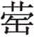来聘。

***【注释】***

①元年：鲁襄公元年当周简王十四年，前572。

②公即位：襄公即位，时年仅四岁。襄公，名午。成公之子，定姒所生。

③仲孙蔑会晋栾黡、宋华元、卫甯殖、曹人、莒人、邾人、滕人、薛人围宋彭城：诸侯应宋之请，围宋彭城。事见成公十八年《经》、《传》。

④鄫（zēnɡ）：郑地，在今河南睢县东南。

⑤公子壬夫：即成公十八年《传》的子辛，子反之弟。

⑥辛酉：十五日。

⑦天王崩：周简王去世。

⑧邾子来朝：邾宣公朝鲁。

⑨公孙剽：卫定公弟子叔黑背之子。

***【译文】***

鲁襄公元年春周历正月，襄公即位。

仲孙蔑会同晋栾黡、宋华元、卫甯殖、曹国人、莒国人、邾国人、滕国人、薜国人率领的军队围困宋国彭城。

夏，晋国韩厥率领军队攻打郑国，仲孙蔑会同齐国崔杼、曹国人、邾国人、杞国人率领的军队驻扎在鄫地。

秋，楚公子壬夫率领军队入侵宋国。

九月十五日，周简王去世。

邾宣公前来朝见。

冬，卫献公派公孙剽前来聘问，晋悼公也派荀前来聘问。

***【传】***

1.1 元年春己亥①，围宋彭城。非宋地，追书也②。于是为宋讨鱼石，故称宋，且不登叛人也③，谓之宋志。彭城降晋④，晋人以宋五大夫在彭城者归，置诸瓠丘⑤。齐人不会彭城，晋人以为讨。二月，齐大子光为质于晋。

***【注释】***

①己亥：正月无己亥，“己亥”当为“乙亥”之误。乙亥即正月二十五日。

②围宋彭城。非宋地，追书也：此时彭城已为鱼石所据，彭城后又归宋，《经》书“宋彭城”，是后来追记。

③故称宋，且不登叛人也：彭城此时虽为鱼石所据，但不承认它属于鱼石，故仍将其列于宋国名下。不登，不记载。叛人，指鱼石等人。

④彭城降晋：彭城投降晋国，晋后来又将彭城归还宋国，事见襄公二十六年声子之言。

⑤瓠（hù）丘：壶丘，在今山西垣曲东南。

***【译文】***

鲁襄公元年春正月二十五日，诸侯包围宋国彭城。此时彭城已不是宋国的地盘，但彭城后来又归宋，《春秋》这是后来的追记。当时是为宋国收复彭城而讨伐鱼石，所以说“宋彭城”，而且不记载叛人的名字，这是宋人的意愿。彭城投降晋国，晋人将占据彭城的原宋五大夫鱼石等人带回去，把他们安置在瓠丘。齐人不参加彭城之役，晋人因此要讨伐它。二月，齐太子光到晋国当人质。

1.2 夏五月，晋韩厥、荀偃帅诸侯之师伐郑①，入其郛②，败其徒兵于洧上③。于是东诸侯之师次于鄫④，以待晋师。晋师自郑以鄫之师侵楚焦、夷及陈⑤。晋侯、卫侯次于戚⑥，以为之援。

***【注释】***

①晋韩厥、荀偃帅诸侯之师伐郑：韩厥为中军帅，荀偃为副帅，故《经》文仅记韩厥一人。

②郛：郭，外城。

③徒兵：步兵。洧（wěi）：洧水。今曰双洎河。源出河南登封，东流入贾鲁河。

④东诸侯：即鲁、齐、曹、邾、杞等国。

⑤晋师自郑以鄫之师侵楚焦、夷及陈：陈为楚盟国，故连及侵陈。焦、夷，二地本为陈地，焦当今安徽亳州，夷在亳州东南。

⑥戚：卫地，在今河南濮阳北。

***【译文】***

夏五月，晋国韩厥、荀偃率领诸侯国的军队攻打郑国，攻入它的外城，在洧水边击败了郑国步兵。当时东诸侯的军队驻扎在鄫地，等待晋师的到来。晋军从郑国率领驻扎于鄫的诸侯之师入侵楚国的焦、夷以及楚之盟国陈国。晋悼公、卫献公驻扎在戚地，作为后援。

1.3 秋，楚子辛救郑①，侵宋吕、留②。郑子然侵宋③，取犬丘④。

***【注释】***

①子辛：即公子壬夫。

②侵宋吕、留：侵宋以救郑。吕、留，皆宋邑名。吕，在今徐州东南。留，在今沛县东南，徐州北。

③子然：郑穆公子。

④犬丘：在今河南永城西北。

***【译文】***

秋，楚国子辛出兵救郑，入侵宋国吕、留二地。郑国子然也侵入宋国，占领了犬丘。

1.4 九月，邾子来朝，礼也。

***【注释】***

①九月，邾子来朝，礼也：邾宣公因襄公即位来朝。此时周天子崩，依礼诸侯当守丧，应暂停朝聘之礼。因天子新丧，讣告未到，诸侯不知而仍行朝聘之礼，故仍书之曰“礼也”。

***【译文】***

九月，邾宣公前来朝见，这是履行礼仪。

1.5 冬，卫子叔、晋知武子来聘①，礼也。凡诸侯即位，小国朝之，大国聘焉，以继好、结信、谋事、补阙②，礼之大者也。

***【注释】***

①子叔：公孙剽。知武子：荀。

②阙：过失。

***【译文】***

冬，卫国子叔、晋国知武子前来聘问，也是符合礼仪的。凡是诸侯新君即位，小国要来朝见，大国要来聘问，从而得以继续以往的友好关系，取得彼此相互信任，以及商议国事和弥补过失，这是礼仪中的大事。

# 二年

***【经】***

2.1 二年春王正月①，葬简王。

2.2 郑师伐宋。

2.3 夏五月庚寅②，夫人姜氏薨③。

2.4 六月庚辰④，郑伯睔卒⑤。

2.5 晋师、宋师、卫甯殖侵郑⑥。

2.6 秋七月，仲孙蔑会晋荀、宋华元、卫孙林父、曹人、邾人于戚。

2.7 己丑⑦，葬我小君齐姜。

2.8 叔孙豹如宋⑧。

2.9 冬，仲孙蔑会晋荀、齐崔杼、宋华元、卫孙林父、曹人、邾人、滕人、薛人、小邾人于戚，遂城虎牢⑨。

2.10 楚杀其大夫公子申。

***【注释】***

①二年：鲁襄公二年当周灵王元年，前571。

②庚寅：十八日。

③夫人姜氏：即后文所说齐姜，成公夫人，谥齐。

④庚辰：应为七月初九。按，杨伯峻注，“庚寅距庚辰五十日。杜注，‘庚辰，七月九日’，是也。”

⑤郑伯睔（ɡùn）卒：郑成公去世。睔，郑成公名。

⑥晋师、宋师、卫甯殖侵郑：三国之晋、宋率师者名位不高，唯甯殖为卫卿，因此特举出甯殖名。诸侯趁郑丧期进攻郑国。一说谓鲁成公二年，“卫侯速卒”，而当年楚师郑师即侵卫。此次郑丧，卫亦率师侵之，以牙还牙，故书其主帅名。

⑦己丑：十八日。

⑧叔孙豹：穆叔。杨伯峻注，“叔孙豹于是始参与鲁政”。

⑨遂城虎牢：指诸侯在虎牢筑城以逼郑。虎牢，即隐公元年的“制”地，在今河南荥阳。

***【译文】***

鲁襄公二年春周历正月，安葬周简王。

郑军攻打宋国。

夏五月十八日，夫人姜氏去世。

七月初九，郑成公睔去世。

晋军、宋军、卫国甯殖率领军队侵袭郑国。

秋七月，仲孙蔑同晋荀、宋华元、卫孙林父、曹国人、邾国人在戚相会。

七月十八日，安葬我国夫人齐姜。

叔孙豹到宋国。

冬，仲孙蔑和晋荀、齐崔杼、宋华元、卫孙林父、曹国人、邾国人、滕国人、薛国人、小邾国人在戚相会，于是在虎牢筑城。

楚国杀了他们的大夫公子申。

***【传】***

2.1 二年春，郑师侵宋，楚令也①。

***【注释】***

①郑师侵宋，楚令也：杨伯峻注：“彭城本宋地，楚取之以纳鱼石等。”去年彭城降晋，因此楚命令郑国攻宋。

***【译文】***

鲁襄公二年春，郑军侵袭宋国，这是楚国的命令。

2.2 齐侯伐莱①，莱人使正舆子赂夙沙卫以索马牛②，皆百匹，齐师乃还。君子是以知齐灵公之为“灵”也③。

***【注释】***

①莱：国名，在今山东昌乐东南。

②正舆子：莱国贤大夫。夙沙卫：齐灵公幸臣，曾任齐国少傅。索马牛：精选的牛马。索，选择。

③君子是以知齐灵公之为“灵”也：伐莱之事，可见齐灵公贪鄙。后来齐灵公废太子光而立牙，并使夙沙卫为少傅，终乱齐国。事见襄公十九年《传》。灵，谥号。《谥法》，不勤成名曰灵，任本性，不见贤思齐。属于恶谥。

***【译文】***

齐灵公攻打莱国，莱国人派正舆子贿赂夙沙卫精选的马、牛各一百匹，于是齐军撤兵。君子由此而知道齐灵公之所以谥为“灵”的缘故。

2.3 夏，齐姜薨。初，穆姜使择美槚①，以自为榇与颂琴②，季文子取以葬③。

***【注释】***

①穆姜：鲁宣公夫人，成公之母。槚（jiǎ）：即楸（qiū），木材细密，可制器具及棺木。

②榇（chèn）：内棺，这里泛指棺材。颂琴：一种古琴。穆姜制以殉葬。

③季文子取以葬：季文子将穆姜的梓棺及颂琴拿来安葬齐姜，有报仇之意。成公十六年，穆姜与叔孙侨如私通，欲去季、孟，因成公不许而未遂。穆姜此时已无权势，被软禁于东宫。

***【译文】***

夏，齐姜去世。当初，穆姜派人选择质地上乘的槚木，用它们为自己做了一副棺材和颂琴，季文子把它们拿来安葬齐姜。

君子曰：“非礼也。礼无所逆。妇，养姑者也①。亏姑以成妇，逆莫大焉②。《诗》曰：‘其惟哲人，告之话言，顺德之行③。’季孙于是为不哲矣。且姜氏，君之妣也④。《诗》曰：‘为酒为醴，烝畀祖妣。以洽百礼，降福孔偕⑤。’”

***【注释】***

①姑：婆婆。古代称丈夫的父母为舅姑，即公婆。

②亏姑以成妇，逆莫大焉：齐姜为成公夫人，穆姜是齐姜的婆婆，将穆姜的棺木与颂琴给齐姜下葬，作者认为此举于礼不顺。

③其惟哲人，告之话言，顺德之行：引《诗》出《诗经·大雅·抑》。哲，明智，有智慧。

④且姜氏，君之妣（bǐ）也：姜氏，指穆姜。君，指鲁襄公。妣，祖母，穆姜为鲁襄公祖母。后文“祖妣”并列指祖父、祖母。

⑤为酒为醴，烝畀（zhēnɡ bì）祖妣。以洽百礼，降福孔偕：引《诗》出《诗经·周颂·丰年》。作者引此诗，意在说明后人本应向祖妣献礼才是，今季文子亏姑以成妇，于礼不合。烝，进。畀，给予。洽，协合。孔，很。偕，普遍。

***【译文】***

君子指出：“这是不符合礼的。礼不能有所不顺。媳妇是奉养婆婆的，亏损婆婆以成就媳妇，没有比这更大的不顺了。《诗》说：‘只有明哲的人，才可以把好话告诉他，让他顺德而行。’季孙在这件事上是不明智的。况且穆姜还是国君襄公的祖母啊。《诗》说：‘酿造美酒与甜醪，献给祖父母。用以谐和各种礼仪，祖父母将会普降福气。’”

2.4 齐侯使诸姜、宗妇来送葬①。召莱子，莱子不会②，故晏弱城东阳以逼之③。

***【注释】***

①齐侯使诸姜、宗妇来送葬：杨伯峻注：“《礼记·檀弓下》云，‘妇人不越疆而吊人’。出国境吊丧尚且不可，出国境送丧更不合当时之礼。”诸姜，与齐同姓嫁给齐大夫的妇女。宗妇，同姓大夫的妻子。

②召莱子，莱子不会：莱为齐毗邻小国，齐召莱君，让他与诸姜、宗妇一同去鲁国送葬，此有意凌蔑莱国，莱君因此不来。

③晏弱：即晏桓子。东阳：齐边境城邑。

***【译文】***

齐灵公派遣嫁给大夫的宗女和同姓大夫的妻子前来送葬。召莱子同去，莱子不来，所以晏弱在东阳筑城以胁迫他。

2.5 郑成公疾，子驷请息肩于晋①。公曰：“楚君以郑故，亲集矢于其目②，非异人任，寡人也③。若背之，是弃力与言④，其谁昵我？免寡人，唯二三子！”

***【注释】***

①子驷请息肩于晋：郑此时服从楚国，楚国对郑国要求甚多，郑不堪重负，所以子驷请求顺服晋国以解除对楚国的负担。子驷，公子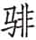（fēi）。

②楚君以郑故，亲集矢于其目：指成公十六年晋、楚鄢陵之战，楚共王为晋吕锜射中眼睛事。

③非异人任，寡人也：即非任异人，指楚共王伤目不是为别人，而是为了郑成公自己。

④力：功劳。言：自己的誓言。

***【译文】***

郑成公生病，子驷请求顺服晋国以解除对楚国的负担。成公说：“楚君由于郑国的缘故，他的眼睛都被箭射中，承受这样的灾祸不是为了别人，正是为了寡人我啊。如果背弃楚国，这是丢弃楚国的功劳和自己的誓言，还会有谁亲近我们？能让我免于犯错的，就全在于各位了！”

秋七月庚辰①，郑伯睔卒。于是子罕当国②，子驷为政，子国为司马③。晋师侵郑，诸大夫欲从晋。子驷曰：“官命未改④。”

***【注释】***

①庚辰：初九。

②子罕：公子喜，郑穆公之子。当国：主持国事。

③子国：公子发，郑穆公之子。

④官命未改：指郑成公不愿弃楚之言。官命，指成公之令。春秋时，旧君死，新君第二年改元。此时成公虽死，但没下葬，新君不得发布新命令，因此说“官命未改”。

***【译文】***

秋七月初九，郑成公睔去世。当时子罕主持国事，子驷处理政务，子国为司马。晋军侵犯郑国，大夫们想要顺从晋国。子驷说：“国君的命令还没有改变。”

会于戚，谋郑故也。孟献子曰①：“请城虎牢以逼郑②。”知武子曰③：“善。鄫之会，吾子闻崔子之言，今不来矣④。滕、薛、小邾之不至，皆齐故也⑤。寡君之忧不唯郑⑥。将复于寡君，而请于齐⑦。得请而告⑧，吾子之功也。若不得请，事将在齐⑨。吾子之请，诸侯之福也⑩，岂唯寡君赖之。”

***【注释】***

①孟献子：即鲁卿仲孙蔑。

②虎牢：本属郑国西北边境的险要之地，此时为晋所占。

③知武子：即知，又名荀。

④鄫之会，吾子闻崔子之言，今不来矣：鄫之会在去年，孟献子曾参加。知虽未与会，而晋有韩厥、荀偃，故知可知会议情况。会上齐崔杼可能有于晋不满之言。

⑤滕、薛、小邾之不至，皆齐故也：滕、薛、小邾皆近齐小国，听命于齐。

⑥寡君之忧不唯郑：意谓忧郑之外更忧齐。若齐、郑、楚联盟，晋则难以称霸。

⑦将复于寡君，而请于齐：以此报告晋君，并请齐相会，以考验齐国。

⑧得请而告：得齐允许，便告诉诸侯共同在虎牢筑城。

⑨事将在齐：将伐齐。事，指战事。

⑩诸侯之福：意谓能够在虎牢筑城，足以使郑降服，楚不能争，可免于战争。

***【译文】***

诸侯在戚相会，是为了讨论对付郑国的办法。孟献子说：“请在虎牢筑城来逼迫郑国。”知武子说：“好主意。鄫地的盟会，您是听到齐国崔杼的话的，现在他果然不来了。滕、薛、小邾也都不到会，这都是由于齐国的缘故。我们国君的忧患不仅仅是郑国。我将向我的国君汇报，同时向齐国发出会见的请求。如果请求得到同意，便告知诸侯共同在虎牢筑城，这是您的功劳。如果不被同意，战事就将在齐国发生。您的请求，是诸侯的福气，岂独我国国君依靠它。”

2.6 穆叔聘于宋，通嗣君也①。

***【注释】***

①穆叔聘于宋，通嗣君也：穆叔，叔孙豹。襄公新立，使叔孙豹聘于宋，以示通好之意。

***【译文】***

穆叔到宋国聘问，向他们通报新君即位。

2.7 冬，复会于戚，齐崔武子及滕、薛、小邾之大夫皆会，知武子之言故也①。遂城虎牢，郑人乃成。

***【注释】***

①齐崔武子及滕、薛、小邾之大夫皆会，知武子之言故也：因知说“事将在齐”，齐人害怕，所以率滕、薛、小邾参加会见。崔武子，崔杼。

***【译文】***

冬，再次在戚地相会，齐国崔武子以及滕、薛、小邾等国的大夫都与会了，这是由于知武子那一番话的缘故。于是在虎牢筑城，郑国人于是与晋媾和。

2.8 楚公子申为右司马，多受小国之赂，以逼子重、子辛①，楚人杀之。故书曰：“楚杀其大夫公子申。”

***【注释】***

①以逼子重、子辛：逼迫子重、子辛，欲夺其权势。

***【译文】***

楚公子申为右司马，大量收受小国的贿赂，以威逼子重、子辛，楚国人便把他杀了。所以《春秋》记载说：“楚国杀了他们的大夫公子申。”

# 三年

***【经】***

3.1 三年春①，楚公子婴齐帅师伐吴②。

3.2 公如晋③。

3.3 夏四月壬戌④，公及晋侯盟于长樗⑤。

3.4 公至自晋。

3.5 六月，公会单子、晋侯、宋公、卫侯、郑伯、莒子、邾子、齐世子光。己未⑥，同盟于鸡泽⑦。

3.6 陈侯使袁侨如会⑧。

3.7 戊寅⑨，叔孙豹及诸侯之大夫及陈袁侨盟。

3.8 秋，公至自会。

3.9 冬，晋荀帅师伐许。

***【注释】***

①三年：鲁襄公三年当周灵王二年，前570。

②楚公子婴齐帅师伐吴：公子婴齐，即子重。按，吴楚争强自此开始。

③公如晋：襄公即位后第一次朝晋。

④壬戌：二十五日。

⑤长樗（chū）：在晋国都的郊外。

⑥己未：二十三日。

⑦鸡泽：古地名。在今河北邯郸东北。

⑧陈侯使袁侨如会：陈国想背楚投晋，所以派袁侨参加鸡泽之会。

⑨戊寅：六月无戊寅，应为七月十三日。

***【译文】***

鲁襄公三年春，楚国公子婴齐率师攻打吴国。

襄公前往晋国。

夏四月二十五日，襄公和晋悼公在长樗结盟。

襄公从晋回国。

六月，襄公和单顷公以及晋悼公、宋平公、卫献公、郑僖公、莒犁比公、邾宣公并齐国太子光相会。二十三日，在鸡泽结盟。

陈成公派袁侨到会。

七月十三日，叔孙豹和各国大夫以及陈国袁侨结盟。

秋，襄公自盟会回国。

冬，晋荀率军攻打许国。

***【传】***

3.1 三年春，楚子重伐吴，为简之师①，克鸠兹②，至于衡山③。使邓廖帅组甲三百、被练三千以侵吴④。吴人要而击之，获邓廖。其能免者，组甲八十、被练三百而已。

***【注释】***

①简之师：经过挑选的军队。

②鸠兹：吴邑。在今安徽芜湖东南。

③衡山：吴地名。即横山，今安徽当涂东北。

④组甲：用丝带子联缀的铠甲，车兵服用。被练：用帛联缀的铠甲，步卒服用。

***【译文】***

鲁襄公三年春，楚国子重攻吴，组织起一支经过挑选的军队，攻下鸠兹，到达衡山。派邓廖率领穿组甲的车兵三百人、穿被练的步兵三千人侵袭吴国。吴人拦腰攻击楚军，俘获邓廖。逃脱的不过组甲八十人、被练三百人。

子重归，既饮至三日①，吴人伐楚，取驾②。驾，良邑也。邓廖，亦楚之良也。君子谓：“子重于是役也，所获不如所亡③。”楚人以是咎子重。子重病之，遂遇心疾而卒④。

***【注释】***

①饮至：出征奏凯，至宗庙祭祀宴饮庆功之礼。

②驾：楚邑，在今安徽无为。

③子重于是役也，所获不如所亡：子重伐吴，吴反攻子重，两相比较，楚损失更惨重。

④心疾：指精神病。

***【译文】***

子重回国，举行凯旋饮至之礼三天后，吴国攻打楚国，夺取了驾。驾是上等城邑，邓廖也是楚国良将。君子认为：“子重在这次战役中所得到的不如所失去的。”楚国人由此怪罪子重。子重对此很烦恼，便得了精神错乱症而死去。

3.2 公如晋，始朝也①。夏，盟于长樗。孟献子相，公稽首②。知武子曰：“天子在，而君辱稽首，寡君惧矣③。”孟献子曰：“以敝邑介在东表，密迩仇雠，寡君将君是望，敢不稽首？”

***【注释】***

①公如晋，始朝也：襄公始朝霸主。

②孟献子相，公稽首：襄公此时仅六七岁，所以需由孟献子作为相礼者。

③天子在，而君辱稽首，寡君惧矣：鲁君只有对周王才行稽首礼，知武子表示晋悼公不敢当。

***【译文】***

襄公前往晋国，这是初次去朝见。夏，在长樗结盟。孟献子作为相礼者，襄公行稽首大礼。知武子说：“有天子在那里，而有辱贵君行稽首大礼，我的国君感到害怕。”孟献子说：“由于敝国地处东海边，紧挨着仇国，敝国国君唯有希望贵君支持，岂敢不行稽首之礼？”

3.3 晋为郑服故，且欲修吴好①，将合诸侯。使士匄告于齐曰②：“寡君使匄，以岁之不易③，不虞之不戒，寡君愿与一二兄弟相见，以谋不协④，请君临之，使匄乞盟。”齐侯欲勿许，而难为不协，乃盟于耏外⑤。

***【注释】***

①欲修吴好：晋见吴逐渐强大，足以困楚，故欲与吴国修好。

②士匄：范匄，范宣子。

③不易：这里指诸侯间的纠纷。易，平安。

④不协：实暗指齐国多有异志。见去年七月戚之会《传》文及注可知。

⑤耏（ér）外：在齐都临淄西北郊近耏水处。耏，耏水，即时水。

***【译文】***

晋国因为郑国顺服了，而且想要和吴国修好，准备会合诸侯。派士匄告知齐国说：“敝国君派我前来，是由于近来诸侯间纠纷不少，对意外变故又没有戒备，敝国君愿意和几位兄弟相见，共同商量解决彼此间的不和睦，请国君您光临，派我先来请求结盟。”齐国君本想不答应，又不敢表示心怀异志，就在耏水边结盟。

3.4 祁奚请老①，晋侯问嗣焉②。称解狐，其仇也③，将立之而卒；又问焉，对曰：“午也可④。”于是羊舌职死矣⑤，晋侯曰：“孰可以代之？”对曰：“赤也可⑥。”于是使祁午为中军尉，羊舌赤佐之。

***【注释】***

①祁奚：祁黄羊，又称祁大夫。祁奚此时为中军尉。

②嗣：接替者。

③称解（xiè）狐，其仇也：解狐与祁奚有私仇。称，举荐。仇，仇家。

④午：祁午，祁奚的儿子。

⑤羊舌职：叔向父亲，此时为佐中军尉。

⑥赤：羊舌赤，字伯华，羊舌职之子。

***【译文】***

祁奚请求告老退休，晋悼公询问接替的人。举荐解狐，这是他的仇家，将要任命时解狐死了；又问谁可胜任，回答说：“祁午可以。”这时羊舌职死了，晋悼公问：“谁可以代替他？”回答说：“羊舌赤可以。”于是任命祁午为中军尉，羊舌赤为副职。

君子谓：“祁奚于是能举善矣。称其仇，不为谄。立其子，不为比。举其偏，不为党。《商书》曰：‘无偏无党，王道荡荡①。’其祁奚之谓矣！解狐得举，祁午得位，伯华得官，建一官而三物成②，能举善也夫！唯善，故能举其类。《诗》云：‘惟其有之，是以似之③。’祁奚有焉。”

***【注释】***

①无偏无党，王道荡荡：引文出自《尚书·洪范》。

②一官：指中军尉。三物：指得举、得位、得官。

③惟其有之，是以似之：引《诗》出《诗经·小雅·裳裳者华》。意谓祁奚有这样的善德，故其所举荐的人也有类似的善德。杜预《春秋左传注》：“唯有德之人能举似己者。”

***【译文】***

君子认为：“祁奚在这件事上可以算能举荐贤才了。推荐自己的私仇，不是谄媚。安排儿子，不是偏私。推举副手，不为结党。《商书》说：‘不偏私不结党，先王正道浩浩荡荡。’这说的就是祁奚啊！解狐能得到推举，祁午得到任命，伯华获得官位，设立一个官位而成就三件事，这是由于能够举荐贤人的缘故啊！因为他贤明，所以能够举荐他的同类。《诗》说：‘正因为有这美德，因而所举荐的人也像他那样。’祁奚就是如此。”

3.5 六月，公会单顷公及诸侯①。己未②，同盟于鸡泽。

***【注释】***

①单顷公：即《经》之单子，周王卿士。

②己未：二十三日。

***【译文】***

六月，襄公会见单顷公与诸侯。二十三日，一起在鸡泽结盟。

晋侯使荀会逆吴子于淮上①，吴子不至②。

***【注释】***

①晋侯使荀会逆吴子于淮上：要由此会与吴国结好，因此派人迎接吴子。吴子，吴王寿梦。淮上，淮水北，约在今安徽凤台境内。

②吴子不至：吴国因路远未能赴会。

***【译文】***

晋悼公派荀会在淮河边迎接吴王寿梦，吴王寿梦没来。

3.6 楚子辛为令尹，侵欲于小国①。陈成公使袁侨如会求成②，晋侯使和组父告于诸侯③。秋，叔孙豹及诸侯之大夫及陈袁侨盟，陈请服也④。

***【注释】***

①楚子辛为令尹，侵欲于小国：侵害勒索小国，贪鄙无厌，因此小国厌楚。侵欲，侵吞贪求。

②陈成公使袁侨如会求成：陈国亦背楚投晋，因此请求加盟。袁侨，袁涛涂四世孙。

③和组父：晋大夫。

④叔孙豹及诸侯之大夫及陈袁侨盟，陈请服也：鸡泽之盟本已结束，因陈国请盟，因此诸侯与陈国再次结盟。

***【译文】***

楚国子辛任令尹，不断侵害勒索小国。陈成公为此派袁侨到会请求加盟，晋悼公派和组父把这事向诸侯通告。秋，叔孙豹和诸侯的大夫以及陈袁侨再次结盟，这是由于陈国请求顺服的缘故。

3.7 晋侯之弟扬干乱行于曲梁①，魏绛戮其仆②。晋侯怒，谓羊舌赤曰：“合诸侯，以为荣也。扬干为戮，何辱如之？必杀魏绛，无失也③！”对曰：“绛无贰志，事君不辟难④，有罪不逃刑，其将来辞⑤，何辱命焉？”言终，魏绛至，授仆人书⑥，将伏剑。士鲂、张老止之。公读其书，曰：“日君乏使，使臣斯司马⑦。臣闻师众以顺为武，军事有死无犯为敬。君合诸侯，臣敢不敬？君师不武，执事不敬，罪莫大焉。臣惧其死，以及扬干，无所逃罪。不能致训⑧，至于用钺⑨。臣之罪重，敢有不从以怒君心？请归死于司寇⑩。”公跣而出⑪，曰：“寡人之言，亲爱也。吾子之讨，军礼也。寡人有弟，弗能教训，使干大命，寡人之过也。子无重寡人之过⑫，敢以为请。”

***【注释】***

①晋侯之弟扬干乱行于曲梁：此指在鸡泽之会上扬干乱行。乱行，扰乱军队行列。曲梁，在鸡泽附近。

②魏绛戮其仆：魏绛时为中军司马，主管晋军军法，故能行戮。不能戮扬干，故戮其仆。仆，车夫。

③必杀魏绛，无失也：羊舌赤时为中军尉佐，职位高于司马，故晋侯可以命其杀魏绛。

④辟：逃避。

⑤来辞：自己前来供状解释。

⑥仆人：接受官员紧急奏事之官。

⑦斯：同“司”，担任的意思。

⑧致训：事前不能教导众人。

⑨钺（yuè）：大斧。这里指大刑。

⑩司寇：国家的司法官。

⑪公跣（xiǎn）而出：古人入室脱履，出室要穿上。悼公恐魏绛自杀，来不及穿履，故赤脚而出。跣，赤足。

⑫重（ｃhónɡ）：再。

***【译文】***

晋悼公弟弟扬干在曲梁扰乱军队的行列，魏绛杀了他的车夫。悼公发怒，对羊舌赤说：“会合诸侯是引以为荣的事，现在扬干受到羞辱，还有什么比这更大的侮辱？一定要杀掉魏绛，不要耽误了！”羊舌赤回答：“魏绛并没有二心异志，事奉君主不避危难，有了罪不逃避惩罚，他会来供状解释的，何必劳驾您下命令呢？”话音刚落，魏绛就来了，把一封信交给传事官后，就要拔剑自杀。士鲂、张老劝阻了他。悼公读信，信上说：“以前君主缺少使唤的人，派我担任司马。我听说军旅以服从命令为武，军中之事以宁死不犯军纪为敬。您会合诸侯，下臣岂敢不敬？君主的军队有不服从军令的，办事的人有不严肃执行军法的，罪过没有比这更大的了。我害怕自己因不严肃执行军法而犯死罪，所以处理了扬干，这罪过无可逃避。我没能事先进行教导，以至于要动用大刑。我的罪很重，哪里敢不服从刑罚，而使君主发怒？请求回去死在司寇那里。”悼公光着脚跑出来，说道：“我的话，是出于对兄弟的亲爱。你杀死扬干的车夫，是执行军法。我有弟弟，却没有教育好，使他犯了军令，这是我的过错。请别让我错上加错，拜托你了！”

晋侯以魏绛为能以刑佐民矣，反役①，与之礼食②，使佐新军③。张老为中军司马④，士富为候奄⑤。

***【注释】***

①反役：从鸡泽之役归来。

②礼食：国君在太庙宴请臣子称“礼食”。

③佐新军：司马位为大夫，佐新军则位列于卿。

④张老为中军司马：张老本是候奄，此是提升。

⑤士富：士会的别族。

***【译文】***

晋悼公由此认为魏绛能够用刑罚来治理人民，从盟会回国，就在太庙设宴款待他，并提拔他为新军副帅。张老任中军司马，士富当候奄。

3.8 楚司马公子何忌侵陈，陈叛故也。

***【译文】***

楚国司马公子何忌侵袭陈国，是因为陈国背叛楚国的缘故。

3.9 许灵公事楚，不会于鸡泽。冬，晋知武子帅师伐许。

***【译文】***

许灵公事奉楚国，不参加鸡泽会盟。冬，晋国知武子率领军队攻打许国。

# 四年

***【经】***

4.1 四年春王三月己酉①，陈侯午卒②。

4.2 夏，叔孙豹如晋③。

4.3 秋七月戊子④，夫人姒氏薨⑤。

4.4 葬陈成公。

4.5 八月辛亥⑥，葬我小君定姒。

4.6 冬，公如晋。

4.7 陈人围顿⑦。

***【注释】***

①四年：鲁襄公四年当周灵王三年，前569。己酉：三月无己酉，此处记载当有误。

②陈侯午卒：陈成公去世。

③叔孙豹如晋：回报荀聘鲁，叔孙豹到晋聘问。

④戊子：二十八日。

⑤姒（sì）氏：成公妾，襄公母。即下文“小君定娰”，定为谥号。

⑥辛亥：二十二日。

⑦顿：靠近陈的小国。

***【译文】***

鲁襄公四年春周历三月己酉，陈成公午去世。

夏，叔孙豹前往晋国聘问。

秋七月二十八日，夫人姒氏去世。

安葬陈成公。

八月二十二日，安葬我国夫人定姒。

冬，襄公前往晋国。

陈国军队包围顿国。

***【传】***

4.1 四年春，楚师为陈叛故，犹在繁阳①。韩献子患之②，言于朝曰：“文王帅殷之叛国以事纣，唯知时也③。今我易之，难哉④！”

***【注释】***

①楚师为陈叛故，犹在繁阳：去年楚公子何忌率师侵陈，陈不服，因此楚师仍驻扎在繁阳。繁阳，蔡地名。在今河南新蔡北。

②韩献子：即韩厥，时为中军帅，当政。

③文王帅殷之叛国以事纣，唯知时也：相传当时天下分为九州，文王得其六州，仍率领背叛商朝的国家去事奉纣王，是因时机未到。

④今我易之，难哉：认为晋未能服楚，此时接受楚的叛国陈不是时候。

***【译文】***

鲁襄公四年春，楚军因为陈国背叛的缘故，还驻扎在繁阳。韩献子为此感到担忧，在朝廷上说：“文王率领背叛商朝的国家去事奉纣王，是因为他知道时机未到。现在我们改变文王的做法，未能服楚而接受楚的叛国陈，想要成功称霸难哪！”

4.2 三月，陈成公卒。楚人将伐陈，闻丧乃止①。陈人不听命。臧武仲闻之，曰：“陈不服于楚，必亡。大国行礼焉，而不服，在大犹有咎，而况小乎②？”夏，楚彭名侵陈③，陈无礼故也。

***【注释】***

①闻丧乃止：当时人以为乘丧期伐人，是为无道。

②“大国行礼焉”四句：楚不伐陈丧是知礼，陈不因此而归服楚是无礼。咎，灾祸。

③彭名：楚国大夫。

***【译文】***

三月，陈成公去世。楚国准备攻打陈国，听到陈国有丧事便停止了军事行动。陈国不听从楚国的命令。臧武仲听说了这种情况，说道：“陈国不肯顺服楚国，一定灭亡。大国按礼行事，小国却不顺服，这么做对大国来说尚且有灾祸，何况小国呢？”夏，楚国彭名攻打陈国，这是由于陈国无礼的缘故。

4.3 穆叔如晋，报知武子之聘也①。晋侯享之，金奏《肆夏》之三②，不拜。工歌《文王》之三③，又不拜。歌《鹿鸣》之三④，三拜⑤。韩献子使行人子员问之⑥，曰：“子以君命，辱于敝邑。先君之礼，藉之以乐⑦，以辱吾子。吾子舍其大⑧，而重拜其细⑨，敢问何礼也？”对曰：“三《夏》⑩，天子所以享元侯也⑪，使臣弗敢与闻。《文王》，两君相见之乐也，使臣不敢及⑫。《鹿鸣》，君所以嘉寡君也，敢不拜嘉⑬？《四牡》，君所以劳使臣也⑭，敢不重拜？《皇皇者华》，君教使臣曰：‘必咨于周⑮。’臣闻之：‘访问于善为咨，咨亲为询，咨礼为度，咨事为诹⑯，咨难为谋。’臣获五善⑰，敢不重拜？”

***【注释】***

①穆叔如晋，报知武子之聘也：知聘鲁在襄公元年。穆叔，即叔孙豹。

②金奏：奏九种《夏》乐，先击钟镈，后击鼓磬，叫做金奏。《肆夏》之三：乐章名，其辞今亡。三，三章，据《国语·鲁语》记载这三章为《肆夏》、《樊遏》、《渠》。

③工：乐工。《文王》之三：指《诗经·大雅》中的《文王》、《大明》、《绵》三曲。

④《鹿鸣》之三：指《诗经·小雅》中的《鹿鸣》、《四牡》、《皇皇者华》三曲。

⑤三拜：每奏完一曲，穆叔一拜谢，共三拜谢。

⑥行人：外交官。

⑦藉：进献。

⑧大：指《肆夏》之三和《文王》之三。

⑨重（ｃhónɡ）拜：一、再、三拜。细：指《鹿鸣》之三。

⑩《三夏》：即《肆夏》之三曲。

⑪元侯：诸侯之长。

⑫及：参预，与闻。

⑬《鹿鸣》，君所以嘉寡君也，敢不拜嘉：《鹿鸣》中有“我有嘉宾”等句，穆叔认为这是晋侯用来嘉奖鲁君的，因此拜谢。

⑭《四牡》，君所以劳使臣也：《四牡》中有“岂不怀归，王事靡盬”等句，是慰劳使臣的诗。

⑮咨：询问。周：忠信之人。

⑯事：政事。诹（zōu）：咨询。

⑰五善：指咨、询、度、诹、谋五种善道，都指询问。

***【译文】***

穆叔去往晋国是为了回报知武子的聘问，晋悼公设享礼招待他。钟镈奏《肆夏》等三章，穆叔不拜谢。乐工歌唱《大雅》中《文王》等三篇，穆叔又没拜谢。歌唱《小雅》中《鹿鸣》等三篇，穆叔三次拜谢。韩献子派行人子员去问他，说：“您奉国君的命令，光临敝国。我国按先王的礼仪，用音乐来招待您。您舍弃重大的音乐而再三拜谢细小的乐歌，敢问这是什么礼仪？”穆叔回答道：“《肆夏》三曲是天子用来招待诸侯领袖的，使臣不敢听赏。《文王》是两国国君相见的音乐，使臣不敢参预。《鹿鸣》是贵国国君用来嘉奖我国国君的，岂敢不拜谢这嘉奖？《四牡》是贵国国君用来慰劳使臣的，哪敢不再拜？《皇皇者华》，是贵国国君借以教导使臣说：‘一定要向忠信的人咨询。’下臣听说：‘向善人访求询问就是咨，咨询亲戚就是询，咨询礼仪就是度，咨询事情就是诹，咨询困难就是谋。’下臣得到这五种善道，岂敢不再拜？”

4.4 秋，定姒薨。不殡于庙①，无榇②，不虞③。匠庆谓季文子曰④：“子为正卿，而小君之丧不成⑤，不终君也⑥。君长，谁受其咎？”

***【注释】***

①殡：停棺待葬。

②榇（ｃhèn）：内棺。

③虞：祭礼，也叫反哭。死者葬后，送殡者返回祭祀并安死者之灵。虞祭时必哭，故称反哭。此时襄公年幼，权在季文子手中，季文子于是不以夫人之礼葬定姒。

④匠庆：名庆的木匠。或即鲁大匠，掌管宫室土木建造的官员。

⑤不成：不以夫人之礼安葬。

⑥不终君：使国君不能为其生母送终而尽其情。

***【译文】***

秋，定姒去世。不把棺木停放在祖庙，没有内棺，没举行虞祭。木匠庆对季文子说：“您是正卿，而夫人的丧事不完备，这使国君不能为他母亲送终。国君长大后，谁将受到责罚？”

初，季孙为己树六槚于蒲圃东门之外①。匠庆请木，季孙曰：“略②。”匠庆用蒲圃之槚，季孙不御③。君子曰：“《志》所谓‘多行无礼④，必自及也’，其是之谓乎！”

***【注释】***

①蒲圃：鲁国场圃名。

②略：简略，指不必选良木。季文子不愿献出槚木，故如此说。

③御：阻止。

④《志》：古书名。

***【译文】***

当初，季文子在蒲圃东门外为自己种了六棵槚树。木匠庆请示用来给定姒做棺木的木料，季文子说：“简单点吧。”木匠庆使用了蒲圃的槚树，季孙未加阻止。君子说：“《志》所说的‘多作不合礼仪的事，祸患一定会发生在自己身上’，说的就是这种情况吧！”

4.5 冬，公如晋听政①，晋侯享公。公请属鄫②，晋侯不许。孟献子曰：“以寡君之密迩于仇雠，而愿固事君，无失官命③。鄫无赋于司马，为执事朝夕之命敝邑，敝邑褊小④，阙而为罪⑤，寡君是以愿借助焉！”晋侯许之。

***【注释】***

①听政：听取晋国对给晋贡赋数额的要求。

②请属鄫：请求晋侯同意以鄫国为鲁之附庸。鄫，姒姓国，在今山东枣庄东。

③官命：指晋君之令。

④褊（biǎn）：狭小。

⑤阙：指贡赋不足。

***【译文】***

冬，襄公到晋国听取晋国的贡赋要求，晋悼公设享礼款待。襄公请求把鄫国作为鲁国的属国，晋悼公没答应。孟献子说：“敝国君紧挨着仇国，却愿意一心一意事奉晋国，没有耽误您的命令。鄫国没有向贵国司马交纳贡赋，而您的左右执事却不断向敝国索求，敝国狭小，不能满足需求便是罪过，我国国君因此想得到鄫国作为帮助！”晋悼公答应了。

4.6 楚人使顿间陈而侵伐之①，故陈人围顿。

***【注释】***

①顿：靠近陈的小国，姬姓，在今河南项城西。间陈：钻陈国的空子。

***【译文】***

楚国让顿国乘陈不备而侵袭陈国，所以陈国人包围顿国。

4.7 无终子嘉父使孟乐如晋①，因魏庄子纳虎豹之皮，以请和诸戎②。晋侯曰：“戎狄无亲而贪，不如伐之。”魏绛曰：“诸侯新服，陈新来和，将观于我。我德，则睦；否，则携贰。劳师于戎，而楚伐陈，必弗能救，是弃陈也。诸华必叛③。戎，禽兽也。获戎失华，无乃不可乎！《夏训》有之曰④：‘有穷后羿……’⑤”公曰：“后羿何如？”对曰：“昔有夏之方衰也，后羿自迁于穷石⑥，因夏民以代夏政⑦。恃其射也，不修民事，而淫于原兽⑧。弃武罗、伯困、熊髡、尨圉⑨，而用寒浞⑩。寒浞，伯明氏之谗子弟也⑪。伯明后寒弃之⑫，夷羿收之⑬，信而使之，以为己相。浞行媚于内⑭，而施赂于外，愚弄其民，而虞羿于田⑮。树之诈慝⑯，以取其国家，外内咸服。羿犹不悛⑰，将归自田，家众杀而亨之⑱，以食其子。其子不忍食诸，死于穷门⑲。靡奔有鬲氏⑳。浞因羿室(21)，生浇及豷(22)，恃其谗慝诈伪，而不德于民。使浇用师，灭斟灌及斟寻氏(23)。处浇于过(24)，处豷于戈(25)。靡自有鬲氏，收二国之烬(26)，以灭浞而立少康(27)。少康灭浇于过，后杼灭豷于戈(28)，有穷由是遂亡，失人故也。昔周辛甲之为大史也(29)，命百官，官箴王阙(30)。于《虞人之箴》曰(31)：‘芒芒禹迹(32)，画为九州(33)，经启九道(34)。民有寝庙，兽有茂草，各有攸处(35)，德用不扰(36)。在帝夷羿，冒于原兽(37)，忘其国恤(38)，而思其麀牡(39)。武不可重(40)，用不恢于夏家(41)。兽臣司原(42)，敢告仆夫(43)。’《虞箴》如是，可不惩乎(44)？”于是晋侯好田，故魏绛及之。

***【注释】***

①无终：国名，在今山西太原一带。嘉父：无终国君名。《春秋》对蛮夷或小国之国国君常称子。孟乐：无终使臣。

②因魏庄子纳虎豹之皮，以请和诸戎：晋国此时国力强盛，声威大振，戎人因此也来请和。魏庄子，即魏绛。

③诸华：指中原诸国。

④《夏训》：夏书。

⑤有穷后羿（yì）：这里是魏绛的话还没讲完，晋悼公突然插问。有穷，夏代国名。后，君主。羿，国君名。

⑥（jū）：古地名。在今河南滑县东。穷石：即穷谷，在今河南洛阳南。

⑦因夏民以代夏政：相传禹之孙太康荒淫失国，夏人立其弟仲康。仲康死，儿子相立，后羿遂推翻相而夺取王位。因，依靠。

⑧原兽：田兽，田猎。

⑨武罗、伯困、熊髡（kūn）、尨圉（ｍánɡ yǔ）：四人都是后羿的贤臣。

⑩寒浞（zhuó）：后羿相。寒，本为部落名，在今山东潍县。寒浞以部落名为氏。

⑪伯明：寒国国君。谗：奸诈。

⑫伯明后寒：即寒后伯明，寒国国君伯明。后，君王。

⑬夷羿：后羿。

⑭行媚于内：指浞与后羿妻妾通奸。

⑮虞：同“娱”。

⑯慝（tè）：邪恶。

⑰悛（quān）：悔改。

⑱亨：同“烹”，煮。

⑲穷门：穷国城门。或曰穷门即穷石。

⑳靡：夏朝人，曾事奉羿。有鬲（ɡé）氏：部落名。地在今山东德州东南。

(21)室：妻妾。

(22)浇（ào）及豷（yì）：浞和后羿妻妾通奸所生两个儿子。

(23)斟灌：部落名。在今山东范县北。斟寻：也是部落名。在今河南偃师东北。

(24)过：部落名。在今山东掖县西北，近海。

(25)戈：部落名。在宋、郑之间。

(26)烬：遗民。

(27)少康：夏后相之子，相传他在有鬲氏的帮助下，攻杀寒浞，恢复了夏朝统治。

(28)后杼：少康子。

(29)辛甲：本为殷商大臣，后为周太史。大史：即太史。

(30)箴（zhēn）：规诫。阙：过失。

(31)虞人：掌管田猎之官。

(32)芒芒：邈远的样子。禹迹：大禹治水的痕迹，指中国国土。

(33)画：分。

(34)九：泛指多数。

(35)攸处：所处。

(36)德：指人与兽的本质而言。用：因。

(37)冒：贪恋。

(38)国恤：国家的忧患。

(39)麀（yōu）牡：泛指各种禽兽。麀，雌鹿。牡，雄兽。

(40)武：田猎。重：多次，意即过度。

(41)用不恢于夏家：意谓因此使国家灭亡。用，因。恢，扩大。

(42)兽臣：虞人自称。司：主管。原：原兽，田猎。

(43)仆夫：这里不敢直言告诉君主，以仆夫代称。

(44)惩：引以为戒。

***【译文】***

无终国国君嘉父派孟乐到晋国去，通过魏绛献上虎豹皮，请求晋国和各部落戎人媾和。晋悼公说：“戎狄不认亲情而贪婪，不如攻打他们。”魏绛说：“诸侯才归顺，陈国刚来讲和，都在观察我们的行动。我们有德，他们就亲近我们；否则就将背叛我们。劳动军队去打戎人，一旦楚国进攻陈国，我们肯定无法救援，这就是丢弃陈国。这样中原诸国一定会背叛我们。戎人犹如禽兽，得到戎而失去中原，恐怕不合适吧？《夏训》有这样的话：‘有穷后羿……’”晋悼公说：“后羿怎么样呢？”魏绛回答说：“从前正当有夏衰落的时候，后羿从迁徙到穷石，借用夏朝民众的力量夺取了夏朝政权。倚仗自己精于射箭，他不致力于治理百姓，而沉湎于打猎。废弃武罗、伯困、熊髡、尨圉而任用寒浞。寒浞本是伯明氏的奸诈子弟。寒君伯明抛弃了他，却被后羿所接纳，信任并重用他，作为自己的辅相。寒浞在内宫对女人献媚，在外广布恩惠以收买人心。愚弄民众，而且引诱后羿沉迷于田猎。扶植奸诈邪恶者，由此夺取了后羿的家和国，朝廷内外都顺从归附。后羿还不知悔改，当他准备从狩猎处回家时，手下人把他杀死并煮了他，强迫他的儿子吃。后羿的儿子不忍心吃，又被杀死在有穷国的城门。在这种局面下，靡逃亡到了有鬲氏部落。寒浞霸占了后羿的妻妾，与她们生了浇和豷，仗着他的奸邪诈伪而不对百姓施德。派浇出兵，消灭了斟灌氏、斟寻氏。把浇安置在过，让豷住在戈。靡从有鬲氏那里收容二国遗民，用他们消灭了寒浞而拥立少康。少康在过灭掉了浇，后杼在戈灭掉了豷，有穷氏因此而灭亡，这都是因为失去民众的缘故啊。当初辛甲任周太史时，命令百官都来劝诫天子的过失。《虞人之箴》中就说：‘大禹走过的邈远辽阔的大地，划分为九州，开辟了众多的道路。民众有住处有宗庙，野兽有丰盛茂密的青草，人兽各有所处，互不干扰。后羿身居帝位，却一心贪恋打猎，忘记国家的忧患，想的只是飞禽走兽。田猎之事不能太频繁，那样做不利于扩大夏朝国力，其后果是导致国家的灭亡。我主管的是田猎之事，谨以此规劝君主的左右。’《虞箴》都这样说，能不引以为戒吗？”当时晋悼公爱好打猎，所以魏绛委婉地说了这件事。

公曰：“然则莫如和戎乎？”对曰：“和戎有五利焉：戎狄荐居①，贵货易土②，土可贾焉，一也。边鄙不耸③，民狎其野④，穑人成功⑤，二也。戎狄事晋，四邻振动，诸侯威怀，三也。以德绥戎，师徒不勤⑥，甲兵不顿⑦，四也。鉴于后羿，而用德度⑧，远至迩安，五也。君其图之！”公说⑨，使魏绛盟诸戎，修民事，田以时。

***【注释】***

①荐居：逐水草而居。荐，草。

②易土：轻视土地。

③耸：恐惧。

④民狎其野：习居其边野而心安。狎，习。

⑤穑人：疑为当时管理边鄙农田之人。

⑥师徒：指将士。勤：劳。

⑦顿：疲劳。

⑧德度：道德法度。

⑨说：同“悦”。

***【译文】***

晋悼公说：“那么就没有比跟戎人修好更好的对策吗？”魏绛回答：“与戎人讲和有五个好处：戎狄逐水草而居，重财宝而轻土地，可以向他们收买土地，这是其一。边境不再恐惧，民众安心于农事，农夫可获收成，这是其二。戎狄事奉晋国，四边邻国都受到震动，诸侯们慑服于我们的威严，这是其三。用德行安抚戎人，将士免去辛劳，武器不被损坏，这是其四。有鉴于后羿失国的教训，而使用道德法度，远方国家来朝，近邻国家安定，这是其五。请国君您好好考虑考虑吧！”晋悼公很满意魏绛这一番话，就派他与各部戎人媾和，又致力于治理民事，打猎合乎时令。

4.8 冬十月，邾人、莒人伐鄫。臧纥救鄫①，侵邾，败于狐骀②。国人逆丧者皆髽③。鲁于是乎始髽，国人诵之曰④：“臧之狐裘，败我于狐骀。我君小子⑤，朱儒是使⑥。朱儒！朱儒！使我败于邾。”

***【注释】***

①臧纥：鲁国臧孙纥。晋国已同意以鄫为鲁的附属国，鲁因此救鄫。

②狐骀（ｔāi）：古地名。在今山东滕县东南。

③逆：迎接。髽（zhuā）：古代妇女丧服的露髻，用麻束发。

④诵：讽刺。

⑤小子：指襄公，当时他有生母定姒之丧，故称。

⑥朱儒：即“侏儒”，矮人，这里指臧孙纥，他身材矮小。

***【译文】***

冬十月，邾国、莒国攻打鄫国。臧孙纥出兵救鄫，侵袭邾国，在狐骀被打败。鲁国人去迎接死亡将士以麻系发。鲁国从此有了以麻系发的丧葬习俗，民众编了首歌谣讽刺说：“穿狐裘的臧孙纥，让我国败在狐骀。我们国君小孩子，派个侏儒去打仗。侏儒啊侏儒，使我们败给了邾。”

# 五年

***【经】***

5.1 五年春①，公至自晋。

5.2 夏，郑伯使公子发来聘②。

5.3 叔孙豹、鄫世子巫如晋③。

5.4 仲孙蔑、卫孙林父会吴于善道④。

5.5 秋，大雩⑤。

5.6 楚杀其大夫公子壬夫⑥。

5.7 公会晋侯、宋公、陈侯、卫侯、郑伯、曹伯、莒子、邾子、滕子、薛伯、齐世子光、吴人、鄫人于戚。

5.8 公至自会。

5.9 冬，戍陈⑦。

5.10 楚公子贞帅师伐陈⑧。

5.11 公会晋侯、宋公、卫侯、郑伯、曹伯、齐世子光救陈。

5.12 十有二月，公至自救陈。

5.13 辛未⑨，季孙行父卒⑩。

***【注释】***

①五年：鲁襄公五年当周灵王四年，前568。

②公子发：郑国大夫，子产之父。

③叔孙豹、鄫世子巫如晋：鄫已是鲁国的附属国，所以派太子巫与叔孙豹前往朝晋。

④善道：古地名。在今安徽盱眙北。

⑤雩（yú）：为求雨举行的祭礼。

⑥公子壬夫：楚令尹子辛。

⑦戍陈：诸侯各国都派兵戍守陈国，以防楚国进攻。《经》文特别记载了鲁国。

⑧公子贞：楚庄王之子子囊。

⑨辛未：二十日。

⑩季孙行父：季文子。

***【译文】***

鲁襄公五年春，襄公从晋国回国。

夏，郑僖公派公子发来鲁国聘问。

叔孙豹、鄫世子巫去晋国。

仲孙蔑、卫孙林父和吴国人在善道会晤。

秋，举行了盛大的求雨祭礼。

楚国杀了他们的大夫公子壬夫。

襄公在戚与晋悼公、宋平公、陈哀公、卫献公、郑僖公、曹成公、莒犁比公、邾宣公、滕悼公、薛伯、齐太子光、吴国人、鄫国人相会。

襄公从盟会回国。

冬，派兵到陈国防守。

楚国公子贞带兵攻打陈国。

襄公和晋悼公、宋平公、卫献公、郑僖公、曹成公、齐太子光救援陈国。

十二月，襄公从救陈战地回国。

二十日，季文子去世。

***【传】***

5.1 五年春，公至自晋。

***【译文】***

鲁襄公五年春，襄公从晋国回国。

5.2 王使王叔陈生诉戎于晋①，晋人执之。士鲂如京师，言王叔之贰于戎也。

***【注释】***

①王叔陈生：周王卿士。诉：控告。

***【译文】***

周灵王派王叔陈生到晋国控告戎人侵凌周王室，晋国人拘禁了他。士鲂到京师，向周灵王说明王叔与戎人相勾结。

5.3 夏，郑子国来聘①，通嗣君也。

***【注释】***

①子国：公子发。

***【译文】***

夏，郑国子国前来聘问，通报郑僖公即位之事。

5.4 穆叔觌鄫大子于晋①，以成属鄫。书曰：“叔孙豹、鄫大子巫如晋。”言比诸鲁大夫也②。

***【注释】***

①觌（dí）：相见。

②比诸鲁大夫：鄫已为鲁的附属国，所以其国的太子就等同于鲁国大夫。

***【译文】***

穆叔在晋国和鄫国太子会晤，以完成鄫附属于鲁国的手续。《春秋》记载说：“叔孙豹、鄫国太子巫到晋国去。”这样说是由于鄫国已是鲁国附属国，鄫国太子的身份和鲁国大夫相当。

5.5 吴子使寿越如晋①，辞不会于鸡泽之故②，且请听诸侯之好③。晋人将为之合诸侯，使鲁、卫先会吴，且告会期。故孟献子、孙文子会吴于善道。

***【注释】***

①吴子：名乘，字寿梦。寿越：吴国大夫。

②辞：解释并表示歉意。

③听：听从。

***【译文】***

吴国君派寿越去晋国，就未参加鸡泽盟会一事加以解释并表示歉意。同时请求听从命令与诸侯交好。晋国准备为此会合诸侯，使鲁、卫二国先与吴国会面，并告知盟会时间。因此孟献子、孙文子和吴国人在善道相会。

5.6 秋，大雩，旱也。

***【译文】***

秋，举行盛大的求雨祭礼，是因为天旱。

5.7 楚人讨陈叛故①，曰：“由令尹子辛实侵欲焉。”乃杀之。书曰：“楚杀其大夫公子壬夫。”贪也。

***【译文】***

楚国人质问陈国背叛自己的缘故，陈国说道：“是由于令尹子辛侵害小国以满足私欲。”便杀了子辛。《春秋》记载：“楚国杀了其国大夫公子壬夫。”是由于他贪婪。

君子谓：“楚共王于是不刑①。《诗》曰：‘周道挺挺，我心扃扃；讲事不令，集人来定②。’己则无信，而杀人以逞，不亦难乎？《夏书》曰：‘成允成功③。’”

***【注释】***

①于是：对于此事。不刑：惩处不当。

②周道挺挺，我心扃扃（ｊiǒnɡ）；讲事不令，集人来定：所引《诗》已佚失，今本《诗经》未收。周道，大路。挺挺，笔直的样子。扃扃，明察的意思。讲事，谋事。集人，聚集贤人。

③成允成功：做好信用才能完成功业。按，此为逸书，后来被收入《古文尚书·大禹谟》。

***【译文】***

君子说：“楚共王在这件事上用刑不当。有《诗》说：‘大路笔直，我心明察；遇事处理不当，应聚集贤人共同商定。’自己不讲信用，却用杀人来立威，不是很成问题吗？《夏书》说：‘做好信用才能完成功业。’”

5.8 九月丙午①，盟于戚，会吴，且命戍陈也。穆叔以属鄫为不利②，使鄫大夫听命于会。

***【注释】***

①丙午：二十三日。

②穆叔以属鄫为不利：鄫为鲁附属国，鲁需保卫鄫，负担加重。

***【译文】***

九月二十三日，诸侯在戚地会盟，是为了和吴国相会，并且要求诸侯戍守陈国。穆叔认为把鄫国作为属国对鲁不利，就让鄫国大夫以独立国家身份出席会议听取盟主命令。

5.9 楚子囊为令尹。范宣子曰：“我丧陈矣！楚人讨贰而立子囊，必改行，而疾讨陈。陈近于楚，民朝夕急，能无往乎①？有陈，非吾事也，无之而后可。”冬，诸侯戍陈。子囊伐陈。十一月甲午②，会于城棣以救之③。

***【注释】***

①往：归于楚。

②甲午：十二日。

③城棣：古地名。在今河南原阳北。

***【译文】***

楚国子囊任令尹。范宣子说：“我国将要失去陈国了！楚国人讨伐有二心的人而立子囊，必定会改变以往的做法而很快攻打陈国。陈国与楚国邻近，民众终日惶急，能不归附楚国吗？保有陈国，对我国没什么意义，放弃陈国反而更好。”冬，诸侯戍守陈国。子囊攻打陈国。十一月十二日，诸侯在城棣相会以援救陈国。

5.10 季文子卒①。大夫入敛，公在位。宰庀家器为葬备②，无衣帛之妾，无食粟之马，无藏金玉，无重器备③。君子是以知季文子之忠于公室也。相三君矣，而无私积，可不谓忠乎？

***【注释】***

①季文子卒：季文子久执鲁国之政，历宣、成、襄三世。

②宰：家臣之长。庀（pǐ）：备具。

③无重：无双份。器备：一切用具。

***【译文】***

季文子去世。按大夫礼仪入敛，襄公亲自前来看视。家宰收集家中器皿作为葬器，家中没有穿丝绸的妾，没有以粮食饲养的马，没有收藏金器玉器，没有双份的用具。君子由此而看到季文子对公室的忠心。他辅佐了三代君主，却没有私人积蓄，能不说是忠心吗？

# 六年

***【经】***

6.1 六年春王三月壬午①，杞伯姑容卒②。

6.2 夏，宋华弱来奔③。

6.3 秋，葬杞桓公。

6.4 滕子来朝。

6.5 莒人灭鄫。

6.6 冬，叔孙豹如邾④。

6.7 季孙宿如晋⑤。

6.8 十有二月，齐侯灭莱。

***【注释】***

①六年：鲁襄公六年当周灵王五年，前567。壬午：初二。

②杞伯姑容：杞桓公，名姑容，在位七十年，为春秋诸侯在位最长久者。

③华弱：华椒之子。

④叔孙豹如邾：鲁与邾讲和。

⑤季孙宿：季文子之子，继承父职为卿。

***【译文】***

鲁襄公六年春周历三月初二，杞桓公姑容去世。

夏，宋国华弱被逐，逃奔鲁国。

秋，杞国安葬桓公。

滕成公朝鲁。

莒国人灭亡鄫国。

冬，叔孙豹前往邾国。

季孙宿去往晋国。

十二月，齐灵公灭了莱国。

***【传】***

6.1 六年春，杞桓公卒，始赴以名，同盟故也。

***【译文】***

鲁襄公六年春天，杞桓公去世，开始在讣告上写他的名字，是因为同盟国的缘故。

6.2 宋华弱与乐辔少相狎①，长相优②，又相谤也。子荡怒③，以弓梏华弱于朝④。平公见之，曰：“司武而梏于朝⑤，难以胜矣！”遂逐之。夏，宋华弱来奔。

***【注释】***

①狎：亲昵。

②优：调戏。

③子荡：即乐辔。

④梏：用弓套住脖子，像戴枷似的。

⑤司武：司马。指华弱。成公十八年，宋司马老佐死于围彭城之役，华弱应是之后代之。

***【译文】***

宋国华弱与乐辔从小关系亲密，长大互相嘲戏又相互诽谤。乐辔发怒，在朝堂上用弓套住华弱的脖子。平公见了，说道：“官居司马却在朝堂上被套着脖子，难以在征战中取胜了！”就驱逐了他。夏，宋国华弱逃奔鲁国。

司城子罕曰①：“同罪异罚，非刑也。专戮于朝②，罪孰大焉！”亦逐子荡。子荡射子罕之门，曰：“几日而不我从！”子罕善之如初③。

***【注释】***

①司城：司空。

②专：专横。戮：羞辱。

③子罕善之如初：意谓子罕虽心有是非，而终不敢触怒恶人。

***【译文】***

司空子罕说：“同罪而不同罚，这是不合刑法的。专横地在朝廷上侮辱人，还有比这更大的罪过吗！”也把乐辔逐出国。乐辔一箭射在子罕的门上，说道：“用不着几天你也会落到和我一样的下场！”子罕于是善待乐辔如初。

6.3 秋，滕成公来朝，始朝公也。

***【译文】***

秋，滕成公来鲁国朝见，这是他首次朝见襄公。

6.4 莒人灭鄫，鄫恃赂也①。

***【注释】***

①莒人灭鄫，鄫恃赂也：鄫为鲁附属国，必送财物与鲁，因此依仗鲁而不防备。其实上年戚之会，鲁已让鄫独立，因此鲁未能救援鄫国。

***【译文】***

莒国灭了鄫国，这是由于鄫国仗着已经给鲁送过财物而没加防备的缘故。

6.5 冬，穆叔如邾，聘，且修平。

***【注释】***

①且修平：襄公四年，鲁曾为救鄫而与邾战，败于狐骀，如今鄫已亡于莒，故鲁与邾修好。

***【译文】***

冬，穆叔到邾国，聘问，并且讲和。

6.6 晋人以鄫故来讨，曰：“何故亡鄫？”季武子如晋见，且听命。

***【译文】***

晋国人以鄫国被灭一事来问责我国，说：“为什么让鄫亡国？”季武子到晋国觐见，并表示愿听凭处置。

6.7 十一月，齐侯灭莱，莱恃谋也①。

***【注释】***

①莱恃谋：指襄公二年“莱人使正舆子赂夙沙卫以索马牛”。

***【译文】***

十一月，齐灵公灭莱国，这是由于莱国倚仗着用了谋略而未加以防备的缘故。

于郑子国之来聘也①，四月，晏弱城东阳，而遂围莱。甲寅②，堙之环城③，傅于堞④。及杞桓公卒之月⑤，乙未⑥，王湫帅师及正舆子、棠人军齐师⑦，齐师大败之。丁未⑧，入莱。莱共公浮柔奔棠。正舆子、王湫奔莒，莒人杀之。四月，陈无宇献莱宗器于襄宫⑨。晏弱围棠，十一月丙辰⑩，而灭之。迁莱于郳。高厚、崔杼定其田⑪。

***【注释】***

①于郑子国之来聘也：指子国聘鲁的那一年，即去年。

②甲寅：去年四月无甲寅，恐记日有误。

③堙（yīn）：堆土成山。

④堞：陴，女墙。

⑤杞桓公卒之月：杞桓公卒在今年三月。则围城达一年之久。

⑥乙未：十五日。

⑦王湫：齐国佐党羽，成公十八年，齐杀国佐时逃奔莱国。棠：莱国城邑。在今山东平度东南。

⑧丁未：二十七日。

⑨陈无宇：陈桓子，陈敬仲玄孙。襄宫：齐襄公庙。杨伯峻曰：“襄公至灵公已八代，依旧礼，襄公庙应早已不存。且何故不献于他庙而独献于襄公之庙？疑‘襄’当作‘惠’……惠公曾于鲁宣七年及九年伐莱，故献莱宗器于其庙。”

⑩十一月丙辰：按照《经》文，应为十二月初十。

⑪高厚：高固儿子。定其田：勘察划定莱国土地。齐既灭莱，当将其土地分与齐人，先由高厚、崔杼勘定其疆界。

***【译文】***

在郑国子国前来聘问的那一年，四月，晏弱在东阳再次筑城，接着包围了莱国。四月甲寅，沿着莱国都城堆土为山，紧紧挨着女墙。在杞桓公去世那一月的十五日，王湫领兵和正舆子以及棠邑军队迎战齐军，被齐师打得大败。二十七日，攻入莱国。莱共公浮柔逃往棠邑。正舆子、王湫逃奔莒国，莒国人杀了他们。四月，陈无宇把莱国宗庙里的宝器献到襄公庙。晏弱包围棠邑，十二月初十，攻灭棠邑。把莱国民众迁往郳地。高厚、崔杼去勘察划定莱国土地，以便分配。

# 七年

***【经】***

7.1 七年春①，郯子来朝②。

7.2 夏四月，三卜郊，不从，乃免牲。

7.3 小邾子来朝。

7.4 城费③。

7.5 秋，季孙宿如卫。

7.6 八月，螽。

7.7 冬十月，卫侯使孙林父来聘。壬戌④，及孙林父盟。

7.8 楚公子贞帅师围陈⑤。

7.9 十有二月，公会晋侯、宋公、陈侯、卫侯、曹伯、莒子、邾子于⑥。郑伯髡顽如会⑦，未见诸侯，丙戌⑧，卒于鄵⑨。

7.10 陈侯逃归。

***【注释】***

①七年：鲁襄公七年当周灵王六年，前566。

②郯（tán）：国名。己姓，或云嬴姓，在今山东郯城。

③费：地名。季氏私邑。

④壬戌：二十一日。

⑤公子贞：即子囊。

⑥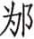（wéi）：郑地名。约在今河南鲁山。

⑦髡（kūn）顽：郑僖公名。

⑧丙戌：十六日。

⑨鄵（cào）：郑地名。郑僖公中途被杀，没能参加之会，《经》文不言“弑”而说“卒”。

***【译文】***

鲁襄公七年春，郯国国君前来朝见。

夏四月，三次为郊祭占卜都不吉利，于是不用牺牲。

小邾穆公前来朝见。

在费筑城。

秋，季孙宿前往卫国。

八月，蝗虫成灾。

冬十月，卫献公派孙林父来鲁国聘问。二十一日，与孙林父订立盟约。

楚国公子贞带兵包围陈国。

十二月，襄公在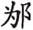地和晋悼公、宋平公、陈哀公、卫献公、曹成公、莒犁比公、邾宣公相会。郑僖公髡顽赴会，没有和诸侯相见，十六日，在鄵去世。

陈哀公逃回国。

***【传】***

7.1 七年春，郯子来朝，始朝公也。

***【译文】***

鲁襄公七年春，郯国国君来鲁朝见，这是他首次朝见襄公。

7.2 夏四月，三卜郊，不从，乃免牲。孟献子曰：“吾乃今而后知有卜、筮。夫郊祀后稷，以祈农事也。是故启蛰而郊①，郊而后耕。今既耕而卜郊②，宜其不从也。”

***【注释】***

①启蛰（zhé）：古代节气名。在雨水前，为夏正正月之中气。

②今既耕而卜郊：据《夏小正》“正月农及雪泽”，则古代耕田似乎在今农历正月。鲁国用周正，四月相当于农历二月，已经耕过田了。

***【译文】***

夏四月，三次为郊祭占卜都不吉利，于是不用牺牲。孟献子说：“我从今而后才知道卜和筮的灵验。郊祭祭祀后稷，是为了祈求农业丰收。因此一到启蛰节气就举行郊祭，然后开始耕作。现在已经耕作才为郊祭举行占卜，难怪神明不同意了。”

7.3 南遗为费宰①。叔仲昭伯为隧正②，欲善季氏，而求媚于南遗，谓遗：“请城费，吾多与而役③。”故季氏城费。

***【注释】***

①南遗：季氏家臣。宰：县宰。

②叔仲昭伯：名带，惠伯之孙。隧正：掌徒役之官。

③而：你。

***【译文】***

南遗担任费邑县宰。叔仲昭伯任隧正，想讨好季氏，因而向南遗献殷勤，对南遗说：“您去提出在费邑筑城的要求，我多派给你劳役。”因此季氏在费筑城。

7.4 小邾穆公来朝，亦始朝公也。

***【译文】***

小邾国穆公前来朝见，也是首次朝见襄公。

7.5 秋，季武子如卫，报子叔之聘①，且辞缓报，非贰也。

***【注释】***

①报子叔之聘：回报子叔在襄公元年的聘鲁。子叔，卫国大夫公孙剽。

***【译文】***

秋，季武子到卫国去，回报子叔的聘问，并解释所以晚来回报的原委，说明不是出于对卫国有二心。

7.6 冬十月，晋韩献子告老①。公族穆子有废疾②，将立之。辞曰：“《诗》曰：‘岂不夙夜，谓行多露③。’又曰：‘弗躬弗亲，庶民弗信④。’无忌不才，让，其可乎？请立起也⑤！与田苏游⑥，而曰好仁。《诗》曰：‘靖共尔位，好是正直。神之听之，介尔景福⑦。’恤民为德，正直为正⑧，正曲为直⑨，参和为仁⑩。如是，则神听之，介福降之⑪。立之，不亦可乎？”庚戌⑫，使宣子朝，遂老。晋侯谓韩无忌仁，使掌公族大夫⑫。

***【注释】***

①告老：退休。

②穆子：即下文的无忌，韩厥长子，此时为公族大夫。废疾：久治不愈的疾病或残废。

③岂不夙夜，谓行多露：引《诗》见《诗经·国风·召南·行露》。《行露》本为男女婚姻诉讼之诗，这里仅取其中二句借以说明自己有病，不能早晚跟随国君。谓，奈何。行，道路。

④弗躬弗亲，庶民弗信：引《诗》见《诗经·小雅·节南山》。表明自己有病，不能躬亲办事，因此不能取信于众。

⑤起：无忌弟，谥宣子。

⑥田苏：晋国贤人。

⑦靖共尔位，好是正直。神之听之，介尔景福：引《诗》见《诗经·小雅·小明》，意思是谦恭谨慎于职守，喜爱那正直的人，神灵将会听到，赐给你大福。靖，谦恭。共，通“恭”。介，帮助。景，大。

⑧正直：正己心。

⑨正曲：正他人之曲。

⑩参和：德、正、直三者合而为一。

⑪介：大。

⑫庚戌：初九。

⑫公族大夫：公族大夫不止一人，这里是指担任首席公族大夫。

***【译文】***

冬十月，晋国韩献子告老退休。公族大夫穆子无忌患有残疾，准备让他继任为卿。无忌推辞说：“《诗》上说：‘难道不想早晚赶着前来，无奈路上露水太大。’又说：‘有事不能亲临，就不能取信于众。’我不具备这方面的才干，让给别人，这样可以吧？请任命起吧！他和田苏交往，田苏称道他‘好仁’。《诗》说：‘谦恭谨慎地做好本职之事，喜爱正直之人，神明将会听到这一切，赐给你大福。’体恤人民是德，校正己心是正，纠正他人之曲是直，德、正、直三者合而为一是仁。这样做，神明将会听到这一切，赐给你大福。任命起，不是很合适的吗？”初九，让韩起朝见，韩献子于是退休。晋悼公认为韩无忌有仁德，便让他担任首席公族大夫。

7.7 卫孙文子来聘，且拜武子之言，而寻孙桓子之盟①。公登亦登②。叔孙穆子相，趋进，曰：“诸侯之会，寡君未尝后卫君。今吾子不后寡君，寡君未知所过。吾子其少安③！”孙子无辞，亦无悛容④。穆叔曰：“孙子必亡。为臣而君，过而不悛，亡之本也。《诗》曰：‘退食自公，委蛇委蛇⑤。’谓从者也。衡而委蛇必折⑥。”

***【注释】***

①孙桓子：即孙良夫，孙文子之父，成公三年聘鲁并结盟。

②公登亦登：按礼仪规矩，国君和贵宾登阶上殿，国君先登二级，然后贵宾登一级。现在鲁襄公登阶，孙林父随之同登，是无礼的行为。

③安：止。使脚步稍停。

④悛：改悔。

⑤退食自公，委蛇（wēi yí）委蛇：引《诗》见《诗经·国风·召南·羔羊》。原意为退朝回家吃饭，从容自得。这里是说只有顺从于君主的人才会从容自得。委蛇，从容自得的样子。

⑥衡：专横。

***【译文】***

卫国孙文子前来聘问，同时答谢季武子的解释，并重温孙桓子和我国结盟的友好关系。襄公登上台阶，孙文子也并肩而登。叔孙穆子相礼，快步上前说：“诸侯间相会，我国国君的地位不比卫君低，从来没有走在卫君后面。现在您不走在我国国君后面，我国国君不知道犯了什么过错而受此轻蔑。您还是稍停一下吧！”孙文子没有解释，也没有愧悔的样子。穆叔说道：“孙文子必会逃亡。作为臣子却自以为可以和国君并肩，有过错而不思悔改，这是逃亡的根本原因。《诗》说：‘从朝堂回家吃饭，从容又自得。’说的是小心顺从的人。这样专横而且满不在乎，必定要遭受挫折。”

7.8 楚子囊围陈，会于以救之。

***【译文】***

楚国子囊包围陈国，诸侯在地会面准备救援陈国。

7.9 郑僖公之为大子也，于成之十六年，与子罕适晋，不礼焉①。又与子丰适楚，亦不礼焉。及其元年，朝于晋。子丰欲诉诸晋而废之，子罕止之。及将会于，子驷相，又不礼焉。侍者谏，不听，又谏，杀之。及鄵，子驷使贼夜弑僖公，而以疟疾赴于诸侯。简公生五年②，奉而立之。

***【注释】***

①焉：指子罕。子罕及下文子丰都是郑穆公儿子，是僖公长辈。

②简公：僖公之子。

***【译文】***

郑僖公当太子的时候，在鲁成公十六年，和子罕前往晋国，对子罕无礼。又和子丰去楚国，同样也无礼。在他即位元年，到晋国朝见。子丰准备向晋国控告并废黜他，子罕阻止了他。等到将要去地与诸侯相会时，子驷相礼，又对子驷无礼。侍者劝谏，僖公不听，侍者又劝谏，僖公就杀了侍者。到了鄵地，子驷派人在夜间杀死僖公，而以生疟疾而死讣告诸侯。简公当时五岁，被立为郑国国君。

7.10 陈人患楚①。庆虎、庆寅谓楚人曰②：“吾使公子黄往而执之③。”楚人从之。二庆使告陈侯于会，曰：“楚人执公子黄矣！君若不来，群臣不忍社稷宗庙，惧有二图④。”陈侯逃归。

***【注释】***

①陈人患楚：楚国围陈。

②庆虎、庆寅：陈国执政大夫。

③公子黄：哀公弟。

④二图：将改立国君。

***【译文】***

陈国人忧虑楚国的围攻。庆虎、庆寅对楚国人说：“我们让公子黄到你们那儿，请拘捕他。”楚国人听从了。庆虎、庆寅让人到会上报告陈哀公说：“楚国人抓了公子黄！国君如果不回来，群臣不忍心国家被楚国灭亡，恐怕会有别的图谋。”陈哀公逃回国了。

# 八年

***【经】***

8.1 八年春王正月①，公如晋。

8.2 夏，葬郑僖公。

8.3 郑人侵蔡，获蔡公子燮。

8.4 季孙宿会晋侯、郑伯、齐人、宋人、卫人、邾人于邢丘②。

8.5 公至自晋。

8.6 莒人伐我东鄙。

8.7 秋九月，大雩。

8.8 冬，楚公子贞帅师伐郑。

8.9 晋侯使士匄来聘③。

***【注释】***

①八年：鲁襄公八年当周灵王七年，前565。

②邢丘：在今河南温县东。

③士匄：即范宣子。

***【译文】***

鲁襄公八年春周历正月，襄公到晋国。

夏，安葬郑僖公。

郑国军队侵袭蔡国，俘获蔡国公子燮。

季孙宿和晋悼公、郑简公、齐国人、宋国人、卫国人、邾国人在邢丘相会。

襄公从晋国回来。

莒国军队攻打我国东部边境。

秋九月，举行祈雨的盛大祭祀。

冬，楚国公子贞领兵攻打郑国。

晋悼公派士匄来我国聘问。

***【传】***

8.1 八年春，公如晋，朝，且听朝聘之数。

***【译文】***

鲁襄公八年春，襄公到晋国朝聘，同时听取晋国要求朝贡礼物的数目。

8.2 郑群公子以僖公之死也，谋子驷。子驷先之。夏四月庚辰①，辟杀子狐、子熙、子侯、子丁②。孙击、孙恶出奔卫③。

***【注释】***

①庚辰：十二日。

②辟：罪。借口有罪。

③孙击、孙恶：二人是子狐之子。

***【译文】***

郑国公子们由于僖公之死，谋划杀死子驷。子驷抢先下手。夏四月十二日，借口某个罪名杀掉子狐、子熙、子侯、子丁。孙击、孙恶出逃到卫国。

8.3 庚寅①，郑子国、子耳侵蔡②，获蔡司马公子燮。郑人皆喜，唯子产不顺③，曰：“小国无文德，而有武功，祸莫大焉。楚人来讨④，能勿从乎？从之，晋师必至。晋、楚伐郑，自今郑国不四五年，弗得宁矣⑤。”子国怒之曰：“尔何知？国有大命⑥，而有正卿⑦。童子言焉⑧，将为戮矣⑨。”

***【注释】***

①庚寅：二十二日。

②子耳：子良之子。

③子产：公孙侨，子国之子。不顺：不随从附和。

④楚人来讨：蔡、楚为盟国，侵蔡必引起楚人讨伐。

⑤晋、楚伐郑，自今郑国不四五年，弗得宁矣：子产认为郑国介于晋、楚二大国之间，无论从谁，皆不得安宁。

⑥大命：发兵兴师的命令。

⑦正卿：指子驷，当时他专国政。

⑧童子：此时子产年纪尚幼，父亲可称其子为“童子”。

⑨将为戮矣：《荀子·臣道篇》引逸诗云：“国有大命，不可以告人，妨其躬身。”亦明哲保身之意。

***【译文】***

二十二日，郑国子国、子耳攻打蔡国，掳获蔡国司马公子燮。郑国人都很高兴，唯独子产不随声附和，说：“小国没有文治德行，却有武功，再没有比这更大的祸患了。楚国人前来讨伐，我们能够不顺从吗？听从楚国，晋国的军队又必然来攻。晋、楚两国都来攻打郑国，从今以后郑国至少在四五年内不得安宁了。”子国对他发怒道：“你知道什么？国家有发兵的重大命令，自有正卿做主。小孩子谈论这些，将会有杀身之祸。”

8.4 五月甲辰①，会于邢丘，以命朝聘之数，使诸侯之大夫听命。季孙宿、齐高厚、宋向戌、卫甯殖、邾大夫会之。郑伯献捷于会，故亲听命②。大夫不书，尊晋侯也。

***【注释】***

①甲辰：初七。

②郑伯献捷于会，故亲听命：此会一般由各国大夫参加，郑简公要到会献伐蔡的俘虏，因此亲自听命。

***【译文】***

五月初七，在邢丘相会，晋国颁布朝聘财物的数目，要诸侯的大夫们到会听取命令。季孙宿、齐国高厚、宋国向戌、卫国甯殖、邾国大夫参加会见。郑简公要在会上奉献俘虏，所以亲自前来听取命令。《春秋》没有记载各国大夫的名字，是出于对晋悼公的尊重。

8.5 莒人伐我东鄙，以疆鄫田①。

***【注释】***

①疆鄫田：莒人已灭鄫，鲁国入侵其西境，所以莒国攻打鲁国东境，以划定鄫地疆界。

***【译文】***

莒国侵犯我国东境，以划定鄫地疆界。

8.6 秋九月，大雩，旱也。

***【译文】***

秋九月，举行盛大求雨祭礼，是因为天旱。

8.7 冬，楚子囊伐郑，讨其侵蔡也。子驷、子国、子耳欲从楚①，子孔、子、子展欲待晋②。子驷曰：“《周诗》有之曰：‘俟河之清，人寿几何？兆云询多，职竞作罗③。’谋之多族，民之多违，事滋无成④。民急矣，姑从楚以纾吾民⑤。晋师至，吾又从之。敬共币帛⑥，以待来者，小国之道也。牺牲玉帛，待于二竟⑦，以待强者而庇民焉。寇不为害，民不罢病⑧，不亦可乎？”

***【注释】***

①子驷、子国、子耳欲从楚：据襄公二十二年《传》，子驷曾随襄公朝晋，晋悼公不以礼待，所以子驷欲从楚。

②子孔：穆公之子。子：公孙虿（chài），谥桓子，子游之子。子展：公孙舍之，谥桓子，子罕之子。

③“俟河之清”四句：这是逸诗。“俟河之清，人寿几何”，意为黄河自古浑浊，传说五百年才清一次，因此说人生短暂，难待河清。“兆云询多，职竞作罗”，意为占卜实在太多，等于为自己编织罗网。兆，占卜。云，语助词。询，信，实在。职，当。竞，语助词。

④谋之多族，民之多违，事滋无成：子驷想要一个人专断，所以这样说。滋，益，更加。

⑤纾：缓和。

⑥共：通“供”。

⑦二竟：郑楚、郑晋边境。竟，通“境”。

⑧罢：疲乏。

***【译文】***

冬，楚国子囊攻打郑国，讨伐他侵袭蔡国。子驷、子国、子耳意欲顺从楚国，子孔、子、子展想要等待晋国的救援。子驷说：“《周诗》这样说：‘等待黄河清澈，人生能有多长寿命？占卜实在太多，等于为自己编织罗网。’主意太多，百姓则多数不能跟从，事情更不可能成功。百姓现在处于危急之中，暂且顺从楚国以缓解我国百姓的苦难。晋国军队到了，我们再顺从晋国。恭恭敬敬地献上财物，等待他人的到来，这是小国的求生之道。把牺牲玉帛，放在二国边境上，以等待强有力者来庇护百姓吧。这样一来敌寇不造成祸害，百姓不疲乏劳困，不也是可行的吗？”

子展曰：“小所以事大，信也。小国无信，兵乱日至，亡无日矣。五会之信①，今将背之，虽楚救我，将安用之？亲我无成②，鄙我是欲③，不可从也。不如待晋。晋君方明，四军无阙④，八卿和睦⑤，必不弃郑。楚师辽远，粮食将尽，必将速归，何患焉？舍之闻之⑥：‘杖莫如信⑦。’完守以老楚⑧，杖信以待晋，不亦可乎？”

***【注释】***

①五会：指襄公三年会于鸡泽，五年会于戚，又会于城棣，七年会于，八年会于邢丘。

②无成：无终，无好结果。

③鄙我是欲：意谓楚国想要将我国变成其边邑。鄙，边鄙之地。

④四军：中、上、下、新四军。无阙：兵员配备完整。

⑤八卿：四军将佐。据襄公九年《传》，八卿为荀、士匄、荀偃、韩起、栾黡、士鲂、赵武、魏绛。

⑥舍之：子展名。

⑦杖莫如信：没有比信用更值得倚仗的了。杖，凭恃，依靠。

⑧完守：整治守备。老楚：使楚军疲惫无士气。

***【译文】***

子展说：“小国用以事奉大国的，是靠讲信用。小国不讲信用，兵祸战乱将时时到来，离亡国的日子就不远了。五次盟会树立的信用，现在打算背弃掉，即便楚国会来救援，又有什么用呢？楚国的亲近对我国不会有好结果，它是要把我国纳入其边界，决不可顺从。不如等待晋国。晋国国君正当贤明，四军兵员配备完整，八卿和睦相处，一定不会丢弃郑国。楚军大老远前来，粮食很快就将吃完，必定很快撤兵回国，怕什么呢？我听说：‘没有比信用更值得倚仗的了。’整治守备以使楚军疲惫无士气，坚守信用以等待晋国，不也是可行的吗？”

子驷曰：“《诗》云：‘谋夫孔多，是用不集。发言盈庭，谁敢执其咎？如匪行迈谋，是用不得于道①。’请从楚，也受其咎②。”

***【注释】***

①“谋夫孔多”六句：引《诗》见《诗经·小雅·小旻》。意思是出主意的人很多，所以不能有所成。发言的人挤满庭院，谁敢承担过错？一边走路一边和人商量，因此无所得。孔，很。集，成就。匪，彼。行迈，走路，行、迈为同义词连用。道，道路。

②：子驷名。

***【译文】***

子驷说：“《诗》说：‘出主意人的很多，所以不能有所成。发言的人挤满庭院，谁敢承担过错？就如一边走一边和路人商量，当然是无所得。’请顺从楚国吧，我来承担责任。”

乃及楚平，使王子伯骈告于晋①，曰：“君命敝邑：‘修而车赋②，儆而师徒③，以讨乱略④。’蔡人不从，敝邑之人，不敢宁处，悉索敝赋⑤，以讨于蔡，获司马燮，献于邢丘。今楚来讨曰：‘女何故称兵于蔡⑥？’焚我郊保⑦，冯陵我城郭⑧。敝邑之众，夫妇男女⑨，不遑启处⑩，以相救也。翦焉倾覆⑪，无所控告。民死亡者，非其父兄，即其子弟。夫人愁痛⑫，不知所庇。民知穷困，而受盟于楚，孤也与其二三臣不能禁止⑬。不敢不告。”

***【注释】***

①王子伯骈：郑国大夫。

②车赋：车乘。

③儆（jǐnɡ）：戒备。

④乱略：叛乱侵夺。略，乱。

⑤赋：军赋，指兵力。

⑥称兵：举兵。

⑦郊保：郊外的城堡。保，同“堡”。

⑧冯陵：攻犯，侵略。冯、陵，同义词。

⑨夫妇男女：指全部居民。夫妇，已嫁娶者。男女，未嫁娶者或鳏夫寡妇。

⑩遑：闲暇。启处：安居休息。启，小跪。处，安坐。

⑪翦焉：将要倾覆的样子。

⑫夫人：人人。

⑬孤：郑简公自指。

***【译文】***

于是和楚国媾和，派王子伯骈向晋国报告，说：“贵国国君命令敝国：‘整备你们的战车，让你们军队保持戒备，去讨伐动乱。’蔡国人不顺从，敝国人不敢安居，集中了全部兵力，去攻打蔡国，擒获其司马公子燮，奉献给了邢丘的盟会。现在楚国前来讨伐，说：‘你们为什么对蔡国用兵？’焚毁了敝国郊外的城堡，侵犯我们的城郭。敝国民众，无论男女老少，无暇休息片刻，互相救援。国家即将倾覆，无处控告求助。民众死亡逃难的，不是父兄，就是子弟，人人哀愁悲痛，不知道在哪里可以得到庇护。民众意识到已经山穷水尽，只好接受楚国的盟约，寡人和几位臣子无法禁止，不敢不向贵国报告。”

知武子使行人子员对之曰①：“君有楚命，亦不使一介行李告于寡君②，而即安于楚。君之所欲也，谁敢违君？寡君将帅诸侯以见于城下，唯君图之！”

***【注释】***

①知武子：即荀，时任晋国中军帅。

②行李：即行人，使者。

***【译文】***

知武子派外交使节子员回答说：“贵国君主受到楚国的讨伐，也不派一名使节告诉敝国国君，却马上向楚国顺服。这是你们所希望的，谁敢反对？敝国君主将要带领诸侯和你们在城下相见，请你们国君好好准备吧！”

8.8 晋范宣子来聘①，且拜公之辱，告将用师于郑。公享之，宣子赋《摽有梅》②。季武子曰③：“谁敢哉！今譬于草木④，寡君在君，君之臭味也⑤。欢以承命，何时之有？”武子赋《角弓》⑥。宾将出，武子赋《彤弓》⑦。宣子曰：“城濮之役，我先君文公献功于衡雍，受彤弓于襄王⑧，以为子孙藏。匄也，先君守官之嗣也⑨，敢不承命？”君子以为知礼。

***【注释】***

①范宣子：即士匄，时任中军佐。

②《摽（piào）有梅》：《诗经·国风·召南》中诗篇名，本意是说求婚男子应及时行事，士匄借此希望鲁国及时出兵讨郑。摽，落。

③季武子：当时襄公年幼，享宴中季武子相礼。

④譬于草木：因赋《摽有梅》，所以季武子说以草木为喻。

⑤寡君在君，君之臭（xiù）味也：意思是晋国君是花木，鲁国君只是其所发出的气味，比喻两国形同一体。臭味，气味。

⑥《角弓》：《诗经·小雅》中诗篇名。季武子取其中兄弟婚姻，互相不要疏远之意。

⑦《彤弓》：《诗经·小雅》中诗篇名。本意为天子赐给有功诸侯的诗歌，这里借以希望晋悼公继承文公的霸业。

⑧我先君文公献功于衡雍，受彤弓于襄王：僖公二十八年城濮之战后，周王策命晋侯为侯伯，并赐之彤弓等。

⑨匄也，先君守官之嗣也：士匄曾祖郤缺在文公时任卿，士匄自己继承士会、士燮为卿。

***【译文】***

晋国范宣子前来聘问，并拜谢襄公的朝见，报告准备向郑国用兵。襄公设享礼款待，范宣子即席赋《摽有梅》诗句。季武子说：“谁敢不及时呢！现在用草木作比喻，对于贵国国君来说，敝国国君只是其气味罢了。高高兴兴地接受命令，哪儿会拖延时间呢？”季武子赋《角弓》诗句。宾客将要退席，季武子又赋《彤弓》诗句。范宣子说：“城濮一战，敝国先君文公在衡雍奉献战功，在襄王那里接受了彤弓，作为子孙的宝藏。我是先君官员的后嗣，岂敢不接受您的命令？”君子认为范匄懂得礼仪。

# 九年

***【经】***

9.1 九年春①，宋灾②。

9.2 夏，季孙宿如晋。

9.3 五月辛酉③，夫人姜氏薨④。

9.4 秋八月癸未⑤，葬我小君穆姜。

9.5 冬，公会晋侯、宋公、卫侯、曹伯、莒子、邾子、滕子、薛伯、杞伯、小邾子、齐世子光伐郑。十有二月己亥⑥，同盟于戏⑦。

9.6 楚子伐郑。

***【注释】***

①九年：鲁襄公九年当周灵王八年，前564。

②灾：天火叫灾，即不知起因的火。

③辛酉：二十九日。

④姜氏：穆姜，鲁成公母亲，下文称“小君”。

⑤癸未：二十三日。

⑥己亥：十二月无己亥，此应为十一月初十。

⑦戏：即戏童。在今河南巩县、登封一带。

***【译文】***

鲁襄公九年春，宋国发生火灾。

夏，季孙宿到晋国去。

五月二十九日，夫人穆姜去世。

秋八月二十三日，安葬我国夫人穆姜。

冬，襄公会合晋悼公、宋平公、卫献公、曹成公、莒犁比公、邾宣公、滕成公、薛伯、杞孝公、小邾穆公、齐太子光讨伐郑国。十一月初十，诸侯在戏地结盟。

楚共王攻打郑国。

***【传】***

9.1 九年春，宋灾。乐喜为司城以为政①。使伯氏司里②，火所未至，彻小屋，涂大屋③；陈畚挶④，具绠缶⑤，备水器；量轻重⑥，蓄水潦⑦，积土涂⑧；巡丈城⑨，缮守备⑩，表火道⑪。使华臣具正徒⑫，令隧正纳郊保⑬，奔火所。使华阅讨右官⑭，官庀其司⑮。向戌讨左⑯，亦如之。使乐遄庀刑器⑰，亦如之。使皇郧命校正出马⑱，工正出车⑲，备甲兵，庀武守。使西吾庀府守⑳。令司宫、巷伯儆宫(21)。二师令四乡正敬享(22)，祝宗用马于四墉(23)，祀盘庚于西门之外(24)。

***【注释】***

①乐喜：即子罕。为司城以为政：以司城之职主持国政。

②伯氏：宋大夫。司里：管辖城内街巷。里，里巷。

③彻小屋，涂大屋：拆除小屋，留出空地以隔火；大屋以泥涂上，使不易烧着。

④陈：陈列。挶（jū）：抬土的器具。

⑤绠（ɡěnɡ）：汲水绳索。缶（fǒu）：汲水器。

⑥量轻重：按各人力量大小分配任务。

⑦蓄水潦：在水塘里蓄上水以备汲取。水潦，水塘。

⑧涂：泥土。

⑨丈城：城郭四周。

⑩缮守备：修理防守之具，戒备因火灾发生内患外寇。

⑪表火道：标记火道，使人知趋避。火道，起火时焚烧的方向。

⑫华臣：华元之子，时为司徒。具正徒：调集常备的徒卒。

⑬隧正：一隧之长。隧，五县为隧。纳郊保：调集远郊城堡的徒卒。

⑭华阅：华元之子，继承华元为右师。讨：治，管理。右官：右师所管属官。

⑮庀（pǐ）：治理。

⑯向戌：向戌时为左师。

⑰乐遄：为司寇，主管刑法。

⑱皇郧：文公十一年《传》中皇父充石的后人，为宋国司马。校正：主管马匹。

⑲工正：掌管战车。

⑳西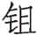\]吾：为太宰。庀：同“庇”，保护。府守：国库。

(21)司宫：宫内宦官之长。巷伯：主管宫中巷、寝门户的宦官。儆：戒备。

(22)二师：右师与左师。乡正：宋都有四乡，每乡一乡正，即乡大父。敬享：祭祀群神。

(23)祝宗：祝史之长。用马于四墉：杀马以祭四城神灵。墉，城。

(24)祀盘庚于西门之外：盘庚是殷商十世之君，宋人为远祖。他曾迁都于今河南安阳安阳河两岸之殷墟，宋都今商丘，殷墟在其西北，故祀于西门之外。

***【译文】***

鲁襄公九年春，宋国发生火灾。乐喜以司城之职主持国政。他派伯氏管辖城中所有街巷，凡是火没烧到的地方，统统把小屋拆掉，大屋涂上泥巴；预备运土器具，备好打水的绳、罐，备齐贮水器；根据各项工作的轻重安排人力，把水塘蓄满水，堆积灭火的沙土；巡视城防，修缮守卫工具，标明火势发展的趋向。派华臣调集常备的徒卒，命令隧正调集郊外各城堡士兵，奔赴火灾现场。派华阅主管右师属官，令他们恪尽职守。向戌主管左师属官，同样要恪尽职守。派乐遄管好刑器，属官也各守其职。派皇郧命令校正牵出马匹，工正推出战车，准备好衣甲兵器，守卫好武器库。派西吾保护好府库守备。命司宫、巷伯加强宫内警戒。左、右师命令四乡的乡正祭祀群神，祝宗在四城用马祭祀神灵，在西门外祭祀盘庚。

晋侯问于士弱曰①：“吾闻之，宋灾于是乎知有天道②，何故？”对曰：“古之火正③，或食于心④，或食于咮⑤，以出内火⑥。是故咮为鹑火，心为大火⑦。陶唐氏之火正阏伯居商丘⑧，祀大火，而火纪时焉⑨。相土因之⑩，故商主大火。商人阅其祸败之衅⑪，必始于火，是以日知其有天道也⑫。”公曰：“可必乎⑬？”对曰：“在道⑭。国乱无象⑮，不可知也。”

***【注释】***

①士弱：士渥浊之子，谥庄子。

②宋灾于是乎知有天道：宋因火灾而知天道。

③火正：上古火官名，职掌祭火星，为五行官之一。火正为祝融。

④食：配食，祔祭。心：星名。二十八宿之一，东方苍龙七宿的第五宿，有星三颗。

⑤咮（zhòu）：星宿名，柳宿的别名。

⑥出内火：杨伯峻曰：“有二义，一谓心宿二见与伏；一谓心宿二见，陶冶用火。”

⑦咮为鹑火，心为大火：柳宿即鹑火星，心宿为大火星。

⑧阏（è）伯：相传为高辛氏苗裔。

⑨火纪时：根据大火星的移动轨迹而定时节。

⑩相土：殷商先祖。

⑪阅：观察。衅：征兆。

⑫日：往日。

⑬必：肯定。

⑭在道：意思是上述经验不一定，在于国家治乱之道。

⑮国乱无象：国家动乱，上天不给预兆。

***【译文】***

晋悼公向士弱询问说：“我听说，宋国因发生了火灾，从而知天道，这是什么缘故呢？”士弱回答说：“古时候火正祭火星时，有的用心宿配祭，有的用柳宿配祭，因为火星运行于这两个星宿之间。因此柳宿又称鹑火，心宿又称大火。陶唐氏的火正阏伯居住在商丘，祭祀大火，并用火星来确定时节。相土继承了他的做法，所以商朝祭祀的主星是大火。商人考察他们祸乱败亡的预兆，一定从火灾开始，所以过去自以为掌握了天道。”悼公说：“可以肯定吗？”回答说：“不，还得看有道还是无道。国家动乱而上天不显示相应的预兆，那是无法预知的。”

9.2 夏，季武子如晋，报宣子之聘也①。

***【注释】***

①宣子之聘：范宣子聘鲁在去年。

***【译文】***

夏天，季武子去晋国，这是为了回报范宣子的聘问。

9.3 穆姜薨于东宫①。始往而筮之，遇《艮》之八②。史曰：“是谓《艮》之《随》。《随》，其出也③。君必速出④。”姜曰：“亡⑤。是于《周易》曰：‘《随》，元、亨、利、贞，无咎⑥。’元，体之长也⑦；亨，嘉之会也⑧；利，义之和也⑨；贞，事之干也⑩。体仁足以长人⑪，嘉德足以合礼⑫，利物足以和义⑬，贞固足以干事⑭。然，故不可诬也⑮，是以虽《随》无咎⑯。今我妇人，而与于乱⑰，固在下位，而有不仁⑱，不可谓元。不靖国家⑲，不可谓亨。作而害身⑳，不可谓利。弃位而姣(21)，不可谓贞。有四德者，《随》而无咎。我皆无之，岂《随》也哉(22)？我则取恶，能无咎乎？必死于此(23)，弗得出矣。”

***【注释】***

①穆姜薨于东宫：穆姜是襄公祖母，与叔孙侨如私通，曾逼成公去季孙、孟孙，不果，后被迫迁于东宫即被打入冷宫。参见成公十六年《传》。

②《艮》之八：《艮》之八即《艮》卦变为《随》卦，除第二爻不变外，其余五爻都变了。

③《随》，其出也：史官根据卦名的含义做解释，认为《随》卦是随人而行，有出走之象。

④君：指穆姜。

⑤亡：不。

⑥《随》，元、亨、利、贞，无咎：这是《随》卦卦辞。

⑦元，体之长也：元，首，它处于身体最高处。

⑧亨，嘉之会也：亨是享宴中主宾相会。亨，享。

⑨利，义之和也：利是道义的总和。

⑩贞，事之干也：诚信坚强是办好事情的根本。贞，信。干，本体。

⑪体仁足以长人：体现了仁就足以领导别人，才够得上“元”。

⑫嘉德足以合礼：有嘉德足以协调礼仪，才够得上“亨”。合，通“洽”，协调。

⑬利物足以和义：利物足以总括道义，才够得上“利”。利物，利人。

⑭贞固足以干事：诚信坚强足以办好事情，才够得上“贞”。按，以上是穆姜根据《随》卦卦辞指出元、亨、利、贞的意蕴。

⑮然，故不可诬也：这样，本不可以欺骗。然，这样。故，通“固”。诬，欺骗。

⑯是以虽《随》无咎：只有具备元、亨、利、贞四德，即便得到《随》卦也不会有灾祸。

⑰与于乱：指想要除去季氏、孟氏及欲废掉鲁成公。

⑱固在下位，而有不仁：处在下位而参与作乱。下位，古代男尊女卑，妇女处下位。不仁，指参与作乱。

⑲不靖国家：乱鲁而让国家不得安定。靖，安定。

⑳作而害身：如此作为，终被囚于东宫，是害了自身。

(21)弃位而姣：穆姜本应在夫死后守未亡人之道，当守太后之仪，反而修饰美色，私通叔孙侨如，是“弃位而姣”。姣，美，好。

(22)我皆无之，岂《随》也哉：穆姜自己也意识到四德均无，不能“无咎”，不可能离开东宫。

(23)必死于此：穆姜自料必死于东宫。

***【译文】***

穆姜在东宫去世。当初住进去的时候，曾占筮预测吉凶，得到《艮》卦变为八。太史说：“这叫做《艮》卦变为《随》卦。随，是出走的意思。您一定能很快出去。”穆姜说：“不。这卦象在《周易》里说：‘《随》，元、亨、利、贞，没有灾祸。’元，是躯体的最高处；亨，是嘉礼中的宾主相会；利，是道义的总和；贞，是诚信为事情的主体。体现了仁就足以领导别人，有嘉德足以协调礼仪，有利于众人就足以总括道义，本体坚固足可办好事情。这些本来都是不能欺骗的，因此虽然得到《随》卦而没有灾祸。现在我身为妇人而参与作乱，处在低下的地位而有没有仁德，不能说是元。使国家不安定，不能说是亨。做乱而自害身，不能说是利。不守本分而打扮得娇艳招摇，不能说是贞。有上面所说这四种德行的，即便得到《随》卦而可以没有灾祸。我四德俱无，难道能合于《随》卦的卦义吗？我自取邪恶，能够没有灾祸吗？肯定要死在这里，不可能出去了。”

9.4 秦景公使士雃乞师于楚①，将以伐晋，楚子许之。子囊曰：“不可。当今吾不能与晋争。晋君类能而使之②，举不失选③，官不易方④。其卿让于善，其大夫不失守⑤，其士竞于教⑥，其庶人力于农穑⑦。商工皂隶，不知迁业⑧。韩厥老矣，知禀焉以为政⑨。范匄少于中行偃而上之⑩，使佐中军。韩起少于栾黡，而栾黡、士鲂上之，使佐上军⑪。魏绛多功，以赵武为贤，而为之佐⑫。君明臣忠，上让下竞⑬。当是时也，晋不可敌⑭，事之而后可。君其图之！”王曰：“吾既许之矣⑮。虽不及晋⑯，必将出师。”秋，楚子师于武城⑰，以为秦援。秦人侵晋，晋饥，弗能报也⑱。

***【注释】***

①士雃（qiān）：秦国大夫。

②类能而使之：按人的能力区别使用。

③举不失选：举拔人才，得其所选。

④官不易方：任用官员不改变政策。方，法术，这里指政策、政令。

⑤不失守：不失职守。

⑥其士竞于教：士都努力于教训。

⑦庶人力于农穑：庶人致力于农事。

⑧迁业：改变职业。

⑨禀：继承，这里指韩厥退休后知接替他担任中军将。

⑩范匄少于中行偃而上之：范匄虽然年少，但中行偃让他高于自己。

⑪韩起少于栾黡，而栾黡、士鲂上之，使佐上军：中行偃让范匄佐中军，自己将上军。栾黡宜任上军佐，但他让于士鲂，士鲂又让于韩起。

⑫魏绛多功，以赵武为贤，而为之佐：魏绛本应将新军，但他让给了赵武，自己为新军佐。

⑬下：指士、庶人、工商、皂隶。竟：努力。

⑭晋不可敌：晋国国内安定，上下团结，无法与之对抗。

⑮吾既许之：我已经答应秦国出兵。

⑯虽不及晋：虽然不如晋国强大。

⑰武城：楚地，今河南南阳北。

⑱晋饥，弗能报也：晋国因饥荒不能还击。但明年还是伐秦。

***【译文】***

秦景公派士雃向楚国请求出兵，准备攻打晋国，楚共王答应了。子囊曰：“不行。目前我国不能和晋国对抗。晋国君主根据各人的能力加以使用，举荐人才没有不恰当的，任命官员没有改变政策法令。卿能把职位让给善人，大夫不失职守，士努力教育民众，百姓致力于农事。各行各业安心本职不想改变职业。韩厥已经退休，知继承其职当政。范匄比中行偃年轻，但中行偃让他地位在自己之上，让他辅佐中军。韩起比栾黡年轻，而栾黡、士鲂使他排位在自己之上，让他辅佐上军。魏绛功劳很多，却认为赵武贤能而甘愿做他的辅佐。国君贤明臣下忠诚，在上者谦让在下者努力。在目前这个时候，晋国是不可战胜的，只能事奉他为妙。请您认真考虑！”共王说：“我已经答应秦国了，我国虽然比不上晋国，但也一定要出兵。”秋天，楚共王驻军于武城，充当秦国的后援。秦国侵袭晋国，晋国正遭受饥荒，无力还击。

9.5 冬十月，诸侯伐郑①。庚午②，季武子、齐崔杼、宋皇郧从荀、士匄门于门③。卫北宫括、曹人、邾人从荀偃、韩起门于师之梁④。滕人、薛人从栾黡、士鲂门于北门⑤。杞人、郳人从赵武、魏绛斩行栗⑥。甲戌⑦，师于氾⑧，令于诸侯曰：“修器备⑨，盛糇粮⑩，归老幼，居疾于虎牢，肆眚⑪，围郑。”

***【注释】***

①诸侯伐郑：去年郑与楚讲和，又据襄公二十二年《传》子产之言得知，这年六月郑国曾朝楚，因此晋国讨伐郑国。

②庚午：十一日。

③季武子、齐崔杼、宋皇郧从荀、士匄门于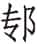（zhuān）门：这里指鲁、齐、宋军队跟随晋中军攻东门。门，郑都城的东门。

④卫北宫括、曹人、邾人从荀偃、韩起门于师之梁：卫、曹、邾军队随晋上军攻郑西门。梁，郑都城的西门。荀偃、韩起将上军。

⑤滕人、薛人从栾黡、士鲂门于北门：滕、薛军队随晋下军攻郑北门。

⑥杞人、郳人从赵武、魏绛斩行栗：杞、郳军随晋新军砍伐道路两旁的栗树。郳，即《经》中的小邾。行栗，道路两旁的栗树。斩行栗，或开路，或用来做器材。

⑦甲戌：十五日。

⑧氾（ｆán）：东氾水，在今河南中牟西南。

⑨器备：攻守之器。

⑩糇（hóu）粮：干粮。

⑪肆眚（shěnɡ）：宽赦有罪的人。肆，宽免。眚，过错，罪。

***【译文】***

冬十月，诸侯攻打郑国。二十一日，季武子、齐国崔杼、宋国皇郧随从荀、士匄进攻门。卫国北宫括、曹国和邾国人马随从荀偃、韩起攻打师之梁门。滕国和薛国军队跟从栾黡、士鲂进攻北门。杞国、小邾国人马随同赵武、魏绛砍伐路边的栗树。十五日，军队驻扎在氾水边上，晋悼公命令诸侯道：“整修好作战器械，备足干粮，把老人小孩送回去，把有病的人留在虎牢，赦免有罪的人，包围郑国。”

郑人恐，乃行成。中行献子曰①：“遂围之，以待楚人之救也，而与之战②。不然，无成。”知武子曰③：“许之盟而还师，以敝楚人④。吾三分四军⑤，与诸侯之锐，以逆来者，于我未病，楚不能矣。犹愈于战⑥。暴骨以逞⑦，不可以争。大劳未艾⑧。君子劳心，小人劳力，先王之制也。”诸侯皆不欲战，乃许郑成。十一月己亥⑨，同盟于戏，郑服也。

***【注释】***

①中行献子：即荀偃。

②以待楚人之救也，而与之战：荀偃主张待楚军援郑时与楚决战，败楚而使郑国最终服晋。

③知武子：即知。

④许之盟而还师，以敝楚人：同意郑求和的请求，楚国一定会因讨伐郑国而疲惫。敝，疲惫。

⑤三分四军：晋有中、上、下、新四军，而分为三部，轮番作战。

⑥犹愈于战：胜过围郑等待楚军决战的做法。

⑦暴骨以逞：决战必有死亡，以白骨暴露于野求得一时的快意。

⑧大劳未艾：更大的疲劳还没有完结。艾，止息。

⑨己亥：初十。

***【译文】***

郑国人害怕了，便求和。荀偃说：“完成对郑国的包围，等待楚国人来救郑的时候再和他交战。不然的话，就没有真正的顺服。”知说：“应同意他们结盟的请求然后退兵，让楚国攻打郑国而困乏。我们把四军分为三部分，会同诸侯精锐部队共同迎击前来的楚军，对我们来说不疲乏，楚国人却承受不了。这比与楚国决战来得好。暴露骸骨以求一时的快意，不能用这样的方法与楚军争强。更大的疲劳还没有结束。君子用智，小人用力，这是先王的规制。”诸侯也都不想作战，于是就答应郑国媾和。十一月初十，诸侯在戏地结成同盟，因为郑国已经顺服了。

将盟，郑六卿，公子、公子发、公子嘉、公孙辄、公孙虿、公孙舍之及其大夫、门子①，皆从郑伯。晋士庄子为载书②，曰：“自今日既盟之后，郑国而不唯晋命是听③，而或有异志者，有如此盟④。”公子趋进曰：“天祸郑国，使介居二大国之间⑤。大国不加德音，而乱以要之⑥，使其鬼神不获歆其禋祀⑦，其民人不获享其土利，夫妇辛苦垫隘⑧，无所厎告⑨。自今日既盟之后，郑国而不唯有礼与强可以庇民者是从⑩，而敢有异志者，亦如之。”荀偃曰：“改载书⑪。”公孙舍之曰：“昭大神要言焉⑫。若可改也，大国亦可叛也。”知武子谓献子曰：“我实不德，而要人以盟⑬，岂礼也哉！非礼，何以主盟？姑盟而退，修德息师而来⑭，终必获郑，何必今日？我之不德，民将弃我，岂唯郑？若能休和⑮，远人将至，何恃于郑？”乃盟而还。

***【注释】***

①公子：即子驷。公子发：即子国。公子嘉：即子孔。公孙辄：即子耳。公孙虿：即子（jiǎo）。公孙舍之：即子展。门子：卿的嫡子。

②士庄子：即士弱。载书：盟书。

③而：如果。

④有如此盟：依照盟书所记处罚。

⑤介居：夹处。

⑥乱：战乱。要：要挟。

⑦歆：祭祀时神灵先享受其气。禋（yīn）祀：祭祀。

⑧垫隘：困顿，羸（léi）弱。

⑨无所厎（zhǐ）告：无处诉说。厎告，转达话语。子驷对晋以兵相逼表示不满。

⑩郑国而不唯有礼与强可以庇民者是从：意思是谁有礼而且强大，可以保护郑国，郑国就服从他。

⑪改载书：荀偃反对子驷的话，所以提出修改盟辞。

⑫昭大神要言：盟约已经报告神灵了。要言，指盟约。

⑬要：要挟。

⑭息师：休整军队。

⑮休和：安逸和睦。

***【译文】***

将要结盟时，郑国的六卿公子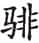、公子发、公子嘉、公孙辄、公孙虿、公孙舍之和大夫、卿的嫡子都跟随郑简公。晋国士庄子制作盟书，说：“从今天盟誓以后，郑国如果不对晋国唯命是听，或者有别的想法，就将同这份盟书所说的那样。”公子快步上前说：“上天降祸郑国，让我国夹处两个大国之间。大国不对我们友好，反而以战乱逼迫我国结盟，使我们的鬼神不能得到祭祀，我们的人民不能享受土地出产之物，不分男女夫妇都那么辛苦羸弱，无处哭诉。从今日结盟以后，郑国要是不完全服从对我们有礼以及强大可以保护我们的国家，反而敢有别的打算的话，也如同这份盟书所记的一样。”荀偃说：“修改这盟书。”公孙舍之说：“已经把盟誓清楚报告给神明了。要是可以改动，大国也就可以背叛了。”知对荀偃说道：“实在是我们没有德行，反而用盟约来要挟别人，岂是合乎礼的！不合礼，凭什么主持盟会？暂且结盟而退，修养德行、休整军队后再来，一定能得到郑国，何必非要在今天不可呢？如果我们没有德行，人民将会抛弃我们，岂止是郑国？如果能够安逸和睦，远方的人将会归附，还要凭借郑国干什么？”于是结盟后回国了。

9.6 晋人不得志于郑①，以诸侯复伐之。十二月癸亥②，门其三门③。闰月戊寅④，济于阴阪⑤，侵郑。次于阴口而还⑥。子孔曰：“晋师可击也，师老而劳，且有归志⑦，必大克之。”子展曰：“不可。”

***【注释】***

①晋人不得志于郑：由上面子驷、子展的话，可以看出郑国并不完全服晋，因此说不得志于郑。

②癸亥：初五。

③门其三门：再进攻东、西、北门，独留下南门不攻，显然是用以待楚兵的到来。

④闰月：杜预认为应是“门五日”之误，应可信从。戊寅：二十日。

⑤阴阪：洧水渡口，在今河南新郑西稍北。

⑥阴口：在阴阪北面，阴阪对岸。

⑦师老而劳，且有归志：晋军连续作战已疲惫，无心再战。

***【译文】***

晋国没有能使郑国完全顺服，所以带领诸侯再次进攻郑国。十二月初五，攻打郑国都的三面城门，攻了五天。十二月二十日，在阴阪渡河，侵袭郑国。驻扎在阴口然后班师。子孔说：“晋军可以攻击，他们长期在外很疲劳了，而且萌生了撤回的念头，一定能大败他们。”子展曰：“不行。”

9.7 公送晋侯，晋侯以公宴于河上，问公年①。季武子对曰：“会于沙随之岁②，寡君以生。”晋侯曰：“十二年矣！是谓一终，一星终也③。国君十五而生子。冠而生子，礼也④。君可以冠矣！大夫盍为冠具⑤？”武子对曰：“君冠，必以祼享之礼行之⑥，以金石之乐节之⑦，以先君之祧处之⑧。今寡君在行，未可具也⑨。请及兄弟之国而假备焉。”晋侯曰：“诺。”公还，及卫，冠于成公之庙⑩，假钟磬焉，礼也。

***【注释】***

①问公年：问鲁襄公年龄。

②会于沙随之岁：在成公十六年。

③是谓一终，一星终也：一终，一星终，即十二年。星指木星，即岁星。岁星十二年行一周天。

④冠而生子，礼也：冠，古代由童子变为成人所举行的礼节，冠礼之后才能结婚生子。

⑤盍：何不。冠具：行冠礼的用具。

⑥祼（ɡuàn）享之礼：有祼之仪式的享礼。祼，以配上香料煮成的酒倒于地，使受祭者闻到香气。

⑦节之：表示有节度。

⑧以先君之祧（tiāo）处之：冠礼必须在祖庙举行。祧，祖庙。

⑨今寡君在行，未可具也：行，道路。未可具，不能具备冠礼之具。

⑩成公：卫成公。

***【译文】***

襄公送晋悼公，晋悼公为襄公在黄河边设宴，打听襄公的年龄。季武子回答说：“在沙随相会那年，我们国君出生。”晋悼公说：“那就是十二年了！这叫做一终，就是岁星运行了一周天。国君十五岁即可生孩子。行冠礼后生子，是合乎礼仪的，贵国国君可以举行冠礼了！大夫何不准备好行冠礼的用品？”季武子回答说：“国君行冠礼，一定要用祼享这种礼仪，用钟磬的音乐来节度，还要在前代君主的宗庙中举行。现在敝国君正在行途中，无法具备行冠礼的器具。请在到达兄弟国家以后向他们借用吧。”晋悼公说：“可以。”襄公回国途中，到达卫国，在卫成公庙里举行冠礼，借用了钟磬，这是符合礼仪的。

9.8 楚子伐郑，子驷将及楚平。子孔、子曰：“与大国盟①，口血未干而背之②，可乎？”子驷、子展曰：“吾盟固云：‘唯强是从。’今楚师至，晋不我救，则楚强矣。盟誓之言，岂敢背之？且要盟无质③，神弗临也④。所临唯信⑤。信者，言之瑞也⑥，善之主也，是故临之。明神不蠲要盟⑦，背之可也。”乃及楚平。公子罢戎入盟⑧，同盟于中分⑨。楚庄夫人卒⑩，王未能定郑而归⑪。

***【注释】***

①大国：指晋国。

②口血未干：指刚结盟不久，因为结盟必歃（shà）血。

③要盟：要挟之盟。质：诚信。

④临：降临。

⑤所临唯信：诚信之盟，神才降临。

⑥瑞：符信，凭证。

⑦明神不蠲（juān）要盟：明神认为要盟不清洁。蠲，清洁。

⑧罢戎入盟：罢戎入郑国都城结盟。罢戎，楚国大夫。

⑨中分：郑国都城中里名。

⑩楚庄夫人：楚共王之母。

⑪王未能定郑而归：共王因母亲去世，未能安定郑国便匆忙回国。

***【译文】***

楚共王攻打郑国，子驷准备和楚国讲和。子孔、子说：“和大国结盟，口血还没干就背弃它，行吗？”子驷、子展说：“我们的盟约本来就说：‘只服从强国。’如今楚国军队打来了，晋国不救援我们，那么楚国就是强大的了。盟誓的话，岂敢背弃？况且在强力要挟下形成的盟誓没有诚信，神灵不会降临。神灵只降临有诚信的盟会。信用是言语的凭证，善良的主体，所以神灵会降临。明察一切的神认为在受要挟的情况下举行的盟会不干净，背弃它是完全可以的。”于是和楚国媾和。楚国派公子罢戎进入郑国结盟，双方在中分盟誓。楚庄王夫人去世，共王没能安定郑国就匆匆回国了。

9.9 晋侯归，谋所以息民①。魏绛请施舍②，输积聚以贷③。自公以下，苟有积者，尽出之。国无滞积④，亦无困人⑤，公无禁利⑥，亦无贪民⑦。祈以币更⑧，宾以特牲⑨，器用不作⑩，车服从给⑪。行之期年⑫，国乃有节⑬。三驾而楚不能与争⑭。

***【注释】***

①谋所以息民：谋求让百姓休养生息的办法。

②施舍：赐予恩惠。

③输积聚以贷：把积聚的财物运出来借给百姓。输，转运。

④国无滞积：财货流通，都散给了百姓。

⑤亦无困人：百姓也没有困乏者。

⑥公无禁利：不禁止百姓牟利。

⑦亦无贪民：也没有贪心的百姓。

⑧祈以币更：祈祷以币代替牺牲。币，指皮、裘、缯、帛等物。

⑨宾以特牲：招待宾客只用一种牲畜。特，牲一头。

⑩器用不作：不作新器，只用旧物。

⑪从给：够用即可。

⑫期年：一周年。

⑬有节：有法度，走上正轨。

⑭三驾：三次兴师，指襄公十年师于牛首，十一年夏师于向，秋观兵于郑国东门。驾，驾兵车。

***【译文】***

晋悼公回国后，谋求让百姓休养生息的对策。魏绛请求施予恩惠，把积聚的财物拿出来借给百姓。从悼公以下，有积蓄的，全都拿了出来。国内不再有不流通的财物，也没了困乏的民众，公家不禁止百姓牟利，也没有贪婪的百姓。祈祷时用财币代替牺牲，待客只用一种牲畜，新的器物不再制作，车马服饰只求够用。这样实行了一年，国家便有了法度。三次出兵楚国都不能和晋国抗衡。

# 十年

***【经】***

10.1 十年春①，公会晋侯、宋公、卫侯、曹伯、莒子、邾子、滕子、薛伯、杞伯、小邾子、齐世子光会吴于柤②。

10.2 夏，五月甲午③，遂灭偪阳④。

10.3 公至自会。

10.4 楚公子贞、郑公孙辄帅师伐宋。

10.5 晋师伐秦。

10.6 秋，莒人伐我东鄙。

10.7 公会晋侯、宋公、卫侯、曹伯、莒子、邾子、齐世子光、滕子、薛伯、杞伯、小邾子伐郑。

10.8 冬，盗杀郑公子、公子发、公孙辄。

10.9 戍郑虎牢⑤。

10.10 楚公子贞帅师救郑。

10.11 公至自伐郑。

***【注释】***

①十年：鲁襄公十年当周灵王九年，前563。

②柤（zhā）：楚地，在今江苏邳县北稍西的泇口。

③甲午：初八。

④偪（ｆù）阳：妘姓小国，在邳县。

⑤戍郑虎牢：晋军屯驻在郑国的虎牢。

***【译文】***

鲁襄公十年春，襄公会同晋悼公、宋平公、卫献公、曹成公、莒犁比公、邾宣公、滕成公、薛伯、杞孝公、小邾穆公、齐太子光在柤地与吴国人相会。

夏五月初八，灭了偪阳。

襄公从柤之会回国。

楚国公子贞、郑国公孙辄率领军队攻打宋国。

晋国军队进攻秦国。

秋，莒国军队侵袭我国东部边境。

襄公会合晋悼公、宋平公、卫献公、曹成公、莒犁比公、邾宣公、齐太子光、滕成公、薛伯、杞孝公、小邾穆公攻打郑国。

冬，盗贼杀死郑国公子、公子发、公孙辄。

戍守郑国虎牢。

楚国公子贞统率军队救援郑国。

襄公从攻打郑国前线回国。

***【传】***

10.1 十年春，会于柤，会吴子寿梦也①。

***【注释】***

①吴子寿梦：名乘。晋约诸侯会吴，意在联吴制楚。

***【译文】***

鲁襄公十年春，诸侯在柤相会，这是为了会见吴王寿梦。

三月癸丑①，齐高厚相大子光，以先会诸侯于钟离②，不敬。士庄子曰：“高子相大子以会诸侯，将社稷是卫，而皆不敬，弃社稷也，其将不免乎③！”

***【注释】***

①癸丑：二十六日。

②钟离：古地名。在今安徽凤阳东稍北。

③不免：不免于祸。这是在为襄公十九年齐杀高厚、二十五年太子光（后为齐庄公）被崔杼所杀埋伏笔。

***【译文】***

三月二十六日，齐国高厚作为太子光的相礼，与诸侯先期在钟离会见，表现得不恭敬。士庄子说：“高厚相礼太子来和诸侯会面，是为了保卫自己的国家，二人却都表现出不恭敬，这是丢弃国家，恐怕将不免于祸！”

夏四月戊午⑤，会于柤。

***【注释】***

①戊午：初一。

***【译文】***

夏四月初一，在柤相会。

10.2 晋荀偃、士匄请伐偪阳，而封宋向戌焉①。荀曰：“城小而固，胜之不武，弗胜为笑。”固请②。丙寅③，围之，弗克。孟氏之臣秦堇父辇重如役④。偪阳人启门，诸侯之士门焉⑤。县门发⑥，郰人纥抉之以出门者⑦。狄虒弥建大车之轮⑧，而蒙之以甲，以为橹⑨。左执之，右拔戟，以成一队⑩。孟献子曰：“《诗》所谓‘有力如虎’者也⑪。”主人县布⑫，堇父登之，及堞而绝之⑬。队⑭，则又县之，苏而复上者三⑮。主人辞焉，乃退⑯。带其断以徇于军三日⑰。

***【注释】***

①封宋向戌：宋一向事晋，而向戌为宋国贤臣，因此请将偪阳送给向戌作为封邑。

②固请：荀偃等坚决要求。

③丙寅：初九。

④秦堇（jǐn）父：鲁国孟孙氏家奴。辇：用人拉车。重：辎重车。如役：到达战地。

⑤诸侯之士门：因城门开启，诸侯军队乘机进攻。

⑥县（xuán）门：内城闸门。发：放下。

⑦郰（zōu）人纥抉之以出门者：郰人纥高举城门让攻入城里的士卒出来。郰，在今山东曲阜一带。纥，叔梁纥，鲁国郰邑大夫，孔子之父。抉之，高举内城闸门。

⑧狄虒（sī）弥：鲁国人。建大车之轮：把大车轮子立起来。大车，平地载重之车，其轮高古尺九尺，轮周则过二丈八尺。

⑨橹：大盾。

⑩队：百人为队。这是冲锋陷阵的步兵。

⑪《诗》所谓“有力如虎”者也：郰人纥、秦堇父与狄虒弥都是勇武之士，所以这样称赞他们。引《诗》见《诗经·国风·邶风·简兮》。

⑫主人：指偪阳守将。县布：把长布从城上垂下来。

⑬堞：女墙。绝：割断。

⑭队：同“坠”。

⑮苏而复上者三：秦堇父苏醒后再缘布登城，反复三次。

⑯主人辞焉，乃退：偪阳人赞赏其勇，不再悬布。

⑰带其断以徇于军：秦堇父以断布为带在军中显示其勇。

***【译文】***

晋国荀偃、士匄请求攻打偪阳，再把它作为宋国向戌的封邑。荀说：“这座城很小但很坚固，即便攻下也算不上勇武，而攻不下可就要被人耻笑。”荀偃、士匄一再请求。初九，包围偪阳，攻不下来。孟氏的家臣秦堇父用人力拉了辎重车来到战场。偪阳人打开城门，诸侯的军队乘机冲进去。内城闸门放下，郰邑大夫叔梁纥双手托着闸门让攻进城的人马撤出。狄虒弥把大车轮子拆下立起，蒙上皮甲，作为大盾牌。他左手持盾，右手执戟，领一队步兵进攻敌人。孟献子说：“这就是《诗》上所说的‘有力如虎’的人啊。”偪阳里的人把布从城上垂下来引诱对方，秦堇父拉着布登城，爬到接近城垛时，守城者把布割断。秦堇父跌落城下，守城人又把布垂下来，秦堇父苏醒又往上爬，前后重复了三次。守城人表示钦佩，便不再垂布，退下城去。秦堇父把断布作为带子，在军营夸示了三天。

诸侯之师久于偪阳，荀偃、士匄请于荀曰：“水潦将降①，惧不能归，请班师②。”知伯怒③，投之以机④，出于其间⑤，曰：“女成二事⑥，而后告余。余恐乱命⑦，以不女违。女既勤君而兴诸侯，牵帅老夫以至于此⑧，既无武守，而又欲易余罪⑨，曰：‘是实班师，不然克矣⑩。’余羸老也，可重任乎⑪？七日不克，必尔乎取之⑫！”五月庚寅⑬，荀偃、士匄帅卒攻偪阳，亲受矢石⑭。甲午⑮，灭之。书曰“遂灭偪阳”，言自会也⑯。

***【注释】***

①水潦：雨季。

②班师：退兵。班，还。

③知伯：即荀，这时为中军帅。

④机：发箭的弩机。

⑤出于其间：从二人中间飞过。

⑥女：同“汝”。二事：指攻占偪阳、封赐向戌。

⑦乱命：将帅各执己见。

⑧老夫：知自称。宣公十二年晋、楚邲之战，知曾经参战，其时必已成年。至此又历三十四年，计其年当在五十以上，故自称“老夫”。

⑨易余罪：归罪于我。易，施，延及。

⑩是实班师，不然克矣：是荀要退兵，不然已经攻克了。按，这是荀假设荀偃、士匄二人归罪自己的设辞。

⑪重（ｃhónɡ）任：再次承担罪责，因为在邲（bì）之战中荀曾被俘，这次任主帅再不攻克，就是“重任”了。

⑫必尔乎取之：一定要在限期内攻下，不然以你们抵罪。尔乎，于尔。

⑬庚寅：初四。

⑭亲受矢石：亲自出马冲锋攻城。矢，箭。石，也是守城武器。

⑮甲午：初八。

⑯书曰“遂灭偪阳”，言自会也：意思是自柤之会后即攻占偪阳。

***【译文】***

诸侯人马长时间滞留偪阳，荀偃、士匄向荀请求说：“雨季快到了，恐怕到时候不能回去，请下令退兵吧。”荀发怒，把弩机向他们扔过去，从两人中间穿过，说道：“等你们把两件事办成了再来跟我说话。当初我怕我们之间意见不一致而乱了军令，因此没有违背你们的意愿。你们既已劳动了国君、调动了诸侯的军队，连我这老头子都被拉到这里，既不坚持进攻，又想要回去后归罪于我，说：‘实在是荀要撤兵，不然早已攻下了。’我已老弱，岂能再次承担罪责？要是七天不能攻克，一定要以你们的脑袋抵罪！”五月初四，荀偃、士匄率步兵攻打偪阳，二人亲冒箭石战斗在第一线。初八，攻占偪阳。《春秋》记载说“遂灭偪阳”，指的是从柤地相会之后就开始攻打偪阳。

以与向戌，向戌辞曰：“君若犹辱镇抚宋国，而以偪阳光启寡君①，群臣安矣，其何贶如之②？若专赐臣，是臣兴诸侯以自封也③，其何罪大焉？敢以死请。”乃予宋公。

***【注释】***

①光启寡君：使我的国境扩大疆土。光启，即广启，扩大疆土。

②何贶（ｋｕànɡ）如之：所受赏赐没有比这更大的了。贶，赐予。

③兴诸侯以自封：调动诸侯军队为自己夺得封地。

***【译文】***

晋国要把偪阳封给向戌，向戌辞谢说：“如果承蒙贵国国君镇抚宋国，而以偪阳来扩大敝国君的疆土，群臣们就放心了，还有什么比得上这样的赏赐呢？如果只是专门赐给下臣我，那就成了下臣劳动诸侯的军队而为自己求取封地，有什么罪过比这更大的呢？我谨以一死来相请。”于是把偪阳交给了宋平公。

宋公享晋侯于楚丘①，请以《桑林》②。荀辞③。荀偃、士匄曰：“诸侯宋、鲁，于是观礼④。鲁有禘乐⑤，宾祭用之⑥。宋以《桑林》享君，不亦可乎⑦？”舞⑧，师题以旌夏⑨。晋侯惧而退入于房⑩。去旌⑪，卒享而还。及著雍⑫，疾⑬。卜，桑林见⑭。荀偃、士匄欲奔请祷焉⑮。荀不可，曰：“我辞礼矣，彼则以之⑯。犹有鬼神⑰，于彼加之。”晋侯有间⑱，以偪阳子归，献于武宫⑲，谓之夷俘⑳。偪阳，妘姓也。使周内史选其族嗣(21)，纳诸霍人(22)，礼也。

***【注释】***

①楚丘：即宋都商丘，在今山东曹县东南。

②《桑林》：桑林本是桑山之林，商汤曾在此处祷雨，后殷商及宋国奉为圣地，立神以祀之。殷因有《桑林》之乐，乃天子之乐，宋国沿用了。

③荀辞：荀认为不敢当而辞让。

④诸侯宋、鲁，于是观礼：诸侯之中，宋为殷王之后，鲁为周公之后，都用的是天子礼乐，所以可以观礼。

⑤禘（dì）乐：禘祭时所用之乐。禘，三年大祭。

⑥宾祭用之：大祭与享大宾时都用此乐。

⑦宋以《桑林》享君，不亦可乎：既然宾能享鲁国禘乐，那晋悼公也能享《桑林》之舞。

⑧舞：舞《桑林》。

⑨师题以旌夏：意谓乐队首领举旌夏引乐人以入。师，乐队之帅。题，标志。旌夏，一种旌旗。以雉羽缀于竿首，羽又染以五色。

⑩房：指正屋东西两旁的屋子。

⑪去旌：撤除旌夏，仍舞《桑林》。

⑫著雍：晋国地名。

⑬疾：晋悼公生病。

⑭桑林见：这里指占卜晋悼公的疾病，从卜兆里看到桑林之神。

⑮欲奔请祷：想折回宋国祈祷。

⑯我辞礼矣，彼则以之：我们已经辞去《桑林》之礼，是宋国人还在用它。以，用。

⑰犹：假如。

⑱有间：不经祈祷而病愈。

⑲武宫：晋武公庙，晋国作为太庙，大事必在太庙举行，献俘也在太庙。

⑳夷俘：讳言中国，所以称其为夷。

(21)选其族嗣：不用偪阳子的近亲，而选取其宗族中的后嗣。

(22)霍人：晋邑，在今山西繁峙东郊。

***【译文】***

宋平公在楚丘设享礼招待晋悼公，请求使用《桑林》乐舞。荀谢绝了。荀偃、士匄说：“诸侯中的宋国、鲁国，可以在那里观看礼仪。鲁国有禘乐，宴请重要宾客或重大祭祀使用。宋国用《桑林》乐舞招待国君，不也是可以的吗？”乐舞开始，乐队首领手举旌夏之旗带领乐队进来。晋悼公因害怕而退入厢房。撤去旌夏，悼公才参加享礼到结束，然后回国。到达著雍，悼公生病。占卜，从卜兆中发现是桑林神在作怪。荀偃、士匄要奔往宋国去祈祷请求。荀不同意，说：“我们已经辞谢这一礼仪了，是他们一定要这么做。如果有鬼神的话，应该把灾祸加给他们。”晋悼公病愈，带着偪阳国君回国，奉献于武宫，称之为夷人俘虏。偪阳是妘姓国。悼公让周内史选择妘姓宗族中的后人，把他们安顿在霍人，这是合乎礼仪的。

师归，孟献子以秦堇父为右①。生秦丕兹②，事仲尼。

***【注释】***

①以秦堇父为右：秦堇父有勇力，让他任车右之职。

②秦丕兹：或曰其即为《史记·仲尼弟子列传》之秦商。《孔子家语·七十二弟子解》云“秦商，鲁人，字不兹”。

***【译文】***

军队回国，孟献子让秦堇父担任车右。秦堇父生下秦丕兹，拜孔子为师。

10.3 六月，楚子囊、郑子耳伐宋①，师于訾毋②。庚午③，围宋，门于桐门④。

***【注释】***

①楚子囊、郑子耳伐宋：楚、郑联军伐宋，其实是在向晋国挑衅。

②訾毋：宋地，在今河南鹿邑南。

③庚午：十四日。

④桐门：宋国北门。

***【译文】***

六月，楚国子囊、郑国子耳讨伐宋国，驻兵于訾毋。十四日，包围宋国，进攻桐门。

10.4 晋荀伐秦，报其侵也①。

***【注释】***

①报其侵：报复去年秦国对晋国的侵犯。

***【译文】***

晋国荀攻打秦国，报复它入侵晋国。

10.5 卫侯救宋，师于襄牛①。郑子展曰：“必伐卫，不然，是不与楚也。得罪于晋，又得罪于楚，国将若之何？”子驷曰：“国病矣②！”子展曰：“得罪于二大国，必亡。病，不犹愈于亡乎？”诸大夫皆以为然。故郑皇耳帅师侵卫③，楚令也④。

***【注释】***

①襄牛：卫国东部边境，在今山东范县。

②病：困乏。

③郑皇耳：郑皇戌儿子。

④楚令：侵卫也是奉楚国的命令。

***【译文】***

卫献公援救宋国，屯兵襄牛。郑国子展说：“一定要进攻卫国，不然的话，就是不听从楚国。得罪了晋国，又得罪了楚国，难以想象国家将会怎么样？”子驷说：“国家已经很困乏了！”子展说：“得罪两个大国，国家必亡。困乏难道不比亡国强吗？”大夫们认为子展的话有道理。所以郑皇耳率领军队进攻卫国，这也是奉了楚国的命令。

孙文子卜追之①，献兆于定姜②。姜氏问繇③。曰：“兆如山陵，有夫出征，而丧其雄④。”姜氏曰：“征者丧雄，御寇之利也。大夫图之！”卫人追之，孙蒯获郑皇耳于犬丘⑤。

***【注释】***

①孙文子：即孙林父，时为卫国的执政。卜追之：为追逐郑国军队而占卜。

②定姜：卫定公之妻，献公之母，成公十四年曾劝卫定公接纳孙林父。

③繇（zhòu）：兆辞。兆是烧灼龟壳的裂纹，各有占辞。

④兆如山陵，有夫出征，而丧其雄：这三句为繇辞，意思是兆如山陵，有人出国征伐，将丧其英雄，说明卫军追赶郑军将大吉。

⑤孙蒯：孙林父之子。

***【译文】***

孙文子用占卜决定是否追赶郑国，把卜兆拿给定姜看。定姜问繇辞怎么说。孙文子说：“征兆如同山陵，有人出外征战，将丧其英雄。”定姜说：“出征者丧失其雄，这对御敌者是吉利的。大夫请考虑吧！”卫国人追逐郑军，孙蒯在犬丘擒获了郑国的皇耳。

10.6 秋七月，楚子囊、郑子耳伐我西鄙①。还，围萧②。八月丙寅③，克之。九月，子耳侵宋北鄙。孟献子曰：“郑其有灾乎！师竞已甚④。周犹不堪竞，况郑乎⑤？有灾，其执政之三士乎⑥！”

***【注释】***

①楚子囊、郑子耳伐我西鄙：楚、郑伐宋之后侵鲁。

②萧：宋国城邑，在今安徽萧县北稍西。

③丙寅：十一日。

④竞：相争。已：太。

⑤周犹不堪竞，况郑乎：以周天子之尊尚且不堪屡屡用兵，何况郑国。

⑥有灾，其执政之三士：因为当时郑简公年幼，有灾必定降于三位执政者身上。三士，指子驷、子国、子耳三人，这是在为下面三人被杀埋下伏笔。士，春秋时期卿大夫也称为士，到了战国，高级官吏泛称士大夫。

***【译文】***

秋七月，楚国子囊、郑国子耳袭击我国西部边境。回兵时包围了萧地。八月十一日，攻占萧。九月，子耳侵犯宋国北部边境。孟献子说：“郑国恐怕要有灾难了！军队征战太频繁了。周天子尚且经不起一再用兵，更何况郑国呢？要有灾祸的话，恐怕将落在执政的三位大夫头上吧！”

10.7 莒人间诸侯之有事也①，故伐我东鄙。

***【注释】***

①间：钻空子，乘机。有事：指当时晋、楚相争，鲁、宋等都卷入。

***【译文】***

莒国乘诸侯有战事的空子，侵犯我国东部边境。

10.8 诸侯伐郑。齐崔杼使大子光先至于师，故长于滕①。己酉②，师于牛首③。

***【注释】***

①齐崔杼使大子光先至于师，故长于滕：这是解释《经》文中齐国太子光所以会排在滕国国君的前面，是由于晋悼公要与楚争霸，一定要借助齐国的力量，故以太子光先到为理由把他排在前面。

②己酉：二十五日。

③牛首：郑地，在今河南通许稍北。

***【译文】***

诸侯讨伐郑国。齐国崔杼让太子光先到达军队，所以名次排在了滕国国君的前面。七月二十五日，军队驻扎在牛首。

10.9 初，子驷与尉止有争①，将御诸侯之师而黜其车②。尉止获③，又与之争。子驷抑尉止曰④：“尔车非礼也⑤。”遂弗使献⑥。初，子驷为田洫⑦，司氏、堵氏、侯氏、子师氏皆丧田焉⑧，故五族聚群不逞之人⑨，因公子之徒以作乱⑩。

***【注释】***

①尉止：郑国大夫。

②御诸侯之师：抵御驻扎在牛首的各国军队。黜其车：减少其所率的兵车。

③获：俘获敌人。

④抑：压抑，有意限制。

⑤尔车非礼：你的战车过多，超过规定。

⑥弗使献：不让献俘。

⑦田洫（xù）：田间沟洫及田塍。

⑧司氏、堵氏、侯氏、子师氏皆丧田：子驷修筑水沟田塍侵占了以上四氏之田。

⑨五族：指尉止与上述四氏，他们都怨恨子驷。不逞：不快。

⑩公子之徒：指襄公八年子驷所杀子狐、子熙、子侯、子丁等的党羽。

***【译文】***

起初，子驷和尉止有争执，在将要抵御诸侯军队的时候减少了尉止的兵车。尉止俘获敌人，子驷又和他争功。子驷压制尉止说：“你的兵车过多不合礼制。”于是不让他献俘。当初，子驷开挖田沟，司氏、堵氏、侯氏、子师氏的田地都受损，因此这五族汇聚一伙对子驷不满的人，依托公子的徒党发动叛乱。

于是子驷当国①，子国为司马，子耳为司空，子孔为司徒。冬十月戊辰②，尉止、司臣、侯晋、堵女父、子师仆帅贼以入，晨攻执政于西宫之朝，杀子驷、子国、子耳，劫郑伯以如北宫③。子孔知之，故不死④。书曰“盗”，言无大夫焉⑤。

***【注释】***

①于是：当此之时。当国：掌握国政。

②戊辰：十四日。

③如：往。北宫：诸侯之宫有东宫、西宫、北宫。西宫为君臣治事场所。

④子孔知之，故不死：子孔事先知道此乱，但不告，只是自己免于难。子孔，公子嘉。

⑤书曰“盗”，言无大夫焉：尉止等五人都是士，没有卿大夫参与此乱，因此《经》文记载为“盗”。

***【译文】***

这时子驷执掌国政，子国任司马，子耳任司空，子孔任司徒。冬十月十四日，尉止、司臣、侯晋、堵女父、子师仆带领叛贼攻入宫门，清晨在西宫的朝堂攻击执政，杀死子驷、子国、子耳，劫持郑简公进入北宫。子孔事先知道这件事，所以免于一死。《春秋》记载说“盗”，是说没有大夫参与这次叛乱。

子西闻盗①，不儆而出②，尸而追盗③，盗入于北宫，乃归授甲。臣妾多逃，器用多丧④。子产闻盗⑤，为门者⑥，庀群司⑦，闭府库，慎闭藏，完守备，成列而后出⑧，兵车十七乘，尸而攻盗于北宫。子帅国人助之⑨，杀尉止、子师仆，盗众尽死⑩。侯晋奔晋，堵女父、司臣、尉翩、司齐奔宋⑪。

***【注释】***

①子西：公孙夏，子驷之子。

②儆：戒备。

③尸：收敛尸骨。

④臣妾多逃，器用多丧：子西家臣及婢妾大多逃走，器物丧失，所以无法授甲追盗。

⑤子产闻盗：子产之父子国也被杀。

⑥为门者：设置守门人，严禁出入。

⑦庀（pǐ）群司：配齐所有官员。

⑧成列而后出：以私族之兵列队而出。

⑨子：公孙虿。

⑩盗众：指上述“群不逞”之人。

⑪尉翩：尉止之子。司齐：司臣之子。

***【译文】***

子西听说有叛乱，不加戒备就出来了，收敛好其父尸骨就去追赶叛乱分子。叛贼进入北宫，他回去打算准备好武器再来。结果家臣妾婢多已逃走，器具也大多丢失。子产听说发生叛乱，安排好守门人，设置了所有官员，关闭府库，谨慎收藏，完善守备，把人马布列成队才出门，共有兵车十七辆，收敛尸骨后再去北宫攻打叛贼。子率领其他国人来帮他，杀掉尉止、子师仆，叛乱分子尽数杀死。侯晋出奔晋国，堵女父、司臣、尉翩、司齐出奔宋国。

子孔当国①，为载书，以位序，听政辟②。大夫、诸司、门子弗顺③，将诛之④。子产止之，请为之焚书⑤。子孔不可，曰：“为书以定国，众怒而焚之，是众为政也，国不亦难乎⑥？”子产曰：“众怒难犯，专欲难成⑦，合二难以安国，危之道也。不如焚书以安众，子得所欲⑧，众亦得安，不亦可乎？专欲无成，犯众兴祸，子必从之。”乃焚书于仓门之外⑨，众而后定。

***【注释】***

①子孔当国：子孔接替子驷执政。

②为载书，以位序，听政辟：载书，盟书。辟，法令。位序、听政即盟书的内容，规定官员各守其位，听取执政的法令，实际是子孔想要独专国政。

③大夫：指诸卿。诸司：各主管部门。门子：指卿的嫡子。顺：顺从。

④将诛之：子孔想诛杀不顺从者。

⑤请为之焚书：请求烧掉载书。

⑥是众为政也，国不亦难乎：众人为政，国家难以治理。

⑦专欲：个人的专权、欲望。

⑧所欲：当国政。

⑨仓门：郑国都的东南门。按，这里特意在仓门而不在朝内烧载书，是为了让远近的人都能看到。

***【译文】***

子孔掌握国政，制作了盟书，规定官员要各守其位，听取执政的法令。大夫、官员以及卿的嫡子都不肯顺从，子孔准备加以诛杀。子产阻止他，请他把盟书烧掉。子孔不同意，说：“制作盟书是为了使国家安定，因为众人发怒就烧了它，这岂不成了众人在当政，国家不就难于治理了吗？”子产说：“众人的怒气难以触犯，专权的想法难以实现，把这两件难办的事放在一起来安定国家，是很危险的做法。不如焚毁盟书使大家安定，这样你得到你所想得到的，众人也可以放心，这不很好吗？专权的愿望行不通，冒犯大伙会发生祸乱，你一定要顺从他们！”便在仓门外烧毁盟书，众人也就安定了下来。

10.10 诸侯之师城虎牢而戍之。晋师城梧及制①，士鲂、魏绛戍之。书曰“戍郑虎牢”，非郑地也，言将归焉②。郑及晋平。

***【注释】***

①晋师城梧及制：晋在梧与制筑城以逼郑。梧，在虎牢附近。制，即虎牢。

②书曰“戍郑虎牢”，非郑地也，言将归焉：虎牢本郑国重镇，此时晋占领。晋准备等郑屈服后归还。《经》文曰“郑虎牢”，表明晋国的用意。

***【译文】***

诸侯的军队修筑虎牢城戍守在那里。晋国军队在梧和制两地筑城，由士鲂、魏绛戍守。《春秋》上说“戍郑虎牢”，其实这时它被晋国占领，不是郑国的领土，这样说是表示将要回归郑国了。郑国和晋国媾和。

10.11 楚子囊救郑。十一月，诸侯之师还郑而南①，至于阳陵②。楚师不退。知武子欲退，曰：“今我逃楚，楚必骄，骄则可与战矣。”栾黡曰：“逃楚，晋之耻也。合诸侯以益耻，不如死。我将独进。”师遂进。己亥③，与楚师夹颍而军④。子曰：“诸侯既有成行⑤，必不战矣。从之将退，不从亦退⑥。退，楚必围我。犹将退也⑦，不如从楚，亦以退之⑧。”宵涉颍，与楚人盟⑨。栾黡欲伐郑师，荀不可，曰：“我实不能御楚，又不能庇郑，郑何罪⑩？不如致怨焉而还⑪。今伐其师，楚必救之。战而不克，为诸侯笑。克不可命⑫，不如还也！”丁未⑬，诸侯之师还⑭，侵郑北鄙而归。楚人亦还。

***【注释】***

①还：环绕而行。

②阳陵：郑地，在今河南许昌西北。

③己亥：十六日。

④颍：颍水。

⑤成行：完成退兵准备。

⑥从之将退，不从亦退：服晋与否，晋及诸侯军皆退。从，指服晋。

⑦犹：同样。

⑧不如从楚，亦以退之：不如同样用服楚的办法让楚国退兵。

⑨宵涉颍，与楚人盟：怕晋知道，故夜里渡过颍水和楚国结盟。

⑩我实不能御楚，又不能庇郑，郑何罪：我们既然不能保护郑国，那么郑国要服楚，就不能责怪郑国。

⑪致怨：郑国服楚，楚国如果诛求无厌，郑国必然怨楚。

⑫克不可命：胜利难以肯定。

⑬丁未：二十四日。

⑭诸侯之师还：晋国不敢与楚国争，只好退兵。

***【译文】***

楚国子囊援救郑国。十一月，诸侯的军队绕过郑国往南去，到达阳陵。楚国军队不退。荀准备撤兵，说道：“现在我们避让楚军，楚军一定会骄傲起来，他们骄傲就可以和他们交战了。”栾黡说：“避让楚军，是晋军的耻辱。会合诸侯反而增添耻辱，还不如一死！我要单独进兵。”军队就向前挺进。十六日，和楚军隔着颍水驻军。子说：“诸侯都已经做好撤军的准备，一定不会再和楚国作战了。顺从晋国要退兵，不顺从也要退兵。诸侯退走了，楚国一定会包围住我们。同样是要退军，不如顺从楚国，以便让楚国也退兵。”于是在夜里渡过颍水，和楚国人结盟。栾黡要攻打郑军，荀不同意，说：“我们确实无法抵御楚国，又不能保护郑国，那么郑国又有什么罪呢？不如把郑国人的这份怨恨转到楚国然后回国。现在攻打他们，楚国一定来解救。交战而不能取胜，就会被诸侯笑话。既然胜利没有把握，那还不如回去吧！”二十四日，诸侯军队撤回，侵袭了郑国北部边境而回。楚国军队也退兵了。

10.12 王叔陈生与伯舆争政①。王右伯舆②，王叔陈生怒而出奔。及河，王复之，杀史狡以说焉③。不入，遂处之④。晋侯使士匄平王室⑤，王叔与伯舆讼焉⑥。王叔之宰与伯舆之大夫瑕禽坐狱于王庭⑦，士匄听之。王叔之宰曰：“筚门闺窦之人而皆陵其上⑧，其难为上矣！”瑕禽曰：“昔平王东迁，吾七姓从王⑨，牲用备具⑩，王赖之，而赐之骍旄之盟⑪，曰：‘世世无失职。’若筚门闺窦，其能来东厎乎⑫？且王何赖焉？今自王叔之相也⑬，政以贿成⑭，而刑放于宠⑮。官之师旅⑯，不胜其富，吾能无筚门闺窦乎⑰？唯大国图之⑱！下而无直，则何谓正矣⑲？”范宣子曰：“天子所右，寡君亦右之；所左⑳，亦左之。”使王叔氏与伯舆合要(21)，王叔氏不能举其契(22)。王叔奔晋。不书，不告也(23)。单靖公为卿士，以相王室(24)。

***【注释】***

①王叔陈生与伯舆争政：王叔陈生、伯舆，二人都是周王的卿士。争政，争权。

②右：支持。

③杀史狡以说焉：史狡为陈生所厌恶，陈生准备出奔晋国，周王杀史狡来取悦陈生。说，同“悦”。

④不入，遂处之：王叔陈生不回京师，就住在黄河边。

⑤平：调和。

⑥王叔与伯舆讼：二人在士匄跟前争曲直。

⑦宰：家臣之长。瑕禽：伯舆所属大夫。坐狱：他们作为双方诉讼代理人，当面争论是非。

⑧筚门闺窦：这里指伯舆乃微贱之家。筚门，柴门。闺窦，小户。陵：凌驾。

⑨昔平王东迁，吾七姓从王：平王东迁时，伯舆之祖等七姓大臣跟随。

⑩牲用：牺牲。备具：准备齐全。

⑪骍（xīnɡ）旄：赤牛，用为牺牲。杜预《春秋左传注》曰：“举骍旄者，言得重盟，不以犬鸡。”

⑫来东厎（zhǐ）：来到东方住下。厎，至。按，以上是瑕禽驳斥伯舆本是微贱的说法。

⑬王叔之相：王叔辅助朝政。

⑭政以贿成：把持朝政，贿赂公行。

⑮刑放于宠：由宠臣专刑。

⑯师旅：泛指军队及政府部门。

⑰吾能无筚门闺窦乎：意思是由于王叔为政贪污，因此伯舆贫困。

⑱大国：指晋国。

⑲下而无直，则何谓正矣：在下位虽有理而不能直，则不可谓公正。

⑳左：不支持。

(21)合要：对证讼词。

(22)王叔氏不能举其契：王叔拿不出证词。契，讼词的契卷。

(23)不书，不告也：因为此事没告诉鲁国，所以《经》文没有记载。

(24)单靖公：单顷公儿子。相王室：代替王叔相王室。

***【译文】***

王叔陈生和伯舆争夺执政权。周灵王支持伯舆，王叔陈生发怒而出奔。到了黄边河，周灵王请他回国复位，并杀了史狡来讨好他。王叔陈生不肯回去，就在河边住了下来。晋悼公使士匄来调停王室纠纷，王叔陈生和伯舆提出诉讼。王叔陈生的家宰和伯舆一边的大夫瑕禽在周王的朝堂上争辩是非曲直，士匄听取他们的申诉。王叔陈生的家宰说：“蓬门小户的卑贱人却要凌驾于他上面的人，在上者就很难办了！”瑕禽说：“当日周平王东迁，我们七姓大臣跟从平王，牺牲全都备齐，平王信赖他们，赐给赤牛为牲品的重盟，说：‘世世代代不要失去职守。’如果是蓬门小户人家，能来到东方安居下来吗？况且天子又凭什么信赖他们呢？现在自从王叔辅佐天子后，政事全凭贿赂才能办成，任用宠臣来专施刑罚。各有关官员，富到无法形容，我们能不变成蓬门小户吗？请大国好好想一想吧！在下者有理不能申诉辩白，那么什么叫做公正呢？”士匄说：“凡是天子所支持的，我国国君也支持他；天子所反对的，我国国君也同样反对他。”让王叔和伯舆相互对证，王叔拿不出令人信服的证词来。于是王叔逃奔晋国。《春秋》不记载，是因为没告诉我国的缘故。单靖公就做了卿士，由他辅佐王室。

# 十一年

***【经】***

11.1 十有一年春王正月①，作三军②。

11.2 夏四月，四卜郊，不从，乃不郊。

11.3 郑公孙舍之帅师侵宋③。

11.4 公会晋侯、宋公、卫侯、曹伯、齐世子光、莒子、邾子、滕子、薛伯、杞伯、小邾子伐郑。

11.5 秋七月己未④，同盟于亳城北⑤。

11.6 公至自伐郑。

11.7 楚子、郑伯伐宋。

11.8 公会晋侯、宋公、卫侯、曹伯、齐世子光、莒子、邾子、滕子、薛伯、杞伯、小邾子伐郑，会于萧鱼⑥。

11.9 公至自会。

11.10 楚人执郑行人良霄⑦。

11.11 冬，秦人伐晋⑧。

***【注释】***

①十有一年：鲁襄公十一年当周灵王十年，前562。

②作三军：鲁国本来无中军，只有上、下二军，皆属于公室。现重新改组编制，增立中军，是为三军。军，一万二千五百人为军。

③公孙舍之：字子展。帅师侵宋：郑国侵宋是为了激怒晋国。

④己未：初十。

⑤亳（bó）城：郑地，在今河南郑州。

⑥萧鱼：郑地，在今河南许昌。

⑦良霄：即公孙辄子，字伯有。

⑧秦人伐晋：秦国用伐晋来救郑国。

***【译文】***

鲁襄公十一年春周历正月，建立三军。

夏四月，四次为郊祭占卜都不吉利，于是不举行郊祭。

郑国公孙舍之率领军队攻打宋国。

襄公会同晋悼公、宋平公、卫献公、曹成公、齐国太子光、莒犁比公、邾宣公、滕成公、薛伯、杞孝公、小邾穆公攻打郑国。

秋七月初十，共同结盟于亳城北。

襄公自讨郑战场回国。

楚共王、郑简公进攻宋国。

襄公会合晋悼公、宋平公、卫献公、曹成公、齐国太子光、莒犁比公、邾宣公、滕成公、薛伯、杞孝公、小邾穆公攻打郑国，在萧鱼相会。

襄公从萧之会回国。

楚国擒获郑国使节良霄。

冬，秦国人攻打晋国。

***【传】***

11.1 十一年春，季武子将作三军，告叔孙穆子曰①：“请为三军，各征其军②。”穆子曰：“政将及子，子必不能③。”武子固请之④，穆子曰：“然则盟诸⑤？”乃盟诸僖闳⑥，诅诸五父之衢⑦。

***【注释】***

①告叔孙穆子：季氏想作三军，不向襄公请示，一则因襄公年尚幼，二因三家强大，叔孙氏世为司马，掌军政，因此先告叔孙穆子。

②各征其军：三家各有一军。

③政将及子，子必不能：此时季武子尚年少，穆子为政，但季氏世为鲁上卿，穆子因此说不久政权将由你执掌。同时古时诸侯大国有三军，作三军便要按大国等级向霸主纳贡，穆子担心鲁国负担不了。

④武子固请之：季武子有自己的打算，坚持作三军。

⑤然则盟诸：穆子提议盟誓取信。诸，“之乎（于）”的合音。

⑥僖闳（hónɡ）：鲁僖公庙的大门。

⑦诅诸五父之衢：诅，盟誓时祭神，诅咒不守盟誓者将受祸。五父之衢，道路名，在今曲阜。按，既盟又诅，可见三家互有猜疑。

***【译文】***

鲁襄公十一年春，季武子打算组建三军，告诉叔孙穆子说：“请组编为三个军，各家率领一个军。”穆子说：“国政将来要由你来执掌，你肯定承担不了。”武子执着地请求，穆子说：“那就为此设个盟誓如何？”于是就在僖公庙的门口盟誓，在五父之衢立下咒誓。

正月，作三军，三分公室而各有其一①。三子各毁其乘②。季氏使其乘之人，以其役邑入者无征，不入者倍征③。孟氏使半为臣，若子若弟④。叔孙氏使尽为臣，不然不舍⑤。

***【注释】***

①三分公室而各有其一：即把公室的军队一分为三，各有其一。三家各得一军之指挥权和编制权。有军队，就有兵员，也有了军赋，也就有了政治上的实力，此所谓“三分公室”。

②三子各毁其乘：三家原来各有私家车，现在各自毁除而并入自己管辖的一军中。

③季氏使其乘之人，以其役邑入者无征，不入者倍征：季氏释放其属邑奴隶为自由民，服兵役者免税，不服者加倍征税。

④孟氏使半为臣，若子若弟：孟孙氏使其中的一半即少壮者为奴隶兵。若子若弟，或自由民之子，或自由民之弟。若，或。

⑤叔孙氏使尽为臣，不然不舍：叔孙氏仍将私乘全编为奴隶兵，不如此则不改置。按，以上说明三家“毁其乘”的做法各自不同。

***【译文】***

正月，编定三个军，把公室的军队一分为三，各家掌握一军。三家各自把自己原有的私家车兵并入。季氏让他私族军队中的成员，凡服兵役的人免除征税，不服兵役的加倍征税。孟氏使自己私族军队中一半的人即少壮者留下当兵，他们或为自由民之子，或是其弟。叔孙氏使其私族兵全部编入军中，不然的话就不改置。

11.2 郑人患晋、楚之故①，诸大夫曰：“不从晋，国几亡。楚弱于晋，晋不吾疾也②。晋疾，楚将辟之③。何为而使晋师致死于我④，楚弗敢敌，而后可固与也⑤。”子展曰：“与宋为恶，诸侯必至，吾从之盟。楚师至，吾又从之，则晋怒甚矣。晋能骤来⑥，楚将不能，吾乃固与晋⑦。”大夫说之，使疆埸之司恶于宋⑧。宋向戌侵郑，大获。子展曰：“师而伐宋可矣⑨。若我伐宋，诸侯之伐我必疾，吾乃听命焉，且告于楚。楚师至，吾乃与之盟，而重赂晋师，乃免矣⑩。”夏，郑子展侵宋。

***【注释】***

①郑人患晋、楚之故：郑国国都在今河南新郑，北临晋国，南接楚地，西经周室可达关西秦地，东边是宋、陈等国。控制郑国，既可北上，又可南下。晋、楚争霸，必争郑国，因此自襄公以来，郑国几乎年年有战事。

②晋不吾疾：晋国不急于控制郑国。疾，急。

③辟：逃避。

④何为而使晋师致死于我：如何才能使晋国下死力攻打我使我顺服。

⑤楚弗敢敌，而后可固与：郑国大夫考虑如何使晋国能与楚国决一死战，打败楚国，然后坚定依附晋国。固与，坚决亲附。

⑥骤：屡次，频繁。

⑦楚将不能，吾乃固与晋：子展主张故意激起晋怒而来攻，楚不能抵挡，郑国便可亲附晋国。

⑧使疆埸（yì）之司恶于宋：让边境官员向宋国挑起事端。疆埸，边境。

⑨师：出师。

⑩乃免：免于年年遭兵患而亡国。

***【译文】***

郑国人担心晋国和楚国不断来侵，大夫们说：“不顺从晋国，国家几乎灭亡。楚国比晋国弱，而晋国并不急于要我国顺服。要是晋国态度积极，楚国会避让晋国的。怎样才能让晋国下死力攻打我们，楚国不敢抵敌，然后我们就可以坚决亲附晋国了。”子展说：“和宋国交恶，诸侯的军队一定会来进攻，我们就和诸侯结盟。楚国军队来了，我们再顺从他们，那么晋国一定大怒。晋国能够一再前来，而楚国却办不到，我国就可以坚定地亲附晋国。”大夫们都对这办法很满意，便让守边官员向宋国挑衅。宋国向戌入侵郑国，俘获很多。子展说：“可以出兵攻打宋国了。如果我们出兵打宋国，诸侯的军队一定会拼命来打我们，我们就服从他们，并且向楚国报告。楚兵到来，我们又和他们结盟，同时以重金贿赂晋军，就可以免除祸患了。”夏，郑国子展侵袭宋国。

11.3 四月，诸侯伐郑。己亥①，齐大子光、宋向戌先至于郑，门于东门。其莫②，晋荀至于西郊③，东侵旧许④。卫孙林父侵其北鄙⑤。六月，诸侯会于北林⑥，师于向⑦。右还，次于琐⑧。围郑，观兵于南门⑨，西济于济隧⑩。郑人惧，乃行成。

***【注释】***

①己亥：十九日。

②莫：同“暮”。

③至于西郊：晋在郑的西边，所以先到西郊。

④旧许：许国于成公十五年迁于叶，地入于郑，故称“旧许”。在今河南许昌东。

⑤北鄙：卫国在郑的北边，所以先侵北部边境。

⑥北林：郑地，在今河南新郑北。

⑦向：郑地，在今河南尉氏西南。

⑧琐：郑地，在今河南新郑北。

⑨观兵于南门：诸侯军队北行向西，在郑国南门向郑、楚示威。

⑩济隧：水名。在今河南原阳西。

***【译文】***

四月，诸侯军队攻打郑国。十九日，齐国太子光、宋国向戌先到达郑国，驻扎在东门。当天晚上，晋国荀到达西郊，往东侵袭原属许国的地方。卫国孙林父攻打北部边境。六月，诸侯在北林会面，屯兵向地。又向右绕转，在琐驻扎。包围了郑国，在南门炫耀武力，往西渡过济隧。郑国人害怕了，于是求和。

秋七月，同盟于亳①。范宣子曰：“不慎②，必失诸侯。诸侯道敝而无成③，能无贰乎？”乃盟，载书曰：“凡我同盟，毋蕴年④，毋壅利⑤，毋保奸⑥，毋留慝⑦，救灾患⑧，恤祸乱⑨，同好恶⑩，奖王室⑪。或间兹命⑫，司慎、司盟⑬，名山、名川⑭，群神、群祀⑮，先王、先公，七姓十二国之祖⑯，明神殛之⑰，俾失其民，队命亡氏⑱，踣其国家⑲。”

***【注释】***

①同盟于亳：郑国与诸侯在亳结盟。

②不慎：指盟辞不谨慎。

③道敝：因为多次攻打郑国而困顿于道途之中。无成：没有结果。

④毋蕴年：不要囤积粮食而不救郑。蕴，囤积。年，粮食收成。

⑤毋壅利：不要垄断山川之利。

⑥毋保奸：不要庇护别国的罪人。

⑦毋留慝（tè）：不要收留邪恶的人。

⑧灾患：指自然灾害。

⑨祸乱：指权力斗争。

⑩同：统一。

⑪奖：辅助。

⑫间：违犯。

⑬司慎：察不敬的人。司盟：司盟者。按，二司为天神。

⑭名山、名川：大山大川之神。

⑮群神：各种天神。群祀：天神之外受祀祭之神。

⑯七姓十二国：实应为七姓十三国，即，晋、鲁、卫、郑、曹、滕，姬姓；邾、小邾，曹姓；宋，子姓；齐，姜姓；莒，己姓；杞，娰姓；薛，任姓。

⑰殛（jí）：诛杀。

⑱队命亡氏：君丧命，族被灭。队，同“坠”。

⑲踣（bó）：灭亡。

***【译文】***

秋七月，在亳结盟。范宣子说：“如果不谨慎，必然失去诸侯的拥护。诸侯在道途中疲于奔命而没能取得成功，能不背叛吗？”于是举行盟誓，盟书上说：“凡是我们同盟国家，不要囤积粮食而不互相支援，不要垄断利益不让人分享，不要庇护奸人，不要收留邪恶的人，救济灾荒，平定祸乱，统一好恶，辅助王室。有人违反这些命令，司慎、司盟，名山、名川之神，群神、群祀，先王、先公，七姓十二国的祖宗，明察的神灵诛杀他，让他失去百姓，死君灭国，亡国亡家。”

11.4 楚子囊乞旅于秦①，秦右大夫詹帅师从楚子，将以伐郑②。郑伯逆之。丙子③，伐宋④。

***【注释】***

①乞旅：求兵。

②将：率领。

③丙子：二十七日。

④伐宋：攻宋以激怒晋国。

***【译文】***

楚国子囊向秦国求援兵。秦国右大夫詹率领军队跟从楚共王，由共王指挥攻打郑国。郑简公前去迎接。二十七日，进攻宋国。

11.5 九月，诸侯悉师以复伐郑。郑人使良霄、大宰石如楚①，告将服于晋，曰：“孤以社稷之故，不能怀君②。君若能以玉帛绥晋③，不然则武震以摄威之④，孤之愿也。”楚人执之⑤，书曰“行人”，言使人也⑥。

***【注释】***

①石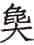（chuò）：良霄的副使。

②怀：亲近。

③绥：安抚。

④震：威胁。摄威：威慑。

⑤楚人执之：楚国怒而囚禁了两人。

⑥书曰“行人”，言使人：《经》文记作行人，是指他们是使者，并非他们的罪过。

***【译文】***

九月，诸侯全部出兵再次攻打郑国。郑国派良霄、太宰石到楚国去，报告打算顺服晋国，说：“我因为国家的缘故，不能对君主您效忠。您如果能够用玉帛结好晋国，不然就用武力对其加以威慑，是寡人的愿望。”楚国囚禁了这两人，《春秋》记做“行人”，是说他们是使者不应该被拘禁。

诸侯之师观兵于郑东门，郑人使王子伯骈行成。甲戌①，晋赵武入盟郑伯。冬十月丁亥②，郑子展出盟晋侯。十二月戊寅③，会于萧鱼。庚辰④，赦郑囚，皆礼而归之。纳斥候⑤，禁侵掠。晋侯使叔肸告于诸侯⑥。公使臧孙纥对曰：“凡我同盟，小国有罪，大国致讨，苟有以藉手，鲜不赦宥。寡君闻命矣⑦。”

***【注释】***

①甲戌：二十六日。

②丁亥：初九。

③戊寅：初一。

④庚辰：初三。

⑤纳：撤回。斥候：巡逻兵与侦察兵。

⑥叔肸（xī）：即羊舌肸，字叔向。

⑦苟有以藉手，鲜不赦宥。寡君闻命矣：意思是晋国讨伐小国之罪，稍有所得便赦免其罪，德义如此，小国不敢不承命。藉手，稍有所得。

***【译文】***

诸侯军队在郑国东门炫耀武力，郑国派王子伯骈前往求和。二十六日，晋国赵武入郑都和郑简公订立盟约。冬十月初九，郑国子展出城与晋悼公结盟。十二月初一，在萧鱼相会。初三，赦免郑国的俘虏，都以礼相待放回国。撤回巡逻兵，禁止抢掠。晋悼公派叔肸通告诸侯。襄公派臧孙纥答复说：“凡是我们同盟国家，小国有了罪过，大国出兵讨伐，稍有所得便赦免其罪。敝国国君知道您的命令了！”

郑人赂晋侯以师悝、师触、师蠲①，广车、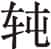车淳十五乘②，甲兵备，凡兵车百乘③，歌钟二肆④，及其镈、磬⑤，女乐二八⑥。

***【注释】***

①师悝（kuī）、师触、师蠲（juān）：三人都是乐师。

②广车：横阵之车，用来攻击。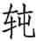（tún）车：屯守之车。淳（chún）：成对，指广车与车相配为一对，各十五对三十乘。

③甲兵备，凡兵车百乘：广车、车与其他兵车共百乘。

④钟：古代乐器。二肆：悬钟十六枚为一肆，二肆为三十二枚。

⑤镈（bó）：大钟。磬（qìnɡ）：古乐器，以美石或玉雕成，形状如矩，打击发声。二者都用以配歌钟。

⑥女乐二八：奏乐之女十六人。二八，即二佾（yì）。古乐舞八人为一列，称为佾。

***【译文】***

郑国献给晋悼公师悝、师触、师蠲三名乐师，成对的广车、车各十五辆，并配备了衣甲、兵器。共计送了兵车一百辆，歌钟两架配上相应的镈和磬，女乐二队十六人。

晋侯以乐之半赐魏绛，曰：“子教寡人和诸戎狄以正诸华。八年之中①，九合诸侯②，如乐之和，无所不谐③。请与子乐之④。”辞曰：“夫和戎狄，国之福也；八年之中，九合诸侯，诸侯无慝⑤，君之灵也⑥，二三子之劳也⑦，臣何力之有焉？抑臣愿君安其乐而思其终也⑧！《诗》曰：‘乐只君子，殿天子之邦。乐只君子，福禄攸同。便蕃左右，亦是帅从⑨。’夫乐以安德⑩，义以处之，礼以行之，信以守之，仁以厉之⑪，而后可以殿邦国、同福禄、来远人，所谓乐也。《书》曰⑫：‘居安思危。’思则有备，有备无患，敢以此规⑬。”公曰：“子之教，敢不承命。抑微子，寡人无以待戎⑭，不能济河⑮。夫赏，国之典也，藏在盟府⑯，不可废也。子其受之！”魏绛于是乎始有金石之乐⑰，礼也。

***【注释】***

①八年之中：和戎在襄公四年，至今已八年。

②九合诸侯：襄公五年会于戚，又会于城棣救陈，七年会于，八年会于邢丘，九年盟于戏，十年会于柤，又戍郑虎牢，十一年同盟于亳城北，又会于萧鱼。

③如乐之和，无所不谐：就像音乐一样和谐。

④请与子乐之：与你共同享受这音乐。

⑤无慝：指都顺从。

⑥灵：威信。

⑦二三子：指中军帅佐以下人等。

⑧抑臣愿君安其乐而思其终也：此时郑已归服，魏绛希望晋悼公居安思危。抑，但是，然而。

⑨“乐只君子”六句：引《诗》见《诗经·小雅·采菽》，但文字小有差异。只，语助词。攸，所。殿，镇抚。便蕃，治理。左右，指附近小国。帅从，即“率从”，相率服从。

⑩乐以安德：音乐用来巩固德行。

⑪厉：勉励。

⑫《书》：指的是逸《书》。

⑬规：规劝。

⑭待戎：和戎。

⑮济河：指渡河服郑。

⑯夫赏，国之典也，藏在盟府：赏勋是国家大典，盟府掌记载之职，应当遵行。盟府，管理盟约、文书档案的官府。

⑰金石之乐：钟磬之乐。

***【译文】***

晋悼公把乐器与乐队的一半赐给魏绛，说：“你教我与各部戎狄和好以整顿中原诸国。八年里九次会合诸侯，就如音乐一样和谐，没有一处不谐调的。请让我和你共同享用它们。”魏绛辞谢说：“与戎狄和好，是国家的福分；八年里面九次会合诸侯，诸侯没有不顺服的，这是君主的威灵，也和各位大夫的辛劳分不开，微臣哪里出过什么力呢？不过臣希望君主既安享这份快乐而能居安思危！《诗》说：‘快乐啊君子，镇抚天子的家邦。快乐啊君子，他的福禄和别人共享。治理好附近的小国，使他们相率服从。’音乐是用来巩固德行的，用道义来处置它，用礼仪来推行它，用信用来保持它，用仁爱来勉励它，然后才能做到镇抚邦国，福禄同享，召来远方人，这就是所谓的快乐。《书》说：‘在安定的环境中要想到危险。’想到了就有所防备，有了防备就不会有祸患，臣斗胆以此向您提出规劝。”悼公说：“您的教诲，我岂敢不遵照去做。要是没有您，我就不能正确对待戎人，也不能渡过黄河。赏赐是国家的典章，藏在盟府中，是不能够废除的。您还是接受吧！”魏绛从此开始有了金石的音乐，这是合乎礼的。

11.6 秦庶长鲍、庶长武帅师伐晋以救郑①。鲍先入晋地，士鲂御之②，少秦师而弗设备③。壬午④，武济自辅氏⑤，与鲍交伐晋师⑥。己丑⑦，秦、晋战于栎⑧，晋师败绩，易秦故也⑨。

***【注释】***

①庶长：秦国官职名。

②士鲂御之：士鲂留守国内，抵御秦兵。

③少秦师：觉得秦军兵力少。

④壬午：初五。

⑤辅氏：在今陕西大荔东。

⑥交伐：夹攻。

⑦己丑：十二日。

⑧栎：晋地名，在今山西永济西。

⑨易秦：轻视秦军。

***【译文】***

秦国庶长鲍、庶长武带兵攻打晋国来救援郑国。鲍先进入晋国领地，士鲂抵御他们，见秦军人少而不加防备。初五，武从辅氏渡过黄河，和鲍夹击晋军。十二日，秦、晋军队在栎地交锋，晋军大败，这是由于轻视秦军的缘故。

# 十二年

***【经】***

12.1 十有二年春王二月①，莒人伐我东鄙，围台②。

12.2 季孙宿帅师救台，遂入郓③。

12.3 夏，晋侯使士鲂来聘。

12.4 秋九月，吴子乘卒④。

12.5 冬，楚公子贞帅师侵宋。

12.6 公如晋。

***【注释】***

①十有二年：鲁襄公十二年当周灵王十一年，前561。

②台：在今山东费县东南。

③郓：鲁地，鲁有东西二郓，此为东郓，在今山东沂水东。此时被莒国所占。

④吴子乘卒：乘，吴王寿梦。寿梦死，子诸樊继立。

***【译文】***

鲁襄公十二年春周历二月，莒国攻打我国东部边境，包围了台。

季孙宿带领军队救援台，于是攻入郓地。

夏，晋悼公派士鲂来我国聘问。

秋九月，吴王乘去世。

冬，楚国公子贞率军袭击宋国。

襄公到晋国去。

***【传】***

12.1 十二年春，莒人伐我东鄙，围台。季武子救台，遂入郓，取其钟以为公盘①。

***【注释】***

①盘：盛食器或浴器。

***【译文】***

鲁襄公十二年春，莒国侵犯我国东部边境，包围了台地。季武子救援台地，于是进入郓地，拿走他们的钟改铸为公室的盘。

12.2 夏，晋士鲂来聘，且拜师①。

***【注释】***

①拜师：拜谢前年出兵攻打郑国。

***【译文】***

夏，晋国士鲂来鲁国聘问，并拜谢鲁国出兵攻打郑国。

12.3 秋，吴子寿梦卒。临于周庙①，礼也。凡诸侯之丧，异姓临于外②，同姓于宗庙，同宗于祖庙③，同族于祢庙④。是故鲁为诸姬，临于周庙。为邢、凡、蒋、茅、胙、祭，临于周公之庙⑤。

***【注释】***

①临于周庙：因为吴祖泰伯、鲁祖周公都是文王之后，所以襄公临于周庙哭吊吴王乘。临，哭吊死者。周庙，周文王庙，也就是下文的宗庙。

②异姓临于外：异姓在城外向其国哭吊。

③祖庙：始封君之庙。

④同族：同一高祖谓同族。祢（nǐ）庙：父庙。

⑤为邢、凡、蒋、茅、胙、祭，临于周公之庙：以上六国都是周公支子，另封为国，都祖周公。

***【译文】***

秋，吴王寿梦去世。襄公在周文王庙中哭吊寿梦，这是合乎礼的。凡是诸侯的丧事，异姓的在城外哭吊，同姓的在宗庙哭吊，同宗的在祖庙哭吊，同族的在祢庙哭吊。因此，鲁国为姬姓诸国，在周文王庙哭吊。为邢、凡、蒋、茅、胙、祭六国，在周公庙哭吊。

12.4 冬，楚子囊、秦庶长无地伐宋，师于杨梁①，以报晋之取郑也。

***【注释】***

①杨梁：在今河南商丘东南。

***【译文】***

冬，楚国子囊、秦国庶长无地攻伐宋国，在杨梁驻兵，是报复晋国从楚国手里夺走郑国。

12.5 灵王求后于齐①。齐侯问对于晏桓子②，桓子对曰：“先王之礼辞有之。天子求后于诸侯，诸侯对曰：‘夫妇所生若而人③。妾妇之子若而人。’无女而有姊妹及姑姊妹④，则曰：‘先守某公之遗女若而人⑤。’”齐侯许婚。王使阴里结之⑥。

***【注释】***

①求后：求娶王后。

②问对：询问如何答复。晏桓子：晏弱。

③夫妇所生：指自己的嫡配所生。若而人：若干人。

④姑姊妹：父亲的姊妹。

⑤先守：先君。某公：这里是用谥号称谓。

⑥阴里：周大夫。结：结言，口头约定。

***【译文】***

周灵王向齐国求婚。齐灵公向晏弱征求应对的意见，晏弱回答说：“先王的礼仪辞令中有这样的话。天子向诸侯求婚，诸侯回答说：‘有夫人所生的女儿若干人。妾妇所生的女儿若干人。’没有女儿但有姊妹和姑妈的，就说：‘先君某公的遗女若干人。’”齐灵公同意了婚事。周灵王派阴里到齐国作了口头约定。

12.6 公如晋朝，且拜士鲂之辱①，礼也。

***【注释】***

①公如晋朝，且拜士鲂之辱：士鲂夏天聘问鲁国，襄公此行也是对士鲂聘鲁的报答。辱，谦辞，屈尊。

***【译文】***

襄公到晋国朝见，同时拜谢士鲂的聘问，这是合乎礼的。

12.7 秦嬴归于楚①。楚司马子庚聘于秦②，为夫人宁③，礼也。

***【注释】***

①秦嬴：秦景公妹，楚共王夫人。归于楚：返秦省母后回楚国。

②子庚：名午，楚庄王儿子。

③宁：妇女出嫁后返回母家省亲。

***【译文】***

秦嬴嫁到楚国。楚国司马子庚到秦国聘问，是为了夫人回娘家的事，这是合乎礼的。

# 十三年

***【经】***

13.1 十有三年春①，公至自晋。

13.2 夏，取邿②。

13.3 秋九月庚辰③，楚子审卒④。

13.4 冬，城防⑤。

***【注释】***

①十有三年：鲁襄公十三年当周灵王十二年，前560。

②邿（shī）：妊姓小国名，在今山东济宁南。

③庚辰：十四日。

④楚子审卒：楚共王去世。

⑤城防：鲁地名，在今山东费县东北。世为臧氏食邑。

***【译文】***

鲁襄公十三年春，襄公从晋国回国。

夏，夺取邿国。

秋九月十四日，楚共王审去世。

冬，修筑防地的城墙。

***【传】***

13.1 十三年春，公至自晋，孟献子书劳于庙①，礼也。

***【注释】***

①书劳：又叫策勋，将功劳写在策上。

***【译文】***

鲁襄公十三年春，襄公从晋国回来，孟献子把功劳记载于宗庙，这是符合礼的。

13.2 夏，邿乱，分为三。师救邿，遂取之①。凡书“取”，言易也②，用大师焉曰“灭”，弗地曰“入”③。

***【注释】***

①师救邿，遂取之：鲁国出兵平乱，乘机灭了邿国。

②凡书“取”，言易：轻易可取，不必用大部队，则记做“取”。

③弗地曰“入”：得其国，但不占有其地叫“入”。

***【译文】***

夏，邿国发生动乱，国家分裂为三部分。鲁国出兵救援邿国，于是灭了邿国。凡是《春秋》记载为“取”的，是表示轻易可取，动用大部队的称为“灭”，攻破但不占领土地的为“入”。

13.3 荀、士鲂卒。晋侯蒐于绵上以治兵①，使士匄将中军②，辞曰：“伯游长③。昔臣习于知伯④，是以佐之，非能贤也。请从伯游。”荀偃将中军⑤，士匄佐之。使韩起将上军，辞以赵武。又使栾黡，辞曰：“臣不如韩起。韩起愿上赵武，君其听之！”使赵武将上军⑥，韩起佐之。栾黡将下军，魏绛佐之⑦。新军无帅，晋侯难其人⑧，使其什吏率其卒乘官属⑨，以从于下军，礼也。晋国之民，是以大和，诸侯遂睦⑩。

***【注释】***

①蒐（sōu）：打猎及训练军队。绵上：古地名。在今山西翼城西。治兵：阅兵。

②使士匄将中军：士匄本为中军佐，中军将荀死后由他递补。

③伯游：荀偃的字。长：能力更强。

④习于知伯：指与荀互相了解，能密切配合。

⑤荀偃将中军：晋悼公听从了士匄的建议，让荀偃当中军将。

⑥使赵武将上军：赵武本是新军帅，现在将上军，位由第七跃升为第三。

⑦魏绛佐之：魏绛代士鲂。

⑧难其人：难有合适的人选。

⑨什吏：每军都有军尉、司马、司空、舆尉和候奄共五吏，五吏又各有副手，因此合称为“十吏”。什，同“十”。

⑩诸侯遂睦：大夫谦让，唯贤是举，因此大为和睦。

***【译文】***

荀、士鲂去世。晋悼公在绵上打猎并检阅军队，派士匄统率中军，士匄推辞说：“荀偃比我强。过去因为下臣和知伯相知，所以辅佐他，并不是由于我能干。请任命荀偃。”于是荀偃率领中军，士匄辅佐他。任命韩起统率上军，韩起辞让给赵武。又任命栾黡，他也辞谢说：“下臣不如韩起。韩起希望让赵武在上位，请君主还是听从他吧！”于是任命赵武统领上军，韩起辅佐他。栾黡统率下军，魏绛辅佐他。新军无主帅，晋悼公对这个人选感到为难，便让新军的十个官吏率领徒兵骑兵和所属官员，附属于下军，这是合乎礼的。晋国民众，因此十分和睦团结，诸侯间也由此而和睦。

君子曰：“让，礼之主也。范宣子让，其下皆让。栾黡为汏，弗敢违也①。晋国以平②，数世赖之③。刑善也夫④！一人刑善，百姓休和⑤，可不务乎？《书》曰：‘一人有庆，兆民赖之，其宁惟永⑥。’其是之谓乎？周之兴也，其《诗》曰：‘仪刑文王，万邦作孚⑦。’言刑善也。及其衰也，其《诗》曰：‘大夫不均，我从事独贤⑧。’言不让也。世之治也，君子尚能而让其下⑨，小人农力以事其上⑩，是以上下有礼，而谗慝黜远，由不争也，谓之懿德⑪。及其乱也，君子称其功以加小人⑫，小人伐其技以冯君子⑬，是以上下无礼，乱虐并生⑭，由争善也⑮，谓之昏德。国家之敝，恒必由之。”

***【注释】***

①栾黡为汏（tài），弗敢违也：栾黡虽然骄横，也不敢违背而只好谦让。汏，同“汰”，骄横。

②平：团结。

③赖：利。

④刑善：取法于善。刑，法。

⑤百姓：各族各姓。

⑥一人有庆，兆民赖之，其宁惟永：引文出自《尚书·吕刑》，意思是在上的一人为善，亿万人都受其利，国家可以长治久安。庆，善。

⑦仪刑文王，万邦作孚：引《诗》见《诗经·大雅·文王》。仪刑，效法。孚，信任。

⑧大夫不均，我从事独贤：引《诗》见《诗经·小雅·北山》。原意是讽刺周幽王役使不均，唯有自己劳役最多，此借指自夸贤能而不相让。独贤，独多，独劳。

⑨尚能：崇尚贤能。

⑩农力：努力。

⑪懿德：美德。

⑫君子：在位者。称：夸耀。加：凌驾。

⑬伐：夸耀。冯：凭，凌驾。

⑭乱虐：动乱残暴。

⑮争善：争相自夸以为善。

***【译文】***

君子说：“谦让是礼的主体。范宣子谦让，其下属也就都谦让了。连栾黡那样骄横的人，也不敢违背。晋国因此而和平团结，几世都受益，这是由于取法于善的缘故啊！一个人取法于善，各族各姓都安逸和平，这样的事能不努力去做吗？《书》说：‘一个人有善行，亿万人得利，国家就长治久安。’说的就是这种情况吧？周朝兴盛时，《诗》上说：‘以文王为榜样，万国诸侯都信任。’说的就是取法于善。到了衰败时，《诗》上说：‘大夫做事不公平，唯独我派的事最多。’这是说不肯谦让。当处在治世时，君子崇尚贤能而对下谦让，小人努力干活以事奉其上司，所以上下有礼，奸邪馋慝被废黜远离，这是由于不争的缘故，称为美德。到了乱世，君子夸耀自己的功劳而凌驾于小人之上，小人夸耀自己的技艺以凌驾君子，所以上下无礼，动乱暴虐一起发生，这是由于争相夸耀自己之故，称为昏德。国家的衰败，总是从这里开始。”

13.4 楚子疾①，告大夫曰：“不穀不德，少主社稷②，生十年而丧先君③，未及习师保之教训而应受多福④，是以不德，而亡师于鄢⑤，以辱社稷，为大夫忧，其弘多矣⑥。若以大夫之灵，获保首领以殁于地⑦，唯是春秋窀穸之事⑧，所以从先君于祢庙者⑨，请为‘灵’若‘厉’⑩。大夫择焉！”莫对⑪。及五命乃许⑫。秋，楚共王卒。子囊谋谥。大夫曰：“君有命矣。”子囊曰：“君命以共⑬，若之何毁之？赫赫楚国，而君临之，抚有蛮夷，奄征南海⑭，以属诸夏⑮，而知其过，可不谓共乎？请谥之‘共’。”大夫从之⑯。

***【注释】***

①楚子疾：楚共王生病。

②少主社稷：楚共王十岁就为楚国君主。

③先君：指共王父亲楚庄王。

④师保：古代担任教导贵族子弟职务的官，教导太子的有太师、少师、太傅、少傅、太保、少保等。应：同“膺”，受。多福：指君主之位。

⑤亡师于鄢：成公十六年楚在鄢陵之战中战败。

⑥弘多：太多。

⑦获保首领以殁于地：意思是得以善终。

⑧春秋：指祭祀。窀穸（zhūn xī）：安葬。

⑨从先君于祢（nǐ）庙：共王死后，先君神主要迁入祖庙，原有祢庙作为新君祭祀共王的祢庙，所以说“从先君于祢庙”。祢庙，父庙。君主埋葬以后，春秋在祢庙祭祀，须先加谥号。

⑩“灵”若“厉”：“灵”或“厉”都是恶谥。乱而不损曰灵，戮杀不辜曰厉。若，或。

⑪莫对：群臣不同意，所以没人答应。

⑫五命乃许：命令了五次，群臣才同意谥为“灵”或“厉”。

⑬君命以共：共，通“恭”。意谓共王的命令是表示他的谦恭。

⑭奄征：大举征伐。

⑮属诸夏：使中原各国附属于楚。

⑯大夫从之：大夫们同意子囊的意见。按，以上说明共王为何谥为“共”。

***【译文】***

楚共王生病，告诉大夫们说：“不穀没有德行，幼年时便承担国君重任，出生十年就丧失先君，没能来得及好好学习师保们的教育训导，却承受了过多的福分，因而缺乏德行，在鄢地打了败仗，使国家蒙受耻辱，使大夫们忧虑，罪责够大的了。如果能托大夫们的福，得以善终入土，在诸如春秋祭祀安葬等事情上，能像当年先君那样安置在祢庙中，请谥为‘灵’或‘厉’。大夫们选定吧！”没人吭声赞同。直到命令了五次才同意。秋，楚共王去世。子囊和大家商议谥号。大夫们说：“国君已经有命令了。”子囊说：“国君的命令是体现他的谦恭，怎么能因此而诋毁他？我们声威赫赫的楚国，国君在上统治，安抚并统领蛮夷，大举征伐南海，让中原诸国服从于楚国，而国君又已自知其过，能说不是‘共’？请谥他为‘共’。”大夫们采纳了他的意见。

13.5 吴侵楚①，养由基奔命②，子庚以师继之③。养叔曰：“吴乘我丧，谓我不能师也④，必易我而不戒⑤。子为三覆以待我⑥，我请诱之⑦。”子庚从之。战于庸浦⑧，大败吴师，获公子党。君子以吴为不吊⑨。《诗》曰：“不吊昊天，乱靡有定⑩。”

***【注释】***

①吴侵楚：吴国乘楚国国丧侵犯楚国。

②养由基：即养叔，楚国大夫。奔命：应急出战的部队。

③子庚：楚国公子午，这时担任司马。

④谓我不能师：因为丧事而不能整军抗敌。

⑤易：轻视。不戒：丧失警惕，不戒备。

⑥三覆：三批伏兵。覆，同“伏”。

⑦我请诱之：养由基作先锋诱敌。

⑧庸浦：楚地名，在今安徽无为南长江北岸。

⑨吊（dì）：善。

⑩不吊昊天，乱靡有定：引《诗》见《诗经·小雅·节南山》。意思是上天认为你不善，动乱就不能平定。这里借以批评吴国乘着楚国国丧而进攻之。昊天，苍天。

***【译文】***

吴国侵袭楚国，养由基急速奔赴前线迎敌，子庚率军接着跟上。养由基说：“吴国乘我国国丧侵犯我国，是认为我们不能出兵，必定会轻视我们而不加戒备。你安排好三支伏兵等着我，我前去诱敌。”子庚同意了。与吴国在庸浦接战，大败吴军，擒获公子党。君子认为吴国不对。《诗》上说：“上天觉得你不对，动乱就不会平定。”

13.6 冬，城防，书事，时也。于是将早城①，臧武仲请俟毕农事，礼也②。

***【注释】***

①早城：提前筑城。

②臧武仲请俟毕农事，礼也：农事过后动工，合于时令，即合于礼。

***【译文】***

冬，在防筑城，《春秋》记载这件事，是因为合乎时令。本想早点筑城，臧武仲请求等农事完毕再动工，这是合于礼的。

13.7 郑良霄、大宰石犹在楚①。石言于子囊曰：“先王卜征五年②，而岁习其祥③，祥习则行④。不习，则增修德而改卜⑤。今楚实不竞，行人何罪？止郑一卿⑥，以除其逼，使睦而疾楚⑦，以固于晋⑧，焉用之？使归而废其使⑨，怨其君以疾其大夫⑩，而相牵引也，不犹愈乎⑪？”楚人归之。

***【注释】***

①郑良霄、大宰石（chuò）犹在楚：二人在襄公十一年出使楚国被囚禁。

②卜征五年：为征伐连续占卜五年。征，征伐。

③岁习其祥：五年卜征，每年都吉祥。习，通“袭”，重复。

④祥习则行：每年都吉祥就出兵。

⑤改卜：重新起卜。

⑥止：留住。一卿：指良霄。

⑦以除其逼，使睦而疾楚：良霄刚愎自用，威逼郑国君臣，楚国扣留他，实际是在替郑国除去威逼，郑国内部和睦，怨恨楚国。

⑧以固于晋：服晋之心更加坚固。

⑨废其使：未能完成出使的任务。

⑩怨其君以疾其大夫：良霄回国，将会既怨国君又恨各位大夫。以，与。

⑪而相牵引也，不犹愈乎：与其扣留良霄不放，不如放他回国，使郑国内部不和睦而互相牵制。

***【译文】***

郑国良霄、太宰石仍被扣留在楚国。石对子囊说：“先王为了征伐之事而连续占卜了五年，每年都是吉祥，连续吉祥就出兵。要是有一年不吉祥就更加努力修明德行而重新占卜。现在楚国实在不能与晋国争强，使节又有什么罪过呢？扣留郑国一位卿，这就除去了对郑国君臣的威逼，使他们相互和睦而怨恨楚国，更坚定了他们顺服晋国的决心，这样做有什么好处呢？不如放他回国使他完不成使命，从而怨恨其国君、痛恨大夫们，使君臣之间互相牵制，不是更好吗？”楚国放良霄回国。

# 十四年

***【经】***

14.1 十有四年春王正月①，季孙宿、叔老会晋士匄、齐人、宋人、卫人、郑公孙虿、曹人、莒人、邾人、滕人、薛人、杞人、小邾人会吴于向②。

14.2 二月乙未朔，日有食之③。

14.3 夏四月，叔孙豹会晋荀偃、齐人、宋人、卫北宫括、郑公孙虿、曹人、莒人、邾人、滕人、薛人、杞人、小邾人伐秦④。

14.4 己未⑤，卫侯出奔齐。

14.5 莒人侵我东鄙⑥。

14.6 秋，楚公子贞帅师伐吴。

14.7 冬，季孙宿会晋士匄、宋华阅、卫孙林父、郑公孙虿、莒人、邾人于戚⑦。

***【注释】***

①十有四年：鲁襄公十四年当周灵王十三年，前559。

②叔老：鲁国大夫。向：郑地，在今安徽怀远西。

③二月乙未朔，日有食之：即前559年1月14日之日环食。乙未朔，初一。

④伐秦：晋国报复襄公十一年栎之战。按，秦、晋交兵，自鲁僖公三十三年崤之役开始，经历六十八年，此后《春秋》再不书晋、秦交兵。

⑤己未：二十六日。

⑥莒人侵我东鄙：报复襄公十二年季武子进攻郓之战。

⑦戚：卫孙林父的采邑，在今河南濮阳稍东北。

***【译文】***

鲁襄公十四年春周历正月，季孙宿、叔老会同晋国士匄、齐国人、宋国人、卫国人、郑国公孙虿、曹国人、莒国人、邾国人、滕国人、薛国人、杞国人和小邾国人与吴国人相会于向。

二月初一，日食。

夏四月，叔孙豹会同晋国荀偃、齐国人、宋国人、卫国北宫括、郑国公孙虿、曹国人、莒国人、邾国人、滕国人、薛国人、杞国人及小邾国人联合进攻秦国。

二十六日，卫献公出奔齐国。

莒国进犯我国东部边境。

秋，楚国公子贞带领军队攻打吴国。

冬，季孙宿与晋国士匄、宋国华阅、卫国孙林父、郑国公孙虿、莒国人、邾国人在戚地相会。

***【传】***

14.1 十四年春，吴告败于晋①。会于向，为吴谋楚故也②。范宣子数吴之不德也③，以退吴人。

***【注释】***

①吴告败于晋：晋、吴同盟，因此吴国向晋国报告被楚国打败的事。

②为吴谋楚故：打算伐楚为吴国报仇。

③数（shǔ）：责备。吴之不德：吴国乘楚国丧而伐楚是不道德的。

***【译文】***

鲁襄公十四年春，吴国向晋国通报去年被楚国战败的事。在向地相会，这是为了要替吴国策划攻打楚国的缘故。范宣子责备吴国人不讲道德，以此拒绝了吴国人的请求。

执莒公子务娄，以其通楚使也①。

***【注释】***

①以其通楚使：莒贰于楚，故连年伐鲁。晋因以与楚通使之罪扣留莒公子务娄。

***【译文】***

逮捕莒国公子务娄，这是因为他派使者和楚国往来。

将执戎子驹支①。范宣子亲数诸朝②，曰：“来！姜戎氏③！昔秦人迫逐乃祖吾离于瓜州④，乃祖吾离被苫盖、蒙荆棘以来归我先君⑤。我先君惠公有不腆之田⑥，与女剖分而食之。今诸侯之事我寡君不如昔者，盖言语漏泄，则职女之由⑦。诘朝之事⑧，尔无与焉⑨！与，将执女！”对曰：“昔秦人负恃其众，贪于土地，逐我诸戎⑩。惠公蠲其大德⑪，谓我诸戎是四岳之裔胄也⑫，毋是翦弃⑬。赐我南鄙之田，狐狸所居，豺狼所嗥⑭。我诸戎除翦其荆棘，驱其狐狸豺狼，以为先君不侵不叛之臣，至于今不贰⑮。昔文公与秦伐郑，秦人窃与郑盟而舍戍焉⑯，于是乎有崤之师⑰。晋御其上，戎亢其下⑱，秦师不复⑲，我诸戎实然⑳。譬如捕鹿，晋人角之(21)，诸戎掎之(22)，与晋踣之(23)，戎何以不免(24)？自是以来(25)，晋之百役，与我诸戎相继于时(26)，以从执政，犹崤志也(27)。岂敢离逷(28)？今官之师旅无乃实有所阙(29)，以携诸侯(30)，而罪我诸戎！我诸戎饮食衣服不与华同，贽币不通(31)，言语不达，何恶之能为(32)？不与于会，亦无瞢焉(33)！”赋《青蝇》而退(34)。宣子辞焉(35)，使即事于会，成恺悌也(36)。

***【注释】***

①驹支：戎部落头目之名。

②朝：盟会的地方也设朝位。

③姜戎氏：瓜州之戎有姜姓、允姓二支，这里是姜姓。

④吾离：姜戎祖父名。瓜州：古地名。在今甘肃敦煌。

⑤被苫（ｓhān）盖，蒙荆棘：这里是形容其贫困。被，同“披”。苫盖，编茅草为衣。蒙荆棘，头戴用荆棘所编的冠。

⑥不腆：不多。

⑦职女之由：都是由于你的缘故。职，当。女，通“汝”。

⑧诘朝：明日。

⑨尔无与：你不要参加明天的会盟。

⑩昔秦人负恃其众，贪于土地，逐我诸戎：指秦穆公称霸西戎。

⑪蠲（ｊｕān）：昭明，显示。

⑫四岳：尧时诸侯之长，姜姓。裔胄：后代。

⑬毋是翦弃：不要灭亡他们。翦弃，灭亡。

⑭嗥（háo）：咆哮。

⑮不贰：不改变做法。

⑯昔文公与秦伐郑，秦人窃与郑盟而舍戍焉：指僖公三十年烛之武退秦师，秦国与郑国结盟，并派杞子等三人戍郑。舍，安置。

⑰崤之师：崤之战，在僖公三十三年。

⑱戎亢其下：戎人配合晋军抗秦。亢，同“抗”，抵抗。

⑲不复：战败而回不去。

⑳诸戎实然：所以如此，是诸戎之功。

(21)角之：从正面执其角。

(22)掎（jǐ）之：从后面拖其足。

(23)踣（bó）：向前仆倒。

(24)不免：不能免于罪责。

(25)是：指崤之战。

(26)晋之百役，与我诸戎相继于时：晋国有战事，诸戎都共同从事，从未间断。

(27)以从执政，犹崤志也：从，追随。犹崤志，还是与崤之战时候一样无二心。

(28)逷（tì）：同“逖”，远。

(29)官之师旅：指晋国群臣大夫。有所阙：有过失。

(30)以携诸侯：使诸侯离心。

(31)贽币不通：财礼不相往来。

(32)言语不达，何恶之能为：这是驳范宣子责备戎人使得诸侯离晋、言语漏泄。达，通。

(33)瞢（ｍénɡ）：惭愧。按，以上是驹支历举戎人帮助晋国打败秦国的事实，说明晋国的责难毫无根据。

(34)《青蝇》：《诗经·小雅》中的一篇。这里是取其中“恺悌君子，无信谗言”的意思。

(35)辞：道歉。

(36)成恺悌：不信谗。

***【译文】***

打算拘捕戎部落首领驹支。范宣子亲自在朝堂上责备他，说道：“过来，姜戎氏！当初秦国人在瓜州追赶你的祖父吾离，你祖父吾离身穿蓑衣、头戴荆冠来归附我国先君。我们先君惠公只有不多的田地，还和你们共同平分而食用。如今诸侯事奉我国国君不如以前，这是由于话语泄漏了机密，显然是你们传出去的。明天早晨的事，你们就不要参与了！如果参与，就要把你们逮起来！”驹支回答说：“从前秦国人倚仗人多，贪图土地，驱赶我们各部戎人。惠公显示了他的大德，认为我们戎人各部都是四岳的后裔，不应把我们丢弃不管。于是赐给我们南部边境的田地。这里都是狐狸出没、豺狼乱嚎的荒野之地。我们戎人砍掉这里的荆棘，赶走狐狸豺狼，成为贵国先君不离弃不背叛的臣下，至今没有二心。当初晋文公与秦国讨伐郑国，秦国人暗地里和郑国结盟而安排了戍守的兵力，于是有崤的战役。晋国在上面抵御，戎人在下面对抗，秦国军队无法撤回，正是我们戎人各部的功劳。譬如捕鹿，晋人抓住了它的角，戎人拖住了它的腿，与晋国一起把它放倒。戎人为何不能免于罪责呢？此后，晋国的各个战役，我各部戎人一个接一个地随时参与，以追随执事，如同崤之战一样。岂敢逃避远离？现在群臣官员恐怕有所失误，使得诸侯离心，反而怪罪我各部戎人！我们各部戎人饮食衣服与中原不同，财礼不相往来，言语不通，还能做什么坏事呢？不参加会见，我们也没什么好惭愧的。”赋了《青蝇》这首诗然后退下。范宣子听完之后表示了歉意，让他参加会见，成就了不信谗言的雅量。

于是子叔齐子为季武子介以会①，自是晋人轻鲁币而益敬其使②。

***【注释】***

①子叔齐子：叔老。子叔婴齐之子。介：副手。

②晋人轻鲁币而益敬其使：晋国减轻鲁国的财礼而更敬重其使者。

***【译文】***

当时，子叔齐子作为季武子的副手参加了会见，从此晋国减轻鲁国的财礼而更敬重其使者。

14.2 吴子诸樊既除丧①，将立季札②。季札辞曰：“曹宣公之卒也③，诸侯与曹人不义曹君④，将立子臧。子臧去之，遂弗为也，以成曹君⑤。君子曰‘能守节’⑥。君，义嗣也，谁敢奸君⑦？有国，非吾节也。札虽不才，愿附于子臧，以无失节⑧。”固立之。弃其室而耕。乃舍之。

***【注释】***

①诸樊既除丧：吴王寿梦死于襄公十二年秋七月，到现在丧期已满三年（实际是十七个月）。诸樊，吴王寿梦长子。除丧，除去丧服。

②季札：诸樊之弟，贤而有才。

③曹宣公之卒：曹宣公死于成公十三年。

④不义曹君：指鲁成公十三年负刍杀太子自立为君。曹君，指曹成公负刍。

⑤子臧去之，遂弗为也，以成曹君：事见成公十五、十六年《传》。去之，子臧离开曹国。

⑥能守节：当时子臧曾说“圣达节，次守节，下失节。为君非吾节也”。

⑦君，义嗣也，谁敢奸君：诸樊是嫡长子，继承君位是合法的。奸，冒犯。

⑧愿附于子臧，以无失节：季札愿意学子臧而不失节。

***【译文】***

吴王诸樊已经服丧期满，准备立季札为国君。季札推辞说：“曹宣公去世的时候，诸侯与曹国人不赞成立曹成公，要立子臧为国君。子臧离开了曹国，所以计划没能实行，便成全了曹成公。君子认为子臧‘能够保持节操’。你是合法的继承人，谁敢冒犯你？作国君，这不符合我的节操。我虽然不才，但愿意追随子臧，以不失节操。”诸樊坚持要拥立他，季札便抛弃家室而去种地，诸樊才不再勉强他。

14.3 夏，诸侯之大夫从晋侯伐秦，以报栎之役也①。晋侯待于竟②，使六卿帅诸侯之师以进。及泾，不济③。叔向见叔孙穆子④，穆子赋《匏有苦叶》，叔向退而具舟⑤。鲁人、莒人先济。郑子见卫北宫懿子曰⑥：“与人而不固⑦，取恶莫甚焉！若社稷何？”懿子说。二子见诸侯之师而劝之济⑧。济泾而次。秦人毒泾上流，师人多死⑨。郑司马子帅郑师以进，师皆从之⑩，至于棫林，不获成焉⑪。荀偃令曰：“鸡鸣而驾，塞井夷灶，唯余马首是瞻⑫！”栾黡曰：“晋国之命，未是有也。余马首欲东⑬。”乃归。下军从之⑭。左史谓魏庄子曰⑮：“不待中行伯乎⑯？”庄子曰：“夫子命从帅⑰。栾伯，吾帅也⑱，吾将从之。从帅，所以待夫子也。”伯游曰：“吾令实过，悔之何及，多遗秦禽⑲。”乃命大还⑳。晋人谓之迁延之役(21)。

***【注释】***

①以报栎之役也：栎之役在襄公十一年。

②竟：通“境”。

③及泾，不济：诸侯之师不肯渡泾。泾，河水名，有南北二源，会合后经今陕西彬县、泾阳、高陵流入渭河。杨伯峻认为，这里的泾水济渡处当在泾阳南。

④叔向见叔孙穆子：叔向即叔肸（xī），叔孙穆子是鲁国的叔孙豹。

⑤穆子赋《匏有苦叶》，叔向退而具舟：此诗里有“匏有苦叶，济有深涉。深则厉，浅则揭”等句，叔孙穆子赋此诗，是表示愿意渡泾水，叔向会意，于是回去准备船只。《匏有苦叶》是《诗经·国风·邶风》中篇名。

⑥北宫懿子：即北宫括。

⑦与人而不固：亲附别人而不坚定。

⑧二子见诸侯之师而劝之济：鲁、莒已先渡河，于是劝诸侯各国也渡河。诸侯之师，指齐、宋、曹、邾、滕、薛、杞及小邾等国。二子，指郑子和卫北宫括。

⑨秦人毒泾上流，师人多死：秦军在泾水上流放毒，晋兵饮用了毒水，死了很多。

⑩郑司马子帅郑师以进，师皆从之：按，杨伯峻指出，襄公十九年子去世，晋悼公向周王请求赐子以大路行葬之礼，就是因为他的这次行动。

⑪至于棫（yù）林，不获成焉：棫林，秦地名，在泾水西南。不获成，秦不肯屈服求和。

⑫鸡鸣而驾，塞井夷灶，唯余马首是瞻：荀偃要大家听从自己指挥，准备明早决战。塞井夷灶是为了便于布阵。

⑬余马首欲东：栾黡不服气，想要回师。因为秦军在西，所以“欲东”就是撤兵回国。

⑭下军从之：栾黡是下军帅。

⑮左史：官名。杨伯峻指出，这里的左史是随军记述之官。魏庄子：即魏绛。

⑯不待中行伯乎：中行伯即荀偃，他作为中军帅还没有下达退兵的命令。

⑰夫子命从帅：夫子指荀偃。

⑱栾伯，吾帅也：魏绛是下军佐，故云。

⑲多遗秦禽：只会留下人马让秦军来俘获。多，只，适。

⑳大还：全军撤退。

(21)迁延之役：因为拖拉而贻误战机。这里指起初诸侯军队不肯渡泾水，鲁渡河后才在郑、卫的劝说下渡河，之后郑国军队前进了他们才跟着进兵，到了棫林又因将帅不和而大撤退。

***【译文】***

夏，诸侯各国大夫跟从晋悼公去讨伐秦国，以报复栎地的战役。晋悼公在边境等候，派六卿率领诸侯军队进军。到达泾水，诸侯军队都不愿意渡河。叔向进见叔孙穆子，穆子赋《匏有苦叶》一诗，叔向回去就备办船只。鲁国、莒国人马先行渡河了。郑国子去见卫国的北宫懿子，说道：“亲附别人却三心二意，没有比这更让人讨厌的了！又如何向国家交代？”懿子赞同他的话。二人去见诸侯的军队，劝他们渡河，于是都渡过泾水并驻扎下来。秦军在泾水上流放毒，诸侯军队的士兵死了很多。郑司马子率领郑国军队前进，各国的军队也就都跟上来，便到达棫林，而秦国仍不肯服输求和。荀偃下令：“鸡叫就出兵，填塞水井、铲平炉灶，只看我的马朝哪个方向就前进！”栾黡说：“晋国从来没有过这样的命令。我可要撤兵回国。”便往回走，下军也都跟随他回去。左史对魏绛说：“不等荀偃了吗？”魏绛说：“正是他命令我们要跟从主帅。栾黡是我的主帅，我要跟从他。跟从主帅就是尊重荀偃他老人家。”荀偃说：“我的命令确实错了，现在悔不当初，多留下军队只会让秦军俘虏。”于是命令全部撤军。晋国人把这次军事行动称为“迁延之役”。

栾曰①：“此役也，报栎之败也。役又无功，晋之耻也。吾有二位于戎路②，敢不耻乎？”与士鞅驰秦师③，死焉。士鞅反。栾黡谓士匄曰：“余弟不欲往，而子召之。余弟死，而子来，是而子杀余之弟也④。弗逐，余亦将杀之。”士鞅奔秦⑤。

***【注释】***

①栾：栾黡的弟弟，这时担任戎右。

②二位：指栾黡、栾兄弟俩。戎辂：将帅所乘兵车。路，即辂。

③士鞅：士匄的儿子。

④“余弟不欲往”五句：栾黡认为栾是受士鞅的怂恿才战死的，所以责怪士鞅。而子，你的儿子。而，你，你的。

⑤士鞅奔秦：按，从此栾、范两家结怨。

***【译文】***

栾说：“这次战役，本是为了报复在栎的失败，结果却无功而返，这是晋国的耻辱。我们家有两人这次出任将帅，能不感到耻辱吗？”便和士鞅一起冲进秦军，结果战死。士鞅跑了回来。栾黡对士匄说：“我弟弟本不想去，都是你儿子叫他去的。结果我弟弟死了，你的儿子却活着回来，是你儿子杀了我的弟弟。你不把他赶走，我就要杀了他。”士鞅就逃往秦国。

于是，齐崔杼、宋华阅、仲江会伐秦①。不书，惰也②。向之会亦如之。卫北宫括不书于向，书于伐秦，摄也③。

***【注释】***

①仲江：宋国公孙师之子。

②不书，惰也：这是解释齐崔杼、宋华阅、仲江三人都参加讨秦，而《经》文所以只记作齐人、宋人而不记三人的名字，是因为他们临事怠慢。

③卫北宫括不书于向，书于伐秦，摄也：这次记下北宫括的名字，是由于他积极参与了讨秦战斗。摄，杨伯峻认为，这里作整顿或佐助讲均可通。

***【译文】***

这时齐国崔杼、宋国华阅、仲江合兵攻秦，《春秋》不记载其名，是由于他们临事怠慢。向地相会的情形也是这样。卫国北宫括在向之会的记载中没有留下姓名，可在这次伐秦有记载，是因为他这次积极参与了战斗。

秦伯问于士鞅曰：“晋大夫其谁先亡？”对曰：“其栾氏乎！”秦伯曰：“以其汰乎？”对曰：“然。栾黡汰虐已甚，犹可以免①，其在盈乎②！”秦伯曰：“何故？”对曰：“武子之德在民，如周人之思召公焉，爱其甘棠，况其子乎③？栾黡死，盈之善未能及人，武子所施没矣④，而黡之怨实章，将于是乎在⑤。”秦伯以为知言⑥，为之请于晋而复之。

***【注释】***

①犹：如果。

②盈：栾盈，栾黡之子。

③“武子之德在民”四句：因为栾武子有德，人们会像周人作《甘棠》怀念召公一样思念他，何况他的儿子呢。武子，即栾书，栾黡的父亲。甘棠，传说召公奭在甘棠树下听讼断狱，周人思念他而作《甘棠》之诗，见《诗经·国风·召南》。

④盈之善未能及人，武子所施没矣：栾盈的善行没有施及别人，栾书的恩泽也消失了。

⑤而黡之怨实章，将于是乎在：人们怨恨栾黡，其亡将在于此。这是为襄公二十三年栾氏被灭伏笔。章，明显。

⑥知言：有见识的话。知，同“智”。

***【译文】***

秦景公向士鞅打听：“晋国大夫中谁会先灭亡？”回答说：“可能是栾氏吧！”景公说：“是因为他骄横吗？”回答说：“是的。栾黡太过骄横暴虐，如果他可以免于灾祸，这灾祸大概要落到栾盈的头上吧！”景公问：“这是什么缘故呢？”回答说：“栾武子对人民有恩德，正如周民众思念召公那样，因爱其人而施及甘棠树，更何况他的儿子呢？但栾黡死后，栾盈的善行未能施及别人，栾武子所施的恩惠人们又已淡忘，而人们对栾黡的怨恨却越来越大，因而将会在栾盈这里爆发。”景公认为这是有见地的话，便为他向晋国求情，使他回国复位。

14.4 卫献公戒孙文子、甯惠子食①，皆服而朝②。日旰不召③，而射鸿于囿。二子从之④，不释皮冠而与之言⑤。二子怒。孙文子如戚，孙蒯入使⑥。公饮之酒，使大师歌《巧言》之卒章⑦。大师辞⑧，师曹请为之⑨。初，公有嬖妾，使师曹诲之琴，师曹鞭之。公怒，鞭师曹三百。故师曹欲歌之，以怒孙子，以报公⑩。公使歌之，遂诵之⑪。蒯惧，告文子。文子曰：“君忌我矣，弗先，必死⑫。”并帑于戚而入⑬，见蘧伯玉⑭，曰：“君之暴虐，子所知也。大惧社稷之倾覆，将若之何？”对曰：“君制其国，臣敢奸之⑮？虽奸之，庸知愈乎⑯？”遂行，从近关出⑰。

***【注释】***

①卫献公戒孙文子、甯惠子食：约请孙林父、甯惠子吃饭。戒食，约请吃饭。孙文子，即孙林父。宁惠子，即甯殖。

②皆服而朝：都穿朝服在朝堂等着。

③日旰（ɡàn）：天晚。

④二子从之：两人跟到园林里。

⑤不释皮冠而与之言：君见臣，臣穿朝服，君应脱去皮帽。卫献公不脱，是有意羞辱二人。

⑥孙蒯入使：孙林父恼怒地回到戚不再去上朝，而让儿子代替他。孙蒯，孙林父之子。

⑦大师：乐官之长。大，同“太”。《巧言》之卒章：《巧言》乃《诗经·小雅》的篇名。其卒章说：“彼何人斯，居河之麋。无拳无勇，职为乱阶。”卫献公这是借以暗指孙氏跋扈不臣，又无能耐。

⑧大师辞：太师知道这样会更加激怒孙氏，所以不愿歌唱。

⑨师曹：太师所属的乐人。

⑩故师曹欲歌之，以怒孙子，以报公：这是插叙师曹“欲歌之”是为报复被鞭打之恨。

⑪公使歌之，遂诵之：怕孙蒯不知其意，又诵读一遍。歌，依谱歌唱。诵，诵读。杨伯峻曰，歌必依乐谱，诵仅有抑扬顿挫。

⑫君忌我矣，弗先，必死：孙林父决定先发制人。

⑬并帑（nú）于戚而入：将家众迁入戚地，然后入都攻卫献公。帑，指妻室儿女及子弟臣仆等家众。杨伯峻指出，孙氏家众本分二处，一在采邑戚，一在卫都帝丘。这时为发动叛乱，将家众聚于戚，而后率众如帝丘。

⑭见蘧（qú）伯玉：杨伯峻认为，这是孙林父如都时偶然遇见蘧伯玉，因伯玉见他率领兵众，孙氏不得不和他说。蘧伯玉，名瑗（yuàn），谥成子，蘧无咎之子。

⑮奸：冒犯。

⑯虽奸之，庸知愈乎：意思是即使废旧君、立新君，哪里能知道新君就胜过旧君呢？庸知，岂知。

⑰遂行，从近关出：蘧伯玉担心遭祸，从最近的关口出国。

***【译文】***

卫献公约请孙文子、甯惠子吃饭，二人都穿好朝服等在朝堂上。直到太阳快落山了献公还不召见，反而在苑囿里射雁。二人跟到园里，献公不脱下皮帽就和他们说话。二人心中大怒。孙文子回戚地去，而派孙蒯入朝。献公招待他喝酒，让太师歌唱《巧言》的最后一章。太师推辞了，师曹却主动请求替他唱。起初，献公有个宠妾，师曹被派去教她弹琴，师曹鞭打过她。献公发怒，打了师曹三百鞭子。所以师曹想唱这诗，用以激怒孙蒯，达到报复献公的目的。献公让他唱，他就唱了又诵读了一遍。孙蒯害怕，回去告诉了孙文子。孙文子说：“国君忌恨我了，不先下手就会被他杀死。”于是孙文子把所有家属、家众都集中到戚地，然后入都，途中遇见蘧伯玉，跟他说：“国君的暴虐，是你所知道的。我很担心国家会倾覆，你看该怎么办？”蘧伯玉：“君主控制着国家，臣下哪敢冒犯？即使冒犯他而另立新君，又怎么知道就一定比原来的强呢？”蘧伯玉就离开国都，从最近的边关出境。

公使子、子伯、子皮与孙子盟于丘宫①，孙子皆杀之。四月己未②，子展奔齐③。公如鄄④，使子行请于孙子⑤，孙子又杀之。公出奔齐，孙氏追之，败公徒于河泽⑥。鄄人执之⑦。

***【注释】***

①公使子、子伯、子皮与孙子盟于丘宫：孙氏之兵已迫临公宫，卫献公害怕了，派三人向孙林父求和。子、子伯、子皮，三人是卫国群公子。丘宫，在卫都内。

②己未：二十六日。

③子展奔齐：卫献公打算奔齐，子展为之先行。子展，卫献公弟。

④鄄（juàn）：卫地名，在今山东鄄城。

⑤使子行请于孙子：卫献公再次派人去求和。子行，卫国群公子。

⑥河泽：古地名。今山东聊城。

⑦鄄人执之：逮住卫献公的败兵。

***【译文】***

卫献公派子、子伯、子皮和孙文子在丘宫订立盟约，结果孙文子把三人都杀死。四月二十六日，子展出逃到齐国。献公到鄄地，派子行去向孙文子求和，孙文子又把他杀了。献公逃往齐国，孙文子追赶他，在河泽将其亲兵打败。鄄地人则把这些败兵都抓了起来。

初，尹公佗学射于庚公差，庚公差学射于公孙丁。二子追公①，公孙丁御公。子鱼曰②：“射为背师，不射为戮，射为礼乎③？”射两而还④。尹公佗曰：“子为师，我则远矣⑤。”乃反之⑥。公孙丁授公辔而射之，贯臂⑦。

***【注释】***

①二子：尹公佗和庚公差。

②子鱼：庚公差的字。

③射为背师，不射为戮，射为礼乎：射是违背师恩，不射又将被杀，而射更合于礼。

④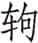（qú）：车轭下边夹马颈的曲木。

⑤子为师，我则远矣：你因为公孙丁是师傅而不射中，对于我，他只是我的师祖，关系较疏远。

⑥乃反之：回车再追卫献公。

⑦贯臂：公孙丁一箭射穿尹公佗的手臂，卫献公得以逃脱。

***【译文】***

当初，尹公佗向庚公差学射箭，庚公差向公孙丁学射箭。尹公佗和庚公差追赶献公，而公孙丁为献公驾车。庚公差说：“射是背叛师傅，不射又要被杀，以一种礼仪性的方式来射吧。”于是发箭射中车而回。尹公佗说：“你为了师傅而故意不射中，我和公孙丁的关系就又远了一层。”于是回车再追。公孙丁把缰绳交给献公后便向尹公佗射箭，一箭射穿他的手臂。

子鲜从公①，及竟，公使祝宗告亡，且告无罪②。定姜曰③：“无神，何告？若有，不可诬也④。有罪，若何告无？舍大臣而与小臣谋，一罪也。先君有冢卿以为师保⑤，而蔑之⑥，二罪也。余以巾栉事先君⑦，而暴妾使余⑧，三罪也。告亡而已，无告无罪⑨。”

***【注释】***

①子鲜：卫献公同母弟。

②公使祝宗告亡，且告无罪：让祝宗将自己出奔之事告于宗庙，且声明自己无罪。祝宗，古代主持祭祀祈祷者。

③定姜：卫定公嫡夫人，卫献公嫡母。

④诬：欺骗。

⑤有冢卿以为师保：为卿佐即为其师保。冢卿，六卿中掌治国政的人，这里指孙林父、甯殖。师保，古代担任教导贵族子弟职务的官。

⑥蔑：轻视，鄙视。

⑦余以巾栉（zhì）事先君：意谓自己是先君的嫡夫人。巾栉，手巾梳子。

⑧暴妾使余：定姜非卫献公生母，卫献公待她暴虐无礼，如同对待婢妾。

⑨无告：不要。

***【译文】***

子鲜跟从卫献公。到了边境，献公派祝宗向祖宗神灵报告逃亡，同时告称自己无罪。定姜说：“如果没有神灵，报告什么？如果有，就不能欺骗。明明有罪，为何说没有？抛开大臣而与小臣商议，这是第一宗罪。先君有正卿为你作师保，你却蔑视他们，这是第二宗罪。我是先君的妻子，你对我却像对婢妾一样凶暴，这是第三罪宗。你就报告逃亡罢了，不要说自己无罪。”

公使厚成叔吊于卫①，曰：“寡君使瘠，闻君不抚社稷②，而越在他竟③，若之何不吊？以同盟之故，使瘠敢私于执事④，曰：‘有君不弔，有臣不敏，君不赦宥，臣亦不帅职⑤，增淫发泄，其若之何⑥？’”卫人使大叔仪对⑦，曰：“群臣不佞⑧，得罪于寡君。寡君不以即刑⑨，而悼弃之⑩，以为君忧。君不忘先君之好，辱吊群臣⑪，又重恤之⑫。敢拜君命之辱，重拜大贶⑬。”厚孙归，复命，语臧武仲曰：“卫君其必归乎⑭！有大叔仪以守⑮，有母弟以出⑯。或抚其内，或营其外，能无归乎？”

***【注释】***

①厚成叔：鲁国大夫，名瘠。

②不抚社稷：指失去君位。抚，有。

③越：流亡。

④执事：卫国的各位大夫。

⑤有君不弔，有臣不敏，君不赦宥，臣亦不帅职：这里厚成叔对卫献公和孙林父都加以批评。不弔，不善。不敏，不明达。

⑥增淫发泄，其若之何：成公十四年卫献公初立，孙氏闻定姜对献公的评论即将私家宝器移于戚，献公因与孙氏有嫌隙，至此时间积久，终于大发作而驱逐卫献公。增淫，积久。

⑦大叔仪：卫国大夫，谥文子。大，同“太”。

⑧不佞：不才。

⑨不以即刑：不处罚群臣。

⑩而悼弃之：卫献公弃臣逃亡。悼，逃。

⑪辱吊群臣：慰问群臣失君。

⑫又重恤之：又哀怜群臣不明达，未尽职。

⑬敢拜君命之辱，重拜大贶（ｋｕànɡ）：一谢吊失君，又谢哀怜群臣。贶，赠，赐。

⑭卫君其必归乎：预言卫献公将重回卫国。

⑮有大叔仪以守：有大叔仪留守国内。

⑯有母弟（tuán）以出：有子鲜跟从卫献公出亡。，即子鲜。

***【译文】***

襄公派厚成叔到卫国慰问说：“我们国君派我来，是因为听说你们国君失去君位，逃亡到国外去了，怎么能不来慰问呢？由于是同盟的关系，派我私下对各位说：‘国君不明智，臣子不敏达，国君不肯宽恕臣子，臣子又不尽职，时间久了而发作，又应该怎么办？’”卫国派太叔仪回应道：“群臣不才，得罪了自己的国君。国君不处罚群臣，而是远远地抛弃了臣子，给贵国国君带来了忧虑。贵国君主不忘与先君的友好，承蒙您前来慰问敝国群臣，又加怜恤。谨此拜谢贵君主的好意，并拜谢对敝国群臣的哀怜。”厚成叔回国复命，对臧武仲说：“卫献公应该能够回国的吧！有太叔仪留守国内，又有同母弟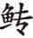一起出亡。这样，有人安抚国内，有人在国外经营事务，能回不去吗？”

齐人以寄卫侯①。及其复也②，以粮归③。

***【注释】***

①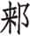：即莱国，襄公七年为齐所灭。寄：寓居。

②及其复也：卫献公回国在十二年以后，这里提前叙述。

③以粮归：卫献公临回国时，把地的粮食席卷而归，可见其贪婪。

***【译文】***

齐国安排卫献公住在地。到他复位回国的时候，把地的粮食载运回国。

右宰穀从而逃归①，卫人将杀之。辞曰：“余不说初矣②，余狐裘而羔袖③。”乃赦之。

***【注释】***

①右宰穀：卫国大夫。

②余不说初矣：意思是当初跟随卫献公出逃并非乐意。说，同“悦”。

③余狐裘而羔袖：意思是我一身皆善，唯有跟从国君出走这点小恶。狐裘，贵重，比喻善。羔，比喻恶。

***【译文】***

右宰穀随从献公出奔又逃回卫国，卫国人要杀他。右宰穀辩解道：“我当初并不是心甘情愿走的，我只是有小过错而已。”卫国便宽赦了他。

卫人立公孙剽①，孙林父、甯殖相之，以听命于诸侯②。

***【注释】***

①公孙剽：卫殇公，卫穆公之孙。

②听命于诸侯：孙、甯辅佐殇公，听取诸侯的命令。命，杜预《春秋左传注》：“听盟会之命。”

***【译文】***

卫国立公孙剽为君，孙林父、甯殖辅佐，以听取诸侯的命令。

卫侯在，臧纥如齐①，唁卫侯②。卫侯与之言，虐③。退而告其人曰：“卫侯其不得入矣④！其言粪土也⑤，亡而不变，何以复国？”子展、子鲜闻之，见臧纥，与之言，道⑥。臧孙说⑦，谓其人曰：“卫君必入。夫二子者，或之，或推之⑧，欲无入，得乎⑨？”

***【注释】***

①臧纥：鲁国臧武仲名。

②唁：慰问生者。

③虐：态度粗暴。

④其：大概。

⑤粪土：比喻其“虐”。

⑥道：顺。子展、子鲜说话通情达理。

⑦臧孙：即臧纥。

⑧或之，或推之：这里以推车作比喻，指子展、子鲜善于辅佐卫献公。，在前拉车。

⑨欲无入，得乎：这里为襄公二十六年卫献公回国伏笔。

***【译文】***

卫献公在地，臧纥到齐国来慰问他。献公和他交谈，态度粗暴。臧纥出来以后对手下人说：“卫国国君大概不可能回国了！他的话就如同粪土，逃亡在外却不悔改，怎么能回国复位？”子展、子鲜听说了，进见臧纥，与他交谈，很通情达理。臧纥很高兴，对手下说：“卫国国君一定能回国。这两人一个推一个拉，怎能不回国呢？”

14.5 师归自伐秦①，晋侯舍新军②，礼也。成国不过半天子之军③。周为六军，诸侯之大者，三军可也④。于是知朔生盈而死⑤，盈生六年而武子卒⑥，彘裘亦幼⑦，皆未可立也。新军无帅，故舍之⑧。

***【注释】***

①师归自伐秦：伐秦的诸侯之师回国。

②舍：废除。这里指晋国撤销新军。

③成国：大国。

④诸侯之大者，三军可也：古代诸侯大国三军，次国二军，小国一军。晋为大国，三军合于礼制。

⑤知朔：知长子。

⑥武子：知。

⑦彘裘：士鲂之子。

⑧新军无帅，故舍之：知氏、士氏都是晋国的强宗，无人继承卿位，是撤新军的原因。

***【译文】***

军队攻打秦国归来，晋悼公裁掉新军，这是合于礼的。大国的军队不超过周王军队的一半。周是六军，诸侯中的大国，三军就可以了。当时知朔生了知盈就去世了，知盈出生六年知去世，彘裘也还年幼，都不能做继承人。新军没有主帅，所以把它撤销了。

14.6 师旷侍于晋侯①。晋侯曰：“卫人出其君，不亦甚乎？”对曰：“或者其君实甚②。良君将赏善而刑淫③，养民如子，盖之如天，容之如地④。民奉其君，爱之如父母，仰之如日月，敬之如神明，畏之如雷霆，其可出乎⑤？夫君，神之主而民之望也⑥。若困民之主⑦，匮神乏祀⑧，百姓绝望，社稷无主，将安用之⑨？弗去何为？天生民而立之君，使司牧之⑩，勿使失性。有君而为之贰⑪，使师保之，勿使过度⑫。是故天子有公，诸侯有卿，卿置侧室，大夫有贰宗，士有朋友⑬，庶人、工、商、皂、隶、牧、圉皆有亲昵⑭，以相辅佐也。善则赏之⑮，过则匡之⑯，患则救之，失则革之⑰。自王以下，各有父兄子弟以补察其政⑱。史为书⑲，瞽为诗⑳，工诵箴谏(21)，大夫规诲(22)，士传言(23)，庶人谤(24)，商旅于市(25)，百工献艺(26)。故《夏书》曰(27)：‘遒人以木铎徇于路(28)。官师相规(29)，工执艺事以谏。’正月孟春，于是乎有之，谏失常也(30)。天之爱民甚矣，岂其使一人肆于民上(31)，以从其淫(32)，而弃天地之性？必不然矣(33)。”

***【注释】***

①师旷：晋国乐太师子野。

②其君实甚：卫献公过分。

③刑淫：责罚邪恶。

④盖之如天，容之如地：覆盖百姓如天之高大，容载百姓如地之宽厚。

⑤其可出乎：其，同“岂”。

⑥夫君，神之主而民之望也：国君主持祭祀，是百姓的希望。

⑦若困民之主：使百姓财货匮乏。主，应为“生”，形近而误。

⑧匮神乏祀：鬼神失去祭祀。匮，缺乏。

⑨将安用之：如果国君如此，则不必有君。

⑩司牧：管理牧养，即统治。

⑪贰：卿佐。

⑫使师保之，勿使过度：上天又设立卿佐师保去辅佐国君，使他不超越法度。

⑬“是故天子有公”五句：公、卿、侧室、贰宗，朋友各为天子、诸侯、卿、大夫、士之辅佐。朋友，或指同宗，或指同师门。

⑭皂、隶：官府奴隶。牧：养牛的奴隶。圉：养马的奴隶。亲昵（nì）：亲近之人。

⑮赏：宣扬。

⑯匡：纠正。

⑰革：更改。

⑱补察其政：观察并补救政令得失。

⑲史为书：太史记录国君言行。

⑳瞽（ɡǔ）为诗：瞽用诗讽谏。古代以瞽者为乐官，因此指乐师。瞽，眼瞎。

(21)工：乐工。箴谏：规劝匡正的话。

(22)规诲：规谏教导。

(23)士传言：士人通过大夫传达他们的意见。

(24)谤：议论，指责。

(25)商旅于市：商旅在市中议论。商、旅，同义词连用。

(26)百工献艺：百工各就其事提出意见。百工，各种工匠。

(27)《夏书》：这是逸书，《古文尚书》羼入今《胤征篇》。

(28)遒（qiú）人以木铎徇于路：遒人摇着木铎在大路上巡行宣令。遒人，地方宣令之官。木铎，木舌的铜铃。

(29)官师相规：官师自相规劝。官师，大夫。

(30)正月孟春，于是乎有之，谏失常也：平常有谏官，待孟春之月才有遒人巡路之事，在下者可乘此机会进谏。谏失常，恐人君失常度而谏。

(31)肆：任意胡为。

(32)从：同“纵”。

(33)必不然矣：按，本段中师旷认为“民为邦本”，卫人出君，过分的是君而不是卫人。

***【译文】***

师旷随侍在晋悼公身边。悼公说：“卫国人赶走了他们国君，不也太过分了吗？”回答说：“也许是国君太过分了。好的国君会奖励善良而处罚邪恶，抚育百姓如同对待子女，覆盖他们就像天一样，容纳他们就跟地一样。人民尊奉国君，爱戴他就像爱戴父母，景仰他如同景仰日月，敬重他如同敬重神明，畏惧他就像畏惧雷霆，又怎么会赶走他呢？作为国君，是祭神的主持者，又是民众的希望。要是使百姓财货匮乏，神灵失去祭祀，百姓绝望，国家无人主持，那还要国君何用？为什么不赶走他？上天化育万民并为他们设立国君，是要他治理民众，不使他们失去天性。上天又设立卿佐师保去辅佐国君，不使他超越法度。因此天子有公，诸侯有卿，卿设置侧室，大夫有贰宗，士有朋友，庶人、工、商、皂、隶、牧、圉都有亲近的人，用来互相帮助。好的就表彰，不对就纠正，灾患则援救，错失就改正。从天子以下各自有父兄子弟审察补救其行事的得失。太史作记录，乐师作歌诗，乐工诵读箴谏，大夫规劝教诲，士传达意见，庶人评议，商人在市场议论，工匠呈献技艺。所以《夏书》说：‘遒人摇着木铎在路上巡行，官员规劝，工匠通过技艺进行谏劝。’正月孟春时就有遒人巡行，是为了让人谏劝君主失去常规的行为。上天对民众的关爱实在是够周全了，难道会让一个人在百姓头上胡作非为，放纵其邪恶，而丢弃天地的本性？一定不会这样的。”

14.7 秋，楚子为庸浦之役故①，子囊师于棠②，以伐吴，吴人不出而还。子囊殿，以吴为不能而弗儆。吴人自皋舟之隘要而击之③，楚人不能相救。吴人败之，获楚公子宜穀。

***【注释】***

①楚子为庸浦之役故：楚国去年在庸浦打败吴军。

②棠：古地名。在今江苏六合西北。

③皋舟：吴险隘之道。要：拦腰截击。

***【译文】***

秋，楚康王为庸浦战役的缘故，派子囊从棠地出师伐吴，吴国不出兵迎战，楚军便撤回。子囊断后，以为吴国不是对手而不加防备。吴国军队从皋舟的险隘拦腰截击楚军，楚军不能彼此相救。吴国打败楚国，俘获了楚国公子宜穀。

14.8 王使刘定公赐齐侯命①，曰：“昔伯舅大公右我先王②，股肱周室，师保万民，世胙大师③，以表东海④。王室之不坏，繄伯舅是赖⑤。今余命女环⑥，兹率舅氏之典⑦，纂乃祖考⑧，无忝乃旧⑨。敬之哉，无废朕命！”

***【注释】***

①王使刘定公赐齐侯命：周灵王将娶齐女，所以先赐齐灵公荣宠。赐命，对诸侯赐以荣宠。

②伯舅：对异姓诸侯的称呼。大公：指吕尚，即姜太公。大，同“太”。右：辅佐。

③胙：酬谢。大师：大公。

④以表东海：使之在东海显扬光大。

⑤繄：发语词，无实义。

⑥环：齐灵公名。

⑦兹：借为“孳”，努力不懈。率：遵循。典：常法。

⑧纂：继承。祖考：指祖先。

⑨无忝（tiǎn）乃旧：无愧于祖先。忝，玷辱。

***【译文】***

周灵王派刘定公赐给齐灵公荣宠，说道：“往昔伯舅太公辅佐我先王，成为周室的股肱，百姓的师保。为此世代酬谢太师，让他在东海显扬光大。周王室没有颓败，全仗了伯舅。现在我命令你环，你要孜孜不倦地遵循舅氏的常规，继承你的祖先，不要玷辱他们。你要恭敬啊，不要废弃我的命令！”

14.9 晋侯问卫故于中行献子①，对曰：“不如因而定之。卫有君矣②，伐之，未可以得志，而勤诸侯。史佚有言曰：‘因重而抚之③。’仲虺有言曰④：‘亡者侮之，乱者取之，推亡，固存⑤，国之道也。’君其定卫以待时乎⑥！”冬，会于戚，谋定卫也⑦。

***【注释】***

①晋侯问卫故于中行献子：卫人逐其君，悼公问是否应当讨伐。故，事。中行献子，即荀偃。

②卫有君矣：已经立了殇公。

③重：指殇公已定位。

④仲虺（huī）：商汤左相。

⑤推亡：推翻灭亡的。固存：巩固存在的。此荀偃意之所在。

⑥待时：待卫国昏乱之时再讨伐。

⑦会于戚，谋定卫也：按，孙林父也参与了此会，即所谓“以听命于诸侯”。

***【译文】***

晋悼公向荀偃征求对卫国的策略，回答说：“不如根据现状而先安定它。卫国已有国君，讨伐它，不见得能够达到目的，反而要劳动诸侯。史佚有句话说：‘在它安定的基础上安抚它。’仲虺有句话说：‘已经灭亡的可以欺侮，正在动乱的可以攻取，推翻灭亡的，巩固存在的，这才是治国之道。’国君您还是安定卫国以等待时机吧！”冬，在戚地相会，是为了商议安定卫国办法。

14.10 范宣子假羽毛于齐而弗归①，齐人始贰。

***【注释】***

①范宣子假羽毛于齐而弗归：此二物为齐国所有，范宣子借观之后不归还。羽，鸟羽。毛，旄牛尾。二物皆可用于舞，也可用作旗杆或仪仗装饰。

***【译文】***

范宣子向齐国借了鸟羽和旄牛尾而不还，于是齐国开始有二心。

14.11 楚子囊还自伐吴①，卒。将死，遗言谓子庚②：“必城郢③。”君子谓：“子囊忠。君薨，不忘增其名④，将死，不忘卫社稷，可不谓忠乎？忠，民之望也。《诗》曰：‘行归于周，万民所望⑤。’忠也。”

***【注释】***

①子囊：公子贞。

②子庚：公子午，继子囊为令尹。

③必城郢：城郢以备吴。

④君薨，不忘增其名：楚共王死时谥其为共。

⑤行归于周，万民所望：引《诗》见《诗经·小雅·都人士》的首章，意思是德行归于忠信，即为万民所瞻仰。这里用来赞扬子囊。

***【译文】***

楚国子囊攻讨吴国回来，就去世了。临终时，留遗言给子庚：“必须修筑郢地城墙。”君子认为：“子囊忠诚。国君去世，不忘谥他为共，自己将死，不忘保卫国家，能不说是忠吗？忠诚是人民所希望的。《诗》说：‘德行归于忠信，即为万民所仰望。’就是说忠诚的意思。”

# 十五年

***【经】***

15.1 十有五年春①，宋公使向戌来聘。二月己亥②，及向戌盟于刘③。

15.2 刘夏逆王后于齐④。

15.3 夏，齐侯伐我北鄙，围成⑤。公救成，至遇⑥。

15.4 季孙宿、叔孙豹帅师城成郛⑦。

15.5 秋八月丁巳，日有食之⑧。

15.6 邾人伐我南鄙。

15.7 冬十有一月癸亥⑨，晋侯周卒⑩。

***【注释】***

①十有五年：鲁襄公十五年当周灵王十四年，前558。

②己亥：十一日。

③刘：鲁地。在鲁都曲阜城外。

④刘夏：即十四年《传》的刘定公。

⑤成：鲁地。在今山东宁阳东北。也作“郕”。

⑥遇：鲁地，在曲阜和宁阳之间。

⑦郛：外城。

⑧八月丁巳，日有食之：此为前558年5月31日之日偏食。八月丁巳，八月无丁巳，应为七月初一。

⑨癸亥：初九。

⑩晋侯周卒：晋悼公死，在位十六年，年仅三十岁。

***【译文】***

鲁襄公十五年春，宋平公派向戌来我国聘问。二月十一日，和向戌在刘地结盟。

刘夏去齐国迎接王后。

夏，齐灵公攻打我国北部边境，包围了成地。襄公救援成地，到达遇。

季孙宿、叔孙豹率领军队修筑成地外墙。

秋七月初一，发生日食。

邾国攻打我国南部边境。

冬十一月初九，晋悼公周去世。

***【传】***

15.1 十五年春，宋向戌来聘，且寻盟①。见孟献子，尤其室②，曰：“子有令闻③，而美其室，非所望也！”对曰：“我在晋，吾兄为之，毁之重劳④，且不敢间⑤。”

***【注释】***

①宋向戌来聘，且寻盟：回报襄公二年叔孙豹聘问，重温襄公十一年亳之盟。

②尤其室：责备他的房子太漂亮。尤，责备。

③令闻：好名声。

④毁之重劳：要毁掉重建，反而加重劳役。

⑤且不敢间：不敢以兄之所为为非。间，非。

***【译文】***

鲁襄公十五年春，宋国向戌前来聘问，同时重温旧盟。进见孟献子，对孟献子的房屋不满，说：“你有好名声，但房屋却修得这么漂亮，不是人们所希望与你的！”孟献子回答说：“是我在晋国的时候，我哥哥造的，毁了它反而加重劳役，而且也不敢以哥哥所做为非。”

15.2 官师从单靖公逆王后于齐①。卿不行，非礼也②。

***【注释】***

①官师从单靖公逆王后于齐：《经》称“刘夏逆王后”，《经》、《传》记载不同。官师，指周大夫刘夏。

②卿不行，非礼也：按，此句《经》、《传》文有抵牾。按周朝制度，天子娶妻不亲迎，派上卿代为迎娶。据《经》文，刘夏不是上卿，说“非礼也”成立，而《传》文里的单靖公是卿，不应说“卿不行”，不存在“非礼”的问题。

***【译文】***

官师随从单靖公到齐国迎接王后。卿没有去，这是不符合礼的。

15.3 楚公子午为令尹，公子罢戎为右尹，子冯为大司马①，公子橐师为右司马，公子成为左司马，屈到为莫敖②，公子追舒为箴尹③，屈荡为连尹，养由基为宫厩尹，以靖国人。

***【注释】***

①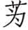子冯：孙叔敖之侄。

②屈到：屈荡之子。

③追舒：楚庄王之子子南。箴尹：谏官。

***【译文】***

楚国公子午任令尹，公子罢戎任右尹，子冯任大司马，公子橐师任右司马，公子成任左司马，屈到任莫敖，公子追舒任箴尹，屈荡任连尹，养由基任宫厩尹，以使国内民众安定。

君子谓：“楚于是乎能官人①。官人，国之急也。能官人，则民无觎心②。《诗》云：‘嗟我怀人，置彼周行③。’能官人也。王及公、侯、伯、子、男、甸、采、卫大夫，各居其列，所谓周行也④。”

***【注释】***

①能官人：恰当地安排官职人选。

②无觎（yú）心：不存非分之想。觎，觊觎，非分之想。

③嗟我怀人，置彼周行：引《诗》出自《诗经·国风·周南·卷耳》。本意指采卷耳的妇女把筐放在大路旁，思念远行的丈夫，这里借喻为想念君子，任用贤人。怀，思念。周行，大路。

④王及公、侯、伯、子、男、甸、采、卫大夫，各居其列，所谓周行也：自王以下，各人都在他应该在的行列里，即所谓“周行”。这是《左传》作者附会诗意的解释。古代王畿外围的地方，以五百里为标准，按照距离的远近分为五等，叫五服，依次为侯服、甸服、男服、采服、卫服。这里的甸、采、卫泛指各级大夫。

***【译文】***

君子认为：“楚国在这件事上称得上善于安排官员。任命官员，这是国家的当务之急。能够合理任命官员，百姓就不会生出非分念头。《诗》说：‘嗟叹我所怀念的贤人，要把他们都安排在恰当的位置上。’就是说能合理地安排官员。王和公、侯、伯、子、男、甸、采、卫各级大夫，各人都在自己应该在的位子上，这就是所谓的‘周行’了。”

15.4 郑尉氏、司氏之乱①，其余盗在宋。郑人以子西、伯有、子产之故②，纳赂于宋，以马四十乘，与师茷、师慧③。三月，公孙黑为质焉④。司城子罕以堵女父、尉翩、司齐与之，良司臣而逸之⑤，托诸季武子，武子置诸卞⑥。郑人醢之三人也⑦。

***【注释】***

①郑尉氏、司氏之乱：襄公十年，尉止、司臣、侯晋、堵女父、子师仆帅贼晨攻执政于西宫之朝，杀子驷、子国、子耳。

②郑人以子西、伯有、子产之故：子西之父子驷、伯有之父子耳、子产之父子国都被尉氏、司氏等杀。

③以马四十乘，与师茷、师慧：以此作为换回“余盗”的礼物。乘，四匹为乘，这里一共一百六十匹。师茷、师慧，二人都是乐师。

④公孙黑为质焉：公孙黑为质于宋。公孙黑，字子晳，子驷之子。

⑤司城子罕以堵女父、尉翩、司齐与之，良司臣而逸之：堵女父、尉翩、司齐及司臣都是尉氏、司氏“余盗”。宋国子罕将堵女父、尉翩、司齐交还给郑国，认为司臣有才能而放走了他。

⑥卞：鲁地，在今山东泗水东。

⑦之三人：指堵女父等三人。之，这。

***【译文】***

郑国尉氏、司氏的叛乱，其残余的叛乱者逃在宋国。郑国因为子西、伯有、子产的关系，送礼给宋国，送去一百六十匹马和乐师师茷、师慧二人。三月，公孙黑去宋国当人质。宋国的司城子罕将堵女父、尉翩、司齐三人交给郑国，觉得司臣有才而将他放走，托付给季武子，季武子把他安顿在卞地。郑国将堵女父等三人施以醢刑。

师慧过宋朝①，将私焉②。其相曰③：“朝也。”慧曰：“无人焉。”相曰：“朝也，何故无人？”慧曰：“必无人焉。若犹有人，岂其以千乘之相易淫乐之矇④？必无人焉故也⑤。”子罕闻之，固请而归之⑥。

***【注释】***

①朝：朝堂。

②私：小便。

③相：古代乐师都是盲人，扶乐师的人叫相。

④岂其以千乘之相易淫乐之矇：意思是宋国不为子产等三人杀盗，而要等到给财礼之后才送回，是重淫乐而轻千乘之相。千乘之相，指子产等人。淫乐，旧称“郑声淫”，当时人或称郑乐为淫乐。矇，盲人，指乐师。

⑤必无人焉故也：暗指宋国没有明哲的人。

⑥固请而归之：向宋平公坚请送回师慧等。

***【译文】***

师慧经过宋国朝堂，要小便。扶持他的相说：“这是朝堂。”师慧：“并没有人啊。”相说：“朝堂怎么会没有人啊？”师慧说：“肯定没有人。如果有人，难道会轻千乘之国的国相而重演唱淫乐的盲人？一定没有人。”子罕听说之后，坚决向宋平公请求把师慧等送回郑国。

15.5 夏，齐侯围成，贰于晋故也①。于是乎城成郛②。

***【注释】***

①齐侯围成，贰于晋故也：齐国因上年范宣子借羽旄不还而怨晋，于是侵犯同盟的鲁国。

②于是乎城成郛：因此筑成地的外城。

***【译文】***

夏，齐灵公包围成地，是因为叛离晋国的缘故。正是在这样的情况下修筑成的外城。

15.6 秋，邾人伐我南鄙①。使告于晋，晋将为会以讨邾、莒②。晋侯有疾，乃止。冬，晋悼公卒，遂不克会③。

***【注释】***

①邾人伐我南鄙：邾人也对晋国怀有二心，故伐鲁。

②晋将为会以讨邾、莒：襄公十二、十四年莒人侵鲁，晋都没有加以讨伐，这次打算一同讨莒。

③晋悼公卒，遂不克会：由于晋悼公去世，未能会合诸侯。

***【译文】***

秋，邾国侵犯我国南部边境。我国派人向晋国报告，晋国准备举行会盟来讨伐邾、莒二国。由于晋悼公生病，事情便搁置下来了。冬，晋悼公去世，没能举行会盟。

15.7 郑公孙夏如晋奔丧⑤，子送葬。

***【注释】***

①公孙夏：子西。郑卿。

***【译文】***

郑国公孙夏到晋国吊丧，又派子前往送葬。

15.8 宋人或得玉，献诸子罕。子罕弗受。献玉者曰：“以示玉人①，玉人以为宝也，故敢献之。”子罕曰：“我以不贪为宝，尔以玉为宝，若以与我，皆丧宝也。不若人有其宝②。”稽首而告曰：“小人怀璧，不可以越乡③。纳此以请死也④。”子罕置诸其里⑤，使玉人为之攻之⑥，富而后使复其所⑦。

***【注释】***

①玉人：治玉的工匠。

②不若人有其宝：不献不纳，二人各有其宝。

③小人怀璧，不可以越乡：越乡必被盗贼所害。意谓地位低下的人藏有宝物一定会遇害。

④请死：请求免于一死。

⑤子罕置诸其里：子罕把献玉者安置在自己居住的里巷。

⑥攻：治理。

⑦富而后使复其所：将玉卖掉，使献玉人富有并让他回归乡里。

***【译文】***

宋国有人得到一块玉石，把它献给子罕。子罕不接受。献玉的人说：“我把玉拿给玉工看过，玉工认为是块宝玉，所以才敢献给您。”子罕说：“我把不贪婪视为宝，你把玉视为宝，如果把玉给了我，你我就都丧失了宝物。不如各人保有各人的宝物吧。”献玉人叩头禀告说：“小人怀藏玉璧，不可能走出所住乡里。请让我把它献纳给您以免一死。”子罕就把献玉人安置在自己居住的里巷，让玉工加工宝玉，将玉卖出，使献玉人富有以后让他回家去了。

15.9 十二月，郑人夺堵狗之妻，而归诸范氏①。

***【注释】***

①郑人夺堵狗之妻，而归诸范氏：堵狗是堵女父族人，娶晋国范氏女为妻。郑国杀了堵女父，怕堵狗依靠范氏作乱，所以先夺走其妻送回给范氏，以绝其援。

***【译文】***

十二月，郑国人抢堵狗的妻子，让她回到范氏娘家去。

# 十六年

***【经】***

16.1 十有六年春王正月①，葬晋悼公。

16.2 三月，公会晋侯、宋公、卫侯、郑伯、曹伯、莒子、邾子、薛伯、杞伯、小邾子于湨梁②。戊寅③，大夫盟。

16.3 晋人执莒子、邾子以归④。

16.4 齐侯伐我北鄙。

16.5 夏，公至自会。

16.6 五月甲子⑤，地震。

16.7 叔老会郑伯、晋荀偃、卫甯殖、宋人伐许。

16.8 秋，齐侯伐我北鄙，围成。

16.9 大雩。

16.10 冬，叔孙豹如晋⑥。

***【注释】***

①十有六年：鲁襄公十六年当周灵王十五年，前557。

②公会晋侯、宋公、卫侯、郑伯、曹伯、莒子、邾子、薛伯、杞伯、小邾子于湨（jú）梁：此会齐侯不来，派高厚参加，高厚逃归，所以不记齐国。湨梁，湨水的堤梁。湨水在今河南西北部，源出济源，东南流入黄河。湨梁在济源西。

③戊寅：二十六日。

④晋人执莒子、邾子以归：邾、莒屡次侵鲁，所以抓走二国国君。

⑤甲子：十三日。

⑥叔孙豹如晋：向晋国报告齐国伐鲁。

***【译文】***

鲁襄公十六年春周历正月，安葬晋悼公。

三月，襄公和晋平公、宋平公、卫殇公、郑简公、曹成公、莒犁比公、邾宣公、薛伯、杞孝公、小邾穆公在湨梁相会。二十六日，诸侯大夫们结盟。

晋国逮捕莒犁比公、邾宣公并带回国。

齐灵公攻打我国北部边境。

夏，襄公从湨梁之会回国。

五月十三日，发生地震。

叔老会同郑简公、晋国荀偃、卫国甯殖、宋国人进攻许国。

秋，齐灵公攻打我国北部边境，包围了成邑。

举行盛大的求雨祭祀。

冬，叔孙豹前往晋国。

***【传】***

16.1 十六年春，葬晋悼公。平公即位①，羊舌肸为傅②，张君臣为中军司马③，祁奚、韩襄、栾盈、士鞅为公族大夫④，虞丘书为乘马御⑤。改服、修官⑥，烝于曲沃⑦。警守而下⑧，会于湨梁。命归侵田⑨。以我故，执邾宣公、莒犁比公，且曰：“通齐、楚之使⑩。”

***【注释】***

①平公：悼公之子彪。

②羊舌肸（xī）：即叔向。傅：平公太傅。《国语·晋语七》叙晋悼公以叔向熟悉《春秋》，乃召叔向使傅太子彪。今彪嗣为晋君，故以之为太傅。

③张君臣：即成公十八年《传》张老之子。

④韩襄：韩阙之孙，韩无忌之子。

⑤乘马御：晋国官名。

⑥改服：脱丧服，穿吉服。修官：选贤能。

⑦烝于曲沃：在曲沃晋国祖庙举行冬祭。烝，冬祭。

⑧警守：在国都布置守备。下：沿黄河而下。

⑨命归侵田：命诸侯皆退回侵占的别国田地。

⑩通齐、楚之使：谴责邾、莒二国使者往来于齐、楚之间。

***【译文】***

鲁襄公十六年春天，安葬晋悼公。晋平公即位，羊舌肸为太傅，张君臣为中军司马，祁奚、韩襄、栾盈、士鞅为公族大夫，虞丘书为乘马御。换上吉服，选贤任能，在曲沃举行烝祭。在国都布置守备后就顺黄河而下，在湨梁与诸侯相会。命令诸侯归还所侵占的别国田地。由于我国的缘故，逮捕了邾宣公、莒犁比公，并且说：“你们二国使者往来于齐、楚之间。”

晋侯与诸侯宴于温①，使诸大夫舞，曰：“歌诗必类②！”齐高厚之诗不类。荀偃怒，且曰：“诸侯有异志矣③！”使诸大夫盟高厚，高厚逃归。于是，叔孙豹、晋荀偃、宋向戌、卫甯殖、郑公孙虿、小邾之大夫盟，曰：“同讨不庭④。”

***【注释】***

①温：在今河南温县西南，湨水边。

②必类：唱的诗要和舞蹈相配，并能表达自己的思想。按，古人舞时必唱诗。

③诸侯有异志矣：荀偃怒高厚公然违反晋平公之命，并且从其诗知道齐有二心。

④不庭：指不忠于盟主晋国者。

***【译文】***

晋平公和诸侯在温地宴饮，让大夫们起舞，说：“所唱的诗必须和舞蹈相配！”齐国高厚所唱的诗不相配。荀偃发怒，并说：“诸侯有叛离的念头了！”叫大夫们和高厚订立盟约，高厚逃回国去。当时，叔孙豹、晋国荀偃、宋国向戌、卫国甯殖、郑国公孙虿和小邾国的大夫订立盟约，说：“共同讨伐不顺从的国家。”

16.2 许男请迁于晋①。诸侯遂迁许，许大夫不可。晋人归诸侯②。郑子闻将伐许，遂相郑伯以从诸侯之师③。穆叔从公。齐子帅师会晋荀偃④。书曰“会郑伯”，为夷故也⑤。夏六月，次于棫林⑥。庚寅⑦，伐许，次于函氏⑧。

***【注释】***

①许男请迁于晋：许都本在今河南许昌东，成公十五年，许灵公为逃避郑国威胁，请楚将许迁于叶。现在请晋迁许，是要叛楚从晋。

②晋人归诸侯：晋国让诸侯各自回国，准备独立讨伐许国大夫。

③郑子闻将伐许，遂相郑伯以从诸侯之师：郑国与许国有宿怨，因此积极参加伐许。

④齐子帅师会晋荀偃：按，以上补叙诸侯返国之前郑、鲁、齐三国的行动。

⑤书曰：“会郑伯”，为夷故也：《经》文记叔老会郑伯，然后再记晋荀偃等人，是为了把次序摆平。夷，平。

⑥棫林：许地名，在今河南叶县东北，与襄公十四年《传》中秦地棫林不是一个地方。

⑦庚寅：初九。

⑧函氏：许地名，在叶县北。

***【译文】***

许灵公向晋平公请求迁往晋地。诸侯帮助许国迁移，许国大夫们却不同意。晋国让诸侯们回国，打算独立讨伐许国。郑子听说要讨伐许国，就辅佐郑简公随同诸侯军队。穆叔跟从襄公。齐子率领军队会合晋国荀偃。《春秋》记载说“会合郑简公”，是为了把次序摆平。夏六月，军队驻扎在棫林。初九，攻打许国，驻兵于函氏。

16.3 晋荀偃、栾黡帅师伐楚，以报宋杨梁之役①。楚公子格帅师及晋师战于湛阪②，楚师败绩。晋师遂侵方城之外③，复伐许而还。

***【注释】***

①晋荀偃、栾黡帅师伐楚，以报宋杨梁之役：晋师单独伐楚。按，襄公十二年冬，楚子囊、秦庶长无地伐宋，师于杨梁。

②湛阪：在今河南平顶山北。

③方城：山名，今河南叶县南有方城山。本为楚国北境，后来方城之外又有被楚国所占领的。

***【译文】***

晋国荀偃、栾黡带兵进攻楚国，以报复在宋国杨梁那一仗。楚国公子格领兵与晋军在湛阪交战，楚兵被打败。晋军便侵袭方城的外边，再次进击许国后班师。

16.4 秋，齐侯围成，孟孺子速徼之①。齐侯曰：“是好勇②，去之以为之名③。”速遂塞海陉而还④。

***【注释】***

①孟孺子速：孟献子之子，名速，谥庄子。徼（yāo）之：拦截齐军。

②是：此人。

③去之以为之名：撤围以成全孟孺子好勇之名。

④海陉：齐、鲁间隘道。

***【译文】***

秋，齐灵公包围成邑，孟孺子速拦截齐军。齐灵公说：“这个人喜欢逞勇，我们离开这里成就他的名声吧。”孟孺子就堵塞了险道海陉而后回去。

16.5 冬，穆叔如晋聘，且言齐故①。晋人曰：“以寡君之未禘祀②，与民之未息③。不然，不敢忘。”穆叔曰：“以齐人之朝夕释憾于敝邑之地，是以大请！敝邑之急，朝不及夕，引领西望曰：‘庶几乎！’比执事之间④，恐无及也！”见中行献子，赋《圻父》⑤。献子曰：“偃知罪矣！敢不从执事以同恤社稷⑥，而使鲁及此。”见范宣子，赋《鸿雁》之卒章⑦。宣子曰：“匄在此⑧，敢使鲁无鸠乎⑨？”

***【注释】***

①且言齐故：齐国再次侵鲁。

②禘祀：指三年丧期之后的吉禘。

③民之未息：刚刚讨伐楚国、许国。

④比执事之间：等到你有空。比，等待。

⑤《圻（qí）父》：《诗经·小雅》的篇名，现在作《祈父》。这里穆叔借诗中责备祈父不尽其职，使百姓受困苦之句表示对晋国的不满。祈父，官名，掌封畿兵甲的司马。

⑥恤：忧虑。

⑦赋《鸿雁》之卒章：《鸿雁》，《诗经·小雅》的篇名。《鸿雁》末章有“鸿雁于飞，哀鸣嗷嗷。维此哲人，谓我劬（qú）劳”等句，献子借以表明鲁国已忧困不安。

⑧匄：即士匄，范宣子。

⑨鸠：安宁。

***【译文】***

冬，穆叔到晋国聘问，并报告齐国侵犯之事。晋国说：“由于寡君还没有禘祀，百姓也没有休养生息，所以不能救援。不是这样的话，是不敢忘记盟誓的。”穆叔说：“由于齐国人时刻在敝国土地上泄愤胡为，所以才郑重其事地来请求！敝国的危急，到了朝不保夕的地步，大家伸长了脖子望着西方说：‘大概来了吧！’如果要等到你们有空，恐怕就来不及了！”于是进见荀偃，赋《圻父》一诗。荀偃说：“我知道错了！岂敢不跟你们一起忧虑国家大计，而让鲁国陷入这样的境地。”荀偃去见士匄，赋《鸿雁》的末章。士匄说：“有我在此，敢让鲁不得安宁？”

# 十七年

***【经】***

17.1 十有七年春王二月庚午①，邾子卒②。

17.2 宋人伐陈。

17.3 夏，卫石买帅师伐曹③。

17.4 秋，齐侯伐我北鄙，围桃④。高厚帅师伐我北鄙，围防。

17.5 九月，大雩。

17.6 宋华臣出奔陈。

17.7 冬，邾人伐我南鄙。

***【注释】***

①十有七年：鲁襄公十七年当周灵王十六年，前556。庚午：二十三日。

②邾子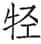（ｋēnɡ）：即邾宣公，名。他去年被晋国抓走，不久放回国。

③卫石买：卫石稷之子。

④桃：鲁地名。在今山东汶上北稍东。

***【译文】***

鲁襄公十七年春周历二月二十三日，邾宣公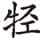去世。

宋国攻打陈国。

夏，卫国石买带兵进攻曹国。

秋，齐灵公侵犯我国北部边境，包围桃城。高厚领兵进犯我国北部边境，包围了防。

九月，举行盛大的求雨祭祀。

宋国华臣奔亡到陈国。

冬，邾国攻打我国南部边境。

***【传】***

17.1 十七年春，宋庄朝伐陈，获司徒卬①，卑宋也②。

***【注释】***

①司徒卬：陈国大夫。

②卑宋：陈因轻视宋而不防备，因此败。

***【译文】***

鲁襄公十七年春，宋国庄朝讨伐陈国，俘获司徒卬，陈国由于轻视宋国而吃败仗。

17.2 卫孙蒯田于曹隧①，饮马于重丘②，毁其瓶③。重丘人闭门而之④，曰：“亲逐而君，尔父为厉⑤。是之不忧，而何以田为？”夏，卫石买、孙蒯伐曹，取重丘。曹人诉于晋⑥。

***【注释】***

①卫孙蒯田于曹隧：孙蒯越过国境打猎。曹隧，曹国隧地。

②重丘：古地名。在今山东茌平西南。

③毁其瓶：孙蒯毁坏重丘人的瓶子。瓶，汲水器。

④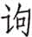：同“诟”，责骂。

⑤为厉：为恶。

⑥曹人诉于晋：按，此为明年晋因此逮住石买、孙蒯做伏笔。

***【译文】***

卫国孙蒯越境到曹国隧地打猎，在重丘饮马，毁坏了汲水瓶。重丘百姓关起门来责骂，说道：“亲自赶走了自己的国君，你父亲做了坏事。你不去忧虑这事，来打猎做什么？”夏，卫国石买、孙蒯进攻曹国，攻重丘。曹国向晋国控诉。

17.3 齐人以其未得志于我故①，秋，齐侯伐我北鄙，围桃。高厚围臧纥于防②。师自阳关逆臧孙，至于旅松③。郰叔纥、臧畴、臧贾帅甲三百④，宵犯齐师，送之而复⑤。齐师去之⑥。

***【注释】***

①齐人以其未得志于我故：去年围成因避孟孺子而未遂。

②齐侯伐我北鄙，围桃。高厚围臧纥于防：齐分二军，一军围桃，一军围防。防，在今山东费县东北，为臧纥采邑。

③师自阳关逆臧孙，至于旅松：鲁师畏惧齐师，不敢直接到防地，从阳关出来迎接臧纥，到旅松便停下来。阳关，鲁地名。在今山东泰安东偏南。旅松，鲁地名。距离防不远。

④郰叔纥：孔丘之父。臧畴、臧贾：臧纥兄弟。

⑤宵犯齐师，送之而复：三人与臧纥都在防城里，夜里护送臧纥到旅松，又回防城守卫。

⑥齐师去之：臧纥已经逃离防城，所以齐国撤兵。

***【译文】***

齐国因为没能从侵犯我国中满足要求，秋，齐灵公攻打我国北部边境，包围了桃地。高厚在防邑包围了臧纥。我军从阳关去接臧孙，到达旅松。郰叔纥、臧畴、臧贾带领甲士三百名，夜袭齐军，把臧纥送到旅松然后返回防邑。齐兵离开了鲁国。

齐人获臧坚①。齐侯使夙沙卫唁之，且曰：“无死！”坚稽首曰：“拜命之辱！抑君赐不终②，姑又使其刑臣礼于士③。”以杙抉其伤而死④。

***【注释】***

①臧坚：臧纥族人。

②抑：但，然而。赐不终：谓“无死”。

③姑又使其刑臣礼于士：虽赐不终，又故意叫贱人夙沙卫来慰问，是有意羞辱我。姑，借为“故”，故意。刑臣，指夙沙卫，是宦官。士，臧坚自称。

④以杙（yì）抉其伤而死：臧坚用小木桩刺进伤口自杀。杙，小木桩。

***【译文】***

齐国俘获臧坚。齐灵公派夙沙卫去慰问他，并且说：“不要死！”臧坚叩头说：“谨此拜谢国君的好意！然而国君赐命我不要死，却又故意派个受宫刑的臣子来慰问士。”就用杙刺进伤口而死。

17.4 冬，邾人伐我南鄙，为齐故也①。

***【注释】***

①为齐故也：为了帮助齐国。

***【译文】***

冬，邾国侵犯我国南部边境，这为了帮助齐国。

17.5 宋华阅卒，华臣弱皋比之室①，使贼杀其宰华吴。贼六人以铍杀诸卢门合左师之后②。左师惧，曰：“老夫无罪。”贼曰：“皋比私有讨于吴③。”遂幽其妻④，曰：“畀余而大璧⑤！”宋公闻之⑥，曰：“臣也不唯其宗室是暴，大乱宋国之政⑦，必逐之！”左师曰：“臣也亦卿也⑧。大臣不顺⑨，国之耻也。不如盖之⑩。”乃舍之⑪。左师为己短策⑫，苟过华臣之门，必骋⑬。十一月甲午⑭，国人逐瘈狗⑮，瘈狗入于华臣氏，国人从之。华臣惧，遂奔陈⑯。

***【注释】***

①华臣：华阅之弟。弱：以为弱而加以侵害。皋比：华阅之子。

②贼六人以铍（pī）杀诸卢门合左师之后：贼人杀华吴于向戌屋后。铍，两刃的剑。卢门，宋城门。合左师，向戌，合是他的采邑，在今山东枣庄与江苏沛县之间。

③皋比私有讨于吴：谎称皋比私自讨华吴。

④遂幽其妻：囚禁华吴的妻子。幽，囚禁。

⑤畀（bì）：给予。

⑥宋公：宋平公。

⑦臣也不唯其宗室是暴，大乱宋国之政：华臣此举，不仅欺凌宗室，而且大乱宋国政令。

⑧臣也亦卿也：华臣也是卿。向戌惧怕华臣，所以为其开脱。

⑨不顺：不和顺。

⑩盖：掩盖。

⑪乃舍之：不逐华臣。

⑫策：马鞭。

⑬苟过华臣之门，必骋：向戌不敢与华臣打照面，每过华臣家门，就帮助御者赶马，疾驰而过。骋，快跑。

⑭甲午：二十二日。

⑮瘈（zhì）狗：疯狗。

⑯华臣惧，遂奔陈：华臣心虚，国人追赶疯狗，他以为是追逐自己，于是逃往陈国。

***【译文】***

宋国华阅去世，华臣认为皋比家族力量微弱，派杀手去杀他的家宰华吴。六名杀手用铍把华吴杀死在卢门向戌家屋后。向戌害怕地说：“我老头子没罪。”杀手说：“是皋比私自讨伐华吴。”把华吴的妻子关起来，说：“把你的大玉璧给我！”宋平公听说后，说：“华臣不仅对其宗室这么残暴，而且使宋国的国政大乱，一定要把他赶走！”向戌说：“华臣也是卿。大臣间不和睦，是国家的耻辱。不如把它掩盖起来。”平公便不再追究此事。向戌为自己预备了短马鞭，只要经过华臣家门前，必定驱马快跑。十一月二十二日，国人驱赶疯狗，疯狗跑进华臣家，国人跟着追进去。华臣害怕了，就逃往陈国。

17.6 宋皇国父为大宰，为平公筑台，妨于农功①。子罕请俟农功之毕，公弗许。筑者讴曰：“泽门之皙②，实兴我役。邑中之黔③，实慰我心。”子罕闻之，亲执扑④，以行筑者⑤，而抶其不勉者⑥，曰：“吾侪小人皆有阖庐以辟燥湿寒暑⑦。今君为一台而不速成，何以为役？”讴者乃止。或问其故，子罕曰：“宋国区区⑧，而有诅有祝，祸之本也⑨。”

***【注释】***

①妨于农功：周历十一月就是现在的九月，正是农业收获季节。

②泽门之皙：皇国父住在泽门，面孔白皙，因此被称为“泽门之皙”。

③邑中之黔：子罕住在城内，面黑，所以称作“邑中之黔”。

④扑：竹鞭。

⑤行：巡视。

⑥抶（chì）：鞭打。不勉者：不卖力者。

⑦阖庐：房屋。辟，躲避。

⑧区区：形容小。

⑨而有诅有祝，祸之本也：子罕认为，国内出现褒贬为官者的歌谣，是不团结出祸乱的根源。

***【译文】***

宋国皇国父为太宰，为平公建造一座台，影响了农事。子罕请求等到农事结束后再建，平公不同意。筑台者唱道：“住在泽门的白面人，征发我们来服役。住在城里的黑脸汉，实在让我们欣慰。”子罕听到后，亲自拿了竹鞭，巡查筑台者，并鞭打不好好干活的人，说道：“我辈小人都有房屋躲避干湿寒暑。如今国君要造一座台你们却不赶快建，又怎么能做其他事情呢？”歌唱的人才停止不唱。有人问子罕这样做的原因，子罕说：“宋国区区小国，却有人被诅咒有人被歌颂，这是祸乱的根源所在。”

17.7 齐晏桓子卒①，晏婴粗缞斩②，苴绖、带、杖，菅屦，食鬻，居倚庐，寝苫，枕草③。其老曰④：“非大夫之礼也⑤。”曰：“唯卿为大夫⑥。”

***【注释】***

①晏桓子：即晏弱，晏婴之父。

②粗缞（cuī）斩：粗布的斩衰。斩缞，最重的一种丧服，用最粗的麻布做成，不缝边。

③苴（jū）绖（dié）、带、杖，菅屦（jù），食鬻（zhōｕ），居倚庐，寝苫（shān），枕草：都是晏婴所行的丧礼。苴绖、带、杖，指苴绖、苴带、苴杖。苴绖，戴在头上的麻带。苴带，系在腰间的麻带。苴杖，竹杖。苴，结子的麻。菅屦，丧服中的草鞋。鬻，粥。居倚庐，住在草棚里。苫，禾杆编的席子。

④其老：晏婴的家宰。

⑤非大夫之礼也：当时士与大夫丧礼各有不同，家宰认为晏婴是以大夫而行士礼。

⑥唯卿为大夫：古代广义的大夫可包括卿。晏婴的意思是只有卿才是大夫，我还够不上大夫的身份。

***【译文】***

齐国晏弱去世。晏婴穿粗麻丧服，头系麻带，腰系麻绳，手拄竹杖，脚穿草鞋，喝粥，住草棚子，睡草垫子，用草做枕头。他的家臣说：“这不是大夫的丧礼。”晏婴说：“只有卿才是大夫。”

# 十八年

***【经】***

18.1 十有八年春①，白狄来②。

18.2 夏，晋人执卫行人石买③。

18.3 秋，齐师伐我北鄙。

18.4 冬十月，公会晋侯、宋公、卫侯、郑伯、曹伯、莒子、邾子、滕子、薛伯、杞伯、小邾子同围齐④。

18.5 曹伯负刍卒于师⑤。

18.6 楚公子午帅师伐郑。

***【注释】***

①十有八年：鲁襄公十八年当周灵王十七年，前555。

②白狄来：白狄来鲁通好。

③石买：石买上年伐曹，曹告于晋，所以今年晋国将他逮捕。

④公会晋侯、宋公、卫侯、郑伯、曹伯、莒子、邾子、滕子、薛伯、杞伯、小邾子同围齐：齐国多次伐鲁而且对晋二心，所以晋国会合诸侯讨齐。

⑤曹伯负刍卒于师：曹成公死于伐齐的军中。负刍，曹成公名。

***【译文】***

鲁襄公十八年春，白狄来我国。

夏，晋国逮捕卫国使节石买。

秋，齐国军队攻打我北部边境。

冬十月，襄公会和晋平公、宋平公、卫殇公、郑简公、曹成公、莒犁比公、邾悼公、滕子、薛伯、杞孝公、小邾穆公一起包围齐国。

曹成公负刍在讨伐齐国的军中去世。

楚国公子午带兵进攻郑国。

***【传】***

18.1 十八年春，白狄始来①。

***【译文】***

鲁襄公十八年春天，白狄第一次来我国。

18.2 夏，晋人执卫行人石买于长子①，执孙蒯于纯留②，为曹故也③。

***【注释】***

①长子：古地名。在今山西长子西郊。

②纯留：古地名。在今山西屯留南。

③为曹故也：去年孙蒯与石买一起攻打曹国。

***【译文】***

夏，晋国在长子逮住卫国使节石买，在纯留逮住孙蒯，是因为曹国被侵之事。

18.3 秋，齐侯伐我北鄙。中行献子将伐齐，梦与厉公讼，弗胜①。公以戈击之，首队于前②，跪而戴之，奉之以走③，见梗阳之巫皋④。他日，见诸道⑤，与之言，同⑥。巫曰：“今兹主必死⑦，若有事于东方，则可以逞⑧。”献子许诺。

***【注释】***

①中行献子将伐齐，梦与厉公讼，弗胜：按，成公十七、十八年荀偃杀晋厉公。

②首队于前：梦见头被晋厉公砍掉。队，同“坠”。

③跪而戴之，奉之以走：把头安上，用两手捧着以防再坠落。

④梗阳：古地名。在今山西清徐。皋：巫名。按，以上是荀偃的梦境。

⑤见诸道：在路上遇见巫皋。

⑥与之言，同：荀偃告诉巫皋自己所做的梦，巫皋同时也梦见荀偃与晋厉公讼争事。

⑦今兹：今年。主：对荀偃的称呼。

⑧若有事于东方，则可以逞：意思是如果东伐齐国，可以有功。事，指战事。

***【译文】***

秋，齐灵公进犯我国北部边境。荀偃准备讨伐齐国，梦见与晋厉公争讼，没有胜诉，厉公用戈击打他，头被砍掉落下来，他跪着把头安好，捧着头跑走，遇见梗阳的巫皋。一天，在路上遇见巫皋，和他交谈起来，发现巫皋和自己做了同样的梦。巫皋说：“今年你一定会死，但要是东边有战事，是可以有功的。”荀偃答应了。

晋侯伐齐，将济河，献子以朱丝系玉二瑴①，而祷曰：“齐环怙恃其险②，负其众庶③，弃好背盟，陵虐神主④。曾臣彪将率诸侯以讨焉⑤，其官臣偃实先后之⑥。苟捷有功，无作神羞⑦，官臣偃无敢复济⑧。唯尔有神裁之⑨！”沉玉而济。

***【注释】***

①瑴（jué）：又作“珏”或“玨”，玉一双。

②环：齐灵公名。

③负：依仗。众庶：人多。

④神主：指百姓。

⑤曾臣：陪臣。按，天子对神自称臣，诸侯为天子之臣，所以诸侯对于神而言称陪臣。彪：晋平公名。

⑥官臣：负具体职责之臣。先后：辅佐。

⑦无作神羞：不让神灵羞耻。

⑧官臣偃无敢复济：不再渡河而归，表示以死求胜。

⑨有：词头，无实义。

***【译文】***

晋平公攻打齐国，将要渡过黄河。荀偃用红丝线系着两对玉，祷告道：“齐国的环倚仗地势险要，人口众多，背弃友好抛弃盟誓，欺凌虐待百姓。陪臣彪将要率领诸侯去讨伐，他的官臣偃在旁边辅佐。如果得胜有功，就不使神明蒙受羞辱，否则官臣偃不敢再渡河回来。请神灵明鉴！”把玉沉入水中后渡过河去。

冬十月，会于鲁济①，寻湨梁之言②，同伐齐。齐侯御诸平阴③，堑防门而守之，广里④。夙沙卫曰：“不能战，莫如守险⑤。”弗听。诸侯之士门焉⑥，齐人多死。范宣子告析文子⑦，曰：“吾知子⑧，敢匿情乎？鲁人、莒人皆请以车千乘自其乡入⑨，既许之矣。若入，君必失国⑩。子盍图之⑪？”子家以告公，公恐。晏婴闻之曰：“君固无勇，而又闻是，弗能久矣。”

***【注释】***

①鲁济：济水流经鲁国处。

②寻湨梁之言：襄公十六年湨梁之盟有“同讨不庭”的盟辞。

③平阴：古地名。在今山东平阴东北。

④堑防门而守之，广里：堑，挖壕沟。防门，在平阴南。广里，所挖壕沟宽一里。

⑤不能战，莫如守险：夙沙卫认为防门无险可守，不能对抗晋军。

⑥门：攻打城门。

⑦析文子：齐国大夫子家。

⑧知：相知，了解。

⑨鲁人、莒人皆请以车千乘自其乡入：鲁在齐都临淄西南，莒在齐都东南，则莒从东南向西北、鲁从西南向东北，并攻齐都。乡，通“向”。

⑩君必失国：意谓齐国必定灭亡。

⑪子盍图之：按，范宣子以上所说的几句话意在恐吓齐灵公。

***【译文】***

冬十月，襄公和晋平公等各国国君在鲁国的济水边会合，重温湨梁会盟的誓言，共同讨伐齐国。齐灵公在平阴抵御，在防门挖了壕沟固守，沟宽达一里。夙沙卫说：“没法和诸侯交战，不如据守险要。”灵公没有采纳。诸侯的甲士攻打防城门，齐军士兵很多战死。士匄告诉子家说：“我了解你，怎敢隐匿真情？鲁国、莒国都请求带一千辆战车从各自国家进攻齐国，我们已经同意了。一旦攻入，贵国国君一定会丢掉国家。你何不考虑出路？”子家把这话告诉灵公，灵公害怕了。晏婴听到后说：“国君本来就没有勇气，现在又听到这话，坚持不了多久了。”

齐侯登巫山以望晋师①。晋人使司马斥山泽之险②，虽所不至，必旆而疏陈之③。使乘车者左实右伪④，以旆先⑤，舆曳柴而从之⑥。齐侯见之，畏其众也，乃脱归⑦。丙寅晦⑧，齐师夜遁。师旷告晋侯曰：“鸟乌之声乐⑨，齐师其遁。”邢伯告中行伯曰⑩：“有班马之声⑪，齐师其遁。”叔向告晋侯曰：“城上有乌，齐师其遁⑫。”

***【注释】***

①巫山：一名孝堂山，在今山东肥城西北。

②斥：侦察。

③虽所不至，必旆而疏陈之：即使军队无法达到的险要之地，也插起大旗为军阵。

④左实右伪：车左实有人，车右为假人。这样原来一车三人，现为二人，多出的人可以多排出兵车。

⑤以旆先：用大旗做先导。

⑥舆曳柴而从之：车后拖着树枝，扬起灰尘，以迷惑对方。

⑦脱归：齐灵公离开齐军，脱身而归。

⑧丙寅晦：二十九日。

⑨鸟乌之声乐：乌鸦叫声欢快，表明敌营已经没人。

⑩邢伯：晋国大夫邢侯。中行伯：即荀偃。

⑪班马：马盘桓不前。

⑫城上有乌，齐师其遁：城，指平阴城。按，以上几句写晋军用物候的方法判断敌情。

***【译文】***

齐灵公登上巫山眺望晋军。晋国派司马侦察山林河泽的险阻，即便大部队无法到达的险要地方，也一定插上旗帜布成稀疏的阵地。让战车上左边站着真甲士右边用假人，打着大旗作先导，车辆后面拉拽着树枝跟进。齐灵公见了，害怕晋军人马众多，便逃离前线回到国都。二十九日，齐军连夜逃走。师旷告诉晋平公说：“乌鸦的叫声很欢快，齐军可能已经逃跑了。”邢侯告诉荀偃说：“有马徘徊不前的声音，齐军可能已经逃跑了。”叔向告诉晋平公：“城墙上有乌鸦，齐军可能已经逃跑了。”

十一月丁卯朔①，入平阴，遂从齐师②。夙沙卫连大车以塞隧而殿③。殖绰、郭最曰：“子殿国师，齐之辱也④。子姑先乎！”乃代之殿。卫杀马于隘以塞道也⑤。晋州绰及之⑥，射殖绰，中肩，两矢夹脰⑦，曰：“止，将为三军获；不止，将取其衷⑧。”顾曰：“为私誓⑨。”州绰曰：“有如日⑩！”乃弛弓而自后缚之⑪。其右具丙亦舍兵而缚郭最⑫，皆衿甲面缚⑬，坐于中军之鼓下。

***【注释】***

①丁卯朔：初一。

②从：追赶。

③隧：山中小路。殿：殿后。

④子殿国师，齐之辱也：夙沙卫是宦官，充当殿后的重任，有辱齐国。

⑤卫杀马于隘以塞道：夙沙卫怀恨在心，杀马塞道以挡住殖绰、郭最二人的退路。

⑥及：赶上。

⑦射殖绰，中肩，两矢夹脰（dòu）：先射一箭中殖绰的肩，又射两箭，从他颈项的两边飞过去。脰，颈项。

⑧止，将为三军获；不止，将取其衷：不逃跑还只是被捕，如果逃跑就一箭射死。衷，中心。

⑨为私誓：殖绰要求两人私下里立誓不加伤害。

⑩有如日：指日为誓。

⑪乃弛弓而自后缚之：解下弓弦从后边反捆殖绰的手。

⑫其右：州绰车右。

⑬衿甲：不解甲。面缚：从后边反捆。

***【译文】***

十一月初一，晋军进入平阴，随即又去追赶齐军。夙沙卫把大车连接起来堵住山中小道并断后。殖绰、郭最说：“你来为我国军队殿后，是齐国的耻辱。你还是先走吧！”便代替他断后。卫夙沙杀掉战马堵塞住险隘小道。晋国州绰赶上齐军，用箭射殖绰，射中他的肩部，两箭又从其脖子的左右边穿过，说道：“站住不动，被我军抓获；不站住，就要射中你的心窝。”殖绰回头说道：“你私下发个誓。”州绰说：“有太阳在上为证！”州绰便卸下弓弦从背后把殖绰捆了。他的车右具丙也放开手中兵器来绑郭最，二人都穿着铠甲反绑着，坐在中军的鼓下。

晋人欲逐归者①，鲁、卫请攻险②。己卯③，荀偃、士匄以中军克京兹④。乙酉⑤，魏绛、栾盈以下军克邿⑥。赵武、韩起以上军围卢⑦，弗克。十二月戊戌⑧，及秦周，伐雍门之萩⑨。范鞅门于雍门，其御追喜以戈杀犬于门中⑩。孟庄子斩其橁以为公琴⑪。己亥⑫，焚雍门及西郭、南郭。刘难、士弱率诸侯之师焚申池之竹木⑬。壬寅⑭，焚东郭、北郭。范鞅门于扬门⑮。州绰门于东闾⑯，左骖迫⑰，还于门中⑱，以枚数阖⑲。

***【注释】***

①晋人欲逐归者：追赶齐国逃兵。

②攻险：攻打据险死守的齐军。

③己卯：十三日。

④京兹：古地名。在山东平阴东南。

⑤乙酉：十九日。

⑥邿：齐地名。在平阴西。

⑦卢：齐地名。在今山东长清西南。

⑧戊戌：初二。

⑨及秦周，伐雍门之萩（qiū）：诸侯军队已经逼近齐都临淄城下。秦周，雍门附近。雍门，齐都西门。萩，梓树。

⑩其御追喜以戈杀犬于门中：追喜杀犬以示悠闲自得。

⑪孟庄子斩其橁（chūn）以为公琴：制琴以作为胜利的纪念品。孟庄子，鲁国大夫孺子速。橁，椿树，木材可做琴。公琴，颂琴。

⑫己亥：初三。

⑬刘难、士弱：都是晋国大夫。申池：在齐城南门外。

⑭壬寅：初六。

⑮扬门：齐城西北门。

⑯东闾：齐东门。按，以上表明齐都四门都被包围。

⑰左骖迫：左边骖马由于拥挤不能前进。

⑱还于门中：不能进去，在东门中盘旋。还，旋转，回旋。

⑲以枚数阖：犹云数阖之枚。州绰用马鞭点数门上的乳钉，表示从容不惧。枚，门扇上乳形钉子。阖，门扇。

***【译文】***

晋军准备追赶逃走的齐士兵，鲁、卫二国请求攻打险隘。十三日，荀偃、士匄率中军攻克京兹。十九日，魏绛、栾盈带下军占领邿。赵武、韩起统率上军包围了卢地，但没攻下。十二月初二，到达秦周，砍伐雍门的萩树。范鞅攻打雍门，他的车夫追喜在门里用戈杀死一条狗。孺子速砍了橁树制作颂琴。初三，焚烧雍门和西面、南面的外城。刘难、士弱率领诸侯军队焚烧申池的竹子树木。初六，焚烧东部、北部的外城。范鞅攻打扬门。州绰攻打东闾门，左骖马因为路窄无法前进，只在城门洞里盘旋，州绰用马鞭点数城门上的乳钉。

齐侯驾，将走邮棠①。大子与郭荣扣马②，曰：“师速而疾，略也③。将退矣④，君何惧焉！且社稷之主不可以轻⑤，轻则失众。君必待之。”将犯之⑥。大子抽剑断鞅，乃止⑦。甲辰⑧，东侵及潍⑨，南及沂⑩。

***【注释】***

①邮棠：齐地名。即棠，有说在今山东平度东南。

②大子：太子光。郭荣：齐大夫。扣：拉住。

③师速而疾，略也：疾，攻击奋勇。略，抢夺财物。

④将退矣：诸侯军队没有久战取地的想法。

⑤轻：不持重，即逃走。

⑥将犯之：齐灵公不听，想冲过二人而去。

⑦大子抽剑断鞅，乃止：太子砍断马鞅，则居中的两马与车辕前端的横木分离，不能驾车，齐灵公才停下来。鞅，套在马颈上的皮带。

⑧甲辰：初八。

⑨东侵及潍：晋军往东打到潍水。潍，潍水，发源于山东莒县西北的潍山，经昌邑入海。

⑩南及沂：南抵沂水。沂，沂水，即大沂河，源出山东蒙阴北。

***【译文】***

齐灵公驾车，打算逃往邮棠。太子和郭荣拉住马，说：“敌军行动迅速勇猛，只是在掠夺财物。马上就要退兵了，国君有什么可怕的呢！再说作为一国之主，不能轻举妄动，轻举妄动就会失去民众。您一定要留下来。”灵公想直冲过去，太子拔剑砍断马鞅，才停了下来。初八，诸侯军队向东一直打到潍水，向南到达沂水。

18.4 郑子孔欲去诸大夫，将叛晋而起楚师以去之①。使告子庚②，子庚弗许。楚子闻之，使杨豚尹宜告子庚曰③：“国人谓不穀主社稷而不出师，死不从礼④。不穀即位，于今五年，师徒不出⑤，人其以不穀为自逸而忘先君之业矣。大夫图之！其若之何⑥？”子庚叹曰：“君王其谓午怀安乎⑦！吾以利社稷也。”见使者⑧，稽首而对曰：“诸侯方睦于晋，臣请尝之。若可，君而继之。不可，收师而退，可以无害，君亦无辱。”

***【注释】***

①郑子孔欲去诸大夫，将叛晋而起楚师以去之：郑国从襄公十一年萧鱼之会从晋至今，已经八年。子孔想要专权，襄公十年为载书，遭到子产等人的反对。现在想要叛晋而请楚国出兵除掉各位大夫。

②子庚：楚国令尹公子午。

③杨豚尹宜：豚尹，使者。杨是其氏，宜是其名。

④国人谓不穀主社稷而不出师，死不从礼：指现在不能继承先君的霸业，死后就不能用先君的礼仪祭祀。

⑤师徒不出：自己未尝统帅出兵。

⑥大夫图之！其若之何：按，楚康王主张出兵。

⑦怀安：贪图安逸。

⑧使者：即杨豚尹宜。

***【译文】***

郑子孔想把大夫们免掉，准备背叛晋国而利用楚军来达到这一目的。他派人告诉子庚，子庚不同意。楚康王听到消息，派豚尹杨宜告诉子庚说：“国人在说寡人主持国家却不出兵打仗，死后就不能用先君的礼仪祭祀。我即位到现在已经五年，军队从未打过仗，人们大概以为我只顾自己安逸，忘记了先君的大业。大夫们考虑一下吧！该怎么办呢？”子庚叹气道：“君王可能是认为我在贪图安逸吧！我这样做是为了国家啊。”会见使者，稽首回答说：“诸侯目前正与晋国和睦，请让下臣去试探一下。如果可行，君王就接着来。不行的话，收兵退回，可以没有损害，君王也不会蒙受羞辱。”

子庚帅师治兵于汾①。于是子、伯有、子张从郑伯伐齐②，子孔、子展、子西守③。二子知子孔之谋④，完守入保⑤。子孔不敢会楚师⑥。

***【注释】***

①汾：古地名。在今河南许昌西南，颍水南岸。

②子张：公孙黑肱。

③子孔、子展、子西守：三人留守国内。

④二子：子展、子西。

⑤完守入保：加强守备，入城堡固守。保，同“堡”。

⑥子孔不敢会楚师：子孔的阴谋没能得逞。

***【译文】***

子庚领军在汾地练兵。这时候子、伯有、子张正跟随郑简公攻打齐国，子孔、子展、子西留守国内。子展、子西察觉子孔阴谋，便加强守备入城坚守。子孔不敢和楚军会合。

楚师伐郑，次于鱼陵①。右师城上棘，遂涉颍②，次于旃然③。子冯、公子格率锐师侵费滑、胥靡、献于、雍梁④，右回梅山⑤，侵郑东北，至于虫牢而反⑥。子庚门于纯门⑦，信于城下而还⑧，涉于鱼齿之下⑨。甚雨及之⑩，楚师多冻，役徒几尽⑪。

***【注释】***

①鱼陵：古地名。具体地点不详。

②右师城上棘，遂涉颍：楚右军渡颍水前，在上棘筑小城作防备。上棘，古地名。在今河南禹州颍水边上。

③旃然：水名，即索水，源出河南荥阳南。

④子冯：即薳子冯。费滑：古地名。在今河南偃师南之缑氏镇。胥靡、献于、雍梁：这三处都是郑国的地盘。胥靡，在今偃师东。献于，今地不详。雍梁，或曰在今禹州东北。

⑤右回梅山：向右绕过梅山。梅山，在今郑州西南，与新郑接界。

⑥虫牢：古地名。在今河南封丘北。

⑦纯门：郑都外郭门。

⑧信：住二宿。

⑨鱼齿：古地名。在今河南平顶山西北。

⑩甚雨：大雨。

⑪楚师多冻，役徒几尽：天寒多雨，军中役徒几乎都冻死，楚军无功而还。

***【译文】***

楚军进攻郑国，驻军鱼陵。右翼部队在上棘筑城，又徒步涉水渡过颍水，驻扎在旃然。子冯、公子格率领精锐人马侵袭费滑、胥靡、献于、雍梁，往右绕过梅山，攻打郑国东北，到达虫牢后回师。子庚进攻纯门，在城下住了两夜后回师，在鱼齿山下涉水渡河。赶上大雨，楚军中很多人被冻坏，服杂役的人几乎都死光了。

晋人闻有楚师，师旷曰：“不害。吾骤歌北风①，又歌南风。南风不竞②，多死声。楚必无功③。”董叔曰：“天道多在西北，南师不时，必无功④。”叔向曰：“在其君之德也⑤。”

***【注释】***

①骤：屡次。风：指曲调，如《诗经》中的《国风》。

②不竞：不强劲。

③楚必无功：古人常以乐律占卜出兵吉凶。

④天道多在西北，南师不时，必无功：这里指岁星（木星）在西北，对南方不利，楚军出征不合天时。天道，岁星所行之道。

⑤在其君之德也：意思是不在天时地利，而在人和。

***【译文】***

晋国听说楚国发兵，师旷说：“不要紧。我屡次歌唱北方的歌曲，又唱南方的歌曲。南曲不强，多为象征死亡的声音。楚国一定不能成功。”董叔说：“今年岁星多在西北，南边军队不合天时，肯定不会成功。”叔向说：“胜败取决于国君的德行。”

# 十九年

***【经】***

19.1 十有九年春王正月①，诸侯盟于祝柯②。晋人执邾子。

19.2 公至自伐齐。

19.3 取邾田，自漷水③。

19.4 季孙宿如晋④。

19.5 葬曹成公。

19.6 夏，卫孙林父帅师伐齐。

19.7 秋七月辛卯⑤，齐侯环卒⑥。

19.8 晋士匄帅师侵齐，至谷，闻齐侯卒，乃还⑦。

19.9 八月丙辰⑧，仲孙蔑卒⑨。

19.10 齐杀其大夫高厚。

19.11 郑杀其大夫公子嘉⑩。

19.12 冬，葬齐灵公。

19.13 城西郛⑪。

19.14 叔孙豹会晋士匄于柯⑫。

19.15 城武城⑬。

***【注释】***

①十有九年：鲁襄公十九年当周灵王十八年，前554。

②诸侯：指去年围齐各国。祝柯：古地名。在今山东长清东北。

③取邾田，自漷（ｋｕò）水：晋国为鲁取回邾国所占的田地，并以漷水划定鲁、邾疆界。漷水，源出今山东峄城西北，经鱼台东北入泗水。

④季孙宿如晋：拜谢晋国。

⑤辛卯：二十八日。

⑥齐侯环卒：齐灵公去世。

⑦谷：齐地名，在今山东东阿南的东阿镇。

⑧丙辰：二十三日。

⑨仲孙蔑卒：鲁国孟献子死。

⑩郑杀其大夫公子嘉：郑国杀了子孔。

⑪城西郛：鲁国修筑西边外城城墙。

⑫柯：古地名。在今河南内黄东北。

⑬武城：古地名。在今山东嘉祥，靠近齐国。

***【译文】***

鲁襄公十九年春周历正月，诸侯在祝柯结盟。晋国逮捕了邾悼公。

襄公从讨齐前线归来。

取得邾国田地，从漷水起都归我国。

季孙宿到晋国。

安葬曹成公。

夏，卫国孙林父带兵进攻齐国。

秋七月二十八日，齐灵公环去世。

晋国士匄领兵侵袭齐国，到达谷地，听到齐灵公的死讯，便撤军回国。

八月二十三日，仲孙蔑去世。

齐国杀了他们的大夫高厚。

郑国杀了他们的大夫公子嘉。

冬，安葬齐灵公。

修筑都城西边外城。

叔孙豹和晋国士匄在柯会面。

修筑武城城墙。

***【传】***

19.1 十九年春，诸侯还自沂上，盟于督扬①，曰：“大毋侵小②。”执邾悼公，以其伐我故③。遂次于泗上④，疆我田⑤。取邾田，自漷水归之于我⑥。

***【注释】***

①督扬：即祝柯。

②大毋侵小：大国不要侵略小国。

③执邾悼公，以其伐我故：襄公十七年邾国攻打鲁国。

④泗上：泗水边上。

⑤疆我田：划定鲁国疆界。

⑥取邾田，自漷水归之于我：漷水以西的田地，有的是鲁田，被邾占去，有的本来就是邾田。现在以漷水为界，凡漷水以西的田地都归鲁国。

***【译文】***

鲁襄公十九年春，诸侯从沂水边回来，在督扬结盟，盟誓说：“大国不得侵犯小国。”逮捕邾悼公，因为他进攻我国之故。诸侯军队又驻在泗水边，划定我国与邾国边界。取得被邾国占有的田地，从漷水起都归我国所有。

晋侯先归。公享晋六卿于蒲圃①，赐之三命之服；军尉、司马、司空、舆尉、候奄，皆受一命之服。贿荀偃束锦②，加璧，乘马③，先吴寿梦之鼎④。

***【注释】***

①蒲圃：鲁国场圃名。

②束：五匹为一束。

③乘：四马为乘。

④先吴寿梦之鼎：先送束锦等物，再送吴寿梦之鼎。按，因为荀偃是中军帅，所以加赐。

***【译文】***

晋平公先回国。襄公在蒲圃设享礼招待晋国六卿，赐给他们三命的车服；军尉、司马、司空、舆尉、候奄，都得到一命车服。送给荀偃五匹锦，加上玉璧，四匹马，再送吴寿梦铜鼎。

荀偃瘅疽，生疡于头①。济河，及著雍②，病，目出③。大夫先归者皆反。士匄请见，弗内。请后④，曰：“郑甥可⑤。”二月甲寅⑥，卒，而视，不可含⑦。宣子盥而抚之⑧，曰：“事吴敢不如事主⑨！”犹视。栾怀子曰⑩：“其为未卒事于齐故也乎⑪？”乃复抚之曰：“主苟终，所不嗣事于齐者⑫，有如河！”乃暝，受含。宣子出，曰：“吾浅之为丈夫也⑬。”

***【注释】***

①荀偃瘅（dàn）疽，生疡于头：瘅疽，恶疮。疡，疮。

②著雍：晋地名。

③病，目出：荀偃病危，连眼珠都鼓出来。

④请后：问谁为继承人。

⑤郑甥：指荀吴，其母为郑女，他是郑国外甥。

⑥甲寅：十九日。

⑦而视，不可含：荀偃死后眼睛睁着，口紧闭，不能含玉。含，古人以珠玉放在死者口中。

⑧宣子盥而抚之：士匄为荀偃盥洗并抚尸。

⑨事吴敢不如事主：将像事奉你一样事奉荀吴。

⑩栾怀子：即栾盈。

⑪为未卒事于齐故也乎：恐怕是伐齐之事未完成而死不瞑目。

⑫嗣事：继续从事。

⑬吾浅之为丈夫也：自恨浅薄，不理解荀偃的心志。

***【译文】***

荀偃生恶疮，头上长了个疮。渡过黄河，到达著雍的时候，病危，眼睛都鼓出来了。大夫先回国的都赶回来。士匄请求见他，不接纳。派人问他谁可以做继承人，回答：“可立郑国女子所生的荀吴。”二月十九日，去世，眼睛睁着，口紧闭无法放入珠玉。士匄替他盥洗后抚摸着遗体，说：“事奉荀吴，怎敢不如事奉您！”还是睁着眼睛。栾盈说：“大概是因为攻打齐国的事还没完成的缘故吧？”便又抚摸着遗体说：“如果您死后我们不继续进攻齐国的话，有河神为证！”荀偃这才合上眼睛，松开嘴巴接受做口含的珠玉。士匄出来后，说道：“作为一个男人，我实在太浅薄了啊。”

19.2 晋栾鲂帅师从卫孙文子伐齐①。

***【注释】***

①晋栾鲂帅师从卫孙文子伐齐：上面栾盈说将“嗣事于齐”，因此晋、卫再次伐齐。

***【译文】***

晋国栾鲂率军随从卫国孙文子讨伐齐国。

19.3 季武子如晋拜师①，晋侯享之。范宣子为政②，赋《黍苗》③。季武子兴④，再拜稽首，曰：“小国之仰大国也，如百谷之仰膏雨焉⑤！若常膏之，其天下辑睦，岂唯敝邑？”赋《六月》⑥。

***【注释】***

①季武子如晋拜师：谢晋国讨伐齐国以及为鲁取邾田。

②范宣子为政：范宣子以中军佐升为中军将。

③《黍苗》：《诗经·小雅》的篇名，本是赞美召伯慰劳诸侯，这里借喻为晋国国君关怀鲁国。

④兴：从座位上起来。

⑤小国之仰大国也，如百谷之仰膏雨焉：《黍苗》的开头两句是“芃芃黍苗，阴雨膏之”，季武子就是承这两句而说。膏，润泽。

⑥《六月》：《诗经·小雅》的篇名，赞颂尹吉甫辅佐周王出征之事，这里用尹吉甫比晋平公而赞颂之。

***【译文】***

季孙宿往晋国拜谢出兵，晋平公设享礼款待他。范宣子任执政，赋《黍苗》一诗。季孙宿从座位上起来，再拜叩头说：“小国仰望大国，就如百谷仰望润泽的雨水！如果能经常滋润，将会使天下和睦安定，岂止敝国？”他赋了《六月》一诗。

19.4 季武子以所得于齐之兵作林钟而铭鲁功焉①。臧武仲谓季孙曰：“非礼也。夫铭，天子令德②，诸侯言时计功③，大夫称伐④。今称伐，则下等也⑤；计功，则借人也⑥，言时，则妨民多矣，何以为铭？且夫大伐小，取其所得，以作彝器⑦，铭其功烈⑧，以示子孙，昭明德而惩无礼也。今将借人之力以救其死⑨，若之何铭之？小国幸于大国⑩，而昭所获焉以怒之，亡之道也⑪。”

***【注释】***

①季武子以所得于齐之兵作林钟而铭鲁功焉：季武子用所获齐国兵器铸成林钟，并用铭文记载鲁国的武功。林钟，又称大林。

②天子令德：天子作铭文记载德行而不记功。令，动词，令德即铭德。

③诸侯言时计功：诸侯举动合于时令且有功劳，才作铭文。

④大夫称伐：大夫则记载征伐之劳。

⑤今称伐，则下等也：称伐就是向下等同于大夫。

⑥计功，则借人也：借晋国之力。

⑦彝器：宗庙常用的礼器，如钟、鼎。

⑧功烈：同义词连用。烈，功。

⑨今将借人之力以救其死：现在鲁国只是借晋国之力挽救自己的危亡。

⑩小国：指鲁国。幸：侥幸战胜。大国：指齐国。

⑪而昭所获焉以怒之，亡之道也：现在侥幸取胜就铸钟铭功，更会激怒齐国，因此臧武仲反对铸钟。

***【译文】***

季孙宿把在齐国所得到的兵器熔铸成林钟，铭刻上记述鲁国功劳的文字。臧武仲对他说：“这是不合于礼的。铭文，天子用来记载德行，诸侯用来记载符合时令的举动和建立的功劳，大夫用来记载征伐。现在记载征伐，那已是降了一等了；如果说是记载功劳，那是凭别人的力量而取胜的，说是记载合乎时令的举动，其实这一仗对民众的妨害太多了，用什么来记入铭文？况且以大国打小国，把缴获他们的东西制成彝器，铭刻上功业告诉子孙后代，是为了宣扬美德而惩戒无礼。现在却是借他人之力来挽救自己的死亡，怎么能铭刻这些呢？小国侥幸胜了大国，反而宣扬所获战利品以激怒对方，这是亡国之道啊。”

19.5 齐侯娶于鲁，曰颜懿姬，无子。其侄鬷声姬①，生光，以为大子。诸子仲子、戎子②。戎子嬖。仲子生牙，属诸戎子。戎子请以为大子，许之。仲子曰：“不可。废常③，不祥；间诸侯④，难⑤。光之立也，列于诸侯矣⑥。今无故而废之，是专黜诸侯⑦，而以难犯不祥也。君必悔之。”公曰：“在我而已⑧。”遂东大子光⑨。使高厚傅牙，以为大子，夙沙卫为少傅⑩。

***【注释】***

①其侄鬷（zōnɡ）声姬：鬷声姬作为侄女陪嫁。

②诸子：诸妾中姓子的。仲子、戎子：都是宋女。

③常：常规。按，嫡妻无子，立年长者为常，光最长，应立。

④间：触犯。

⑤难：事难成。

⑥光之立也，列于诸侯矣：从襄公三年以来，光多次参加盟会与诸侯征伐，所以说是“列于诸侯”。

⑦今无故而废之，是专黜诸侯：光为太子已为诸侯承认，现在要废掉他，是专横而轻视诸侯。黜，摈弃。

⑧在我而已：废立由我，不在诸侯，灵公坚持废光。

⑨遂东大子光：废太子光并把他迁到东部边境。

⑩夙沙卫为少傅：按，以上是补叙以前的事。

***【译文】***

齐灵公娶鲁国女子为妻，名颜懿姬，没生儿子。随同他陪嫁来的侄女鬷声姬生下光，被立为太子。姬妾中有仲子、戎子。戎子得到宠爱。仲子生下牙，被托付给戎子抚育。戎子请求把牙立为太子，灵公应许了。仲子说：“不可以。废除常规，不吉祥；触犯诸侯，难于成事。光立为太子，已经多次参与诸侯盟会的行列。现在无故废掉他，这是专横而蔑视诸侯，用难以成功的事去触犯‘废常’这不吉祥的事。国君一定会后悔的。”灵公说：“ 一切由我决定。”就把太子光迁移到东部边境。派高厚做牙的太傅，立牙为太子，任命夙沙卫为少傅。

齐侯疾，崔杼微逆光①。疾病而立之②。光杀戎子，尸诸朝③，非礼也。妇人无刑④。虽有刑，不在朝市⑤。

***【注释】***

①微：暗中。

②疾病而立之：乘齐灵公病危，复立光为太子。

③尸诸朝：陈尸于朝。

④妇人无刑：没有专为妇女订立的刑罚条目。

⑤虽有刑，不在朝市：即便犯死刑，也不可暴尸于朝。

***【译文】***

齐灵公生病，崔杼暗地里把光接回来。灵公病危时，崔杼立光为太子。光杀了戎子，把尸体陈列在朝堂上，这是不合乎礼的。妇女没有专门的刑罚。即便受刑，也不能陈尸在朝堂。

夏五月壬辰晦，齐灵公卒①。庄公即位②，执公子牙于句渎之丘③。以夙沙卫易己④，卫奔高唐以叛⑤。

***【注释】***

①夏五月壬辰晦，齐灵公卒：《经》文记载灵公七月死，是按庄公即位后的报告而记。杨伯峻则认为，《经》书七月，《传》书五月，是因为齐用夏历，《经》为鲁史，改从周历。壬辰晦，二十九日。

②庄公：即太子光。

③句渎之丘：即谷丘。在齐国境内。

④以夙沙卫易己：太子光认为是夙沙卫教齐灵公废掉自己。

⑤高唐：古地名。在今山东高唐东。

***【译文】***

夏五月二十九日，齐灵公去世。庄公即位，在句渎之丘逮捕了公子牙。他认定自己被废是夙沙卫出的主意，夙沙卫逃往高唐叛变齐国。

19.6 晋士匄侵齐，及谷，闻丧而还，礼也①。

***【译文】***

晋国士匄进攻齐国，到谷地，听到齐灵公的死讯就撤兵了，这是合乎礼的。

19.7 于四月丁未①，郑公孙虿卒，赴于晋大夫②。范宣子言于晋侯，以其善于伐秦也③。六月，晋侯请于王，王追赐之大路④，使以行⑤，礼也。

***【注释】***

①丁未：十三日。

②郑公孙虿卒，赴于晋大夫：这是追述四月公孙虿死的事。

③善于伐秦：指襄公十四年伐秦，公孙虿劝诸侯之师渡泾。

④王追赐之大路：周王赐公孙虿大路以为褒奖。大路，天子所赐车的总称。

⑤使以行：出葬时让赐车跟在柩车后。行，行葬。士以上之葬，柩车在前，道车、槁车序从，大夫以上更有遣车。

***【译文】***

四月十三日，郑国公孙虿去世，向晋国大夫发去讣告。士匄告知晋平公，因为公孙虿在攻打秦国的战事中表现突出。六月，晋平公向周灵王请求对公孙虿奖赏，周灵王追赐给他大路，让它跟随出葬的车列，这是合于礼的。

19.8 秋八月，齐崔杼杀高厚于洒蓝①，而兼其室②。书曰“齐杀其大夫”，从君于昏也③。

***【注释】***

①洒蓝：齐地名。在今山东临淄城外。

②室：指财货封邑。

③从君于昏也：这是解释《经》文的意思。齐灵公废太子光而改立公子牙，实属昏庸，高厚顺从齐灵公昏聩之令，做公子牙的太傅，因而被杀，是咎由自取。

***【译文】***

秋八月，齐国崔杼在洒蓝杀了高厚，兼并了他的家财采邑。《春秋》记载“齐国杀了他们的大夫”，这是由于高厚顺从了国君昏聩的命令。

19.9 郑子孔之为政也专。国人患之，乃讨西宫之难与纯门之师①。子孔当罪②。以其甲及子革、子良氏之甲守③。甲辰④，子展、子西率国人伐之，杀子孔，而分其室。书曰“郑杀其大夫”，专也。

***【注释】***

①西宫之难：事在襄公十年，尉止等作乱，子孔知道而不告发。纯门之师：去年子孔欲去诸大夫布专政，招楚来伐，楚子庚门于纯门。

②子孔当罪：上述二个事件中子孔都有责，应当抵罪。

③以其甲及子革、子良氏之甲守：子孔已听到风声，招集甲士自保。

④甲辰：十一日。

***【译文】***

郑国子孔执政独断专行。郑国人很担忧，就追究西宫那次祸难和楚国攻打纯门之战的罪责。子孔应该抵罪，他带领自家甲士和子革、子良家的甲士保卫自己。十一日，子展、子西率领国人讨伐他，杀死子孔，瓜分了他的家财采邑。《春秋》记载“郑国杀了他们的大夫”，是因为子孔专横。

子然、子孔，宋子之子也①；士子孔，圭妫之子也②。圭妫之班亚宋子③，而相亲也；二子孔亦相亲也④。僖之四年⑤，子然卒。简之元年⑥，士子孔卒。司徒孔实相子革、子良之室⑦，三室如一，故及于难⑧。子革、子良出奔楚，子革为右尹⑨。郑人使子展当国，子西听政，立子产为卿⑩。

***【注释】***

①子然、子孔，宋子之子也：子然，子革之父。宋子，郑穆公妾。

②士子孔，圭妫之子也：士子孔，即公子志。圭妫，郑穆公妾。

③班：位置。亚宋子：次于宋子。

④二子孔：指子孔与士子孔，两人为同父异母兄弟。相亲：其母相亲，两人也相亲。

⑤僖之四年：郑僖公四年即鲁襄公六年。

⑥简之元年：郑简公元年即鲁襄公八年。

⑦司徒孔：子孔，襄公十年前子驷执政时为司徒。子革：子孔胞侄。子良：士子孔之子，也是子孔侄子。

⑧三室如一，故及于难：三家相亲，所以子革、子良的甲士为子孔守，两家也卷入事件中。

⑨子革为右尹：子革后来为楚国右尹，又称为郑丹、然丹，见昭公十二、十三年《传》。

⑩立子产为卿：按，子产始登上郑国政治舞台。

***【译文】***

子然、子孔，是宋子的儿子；士子孔，是圭妫的儿子。圭妫的位次在宋子之下，但两人关系亲密；两个子孔也关系亲近。郑僖公四年，子然去世。简公元年，士子孔去世。司徒子孔辅助子革、子良两家，三家亲如一家，所以子革、子良也受牵连而遭难。子革、子良逃往楚国，子革任楚国右尹。郑国让子展主政，子西负责日常政务，立子产为卿。

19.10 齐庆封围高唐①，弗克。冬十一月，齐侯围之，见卫在城上，号之②，乃下。问守备焉，以无备告③。揖之，乃登④。闻师将傅⑤，食高唐人⑥。殖绰、工偻会夜缒纳师，醢卫于军⑦。

***【注释】***

①齐庆封围高唐：按，因夙沙卫据高唐而叛。

②见卫在城上，号之：叫夙沙卫。

③问守备焉，以无备告：夙沙卫下城，二人隔着护城河对话。齐庄公问守备情况，夙沙卫告诉他无备。

④揖之，乃登：齐庄公向夙沙卫作揖，卫还礼后又登上城墙，准备与齐庄公死战。

⑤傅：缘城进攻。

⑥食高唐人：夙沙卫让高唐人饱吃一顿。

⑦殖绰、工偻会夜缒纳师，醢卫于军：二人夜里垂下绳子让齐军入城。齐军攻入高唐，杀夙沙卫。殖绰、工偻会，都是齐国大夫。

***【译文】***

齐国庆封包围高唐，没攻下。冬十一月，齐庄公包围了高唐，看见夙沙卫在城上，就高声喊他，夙沙卫就下城来见庄公。问他高唐守备的情况，夙沙卫告诉说没有防备。庄公向他作揖，夙沙卫又返回城上。夙沙卫听说齐军将缘城进攻，就让高唐人马饱吃一顿。殖绰、工偻会夜里垂下绳索让齐军入城，将夙沙卫在军中剁成肉酱。

19.11 城西郛，惧齐也①。

***【注释】***

①惧齐也：鲁国去年和晋国一起伐齐，又以齐兵器铸钟，所以怕齐国来攻。

***【译文】***

修筑都城西边的外城，是因为怕齐国报复。

19.12 齐及晋平，盟于大隧①。故穆叔会范宣子于柯。穆叔见叔向，赋《载驰》之四章②。叔向曰：“肸敢不承命③。”穆叔归，曰：“齐犹未也④，不可以不惧。”乃城武城⑤。

***【注释】***

①大隧：古地名。在今山东高唐。

②赋《载驰》之四章：《载驰》是《诗经·国风·鄘风》的篇名，其第四章有“控于大邦，谁因谁极”二句，穆叔借此表示希望晋国能及时救援。

③肸敢不承命：叔向答应救鲁。可见齐虽然与晋盟，但并没有真正服晋。

④齐犹未也：齐国不会停止攻伐。

⑤城武城：防备齐国。

***【译文】***

齐国和晋国讲和，在大隧结盟。因此穆叔和士匄在柯地相会。穆叔进见叔向，赋《载驰》第四章。叔向说：“我岂敢不接受命令。”穆叔回国后说：“齐国不会就此罢休，不能不小心。”便在武城筑城。

19.13 卫石共子卒①，悼子不哀②。孔成子曰③：“是谓蹷其本④，必不有其宗⑤。”

***【注释】***

①石共子：石买。

②悼子：石买之子石恶。

③孔成子：卫卿孔烝，庄叔达之孙。

④蹷（ｊｕé）：同“蹶”，拔掉。

⑤不有其宗：不能保有其宗族。按，这里是在为襄公二十八年石恶奔晋作伏笔。

***【译文】***

卫国石买去世，石恶并不悲伤。孔成子说：“这叫做丧失了本性，必定不能保全他的宗族。”

# 二十年

***【经】***

20.1 二十年春王正月辛亥①，仲孙速会莒人盟于向②。

20.2 夏六月庚申③，公会晋侯、齐侯、宋公、卫侯、郑伯、曹伯、莒子、邾子、滕子、薛伯、杞伯，小邾子盟于澶渊④。

20.3 秋，公至自会。

20.4 仲孙速帅师伐邾⑤。

20.5 蔡杀其大夫公子燮⑥。蔡公子履出奔楚⑦。

20.6 陈侯之弟黄出奔楚。

20.7 叔老如齐⑧。

20.8 冬十月丙辰朔，日有食之⑨。

20.9 季孙宿如宋⑩。

***【注释】***

①二十年：鲁襄公二十年当周灵王十九年，前553。辛亥：二十一日。

②仲孙速：鲁宗族臣，孟庄子，孟孺子速。向：莒国城邑，在今山东莒县南。

③庚申：初三。

④澶渊：在今河南濮阳西北。原为卫地，现晋已取之。

⑤仲孙速帅师伐邾：对邾国攻打鲁国进行报复。

⑥公子燮：蔡庄公之子。

⑦蔡公子履：燮的同母弟。

⑧叔老如齐：鲁国叔老聘齐。

⑨冬十月丙辰朔，日有食之：此应为前553年8月31日之日环食。丙辰朔，初一。

⑩季孙宿如宋：季武子聘宋。

***【译文】***

鲁襄公二十年春周历正月二十一日，仲孙速和莒国人相会并在向地结盟。

夏六月初三，襄公与晋平公、齐庄公、宋平公、卫殇公、郑简公、曹武公、莒犁比公、邾悼公、滕成公、薛伯、杞孝公，小邾穆公在澶渊会盟。

秋，襄公从盟会回国。

仲孙速领兵进攻邾国。

蔡国杀了他们的大夫公子燮。蔡国公子履逃往楚国。

陈哀公弟弟黄出逃到楚国。

叔老前往齐国。

冬十月初一，发生日食。

季孙宿去宋国。

***【传】***

20.1 二十年春，及莒平。孟庄子会莒人盟于向，督扬之盟故也①。

***【注释】***

①督扬之盟故也：莒多次犯鲁，去年督扬之盟诸侯和解，现在两国再相盟结好。

***【译文】***

鲁襄公二十年春天，和莒国和好。仲孙速和莒国人相会并在向地结盟，这是由于先有督扬盟会的缘故。

20.2 夏，盟于澶渊，齐成故也①。

***【注释】***

①盟于澶渊，齐成故也：齐国去年已经和晋国讲和，为此诸侯再盟于澶渊。

***【译文】***

夏，在澶渊结盟，是由于和齐国讲和。

20.3 邾人骤至①，以诸侯之事弗能报也②。秋，孟庄子伐邾以报之③。

***【注释】***

①邾人骤至：襄公十五、十七年邾国几次攻打鲁国。骤，屡次。

②以诸侯之事弗能报也：邾国认为鲁国连年随同晋国征伐盟会，不能报复。

③孟庄子伐邾以报之：按，上年晋国为鲁国逮捕邾国国君，取得邾国田土，也是对邾伐鲁的报复。

***【译文】***

邾国人屡次来犯，我国因为连年参加诸侯间的盟会征伐，没能报复。秋，孟庄子讨伐邾国作为报复。

20.4 蔡公子燮欲以蔡之晋①，蔡人杀之。公子履，其母弟也，故出奔楚②。

***【注释】***

①蔡公子燮欲以蔡之晋：蔡本是楚的盟国，燮想要以蔡服晋。

②公子履，其母弟也，故出奔楚：杨伯峻认为，杜预说公子履与燮同谋，如果真是这样，就应出奔晋国。也许他并未参与，只是担心因为兄弟的关系而受牵连，所以到楚国去以免除嫌疑。

***【译文】***

蔡国公子燮想让蔡国顺从晋国，蔡国人杀了他。公子履是他的同母弟，所以出逃到楚国。

陈庆虎、庆寅畏公子黄之逼①，诉诸楚曰：“与蔡司马同谋②。”楚人以为讨。公子黄出奔楚③。初，蔡文侯欲事晋，曰：“先君与于践土之盟④，晋不可弃，且兄弟也⑤。”畏楚，不能行而卒⑥。楚人使蔡无常⑦。公子燮求从先君以利蔡，不能而死。书曰“蔡杀其大夫公子燮”，言不与民同欲也⑧。“陈侯之弟黄出奔楚”，言非其罪也⑨。公子黄将出奔，呼于国曰：“庆氏无道，求专陈国，暴蔑其君⑩，而去其亲⑪，五年不灭，是无天也⑫。”

***【注释】***

①陈庆虎、庆寅畏公子黄之逼：怕公子黄夺其政权。庆虎、庆寅，陈国卿大夫。

②与蔡司马同谋：指与蔡公子燮同谋叛楚服晋。

③公子黄出奔楚：楚国讨伐陈国，公子黄奔楚辩解。

④先君：指蔡文侯之父庄侯，名甲午。践土之盟：在僖公二十八年。

⑤且兄弟也：晋、蔡同为姬姓国。

⑥畏楚，不能行而卒：蔡文侯虽有事晋之心，终因畏楚而不能实现，并在宣公十七年去世。

⑦使：役使。无常：没有一定的准则。

⑧言不与民同欲也：当时蔡国大多数人（主要是士大夫）想要从楚，公子燮则要从晋，所以说“不与民同欲”。

⑨“陈侯之弟黄出奔楚”，言非其罪也：《经》文称“弟”以示公子黄无罪，罪在陈哀公与庆虎、庆寅。

⑩暴蔑：轻慢。

⑪而去其亲：公子黄是陈哀公亲属。

⑫五年不灭，是无天也：五年之内不灭亡，就是没有天理了。按，襄公二十三年，二庆被杀。

***【译文】***

陈国庆虎、庆寅害怕公子黄的威逼，向楚国报告：“公子黄和蔡国司马共同谋划要顺服晋国。”楚国为此发起讨伐。公子黄出逃到楚国。当初，蔡文侯想顺服晋国，说道：“先君参加了践土之盟，晋不应丢弃，况且我们还是兄弟关系呢。”但因为怕楚国，没能施行就去世了。楚国役使蔡国全无常规法度，公子燮要求继承先君遗志以有利于蔡国，没办成就死了。《春秋》记载说“蔡国杀了大夫公子燮”，是说公子燮不能与百姓同意愿；“陈哀公弟弟黄出逃到楚国”，说的是并非他的罪过。公子黄临出逃前，在国都高声呼喊：“庆氏无道，想要在陈国专权，轻慢国君，铲除国君的亲属，五年之内不灭亡，就是没有天理了。”

20.5 齐子初聘于齐，礼也①。

***【注释】***

①齐子初聘于齐，礼也：澶渊之盟，齐、鲁也和好，齐庄公又新即位，鲁国派叔老聘齐以示友好。齐子，即《经》文的叔老。

***【译文】***

叔老第一次到齐国聘问，这是合于礼的。

20.6 冬，季武子如宋，报向戌之聘也①。褚师段逆之以受享②，赋《常棣》之七章以卒③。宋人重贿之。归，复命，公享之④。赋《鱼丽》之卒章⑤。公赋《南山有台》⑥。武子去所⑦，曰：“臣不堪也⑧。”

***【注释】***

①报向戌之聘：向戌聘鲁在襄公十五年。

②褚师：官名，这里是以官为氏。段：宋共公之子子石。受享：武子受宋平公的享礼。

③赋《常棣》之七章以卒：七章以卒，第七章与最后一章（即第八章）。《常棣》，《诗经·小雅》的篇名。武子借《常棣》第七、第八章中妻子和兄弟和睦之意，表示鲁、宋两国将和睦相处。

④公享之：襄公设宴招待季武子。

⑤赋《鱼丽》之卒章：《鱼丽》为宴饮宾客之诗，末章称赞食物丰盛，都是时鲜。季武子借以说明聘宋适时。《鱼丽》，《诗经·小雅》的篇名。

⑥公赋《南山有台》：襄公取本诗中“乐只君子，邦家之基”称赞季武子出色完成使命。《南山有台》，《诗经·小雅》的篇名。

⑦去所：离席。

⑧臣不堪也：季武子表示谦让。

***【译文】***

冬，季孙宿到宋国，这是回报向戌的聘问。褚师段迎接他并让他接受宋平公的享礼，季孙宿赋《常棣》的第七、第八章。宋国送他一份厚礼。他回国复命，襄公设享礼慰劳，季孙宿赋《鱼丽》的末章。襄公赋《南山有台》一诗。季孙宿离开坐席，说道：“下臣不敢当。”

20.7 卫甯惠子疾①，召悼子曰②：“吾得罪于君，悔而无及也③。名藏在诸侯之策，曰：‘孙林父、甯殖出其君。’君入，则掩之④。若能掩之，则吾子也。若不能，犹有鬼神，吾有馁而已，不来食矣⑤。”悼子许诺⑥，惠子遂卒。

***【注释】***

①甯惠子：甯殖。

②召：借用为“诏”，告诉。悼子：甯喜。甯殖之子。

③吾得罪于君，悔而无及也：襄公十四年，甯殖与孙林父一起驱逐了卫献公。

④君入，则掩之：卫献公回国，才能掩盖逐君的罪名。

⑤若不能，犹有鬼神，吾有馁而已，不来食矣：甯殖以死后不享受祭祀要挟甯喜，要他迎回卫献公。犹，假如。馁，饿。

⑥悼子许诺：按，这为襄公二十六年卫献公回国伏笔。

***【译文】***

卫国甯殖有病，对甯喜说：“我得罪了国君，后悔已经来不及了。我的名字已记在诸侯的简策上，写着：‘孙林父、甯殖驱逐国君。’只有国君回国才能掩盖这个恶名。你要是掩盖我的罪名，你就是我的好儿子。如果不能，假如有鬼神的话，我宁可挨饿，也不来享受你的祭祀。”甯喜答应，甯殖就死了。

# 二十一年

***【经】***

21.1 二十有一年春王正月①，公如晋。

21.2 邾庶其以漆、闾丘来奔②。

21.3 夏，公至自晋。

21.4 秋，晋栾盈出奔楚。

21.5 九月庚戌朔，日有食之③。

21.6 冬十月庚辰朔，日有食之④。

21.7 曹伯来朝⑤。

21.8 公会晋侯、齐侯、宋公、卫侯、郑伯、曹伯、莒子、邾子于商任⑥。

***【注释】***

①二十有一年：鲁襄公二十一年当周灵王二十年，前552。

②邾庶其以漆、闾丘来奔：庶其逃奔鲁国，以漆、闾丘二地献给鲁国。庶其，邾国大夫。漆，古地名。在今山东邹城。闾丘，在漆东北。

③九月庚戌朔，日有食之：这是前522年8月20日之日环食。庚戌朔，初一。

④冬十月庚辰朔，日有食之：九月已经日环食，十月不应该再有日食，此日食是史官（天文官）误记。庚辰朔，初一。

⑤曹伯来朝：曹武公朝鲁。

⑥商任：古地名。在今河北任县东南。

***【译文】***

鲁襄公二十一年春周历正月，襄公去晋国。

邾国庶其带着漆与闾丘二地来投奔我国。

夏，襄公从晋国回来。

秋，晋国栾盈出逃楚国。

九月初一，发生日食。

冬十月初一，发生日食。

曹武公来我国朝见。

襄公与晋平公、齐庄公、宋平公、卫殇公、郑简公、曹武公、莒犁比公、邾悼公在商任相会。

***【传】***

21.1 二十一年春，公如晋，拜师及取邾田也①。

***【注释】***

①拜师及取邾田也：拜谢襄公十八年晋伐齐师及取邾田。

***【译文】***

鲁襄公二十一年春，襄公到晋国去，拜谢晋国出兵和为鲁国取得邾国田地。

21.2 邾庶其以漆、闾丘来奔。季武子以公姑姊妻之①，皆有赐于其从者。于是鲁多盗。季孙谓臧武仲曰：“子盍诘盗②？”武仲曰：“不可诘也，纥又不能③。”季孙曰：“我有四封④，而诘其盗，何故不可？子为司寇⑤，将盗是务去，若之何不能？”武仲曰：“子召外盗而大礼焉⑥，何以止吾盗？子为正卿，而来外盗⑦，使纥去之⑧，将何以能？庶其窃邑于邾以来，子以姬氏妻之，而与之邑⑨，其从者皆有赐焉。若大盗，礼焉以君之姑姊与其大邑⑩，其次皂牧舆马⑪，其小者衣裳剑带⑫，是赏盗也。赏而去之，其或难焉⑬。纥也闻之，在上位者洒濯其心⑭，壹以待人⑮，轨度其信，可明征也⑯，而后可以治人。夫上之所为，民之归也⑰。上所不为，而民或为之，是以加刑罚焉，而莫敢不惩⑱。若上之所为，而民亦为之，乃其所也⑲，又可禁乎？《夏书》曰⑳：‘念兹在兹，释兹在兹，名言兹在兹，允出兹在兹，惟帝念功(21)。’将谓由己壹也(22)。信由己壹，而后功可念也(23)。”

***【注释】***

①姑姊：姑母。

②诘：禁止。

③不可诘也，纥又不能：臧纥自称无能力诘盗。

④四封：四方边界。

⑤司寇：主刑官员。

⑥子召外盗而大礼焉：指庶其奔鲁而季武子妻之以鲁公之姑母并与之邑。

⑦而来外盗：接纳外盗。

⑧之：指国内盗贼。

⑨而与之邑：另外赏给庶其封邑。

⑩焉：同“之”，指大盗。

⑪其次皂牧舆马：次一等的给予皂牧舆马。皂，皂役，杂役。牧，牧人。

⑫其小者衣裳剑带：最低等的给予衣裳剑带。

⑬赏而去之，其或难焉：一边赏赐盗贼，一边要除掉盗贼，恐怕很难了。

⑭洒濯其心：洗涤其心，使之知礼仪。

⑮壹以待人：待人以诚。

⑯轨度其信，可明征也：轨度，纳之于轨范。信，诚心。征，征信。

⑰夫上之所为，民之归也：上行下效。

⑱惩：警戒。

⑲若上之所为，而民亦为之，乃其所也：上行下效是势所必然。

⑳《夏书》：逸书，《古文尚书》羼入《大禹谟》篇。

(21)“念兹在兹”五句：意思是所思念而为者在于此，所舍弃而不为者在于此，所号令要说者在于此，诚信所行者也在于此。只有天帝才能记下这成功。兹，此，这个，指当时的规范、标准。释，舍弃。名，号令。允，诚信。念功，记功。

(22)将谓由己壹也：《夏书》所说，大概指要由自身来体现标准的一致。将，殆，大概。

(23)信由己壹，而后功可念也：诚信由于自己的一致，然后才可以记录功劳。按，臧武仲在这里意在批评季孙为贪求土地而诚信不一。

***【译文】***

邾国庶其带着漆、闾丘二地来投奔我国。季孙宿把襄公的姑妈嫁给他，他的随从也都有赏赐。当时鲁国的盗贼很多。季孙宿对臧纥说：“你为什么不捕治盗贼？”臧纥说：“盗贼无法捕治，我也没有能力捕治。”季孙宿说：“我国有四面边境的限制用来禁治盗贼，为什么做不到呢？你官居司寇，捕盗是你的职责，为什么做不到呢？”臧纥说：“你把国外的大盗招来，给予优渥的礼遇，又怎么能禁止国内的盗贼呢？你是正卿，把外国的盗贼引来，却要我去除掉国内的盗贼，我怎么可能办得到？庶其在邾国偷盗城邑而来，你把姬氏嫁给他做妻子，还赏给城邑，他的随从也都有赏赐。对大盗，你给他国君的姑妈和大城邑以表示优待，次一等的给予奴隶车马，最差的也给予衣裳剑带，这是在奖赏盗贼。奖赏盗贼又要除去盗贼，这恐怕有难度。我听说，在上位的要洗涤自己的心，专一待人，诚信待人，使它合于法度，有明确的行动做证明，然后才可以治理人民。在上者的所作所为，是人民的榜样。在上者不做而百姓有人做了，由此对他们施以刑罚，就没有人敢不当心。如果在上者做了而百姓也这样做了，这是势所必然的，又怎么能够禁止住呢？《夏书》说：‘想要干的就是这个，想丢弃的就是这个，所要命令的就是这个，诚信所在的就是这个，只有天帝才能记下这功劳。’大约说的就是要由自己来体现标准的一致性。诚信出于自己的一致，而后才可以记录功劳。”

庶其非卿也，以地来，虽贱，必书，重地也①。

***【注释】***

①“庶其非卿也”四句：这是解释《经》文。按《春秋》例，非卿不记载其名。庶其献了土地，虽不是卿，但因重视土地而特记其名。

***【译文】***

庶其不是卿，但他带着城邑来，所以虽然地位卑贱，《春秋》也要加以记载，是因为重视土地。

21.3 齐侯使庆佐为大夫，复讨公子牙之党①，执公子买于句渎之丘②。公子来奔。叔孙还奔燕。

***【注释】***

①齐侯使庆佐为大夫，复讨公子牙之党：齐庄公即位，清除公子牙同党，崔杼、庆佐的势力日益强大。庆佐，崔杼的同党。

②公子买：与下面的公子、叔孙还都是齐国的公族。

***【译文】***

齐庄公任命庆佐为大夫，再次讨伐公子牙的党羽，在句渎之丘逮捕了公子买。公子逃来我国。叔孙还出逃燕国。

21.4 夏，楚子庚卒，楚子使薳子冯为令尹。访于申叔豫①，叔豫曰：“国多宠而王弱，国不可为也②。”遂以疾辞。方暑，阙地，下冰而床焉③。重茧，衣裘，鲜食而寝④。楚子使医视之，复曰：“瘠则甚矣，而血气未动⑤。”乃使子南为令尹⑥。

***【注释】***

①访：与人商议。申叔豫：申叔时之孙。

②国不可为也：国事没法做好，意思是不能去当令尹。

③阙地，下冰而床焉：挖地，放上冰块再安置床，使寒气更重。

④重茧，衣裘，鲜食而寝：薳子冯用装病来推辞当令尹。重茧，两层棉袍。鲜食，吃得很少。

⑤瘠则甚矣，而血气未动：虽然很瘦，但血气正常。说明没病。

⑥子南：即公子追舒。

***【译文】***

夏，楚国子庚去世，楚康王任命薳子冯当令尹。薳子冯向申叔豫请教。申叔豫说：“国家宠臣众多而君王年轻，国家没办法管好。”于是薳子冯以疾病为辞不当令尹。正当大暑天，他挖地，埋进冰块后架上床。身穿两层棉衣，又穿上皮袍，吃得很少，躺在床上。楚王派医生去探视，回来报告说：“虽然很瘦，但血气没亏。”楚王便任命子南为令尹。

21.5 栾桓子娶于范宣子，生怀子①。范鞅以其亡也，怨栾氏②，故与栾盈为公族大夫而不相能③。桓子卒，栾祁与其老州宾通④，几亡室矣⑤。怀子患之。祁惧其讨也，诉诸宣子曰：“盈将为乱，以范氏为死桓主而专政矣⑥，曰：‘吾父逐鞅也，不怒而以宠报之⑦，又与吾同官而专之⑧，吾父死而益富⑨。死吾父而专于国，有死而已，吾蔑从之矣⑩。’其谋如是，惧害于主⑪，吾不敢不言。”范鞅为之征⑫。怀子好施⑬，士多归之。宣子畏其多士也，信之⑭。怀子为下卿⑮，宣子使城著而遂逐之⑯。

***【注释】***

①栾桓子娶于范宣子，生怀子：栾桓子娶士匄之女。栾桓子，即栾黡。怀子，即栾盈。

②范鞅以其亡也，怨栾氏：襄公十四年，诸侯伐秦，栾黡之弟栾主动要求与范鞅冲击秦师，结果范鞅生还而栾战死，栾黡认为栾是受范鞅的怂恿才战死的，所以责怪其父范宣子，迫其驱逐范鞅。范鞅出逃秦国，后回国复位。范氏与栾氏结怨。范鞅，士鞅，范宣子士匄之子。

③故与栾盈为公族大夫：襄公十六年，范鞅与栾盈同为公族大夫。不相能：不能共处。

④栾祁：栾黡妻，士匄女，栾盈母。杨伯峻指出，范氏传为尧的后代，本祁姓。周时妇女举姓不氏，所以叫栾祁。其老州宾：老，室老，大夫家臣之长，名州宾。通：通奸。

⑤几亡室矣：栾氏家财几乎全为州宾侵占。

⑥盈将为乱，以范氏为死桓主而专政矣：栾祁诬陷栾盈，说他认为是范氏弄死栾黡。桓主，栾黡。

⑦吾父逐鞅也，不怒而以宠报之：范鞅由秦国回晋后，栾黡不怒，反而让他为公族大夫。

⑧又与吾同官而专之：同为公族大夫而范鞅独断专行。

⑨吾父死而益富：范氏更富。

⑩死吾父而专于国，有死而已，吾蔑从之矣：栾祁诬陷栾盈将以死作难。蔑，无。

⑪主：指范宣子士匄。

⑫范鞅为之征：替栾祁作证。征，证。

⑬好施：好施舍。

⑭宣子畏其多士也，信之：怕栾盈得人心而势力更大，便相信栾祁的话。

⑮怀子为下卿：栾盈当时任下军佐，位居第六。

⑯宣子使城著而遂逐之：范宣子令栾盈到著地筑城乘机赶走他。著，晋国城邑，可能即著雍。

***【译文】***

栾黡娶范宣子士匄之女为妻，生下栾盈。范鞅因为曾被迫逃亡一事，怨恨栾氏，所以虽然和栾盈同为公族大夫却不能友好相处。栾黡去世后，其妻栾祁和家宰州宾私通，州宾几乎把栾家家产全都侵吞。栾盈感到很烦恼。栾祁害怕他讨伐，向士匄诉说道：“栾盈将要发动叛乱，认为是范氏把栾黡弄死从而把持国政，他说：‘我父亲赶走范鞅，待他回国以后不但不愤怒反而报以宠信，又和我同任公族大夫官，而他则大权独揽，我父亲去世后他更富了。弄死我父亲而掌国政，我宁可死，也不愿服从他！’他的阴谋就是这样，我担心会伤害您，所以不敢不告知您。”范鞅也证实她的话是事实。栾盈喜好施舍周济别人，很多士人都归附他。士匄害怕归附栾盈的士人众多，就相信了栾祁的话。栾盈任下卿，士匄派他负责修筑著地城墙遂乘机赶走他。

秋，栾盈出奔楚。宣子杀箕遗、黄渊、嘉父、司空靖、邴豫、董叔、邴师、申书、羊舌虎、叔罴①。囚伯华、叔向、籍偃②。人谓叔向曰：“子离于罪，其为不知乎③？”叔向曰：“与其死亡若何④？《诗》曰：‘优哉游哉，聊以卒岁。’知也⑤。”

***【注释】***

①宣子杀箕遗、黄渊、嘉父、司空靖、邴豫、董叔、邴师、申书、羊舌虎、叔罴：以上十人都是晋国大夫，栾盈同党。

②叔向：他并非栾盈同党，因其弟羊舌虎与栾盈同党而牵连入狱。籍偃：当时任上军司马。

③子离于罪，其为不知乎：离，遭遇。知，同“智”。

④与其死亡若何：虽受囚而胜于死亡。

⑤《诗》曰：“优哉游哉，聊以卒岁。”知也：叔向认为优游于乱世，能避害而终其寿，就是智。引诗为逸诗，今《诗经》中有和它相近的诗句。

***【译文】***

秋，栾盈逃往楚国。士匄杀了箕遗、黄渊、嘉父、司空靖、邴豫、董叔、邴师、申书、羊舌虎、叔罴。囚禁了伯华、叔向、籍偃。有人对叔向说：“你被牵连入狱，是不明智的结果吧？”叔向说：“比起死与逃亡来说又怎么样？有《诗》说：‘优哉游哉，能避害而终寿。’这就是明智啊。”

乐王鲋见叔向曰①：“吾为子请②！”叔向弗应。出，不拜③。其人皆咎叔向。叔向曰：“必祁大夫④。”室老闻之⑤，曰：“乐王鲋言于君，无不行，求赦吾子，吾子不许。祁大夫所不能也⑥，而曰必由之，何也？”叔向曰：“乐王鲋，从君者也⑦，何能行？祁大夫外举不弃仇，内举不失亲⑧，其独遗我乎？《诗》曰：‘有觉德行，四国顺之⑨。’夫子，觉者也⑩。”

***【注释】***

①乐王鲋：晋国大夫乐桓子。

②请：请求释放。

③出，不拜：乐王鲋出，叔向不拜。

④必祁大夫：只有祁奚能救我。

⑤室老：羊舌氏家臣之长。

⑥不能：做不到。

⑦从君：只会看国君脸色行事。

⑧祁大夫外举不弃仇，内举不失亲：襄公三年祁奚请老时推荐其仇解狐、其子祁午和羊舌赤，君子赞曰：“祁奚于是能举善矣。称其仇，不为谄。立其子，不为比。举其偏，不为党。”

⑨有觉德行，四国顺之：引《诗》见《诗经·大雅·抑》。意思是德行公正，则天下顺从。觉，通“梏”。正直，高大。

⑩夫子，觉者也：祁奚是正直的人。夫子，对第三人的敬称，这里指祁奚。

***【译文】***

乐王鲋去见叔向，说：“我可以为你去求情！”叔向没应声。乐王鲋走的时候，叔向也不拜送。叔向的随从都责备他。叔向说：“一定要祁大夫才能救我。”他的家宰听说后，对他说：“乐王鲋对国君说的话，没有不被采纳的，他要去请求赦免你，你不答应。可这是祁大夫所无法办到的，你却说一定要通过他，这是为什么？”叔向说：“乐王鲋，只是顺从国君的人，他怎么能行？祁大夫举荐外族人不丢弃仇家，举拔族内人时不失去亲人，他难道会单单把我遗漏掉吗？《诗》说：‘有正直的德行，四方的人都会归顺他。’祁大夫正是这样正直的人啊。”

晋侯问叔向之罪于乐王鲋，对曰：“不弃其亲，其有焉①。”于是祁奚老矣②，闻之，乘驲而见宣子③，曰：“《诗》曰：‘惠我无疆，子孙保之④。’《书》曰：‘圣有谟勋，明征定保⑤。’夫谋而鲜过、惠训不倦者⑥，叔向有焉，社稷之固也⑦。犹将十世宥之⑧，以劝能者。今壹不免其身⑨，以弃社稷，不亦惑乎？鲧殛而禹兴⑩；伊尹放大甲而相之，卒无怨色⑪；管、蔡为戮，周公右王⑫。若之何其以虎也弃社稷？子为善，谁敢不勉⑬？多杀何为？”宣子说，与之乘⑭，以言诸公而免之⑮。不见叔向而归⑯。叔向亦不告免焉而朝⑰。

***【注释】***

①不弃其亲，其有焉：乐王鲋怀恨而落井下石，说叔向不弃兄弟，可能同谋。亲，指羊舌虎。

②于是祁奚老矣：祁奚请老在襄公三年，十六年又出为公族大夫，现又已告老退休。

③驲（rì）：传车。杨伯峻指出，当时祁奚住处可能离晋都新绛远，所以乘传，取其快速。

④惠我无疆，子孙保之：引《诗》见《诗经·周颂·烈文》。意思是恩赐我们无边际，子子孙孙保持它。

⑤圣有谟勋，明征定保：引《书》为逸书，今纂入《古文尚书·胤征》篇。意思是圣人有谋略功勋，应当明信而保护。谟，谋略。按，祁奚在这里引诗、书都是用来称赞叔向。

⑥夫谋而鲜过：此即“圣有谟勋”。惠训不倦：此即“惠我无疆”。

⑦社稷之固：国家柱石。

⑧犹将十世宥之：其十代子孙犯罪都要追念其功业而加以赦宥。

⑨壹：指羊舌虎这件事。身：自身。

⑩鲧殛（ｊí）而禹兴：鲧治水无功，舜将他流放，而用其子禹。这是不以父罪废其子。

⑪伊尹放大甲而相之，卒无怨色：太甲为汤之孙，即位荒淫，伊尹把他放逐到桐宫三年，待他改过后复位，自己为相，太甲始终没有怨色。伊尹，商汤之相。这是君臣不相怨。

⑫管、蔡为戮，周公右王：管叔、蔡叔和周公是三兄弟，管、蔡叛周助殷，周公杀了管、蔡而辅佐成王。这是兄弟不同，不能同罪。按，以上三例都是意在说明不能搞株连。

⑬勉：尽力。

⑭与之乘：因为祁奚是乘传车，不可以朝，所以士匄“与之乘”。

⑮言诸公而免之：劝说晋平公赦免叔向。

⑯不见叔向而归：叔向已被赦免，祁奚不见他就回去了。

⑰叔向亦不告免焉而朝：叔向也不告谢祁奚，只朝晋平公。按，二人都是不讲私情，秉公办事。

***【译文】***

晋平公向乐王鲋询问叔向的罪责，乐王鲋回答说：“他这人不会背弃自己的亲人，他可能参与了叛乱的策划。”这时祁奚已告老退休，听说此事后，乘坐驿车去见士匄，说道：“《诗》说：‘赐给我们的恩惠无边无际，子子孙孙永远保有它。’《书》说：‘圣贤有谋略功勋，应当对他信任保护。’说到谋划而少有过错，教诲别人不知疲倦，叔向都具备了，这是国家的柱石啊。即便他的子孙十代有罪都要赦免，用来激励有能力的人。可现在因一点罪过却连自身都无法免罪，国家的栋梁弃之不顾，不也太让人疑惑不解吗？鲧被杀而他的儿子禹受重用；伊尹曾放逐太甲而太甲后来用他为相，并且始终没有怨恨的情绪；管叔、蔡叔被杀，而他们的兄长周公却辅佐成王。为什么要因为一个羊舌虎，而损失一个国家栋梁？您如果做此好事，谁敢不努力？何必要多杀人呢？”士匄听了觉得说得对，就和祁奚一起乘车入朝，劝说晋平公赦免了叔向。祁奚没有去见叔向就回家了。叔向出来后也没有去拜谢祁奚，只是朝见晋平公。

初，叔向之母妒叔虎之母美而不使①，其子皆谏其母。其母曰：“深山大泽，实生龙蛇。彼美，余惧其生龙蛇以祸女。女，敝族也②。国多大宠③，不仁人间之④，不亦难乎？余何爱焉⑤！”使往视寝，生叔虎。美而有勇力，栾怀子嬖之，故羊舌氏之族及于难⑥。

***【注释】***

①不使：不让她侍寝。

②敝：衰败。

③国多大宠：六卿专权，都受大宠。

④不仁人间之：不仁人挑拨六卿。间，离间。

⑤余何爱焉：意思是自己是为羊舌氏考虑，不是为个人打算。爱，爱惜。

⑥故羊舌氏之族及于难：以上补叙羊舌虎出生及羊舌氏遭此难的预言。

***【译文】***

当初，叔向的母亲嫉妒叔虎的母亲漂亮而不让她侍寝，她的儿子们都劝谏她。她说：“深山大泽，是产生龙蛇一类妖异的地方。她这么美，我担心她生下龙蛇似的人来祸害你们。你们是衰败的家族。国家受宠信的大族很多，坏人又从中挑拨，想要太平无事不也很难了吗？我自己又有什么舍不得的呢！”便让她去侍寝，生下叔虎。叔虎长得美而有勇力，栾盈很宠爱他，于是羊舌氏家族遭受祸害。

栾盈过于周，周西鄙掠之①。辞于行人曰②：“天子陪臣盈得罪于王之守臣③，将逃罪。罪重于郊甸④，无所伏窜，敢布其死⑤。昔陪臣书能输力于王室⑥，王施惠焉。其子黡不能保任其父之劳⑦。大君若不弃书之力⑧，亡臣犹有所逃⑨。若弃书之力，而思黡之罪，臣，戮余也⑩，将归死于尉氏⑪，不敢还矣。敢布四体⑫，唯大君命焉！”王曰：“尤而效之，其又甚焉⑬！”使司徒禁掠栾氏者，归所取焉。使候出诸辕⑭。

***【注释】***

①周西鄙掠之：西鄙的人劫掠其财物。

②辞于行人：栾盈向周室使者申诉。

③陪臣：诸侯之臣对天子的自称。王之守臣：王室守土之臣，这里指晋平公。

④罪重于郊甸：栾盈被西鄙的人劫掠，委婉地说是重得罪于郊甸。郊、甸，古代城郭外叫郊，郊外叫甸。

⑤敢布其死：冒死进言。

⑥书：栾书。输力：献力，效力。

⑦保任：保、任，同义词，即保持。

⑧大君：指周王。

⑨亡臣犹有所逃：希望周王看在栾书的功劳上庇护自己。

⑩戮余：逃亡之人幸免于被戮杀，故自云戮余。

⑪尉氏：古代刑狱之官。

⑫敢布四体：杜预曰，一说表示无所隐藏，一说将受刑戮。

⑬尤而效之，其又甚焉：晋国驱逐栾盈，周王以为非，自己如果再掠夺之，罪将更大。

⑭候：候人，迎送宾客之官。辕：山名，在今河南登封西北。

***【译文】***

栾盈经过周，周西部边境的人劫掠了他的财物。栾盈去向周室使者申诉，说：“天子的陪臣栾盈，得罪了天子的守臣，打算逃避惩罚。却又在天子的郊外得罪，无处逃避藏匿，大胆冒死进言。当初陪臣栾书能为王室效力，天子施与恩惠。他的儿子栾黡，不能保住他父亲的功勋。天王如果不忘却栾书的功劳，逃亡在外的陪臣我还有地方逃匿。如果丢弃栾书的功劳，而计较栾黡的罪过，那么臣本是刑余的人，就将要回国死在狱官手里，不敢再回来了。谨此直诉衷曲，唯天王的命令是听！”周灵王说：“别人有过错而去效仿，那过错就更大了！”命令司徒制止抢掠栾氏财物的人，把抢走的财物归还栾氏。派遣候人把栾盈送过辕山。

21.6 冬，曹武公来朝，始见也①。

***【注释】***

①始见也：曹武公即位三年，第一次朝见襄公。

***【译文】***

冬，曹武公前来朝见，这是第一次朝见襄公。

21.7 会于商任，锢栾氏也①。齐侯、卫侯不敬②。叔向曰：“二君者必不免③。会朝，礼之经也④；礼，政之舆也⑤；政，身之守也⑥。怠礼，失政；失政，不立，是以乱也⑦。”

***【注释】***

①会于商任，锢栾氏也：晋国在商任会诸侯，要求他们不要收留栾盈。锢，禁锢。

②齐侯、卫侯：齐庄公、卫殇公。不敬：实际上是齐、卫两国不想遵守不收留栾盈的盟约。

③必不免：将不免于祸。

④礼之经：礼之常，礼仪的规范。

⑤礼，政之舆也：政载礼而行。

⑥政，身之守也：政事是存身之所。

⑦怠礼，失政；失政，不立，是以乱也：政治有失，难以立身。这是在为襄公二十五年齐庄公被杀、二十六年卫殇公被杀伏笔。

***【译文】***

诸侯在商任相会，是为了禁锢栾氏。齐庄公、卫殇公不想遵从。叔向说：“这两国国君肯定不能免于祸难。会盟和朝见，这是礼仪中的规范；礼仪，这是政事的载体；政事，这是存身之所。轻慢礼仪，政事便会有错失；政事错失就难以立身，因此就会发生动乱。”

21.8 知起、中行喜、州绰、邢蒯出奔齐①，皆栾氏之党也。乐王鲋谓范宣子曰：“盍反州绰、邢蒯？勇士也②。”宣子曰：“彼栾氏之勇也，余何获焉③？”王鲋曰：“子为彼栾氏，乃亦子之勇也④。”

***【注释】***

①知起、中行喜、州绰、邢蒯出奔齐：四人都是晋国大夫。

②盍反州绰、邢蒯？勇士也：建议让这二人回来。

③彼栾氏之勇也，余何获焉：其勇只为栾氏，不为己用。获，得。

④子为彼栾氏，乃亦子之勇也：如果你待之如栾氏，也将为你所用。按，据后文，范宣子没有采纳乐王鲋的意见。

***【译文】***

知起、中行喜、州绰、邢蒯出逃齐国，他们都是栾氏的党羽。乐王鲋对士匄说：“何不让州绰、邢蒯回国，他们都是勇士啊。”士匄说：“他们是栾氏的勇士，我又能得到什么？”乐王鲋说：“您如果像栾氏那样待他们，他们也就会成为您的勇士。”

齐庄公朝，指殖绰、郭最曰：“是寡人之雄也①。”州绰曰：“君以为雄，谁敢不雄？然臣不敏②，平阴之役，先二子鸣③。”庄公为勇爵④。殖绰、郭最欲与焉⑤。州绰曰：“东闾之役，臣左骖迫，还于门中，识其枚数⑥。其可以与于此乎？”公曰：“子为晋君也⑦。”对曰：“臣为隶新⑧。然二子者，譬于禽兽，臣食其肉而寝处其皮矣⑨。”

***【注释】***

①雄：雄鸡。这里用来比喻二人之勇。

②不敏：不才。

③平阴之役，先二子鸣：襄公十八年平阴之役，州绰曾抓获殖绰、郭最二人，因此自比于雄鸡斗胜了先打鸣。这是州绰不服气的话。

④勇爵：勇士的爵位。或曰此为用以觞勇士之饮酒器。

⑤殖绰、郭最欲与焉：二人自以为勇，因此想要有一份。

⑥东闾之役，臣左骖迫，还于门中，识其枚数：见襄公十八年《传》。

⑦子为晋君也：指那时是为晋国君而不是为齐国。

⑧臣为隶新：初到齐为臣。

⑨然二子者，譬于禽兽，臣食其肉而寝处其皮矣：平阴之役州绰曾射中殖绰，因此州绰这话的意思是当时要不是手下留情，早已食其肉寝其皮了。

***【译文】***

齐庄公上朝，指着殖绰、郭最说：“这是我的雄鸡。”州绰说：“国君认为他们是雄鸡，谁敢说他们不是？不过下臣不才，在平阴之役中，可是比二人先打鸣。”庄公设立勇士的爵位。殖绰、郭最想得到这爵位。州绰说：“东闾之役中，下臣的左骖马由于路窄进不去，在城门洞中盘旋，我把城门上的乳钉都数了个遍。是不是在这里可以有一份呢？”庄公说：“那时是为晋国国君啊。”回答说：“下臣充当国君仆从的时间不长。但那两个人，用禽兽来打比方的话，下臣早已吃了他们的肉睡在他们的皮上了。”

# 二十二年

***【经】***

22.1 二十有二年春王正月①，公至自会。

22.2 夏四月。

22.3 秋七月辛酉②，叔老卒③。

22.4 冬，公会晋侯、齐侯、宋公、卫侯、郑伯、曹伯、莒子、邾子、薛伯、杞伯、小邾子于沙随④。

22.5 公至自会。

22.6 楚杀其大夫公子追舒⑤。

***【注释】***

①二十有二年：鲁襄公二十二年当周灵王二十一年，前551。

②辛酉：十六日。

③叔老：鲁国大夫子叔齐子。

④沙随：宋地，在今河南宁陵西北。

⑤追舒：楚庄王之子子南。去年为令尹。

***【译文】***

鲁襄公二十二年春周历正月，襄公从商任之会回国。

夏四月。

秋七月十六日，鲁国大夫子叔齐子去世。

冬，襄公和晋平公、齐庄公、宋平公、卫殇公、郑简公、曹武公、莒犁比公、邾悼公、薛伯、杞孝公、小邾穆公在沙随相会。

襄公从沙随之会回国。

楚国杀死他们的大夫公子追舒。

***【传】***

22.1 二十二年春，臧武仲如晋①。雨，过御叔②。御叔在其邑，将饮酒，曰：“焉用圣人③！我将饮酒，而己雨行，何以圣为④？”穆叔闻之，曰：“不可使也，而傲使人⑤，国之蠹也。”令倍其赋⑥。

***【注释】***

①臧武仲：臧孙纥。

②过：探望。御叔：鲁国御邑大夫。

③焉用圣人：指臧孙纥，他多智，时人称之为圣人。

④我将饮酒，而己雨行，何以圣为：御叔意思是说，我正打算饮酒，而他自己却冒雨出行，聪明何用。

⑤不可使也，而傲使人：意思是御叔自己不配出使，反而傲视使者。使人，指臧孙纥。

⑥令倍其赋：将御叔赋税增加一倍以示惩罚。

***【译文】***

鲁襄公二十二年春天，臧孙纥到晋国去。下着雨，他顺道去看望御叔。御叔在他的封邑里，正准备饮酒，说：“要这个圣人有什么用？我将要饮酒，而他却冒雨出行，要这聪明做什么？”穆叔听说了，说道：“这个人自己不堪出使，反而傲视出使的人，是国家的蛀虫。”下令把他的赋税增加一倍。

22.2 夏，晋人征朝于郑①。郑人使少正公孙侨对②，曰：“在晋先君悼公九年，我寡君于是即位。即位八月，而我先大夫子驷从寡君以朝于执事③，执事不礼于寡君。寡君惧。因是行也，我二年六月朝于楚④，晋是以有戏之役⑤。楚人犹竞⑥，而申礼于敝邑⑦。敝邑欲从执事，而惧为大尤⑧，曰：‘晋其谓我不共有礼⑨。’是以不敢携贰于楚⑩。我四年三月，先大夫子又从寡君以观衅于楚⑪，晋于是乎有萧鱼之役⑫。谓我敝邑，迩在晋国，譬诸草木，吾臭味也，而何敢差池⑬？楚亦不竞，寡君尽其土实⑭，重之以宗器⑮，以受齐盟⑯。遂帅群臣随于执事，以会岁终⑰。贰于楚者，子侯、石盂⑱，归而讨之。湨梁之明年⑲，子老矣，公孙夏从寡君以朝于君，见于尝酎⑳，与执燔焉(21)。间二年，闻君将靖东夏(22)，四月，又朝以听事期(23)。不朝之间，无岁不聘，无役不从(24)。以大国政令之无常，国家罢病，不虞荐至，无日不惕(25)，岂敢忘职(26)？大国若安定之，其朝夕在庭，何辱命焉(27)？若不恤其患，而以为口实(28)，其无乃不堪任命，而翦为仇雠(29)？敝邑是惧，其敢忘君命(30)？委诸执事(31)，执事实重图之(32)。”

***【注释】***

①晋人征朝于郑：晋国召郑国来朝。

②少正：亚卿。公孙侨：即子产，当时任少正。

③而我先大夫子驷从寡君以朝于执事：襄公八年，郑国朝晋国，并献捷于邢丘，这时郑简公仅仅六岁。执事，这里是对晋国国君的敬称。

④我二年六月朝于楚：意思是晋国不礼郑君，郑国才朝楚国。

⑤晋是以有戏之役：襄公九年，晋率鲁、宋、卫、曹、莒、邾、滕、薛、杞、小邾、齐等诸侯伐郑，之后同盟于戏。

⑥竞：强。

⑦而申礼于敝邑：楚国多次救援郑国，是对郑国有礼仪。

⑧而惧为大尤：怕犯下大错。尤，过错。

⑨晋其谓我不共有礼：对有礼的楚国不恭敬。共，通“恭”。有礼，指楚国。

⑩是以不敢携贰于楚：其时郑国子驷主张从楚，子产这是掩饰之词。

⑪观衅：即朝，这是委婉掩饰的说法。

⑫晋于是乎有萧鱼之役：襄公十一年，晋率鲁、宋、卫、曹、莒、邾、滕、薛、杞、小邾、齐等诸侯伐郑，会于萧鱼。

⑬“谓我敝邑”五句：郑国自认为离晋国近，两国同姓，晋国譬如草木，郑国只是它发出来的气味，事晋不敢有二心。差（cī）池，不一致。

⑭土实：土地所出产之物。

⑮重（ｃhónɡ）：加上。

⑯齐盟：斋盟。

⑰遂帅群臣随于执事，以会岁终：说明郑国真心服晋。会岁终，朝正，这里指正月朝见霸主。

⑱贰于楚者，子侯、石盂：二人都是郑国大夫，勾结楚国。

⑲湨梁之明年：湨梁会盟在襄公十六年。

⑳尝酎（zhòu）：用醇酒进行尝祭。尝，尝祭。在夏正七月。《礼记·月令》所谓“孟秋之月，农乃登谷，天子尝新，先荐寝庙”。酎，连酿三次的醇酒。

(21)与执燔（fán）焉：公孙夏和郑简公朝见晋国，参与了尝祭，祭后分得膰肉。执燔，祭祀宗庙后把祭肉分发给有关人员。燔，通“膰”。

(22)间二年，闻君将靖东夏：襄公十八年围攻齐国，二十年盟于澶渊，是往东使齐国服晋。

(23)四月，又朝以听事期：澶渊之盟在六月，郑国国君又提前二月朝见，以听取结盟的日期。

(24)不朝之间，无岁不聘，无役不从：表明郑国为晋国奔走不暇，事奉晋国不敢有丝毫的怠慢。

(25)不虞荐至，无日不惕：不虞，忧患。荐，屡次。惕，戒惧。

(26)岂敢忘职：虽然国家疲惫，忧患屡至，郑国也不忘朝晋之职。

(27)大国若安定之，其朝夕在庭，何辱命焉：晋国能够安定郑国，郑国自然会去朝见，何须你征召。辱命，召郑国使朝晋国。

(28)口实：借口。

(29)其无乃不堪任命，而翦为仇雠：晋国若不体恤郑国的忧患，一味逼迫，郑国将成为晋国的仇敌。翦，弃除。

(30)其：犹“岂”，难道。

(31)委：托付。

(32)执事实重图之：希望晋国认真考虑。

***【译文】***

夏，晋国征召郑国来朝见。郑国派少正公孙侨应答说：“在晋国先君悼公九年时，我国国君在那时即位。即位八个月，而我国先大夫子驷跟随我国国君朝见晋国，可是贵国对我国国君不尊重。我国国君很是害怕。因为这一次的出行，我国就在二年六月去朝见楚国，晋国由此而发动了戏地战役。这时楚国还很强大，但对我国表现出了应有的礼节。敝国想要顺从贵国，又怕犯下大错，说：‘晋国将会认为我们不尊敬有礼仪的国家。’因此不敢背叛楚国。在四年三月，先大夫子又随从我国国君朝见楚国，晋于是有了萧鱼战役。认为敝国，近在晋国边上，以草木作比方，晋国是草木，我们只是它的气味罢了，哪里敢有不一致？楚国这时逐渐衰弱，我国国君拿出土地上的全部出产，再加上宗庙中的礼器，来接受盟约。并带领群臣随同晋国参加年终的朝会。对楚国亲附的，是子侯、石盂，我们回国后就讨伐了他俩。湨梁会盟的第二年，公孙子告老退休，公孙夏随从我国国君来朝见晋国国君，在尝祭的时候拜见，参与了祭祀。过了两年，听说贵国国君准备平定东方，四月，又到贵国朝见，听取结盟的日期。没有朝见的年头，我们没有一年不派使者聘问，也没有一次盟会征伐没参加。由于贵国的政令没有常规，我国疲惫困乏，意外的事情屡屡发生，没有一天不警惕，但哪敢忘掉我们的职责？大国如果能使我国安定，我们会不断来朝见，又何劳你们下令呢？要是不体恤我们的忧患，而以不朝见作为借口，难道不会使我们无法忍受贵国的命令，被你们丢弃而成为敌国？敝国对此十分担心，哪敢忘记国君的命令？我们把一切都交你们，请贵国认真考虑一下。”

22.3 秋，栾盈自楚适齐。晏平仲言于齐侯曰①：“商任之会，受命于晋②。今纳栾氏，将安用之？小所以事大，信也。失信，不立③。君其图之。”弗听。退告陈文子曰④：“君人执信，臣人执共⑤，忠、信、笃、敬，上下同之，天之道也。君自弃也，弗能久矣⑥！”

***【注释】***

①晏平仲：即晏婴。

②商任之会，受命于晋：晋国有禁锢栾氏之命。

③失信，不立：失信将难以立国立身。

④陈文子：名须无，陈完曾孙。

⑤共：通“恭”，恭敬。

⑥君自弃也，弗能久矣：按，襄公二十五年齐庄公被杀。

***【译文】***

秋，栾盈从楚国去往齐国。晏婴对齐庄公说：“商任会上，我们接受了晋国的命令。现在接纳栾氏，准备怎么任用他？小国所用以事奉大国的，是信用。失去信用，就无法站住脚。请国君好好考虑一下。”庄公不听。晏婴出来后告诉陈须无说：“做人君的守住信用，当臣子的保持恭敬，忠诚、信用、笃实、恭敬，上下共同保持它，这是天道。国君自暴自弃，不可能长久了！”

22.4 九月，郑公孙黑肱有疾①，归邑于公②。召室老、宗人立段③，而使黜官、薄祭④。祭以特羊⑤，殷以少牢⑥。足以共祀⑦，尽归其余邑。曰：“吾闻之，生于乱世，贵而能贫，民无求焉，可以后亡。敬共事君与二三子⑧。生在敬戒，不在富也。”己巳⑨，伯张卒⑩。君子曰：“善戒⑪。《诗》曰：‘慎尔侯度，用戒不虞⑫。’郑子张其有焉⑬。”

***【注释】***

①黑肱：字子张。

②归邑于公：将封邑归还给郑简公。

③召室老、宗人立段：立段为后嗣。宗人，也叫宗老，掌管宗室礼仪。段，黑肱之子。

④而使黜官、薄祭：子张要段减省家臣，祭祀从简。

⑤特羊：一只羊。

⑥殷：三年一次的盛祭，通常要用太牢。少牢：只用羊、猪。

⑦足以共祀：只留足以供给祭祀的土地。

⑧敬共事君与二三子：希望段恭敬地事奉国君与诸大臣。

⑨己巳：二十五日。

⑩伯张：即子张。

⑪善戒：子张善于警戒。

⑫慎尔侯度，用戒不虞：引《诗》见《诗经·大雅·抑》篇。侯度，公侯的法度。用戒，用来警戒。不虞，不测。

⑬郑子张其有焉：子张能做到如诗所说的慎用法度，以警戒意外。

***【译文】***

九月，郑国公孙黑肱有病，将封邑归还给郑简公。召集家宰、宗人立段为后嗣，并要他减少家臣、降低祭祀规格。普通的祭祀用一只羊，殷祭只用羊和猪。留下足以供祭祀的田地，其余的全部归还给国君。他说：“我听说，生在乱世，地位显贵而能清贫，不向民众索求，可以比他人后消亡。你要恭敬地事奉国君和各位大夫。生存在于能警戒，不在于富有。”二十五日，公孙黑肱去世。君子说：“公孙黑肱善于警戒。《诗》说：‘谨慎地奉行公侯的法度，用以防备意外的祸患。’公孙黑肱可谓有此德行。”

22.5 冬，会于沙随，复锢栾氏也①。栾盈犹在齐。晏子曰：“祸将作矣。齐将伐晋，不可以不惧②。”

***【注释】***

①会于沙随，复锢栾氏也：晋国知道栾盈在齐，因此再召诸侯，重申各国不得收留栾氏。

②齐将伐晋，不可以不惧：按，为明年齐国攻打晋国伏笔。

***【译文】***

冬，在沙随相会，是晋国为了重申禁锢栾氏。这时栾盈还在齐国。晏婴说：“祸乱将要降临了！齐国将会讨伐晋国，不能不使人担忧。”

22.6 楚观起有宠于令尹子南①，未益禄而有马数十乘②。楚人患之，王将讨焉。子南之子弃疾为王御士③，王每见之，必泣。弃疾曰：“君三泣臣矣④，敢问谁之罪也？”王曰：“令尹之不能⑤，尔所知也。国将讨焉，尔其居乎⑥？”对曰：“父戮子居，君焉用之？泄命重刑⑦，臣亦不为。”王遂杀子南于朝，观起于四竟⑧。

***【注释】***

①观起：楚国大夫。

②未益禄而有马数十乘：子南偏宠观起，观起也恃宠招权纳贿。杨伯峻曰：“《荀子·强国篇》云：‘大功已立，士大夫益爵，官人益秩，庶人益禄。’此云未益禄，则观起乃庶人之在官者（语见《孟子·万章下》及《礼记·王制》）。《尚书大传》云：‘庶人木车单马。’今观起有马数十乘，子南之势焰可知。”

③御士：侍御的人。

④三：多次。

⑤不能：不善。

⑥国将讨焉，尔其居乎：楚康王意在试探弃疾的态度。居，不逃走。

⑦泄命重刑：泄漏君命，更加重刑罚。

⑧（huán）观起于四竟：将观起车裂并在四方示众。竟，通“境”。

***【译文】***

楚国观起得到令尹子南的宠信，没增加俸禄，却有能驾几十辆车子的马。楚国人对此深感忧虑，楚康王准备讨伐他。子南的儿子弃疾任康王的御士，康王每次见到他，必定哭泣。弃疾说：“君王已经多次在下臣跟前哭泣了，请允许我问一下是谁的罪过？”康王说：“令尹的不善，你是知道的。国家将要讨伐他，你仍会留下不走吗？”回答说：“父亲被杀儿子不离开，国君还怎么能任用他？泄漏国君的命令而加重刑罚，下臣也不会这么做。”康王便在朝堂上杀了子南，把观起车裂并在四方示众。

子南之臣谓弃疾：“请徙子尸于朝①。”曰：“君臣有礼，唯二三子②。”三日，弃疾请尸，王许之。既葬，其徒曰：“行乎③？”曰：“吾与杀吾父④，行将焉入？”曰：“然则臣王乎⑤？”曰：“弃父事仇，吾弗忍也。”遂缢而死。

***【注释】***

①请徙子尸于朝：古代杀人，陈尸三日。子南之臣要偷盗子南之尸于朝。子，这里指子南。

②君臣有礼，唯二三子：移尸有规定的礼仪，弃疾不愿违命盗尸。二三子，诸大臣。

③行乎：问弃疾是否出走。

④与：与闻，知道而不告。

⑤臣王：仍做楚王之臣。

***【译文】***

子南的家臣对弃疾说：“请让我们把主人的遗体从朝堂上搬出来。”

弃疾回答说：“君臣间有规定的礼仪，看那几位大夫怎么处理吧。”过了三天，弃疾请求收尸，康王同意了。安葬后，随从问：“出走吗？”弃疾说：“我参与了杀我父亲的事，出走又有什么地方可去呢？”随从说：“那么还当康王的臣子吗？”回答说：“抛弃父亲事奉仇人，我不能忍受这种情况。”就上吊死了。

复使薳子冯为令尹，公子为司马，屈建为莫敖①。有宠于薳子者八人，皆无禄而多马。他日朝，与申叔豫言，弗应而退②。从之，入于人中③。又从之，遂归。退朝，见之④，曰：“子三困我于朝⑤，吾惧，不敢不见。吾过，子姑告我。何疾我也⑥？”对曰：“吾不免是惧⑦，何敢告子？”曰：“何故？”对曰：“昔观起有宠于子南，子南得罪，观起车裂。何故不惧⑧？”自御而归⑨，不能当道⑩。至，谓八人者曰：“吾见申叔，夫子所谓生死而肉骨也⑪。知我者，如夫子则可⑫。不然，请止⑬。”辞八人者，而后王安之。

***【注释】***

①屈建：屈到儿子子木。

②弗应而退：申叔豫躲避不回答。

③入于人中：申叔豫避入人群中。

④退朝，见之：薳子冯退朝之后往申叔豫家里见他。

⑤三困我：三次不见。

⑥疾：厌恶。

⑦吾不免是惧：害怕不免于祸。

⑧“昔观起有宠于子南”四句：申叔豫此言是希望薳子冯以子南、观起为鉴戒。

⑨自御而归：薳子冯亲自驾车。

⑩不能当道：因心中惶恐，车都不能走在正道上。当道，车行正道。

⑪生死而肉骨也：使死者复生，使白骨长肉，比喻能救人。

⑫知我者，如夫子则可：能像申叔那样理解我的请留下。夫子，指申叔。

⑬不然，请止：否则就作罢。

***【译文】***

楚康王再次任命薳子冯当令尹，公子任司马，屈建为莫敖。受到薳子冯宠信的有八个人，都没有禄位而马匹却很多。一天，薳子冯上朝，想和申叔豫说话，申叔豫不吭声就退走。他又追上去，申叔豫钻进人群中去。薳子冯再次追过去，申叔豫就回家去了。退朝后，薳子冯到申叔豫家见他，说道：“你在朝廷上三次让我受窘，我心中恐惧，不敢不来见你。我有过错，你不妨告诉我。为什么要厌恶我呢？”申叔豫回答说：“我担心的是无法免于祸患，又哪里敢告诉你？”问道：“什么缘故？”回答说：“当初观起得到子南的宠信，结果子南获罪，观起被车裂，怎么能不害怕？”薳子冯亲自驾车而回，车子都无法走在车道上。到家后，对那八个人说：“我刚刚见过申叔，他就是所谓能使死者复生让白骨长肉的人啊。能够像他那样理解我的，就请留下。不然的话，请就此分手。”辞退了这八个人，康王才对他感到放心。

22.7 十二月，郑游贩将归晋①，未出竟，遭逆妻者，夺之②，以馆于邑③。丁巳④，其夫攻子明，杀之，以其妻行。子展废良而立大叔⑤，曰：“国卿，君之贰也，民之主也，不可以苟⑥。请舍子明之类。”求亡妻者，使复其所⑦。使游氏勿怨⑧，曰：“无昭恶也⑨。”

***【注释】***

①游贩：公孙虿儿子，字子明。

②遭逆妻者，夺之：游贩夺人妻子。

③以馆于邑：在其邑留宿不走。

④丁巳：十二月无丁巳日，此日应为十一月十四日。

⑤子展废良而立大叔：游贩父子皆为恶，因此不立良。良，游贩之子。大叔，游吉，游贩弟。

⑥苟：苟且，不慎重。

⑦求亡妻者，使复其所：杀子明者必逃亡，子展让他仍回乡里。

⑧使游氏勿怨：勿怨杀子明者。

⑨无昭恶也：如果再报复更加使子明罪恶昭彰。

***【译文】***

十二月，郑国游贩准备回晋国去，还没走出国境，碰到迎亲的，他夺走了人家的妻子，就在那里住下了。十一月十四日，那女人的丈夫攻打游贩，杀了他，带着妻子逃走了。子展废黜了游良而立太叔，说道：“国卿是国君的副手，民众的主宰，不能不慎重。请舍弃游贩一类的恶人。”寻找妻子被抢的人，让他回到自己乡里生活。告诫游氏不要怨恨报复，说道：“不要再显扬游贩的罪恶了。”

# 二十三年

***【经】***

23.1 二十有三年春王二月癸酉朔①，日有食之②。

23.2 三月己巳③，杞伯匄卒④。

23.3 夏，邾畀我来奔⑤。

23.4 葬杞孝公。

23.5 陈杀其大夫庆虎及庆寅。

23.6 陈侯之弟黄自楚归于陈⑥。

23.7 晋栾盈复入于晋，入于曲沃。

23.8 秋，齐侯伐卫，遂伐晋。

23.9 八月，叔孙豹帅师救晋，次于雍榆⑦。

23.10 己卯⑧，仲孙速卒⑨。

23.11 冬十月乙亥⑩，臧孙纥出奔邾。

23.12 晋人杀栾盈。

23.13 齐侯袭莒⑪。

***【注释】***

①二十有三年：鲁襄公二十三年当周灵王二十二年，前550。癸酉朔：初一。

②日有食之：此为前550年1月5日之日环食。

③己巳：二十八日。

④杞伯匄卒：杞孝公去世。

⑤邾畀我来奔：畀我是庶其同党，同样有窃邑叛君之罪，所以逃奔鲁国。

⑥陈侯之弟黄自楚归于陈：襄公二十年公子黄出奔楚国。

⑦雍榆：古地名。在今河南浚县西南、滑县西北。

⑧己卯：初十。

⑨仲孙速卒：鲁国孟庄子死。

⑩乙亥：初七。

⑪齐侯袭莒：攻打晋国之后又侵袭莒国。

***【译文】***

鲁襄公二十三年春周历二月初一，发生日食。

三月二十八日，杞孝公匄去世。

夏，邾国畀我投奔我国。

安葬杞孝公。

陈国杀他们的大夫庆虎和庆寅。

陈哀公的弟弟黄从楚国回到陈国。

晋国栾盈又回到晋国，进入曲沃。

秋，齐庄公讨伐卫国，接着攻打晋国。

八月，叔孙豹领兵救援晋国，驻扎在雍榆。

初十，孟庄子去世。

冬十月初七，臧孙纥出逃到邾国。

晋国杀了栾盈。

齐庄公袭击莒国。

***【传】***

23.1 二十三年春，杞孝公卒，晋悼夫人丧之①。平公不彻乐②，非礼也。礼，为邻国阙③。

***【注释】***

①晋悼夫人：晋平公母亲，杞孝公的姊妹。丧之：为杞孝公服丧。

②彻乐：撤除音乐。

③礼，为邻国阙：按照礼仪，邻国有丧，诸侯应不举乐。晋平公与杞孝公为甥舅关系，不撤除音乐，竟连邻国关系都不如。

***【译文】***

鲁襄公二十三年春，杞孝公去世，晋悼公夫人为他服丧。平公竟然不撤除音乐，这是不合乎礼仪的。按照礼仪，邻国有丧，应该撤除音乐。

23.2 陈侯如楚①，公子黄诉二庆于楚②，楚人召之③。使庆乐往，杀之④。庆氏以陈叛。夏，屈建从陈侯围陈。陈人城⑤，板队而杀人⑥。役人相命⑦，各杀其长，遂杀庆虎、庆寅⑧。楚人纳公子黄。君子谓庆氏：“不义，不可肆也⑨。故《书》曰：‘惟命不于常⑩。’”

***【注释】***

①陈侯如楚：朝楚。

②公子黄诉二庆于楚：襄公二十年，陈庆虎、庆寅畏公子黄夺其政，诬其与蔡公子燮同谋叛楚，楚人以讨，公子黄奔楚自诉。

③楚人召之：楚国召二庆前往对质。

④使庆乐往，杀之：二庆不敢去，派庆乐去。楚国相信公子黄的申诉，杀了庆乐。

⑤陈人城：二庆筑城抗拒。

⑥板队而杀人：夹板坠落，二庆杀死筑工。板，古代筑城，两板夹土打夯，叫板筑。队，同“坠”。

⑦相命：互相传令，即秘密联络。

⑧各杀其长，遂杀庆虎、庆寅：二庆的暴虐激起役人反抗。

⑨不义，不可肆也：不可以放纵不义之心。肆，放纵。

⑩惟命不于常：引《书》见《尚书·康诰》。意思是有义则存，无义则亡。这里指二庆之罪当杀。

***【译文】***

陈哀公去楚国朝见，公子黄在楚国控诉庆虎、庆寅，楚国召二庆来对质。二庆派庆乐前往，结果被楚国杀了。庆氏便让陈国背叛楚国。夏，屈建跟从陈哀公包围陈国。陈国人筑城，夹板坠落，庆氏就杀了那个筑城工。民工们互相转告，各自杀死他们的领工者，并趁势杀死庆虎、庆寅。楚国送公子黄回国。君子认为庆氏：“行动不合道义，不能赦免。因此《书》说：‘天命不会长在。’”

23.3 晋将嫁女于吴，齐侯使析归父媵之①，以藩载栾盈及其士②，纳诸曲沃③。栾盈夜见胥午而告之④。对曰：“不可。天之所废，谁能兴之？子必不免⑤。吾非爱死也⑥，知不集也⑦。”盈曰：“虽然，因子而死，吾无悔矣。我实不天，子无咎焉⑧。”许诺。伏之而觞曲沃人⑨，乐作，午言曰：“今也得栾孺子何如⑩？”对曰：“得主而为之死，犹不死也⑪。”皆叹，有泣者。爵行⑫，又言⑬。皆曰：“得主，何贰之有？”盈出，遍拜之⑭。

***【注释】***

①齐侯使析归父媵之：派析归父送媵妾给晋女陪嫁。

②以藩载栾盈及其士：将栾盈及其武士一起藏于藩车中。藩，有篷的车。

③纳诸曲沃：此曲沃为栾盈封邑，可能是桃林塞，在今河南陕县西南，并非山西闻喜之曲沃。

④栾盈夜见胥午而告之：栾盈要胥午共同发难。胥午，守曲沃大夫。

⑤子必不免：栾氏为天所弃，必定不能免于死。

⑥爱死：惜死。

⑦不集：不能成功。

⑧我实不天，子无咎焉：意思是我虽然不被天所助，你无过错，可因你行事。

⑨伏之而觞曲沃人：胥午藏匿栾盈而宴请众人。

⑩今也得栾孺子何如：胥午想让栾盈和众人见面，先行试探。栾孺子，即栾盈。

⑪得主而为之死，犹不死也：曲沃是栾盈封地，因此说为主而死，虽死犹生。

⑫爵行：互相举杯。

⑬又言：胥午再说此话，看众人是否真心。

⑭盈出，遍拜之：谢众人忠于自己。

***【译文】***

晋国将要把女儿嫁到吴国，齐庄公派析归父送陪嫁女子到晋国去，他就用篷车载上栾盈及其门下士，把他们安顿在曲沃。栾盈夜里去见胥午，把自己的打算告诉他。胥午回答：“不能那么做。上天所废弃的人，谁能使他兴起？你肯定免不了一死。我不是怕死，是明知事情不可能成功。”栾盈说：“尽管如此，依靠你而死去，我不后悔。我确实得不到上天的保佑，可是你没有错，也许可以靠你而成事。”胥午答应了。他把栾盈藏好后请曲沃人喝酒，音乐演奏起来。胥午说道：“现在栾盈要在这儿的话，各位会怎么办？”回答说：“找到主人而为他死去，虽死犹生。”都在叹息，有的还哭起来。酒过几巡，胥午又提起刚才的话题。大伙儿都说：“要是找到主人，还有什么三心二意的？”栾盈就走出来，对大家一一拜谢。

四月，栾盈帅曲沃之甲，因魏献子，以昼入绛①。初，栾盈佐魏庄子于下军②，献子私焉③，故因之。赵氏以原、屏之难怨栾氏④，韩、赵方睦⑤。中行氏以伐秦之役怨栾氏⑥，而固与范氏和亲⑦。知悼子少，而听于中行氏⑧。程郑嬖于公。唯魏氏及七舆大夫与之⑨。

***【注释】***

①因魏献子，以昼入绛：栾盈靠着魏舒进入绛。魏献子，魏绛之子魏舒。绛，晋国都城，在今山西侯马。

②魏庄子：即魏绛。

③献子私焉：二人相友善。

④赵氏以原、屏之难怨栾氏：成公八年，赵庄姬谗害原同、屏括，栾氏为之作证，二人被杀。

⑤韩、赵方睦：襄公十三年，韩起让赵武将上军，二人因此和睦。

⑥中行氏以伐秦之役怨栾氏：襄公十四年伐秦，栾黡违抗荀偃命令，说“余马首欲东”。

⑦而固与范氏和亲：范宣子佐荀偃于中军，二人相亲。

⑧知悼子少，而听于中行氏：知氏与中行氏同祖，因此听从中行氏。知悼子，知之子荀盈。

⑨唯魏氏及七舆大夫与之：以上介绍两派力量，与栾盈为敌的有赵氏、韩氏、中行氏和智（知）氏、范氏及程郑等，支持者仅魏氏与七舆大夫。七舆大夫，晋国下军的将官。

***【译文】***

四月，栾盈带领曲沃的甲士，借助魏舒的帮助，白天进入绛城。起初，栾盈在下军辅佐魏庄子，与魏舒私交好，所以依靠他。赵氏由于赵原、赵屏被杀的事而怨恨栾氏，这时候韩、赵两方关系正和睦。中行氏因为讨伐秦国战役的事怨恨栾氏，他们本来就和范氏关系亲密。知悼子还年幼，听从中行氏的话。程郑得到晋平公的宠爱。因此唯有魏氏和七舆大夫亲附栾氏。

乐王鲋侍坐于范宣子①。或告曰：“栾氏至矣②！”宣子惧。桓子曰③：“奉君以走固宫，必无害也④。且栾氏多怨，子为政，栾氏自外，子在位，其利多矣⑤。既有利权，又执民柄⑥，将何惧焉？栾氏所得，其唯魏氏乎，而可强取也⑦。夫克乱在权，子无懈矣。”

***【注释】***

①侍坐：范宣子坐，乐王鲋也坐侍。

②栾氏至矣：因为他是大白天进入绛地，所以人们得以知道。

③桓子：即乐王鲋。

④奉君以走固宫，必无害也：把国君控制在自己手中就不要紧了。固宫，晋悼公的别宫。

⑤其利多矣：有利条件多。

⑥民柄：赏罚。

⑦而可强取也：可以用武力强迫魏氏为我所用。

***【译文】***

乐王鲋侍坐在范宣子旁边。有人来报告：“栾氏来了！”范宣子很害怕。乐王鲋说：“簇拥国君进入固宫，肯定没有危险。况且栾氏怨敌众多，您是执政，栾氏从外边来，您处在掌权的地位，有利的条件很多。既有利有权，又掌握着赏罚百姓的大权，有什么可害怕的呢？栾氏所能得到的支持，应该只有魏氏，而我们可以通过武力强迫他。平定叛乱凭的是权力，您不要懈怠。”

公有姻丧①，王鲋使宣子墨缞冒绖，二妇人辇以如公②，奉公以如固宫。范鞅逆魏舒，则成列既乘，将逆栾氏矣③。趋进④，曰：“栾氏帅贼以入，鞅之父与二三子在君所矣⑤，使鞅逆吾子。鞅请骖乘。”持带，遂超乘⑥。右抚剑，左援带，命驱之出⑦。仆请⑧，鞅曰：“之公⑨。”宣子逆诸阶，执其手⑩，赂之以曲沃⑪。

***【注释】***

①姻丧：即上文所说晋悼公夫人服杞孝公之丧。

②王鲋使宣子墨缞冒绖，二妇人辇以如公：乐王鲋让范宣子装扮成晋悼公夫人的侍御，与二名妇人乘辇去见晋悼公。缞，粗麻丧服。冒，头巾。绖，腰带。

③成列既乘，将逆栾氏矣：魏舒已列好队，驾好马，做好迎接栾盈的准备。

④趋进：范鞅赶紧跑到魏舒车前。

⑤二三子：诸大夫。

⑥持带，遂超乘：范鞅抓住车上之带跳上魏舒的车。带，挽以上车的带子。

⑦右抚剑，左援带，命驱之出：以武力劫持魏舒离开行列。

⑧仆请：驾车的问去哪里。

⑨之：前往。公：指晋平公。

⑩宣子逆诸阶，执其手：迎接魏舒。

⑪赂之以曲沃：答应将栾盈的封地给魏舒，加以笼络。

***【译文】***

晋平公有姻亲去世，乐王鲋让范宣子穿着黑色的丧服，戴上麻巾，系上麻带，由二名妇人拉车去晋平公那里，簇拥平公到固宫。范鞅前往迎接魏舒，这时魏舒的军队已经排成行列，登上战车，准备去迎接栾氏了。范鞅赶快上前，说道：“栾氏率领叛乱分子进了城，我的父亲和各位大夫都在国君那里，派我来迎接您，请让我作为您的骖乘。”说着就拉住挽带，跳上魏舒的车。他右手拿剑，左手抓紧带子，下令驱车离开队列。车夫问到哪儿去，范鞅说：“到国君那儿去。”到了固宫，范宣子在台阶前迎接魏舒，拉住他的手，答应把曲沃给他。

初，斐豹，隶也，著于丹书①。栾氏之力臣曰督戎，国人惧之。斐豹谓宣子曰：“苟焚丹书，我杀督戎。”宣子喜，曰：“而杀之②，所不请于君焚丹书者，有如日！”乃出豹而闭之③。督戎从之。逾隐而待之④，督戎逾入，豹自后击而杀之⑤。

***【注释】***

①斐豹，隶也，著于丹书：斐豹犯罪，没为官奴，其罪用红字记载在竹简上。

②而：你。

③乃出豹而闭之：让斐豹出宫后关上宫门。

④逾隐而待之：斐豹跳过短墙，藏在墙下等候督戎。隐，短墙，矮墙。

⑤督戎逾入，豹自后击而杀之：等督戎也跳墙过来，斐豹从后面击杀了他。按，劫持了魏舒，又杀死力士督戎，栾盈就孤立无援了。

***【译文】***

起初，斐豹因犯罪被罚为奴隶，用红字记载在竹简上。栾氏有一个力士名叫督戎，国内民众都怕他。斐豹对范宣子说：“如果烧掉带红字的竹简，我就杀死督戎。”范宣子大喜，说：“你要杀了他，我如果不请求国君焚毁那竹简的话，有当头的太阳作证！”便把斐豹放出宫而后关闭宫门。督戎跟踪在他后面。斐豹翻越一堵矮墙等待督戎，督戎也翻进墙来，斐豹从后面猛击他，杀死了督戎。

范氏之徒在台后①，栾氏乘公门②。宣子谓鞅曰：“矢及君屋，死之③！”鞅用剑以帅卒④，栾氏退，摄车从之⑤。遇栾乐⑥，曰：“乐免之。死，将讼女于天⑦。”乐射之，不中；又注⑧，则乘槐本而覆⑨。或以戟钩之，断肘而死⑩。栾鲂伤。栾盈奔曲沃。晋人围之⑪。

***【注释】***

①台后：公台之后。

②乘：登。

③矢及君屋，死之：栾氏之箭如果射到国君的房屋，威胁到国君的安全，你就要死。

④鞅用剑以帅卒：用剑率领步兵迎战。

⑤摄车从之：乘车追赶栾氏兵。

⑥栾乐：栾盈族人。

⑦乐免之。死，将讼女于天：如果栾乐不战，可赦免他；要是栾乐战，范鞅战死，将向上天起诉栾乐，决不赦免其罪。

⑧注：箭上弦。

⑨则乘槐本而覆：栾乐的车轮撞上槐树根而翻车，不能射。

⑩断肘而死：栾乐死。

⑪晋人围之：包围曲沃。

***【译文】***

范氏手下人藏在台后，栾氏登上了宫门。范宣子对范鞅说：“箭要是射到国君的房屋，你就要去死！”范鞅用剑指挥步兵迎战，栾氏败退。范鞅跳上战车追赶，遇到栾乐，范鞅说：“栾乐，别抵抗了，不然，我死了也将向上天控诉你。”栾乐用箭射他，没射中；又搭箭瞄准，结果车轮碰上槐树根而翻车。有人用戟钩他，把他的手臂拉断而死。栾鲂受伤。栾盈逃往曲沃，晋军包围了曲沃。

23.4 秋，齐侯伐卫。先驱①，穀荣御王孙挥，召扬为右②；申驱③，成秩御莒恒，申鲜虞之傅挚为右④。曹开御戎，晏父戎为右⑤。贰广⑥，上之登御邢公，卢蒲癸为右⑦；启⑧，牢成御襄罢师，狼蘧疏为右⑨。胠⑩，商子车御侯朝，桓跳为右⑪；大殿⑫，商子游御夏之御寇，崔如为右⑬；烛庸之越驷乘⑭。自卫将遂伐晋⑮。

***【注释】***

①先驱：前锋军。

②穀荣御王孙挥，召扬为右：穀荣、王孙挥、召扬都是齐国大夫。

③申驱：次于先驱的第二军。

④成秩御莒恒，申鲜虞之傅挚为右：成秩、莒恒、申鲜虞也都是齐国大夫。傅挚，申鲜虞之子。

⑤曹开御戎，晏父戎为右：曹开、晏父戎这两名齐国大夫任齐庄公的车御与车右。

⑥贰广：国君的副车。

⑦上之登御邢公，卢蒲癸为右：上之登、邢公、卢蒲癸也是齐国大夫。

⑧启：军的左翼。

⑨牢成御襄罢师，狼蘧疏为右：牢成、襄罢师、狼蘧疏都是左军将领。

⑩胠（ｑū）：军的右翼。

⑪商子车御侯朝，桓跳为右：商子车、侯朝、桓跳是右军将领。

⑫大殿：后军。

⑬商子游御夏之御寇，崔如为右：商子游、夏之御寇、崔如是殿军将领。

⑭烛庸之越：也是殿军将领。驷乘：四人同乘一车。按，以上是齐国的兵力部署，齐庄公亲征。

⑮自卫将遂伐晋：先伐卫，目的在于伐晋。

***【译文】***

秋，齐庄公攻打卫国。先锋部队，穀荣为王孙挥驾驭战车，召扬为车右。第二队，成秩为莒恒驾驭战车，申鲜虞的儿子傅挚为车右。曹开为庄公驾驭战车，晏父戎为车右。庄公的副车，上之登为邢公驾驭战车，卢蒲癸为车右。左翼部队，牢成为襄罢师驾驭战车，狼蘧疏为车右。右翼部队，商子车为侯朝驾驭战车，桓跳为车右。后军，商子游为夏之御寇驾驭战车，崔如为车右，烛庸之越等四人共乘一车殿后。从卫国准备进攻晋国。

晏平仲曰：“君恃勇力，以伐盟主，若不济，国之福也。不德而有功，忧必及君①。”崔杼谏曰：“不可。臣闻之，小国间大国之败而毁焉，必受其咎②。君其图之！”弗听③。陈文子见崔武子④，曰：“将如君何？”武子曰：“吾言于君，君弗听也。以为盟主，而利其难⑤。群臣若急，君于何有⑥？子姑止之。”文子退，告其人曰：“崔子将死乎！谓君甚，而又过之⑦，不得其死⑧。过君以义，犹自抑也，况以恶乎⑨？”

***【注释】***

①不德而有功，忧必及君：晏婴反对伐卫攻晋。

②小国间大国之败而毁焉，必受其咎：不能乘人之乱而攻之。间，钻空子。大国之败，指晋有栾氏之变。

③弗听：按，齐庄公有意与晋国为敌，先是抗命收留栾盈，继又暗送栾盈回晋国为乱，现在是要乘乱进攻晋国，以雪洗平阴大败的耻辱，因此不听晏、崔二人的劝阻。

④崔武子：即崔杼。

⑤以为盟主，而利其难：既以晋为盟主，就不能以其难为有利可图。

⑥群臣若急，君于何有：有急则顾不上国君了，暗中透露出将杀国君以取悦于晋国。

⑦谓君甚，而又过之：既认为齐庄公不应乘乱伐人，己又将乘此机会弑君，其罪更胜。

⑧不得其死：崔杼有不轨之心，必不得善终。

⑨过君以义，犹自抑也，况以恶乎：以义行超过国君，尚且要自己抑制，何况自己将行恶。按，这里为襄公二十五年崔杼杀齐庄公伏笔。

***【译文】***

晏平仲说：“国君凭借勇力去攻打盟主，如果不能成功，那是国家的福气啊。无德行而取得功勋，其忧患必然累及国君。”崔杼进谏说：“不能去攻打晋国。我听说，小国乘大国失利而以武力相加，必定会受到灾祸。还是请国君从长计议！”齐庄公不予采纳。陈文子去见崔杼，说：“打算把国君怎么办？”崔杼说：“我向国君进谏，他不听。我国奉晋国为盟主，却乘其危难谋取利益。群臣要是遇到国家有急难，又哪里还会顾及国君？您暂时就不要管这事了。”陈文子退出后，告诉他的随从说：“崔杼恐怕快要死了吧！觉得国君太过分，自己反而比他更甚，不会有善终的。推行道义超过了国君，尚且要自我抑制，更何况是做坏事呢？”

齐侯遂伐晋，取朝歌①。为二队，入孟门，登大行②。张武军于荧庭③，戍郫邵④，封少水⑤，以报平阴之役⑥，乃还。赵胜帅东阳之师以追之⑦，获晏牦⑧。八月，叔孙豹帅师救晋，次于雍榆，礼也⑨。

***【注释】***

①朝歌：古地名。在今河南淇县。

②为二队，入孟门，登大行：攻取朝歌后，兵分两路，一入孟门，一登太行陉。孟门，古地名。在今河南辉县西。大行，即太行陉，古地名。在今河南沁阳西北。

③张武军于荧庭：在此筑营垒。或曰，此是收晋尸而建表木。荧庭，古地名。在今山西翼城东南，西距晋都不过百里。

④郫（pí）邵：古地名。在今河南济源西。

⑤封少水：在少水堆积晋军尸体以作京观，炫耀武功。少水，即沁水，源出山西沁源。

⑥以报平阴之役：平阴之役见襄公十八年《传》。

⑦赵胜：赵旃之子，谥倾子，食采邑于邯郸，又称邯郸胜，邯郸午之父。东阳之师：指晋国太行山以东的军队。

⑧获晏牦：晋国由于栾盈之乱，未能大举反攻。晏牦，齐国大夫，晏婴之子。

⑨叔孙豹帅师救晋，次于雍榆，礼也：盟主有难，鲁国出师相救，所以称之合于礼。

***【译文】***

齐庄公于是攻打晋国，占领朝歌。兵分两路，一路攻入孟门，一路登上太行陉。在荧庭筑起营垒，派人戍守郫邵，在少水集中堆积晋军尸体，用以报复平阴之役的耻辱，然后撤回。赵胜率东阳军队追击，俘获晏牦。八月，叔孙豹领兵救晋，驻扎在雍榆，这是合于礼的。

23.5 季武子无適子①，公弥长，而爱悼子②，欲立之。访于申丰曰③：“弥与纥，吾皆爱之，欲择才焉而立之④。”申丰趋退，归，尽室将行⑤。他日，又访焉，对曰：“其然，将具敝车而行⑥。”乃止⑦。

***【注释】***

①適子：嫡妻所生之子。適，同“嫡”。

②公弥长，而爱悼子：二人都是姬妾所生。公弥，即公。悼子，名纥。

③申丰：季氏家臣。

④弥与纥，吾皆爱之，欲择才焉而立之：不立长而立少，择才只是借口。

⑤尽室将行：申丰知道季武子的意图，怕生事变，因此不答而退，打算全家出走。

⑥其然，将具敝车而行：果真如此，申丰将套车出走。其，如果。

⑦乃止：暂时不立悼子。

***【译文】***

季武子没有嫡子，庶子中公年长，但他喜爱悼子，想立他为继承人。他去征求申丰的看法，说道：“公和悼子，我都很喜欢，我想从中挑选有才干的人立为继承人。”申丰听后立即退出，回家后打算全家出走。过了几天，季武子又去问申丰的意见，申丰回答说：“果真如此的话，我将驾车离去。”季武子才暂停此事。

访于臧纥，臧纥曰：“饮我酒，吾为子立之。”季氏饮大夫酒，臧纥为客①。既献②，臧孙命北面重席，新尊洁之③。召悼子，降，逆之④。大夫皆起⑤。及旅⑥，而召公，使与之齿⑦。季孙失色⑧。

***【注释】***

①臧纥为客：以臧纥为上宾。

②既献：向宾客献酒。

③臧孙命北面重席，新尊洁之：这一系列做法表明对来者极其尊重。臧孙，即臧纥。北面，是尊位。重席，铺二层席子。新尊洁之，用新的酒杯并加以洗涤。

④召悼子，降，逆之：然后召悼子，臧纥下阶迎接。

⑤大夫皆起：上宾既起，众宾也必须起来。臧纥特意以此造成悼子是合法继承人的印象。

⑥旅：按次序宾主互相敬酒酬答。

⑦而召公，使与之齿：让公与众人按年龄次序排列座位，表明只把他当作一般庶子。

⑧季孙失色：臧纥此举突然，季孙深感意外。

***【译文】***

季武子又去征求臧孙纥的意见，臧孙纥说：“招待我喝酒，我为你立悼子。”季武子请大夫们都来喝酒，尊臧纥为上宾。向宾客敬酒完毕，臧孙纥让在北面铺上二重席子，换上新酒尊并且洗涤洁净。然后召见悼子，他亲自走下台阶迎接他。大夫门见状也都起立迎候。到宾主互相敬酒酬答后，才召见公，让他和其他人按年龄大小排列座位。季武子感到很意外，脸色都变了。

季氏以公为马正①，愠而不出②。闵子马见之③，曰：“子无然④！祸福无门，唯人所召。为人子者，患不孝，不患无所⑤。敬共父命，何常之有⑥？若能孝敬，富倍季氏可也⑦。奸回不轨⑧，祸倍下民可也。”公然之。敬共朝夕⑨，恪居官次⑩。季孙喜，使饮己酒，而以具往，尽舍旃⑪。故公氏富，又出为公左宰⑫。

***【注释】***

①季氏以公为马正：以此职安抚公。马正，大夫家的司马，主管土地、军赋。

②愠而不出：公因恼恨而不出任马正。

③闵子马：闵马父，鲁国大夫。

④无然：不要这样。

⑤不患无所：不怕没地位。

⑥敬共父命，何常之有：敬恭父亲之命，事物不会固定不变，而是会起变化的。

⑦季氏：这里专指悼子。

⑧奸回：奸邪。不轨：不合法度。

⑨敬共朝夕：对其父恭敬，早晚问安。

⑩恪（kè）：谨慎。官次：官职，职位。

⑪季孙喜，使饮己酒，而以具往，尽舍旃（zhān）：季孙让公招待自己饮酒，并带去酒器，喝过后把酒器全部留给公。具，宴饮的器物。旃，“之焉”的合音。

⑫故公氏富，又出为公左宰：公后来出任鲁公左宰，果然如闵子马所说的那样。

***【译文】***

季武子让公任马正，公因怨恨而不肯上任。闵子马见了，说道：“你不要这样！祸福无门，由人自召。当儿子的，怕的是不孝，而不怕没地位。你能恭敬地按父亲的要求去做，事情怎么可能固定不变呢？如果能够孝顺恭敬，可以远比悼子还富有。如果奸邪而不守规矩，祸患可能要远远大过普通百姓了。”公听从了他的话，早晚恭敬地问候请安，恪守自己的职责。季武子很高兴，让他招待自己喝酒，而带了宴会所用的器具前往，酒后把它们全部留给了公。因此公氏变得很富，又任命他当了鲁公的左宰。

孟孙恶臧孙，季孙爱之①。孟氏之御驺丰点好羯也②，曰：“从余言，必为孟孙③。”再三云，羯从之。孟庄子疾，丰点谓公：“苟立羯，请仇臧氏④。”公谓季孙曰：“孺子秩固其所也⑤。若羯立，则季氏信有力于臧氏矣⑥。”弗应⑦。己卯，孟孙卒⑧。公奉羯立于户侧⑨。季孙至，入，哭，而出，曰：“秩焉在？”公曰：“羯在此矣⑩！”季孙曰：“孺子长⑪。”公曰：“何长之有？唯其才也⑫。且夫子之命也⑬。”遂立羯。秩奔邾⑭。

***【注释】***

①孟孙恶臧孙，季孙爱之：因为臧孙助其立悼子，故季孙爱之。

②御驺：养马兼驾车之官。丰点：姓丰名点。羯：孟庄子庶子，孺子秩的弟弟。

③从余言，必为孟孙：将帮助羯立为孟孙氏继承人。

④苟立羯，请仇臧氏：臧孙用计使季孙废长立少，现在丰点也使孟孙废长立少，以报复臧氏。仇臧氏，报复臧氏。

⑤孺子秩固其所也：本当为孟氏继承人。

⑥若羯立，则季氏信有力于臧氏矣：季孙当时只是想舍公而立悼子，臧孙助其成，现在孺子秩已经定为继承人，季孙能废秩立羯，说明季氏力量比臧孙强。

⑦弗应：季孙不应答。

⑧孟孙卒：仲孙速死。

⑨公奉羯立于户侧：古代丧礼，死者尚在室内，丧主立于门边接受宾客吊唁。公以此姿态表示羯是孟孙继承人。

⑩羯在此矣：季孙问秩，说明仍以秩为孟氏后。公答以“羯在此”，则说明以羯为孟氏后。

⑪孺子长：意思是孺子秩年长，是继承人，应立于户侧。

⑫何长之有？唯其才也：这是用季孙立悼子时说过的话报复季孙。

⑬且夫子之命也：假称这是孟庄子的命令。

⑭秩奔邾：孺子秩不出逃，则有被杀的危险。

***【译文】***

孟庄子讨厌臧孙纥，但季武子却喜欢他。孟氏的御驺丰点喜欢羯，对羯说：“照我的话去做，一定能成为孟氏继承人。”他再三地说，羯听从了。孟庄子有病，丰点对公说：“要是立羯为继承人，就让他仇恨臧氏。”公对季武子说：“孺子秩本应立为继承人。但要立了羯，那么季氏就确实要比臧氏的实力大多了。”季武子不作回应。八月十日，孟庄子去世。公拥立羯站在门边接受宾客的吊唁。季武子到来，进门，哭吊毕，出门，问：“孺子秩在哪里？”公说：“羯在这里了！”季武子说：“孺子秩年长。”公说：“有什么年长不年长的？以才能为标准啊。再说这是他父亲的遗命。”于是立羯为继承权人。孺子秩出奔邾国。

臧孙入哭，甚哀，多涕。出，其御曰：“孟孙之恶子也，而哀如是①。季孙若死，其若之何？”臧孙曰：“季孙之爱我，疾疢也②；孟孙之恶我，药石也③。美疢不如恶石④。夫石犹生我⑤，疢之美，其毒滋多⑥。孟孙死，吾亡无日矣⑦。”孟氏闭门，告于季孙曰：“臧氏将为乱，不使我葬⑧。”季孙不信。臧孙闻之，戒。冬十月，孟氏将辟⑨，藉除于臧氏⑩。臧孙使正夫助之⑪，除于东门⑫，甲从己而视之⑬。孟氏又告季孙。季孙怒⑭，命攻臧氏。乙亥⑮，臧纥斩鹿门之关以出奔邾⑯。

***【注释】***

①孟孙之恶子也，而哀如是：孟孙厌恶你，你还如此悲哀。

②季孙之爱我，疾疢（chèn）也：季孙爱我，就如小病害人，没什么痛苦。疢，小病。

③孟孙之恶我，药石也：孟孙恶我如药石可治病。石，古代以石为针砭，用以治病。

④美疢不如恶石：没痛苦的病不如使人痛苦的药石。

⑤夫石犹生我：药石能治病，使我生。

⑥滋多：更多。

⑦孟孙死，吾亡无日矣：臧孙认为，孟孙恶我，可使我提高警觉；季孙爱我，将使我放纵。现在孟孙死了，我也将亡。

⑧臧氏将为乱，不使我葬：孟孙恨臧孙，以此陷害臧孙。

⑨辟：开掘墓道。

⑩藉除：借用开掘墓道的役夫。

⑪正夫：正徒，常备的徒卒。

⑫除于东门：在东门挖墓道。

⑬甲从己而视之：臧孙又带上甲士去视察。

⑭季孙怒：季孙得知臧孙带有甲士，以为是要攻自己，便相信了孟氏的话。其实臧孙只为防备孟氏。

⑮乙亥：初七。

⑯臧纥斩鹿门之关以出奔邾：臧孙砍断鹿门门栓出逃。鹿门，鲁国都城南城的东门。

***【译文】***

臧孙纥入门吊唁，哭得很伤心，流了很多眼泪。出门后，他的御者说：“孟庄子这么讨厌你，你却哭得这么伤心。要是孙武子死的话，又该怎么悲哀呢？”臧孙纥说：“季武子喜欢我，就像是无痛苦而有病；孟庄子讨厌我，则是治我病的药石啊。没痛苦而有病比不上治病的恶石。药石虽苦却能使我生存，无痛的疾病毒害更甚。孟庄子死了，我离灭亡的日子也不远了。”孟氏关起大门，告诉季武子说：“臧孙纥将要叛乱，不让我们下葬。”季武子不相信。臧孙纥听到风声，暗做防备。冬十月，孟氏准备开挖墓道，向臧氏处借人工。臧孙纥派出正徒相助，在东门开掘，自己则带领甲士前往视察。孟氏又对季武子说了臧孙纥的坏话。季武子发怒，下令攻打臧氏。十月初七，臧孙纥砍断鹿门的门栓出奔邾国。

初，臧宣叔娶于铸①，生贾及为而死。继室以其侄②，穆姜之姨子也③。生纥，长于公宫。姜氏爱之，故立之④。臧贾、臧为出在铸⑤。臧武仲自邾使告臧贾，且致大蔡焉⑥，曰：“纥不佞，失守宗祧⑦，敢告不弔⑧。纥之罪不及不祀⑨。子以大蔡纳请，其可⑩。”贾曰：“是家之祸也，非子之过也。贾闻命矣。”再拜受龟。使为以纳请⑪，遂自为也⑫。臧孙如防⑬，使来告曰：“纥非能害也，知不足也⑭。非敢私请⑮！苟守先祀，无废二勋⑯，敢不辟邑⑰！”乃立臧为。臧纥致防而奔齐⑱。其人曰⑲：“其盟我乎⑳？”臧孙曰：“无辞(21)。”将盟臧氏，季孙召外史掌恶臣，而问盟首焉(22)。对曰：“盟东门氏也，曰：‘毋或如东门遂不听公命，杀適立庶(23)。’盟叔孙氏也，曰：‘毋或如叔孙侨如欲废国常，荡覆公室(24)。’”季孙曰：“臧孙之罪，皆不及此。”孟椒曰：“盍以其犯门斩关(25)？”季孙用之。乃盟臧氏，曰：“毋或如臧孙纥干国之纪(26)，犯门斩关。”臧孙闻之，曰：“国有人焉(27)，谁居(28)？其孟椒乎(29)！”

***【注释】***

①铸：古国名，在今山东肥城南。

②继室以其侄：铸国女死，宣叔又以其妻之侄女为继室。

③穆姜之姨子也：其妻之侄女就是穆姜妹妹的女儿。

④姜氏爱之，故立之：臧纥被立为宣叔继承人，也是以庶出得立。按，以上是追述前事。姜氏，即穆姜。

⑤臧贾、臧为出在铸：二人住在舅家铸国。

⑥大蔡：大龟。杨伯峻指出，古代以龟为卜，龟越大，便以为越神灵。

⑦纥不佞，失守宗祧（ｔiāｏ）：不能祭祀宗庙。

⑧不弔：不善。

⑨纥之罪不及不祀：是说臧孙氏应该有后嗣。

⑩子以大蔡纳请，其可：臧纥逃亡在邾，因此请臧贾献大龟而请立臧氏后嗣。

⑪使为以纳请：臧贾让臧为为自己请求立嗣。

⑫遂自为也：臧为不为臧贾请，而为自己请。

⑬防：臧孙封邑。

⑭知不足：指自己带甲氏巡视，正好给他们以诬告的把柄。知，同“智”。

⑮非敢私请：请立后非为自己，是为氏族。

⑯无废二勋：不废掉文仲、宣叔二人的功劳。

⑰敢不辟邑：如能立臧氏为后，臧纥愿意让出封邑他往。

⑱臧纥致防而奔齐：献出防地奔齐。

⑲其人：跟随臧纥出奔的人。

⑳其盟我乎：古代对于恶臣，有公布其罪恶、盟于诸大夫以为戒的做法。臧纥随从怕季孙也这样做。

(21)无辞：臧孙真正的罪过，是助季孙废长立少，但季孙不敢说此事，因此盟辞将不好写。

(22)季孙召外史掌恶臣，而问盟首焉：问盟辞如何写。恶臣，指逃亡在外之臣。盟首，盟辞。

(23)毋或如东门遂不听公命，杀適立庶：东门遂之罪是杀嫡立庶。他杀了嫡子恶而立宣公，事见文公十八年《传》。东门遂，即襄仲。

(24)毋或如叔孙侨如欲废国常，荡覆公室：叔孙侨如通于鲁成公母穆姜，欲去季氏、孟氏而取其室，穆姜为其言于成公，且以废成公威胁之。又向晋进谗使之执季文子，后晋人赦免季文子，叔孙侨如奔齐。事见成公十六年《传》。

(25)盍以其犯门斩关：宣布臧孙之罪是犯门斩关。

(26)干国之纪：触犯国家法纪。干，犯。

(27)国有人焉：国内有人才。

(28)居：同“欤”，疑问助词。

(29)其孟椒乎：臧孙知道以犯门斩关盟臧氏者一定是孟椒。孟椒，孟献子之孙子服惠伯。

***【译文】***

当初，臧宣叔娶铸国女子为妻，生下贾和为就死了。臧宣叔又将妻子的侄女娶为继室，她就是穆姜妹妹的女儿，生下纥，从小在鲁国公宫长大。穆姜很喜欢他，所以立他为臧宣叔的继承人。臧贾、臧为离开鲁国住在铸国。臧孙纥从邾国派人告诉臧贾，并且送上一只大龟，说道：“我不才，不能守祭宗庙，谨向您报告我的无能。但我的罪还不到绝祀的程度，您把这只大龟献上，请求立我们家族的继承人，大概能办成。”臧贾说：“这是我们家族的不幸，不是您的过错。我谨遵嘱咐。”二次行拜礼后收下大龟。他让臧为去代他传述请求立自己为臧氏继承人，臧为却请求立他自己。臧孙纥去往防地，派人来报告说：“我不是能伤害他人者，只是智谋不足。我不敢为一己之私而提出请求！如果能够保住先人的祭祀，不废二位先人的勋劳，我怎敢不让出封邑！”于是鲁国便立了臧为。臧孙纥献出防邑并奔往齐国。他的随从问：“将会为我们设立盟誓吗？”臧孙纥说：“盟会不好措辞。”季武子准备为臧氏写盟辞，召见掌管恶臣的外史，问他该怎么写盟辞。回答说：“照着盟东门氏那样写，说：‘不要有人像东门遂那样不听从国君的命令，杀嫡子而立庶子。’或是照着盟叔孙氏那样写，说：‘不要有人像叔孙侨如那样，想要废弃国家的常道，颠覆公室。’”季武子说：“臧孙纥的罪过都还没到这程度。”孟椒说：“何不归咎于他破坏门禁斩断门栓？”季武子采纳了这说法。于是为臧氏设盟誓，说：“不要像臧孙纥那样触犯国家法纪，破坏门禁斩断门栓。”臧孙纥听到盟辞，说：“国内有人才啊，会是谁呢？应该是孟椒吧！”

23.6 晋人克栾盈于曲沃，尽杀栾氏之族党。栾鲂出奔宋。书曰：“晋人杀栾盈。”不言大夫，言自外也①。

***【注释】***

①不言大夫，言自外也：栾盈逃亡齐国后又回国作乱，于是不再视其为大夫。

***【译文】***

晋人在曲沃攻克栾盈，把栾氏族党斩尽杀绝。栾鲂出逃宋国。《春秋》记载说：“晋人杀栾盈。”不说他是大夫，是说他从国外回国发动叛乱。

23.7 齐侯还自晋，不入，遂袭莒。门于且于①，伤股而退。明日，将复战，期于寿舒②。杞殖、华还载甲夜入且于之隧③，宿于莒郊。明日，先遇莒子于蒲侯氏④。莒子重赂之，使无死⑤，曰：“请有盟。”华周对曰⑥：“贪货弃命，亦君所恶也。昏而受命，日未中而弃之，何以事君⑦？”莒子亲鼓之，从而伐之，获杞梁⑧。莒人行成⑨。

***【注释】***

①且于：当时是莒邑，在今山东莒县境内。

②寿舒：古地名。在今山东莒县境内。齐庄公与其军队约定在寿舒集中。

③杞殖、华还：都是齐国大夫。隧：隘道。

④蒲侯氏：古地名。靠近莒的城邑。

⑤莒子重赂之，使无死：莒犁比公遇到这二人，以重礼贿赂他们不要死战。按，二人率军夜自险道入莒郊邑，遇到莒子所帅的大军，势必拼死作战，莒子想要免战请盟，故使无死战。

⑥华周：即华还。

⑦昏而受命，日未中而弃之，何以事君：华还不同意免战。昏而受命，昨晚才接受的命令。

⑧获杞梁：杞殖战死。获，死获。杞梁，即杞殖。

⑨莒人行成：莒国仍然主动讲和。

***【译文】***

齐庄公从晋国回来，不入国境，就去袭击莒国。攻打且于城门，大腿受伤而退军。第二天，准备再去进攻，约好军队在寿舒集合。杞殖、华还用战车载着甲士乘夜进入且于的隘道，在莒都郊外宿营。第二天，先在蒲侯氏与莒犁比公相遇。莒犁比公送他俩厚礼，让他们不要死战，说：“愿意和你们订立盟誓。”华还回答说：“贪财而背弃君命，这也是国君您所憎恶的啊。昨晚刚刚接受命令，现在太阳还没到中天就抛弃了它，还凭什么去事奉国君？”莒犁比公亲自击鼓进攻齐军，并杀死杞殖。莒国主动与齐国媾和。

齐侯归，遇杞梁之妻于郊①，使吊之。辞曰：“殖之有罪，何辱命焉②？若免于罪，犹有先人之敝庐在，下妾不得与郊吊③。”齐侯吊诸其室④。

***【注释】***

①遇杞梁之妻于郊：杞梁战死，其妻郊迎灵柩。

②殖之有罪，何辱命焉：杞殖如果有罪，则不足以吊唁。

③下妾不得与郊吊：古代贱者才受郊吊，杞殖是齐国大夫，因此其妻不受郊吊。

④齐侯吊诸其室：到死者家里吊唁。按，杞梁之妻后来演变为孟姜女的故事。

***【译文】***

齐庄公回国，在郊外遇到杞殖的妻子，便派人向她吊唁。杞殖妻拒绝了，说：“如果杞殖有罪，岂敢劳驾国君派人吊唁？如果能够免罪，还有先人的破旧房屋在，下妾不能接受在郊外的吊唁。”于是齐庄公就到她家去吊唁。

23.8 齐侯将为臧纥田。臧孙闻之，见齐侯，与之言伐晋①。对曰：“多则多矣②！抑君似鼠③。夫鼠，昼伏夜动，不穴于寝庙④，畏人故也。今君闻晋之乱而后作焉⑤，宁将事之，非鼠如何⑥？”乃弗与田⑦。

***【注释】***

①与之言伐晋：齐庄公自夸伐晋之功。

②多：指战功。

③抑：但是。

④寝庙：宗庙。

⑤作：起兵。

⑥宁将事之，非鼠如何：趁人之乱而攻伐，是鼠窃狗盗的行为。

⑦乃弗与田：按，臧孙预料齐庄公将有难，有意以鼠讥笑他，激怒齐庄公而使他不给自己田地，以此保持与齐庄公的距离。

***【译文】***

齐庄公准备封给臧孙纥田地。臧孙纥听说了，去见庄公，庄公向他说起伐晋的事。臧孙纥回答道：“您的功劳确实很多！不过您就像那老鼠。老鼠白天潜伏夜里活动，但不在宗庙里打洞做窝，是因为怕人的缘故。现在您听说晋国动乱而乘机起兵，那不如去事奉他呢，您不是老鼠又是什么？”庄公就没给他封地。

仲尼曰：“知之难也。有臧武仲之知①，而不容于鲁国②，抑有由也③。作不顺而施不恕也④。《夏书》曰：‘念兹在兹。’顺事、恕施也。”

***【注释】***

①知：同“智”。

②不容于鲁国：臧孙能预知齐庄公将有难而使自己免于祸，但在鲁国却被逼逃亡在外。

③由：原由。

④作不顺而施不恕也：臧孙废长立少，这是做事不顺于事理，所为不合于恕道。

***【译文】***

孔子说：“要做个智者确实难啊。像臧武仲这样有智慧，却不容于鲁国，是有原因的。所作所为不顺于事理而且不合恕道。《夏书》说：‘想着这个就一心做这个。’这就是说做事要顺乎理合于恕道。”

# 二十四年

***【经】***

24.1 二十有四年春①，叔孙豹如晋②。

24.2 仲孙羯帅师侵齐。

24.3 夏，楚子伐吴。

24.4 秋七月甲子朔，日有食之，既③。

24.5 齐崔杼帅师伐莒。

24.6 大水。

24.7 八月癸巳朔，日有食之④。

24.8 公会晋侯、宋公、卫侯、郑伯、曹伯、莒子、邾子、滕子、薛伯、杞伯、小邾子于夷仪⑤。

24.9 冬，楚子、蔡侯、陈侯、许男伐郑。

24.10 公至自会。

24.11 陈宜咎出奔楚⑥。

24.12 叔孙豹如京师⑦。

24.13 大饥⑧。

***【注释】***

①二十有四年：鲁襄公二十四年当周灵王二十三年，前549。

②叔孙豹如晋：赴晋祝贺晋平定栾氏之乱。

③秋七月甲子朔，日有食之，既：此为前549年6月19日之日全食。甲子朔，初一。既，尽。

④八月癸巳朔，日有食之：七月朔日全食，八月朔不会再日食，当为史官误记。

⑤夷仪：在今山东聊城西。

⑥陈宜：陈子八世孙，陈国二庆同党。

⑦叔孙豹如京师：鲁穆叔聘问周天子。

⑧大饥：《穀梁传》以为五谷都无收成为大饥。

***【译文】***

鲁襄公二十四年春，叔孙豹去晋国。

仲孙羯率领军队侵袭齐国。

夏，楚康王攻打吴国。

秋七月初一，发生日食，是日全食。

齐国崔杼率领军队讨伐莒国。

发大水。

八月癸巳朔日，发生日食。

襄公与晋平公、宋平公、卫殇公、郑简公、曹武公、莒犁比公、邾悼公、滕成公、薛伯、杞文公、小邾穆公在夷仪相会。

冬，楚康王、蔡景公、陈哀公、许灵公攻打郑国。

襄公从夷仪之会回来。

陈宜咎出逃到楚国。

叔孙豹前往京师。

发生大饥荒。

***【传】***

24.1 二十四年春，穆叔如晋。范宣子逆之，问焉，曰：“古人有言曰，‘死而不朽’①，何谓也？”穆叔未对。宣子曰：“昔匄之祖，自虞以上，为陶唐氏，在夏为御龙氏，在商为豕韦氏②，在周为唐杜氏③，晋主夏盟为范氏④，其是之谓乎⑤？”穆叔曰：“以豹所闻，此之谓世禄，非不朽也。鲁有先大夫曰臧文仲，既没，其言立⑥。其是之谓乎！豹闻之：‘大上有立德，其次有立功，其次有立言。’虽久不废，此之谓不朽⑦。若夫保姓受氏⑧，以守宗祊⑨，世不绝祀，无国无之。禄之大者，不可谓不朽⑩。”

***【注释】***

①死而不朽：指身死而名不朽灭。

②昔匄之祖，自虞以上，为陶唐氏，在夏为御龙氏，在商为豕韦氏：据昭公二十九年《传》，陶唐氏之后裔刘累学驯龙于豢龙氏，夏以事孔甲，孔甲赐氏曰御龙氏，以更豕韦之后。其所驯之龙一雌死，潜醢以食孔甲。孔甲为久又欲食此味，刘累不能得，惧而迁于鲁县，范氏即其后。陶唐氏，尧之后。豕韦氏，祝融之后。杜预《春秋左传注》云：“以刘累代彭姓之豕韦。累寻迁鲁县，豕韦复国，至商而灭。累之后世复承其国为豕韦氏。”相传河南旧滑县治东南五十里有韦乡，即古豕韦国。

③唐杜：国名。杨伯峻认为，今陕西西安东南、长安东北有杜陵，应该就是唐杜故国。

④晋主夏盟：指晋国为中原各国盟主。

⑤其是之谓乎：意思是范氏能保持贵族姓氏，保有世卿世禄，是不朽的业绩。

⑥其言立：其言世代不废弃。

⑦虽久不废，此之谓不朽：穆叔认为，所谓的不朽，在于对后世所作的不可磨灭的贡献中。

⑧保姓：世代保持贵族地位。受氏：官世代有功则受氏。

⑨宗祊（ｂēnɡ）：宗庙。

⑩禄之大者，不可谓不朽：如范氏，虽然禄及子孙，也不能说是不朽。

***【译文】***

鲁襄公二十四年春，穆叔到晋国去。范宣子迎接他，问他说：“古人这么说，‘死而不朽’，是什么意思呢？”穆叔没有作答。范宣子说：“当初我范匄的祖上，虞舜以上是陶唐氏，在夏朝是御龙氏，在商朝是豕韦氏，在周朝是唐杜氏，晋国主持中原诸侯盟会的是我范氏，‘不朽’大概指的就是这种情况吧？”穆叔说：“以我所知，这叫做世禄，不是不朽。鲁国有已故大夫叫臧文仲，他死以后，所说的话世代流传。这才称得上不朽！我听说：‘最高的是树立德行，其次是建功立业，再其次是留下言论。’即便逝去久远也不会废弃，这才是不朽。至于保持贵族地位、世代有功，以此来守护宗庙，世代祭祀不断，没有哪一个国家没有这种情况。这只是禄位的显赫，不能称为不朽。”

24.2 范宣子为政，诸侯之币重①。郑人病之。二月，郑伯如晋。子产寓书于子西，以告宣子②，曰：“子为晋国③，四邻诸侯不闻令德，而闻重币④，侨也惑之。侨闻君子长国家者，非无贿之患，而无令名之难⑤。夫诸侯之贿聚于公室，则诸侯贰⑥。若吾子赖之，则晋国贰⑦。诸侯贰则晋国坏⑧；晋国贰，则子之家坏⑨，何没没也⑩！将焉用贿？夫令名，德之舆也⑪；德，国家之基也。有基无坏，无亦是务乎⑫！有德则乐，乐则能久。《诗》云：‘乐只君子，邦家之基⑬。’有令德也夫！‘上帝临女，无贰尔心⑭。’有令名也夫！恕思以明德⑮，则令名载而行之，是以远至迩安。毋宁使人谓子‘子实生我’，而谓‘子浚我以生’乎⑯？象有齿以焚其身，贿也⑰。”宣子说，乃轻币。

***【注释】***

①诸侯之币重：晋国对诸侯所定的贡赋数量很大。

②子产寓书于子西，以告宣子：子西陪伴郑简公去晋国，子产让他带信给范宣子。子西，郑国大夫公孙夏，公子之子。

③为：治理。

④重币：很重的贡赋。

⑤非无贿之患，而无令名之难：不患无钱财，只患无好名声。贿，财货。难，患。

⑥夫诸侯之贿聚于公室，则诸侯贰：国君聚敛钱财，内部将分裂。贰，离心。

⑦若吾子赖之，则晋国贰：如果您也如此，则晋国将分裂。

⑧诸侯贰则晋国坏：晋国是盟主，诸侯乱，晋国也将受害。

⑨晋国贰，则子之家坏：晋国内部分裂，则当道之臣受祸。

⑩没没：糊涂，不明白。

⑪夫令名，德之舆也：德靠美名而远传。

⑫有基无坏，无亦是务乎：有德，国家才不会崩溃，治国应致力于此。

⑬乐只君子，邦家之基：引《诗》见《诗经·小雅·南山有台》，意思是君子之乐在于有美德，这是国家的基石。

⑭上帝临女，无贰尔心：引《诗》见《诗经·大雅·大明》，意思是天帝在上，武王不怀二心。

⑮恕思以明德：心存忠厚，对人谅解，就会显出美德。

⑯毋宁使人谓子“子实生我”，而谓“子浚（jùn）我以生”乎：晋国应该宁可减轻贡赋而使人感激，也不要因掠夺剥削而使人怨恨。浚，剥削，掠夺。

⑰象有齿以焚其身，贿也：象因牙齿值钱而毙命。晋国应该考虑到积聚财富的危险。

***【译文】***

范宣子执政，诸侯的贡赋很重。郑国感到难以承受。二月，郑简公前往晋国。子产托子西给范宣子捎去一封信，信上说：“您治理晋国，四邻各诸侯国没有听到您有什么美德，却知道要交很重的贡赋，敝人感到困惑。敝人听说君子掌管国家大政，并不担心缺少财货，而害怕难有好名声。如果诸侯的财货都被集中到国君手里，那么诸侯就会生出二心。如果您把这些据为己有，那么晋国的内部就会生出二心。诸侯有二心，晋国就难以保存。晋国内部有二心，您的家族就会遭劫。您怎么会这么糊涂呢！要这些财货又有什么意义呢？好的名声是美德的载体。德行是国家和家族的基石。有好基石，国家就不至于毁坏，难道不应该致力于此吗！有德行就快乐，快乐就能长久。《诗》说：‘君子之乐在于有美德，这是国家的基石。’这就是有美德吧！‘天帝在上，武王不怀二心。’这就是有好名声吧！心存忠厚，对人体谅，就会显出美德，美德并能远扬，远方的人就归服，邻近的人也安心。宁可减轻贡赋而使人感激地说‘你让我得以生活’，也不要因掠夺剥削而使人怨恨地说‘你靠掠夺我为生’。象因牙齿值钱而毙命，这是因为人们贪财的缘故啊。”宣子听后很高兴，便减轻了各国的贡赋。

是行也，郑伯朝晋，为重币故，且请伐陈也。郑伯稽首，宣子辞①。子西相，曰：“以陈国之介恃大国②，而陵虐于敝邑，寡君是以请罪焉③，敢不稽首？”

***【注释】***

①郑伯稽首，宣子辞：不敢接受此重礼。

②介恃：依仗。大国：指楚国。

③请罪焉：请得罪于陈，意思是请求伐陈。

***【译文】***

这次郑简公去晋国朝见，是为了贡赋太重的缘故，同时请求讨伐陈国。郑简公叩头，范宣子辞谢不敢接受这大礼。子西相礼，说道：“由于陈国倚仗楚国而欺凌敝国，我们国君所以请求向陈国兴师问罪，岂敢不叩头？”

24.3 孟孝伯侵齐，晋故也①。

***【注释】***

①孟孝伯侵齐，晋故也：去年齐伐晋，鲁国为晋国报复齐国。孟孝伯，即仲孙羯。

***【译文】***

孟孝伯侵犯齐国，是为了晋国的缘故。

24.4 夏，楚子为舟师以伐吴①，不为军政②，无功而还。

***【注释】***

①舟师：水军。

②不为军政：不对军队进行训练。军政，军中政教，如赏罚、训诫等。

***【译文】***

夏，楚康王率领水军攻打吴国，因为不对军队进行训导，结果没有取得成功而撤兵。

24.5 齐侯既伐晋而惧，将欲见楚子。楚子使薳启彊如齐聘，且请期①。齐社②，蒐军实，使客观之③。陈文子曰：“齐将有寇④。吾闻之，兵不戢，必取其族⑤。”

***【注释】***

①请期：问会见的日期。

②社：祭社神。

③蒐军实，使客观之：向楚国显示军力。蒐军实，大检阅。军实，指车徒以及军器。客，指薳启彊。

④齐将有寇：齐国将受到侵犯。

⑤兵不戢，必取其族：夸耀武力，必以武力害己。不戢，不藏。族，类。

***【译文】***

齐庄公侵犯了晋国，随后又感到害怕，想要和楚康王见面。康王派薳启彊到齐国聘问，同时商量会见的时间。齐国在军中祭祀社神，举行大阅兵，让薳启彊参观。陈文子说：“齐国将会受到侵犯。我听说，不收藏武力，必然要伤害到自己的族类。”

24.6 秋，齐侯闻将有晋师①，使陈无宇从薳启彊如楚，辞②，且乞师。崔杼帅师送之，遂伐莒，侵介根③。

***【注释】***

①晋师：指夷仪之师。

②辞：因为有晋国军队，不能与楚王相见，故辞。

③遂伐莒，侵介根：去年齐国与莒国讲和，现在又侵莒，是不守信义。介根，莒国地名，在今山东高密东南。

***【译文】***

秋，齐庄公听说晋军将要侵袭齐国，便派陈无宇跟随薳启彊到楚国去，提出取消会见，并且请求楚国派兵救援。崔杼带领军队送他，乘机进攻莒国，侵袭了介根。

24.7 会于夷仪，将以伐齐，水，不克。

***【译文】***

晋国和诸侯在夷仪相会，准备攻打齐国，赶上发大水，没能行动。

24.8 冬，楚子伐郑以救齐①，门于东门，次于棘泽②。诸侯还救郑。晋侯使张骼、辅跞致楚师③，求御于郑④。郑人卜宛射犬⑤，吉。子大叔戒之曰⑥：“大国之人，不可与也⑦。”对曰：“无有众寡，其上一也⑧。”大叔曰：“不然，部娄无松柏⑨。”二子在幄⑩，坐射犬于外，既食而后食之。使御广车而行，己皆乘乘车⑪。将及楚师，而后从之乘，皆踞转而鼓琴⑫。近，不告而驰之⑬。皆取胄于櫜而胄⑭，入垒，皆下，搏人以投⑮，收禽挟囚⑯。弗待而出⑰。皆超乘⑱，抽弓而射⑲。既免⑳，复踞转而鼓琴，曰：“公孙！同乘，兄弟也，胡再不谋(21)？”对曰：“曩者志入而已，今则怯也(22)。”皆笑，曰：“公孙之亟也(23)。”

***【注释】***

①楚子伐郑以救齐：因陈无宇请求出兵的缘故。

②次于棘泽：楚军攻打郑国都城东门，大军驻扎在棘泽。棘泽，在今河南新郑东南。

③张骼、辅跞：晋国大夫。致楚师：向楚军挑战。

④求御于郑：因郑人熟悉地形，故请郑国派御者。

⑤宛射犬：郑公族。食邑于宛，故曰宛射犬。

⑥子大叔：郑国大夫游吉。

⑦大国之人，不可与也：告诫宛射犬，对晋国的人不能平行抗礼，而应谦卑有礼。与，对当。

⑧无有众寡，其上一也：无论兵众多寡，御者都在车右、车左之上，哪国都是这样。

⑨部（pǒu）娄无松柏：小土山不生大树，小国不能与大国平行。部娄，小山丘。

⑩二子：指张骼、辅跞。

⑪使御广车而行，己皆乘乘车：让宛射犬驾广车，自己乘乘车前进。广车，攻敌的兵车。乘车，平时所乘的战车。

⑫转：轸，车后横木。

⑬近，不告而驰之：宛射犬心中有怨气，车近楚营，不告诉二人，疾驰而入。

⑭胄：头盔。櫜（ɡāｏ）：装甲胄的袋子。

⑮搏人以投：抓起敌兵投向其他敌人。

⑯收禽挟囚：将抓获的俘虏捆好，夹在腋下。禽，同“擒”，这里指擒获的楚兵。

⑰弗待而出：宛射犬仍然不等待二人，独自驰车出敌垒。

⑱皆超乘：二人急忙跳上车。

⑲抽弓而射：杨伯峻指出，弓本插于兵车两旁，二人既上车，为抗击追赶的敌兵，所以抽弓射击。

⑳既免：已脱离险境。

(21)胡再不谋：何故两次都不商量。

(22)曩者志入而已，今则怯也：“不告而驰”是因专注于入敌营，“弗待而出”是由于心中畏惧，所以两次都未商量。这是宛射犬的解释，其实是掩饰之词。

(23)公孙之亟也：二人知其心中怨恨，以性急笑其不能受屈。亟，急。

***【译文】***

冬，楚康王讨伐郑国以救援齐国，攻打东门，驻扎在棘泽。诸侯回师救郑国。晋平公派张骼、辅跞向楚军挑战，并向郑国提出派给驾车者。郑国占卜派宛射犬，吉利。子太叔告诫宛射犬：“对大国的人，你不能和他们分庭抗礼。”宛射犬回答：“对驾车者来说，不论兵多兵少，御者都在车右、车左之上，哪里都是这样。”太叔说：“不对，小土丘上是长不出松柏来的。”张骼、辅跞在帐篷中休息，让宛射犬坐在外面；自己吃了饭才招呼宛射犬吃饭。让宛射犬驾着攻敌的广车前进，自己则都坐普通的战车。将要到达楚营时，才坐到宛射犬的车上，还都是蹲在后部的横木上弹琴。车子逼近楚营时，宛射犬不告知二人就急速前进。二人都赶紧从袋子里取出头盔戴好，进入敌营，二人都跳下车，把楚兵抓起来抛出去，把俘虏捆好夹在腋下。宛射犬不等这二人就自己驱车而出。二人只得跳上车，抽弓射击追赶的楚军。脱险后，又蹲在车后的横木上弹琴，说：“公孙！同坐一辆车，就是兄弟，为什么两次都不和我们商量一下？”宛射犬回答说：“头一次是由于我一心想着冲进去，后一次则是因为害怕了。”二人都笑了，说道：“公孙的性子真急啊。”

楚子自棘泽还①，使薳启彊帅师送陈无宇。

***【注释】***

①楚子自棘泽还：楚伐郑，目的在转移诸侯之师以救齐，因舒鸠人叛，于是撤兵。

***【译文】***

楚康王从棘泽回来，就派薳启彊率兵送陈无宇回国。

24.9 吴人为楚舟师之役故，召舒鸠人①。舒鸠人叛楚。楚子师于荒浦②，使沈尹寿与师祁犁让之③。舒鸠子敬逆二子，而告无之，且请受盟。二子复命，王欲伐之。薳子曰④：“不可。彼告不叛，且请受盟，而又伐之，伐无罪也。姑归息民，以待其卒⑤。卒而不贰，吾又何求？若犹叛我，无辞⑥，有庸⑦。”乃还。

***【注释】***

①舒鸠：楚的属国，故址在今安徽舒城。

②荒浦：舒鸠之地。

③沈尹寿、师祁犁：楚国大夫。让：责备。

④薳子：即薳子冯。

⑤卒：终了，结果。

⑥若犹叛我，无辞：舒鸠如果再背叛，讨伐他就无话可说。

⑦有庸：有功。

***【译文】***

吴国因为楚国水军侵犯自己的缘故，召唤舒鸠人。舒鸠人便背叛了楚国。楚康王陈兵荒浦，派沈尹寿和师祁犁前往责备舒鸠人。舒鸠国国君恭敬地迎接二人，告诉他们并无背叛之事，并请求接受盟约。二人回见康王复命，康王想讨伐舒鸠国。薳启冯说：“不合适。他们告说没有背叛我国，并请求接受盟约，我们去攻打，这是讨伐无罪者。不如暂且回国，让百姓休养生息，静待结果。要是最终没有背叛，我们又有什么别的要求呢？如果还是背叛我国，他们就无话可说了，我们也能成功了。”于是退兵回国。

24.10 陈人复讨庆氏之党，宜咎出奔楚。

***【译文】***

陈国又讨伐庆氏的余党，宜咎出逃到楚国。

24.11 齐人城郏①。穆叔如周聘，且贺城。王嘉其有礼也，赐之大路②。

***【注释】***

①齐人城郏：齐国叛晋，于是城郏以讨好天子。郏，郏鄏，王城。

②大路：即大辂，天子所赐之车的总名。

***【译文】***

齐国在郏地筑城。穆叔到周朝聘，同时祝贺筑城竣工。周灵王赞赏穆叔有礼，赐给他大辂车。

24.12 晋侯嬖程郑，使佐下军①。郑行人公孙挥如晋聘②。程郑问焉，曰：“敢问降阶何由③？”子羽不能对，归以语然明④。然明曰：“是将死矣。不然，将亡⑤。贵而知惧，惧而思降，乃得其阶⑥。下人而已⑦，又何问焉？且夫既登而求降阶者，知人也⑧，不在程郑⑨。其有亡衅乎⑩？不然，其有惑疾⑪，将死而忧也⑫。”

***【注释】***

①晋侯嬖程郑，使佐下军：按，以代替栾盈。

②公孙挥：即子羽。

③降阶：降级。

④然明：郑国大夫鬷蔑。

⑤亡：逃亡。

⑥得其阶：得到适合其才德的地位。

⑦下人：以位让人，在人下。

⑧且夫既登而求降阶者，知人也：既登高位，自感难保而求降位，是明智之人。

⑨不在程郑：程郑以佞媚得宠而升上卿位，不是明智者。

⑩亡衅：逃亡的迹象。

⑪惑疾：疑心病，指程郑本小人。

⑫将死而忧也：按，此为明年程郑死伏笔。

***【译文】***

晋平公宠爱程郑，让他作下军佐。郑国行人公孙挥到晋国聘问。程郑向他请教，说：“请问怎样才能降级？”公孙挥无法回答，回国后把此事告诉了然明。然明说：“这人将要死了。不然的话，就是将要逃亡。地位尊贵而知道戒惧，害怕了而想要降级，从而得到合适的地位。这只要甘居人下就可以了，又问什么呢？再说既已登上高位而要求降级的，是聪明人，但程郑不属于这种人。他大概已经有了要逃亡的想法了吧？不然的话，就是他有疑心病，将要死了而为自己担心。”

# 二十五年

***【经】***

25.1 二十有五年春①，齐崔杼帅师伐我北鄙。

25.2 夏五月乙亥②，齐崔杼弑其君光③。

25.3 公会晋侯、宋公、卫侯、郑伯、曹伯、莒子、邾子、滕子、薛伯、杞伯、小邾子于夷仪④。

25.4 六月壬子⑤，郑公孙舍之帅师入陈⑥。

25.5 秋八月己巳⑦，诸侯同盟于重丘⑧。

25.6 公至自会。

25.7 卫侯入于夷仪⑨。

25.8 楚屈建帅师灭舒鸠。

25.9 冬，郑公孙夏帅师伐陈⑩。

25.10 十有二月，吴子遏伐楚⑪，门于巢⑫，卒⑬。

***【注释】***

①二十有五年：鲁襄公二十五年当周灵王二十四年，前548。

②乙亥：十七日。

③齐崔杼弑其君光：崔杼杀死齐庄公。

④公会晋侯、宋公、卫侯、郑伯、曹伯、莒子、邾子、滕子、薛伯、杞伯、小邾子于夷仪：晋国召集诸侯攻打齐国。

⑤壬子：二十四日。

⑥郑公孙舍之帅师入陈：郑国为了报复去年陈、楚二国侵袭郑国而讨伐陈国。

⑦八月己巳：应为七月十二日，不是八月。

⑧诸侯：指在夷仪相会的诸侯。重丘：齐地名，在今山东聊城东南。

⑨卫侯入于夷仪：夷仪本来是邢地，卫国灭亡邢国后成了卫地。卫侯，即卫献公。

⑩郑公孙夏帅师伐陈：子西再次进伐陈国。

⑪吴子遏：吴王诸樊。

⑫巢：古地名。在今安徽巢县。

⑬卒：诸樊受伤而死。

***【译文】***

鲁襄公二十五年春，齐国崔杼领兵攻打我国北部边境。

夏五月十七日，齐国崔杼杀了他的国君庄公光。

襄公与晋平公、宋平公、卫殇公、郑简公、曹武公、莒犁比公、邾悼公、滕成公、薛伯、杞文公、小邾穆公在夷仪相会。

六月二十四日，郑国公孙舍之率领军队进入陈国。

秋七月十二日，诸侯一起在重丘结盟。

襄公从重丘之会回国。

卫献公进入夷仪。

楚国屈建领兵灭掉舒鸠国。

冬，郑国公孙夏带兵攻打陈国。

十二月，吴王诸樊进攻楚国，攻打巢邑城门，受伤而死。

***【传】***

25.1 二十五年春，齐崔杼帅师伐我北鄙，以报孝伯之师也①。公患之，使告于晋。孟公绰曰②：“崔子将有大志，不在病我③，必速归，何患焉？其来也不寇④，使民不严⑤，异于他日。”齐师徒归⑥。

***【注释】***

①以报孝伯之师也：报复去年孟孝伯侵齐。

②孟公绰：鲁国大夫。

③崔子将有大志，不在病我：崔杼志在弑君，不在侵鲁。

④不寇：不劫掠。

⑤使民不严：役使百姓不严，意在收买人心。

⑥徒归：空手而归，无所获。

***【译文】***

鲁襄公二十五年春，齐国崔杼领兵攻打我国北部边境，以报复孟孝伯对他们的进攻。襄公感到担忧，派人向晋国报告。孟公绰说：“崔杼将有大动作，目的不在损害我们，肯定很快回国，有什么可担心的呢？他到我国不行掳掠，役使百姓不严厉，和往常不一样。”齐军一无所获地撤兵回去。

25.2 齐棠公之妻①，东郭偃之姊也。东郭偃臣崔武子②。棠公死，偃御武子以吊焉。见棠姜而美之，使偃取之③。偃曰：“男女辨姓④，今君出自丁，臣出自桓，不可⑤。”武子筮之，遇《困》之《大过》⑥。史皆曰：“吉⑦。”示陈文子，文子曰：“夫从风，风陨妻⑧，不可娶也。且其《繇》曰：‘困于石，据于蒺棃，入于其宫，不见其妻，凶⑨。’困于石，往不济也⑩。据于蒺棃，所恃伤也⑪。入于其宫，不见其妻，凶，无所归也⑫。”崔子曰：“嫠也⑬，何害？先夫当之矣⑭。”遂取之。

***【注释】***

①棠公：齐国棠邑大夫。

②崔武子：崔杼。

③使偃取之：崔杼让东郭偃为自己娶棠姜为妻。

④男女辨姓：指同姓不通婚。

⑤今君出自丁，臣出自桓，不可：丁，指齐丁公。桓，指齐桓公，同为姜姓，故不能通婚。

⑥遇《困》之《大过》：《困》卦为《坎》下《兑》上，《大过》卦为《巽》下《兑》上，《困》卦变为《大过》卦，即第三爻由阴爻变为阳爻。

⑦史皆曰“吉”：史仅就《困卦》言之，《兑》为少女，《坎》为中男，以少女配中男，故吉。这是太史为了逢迎崔杼。

⑧夫从风，风陨妻：上面的变卦，是《困》卦的《坎》变为《巽》，《坎》为中男，故曰夫，《巽》为风，是夫变为风。《大过》卦是风吹掉其妻。陈文子根据卦象断言不可娶。

⑨“困于石”五句：这是《困》卦“六三”的爻辞，下面是陈文子的解释。

⑩困于石，往不济也：人走路竟被石头绊倒，前进也没有用。

⑪据于蒺棃，所恃伤也：绊倒而两手抓在蒺藜上，是受到所依靠者的伤害。

⑫“入于其宫”四句：回到家中，将看不到妻子，家破人亡，无可归宿。

⑬嫠（lí）：寡妇。

⑭先夫当之矣：意思是棠公已受棠姜之凶而死。先夫，指棠公。

***【译文】***

齐国棠公的妻子，是东郭偃的姐姐。东郭偃是崔杼的家臣。棠公死后，东郭偃驾车送崔杼前往吊唁。崔杼见到棠姜而觉得她很美，让东郭偃把她嫁给自己。东郭偃说：“男女结婚前要辨明姓氏，您是丁公的后代，下臣出自桓公，同姓不能结婚。”崔杼让人卜筮，得到《困》卦变成《大过》卦。史官都说：“吉利。”崔杼把卦象拿给陈文子看，陈文子说：“丈夫变为风，风把妻子吹落，不能娶她。而且这卦的《繇》辞说：‘被石头所困，以蒺藜为依靠，回到家里，不见他的妻子，凶。’为石头所困，意味着做了不会成功。以蒺藜为依靠，意味着所依靠的对象会使人受伤。回到家中，不见他的妻子，凶，意味着无家可归。”崔杼说：“她是个寡妇，有什么妨碍？即便有，他的前夫已经承担了这凶险。”于是娶了她。

庄公通焉①，骤如崔氏②。以崔子之冠赐人，侍者曰：“不可。”公曰：“不为崔子，其无冠乎③？”崔子因是④，又以其间伐晋也⑤，曰：“晋必将报。”欲弑公以说于晋，而不获间⑥。公鞭侍人贾举，而又近之⑦，乃为崔子间公⑧。

***【注释】***

①庄公通焉：齐庄公私通棠姜。

②骤：屡次。

③不为崔子，其无冠乎：意思是不用崔杼之冠，岂无他冠可用。这是庄公目无崔杼，有意侮辱他。不为，不是。其，犹“岂”，难道。

④崔子因是：崔杼因此怨恨齐庄公。

⑤间伐晋：乘晋国有难而攻打它。

⑥不获间：没有找到机会。间，机会。

⑦公鞭侍人贾举，而又近之：庄公鞭打贾举，过后又亲宠他。

⑧乃为崔子间公：贾举为崔杼寻找机会杀庄公。

***【译文】***

齐庄公与棠姜私通，多次到崔宅。把崔杼的帽子赐给别人，侍者说：“不能这样。”庄公说：“不用崔杼的帽子，难道就没有别人的帽子可用了吗？”崔杼因此怨恨庄公，又因为庄公曾乘晋国的内乱而进攻晋国，崔杼说：“晋国必然要报复。”他想要杀死庄公以取悦晋国，只是没找到机会。庄公鞭打侍人贾举而又亲宠他，贾举便为崔杼窥察机会。

夏五月，莒为且于之役故①，莒子朝于齐。甲戌②，飨诸北郭，崔子称疾，不视事③。乙亥，公问崔子④，遂从姜氏。姜入于室⑤，与崔子自侧户出。公拊楹而歌⑥。侍人贾举止众从者而入，闭门⑦。甲兴⑧，公登台而请⑨，弗许；请盟，弗许；请自刃于庙，弗许。皆曰：“君之臣杼疾病，不能听命⑩。近于公宫，陪臣干掫有淫者⑪，不知二命⑫。”公逾墙，又射之，中股，反队⑬，遂弑之。贾举、州绰、邴师、公孙敖、封具、铎父、襄伊、偻堙皆死⑭。祝佗父祭于高唐⑮，至，复命，不说弁而死于崔氏⑯。申蒯，侍渔者⑰，退，谓其宰曰：“尔以帑免⑱，我将死。”其宰曰：“免，是反子之义也⑲。”与之皆死⑳。崔氏杀鬷蔑于平阴(21)。

***【注释】***

①且于之役：发生在去年。

②甲戌：十六日。

③崔子称疾，不视事：崔杼称病不上朝，意在诱使庄公来崔家。

④公问崔子：庄公果然来问候。

⑤姜入于室：棠姜进入内室，意在将庄公引入彀中。

⑥公拊楹而歌：庄公以此暗示棠姜。拊，拍打。楹，柱子。

⑦侍人贾举止众从者而入，闭门：贾举将庄公的随从关在门外。

⑧甲兴：崔杼预先埋伏的甲士一拥而上。

⑨请：请求免死。

⑩君之臣杼疾病，不能听命：崔杼自己不露面，下人称他病重而不能听取庄公的命令，实际是不准许庄公的请求。

⑪近于公宫，陪臣干掫（zōu）有淫者：由于地近公宫，所以要严防奸盗。近于公宫，指崔宅靠近国君宫室。陪臣，家臣自称。干掫，巡夜捕击不法的人。

⑫不知二命：只知奉崔杼之命捕杀淫者，不知其他。这里是不把庄公视为国君，只当作淫者。

⑬中股，反队：庄公中箭，仍跌到墙里。队，同“坠”。

⑭贾举、州绰、邴师、公孙敖、封具、铎父、襄伊、偻堙皆死：以上八人都是庄公的宠臣，不过其中的贾举不是那个侍人贾举。

⑮高唐：齐国别庙所在。在今山东高唐东。

⑯不说弁而死于崔氏：祭服还没脱就被杀。说，通“脱”。弁，祭服。

⑰侍渔者：主管渔业之官。

⑱尔以帑免：申蒯托他保护自己的家室。帑，指申蒯的妻子。

⑲免，是反子之义也：我如果逃走，是违背了死君之义。

⑳皆：偕，一同。

(21)崔氏杀鬷（zōnɡ）蔑于平阴：庄公之母曰鬷声姬，鬷蔑或其母党，又守平阴，平阴为临淄外围险邑，故崔子杀之。以上包括鬷蔑这些被杀者都是庄公的党羽。鬷蔑，平阴大夫。平阴，在今山东平阴东北。

***【译文】***

夏五月，莒国由于去年进攻且于的缘故，莒犂比公去齐国朝见庄公。十六日，庄公在北城设享礼招待莒犂比公，崔杼推说有病，不理政事。十七日，庄公来探望崔杼，乘机和姜氏见面。姜氏进入内室，又和崔杼一起从侧门避出去。庄公拍着柱子唱歌。侍人贾举拦住庄公的随从不让进，自己进去后又把门关上。埋伏的甲士一拥而出，庄公登上高台请求免死，不被允许；请求结盟，也不答应；请求在太庙自杀，还是不同意。都说：“国君的下臣崔杼病得厉害，不能来听取命令。这里离公宫很近，我们只知道巡夜搜捕淫乱者，不知有其他的命令。”庄公爬墙逃跑，甲士们向他射箭，射中大腿，坠落在墙里，便被杀了。贾举、州绰、邴师、公孙敖、封具、铎父、襄伊、偻堙也都被杀死。祝佗父在高唐祭祀，回到都城，复命，还没脱掉祭服便被杀。申蒯是主管渔业之官，退出来，对自己的家宰说：“你带着我的妻儿逃命去，我准备一死。”家宰说：“如果我逃命，这是违背了您所持的道义之义了。”便和申蒯一起自杀。崔杼又在平阴杀了鬷蔑。

晏子立于崔氏之门外①，其人曰②：“死乎③？”曰：“独吾君也乎哉，吾死也④？”曰：“行乎？”曰：“吾罪也乎哉，吾亡也⑤？”曰：“归乎⑥？”曰：“君死，安归？君民者，岂以陵民？社稷是主⑦。臣君者，岂为其口实，社稷是养⑧。故君为社稷死，则死之；为社稷亡，则亡之。若为己死，而为己亡，非其私昵，谁敢任之⑨？且人有君而弑之⑩，吾焉得死之？而焉得亡之？将庸何归⑪？”门启而入，枕尸股而哭⑫。兴，三踊而出⑬。人谓崔子：“必杀之⑭！”崔子曰：“民之望也⑮！舍之，得民⑯。”卢蒲癸奔晋，王何奔莒⑰。

***【注释】***

①晏子立于崔氏之门外：晏婴得知崔氏之乱而来到崔宅。晏子，即晏婴。

②其人：指晏婴的随从。

③死乎：是否为国君而死。

④独吾君也乎哉，吾死也：岂独是我一人的国君吗？为什么要为其死。

⑤吾罪也乎哉，吾亡也：我有什么罪要逃亡。

⑥归：回去。

⑦君民者，岂以陵民？社稷是主：民之君不可凌驾于民之上，应好好主持国政。

⑧臣君者，岂为其口实，社稷是养：为臣的，不能只为俸禄，应保养国家。口实，俸禄。

⑨“若为己死”四句：晏婴认为，国君不是为国家而是为个人的私欲而死，不必为其死或逃亡。私昵，私下亲昵宠爱的人。谁敢任之，谁能承担此祸。

⑩人：指崔杼。有君：得到国君的信任。

⑪吾焉得死之？而焉得亡之？将庸何归：崔杼弑君不对，但也不必为国君而死，应该分辨公义和私情。焉得，怎么能。庸，何。

⑫枕尸股而哭：头枕在尸体的大腿上号哭。

⑬兴，三踊而出：当时哭君之礼，三次顿足表示哀痛。兴，哭完起来。

⑭必杀之：杀晏婴。

⑮民之望也：晏婴是民心所向的人。

⑯舍之，得民：不杀晏婴能得民心。

⑰卢蒲癸奔晋，王何奔莒：卢蒲癸、王何都是庄公党羽。

***【译文】***

晏婴站在崔杼门外，他的随从问他：“准备去死吗？”回答说：“难道他只是我一个人的国君吗，为什么要死？”又问：“那么逃亡吗？”说：“他的死是我的罪过吗，为什么要逃亡？”“那么回去吗？”说：“国君死了，回到哪里去？作为百姓的君主，难道可用来凌驾在民众之上吗？是让他来主持国政的。当臣子的，岂能只为俸禄，应保养国家。所以国君是为了国家而死，那么臣子就要为他而死；国君是为了国家而逃亡，那么臣子就要随他逃亡。要是国君是因为自己个人而死，为自己逃亡，不是他所亲昵宠爱的人，谁敢承担这责任？况且别人得到国君信任而把他杀死，我哪能为他而死？哪能为他而逃亡？不过我又能回到哪里去呢？”崔家把门打开，晏婴进入，头枕在庄公尸体的大腿上号哭。然后站起来，顿足三次而后出去。有人对崔杼说：“一定要杀了他！”崔杼说：“他是民心所仰望的人。放过他，可以得民心。”卢蒲癸逃往晋国，王何出奔莒国。

叔孙宣伯之在齐也①，叔孙还纳其女于灵公②，嬖，生景公③。丁丑④，崔杼立而相之，庆封为左相，盟国人于大宫⑤，曰：“所不与崔、庆者……⑥”晏子仰天叹曰：“婴所不唯忠于君、利社稷者是与，有如上帝⑦。”乃歃⑧。辛巳⑨，公与大夫及莒子盟⑩。

***【注释】***

①叔孙宣伯之在齐也：鲁国大夫叔孙侨如在成公十六年出奔齐国。叔孙宣伯，即叔孙侨如。

②叔孙还纳其女于灵公：将叔孙侨如女儿送给齐灵公。叔孙还，齐国公子。

③景公：名杵臼，庄公同父异母弟。

④丁丑：十九日。

⑤大宫：齐太公庙。

⑥所不与崔、庆者……：崔、庆二人宣读盟辞，要与盟的人都和自己结党，但没读完，晏婴插话改变了它。

⑦婴所不唯忠于君、利社稷者是与，有如上帝：言外之意指崔、庆二人不忠于君，不利于社稷，不可与盟。

⑧乃歃：晏婴先歃血定盟。

⑨辛巳：二十三日。

⑩公与大夫及莒子盟：莒犂比公朝齐，因崔氏之乱而未能结盟，现在和齐景公结盟。

***【译文】***

叔孙侨如在齐国的时候，叔孙还把他的女儿嫁给齐灵公，受到宠爱，生下景公。十九日，崔杼立景公为国君，自己为相辅佐他，庆封任左相，与国人在太公庙中结盟，说：“有不亲附崔氏、庆氏的……”晏婴仰天叹息道：“我如果不亲附忠君利国的人，有上帝作证。”于是率先歃血定盟。二十三日，景公与大夫和莒犂比公结盟。

大史书曰：“崔杼弑其君。”崔子杀之。其弟嗣书，而死者二人①。其弟又书，乃舍之②。南史氏闻大史尽死，执简以往③。闻既书矣，乃还④。

***【注释】***

①其弟嗣书，而死者二人：太史弟弟仍然秉笔直书，接连二人被杀。

②其弟又书，乃舍之：崔杼不敢再杀。

③南史氏闻大史尽死，执简以往：南史氏也欲直书其罪，准备前往。简，竹简。

④闻既书矣，乃还：按，此段记齐国史官都是不畏权势，秉笔直书。

***【译文】***

太史记载说：“崔杼杀了他的国君。”崔杼杀了太史。太史弟弟接着这样写，因而又连接有两人被杀。太史另一个弟弟又这样记载，崔杼只得放过他。南史氏听说太史都被杀死了，带着同样写好的竹简前去。听到已经如实记载了，这才回去。

闾丘婴以帷缚其妻而载之，与申鲜虞乘而出①。鲜虞推而下之②，曰：“君昏不能匡，危不能救，死不能死，而知匿其昵③，其谁纳之？”行及弇中④，将舍⑤。婴曰：“崔、庆其追我！”鲜虞曰：“一与一，谁能惧我⑥？”遂舍，枕辔而寝⑦，食马而食⑧，驾而行。出弇中，谓婴曰：“速驱之！崔、庆之众，不可当也⑨。”遂来奔⑩。

***【注释】***

①闾丘婴以帷缚其妻而载之，与申鲜虞乘而出：仓促逃难，闾丘婴用车帷包捆其妻，放在车上逃跑。闾丘婴、申鲜虞都是齐庄公近臣。

②鲜虞推而下之：推闾丘婴妻子于车下。

③匿：藏。昵：亲爱，指其妻。

④弇（yǎn）中：峪名，狭道。

⑤舍：住宿。

⑥一与一，谁能惧我：道狭窄，车不能并行，一对一，不足为惧。与，敌。

⑦枕辔而寝：怕失去马匹。

⑧食马而食：先喂马然后自己才吃饭。

⑨速驱之！崔、庆之众，不可当也：出弇中，路变宽敞，人多便抵挡不住。

⑩遂来奔：二人出奔鲁国。

***【译文】***

闾丘婴用车上的帷布捆好妻子放到车上，和申鲜虞乘坐一辆车出逃。申鲜虞将闾丘婴妻子推到车下，说道：“国君昏聩而不能匡正，危难不能解救，死了不能殉死，只知道藏匿自己亲昵的人，会有谁接纳我们？”走到狭道中，准备住宿。闾丘婴说：“崔、庆他们恐怕要追上我们！”申鲜虞说：“一对一，谁能让我们害怕？”就停下住宿，枕着马缰而睡，喂好马才用餐，然后驾车上路。走出狭道后，对闾丘婴说：“赶紧走！崔、庆的人多，无法抵挡他们。”于是逃来我国。

崔氏侧庄公于北郭①。丁亥②，葬诸士孙之里③。四翣④，不跸⑤，下车七乘⑥，不以兵甲⑦。

***【注释】***

①侧庄公于北郭：不殡于祖庙。侧，用砖把棺材围砌住。

②丁亥：二十九日。

③葬诸士孙之里：士孙是人名，用来作里名。按，依礼诸侯应五月而葬，现在只有十三天便把庄公葬了。

④四翣（shà）：按礼，诸侯应该六翣，大夫四翣，葬庄公也只用四翣，是有意贬低他。翣，为一种长柄扇形物，古代本以羽毛为之，葬时随柩车持之两旁而行，葬则置立于墓坑中。

⑤不跸：不戒严清除道路。

⑥下车七乘：齐旧依上公礼，送葬的车本应九辆，今减为七辆；本应用好车，今用粗恶之车，故云下车。

⑦不以兵甲：按礼，古代大出殡有甲兵，国君还应列军阵，现在都没用。按，本段都意在说明崔氏不以国君之礼而只草草埋葬齐庄公。

***【译文】***

崔杼在城北用砖把庄公的棺材草草围砌住。二十九日，埋葬在士孙里。只用四把长柄羽扇，也不戒严清除道路，送葬只用下车七辆，也没用甲士列出军阵。

25.3 晋侯济自泮①，会于夷仪，伐齐，以报朝歌之役②。齐人以庄公说③，使隰请成④，庆封如师。男女以班⑤。赂晋侯以宗器、乐器⑥。自六正、五吏、三十帅、三军之大夫、百官之正长、师旅及处守者皆有赂⑦。晋侯许之。使叔向告于诸侯⑧。公使子服惠伯对曰：“君舍有罪⑨，以靖小国，君之惠也。寡君闻命矣！”

***【注释】***

①晋侯济自泮：晋平公渡过泮水。泮，泮水，源出于泰山分水岭。

②朝歌之役：襄公二十三年，齐趁晋有栾盈之乱伐晋，取朝歌。

③齐人以庄公说：以杀庄公向晋国解释。说，解释。

④隰：齐桓公时大夫隰朋曾孙。

⑤男女以班：男女奴隶分开排列、捆绑，以送晋国。

⑥宗器：祭祀的器具。乐器：钟磬一类。

⑦自六正、五吏、三十帅、三军之大夫、百官之正长、师旅及处守者皆有赂：晋国军政大小官吏都得到财礼。六正，六卿。五吏、三十帅、三军之大夫，都是军中官职。百官之正长、师旅，晋国各部门长官及其属官。

⑧使叔向告于诸侯：告知齐国服晋。

⑨有罪：指齐国。

***【译文】***

晋平公渡过泮水，与诸侯在夷仪会合，攻打齐国，以报复朝歌战役。齐国以杀庄公来向晋国解释，派隰来请求媾和，庆封来到军中。男女奴隶分列并捆绑好送给晋国。送给晋平公宗庙的祭器、乐器。从晋国的六卿、五吏、三十帅、三军的大夫，到各部门的长官、属官，以及留守国内的人，都得到礼物。晋平公同意讲和。派叔向告知诸侯。襄公派子服惠伯回复说：“晋君赦免有罪的齐国，以安定小国，这是晋君的恩惠。敝国君遵命了！”

25.4 晋侯使魏舒、宛没逆卫侯①，将使卫与之夷仪②。崔子止其帑，以求五鹿③。

***【注释】***

①卫侯：指卫献公，襄公十四年逃到齐国。

②将使卫与之夷仪：晋国强迫卫国分出夷仪的一部分给献公居住。

③崔子止其帑，以求五鹿：崔杼想得到卫国的五鹿，便扣留卫献公的妻室为质。

***【译文】***

晋平公派魏舒、宛没去齐国迎接卫献公，准备让卫国把夷仪给献公居住。崔杼扣留卫献公的家小，要求得到五鹿。

25.5 初，陈侯会楚子伐郑①，当陈隧者，井堙木刊②。郑人怨之。六月，郑子展、子产帅车七百乘伐陈，宵突陈城③，遂入之。陈侯扶其大子偃师奔墓④，遇司马桓子，曰：“载余！”曰：“将巡城⑤。”遇贾获⑥，载其母妻，下之，而授公车⑦。公曰：“舍而母⑧！”辞曰：“不祥⑨。”与其妻扶其母以奔墓，亦免。

***【注释】***

①陈侯会楚子伐郑：事在去年冬天。

②当陈隧者，井堙（yīn）木刊：陈军经过之处，井被塞，树被砍。隧，道路。堙，堵塞。刊，除。

③突：突然进攻。

④奔墓：逃到墓地。

⑤将巡城：司马回答正要巡城，不载二人。

⑥贾获：陈国大夫。

⑦载其母妻，下之，而授公车：贾获让其母、妻下车，将车交给陈哀公。

⑧舍而母：让贾获母亲同载。舍，安置。

⑨不祥：男女同车不祥。

***【译文】***

起初，陈哀公会同楚康王进攻郑国，凡是陈军经过之处，水井被填树木被砍。郑国人对此怨气很大。六月，郑国子展、子产率领战车七百辆讨伐陈国，夜里对陈国都城发起突击，便攻进城。陈哀公扶着太子偃师逃往墓地，路遇司马桓子，说：“让我们上车吧！”司马桓子回答：“我要去巡城。”又遇到贾获，正载着母亲、妻子，贾获让母亲、妻子下车，把车给哀公坐。哀公说：“也让你母亲坐车上吧！”贾获推辞说：“男女同车不吉利。”便和他的妻子扶着母亲逃往墓地，也得免于难。

子展命师无入公宫，与子产亲御诸门①。陈侯使司马桓子赂以宗器。陈侯免②，拥社③，使其众男女别而累，以待于朝④。子展执絷而见，再拜稽首，承饮而进献⑤。子美入，数俘而出⑥。祝祓社⑦，司徒致民，司马致节，司空致地，乃还⑧。

***【注释】***

①子展命师无入公宫，与子产亲御诸门：只为服陈，所以不让军队入公宫掳掠。

②免（wèn）：穿上丧服。

③拥社：怀抱土地神神主。

④使其众男女别而累，以待于朝：百官及众将佐男女等人分别自捆绑以待命，表示顺服。

⑤子展执絷而见，再拜稽首，承饮而进献：此外臣于战胜时见敌国君之礼。承饮，捧着酒杯。

⑥子美入，数俘而出：清点俘获数目，并不准备带回。子美，即子产。

⑦祝祓（fú）社：郑军入陈，怕触怒陈国鬼神，因此祝告社神，祓除不祥。祓，除去。

⑧司徒致民，司马致节，司空致地，乃还：陈国自以为已亡国，郑则收其人民、兵马，并驻其土地而又归还。与陈军入郑的“井堙木刊”不同，郑入陈国，秋毫无犯，示其有礼。司徒、司马、司空都是郑国官员。致，送还。节，兵符，指军权。

***【译文】***

子展命令军队不得进入哀公的宫室，他和子产亲自守在门口。陈哀公派司马桓子向郑国献上宗庙的祭器。陈哀公穿上丧服，捧着土地神的木主，让手下众男女分别排列并自捆绑，在朝堂等待处置。子展手持绊马索入见陈哀公，再拜叩头，捧杯向陈哀公敬酒。子产进来，清点完俘虏的人数就退出去了。郑国人向土地神祝告除灾祛邪，司徒归还百姓，司马交还符节，司空归还土地，便回郑国。

25.6 秋七月己巳，同盟于重丘，齐成故也。

***【译文】***

秋七月十二日，诸侯一起在重丘结盟，这是因为与齐国讲和的缘故。

25.7 赵文子为政①，令薄诸侯之币，而重其礼②。穆叔见之，谓穆叔曰：“自今以往，兵其少弭矣③。齐崔、庆新得政，将求善于诸侯。武也知楚令尹④。若敬行其礼⑤，道之以文辞⑥，以靖诸侯，兵可以弭⑦。”

***【注释】***

①赵文子为政：范宣子士匄已死，赵武代为执政。

②令薄诸侯之币，而重其礼：减轻诸侯的贡赋，以重礼待诸侯。

③少：稍，略。弭（mǐ）：消除。

④武也知楚令尹：赵武和楚令尹关系亲近。楚令尹，指楚国的屈建。

⑤若敬行其礼：晋国依礼而行。

⑥道之以文辞：外交辞令有礼。道，辞令。

⑦以靖诸侯，兵可以弭：晋国有弭兵的愿望，为后面襄公二十七年晋、楚二国弭兵伏笔。

***【译文】***

赵文子执政，下令减轻诸侯的贡赋，以重礼相待。穆叔进见，赵文子对穆叔说：“从今以后，战争应该可以稍稍平息了。齐国崔氏、庆氏新近掌握国政，将会力求与诸侯改善关系。我和楚令尹交好。要是恭敬地依礼而行，施以有礼的外交辞令，以此安定诸侯，战争就可以止息。”

25.8 楚薳子冯卒，屈建为令尹①，屈荡为莫敖②。舒鸠人卒叛楚，令尹子木伐之，及离城③，吴人救之。子木遽以右师先④，子强、息桓、子捷、子骈、子盂帅左师以退。吴人居其间七日⑤。子强曰：“久将垫隘，隘乃禽也⑥，不如速战！请以其私卒诱之⑦，简师，陈以待我⑧。我克则进，奔则亦视之⑨，乃可以免。不然，必为吴禽。”从之。五人以其私卒先击吴师，吴师奔，登山以望，见楚师不继，复逐之⑩，傅诸其军⑪，简师会之⑫。吴师大败。遂围舒鸠，舒鸠溃。八月，楚灭舒鸠⑬。

***【注释】***

①楚薳子冯卒，屈建为令尹：此事在重丘之盟以前。屈建，即下文的子木。

②屈荡：此屈荡不是宣公十二年提到的屈建祖父屈荡。

③离城：舒鸠城西。

④子木遽以右师先：右师先出动。遽，急。

⑤吴人居其间七日：在楚军左、右师之间七天。

⑥久将垫隘，隘乃禽也：时间长了，将士疲弱，势必被擒。垫隘，疲弱。禽，擒拿。

⑦以其私卒诱之：以私卒诱敌。私卒，各将领的家兵。

⑧简师，陈以待我：正规部队选择精兵，摆开阵势等待。

⑨我克则进，奔则亦视之：根据情况而救助。

⑩见楚师不继，复逐之：吴军回头追赶楚方的私卒。

⑪傅诸其军：迫近楚军。傅，迫近。

⑫简师会之：正规军和私卒会合攻打吴军。

⑬楚灭舒鸠：子强等五人打败吴师后，又和屈建一起围灭舒鸠国。

***【译文】***

楚国薳子冯去世，屈建任令尹，屈荡任莫敖。舒鸠国最终还是背叛了楚国。令尹屈建率兵讨伐，到达离城，吴国出兵救援舒鸠人。屈建急忙让右翼军先出动，子强、息桓、子捷、子骈、子盂率领左翼人马撤退。吴国军队在楚国左、右翼军队之间待了七天。子强说：“时间久了兵士将会疲弱，疲弱就将束手就擒，不如速战！我请求带领家兵去引诱他们，你们挑选精兵，摆开阵势等我的消息。如果我打胜了就前进，要是败逃也看情况采取行动，才能免于被俘。不然的话，肯定要被吴国俘虏。”屈建采纳了他的建议。子强等五人带着家兵先去袭击吴军，吴军败逃，后来登山眺望，看见楚兵没有后援，就又来追赶楚军，当快要靠近时，楚国精兵和子强等人的家兵会合起来，吴军大败。于是包围了舒鸠，舒鸠溃败。八月，楚国灭亡舒鸠。

25.9 卫献公入于夷仪①。

***【注释】***

①卫献公入于夷仪：按，此句为下面从夷仪与甯喜说事做铺垫。

***【译文】***

卫献公进入夷仪。

25.10 郑子产献捷于晋①，戎服将事②。晋人问陈之罪③。对曰：“昔虞阏父为周陶正，以服事我先王④。我先王赖其利器用也，与其神明之后也⑤，庸以元女大姬配胡公⑥，而封诸陈，以备三恪⑦。则我周之自出，至于今是赖⑧。桓公之乱，蔡人欲立其出⑨，我先君庄公奉五父而立之⑩，蔡人杀之⑪，我又与蔡人奉戴厉公⑫。至于庄、宣，皆我之自立⑬。夏氏之乱，成公播荡，又我之自入，君所知也⑭。今陈忘周之大德，蔑我大惠⑮，弃我姻亲，介恃楚众，以凭陵我敝邑，不可亿逞⑯，我是以有往年之告⑰。未获成命⑱，则有我东门之役⑲。当陈隧者，井堙木刊。敝邑大惧不竞，而耻大姬，天诱其衷，启敝邑之心⑳。陈知其罪，授手于我(21)。用敢献功(22)！”晋人曰：“何故侵小(23)？”对曰：“先王之命，唯罪所在，各致其辟(24)。且昔天子之地一圻(25)，列国一同(26)，自是以衰(27)。今大国多数圻矣，若无侵小，何以至焉(28)？”晋人曰：“何故戎服？”对曰：“我先君武、庄为平、桓卿士(29)。城濮之役(30)，文公布命(31)，曰：‘各复旧职(32)！’命我文公戎服辅王，以授楚捷(33)。不敢废王命故也(34)。”士庄伯不能诘(35)。复于赵文子。文子曰：“其辞顺。犯顺，不祥。”乃受之。

***【注释】***

①郑子产献捷于晋：献伐陈之功，请求认可。

②戎服将事：穿着军服处理事情。

③晋人问陈之罪：责问以何罪伐陈。去年郑曾请伐陈，晋人未许。

④昔虞阏（è）父为周陶正，以服事我先王：虞阏父，人名。虞舜后人。陶正，主管陶业的官职。先王，指周武王。

⑤我先王赖其利器用也，与其神明之后也：武王嘉奖他能作器物，又是虞舜的后人。赖，善，嘉奖。神明，指虞舜。

⑥庸以元女大姬配胡公：把长女太姬嫁给他儿子。庸，乃。元女大姬，武王长女。胡公，虞阏父儿子。

⑦三恪：周封黄帝、尧、舜的后人，以表示诚敬。

⑧则我周之自出，至于今是赖：陈是周的外甥，至今依赖周朝。

⑨桓公之乱，蔡人欲立其出：事见鲁桓公五年。陈桓公死后，子弟争位，于是乱。其出，指陈桓公之子厉公，是蔡女所生。

⑩五父：陈桓公弟五父佗，由郑庄公所立。

⑪蔡人杀之：桓公六年，蔡人杀陈佗。

⑫奉戴：奉事拥戴。

⑬至于庄、宣，皆我之自立：陈庄公、宣公也都是依靠郑国帮助而继位。

⑭“夏氏之乱”四句：宣公十年，夏徵舒杀陈灵公，陈成公午流亡晋国，得到郑国的帮助才返国即位。播荡，流离失所。按，以上说明郑国对陈国一向有恩。

⑮蔑：抛弃。

⑯亿逞：满足。

⑰我是以有往年之告：去年郑简公告晋请求伐陈。

⑱未获成命：去年晋国没答应。

⑲则有我东门之役：不讨伐陈国，于是去年陈与楚国一起攻打郑国东门。

⑳天诱其衷，启敝邑之心：陈国如此无道，才开启郑国伐陈之心。

(21)授手：即“授首”，有罪得到惩罚。

(22)用敢献功：以上子产历数陈国背恩侵郑之罪，说明伐陈原因。

(23)何故侵小：郑大陈小，盟辞常称“大无侵小”，所以晋国以此责问。

(24)唯罪所在，各致其辟：有罪就应该给予惩罚。辟，刑罚。

(25)一圻（qí）：方圆千里。

(26)一同：方圆百里。

(27)自是以衰（cuī）：以此递减。衰，差降。

(28)今大国多数圻矣，若无侵小，何以至焉：晋国也是大国，如果不侵小也不成其大。

(29)我先君武、庄为平、桓卿士：郑武公、庄公为周平王、桓王的卿士。

(30)城濮之役：在僖公二十八年。

(31)文公：指晋文公。

(32)各复旧职：这样的话，郑国国君仍然是周王的卿士。

(33)命我文公戎服辅王，以授楚捷：郑文公戎服帮助周王接受晋国所献的楚国俘虏。

(34)不敢废王命故也：意谓穿着戎服是天子所命。

(35)士庄伯：士弱。诘：责问。

***【译文】***

郑国子产向晋国奉献从陈国缴获的战利品，他穿着军服处理事务。晋国质问陈国有何罪过。子产回答说：“往昔虞阏父任周朝的陶正，为周先王效力。周先王嘉奖他能制作器物于人有用，而且是虞舜的后裔，就把长女太姬许配给虞阏父的儿子胡公，封在陈地，以示诚敬。所以陈国是我周朝的外甥，至今还依赖着周朝。桓公死后陈国动乱，蔡国想要扶立蔡女所生的人，我国先君庄公拥立五父佗，蔡国又杀了他，我国又和蔡国拥戴厉公登位。直到庄公、宣公，都是我国所拥立的。夏徵舒动乱，成公流亡，又是我们帮助他回国，这是您所知道的。现在陈国忘记周朝大德，丢弃我国的大恩，抛掉我们这姻亲，倚仗楚国人多，欺凌我国，欲望没有止境，所以我国有去年请求攻打陈国的报告，但是没有得到贵国的同意，于是有陈国进攻我国东门的战役。凡是陈国军队所过之处，水井被填，树木被砍。我们实在担心被削弱，而让太姬蒙羞，幸亏上天厌恶他们，开启我们攻打陈国的念头。陈国自知罪过，得到应有的惩罚。所以我们大胆地献上俘获！”晋国说：“为什么进攻小国？”回答说：“周先王有命令，只要有罪，就要给予惩处。再说从前天子的土地只有方圆千里，诸侯各国的土地不过方圆百里，并依此递降。现在大国多达方圆数千里，要是没侵犯小国，怎么能到这地步呢？”晋国说：“为何穿着军服？”回答说：“我国先君武公、庄公是平王、桓王的卿士。城濮战役时，贵国文公发布命令，说：‘你们各自恢复原来的职务！’命令我国文公穿着军装辅佐周王，以接受楚国俘虏。所以我们不敢废弃周王的命令。”士庄伯无法反驳。向赵文子汇报。赵文子说：“他的言辞合乎情理，违背情理不吉利。”于是接受了郑国献上的战利品。

冬十月，子展相郑伯如晋，拜陈之功。子西复伐陈，陈及郑平。

***【译文】***

冬十月，子展担任郑简公的相礼随同去晋国，拜谢晋国接受郑国所献陈国的战利品。子西又讨伐陈国，陈国与郑讲和。

仲尼曰：“《志》有之①：‘言以足志，文以足言②。’不言，谁知其志？言之无文，行而不远。晋为伯，郑入陈，非文辞不为功。慎辞哉③！”

***【注释】***

①《志》：古书。

②言以足志，文以足言：言语用来表达心志，文采用来修饰语言。足，完成。

③晋为伯，郑入陈，非文辞不为功。慎辞哉：晋国成为霸王，郑国进入陈国，非善言就不能成功。孔子称赞子产言辞谨慎得体。

***【译文】***

孔子说：“《志》上有这样的话：‘言语用来表达心志，文采用来修饰语言。’不说话，谁能知道他的心志？言辞没有文采，就不能传到远处。晋国成为盟主，郑国进入陈国，不是（子产）善于辞令也不会成功。要慎重地使用言辞啊！”

25.11 楚掩为司马①，子木使庀赋②，数甲兵。甲午③，掩书土田④，度山林⑤，鸠薮泽⑥，辨京陵⑦，表淳卤⑧，数疆潦⑨，规偃猪⑩，町原防⑪，牧隰皋⑫，井衍沃⑬，量入修赋⑭，赋车籍马⑮，赋车兵、徒卒、甲楯之数。既成，以授子木⑯，礼也。

***【注释】***

①掩：子冯之子。又作“薳奄”。

②庀（pǐ）赋：治理军赋。

③甲午：初八。

④书土田：记载土地、田泽的情况。

⑤度山林：度量山林之材。

⑥鸠薮（sǒu）泽：聚集水泽的出产。鸠，聚集。薮，水少的泽地。

⑦辨京陵：区别、测量各种高地。

⑧表淳卤：标出盐碱地。淳卤，盐碱地。

⑨数疆潦：计算水淹地。按，盐碱地和水淹地可以减轻赋税。疆，即“强”。疆潦，土性刚硬，受水则潦。

⑩规偃猪：规划蓄水池塘。偃，同“堰”。猪，同“潴”。偃猪，陂池。

⑪町（ｔǐnɡ）原防：划分小块田地。町，作动词。原防，堤防间的狭小耕地。

⑫牧隰皋：在低下沼泽地放牧牛羊。隰皋，低下沼泽地。

⑬井衍沃：在肥沃平整土地上划定井田。衍沃，肥沃平整的土地。

⑭量入修赋：计量全国收入，制定赋税制度。

⑮赋车籍马：用所收赋税来准备战车和马匹。赋、籍，作动词，都指税收。

⑯既成，以授子木：子木为令尹，所以交付给子木。按，令尹屈建这次所进行的赋税制度的整顿改革，重在量入为用，一律按土地占有征取军赋。这样一来，楚国仍保持了强大的国力。

***【译文】***

楚国掩任司马，屈建让他征收赋税，清点盔甲兵器。十月初八，掩记载土泽地田的情况，度量山林的木材，聚集水泽的产品，区别高地山陵的情况，标明盐碱地，计算水淹地，规划蓄水池的建立，划分小块地，在沼泽地放牧，在平坦肥沃的田地划定井田，根据收入制订赋税多少，规定百姓缴纳的战车、马匹数，以及战车、步卒所用武器、盔甲和盾牌数。办妥以后，把它们移交给屈建，这是合乎礼的。

25.12 十二月，吴子诸樊伐楚，以报舟师之役①。门于巢。巢牛臣曰：“吴王勇而轻，若启之，将亲门②。我获射之，必殪③。是君也死，疆其少安④。”从之。吴子门焉，牛臣隐于短墙以射之，卒。

***【注释】***

①舟师之役：在去年夏天。

②若启之，将亲门：意即打开城门引诱他进入。

③殪（ｙì）：死。

④是君也死，疆其少安：诸樊一死，楚国边境可得安宁。

***【译文】***

十二月，吴王诸樊攻打楚国，以报复舟师之役。吴兵攻打巢邑城门。巢牛臣说：“吴王勇敢但轻率，如果打开城门，他将会亲自冲入。我们乘机用箭射他，一定能射杀。这个人一死，我国边疆就可以稍稍安定了。”听从了他的意见。吴王真的冲进来，牛臣藏在短墙后面用箭射他，他被射死了。

25.13 楚子以灭舒鸠赏子木。辞曰：“先大夫子之功也①。”以与掩。

***【注释】***

①先大夫子之功也：去年楚国打算讨伐舒鸠，薳子冯请退兵，等舒鸠背叛楚国再攻打。现在攻灭舒鸠，是薳子冯出谋的成功。

***【译文】***

楚康王因为屈建攻灭舒鸠有功而奖赏他。屈建辞谢道：“这是已去世的大夫子冯的功劳。”就把赏赐给了掩。

25.14 晋程郑卒，子产始知然明①，问为政焉。对曰：“视民如子。见不仁者诛之，如鹰鹯之逐鸟雀也②。”子产喜，以语子大叔，且曰：“他日吾见蔑之面而已，今吾见其心矣③。”

***【注释】***

①晋程郑卒，子产始知然明：去年然明曾预言程郑将死。

②鹰鹯（zhān）：老鹰。

③他日吾见蔑之面而已，今吾见其心矣：子产意即以前只见然明面貌丑陋，如今才了解他才智出众。蔑，鬷蔑，即然明。其相貌丑陋。

***【译文】***

晋国程郑死了，子产于是开始了解然明，向他询问治国方略。然明告诉他：“看待人民有如自己的儿子。见到不仁的人就诛灭他，犹如老鹰追赶鸟雀一样。”子产很高兴，把这些话告诉了子太叔，并且说：“以前我见到的只是然明的外貌，如今我看清他的心地了。”

子大叔问政于子产。子产曰：“政如农功，日夜思之，思其始而成其终，朝夕而行之①。行无越思②，如农之有畔③，其过鲜矣。”

***【注释】***

①“政如农功”四句：治政如农活，应该朝夕考虑它。

②行无越思：先思后行。

③畔：田埂，借指界限。

***【译文】***

子太叔向子产询问政事。子产说：“国政就像农事，日夜想着它，开始深思熟虑接着又想法去取得成功，早晚都照想的做。先思后行，就如农田有田埂那样。这样，过错就会少了。”

25.15 卫献公自夷仪使与甯喜言①，甯喜许之。大叔文子闻之②，曰：“乌乎！《诗》所谓‘我躬不说，皇恤我后’者，甯子可谓不恤其后矣③。将可乎哉？殆必不可。君子之行，思其终也④，思其复也⑤。《书》曰：‘慎始而敬终，终以不困⑥。’《诗》曰：‘夙夜匪解，以事一人⑦。’今甯子视君不如弈棋，其何以免乎？弈者举棋不定，不胜其耦⑧，而况置君而弗定乎？必不免矣⑨。九世之卿族⑩，一举而灭之，可哀也哉！”

***【注释】***

①卫献公自夷仪使与甯喜言：请求返国复位。

②大叔文子：即大叔仪。

③《诗》所谓“我躬不说，皇恤我后”者，甯子可谓不恤其后矣：引《诗》见《诗经·国风·邶风·谷风》，意思是我自身还不能被容，何暇顾念后人。意思是甯喜自身尚不能被容，何暇顾及后人。躬，自身。说，通“阅”，容。遑，暇。恤，顾念。

④思其终也：应想到结果。

⑤思其复也：应想到下次能够再做。

⑥慎始而敬终，终以不困：这里所引《书》为逸书，意思是开始慎重，最终也不怠慢，结果便不会困顿。

⑦夙夜匪解，以事一人：引《诗》见《诗经·大雅·烝民》，意思是专诚事君。解，通“懈”。一人，借指国君。

⑧耦：下棋的对方。

⑨必不免矣：襄公二十年甯殖死时，说自己得罪献公，让甯喜为他补救，甯喜因为个人打算答应复献公位，大叔仪预言甯喜必将有祸。

⑩九世之卿族：甯氏出自卫武公，到甯喜已经九代。

***【译文】***

卫献公从夷仪派人和甯喜商谈复位的事，甯喜答应了。太叔文子听说了，说道：“啊呀！《诗》所说的‘我自身还不被人容纳，怎能顾及我的后人’，甯喜可称得上不考虑自己的后代了。这怎么可以呢？恐怕肯定不行的。君子行事，要想到结果，要考虑下次能再做。《书》说：‘慎重地开始而不怠慢于结果，最终就不会窘迫。’《诗》说：‘早晚都不懈怠，全心全意奉事一人。’现在甯喜看待国君不如下棋那样慎重，他怎么能免于灾祸呢？棋手举棋不定，就无法战胜对手，何况在安置国君时犹豫不决呢？他肯定免除不了灾难。传承了九世的卿族，就此一下子被消灭，真是可悲呀！”

25.16 会于夷仪之岁①，齐人城郏②。其五月，秦、晋为成③。晋韩起如秦莅盟，秦伯车如晋莅盟④，成而不结⑤。

***【注释】***

①会于夷仪之岁：指去年会于夷仪。

②齐人城郏：也在去年。

③秦、晋为成：二国讲和。

④伯车：秦公弟弟。

⑤不结：不巩固。按，此本与下年“二十六年春，秦伯之弟如晋修成”一段为一体，被割裂置此。

***【译文】***

在夷仪相会那一年，齐国在郏地修筑城墙。当年五月，秦、晋二国讲和。晋国的韩起到秦国参加盟会，秦伯车到晋国参加盟会，虽然讲和却不牢固。

# 二十六年

***【经】***

26.1 二十有六年春王二月辛卯①，卫甯喜弑其君剽②。

26.2 卫孙林父入于戚以叛③。

26.3 甲午④，卫侯衎复归于卫⑤。

26.4 夏，晋侯使荀吴来聘⑥。

26.5 公会晋人、郑良霄、宋人、曹人于澶渊⑦。

26.6 秋，宋公杀其世子痤⑧。

26.7 晋人执卫甯喜。

26.8 八月壬午⑨，许男宁卒于楚⑩。

26.9 冬，楚子、蔡侯、陈侯伐郑⑪。

26.10 葬许灵公。

***【注释】***

①二十有六年：鲁襄公二十六年当周灵王二十五年，前547。辛卯：初七。

②卫甯喜弑其君剽：甯喜杀卫殇公。

③卫孙林父入于戚以叛：以戚邑投奔晋国。

④甲午：二月初十。

⑤卫侯衎复归于卫：卫献公返国复位。

⑥荀吴：荀偃之子，奉命聘鲁。

⑦公会晋人、郑良霄、宋人、曹人于澶渊：晋国会合诸侯以讨伐卫国。澶渊，在今河南濮阳西北。原为卫地，现晋已取之。

⑧宋公杀其世子痤（cuó）：宋国太子痤被逼自杀。

⑨壬午：初一。

⑩许男宁卒于楚：许灵公去世。

⑪楚子、蔡侯、陈侯伐郑：为许国攻打郑国。

***【译文】***

鲁襄公二十六年春周历二月初七，卫国甯喜杀其国君剽。

卫国孙林父进入戚发动叛乱。

二月初十，卫献公衎又回到卫国为国君。

夏，晋平公派荀吴来鲁国聘问。

鲁襄公与晋国人、郑国良霄、宋国人、曹国人在澶渊相会。

秋，宋平公杀太子痤。

晋国拘禁卫国甯喜。

八月初一，许灵公宁在楚国去世。

冬，楚康王、蔡景侯、陈哀公攻打郑国。

安葬许灵公。

***【传】***

26.1 二十六年春，秦伯之弟如晋修成①，叔向命召行人子员。行人子朱曰：“朱也当御②。”三云，叔向不应。子朱怒，曰：“班爵同③，何以黜朱于朝④？”抚剑从之⑤。叔向曰：“秦、晋不和久矣！今日之事，幸而集⑥，晋国赖之。不集，三军暴骨⑦。子员道二国之言无私，子常易之⑧。奸以事君者，吾所能御也⑨。”拂衣从之⑩。人救之⑪。平公曰：“晋其庶乎⑫！吾臣之所争者大⑬。”师旷曰：“公室惧卑。臣不心竞而力争⑭，不务德而争善⑮，私欲已侈，能无卑乎⑯？”

***【注释】***

①秦伯之弟如晋修成：此文应同上年《传》末章连读。

②当御：当值。

③班爵同：职位级别相同。

④黜：退，不用。

⑤抚剑从之：以武力威胁叔向。抚，持。

⑥集：成功。

⑦三军暴骨：指发生战争。

⑧子员道二国之言无私，子常易之：子员无私心，子朱则不是这样。易，违反。

⑨奸以事君者，吾所能御也：叔向认为子朱有私心是为国不忠，所以道义在自己这边，凭此就可以抵御他。御，抗御。

⑩拂衣从之：准备和他搏斗。拂衣，振衣，撩衣。

⑪救：劝止。

⑫晋其庶乎：大约可以大治。

⑬吾臣之所争者大：臣下能为大问题而争。

⑭臣不心竞而力争：不竞争于心而竞争于力。

⑮不务德而争善：都以己为善。

⑯私欲已侈，能无卑乎：师旷认为，臣下竟为私欲而以武力争，只怕公室地位要降低了。

***【译文】***

鲁襄公二十六年春，秦景公的弟弟到晋国议和，叔向命令召唤行人子员来接待。行人子朱说：“是我在当班。”连说三次，叔向都没理他。子朱发怒，说：“我的职务、地位都和子员相同，为何在朝廷上黜退我？”便持剑跟了上去。叔向说：“秦、晋两国不和已经很久！今日的事情，如果幸而成功，晋国赖以安定。不成功的话，就会发生战争。子员沟通二国的话没有私心，你却常常不是这样。以邪恶事奉国君的人，我是能够抗御的。”就撩起衣服迎了上去。大家把他们劝解开了。晋平公说：“晋国该要大治了吧！我的臣下所争执的是大事。”师旷说：“公室的地位怕要降低。臣下不以心智竞争而诉诸武力，不致力于德行而争执是非，私欲已经膨胀，公室的地位能不降低吗？”

26.2 卫献公使子鲜为复①，辞。敬姒强命之②。对曰：“君无信，臣惧不免③。”敬姒曰：“虽然，以吾故也。”许诺。初，献公使与甯喜言④，甯喜曰：“必子鲜在，不然，必败⑤。”故公使子鲜⑥。子鲜不获命于敬姒⑦，以公命与甯喜言，曰：“苟反⑧，政由甯氏，祭则寡人⑨。”甯喜告蘧伯玉。伯玉曰：“瑗不得闻君之出⑩，敢闻其入⑪？”遂行，从近关出⑫。告右宰穀⑬。右宰穀曰：“不可。获罪于两君⑭，天下谁畜之？”悼子曰⑮：“吾受命于先人⑯，不可以贰。”穀曰：“我请使焉而观之⑰。”遂见公于夷仪。反，曰：“君淹恤在外十二年矣⑱，而无忧色，亦无宽言⑲，犹夫人也⑳。若不已，死无日矣(21)。”悼子曰：“子鲜在。”右宰穀曰：“子鲜在，何益？多而能亡，于我何为(22)？”悼子曰：“虽然，不可以已。”

***【注释】***

①子鲜：献公同母弟弟（zhuān）。为复：为自己求复君位。

②敬姒：献公与子鲜的母亲。

③君无信，臣惧不免：献公不讲信用，所以子鲜不愿为他求复位。

④献公使与甯喜言：即上年《传》所谓“卫献公自夷仪使与甯喜言”。

⑤必子鲜在，不然，必败：子鲜贤明，得国人信任，所以要子鲜在场。

⑥故公使子鲜：按，以上补叙为何让子鲜为复。

⑦子鲜不获命于敬姒：敬姒强令子鲜为献公复位活动，又没有具体的指示。

⑧反：回国。

⑨政由甯氏，祭则寡人：献公只求恢复君位，政事仍由甯喜主持。祭，祭祖先宗庙，由国君主祭。

⑩瑗不得闻君之出：襄公十四年孙氏逐献公，蘧伯玉“从近关出”。瑗，蘧伯玉名瑗。

⑪敢闻其入：蘧伯玉反对让卫献公复位。

⑫遂行，从近关出：按，《论语·卫灵公》载孔子之言曰：“君子哉蘧伯玉！邦有道，则仕；邦无道，则可卷（捲）而怀之。”蘧瑗两次从近关出国，或即孔子所谓“卷而怀之”之事。

⑬右宰穀：卫国大夫。

⑭获罪于两君：前逐献公，今又杀殇公。

⑮悼子：即甯喜。

⑯吾受命于先人：指襄公二十年甯殖吩咐甯喜一定要复献公之位。

⑰我请使焉而观之：先去观察献公的态度，再决定可否让他复位。

⑱淹恤：避难。

⑲亦无宽言：没有宽容的言语。

⑳犹夫人也：献公还是老样子，没有改悔之心。夫人，那人。

(21)若不已，死无日矣：预言献公回国必将进行报复。已，停止，指停止让献公复位。

(22)多而能亡，于我何为：子鲜在，至多不过自己逃亡，于我无益。

***【译文】***

卫献公指使子鲜操办复位的事，子鲜拒绝了。敬姒一定要他答应。子鲜回答道：“国君不讲信用，下臣担心不免于祸难。”敬姒说：“即便这样，你也看在我的份上去办吧。”子鲜答应了。当初，献公派人和甯喜商量这事，甯喜说：“一定要由子鲜在场，不然必定办不成。”因此献公指使子鲜操办。子鲜没从敬姒那儿得到具体指示，就将献公的命令告诉甯喜，说：“如果回国，国政由甯氏主持，祭祀则由我本人主持。”甯喜告诉了蘧伯玉。伯玉说：“我不知道国君出走之事，哪敢与闻他的回国？”于是出走，从最近的边境出国。甯喜把这事告诉了右宰穀。右宰穀说：“不能这样做。得罪了两个国君，天下谁会接纳你？”甯喜说：“我接受了先人的遗命，不能够违背。”右宰穀说：“我请求出使去观察一下。”就在夷仪进见献公。回来说：“国君在外避难已经十二年了，却没有忧愁的神色，也没有宽容的话语，而是依然故我。如不终止计划，我们将离死不远了。”甯喜说：“有子鲜在。”右宰穀说：“子鲜在又有什么用？他至多不过自己逃亡，又能为我们做什么事？”甯喜说：“尽管如此，但不能停下来了。”

孙文子在戚，孙嘉聘于齐，孙襄居守①。二月庚寅②，甯喜、右宰穀伐孙氏③，不克。伯国伤④。甯子出，舍于郊⑤。伯国死，孙氏夜哭。国人召甯子，甯子复攻孙氏，克之⑥。辛卯，杀子叔及大子角⑦。书曰“甯喜弑其君剽”，言罪之在甯氏也。孙林父以戚如晋。书曰“入于戚以叛”，罪孙氏也⑧。臣之禄，君实有之⑨。义则进，否则奉身而退。专禄以周旋，戮也⑩。

***【注释】***

①孙文子在戚，孙嘉聘于齐，孙襄居守：戚地是孙氏封邑，所以孙林父在戚。孙嘉、孙襄，孙林父的两个儿子。居守，留守在卫国都城家中。

②庚寅：初六。

③甯喜、右宰穀伐孙氏：孙林父、孙嘉都不在，只有孙襄一人在，甯喜与右宰穀乘机攻打。

④伯国：即孙襄。

⑤甯子出，舍于郊：因攻孙氏不胜，准备逃亡。

⑥国人召甯子，甯子复攻孙氏，克之：乘孙襄死，孙氏哀丧之时再进攻。

⑦子叔：卫殇公剽。其父为子叔黑背，此或以其父之号称之为子叔。

⑧书曰“入于戚以叛”，罪孙氏也：孙林父以戚邑投奔晋国，也是有罪，《经》文特称其为“叛”。

⑨臣之禄，君实有之：臣下的俸禄，是国君所给予的。禄包括封邑。

⑩专禄以周旋，戮也：孙林父以封邑作为私有而事奉大国，其罪应当受到诛戮。按，这是作者对孙氏叛卫的议论。专禄，指孙林父带着戚邑投晋。

***【译文】***

孙林父在戚地，孙嘉去齐国聘问，孙襄在都城家中留守。二月初六，甯喜、右宰穀攻打孙氏，没能攻克。孙襄受了伤，甯喜退走郊外。孙襄死了，孙家人在夜里号哭。都城的人召唤甯喜，甯喜再次进攻孙氏，这次成功了。初七，杀了卫殇公和太子角。《春秋》记载说“甯喜杀了他的国君剽”，这是说罪过在于甯氏。孙林父带着戚地投奔晋国。《春秋》记载说“入于戚以叛”，是归罪于孙氏。臣下的俸禄，是国君所给予的。合于义则进，不合于义则全身引退。以封邑作为私有而事奉大国，其罪应当受到诛戮。

甲午，卫侯入。书曰“复归”，国纳之也①。大夫逆于竟者，执其手而与之言。道逆者，自车揖之。逆于门者，颔之而已②。公至，使让大叔文子曰：“寡人淹恤在外，二三子皆使寡人朝夕闻卫国之言③，吾子独不在寡人④。古人有言曰：‘非所怨，勿怨。’寡人怨矣⑤。”对曰：“臣知罪矣。臣不佞，不能负羁绁以从捍牧圉⑥，臣之罪一也。有出者，有居者⑦。臣不能贰⑧，通外内之言以事君，臣之罪二也。有二罪，敢忘其死？”乃行，从近关出。公使止之⑨。

***【注释】***

①书曰“复归”，国纳之也：复归，复其位。国纳之，国人让他回来。

②“大夫逆于竟者”六句：写卫献公对迎接者的三种不同态度，显出献公心胸狭窄。颔，点头。

③二三子皆使寡人朝夕闻卫国之言：诸位大夫都向我报告卫国消息。二三子，诸位大夫。

④在：关心，问候。

⑤“古人有言曰”四句：献公引古人的话，说明不抱怨不应抱怨的人，那么我现在所怨恨的，就是该怨恨的人。去年太叔文子曾反对甯喜接纳献公，献公因此怨恨。

⑥不能负羁绁以从捍牧圉：不能跟从国君避难以保护财物。

⑦有出者，有居者：出者，指献公。居者，指殇公。

⑧臣不能贰：不能事二君。

⑨乃行，从近关出。公使止之：之，指太叔文子。按，献公回国后责怨旧臣，报复异己，是“无信”而不改其本性。

***【译文】***

二月初十，卫献公返国。《春秋》说“复其位”，是国人让他回来的。到边境迎接的大夫，献公拉着他们的手跟他们说话。对于在大路上迎接的大夫，献公仅仅站在车上向他们作揖。在城门迎接的，点点头而已。献公回城后，派人责备太叔文子说：“寡人流亡在外，诸位大夫都使寡人早晚了解卫国的情况，唯独你不关心寡人。古人说：‘不抱怨不应抱怨的人。’那么我现在所怨恨的，就是该怨恨的人。”太叔文子回答说：“下臣知罪了。下臣不才，不能跟从国君避难以保护财物，这是下臣的头条罪状。有在国外的，有在国内的。下臣不能事奉两个国君，传递内外消息来事奉您，这是下臣第二桩罪状。有两条罪状，岂敢忘记一死？”于是出走，从近处城门出关。献公派人阻止他。

26.3 卫人侵戚东鄙①，孙氏诉于晋，晋戍茅氏②。殖绰伐茅氏③，杀晋戍三百人。孙蒯追之，弗敢击。文子曰：“厉之不如④。”遂从卫师，败之圉⑤。雍获殖绰⑥。复诉于晋⑦。

***【注释】***

①卫人侵戚东鄙：卫献公派兵攻打戚邑东境。按，戚在卫都帝丘东约八十里。

②茅氏：古地名。在戚邑东境。

③殖绰：齐国勇士，齐庄公被杀后逃到卫国。

④文子曰：“厉之不如”：孙文子斥责孙蒯还不如那三百个被杀的厉鬼。厉，恶鬼。文子，孙林父，孙蒯之父。

⑤遂从卫师，败之圉：孙蒯为父亲的言语所刺激，于是追逐殖绰。圉，古地名。在今河南濮阳东。

⑥雍：孙氏家臣。

⑦复诉于晋：孙氏再次向晋国控诉，于是晋国讨伐卫国。

***【译文】***

卫人侵袭戚邑东部边境，孙林父向晋国控诉，晋国派兵戍守茅氏。殖绰攻打茅氏，杀死晋国守军三百人。孙蒯追赶殖绰，却不敢攻击。孙林父说：“你真是连厉鬼都不如！”孙蒯终于追上卫军，并在圉地打败了对方。雍俘获了殖绰。孙林父再次向晋国控诉。

26.4 郑伯赏入陈之功，三月甲寅朔①，享子展，赐之先路三命之服，先八邑②；赐子产次路再命之服，先六邑。子产辞邑，曰：“自上以下，降杀以两③，礼也。臣之位在四④，且子展之功也，臣不敢及赏礼，请辞邑。”公固予之，乃受三邑。公孙挥曰：“子产其将知政矣，让不失礼⑤。”

***【注释】***

①甲寅朔：初一。

②赐之先路三命之服，先八邑：先赐先路，再赐八邑。古礼，轻礼先赏。先路，天子、诸侯乘车叫路，卿大夫接受天子、诸侯所赐之车也叫路。三命之服，卿大夫所受的最高等级的礼服。

③自上以下，降杀以两：从上而下，礼数以二的数目递降。

④臣之位在四：子产之上还有子展、伯有、子西，子产位在第四，依次序子产不敢得六邑。

⑤子产其将知政矣，让不失礼：子产谦让而不失礼。预言子产将要执政。

***【译文】***

郑简公赏赐攻入陈国的功劳，三月初一，设享礼宴请子展，赐给他先路、三命的车服，又赐给八座城邑；赐给子产次路、再命的车服，赐给他六座城邑。子产推辞城邑，说：“从上到下，按礼依次以二数递减。下臣排位第四，况且这是子展的功劳，下臣不敢接受这种赏赐和礼仪，请求辞去城邑。”郑简公坚持要给他，于是接受三座城。公孙挥说：“子产大约将要执政了，他谦让而不失礼。”

26.5 晋人为孙氏故，召诸侯，将以讨卫也。夏，中行穆子来聘①，召公也②。

***【注释】***

①中行穆子：即《经》文的荀吴。

②召公也：来聘的目的是召鲁襄公参加澶渊盟会。

***【译文】***

晋国因为孙林父的缘故，召集诸侯，打算攻打卫国。夏，荀吴来我国聘问，是为了召请襄公赴会。

26.6 楚子、秦人侵吴，及雩娄①，闻吴有备而还。遂侵郑。五月，至于城麇②。郑皇颉戍之，出，与楚师战，败。穿封戌囚皇颉③，公子围与之争之④，正于伯州犁。伯州犁曰：“请问于囚⑤。”乃立囚。伯州犁曰：“所争，君子也，其何不知⑥？”上其手，曰：“夫子为王子围，寡君之贵介弟也⑦。”下其手，曰：“此子为穿封戌，方城外之县尹也。谁获子？”囚曰：“颉遇王子，弱焉⑧。”戌怒，抽戈逐王子围，弗及。楚人以皇颉归。

***【注释】***

①雩娄：古地名。在今河南商城东、安徽金寨北。

②城麇（jūn）：古地名。今址不详。

③穿封戌：楚国大夫。

④公子围：即后来的楚灵王，此时为王子。

⑤囚：指俘虏皇颉。

⑥君子也，其何不知：君子指皇颉。称其为君子，说他什么都清楚，是在暗示皇颉。

⑦贵介：地位高贵。介，大。

⑧弱：抵挡不住，意思是被王子俘获。

***【译文】***

楚康王、秦国人侵袭吴国，到达雩娄，听说吴国已有防备而退兵。顺道攻打郑国。五月，到达城麇。郑国皇颉在城麇戍守，出城与楚兵交战，被打败。穿封戌逮住皇颉，公子围和他争功，要伯州犁做评判。伯州犁说：“那就问一下俘虏吧。”便让俘虏站在前面。伯州犁说：“他们所争夺的是你，你是个君子，会有什么不明白的呢？”举起手，说：“那一位是王子围，国君尊贵的弟弟。”手向下指，说：“这人是穿封戌，是方城外的县尹。究竟是谁俘获你的？”俘虏说：“我碰上王子，战他不过被擒。”穿封戌大怒，抽出戈追打王子围，没能追上。楚国人带着皇颉归国了。

印堇父与皇颉戍城麇①，楚人囚之，以献于秦。郑人取货于印氏以请之②，子大叔为令正③，以为请④。子产曰：“不获⑤。受楚之功，而取货于郑，不可谓国，秦不其然⑥。若曰：‘拜君之勤郑国。微君之惠，楚师其犹在敝邑之城下⑦。’其可。”弗从，遂行。秦人不予。更币，从子产，而后获之⑧。

***【注释】***

①印堇父：郑国大夫。

②郑人取货于印氏以请之：从印氏那里取财物向秦赎印堇父。

③令正：起草文件的官。

④以为请：拟定请赎的辞令。

⑤不获：肯定不能赎回印堇父。

⑥“受楚之功”四句：出卖楚国所献俘虏而贪求郑国财物，有失国家体统，秦国不会这样干。按，这是说明“不获”的原因。

⑦“拜君之勤郑国”三句：秦国虽然出兵，但并未和郑军交战。所以子产欲把请词改写成“若不是秦国助郑，楚军恐怕仍兵临郑国城下”，这样秦国必释放印堇父。

⑧更币，从子产，而后获之：改派使者持币前往，按子产的话说，秦国才放回印堇父。说明子产辞令的严谨。

***【译文】***

印堇父与皇颉一起戍守城麇，楚国人抓住他，献给秦国。郑国向印堇父家要了一份财物向秦国请求赎回印堇父，子太叔是令正，照这意思拟定的文书。子产说：“这样是不可能得到印堇父的。秦国接受楚国奉献的俘虏，却接受郑国的财物，不能说合乎国家体统，秦国不会这样做的。而如果说：‘感谢国君帮助郑国。如果不是国君施恩，楚军恐怕还在我国城下。’这才可以。”子太叔没接受这建议，就去了。秦国没同意释放。再派使者带着礼品，按照子产的话去说，果然接回了印堇父。

26.7 六月，公会晋赵武、宋向戌、郑良霄、曹人于澶渊以讨卫，疆戚田①。取卫西鄙懿氏六十以与孙氏②。赵武不书，尊公也③。向戌不书，后也④。郑先宋，不失所也⑤。

***【注释】***

①疆戚田：划定戚地的疆界。

②取卫西鄙懿氏六十以与孙氏：名为划定戚地疆界，实为扩大戚地。懿氏，古地名，在今河南濮阳西北，戚邑西北。六十，指六十邑。

③赵武不书，尊公也：《经》文写“晋人”，不写“赵武”，是因为将晋国大夫与襄公并列，有辱襄公身份。

④向戌不书，后也：《经》文不记向戌的名字，是因为他迟到。

⑤郑先宋，不失所也：因向戌迟到，郑国如期到达，所以列郑于宋国之上。

***【译文】***

六月，鲁襄公和晋国赵武、宋国向戌、郑国良霄、曹国人在澶渊相会以讨伐卫国，划定戚邑的疆界。划取卫国西部边境懿氏的六十座城邑给孙林父。《春秋》不记载赵武的名字，是由于尊重襄公。不记载向戌的名字，是因为他迟到了。把郑国排在宋国前面，是因为郑国准时到会。

于是卫侯会之①。晋人执甯喜、北宫遗②，使女齐以先归③。卫侯如晋，晋人执而囚之于士弱氏④。

***【注释】***

①于是卫侯会之：卫献公参加澶渊盟会。

②北宫遗：北宫括之子。

③使女齐以先归：让女齐带着甯喜、北宫括先回晋国。女齐是晋国大夫司马侯。按，甯氏二人杀殇公又攻孙氏，因此抓走他们。

④士弱：晋国主管刑狱的大夫。

***【译文】***

这时卫献公也到会。晋国人逮捕了甯喜、北宫遗，派女齐把他们先押回去。卫献公到晋国，晋国将他拘禁并关在士弱那里。

秋七月，齐侯、郑伯为卫侯故如晋①，晋侯兼享之。晋侯赋《嘉乐》②。国景子相齐侯③，赋《蓼萧》④。子展相郑伯，赋《缁衣》⑤。叔向命晋侯拜二君⑥，曰：“寡君敢拜齐君之安我先君之宗祧也，敢拜郑君之不贰也⑦。”国子使晏平仲私于叔向，曰：“晋君宣其明德于诸侯，恤其患而补其阙⑧，正其违而治其烦⑨，所以为盟主也。今为臣执君⑩，若之何？”叔向告赵文子，文子以告晋侯。晋侯言卫侯之罪⑪，使叔向告二君。国子赋《辔之柔矣》⑫，子展赋《将仲子兮》⑬，晋侯乃许归卫侯。叔向曰：“郑七穆⑭，罕氏其后亡者也。子展俭而壹⑮。”

***【注释】***

①齐侯、郑伯为卫侯故如晋：齐、郑二国为卫献公说情。

②《嘉乐》：《诗经·大雅》篇名，又作《假乐》。晋平公取诗中“假乐君子，显显令德，宜民宜人，受禄于天”等诗句，赞美齐、郑二君。

③国景子：齐国大夫国弱。

④《蓼萧》：《诗经·小雅》篇名。国弱取诗中“孔燕岂弟，宜兄宜弟”诗句，指出晋、卫为兄弟之国，晋国应该宽大为怀。

⑤《缁衣》：《诗经·国风·郑风》篇名。子展借诗中“适子之馆兮，还，予授子之灿兮”诗句，希望晋平公能因齐景公、郑简公亲自到来，释放卫献公。

⑥命：告诉。

⑦寡君敢拜齐君之安我先君之宗祧也，敢拜郑君之不贰也：齐、郑二国君赋诗，意在请求释放卫献公，叔向知道晋平公不愿意释放，故意曲解齐、郑二国君赋诗之意。宗祧，宗庙。

⑧恤其患而补其阙：忧诸侯之患而补诸侯之缺。恤，忧。

⑨正其违而治其烦：纠正诸侯违礼之行并治其乱。违，违礼。烦，乱。

⑩今为臣执君：指为孙林父而抓卫献公。为臣执君，增加其乱，非盟主所为。

⑪晋侯言卫侯之罪：晋平公以卫国杀晋国戍卒三百人作为辩解。

⑫《辔之柔矣》：逸诗。《逸周书·大子晋篇》引《诗》云：“马之刚矣，辔之柔矣。马亦不刚，辔亦不柔。志气麃麃，取予不疑。”当即此诗。这里是以柔辔御烈马比喻晋国应该宽政安定诸侯。

⑬《将仲子兮》：《诗经·国风·郑风》篇名。子展取诗中“畏人之多言”告诫晋平公：卫献公虽然有罪，但大家仍会认为晋国是“为臣执君”。

⑭七穆：指郑穆公后代七个家族。按，郑穆公有十一子，子然、子孔、士子孔三族已亡，子羽不在卿位，所存当政者只剩七族，称为七穆。七穆中子展公孙舍之为罕氏，子西公孙夏为驷氏，子产公孙侨为国氏，伯有良霄为良氏，子太叔游吉为游氏，子石公孙段为丰氏，伯石印段为印氏。

⑮子展俭而壹：子展节俭而专一，所以罕氏能后亡。子展，子罕之子。

***【译文】***

秋七月，齐景公、郑简公为卫献公的事到晋国去，晋平公设享礼一起招待他们。晋平公赋《嘉乐》。国景子任齐景公相礼，赋《蓼萧》。子展任郑简公相礼，赋《缁衣》。叔向让晋平公拜谢二国国君，说：“我们国君谨此拜谢齐国国君安定我先君的宗庙，拜谢郑国国君对我国忠心不贰。”国景子让晏婴私下去对叔向说：“晋国国君在诸侯中宣扬其美德，同情他们的忧患而补正其缺失，纠正他们的错误而治理他们的动乱，因此才为盟主。可如今他为了臣下而抓捕国君，该怎么办呢？”叔向把这些话告诉赵文子，赵文子又告诉给晋平公。晋平公列举卫献公杀晋国戍卒的罪状，让叔向告知齐、郑二国国君。国景子赋《辔之柔矣》，子展赋《将仲子兮》，晋平公于是答应释放卫献公。叔向说：“郑穆公的七支后代，罕氏大概是最后灭亡的。子展俭朴而专一。”

26.8 初，宋芮司徒生女子①，赤而毛，弃诸堤下，共姬之妾取以入②，名之曰弃。长而美。平公入夕③，共姬与之食。公见弃也，而视之，尤④。姬纳诸御⑤，嬖，生佐⑥。恶而婉⑦。大子痤美而很⑧，合左师畏而恶之⑨。寺人惠墙伊戾为大子内师而无宠⑩。

***【注释】***

①芮司徒：宋国大夫。

②共姬：宋共公夫人伯姬。

③平公：共姬之子。入夕：傍晚问候请安。

④尤：绝美。

⑤姬纳诸御：共姬将弃送给平公做侍妾。

⑥佐：宋元公。

⑦恶而婉：面貌丑恶，但性情温顺。

⑧大子痤美而很：太子痤貌美而心地狠毒。

⑨合左师畏而恶之：向戌讨厌太子痤。合左师，即向戌。

⑩惠墙伊戾：内师的名字。惠墙是氏，伊戾是名。内师：太子宫内宦官之长。

***【译文】***

当初，宋国芮司徒生了个女儿，皮肤发红并长着毛，芮司徒把她抛弃在大堤之下，共姬的侍妾捡了回来，取名为弃。长大后容貌美丽。平公一天晚上入宫给共姬请安，共姬留他吃饭。平公看到弃，发现她非常漂亮。共姬就把她给了平公当侍妾，受到宠爱，生下佐。佐长相很丑但性格温顺。太子痤相貌英俊但性情狠毒，向戌对他又怕又恨。宦官惠墙伊戾是太子的内师，但不受宠。

秋，楚客聘于晋，过宋。大子知之①，请野享之，公使往。伊戾请从之。公曰：“夫不恶女乎②？”对曰：“小人之事君子也，恶之不敢远，好之不敢近，敬以待命，敢有贰心乎③？纵有共其外，莫共其内④，臣请往也。”遣之。至，则欿，用牲，加书，征之⑤，而骋告公⑥，曰：“大子将为乱，既与楚客盟矣。”公曰：“为我子⑦，又何求？”对曰：“欲速⑧。”公使视之，则信有焉⑨。问诸夫人与左师⑩，则皆曰：“固闻之。”公囚大子。大子曰：“唯佐也能免我⑪。”召而使请⑫，曰：“日中不来，吾知死矣。”左师闻之，聒而与之语⑬。过期⑭，乃缢而死。佐为大子。公徐闻其无罪也，乃亨伊戾⑮。

***【注释】***

①大子知之：太子痤与楚客相识。知，相识。

②夫：代词，那人，指太子痤。女：你。

③“小人之事君子也”五句：意思是不论主人喜欢还是不喜欢，我都不敢有二心。

④纵有共其外，莫共其内：伊戾是宦官，因此以太子虽然有人在外侍候，但恐没人在内侍候为理由请求前往。共，通“供”。

⑤至，则欿（kǎn），用牲，加书，征之：这是伊戾伪造太子与楚客结盟的证据，并加以验证，以陷害太子。欿，用牲，加书，指挖坑于地，加盟书于牺牲之上。欿，通“坎”。

⑥骋：驰马。

⑦为我子：已是太子。子，嗣子，太子。

⑧欲速：想快点即位。

⑨则信有焉：确有结盟的证据。信，确实。

⑩夫人：佐的母亲弃。左师：即向戌。

⑪唯佐也能免我：佐性情温和诚实，能为他作证。

⑫召而使请：召佐为之请免。

⑬左师闻之，聒（ɡｕō）而与之语：向戌惧恨太子痤，故意和佐长谈以拖延时间。聒，说话絮絮不休。

⑭过期：过约定的时间而佐没来。

⑮亨：同“烹”。

***【译文】***

秋，楚国使者去晋国聘问，途经宋国。太子因与其是老相识，便请求在野外设宴招待他，平公同意让他前往。伊戾请求跟随前去。平公说：“太子不是不喜欢你吗？”伊戾回答道：“小人事奉君子的规矩是，他讨厌你，你不应该离得太远；他喜欢你，你不应该过分亲近，恭敬地等候指令，岂敢有三心二意呢？即便有人在外边侍候太子，却没人在里面侍候，下臣请求前往。”平公便派他去。到了郊外，伊戾挖了个坑，杀了只牲口作牺牲，又放了份盟书在上面，检查好后，驰马回来告诉平公说：“太子将要作乱，已经和楚国使者结盟了。”平公说：“他已是我的继承人了，还想要什么？”伊戾说：“想尽快即位。”平公派人查看，果真有此事。平公问夫人和左师向戌，他们都说：“的确听说过。”平公把太子囚禁了起来。太子说：“只有佐能帮我免于灾祸。”让人去请佐向平公求情，并说：“如果他中午不来，我就只有一死了。”向戌听说了，就去和佐絮语闲聊。过了中午，太子就上吊死了。佐被立为太子。平公慢慢得知痤其实无罪，就把伊戾煮杀。

左师见夫人之步马者①，问之，对曰：“君夫人氏也。”左师曰：“谁为君夫人？余胡弗知②？”圉人归③，以告夫人。夫人使馈之锦与马，先之以玉，曰：“君之妾弃使某献④。”左师改命曰“君夫人”⑤，而后再拜稽首受之。

***【注释】***

①步马：蹓马。

②谁为君夫人？余胡弗知：弃本出身低微，现在为君夫人，向戌假装不知道，是提醒她不得无视自己。

③圉人：即步马者。

④君之妾弃使某献：称“君之妾”、直称自己的名字“弃”，是表示自知地位卑下而尊左师。可见弃很知趣。

⑤左师改命曰“君夫人”：向戌得到贿赂，便向使者改称“君夫人”。

***【译文】***

向戌遇见夫人弃的遛马人，问他是谁，回答说：“是君夫人家的。”向戌问：“谁是君夫人？我怎么不知道？”遛马人回去后，把这话告诉夫人。夫人派人给向戌先送上玉，又送去锦缎与马匹，说：“国君的侍妾弃派我把这些送给您。”向戌便改口称弃为“君夫人”，而后再拜叩头接受了礼物。

26.9 郑伯归自晋，使子西如晋聘①，辞曰：“寡君来烦执事，惧不免于戾②，使夏谢不敏③。”君子曰：“善事大国。”

***【注释】***

①使子西如晋聘：回聘答谢。

②寡君来烦执事，惧不免于戾：担心失敬于大国而得罪。戾，罪过。

③夏：子西的名字。

***【译文】***

郑简公从晋国回来，派子西去晋国聘问，致辞说：“寡君来麻烦执事，害怕失敬而不免于罪过，他派下臣夏来表示歉意。”君子说：“郑国善于事奉大国。”

26.10 初，楚伍参与蔡太师子朝友①，其子伍举与声子相善也②。伍举娶于王子牟③，王子牟为申公而亡④，楚人曰：“伍举实送之⑤。”伍举奔郑，将遂奔晋。声子将如晋，遇之于郑郊⑥，班荆相与食⑦，而言复故⑧。声子曰：“子行也！吾必复子⑨。”

***【注释】***

①子朝：蔡公子朝。

②伍举：伍子胥祖父椒举。声子：子朝之子，即公孙归生。

③王子牟：即申公子牟。

④王子牟为申公而亡：担任申公时获罪逃亡。

⑤伍举实送之：认为伍举与此事有牵连。送，护送。

⑥遇之于郑郊：遇伍举。

⑦班荆：拔草而铺于地以代席，坐在上面。班，布，铺。荆，草名。

⑧而言复故：谈论重返楚国的事。故，事。

⑨吾必复子：必能使伍举回楚国。按，以上是追述前事。

***【译文】***

当初，楚国伍参与蔡太师子朝是好朋友，他的儿子伍举和声子关系融洽。伍举娶王子牟女儿为妻，王子牟任申公时获罪逃亡，楚国人说：“是伍举护送他逃走的。”伍举便出奔郑国，并准备逃往晋国。声子赴晋途中，与伍举相遇于郑国郊外，坐在草地上共同进食，并谈到重返楚国的事。声子说：“你走吧！我一定想办法让你回来。”

及宋向戌将平晋、楚，声子通使于晋，还如楚①。令尹子木与之语，问晋故焉②，且曰：“晋大夫与楚孰贤？”对曰：“晋卿不如楚，其大夫则贤，皆卿材也③。如杞、梓、皮革④，自楚往也。虽楚有材，晋实用之。”子木曰：“夫独无族姻乎⑤？”对曰：“虽有，而用楚材实多。归生闻之：‘善为国者，赏不僭而刑不滥⑥。’赏僭，则惧及淫人；刑滥，则惧及善人⑦。若不幸而过，宁僭，无滥。与其失善，宁其利淫⑧。无善人，则国从之⑨。《诗》曰：‘人之云亡，邦国殄瘁⑩。’无善人之谓也。故《夏书》曰：‘与其杀不辜，宁失不经⑪。’惧失善也。《商颂》有之曰：‘不僭不滥，不敢怠皇，命于下国，封建厥福⑫。’此汤所以获天福也。古之治民者，劝赏而畏刑⑬，恤民不倦⑭。赏以春夏，刑以秋冬⑮。是以将赏，为之加膳，加膳则饫赐⑯，此以知其劝赏也⑰。将刑，为之不举，不举则彻乐⑱，此以知其畏刑也。夙兴夜寐，朝夕临政，此以知其恤民也。三者⑲，礼之大节也。有礼无败。今楚多淫刑，其大夫逃死于四方，而为之谋主⑳，以害楚国，不可救疗，所谓不能也(21)。子仪之乱，析公奔晋(22)。晋人置诸戎车之殿，以为谋主(23)。绕角之役(24)，晋将遁矣，析公曰：‘楚师轻窕，易震荡也(25)。若多鼓钧声(26)，以夜军之(27)，楚师必遁。’晋人从之，楚师宵溃。晋遂侵蔡，袭沈，获其君，败申、息之师于桑隧，获申丽而还(28)。郑于是不敢南面(29)。楚失华夏，则析公之为也。雍子之父兄谮雍子(30)，君与大夫不善是也(31)，雍子奔晋，晋人与之鄐(32)，以为谋主。彭城之役，晋、楚遇于靡角之谷(33)。晋将遁矣，雍子发命于军曰：‘归老幼，反孤疾，二人役，归一人(34)，简兵蒐乘(35)，秣马蓐食(36)，师陈焚次(37)，明日将战。’行归者(38)，而逸楚囚(39)。楚师宵溃，晋降彭城而归诸宋，以鱼石归(40)。楚失东夷，子辛死之，则雍子之为也(41)。子反与子灵争夏姬(42)，而雍害其事(43)，子灵奔晋，晋人与之邢(44)，以为谋主。扞御北狄，通吴于晋，教吴叛楚，教之乘车、射御、驱侵，使其子狐庸为吴行人焉(45)。吴于是伐巢、取驾、克棘、入州来(46)，楚罢于奔命(47)，至今为患，则子灵之为也。若敖之乱，伯贲之子贲皇奔晋(48)，晋人与之苗(49)，以为谋主。鄢陵之役，楚晨压晋军而陈。晋将遁矣。苗贲皇曰：‘楚师之良在其中军王族而已，若塞井夷灶，成陈以当之，栾、范易行以诱之(50)，中行、二郤必克二穆(51)。吾乃四萃于其王族(52)，必大败之。’晋人从之，楚师大败，王夷师熸(53)，子反死之(54)。郑叛，吴兴，楚失诸侯，则苗贲皇之为也(55)。”子木曰：“是皆然矣。”声子曰：“今又有甚于此。椒举娶于申公子牟，子牟得戾而亡(56)，君大夫谓椒举：‘女实遣之。’惧而奔郑，引领南望，曰：‘庶几赦余。’亦弗图也。今在晋矣。晋人将与之县，以比叔向(57)。彼若谋害楚国，岂不为患？”子木惧，言诸王，益其禄爵而复之。声子使椒鸣逆之(58)。

***【注释】***

①声子通使于晋，还如楚：晋、楚弭兵在明年，这里先作疏通工作，声子也参加。

②故：事，情况。

③皆卿材也：晋国大夫都是当卿的人才。

④杞、梓：都是树木名。

⑤夫：彼，指代晋国。族姻：国君的宗族和亲戚，指晋国的贵族。

⑥善为国者，赏不僭而刑不滥：赏不僭越，刑不泛滥，赏罚都应该恰当。

⑦赏僭，则惧及淫人；刑滥，则惧及善人：赏赐过分，邪恶的人也可能得到；刑罚过滥，好人恐怕也因此被罚。

⑧与其失善，宁其利淫：与其失去好人，不如利于坏人。

⑨无善人，则国从之：国无善人，则国家也将从此灭亡。

⑩人之云亡，邦国殄瘁：引《诗》见《诗经·大雅·瞻卬》，意思是说国无能人，国家就会遭受灾害。殄瘁，困苦。

⑪与其杀不辜，宁失不经：所引《夏书》为逸书，《古文尚书·大禹谟》袭用此文，意思是与其杀无辜，不如对罪人失于刑罚。不经，不用常法。

⑫不僭不滥，不敢怠皇，命于下国，封建厥福：引《诗》见《诗经·商颂·殷武》，意思是说商汤赏不过分，刑不滥用，所以天命统治下国，大建其福，安享其禄。怠，懈怠。皇，通“遑”，闲暇，指不敢偷闲。封，大。

⑬劝赏而畏刑：尽量多用赏而少用刑。

⑭恤民：忧民，为百姓操心。

⑮赏以春夏，刑以秋冬：赏刑各有季节。

⑯是以将赏，为之加膳，加膳则饫（yù）赐：古时治者将行赏，便加膳，加膳之后可把剩余菜肴赐给下边。饫，饱足。

⑰此以知其劝赏也：以此表示乐于行赏。

⑱为之不举，不举则彻乐：不杀牲，不用盛馔，食时不奏乐，都是表示哀伤。举，丰富饮食，兼以乐助食。

⑲三者：指劝赏、畏刑、恤民。

⑳谋主：主要策划者。

(21)所谓不能也：楚国不能用其才。

(22)子仪之乱，析公奔晋：文公十四年，公子燮与子仪作乱，城郢，而使贼杀子孔，不克而还。八月，二人挟持楚庄王离开郢都去商密，被庐戢梨及叔麇诱杀。

(23)晋人置诸戎车之殿，以为谋主：置析公于国君戎车后边，作为谋主。

(24)绕角之役：成公六年，晋栾书救郑，与楚师遇于绕角。楚师还。

(25)楚师轻窕，易震荡也：楚军轻佻，容易动摇军心。

(26)若多鼓钧声：故作大举进攻的声势以恐吓楚军。钧声，相同声音。

(27)军之：全军同时进攻。

(28)“晋遂侵蔡”五句：成公六年，楚师还后，晋遂侵蔡，侵楚，获申骊；八年，又侵沈，获沈子揖初。

(29)郑于是不敢南面：郑国服于晋国，不再南面事楚。

(30)谮（zèn）：诬陷。

(31)善是：正确判断是非。

(32)鄐（chù）：古地名。在今河南温县附近。

(33)彭城之役，晋、楚遇于靡角之谷：成公十八年，楚纳宋国叛臣鱼石等于彭城，宋告急于晋，晋、楚遇于靡角之谷，楚师还。

(34)归老幼，反孤疾，二人役，归一人：老、幼者及孤儿、病人，都可回家。兄弟二人在军中，可回一人。反，返回。

(35)简兵蒐乘：精选徒兵，检阅车兵。

(36)秣马蓐食：喂饱马，让士兵吃饱。

(37)师陈焚次：摆好阵势，烧掉帐篷，表示决一死战。陈，同“阵”。次，行军至某处留驻三宿以上。此指住宿的帐篷。

(38)归者：即老幼孤疾等。

(39)而逸楚囚：放松看守，故意让楚囚逃跑以通风报信。

(40)楚师宵溃，晋降彭城而归诸宋，以鱼石归：襄公元年，楚师还后，彭城降晋，晋人将鱼石等五位宋国叛臣带回晋国，安置在瓠丘。鱼石，宋国叛臣。

(41)楚失东夷，子辛死之，则雍子之为也：楚国不能救彭城，陈国及东夷各国都叛楚。东夷，楚国东边各个小国。子辛死之，子辛并非死于是役，襄公五年，楚国讨伐陈国之叛，杀令尹子辛。

(42)子反与子灵争夏姬：宣公十一年，楚讨陈夏徵舒，杀之。当时子反欲纳夏徵舒之母夏姬，申公巫臣劝止，而己与夏姬相约嫁娶。成公二年，巫臣借聘齐之机至郑会夏姬，遂奔晋。子灵，申公巫臣。

(43)而雍害其事：子反怨巫臣，成公七年，子重、子反杀巫臣之族子阎、子荡及清尹弗忌及襄老之子黑要，而分其室。子重取子阎之室，使沈尹与王子罢分子荡之室，子反取黑要与清尹之室。雍，通“壅”。雍害，破坏，加害。

(44)邢：即今河南温县平皋故城。

(45)“扞御北狄”五句：成公七年，申公巫臣得知族人被害，家产被分于是报复楚国。

(46)驾：古地名。在今安徽无为。棘：古地名。在今河南永城南。州来：古地名。在今安徽凤台。

(47)罢：疲惫。

(48)若敖之乱，伯贲之子贲皇奔晋：宣公四年，伯贲以若敖氏之族攻楚庄王，被打败，遂灭若敖氏。伯贲，宣公四年作“伯棼”，又称斗越椒，子越，为若敖氏之族长，时为楚司马。

(49)苗：晋国地名，在今河南济垣。

(50)栾：栾书，当时统率中军。范：士夑，当时任中军佐。易行：交换位置。

(51)中行：即荀偃，当时任上军佐。二郤：郤锜、郤至，当时郤锜将上军，郤至佐新军。二穆：指子重、子辛，都是楚穆王后人。子重为左军帅，子辛为右军帅。

(52)四萃：四面集中攻击。

(53)夷：受伤。当时晋国吕锜射中楚共王眼睛。熸（jiān）：火熄灭，比喻士气不振。

(54)子反死之：以上鄢陵之战，见成公十六年《传》。

(55)郑叛，吴兴，楚失诸侯，则苗贲皇之为也：按，声子以上所举四人四事，都是楚才晋用，反害楚国的例子。

(56)得戾：得罪。

(57)以比叔向：爵禄可和叔向相比。

(58)椒鸣：伍举儿子，伍奢弟弟。

***【译文】***

当宋国向戌准备调解晋、楚两国关系的时候，声子出使晋国，从晋国回来时去楚国。令尹子木和他交谈，问起晋国的情况，并说：“晋国大夫和楚国比谁更贤明？”声子回答说：“晋国的卿不如楚国，他们的大夫却是贤能的，都是任卿的材料。就如杞、梓、皮革，是从楚国运去的。虽然楚国有良材，却被晋国所用。”子木说：“他们难道就没有国君的宗族和亲戚吗？”声子回答说：“虽然有，但是更多的是使用楚国人才。我听说：‘善于治理国家的人，赏赐不过分而刑罚不滥用。’赏赐过分，就怕会奖励了坏人；刑罚滥用，担心会牵连好人。如果不幸而出现过分，那就宁可多赏而不滥罚。与其对好人处理不当，宁可让奸人沾光。没有好人，国家将跟着受害。《诗》说：‘良臣贤士都跑光了，国家就会受到伤害。’说的就是国家没有好人的情况。所以《夏书》说：‘与其杀无罪者，还不如放过有罪的，让他逃过刑罚。’这是因为怕失去好人。《商颂》有这样的话：‘不过分不滥用，不敢懈怠与偷懒。向下国发布命令，大力培植其福。’这是汤所以获得上天赐福的原因。古时治理人民者乐于赏赐而慎用刑罚，操心民情不知疲倦。在春夏进行赏赐，到秋冬才施以刑法。因此将要行赏时，就加膳，加膳之后可以把剩余的食品赏赐给下边，从而让人明白他是乐于赏赐的。将要动刑，为此而`减膳，减膳就要撤去音乐，由此而知道他是怕用刑罚。早起晚睡，早晚亲自临朝办理国事，由此而知他在为百姓操心。这三件事，是礼仪的大关键。有礼仪就不会失败。现在楚国滥用刑罚，大夫们四处逃命，而成为所去国家的谋士，为之出谋划策，来危害楚国，到了无法制止挽救的地步，这就是楚国不能用其才的情况。子仪之乱，析公逃往晋国。晋国人把他安置在国君戎车的后面，让他当谋士出谋献策。绕角之役时，晋军快要逃跑了，析公说：‘楚军轻佻，容易被威慑震住。如果增加鼓一起敲击，趁夜晚全军出击，楚军必定溃逃。’晋国人采纳了他的意见，楚军果然当夜溃败。晋国于是侵袭蔡国，攻打沈国，并俘获其国君，在桑隧打败申邑、息邑军队，擒获申丽而班师。郑国这时再不敢服从他南面的楚国。楚国失去中原诸侯，都是析公造成的。雍子父兄诬陷雍子，国君与大夫不能正确辨明是非曲直，雍子只好逃往晋国，晋国把鄐地给他住，并以他为自己的谋士。彭城之役时，晋、楚两军在靡角之谷相遇。晋国军队打算逃走，雍子对军队发布命令说：‘把年老年幼的都打发回家，独生子和病人也离开，一家有二人服役的，也遣返一人，精选步兵检阅车兵，喂饱马，让士兵都吃饱，排好军阵，烧掉军帐，明日将要决一死战。’于是让该回去的都回去了，又故意放松看守，将楚国俘虏放跑。楚师当夜溃败，晋军收复彭城并将它归还宋国，押解着鱼石回国。楚国失去东夷，子辛战死，都是雍子所起的作用。子反与子灵争夺夏姬而破坏子灵的婚事，子灵逃往晋国，晋人给他邢地，让其为谋士。子灵献计抵御北狄，与吴国通好，动员吴国背叛楚国，教他们乘车、射箭、车战，派他的儿子狐庸担任吴国外交官。吴国这时便攻打巢地，夺取驾地，攻克棘地，进入州来，楚军疲于奔命，直到今天还是楚国的祸患，这一切都是子灵所做的。若敖之乱，伯贲的儿子贲皇逃往晋国，晋国封给他苗地，让他做谋士出谋划策。鄢陵之役，楚军清晨直逼晋军，摆设阵势。晋军准备逃走。苗贲皇说：‘楚军的精良，在于中军的王族，如果填塞水井填平炉灶，摆开阵势抵挡他们的进攻，栾书、士燮改用家兵去诱敌，中行和郤锜、郤至一定能战胜对方的子重、子辛。我们再把军队从四面集中起来攻击楚国的中军王族，一定能够大败他们。’晋国听从他的意见，楚军果然大败，楚共王受伤，军队士气低落，子反战死。郑国叛楚，吴国兴起，楚国失去诸侯，这都是苗贲皇所起的作用。”子木说：“的确是这样的。”声子说：“现在还有更甚于此的。椒举娶了申公子牟的女儿，子牟得罪逃亡，国君和大夫对椒举说：‘是你送他逃跑的。’椒举害怕而出奔郑国，伸长脖子望着南方，说道：‘希望能赦免我。’可楚国并没放在心上。现在椒举已到晋国。晋人准备给他封邑，而且和叔向的待遇一样。他要是出谋危害楚国，岂不是祸患？”子木害怕，报告给楚康王，增加了椒举的禄爵，让他回国官复原职。声子派椒鸣到晋国接他回来。

26.11 许灵公如楚，请伐郑①，曰：“师不兴，孤不归矣。”八月，卒于楚。楚子曰：“不伐郑，何以求诸侯②？”冬十月，楚子伐郑。郑人将御之，子产曰：“晋、楚将平，诸侯将和，楚王是故昧于一来③。不如使逞而归④，乃易成也⑤。夫小人之性，衅于勇，啬于祸，以足其性，而求名焉者，非国家之利也⑥，若何从之⑦？”子展说⑧，不御寇。十二月乙酉⑨，入南里⑩，堕其城。涉于乐氏⑪，门于师之梁⑫。县门发⑬，获九人焉⑭。涉于氾而归⑮，而后葬许灵公。

***【注释】***

①许灵公如楚，请伐郑：郑、许二国有宿怨，襄公十六年郑简公又亲自出马带兵随同晋国攻许，许国因此怨恨。

②不伐郑，何以求诸侯：不讨伐郑国，将失去诸侯的拥护。

③昧于一来：冒昧而来。

④使逞而归：让楚国满足快意。

⑤乃易成也：楚国满足，易于讲和。

⑥“夫小人之性”五句：子产认为，主张御楚者不过是见有机会就表现血气之勇，贪求在祸乱中得利，以此满足其本性罢了。以此追求虚名的人，并非为国家利益考虑。衅于勇，借机表现其勇。衅，动。啬于祸，以祸贪利。啬，贪。小人，指想要抵御楚国的郑人。

⑦若何从之：为何听从他。子产反对御楚。

⑧说：同“悦”。

⑨乙酉：初五。

⑩入南里：郑国不抵抗，楚国进入南里。南里，郑国地名，在今河南新郑。

⑪乐氏：古地名。在今河南新郑。

⑫师之梁：郑国城门。

⑬县门发：楚军攻门，郑军放下内城门的闸板坚守。县门，古时守城之闸板，安装于内城门，无事则悬起，寇至则下之。

⑭获九人焉：楚兵在城外俘获九名郑国人。

⑮涉于氾而归：楚军从氾城下涉汝水南归。氾，指南氾，在今河南襄城南，汝水流经氾城下。

***【译文】***

许灵公去楚国，请求楚国出兵伐郑，说：“如果不派军队，我就不回去了。”八月，在楚国去世。楚康王说：“不讨伐郑国，怎么能得到诸侯的拥护？”冬十月，楚康王攻郑。郑国准备抵抗，子产说：“晋、楚准备讲和，诸侯即将和好，楚王实是冒昧来犯。不如让他快意而归，和议就容易达成了。小人的本性是喜欢表现血气之勇，贪求在祸乱中获得好处，以满足其本性并求取虚名，这不符合国家的利益，怎么能听他的呢？”子展同意他的意见，就不派兵御寇。十二月初五，楚军进入南里，拆毁了城墙。从乐氏渡过洧水，攻打师之梁城门。内城的悬门放下，楚军抓获没能进城的九名郑国人。楚军又从氾城下涉汝水南归，然后安葬许灵公。

26.12 卫人归卫姬于晋，乃释卫侯①。君子是以知平公之失政也②。

***【注释】***

①卫人归卫姬于晋，乃释卫侯：数月前齐侯、郑伯亲为卫献公向晋平公求情，晋平公答应放而一直未放，直到卫国嫁女才放了卫献公。

②平公之失政也：晋平公此举有失常道。

***【译文】***

卫国嫁卫姬到晋国，晋国才把卫献公释放回国。君子由此看出晋平公失去治国常道。

26.13 晋韩宣子聘于周。王使请事①。对曰：“晋士起将归时事于宰旅②，无他事矣。”王闻之，曰：“韩氏其昌阜于晋乎③！辞不失旧④。”

***【注释】***

①请事：问事，问何事来聘。

②晋士起将归时事于宰旅：前来向天子奉献贡品。士，诸侯大夫入天子之国自称士。起，韩宣子名字。宰旅，冢宰所属之官，这里代指天子。

③昌阜：昌盛。

④辞不失旧：周朝衰微，韩起仍然不失旧礼，天子因此嘉许他必能昌盛。

***【译文】***

晋国韩起到宗周聘问。周灵王派人询问来意。韩起回答说：“晋国的士韩起前来向宰旅献上贡品，此外并无他事。”周灵王听了，说：“韩氏恐怕将会在晋国昌盛发达吧！他依然保持着以往的辞令。”

26.14 齐人城郏之岁①，其夏，齐乌馀以廪丘奔晋②，袭卫羊角③，取之。遂袭我高鱼④。有大雨，自其窦入⑤，介于其库⑥，以登其城，克而取之。又取邑于宋。于是范宣子卒⑦，诸侯弗能治也⑧。及赵文子为政，乃卒治之。文子言于晋侯曰：“晋为盟主。诸侯或相侵也，则讨而使归其地⑨。今乌馀之邑，皆讨类也⑩，而贪之，是无以为盟主也⑪。请归之。”公曰：“诺。孰可使也？”对曰：“胥梁带能无用师⑫。”晋侯使往⑬。

***【注释】***

①齐人城郏之岁：襄公二十四年。

②乌馀：齐国大夫。廪丘：古地名。在今山东范县东南。廪丘本卫邑，或齐取之以与乌馀，故乌馀得以之奔晋。

③羊角：古地名。在今山东郓城西北与范县交接处。

④高鱼：古地名。在今山东郓城北，羊角城东，鄄城东北。

⑤有大雨，自其窦入：下雨开窦，乌馀乘机率众由窦入城。窦，城里排水道。

⑥介于其库：进入高鱼兵库，取出甲胄装备士兵。

⑦范宣子卒：范宣子即士匄，死于襄公二十五年。

⑧诸侯弗能治也：不能惩治乌馀。

⑨诸侯或相侵也，则讨而使归其地：诸侯相侵，盟主应出面讨伐，并归还侵夺之地。

⑩今乌馀之邑，皆讨类也：乌馀之邑都是侵夺而来，应加以讨伐。

⑪而贪之，是无以为盟主也：作为盟主，不可贪乌馀之地。

⑫胥梁带：晋国大夫。无用师：不用兵就可完成任务。

⑬晋侯使往：按本段本与下年《传》之首章为一体，被割裂置此。

***【译文】***

齐国修筑郏城那一年，夏，齐国乌馀带着廪丘叛逃到晋国，并且侵袭卫国的羊角，占领了它。随后又攻打鲁国高鱼。碰上大雨天，乌馀人马从城墙的水洞钻进去，打开城里的武库装备自己，登上城墙，攻下了高鱼，又攻取宋国的城邑。这时范宣子已经去世，诸侯没能制裁乌馀。等到赵文子执政，才惩治。赵文子对晋平公说：“晋国是盟主。诸侯如有互相侵犯，就应征讨他并归还他所侵占之地。现在乌馀所有的城邑，都在讨伐之列，而我国却贪图它，这就不是盟主所应有的做法了。请把它归还给诸侯吧。”平公说：“好的。谁能担当这一使命？”赵文子说：“胥梁带能不用军队而完成任务。”晋平公便派胥梁带前去办理。

# 二十七年

***【经】***

27.1 二十有七年春①，齐侯使庆封来聘②。

27.2 夏，叔孙豹会晋赵武、楚屈建、蔡公孙归生、卫石恶、陈孔奂、郑良霄、许人、曹人于宋③。

27.3 卫杀其大夫甯喜。

27.4 卫侯之弟出奔晋④。

27.5 秋七月辛巳⑤，豹及诸侯之大夫盟于宋⑥。

27.6 冬十有二月乙亥朔，日有食之⑦。

***【注释】***

①二十有七年：鲁襄公二十七年当周灵王二十六年，前546。

②齐侯使庆封聘：齐景公新即位，派庆封聘鲁通好。

③夏，叔孙豹会晋赵武、楚屈建、蔡公孙归生、卫石恶、陈孔奂、郑良霄、许人、曹人于宋：诸侯会于宋，召开弭兵大会。

④卫侯之弟出奔晋：甯喜被杀，子鲜逃亡晋国。，即子鲜。

⑤辛巳：初五。

⑥豹及诸侯之大夫盟于宋：弭兵大会完成，十三个诸侯国结盟。

⑦冬十有二月乙亥朔，日有食之：即前546年10月13日之日全蚀。

***【译文】***

鲁襄公二十七年春，齐景公派庆封来鲁国聘问。

夏，叔孙豹和晋国赵武、楚国屈建、蔡国公孙归生、卫国石恶、陈国孔奂、郑国良霄及许国人、曹国人在宋国会盟。

卫国杀死他们的大夫甯喜。

卫献公弟弟出奔晋国。

秋七月初五，叔孙豹和各国诸侯大夫在宋订盟。

冬十二月初一，发生日食。

***【传】***

27.1 二十七年春，胥梁带使诸丧邑者具车徒以受地，必周①。使乌馀具车徒以受封②。乌馀以众出，使诸侯伪效乌馀之封者，而遂执之③，尽获之④。皆取其邑，而归诸侯⑤。诸侯是以睦于晋。

***【注释】***

①胥梁带使诸丧邑者具车徒以受地，必周：胥梁带想智取乌馀，所以让各失地的诸侯准备好车兵、徒兵，来接受土地，行动必须秘密。按，此段应与上年《传》末章连读。丧邑者，失地的诸侯国。周，行动秘密。

②使乌馀具车徒以受封：诈请乌馀来受地。

③使诸侯伪效乌馀之封者，而遂执之：让齐、鲁等国假装把土地送给乌馀，乘机逮住乌馀。效，献。

④尽获之：乌馀随从也都被抓。

⑤皆取其邑，而归诸侯：将乌馀所夺诸侯之地归还给诸侯。以廪丘归齐，以羊角归卫，以高鱼归鲁。

***【译文】***

鲁襄公二十七年春，胥梁带让失去城邑的各诸侯国准备好车兵、步兵前来接受城邑，要求行动须秘密。让乌馀也备好车兵步卒来受封。乌馀带领部众出来，胥梁带要诸侯装做向乌馀献上封地，乘机逮捕了乌馀，他身边的人也无一漏网。把他侵占的城邑，统统归还给诸侯。因此诸侯都顺服晋国。

27.2 齐庆封来聘，其车美。孟孙谓叔孙曰：“庆季之车①，不亦美乎？”叔孙曰：“豹闻之：‘服美不称，必以恶终②。’美车何为？”叔孙与庆封食③，不敬。为赋《相鼠》④，亦不知也。

***【注释】***

①庆季：即庆封。

②服美不称，必以恶终：古人衣着、车马、装饰都有严格的等级规定，因此当时人认为超越等级，必有恶果。

③叔孙与庆封食：设便宴招待庆封。

④《相鼠》：《诗经·国风·鄘风》的篇名，其中有“相鼠有皮，人而无仪。人而无仪，不死何为”句，叔孙赋此以讥刺庆封，庆封也不明白，可见他愚昧无知。此事为明年庆封逃亡做铺垫。

***【译文】***

齐国庆封来鲁国聘问，他的车子十分华美。孟孙对叔孙说：“庆封的车，不显得太漂亮了吗？”叔孙说：“我听说：‘车马服饰的漂亮和人不相称，必将得到恶果。’华美的车子又有什么用？”叔孙招待庆封宴饮，庆封表现得很不恭敬。叔孙为此赋《相鼠》，庆封也不知道是在讽刺自己。

27.3 卫甯喜专①，公患之。公孙免馀请杀之②。公曰：“微甯子，不及此③。吾与之言矣④。事未可知⑤，只成恶名，止也。”对曰：“臣杀之，君勿与知。”乃与公孙无地、公孙臣谋，使攻甯氏⑥。弗克，皆死⑦。公曰：“臣也无罪，父子死余矣⑧！”夏，免馀复攻甯氏，杀甯喜及右宰穀，尸诸朝。石恶将会宋之盟，受命而出⑨。衣其尸，枕之股而哭之⑩。欲敛以亡⑪，惧不免，且曰：“受命矣。”乃行⑫。

***【注释】***

①卫甯喜专：甯喜把持朝政。

②公孙免馀：卫国大夫。

③微甯子，不及此：靠甯喜之力才得以返国。

④吾与之言矣：当初有“政由甯氏，祭则寡人”的约言，见上年《传》。

⑤事未可知：指杀甯喜未必能成功。

⑥乃与公孙无地、公孙臣谋，使攻甯氏：卫献公终究容不得“政由甯氏”，默许免馀杀掉甯氏。

⑦弗克，皆死：公孙无地和公孙臣都死了。

⑧臣也无罪，父子死余矣：献公出亡时，公孙臣之父为孙氏所杀。死余，为我而死。

⑨石恶将会宋之盟，受命而出：石恶受命赴宋国参加弭兵大会。

⑩衣其尸，枕之股而哭之：石恶也是甯氏一党，于是给甯喜尸体穿好衣服，枕尸体而哭。

⑪欲敛以亡：准备大敛甯喜后逃亡。

⑫惧不免，且曰：“受命矣。”乃行：石恶想逃亡，又怕受祸，只好先受命赴宋。

***【译文】***

卫国甯喜专权，卫献公很不满。公孙免馀请求杀掉甯喜。献公说：“没有甯喜我就不会有今天。我和他曾有约定。事情成功与否没把握，只会得到坏名声，不能做。”公孙免馀说：“下臣去杀他，国君您不要参与。”于是和公孙无地、公孙臣商量，让他们去攻讨甯氏。没能成功，二人都战死。献公说：“公孙臣没罪，他们父子都是为我而死！”夏，免馀又攻甯氏，杀甯喜和右宰穀，把他们的尸体陈列在朝堂。石恶将要参加宋国的盟会，受命出使。给甯喜尸体穿上衣服，头枕在尸体的大腿上号哭。想把甯喜入殓后逃亡，又担心无法免祸，便说：“我已受命要走了。”就动身去宋国。

子鲜曰：“逐我者出，纳我者死①。赏罚无章，何以沮劝②？君失其信，而国无刑，不亦难乎③？且实使之④。”遂出奔晋。公使止之，不可。及河，又使止之。止使者而盟于河⑤。托于木门⑥，不乡卫国而坐⑦。木门大夫劝之仕，不可，曰：“仕而废其事⑧，罪也，从之，昭吾所以出也⑨。将谁诉乎？吾不可以立于人之朝矣。”终身不仕。公丧之如税服终身⑩。

***【注释】***

①逐我者出，纳我者死：孙林父逐卫献公，逃亡晋国；甯喜纳卫献公，被杀。

②沮：止，止恶。劝：勉，勉励为善。

③君失其信，而国无刑，不亦难乎：献公失信无刑，难以治国。

④实使之：当初子鲜劝甯喜接纳献公。

⑤止使者而盟于河：子鲜拒绝使者的挽留，并指河为誓，表示决不返回。

⑥托于木门：子鲜寓居木门，发誓终身不仕。托，寄寓而不仕。木门，晋国城邑，在今河北河间西北。

⑦不乡卫国而坐：子鲜不肯面对卫国而坐，表示深恶痛绝。乡：通“向”。

⑧仕而废其事：指废弃自己的职责。

⑨昭吾所以出也：再出仕，等于宣扬了自己逃亡的原因。

⑩公丧之如税服终身：子鲜死后，卫献公为他服丧一直到死。税服，即服，一种稀疏细布所制的丧服。

***【译文】***

子鲜说：“驱逐我们的出逃在外，接纳我们的又已死去。赏罚没有章法，用什么来止恶劝善？国君失其信用，国家没有正确的刑罚，要维持下去不是太难了吗？何况这事其实是我让甯喜做的。”便出奔晋国。献公派人劝止他，不听。到黄河边，献公又派人挽留。他不让使者再前来，面对黄河发誓。他寓居在木门，不肯面对卫国的方向坐。木门大夫劝他出来做官，他不同意，说：“做官而不努力做事，这是罪过，尽力去做，则把我出亡之事彰明于世。我的苦衷又能向谁诉说呢？我不能够立于别人的朝廷上了。”于是终身不再做官。他去世后，卫献公为他服丧到死。

公与免馀邑六十，辞曰：“唯卿备百邑，臣六十矣。下有上禄，乱也①，臣弗敢闻②。且甯子唯多邑，故死，臣惧死之速及也③。”公固与之，受其半。以为少师。公使为卿，辞曰：“大叔仪不贰，能赞大事，君其命之④。”乃使文子为卿⑤。

***【注释】***

①下有上禄，乱也：免馀为大夫，不能有上卿的爵禄，否则将有祸乱。

②臣弗敢闻：谢绝不受。

③且甯子唯多邑，故死，臣惧死之速及也：甯喜多邑而死，免馀引以为戒。

④大叔仪不贰，能赞大事，君其命之：上年《传》太叔仪曾说“臣不能贰”，因此建议任命太叔仪。

⑤文子：太叔仪。

***【译文】***

献公赐给公孙免馀六十座城，公孙免馀辞谢道：“只有卿才能有百座城邑，下臣已六十了。官居下位而有上位的禄封，将有祸乱，下臣不敢接受。而且甯喜正是因为城邑过多，所以被杀，下臣也怕死期会很快到来。”献公坚持要给他，只接受一半。献公任命他为少师。又要他任卿职，他辞谢说：“太叔仪忠心耿耿，能主持大事，请国君任命他吧。”于是任命太叔仪为卿。

27.4 宋向戌善于赵文子，又善于令尹子木，欲弭诸侯之兵以为名①。如晋，告赵孟。赵孟谋于诸大夫，韩宣子曰：“兵，民之残也，财用之蠹②，小国之大灾也。将或弭之，虽曰不可，必将许之③。弗许，楚将许之，以召诸侯，则我失为盟主矣。”晋人许之。如楚，楚亦许之。如齐，齐人难之。陈文子曰：“晋、楚许之，我焉得已？且人曰‘弭兵’，而我弗许，则固携吾民矣④，将焉用之？”齐人许之。告于秦，秦亦许之。皆告于小国，为会于宋。

***【注释】***

①宋向戌善于赵文子，又善于令尹子木，欲弭诸侯之兵以为名：宋国向戌和赵文子、子木相友善，并想为自己取得名誉，因此力促弭兵大会的召开。弭兵，停止战争。以为名，取得名声。按，弭兵之意，各诸侯国早已有之。襄公二十五年晋国赵文子就说过“自今以往，兵其少弭矣”。此时晋、齐等国因内部斗争消耗了国力，无法大规模对外用兵，楚国受吴国牵制，也无力和晋国争雄，因此具备弭兵的条件。

②兵，民之残也，财用之蠹：战争残害民众，又耗费财用。蠹，蛀虫。

③将或弭之，虽曰不可，必将许之：战争未必能长久停止，但不可不答应。

④携吾民矣：百姓将对执政者有怨言离心。

***【译文】***

宋国向戌与晋国赵文子友好，又和楚国令尹子木有交情，想以消除诸侯之间的争战博得名声。他来到晋国，把这想法告诉了赵文子。赵文子和各位大夫商议，韩起说：“战争是对民众的残害，又是消耗国家财力的蠹虫，是小国的大灾难。有人想制止战争，即便办不成，也要答应他。要是不答应，楚国就将应许他，以此号召诸侯，那么我们将失去盟主的地位。”晋国答应了向戌。向戌来到楚国，楚国也答应了。到齐国，齐国感到为难。陈文子说：“晋、楚都答应了，我们怎么能阻止这事？而且人家说‘停止战争’，我们不同意，那就会使我国民众生出二心，将怎么使用他们？”齐国也答应了。又告知秦国，秦国也赞成。于是遍告各小国，在宋国举行盟会。

五月甲辰①，晋赵武至于宋。丙午②，郑良霄至。六月丁未朔③，宋人享赵文子，叔向为介④。司马置折俎，礼也⑤。仲尼使举是礼也，以为多文辞⑥。戊申⑦，叔孙豹、齐庆封、陈须无、卫石恶至。甲寅⑧，晋荀盈从赵武至⑨。丙辰⑩，邾悼公至。壬戌⑪，楚公子黑肱先至，成言于晋⑫。丁卯⑬，宋向戌如陈，从子木成言于楚⑭。戊辰⑮，滕成公至。子木谓向戌：“请晋、楚之从交相见也⑯。”庚午⑰，向戌复于赵孟。赵孟曰：“晋、楚、齐、秦，匹也⑱，晋之不能于齐，犹楚之不能于秦也⑲。楚君若能使秦君辱于敝邑，寡君敢不固请于齐⑳？”壬申(21)，左师复言于子木(22)，子木使驲谒诸王(23)。王曰：“释齐、秦，他国请相见也(24)。”秋七月戊寅(25)，左师至(26)。是夜也，赵孟及子晳盟(27)，以齐言(28)。庚辰(29)，子木至自陈。陈孔奂、蔡公孙归生至。曹、许之大夫皆至。以藩为军(30)。

***【注释】***

①甲辰：二十七日。

②丙午：二十九日。

③丁未朔：初一。

④为介：做副手，陪客。

⑤司马置折俎，礼也：把熟牲切成小块盛于俎上，这合乎诸侯享卿之礼。

⑥仲尼使举是礼也，以为多文辞：向戌很得意于自己的弭兵之举，宴享赵武时辞藻甚美，后来孔子见到这次礼仪的记载，认为辞藻修饰太多。举，记录。

⑦戊申：初二。

⑧甲寅：初八。

⑨晋荀盈从赵武至：晋国以赵武为主，荀偃十天后到。

⑩丙辰：初十。

⑪壬戌：十六日。

⑫成言：征询和约条件。

⑬丁卯：二十一日。

⑭宋向戌如陈，从子木成言于楚：当时楚国令尹屈建在陈国。

⑮戊辰：二十二日。

⑯请晋、楚之从交相见也：请晋、楚二国的附属国属晋的朝楚，属楚的朝晋。

⑰庚午：二十四日。

⑱晋、楚、齐、秦，匹也：四大国地位对等。

⑲晋之不能于齐，犹楚之不能于秦也：晋不能指挥齐，楚也不能指挥秦。

⑳楚君若能使秦君辱于敝邑，寡君敢不固请于齐：楚能让秦朝于晋，则晋必能让齐朝于楚。赵武有意以此为难楚国。

(21)壬申：二十六日。

(22)左师：即向戌。

(23)驲（rì）：传车。谒诸王：报告楚王。

(24)释齐、秦，他国请相见也：楚国提出“晋、楚之从交相见也”的要求，即要原先分别从属于晋、楚的中小国家现在同时负担向晋、楚二国朝贡的义务。原来从属晋的侯国占多数，这样对晋不利。由于晋国的反对，楚国同意免去齐、秦，其他各国仍“交相见”。

(25)戊寅：初二。

(26)左师至：向戌从陈国回来。

(27)子晳：楚国公子黑肱。

(28)以齐言：商定同意盟辞，到时不能再反悔争讼。

(29)庚辰：初四。

(30)以藩为军：虽是盟会，诸侯仍各带有军队，只是不互相表示敌意。藩，藩篱，不筑营垒，仅以篱笆为营墙。

***【译文】***

五月二十七日，晋国赵文子到达宋国。二十九日，郑国良霄到。六月初一，宋国设享礼招待赵文子，叔向为副主宾。司马把煮好的熟肉切好放在俎上，这是合于礼的。后来孔子看到这次礼仪的记载，认为宾主间文辞修饰过多。初二，叔孙豹、齐国庆封、陈国须无、卫国石恶也到了。初八，晋国荀盈随赵文子之后到达。初十，邾悼公到。十六日，楚国公子黑肱先来，与晋国商议和约条款。二十一日，宋国向戌到陈国，与子木商谈有关楚国的条件。二十二日，滕成公到。子木对向戌说：“请晋、楚二国的服从国互相交换朝见。”二十四日，向戌把子木的意见回复给赵文子。赵文子说：“晋、楚、齐、秦四国地位对等，晋国不能指挥齐国，就如楚国不能指使秦国一样。楚国国君要能让秦国国君屈尊到敝国，我们国君岂敢不坚持向齐国提出这种请求？”二十六日，向戌又向子木转告此话，子木派人坐传车请示楚康王。康王说：“除去齐、秦二国，其他国家要互相朝见。”秋七月初二，向戌到达。当晚，赵文子和公子黑肱谈妥盟书的条款，统一了口径。初四，子木从陈国到达。陈国孔奂、蔡国公孙归生也来到。曹、许二国的大夫都来了。各国军队以藩篱为分界。

晋、楚各处其偏①。伯夙谓赵孟曰②：“楚氛甚恶，惧难③。”赵孟曰：“吾左还④，入于宋，若我何⑤？”辛巳⑥，将盟于宋西门之外，楚人衷甲⑦。伯州犁曰：“合诸侯之师，以为不信，无乃不可乎？夫诸侯望信于楚，是以来服。若不信，是弃其所以服诸侯也。”固请释甲⑧。子木曰：“晋、楚无信久矣，事利而已⑨。苟得志焉，焉用有信？”大宰退⑩，告人曰：“令尹将死矣，不及三年。求逞志而弃信，志将逞乎⑪？志以发言⑫，言以出信⑬，信以立志⑭，参以定之⑮。信亡⑯，何以及三⑰？”赵孟患楚衷甲，以告叔向。叔向曰：“何害也？匹夫一为不信，犹不可，单毙其死⑱。若合诸侯之卿，以为不信，必不捷矣⑲。食言者不病⑳，非子之患也。夫以信召人，而以僭济之(21)，必莫之与也，安能害我？且吾因宋以守病(22)，则夫能致死(23)。与宋致死(24)，虽倍楚可也(25)。子何惧焉？又不及是(26)。曰弭兵以召诸侯，而称兵以害我(27)，吾庸多矣(28)，非所患也。”

***【注释】***

①晋、楚各处其偏：晋在北，楚在南，各在两头。

②伯夙：即荀盈。

③楚氛甚恶，惧难（nàn）：伯夙发觉楚国心怀不轨，气氛不对，担心楚国发难攻晋。难，祸难。

④左还：向左而行。还，旋转，回旋。

⑤入于宋，若我何：赵孟认为，有事就跑进宋国都城，不怕楚人发难。

⑥辛巳：初五。

⑦楚人衷甲：楚国心怀不轨，暗中穿甲做好战斗准备。衷甲，在外衣里穿上铠甲。

⑧固请释甲：伯州犁主张以信用服诸侯。释甲，脱去铠甲。

⑨事利而已：事情有利于我则可，不必讲信义。

⑩大宰：即伯州犁。

⑪求逞志而弃信，志将逞乎：意谓弃信必不能得志。

⑫志以发言：有意志于是发之于语言。志，指意志、思想。

⑬言以出信：有语言则必须有相应的行动，才产生信用。

⑭信以立志：言行相符，其志才得以树立。

⑮参以定之：志、言、信三者俱备才能安定。参，通“三”。

⑯信亡：楚与向戌本来有约言，现在要动武，是无信。

⑰何以及三：按，此为明年子木死伏笔。

⑱单毙其死：无信的人必定没有善终。单，通“殚”，尽。毙，踣，仆倒。

⑲捷：成功。

⑳不病：不能害人。

(21)僭：诈伪。济：利用。

(22)且吾因宋以守病：我们为楚所困，则进入宋国都城。病，指为楚所困。

(23)则夫能致死：这样晋军人人能拼死命。夫，指晋军。

(24)与宋致死：宋军也能拼命。

(25)虽倍楚可也：楚军再增一倍也不怕。按，以上是从楚军进攻考虑。

(26)又不及是：此句是叔向估计楚国不敢贸然进攻。

(27)称兵：举兵。

(28)庸：用，好处。

***【译文】***

晋、楚人马各自驻扎在两头。伯夙对赵文子说：“楚军的气氛很不好，怕会发动袭击。”赵文子说：“我们从左边绕过去，进入宋都，他能把我们怎么样？”初五，将在宋国西门外会盟，楚人贴身穿着铠甲。伯州犁说：“会合诸侯的军队，却对他们不讲信用，恐怕不合适吧？诸侯希望得到楚国的信任，所以前来表示顺服。如果不守信，就是丢弃让诸侯顺服的东西了。”坚持请求脱去铠甲。子木说：“晋、楚之间相互无信用已经很久了，只做对我们有利的事就行了。如果获得成功，又要什么信用？”伯州犁退了出来，告诉别人说：“子木快死了，用不了三年。为了满足自己的意愿而背信弃义，目的能实现吗？有意愿便发而为言语，说出话就形成信用，有了信用便可以实现意愿，这三者是互相关联着的。没了信用，又怎么能活三年呢？”赵文子对楚国人身穿甲衣感到不放心，把此事告叔向。叔向说：“这有什么可担心的？普通人一旦做出不守信用的事，尚且不行，一概不得好死。如果会合诸侯的卿做出不守信的事情，必定不会成功的。说话不算数的人不可能对人产生危害，这不会是你的祸患。以信用召集他人，却用虚伪待人，必然没人听他的，怎么能危害我们？而且我们依凭宋国来防御他们制造的威胁，那么人人都会拼命。我们和宋国拼死抗争，即使楚军增加一倍也抵挡得了。你又担心什么呢？何况事情未必就会到这个地步。说是要消除战争而把诸侯召来，却发动战事来危害我们，我们将得到的好处可就多了，你不要担心。”

季武子使谓叔孙以公命，曰：“视邾、滕①。”既而齐人请邾，宋人请滕②，皆不与盟③。叔孙曰：“邾、滕，人之私也④；我，列国也，何故视之？宋、卫，吾匹也。”乃盟⑤。故不书其族，言违命也。

***【注释】***

①视邾、滕：由于“交相见”，中小国家要负担双重贡赋，因此季武子以襄公之命告诉叔孙豹，将鲁国等同于邾、滕小国，以求减轻贡赋。

②既而齐人请邾，宋人请滕：齐、宋请求以邾、滕作为自己的属国，不再向晋、楚朝贡。

③皆不与盟：邾、滕因此失去独立国地位，不参与盟会。

④私：私属之国。

⑤乃盟：鲁国和宋、卫相等，于是参加盟会。

***【译文】***

季武子派人以襄公的名义告诉叔孙豹，说：“把我国的地位等同于邾、滕二国。”不久齐国提出把邾国作为其属国的要求，宋国则提出滕国为属国，都不参加结盟。叔孙豹说：“邾、滕是人家的私属；我们是诸侯国，为什么要和他们等同起来？宋、卫二国才是和我们对等的。”于是参加结盟。《春秋》因此不记载其族名，是说叔孙豹违背了命令的缘故。

晋、楚争先①。晋人曰：“晋固为诸侯盟主，未有先晋者也。”楚人曰：“子言晋、楚匹也，若晋常先，是楚弱也。且晋、楚狎主诸侯之盟也久矣②，岂专在晋？”叔向谓赵孟曰：“诸侯归晋之德只③，非归其尸盟也④。子务德，无争先。且诸侯盟，小国固必有尸盟者⑤，楚为晋细，不亦可乎⑥？”乃先楚人。书先晋，晋有信也。

***【注释】***

①晋、楚争先：二国争先歃血，实际是争当盟主。

②且晋、楚狎主诸侯之盟也久矣：许多诸侯国时而服楚，时而服晋，因此楚国也有主持盟会的时候。狎，更替。

③只：语尾助词，无意义。

④尸盟：主盟。

⑤小国固必有尸盟者：小国主持会盟的琐细事务。固必，当然。

⑥楚为晋细，不亦可乎：叔向用这话宽慰赵孟，实际上准备作出让步。细，指歃血为盟琐细的具体事务。

***【译文】***

晋、楚二国争着要先歃血。晋国人说：“晋国本来就是诸侯盟主，从来没有先于晋国歃血的国家。”楚国人说：“你说过晋、楚是对等的国家，如果总是晋国在先，这是意味着楚国弱于晋国。再说晋、楚轮流主持诸侯盟会已经很久了，怎么能总由晋国当盟主？”叔向对赵文子说：“诸侯归服的是晋国的德行，不是归服它是否主持盟会。您致力于修明德行，不要去争歃血的先后。而且诸侯结盟，小国本来就要为主盟做具体事务，让楚国为晋国做具体琐细的事务，不就行了吗？”于是让楚国先歃血。《春秋》记载把晋国放在前面，这是由于晋国有信用。

壬午①，宋公兼享晋、楚之大夫，赵孟为客②，子木与之言，弗能对。使叔向侍言焉③，子木亦不能对也④。

***【注释】***

①壬午：初六。

②客：上宾。

③使叔向侍言焉：叔向在旁边帮着答对。

④子木亦不能对也：晋、楚相争激烈，互不相让。

***【译文】***

初六，宋平公同时设享礼招待晋、楚两国大夫，赵文子为主宾，子木和他交谈，赵文子无法应对。让叔向在一旁帮着回应，结果子木也不能应对。

乙酉①，宋公及诸侯之大夫盟于蒙门之外②。子木问于赵孟曰：“范武子之德何如③？”对曰：“夫子之家事治，言于晋国无隐情。其祝史陈信于鬼神无愧辞④。”子木归，以语王⑤。王曰：“尚矣哉⑥！能歆神、人⑦，宜其光辅五君以为盟主也⑧。”子木又语王曰：“宜晋之伯也⑨，有叔向以佐其卿，楚无以当之，不可与争⑩。”

***【注释】***

①乙酉：初九。

②蒙门：宋国都东北门。

③范武子之德何如：士会以贤闻名诸侯，所以屈建问赵孟。范武子，士会。

④其祝史陈信于鬼神无愧辞：士会以诚事鬼神。无愧辞，没有言不由衷的话。

⑤王：指楚康王。

⑥尚：高尚。

⑦能歆神、人：使神享其祭，人怀其德。歆，享。

⑧五君：指晋文公、襄公、灵公、成公和景公五位国君。

⑨宜晋之伯也：晋国该为盟主。

⑩楚无以当之，不可与争：晋国多贤臣，楚国自愧不如。

***【译文】***

初九，宋平公和诸侯国大夫们在蒙门外结盟。子木问赵文子：“范武子的德行怎么样？”赵文子回答：“此人治理家事井井有条，对晋国来说没有需要隐瞒的事情。他的祝史祭祀时对鬼神很真诚，没有言不由衷的话。”子木回国后，把这话告诉了楚康王。康王说：“范武子真是位高尚的人！能够让神、人都高兴，难怪他能辅佐五世国君成为盟主。”子木对康王说：“晋国的确够格当诸侯的领袖，有叔向辅佐正卿，楚国没人能和他匹敌，不能和他们相争。”

晋荀盈遂如楚莅盟①。

***【注释】***

①晋荀盈遂如楚莅盟：晋、楚重新结好。弭兵之盟，前后花了二个月时间，终于在晋、楚等国中达成协议。按，据杨伯峻统计，弭兵后，晋、楚怠于大规模出兵侵伐，不被侵伐者，宋凡六十五年，鲁凡四十五年，卫凡四十七年，曹凡五十九年；然小战仍有。

***【译文】***

晋国荀盈便到楚国参加结盟。

27.5 郑伯享赵孟于垂陇①，子展、伯有、子西、子产、子大叔、二子石从②。赵孟曰：“七子从君，以宠武也。请皆赋，以卒君贶③，武亦以观七子之志④。”子展赋《草虫》⑤，赵孟曰：“善哉，民之主也！抑武也，不足以当之⑥。”伯有赋《鹑之贲贲》⑦，赵孟曰：“床笫之言不逾阈⑧，况在野乎⑨？非使人之所得闻也⑩。”子西赋《黍苗》之四章⑪，赵孟曰：“寡君在，武何能焉⑫？”子产赋《隰桑》⑬，赵孟曰：“武请受其卒章⑭。”子大叔赋《野有蔓草》⑮，赵孟曰：“吾子之惠也⑯。”印段赋《蟋蟀》⑰，赵孟曰：“善哉，保家之主也！吾有望矣。”公孙段赋《桑扈》⑱，赵孟曰：“‘匪交匪敖’，福将焉往⑲？若保是言也，欲辞福禄，得乎⑳？”

***【注释】***

①郑伯享赵孟于垂陇：晋国赵武一行从宋返国，经过郑国国境，受到郑简公的宴享招待。垂陇，古地名。在今河南郑州。

②二子石：指印段、公孙段，二人的字都是子石。

③七子从君，以宠武也。请皆赋，以卒君贶（ｋｕànɡ）：七大夫跟随郑简公宴享赵武，是特别尊重赵武，因此赵武请各人赋诗，以完成郑简公的恩赐。贶，赐。

④武亦以观七子之志：古人有赋诗言志的习惯，通过赋诗表达各人之志。

⑤《草虫》：《诗经·国风·召南》篇名。诗中有“未见君子，忧心忡忡。亦既见止，亦既觏止，我心则降”句，子展借此称赞赵武为君子。

⑥抑武也，不足以当之：赵武自认为不足以当君子。抑，但。

⑦《鹑之贲贲》：《诗经·国风·鄘风》篇名。《诗序》认为此诗为讥刺卫宣姜淫乱而作，所以赵武说是“床笫之言”。伯有取其中“人之无良，我以为君”句以讥刺郑简公。

⑧床笫（zǐ）之言：指男女枕边的情话。阈（yù）：门坎。

⑨况在野乎：垂陇之宴在野外。

⑩非使人之所得闻也：赵武含蓄批评伯有赋诗不得体。使人，赵武自指。

⑪《黍苗》之四章：《黍苗》是《诗经·小雅》篇名。其中第四章歌颂召伯营治谢邑之功，子西以赵武比召伯。

⑫寡君在，武何能焉：赵武归功于晋平公。

⑬《隰桑》：《诗经·小雅》篇名。诗中有思见君子尽心以事之的意思，其中有“既见君子，其乐如何“句，子产借以表示尽心事晋与仰慕赵武。

⑭武请受其卒章：《隰桑》末章写心中不忘所喜爱的人，赵武以此表示对子产的感谢与称赞。

⑮《野有蔓草》：《诗经·国风·郑风》篇名。其中有“邂逅相遇，适我愿兮”句，子太叔借以表示与赵武相见的喜悦。

⑯吾子之惠也：赵武表示感谢子太叔。

⑰《蟋蟀》：《诗经·国风·唐风》篇名。以诗中“无以大康，职思其居。好乐无荒，良士瞿瞿”句来表示应能戒惧而不荒唐，眼光四顾，讲礼仪。

⑱《桑扈》：《诗经·小雅》篇名。取其君子有礼有文采，因此能受天之福的含义。

⑲“匪交匪敖”，福将焉往：《桑扈》末章说“彼交匪敖，万福来求”，意思是不骄不傲，福禄能跑到哪儿去？

⑳若保是言也，欲辞福禄，得乎：能以诗中所说行事，必能保住福禄。按，郑国诸臣除伯有外，都是志在称美赵孟，以联络晋、郑二国的友谊，因此赵孟或是谦虚不受，或是回敬几句好话。

***【译文】***

郑简公在垂陇设享礼宴请赵文子，子展、伯有、子西、子产、子太叔、两位子石随从郑简公。赵文子说：“七位跟从国君，这是给我的莫大宠荣。请各位都赋诗以完成国君的恩赏，我也借此了解七位的心志。”子展赋《草虫》，赵文子说：“真好啊，这位是人民的主人！不过我没有资格承受这褒美。”伯有赋《鹑之贲贲》，赵文子说：“床笫之间的话语不应传出门外，更何况是在野外呢？这不是应该让人听到的。”子西赋《黍苗》的第四章，赵文子说：“是因为我们国君在，我又有什么能力呢？”子产赋《隰桑》，赵文子说：“我只敢接受那最后一章。”子太叔赋《野有蔓草》，赵文子说：“这是您赐予的恩惠。”印段赋《蟋蟀》，赵文子说：“真好啊，这位是保住家族的大夫！我有希望了。”公孙段赋《桑扈》，赵文子说：“‘不求侥幸不骄傲’，福禄还能跑到哪里去？如果能按照这话去做，即便想拒绝福禄，又哪儿能行呢？”

卒享，文子告叔向曰：“伯有将为戮矣①。诗以言志，志诬其上，而公怨之，以为宾荣②，其能久乎？幸而后亡③。”叔向曰：“然，已侈④，所谓不及五稔者，夫子之谓矣⑤。”文子曰：“其余皆数世之主也。子展其后亡者也，在上不忘降⑥。印氏其次也，乐而不荒(29)。乐以安民，不淫以使之⑦，后亡，不亦可乎！”

***【注释】***

①伯有将为戮矣：按，赵孟预料伯有将有难。

②志诬其上，而公怨之，以为宾荣：伯有赋诗取“人之无良，我以为君”句，其诗有诬蔑怨恨其君的意思，又是在宾客面前炫耀。

③幸而后亡：即使侥幸不被杀，也一定逃亡。

④已侈：太骄奢。已，太，甚。

⑤所谓不及五稔（rěn）者，夫子之谓矣：叔向预言伯有不及五年必被杀。五稔，五年。

⑥在上不忘降：子展所赋之诗有“我心则降”，说明他虽处在上位而不忘记降抑自己。

⑦印氏其次也，乐而不荒：印氏赋诗有“好乐无荒”句，说明他也能谨慎检束。

⑧不淫以使之：不过分役使百姓。淫，过分。

***【译文】***

宴会结束后，赵文子告诉叔向说：“伯有将要受诛戮之祸了。诗是用来表达心志的，他心里在诬蔑国君，而又公开抱怨，并以此作为对宾客的荣宠，他能长久吗？能够侥幸多活些日子，将来也是一定要流亡的。”叔向说：“不错，他太骄奢了，所谓不到五年这句话，指的就是他这种人。”赵文子说：“其他大夫都是可以传承数世的人。子展或许是最后灭亡的，他在上位而不忘降抑自己。印氏也许仅次于他，欢乐而不放纵。欢乐用来安定民众，又不过分地役使百姓，他比较迟衰亡，不也是正常的吗？”

27.6 宋左师请赏①，曰：“请免死之邑②。”公与之邑六十。以示子罕③。子罕曰：“凡诸侯小国，晋、楚所以兵威之，畏而后上下慈和，慈和而后能安靖其国家，以事大国，所以存也④。无威则骄，骄则乱生，乱生必灭，所以亡也⑤。天生五材⑥，民并用之，废一不可，谁能去兵⑦？兵之设久矣，所以威不轨而昭文德也⑧。圣人以兴，乱人以废⑨。废兴、存亡、昏明之术，皆兵之由也，而子求去之，不亦诬乎⑩！以诬道蔽诸侯，罪莫大焉⑪。纵无大讨，而又求赏，无厌之甚也⑫。”削而投之⑬。左师辞邑⑭。

***【注释】***

①宋左师请赏：向戌有奔走发起弭兵之功，于是请赏。

②请免死之邑：弭兵盟会，晋、楚相争激烈，如不成功，向戌不免于死，因此他说臣下免于一死，请赐给城邑，其实也是表功的意思。

③以示子罕：向戌将所得赏邑的文书向子罕炫耀。

④“凡诸侯小国”六句：小国所以生存，是大国以武力相威胁，才使它们上下慈爱和睦，安定团结。慈和，慈爱和睦。

⑤“无威则骄”四句：没有外来威胁，必定骄傲而生内乱，从而导致亡国。

⑥五材：指金、木、水、火、土。

⑦废一不可，谁能去兵：兵器材料用金、木，铸造用水、火，又取于土地，是五材皆用。

⑧所以威不轨而昭文德也：战争是威胁不法行为、伸张正义的工具。

⑨圣人以兴，乱人以废：圣人因战争而兴起，作乱者因战争而被废弃。

⑩而子求去之，不亦诬乎：子罕认为战争不可能真正清除。

⑪以诬道蔽诸侯，罪莫大焉：子罕认为兵不可弭，所以向戌奔走弭兵，是欺骗之道，不但无功，反而有罪。诬道，欺诈术。蔽，蒙蔽。

⑫纵无大讨，而又求赏，无厌之甚也：向戌没受到惩罚，已属便宜，又求赏赐，可见心不知足。

⑬削而投之：古代文书写在竹简上，子罕削其字而投于地，表示反对。

⑭左师辞邑：向戌原自诩有功，不料受到子罕一顿批评，只好辞去赏邑。

***【译文】***

向戌向宋平公请赏，说道：“我有幸做成此事免于一死，请赐给城邑。”平公给他六十座城邑。向戌把赏赐的简册给子罕看。子罕说：“凡是诸侯中的小国，晋、楚就用武力来威慑，小国害怕了就能上下慈爱和睦，上下慈爱和睦了便能使国家安定，以事奉大国，小国才因此得以生存。不受到威慑就会骄傲，骄傲便要发生动乱，动乱就必然被消灭，因此而灭亡。上天生育五种材料，人民都要用到，缺一不可，谁又能够去除武器？战争的设置已经很久远了，是用来威慑不法行为和昭明文德的。圣人依靠它而兴起，作乱者因为它而遭废弃。兴起和废弃、生存和灭亡、昏愦与贤明的办法，都由战争而来，而你却想去除它，这不是在骗人吗！以欺骗的手段蒙蔽诸侯，没有比这更大的罪过了。不受到大的讨伐已是幸运，现在又去求赏，真是太贪得无厌了。”就把简册上的文字删削后扔到地上。向戌于是推辞不接受赐给的城邑。

向氏欲攻司城①。左师曰：“我将亡，夫子存我，德莫大焉。又可攻乎②？”君子曰：“‘彼己之子，邦之司直③。’乐喜之谓乎④！‘何以恤我，我其收之⑤。’向戌之谓乎⑥！”

***【注释】***

①向氏欲攻司城：子罕任司城，向氏族人要攻子罕以为向戌出气。

②“我将亡”四句：向戌认为子罕指出过失，于己有大德，故阻止族人攻子罕。

③彼己之子，邦之司直：引《诗》见《诗经·国风·郑风·羔裘》，意思是那个人是邦国中主持正义的人。司，主。

④乐喜之谓乎：称赞子罕正直不阿。乐喜，即子罕。

⑤何以恤我，我其收之：引《诗》为逸诗，意思是用什么赐我，我都将接受。

⑥向戌之谓乎：赞扬向戌能知过，又乐于接受批评。

***【译文】***

向戌族人要去攻打子罕。向戌说：“我将要灭亡，是他保存了我，再没有比这更大的恩德了。又怎么可以去攻打他呢？”君子说：“‘那个人，他是国家主持正义的人。’说的就是子罕这样的人吧！‘你拿什么赐给我，我都打算收下它。’说的就是向戌这样的人吧！”

27.7 齐崔杼生成及强而寡①，娶东郭姜②，生明。东郭姜以孤入，曰棠无咎③，与东郭偃相崔氏。崔成有疾而废之，而立明。成请老于崔④，崔子许之，偃与无咎弗予，曰：“崔，宗邑也，必在宗主⑤。”成与强怒，将杀之，告庆封曰：“夫子之身⑥，亦子所知也，唯无咎与偃是从，父兄莫得进矣。大恐害夫子，敢以告⑦。”庆封曰：“子姑退，吾图之。”告卢蒲嫳⑧。卢蒲嫳曰：“彼，君之仇也⑨。天或者将弃彼矣。彼实家乱，子何病焉？崔之薄，庆之厚也⑩。”他日又告⑪。庆封曰：“苟利夫子，必去之。难，吾助女⑫。”

***【注释】***

①齐崔杼生成及强而寡：崔杼妻子在生下成和强后就死了。寡，古代无夫无妻通称寡。

②娶东郭姜：襄公二十五年，崔杼不顾占卜结果不吉而娶东郭偃的寡姐。东郭氏为姜姓，故曰东郭姜。

③东郭姜以孤入，曰棠无咎：东郭姜带了前夫棠公的儿子棠无咎进门。孤，指东郭姜前夫之子。因其生父已死，故云。

④成请老于崔：崔成准备居住在崔邑终老。崔，古地名。在今山东济阳东稍北。

⑤崔，宗邑也，必在宗主：宗邑是宗庙所在，应归宗主。宗主，这里是崔明。按，东郭偃是崔明的舅舅，棠无咎是崔明的同母异父兄长。

⑥夫子：指崔杼。

⑦大恐害夫子，敢以告：二人向庆封求援。

⑧告卢蒲嫳（piè）：庆封将成、强的话告诉自己的下属大夫卢蒲嫳。

⑨彼，君之仇也：崔杼杀齐庄公。彼，指崔杼。

⑩崔之薄，庆之厚也：暗示崔杼家乱，正可利用，崔败，则庆封专权。家乱，家族内出乱子。

⑪他日又告：成、强又告诉庆封。

⑫“苟利夫子”四句：庆封假意告诉二人，愿意帮助他们除掉棠无咎与东郭偃，若有危难，将去救助。

***【译文】***

齐国崔杼生下崔成和崔强后妻子去世，又娶东郭姜，生崔明。东郭姜带着前夫的儿子棠无咎嫁到崔家，和东郭偃一起辅佐崔氏。崔成有病被废，立崔明为继承人。崔成请求在崔邑生活到老，崔杼答应了，东郭偃与棠无咎不肯给，说：“崔是宗庙所在地，理应归宗主居住。”崔成与崔强大怒，准备要杀他们，告诉庆封说：“我父亲的情况，您是知道的，他只听从棠无咎与东郭偃的话，父老兄长都说不上话。我们很担心对他老人家产生危害，特地向您报告。”庆封说：“你们先回去，待我慢慢想办法解决。”庆封把这事告诉了卢蒲嫳。卢蒲嫳说：“他是国君的对头。上天大概要抛弃崔氏了。这其实是其家族的内乱，你伤什么脑筋？崔家没落，正是庆家强盛之时。”过不久崔成他们又来诉说。庆封说：“只要对你父亲有利，一定要把他们除掉。有什么困难，有我帮助你们。”

九月庚辰①，崔成、崔强杀东郭偃、棠无咎于崔氏之朝②。崔子怒而出，其众皆逃，求人使驾，不得。使圉人驾，寺人御而出③，且曰：“崔氏有福，止余犹可④。”遂见庆封。庆封曰：“崔、庆一也⑤。是何敢然？请为子讨之。”使卢蒲嫳帅甲以攻崔氏。崔氏堞其宫而守之⑥。弗克，使国人助之，遂灭崔氏，杀成与强，而尽俘其家，其妻缢⑦。嫳复命于崔子，且御而归之。至，则无归矣。乃缢⑧。崔明夜辟诸大墓⑨。辛巳⑩，崔明来奔，庆封当国。

***【注释】***

①庚辰：初五。

②朝：指大夫之朝，这里指崔氏之朝。

③使圉人驾，寺人御而出：圉人只管养马，现在只好让他套车，由宦官驾车。

④崔氏有福，止余犹可：这是崔杼的话，意思是希望祸只及于己身，不要再延续下去以至灭族。

⑤崔、庆一也：崔、庆亲如一家。

⑥崔氏堞其宫而守之：崔氏家众加固短墙以抵抗。堞，短墙。

⑦遂灭崔氏，杀成与强，而尽俘其家，其妻缢：庆封乘机消灭崔氏，东郭姜上吊自杀。

⑧至，则无归矣。乃缢：崔杼已无家可归，猛然醒悟中了庆封的圈套，便上吊自杀。按，襄公二十五年崔杼娶东郭姜的繇辞曰“入于其宫，不见其妻，凶”，应验于此。

⑨崔明夜辟诸大墓：崔明避于墓，所以没死。

⑩辛巳：初六。

***【译文】***

九月初五，崔成、崔强在崔氏朝堂上杀死了东郭偃、棠无咎。崔杼怒气冲冲地出走，他的手下人都已四散逃命，崔杼找人驾车都找不到。只好让养马人套车，由宦官驾车而出，并留下话：“崔氏如果有福的话，灾祸就到我本身为止吧。”便去见庆封。庆封说：“崔、庆本是一家。他们怎么敢这么做？请允许我为您去讨伐他们。”就派卢蒲嫳带领甲士去攻打崔氏。崔家加固了围墙上的短墙坚守。卢蒲嫳攻不下来，庆封让国人来助攻，就灭了崔氏，杀死崔成与崔强，掠取崔家所有的人口和财物，崔杼妻子上吊自杀。卢蒲嫳向崔杼复命，并驾车送他回家。崔杼到家一看，已经无家可归了。便上吊死了。崔明连夜避难到墓地。初六，崔明逃奔鲁国，庆封执掌了齐国大权。

27.8 楚薳罢如晋莅盟，晋将享之。将出，赋《既醉》①。叔向曰：“薳氏之有后于楚国也，宜哉②！承君命，不忘敏③。子荡将知政矣④。敏以事君，必能养民，政其焉往？”

***【注释】***

①《既醉》：《诗经·大雅》篇名。诗中有“既醉以酒，既饱以德。君子万年，介尔景福”等句，这里借以赞美晋平公为太平君主。

②薳氏之有后于楚国也，宜哉：称赞薳罢，预言薳氏以后将长享禄位。

③承君命，不忘敏：薳罢赋《既醉》，既谢享礼，又赞美晋平公，将出而赋，甚得其时，更体现其聪敏。

④子荡将知政矣：预见薳罢很快将在楚国执政。子荡，即薳罢。

***【译文】***

楚国薳罢到晋国参加盟会，晋平公设享礼招待他。将要退席时，薳罢赋《既醉》。叔向说：“薳氏后代在楚国长盛不衰，是理所当然的啊！秉承国君的命令，能够不忘敏捷应对。薳罢将要执国政了。能敏捷地奉事国君，就必定能教养民众，国政还能落到哪里去呢？”

27.9 崔氏之乱①，申鲜虞来奔②，仆赁于野，以丧庄公③。冬，楚人召之，遂如楚为右尹。

***【注释】***

①崔氏之乱：指襄公二十五年崔杼弑齐庄公。

②申鲜虞来奔：襄公二十五年，申鲜虞有勇有谋，甩掉追兵，与闾丘婴一起奔鲁。

③仆赁于野，以丧庄公：申鲜虞出逃鲁国，在郊外雇佣了仆人，为齐庄公服丧。

***【译文】***

崔氏叛乱时，申鲜虞逃来鲁国，在郊外雇人为仆，为庄公服丧。冬，楚国召他前往，申鲜虞便到楚国当了右尹。

27.10 十一月乙亥朔，日有食之。辰在申，司历过也，再失闰矣①。

***【注释】***

①辰在申，司历过也，再失闰矣：辰即斗柄。斗柄指申，于周正当为九月，《经》文记作十二月，《左传》作者认为《经》文有误，这是由于主持历法官员的过错，两次应置闰而未置，所以产生差错。

***【译文】***

十一月初一，发生日食。这时斗柄指着申，是主管历法者的失误，应该两次置闰月却都没有置闰。

# 二十八年

***【经】***

28.1 二十有八年春①，无冰②。

28.2 夏，卫石恶出奔晋③。

28.3 邾子来朝。

28.4 秋八月，大雩。

28.5 仲孙羯如晋④。

28.6 冬，齐庆封来奔⑤。

28.7 十有一月，公如楚。

28.8 十有二月甲寅⑥，天王崩⑦。

28.9 乙未⑧，楚子昭卒⑨。

***【注释】***

①二十有八年：鲁襄公二十八年当周灵王二十七年，前545。

②无冰：周历春正月应是夏历冬十一月，无冰反常，所以加以记载。

③卫石恶出奔晋：石恶为甯喜同党，逃亡晋国。

④仲孙羯：即鲁国孟孝伯。

⑤齐庆封来奔：齐人攻庆氏，庆封逃亡鲁国。

⑥甲寅：十六日。

⑦天王崩：周灵王去世。

⑧乙未：十二月无乙未，记日有误。

⑨楚子昭卒：楚康王去世。

***【译文】***

鲁襄公二十八年春，没有结冰。

夏，卫国石恶出逃到晋国。

邾悼公来鲁国朝见。

秋八月，举行盛大的求雨雩祭。

仲孙羯前往晋国。

冬，齐国庆封逃来鲁国。

十一月，襄公去楚国。

十二月十六日，周灵王去世。

乙未，楚康王昭去世。

***【传】***

28.1 二十八年春，无冰。梓慎曰①：“今兹宋、郑其饥乎！岁在星纪，而淫于玄枵②，以有时灾③，阴不堪阳④。蛇乘龙⑤，龙，宋、郑之星也⑥。宋、郑必饥⑦。玄枵，虚中也⑧。枵，耗名也⑨。土虚而民耗，不饥何为⑩？”

***【注释】***

①梓慎：鲁国大夫。

②岁在星纪，而淫于玄枵（xiāo）：据梓慎推算，这年的岁星应在星纪，而观察所得，实在玄枵，所以说过头到了玄枵。岁，岁星，即木星。淫，过。星纪、玄枵，古人为了量度日、月、行星的位置和运动，把黄道带按照由西到东的次序分为星纪、玄枵等十二等分，叫十二次，每次都有二十八宿中的某些星宿作为标志。十二次主要用于记木星位置。

③以有时灾：有天时不正常之灾。

④阴不堪阳：古人认为寒冷为阴，温暖为阳。时节应有冰而无冰，即应寒而暖，所以是阴不胜阳。

⑤蛇乘龙：古人以岁星为木，木为青龙，龙指岁星。玄枵有女、虚、危三宿。虚、危古以为蛇。岁星次于玄枵，是龙行疾而失位，出于虚、危宿下，是龙在下而蛇在上，所以说蛇乘龙。

⑥龙，宋、郑之星也：岁星是宋、郑二国的星宿。古人根据地上的区域来划分天上的星宿，把天上的星宿分别指配于地上的州国，使它们互相对应，说某星是某国的分野，某某星宿是某某州国的分野。古人因此将在该天区发生的天象作为各对应地方的吉凶预兆。

⑦宋、郑必饥：以上由天象应地气来推断宋、郑二国必有饥荒。实际上冬暖无冰，土中害虫不能消灭，土壤干燥，必然影响耕种，与天上星宿之象无关。

⑧玄枵，虚中也：玄枵有女、虚、危三宿，虚宿在中。

⑨枵，耗名也：凡物虚耗叫枵，肚饥叫枵腹，因此，枵是消耗的别称。

⑩土虚而民耗，不饥何为：按，以上又由玄枵之名说明宋、郑必饥。

***【译文】***

鲁襄公二十八年春，没有结冰。梓慎说：“今年宋、郑二国大概要发生饥荒吧！岁星当在星纪，却走过了头到达玄枵，这是因为有天时不正的灾难，所以阴气不敌阳气。蛇位在龙的上面，龙是宋、郑二国的星宿。所以宋、郑必定会发生饥荒。玄枵的中间是虚宿。枵是消耗的名称。土地空虚而百姓消耗，怎么会不发生饥荒呢？”

28.2 夏，齐侯、陈侯、蔡侯、北燕伯、杞伯、胡子、沈子、白狄朝于晋，宋之盟故也①。

***【注释】***

①齐侯、陈侯、蔡侯、北燕伯、杞伯、胡子、沈子、白狄朝于晋，宋之盟故也：陈、蔡等国原属楚国，依照上年在宋会盟时的约定朝晋。北燕，姬姓燕国，都城在蓟，即今北京市。胡，有姬姓胡与归姓胡二国，这是归姓胡，故城在今安徽阜阳。

***【译文】***

夏，齐景公、陈哀公、蔡景侯、北燕懿公、杞文公、胡子、沈子、白狄去晋国朝见，这是为了遵从在宋国所订盟约。

齐侯将行，庆封曰：“我不与盟，何为于晋①？”陈文子曰：“先事后贿，礼也②。小事大，未获事焉③，从之如志，礼也④。虽不与盟，敢叛晋乎？重丘之盟⑤，未可忘也。子其劝行⑥！”

***【注释】***

①我不与盟，何为于晋：去年弭兵大会，齐、秦没参加，所以庆封反对朝晋。

②先事后贿，礼也：朝晋必送贡礼，庆封反对朝晋，是出于惜财，因此陈位子认为应先事奉大国，然后才考虑财礼的事。

③未获事焉：指齐国没参加宋国之盟。

④从之如志，礼也：晋为大国，还是顺从大国的意图行事为好。

⑤重丘之盟：襄公二十五年，晋攻齐，齐赂晋国，盟于重丘。

⑥劝行：劝国君出行。

***【译文】***

齐景公将要上路，庆封说：“我们没有参加结盟，为什么要去晋国朝见？”陈文子说：“先考虑大事再考虑财货，这是合于礼的。小国事奉大国，即便没有参与盟誓，但顺从大国的意愿，也是合乎礼的。我国虽然没有参加盟会，岂敢背叛晋国呢？重丘的盟会，不能忘记。您还是劝国君去吧！”

28.3 卫人讨甯氏之党，故石恶出奔晋。卫人立其从子圃①，以守石氏之祀，礼也②。

***【注释】***

①从子：兄弟的儿子。圃：从子名。

②以守石氏之祀，礼也：石恶的先人石碏对卫国有大功，于是立圃以继承石氏之祀。

***【译文】***

卫国人讨伐甯氏同党，因此石恶出逃到晋国。卫国立其侄子圃，以保存石氏的祭祀，这是合于礼的。

28.4 邾悼公来朝，时事也①。

***【注释】***

①时事也：邾悼公朝鲁，属于四时朝聘，与宋之盟无关。

***【译文】***

邾悼公来鲁国朝见，这只是按时令而行的礼节。

28.5 秋八月，大雩，旱也。

***【译文】***

秋八月，举行盛大的求雨雩祭，是由于旱情严重。

28.6 蔡侯归自晋，入于郑。郑伯享之，不敬。子产曰：“蔡侯其不免乎！日其过此也①，君使子展迋劳于东门之外②，而傲。吾曰犹将更之③。今还，受享而惰，乃其心也④。君小国，事大国⑤，而惰傲以为己心，将得死乎⑥？若不免，必由其子⑦。其为君也，淫而不父⑧。侨闻之，如是者，恒有子祸⑨。”

***【注释】***

①日：往日。指前往晋国时。

②迋（ｗànɡ）：前往。劳：慰劳。

③更：改，指改变傲慢无礼的态度。

④乃其心也：本性难改。

⑤君小国，事大国：小国，指蔡国。大国，指郑国。郑国大于蔡国。

⑥将得死乎：意思是岂将得死乎，也就是不得善终。得死，指善终。

⑦若不免，必由其子：若不免于祸难，则由儿子起。

⑧淫而不父：蔡景侯与太子班之妻通奸，不是当父亲者应有的。

⑨如是者，恒有子祸：为襄公三十年蔡太子班杀蔡景侯伏笔。子祸，由儿子发动的祸乱。

***【译文】***

蔡景侯从晋国回国，进入郑都。郑简公设享礼宴请，他却表现得不恭敬。子产说：“蔡侯恐怕要不免于祸难吧！前几天他路过这里，国君派子展在东门外犒劳他，他就态度傲慢。我还以为他会改正的，现在回程，接受享礼仍然这么不恭敬，这就是他的本性了。作为小国的国君事奉大国，反而以不恭敬和傲慢为本性，能有好死吗？如果不能免于祸难，那一定是由儿子引起。他作为国君，淫荡而不像父亲的样子。我听说过，像这样的人，必然会有来自儿子的祸乱。”

28.7 孟孝伯如晋，告将为宋之盟故如楚也。

***【译文】***

孟孝伯去晋国，报告将为履行在宋国所订盟约而去楚国朝见。

28.8 蔡侯之如晋也，郑伯使游吉如楚。及汉，楚人还之①，曰：“宋之盟，君实亲辱②。今吾子来，寡君谓吾子姑还！吾将使驲奔问诸晋而以告③。”子大叔曰：“宋之盟，君命将利小国，而亦使安定其社稷，镇抚其民人，以礼承天之休④，此君之宪令，而小国之望也⑤。寡君是故使吉奉其皮币⑥，以岁之不易，聘于下执事⑦。今执事有命曰：‘女何与政令之有⑧？必使而君弃而封守⑨，跋涉山川，蒙犯霜露，以逞君心⑩。’小国将君是望，敢不唯命是听⑪？无乃非盟载之言，以阙君德，而执事有不利焉，小国是惧。不然，其何劳之敢惮⑫？”

***【注释】***

①及汉，楚人还之：游吉到汉水，楚国让他转回去。

②宋之盟，君实亲辱：指郑简公亲自参加弭兵大会。

③吾将使驲奔问诸晋而以告：楚国对郑简公没有亲自前来表示不满，因此托辞问晋国郑国君是否应该来朝。

④“宋之盟”五句：意即弭兵之盟，本应让小国得到安定。休，福禄。

⑤此君之宪令，而小国之望也：弭兵大会双方以晋、楚为主，所以子太叔这样说。

⑥皮币：指聘礼所用礼物。皮，狐貉之皮。币，缯帛之类。

⑦以岁之不易，聘于下执事：因为国内有饥荒，所以郑简公无法亲自朝楚。下执事，不直接称说楚国君，而谦称“下执事”。

⑧女何与政令之有：游吉不足以参与郑国的政令。女，你，你的。

⑨而：你，这里指郑国。封守：疆土守备。

⑩以逞君心：让楚国君快意。

⑪小国将君是望，敢不唯命是听：如果一定要郑国君亲自朝楚，楚国才能快意，那么郑国一定唯命是听。

⑫“无乃非盟载之言”六句：一定要郑国君前来，只怕违犯盟书的规定，使楚国失德。否则，郑国君必不畏任何劳苦，前来朝楚。这里，子太叔委婉地批评楚王贪而傲，恃强凌弱。

***【译文】***

蔡景侯去晋国时，郑简公派游吉到楚国。到达汉水时，楚国让游吉回去，说：“宋国的盟会，贵国国君亲自到会。如今却派你来，我们国君说你先回去吧！我国将派人乘传车到晋国问清楚再告知你们。”游吉说道：“宋国的盟会上，贵国国君命说将会有利于小国，使小国国家安定，安抚人民，按礼仪承接上天的赐福，这是贵国君颁布的法令，也是我们小国所希望的。由于今年饥荒，我们国君派我带了礼物，前来贵国朝聘。现在贵国却说：‘你怎么能参与郑国的政令？一定要让你的国君扔下国土，跋山涉水，蒙霜冒露前来，以使我国国君快意。’我们小国对贵国国君充满了希望，哪敢不唯命是从呢？不过这并不符合盟约的规定，会使贵国国君由此而失德，也对你们有所不利，我们对此有顾虑。否则，岂敢害怕劳苦呢？”

子大叔归，复命。告子展曰：“楚子将死矣。不修其政德，而贪昧于诸侯①，以逞其愿，欲久，得乎？《周易》有之，在《复》之《颐》②，曰：‘迷复，凶③。’其楚子之谓乎！欲复其愿，而弃其本④，复归无所，是谓迷复，能无凶乎⑤？君其往也，送葬而归，以快楚心⑥。楚不几十年，未能恤诸侯也⑦，吾乃休吾民矣⑧。”裨灶曰⑨：“今兹周王及楚子皆将死。岁弃其次，而旅于明年之次⑩，以害鸟帑，周、楚恶之⑪。”

***【注释】***

①贪昧于诸侯：贪图诸侯的进奉。

②在《复》之《颐》：《复》卦是《震》下《坤》上，《颐》卦则《震》下《艮》上。

③迷复，凶：《复》卦变《颐》卦，即上爻由阴爻变为阳爻。这里用《复》卦上的六爻辞，意思是迷路往回走，不吉利。

④欲复其愿，而弃其本：复，实践。弃其本，指不修德。

⑤复归无所，是谓迷复，能无凶乎：这里用爻辞来评论楚康王，意思是他不修德而忘本，因此不能免祸。复归无所，是谓迷复，迷了路才想回来，希望回到自己所喜爱的地方，然而忘掉了原来的路径，结果是无处可归。

⑥君其往也，送葬而归，以快楚心：预言楚康王必死，郑君前往，必定是去给他送葬。

⑦楚不几十年，未能恤诸侯也：指楚国失道已远，没有近十年时间，不能争霸。几，近。

⑧吾乃休吾民矣：楚国不能再为害，不必惧怕。

⑨裨（pí）灶：郑国大夫。

⑩岁弃其次，而旅于明年之次：即今年《传》首段岁星不在星纪而在玄枵。旅，行，运行。

⑪以害鸟帑，周、楚恶之：二十八宿中，南方为朱雀七宿。以十二次为纲，周、楚是十二次中鹑火、鹑尾的分野，岁星运行到玄枵，将危害鸟尾，周、楚要有灾祸。因此裨灶预言周灵王和楚康王将死。鸟，即朱雀。帑，鸟尾。

***【译文】***

游吉回国，向郑简公复命。他告诉子展说：“楚康王快要死了。他不修明政事德行，却一味贪图诸侯的进奉，以满足自己的私欲，想活得长久，怎么可能呢？《周易》有这样的情况，在《复》变成《颐》，说：‘迷入歧途不能回复，有凶险。’说的就是楚康王吧！想实现他的愿望，却丢弃了自己的根本，想回来却找不着地方，这就叫迷复，能够没有凶险吗？国君尽管前往吧，去为楚康王送葬，让楚国人痛快一下。楚国没有近十年，无法称霸诸侯，我们可以让民众好好休养生息了。”裨灶说：“今年周灵王和楚康王都将死去。岁星失去它应有的位置，却运行到明年的地方，会危及鸟尾，周朝、楚国都将有灾。”

九月，郑游吉如晋，告将朝于楚，以从宋之盟。子产相郑伯以如楚。舍不为坛①。外仆言曰②：“昔先大夫相先君适四国③，未尝不为坛。自是至今亦皆循之。今子草舍④，无乃不可乎？”子产曰：“大适小，则为坛；小适大，苟舍而已⑤，焉用坛？侨闻之，大适小有五美：宥其罪戾⑥，赦其过失，救其灾患，赏其德刑⑦，教其不及⑧。小国不困，怀服如归。是故作坛以昭其功，宣告后人，无怠于德⑨。小适大有五恶：说其罪戾⑩，请其不足，行其政事⑪，共其职贡⑫，从其时命⑬。不然，则重其币帛⑭，以贺其福而吊其凶⑮，皆小国之祸也，焉用作坛以昭其祸？所以告子孙，无昭祸焉可也⑯。”

***【注释】***

①舍不为坛：古代国君到他国朝聘，应除草筑坛以受郊劳，现在只搭帐篷而不筑坛。

②外仆：官名，主管设坛和为舍。

③先大夫相先君：泛指郑国以前的君臣。四国：四方之国。

④今子草舍：不除草而为舍。

⑤苟舍：草草地设置帐篷。

⑥宥：宽宥，赦免。

⑦德刑：德行与典范。刑，法。

⑧教其不及：教育它所未想到的。

⑨宣告后人，无怠于德：大国去到小国，于是筑坛以宣扬它的功德，并昭示后人应努力进德修业。按，这是筑坛的目的。

⑩说：解释，解说。其：指大国。

⑪请其不足，行其政事：请求得到所缺乏的东西并奉行它的命令。

⑫共其职贡：小国要对大国缴纳贡品。共，通“供”，供给贡品。

⑬从其时命：服从大国不时之命。

⑭币帛：指一切贡赋。

⑮以贺其福而吊其凶：大国有喜有祸，都将向小国追加额外贡赋。

⑯“皆小国之祸也”四句：小国去朝大国，对小国来说，都是祸患，无须筑坛以宣扬，只让子孙知道就可以了。按，郑国是被迫朝楚，所以子产这样说。

***【译文】***

九月，郑国游吉去晋国，报告郑简公将到楚国朝见，以履行在宋国订立的盟约。子产相礼郑简公前往楚国。搭建帐篷而不设坛。外仆进言说：“从前先大夫辅相先君前往四方各国，从不曾不设坛。从那以后都是照此办理的。现在您不除草就搭建帐篷，恐怕不可以吧？”子产说：“大国到小国去，就要筑坛；小国前往大国，只要草草搭建帐篷就行了，哪里用得着筑坛？我听说，大国去小国有五样好处：原谅其罪过，赦免其过失，救助其灾难，奖励其德行与典范，教导其不完善之处。小国因此而不困乏，感念和顺服大国犹如回到家一样。因此要筑坛以显扬其功劳，昭示后人，不要在修明德行上懈怠。小国去大国有五样坏处：向大国解释自己的罪过，索要自己缺少的东西，奉行大国的命令，奉献贡品，听从大国下达的不时之命令。不然，就是将加重小国进贡的财物，用来祝贺其喜事和吊唁其凶祸，这些都是小国的祸患，哪里用得着筑坛来显扬自己的灾祸？把这些告诉子孙，不要显扬祸患就行了。”

28.9 齐庆封好田而耆酒，与庆舍政①，则以其内实迁于卢蒲嫳氏②，易内而饮酒③。数日，国迁朝焉④。使诸亡人得贼者，以告而反之⑤，故反卢蒲癸⑥。癸臣子之⑦，有宠，妻之⑧。庆舍之士谓卢蒲癸曰⑨：“男女辨姓。子不辟宗⑩，何也？”曰：“宗不余辟，余独焉辟之⑪？赋诗断章，余取所求焉，恶识宗⑫？”癸言王何而反之，二人皆嬖⑬。使执寝戈而先后之⑭。

***【注释】***

①齐庆封好田而耆酒，与庆舍政：庆封虽然专朝政，却不理事，一概交与庆舍。田，打猎。耆，同“嗜”。庆舍，庆封之子。

②则以其内实迁于卢蒲嫳氏：将妻室宝物尽数搬移到卢蒲嫳家。内实，妻室宝物。

③易：交换。内：妻妾。

④国迁朝焉：庆封虽然不理政，但仍然专权，因为居住在卢蒲氏处，诸大夫只好到卢蒲氏家朝见他。

⑤使诸亡人得贼者，以告而反之：亡人，避崔杼之难者。贼，崔氏之党。告，告于庆氏。反，返回。令告发者返国。

⑥故反卢蒲癸：卢蒲癸曾为齐庄公的车右，襄公二十五年崔杼弑齐庄公，卢蒲癸奔晋。现在让卢蒲癸返回。

⑦癸臣子之：卢蒲癸做了子之的家臣。子之，庆舍的字。

⑧有宠，妻之：庆舍将女儿嫁给卢蒲癸。

⑨士：也指家臣。

⑩子不辟宗：古代同姓不婚。庆氏和卢蒲氏都姓姜。不辟宗，不回避同宗。辟，回避。

⑪宗不余辟，余独焉辟之：指庆舍要将女儿嫁给我，我何必避开。焉，疑问助词。

⑫赋诗断章，余取所求焉，恶识宗：春秋时赋诗言志，各取所需，不顾本义断章取义。这里用赋诗做比喻，如果有求于庆氏，不顾辨姓与否。

⑬癸言王何而反之，二人皆嬖：卢蒲癸与王何都是庄公党羽，襄公二十五年崔杼之乱时王何奔莒。此时卢蒲癸说通庆舍，让王何回来，并且都受到宠信，准备为庄公报仇。

⑭使执寝戈而先后之：二人都为庆舍的近卫，或在其先，或在其后。寝戈，一种护卫用的武器。

***【译文】***

齐国庆封喜好田猎并且贪杯嗜酒，把政务都交给庆舍去处置，自己带着妻妾财宝搬到卢蒲嫳家去住，互换妻妾喝酒。几天后，官员们都改到卢蒲嫳家去朝见庆封。他还让逃亡在外而知道崔氏余党的人，如果前来告发就允许他回来，于是就让卢蒲癸回来了。卢蒲癸还做了庆舍的家臣，受到宠信，庆舍把女儿嫁给他。庆舍的家臣对卢蒲癸说：“男女婚姻时应该辨别是否同姓。你却不避同宗，这是为什么？”卢蒲癸说：“同宗的人不避我，我怎么能独独去避开呢？就如同赋诗时断章取义一样，我得到我所要的就行了，哪里顾得上是不是同宗？”卢蒲癸又说通庆舍，让王何回国，二人都得到宠信。庆舍让他们持寝戈在前后护卫自己。

公膳日双鸡①，饔人窃更之以鹜②。御者知之③，则去其肉，而以其洎馈④。子雅、子尾怒⑤。庆封告卢蒲嫳⑥。卢蒲嫳曰：“譬之如禽兽，吾寝处之矣⑦。”使析归父告晏平仲⑧。平仲曰：“婴之众不足用也，知无能谋也。言弗敢出，有盟可也⑨。”子家曰⑩：“子之言云⑪，又焉用盟？”告北郭子车⑫。子车曰：“人各有以事君，非佐之所能也⑬。”陈文子谓桓子曰⑭：“祸将作矣，吾其何得？”对曰：“得庆氏之木百车于庄⑮。”文子曰：“可慎守也已。”

***【注释】***

①公膳：卿大夫在朝办事用餐，公家供给卿大夫伙食。

②饔（ｙōnɡ）人：主烹饪之事者。更之以鹜：将鸡换成鸭。鹜，家鸭。

③御者：送饭的人。

④则去其肉，而以其洎（jì）馈：饔人、御者有意挑拨诸大夫和庆氏的关系，于是偷换伙食。洎，肉汁。按，这可能是卢蒲癸、王何的主意。

⑤子雅、子尾：二人都是齐惠公的孙子。

⑥庆封告卢蒲嫳：公膳之事，当国者有责任。所以子雅、子尾怒，庆封知道后告诉卢蒲嫳。

⑦譬之如禽兽，吾寝处之矣：古时杀兽，食其肉而寝其皮。这里意思是杀掉二人。

⑧使析归父告晏平仲：庆封想拉晏婴一起攻子雅、子尾。

⑨“婴之众不足用也”四句：按，这是晏婴不愿参与庆封之谋，托辞拒绝，但答应不泄密。

⑩子家：即庆封。

⑪云：如此。

⑫子车：齐国大夫。

⑬人各有以事君，非佐之所能也：人各有以事君，各人用不同方式事君。佐，子车名。按，子车也拒绝与庆封同谋。

⑭桓子：陈文子之子陈无宇。

⑮得庆氏之木百车于庄：陈桓子预言庆氏必败，唯陈氏可以得利。庄，临淄城大街名。

***【译文】***

朝廷供应卿大夫的伙食标准是每天两只鸡，管伙食的偷偷换成了鸭子。上菜的知道了，就把肉拿走而只留下肉汤。子雅、子尾大怒。庆封告诉了卢蒲嫳。卢蒲嫳说：“这两人就好比是禽兽，我要睡在他们的皮上了。”庆封派析归父告知晏婴。晏婴说：“我的手下不堪使用，我的智慧也无法出谋划策。但我决不会泄漏此事，可以设盟发誓。”庆封说：“你已经这样表态了，还要盟誓做什么？”庆封又告知北郭子车。子车说：“每个人都用自己的方式事奉国君，这事不是我所能做到的。”陈文子对儿子陈无宇说：“祸乱即将发作，我们能得到什么呢？”陈无宇回答：“可以在庄街上得到庆氏的木头一百车。”陈文子曰：“你要谨慎地保住它。”

卢蒲癸、王何卜攻庆氏，示子之兆①，曰：“或卜攻仇，敢献其兆②。”子之曰：“克，见血③。”冬十月，庆封田于莱④，陈无宇从。丙辰⑤，文子使召之，请曰：“无宇之母疾病，请归⑥。”庆季卜之⑦，示之兆，曰：“死。”奉龟而泣，乃使归⑧。庆嗣闻之⑨，曰：“祸将作矣。”谓子家：“速归，祸作必于尝，归犹可及也⑩。”子家弗听，亦无悛志⑪。子息曰⑫：“亡矣！幸而获在吴越⑬。”陈无宇济水，而戕舟发梁⑭。

***【注释】***

①兆：龟甲的裂纹，由此判断吉凶。

②或卜攻仇，敢献其兆：二人准备攻庆氏，故意托言别人要攻打仇家让庆舍断吉凶。

③克，见血：庆舍预言不但可成功，而且能得到仇人的血。

④莱：古地名。在今山东昌邑东南。

⑤丙辰：十七日。

⑥无宇之母疾病，请归：陈文子知道要出事，以妻子病重为名，将儿子召回。

⑦庆季：庆封。

⑧“示之兆”四句：庆封占卜之后给陈无宇看，无宇故意说是死兆，言其母必死，又捧着龟甲哭泣，庆封只好让他回去。这是陈无宇担心庆封不放他回去有意做戏。

⑨庆嗣：庆封族人。

⑩速归，祸作必于尝，归犹可及也：庆嗣由陈无宇之行知道必有祸事发生，因此劝庆封赶紧回朝。尝，秋祭。

⑪悛（quān）志：悔改之意。

⑫子息：庆嗣字。

⑬亡矣！幸而获在吴越：庆封必逃亡，能逃到吴越算是侥幸。

⑭陈无宇济水，而戕舟发梁：陈无宇由莱地回临淄，渡潍河后便破坏了船和桥梁，以断绝庆封的归路和对他的救援。戕，破坏。发，即拆毁。梁，桥梁。

***【译文】***

卢蒲癸、王何为进攻庆氏而占卜，把卦象给庆舍看，说：“有人为攻打仇人而占卜，请你看看征兆如何。”庆舍说：“能成功，见到了血。”冬十月，庆封在莱地打猎，陈无宇随从。十七日，陈文子派人把陈无宇叫回来，陈无宇向庆封请求说：“我母亲病重，请允许我回去。”庆封为陈无宇占卜，把卦兆给他看，陈无宇说：“这是死的卦象。”捧着龟甲大哭，庆封就让他回去了。庆嗣听说了，说道：“祸乱将要发生了。”对庆封说：“赶紧回去，祸乱必将发生在尝祭的时节，回去还来得及制止。”庆封不听，也没有悔改之意。庆嗣说：“他将要逃亡了！幸运的话能逃到吴国或是越国。”陈无宇渡过河后，把船凿沉桥梁拆毁。

卢蒲姜谓癸曰①：“有事而不告我，必不捷矣。”癸告之。姜曰：“夫子愎，莫之止，将不出。我请止之②。”癸曰：“诺。”十一月乙亥③，尝于大公之庙，庆舍莅事④。卢蒲姜告之，且止之，弗听，曰：“谁敢者⑤？”遂如公⑥。麻婴为尸⑦，庆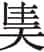为上献⑧。卢蒲癸、王何执寝戈。庆氏以其甲环公宫⑨。陈氏、鲍氏之圉人为优⑩。庆氏之马善惊，士皆释甲束马，而饮酒，且观优，至于鱼里⑪。栾、高、陈、鲍之徒介庆氏之甲⑫。子尾抽桷，击扉三⑬，卢蒲癸自后刺子之，王何以戈击之，解其左肩⑭。犹援庙桷，动于甍⑮。以俎、壶投，杀人而后死⑯。遂杀庆绳、麻婴⑰。公惧⑱，鲍国曰：“群臣为君故也⑲。”陈须无以公归，税服而如内宫⑳。

***【注释】***

①卢蒲姜：卢蒲癸的妻子，庆舍的女儿。

②“夫子愎（bì）”四句：卢蒲姜支持丈夫，又知道庆舍性情刚愎，献计由自己故意劝阻庆舍不要去参加尝祭，庆舍必不听从，由此给卢蒲癸制造机会。夫子，指庆舍。愎，刚愎自用。

③乙亥：初七。

④尝于大公之庙，庆舍莅事：庆舍准备亲临祭事。

⑤谁敢者：庆舍果然不听，认为无人敢胡作非为。

⑥遂如公：至公所，即到太公庙。

⑦麻婴：齐国大夫。尸：古时祭祀以活人代替受祭者，这个人称为“尸”。

⑧庆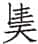（xié）：齐国大夫。上献：即上宾，在属吏中遴选。《仪礼·有司彻》“上宾洗爵以升”。亦曰宾长。

⑨庆氏以其甲环公宫：庙在宫内，庆氏派甲士围住公宫。

⑩圉人：养马者。优：俳优，以乐舞戏谑为业的艺人。

⑪“庆氏之马善惊”五句：庆氏士兵都释甲束马，饮酒观优，因此毫无准备。善，喜欢，容易。束马，系住马不让奔跑。鱼里，里名。这里指优在鱼里表演，众人都前往观看。

⑫栾、高、陈、鲍之徒介庆氏之甲：庆氏之兵都解甲，四族之兵于是取而穿上。栾，子雅。高，子尾。陈，陈须无，即陈文子。鲍，鲍国。

⑬子尾抽桷（jué），击扉三：抽桷击扉是动手的暗号。桷，这里指槌子。扉，门扇。

⑭卢蒲癸自后刺子之，王何以戈击之，解其左肩：王何砍掉庆舍的左肩。

⑮犹援庙桷，动于甍（ｍénɡ）：庆舍虽受伤，还抽房椽，把房屋都拉动了。桷，方形椽子。甍，栋梁。

⑯以俎、壶投，杀人而后死：庆舍力大勇猛，重伤之下仍搏斗而死。俎，盛肉祭器。壶，盛酒器。

⑰遂杀庆绳、麻婴：二人都是庆氏同党。庆绳，即庆。

⑱公：指齐景公。

⑲群臣为君故也：意思是为公室利益而除庆氏，不是作乱。

⑳税服而如内宫：脱了祭服送齐景公回内宫。税，通“脱”。

***【译文】***

卢蒲姜对卢蒲癸说：“有事情而不告诉我，必然不能成功。”卢蒲癸把情况告诉了她。卢蒲姜说：“我父亲为人刚愎，没人劝阻他，他将不出来。就让我去劝阻他。”卢蒲癸说：“好吧。”十一月初七，在太公庙举行尝祭，庆舍将到场主持。卢蒲姜把情况告诉了他，并且阻止他前往，庆舍不听，说：“谁敢作乱？”便到太公庙去了。麻婴充当祭尸，庆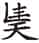任上献。卢蒲癸、王何手持寝戈侍卫。庆氏带着甲士包围住公宫。陈氏、鲍氏的养马人演戏。庆氏家的马容易受惊，甲士们都解下身上的甲衣拴好马，在那儿喝酒，又到鱼里看戏。栾、高、陈、鲍家的人都把庆氏家人解下的甲衣穿上。子尾抽出槌子，敲击门板三下，卢蒲癸从后面刺击庆舍，王何用戈朝庆舍砍去，砍下他的左肩。庆舍仍能拽着庙宇的椽子，连屋梁都被扯动了。又用俎、壶掷人，把人打死后自己才死去。众人便杀了庆绳、麻婴。齐景公很害怕，鲍国说：“群臣是为了国君而杀死这些人的。”陈文子护着景公回到宫中，脱去祭服后进入内宫。

庆封归，遇告乱者①。丁亥②，伐西门，弗克。还伐北门，克之。入，伐内宫③，弗克。反，陈于岳④，请战，弗许，遂来奔。献车于季武子，美泽可以鉴⑤。展庄叔见之⑥，曰：“车甚泽，人必瘁，宜其亡也⑦。”叔孙穆子食庆封⑧，庆封氾祭⑨。穆子不说，使工为之诵《茅鸱》，亦不知⑩。既而齐人来让，奔吴。吴句馀予之朱方⑪，聚其族焉而居之，富于其旧⑫。子服惠伯谓叔孙曰：“天殆富淫人⑬，庆封又富矣。”穆子曰：“善人富谓之赏，淫人富谓之殃⑭。天其殃之也，其将聚而歼旃⑮。”

***【注释】***

①庆封归，遇告乱者：庆封原先在莱地打猎，从莱回齐都。

②丁亥：十九日。

③伐内宫：陈、鲍及齐景公都在内宫。

④岳：杨伯峻指出，《山东通志》称岳里在临淄南街，未必可信。里巷狭小，不足以列阵，岳应该也是大街。

⑤献车于季武子，美泽可以鉴：庆封的车子很华丽，光彩照人。

⑥展庄叔：鲁国大夫。

⑦车甚泽，人必瘁，宜其亡也：庆封车美，必定是大肆聚敛搜刮，人受其害，憔悴不堪，这样，庆封必亡。

⑧食：设便宴招待。

⑨氾祭：古人饮食前必先祭，氾祭是遍祭诸神，非礼所宜，表明庆封不知礼。

⑩穆子不说，使工为之诵《茅鸱》，亦不知：穆子让乐工诵《茅鸱》讥刺庆封，他也听不出来，可见其愚蠢。工，乐师。《茅鸱》，逸诗，内容是讥刺不敬者。

⑪句馀：吴王馀祭。朱方：古地名。在今江苏镇江东丹徒南。

⑫富于其旧：庆封居朱方，比在齐国时更富。

⑬淫人：淫恶的人。

⑭淫人富谓之殃：淫人得富必有祸殃。

⑮天其殃之也，其将聚而歼旃（zhān）：这里为昭公四年杀庆封伏笔。旃，“之焉”的合音。

***【译文】***

庆封在回来的路上，遇到前来报告动乱的人。十九日，庆封攻打西门，没能攻下。又去攻北门，攻克了。进入城里，攻打内宫，没攻下。回兵在岳布阵，提出决战，没有得到回应，于是逃来鲁国。庆封献给季武子一辆车，十分华美，光彩照人。展庄叔见了，说：“车这么漂亮，人民必定憔悴，他出亡在外是必然的。”叔孙穆子宴请庆封，庆封在宴会上先遍祭群神。叔孙穆子很不高兴，让乐工为他诵读《茅鸱》，庆封也听不懂。不久齐国人来责备鲁国收留庆封，庆封便逃到吴国。吴王句馀把朱方给了他，庆封召集其族众住在那里，比原先还要富有。子服惠伯对叔孙穆子说：“上天大概是专门要让坏人富起来，你看庆封又富了。”叔孙穆子说：“善人富有是奖赏，坏人富有则是灾殃。上天大概要降灾给他，所以让他们聚拢一起全部歼灭掉吧。”

28.10 癸巳①，天王崩②。未来赴，亦未书，礼也③。

***【注释】***

①癸巳：十一月二十五日。

②天王崩：周灵王死，子景王贵立。

③未来赴，亦未书，礼也：周灵王死于十一月，因当月未来讣告，《经》文于十一月未加记载，这是合于礼的。按，这里是在解释《经》文。

***【译文】***

十一月二十五日，周天子驾崩。没有发来讣告，《春秋》也没有记载，这是合于礼的。

28.11 崔氏之乱，丧群公子，故在鲁，叔孙还在燕，贾在句渎之丘①。及庆氏亡，皆召之，具其器用，而反其邑焉②。与晏子邶殿其鄙六十③，弗受。子尾曰：“富，人之所欲也，何独弗欲？”对曰：“庆氏之邑足欲，故亡④。吾邑不足欲也，益之以邶殿，乃足欲。足欲，亡无日矣⑤。在外，不得宰吾一邑⑥。不受邶殿，非恶富也，恐失富也。且夫富，如布帛之有幅焉，为之制度，使无迁也⑦。夫民，生厚而用利，于是乎正德以幅之⑧，使无黜嫚⑨，谓之幅利⑩。利过则为败。吾不敢贪多，所谓幅也。”与北郭佐邑六十，受之。与子雅邑，辞多受少。与子尾邑，受而稍致之⑪。公以为忠，故有宠。释卢蒲嫳于北竟⑫。

***【注释】***

①“崔氏之乱”五句：这是襄公二十一年齐庄公复讨伐公子牙同党的事。齐庄公为崔杼所立，故溯其源曰“崔氏之乱”。贾在句渎之丘，襄公二十一年《传》作“执公子买于句渎之丘”，应是“买”与“贾”形近而误。

②“及庆氏亡”四句：公子、叔孙还、公子贾等都返回，并归还他们的器物封邑。

③邶殿其鄙：即邶殿之郊鄙，很广阔。邶殿，齐国大邑，在今山东昌邑。“其”在这里作“之”用。

④庆氏之邑足欲，故亡：庆氏贪得封邑的欲望满足了，结果却是逃亡。

⑤足欲，亡无日矣：晏子意谓不义所得，必有灾祸。

⑥在外，不得宰吾一邑：如果逃亡在外，就连一邑也保不住。

⑦“且夫富”四句：布帛的幅度有定制，不可改变，一个人的富有也是如此。富、幅谐音，晏婴用来作比。

⑧夫民，生厚而用利，于是乎正德以幅之：民都喜欢生厚用利，却必须端正道德加以限制。生厚，生活享受丰厚。用利，器物财货富饶。幅，引申为限制。

⑨使无黜嫚：不可不足，也不可过分。黜，不足。嫚，过分。

⑩谓之幅利：限制其利，不可纵欲奢侈。

⑪受而稍致之：接受后又全部送还。稍，尽。

⑫释卢蒲嫳于北竟：卢蒲嫳为庆封同党，所以放逐于北部边境。释，放逐。竟，通“境”。

***【译文】***

崔氏动乱，公子们四丧逃亡，所以公子在鲁国，叔孙还在燕国，公子贾在句渎之丘。到庆氏灭亡后，把他们全都召回，归还他们的日常器物，把封邑也归还他们。赐给晏婴邶殿边境六十座城邑，晏婴辞谢不接受。子尾说：“富裕是人人都想得到的，为何唯独你不要？”晏婴回答说：“庆氏的封邑满足了他的欲望，所以逃亡。我的城邑的确还没有满足欲望，但加上邶殿六十邑，就可满足欲望了。欲望满足，离逃亡的日子也就不远了。如果逃亡在外，连一座城邑也不能保住。不接受邶殿城邑，并非讨厌富裕，正是怕失去富裕。何况富有就如布帛有一定的尺寸，给它设定一定的幅度，让它不能改变。民众总是想生活富足，器用丰富，所以要端正道德观念来加以限制，使它既不缺乏也不过分，这就是所谓限制欲望。欲望过分了就会败坏。我不敢贪多，就是所谓限制。”于是赐给他北郭佐邑六十座，他接受了。也赐给子雅城邑，他辞掉大多数，只接受少量地盘。赐给子尾城邑，他接受而后又全部还给景公。景公觉得子尾忠诚，所以宠信他。把卢蒲嫳流放到北部边境。

求崔杼之尸，将戮之，不得。叔孙穆子曰：“必得之，武王有乱臣十人①，崔杼其有乎？不十人，不足以葬②。”既，崔氏之臣曰：“与我其拱璧，吾献其柩③。”于是得之。十二月乙亥朔④，齐人迁庄公⑤，殡于大寝⑥。以其棺尸崔杼于市⑦，国人犹知之⑧，皆曰：“崔子也。”

***【注释】***

①武王有乱臣十人：相传武王有十个治世之臣。乱，治。

②不十人，不足以葬：意思是崔杼不得人心。武王有治臣十人而得天下，崔杼连十个和他同心的人都没有，因此尸体必定能找到。

③与我其拱璧，吾献其柩：崔杼有大璧，其家臣以得璧为条件，愿献出崔杼尸体。拱璧，大璧。

④乙亥：应为己亥，初一。

⑤齐人迁庄公：迁葬庄公。

⑥殡于大寝：齐庄公葬前先殡于路寝。

⑦以其棺尸崔杼于市：崔杼杀庄公，又不以礼葬庄公，于是用崔杼的棺材装上崔杼的尸体暴露在街市，以显示他的罪恶。其，指崔杼。

⑧知：认识。

***【译文】***

寻求崔杼的尸体，打算戮尸，但找不到。叔孙穆子说：“一定能找到，武王有十个治世臣子，崔杼有吗？他没有十个这样的人，就一定不能安葬。”不久，崔氏家臣说：“如果把崔氏的大璧给我，我就献出他的棺材。”于是得到了崔杼的尸体。十二月初一，齐国迁葬庄公，停棺在大寝。把崔杼的棺材装上其尸体暴露在街市，国人还能认识，都说：“这是崔杼。”

28.12 为宋之盟故，公及宋公、陈侯、郑伯、许男如楚①。公过郑，郑伯不在②，伯有迋劳于黄崖③，不敬。穆叔曰：“伯有无戾于郑，郑必有大咎④。敬，民之主也，而弃之，何以承守⑤？郑人不讨，必受其辜⑥。济泽之阿，行潦之藻，置诸宗室，季兰尸之，敬也⑦。敬可弃乎⑧？”

***【注释】***

①为宋之盟故，公及宋公、陈侯、郑伯、许男如楚：诸侯朝楚。

②公过郑，郑伯不在：郑简公已在楚国。

③伯有迋劳于黄崖：异国之君过境，不入国都，东道国大夫应到郊外慰劳。黄崖，古地名。在今河南新郑北。

④伯有无戾于郑，郑必有大咎：伯有不被治罪，必成为郑国的祸害。戾，罪。

⑤敬，民之主也，而弃之，何以承守：不敬就不能保持祖宗的家业。

⑥郑人不讨，必受其辜：不讨伯有，必有祸乱。辜，祸殃。

⑦“济泽之阿”五句：水边的薄土，阿泽中的藻，虽然菲薄，仍可作为祭品；由少女作祭尸，神能享用，就在于恭敬。济，渡口。泽，水草相交的地方。阿，水崖，这里指水边薄土。行，道路。潦，积水。藻，草水藻。置诸宗室，将藻作为祭品，献于宗庙。季兰，季女，少女。

⑧敬可弃乎：伯有不敬，必不免祸。这为襄公三十年郑国杀伯有伏笔。

***【译文】***

为践行在宋国订立的盟约，鲁襄公和宋平公、陈哀公、郑简公、许悼公去朝见楚国。襄公路过郑国，郑简公不在国内，由伯有到黄崖慰劳襄公，举止不恭敬。穆叔说：“伯有如果不在郑国获罪，郑国必有大灾祸。恭敬是民众的主心骨，他却丢弃了，怎么继承先人保守家业？郑国人不讨伐他，必定会受到他的连累。渡口水泽边的薄土、道路积水中所生的浮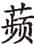水藻，放在宗庙中当祭品，少女作为祭尸而被接受，是由于恭敬。恭敬岂是可以丢弃的？”

及汉，楚康王卒。公欲反。叔仲昭伯曰①：“我楚国之为，岂为一人？行也②！”子服惠伯曰：“君子有远虑，小人从迩③。饥寒之不恤，谁遑其后④？不如姑归也。”叔孙穆子曰：“叔仲子专之矣，子服子，始学者也⑤。”荣成伯曰⑥：“远图者，忠也。”公遂行⑦。宋向戌曰：“我一人之为，非为楚也。饥寒之不恤，谁能恤楚⑧？姑归而息民，待其立君而为之备⑨。”宋公遂反。

***【注释】***

①叔仲昭伯：鲁国大夫叔仲带。

②我楚国之为，岂为一人？行也：此行为楚国，不是为康王一人。

③小人从迩：小人只看眼前。迩，近。

④饥寒之不恤，谁遑其后：饥寒都顾不上，更无暇顾及以后。惠伯主张回去。遑，暇。

⑤叔仲子专之矣，子服子，始学者也：叔仲带之言可听从，子服惠伯却如刚学习的人，没远见。穆子赞同叔仲带的意见。

⑥荣成伯：荣驾鹅，宣公弟叔肸曾孙。

⑦公遂行：群臣争论结果，为长远考虑，襄公仍去楚国。

⑧“我一人之为”四句：楚康王既死，楚国一时必不能为害他国，所以向戌认为可以暂不朝楚。

⑨姑归而息民，待其立君而为之备：让国内百姓休息整顿，以防备楚人。

***【译文】***

襄公达到汉水时，楚康王去世。襄公打算回国。叔仲昭伯说：“我们是为了楚国而来的，岂是为康王一人？还是去吧！”子服惠伯说：“君子有远虑，小人只考虑眼前。饥寒都顾不上了，谁还能顾及以后？不如先回去吧。”叔孙穆子说：“叔仲昭伯可以被专门任用了，子服惠伯只是初学者。”荣成伯说：“考虑长远的人，是忠诚者。”襄公于是继续前进。宋国向戌说：“我们是为了一个人而来，不是为楚国而来。饥寒都顾不上，谁能顾及楚国？姑且回去，让民众休养生息，等立了新国君后再戒备他们。”宋平公就回国了。

28.13 楚屈建卒①，赵文子丧之如同盟，礼也②。

***【注释】***

①屈建卒：令尹子木死。

②赵文子丧之如同盟，礼也：襄公二十七年弭兵大会，晋国以赵武为主，楚国以屈建为主，楚国虽有衷甲之举，晋国不计前嫌，吊丧时如同对待同盟国一样。

***【译文】***

楚国屈建去世，赵文子去吊丧就如对待同盟国一样，这是合乎礼的。

28.14 王人来告丧，问崩日，以甲寅告①，故书之，以徵过也②。

***【注释】***

①王人来告丧，问崩日，以甲寅告：周灵王实死于癸巳，使者误以甲寅告。

②故书之，以徵（ｃhénɡ）过也：《经》文记以甲寅，以惩戒使者之过。徵，通“惩”，罚。

***【译文】***

周朝使者来告知周灵王去世的事，问其死期，回答说是十二月十六日，所以《春秋》就这样记载，用以惩戒其过错。

# 二十九年

***【经】***

29.1 二十有九年春王正月①，公在楚②。

29.2 夏五月，公至自楚。

29.3 庚午③，卫侯衎卒④。

29.4 阍弑吴子馀祭⑤。

29.5 仲孙羯会晋荀盈、齐高止、宋华定、卫世叔仪、郑公孙段、曹人、莒人、滕人、薛人、小邾人城杞。

29.6 晋侯使士鞅来聘。

29.7 杞子来盟。

29.8 吴子使札来聘⑥。

29.9 秋九月，葬卫献公。

29.10 齐高止出奔北燕⑦。

29.11 冬，仲孙羯如晋⑧。

***【注释】***

①二十有九年：鲁襄公二十九年当周景王元年，前544。

②公在楚：襄公上年十一月朝楚未归。

③庚午：初五。

④卫侯衎卒：卫献公死。卫献公，前576年即位，但前558—前547年之间，由卫殇公执政。扣除这十二年，卫献公共在位二十一年。

⑤阍（hūn）弑吴子馀祭：吴王馀祭被守门人杀死。阍，守门人。

⑥吴子使札来聘：吴国开始和鲁国通好，馀祭在被杀之前派季札聘鲁，季札在赴鲁途中，所以还不知道馀祭被杀的事。札，也叫季札，吴王寿梦第四子，因封邑在延陵、州来二地，又称延陵季子或延州来季子。

⑦齐高止出奔北燕：齐国驱逐高止。

⑧仲孙羯如晋：鲁国为回报士鞅聘鲁，派孟孝伯到晋国去。

***【译文】***

鲁襄公二十九年春周历正月，襄公在楚国。

夏五月，襄公从楚国回国。

六月初五，卫献公衎去世。

看门人杀死吴王馀祭。

仲孙羯会同晋国荀盈、齐国高止、宋国华定、卫国世叔仪、郑国公孙段、曹国人、莒国人、滕国人、薛国人和小邾国人修筑杞国都城的城墙。

晋平公派士鞅来鲁国聘问。

杞文公来鲁国结盟。

吴王馀祭派季札来鲁国聘问。

秋九月，安葬卫献公。

齐国高止出逃到北燕。

冬，仲孙羯去晋国。

***【传】***

29.1 二十九年春王正月，公在楚，释不朝正于庙也①。

***【注释】***

①释不朝正于庙也：鲁国国君每年正月有朝庙告朔之礼。现在襄公不在，国内仍行此礼。《经》文记“公在楚”，是解释襄公不在祖庙听政的原因。

***【译文】***

鲁襄公二十九年春周历正月，襄公在楚国，这是解释为什么不去太庙朝正的原因。

楚人使公亲襚①，公患之。穆叔曰：“祓殡而襚，则布币也②。”乃使巫以桃茢先祓殡③。楚人弗禁，既而悔之④。

***【注释】***

①楚人使公亲襚（suì）：襚是外国使臣吊邻国国君丧所行之礼，楚国让襄公行此礼，是将他当作使臣，有意羞辱他。襚，为死者穿衣。

②祓（fú）殡而襚，则布币也：祓殡而后行襚礼，与朝而布币无异。祓殡，祓除不祥之祭。布币，陈列朝聘的皮币。

③乃使巫以桃茢（liè）先祓殡：据《礼记·檀弓下》“君临臣丧，以巫祝桃茢执戈，恶之也”，则桃茢祓殡，乃君临臣丧之礼。桃茢，以桃枝作帚，扫除凶邪。茢，苕帚。

④楚人弗禁，既而悔之：楚人起初不知其意，未加制止，后来发现受愚弄，后悔莫及。本来是要羞辱鲁国，反而被鲁国所辱。

***【译文】***

楚国让襄公亲自为康王的尸体穿衣，襄公对此很不高兴。穆叔说：“先举行为殡葬而祓除不祥的祭祀然后再给死者穿衣，这就等于朝聘时送礼物了。”于是让巫者用桃枝作苕帚先祓除不祥。楚国人没加制止，后来又为此而后悔。

29.2 二月癸卯①，齐人葬庄公于北郭②。

***【注释】***

①癸卯：初六。

②齐人葬庄公于北郭：上年十二月，齐人将庄公之棺殡于正寝，现在出葬。因为不是善终，所以葬于外城北边。

***【译文】***

二月初六，齐国人在北面的外城安葬庄公。

29.3 夏四月，葬楚康王，公及陈侯、郑伯、许男送葬，至于西门之外，诸侯之大夫皆至于墓。楚郏敖即位①。王子围为令尹②。郑行人子羽曰：“是谓不宜，必代之昌③。松柏之下，其草不殖④。”

***【注释】***

①郏敖：楚康王之子熊麇。

②王子围：楚康王的弟弟。

③是谓不宜，必代之昌：预言王子围必将取代郏敖。

④松柏之下，其草不殖：王子围强霸如松柏，郏敖幼弱如小草，必不长久。此为昭公元年王子围杀郏敖预设伏笔。

***【译文】***

夏四月，安葬楚康王，襄公和陈哀公、郑简公、许悼公送葬，送到西门外，诸侯国大夫都送到墓地。楚国郏敖即位。王子围任令尹。郑国行人子羽说：“这就叫做不恰当，令尹必定会取代楚王而昌盛。松柏的下面，草是长不好的。”

29.4 公还，及方城。季武子取卞①，使公冶问②。玺书追而与之③，曰：“闻守卞者将叛，臣帅徒以讨之，既得之矣。敢告④。”公冶致使而退⑤，及舍，而后闻取卞⑥。公曰：“欲之而言叛，只见疏也⑦。”公谓公冶曰：“吾可以入乎⑧？”对曰：“君实有国，谁敢违君⑨？”公与公冶冕服⑩。固辞，强之而后受⑪。公欲无入，荣成伯赋《式微》⑫，乃归。五月，公至自楚。公冶致其邑于季氏⑬，而终不入焉⑭。曰：“欺其君，何必使余⑮？”季孙见之，则言季氏如他日；不见，则终不言季氏⑯。及疾，聚其臣⑰，曰：“我死，必无以冕服敛，非德赏也⑱。且无使季氏葬我。”

***【注释】***

①卞：原是鲁国公室之邑，在今山东泗水东。

②公冶：季氏家臣。问：问候襄公。

③玺（xǐ）书追而与之：公冶已走，追送玺书给他，让带去给襄公。玺，印章。按，秦朝以前尊卑印章都可称为玺。

④“闻守卞者将叛”四句：这是玺书的内容。季武子想要占卞邑，就乘襄公不在国内之机占取，所谓“守卞者将叛”是季武子强占卞邑的借口。

⑤致使：表达使命，既问安，又交信。

⑥及舍，而后闻取卞：公冶本不知信中内容，回到休息处才得知，应是襄公看信后传到他的耳里。

⑦欲之而言叛，只见疏也：意思是季氏想要卞邑，却不明说，而找借口，是对国君表示疏远。这是襄公愤怒的话语。而季氏专权逼君，襄公也无可奈何。

⑧吾可以入乎：怕季氏有不轨行为，因此发问。

⑨君实有国，谁敢违君：公冶认为国内无人敢拒绝襄公。

⑩公与公冶冕服：赏给公冶卿服玄冕。

⑪固辞，强之而后受：公冶坚决辞谢，襄公强迫他，他才接受。可见他洁身奉公。

⑫《式微》：《诗经·国风·邶风》篇名，其中有“式微式微，胡不归”句，荣成伯以此劝襄公回国。

⑬公冶致其邑于季氏：退还季氏所送之邑，表示不再为其家臣。

⑭而终不入焉：不入季孙家，不做季氏家臣。

⑮欺其君，何必使余：公冶明白季孙问候襄公起居是假，致书告取卞是真，而取卞邑是欺君，自己受使也被欺骗。

⑯“季孙见之”四句：按，公冶以此表示对季氏的不满。

⑰臣：这里指为公冶服务的人。

⑱我死，必无以冕服敛，非德赏也：公冶自认为替季孙送信是为季孙欺骗国君，襄公赏给自己冕服，并非因为自己有德，而是惧怕季氏，因此拒绝以冕服入殓。

***【译文】***

襄公回国，到达方城。季武子攻占了卞邑，派公冶去问候襄公。公冶走后，又以印封好书信派人追上公冶，让他交给襄公，信中说：“听到守卞人要叛变，下臣率领部下讨伐，已经占领了卞邑。谨此报告。”公冶拜见襄公后退出，到了住处以后才知道攻取卞邑之事。襄公说：“想要得到它却借口说它叛变，只能说对我表示疏远。”襄公问公冶道：“我可以入境吗？”公冶回答说：“国君拥有国家，谁敢违背国君？”襄公奖励公冶冕服。公冶坚决推辞，襄公坚持要给才接受了。襄公想不进入国境，荣成伯赋《式微》一诗，襄公才回国。五月，襄公从楚国回来。公冶把自己的封邑还给季武子，就再也不进季氏的家门。他说：“他要欺骗国君，何必派我去？”季孙去见他，公冶则和季孙氏像往日一样交往；不见面的时候，便始终不提到季氏。到病危时，公冶召集身边人，说道：“我死后，一定不要用冕服入殓，因为这不是靠德行得来的奖赏。同时不要让季氏来安葬我。”

29.5 葬灵王①，郑上卿有事，子展使印段往②。伯有曰：“弱③，不可。”子展曰：“与其莫往，弱不犹愈乎④？《诗》云：‘王事靡盬，不遑启处⑤。’东西南北，谁敢宁处？坚事晋、楚，以蕃王室也。王事无旷，何常之有⑥？”遂使印段如周。

***【注释】***

①葬灵王：鲁襄公没参加会葬，所以《经》文未记载。

②郑上卿有事，子展使印段往：郑简公正在楚国，上卿子展留守国内，于是派印段参加。

③弱：年少。

④与其莫往，弱不犹愈乎：年少总比没人去好。莫，没人。

⑤王事靡盬（ɡǔ），不遑启处：引《诗》见《诗经·小雅·四牡》，意思是王事应当细致，没有工夫安居。这里借用来表示坚定地事奉晋、楚二国，也就是捍卫王室。靡，无。盬，不细致。启处，安居。

⑥“坚事晋、楚”四句：子展认为，坚事晋、楚也是维护王室，派印段前往也不能算是违反常例。蕃，通“藩”，捍卫。无旷，没有缺失。

***【译文】***

安葬周灵王，郑国上卿子展因国事在身不能去，派了印段前往。伯有说：“他太年轻，不行。”子展说：“与其没人去，派个年轻的不是比无人去好吗？《诗》说：‘王家差事做不完，哪有时间去休息。’东西南北，谁敢安居？坚定地事奉晋国、楚国，用以捍卫王室。王事无缺失，管他什么常例？”就派印段到宗周去。

29.6 吴人伐越，获俘焉，以为阍，使守舟。吴子馀祭观舟，阍以刀弑之。

***【译文】***

吴国人讨伐越国，抓回了俘虏，让他做看门人，去看守船只。吴王馀祭来观看船只，看门人用刀杀死馀祭。

29.7 郑子展卒，子皮即位①。于是郑饥，而未及麦，民病②。子皮以子展之命，饩国人粟，户一钟③，是以得郑国之民，故罕氏常掌国政④，以为上卿。宋司城子罕闻之，曰：“邻于善⑤，民之望也。”宋亦饥，请于平公，出公粟以贷；使大夫皆贷⑥。司城氏贷而不书⑦，为大夫之无者贷⑧。宋无饥人。叔向闻之，曰：“郑之罕⑨，宋之乐⑩，其后亡者也，二者其皆得国乎⑪！民之归也。施而不德，乐氏加焉⑫，其以宋升降乎⑬！”

***【注释】***

①郑子展卒，子皮即位：子皮代父为上卿。

②于是郑饥，而未及麦，民病：没到麦收闹饥荒，百姓陷入困境。

③子皮以子展之命，饩（xì）国人粟，户一钟：还在子展丧期，因此子皮以子展之命分粮。饩，赠送粮食。一钟，合今天的一又十分之三石。

④罕氏：子展、子皮为罕氏。

⑤邻于善：接近于善，指输粟于民的善行。

⑥请于平公，出公粟以贷；使大夫皆贷：因子罕之请，宋平公和大夫都借粮给百姓。

⑦不书：不写契约，表示不求归还。

⑧为大夫之无者贷：子罕又为缺少粮食的大夫借粮给百姓。

⑨郑之罕：子展、子皮为罕氏。

⑩宋之乐：宋子罕为乐氏。

⑪其后亡者也，二者其皆得国乎：指二氏都能长掌二国之政。

⑫施而不德，乐氏加焉：乐氏施舍于民，而不求百姓感激，是更胜一筹。

⑬其以宋升降乎：乐氏将长盛不衰，与宋国同命运。

***【译文】***

郑国子展去世，子皮继承他的职位。当时郑国饥荒，还没到麦收时节，百姓困乏。子皮用子展的遗命，送给国人粮食，每户一钟，由此得到郑国民众的拥护，所以罕氏一直执掌国政，担任上卿。宋国的司城子罕听说了，说道：“与善为邻，这是百姓的期望。”宋国也饥荒，子罕向宋平公请求，拿出公室的粮食借给人民；让大夫都借粮给百姓。司城子罕借粮给百姓而不立借条，并替没粮可借的大夫代为放粮。于是宋国没有挨饿的人。叔向听说后，说：“郑国的罕氏，宋国的乐氏，大概会是最后消亡的，两家都将会长久执掌国政吧！因为百姓归服于他们。施恩而不求感激，乐氏显得更胜一筹，他家大概会与宋国同盛衰吧！”

29.8 晋平公，杞出也，故治杞①。六月，知悼子合诸侯之大夫以城杞②，孟孝伯会之。郑子大叔与伯石往。子大叔见大叔文子③，与之语。文子曰：“甚乎，其城杞也④！”子大叔曰：“若之何哉！晋国不恤周宗之阙，而夏肄是屏⑤，其弃诸姬，亦可知也已⑥。诸姬是弃，其谁归之？吉也闻之，弃同即异⑦，是谓离德。《诗》曰：‘协比其邻，昏姻孔云⑧。’晋不邻矣，其谁云之⑨？”

***【注释】***

①晋平公，杞出也，故治杞：晋平公母亲为杞国女，平公是杞国外甥，所以杞国迁都淳于，即今山东安丘，平公为之修城。

②知悼子：荀盈。

③大叔文子：卫大夫大叔仪。

④甚乎，其城杞也：太叔文子认为，晋平公召集诸侯为舅家修城太过分。

⑤晋国不恤周宗之阙，而夏肄是屏：这里指责晋国不考虑周室之衰而只想保护夏朝的残余。周宗，指周室，它已衰微。夏肄，杞为夏之后。肄，余。屏，蕃屏，保护。

⑥其弃诸姬，亦可知也已：周室为姬姓之本，晋国不恤周宗，其他姬姓诸国也必将被弃。

⑦弃同即异：晋国的行为，是弃同姓之国而亲近异姓之国。即，就，亲近。

⑧协比其邻，昏姻孔云：引《诗》见《诗经·小雅·正月》，这里指晋国应该先亲近近亲之国，婚姻之国才会和它友好。协比，亲附。孔，甚。

⑨晋不邻矣，其谁云之：晋国既不以近亲为亲，谁还能和它友好？这是诸侯对晋国表示不满。

***【译文】***

晋平公是杞国女子所生，所以整修杞国的城墙。六月，知悼子会合各诸侯国大夫修筑杞城，孟孝伯前往参加。郑国子太叔和伯石也去。子太叔见到太叔文子，与他交谈。文子说：“为杞国修城的事做得太过分了！”子太叔说：“拿他怎么办呢！晋国不顾念周朝宗室的衰微，却保护夏朝的残余，他将抛弃各姬姓国，也是可以预料到的了。各姬姓国被抛弃，又会有谁归服于他？我听说过，抛弃同姓接近异姓，这叫做离德。《诗》说：‘亲附近亲与同姓，姻亲往来周旋忙。’晋国不亲近同姓近亲，还有谁来和他友好交往？”

29.9 齐高子容与宋司徒见知伯，女齐相礼①。宾出，司马侯言于知伯曰：“二子皆将不免。子容专②，司徒侈③，皆亡家之主也。”知伯曰：“何如？”对曰：“专则速及，侈将以其力毙，专则人实毙之，将及矣④。”

***【注释】***

①齐高子容与宋司徒见知伯，女齐相礼：高子容，高止。宋司徒，华定。知伯，晋国荀盈。女齐，晋国大夫司马侯。

②专：独断专权。

③侈：奢侈。

④“专则速及”四句：为今年秋天高止逃亡燕国和昭公二十年华定出奔陈国伏笔。及，及于祸。侈将以其力毙，奢侈将由于力尽而自毙。

***【译文】***

齐国高子容与宋国司徒来见知伯，女齐作相礼。宾客出门后，司马侯对知伯说：“这两人都将难以避免祸难。子容专横，司徒骄纵，都是败亡家族的罪魁祸首。”知伯说：“何以见得？”女齐回答说：“专横会很快遭殃，骄纵则因自己力量强大而致死，专横则人们将消灭他，他们遭难的日子快要到了。”

29.10 范献子来聘，拜城杞也①。公享之，展庄叔执币②。射者三耦③。公臣不足，取于家臣④。家臣，展瑕、展王父为一耦；公臣，公巫召伯、仲颜庄叔为一耦，鄫鼓父、党叔为一耦。

***【注释】***

①范献子来聘，拜城杞也：拜谢鲁国为杞国筑城。

②展庄叔执币：主人劝宾客饮酒，宾送上束帛，名叫酬币。展庄叔，鲁国大夫。币，束帛。

③射：这里指宴饮之中的射礼，叫燕射。三耦：三对人。二人为耦。古代天子与诸侯射六耦，诸侯与诸侯射四耦，此诸侯与卿大夫射，则三耦。依古礼，三耦先射，每射四箭；然后主人与宾射。

④公臣不足，取于家臣：三耦要六人，并要习于礼仪又善射的。公室已经找不到六个这样的人，只好在家臣中选取，表明鲁国公室衰微，私家势力之盛。

***【译文】***

范献子来鲁国聘问，拜谢帮助修筑杞国城墙。襄公设享礼款待，由展庄叔捧着礼物。参加射礼的要三对人。公臣不够数，就从家臣中选取。家臣中展瑕、展王父为一对；公臣中公巫召伯、仲颜庄叔为一对，鄫鼓父、党叔为一对。

29.11 晋侯使司马女叔侯来治杞田①，弗尽归也②。晋悼夫人愠曰③：“齐也取货。先君若有知也，不尚取之④。”公告叔侯。叔侯曰：“虞、虢、焦、滑、霍、杨、韩、魏⑤，皆姬姓也，晋是以大⑥。若非侵小，将何所取？武、献以下，兼国多矣⑦，谁得治之？杞，夏余也，而即东夷⑧。鲁，周公之后也，而睦于晋。以杞封鲁犹可，而何有焉⑨？鲁之于晋也，职贡不乏，玩好时至⑩，公卿大夫相继于朝，史不绝书，府无虚月⑪。如是可矣，何必瘠鲁以肥杞⑫？且先君而有知也，毋宁夫人，而焉用老臣⑬？”

***【注释】***

①司马女叔侯：即女齐，官司马。上文称司马侯，下文又称叔侯。治杞田：让鲁国归还以前所侵占的杞国田地。

②弗尽归也：鲁国没有全部归还。

③晋悼夫人：即晋平公的母亲，杞国女。愠（yùn）：怒，怨。

④齐也取货。先君若有知也，不尚取之：晋悼夫人以为女齐一定是受了鲁国之贿，鲁国才不全部归还杞田。尚，《尔雅·释诂》：“右也。”佑助。

⑤虞、虢、焦、滑、霍、杨、韩、魏：这八个国家都先后被晋国灭。焦，古地名。在今河南三门峡东。杨，古地名。在今山西洪洞东南。

⑥晋是以大：晋国灭此八国，才成为大国。

⑦武、献以下，兼国多矣：晋国到武公、献公大量兼并小国，开始强盛。

⑧杞，夏余也，而即东夷：杞国接近东夷，行夷礼。

⑨以杞封鲁犹可，而何有焉：即使将杞国封给鲁国，也不必可惜。女齐认为，不应该心目中只有杞国。

⑩职贡不乏，玩好时至：职贡，贡物。玩好，各种玩物。

⑪公卿大夫相继于朝，史不绝书，府无虚月：鲁国公卿大夫不断朝晋，晋国府库没有哪一个月不接受鲁国贡品。

⑫瘠（jí）：瘦弱，这里引申为削弱。

⑬且先君而有知也，毋宁夫人，而焉用老臣：意即先君如果有知，只会责怪夫人，不会责怪我。女齐认为自己做的事并没错。

***【译文】***

晋平公派司马女齐前来鲁国办理退还鲁国所占杞国土地的事，女齐没让鲁国将土地尽数归还杞国。晋悼夫人发火说：“女齐一定得了鲁国的好处。如果先君有知，绝对不会同意他这样做。”平公告诉了女齐。女齐说：“虞、虢、焦、滑、霍、杨、韩、魏，都是姬姓国，晋国由此而得发展壮大。如果不是掠取小国，将从哪里取得土地？武公、献公以来，兼并的国家很多，谁能够退还？杞国是夏朝的残余，而靠近东夷。鲁国是周公的后代，而与晋国和睦。把杞国封给鲁国都是可以的，为何心中只有杞国？鲁国对我们晋国，朝贡不断，玩物时时送来，公卿大夫络绎来朝，史书记载不绝，国库没有一月没收到他们的财物。这就可以了，何必要削弱鲁国来养肥杞国呢？再说先君如果有知的话，就宁可让夫人自己去办，哪里用得着老臣我？”

29.12 杞文公来盟①。书曰“子”，贱之也②。

***【注释】***

①杞文公来盟：鲁国归还所侵之田，所以来结盟拜谢。

②书曰“子”，贱之也：杞文公用夷礼，因此《经》文称为“子”，以示鄙贱。

***【译文】***

杞文公来鲁国结盟。《春秋》称他为“子”，是鄙视他。

29.13 吴公子札来聘，见叔孙穆子，说之①。谓穆子曰：“子其不得死乎！好善而不能择人。吾闻君子务在择人。吾子为鲁宗卿②，而任其大政，不慎举，何以堪之？祸必及子③！”

***【注释】***

①说：同“悦”。

②宗卿：与国君同宗的世卿。

③祸必及子：昭公四年，叔孙穆子为其儿子竖牛所害。

***【译文】***

吴国公子季札来鲁国聘问，会见叔孙穆子，很喜欢他。他对叔孙穆子说：“您怕要不得好死吧！喜欢行善却不懂得选择善人。我听说君子应当致力于选择善人。您任鲁国宗卿，掌管国家大政，举拔人不慎重，怎么能维持得下去？祸患必然要降到您的身上！”

请观于周乐①。使工为之歌《周南》、《召南》②，曰：“美哉！始基之矣，犹未也，然勤而不怨矣③。”为之歌《邶》、《鄘》、《卫》④，曰：“美哉，渊乎！忧而不困者也⑤。吾闻卫康叔、武公之德如是，是其《卫风》乎⑥！”为之歌《王》⑦，曰：“美哉！思而不惧，其周之东乎⑧？”为之歌《郑》⑨，曰：“美哉！其细已甚，民弗堪也⑩。是其先亡乎⑪！”为之歌《齐》⑫，曰：“美哉，泱泱乎！大风也哉⑬！表东海者，其大公乎！国未可量也⑭。”为之歌《豳》⑮，曰：“美哉，荡乎⑯！乐而不淫，其周公之东乎⑰！”为之歌《秦》⑱，曰：“此之谓夏声⑲。夫能夏则大⑳，大之至也，其周之旧乎(21)！”为之歌《魏》(22)，曰：“美哉，沨沨乎(23)！大而婉(24)，险而易行(25)，以德辅此，则明主也(26)。”为之歌《唐》(27)，曰：“思深哉(28)！其有陶唐氏之遗民乎！不然，何其忧之远也(29)？非令德之后(30)，谁能若是？”为之歌《陈》(31)，曰：“国无主，其能久乎(32)！”自《郐》以下，无讥焉(33)。为之歌《小雅》(34)，曰：“美哉！思而不贰(35)，怨而不言(35)，其周德之衰乎？犹有先王之遗民焉(37)。”为之歌《大雅》(38)，曰：“广哉，熙熙乎(39)！曲而有直体(40)，其文王之德乎！”为之歌《颂》(41)，曰：“至矣哉(42)！直而不倨(43)，曲而不屈(44)，迩而不逼(45)，远而不携(46)，迁而不淫(47)，复而不厌(48)，哀而不愁，乐而不荒(49)，用而不匮(50)，广而不宣(51)，施而不费(52)，取而不贪(53)，处而不底(54)，行而不流(55)。五声和(56)，八风平(57)。节有度(57)，守有序(59)，盛德之所同也(60)。”

***【注释】***

①请观于周乐：鲁为国公之后，所以有天子之乐，季札请求聆听观看周朝的音乐和舞蹈。

②工：乐工。歌：弦歌，用各国的乐曲伴奏。《周南》、《召南》：《诗经·国风》的前两篇。南，乐名。一说周公旦、召公奭之风化自北而南，从岐周被于江、汉，南方之国亦可谓南。

③美哉！始基之矣，犹未也，然勤而不怨矣：美哉，是赞美其音乐。始基之矣，“二南”产生的时代较早，所以季札认为从“二南”中可以听出周的教化已经奠基了。未，指尚未尽善。勤而不怨，指民虽劳而不怨。按，季札观乐，是把音乐看成政治的象征，从各国的“风”（民歌）的乐调，判断它们的政治情况，从四代乐舞的姿态，体察出舜、禹、汤、武四位帝王的政教业绩，以下所论，都是由此而发。

④《邶》（bèi）、《鄘》（ｙōnɡ）、《卫》：分别指《诗经·国风》中的《邶风》、《鄘风》和《卫风》。邶，周代诸侯国名，在今河南淇县东北到河北南部一带。鄘，也是周代诸侯国名，今河南新乡的鄘城即古鄘国。卫，同样是周代诸侯国名，在今河南淇县。按，这三地本是三国，武王灭纣，分其地为三监，三监叛周，周平王平叛后将邶、鄘并入卫国。所以季札后面的评论单指卫。

⑤美哉，渊乎！忧而不困者也：渊乎，这时候赞叹其声音的深远。忧而不困，指民虽有忧思，但还没到困穷的地步。

⑥吾闻卫康叔、武公之德如是，是其《卫风》乎：季札由音乐的优美深远联想到康叔、武公二君的贤能。康叔，周公弟弟。武公，康叔九世孙，二人都是卫国的贤君。

⑦《王》：指《诗经》中的《王风》，是东周洛邑王城的乐曲。

⑧美哉！思而不惧，其周之东乎：《王风》是忧伤宗周陨灭的诗歌。季札认为它虽有忧思，但无恐惧之意，或许是周室东迁以后的诗。

⑨《郑》：指《诗经》中的《郑风》。

⑩美哉！其细已甚，民弗堪也：季札认为由此可知郑国风化日衰，政情可见，因此百姓不能忍受。细，指民歌反映男女恋情过于琐碎。已，太。弗堪，受不了。

⑪是其先亡乎：由此预言郑国将先灭亡。郑亡于前376年，即周安王二十六年，韩哀侯灭郑，韩徙都于郑，故战国韩亦称郑。

⑫《齐》：指《诗经》中的《齐风》。

⑬美哉，泱（ｙānɡ）泱乎！大风也哉：齐是大国，季札论其音乐有大国之风。泱泱，宏大的声音。大风，绰绰宏大的大国之风。

⑭表东海者，其大公乎！国未可量也：齐为姜姓国，姜太公是其远祖。季札认为这种声音象征着齐国可以做东海一带诸侯的表率，齐国大有希望。大公，太公。

⑮《豳》（bīn）：指《诗经》中的《豳风》。按，今本《诗经》中《豳风》是十五国风中最后一国。豳为周的旧国，在今陕西彬县、旬邑一带。

⑯荡乎：博大的样子。

⑰乐而不淫，其周公之东乎：周公遭管、蔡之变，东征三年，为成王陈述后稷、先公不敢荒淫，以成王业。季札认为，此音乐欢乐而有节制，不是荒淫无度之音，或许为周公东征后的诗。淫，过度，没有节制。

⑱《秦》：指《诗经》中的《秦风》。

⑲夏声：也就是指西周王畿的声调。按，秦地在今陕、甘一带，本是西周旧都。

⑳夫能夏则大：这里指《秦风》既为京声，自然声音宏大。夏，即大。

(21)其周之旧乎：秦国处在西周旧地域。

(22)《魏》：指《诗经》中的《魏风》。按，魏指古魏国，在今山西芮城，闵公元年为晋献公所灭。

(23)沨（ｆénɡ）：音节轻飘浮泛。

(24)大而婉：声音虽大而委婉曲折。

(25)险：狭隘、迫促，这里指乐歌的节拍急促。易行：指乐调易于使转，并不艰涩难歌。

(26)以德辅此，则明主也：季札观乐时，魏国早已为晋国所灭，所以此乐乃是晋乐的风格。此句仍然以音乐为政治教化的象征，指音乐如此，正如政治方面德教不足；如果有人用德教来辅助，一定是一位贤君。

(27)《唐》：指《诗经》中的《唐风》。唐为唐叔虞始封之地，在今山西太原。

(28)思：忧思。

(29)其有陶唐氏之遗民乎！不然，何其忧之远也：尧本封陶，后迁徙于唐，古唐为尧旧都。季札认为，其乐反映了唐尧时代的旧风俗，所以忧思深远。

(30)令德：美德。后：指尧的后裔。

(31)《陈》：指《诗经》中的《陈风》。陈国之地在今河南开封以东、安徽亳州以北。

(32)国无主，其能久乎：陈乐淫靡放荡，说明国无贤君，将不能长久。哀公十七年，楚国灭陈，距此仅六十五年。

(33)自《郐》（kuài）以下，无讥焉：因为国家微小，季札不再加以分析评论。《郐》，指《诗经》中的《郐风》，下面还有《曹风》。郐，古国，在今河南密县。讥，评论。

(34)《小雅》：指《诗经·小雅》。雅，王畿的音乐。《小雅》多是周室衰微到平王东迁后的作品。

(35)美哉！思而不贰：思文、武之德，无背叛之心。

(36)怨而不言：虽有怨恨而不敢尽情倾吐。

(37)先王：指周代文、武、成、康诸王。

(38)《大雅》：指《诗经·大雅》，大部分是周初的作品。

(39)熙熙：和美，融洽。

(40)曲而有直体：乐曲音节表面曲折柔缓而内容刚劲有力。

(41)《颂》：指《诗经》中的《周颂》、《鲁颂》和《商颂》三部分，是祭祀的乐歌。

(42)至矣哉：尽善尽美。

(43)直：正直无私。倨：倨傲不逊。

(44)曲而不屈：婉顺而不屈挠。

(45)迩而不逼：亲近而不避促。

(46)远而不携：疏远而不离异。

(47)迁而不淫：虽有变异而不淫乱。淫，乱。

(48)复而不厌：多反复重叠而不使人厌倦。

(49)哀而不愁，乐而不荒：哀伤而不忧愁，欢乐而不过分。荒，过度。

(50)用而不匮：乐调表现出道德宏大，可用之无穷。匮，穷困。

(51)广而不宣：宽广而又不夸张炫耀。

(52)施而不费：如施惠于人而不损耗。

(53)取而不贪：如有征收而不贪婪。

(54)处而不底：声音好似静止了，实则并未停滞。处，不动。底，停滞。

(55)行而不流：此句意思正与上句相对。流，放荡。按，从“直而不倨”以下都是形容《颂》的乐调之美。

(56)五声：指宫、商、角、徴（zhǐ）、羽。和：和谐。

(57)八风：八方之气，这里指乐曲协调。

(58)节有度：八音和谐。八音指金、石、丝、竹、匏、土、革、木八类乐器。

(59)守有序：乐器交相鸣奏，有一定次序，不互相干扰。

(60)盛德之所同也：这里仍以音乐作为政治的象征，意思是文、武、周公同有如此的盛德。

***【译文】***

公子札请求观赏周朝乐舞。于是让乐工为他歌唱《周南》、《召南》，公子札说：“真美妙啊！周朝的教化已经开始奠定基础了，不过还没到尽善，但民众已经勤劳而不埋怨了。”为他歌唱《邶风》、《鄘风》、《卫风》，公子札说：“真美妙啊，这样地深厚！虽有忧思但不至于困穷。我听说卫康叔、武公的德行就是这样，它应该是《卫风》吧！”为他歌唱《王风》，公子札说：“真美妙啊！虽有忧思但不至于恐惧，它该是周室东迁以后的诗吧？”为他歌唱《郑风》，公子札说：“真美妙啊！它的音节过于琐细，人民受不了啦。它恐怕要先灭亡吧！”为他歌唱《齐风》，公子札说：“真美妙啊，这样深广宏大！这是大国的音乐吧！做东海诸侯表率的，该是太公的国家吧！国家的前程不可限量。”为他歌唱《豳风》，公子札说：“真美妙啊，如此坦荡博大！欢乐而有节制，它是周公东征的歌吧！”为他歌唱《秦风》，公子札说：“这就叫做西方的夏声。能发出夏声，自然声音洪亮，而且洪亮到极点了，它应是周朝的旧乐吧！”为他歌唱《魏风》，公子札说：“真美妙啊，多么轻飘浮泛！声音虽大而委婉曲折，节拍局促却容易歌唱，如果再用道德加以辅佐，就是贤明的君主了。”为他歌唱《唐风》，公子札说：“思虑很深啊！也许是陶唐氏的遗民吧！不然怎么会忧思这么深远呢？不是美德者的后代，谁能这样？”为他唱歌《陈风》，公子札说：“国家没有主人，怎么能长久呢！”从《郐风》以下公子札不再加以评论。为他歌唱《小雅》，公子札说：“真美妙啊！虽有忧思却无背叛之心，虽有怨恨而不形于言语，莫不是周德衰落时的音乐吧？还有先王的遗民在啊。”为他歌唱《大雅》，公子札说：“真宽广啊，多和美啊！柔婉曲折而本体则刚劲有力，那该是表现文王的美德吧！”为他歌唱《颂》，公子札说：“美极了！正直而不倨傲，柔婉曲折而不卑下靡弱，亲近而不冒犯，疏远而不离心，变化多端而不淫乱，反复重叠而不使人厌倦，哀伤而不忧愁，欢乐而不放浪过度，使用而不会匮乏，宽广而不夸张炫耀，施予而不耗损，收取而不贪婪，静止而不停滞，流动而不放荡。五声和谐，八风协调。节拍有一定的尺度，乐器鸣奏有一定的顺序，这都是盛德之人所共同具有的。”

见舞《象箾》、《南籥》者①，曰：“美哉！犹有憾②。”见舞《大武》者③，曰：“美哉！周之盛也，其若此乎④！”见舞《韶濩》者⑤，曰：“圣人之弘也，而犹有惭德，圣人之难也⑥。”见舞《大夏》者⑦，曰：“美哉！勤而不德，非禹，其谁能修之⑧？”见舞《韶箾》者⑨，曰：“德至矣哉，大矣！如天之无不帱也，如地之无不载也。虽甚盛德，其蔑以加于此矣⑩。观止矣⑪！若有他乐，吾不敢请已⑫。”

***【注释】***

①《象箾（xiāo）》、《南籥（ｙｕè）》：两种舞蹈名。象，武舞。箾，舞者所持的竿子。“象箾”是执竿而舞。南，文舞。籥，似笛的乐器。“南籥”是持籥而舞。二者都是歌颂文王的乐舞。

②憾：有遗憾，感到美中不足。

③《大武》：武王的乐舞。

④美哉！周之盛也，其若此乎：文王未致太平，所以季札见《象箾》、《南籥》而说“犹有憾”。武王时周室开始兴盛，因此见《大武》而称颂“周之盛”。

⑤《韶濩（hù）》：商汤的乐舞。

⑥圣人之弘也，而犹有惭德，圣人之难也：季札认为，汤虽伟大，但汤伐桀，未免有失君臣之义。弘，伟大。惭德，缺点。

⑦《大夏》：夏禹的乐舞。

⑧美哉！勤而不德，非禹，其谁能修之：禹勤劳于民事，不自以为功，非禹不能成此大业。不德，不自以为德。

⑨《韶箾》：虞舜的乐舞。

⑩“德至矣哉”六句：季札认为，从《韶箾》可知舜之德崇高到极点，如天之覆盖一切，地之周载万物。舜之德无以复加了。帱（ｄàｏ），覆盖。蔑，没有。

⑪观止矣：观乐至此，实在是达到顶点了。

⑫若有他乐，吾不敢请已：尽善尽美已到最大限度，再有别的音乐，也不想再欣赏了。按，杨伯峻引姜宸英《湛园札记》云：“季札观乐，使工歌之，初不知其所歌者何国之诗也。闻声而后别之，故皆为想像之辞，曰：‘此其《卫风》乎！’‘其周之东乎！’至于见舞，则便知其为何代之乐，直据所见以赞之而已，不复有所拟议也。”

***【译文】***

公子札见到跳《象箾》、《南籥》舞，说：“真美妙啊！不过还有遗憾。”见到跳《大武》舞，说：“真美妙啊！周朝兴盛时大约就是这样的吧！”见到跳《韶濩》舞，说：“圣人这么伟大，尚且有所惭愧，当圣人真难啊。”见到跳《大夏》舞，说：“真美妙啊！勤劳于民事而不自以为功，不是大禹，谁能做得到？”见到跳《韶箾》舞，说：“德性到达顶点了，真伟大啊！就好像天无所不覆盖，地无所不承载。即使是再高的德性，也没办法在此之上增加什么了。观乐到此，已达到顶点了！如果还有其他乐舞，我也不敢再欣赏了。”

其出聘也，通嗣君也①。故遂聘于齐，说晏平仲②，谓之曰：“子速纳邑与政③。无邑无政，乃免于难。齐国之政将有所归，未获所归，难未歇也。”故晏子因陈桓子以纳政与邑，是以免于栾、高之难④。

***【注释】***

①其出聘也，通嗣君也：季札为馀祭与鲁通好。嗣君，指夷昧。

②说：同“悦”。

③子速纳邑与政：建议晏婴将封邑和政权归还给国君。

④栾、高之难：发生在昭公八年。

***【译文】***

公子札出国聘问，是因为新君嗣立而与各国通好。于是就到齐国聘问，与晏婴很谈得来，对晏婴说：“您赶快把封邑与政权交还给国君。没有封邑和政权，才能免于灾祸。齐国的政权将会有所归属，不得到归属，祸难就不会停止。”因此晏婴通过陈桓子交出了政权与封邑，在栾、高发起的动乱中幸免于难。

聘于郑，见子产，如旧相识。与之缟带，子产献纻衣焉①。谓子产曰：“郑之执政侈，难将至矣②。政必及子。子为政，慎之以礼。不然，郑国将败。”

***【注释】***

①与之缟（ɡǎo）带，子产献纻（zhù）衣焉：二人互赠礼物。缟带，白绢大带。缟，白色生绢。纻衣，麻织衣服。

②郑之执政侈，难将至矣：伯有放肆刚愎，明年为驷氏所杀。执政，指伯有。

***【译文】***

公子札到郑国聘问，见到子产，如同旧相识那样。送给子产白绢大带，子产回送他麻布衣服。公子札对子产说：“郑国的执政者放肆刚愎，祸难将要降临了。国政必然会落到您的手中。您执政，要用礼仪谨慎从事。不然的话，郑国将衰败。”

适卫，说蘧瑗、史狗、史、公子荆、公叔发、公子朝①，曰：“卫多君子，未有患也。”自卫如晋，将宿于戚②。闻钟声焉，曰：“异哉！吾闻之也，辩而不德，必加于戮③。夫子获罪于君以在此④，惧犹不足，而又何乐？夫子之在此也，犹燕之巢于幕上⑤。君又在殡⑥，而可以乐乎？”遂去之⑦。文子闻之，终身不听琴瑟⑧。

***【注释】***

①蘧瑗（yuàn）：即蘧伯玉。史狗：史朝之子文子。史（qiū）：即史鱼。公叔发：即公叔文子。公子朝：杨伯峻指出，此人不是昭公二十年《传》中的那个公子朝，梁玉绳《史记志疑》疑乃“公孙朝”之误。

②戚：古地名。在今河南濮阳，是孙文子的封邑。

③辩而不德，必加于戮：孙林父驱逐卫献公，现在又奏钟作乐，所以说发动变乱而没有德行，必然遭到诛戮。辩，通“变”。

④夫子获罪于君以在此：指孙林父据戚而叛。

⑤燕之巢于幕上：帐幕随时可撤，燕筑巢其上，非常危险。幕，帐幕。

⑥君又在殡：这时卫献公死而未葬。

⑦遂去之：不在戚留宿。

⑧文子闻之，终身不听琴瑟：孙文子知过能改，不再作乐。

***【译文】***

公子札到卫国，喜欢蘧瑗、史狗、史、公子荆、公叔发、公子朝，公子札说：“卫国的君子很多，不会有祸患。”从卫国前往晋国，将在戚邑住宿。听到敲钟声，他说：“奇怪啊！我听说，发动变乱而没有德行，必定会受到诛戮。这个人得罪国君因而呆在这里，害怕还来不及，又有什么可高兴的呢？他住在这里，就如同燕子在帐幕上筑巢。国君还没有安葬，怎么可以作乐呢？”便离开了戚邑。孙林父听到了，终身不再作乐。

适晋，说赵文子、韩宣子、魏献子①，曰：“晋国其萃于三族乎②！”说叔向。将行，谓叔向曰：“吾子勉之！君侈而多良③，大夫皆富，政将在家④。吾子好直，必思自免于难⑤。”

***【注释】***

①赵文子：赵武。韩宣子：韩起。魏献子：魏舒。

②晋国其萃（cuì）于三族乎：预言晋国政权将集于韩、赵、魏三家。萃，聚集。

③良：良臣。

④大夫皆富，政将在家：大夫富，必然厚施于民，政权将由公室落入大夫手中。

⑤吾子好直，必思自免于难：叔向耿直，恐不免于难，季札劝他戒备。按，季札出使各国，作者借此分析各国政治形势的发展趋势。

***【译文】***

公子札到了晋国，很喜欢赵文子、韩宣子、魏献子，说：“晋国的国政将会集中在三族了！”喜欢叔向。将离开时，对叔向说：“您好好努力吧！国君过分放纵而良臣很多，大夫都很富有，国政将归于大夫。你喜欢直言不讳，一定要设法让自己免于祸难。”

29.14 秋九月，齐公孙虿、公孙灶放其大夫高止于北燕①。乙未，出②。书曰“出奔”，罪高止也③。高止好以事自为功④，且专，故难及之。

***【注释】***

①齐公孙虿：子尾。公孙灶：子雅。

②乙未，出：九月初二被逐。乙未，初二。

③书曰“出奔”，罪高止也：《经》文记载为出奔而不写被逐，是认为罪在高止。

④高止好以事自为功：高止喜欢生事且自以为功。

***【译文】***

秋九月，齐国公孙虿、公孙灶把该国大夫高止放逐到北燕。初二，高止出境。《春秋》记载说他“出逃”，是归罪于高止。高止喜欢生事而且居功，又专横，所以招来祸难。

29.15 冬，孟孝伯如晋，报范叔也①。

***【注释】***

①范叔：即士鞅。

***【译文】***

冬，孟孝伯去晋国，这是为了回报范叔的聘问。

29.16 为高氏之难故，高竖以卢叛①。十月庚寅②，闾丘婴帅师围卢。高竖曰：“苟请高氏有后，请致邑。”齐人立敬仲之曾孙酀，良敬仲也③。十一月乙卯④，高竖致卢而出奔晋，晋人城绵而置旃⑤。

***【注释】***

①为高氏之难故，高竖以卢叛：高止被逐，其子高竖据卢而叛。卢，古地名。在今山东长清西南、平阴东北。

②庚寅：二十七日。

③齐人立敬仲之曾孙酀，良敬仲也：因敬仲贤良，因此立酀。敬仲，高傒。酀，高偃。良，贤。

④乙卯：二十三日。

⑤晋人城绵而置旃：晋国让高竖在绵居住。绵，即绵上，也称介上，在今山西介休东南。旃，“之焉”的合音。

***【译文】***

由于高氏受到惩罚的缘故，高竖占据卢邑发动叛乱。十月二十七日，闾丘婴率军包围卢邑。高竖说：“如果让高氏在齐国有后代，我就交出卢邑。”齐国人立敬仲曾孙酀为高氏继承人，这是因为钦佩敬仲。十一月二十三日，高竖交出卢邑而出逃到晋国，晋国在绵地筑城安置他。

29.17 郑伯有使公孙黑如楚①，辞曰：“楚、郑方恶，而使余往，是杀余也。”伯有曰：“世行也②。”子晳曰：“可则往，难则已，何世之有③？”伯有将强使之。子晳怒，将伐伯有氏，大夫和之④。十二月己巳⑤，郑大夫盟于伯有氏⑥。裨谌曰⑦：“是盟也，其与几何⑧？《诗》曰：‘君子屡盟，乱是用长⑨。’今是长乱之道也。祸未歇也，必三年而后能纾⑩。”然明曰：“政将焉往？”裨谌曰：“善之代不善，天命也，其焉辟子产⑪？举不逾等，则位班也⑫。择善而举，则世隆也⑬。天又除之⑭，夺伯有魄⑮，子西即世，将焉辟之⑯？天祸郑久矣，其必使子产息之，乃犹可以戾⑰。不然，将亡矣⑱。”

***【注释】***

①公孙黑：即子晳。

②世行也：伯有认为，既然世代为行人，就应使楚。世行，世代为行人，即外交使者。

③可则往，难则已，何世之有：子晳认为，无危难则去，有危难则止，无所谓世代为使者。

④和：和解。

⑤己巳：初七。

⑥郑大夫盟于伯有氏：为调解而在伯有家结盟。

⑦裨（pí）谌（chén）：郑国大夫。

⑧其与几何：即“其几何与”，指此盟不能长久。

⑨君子屡盟，乱是用长：引《诗》见《诗经·小雅·巧言》，意思是君子多次结盟，动乱反而因此增添。

⑩必三年而后能纾：三年后子产平定郑国大族之乱。纾，解除。

⑪焉辟子产：指政必归子产。辟，避开。

⑫举不逾等，则位班也：只要不越级，按次序应由子产执政。班，次序。

⑬择善而举，则世隆也：选择善人选用，子产是为世人所尊重者。隆，尊重。

⑭除之：为子产清除道路。

⑮夺伯有魄：伯有将不得善终。为人作恶，称为天夺魄。

⑯子西即世，将焉辟之：按班次，伯有之后应为子西，而他已死，所以子产必执政。

⑰戾：安定。

⑱不然，将亡矣：按，子产明年执政，这里为之渲染铺垫。

***【译文】***

郑国伯有派公孙黑去楚国，公孙黑推辞说：“楚、郑二国正交恶，却让我前往，这等于杀我。”伯有说：“你家世代都是外交使者。”公孙黑说：“可以去就去，有危难就不去，与世代办外交有什么关系？”伯有想强迫他去。公孙黑大怒，打算讨伐伯有氏，大夫们为两人劝和。十二月初七，郑国大夫们在伯有家里结盟。裨谌说：“这次结盟，能维持多久呢？《诗》说：‘君子频繁结盟，动乱反而滋长。’现在这样正是滋长动乱的做法。祸乱不会停止，一定要到三年后才能解除。”然明说：“国政又将落到谁的手中？”裨谌说：“善人代替坏人，这是天命，国政怎能避开子产？如果举拔人才不超越等级，按班次就应该是子产。如果选择善人并加以举荐，那么子产正是为世人所尊重的人。上天又替子产扫除了障碍，夺去伯有的魂魄，子西又去世，执政的人哪里能避开他呢？上天降祸郑国很久了，一定是要子产来平息祸难，这样郑国才可以得到安宁。不然的话，郑国就要灭亡了。”

# 三十年

***【经】***

30.1 三十年春王正月①，楚子使薳罢来聘。

30.2 夏四月，蔡世子般弑其君固②。

30.3 五月甲午③，宋灾，宋伯姬卒④。

30.4 天王杀其弟佞夫。

30.5 王子瑕奔晋。

30.6 秋七月，叔弓如宋⑤，葬宋共姬。

30.7 郑良霄出奔许⑥，自许入于郑，郑人杀良霄。

30.8 冬十月，葬蔡景公。

30.9 晋人、齐人、宋人、卫人、郑人、曹人、莒人、邾人、滕人、薛人、杞人、小邾人会于澶渊，宋灾故⑦。

***【注释】***

①三十年：鲁襄公三十年当周景王二年，前543。

②固：蔡景侯之名。

③甲午：初五。

④宋灾，宋伯姬卒：宋国发生火灾，宋伯姬被烧死。宋伯姬，宋共公夫人。

⑤叔弓：叔老之子，鲁宣公弟叔肸曾孙。

⑥良霄：即伯有。

⑦晋人、齐人、宋人、卫人、郑人、曹人、莒人、邾人、滕子、薛人、杞人、小邾人会于澶渊，宋灾故：宋国遭火灾，诸侯会于澶渊商量援助宋国。澶渊，在今河南濮阳西北。原为卫地，后晋取之。

***【译文】***

鲁襄公三十年春周历正月，楚国郏敖派薳罢来鲁国聘问。

夏四月，蔡国太子般杀死国君固。

五月初五，宋国发生火灾。宋伯姬被烧死。

周景王杀其弟弟佞夫。

王子瑕逃往晋国。

秋七月，叔弓到宋国，参加宋共姬的葬礼。

郑国良霄出奔许国，又由许国回到郑国，郑国人杀了良霄。

冬十月，安葬蔡景公。

晋国人、齐国人、宋国人、卫国人、郑国人、曹国人、莒国人、邾国人、滕国人、薛国人、杞国人、小邾国人在澶渊会面，这是为了宋国火灾的缘故。

***【传】***

30.1 三十年春王正月，楚子使薳罢来聘，通嗣君也①。穆叔问王子围之为政何如②。对曰：“吾侪小人，食而听事③，犹惧不给命，而不免于戾，焉与知政④？”固问焉，不告。穆叔告大夫曰：“楚令尹将有大事⑤，子荡将与焉助之，匿其情矣⑥。”

***【注释】***

①楚子使薳罢（pí）来聘，通嗣君也：楚国郏敖即位，薳罢为新君通好。

②王子围：即后来的楚灵王，此时为令尹。

③食而听事：吃饭听使唤。

④犹惧不给命，而不免于戾，焉与知政：薳罢推脱，不愿谈王子围之为政。不给命，不足以完成使命。戾，罪过。

⑤大事：指杀王夺位。

⑥子荡将与焉助之，匿其情矣：由薳罢隐匿不告，可知他一定参与了王子围之谋。昭公元年，王子围杀郏敖自立，这里为伏笔。子荡，即薳罢。

***【译文】***

鲁襄公三十年春周历正月，郏敖派薳罢来鲁国聘问，是为新立的国君通好。穆叔问他王子围为政怎么样，薳罢回答说：“我辈小人物吃饭听使唤，还担心难以完成使命，而不免于获罪，哪里还能参与政事？”再三问他，薳罢始终不说。穆叔对大夫说：“楚国令尹将要有大举动，薳罢将参与其间，所以帮着隐匿实情。”

30.2 子产相郑伯以如晋，叔向问郑国之政焉。对曰：“吾得见与否，在此岁也①。驷、良方争，未知所成②。若有所成，吾得见，乃可知也③。”叔向曰：“不既和矣乎？”对曰：“伯有侈而愎④，子晳好在人上，莫能相下也。虽其和也，犹相积恶也，恶至无日矣⑤。”

***【注释】***

①吾得见与否，在此岁也：意思是今年可见分晓。

②驷、良方争，未知所成：驷、良相争，未能调停平息。驷，驷氏，即子晳。良，良氏，即伯有。成，和，调解。

③若有所成，吾得见，乃可知也：郑国内大族争斗是个严重问题，因此子产认为，只有驷、良等大族争斗平息，才能预知政事的前景。

④伯有侈而愎：伯有放肆而刚愎。

⑤恶至无日矣：虽已结盟，但怨仇未解，总有一天爆发。这为今年秋伯有逃亡伏笔。

***【译文】***

子产相礼郑简公去晋国，叔向向他问起郑国的政务。子产回答说：“就在今年我便可以将形势判断清楚了。子晳、伯有正在争斗，不知道能否调解。如果能和解，我能由此作出判断，那就可以知道了。”叔向说：“不是已经讲和了吗？”子产回答说：“伯有放肆而刚愎，子晳喜欢凌驾于别人之上，两人互不相让。虽说讲和，其实仍然在累积恶感，爆发的日子不远了。”

30.3 二月癸未①，晋悼夫人食舆人之城杞者②，绛县人或年长矣③，无子而往，与于食④。有与疑年，使之年⑤。曰：“臣，小人也，不知纪年。臣生之岁，正月甲子朔⑥，四百有四十五甲子矣。其季于今三之一也⑦。”吏走问诸朝⑧。师旷曰：“鲁叔仲惠伯会郤成子于承匡之岁也⑨。是岁也，狄伐鲁，叔孙庄叔于是乎败狄于咸，获长狄侨如及虺也、豹也，而皆以名其子⑩。七十三年矣⑪。”史赵曰：“亥有二首六身，下二如身，是其日数也⑫。”士文伯曰：“然则二万六千六百有六旬也⑬。”赵孟问其县大夫，则其属也⑭。召之，而谢过焉⑮，曰：“武不才，任君之大事，以晋国之多虞⑯，不能由吾子，使吾子辱在泥涂久矣，武之罪也⑰。敢谢不才。”遂仕之，使助为政。辞以老。与之田，使为君复陶，以为绛县师⑱，而废其舆尉⑲。

***【注释】***

①癸未：二十二日。

②舆人：众人，指筑杞的晋国人。按，筑杞城在去年。

③或：有人。

④无子而往，与于食：无儿子代服劳役者，虽年老也只好亲自去筑杞城。夫人赏役卒饭吃，他也在场。

⑤有与疑年，使之年：有人怀疑其年龄太大，于是问他年纪。

⑥臣生之岁，正月甲子朔：老人生于正月初一甲子日。

⑦四百有四十五甲子矣。其季于今三之一也：老人活了四百四十五个甲子，在最近这一个甲子中，又到了癸未，共二十天，是一个甲子的三分之一。按，古代用干支记日，六十天为一周期，称为一个甲子。其季，其余。

⑧吏走问诸朝：小吏不知是多少岁，因此问于朝廷。

⑨鲁叔仲惠伯会郤成子于承匡之岁也：在文公十一年。

⑩“是岁也”五句：文公十一年《传》记叙叔孙得臣，即庄叔，俘获长狄侨如，以侨如命名儿子宣伯。宣伯弟弟叔孙豹、叔孙虺也是以敌俘名字命名。

⑪七十三年矣：绛老人生于文公十一年，即前616年，到今年虚岁七十四，实岁七十三。

⑫亥有二首六身，下二如身，是其日数也：亥字篆文作“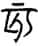”，上半为“二”，下半的“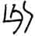”，均像数码的“六”字。古人筹算，六或摆作“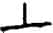”，或摆作“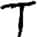”，总之，一横为五，一竖为一，五加一为六。“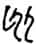”都是六之数字所构成。所以说是二首六身。下二如身，是其日数，把二移下成“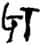”，是数码的二万六千六百六十。

⑬有六旬：又六十日。

⑭赵孟问其县大夫，则其属也：问老人谁是其县大夫，原来是赵武下属。

⑮召之，而谢过焉：之，指老人。谢过，道歉。

⑯虞：忧患。

⑰不能由吾子，使吾子辱在泥涂久矣，武之罪也：以不能及早发现老人，择才而使为歉。由，任用。泥涂，田间野处。

⑱使为君复陶，以为绛县师：老人为君复陶，同时也为绛县师。复陶，管理衣服的官。杨伯峻认为是办理免役之事。县师，掌管地域的官。

⑲废其舆尉：舆尉征发老人，因此罢免其职。

***【译文】***

二月二十二日，晋悼夫人赐给修筑杞国城墙的役夫酒饭，绛县人中有个老人，没有儿子，自己前往修城，也参加了酒席。有人怀疑他的年龄，让他报出年纪。他说：“下臣是小人，不知道记住年龄。只知道下臣出生那年，是正月初一甲子，如今已经过去四百四十五个甲子了。最末一个甲子到今天刚好过了三分之一。”官吏到朝廷去请教那老人的岁数。师旷说：“是鲁国叔仲惠伯在承匡会见郤成子那一年。这一年，狄人进攻鲁国，叔孙庄叔那时在咸地打败狄人，俘获了长狄侨如和虺、豹，用俘虏的名字来给儿子取名。到现在已经七十三年啦。”史赵说：“亥字是‘二’字头‘六’字身，把‘二’下移到身上，就是他在世的天数了。”士文伯说：“那么就是二万六千六百六十旬了。”赵孟问绛县的大夫，原来正是他的下属。赵孟把老人召来，向他道歉，说：“我没有才能，却担负国君委任的重职，由于晋国忧患重重，没能任用你，使你埋没在田间野处，这是我的过错。谨致歉意。”于是让他为官，使他辅助自己执政。老人以年老为由谢绝了。便给他田地，让他为国君管理衣服，担任绛县师，而罢免了绛县的舆尉。

于是鲁使者在晋，归以语诸大夫。季武子曰：“晋未可媮也①。有赵孟以为大夫②，有伯瑕以为佐③，有史赵、师旷而咨度焉④，有叔向、女齐以师保其君⑤。其朝多君子，其庸可媮乎？勉事之而后可⑥。”

***【注释】***

①媮（tōu）：这里指轻视。

②有赵孟以为大夫：赵武为上卿，主晋国大政。

③伯瑕：即士匄，士文伯。

④咨度：咨询、作顾问。

⑤师保：太子的师傅，这里作动词。

⑥其朝多君子，其庸可媮乎？勉事之而后可：季武子认为，晋国多良臣，因此能长久保住盟主地位，只有尽力事奉晋国才好。

***【译文】***

这时鲁国使者正在晋国，回国后把此事告诉了大夫们。季武子说：“晋国不可轻视啊。有赵孟执政，有伯瑕辅佐，有史赵、师旷供咨询，有叔向、女齐以为国君的师保。他们的朝廷上君子很多，怎么能轻视晋国呢？要尽力事奉他们才行。”

30.4 夏四月己亥①，郑伯及其大夫盟②。君子是以知郑难之不已也。

***【注释】***

①四月己亥：四月不当有己亥日，当是史官记载有误。

②郑伯及其大夫盟：因驷氏与良氏相争，郑简公与大夫结盟。

***【译文】***

夏四月己亥，郑简公和大夫们订立盟约。君子由此知道郑国的祸难不断。

30.5 蔡景侯为大子般娶于楚，通焉①。大子弑景侯。

***【注释】***

①通焉：蔡景侯与儿媳通奸。

***【译文】***

蔡景侯替太子般娶楚国女，却和楚女私通。太子杀了景侯。

30.6 初，王儋季卒①，其子括将见王②，而叹。单公子愆期为灵王御士③，过诸廷，闻其叹，而言曰：“乌乎！必有此夫④！”入以告王，且曰：“必杀之！不戚而愿大，视躁而足高，心在他矣⑤。不杀，必害。”王曰：“童子何知⑥！”及灵王崩，儋括欲立王子佞夫⑦。佞夫弗知。戊子⑧，儋括围⑨，逐成愆⑩。成愆奔平畤⑪。五月癸巳⑫，尹言多、刘毅、单蔑、甘过、巩成杀佞夫⑬。括、瑕、廖奔晋⑭。书曰：“天王杀其弟佞夫。”罪在王也⑮。

***【注释】***

①儋季：周灵王的弟弟。

②括：儋季之子。

③御士：侍御之士。

④必有此夫：指儋括有野心，想占有朝廷大权。

⑤不戚而愿大，视躁而足高，心在他矣：其父刚死，无悲哀而有大愿望，目光不定，四处张望，趾高气扬，必有他心。戚，哀伤。视躁，四处张望。

⑥童子何知：灵王未理会单愆期的话。童子，指单愆期，大概当时尚年少。按，以上是灵王未死之事。

⑦王子佞夫：周灵王之子，景王之弟。

⑧戊子：二十八日。

⑨：在今河南孟津东北。

⑩成愆：邑大夫。

⑪平畤（zhì）：周邑，在今洛阳附近。按，儋括想立王子佞夫，因此围作乱。

⑫癸巳：初四。

⑬尹言多、刘毅、单蔑、甘过、巩成：五人都是周大夫。

⑭括、瑕、廖奔晋：王子瑕与廖为儋括同党。

⑮书曰：“天王杀其弟佞夫。”罪在王也：此次周王室之乱，罪魁是儋括，王子佞夫本人并不知情，杀佞夫实为冤枉。《经》文如此记载，意在归罪周王。

***【译文】***

起初，周灵王的弟弟儋季去世，儋季儿子儋括将要进见灵王，却叹气。单国的公子愆期担任灵王的侍御，经过朝廷，听见儋括的叹气，说：“啊！他一定是想占据这里吧！”就进去告诉灵王，并说：“一定要把他杀掉！父亲死了，他不哀伤，却野心勃勃，四处张望，趾高气扬，他的心思在别的地方了。不杀他必然造成危害。”灵王说：“小孩子知道什么！”到灵王去世，儋括想立王子佞夫。佞夫自己并不知道。二十八日，儋括包围地，赶走成愆。成愆逃到平畤。五月初四，尹言多、刘毅、单蔑、甘过、巩成杀了佞夫。儋括、瑕、廖逃往晋国。《春秋》记载：“周景王杀死弟弟佞夫。”这是说罪责在周王。

30.7 或叫于宋大庙①，曰：“嘻嘻，出出②！”鸟鸣于亳社③，如曰“嘻嘻”④。甲午，宋大灾。宋伯姬卒，待姆也⑤。君子谓宋共姬“女而不妇。女待人，妇义事也”⑥。

***【注释】***

①叫：呼喊。大庙：宋国始封君微子之庙。

②嘻嘻，出出：象声词，皆为鸟叫声。

③亳社：殷社。

④如曰“嘻嘻”：按，以上是宋国发生火灾之前的两件怪异之事。

⑤宋伯姬卒，待姆也：火起，宋伯姬必等保姆来后才走，结果被烧死。姆，指保姆，女师傅。

⑥女而不妇。女待人，妇义事也：未婚女应待保姆而后行动；已婚之妇则可便宜行事。宋共公死于成公十五年，宋伯姬守寡已三十四年，年纪已大。君子之意是讥伯姬不知权变。女子未嫁叫女，已嫁叫妇。

***【译文】***

宋国太庙中有大声呼喊的声音，说：“嘻嘻，出出！”鸟在亳社鸣叫，叫声如同“嘻嘻”。五月初五，宋国发生大火灾。宋共姬被烧死，她是为了等保姆。君子认为宋共姬“奉行的是当闺女而不是当媳妇的原则。闺女要等待保姆，已出嫁的媳妇就可以随机应变了”。

30.8 六月，郑子产如陈莅盟。归，复命。告大夫曰：“陈，亡国也，不可与也。聚禾粟，缮城郭，恃此二者，而不抚其民。其君弱植①，公子侈②，大子卑③，大夫敖④，政多门⑤，以介于大国⑥，能无亡乎？不过十年矣⑦。”

***【注释】***

①弱植：根基不牢。

②公子：指公子留。

③大子卑：太子偃师卑弱，不受宠。

④敖：傲慢。

⑤政多门：政事不由一人，而是各行其是。

⑥介：间，处于。

⑦不过十年矣：按，此为昭公八年楚灭陈国伏笔。

***【译文】***

六月，郑国子产到陈国参加盟会。回国复命后，告诉大夫们说：“陈国是将要灭亡的国家，不可与它亲近。他们积聚粮食，修缮城墙，依仗这二者，却不安抚民众。国君根底浅薄，公子过分放纵，太子卑微，大夫傲慢，政出多门，又处于大国之间，能不灭亡吗？要不了十年了。”

30.9 秋七月，叔弓如宋，葬共姬也①。

***【注释】***

①秋七月，叔弓如宋，葬共姬也：按礼，鲁国不必派卿参加宋共姬葬礼，因哀怜伯姬被火烧死，特派叔弓参加。

***【译文】***

秋七月，叔弓到宋国去，是去参加共姬的葬礼。

30.10 郑伯有耆酒，为窟室①，而夜饮酒，击钟焉②。朝至，未已③。朝者曰：“公焉在④？”其人曰：“吾公在壑谷⑤。”皆自朝布路而罢⑥。既而朝⑦，则又将使子晳如楚⑧，归而饮酒。庚子⑨，子晳以驷氏之甲伐而焚之。伯有奔雍梁，醒而后知之⑩，遂奔许。

***【注释】***

①窟室：地下室。

②击钟焉：击钟奏乐。

③朝至，未已：伯有通宵达旦饮酒作乐，众大夫来朝伯有，伯有饮酒尚未停止。

④公：指伯有。伯有之家臣尊称伯有为公，朝者亦因其称以问。

⑤壑谷：指窟室，含有讽刺的意思。

⑥皆自朝布路而罢：朝者只好分散回去。布路，分散。

⑦既而朝：伯有与群臣朝国君。

⑧则又将使子晳如楚：上年伯有曾强使子晳使楚，子晳不去。

⑨庚子：十一日。

⑩伯有奔雍梁，醒而后知之：伯有逃到雍梁时酒醒，才知道发生了事变。雍梁，古地名。在今河南新郑西南、长葛西北。

***【译文】***

郑国伯有嗜好喝酒，造了间地下室，整夜饮酒，还敲钟奏乐。众大夫来朝见他，他还不肯停杯。朝见的人问：“主人在哪里？”伯有手下人说：“我们主人在沟壑里呢。”大夫们都四散回去了。不久朝见郑简公，又提出派子晳出使楚国，回家后又饮酒。七月十一日，子晳率领驷氏家族的甲士攻打伯有家，并放火烧了他家。伯有逃到雍梁，酒醒后才明白发生了什么事，于是出奔许国。

大夫聚谋，子皮曰：“《仲虺之志》云①：‘乱者取之，亡者侮之②。’推亡固存，国之利也③。’罕、驷、丰同生④。伯有汰侈，故不免⑤。”人谓子产就直助强⑥。子产曰：“岂为我徒⑦？国之祸难，谁知所敝⑧？或主强直，难乃不生⑨。姑成吾所⑩。”辛丑⑪，子产敛伯有氏之死者而殡之，不及谋而遂行⑫。印段从之⑬。子皮止之⑭。众曰：“人不我顺，何止焉⑮？”子皮曰：“夫子礼于死者，况生者乎⑯？”遂自止之。壬寅⑰，子产入。癸卯⑱，子石入⑲。皆受盟于子晳氏。乙巳⑳，郑伯及其大夫盟于大宫(21)，盟国人于师之梁之外(22)。

***【注释】***

①仲虺：商汤左相。

②乱者取之，亡者侮之：意思是攻取动乱的，欺负灭亡的。

③推亡固存，国之利也：子皮的意思是应消灭伯有。推，借为“摧”，摧毁。固，巩固。

④罕、驷、丰同生：三家本是同母兄弟。罕，罕氏子皮。驷，驷氏子晳。丰，丰氏公孙段。

⑤伯有汰侈，故不免：三家同生，伯有孤立，又汰侈，所以必亡。汰，骄傲自大。

⑥人谓子产就直助强：时人认为子晳直，三家强，于是建议子产支持这一边。

⑦岂为我徒：子产既不与驷氏同党，又不与良氏同党。徒，同党。

⑧敝：同“弊”，停止，指祸难平息。

⑨或主强直，难乃不生：主持国政的人强大而正直，就不会有祸难。现在三家与伯有都不能如此，因此子产对双方都不支持。

⑩成：定，保住。所：指不偏袒任何一方的地位。

⑪辛丑：十二日。

⑫不及谋而遂行：子产怕有变，未及和大夫们商量就出走了。

⑬印段从之：印段认为子产贤良，所以一同出走。

⑭子皮止之：子皮挽留子产。

⑮人不我顺，何止焉：因为子产收伯有氏的死者，三家之众反对挽留子产。

⑯夫人礼于死者，况生者乎：子产此举是有礼，不是偏袒伯有氏。

⑰壬寅：十三日。

⑱癸卯：十四日。

⑲子石：即印段。

⑳乙巳：十六日。

(21)大宫：太庙，始封君桓叔之庙。

(22)盟国人于师之梁之外：郑简公与众结盟，反对伯有。师之梁，郑国城门。

***【译文】***

大夫们聚集在一起商议怎么办，子皮说：“《仲虺之志》说：‘动乱的就攻取它，灭亡的就欺侮它。’摧毁灭亡的巩固存在的，是对国家有利的。罕氏、驷氏、丰氏本是同胞兄弟。伯有骄傲又放肆，所以不免于祸难。”有人劝子产靠近正直的帮助强盛的。子产说：“他们莫非是我的同伙？国家的祸难，谁能知道该怎么平息它？要是主持国政的人强大而正直，祸难就不会发生。先保持自己的立场再说吧。”十二日，子产收敛伯有家族死者的尸体葬埋了，没和大夫们打招呼就离开都城。印段跟随着他。子皮阻止子产。大家说：“他既然不肯顺服我们，劝阻他做什么？”子皮说：“他对死去的人尚且有礼，更何况对生者呢？”便亲自劝止子产。十三日，子产进入国都。十四日，印段也进入国都。两人都在子晳家和大夫们订立盟约。十六日，郑简公和大夫们在太庙订立盟约，在师之梁门外和国人订立盟约。

伯有闻郑人之盟己也①，怒。闻子皮之甲不与攻己也，喜，曰：“子皮与我矣②。”癸丑③，晨，自墓门之渎入④，因马师颉介于襄库⑤，以伐旧北门。驷带率国人以伐之⑥。皆召子产⑦。子产曰：“兄弟而及此，吾从天所与⑧。”伯有死于羊肆⑨，子产襚之⑩，枕之股而哭之，敛而殡诸伯有之臣在市侧者⑪，既而葬诸斗城⑫。子驷氏欲攻子产，子皮怒之曰：“礼，国之干也⑬。杀有礼，祸莫大焉⑭。”乃止。

***【注释】***

①盟己：因己而盟。伯有以为郑人是想共同抵抗自己。

②子皮与我矣：伯有知道子皮没有派兵攻自己，误以为是支持自己。

③癸丑：二十四日。

④墓门：郑国城门。渎：排水洞。

⑤因马师颉介于襄库：通过颉用襄库的皮甲来装备士兵。马师颉，子羽之孙。

⑥驷带：子西之子，子晳同宗。

⑦皆召子产：驷氏、伯有都召子产。

⑧兄弟而及此，吾从天所与：子产反对同室操戈，哪一方都不卷入。伯有、驷带都是穆公曾孙，则兄弟辈；子产、子晳、伯石都是穆公孙，亦兄弟辈。

⑨羊肆：即羊市，卖羊的街市。

⑩襚之：为伯有尸体穿衣。

⑪敛：大敛，将尸体装入棺材。

⑫既而葬诸斗城：子产安葬伯有。斗城，地名，在今河南通许东北。

⑬国之干也：国家的支柱。

⑭杀有礼，祸莫大焉：子产敛伯有有礼，不可攻。

***【译文】***

伯有听说郑国人盟誓共同对付自己，大怒。又听说子皮的甲士没参与攻打自己，很高兴，说：“子皮站在我一边。”二十四日清晨，伯有等人从墓门的出水洞潜入，通过马师颉从襄库取得衣甲装备，带人攻打旧北门。驷带率领国人讨伐伯有。双方都召请子产。子产说：“兄弟却到了这个地步，我顺从上天所护佑的一方。”伯有死在羊市，子产给他的尸体穿衣，枕着他的大腿号哭，收敛入棺，停放在街市伯有部下的家中，接着又安葬在斗城。驷氏想攻打子产，子皮怒斥道：“礼是国家的主干。攻杀有礼的人，没有比这更大的祸患了。”驷氏才停止行动。

于是游吉如晋还，闻难，不入，复命于介①。八月甲子②，奔晋。驷带追之，及酸枣③。与子上盟，用两珪质于河④。使公孙肸入盟大夫。己巳⑤，复归⑥。

***【注释】***

①复命于介：使副手入都代为复命。介，游吉的副手。

②甲子：初六。

③酸枣：古地名。在今河南延津西南。

④与子上盟，用两珪质于河：结盟时沉珪玉于河表示信用。子上，即驷带。

⑤己巳：十一日。

⑥复归：游吉回国。

***【译文】***

当时游吉出使晋国归来，听说国内发生祸难，就不入境，让副手回来复命。八月初六，游吉逃往晋国。驷带追赶他，在酸枣赶上。游吉和驷带立盟，把两件玉珪沉入黄河表示诚意。游吉派公孙肸入都与大夫们订立盟约。十一日，游吉回到国内。

书曰：“郑人杀良霄。”不称大夫，言自外入也①。

***【注释】***

①不称大夫，言自外入也：伯有是逃亡于外后再回来的，已失去大夫之位，所以不称其为大夫。按，这是解释《经》文。

***【译文】***

《春秋》记载说：“郑国人杀了良霄。”不称良霄为大夫，是说他从国外回来，已经不具有大夫身份。

于子之卒也①，将葬，公孙挥与裨灶晨会事焉。过伯有氏，其门上生莠②。子羽曰③：“其莠犹在乎④？”于是岁在降娄⑤，降娄中而旦⑥。裨灶指之⑦，曰：“犹可以终岁⑧，岁不及此次也已⑨。”及其亡也，岁在娵訾之口⑩，其明年乃及降娄⑪。

***【注释】***

①子：即公孙虿。死于襄公十九年。

②莠（yǒu）：狗尾草。

③子羽：即公孙挥。

④其莠犹在乎：以莠比喻伯有，指其不能长久。

⑤于是岁在降娄：当时岁星正运行到降娄。岁，岁星。降娄，也叫奎类，十二星次之一。

⑥降娄中而旦：公孙虿死于襄公十九年周历四月，葬时当在七月，此时降娄在中天而天亮。

⑦之：指降娄。

⑧终岁：指岁星绕日一周，约需十二年。

⑨岁不及此次也已：指伯有活的时间不会再等到岁星回到降娄了，即不会超过十二年。

⑩及其亡也，岁在娵訾（ｊū zǐ）之口：岁星此时正过娵訾，尚未到降娄。娵訾，十二星次之一。

⑪其明年乃及降娄：以上由天象说明裨灶预言正确。

***【译文】***

子去世后，将要安葬，公孙挥与裨灶清晨去子家会商办理丧事。路过伯有家，看到门上已经长草。公孙挥说：“这棵草还能存在多久呢？”这时岁星在降娄，降娄在天空中顶时天亮了。裨灶指着说：“还可以让岁星绕行一周，不过他到不了岁星再到这里就会枯萎了。”到伯有被杀时，岁星正好处在娵訾口上，第二年才到达降娄。

仆展从伯有①，与之皆死。羽颉出奔晋，为任大夫②。鸡泽之会③，郑乐成奔楚，遂适晋。羽颉因之，与之比而事赵文子④，言伐郑之说焉。以宋之盟故⑤，不可。子皮以公孙为马师⑥。

***【注释】***

①仆展：郑国大夫，伯有同党。

②羽颉出奔晋，为任大夫：逃到晋国后为任大夫。羽颉，即马师颉，助伯有伐北门。任，晋邑，在今河北任县东南。

③鸡泽之会：在襄公三年。

④比：勾结。

⑤宋之盟：弭兵大会之盟。

⑥公孙：子罕之子，代替羽颉。

***【译文】***

仆展跟从伯有，和伯有一起战死。羽颉逃往晋国，担任任地大夫。鸡泽之会时，郑国的乐成出逃楚国，又前往晋国。羽颉接近他，和他相勾结一起事奉赵文子，提议攻打郑国。因为有宋国盟约的制约，赵文子没有采纳。子皮让公孙担任马师。

30.11 楚公子围杀大司马掩而取其室①。申无宇曰：“王子必不免。善人，国之主也。王子相楚国，将善是封殖②，而虐之③，是祸国也。且司马，令尹之偏④，而王之四体也⑤。绝民之主，去身之偏，艾王之体⑥，以祸其国，无不祥大焉⑦。何以得免⑧？”

***【注释】***

①掩：子冯之子。为楚贤臣，参见襄公二十五年《传》。

②封殖：扶植，培养。

③虐：残害。

④偏：佐，辅佐。

⑤而王之四体也：司马也是王的股肱之臣。

⑥艾（yì）：斩除。

⑦无：发语词，无义。

⑧何以得免：公子围弑郏敖为楚灵王，昭公十三年，被杀。

***【译文】***

楚国公子围杀了大司马掩而占有他的家财。申无宇说：“公子围肯定不免于祸难。善人是国家的栋梁。公子围执掌楚国大权，应该培植善人，反而加以残害，这是祸害国家。再说司马就如令尹的半边身子，有如国君的四肢。杀死国家的栋梁之材，去掉身子的半边，砍掉国君的手脚，如此祸害国家，真是极大的不祥。他又怎么能免于祸难呢？”

30.12 为宋灾故，诸侯之大夫会，以谋归宋财①。冬十月，叔孙豹会晋赵武、齐公孙虿、宋向戌、卫北宫佗、郑罕虎及小邾之大夫②，会于澶渊③。既而无归于宋，故不书其人④。君子曰：“信其不可不慎乎！澶渊之会，卿不书，不信也。夫诸侯之上卿，会而不信，宠名皆弃⑤，不信之不可也如是。《诗》曰：‘文王陟降，在帝左右⑥。’信之谓也。又曰：‘淑慎尔止，无载尔伪⑦。’不信之谓也。”书曰“某人某人会于澶渊，宋灾故”，尤之也⑧。不书鲁大夫，讳之也⑨。

***【注释】***

①为宋灾故，诸侯之大夫会，以谋归宋财：商量支援宋国财物以救灾。归，同“馈”。

②北宫佗：北宫括之子。

③澶渊：古地名。在今河南濮阳西北。

④既而无归于宋，故不书其人：此次会后却没馈送宋国什么财物，因此《经》文不记与会卿大夫姓名，以示批评。

⑤宠：尊荣。名：指氏族与名字。

⑥文王陟（zhì）降，在帝左右：引《诗》见《诗经·大雅·文王》，意思是文王有信，或升或降，都在天帝左右。陟，升。

⑦淑慎尔止，无载尔伪：这是逸诗，意思是要谨慎你的行动，不要表现你的虚伪。淑，善。止，举止。

⑧尤之：责备诸侯之卿大夫。

⑨不书鲁大夫，讳之也：鲁国叔孙豹其实参加了澶渊之会，《经》文不加记载，是为之隐讳。按，以上是解释《经》文的意思。

***【译文】***

为了宋国火灾之故，诸侯国大夫们相会，商量资助宋国财物。冬十月，叔孙豹会同晋国赵武、齐国公孙虿、宋国向戌、卫国北宫佗、郑国罕虎以及小邾国的大夫，在澶渊相会。因为结果并没给宋国财物，所以《春秋》没有记载参加会议的人。君子说：“信用能不谨慎对待吗！澶渊之会连上卿的名字都不记载，就是因为不守信用！诸侯上卿，相会而不守信，尊贵与姓名全都丢掉了，不能不守信用就是这样啊。《诗》说：‘文王或升或降，都是在天帝的左右。’说的就是讲信用。又说：‘好好地谨慎你的举止，不要做出虚伪事。’说的是不守信用。”《春秋》记载说“某人某人会于澶渊，是因为宋国火灾的缘故”，这是表示责备。不记载鲁国大夫，是在为之隐讳。

30.13 郑子皮授子产政①。辞曰：“国小而逼②，族大宠多③，不可为也④。”子皮曰：“虎帅以听，谁敢犯子⑤？子善相之。国无小，小能事大，国乃宽⑥。”

***【注释】***

①郑子皮授子产政：伯有死后，子皮执政，因子产贤能，让与子产。

②逼：逼进大国。

③族大宠多：郑国公族盛大，而恃宠专横的人甚多。

④不可为：不可治。按，子产辞谢。

⑤虎帅以听，谁敢犯子：子皮愿意率公族以听命于子产。虎，罕虎，即子皮。

⑥国无小，小能事大，国乃宽：国不在于小，只要善治，可以宽舒缓和。这是子皮打消子产的顾虑。

***【译文】***

郑国子皮把国政交给子产。子产推辞说：“国家小而逼近大国，公族庞大，受宠者多，没法治理。”子皮说：“我带领众人听你的命令，谁敢冒犯你？你好好地辅佐国政吧。国家不在于小，小国能事奉大国，国家就能宽舒缓和。”

子产为政，有事伯石①，赂与之邑②。子大叔曰：“国皆其国也，奚独赂焉③？”子产曰：“无欲实难。皆得其欲，以从其事，而要其成④。非我有成，其在人乎⑤？何爱于邑，邑将焉往⑥？”子大叔曰：“若四国何⑦？”子产曰：“非相违也，而相从也，四国何尤焉⑧？《郑书》有之曰⑨：‘安定国家，必大焉先⑩。’姑先安大，以待其所归⑪。”既，伯石惧而归邑，卒与之。伯有既死，使大史命伯石为卿，辞。大史退，则请命焉⑫。复命之，又辞。如是三，乃受策入拜⑬。子产是以恶其为人也，使次己位⑭。

***【注释】***

①有事伯石：有政事让伯石去办。伯石，即公孙段，字子石。

②赂与之邑：给伯石田邑作为报赏。

③国皆其国也，奚独赂焉：大家为国出力，伯石为何特别奖赏？

④要（yāo）：求。

⑤非我有成，其在人乎：只要事情成功，就达到目的，赏邑只是一种手段。其，难道。

⑥何爱于邑，邑将焉往：虽赏之田邑，田邑却不会跑掉，仍在郑国。爱，爱惜。

⑦若四国何：子太叔担心这样做将被邻国所笑。

⑧非相违也，而相从也，四国何尤焉：赏之田邑，是使大夫相顺从，团结一致，邻国没理由责怪。

⑨《郑书》：指郑国的史籍。

⑩必大焉先：即“必先大”。大，大族。

⑪姑先安大，以待其所归：先安定大族，再观其后果。

⑫请命：请求重新发布命令，愿就任卿位。

⑬如是三，乃受策入拜：可见伯石虚伪矫情。

⑭子产是以恶其为人也，使次己位：子产恶其虚伪，又怕他作乱，因此加以笼络。按，以上都是子产安抚大族的政策。

***【译文】***

子产执政，有事要伯石去办，就送给他城邑。子太叔说：“国家是大家的国家，为何唯独送他城邑？”子产说：“人没欲望其实很难。我使他们的欲望得到满足，好让他们为国办事，并以此要求他们把事办好。这不是我的成功，难道还是他人的成功？为什么要舍不得城邑，城邑还能跑到哪里去？”子太叔说：“要是周边邻国议论怎么办？”子产说：“我这样做不是分裂国家，而是使大家和睦，各国又什么可非议的呢？《郑书》有这样的话：‘安定国家，一定要优先考虑大族。’先安定大族，以观察其结果。”不久，伯石因害怕而交出了城邑，但子产最终还是给了他。伯有死后，子产让太史命令伯石为卿，伯石推辞。太史走后，伯石却又请求重新发布任命。再次下命令，伯石又推辞。这样往返了三次，伯石才接受任命入朝拜谢。子产由此厌恶伯石的为人，但还是让他居于仅次于自己的职位。

子产使都鄙有章①，上下有服②，田有封洫③，庐井有伍④。大人之忠俭者⑤，从而与之⑥；泰侈者因而毙之⑦。

***【注释】***

①子产使都鄙有章：国都与乡间一切事情都有一定的规章。都，国都。鄙，乡野。

②上下有服：各有职责。服，职责。

③田有封洫（xù）：子产作封洫，是清理田亩，划定田界，将侵占他人的土地归还原主的一项经济政策。封，田界。洫，灌田水沟。

④庐井有伍：将居民按照户口有一定的安排，使房舍和耕地互相适应。庐，房舍。

⑤大人：指卿大夫。

⑥与之：亲近他，举拔他。

⑦泰侈者因而毙之：骄傲放肆者依法惩办，赏罚分明。泰侈，汰侈。

***【译文】***

子产使国都与乡间的一切事物都有章法，上下各司其责，田地有疆界和沟渠，耕地房舍合理配套。大夫中忠诚俭朴的，就听从他亲近他；骄横放肆的就惩罚他。

丰卷将祭①，请田焉②。弗许，曰：“唯君用鲜，众给而已③。”子张怒，退而征役④。子产奔晋，子皮止之，而逐丰卷。丰卷奔晋。子产请其田、里⑤，三年而复之⑥，反其田、里及其入焉⑦。

***【注释】***

①丰卷：郑穆公后裔，字子张。

②田：田猎。猎取祭品。

③唯君用鲜，众给而已：国君祭祀时才用“鲜”，群臣只要一般祭品齐备就可以了。鲜，指新杀的动物。给，指一般的供应。

④子张怒，退而征役：子张招聚兵众，准备攻打子产。子张，丰卷。

⑤子产请其田、里：子产请求国君不没收丰卷的田、里。里，住宅。

⑥三年而复之：三年后让丰卷回国。

⑦入：指三年的收入。

***【译文】***

丰卷将要祭祀，请求让他打猎获得祭品。子产不批准，说：“唯有国君祭祀才用新杀的动物，其他人只要普通的祭品齐备就行了。”丰卷大怒，退出后就召集兵卒。子产要逃往晋国，子皮拦住了他，而驱逐丰卷。丰卷出逃晋国。子产请求不要没收丰卷的田产、房舍，三年后便把丰卷召回，并把田地、房舍和三年来的收入都归还给他。

从政一年，舆人诵之，曰：“取我衣冠而褚之①，取我田畴而伍之②。孰杀子产，吾其与之③！”及三年，又诵之，曰：“我有子弟，子产诲之④；我有田畴，子产殖之⑤。子产而死，谁其嗣之⑥？”

***【注释】***

①取我衣冠而褚之：指骄奢逾制的衣冠不敢用。褚，即“贮”，储藏。

②取我田畴而伍之：指把田亩进行重新划分、安排。畴，耕地。

③与之：助之，帮助杀子产。按，以上舆人之诵，表明部分贵族对子产改革政策的反对。

④诲：教诲。

⑤殖：繁殖，增产。

⑥子产而死，谁其嗣之：子产的政治措施取得成就，受到众人歌颂。而，如果。嗣，继承。

***【译文】***

子产从政一年，人们评议他，说：“将我的衣冠藏起来，把我的田地重安排。谁要杀子产，我一定跟从他！”三年后，又有评议，说：“我有子弟，子产教导他；我有田地，子产使它增产。子产如果死了，谁能继承他？”

# 三十一年

***【经】***

31.1 三十有一年春王正月①。

31.2 夏六月辛巳②，公薨于楚宫③。

31.3 秋九月癸巳④，子野卒⑤。

31.4 己亥⑥，仲孙羯卒⑦。

31.5 冬十月，滕子来会葬⑧。

31.6 癸酉⑨，葬我君襄公。

31.7 十有一月，莒人弑其君密州⑩。

***【注释】***

①三十有一年：鲁襄公三十一年当周景王三年，前542。

②辛巳：二十八日。

③公薨于楚宫：鲁襄公去世。

④癸巳：十一日。

⑤子野：鲁国公子。

⑥己亥：十七日。

⑦仲孙羯：即孟孝伯。

⑧滕子来会葬：滕成公来参加鲁襄公葬礼。

⑨癸酉：二十一日。

⑩密州：莒国君犁比公。

***【译文】***

鲁襄公三十一年春周历正月。

夏六月二十八日，鲁襄公在楚宫去世。

秋九月十一日，子野去世。

十七日，仲孙羯去世。

冬十月，滕成公来鲁国参加襄公葬礼。

二十一日，安葬我国国君襄公。

十一月，莒国人杀死他们的国君密州。

***【传】***

31.1 三十一年春王正月，穆叔至自会①。见孟孝伯，语之曰：“赵孟将死矣。其语偷，不似民主②。且年未盈五十③，而谆谆焉如八九十者④，弗能久矣。若赵孟死，为政者其韩子乎⑤！吾子盍与季孙言之，可以树善⑥，君子也⑦。晋君将失政矣⑧，若不树焉⑨，使早备鲁⑩，既而政在大夫，韩子懦弱，大夫多贪，求欲无厌，齐、楚未足与也，鲁其惧哉⑪！”孝伯曰：“人生几何？谁能无偷？朝不及夕，将安用树？”穆叔出而告人曰：“孟孙将死矣。吾语诸赵孟之偷也，而又甚焉。”又与季孙语晋故，季孙不从。及赵文子卒⑫，晋公室卑，政在侈家⑬，韩宣子为政，不能图诸侯⑭。鲁不堪晋求⑮，谗慝弘多⑯，是以有平丘之会⑰。

***【注释】***

①穆叔至自会：从澶渊之会返鲁。

②其语偷，不似民主：赵孟本为晋国执政，但听他说话毫无远虑，不像个掌权的人。偷，说话毫无远虑。

③且年未盈五十：赵孟约生于成公二年，至此才四十七八岁。

④谆谆：说话唠叨絮絮不休的样子。

⑤韩子：韩起。

⑥树善：结好。

⑦君子也：韩起有君子之德，必不会忘记鲁国的结好。

⑧晋君将失政矣：晋国大夫日益强大，国君将渐渐失去治国权力。

⑨树：树善。

⑩使早备鲁：让韩起早点为鲁国着想。

⑪齐、楚未足与也，鲁其惧哉：齐、楚两国不足以让鲁国依附，一旦晋国大权落入大夫手里，鲁国将陷入困境。

⑫及赵文子卒：赵文子死于明年。

⑬侈家：即上面说的“多贪，求欲无厌”的大夫。

⑭韩宣子为政，不能图诸侯：晋国政局正如穆叔所料。图诸侯，继续为诸侯霸主。

⑮鲁不堪晋求：鲁国难以负担晋国的贡赋要求。

⑯谗慝：奸邪小人。弘多：很多，同义词连用。

⑰是以有平丘之会：平丘之会在昭公十三年，晋国执季孙意如。

***【译文】***

鲁襄公三十一年春周历正月，穆叔从澶渊盟会回国。见到孟孝伯，告诉他说：“赵孟快要死了。他说话毫无远虑，不像个主持国政的人。而且他年龄还不满五十，却唠唠叨叨像八九十的人，活不久了。要是赵孟死了，掌权的恐怕是韩起吧！您何不跟季孙去说，这个人可以早日和他搞好关系，他是个君子。晋国国君将失去政权，如不早日搞好关系，让他早些为鲁国着想，到时候大权落到大夫手里，韩起性格软弱，大夫又大多贪婪，要求和欲望没有满足的时候，齐、楚两国又靠不住，鲁国恐怕就危险了！”孟孝伯说：“人的一生能有多长？谁能不得过且过？早晨好好的也许就活不到晚上，哪里用得着早做准备？”穆叔出来告诉别人说：“孟孙将要死了。我告诉他赵孟在得过且过，他可比赵孟更甚。”穆叔又和季孙说起晋国的情况，季孙也没有听从他的意见。到赵孟死后，晋国公室地位卑下，国政掌握在骄纵的大夫手里，韩起执政，不能使诸侯拥护晋国。鲁国无法负担晋国的要求，奸邪小人又多，于是就有平丘之会。

31.2 齐子尾害闾丘婴①，欲杀之，使帅师以伐阳州②。我问师故。夏五月，子尾杀闾丘婴，以说于我师③。工偻洒、渻灶、孔虺、贾寅出奔莒④。出群公子。

***【注释】***

①害：恐其为害。闾丘婴：齐大夫。襄公二十年崔杼之乱，闾丘婴奔鲁，庆封灭崔氏后返齐。

②阳州：此时为鲁地，在今山东东平。

③说：解释。

④工偻洒、渻（ｓhěnɡ）灶、孔虺、贾寅出奔莒：四人都是闾丘婴同党。

***【译文】***

齐国子尾担心闾丘婴为害，想杀了他，便让闾丘婴领兵去攻打阳州。我国质问出兵的理由。夏五月，子尾杀死闾丘婴，以此来向我国做出交代。工偻洒、渻灶、孔虺、贾寅逃往莒国。把公子们都放逐了。

31.3 公作楚宫①。穆叔曰：“《大誓》云：‘民之所欲，天必从之②。’君欲楚也夫③，故作其宫。若不复适楚，必死是宫也。”六月辛巳，公薨于楚宫。

***【注释】***

①楚宫：襄公到楚国去，喜欢其宫室，回来效仿而建的宫室。

②民之所欲，天必从之：天必听从百姓的要求；国君的私欲，天则不一定听从。这里穆叔引用《大誓》的话，有批评襄公的意思。《大誓》，已逸。

③欲楚：喜欢楚国。

***【译文】***

襄公建造楚国式宫殿。穆叔说：“《大誓》说：‘民众所希望的，上天一定满足他。’国君是喜欢楚国吧，所以建造这样的宫殿。如果不再去楚国，一定会死在这座宫殿里。”六月二十八日，襄公在楚宫去世。

叔仲带窃其拱璧①，以与御人，纳诸其怀，而从取之②，由是得罪③。

***【注释】***

①拱璧：襄公的大玉璧。

②以与御人，纳诸其怀，而从取之：叔仲带将大玉璧送给御者，后来又取了回去。

③由是得罪：鲁国因此鄙视叔仲带，所以其子孙不得志于鲁国。

***【译文】***

叔仲带偷走襄公的大璧，给了御者，就放在他的怀里，出宫后又从御者怀里取走，由此而被鲁国人鄙视。

立胡女敬归之子子野①，次于季氏②。秋九月癸巳，卒，毁也③。

***【注释】***

①胡：归姓国。敬归：鲁襄公妾。

②次于季氏：子野住在季氏家里。

③卒，毁也：子野哀痛过度而死。

***【译文】***

立胡国女子敬归的儿子子野为国君，暂时住在季氏家里。秋九月十一日死了，是由于哀伤过度。

31.4 己亥，孟孝伯卒。

***【译文】***

九月十七日，孟孝伯去世。

立敬归之娣齐归之子公子裯①。穆叔不欲，曰：“大子死，有母弟，则立之，无，则立长②。年钧择贤③，义钧则卜④，古之道也。非適嗣，何必娣之子⑤？且是人也，居丧而不哀，在戚而有嘉容⑥，是谓不度⑦。不度之人，鲜不为患。若果立之，必为季氏忧。”武子不听，卒立之。比及葬，三易衰，衰衽如故衰⑧。于是昭公十九年矣，犹有童心，君子是以知其不能终也⑨。

***【注释】***

①娣：妹妹。公子裯（chóu）：即鲁昭公。

②“大子死”五句：都是庶子，就立年长者。

③年钧择贤：年纪相当则选贤者。钧，通“均”。

④义钧则卜：同样贤能就以占卜选择。义，贤能。

⑤非適嗣，何必娣之子：子野不是嫡子，也未必一定要立其母亲妹妹的儿子。適，同“嫡”。娣之子，公子裯。

⑥在戚：父母死。嘉容：面有喜色。

⑦不度：不孝。《礼记·祭统》孔《疏》引《孝经援神契》云“天子之孝曰就，诸侯曰度”。

⑧三易衰，衰衽如故衰：到襄公下葬已换三次孝服，孝服的衣襟还是蹭蹋得像破旧衣服一样，说明他嬉戏无度如儿童。三易衰，到襄公下葬已换三次孝服，这是不合礼节的。衰，孝服。衽，衣襟。

⑨君子是以知其不能终也：预言昭公不得善终。按，昭公二十五年逃亡齐国。

***【译文】***

立敬归的妹妹齐归的儿子公子裯为君。穆叔不同意，说：“太子死了，有同母弟就立同母弟，没有的话，就在庶子中立年长的。年龄相当就选择贤能的，同样贤能就通过占卜决定，这是古代传下来的规矩。死去的并非嫡子，何必要立其母亲妹妹的儿子？再说这个人居丧而不哀伤，服孝期间面有喜色，这叫做不孝。不孝之人很少有不造成祸患的。要是立了他，必定给季氏带来忧患。”季武子不听，最终还是立了裯。到安葬襄公的时候，三次给裯换丧服，他还是把丧服的衣襟蹭蹋得跟旧衣服一样。这时昭公已经十九岁了，还像小孩子一样贪玩，君子由此而知他不会有什么好结果。

31.5 冬十月，滕成公来会葬，惰而多涕①。子服惠伯曰：“滕君将死矣。怠于其位②，而哀已甚③，兆于死所矣④。能无从乎⑤？”

***【注释】***

①惰：不恭敬。

②怠于其位：滕成公“惰”，这是在临吊之位上表现懈怠。

③而哀已甚：多涕是哀伤太过分的表现。

④兆于死所矣：滕成公有将死的先兆。死所，指会葬。

⑤能无从乎：为昭公三年滕成公死伏笔。从，从死。

***【译文】***

冬十月，滕成公前来参加葬礼，表现得不恭敬却流了很多眼泪。子服惠伯说：“滕成公将要死了。他在临吊的位子上表现懈怠，却过分的悲哀，他的死兆已经在葬礼中表现出来了。他能不跟着死吗？”

31.6 癸酉，葬襄公。

***【译文】***

十月二十一日，安葬襄公。

公薨之月，子产相郑伯以如晋，晋侯以我丧故，未之见也。子产使尽坏其馆之垣而纳车马焉①。士文伯让之②，曰：“敝邑以政刑之不修，寇盗充斥，无若诸侯之属辱在寡君者何③，是以令吏人完客所馆④，高其闬闳⑤，厚其墙垣，以无忧客使⑥。今吾子坏之，虽从者能戒⑦，其若异客何？以敝邑之为盟主，缮完葺墙⑧，以待宾客，若皆毁之，其何以共命⑨？寡君使匄请命⑩。”对曰：“以敝邑褊小，介于大国，诛求无时⑪，是以不敢宁居，悉索敝赋，以来会时事⑫。逢执事之不间⑬，而未得见，又不获闻命，未知见时⑭。不敢输币⑮，亦不敢暴露⑯。其输之，则君之府实也⑰，非荐陈之，不敢输也⑱。其暴露之，则恐燥湿之不时而朽蠹，以重敝邑之罪⑲。侨闻文公之为盟主也⑳，宫室卑庳(21)，无观台榭(22)，以崇大诸侯之馆，馆如公寝(23)；库厩缮修，司空以时平易道路(24)，圬人以时塓馆宫室(25)；诸侯宾至，甸设庭燎(26)，仆人巡宫(27)，车马有所(28)，宾从有代(29)，巾车脂辖(30)，隶人、牧、圉，各瞻其事(31)；百官之属，各展其物(32)；公不留宾，而亦无废事(33)；忧乐同之，事则巡之(34)；教其不知，而恤其不足(35)。宾至如归，无宁灾患(36)；不畏寇盗，而亦不患燥湿。今铜鞮之宫数里(37)，而诸侯舍于隶人(38)，门不容车，而不可逾越(39)；盗贼公行，而天厉不戒(40)。宾见无时，命不可知(41)。若又勿坏(42)，是无所藏币以重罪也。敢请执事将何以命之(43)？虽君之有鲁丧，亦敝邑之忧也(44)。若获荐币，修垣而行，君之惠也，敢惮勤劳(45)！”文伯复命(46)。赵文子曰：“信(47)。我实不德，而以隶人之垣以赢诸侯(48)，是吾罪也。”使士文伯谢不敏焉(49)。晋侯见郑伯，有加礼(50)，厚其宴好而归之(51)。乃筑诸侯之馆。叔向曰：“辞之不可以已也如是夫(52)！子产有辞，诸侯赖之(53)，若之何其释辞也(54)？《诗》曰：‘辞之辑矣，民之协矣；辞之绎矣，民之莫矣(55)。’其知之矣。”

***【注释】***

①子产使尽坏其馆之垣而纳车马焉：拆毁客馆的围墙，将车马赶进去。

②士文伯：即士匄。《广韵》引《世本》：“司功氏，士匄弟佗为晋司功，因官为氏。”则士匄此时或亦为司功，诸侯宾馆是其所职掌。让：责问。

③寇盗充斥，无若诸侯之属辱在寡君者何：因盗贼很多，若客馆破旧，将无法保证诸侯宾客的安全。

④是以令吏人完客所馆：特意修好宾馆。

⑤闬（hàn）、闳（hónɡ）：都指门。

⑥以无忧客使：外宾可不用担心寇盗为患。

⑦从者：指郑国的随从。戒：戒备，防备寇盗。

⑧完：借用为“院”，也指墙。葺（qì）：修补。

⑨共命：供给所求。

⑩寡君使匄请命：请问毁垣的理由。匄，士文伯名匄。

⑪以敝邑褊小，介于大国，诛求无时：晋国随时要小国贡纳物品。诛求，责求。

⑫是以不敢宁居，悉索敝赋，以来会时事：郑国不敢安生，搜尽国内财富以作朝聘之礼。

⑬不间：无暇。

⑭又不获闻命，未知见时：晋国又不通知何时接见。

⑮不敢输币：因晋国君未接见，不能献纳贡品。

⑯暴露：指礼品日晒夜露。

⑰其输之，则君之府实也：其，如果。府实，府库中的物品。

⑱非荐陈之，不敢输也：不经一定的仪式，又不敢进献。荐陈，将贡品陈列于庭，此时要举行一定的仪式。

⑲其暴露之，则恐燥湿之不时而朽蠹，以重敝邑之罪：贡品日晒雨淋，虫咬朽坏，将加重郑国之罪。朽，腐烂。蠹，虫咬坏。

⑳侨：子产名。文公：晋文公。

(21)卑庳（ｂì）：同义词连用，指低矮。

(22)无观台榭：没有供游观的台榭。

(23)以崇大诸侯之馆，馆如公寝：文公把客馆修得又高又大，如同自己的路寝。寝，路寝，古代天子、诸侯的正厅。

(24)司空以时平易道路：道路按时修整。司空，周为六卿之一，即冬官大司空，掌管工程。

(25)圬（wū）人以时塓（mì）馆宫室：房间按时涂饰。圬人，泥工。塓，涂墙。

(26)甸：即甸人，管理柴薪者。庭燎：古代庭中照明的火炬。

(27)巡宫：巡视客馆。

(28)车马有所：马厩已修好，车马有地方安置。

(29)宾从有代：外宾的仆从有人代为服役。

(30)巾车：管理车辆的官。脂辖：用油脂涂轮轴。

(31)隶人、牧、圉，各瞻其事：各人负责各自的差事。隶人，洒扫房舍、清除厕所的人。牧，看守牛羊的人。圉，看马的人。瞻，照管。

(32)百官之属，各展其物：百官陈列各种物品招待外宾。

(33)而亦无废事：虽接见迅速，外交仪式仍然齐备，并不废除。

(34)事则巡之：有意外情况，格外注意警卫巡行。事，指意外事件。

(35)教其不知，而恤其不足：对外宾热心指教，尽量照顾。

(36)宾至如归，无宁灾患：文公如此礼遇外宾，何来灾患。宁，语助词。

(37)铜鞮（dī）之宫：晋国君离宫。铜鞮宫在今山西沁县南。

(38)而诸侯舍于隶人：诸侯外宾住在隶人的房舍。

(39)门不容车，而不可逾越：门小，车又不能越墙而入。

(40)天厉：瘟疫。不戒：不能预防。

(41)命：指晋国君接见之命。

(42)若又勿坏：不坏馆垣。

(43)敢请执事将何以命之：子产反诘士匄有何指教。

(44)虽君之有鲁丧，亦敝邑之忧也：鲁国有丧，郑国同哀。意思是晋国不应该以鲁丧为借口不接见。按，晋、郑同鲁都是姬姓，故鲁君去世，郑、晋都要表示忧戚。

(45)敢惮勤劳：按，子产这番话是批评晋国内政不修，以致“盗则公行”；对小国掠夺和压榨，又骄横奢侈，对诸侯无礼。

(46)复命：向国君复命。

(47)信：子产的话有道理。

(48)赢：受，指接待。

(49)使士文伯谢不敏焉：晋国表示歉意。

(50)晋侯见郑伯，有加礼：礼节特别隆重。

(51)厚其宴好而归之：宴会更加隆重，回赠更加丰厚。宴，宴礼。好，好货。

(52)辞之不可以已也如是夫：外交辞令不可忽视。辞，辞令。

(53)子产有辞，诸侯赖之：子产善辞令，诸侯得其利。

(54)释辞：废弃辞令。

(55)辞之辑矣，民之协矣，辞之绎矣，民之莫矣：引《诗》见《诗经·大雅·板》，意思是辞令和谐，人民团结；辞令愉快，人民安定。叔向引这段诗句称赞子产善辞令，而且知道辞令的重要。辑，和谐。协，今作“洽”，融洽。绎，喜悦。莫，安定。

***【译文】***

襄公去世那个月，子产相礼郑简公到晋国去，晋平公因为鲁国有丧事，没有会见。子产派人把招待外宾的宾馆围墙全部拆毁，把车马都赶进馆舍。士文伯责备他，说：“我国由于政事刑罚没搞好，以致寇盗很多，这对于屈尊来存问的诸侯臣属没有什么好办法，所以派官吏把宾馆修缮好，大门造得高高的，墙垣筑得厚厚的，以使来宾无忧。现在您拆毁了它，虽然您的随从能做好警戒，别国的宾客又怎么住呢？由于敝国忝为盟主，所以修缮馆舍，筑好围墙，以接待宾客，您把它们都毁掉，又如何满足宾客的需要呢？我们国君派我来向你请教。”子产回答说：“由于敝国狭小，又夹在大国之间，大国随时要敝国进贡财物，所以我们不敢安居，搜尽敝国的财物，前来朝见。恰逢你们不得空，没能得见，又没有得到明示，不知什么时候能接见。既不敢献纳财物，又不敢把它们放在露天。如果献纳，这些财物是国君府库里的物品，不经过一定的仪式，我们不敢献纳。如果放在露天，又怕时而干燥时而潮湿，或被虫咬，使东西朽坏，从而加重敝国的罪责。我听说晋文公当盟主的时候，宫室低小，没有可供观览的台榭，却把接待诸侯的宾馆建得高大宽敞，宾馆就如同国君的路寝正厅。修缮馆舍的仓库、马厩，司空按时平整道路，泥水匠按时粉刷馆舍宫室墙壁；诸侯的宾客来了，甸人在庭院中点起火把，仆人巡视客馆，车马有安置的场所，宾客的仆从有专人替代，管车官员给车轴加好油，管洒扫的隶人和养牛羊、看马的，各司其责；百官各人陈列其礼品；文公不让宾客耽搁，也没有失礼的事情；与宾客忧乐与共，有意外情况就加以安抚；对宾客热情教导，所缺乏的给予周济照顾。宾至如归，不但没有灾患，不怕盗贼，也不怕干湿。如今贵国的铜鞮宫绵延数里，而把诸侯安顿在像给下人住的地方，大门进不去车，又无法越墙进入；盗贼公然横行，而天灾又无法防止。宾客进见没有一定的时间，国君的命令也不知道什么时候发出。如果不拆毁围墙，就没有地方藏贡品而加重罪责。谨此请问贵执事对我们有什么指教？虽然贵国国君遭到鲁国丧事，可这同样也是敝国感到忧戚的事。如果能让献纳财礼，我们愿把围墙修好再离开，这就是国君的恩惠了，岂敢害怕辛劳？”士文伯回去复命。赵文子说：“他说的是实情。是我们德行有亏，用下人住的房屋接待诸侯，这是我们的过错。”派士文伯去赔礼道歉。晋平公接见郑简公，礼仪有加，厚加款待，赠送了丰厚的礼物，然后让他们回去了。于是新建了接待诸侯的宾馆。叔向说：“辞令不能废弃就如这个例子！子产善于辞令，诸侯因此获益，为何要放弃辞令呢？《诗》说：‘辞令和谐，民众团结；辞令动听，百姓安定。’子产懂得这道理。”

31.7 郑子皮使印段如楚，以适晋告，礼也①。

***【注释】***

①郑子皮使印段如楚，以适晋告，礼也：弭兵大会规定诸侯“交相见”，因此印段使楚，行前先向晋国报告此事。

***【译文】***

郑子皮派印段前往楚国，行前去晋国报告此事，这是合于礼的。

31.8 莒犁比公生去疾及展舆①。既立展舆，又废之。犁比公虐，国人患之。十一月，展舆因国人以攻莒子，弑之，乃立②。去疾奔齐，齐出也。展舆，吴出也③。书曰“莒人弑其君买朱”，言罪之在也④。

***【注释】***

①犁比：莒国君密州之号。

②展舆因国人以攻莒子，弑之，乃立：展舆自立为君。因，依靠。

③展舆，吴出也：展舆之母为吴女。此为展舆明年奔吴伏笔。

④书曰“莒人弑其君买朱”，言罪之在也：解释《经》文的意思，认为罪在莒君。买朱，莒犁比公。

***【译文】***

莒犁比公生去疾和展舆。已经立展舆为太子，又把他废除了。犁比公残暴，国人忧闷发愁。十一月，展舆依靠国人攻打犁比公，杀了他，自立为君。去疾逃往齐国，因为他是齐女所生。展舆是吴女所生。《春秋》记载“莒国人杀死他们的国君买朱”，是说罪责在于犁比公。

31.9 吴子使屈狐庸聘于晋①，通路也②。赵文子问焉，曰：“延州来季子其果立乎③？巢陨诸樊④，阍戕戴吴⑤，天似启之，何如？”对曰：“不立。是二王之命也⑥，非启季子也。若天所启，其在今嗣君乎⑦！甚德而度⑧。德不失民，度不失事。民亲而事有序，其天所启也⑨。有吴国者，必此君之子孙实终之⑩。季子，守节者也。虽有国，不立⑪。”

***【注释】***

①屈狐庸：申公巫臣儿子。成公七年至吴为行人。

②通路也：沟通两国往来之路。

③延州来季子其果立乎：问季札是否立为国君。延州来季子，即季札。

④巢陨诸樊：襄公二十五年，吴王诸樊死于攻巢之役。

⑤阍戕戴吴：襄公二十九年馀祭被守门人所杀。戴吴，即馀祭。

⑥是二王之命也：诸樊、馀祭二王之死，是命运所定。

⑦今嗣君：指吴王夷昧。

⑧甚德而度：甚有品德，行有法度。

⑨“德不失民”四句：吴王夷昧有德有度，得民拥护。

⑩有吴国者，必此君之子孙实终之：指夷昧及其子孙能长久保有吴国。据《史记·吴太伯世家》，吴王僚为馀昧之子，公子光，即吴王阖庐，为诸樊之子，公子光杀王僚而自立，传太子夫差而灭于越。而据《世本》，公子光是夷昧之子。《公羊传·襄公二十九年》曰夷昧生光而废之，僚是夷昧的庶兄。

⑪季子，守节者也。虽有国，不立：按，相传季札曾多次让国，为后人所称道。

***【译文】***

吴王派屈狐庸到晋国聘问，是为了沟通两国的友好关系。赵文子问他说：“延州来季子是否一定会被立为国君呢？巢地战役死了诸樊，守门人杀死戴吴，上天似乎为季子打开了做国君的大门，结果怎么样？”屈狐庸回答说：“季子不会立为国君。你所说的只是二位君王的命运不佳，并非打开季子当国君的大门。如果上天打开大门，应该是在现在继立国君的身上吧！他很有德行而且合乎法度。有德行的人不会失去人民的拥护，有法度就不会办错事。人民亲附而事情有次序，他才是上天所为之打开大门的人。享有吴国的，一定是这位国君的子孙。季子是讲究节操的人，即便把国家交给他，他也不会当国君。”

31.10 十二月，北宫文子相卫襄公以如楚①，宋之盟故也②。过郑，印段迋劳于棐林③，如聘礼而以劳辞④。文子入聘⑤。子羽为行人，冯简子与子大叔逆客。事毕而出，言于卫侯曰：“郑有礼，其数世之福也，其无大国之讨乎⑥！《诗》曰：‘谁能执热，逝不以濯⑦。’礼之于政，如热之有濯也。濯以救热，何患之有⑧？”

***【注释】***

①北宫文子：北宫佗。卫襄公：卫献公之子。

②宋之盟故也：指弭兵大会规定的“交相见”。

③迋劳：前往慰劳。棐林：即北林，古地名。在今河南新郑。

④如聘礼而以劳辞：仪节如聘问之礼，而用郊劳之辞。

⑤文子入聘：北宫文子入郑回报印段之劳。

⑥郑有礼，其数世之福也，其无大国之讨乎：郑国此时正值子产执政，实是称赞子产贤能，必将安定郑国。其，恐怕。

⑦谁能执热，逝不以濯：引《诗》见《诗经·大雅·桑柔》，本意为天气闷热，谁能不去洗澡。这里以此比喻礼对于政的重要。

⑧“礼之于政”四句：礼仪对于政事，如天热必须洗澡。以礼治国，国可长久。

***【译文】***

十二月，北宫文子相礼卫襄公前往楚国，是为了履行在宋国订立的盟约。路过郑国，印段在棐林慰劳他们，行聘问之礼，用郊劳的辞令。文子进入郑国国都聘问。郑国子羽为行人，冯简子与子太叔出来迎宾。聘礼结束后，北宫文子出来，对卫襄公说：“郑国有礼仪，他们几代都将有福，大概不会被大国讨伐了！《诗》说：‘谁能忍受炎热，谁能不去洗澡。’礼对于政事，就如天热要洗澡一样。通过洗澡以消除酷热，还会有什么祸患？”

子产之从政也，择能而使之。冯简子能断大事，子大叔美秀而文①，公孙挥能知四国之为②，而辨于其大夫之族姓、班位、贵贱、能否③，而又善为辞令。裨谌能谋，谋于野则获，谋于邑则否④。郑国将有诸侯之事，子产乃问四国之为于子羽，且使多为辞令⑤；与裨谌乘以适野，使谋可否；而告冯简子使断之⑥。事成，乃授子大叔使行之，以应对宾客，是以鲜有败事⑦。北宫文子所谓有礼也。

***【注释】***

①子大叔美秀而文：子太叔貌美举止文雅，谈吐又有文采。文，谓习典章制度诗乐。

②公孙挥能知四国之为：子羽是个出色的外交官。为，指政令。公孙挥，即子羽。

③辨：明察。族姓：家族姓氏。班位：禄秩爵位。贵贱：指身份。能否：才能高低。

④裨谌能谋，谋于野则获，谋于邑则否：裨谌喜静不喜闹，考虑问题要到野外去，才能有收获。野，郊外。邑，城里。

⑤多为辞令：多拟几份外交辞令稿。

⑥而告冯简子使断之：谋划之后，让冯简子判断，再作最后决定。

⑦“事成”四句：以上综述子产执政有方，量才使用，择能而使，以证实北宫文子的话。

***【译文】***

子产从政，选择贤能者加以使用。冯简子能决断大事；子太叔美秀而有文采；子羽能了解四方诸侯的政令，明辨各国大夫的家族姓氏、爵禄职位、身份贵贱、能干与否，又善于辞令；裨谌能够出谋划策，他在野外思考便能有正确的判断，在城里就不行。郑国一旦有和诸侯交往的事情，子产就向子羽询问四方诸侯的情况，并让他多准备几份外交辞令；和裨谌乘车到野外，让他思考良策；然后告诉冯简子让他作出决断；计划完成，就交给子太叔去办理，与来宾交往应对，所以很少有办错事的。这就是北宫文子所说的有礼。

31.11 郑人游于乡校①，以论执政。然明谓子产曰：“毁乡校何如②？”子产曰：“何为？夫人朝夕退而游焉，以议执政之善否。其所善者，吾则行之；其所恶者，吾则改之，是吾师也。若之何毁之？我闻忠善以损怨，不闻作威以防怨③。岂不遽止④？然犹防川。大决所犯，伤人必多⑤，吾不克救也。不如小决使道⑥，不如吾闻而药之也⑦。”然明曰：“蔑也今而后知吾子之信可事也⑧。小人实不才，若果行此，其郑国实赖之，岂唯二三臣⑨？”仲尼闻是语也，曰：“以是观之，人谓子产不仁，吾不信也⑩。”

***【注释】***

①乡校：乡间的公共场所，既是学校，又是乡人聚会议事场所。

②毁乡校何如：众人在乡校议论行政得失，然明建议毁掉乡校。

③我闻忠善以损怨，不闻作威以防怨：只有多行忠善以减少怨恨，不可用威势来防止怨恨。

④岂不遽止：作威防怨，怨可以马上止住。遽，马上。

⑤大决所犯，伤人必多：子产以防水打比方，河水大决口，伤人一定多。大决，河水大决口。

⑥不如小决使道：开小口使水流通。即发扬舆论，让意见随时说出来。道，引导。

⑦不如吾闻而药之也：舆论既出，取之以作药。这是子产所主张的实行贵族内部的民主政治。

⑧蔑也今而后知吾子之信可事也：然明称赞子产。蔑，名鬷蔑，即然明，这里是他自指。信可事，实在可以成事。

⑨“小人实不才”四句：按照子产主张行事，郑国就有希望了。

⑩以是观之，人谓子产不仁，吾不信也：孔子生于襄公二十二年，这时才十一岁，这话应是后来称赞子产时才说的。

***【译文】***

郑国人休闲时就到乡校相聚，在那里议论执政得失。然明对子产说：“毁掉乡校怎么样？”子产说：“为什么呢？人们早晚休息时到那里走走，评议执政的好坏。他们认为好的，我就照办；他们不赞成的，我就改正，他们实际上是我的老师。为什么要毁掉？我听说凭借忠善可以减少怨言，没听说用威势可以防止怨恨。用强硬办法难道不能立刻把人们的口堵住？但就如预防河水决口一样。如果大决口，伤害人必定很多，我没办法解救。不如开小口加以引导，不如让我听到批评后作为药石来改正。”然明说：“我从今以后知道您的确能成大事。我实在没能力，如果真按您的想法去做，郑国就有了可靠的保障，岂止我们几个大臣得到好处？”孔子后来听说了子产那番话，说道：“由此看来，人们说子产不仁，我才不相信呢。”

31.12 子皮欲使尹何为邑①。子产曰：“少②，未知可否。”子皮曰：“愿③，吾爱之，不吾叛也。使夫往而学焉，夫亦愈知治矣④。”子产曰：“不可。人之爱人，求利之也⑤。今吾子爱人则以政，犹未能操刀而使割也，其伤实多⑥。子之爱人，伤之而已，其谁敢求爱于子⑦？子于郑国，栋也，栋折榱崩，侨将厌焉，敢不尽言⑧？子有美锦，不使人学制焉⑨。大官、大邑，身之所庇也，而使学者制焉⑩，其为美锦不亦多乎⑪？侨闻学而后入政，未闻以政学者也⑫。若果行此，必有所害。譬如田猎，射御贯，则能获禽⑬，若未尝登车射御，则败绩厌覆是惧，何暇思获⑭？”子皮曰：“善哉！虎不敏。吾闻君子务知大者、远者，小人务知小者、近者⑮。我，小人也。衣服附在吾身，我知而慎之，大官、大邑所以庇身也，我远而慢之⑯。微子之言，吾不知也。他日我曰⑰：子为郑国，我为吾家，以庇焉，其可也⑱。今而后知不足。自今请，虽吾家，听子而行⑲。”子产曰：“人心之不同如其面焉，吾岂敢谓子面如吾面乎⑳？抑心所谓危，亦以告也(21)。”子皮以为忠，故委政焉，子产是以能为郑国(22)。

***【注释】***

①尹何：子皮家臣。为邑：治理私邑。

②少：尹何年少。

③愿：为人老实。

④使夫往而学焉，夫亦愈知治矣：子皮认为，若派尹何学为邑宰，会更增进他行政的能力。

⑤人之爱人，求利之也：爱其人，总要对他有利。

⑥今吾子爱人则以政，犹未能操刀而使割也，其伤实多：年少而授予政事，就像让不会拿刀的人割东西，必将自伤。

⑦子之爱人，伤之而已，其谁敢求爱于子：爱人反而伤人，人必疏远你。

⑧“子于郑国”五句：子产由子皮举荐为政，子皮犹如国家栋梁，栋梁一断，屋椽也会崩塌，自己也将受到影响。榱（cuī），屋椽。厌，压。

⑨子有美锦，不使人学制焉：既是美锦，是不会让人用它练习做衣服的。锦，有彩色花纹的绸缎。学制，学裁缝。

⑩大官、大邑，身之所庇也，而使学者制焉：大官和封邑是自身的庇护，更不能让人来练习治理。庇，庇护，依赖。

⑪其为美锦不亦多乎：让毫无经验的人去学做大官，比让不会裁缝的人去剪裁美锦还要糟糕。

⑫侨闻学而后入政，未闻以政学者也：先经训练再为政，而不是借做官的机会来学习为政。

⑬射御贯，则能获禽：御，指驾车。贯，通“惯”，娴熟。禽，走兽的总称。

⑭若未尝登车射御，则败绩厌覆是惧，何暇思获：不会驾车的人去射猎，恐怕一心只考虑是否翻车被压，无暇顾及猎获了。按，子产的话多比喻，这里仍然是用比喻说理。

⑮吾闻君子务知大者、远者，小人务知小者、近者：君子有远虑，其了解的一定是大的远的；小人只是看见眼前的小的。

⑯“衣服附在吾身”四句：衣服在身，我知爱惜，官职、采邑，反而疏远轻视了。

⑰他日：往日。

⑱“子为郑国”四句：原来认为你治理国事，我治理家事，有所托庇就可以了。为，治理。

⑲虽吾家，听子而行：今后连家事都听你的。

⑳人心之不同如其面焉，吾岂敢谓子面如吾面乎：意思是人心各有打算，我不能干预你的家事。

(21)抑心所谓危，亦以告也：意思是只是心里认为不妥，因此以实相告。抑，表转折，不过。

(22)子皮以为忠，故委政焉，子产是以能为郑国：子产知无不言，忠于国事；子皮虚心改过，支持子产。

***【译文】***

子皮想让尹何管理封邑。子产说：“尹何太年轻，不知道行不行。”子皮说：“这个人忠厚老实，我喜欢他，他不会背叛我的。让他去学习一下，他就更知道该怎么治理了。”子产说：“可不行。喜欢一个人，是希望对他有利。现在您爱一个人，就把政事交给他去办理，就像还不会拿刀却让他去割东西，会对他造成很大伤害的。您这样爱人，只会伤害他，那么谁还敢求得您的喜爱呢？您对于郑国，是栋梁，如果栋梁折断椽子也就崩塌，我将被压在下面，怎敢不把话全部说出来呢？您有漂亮的缎锦，是不会让人用它来学裁剪的。大官、大邑，是您身家性命的庇护，反而让人去学着治理，岂不是比让不会裁缝的人去剪裁美锦更糟糕吗？我听说要学习以后再做官，没听说过把做官作为学习手段的。如果这样做去，一定有所伤害。譬如打猎，熟悉了射箭驾车，就能获得猎物，如果不曾驾车射箭，那他一心害怕车翻被压，哪有时间顾及猎获呢？”子皮说：“说得太好了！我实在考虑不周。我听说君子致力于重大、长远的事务，小人只知道小的、眼前的。我是一个目光短浅的人。衣服穿在我身上，我知道爱惜它，大官、大邑恰恰是用以护身的，我却疏远轻视它。没有你这番话，我还不明白。以前我说过：你治理郑国，我管理我的家，让我有所依托庇护，这就可以了。现在看来还不行。请从现在起，即便是我的家事，也听你的。”子产说：“人心不相同，就像人的面目各不相同一样，我哪敢说您的面目就跟我的一样呢？不过我是觉得这有危险，所以就实言相告。”子皮觉得子产是个忠诚的人，就把郑国的国政托付给他，子产因此能够致力于郑国的管理。

31.13 卫侯在楚，北宫文子见令尹围之威仪①，言于卫侯曰：“令尹似君矣②，将有他志③。虽获其志，不能终也④。《诗》云：‘靡不有初，鲜克有终⑤。’终之实难，令尹其将不免。”公曰：“子何以知之？”对曰：“《诗》云：‘敬慎威仪，惟民之则⑥。’令尹无威仪，民无则焉。民所不则，以在民上，不可以终⑦。”公曰：“善哉！何谓威仪？”对曰：“有威而可畏谓之威，有仪而可象谓之仪⑧。君有君之威仪，其臣畏而爱之，则而象之⑨，故能有其国家，令闻长世⑩。臣有臣之威仪，其下畏而爱之，故能守其官职，保族宜家⑪。顺是以下皆如是，是以上下能相固也⑫。《卫诗》曰：‘威仪棣棣，不可选也⑬。’言君臣、上下、父子、兄弟、内外、大小皆有威仪也。《周诗》曰：‘朋友攸摄，摄以威仪⑭。’言朋友之道必相教训以威仪也。《周书》数文王之德，曰：‘大国畏其力，小国怀其德。’言畏而爱之也⑮。《诗》云：‘不识不知，顺帝之则⑯。’言则而象之也。纣囚文王七年⑰，诸侯皆从之囚，纣于是乎惧而归之，可谓爱之⑱。文王伐崇，再驾而降为臣⑲，蛮夷帅服⑳，可谓畏之。文王之功，天下诵而歌舞之，可谓则之(21)。文王之行，至今为法，可谓象之(22)。有威仪也。故君子在位可畏，施舍可爱(23)，进退可度(24)，周旋可则(25)，容止可观(26)，作事可法，德行可象，声气可乐(27)，动作有文(28)，言语有章(29)，以临其下，谓之有威仪也(30)。”

***【注释】***

①令尹围：王子围，后来的楚灵王，此时为令尹。

②令尹似君矣：令尹围已有国君的威仪。

③将有他志：必将杀王自立。

④虽获其志，不能终也：指令尹围的野心虽然能实现，但不能善终。

⑤靡不有初，鲜克有终：引《诗》见《诗经·大雅·荡》，意思是虽有好的开头，却很少能有好的结果。

⑥敬慎威仪，惟民之则：引《诗》见《诗经·大雅·抑》，意思是不要滥用威仪，它是百姓的准则。

⑦民所不则，以在民上，不可以终：百姓所不效法的人，位居于百姓之上，必不能善终。不则，不效法的人。

⑧仪：仪容、举止、言语等。象：仿效。

⑨则而象之：作为准则并仿效。

⑩令闻：好名声。

⑪保族宜家：保护家族，家庭和睦。

⑫顺是以下皆如是，是以上下能相固也：上下都如此，因此国家巩固。

⑬威仪棣棣，不可选也：引《诗》见《诗经·国风·邶风·柏舟》，意思是人各有威仪，不可随便退让。棣棣，雍容娴雅的样子。选，屈挠退让。按，《邶》、《鄘》、《卫》都是卫诗。

⑭朋友攸摄，摄以威仪：引《诗》见《诗经·大雅·既醉》，意思是朋友之间互相辅助，所用的就是威仪。

⑮“《周书》数文王之德”五句：文王有威仪，因此大国惧怕他的力量，小国怀念他的恩德。按，这里的《周书》指逸《书》。

⑯不识不知，顺帝之则：引《诗》见《诗经·大雅·皇矣》，意思是文王行事，唯顺着天帝的准则并加以仿效。

⑰纣囚文王七年：相传商纣囚文王于羑里，七年后才释放。

⑱可谓爱之：诸侯都爱文王。

⑲文王伐崇，再驾而降为臣：文王两次伐崇，崇国降服。

⑳蛮夷帅服：蛮夷相继归服。

(21)文王之功，天下诵而歌舞之，可谓则之：天下赞颂文王，并以之为准则。

(22)文王之行，至今为法，可谓象之：文王之法，成为规范，大家都仿效。

(23)施舍可爱：施舍可使人爱他。

(24)进退可度：进退可作为法度。度，法度，准则。

(25)周旋：行礼时进退揖让的动作。

(26)容止可观：行为举止值得观看。

(27)声气可乐：声音气度可使人高兴。

(28)有文：有修养。

(29)有章：有条理。

(30)以临其下，谓之有威仪也：所谓威仪，应可畏可爱，可度可则，可观可法，可象可乐，归为一点，即应有德。文王有德，故有威仪。如楚令尹围，非真有威仪。

***【译文】***

卫襄公在楚国，北宫文子见到令尹围的举止仪表，对卫襄公说：“令尹像国君一样了，他将要有其他的打算。不过他虽然能满足愿望，却不能善终。《诗》说：‘都可以有开头，却很少有好的结果。’好的结果实在太难，令尹他将不免于祸难。”卫襄公说：“你是从哪里看出来的？”北宫文子回答说：“《诗》说：‘举止行为要谨慎，因为人民以此为标准。’令尹举没有威仪，人民就不仿效。人民所不效法的人，却居民上，是不会有好结果的。”卫襄公说：“说得好！那么什么是威仪呢？”北宫文子回答说：“有威严使人敬畏叫做威，有仪表可让人效仿叫做仪。国君有国君的威仪，臣下就会敬畏并拥护他，以他为榜样而效仿他，所以能保有他的国家，美名流芳百世。臣子有臣子的威仪，他的下属就敬畏并拥护他，所以能保住他的官职，保护家族使家庭和睦。依此类推都是如此，所以上上下下能相互巩固。《卫诗》说：‘威仪安祥，不可随便。’是说君臣、上下、父子、兄弟、内外、大小都有各自的威仪。《周诗》说：‘朋友之间相互辅助，所用的就是威仪。’是说朋友之道一定要用威仪来教导。《周书》列举文王的美德，说：‘大国怕他的力量，小国感他的恩德。’是说怕他并拥护他。《诗》说：‘无识无知，顺着天帝的准则。’是说以他为榜样而效仿他。纣囚禁文王七年，诸侯都跟他一起去坐牢，纣于是害怕而释放了文王，可称得上诸侯爱戴文王了。文王攻打崇国，两次出兵，崇国降服，蛮夷也相继归服，也称得上诸侯爱戴文王了。文王的功绩，天下赞诵歌舞，可称得上以他为榜样。文王的举措，至今仍然被奉为法则，可称得上被人仿效。这就是因为他有威仪啊。因此君子在位使人敬畏，赏赐给人让人拥戴，进退可以作为法度，行礼揖让可以作为准则，仪容举止值得观摩，做事可以让人效法，德行可以视为典范，声音气度可以使人高兴，举止文明优雅，言语有条有理，这样对待下人，就叫做有威仪了。”

