 定公

***【题解】***

定公，鲁国第二十四任国君，名宋，襄公之子、昭公之弟，前509年六月即位，前495年死，子哀公蒋立。 定公前期，季孙氏专权。定公五年季平子死，季桓子嗣立，季氏家臣阳虎擅权，犯上作乱，操纵鲁国朝政，孔子不仕。定公八年阳虎叛乱，九年阳虎逃奔晋国。其后孔子为鲁司寇，定公十二年，孔子命申句须等败费宰公山不狃，并堕费。

鲁国自僖公以来，世代归服晋国。但此时晋国国内大夫专权，政出多门，内讧激烈，晋国霸业衰落，诸侯多叛。定公十一年，鲁国与郑国媾和，从此背叛晋国。齐、郑、卫、鲁各国之好逐渐形成。

楚国令尹子常贪鄙，诸侯离心。自楚昭王即位以来，无岁不有吴师。吴国在伍子胥的策划下，于定公四年大败楚军，攻入郢都。定公五年，在吴国攻占楚国之际，越国乘机侵入吴国。定公十四年，吴攻越，败之于槜李。数年之间，吴越两国争锋不断。

在诸侯纷争、群龙无首的形势下，秦国与齐国显示了他们的优势。秦国支持了楚国，齐国团结了鲁、郑、卫等诸侯国。

# 元年

***【经】***

1.1 元年春王①。

1.2 三月，晋人执宋仲几于京师②。

1.3 夏六月癸亥③，公之丧至自乾侯④。

1.4 戊辰⑤，公即位⑥。

1.5 秋七月癸巳⑦，葬我君昭公。

1.6 九月，大雩。

1.7 立炀宫⑧。

1.8 冬十月，陨霜杀菽⑨。

***【注释】***

①元年：鲁定公元年当周敬王十一年，前509。

②仲几：宋国大夫，鲁昭公三十二年任宋国左师。京师：东周王都，在今河南洛阳。

③癸亥：二十一日。

④公之丧至自乾侯：鲁昭公去年十二月死于乾侯，现在将灵柩迎回鲁国。

⑤戊辰：二十六日。

⑥公即位：六月二十六日，鲁定公即位。

⑦癸巳：二十二日。

⑧立炀宫：季平子重建炀宫庙。

⑨冬十月，陨霜杀菽：降霜而损害豆苗。按，周历十月是今农历八月，没到霜降节气而降霜，而且毁害庄稼，是异常现象，所以记载。

***【译文】***

鲁定公元年春周历。

三月，晋国在京师拘禁宋国仲几。

夏六月二十一日，昭公的灵柩从乾侯运回国。

二十六日，鲁定公即位。

秋七月二十二日，安葬我国国君昭公。

九月，举行盛大的求雨雩祭。

重建炀公庙。

冬十月，降霜损害豆类。

***【传】***

1.1 元年春王正月辛巳①，晋魏舒合诸侯之大夫于狄泉，将以城成周。魏子莅政②。卫彪傒曰：“将建天子③，而易位以令④，非义也。大事奸义⑤，必有大咎。晋不失诸侯，魏子其不免乎⑥！”是行也，魏献子属役于韩简子及原寿过⑦，而田于大陆⑧，焚焉⑨，还，卒于甯⑩。范献子去其柏椁，以其未复命而田也⑪。

***【注释】***

①辛巳：初七。

②魏子莅政：魏舒主持政事。莅政，掌管政事。莅，临。

③建天子：为天子筑城使居之。

④易位：指魏舒以大臣身份居君位以命令诸侯大夫。

⑤奸义：违反道义。

⑥晋不失诸侯，魏子其不免乎：彪傒预言晋国如果不失去诸侯，魏舒必将受惩罚，不免于祸患。

⑦韩简子：晋国韩起之孙。原寿过：周大夫。

⑧大陆：古地名。在今河南获嘉西北，旧名吴泽陂。

⑨焚焉：为了打猎而焚烧草木。

⑩甯：古地名。在今河南获嘉西。

⑪范献子去其柏椁，以其未复命而田也：魏舒死，范献子代为执政。范献子撤去魏舒的柏木外棺，以批评他未复命便去打猎。

***【译文】***

鲁定公元年春周历正月初七，晋国魏舒在狄泉会合诸侯的大夫，准备修筑成周城墙。魏舒主持修城事宜。卫国彪傒说：“打算为周天子筑城，却逾越本位发号施令，这不合道义。做重大的事情却违背道义，必有大灾祸。晋国要是不失去诸侯，魏舒恐怕不能免于祸患！”这次行动，魏舒把差事交付给韩简子和原寿过，自己跑到大陆打猎，放火赶逐猎物，返程死在甯地。范献子撤除了魏舒的柏木外棺，因为他还没有复命就去打猎。

孟懿子会城成周，庚寅①，栽②。宋仲几不受功③，曰：“滕、薛、郳，吾役也④。”薛宰曰：“宋为无道，绝我小国于周，以我适楚，故我常从宋⑤。晋文公为践土之盟，曰：‘凡我同盟，各复旧职。’若从践土，若从宋，亦唯命⑥。”仲几曰：“践土固然⑦。”薛宰曰：“薛之皇祖奚仲居薛⑧，以为夏车正⑨。奚仲迁于邳⑩，仲虺居薛⑪，以为汤左相。若复旧职，将承王官，何故以役诸侯⑫？”仲几曰：“三代各异物，薛焉得有旧⑬？为宋役，亦其职也⑭。”士弥牟曰：“晋之从政者新⑮，子姑受功。归，吾视诸故府⑯。”仲几曰：“纵子忘之，山川鬼神其忘诸乎⑰？”士伯怒，谓韩简子曰：“薛征于人，宋征于鬼⑱，宋罪大矣。且己无辞，而抑我以神⑲，诬我也。‘启宠纳侮’⑳，其此之谓矣。必以仲几为戮(21)。”乃执仲几以归。三月，归诸京师(22)。

***【注释】***

①庚寅：十六日。

②栽：为筑墙而立板。

③宋仲几不受功：宋国仲几不接受任务。

④滕、薛、郳（ní），吾役也：仲几想让这三个小国代为服役。

⑤“宋为无道”四句：按，成公二年，宋、薛等国与楚国结盟，襄公二十七年以后，宋、薛或属晋，或属楚，或两属。

⑥若从践土，若从宋，亦唯命：是依践土之盟恢复旧职，还是服从宋国，薛宰表示惟晋国之命是听，实际上是反对为宋国服役。

⑦践土固然：即使依践土之盟复旧职，薛国仍应为宋国服役。

⑧皇祖：远祖。

⑨车正：掌管车服的大夫。

⑩邳（pī）：古地名，在今江苏邳县。

⑪仲虺（huǐ）：奚仲之后。

⑫若复旧职，将承王官，何故以役诸侯：薛宰以薛之历史力争，认为若复旧职，薛将接受天子的官位，不必为宋国服役。

⑬三代各异物，薛焉得有旧：薛宰所说是夏商时事，现在是周代，不以夏商为旧职。异物，异事，是说时代不同，事情也不同。

⑭为宋役，亦其职也：如果以夏商时事为旧职，那么宋国是商之后，为宋国服役也是复旧职。

⑮晋之从政者新：范献子新任执政。

⑯视诸故府：查考旧档案。故府，收藏档案所。

⑰纵子忘之，山川鬼神其忘诸乎：结盟必祭告山川鬼神，所以说山川鬼神不会忘记。这是顶撞士弥牟的话。其，难道。

⑱薛征于人，宋征于鬼：薛国以人为证，宋国以鬼为证。征，同“证”。

⑲抑我以神：以神压制我。

⑳启宠纳侮：指本要宠宋，反招来侮辱。

(21)戮：辱。

(22)乃执仲几以归。三月，归诸京师：先将仲几抓走带回晋国，后来觉得不妥，于是送往京师囚禁。

***【译文】***

孟懿子参加增筑成周城的工程，十六日，开始夯土。宋国仲几不肯接受任务，说：“滕国、薛国、郳国，是代我国服役的。”薛国宰臣说：“宋国所为无道，使我们小国和周断绝关系，带着我们改事楚国，所以我国常常服从宋国。晋文公在践土结盟，说：‘凡是我们同盟国家，各自恢复原来的职位。’是服从践土之盟，还是依从宋国，我们唯命是听。”仲几说：“即便按践土盟约，你们还是应为宋国服役。”薛国宰臣说：“薛的远祖奚仲居住薛地，担任夏朝车正。奚仲迁移到邳地，仲虺住在薛地，任汤的左相。如果恢复旧职，应该是任天子官职，为什么要为诸侯国服役？”仲几说：“三代的事各不相同，薛国怎么能有原先的职位？为宋国服役，也是你们的职责。”士弥牟说：“晋国执政者刚上任，你先接下任务。我回去后查一下故府所存档案。”仲几说：“即使您忘记了，山川鬼神难道也忘了吗？”士弥牟怒，对韩简子说：“薛国用人作证，宋国用鬼作证，宋国的罪过大了。而且他已经无话可说，却用鬼神来压制我们，这是欺骗我们。‘给予宠信却招来侮辱’，说的就是这种情况。一定要让仲几受到羞辱。”便抓了仲几带回国。三月，又把仲几送到京师。

城三旬而毕，乃归诸侯之戍。齐高张后，不从诸侯①。晋女叔宽曰：“周苌弘、齐高张皆将不免。苌叔违天②，高子违人③。天之所坏，不可支也。众之所为，不可奸也④。”

***【注释】***

①齐高张后，不从诸侯：齐国高张迟到，没有赶上各国诸侯城成周之期。

②苌叔违天：天意将弃周，苌弘想迁都以延长周的帝祚，是违天。

③高子违人：高张迟到，是违人。

④众之所为，不可奸也：奸，犯。按，此为哀公三年周杀苌弘、六年高张逃亡伏笔。

***【译文】***

筑城持续了三旬完工，便遣返诸侯的戍卒。齐国高张晚到，没有赶上诸侯筑城。晋国女叔宽说：“周朝苌弘、齐国高张都将不免于祸患。苌叔违背上天，高张违背众人。上天要毁坏谁，没人能保他。众人要怎么做，谁也不能违背。”

1.2 夏，叔孙成子逆公之丧于乾侯①。季孙曰：“子家子亟言于我，未尝不中吾志也②。吾欲与之从政，子必止之，且听命焉③。”子家子不见叔孙，易几而哭④。叔孙请见子家子，子家子辞，曰：“羁未得见，而从君以出⑤。君不命而薨，羁不敢见⑥。” 叔孙使告之曰：“公衍、公为实使群臣不得事君。若公子宋主社稷，则群臣之愿也⑦。凡从君出而可以入者，将唯子是听⑧。子家氏未有后，季孙愿与子从政⑨。此皆季孙之愿也，使不敢以告⑩。”对曰：“若立君，则有卿士、大夫与守龟在⑪，羁弗敢知。若从君者，则貌而出者⑫，入可也；寇而出者⑬，行可也。若羁也，则君知其出也，而未知其入也⑭，羁将逃也。”丧及坏⑮，公子宋先入，从公者皆自坏反⑯。

***【注释】***

①叔孙成子：叔孙婼之子。

②中吾志：合于我心。

③吾欲与之从政，子必止之，且听命焉：季平子让叔孙成子劝诱子家羁回国共理政事，不要逃往他国。之，指子家羁。止之，留住子家羁，不让他到别国去。听命，凡事都听取子家羁的意见。

④子家子不见叔孙，易几而哭：子家羁不想与叔孙成子见面，所以改变哭丧时间。易几，改变哭丧时间。古代丧礼，初丧应朝夕哭于中庭北面。几，期。

⑤羁未得见，而从君以出：子家羁跟随昭公出国时，叔孙成子还没当卿，所以说“未得见”。

⑥君不命而薨，羁不敢见：昭公没有命令，所以不敢见叔孙成子。这是子家羁不见的托辞。

⑦若公子宋主社稷，则群臣之愿也：意思是昭公之子公衍、公为造成昭公出奔，现在群臣愿奉公子宋为君。公子宋，昭公弟弟定公。

⑧凡从君出而可以入者，将唯子是听：随昭公出奔的人，谁可以返国，全部由子家羁来定。

⑨子家氏未有后，季孙愿与子从政：子家羁之父归父在宣公十八年被季氏所逐，无后于鲁，现在季氏愿意为子家氏立后，并请子家羁共襄鲁国政事。

⑩不敢：叔孙成子名。

⑪守龟：占卜用的龟甲。

⑫貌而出：指表面上随君而出，实际却未必忠于君。

⑬寇而出：与季氏结仇而出。

⑭则君知其出也，而未知其入也：随昭公出逃，是得到昭公许可；现在不得昭公许可，怎么能返国？

⑮坏（ｔｕí）：古地名，在今山东曲阜。

⑯从公者皆自坏反：子家羁与随从昭公之人全部逃亡。反，意谓不入国都而往回走。

***【译文】***

夏，叔孙成子到乾侯迎接昭公的灵柩。季平子说：“子家羁屡次与我交谈，没有不合我心意的。我希望与他一起执政，你一定要留住他，而且听取他的看法。”子家羁不肯见叔孙成子，便改变了哭丧时间。叔孙成子请求见子家羁，子家羁辞谢，说：“我没有见过您，就跟从国君出走了。国君没有下命令就去世，我不敢见您。” 叔孙成子派人告诉他说：“实在是公衍、公为让群臣没能事奉国君。如果公子宋主持国家，这是群臣的心愿啊。凡是随从国君出走而可以回国的，全部听凭您的意见。子家氏还没有立继承人，季孙愿意和您共同执掌国政。这都是季孙的愿望，派我来奉告。”子家羁回答说：“要是立国君，有卿士、大夫和守龟在那里，我不敢过问。要是说跟从国君出走的，那么表面上跟随出走的，可以回国；与季氏结仇而出去的，可以让他出逃。至于我，是国君同意我出去，却没得到同意回去，我将逃亡。”灵柩到达坏，公子宋先入都，跟随昭公的人都从坏往回走了。

1.3 六月癸亥，公之丧至自乾侯。戊辰，公即位①。季孙使役如阚公氏②，将沟焉③。荣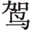鹅曰④：“生不能事，死又离之，以自旌也⑤？纵子忍之，后必或耻之⑥。”乃止。季孙问于荣鹅曰：“吾欲为君谥⑦，使子孙知之。”对曰：“生弗能事，死又恶之，以自信也⑧？将焉用之？”乃止。

***【注释】***

①公即位：鲁定公即位。

②阚（kàn）公氏：鲁国群公墓地名。

③将沟焉：季氏恨昭公，准备在墓地挖一条沟，把昭公的墓与祖墓分开，以示昭公不得进祖墓。

④荣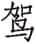鹅：鲁国大夫荣成伯。

⑤自旌：自己彰明其恶。

⑥纵子忍之，后必或耻之：即使现在忍心为之，日后也必为此羞耻。

⑦欲为君谥：想加昭公一个恶谥。

⑧自信：自己表白自己厌恨昭公。信，同“伸”。

***【译文】***

六月二十一日，昭公的灵柩从乾侯运回。二十六日，定公即位。季孙派劳役到阚公氏那儿，打算挖条沟。荣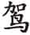鹅说：“国君在世时不能奉事，死后又将他隔离，莫非是要宣扬自己的过错吗？即便您忍心这样做，后世必定为人所耻。”于是不挖沟。季孙向荣鹅询问说：“我打算为国君制定谥号，让子孙后代都知道。”荣鹅回答说：“生时不能奉事，死后又赠予恶谥，难道是要自我表白对他的厌恶吗？为什么要这样做？”于是也终止了。

1.4 秋七月癸巳，葬昭公于墓道南①。孔子之为司寇也，沟而合诸墓②。

***【注释】***

①葬昭公于墓道南：诸墓在墓道北，季平子葬昭公于墓道之南，以与祖墓隔离。

②孔子之为司寇也，沟而合诸墓：后来孔子任司寇时，在昭公墓之外挖沟，以扩大祖墓范围，使昭公墓合入祖墓。

***【译文】***

秋七月二十二日，把昭公安葬在墓道的南边。孔子当司寇的时候，在昭公墓外挖沟，使昭公墓与其他国君的墓都连在一起。

1.5 昭公出故，季平子祷于炀公①。九月，立炀宫②。

***【注释】***

①昭公出故，季平子祷于炀公：炀公，伯禽之子，继其兄考公立为君。昭公出奔，季平子祈祷于炀公，希望不要让昭公返回鲁国。一说，季氏亦欲废公衍而立昭公之弟，效炀公嗣位故事，故祷之。

②立炀宫：现在昭公死在外面，季平子认为祈祷有效，因此重建炀公庙。一说，定公已即位，故别新立炀宫，以表示兄终弟及，鲁有先例，非己私意。

***【译文】***

因为昭公出走的缘故，季平子向炀公祈祷。九月，重建炀公庙。

1.6 周巩简公弃其子弟而好用远人①。

***【注释】***

①巩简公：周卿士。远人：异族人。按，此本与下年《传》“二年夏四月辛酉，巩氏之群子弟贼简公”相连，被割裂置此。

***【译文】***

周巩简公疏远自己的子弟而喜欢用异族人。

# 二年

***【经】***

2.1 二年春王正月①。

2.2 夏五月壬辰②，雉门及两观灭③。

2.3 秋，楚人伐吴。

2.4 冬十月，新作雉门及两观。

***【注释】***

①二年：鲁定公二年当周敬王十二年，前508。

②壬辰：二十五日。

③雉门及两观灭：雉门失火，延烧到两观。雉门，鲁公宫的南门。

***【译文】***

鲁定公二年春周历正月。

夏五月二十五日，雉门失火，延烧到两观才熄灭。

秋，楚国进攻吴国。

冬十月，新建雉门和两观。

***【传】***

2.1 二年夏四月辛酉①，巩氏之群子弟贼简公②。

***【注释】***

①辛酉：二十四日。

②巩氏之群子弟贼简公：此句应与上年《传》的末句连读。贼，刺杀。

***【译文】***

鲁定公二年夏四月二十四日，巩氏的子弟们刺杀了简公。

2.2 桐叛楚①。吴子使舒鸠氏诱楚人②，曰：“以师临我，我伐桐，为我使之无忌③。”

***【注释】***

①桐叛楚：桐世代属于楚国，现在背叛。桐，古国名，在今安徽桐城北。

②舒鸠氏：舒鸠于襄公二十四年叛楚，二十五年被楚所灭。其地在今安徽舒城，在桐北。

③以师临我，我伐桐，为我使之无忌：吴王让舒鸠人引诱楚国攻打吴国，吴国为取悦于楚，假装为楚国伐桐，使楚国对吴国没有疑忌。按，此即伍员所谓“多方以误之”。

***【译文】***

桐国背叛楚国。吴王派舒鸠氏诱骗楚国人，说：“让楚国派军队逼近我国，我国去攻打桐国，从而让楚国对我国出兵不产生怀疑。”

秋，楚囊瓦伐吴①，师于豫章。吴人见舟于豫章，而潜师于巢②。冬十月，吴军楚师于豫章，败之③。遂围巢，克之，获楚公子繁④。

***【注释】***

①楚囊瓦伐吴：楚国听从舒鸠人的话，出兵伐吴。

②吴人见舟于豫章，而潜师于巢：吴国假装伐桐，故意让战船出现在豫章，而暗地里出兵巢地。按，吴实际准备袭击楚国。

③吴军楚师于豫章，败之：吴兵乘楚军不备，击败楚军。军，动词，攻击。

④遂围巢，克之，获楚公子繁：公子繁，守巢大夫。按，此役伍员“多方以误之”的策略使楚国不知虚实，防不胜防。

***【译文】***

秋，楚国的囊瓦进攻吴国，军队驻扎在豫章。吴国让战船在豫章出现，却暗地里出兵巢地。冬十月，吴军在豫章攻打楚军，击败了楚军。于是包围巢地，并攻占它，俘虏了楚国的公子繁。

2.3 邾庄公与夷射姑饮酒①，私出②。阍乞肉焉③，夺之杖以敲之④。

***【注释】***

①夷射姑：邾国大夫。

②私：小便。

③阍乞肉焉：守门人向夷射姑讨肉。阍，守门人。《仪礼·燕礼》：“宾醉，北面坐，取其荐脯以降，奏《陔》。宾所执脯以赐钟人于门内霤。”夷射姑为小便而出，守门人以为其为取脯，故向其乞肉。

④夺之杖以敲之：夷射姑夺过守门人手里的棍子打他。夷射姑无脯，且脯以赐钟人，非与阍，故敲之。按，此本与下年《传》“三年春二月辛卯邾子在门台”云云相连，被割裂置此。

***【译文】***

邾庄公与夷射姑一起喝酒，夷射姑出外小便。看门人向他讨肉吃，夷射姑夺过对方的棍子并打他。

# 三年

***【经】***

3.1 三年春王正月①，公如晋，至河，乃复。

3.2 二月辛卯②，邾子穿卒③。

3.3 夏四月。

3.4 秋，葬邾庄公。

3.5 冬，仲孙何忌及邾子盟于拔④。

***【注释】***

①三年：鲁定公三年当周敬王十三年，前507。

②辛卯：二十九日。

③邾子穿卒：邾庄公穿死。

④邾子：邾隐公。拔：古地名。今地不详。《传》文作郯（tán），有人认为在今山东郯城西南。

***【译文】***

鲁定公三年春周历正月，定公去晋国，到黄河边，就返回了。

二月二十九日，邾庄公穿去世。

夏四月。

秋，安葬邾庄公。

冬，仲孙何忌与邾隐公在拔地结盟。

***【传】***

3.1 三年春二月辛卯，邾子在门台，临廷①。阍以瓶水沃廷②。邾子望见之，怒。阍曰：“夷射姑旋焉③。”命执之④，弗得，滋怒，自投于床⑤，废于炉炭⑥，烂，遂卒。先葬以车五乘，殉五人。庄公卞急而好洁，故及是⑦。

***【注释】***

①邾子在门台，临廷：邾庄公站在门楼上，下临庭院。门台，门楼。

②阍以瓶水沃廷：守门人用瓶子装水洒在庭院里。

③夷射姑旋焉：诬告夷射姑在这里小便。旋，小便。

④命执之：邾庄公命令把夷射姑抓起来。

⑤自投于床：邾庄公发怒，从坐具上跳下来。床，坐具。

⑥废于炉炭：跌在炉炭上。废，坠，跌。

⑦庄公卞急而好洁，故及是：邾庄公急躁又有洁癖，自酿其祸而死。卞急，急躁。

***【译文】***

鲁定公三年春二月二十九日，邾庄公在门楼上，下临庭院。看门人用瓶子盛水洒在庭院里。邾庄公望见了，大怒。看门人说：“夷射姑在这里小便了。”邾庄公下令去抓夷射姑，没抓到，更加生气，自己从床上跳下来，跌倒在炉子的炭火上，皮肉溃烂而死。先用五辆车子、五个人殉葬。庄公性急而爱洁净，所以发生了这种事。

3.2 秋九月，鲜虞人败晋师于平中①，获晋观虎，恃其勇也。

***【注释】***

①平中：晋地名。或曰在今河北唐县附近。

***【译文】***

秋九月，鲜虞人在平中打败晋军，抓获晋国的观虎，这是观虎自恃其勇的结果。

3.3 冬，盟于郯，修邾好也①。

***【注释】***

①盟于郯，修邾好也：鲁、邾两国都是新君，因此结盟修好。郯，即《经》文的“拔”。

***【译文】***

冬，在郯地结盟，是要重修与邾国的友好关系。

3.4 蔡昭侯为两佩与两裘以如楚①，献一佩一裘于昭王。昭王服之②，以享蔡侯。蔡侯亦服其一。子常欲之，弗与，三年止之③。唐成公如楚④，有两肃爽马⑤，子常欲之，弗与，亦三年止之。唐人或相与谋，请代先从者⑥，许之。饮先从者酒，醉之，窃马而献之子常。子常归唐侯。自拘于司败⑦，曰：“君以弄马之故，隐君身，弃国家⑧。群臣请相夫人以偿马，必如之⑨。”唐侯曰：“寡人之过也，二三子无辱⑩。”皆赏之。蔡人闻之，固请，而献佩于子常。子常朝，见蔡侯之徒⑪，命有司曰：“蔡君之久也，官不共也⑫。明日礼不毕，将死。”蔡侯归，及汉，执玉而沉，曰：“余所有济汉而南者，有若大川⑬。”蔡侯如晋，以其子元与其大夫之子为质焉，而请伐楚。

***【注释】***

①佩：佩玉。

②服：穿戴。

③三年止之：子常将蔡侯扣留了三年。

④唐：楚附庸小国，昭王时灭之，故国在今湖北随州西北。

⑤肃爽：骏马名。

⑥请代先从者：唐国人向楚国请求，派人代替先前去的随从。

⑦自拘：窃马者自己囚禁自己，以示请罪。司败：唐国司寇。

⑧君以弄马之故，隐君身，弃国家：指唐国国君因马而被拘禁。弄，玩。马为供人玩弄之物，所以称为弄马。隐，被拘的委婉说法。

⑨群臣请相夫人以偿马，必如之：有如像肃爽那样的好马，一定让养马人送来偿还唐侯。相，帮助。夫人，指养马者。

⑩寡人之过也，二三子无辱：唐国国君自责。辱，指自拘。

⑪蔡侯之徒：蔡昭侯的随从。

⑫蔡君之久也，官不共也：子常委过于有司，意思是蔡昭侯长留楚国，是有司饯别礼物没准备好。共，通“供”。

⑬余所有济汉而南者，有若大川：蔡昭侯因佩玉而受辱，因此沉玉发誓与楚国绝交。汉，汉水。济汉而南，指朝楚。

***【译文】***

蔡昭侯准备了两件玉佩和两件裘衣前往楚国，把一件玉佩、一件裘衣献给楚昭王。昭王穿上裘衣戴上玉佩，设享礼招待蔡昭侯。蔡昭侯也穿戴了另外的一件裘衣和玉佩。子常想要玉佩、裘衣，蔡昭侯不给，被扣留在楚国三年。唐成公到楚国去，有两匹肃爽马，子常想得到，唐成公也不给，同样被扣留在楚国三年。唐国人商议，请求代替原先跟从唐成公的人，楚人允许了。他们让先去的人喝酒，把他们灌醉，盗取肃爽马献给子常。子常便遣返唐成公。盗马人自行捆绑了到唐国司寇那里，说：“国君因为玩马的缘故，自身失去自由，抛弃了国家。群臣们请求帮助养马人来赔马，而且一定跟那两匹肃爽马一样。”唐成公说：“这是寡人的过错，群臣们不要自我羞辱。”对他们全都给予赏赐。蔡国人听说了，也向蔡昭侯提出坚决的请求，把玉佩献给了子常。子常上朝，见到蔡昭侯的手下，命令有关官员道：“蔡国国君所以滞留这么久，是由于你们这些人没有备齐送行的礼品。到明天礼物还备不齐，就要处死你们。”蔡昭侯返国，途经汉水，拿起玉沉到水中，说：“我要是再渡过汉水往南去，有这大江作证。”蔡昭侯前往晋国，以他的儿子元与大夫的儿子作人质，请求晋国出兵攻打楚国。

# 四年

***【经】***

4.1 四年春王二月癸巳①，陈侯吴卒②。

4.2 三月，公会刘子、晋侯、宋公、蔡侯、卫侯、陈子、郑伯、许男、曹伯、莒子、邾子、顿子、胡子、滕子、薛伯、杞伯、小邾子、齐国夏于召陵③，侵楚。

4.3 夏四月庚辰④，蔡公孙姓帅师灭沈，以沈子嘉归，杀之。

4.4 五月，公及诸侯盟于皋鼬⑤。

4.5 杞伯成卒于会⑥。

4.6 六月，葬陈惠公。

4.7 许迁于容城⑦。

4.8 秋七月，公至自会。

4.9 刘卷卒⑧。

4.10 葬杞悼公。

4.11 楚人围蔡。

4.12 晋士鞅、卫孔圉帅师伐鲜虞。

4.13 葬刘文公。

4.14 冬十有一月庚午⑨，蔡侯以吴子及楚人战于柏举⑩，楚师败绩。楚囊瓦出奔郑。庚辰⑪，吴入郢。

***【注释】***

①四年：鲁定公四年当周敬王十四年，前506。癸巳：初六。

②陈侯吴卒：陈惠公死。陈惠公，前533年即位，在位二十八年。

③召陵：古地名。在今河南郾城东。

④庚辰：二十四日。

⑤皋鼬（yòu）：古地名，在今河南临颍南。

⑥杞伯成卒于会：杞悼公死于召陵之会。

⑦容城：古地名，在今河南鲁山南。

⑧刘卷：即刘蚠、刘文公，周大夫。

⑨庚午：十八日。

⑩柏举：古地名。在今湖北麻城东北。

⑪庚辰：二十八日。

***【译文】***

鲁定公四年春周历二月初六，陈惠公吴死。

三月，鲁定公与刘文公、晋定公、宋景公、蔡昭侯、卫灵公、陈怀公、郑献公、许男、曹隐公、莒郊公、邾隐公、顿子、胡子、滕顷公、薛襄公、杞悼公、小邾穆公、齐国夏在召陵相会，侵袭楚国。

夏四月二十四日，蔡国公孙姓带兵灭了沈国，把沈子嘉押回国，杀了。

五月，鲁定公和诸侯在皋鼬结盟。

杞悼公成在盟会时去世。

六月，安葬陈惠公。

许国迁移到容城。

秋七月，鲁定公从盟会回国。

刘文公卷去世。

安葬杞悼公。

楚国包围蔡国。

晋国士鞅、卫国孔圉领兵讨伐鲜虞。

安葬刘文公。

冬十一月十八日，蔡昭侯与吴王阖庐与楚国人在柏举交战，楚军失败。楚国囊瓦出逃郑国。二十八日，吴军攻入郢都。

***【传】***

4.1 四年春三月，刘文公合诸侯于召陵，谋伐楚也。晋荀寅求货于蔡侯，弗得。言于范献子曰：“国家方危，诸侯方贰，将以袭敌，不亦难乎！水潦方降①，疾疟方起，中山不服②，弃盟取怨，无损于楚③，而失中山，不如辞蔡侯。吾自方城以来，楚未可以得志，只取勤焉④。”乃辞蔡侯。

***【注释】***

①水潦（lào）：雨水成灾。

②中山：即鲜虞。

③弃盟取怨，无损于楚：晋、楚两国已结盟，伐楚只会使晋国弃盟取怨。

④吾自方城以来，楚未可以得志，只取勤焉：襄公十六年，晋国打败楚国，侵方城，自此以后，晋对楚用兵，都徒劳无功。勤，劳。按，去年，蔡昭侯用自己及大夫的儿子为质于晋国，坚请伐楚，荀寅因索求贿赂不得，劝范献子拒绝出兵。

***【译文】***

鲁定公四年春三月，刘文公和诸侯在召陵会合，商议攻打楚国。晋国荀寅向蔡昭公索要财物，没得到。他对范献子说：“国家正处在危急中，诸侯正离心离德，想去袭击敌人，不是很难吗！大雨正下个不停，疟疾流行，中山国不肯臣服，如果背弃盟约而招致怨恨，对楚国没有损害，却会失去中山，不如拒绝蔡昭公。我国自从方城战役以来，都没能在对楚国的战事中获胜，只不过白忙乎一场。”于是拒绝了蔡昭公。

晋人假羽旄于郑①，郑人与之。明日，或旆以会②。晋于是乎失诸侯③。

***【注释】***

①假：借。羽旄：羽毛，可作旗杆或仪仗的装饰。

②或旆以会：让下级人员将羽毛装饰在旗尾去参会。

③晋于是乎失诸侯：晋国“或旆以会”是轻视和侮辱郑国，诸侯见晋国如此，都怨恨晋国。

***【译文】***

晋国向郑国借用羽旄，郑国借给了他们。第二天，晋国用羽旄装饰旌旗参会。晋国由此而失去诸侯的拥护。

将会，卫子行敬子言于灵公曰①：“会同难②，啧有烦言③，莫之治也。其使祝佗从④！”公曰：“善。”乃使子鱼。子鱼辞，曰：“臣展四体⑤，以率旧职⑥，犹惧不给而烦刑书⑦，若又共二⑧，徼大罪也⑨。且夫祝，社稷之常隶也⑩。社稷不动，祝不出竟⑪，官之制也。君以军行，祓社衅鼓，祝奉以从，于是乎出竟⑫。若嘉好之事⑬，君行师从⑭，卿行旅从⑮，臣无事焉。”公曰：“行也。”

***【注释】***

①子行敬子：卫国大夫。

②会同难：朝会难于恰如其分，让各方满意。

③啧（zé）有烦言：议论纷纷，抱怨责备。啧，大声纷争的样子。烦言，气愤或不满的话。

④其使祝佗从：子鱼口才好，因此子行敬子建议让子鱼随行。祝佗，子鱼。

⑤展四体：手脚并用。四体，四肢。

⑥率旧职：继承先人的职位。

⑦烦刑书：指获罪。

⑧共二：从事第二种职务。

⑨徼：求取。

⑩且夫祝，社稷之常隶也：太祝掌祭祀宗庙之鬼神，所以自称为社稷神的小臣。隶，贱臣。

⑪社稷不动，祝不出竟：社稷不动，祝不出国境。社稷动即国家迁移。竟，通“境”。

⑫“君以军行”四句：国君率军出行，要祭社杀牲衅鼓，太祝才跟随出境。祓（fú）社，祭祀社神。

⑬嘉好之事：指朝会。

⑭师：二千五百人为师。

⑮旅：五百人为旅。

***【译文】***

将要举行盟会，卫国子行敬子对灵公说：“朝会很难有意见一致的，要是议论纷纷，就不好办了。希望让祝佗跟随！”灵公说：“好的。”于是让子鱼跟随。子鱼推辞，说：“臣勤劳忙碌，以承继先人的职务，还担心完不成任务而被处罚，如果又兼任第二种职务，就要获大罪了。况且太祝是为社稷神而设立的贱职，社稷不动，太祝就不出国境，这是官制所规定的。国君率军出征，祭祀社神，用牺牲的血衅鼓，太祝奉社主跟从，这才走出国境。至于朝会之类的事，国君出行自有一师人马随从，卿出行有一旅人马随从，下臣没有什么事可做。”灵公说：“还是去吧。”

及皋鼬，将长蔡于卫①。卫侯使祝佗私于苌弘曰：“闻诸道路，不知信否。若闻蔡将先卫，信乎？”苌弘曰：“信。蔡叔，康叔之兄也，先卫，不亦可乎②？”子鱼曰：“以先王观之，则尚德也③。昔武王克商，成王定之，选建明德④，以藩屏周。故周公相王室，以尹天下⑤，于周为睦⑥。分鲁公以大路、大旂⑦，夏后氏之璜⑧，封父之繁弱⑨，殷民六族，条氏、徐氏、萧氏、索氏、长勺氏、尾勺氏，使帅其宗氏⑩，辑其分族⑪，将其类丑，以法则周公⑫，用即命于周⑬。是使之职事于鲁⑭，以昭周公之明德。分之土田陪敦、祝、宗、卜、史⑮，备物、典策⑯，官司、彝器⑰；因商奄之民，命以《伯禽》而封于少皞之虚⑱。分康叔以大路、少帛、茷、旃旌、大吕⑲，殷民七族：陶氏、施氏、繁氏、锜氏、樊氏、饥氏、终葵氏，封畛土略⑳，自武父以南及圃田之北竟(21)，取于有阎之土以共王职，取于相土之东都以会王之东蒐(22)。聃季授土(23)，陶叔授民(24)，命以《康诰》而封于殷虚(25)。皆启以商政，疆以周索(26)。分唐叔以大路、密须之鼓、阙巩、沽洗(27)，怀姓九宗(28)，职官五正(29)。命以《唐诰》而封于夏虚(30)，启以夏政，疆以戎索(31)。三者皆叔也(32)，而有令德，故昭之以分物(33)。不然，文、武、成、康之伯犹多，而不获是分也，唯不尚年也(34)。管、蔡启商，惎间王室(35)。王于是乎杀管叔而蔡蔡叔(36)，以车七乘、徒七十人(37)。其子蔡仲改行帅德，周公举之，以为己卿士，见诸王而命之以蔡(38)。其命书云：‘王曰：“胡(39)！无若尔考之违王命也(40)。”’若之何其使蔡先卫也(41)？武王之母弟八人，周公为大宰，康叔为司寇，聃季为司空，五叔无官(42)，岂尚年哉？曹，文之昭也(43)；晋，武之穆也(44)。曹为伯甸，非尚年也(45)。今将尚之，是反先王也(46)。晋文公为践土之盟，卫成公不在，夷叔，其母弟也，犹先蔡(47)。其载书云：‘王若曰，晋重、鲁申、卫武、蔡甲午、郑捷、齐潘、宋王臣、莒期(48)。’藏在周府，可覆视也(49)。吾子欲复文、武之略，而不正其德，将如之何(50)？”苌弘说，告刘子，与范献子谋之，乃长卫侯于盟(51)。

***【注释】***

①将长蔡于卫：晋国打算盟会时让蔡国在卫国之前歃盟。

②“蔡叔”四句：苌弘认为，以始祖长幼为次序是合理的。蔡叔，蔡国始封君，周公的哥哥。康叔，卫国始封君，周公的弟弟。

③尚德：贵德而不贵长幼。

④选建明德：选择明德的人而分封建国。

⑤尹天下：治理天下。尹，治理。

⑥于周为睦：诸侯与周室和睦相处。

⑦鲁公：伯禽。大路：即金路，装有铜饰的车，王子母弟出封国以赐之。大旂（qí）：画有交龙之旗，建于金路。

⑧璜：玉器。

⑨封父：古诸侯国。在今河南封丘。繁弱：良弓名。

⑩宗氏：指大宗。

⑪辑：集合。分族：指小宗。

⑫将其类丑，以法则周公：让六族依附周室，服从周公法令。类丑，指附属六族的奴隶。丑，众。

⑬用：因此。即命于周：归附周王朝，听取命令。

⑭使之职事于鲁：让他们在鲁国供职。

⑮之：指鲁国。陪敦：附庸、附属小国。祝：太祝。宗：宗人。卜：太卜，为卜筮之长。史：太史，记史事及掌典籍、星历。

⑯备物：服物，指衣服、织品及器物。典策：周朝的典籍简册。按，所以说周礼尽在鲁国。

⑰官司：卿大夫百官，这里指赐给鲁国应该有的若干卿、大夫、士。彝器：常用器具。

⑱因商奄之民，命以《伯禽》而封于少皞之虚：用《伯禽》来训诫伯禽并封在少皞故城，安抚商奄的百姓。商奄，古国名，在今山东曲阜。《伯禽》，即《伯禽之命》，《周书》中的一篇，已佚。

⑲少帛：即小白，旗名。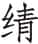茷（qiàn pèi）：即旆，深赤色的旗子。旃（zhān）旌：旗帜。用帛制而无装饰者为旃，用析羽为饰者为旌。大吕：钟名。

⑳封畛（zhěn）：封疆界。土略：也指疆界。

(21)武父、圃田：都是地名。

(22)取于有阎之土以共王职，取于相土之东都以会王之东蒐：取有阎作为卫国国君朝周王的宿邑，取相土之东都作为天子东巡的休息之地。有阎，古地名。在今河南洛阳附近。相土之东都，古地名。在今河南商丘，一说在今河南濮阳。相土，殷商之祖。

(23)聃（dān）季：周公之弟，周王司空。

(24)陶叔：司徒。杨伯峻曰：“陶叔疑即曹叔振铎，雷学淇《竹书纪年义证》‘曹伯夷薨’下云‘叔之封近定陶，故《左传》又谓之陶叔’。”

(25)命以《康诰》：作《康诰》以告诫康叔。《康诰》，也是《周书》中的一篇。诰，训诫之辞。殷虚：即朝歌，古地名。在今河南淇县。

(26)皆启以商政，疆以周索：鲁、卫二国都沿用殷商政事，用周朝制度区划土地。皆，指鲁公、康叔二人。启，沿用。疆，作动词，划分疆界。索，法度。

(27)密须：国名，在今甘肃灵台西。阙巩：铠甲名。沽洗：钟名。

(28)怀姓九宗：晋西北怀姓狄人。

(29)职官五正：五官之长。

(30)《唐诰》：诰命篇名，告诫唐叔之辞。夏虚：夏朝故城，在今山西太原，太原西南晋祠即祭祀唐叔的地方。

(31)启以夏政，疆以戎索：晋国周围都是戎狄，因此晋国用夏朝政事，而按戎人制度区划土地。

(32)三者皆叔也：周公、康叔是武王的弟弟，唐叔是成王的弟弟。三者，鲁公、康叔、唐叔。

(33)而有令德，故昭之以分物：以分赐东西来宣扬三人的美德。分物，即上文分之以某物。

(34)文、武、成、康之伯犹多，而不获是分也，唯不尚年也：文、武、成、康四王的儿子中年长者很多，却不得分赐，就因为是崇尚德行而不崇尚年龄。伯，指兄长。叔，指弟弟。

(35)管、蔡启商，惎（jì）间王室：成王年幼，周公旦摄政，管叔、蔡叔引诱商纣儿子武庚叛乱。惎间，毒害，叛乱。

(36)蔡蔡叔：流放蔡叔。

(37)以车七乘、徒七十人：给车七辆、奴隶七十人。

(38)“其子蔡仲改行帅德”四句：蔡仲改恶从善，周公举而用之，被命为蔡侯。帅，同“率”，循。

(39)胡：蔡仲名。

(40)尔考：你的父亲，指蔡叔。

(41)若之何其使蔡先卫也：子鱼认为，以德而论，蔡国不应该先于卫国。

(42)五叔无官：管叔鲜、蔡叔度、成叔武、霍叔处、毛叔聃五人都没有官职。

(43)曹，文之昭也：曹国始封君叔振铎是文王之子、武王的弟弟。

(44)晋，武之穆也：晋国始封君唐叔虞是武王之子、成王的弟弟。

(45)曹为伯甸，非尚年也：这里以曹、晋相比，曹叔年长于唐叔，而封地更远，说明不以年龄为次序。伯甸，以伯爵居甸服。晋为侯服。《周礼·大行人》：“邦畿千里。其外方五百里谓之侯服，又其外方五百里谓之甸服。”

(46)今将尚之，是反先王也：现在如果崇尚年龄，是违反先王之制。

(47)“晋文公为践土之盟”五句：践土之盟时，卫成公逃亡在外，由夷叔参加会盟，歃盟时卫国先于蔡国。夷叔，叔武，卫成公同母弟。

(48)其载书云：“王若曰，晋重、鲁申、卫武、蔡甲午、郑捷、齐潘、宋王臣、莒期”：盟书上记载所说歃血之人的次序是：晋文公、鲁僖公、卫叔武、蔡庄侯、郑文公、齐昭公、宋成公、莒兹丕公。则卫在蔡前。

(49)藏在周府，可覆视也：盟书记载明确，有案可查。

(50)吾子欲复文、武之略，而不正其德，将如之何：意思是苌弘既有意恢复文王、武王的法度，就应按文、武旧制办事，尚德不尚年。略，道。

(51)乃长卫侯于盟：按，经子鱼力争，晋国终于让卫国先于蔡国。

***【译文】***

到达皋鼬，主持者准备把蔡国位置排在卫国之前。卫灵公派祝佗私下对苌弘说：“道路传言不知是否确实，听说要把蔡国排在卫国的前面，是真的吗？”苌弘说：“是真的。蔡叔是康叔的哥哥，排在卫国前面，不也是可以的吗？”子鱼说：“用先王的标准来看，崇尚的是德行。昔日武王打败商朝，成王平定天下，选择德行修明的人分封，作为周朝的藩篱以捍卫周室。所以周公辅佐王室，以治理天下，诸侯与周朝和睦相处。赐给鲁以大路、大旂，还有夏后氏的璜玉、封父的繁弱名弓，并给予殷朝的六个宗族：条氏、徐氏、萧氏、索氏、长勺氏、尾勺氏，让他们率领其大宗，集合其小宗，统领其奴隶，来服从周公的法令，由此而听从周朝的命令。这是让他们在鲁国供职，以宣扬周公美好的德行。赐给鲁国田地附庸小国、太祝、宗人、太卜、太史，还有服用器物、典籍简册，以及百官、彝器；安抚商奄百姓，用《伯禽》来训诫，并封在少皞的故城。赐给康叔大路、少帛旗、茷、旃旌、大吕钟，还有殷朝的七个家族：陶氏、施氏、繁氏、锜氏、樊氏、饥氏、终葵氏，封疆定界，从武父以南到达圃田北境，从有阎氏那里得到土地以执行王室任命的职务；取得相土的东都以协助周王在东边的巡视。授予聃季土地，授予陶叔人民，用《康诰》来训诫，而封在殷朝的故城。鲁公和康叔都沿用商朝的政策，而按周朝的制度来区划土地。赐给唐叔大路、密须之鼓、阙巩之甲、沽洗之钟，还有怀姓的九个宗族、五正的职官。用《唐诰》来训诫，而封在夏朝的故城，沿用夏朝的政策，按戎人的制度来区划土地。三个人都是天子的弟弟，都有美好的德行，所以用分赐宝物来彰显他们的德行。不然的话，文王、武王、成王、康王的哥哥还有很多，却没有得到这些赐予，就因为不是崇尚年龄的缘故。管叔、蔡叔引诱商人，企图危害周王室。周王因此杀了管叔而流放蔡叔，给蔡叔七辆车子、七十名奴隶。蔡叔儿子蔡仲改恶从善，周公举荐了他，让他任自己的卿士，并拜见周王而封为蔡侯。任命书上说：‘天子说：“胡！你不要像你父亲那样违背天子的命令。”’凭什么让蔡国排在卫国的前面呢？武王同母弟八个，周公为太宰，康叔任司寇，聃季任司空，其余五人没有官职，哪里是崇尚年龄呢！曹国是文王的后代，晋国是武王的后代。曹国以伯爵做甸服的诸侯，不是崇尚年龄。现在要崇尚年龄，这是违背先王意思的。晋文公召集践土盟会，卫成公不在场，夷叔是他的同母弟，名位依然排在蔡国的前面。盟书说：‘天子说，晋国的重、鲁国的申、卫国的武、蔡国的甲午、郑国的捷、齐国的潘、宋国的王臣、莒国的期。’盟书藏在周朝的府库中，可以查对的。您要想恢复文王、武王的制度，却不崇尚德行，打算怎么办？”苌弘认为他说得对，告诉了刘文公，与范献子商量，结盟时便把卫国排在蔡国前面。

4.2 反自召陵，郑子大叔未至而卒①。晋赵简子为之临②，甚哀，曰：“黄父之会③，夫子语我九言，曰：‘无始乱④，无怙富⑤，无恃宠，无违同⑥，无敖礼⑦，无骄能⑧，无复怒⑨，无谋非德⑩，无犯非义⑪。’”

***【注释】***

①郑子大叔未至而卒：郑国大夫游吉没回到郑国，就死于途中。

②临（lìn）：哭吊死者。

③黄父之会：在昭公二十五年。

④始乱：发动祸乱。

⑤怙富：凭恃富有。

⑥违同：违背共同的意愿。

⑦敖礼：傲视有礼的人。敖，同“傲”。

⑧骄能：恃才骄傲。

⑨复怒：为一事而再次发怒。

⑩无谋非德：不合道德的事不干。

⑪无犯非义：不触犯不义之事。

***【译文】***

郑国子太叔从召陵返回，还没到达国内就去世了。晋国赵简子为他吊丧号哭，很悲伤，说：“黄父之会上，您对我说了九句话，说：‘不要发动祸乱，不要倚仗富有，不要凭仗受宠，不要违背共同的意愿，不要傲视有礼的人，不要仗着有才干而骄傲，不要为同一件事重复发怒，不要谋划不合道德的事，不要触犯不合道义的事。’”

4.3 沈人不会于召陵①，晋人使蔡伐之。夏，蔡灭沈。秋，楚为沈故，围蔡。伍员为吴行人以谋楚。

***【注释】***

①沈：楚国盟国，在今安徽阜阳。

***【译文】***

沈国不肯参加召陵盟会，晋国派蔡国讨伐它。夏，蔡国灭亡沈国。秋，楚国因为沈国的缘故，包围蔡国。伍员任吴国行人谋划进攻楚国。

楚之杀郤宛也，伯氏之族出①。伯州犁之孙嚭为吴大宰以谋楚②。楚自昭王即位，无岁不有吴师③。蔡侯因之，以其子乾与其大夫之子为质于吴④。

***【注释】***

①楚之杀郤宛也，伯氏之族出：昭公二十七年，由于费无极的陷害，郤宛被杀，伯氏为郤宛同党，因此逃离楚国。

②伯州犁之孙嚭（pǐ）为吴大宰以谋楚：按，伍员、伯嚭都为吴国策划对付楚国。

③楚自昭王即位，无岁不有吴师：昭王即位至今十年，年年有吴军骚扰。

④蔡侯因之，以其子乾与其大夫之子为质于吴：晋国虽然合诸侯于召陵，却不讨伐楚国，蔡国于是求助于吴国。因之，依附吴国。

***【译文】***

楚国杀死郤宛时，伯氏的族人出逃国外。伯州犁的孙子伯嚭任吴国太宰，谋划攻打楚国。楚国自从昭王即位以来，没有一年不受到吴军骚扰。蔡昭侯依附吴国，把儿子乾和大夫的儿子送到吴国当人质。

冬，蔡侯、吴子、唐侯伐楚。舍舟于淮汭①，自豫章与楚夹汉②。左司马戌谓子常曰③：“子沿汉而与之上下④，我悉方城外以毁其舟，还塞大隧、直辕、冥厄⑤。子济汉而伐之，我自后击之，必大败之。” 既谋而行。武城黑谓子常曰⑥：“吴用木也，我用革也，不可久也⑦，不如速战。”史皇谓子常⑧：“楚人恶子而好司马⑨。若司马毁吴舟于淮，塞城口而入⑩，是独克吴也。子必速战！不然，不免⑪。”乃济汉而陈，自小别至于大别⑫。三战，子常知不可，欲奔⑬。史皇曰：“安求其事，难而逃之⑭，将何所入？子必死之，初罪必尽说⑮。”

***【注释】***

①舍舟于淮汭：吴军到达淮汭，弃船登陆攻击楚国。淮，淮水。汭，河岸凹曲处。

②自豫章与楚夹汉：吴军从豫章进发，与楚军夹汉水对峙。

③左司马戌：沈尹戌。

④沿汉而与之上下：紧守汉水沿岸，上下堵截，不让吴军渡水。

⑤我悉方城外以毁其舟，还塞大隧、直辕、冥厄：沈尹戌将以方城外全部楚军抄袭吴军背后，毁坏吴军船只而断其退路。大隧、直辕、冥厄，在今河南、湖北交界的三个关隘。大隧在东，今名九里关；中为直辕，今名武胜关；冥厄亦曰黾塞，在西，今名平靖关。冥厄有大小石门，凿山通道，极为险隘。

⑥武城黑：楚国武城大夫，名黑。

⑦吴用木也，我用革也，不可久也：革车是用胶把皮革粘饰在车表面，不耐雨湿，不可久战。用木、用革，都指兵车。

⑧史皇：楚国大夫。

⑨司马：即沈尹戌。

⑩城口：指大隧等三关。

⑪子必速战！不然，不免：史皇怕沈尹戌独占其功，唆使子常不用沈尹戌的战略。不免，不免于罪。

⑫乃济汉而陈，自小别至于大别：没等沈尹戌做好准备，子常先出击。小别，小别山，在今湖北汉川，汉水以北。大别，大别山，在今湖北汉阳东北。

⑬子常知不可，欲奔：子常知道不能战胜吴军，准备撤军逃走。

⑭安求其事，难而逃之：国安之时就想执掌政事，有危难时就想逃跑。

⑮子必死之，初罪必尽说：只有拼死一战，才可解脱前罪。说，通“脱”。

***【译文】***

冬，蔡昭侯、吴王阖庐、唐成公进攻楚国。他们在淮河边弃舟登岸，从豫章进发，与楚军隔汉水对峙。左司马沈尹戌对子常说：“您沿着汉水与他们上下周旋，我带领方城外的所有人马去毁掉吴军的战船，再回头堵塞大隧、直辕、冥厄。您渡过汉水进击他们，我从后面进攻，必然把他们打得大败。”商量好就出发了。武城黑对子常说：“吴国战车用的是木头，我们的战车蒙着皮革，遇雨不能持久，不如速战。”史皇对子常说：“楚国人讨厌您而喜欢司马。要是司马在淮水毁掉吴国战船，堵塞城口而回兵，那可就是他单独战胜吴国了。您一定要速战，不然将不免于罪责。”子常便渡过汉水摆开阵势，从小别山直到大别山。打了三仗，子常发现不能获胜，想逃走。史皇说：“平安无事时您争要权力，有急难就逃走，您想逃到哪里去？您一定要拼死作战，以前的罪责才能全部免除。”

十一月庚午，二师陈于柏举①。阖庐之弟夫概王晨请于阖庐曰：“楚瓦不仁②，其臣莫有死志③，先伐之，其卒必奔；而后大师继之，必克。”弗许④。夫概王曰：“所谓‘臣义而行，不待命’者⑤，其此之谓也。今日我死，楚可入也⑥。”以其属五千先击子常之卒。子常之卒奔，楚师乱，吴师大败之⑦。子常奔郑⑧。史皇以其乘广死⑨。

***【注释】***

①二师：吴、楚两国的军队。

②瓦：子常的名。

③死志：死战的决心。

④弗许：阖庐不同意夫概王的请求。

⑤臣义而行，不待命：为人臣之道，合于义就做，不必等待命令。

⑥今日我死，楚可入也：按，夫概王准备拼死作战，以便吴军攻入郢都。

⑦子常之卒奔，楚师乱，吴师大败之：子常军队本无斗志，一战即溃。

⑧子常奔郑：按，楚国对战败之将处罚甚重，如城濮之战子玉自尽，鄢陵之战子反自杀，所以子常不敢回郢都。

⑨史皇以其乘广死：史皇乘子常之车战死。乘广，楚王或楚国主帅所乘坐的兵车。

***【译文】***

十一月十八日，两军在柏举对阵。阖庐的弟弟夫概王早晨向阖庐请示说：“楚国囊瓦不仁，他的手下没有拼死作战的决心，我们抢先进攻，他们的士兵必定奔逃；然后大部队跟进，一定能战胜。”吴王不同意。夫概王说：“所谓‘臣下看到合道义的就去做，不必等待命令’，说的就是这情形。今天我拼死一战，楚国就能攻入郢都。”便带着下属五千人率先攻击子常的人马。子常的士兵溃逃，楚军大乱，吴军大败楚军。子常逃往郑国。史皇在子常车上战死。

吴从楚师，及清发①，将击之。夫概王曰：“困兽犹斗，况人乎？若知不免而致死，必败我②。若使先济者知免，后者慕之，蔑有斗心矣③。半济而后可击也。”从之，又败之。楚人为食，吴人及之，奔。食而从之，败诸雍澨④。五战，及郢。

***【注释】***

①清发：水名，涢水支流，在今湖北安陆。

②若知不免而致死，必败我：要是发现免不了一死而拼死战斗，可能反败为胜。

③若使先济者知免，后者慕之，蔑有斗心矣：夫概王之意为网开一面，楚兵争相逃命，便会丧失斗志。蔑，同“无”。

④“楚人为食”五句：楚军做好饭未及吃，吴国追兵到，楚人赶紧逃跑。吴兵吃了楚军的饭，继续追赶。为食，做饭吃。雍澨，水名，今湖北京山西南有三澨水，此为其中之一。

***【译文】***

吴军追赶楚军直到清发，准备发起进攻。夫概王说：“困兽犹斗，何况人呢？如果知道免不了一死而拼命，必定会打败我们。要是让先渡过河的楚军以为能逃脱，后面的人就会羡慕他们，这样就没有斗志了。等他们一半过河以后就可以攻击了。”吴王同意了，又打败楚军。楚国人正做饭，吴军赶到，楚军跑了。吴军吃了这些饭食又去追赶，在雍澨又打败楚军。连打五仗，抵达郢都。

己卯①，楚子取其妹季芈畀我以出②，涉雎③。尹固与王同舟④，王使执燧象以奔吴师⑤。

***【注释】***

①己卯：十一月二十七日。

②季芈（mǐ）畀（bì）我：楚昭王妹妹。季为排行。芈，姓。畀我，名。

③涉雎：雎，水名，一名沮水，自今湖北江陵入长江。按，杨伯峻认为楚昭王自纪南城西逃，渡沮水，当在今湖北枝江东北。

④尹固：楚国大夫。

⑤执燧象以奔吴师：把火炬系在象尾上，让象冲入敌阵，以抵御吴军。

***【译文】***

十一月二十七日，楚昭王带着妹妹季芈畀我逃出郢都，渡过雎水。尹固与昭王同船，昭王命他在大象尾巴点火冲向吴军。

庚辰①，吴入郢，以班处宫②。子山处令尹之宫③，夫概王欲攻之，惧而去之，夫概王入之④。

***【注释】***

①庚辰：二十八日。

②以班处宫：按爵位等级占有楚人宫室。

③子山：阖庐之子。

④夫概王入之：按，《左传》记吴入郢不及伍员，而《淮南子》、《吴越春秋》、《史记》等书皆记伍员亦与此战，《史记·伍子胥列传》更言伍员掘平王之墓而鞭其尸。

***【译文】***

二十八日，吴军进入郢都，按照官爵尊卑入住宫室。子山住在令尹的宫里，夫概王要攻击他，子山害怕而搬走，夫概王就住了进去。

左司马戌及息而还①，败吴师于雍澨，伤。初，司马臣阖庐，故耻为禽焉②。谓其臣曰：“谁能免吾首③？”吴句卑曰④：“臣贱，可乎？”司马曰：“我实失子⑤，可哉！”三战皆伤，曰：“吾不可用也已⑥。”句卑布裳，刭而裹之，藏其身而以其首免⑦。

***【注释】***

①左司马戌及息而还：沈尹戌得知楚军已败，中途折回来。息，古地名。在今河南息县西南。

②初，司马臣阖庐，故耻为禽焉：沈尹戌曾在吴国为阖庐之臣，所以耻为吴国擒获。

③免吾首：不使吴国得到我的尸首。

④吴句卑：沈尹戌部下小臣。

⑤实失子：以前疏忽，不知道你贤能而重用你。

⑥不可用：不中用，将死。

⑦句卑布裳，刭而裹之，藏其身而以其首免：沈尹戌死后，吴句卑把他的尸身藏好，带上他的头逃走。布，铺开。

***【译文】***

左司马沈尹戌到达息地就退兵，在雍澨打败吴军，自己也负了伤。起初，司马做过阖庐的臣下，所以耻于被吴军擒获。对他部下说：“谁能让吴军得不到我的尸首？”吴句卑说：“下臣地位低贱，不知可以吗？”司马说：“我过去竟然没有重用你，可以的！”又与吴军交战，沈尹戌三次都负伤，说：“我已经不行了。”他死后，吴句卑铺开衣服，割下沈尹戌的头包裹好，藏好他的尸身，然后带着头逃走了。

楚子涉雎，济江，入于云中①。王寝，盗攻之，以戈击王。王孙由于以背受之②，中肩。王奔郧③，钟建负季芈以从④，由于徐苏而从⑤。郧公辛之弟怀将弑王⑥，曰：“平王杀吾父，我杀其子，不亦可乎？”辛曰：“君讨臣，谁敢仇之⑦？君命，天也。若死天命，将谁仇？《诗》曰：‘柔亦不茹，刚亦不吐。不侮矜寡，不畏强御⑧。’唯仁者能之。违强陵弱，非勇也⑨；乘人之约⑩，非仁也；灭宗废祀⑪，非孝也；动无令名⑫，非知也。必犯是，余将杀女。”斗辛与其弟巢以王奔随⑬。吴人从之，谓随人曰：“周之子孙在汉川者，楚实尽之⑭。天诱其衷，致罚于楚⑮，而君又窜之，周室何罪⑯？君若顾报周室，施及寡人，以奖天衷⑰，君之惠也。汉阳之田，君实有之⑱。”楚子在公宫之北⑲，吴人在其南。子期似王，逃王，而己为王⑳，曰：“以我与之，王必免。”随人卜与之，不吉，乃辞吴曰：“以随之辟小而密迩于楚，楚实存之(21)。世有盟誓，至于今未改。若难而弃之，何以事君(22)？执事之患不唯一人，若鸠楚竟，敢不听命(23)？”吴人乃退。金初宦于子期氏(24)，实与随人要言(25)。王使见(26)，辞曰：“不敢以约为利(27)。”王割子期之心以与随人盟(28)。

***【注释】***

①云中：即云梦泽，在今湖北安陆。

②王孙由于以背受之：王孙由于以背代昭王受戈击。王孙由于，又称吴由于，楚国公族。

③郧：古地名。在今湖北京山、安陆一带。

④钟建：楚国大夫。

⑤徐苏：因被戈击伤，一时昏迷，后来慢慢苏醒。

⑥郧公辛：斗辛，蔓成然之子。昭公十四年楚平王杀蔓成然。

⑦君讨臣，谁敢仇之：国君诛讨其臣，谁敢记仇怀恨？

⑧柔亦不茹，刚亦不吐。不侮矜寡，不畏强御：引《诗》见《诗经·大雅·烝民》，意思是遇到软的不吞下去，遇到硬的不吐出来。不侮辱鳏寡的人，也不畏惧强暴的人。“柔亦不茹，刚亦不吐”二句是比喻。茹，食，吞，与“吐”对文。矜寡，鳏寡。

⑨违强陵弱，非勇也：楚平王杀其父时，王是强者，所以其父不违君命而受之。如今楚昭王逃亡在外，是弱者，要是加以凌辱，不是勇者。

⑩约：穷，指昭王正处于困境。

⑪灭宗废祀：弑君之罪，将遭灭族之祸而使宗祀废绝。

⑫动无令名：弑君的行动无美名。动，行动。

⑬斗辛与其弟巢以王奔随：斗辛阻止其弟杀昭王，并保护昭王逃往随国。

⑭周之子孙在汉川者，楚实尽之：僖公二十八年《传》说：“汉阳诸姬，楚实尽之。”吴、随等都是姬姓，所以吴国以此诱使随人反楚。

⑮天诱其衷，致罚于楚：天意要降罚于楚国。

⑯而君又窜之，周室何罪：吴国以随同为周之子孙，责备随国不应藏匿共同的仇人。窜，藏匿。

⑰奖：助成。

⑱汉阳之田，君实有之：吴人意谓将汉阳田地全部给随国。

⑲公宫：随君之宫。

⑳子期似王，逃王，而己为王：公子结长相似昭王，自荐假扮昭王以应付吴国，让昭王逃走。子期，昭王兄公子结。

(21)以随之辟小而密迩于楚，楚实存之：以随国之僻小而得保存，是因有楚国的保护。

(22)若难而弃之，何以事君：楚国有难时则背弃盟约，如此不守信义，又何以事吴国？

(23)执事之患不唯一人，若鸠楚竟，敢不听命：吴国之患，并不在昭王一人未擒，如能安定楚国民心，随国岂敢不从命？一人，指昭王。鸠，安定。

(24)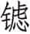（lǜ）金：人名，曾是子期家臣。

(25)要言：口头约定，指商定藏匿昭王以及子期代王之事。要，约。

(26)王使见：想召见金并封为王臣。

(27)不敢以约为利：不敢趁昭王困窘时为自己谋利。

(28)王割子期之心以与随人盟：割破子期胸部皮肤，取血与随人结盟，不是剖腹取心。子期本要代王赴难，所以取他的血，表示接受其忠诚。

***【译文】***

楚昭王徒步渡过雎水，又渡过长江，进入云中。昭王休息时，盗贼攻击他，用戈打昭王。王孙由于用背挡住戈，击中肩膀。昭王逃到郧地，钟建背着季芈跟从，王孙由于慢慢苏醒后也跟了上来，郧公斗辛的弟弟斗怀要杀死昭王，说：“平王杀了我们的父亲，我杀死他的儿子，不也是可以的吗？”斗辛说：“君王诛讨臣子，谁敢仇恨他？君王的命令是上天的意志。如果死于天命，你要仇恨谁？《诗》说：‘不吞吃柔软的，不吐出坚硬的。不欺侮鳏寡，不畏惧强暴。’这只有仁爱者才能做到。躲避强者欺凌弱者，不是勇；乘人之危，不是仁；灭亡宗族，废弃祭祀，不是孝；行动得不到好名声，不是智。你一定要这样做，我将杀了你。”斗辛和弟弟巢陪着昭王逃到随国。吴国人也追到这里，对随国人说：“周在汉川的子孙，都被楚国消灭净尽。上天垂示意愿，降罚于楚国，您却藏匿楚王，请问周室有什么罪？您要是能顾念并报答周室，恩惠延及寡人，以完成上天的心愿，这是您的恩惠。汉水北边的田地，都归您所有。”楚昭王在随国公宫的北面，吴军在公宫南面。子期长相像昭王，就让昭王逃走，自己装扮成昭王，说：“把我交给吴人，君王一定可免于难。”随国人为交出子期而占卜，不吉利，就拒绝吴国说：“随国偏僻弱小，又紧邻楚国，是楚国保存了我们。两国世代有盟誓，直到现在也没改变。如果楚国有危难而抛弃它，又凭什么事奉君王？你们的问题不只是昭王一人，要是能安定楚国，我国岂敢不听从命令？”吴军于是退兵。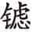金起初在子期氏那里当家臣，曾与随国人约定不交出楚王。昭王让他进见，他推辞说：“不敢因为君王处在困境而谋取私利。”昭王割破子期的胸口取血与随国人结盟。

初，伍员与申包胥友。其亡也，谓申包胥曰：“我必复楚国①。”申包胥曰：“勉之！子能复之，我必能兴之。”及昭王在随，申包胥如秦乞师，曰：“吴为封豕、长蛇②，以荐食上国③，虐始于楚④。寡君失守社稷，越在草莽⑤，使下臣告急，曰：‘夷德无厌，若邻于君，疆埸之患也⑥。逮吴之未定⑦，君其取分焉⑧。若楚之遂亡，君之土也。若以君灵抚之，世以事君⑨。’” 秦伯使辞焉，曰：“寡人闻命矣。子姑就馆，将图而告⑩。”对曰：“寡君越在草莽，未获所伏⑪，下臣何敢即安？”立，依于庭墙而哭，日夜不绝声，勺饮不入口七日。秦哀公为之赋《无衣》⑫。九顿首而坐⑬。秦师乃出。

***【注释】***

①复：颠覆。

②吴为封豕、长蛇：比喻吴国的贪暴。封，大。

③荐食上国：吴国屡次侵害中原诸侯。荐，屡次。上国，指中原地区的诸侯国。

④虐始于楚：首先侵害到楚国。

⑤越：流亡。草莽：草野之间。

⑥夷德无厌，若邻于君，疆埸之患也：楚国西界与秦国相接，现在吴国既占有楚国，则成为秦的邻国，这样一来秦国的边境也将不免于祸患。夷，指吴国。

⑦逮：及，乘。

⑧取分：与吴国共分楚国。

⑨“若楚之遂亡”四句：楚国如果被灭亡，将成为秦国之地；如不亡，楚国将世世代代事奉秦国。灵，威灵。抚，存恤。

⑩子姑就馆，将图而告：请申包胥暂且住进客馆，待考虑好后再作答复。

⑪未获所伏：未得安宁居处。

⑫《无衣》：《诗经·国风·秦风》中的一篇，其中有“王于兴师，修我戈矛，与子同仇”及“修我甲兵，与子偕行”的诗句。秦哀公赋此诗，是表示将出兵救楚国。

⑬九顿首而坐：申包胥行大礼拜谢。古无九顿首之礼，申包胥求救心切，秦肯出师，故特别感谢以至九顿首。顿首，叩头。坐，跪坐。

***【译文】***

起先，伍员与申包胥是好朋友。当伍员逃亡的时候，对申包胥说：“我一定要灭亡楚国。”申包胥说：“努力吧！你能灭亡它，我一定能复兴它。”到了昭王逃亡随国，申包胥到秦国请求出兵，说：“吴国如同大猪、长蛇，一再吞食上国，为害从楚国开始。我们国君失守国家，流亡荒野，派下臣来告急，说：‘夷人的本性就是贪得无厌，如果成为国君的邻国，就将是秦国边境的祸患。趁吴国现在还没平定楚国，国君可以前来分割。要是楚国就此灭亡，这里就是国君的土地了。如果以国君的威灵镇抚楚国，当世世代代奉事国君。’”秦哀公派人致谢，说：“寡人听到命令了。您姑且在馆舍安顿下来，我们商量后告知。”申包胥回答说：“我们国君远避荒野，还没得到安身之处，下臣怎敢到安逸的地方休息？”站在那儿，靠着庭院的墙哭，日夜哭声不断，七天没喝过一勺水。秦哀公为他赋《无衣》。申包胥叩了九次头后才坐下。秦军于是出动。

# 五年

***【经】***

5.1 五年春王三月辛亥朔，日有食之①。

5.2 夏，归粟于蔡②。

5.3 於越入吴③。

5.4 六月丙申④，季孙意如卒⑤。

5.5 秋七月壬子⑥，叔孙不敢卒⑦。

5.6 冬，晋士鞅帅师围鲜虞。

***【注释】***

①五年春王三月辛亥朔，日有食之：此为前505年2月16日之日环食。五年，鲁定公五年当周敬王十五年，前505。

②归粟于蔡：鲁国赠送粮食给蔡国。归，同“馈”，赠送。

③於越入吴：越国进攻吴国。於，发声词。

④丙申：十七日。

⑤季孙意如卒：鲁卿季平子死。

⑥壬子：初四。

⑦叔孙不敢卒：鲁臣叔孙成子死。

***【译文】***

鲁定公五年春周历三月初一，发生日食。

夏，送粮食给蔡国。

越国攻入吴国。

六月十七日，季平子去世。

秋七月初四，叔孙成子去世。

冬，晋国士鞅带兵包围鲜虞。

***【传】***

5.1 五年春，王人杀子朝于楚①。

***【注释】***

①王人杀子朝于楚：昭公二十二年王子朝作乱，失败后逃往楚国。现在周人乘楚国战乱杀死王子朝。王人，成周人。

***【译文】***

鲁定公五年春，成周人在楚国杀死王子朝。

5.2 夏，归粟于蔡，以周亟①，矜无资②。

***【注释】***

①周：周济。亟：同“急”。

②矜无资：蔡国被楚国包围，饥困，所以鲁国送粮食救急。矜，怜悯。资，粮食。

***【译文】***

夏，送粮食给蔡国，用来周济急难，哀怜他们缺粮。

5.3 越入吴，吴在楚也①。

***【注释】***

①越入吴，吴在楚也：越国乘吴军在楚国，后方空虚，攻入吴国。

***【译文】***

越国攻入吴国，这是由于吴军正在楚国。

5.4 六月，季平子行东野①，还，未至，丙申，卒于房②。阳虎将以玙璠敛③，仲梁怀弗与④，曰：“改步改玉⑤。”阳虎欲逐之，告公山不狃⑥。不狃曰：“彼为君也，子何怨焉⑦？”既葬，桓子行东野⑧，及费。子洩为费宰，逆劳于郊⑨，桓子敬之。劳仲梁怀，仲梁怀弗敬。子洩怒，谓阳虎：“子行之乎⑩？”

***【注释】***

①行：巡行视察。东野：季氏封邑。

②房：即防，古地名。在今山东曲阜。

③阳虎：季氏家臣。玙璠：鲁国宝玉名，鲁国国君的佩玉。

④仲梁怀：也是季氏家臣。

⑤改步改玉：古代越是尊贵的人，步行越慢越短。人的职位变了，步履之疾徐长短也应该改变，所佩之玉也要改变。阳虎想用玙璠之玉葬季平子，仲梁怀不同意，认为当初昭公出奔，季平子代行公职，故佩玙璠祭祀，现在定公在位，季平子为臣，不能再佩公玉，而应“改步改玉”。

⑥公山不狃（niǔ）：季氏家臣费宰子洩。

⑦彼为君也，子何怨焉：公山不狃告诉阳虎，仲梁怀是为季平子好，不必因此怨恨他。

⑧桓子：季平子之孙季孙斯。

⑨逆劳于郊：在郊外迎接、慰劳。

⑩子行之乎：仲梁怀随同季孙斯巡行，子洩因仲梁怀对自己不敬，便怂恿阳虎说：你现在可以逐仲梁怀了。行，驱逐。

***【译文】***

六月，季平子巡视东野，回都城，还没到，十七日便在房地去世。阳虎想用玙璠之玉随葬，仲梁怀不给，说：“地位改变了步速佩玉也要跟着改变。”阳虎打算驱逐仲梁怀，告诉了公山不狃。公山不狃说：“他是为着主君，你有什么可怨恨的呢？”安葬季平子后，季桓子巡视东野，到达费地。公山不狃任费宰，到郊外迎接慰劳，季桓子对他很敬重。慰问仲梁怀，仲梁怀却表现出不敬。公山不狃发怒，对阳虎说：“你不是要赶走他吗？”

5.5 申包胥以秦师至，秦子蒲、子虎帅车五百乘以救楚。子蒲曰：“吾未知吴道①。”使楚人先与吴人战，而自稷会之②，大败夫概王于沂③。吴人获薳射于柏举④，其子帅奔徒以从子西⑤，败吴师于军祥⑥。秋七月，子期、子蒲灭唐⑦。

***【注释】***

①吴道：吴国的战术。

②稷：古地名。在今河南桐柏。

③沂：楚国地名，在今河南正阳。

④薳射：楚国大夫。

⑤奔徒：奔跑的散兵。

⑥军祥：古地名。在今湖北随州西南。

⑦子期、子蒲灭唐：唐国跟随吴国伐楚，因此被灭。唐，国名，在今湖北枣阳。

***【译文】***

申包胥带来了秦军，秦国子蒲、子虎率领战车五百辆来救援楚国。子蒲说：“我不了解吴国的战术。”让楚军先和吴军交战，而从稷地领兵接应，在沂地大败夫概王。吴国在柏举俘获薳射，薳射的儿子收拾败兵跟随子西，在军祥打败吴军。秋七月，子期、子蒲灭亡唐国。

九月，夫概王归，自立也①。以与王战而败，奔楚，为堂溪氏②。吴师败楚师于雍澨，秦师又败吴师。吴师居麇③，子期将焚之④，子西曰：“父兄亲暴骨焉，不能收，又焚之，不可。” 子期曰：“国亡矣！死者若有知也，可以歆旧祀，岂惮焚之⑤？”焚之，而又战，吴师败，又战于公婿之溪⑥。吴师大败，吴子乃归。囚舆罢，舆罢请先，遂逃归⑦。叶公诸梁之弟后臧从其母于吴，不待而归⑧。叶公终不正视⑨。

***【注释】***

①夫概王归，自立也：夫概王想自立为吴王。杜预《春秋左传注》：“自立为吴王，称夫概王。”因此前文称之为夫概王。

②以与王战而败，奔楚，为堂溪氏：夫概王被阖庐打败，逃奔楚国，后被封为堂溪氏。堂溪，或作“棠溪”，在今河南遂平西北。

③麇（jūn）：楚国地名，在雍澨附近。

④子期将焚之：焚麇地。一说所焚乃楚师阵亡将士的尸骨。按，去年吴与楚军主力及沈尹戌所率偏师均在雍澨发生战斗，今年又战于此，麇在雍澨附近，故多楚军尸骨。

⑤“国亡矣”四句：焚邑是为了战胜敌人。楚国不亡，那时可按旧规矩来祭祀。父兄死而有知，一定不会反对焚邑。歆，享。旧祀，往日的祭祀。

⑥公婿之溪：即《战国策·楚策一》中所说的浊水，在今湖北襄樊东。

⑦囚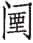舆罢，舆罢请先，遂逃归：囚禁舆罢，因为他请求先走，乘机逃回楚国。舆罢，楚国大夫。

⑧叶公诸梁之弟后臧从其母于吴，不待而归：吴军入楚后，后臧母亲被俘虏入吴，后臧跟随入吴。战后后臧丢弃母亲只身逃回楚国。诸梁，叶公子高，沈尹戌儿子。

⑨叶公终不正视：叶公嫌后臧弃母不义，终生不正眼看他。

***【译文】***

九月，夫概王回国，自立为吴王。领兵和吴王阖庐交战被打败，出逃楚国，后来封为堂溪氏。吴军在雍澨打败楚军，秦军又打败吴军。吴军驻扎在麇地，子期打算放火烧麇地，子西说：“父兄亲人的骸骨暴露在野，不能收敛，又要焚烧掉，这不行。” 子期说：“国家要灭亡了！死者如果有灵，以后还可以按旧规矩享受祭祀，哪里会怕焚烧？”最终放火焚烧，又交战，吴军被打败，又在公婿之溪交战。吴军大败，吴王便撤兵回国。囚禁了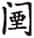舆罢，舆罢请求让自己先走，乘机逃回楚国。叶公诸梁的弟弟后臧跟随母亲到吴国，后来丢弃母亲自己逃回楚国。叶公始终不拿正眼看他。

5.6 乙亥①，阳虎囚季桓子及公父文伯②，而逐仲梁怀。冬十月丁亥③，杀公何藐④。己丑⑤，盟桓子于稷门之内⑥。庚寅⑦，大诅⑧。逐公父歜及秦遄，皆奔齐⑨。

***【注释】***

①乙亥：二十八日。

②阳虎囚季桓子及公父文伯：公父文伯，季桓子堂兄弟。按，阳虎准备作乱，怕二人不从，所以先囚禁二人。

③丁亥：初十。

④公何藐：季氏族人。

⑤己丑：十二日。

⑥盟桓子于稷门之内：阳虎强迫季桓子与自己在稷门盟誓。稷门，鲁国南城门。

⑦庚寅：十三日。

⑧大诅：举行大诅仪式，祭神以加祸于反对阳虎的人。大诅谓参与诅的人很多。

⑨逐公父歜及秦遄，皆奔齐：阳虎作乱。公父歜，公父文伯。秦遄，季平子姑婿。

***【译文】***

二十八日，阳虎囚禁季桓子和公父文伯，驱逐了仲梁怀。冬十月初十，杀了公何藐。十二日，与季桓子在稷门里边结盟。十三日，举行大诅咒。驱逐公父歜和秦遄，二人都逃往齐国。

5.7 楚子入于郢。初，斗辛闻吴人之争宫也①，曰：“吾闻之：‘不让，则不和；不和，不可以远征。’吴争于楚，必有乱；有乱，则必归，焉能定楚②？”

***【注释】***

①争宫：指夫概王与子山争处令尹之宫事。

②“吴争于楚”五句：吴国人内争，必生内乱，自然撤兵，吴国的失败势在必然。按，这是补叙斗辛的预言。

***【译文】***

楚昭王进入郢都。起初，斗辛听到吴国人争宫之事，说：“我听说：‘不谦让，就不和睦；不和睦，就不能远征。’吴国人在楚国相争，必定发生动乱；有动乱就必然要撤回，哪里能平定楚国？”

王之奔随也，将涉于成臼①。蓝尹亹涉其帑②，不与王舟。及宁③，王欲杀之。子西曰：“子常唯思旧怨以败，君何效焉④？”王曰：“善。使复其所，吾以志前恶⑤。”王赏斗辛、王孙由于、王孙圉、钟建、斗巢、申包胥、王孙贾、宋木、斗怀⑥。子西曰：“请舍怀也⑦。” 王曰：“大德灭小怨⑧，道也。”申包胥曰：“吾为君也，非为身也。君既定矣，又何求？且吾尤子旗，其又为诸⑨？”遂逃赏⑩。王将嫁季芈，季芈辞曰：“所以为女子，远丈夫也。钟建负我矣⑪。”以妻钟建，以为乐尹⑫。

***【注释】***

①成臼：水名，大约在今湖北天门。

②蓝尹亹（wěi）：楚国大夫。帑：同“孥”，妻子。

③宁：安定。

④子常唯思旧怨以败，君何效焉：当初令尹子常就是因为不弃旧怨才遭到失败，君王不可蹈子常覆辙。

⑤使复其所，吾以志前恶：不杀蓝尹亹，并且官复原职，以记住先前的教训。

⑥王赏斗辛、王孙由于、王孙圉、钟建、斗巢、申包胥、王孙贾、宋木、斗怀：九人都随从楚昭王逃难，有功，因此受赏。

⑦请舍怀也：斗怀曾想杀楚昭王，所以子西请求免赏斗怀。

⑧大德灭小怨：斗怀最终听从其兄劝告，使楚昭王免于难，是大德。

⑨且吾尤子旗，其又为诸：昭公十四年，子旗因拥立楚平王，自以为有大功，贪得无厌，终为平王所杀。所以申包胥不满意子旗，并说难道我又要做子旗吗？尤，怨恨。子旗，蔓成然。

⑩遂逃赏：申包胥不受赏。

⑪所以为女子，远丈夫也。钟建负我矣：作为女子，本应远离男子。钟建已背过我，所以非嫁他不可。丈夫，指男子。

⑫乐尹：掌管音乐的大夫。

***【译文】***

楚昭王逃往随国的时候，准备渡过成臼河。蓝尹亹让自己的妻子儿女渡河，而不把船给昭王。等到战事平定以后，昭王想杀蓝尹亹。子西说：“子常就因为老记着过去的仇怨而失败，君王为什么要学他呢？”昭王说：“你说得对。让蓝尹亹官复原职吧，我用这个来记住以往的过错。”昭王赏赐斗辛、王孙由于、王孙圉、钟建、斗巢、申包胥、王孙贾、宋木和斗怀。子西说：“请不要赏斗怀。” 昭王说：“大德可以盖过小怨，这是合于道义的。”申包胥说：“我是为了国君，不是为了自身。现在国君已经安定了，我又有什么追求呢？况且我认为子旗做法不对，难道又要学他吗？”便躲开不接受赏赐。昭王打算嫁季芈，季芈告诉说：“作为女人，就是要远离男子。钟建背过我了。”便把季芈嫁给钟建，并让钟建担任乐尹。

王之在随也，子西为王舆服以保路，国于脾洩①。闻王所在，而后从王。王使由于城麇②。复命。子西问高厚焉，弗知③。子西曰：“不能，如辞④。城不知高厚，小大何知？”对曰：“固辞不能，子使余也⑤。人各有能有不能。王遇盗于云中，余受其戈，其所犹在⑥。”袒而视之背，曰：“此余所能也。脾洩之事，余亦弗能也⑦。”

***【注释】***

①王之在随也，子西为王舆服以保路，国于脾洩：楚昭王在随的时候，子西陈设了楚王的车马衣饰，并在脾洩建立了国都，以安定、保护各路军民。脾洩，楚国地名，在今湖北江陵附近，离当时的郢都当不太远。

②王使由于城麇：派王孙由于修麇城。

③子西问高厚焉，弗知：子西问城墙的高厚，王孙由于不知道。

④不能，如辞：不能胜任，就应辞掉这差事。

⑤子使余：是你一定要我去的。

⑥所：处所，这里指伤痕。

⑦脾洩之事，余亦弗能也：王孙由于意为以背受戈，使王脱险，是我所能；而在脾洩建立国都之事，则非我所能了。言外之意是表白自己忠心无二。

***【译文】***

昭王在随国的时候，子西制作了楚王的车子、服饰，以安定、保护各路军民，把脾洩作为国都。后来得知昭王所在，就去随从昭王。昭王让由于修筑麇城，然后回来复命。子西问起城墙的高度和厚度，由于不知道。子西说：“你不能胜任，就应该辞掉。筑城却不知道它的高度、厚度，又怎能知道工程的范围大小？”由于答复说：“我坚决推辞干不了，是您要我去的。本来每人各有干得了、干不了的事。昭王在云中遇到盗贼时，是我用身子挡住了戈，伤疤现在还在。”便脱下衣服露出背让子西看，说：“这是我所能办到的。至于您在脾洩所做的事，我也不能做到。”

5.8 晋士鞅围鲜虞，报观虎之役也①。

***【注释】***

①观虎之役：定公三年，鲜虞击败晋军，擒获晋国大夫观虎。

***【译文】***

晋国士鞅包围鲜虞，是报复那次观虎的失败。

# 六年

***【经】***

6.1 六年春王正月癸亥①，郑游速帅师灭许②，以许男斯归③。

6.2 二月，公侵郑。

6.3 公至自侵郑。

6.4 夏，季孙斯、仲孙何忌如晋④。

6.5 秋，晋人执宋行人乐祁犁。

6.6 冬，城中城⑤。

6.7 季孙斯、仲孙忌帅师围郓⑥。

***【注释】***

①六年：鲁定公六年当周敬王十六年，前504。癸亥：十八日。

②游速：郑国大夫。

③许男斯：许国国君，男爵，名斯。

④季孙斯、仲孙何忌如晋：鲁国派二人到晋国聘问。杨伯峻曰：“鲁卿聘晋，始见于僖三十年之公子遂，终于此，共二十四次。此后无闻。”

⑤城中城：鲁国侵郑，怕郑国报复，于是修筑内城。中城，内城。

⑥季孙斯、仲孙忌帅师围郓：郓地靠近齐国，昭公逃亡后，齐取郓以居昭公，所以派二人围攻郓地。仲孙忌，即上文之仲孙何忌。郓，鲁国城邑。

***【译文】***

鲁定公六年春周历正月十八日，郑国游速带兵灭了许国，抓住许国国君斯回国。

二月，鲁定公进攻郑国。

定公从攻郑前线回来。

夏，季孙斯、仲孙何忌去晋国。

秋，晋国逮捕宋国行人乐祁犁。

冬，筑内城城墙。

季孙斯、仲孙何忌领兵包围郓邑。

***【传】***

6.1 六年春，郑灭许，因楚败也①。

***【注释】***

①郑灭许，因楚败也：许国处于楚、郑之间，服属于楚国，楚国被吴国打败，许国失去保护，因此郑国灭亡许国。定公四年，许迁于容城，在河南鲁山东南，距许昌不足四百里，故郑能灭之。

***【译文】***

鲁定公六年春，郑国灭亡许国，是乘楚国失败的机会。

6.2 二月，公侵郑，取匡①，为晋讨郑之伐胥靡也②。往不假道于卫③；及还，阳虎使季、孟自南门入，出自东门，舍于豚泽④。卫侯怒，使弥子瑕追之⑤。公叔文子老矣⑥，辇而如公⑦，曰：“尤人而效之，非礼也⑧。昭公之难⑨，君将以文之舒鼎，成之昭兆，定之鞶鉴，苟可以纳之，择用一焉⑩。公子与二三臣之子，诸侯苟忧之，将以为之质⑪。此群臣之所闻也。今将以小忿蒙旧德⑫，无乃不可乎？大姒之子⑬，唯周公、康叔为相睦也⑭，而效小人以弃之，不亦诬乎⑮？天将多阳虎之罪以毙之，君姑待之，若何⑯？”乃止。

***【注释】***

①匡：郑地名，即今河南长垣之匡城。

②郑之伐胥靡：即下文“周儋翩率王子朝之徒因郑人将以作乱于周，郑于是乎伐冯、滑、胥靡、负黍、狐人、阙外”。胥靡，周地名，在今河南偃师东。

③往：前去伐郑的时候。

④阳虎使季、孟自南门入，出自东门，舍于豚泽：此时阳虎控制了鲁国大权，有意不向卫国借道，并强迫季、孟二人从卫国都城南门进，东门出，以触怒卫国，使之与三桓结仇。季，季桓子。孟，孟献子。豚泽，卫国东门外小地名。

⑤弥子瑕：卫灵公宠臣。

⑥公叔文子：卫国大夫公叔发。

⑦辇：人拉的车，这里用作动词，乘车。

⑧尤人而效之，非礼也：责备他人的过错，又去效法他，这是不合乎礼法的。

⑨昭公之难：指鲁昭公为季氏所逐，流亡在外。

⑩“君将以文之舒鼎”五句：鲁昭公流亡时，您曾拿出三件宝物作为礼物，只要哪位诸侯能护送鲁昭公回国，就可以任选其中一种。文，卫文公。成，卫成公。定，卫定公。舒鼎，宝鼎名。昭兆，宝龟名。鞶鉴，镶有镜子的束衣大带。

⑪公子与二三臣之子，诸侯苟忧之，将以为之质：诸侯如果还不放心，可以将公子和大臣之子作为人质送往该诸侯国。

⑫小忿：小小的怨恨，指鲁人入南门，出东门。蒙旧德：掩盖了过去的恩德。指卫公为纳鲁昭公做的努力。蒙，掩盖。

⑬大姒：太妃，文王妃子。

⑭周公、康叔：鲁、卫两国的始祖。

⑮而效小人以弃之，不亦诬乎：如果学那些小人之行，背弃两国间的传统友谊，实在是大错特错了。小人，暗指阳虎。

⑯天将多阳虎之罪以毙之，君姑待之，若何：老天有意增加阳虎的罪恶，并将严惩他，贤君姑且忍耐一下。

***【译文】***

二月，鲁定公进攻郑国，占领匡地，是替晋国讨伐郑国进攻胥靡。去时不向卫国借道；到回师时，阳虎让季桓子、孟懿子从卫都城南门进，东门出，住在豚泽。卫灵公发怒，派弥子瑕追击鲁军。公叔文子已告老退休，坐辇车去见卫灵公，说：“怨恨别人却效仿他，不合于礼。鲁昭公有危难的时候，国君打算拿文公的舒鼎、成公的宝龟、定公的鞶鉴作为礼物，如果有谁能送昭公回国，随便他挑走其中的一件。便是国君的公子和几位重臣的儿子，诸侯要是还不放心，也愿意将他们作为人质。这是群臣都听到的。现在却因为小愤怒而掩盖过去的恩德，不也是不应该的吗？太姒的儿子，只有周公、康叔关系和睦，却学小人而丢弃良好关系，不也是上当受骗了吗？上天将增添阳虎的罪责而使他灭亡，国君姑且等等，怎么样？”卫灵公便停止追击。

6.3 夏，季桓子如晋，献郑俘也①。阳虎强使孟懿子往报夫人之币②。晋人兼享之③。孟孙立于房外，谓范献子曰：“阳虎若不能居鲁④，而息肩于晋，所不以为中军司马者，有如先君⑤！”献子曰：“寡君有官，将使其人，鞅何知焉⑥？”献子谓简子曰⑦：“鲁人患阳虎矣⑧，孟孙知其衅，以为必适晋，故强为之请，以取入焉⑨。”

***【注释】***

①季桓子如晋，献郑俘也：向晋国献上二月取匡时的俘虏。

②阳虎强使孟懿子往报夫人之币：季桓子去晋国献俘，兼有聘问晋君与送晋君及夫人财礼之职，鲁国本不必再派人专报夫人之币，阳虎强迫孟懿子作为正卿单独去报晋君夫人之币。孟懿子，仲孙何忌。往报夫人之币，向晋君夫人回送礼物。

③晋人兼享之：晋国设享宴同时招待季、孟二人，而没有分别宴请，是对鲁国二卿的轻视。

④不能居鲁：不能在鲁国立足。

⑤而息肩于晋，所不以为中军司马者，有如先君：孟懿子向晋国暗示，阳虎将在鲁国作乱，不容于鲁，逃到晋国，晋可利用他。

⑥寡君有官，将使其人，鞅何知焉：晋君任用官吏，择才而使，我怎么知道将用谁？鞅，士鞅，范献子。

⑦简子：赵鞅。

⑧鲁人患阳虎矣：阳虎必将作乱，鲁国人以之为祸害了。

⑨“孟孙知其衅”四句：孟懿子预知阳虎将为乱，并且认为他必然逃往晋国，所以极力向晋国请求，以驱使阳虎逃往晋国。

***【译文】***

夏，季桓子去晋国，是去奉献郑国的俘虏。阳虎硬要派孟懿子前去向晋国国君夫人奉献礼物。晋国设享宴一起招待他们二人。孟懿子站在房外，对范献子说：“阳虎如果无法在鲁国站住脚，而到晋国来歇歇脚，晋国若不让他任中军司马的话，有先君作证！”范献子说：“我们国君设立官职，要选择合适者担任，我怎么能做主？”范献子对赵简子说：“鲁国人厌恶阳虎了，孟懿子看出了预兆，认为阳虎必定来晋国，所以强行为他请求禄位，以便他能到晋国来。”

6.4 四月己丑①，吴大子终累败楚舟师②，获潘子臣、小惟子及大夫七人③。楚国大惕，惧亡④。子期又以陵师败于繁扬⑤。令尹子西喜曰：“乃今可为矣⑥。”于是乎迁郢于鄀⑦，而改纪其政，以定楚国⑧。

***【注释】***

①己丑：十五日。

②终累：阖庐之子，夫差之兄。舟师：水军。

③潘子臣、小惟子：楚国舟师之帅。

④楚国大惕，惧亡：朝野惊心，担心再遭亡国之祸。

⑤子期又以陵师败于繁扬：子期所率陆军为吴军所败。陵师，陆军。繁扬，古地名。在今河南新蔡北。

⑥乃今可为矣：连遭两次大败，国人警惧，楚国便能治好了。

⑦于是乎迁郢于鄀：楚国从郢迁都鄀。鄀，古地名。在今湖北宜城东南，又名北郢。

⑧而改纪其政，以定楚国：改革政治，因而楚国得以安定。纪，治理。

***【译文】***

四月十五日，吴国太子终累打败楚国水军，俘获潘子臣、小惟子和大夫七名。楚国大为震惊，担心灭亡。子期率领的陆军在繁扬又打了败仗。令尹子西高兴地说：“现在可以做些事了。”于是把国都由郢迁到鄀，改革政事，以安定楚国。

6.5 周儋翩率王子朝之徒因郑人将以作乱于周①，郑于是乎伐冯、滑、胥靡、负黍、狐人、阙外②。六月，晋阎没戍周，且城胥靡③。

***【注释】***

①儋翩：王子朝余党。

②郑于是乎伐冯、滑、胥靡、负黍、狐人、阙外：儋翩要利用郑国在周境内发动叛乱，郑国于是攻打周室冯、滑六邑，鲁国奉霸主之命，伐郑取匡。

③晋阎没戍周，且城胥靡：为保卫周王室，修筑胥靡城。阎没，晋国大夫。

***【译文】***

成周儋翩率领王子朝旧部，利用郑国人在成周作乱，郑国这时便攻打冯、滑、胥靡、负黍、狐人与阙外。六月，晋国阎没戍守成周，并且筑胥靡城。

6.6 秋八月，宋乐祁言于景公曰①：“诸侯唯我事晋，今使不往，晋其憾矣②。”乐祁告其宰陈寅③。陈寅曰：“必使子往④。”他日，公谓乐祁曰：“唯寡人说子之言⑤，子必往。”陈寅曰：“子立后而行，吾室亦不亡⑥。唯君亦以我为知难而行也⑦。”见溷而行⑧。赵简子逆，而饮之酒于绵上⑨，献杨楯六十于简子⑩。陈寅曰：“昔吾主范氏，今子主赵氏，又有纳焉，以杨楯贾祸，弗可为也已⑪。然子死晋国，子孙必得志于宋⑫。”范献子言于晋侯曰：“以君命越疆而使⑬，未致使而私饮酒⑭，不敬二君⑮，不可不讨也。”乃执乐祁⑯。

***【注释】***

①乐祁：即《经》文中的乐祁犁。

②憾：怨恨。

③乐祁告其宰陈寅：乐祁把上面的话告诉了陈寅。陈寅，乐祁家宰。

④必使子往：陈寅预料，必派乐祁出使晋国。

⑤说：同“悦”。

⑥子立后而行，吾室亦不亡：陈寅知道晋国政出多门，乐祁到晋国，恐怕有难，先立后，以免家族灭亡。立后，立继承人。

⑦知难而行：冒险赴命。

⑧见溷而行：乐祁让乐溷晋见宋景公，立为后，然后出发。溷，乐祁之子。

⑨绵上：古地名。即今山西翼城西之小绵山。

⑩杨楯：黄杨木做的盾，质地坚硬致密。

⑪“昔吾主范氏”五句：晋国此时大夫专权，“政在家门”， 乐祁过去事奉范氏，现在却事奉赵氏，并献杨盾，必定惹祸。贾祸，惹祸。

⑫得志于宋：乐祁如果死于晋国，是为国而死，子孙必能在宋国得志。

⑬越疆：越过疆界。

⑭未致使：未完成使命。

⑮二君：晋、宋两国国君。

⑯乃执乐祁：按，范献子嫉恨乐祁事奉赵氏，便以乐祁失节，不敬二君为由，逮捕乐祁。

***【译文】***

秋八月，宋国乐祁对景公说：“诸侯中只有我国奉事晋国，现在要是不派使节前去，晋国将会怨恨我国。”乐祁告知家宰陈寅。陈寅说：“肯定会让您前往。”过些日子，景公对乐祁说：“寡人愿意听你的话，你一定要前往晋国。”陈寅说：“您立下继承人再去，我们的宗室才不会消亡。就是国君也明白我们是知难而行。”乐祁把儿子乐溷引见给景公以后就出使了。赵简子迎接他，在绵上请他喝酒，乐祁献给赵简子六十面杨木盾牌。陈寅说：“往日我们事奉范氏，现在您事奉赵氏，又送给礼物，将因杨盾而招致祸患，没法挽回了。不过您死在晋国，子孙一定会在宋国发达。”范献子对晋定公说：“接受国君的命令出使，没有完成使命却私下喝酒，对两国的国君不尊敬，不能不声讨。”于是逮捕了乐祁。

6.7 阳虎又盟公及三桓于周社①，盟国人于亳社②，诅于五父之衢③。

***【注释】***

①三桓：孟孙、季孙、叔孙三家。周社：鲁为周公之后，故周社为鲁国的国社。

②亳社：也是鲁国的国社。鲁因商奄之地，并因其遗民，故立亳社。

③诅于五父之衢：五父之衢，在曲阜东南五里。按，阳虎又强迫定公、三家及国人盟誓，使鲁国君臣上下都服从他，从而进一步控制鲁国政权。

***【译文】***

阳虎又和定公及三桓在周社盟誓，与国人在亳社盟誓，在五父之衢诅咒。

6.8 冬十二月，天王处于姑莸，辟儋翩之乱也。

***【译文】***

冬十二月，周敬王住在姑莸，是逃避儋翩的叛乱。

# 七年

***【经】***

7.1 七年春王正月①。

7.2 夏四月。

7.3 秋，齐侯、郑伯盟于咸②。

7.4 齐人执卫行人北宫结以侵卫。

7.5 齐侯、卫侯盟于沙③。

7.6 大雩。

7.7 齐国夏帅师伐我西鄙④。

7.8 九月，大雩。

7.9 冬十月。

***【注释】***

①七年：鲁定公七年当周敬王十七年，前503。

②咸：卫地名，在今河南濮阳东南。

③沙：古地名。在今河北大名东。

④国夏：齐国大夫，国佐之孙。

***【译文】***

鲁定公七年春周历正月。

夏四月。

秋，齐景公、郑献公在咸地结盟。

齐国拘禁卫国行人北宫结并侵袭卫国。

齐景公、卫灵公在沙地结盟。

大规模举行求雨的雩祭。

齐国国夏领兵攻打我国西部边境。

九月，再次举行大规模的雩祭。

冬十月。

***【传】***

7.1 七年春二月，周儋翩入于仪栗以叛①。

***【注释】***

①仪栗：周邑。今地不详。

***【译文】***

鲁定公七年春二月，周儋翩进入仪栗发动叛乱。

7.2 齐人归郓、阳关，阳虎居之以为政①。

***【注释】***

①齐人归郓、阳关，阳虎居之以为政：郓、阳关都是鲁国城邑，曾贰于齐，现在齐归还鲁国，阳虎入居二地并执掌军政大权。

***【译文】***

齐国归还郓、阳关，阳虎居住在那儿执掌国政。

7.3 夏四月，单武公、刘桓公败尹氏于穷谷①。

***【注释】***

①单武公、刘桓公、尹氏：三人都是周王室大夫。尹氏为儋翩同党。穷谷：周地名，在今河南洛阳南。

***【译文】***

夏四月，单武公、刘桓公在穷谷打败尹氏。

7.4 秋，齐侯、郑伯盟于咸，征会于卫①。卫侯欲叛晋，诸大夫不可。使北宫结如齐，而私于齐侯曰：“执结以侵我②。”齐侯从之，乃盟于琐③。

***【注释】***

①征会：召集诸侯会见。

②执结以侵我：卫灵公派北宫结到齐国，暗中请齐景公逮捕北宫结而发兵攻打卫国，可以借此为由与齐结盟。

③乃盟于琐：齐、卫两国结盟。

***【译文】***

秋，齐景公、郑献公在咸地结盟，邀请卫国参会。卫灵公想背叛晋国，大夫们反对。卫灵公派北宫结到齐国，私下派人对齐景公说：“请把北宫结抓起来并侵袭我国。”齐景公听从了，于是在琐地结盟。

7.5 齐国夏伐我。阳虎御季桓子，公敛处父御孟懿子①，将宵军齐师②。齐师闻之，堕，伏而待之③。处父曰：“虎不图祸，而必死④。”苫夷曰⑤：“虎陷二子于难⑥，不待有司⑦，余必杀女。”虎惧，乃还，不败⑧。

***【注释】***

①公敛处父：孟氏家臣。

②宵军齐师：乘夜侵袭齐军。

③齐师闻之，堕，伏而待之：齐军听说鲁军的计划，故意做出松懈、毫无防备的样子，设下埋伏，引诱鲁军。堕，毁坏军容。

④不图祸，而必死：不考虑会引起祸患。而，你，指阳虎。

⑤苫夷：季氏家臣。

⑥二子：指季氏、孟氏。

⑦有司：执法官。

⑧虎惧，乃还，不败：阳虎被公敛处父和苫夷吓住，罢兵回国。

***【译文】***

齐国国夏攻打我国。阳虎为季桓子驾车，公敛处父为孟懿子驾车，准备夜袭齐军。齐军得知后故作松懈，设下埋伏等待。处父说：“阳虎你不考虑这样做的危害，你必死无疑。”苫夷说：“阳虎你把他们二人陷于祸难，不等军法官判决，我就一定杀了你。”阳虎害怕了，便撤兵，鲁军才得以不败。

7.6 冬十一月戊午①，单子、刘子逆王于庆氏②。晋籍秦送王。己巳③，王入于王城，馆于公族党氏④，而后朝于庄宫⑤。

***【注释】***

①戊午：二十三日。

②庆氏：驻守姑莸的大夫。

③己巳：十二月初五。

④党氏：周王室大夫。

⑤而后朝于庄宫：周敬王返回周都。庄宫，周庄王庙。

***【译文】***

冬十一月二十三日，单武公、刘桓公在庆氏那里迎接周敬王。晋国籍秦护送周敬王。十二月初五，周敬王进入王城，住在公族党氏家，然后朝觐庄宫。

# 八年

***【经】***

8.1 八年春王正月①，公侵齐②。

8.2 公至自侵齐。

8.3 二月，公侵齐③。

8.4 三月，公至自侵齐。

8.5 曹伯露卒④。

8.6 夏，齐国夏帅师伐我西鄙⑤。

8.7 公会晋师于瓦⑥。

8.8 公至自瓦。

8.9 秋七月戊辰⑦，陈侯柳卒⑧。

8.10 晋士鞅帅师侵郑，遂侵卫。

8.11 葬曹靖公。

8.12 九月，葬陈怀公。

8.13 季孙斯、仲孙何忌帅师侵卫。

8.14 冬，卫侯、郑伯盟于曲濮⑨。

8.15 从祀先公⑩。

8.16 盗窃宝玉、大弓⑪。

***【注释】***

①八年：鲁定公八年当周敬王十八年，前502。

②公侵齐：鲁国攻打齐国，报复去年齐国侵犯鲁国西境。

③二月，公侵齐：鲁国再次攻打齐国。

④曹伯露卒：曹靖公露死。曹靖公，前505年即位，在位四年。

⑤齐国夏帅师伐我西鄙：齐国由鲁国西境进攻鲁国。

⑥瓦：卫地名，在今河南滑县南。

⑦戊辰：初七。

⑧陈侯柳卒：陈怀公柳死。陈怀公，前505年即位，在位四年。

⑨卫侯、郑伯盟于曲濮：郑、卫两国结盟叛晋。曲濮，卫国地名，约在今河南滑县与延津一带。

⑩从祀：顺祀，按即位先后的次序祭祀。先公：指鲁闵公、鲁僖公。文公二年，鲁把僖公的神主升到闵公之上，现将二公位次摆顺。

⑪盗：指阳虎。宝玉、大弓：都是鲁国国宝。

***【译文】***

鲁定公八年春周历正月，鲁定公进攻齐国。

定公从侵袭齐国前线回国。

二月，定公侵袭齐国。

三月，定公从进攻齐国前线回国。

曹靖公露去世。

夏，齐国国夏带兵攻打我国西部边境。

定公在瓦地与晋军会合。

定公从瓦地回国。

秋七月初七，陈怀公柳去世。

晋国士鞅领兵侵袭郑国，顺便进攻卫国。

安葬曹靖公。

九月，安葬陈怀公。

季孙斯、仲孙何忌带兵攻打卫国。

冬，卫灵公、郑献公在曲濮结盟。

按即位顺序祭祀先公闵公、僖公。

阳虎窃取宝玉、大弓。

***【传】***

8.1 八年春王正月，公侵齐，门于阳州①。士皆坐列，曰：“颜高之弓六钧②。”皆取而传观之③。阳州人出，颜高夺人弱弓④，籍丘子击之⑤，与一人俱毙⑥。偃且射子，中颊，殪⑦。颜息射人中眉⑧，退曰：“我无勇，吾志其目也⑨。”师退，冉猛伪伤足而先⑩。其兄会乃呼曰：“猛也殿⑪！”

***【注释】***

①门：攻打城门。阳州：古地名。在今山东东平。

②颜高：鲁国将领。钧：此指拉力。当时三十斤为一钧，六钧为一百八十斤，合今斤六十斤。

③取而传观之：传看颜高的强弓。

④颜高夺人弱弓：颜高来不及收回自己的强弓，随便夺了把弱弓应战。

⑤籍丘子：齐国将领。

⑥与一人俱毙：颜高和另一人都倒地。毙，倒地。

⑦偃且射子，中颊，殪：颜高虽然倒地，但卧射子，中其脸颊，子毙命。

⑧颜息：鲁国将领。

⑨我无勇，吾志其目也：意在射眼，却射中其眉。无勇，不善射。按，这是他自夸之辞。

⑩冉猛伪伤足而先：冉猛装伤想先撤。冉猛，鲁国将领。

⑪殿：殿后。

***【译文】***

鲁定公八年春周历正月，鲁定公侵袭齐国，攻打阳州城门。军士们排列坐在那儿，说：“颜高的弓有六钧力。”都拿了传看。阳州人出城，颜高夺过别人的弱弓迎战，籍丘子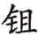击打他，把他和另外一人打倒在地。颜高倒在地上向子射出一箭，射中他的脸颊，籍丘子毙命。颜息射中一个人的眉，退下来说：“我没本事，本来是要射他眼睛的。”军队撤退，冉猛假装伤了脚走在前面。他哥哥冉会便大声喊：“冉猛，到后边断后！”

8.2 二月己丑①，单子伐谷城，刘子伐仪栗②。辛卯③，单子伐简城，刘子伐盂，以定王室④。

***【注释】***

①二月己丑：实为三月二十六日，“二”疑为“三”之误。

②单子伐谷城，刘子伐仪栗：单武公、刘桓公讨伐儋翩余党。谷城，古地名。在今河南洛阳西北。

③辛卯：三月二十八日。

④单子伐简城，刘子伐盂，以定王室：平定周王室之乱。简城、盂，都是周地。盂即邘，在今河南沁阳西北。

***【译文】***

三月二十六日，单武公攻打谷城，刘桓公攻打仪栗。二十八日，单武公进攻简城，刘桓公进攻盂地，以安定王室。

8.3 赵鞅言于晋侯曰：“诸侯唯宋事晋，好逆其使，犹惧不至。今又执之，是绝诸侯也。”将归乐祁，士鞅曰：“三年止之①，无故而归之，宋必叛晋。”献子私谓子梁曰②：“寡君惧不得事宋君，是以止子③。子姑使溷代子④。”子梁以告陈寅。陈寅曰：“宋将叛晋，是弃溷也，不如待之⑤。”乐祁归，卒于大行⑥。士鞅曰：“宋必叛，不如止其尸以求成焉⑦。”乃止诸州⑧。

***【注释】***

①三年止之：定公六年，晋国扣留宋国乐祁，至今三年。

②献子：范士鞅。子梁：乐祁。

③寡君惧不得事宋君，是以止子：晋君怕不能事奉宋君，所以留下了您。

④溷：乐祁儿子。

⑤宋将叛晋，是弃溷也，不如待之：宋国如果背叛晋国，乐溷将不能返国，不如静待时局的转变。

⑥大行：太行山。

⑦宋必叛，不如止其尸以求成焉：扣留乐祁尸体作为谈判条件。

⑧州：古地名。在今河南沁阳东南。

***【译文】***

赵鞅告诉晋定公说：“诸侯中只有宋国奉事晋国，好好地迎接他们的使节，还担心他不来。现在又拘禁使者，这是弃绝诸侯。”打算把乐祁放回去，士鞅说：“扣留了三年，又无故放回去，宋国必定背叛晋国。”士鞅私下对乐祁说：“我们国君是担心不能奉事宋君，所以留下了您。您姑且让乐溷来代替您。”乐祁把这话告诉了陈寅。陈寅说：“宋国将会背叛晋国，这样做是抛弃了乐溷，不如静待时局的转变。”乐祁返回，死于太行山。士鞅说：“宋国一定背叛，不如扣留乐祁的尸体来与宋国讲和。”于是把乐祁尸体扣押在州地。

8.4 公侵齐，攻廪丘之郛①。主人焚冲，或濡马褐以救之，遂毁之②。主人出，师奔③。阳虎伪不见冉猛者，曰：“猛在此，必败。”猛逐之④，顾而无继，伪颠⑤。虎曰：“尽客气也⑥。”

***【注释】***

①廪丘：古地名。在今山东鄄城东北。郛：外城。

②主人焚冲，或濡马褐以救之，遂毁之：廪丘人焚毁攻城车，鲁军以湿麻衣救火，攻破外城。主人，廪丘守将。冲，攻城的战车。濡，沾湿。马褐，麻布短衣。

③主人出，师奔：廪丘人出战，鲁国增援部队奔向前去助战。

④猛逐之：阳州之役，冉猛先退，现在被阳虎一激，奋而追击廪丘人。

⑤顾而无继，伪颠：冉猛看后面没有人跟上来，就假装从车上摔下。

⑥客气：假装勇敢。

***【译文】***

鲁定公侵袭齐国，攻打廪丘的外城。廪丘守军焚毁鲁军的攻城车，有鲁军兵士把麻布短衣弄湿灭火，于是攻破外城。廪丘人出战，鲁国增援部队奔向前去助战。阳虎假装没看见冉猛，说：“如果冉猛在这里，一定能打败他们。”冉猛便去追赶廪丘人，回头发现没人跟上来，装作从车上摔下来。阳虎说：“全是假勇敢。”

8.5 苫越生子①，将待事而名之②。阳州之役获焉，名之曰“阳州” ③。

***【注释】***

①苫越：季氏家臣苫夷。

②待事而名：等有大事时给儿子命名。

③阳州之役获焉，名之曰“阳州”：阳州之役鲁国获胜，所以给儿子取名“阳州”。

***【译文】***

苫越生了个儿子，打算等有了大事以后再取名。阳州战役俘获了敌军，就把儿子取名为“阳州”。

8.6 夏，齐国夏、高张伐我西鄙①。晋士鞅、赵鞅、荀寅救我。公会晋师于瓦②。范献子执羔，赵简子、中行文子皆执雁③。鲁于是始尚羔④。

***【注释】***

①齐国夏、高张伐我西鄙：按，为报复阳州、廪丘两次战役。

②公会晋师于瓦：晋军救鲁，鲁定公为表示感谢，亲自迎至瓦地。

③“范献子执羔”二句：执羔，手提羔羊作为相见礼物。中行文子，荀寅。雁，大雁，也是相见礼物。

④鲁于是始尚羔：范献子是晋国上卿，鲁定公见上卿以执羔为相见之礼，从此鲁国以羔羊为贵，唯上卿执之为相见之礼。

***【译文】***

夏，齐国国夏、高张攻打我国西部边境。晋国士鞅、赵鞅、荀寅救援我国。鲁定公和晋军在瓦地会合。范献子手提羔羊，赵简子、中行文子手持大雁，作为礼物。鲁国从此开始以羔羊为贵。

8.7 晋师将盟卫侯于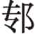泽①。赵简子曰：“群臣谁敢盟卫君者②？”涉佗、成何曰③：“我能盟之。”卫人请执牛耳④。成何曰：“卫，吾温、原也，焉得视诸侯⑤？”将歃，涉佗捘卫侯之手⑥，及捥⑦。卫侯怒，王孙贾趋进⑧，曰：“盟以信礼也⑨，有如卫君，其敢不唯礼是事而受此盟也⑩？”卫侯欲叛晋，而患诸大夫⑪。王孙贾使次于郊⑫。大夫问故，公以晋诟语之⑬，且曰：“寡人辱社稷，其改卜嗣⑭，寡人从焉。”大夫曰：“是卫之祸，岂君之过也⑮？”公曰：“又有患焉，谓寡人‘必以而子与大夫之子为质’⑯。”大夫曰：“苟有益也⑰，公子则往⑱，群臣之子敢不皆负羁绁以从⑲？”将行，王孙贾曰：“苟卫国有难，工商未尝不为患，使皆行而后可⑳。”公以告大夫，乃皆将行之。行有日(21)，公朝国人，使贾问焉，曰：“若卫叛晋，晋五伐我，病何如矣(22)？”皆曰：“五伐我，犹可以能战。”贾曰：“然则如叛之(23)，病而后质焉，何迟之有(24)？”乃叛晋(25)。晋人请改盟，弗许(26)。

***【注释】***

①晋师将盟卫侯于泽：晋军在瓦地与鲁定公相会之后，又与卫国结盟。

②群臣谁敢盟卫君者：去年卫国背叛晋国依附齐国，所以赵简子拟派大夫前往结盟，以羞辱卫国。

③涉佗、成何：晋国大夫。

④执牛耳：诸侯歃血为盟，割牛耳取血，盛牛耳于珠盘，由主盟者持盘，因称主盟者为“执牛耳”。按，会盟之礼，卑者执牛耳，尊者监临，先歃血。晋国虽是大国，但卫灵公是君，涉佗、成何是大夫，所以卫灵公请成何执牛耳。

⑤卫，吾温、原也，焉得视诸侯：卫国不过等于晋国温、原二邑的地位，怎么能跟诸侯相比？

⑥捘（zùn）：推。

⑦及捥（ｗàn）：血淌到手腕上。捥，同“腕”。

⑧王孙贾：卫国大夫。

⑨信礼：伸张礼仪。

⑩有如卫君，其敢不唯礼是事而受此盟也：结盟是为了敦睦邦交，伸张礼仪，卫国国君怎能不依礼而接受此盟？言外之意是晋国如此无礼，卫国将不接受此盟。其，岂能。

⑪卫侯欲叛晋，而患诸大夫：按，卫国诸大夫反对背叛晋国。

⑫王孙贾使次于郊：让卫国国君住在郊外。

⑬晋诟：受晋国侮辱。诟，耻辱。

⑭改卜嗣：占卜改立新君。

⑮是卫之祸，岂君之过也：大夫以为不能委过于卫灵公一人。

⑯必以而子与大夫之子为质：晋国告诉卫灵公，要用其子与大夫之子作人质。而，同“尔”，你。

⑰苟有益：对卫国有利。

⑱则：假如。

⑲负羁绁：背负马笼头、马缰绳。

⑳工商未尝不为患，使皆行而后可：工商匠人也是祸患，应一同前往。

(21)行有日：已定了行期。

(22)病何如：会危险到什么程度。

(23)然则如叛之：应当先叛晋国。如，应当。

(24)病而后质焉，何迟之有：有危险后再送人质不迟。

(25)乃叛晋：王孙贾与卫灵公设计激励众大夫及国人，终于使卫国叛晋。

(26)晋人请改盟，弗许：晋国请求重新结盟，卫国不接受。

***【译文】***

晋军准备与卫灵公在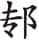泽会盟。赵简子说：“群臣中谁敢去和卫灵公订立盟约？”涉佗、成何说：“我们能够订盟。”卫国人请晋国人执牛耳。成何说：“卫国就如同我国的温邑、原邑，哪能视同诸侯？”将要歃血时，涉佗推了卫灵公的手，血流到手腕上。卫灵公发怒，王孙贾快步上前，说：“结盟是为了伸张礼仪，卫国国君岂能不依礼而接受这盟约？”卫灵公打算背叛晋国，又担心大夫们不同意。王孙贾让卫灵公住在郊外。大夫们询问原因，卫灵公将晋国人侮辱的话告诉大家，并说：“寡人使国家遭受羞辱，不如占卜另外奉立国君，寡人愿意服从。”大夫们说`：“这是卫国的祸患，哪里是国君的过错？”灵公说：“还有难堪的事，晋国人对寡人说‘一定要把你的儿子和大夫的儿子作为人质’。”大夫们说：“要是对国家有好处，公子如果去，群臣的儿子哪敢不背负马笼头、缰绳跟随前去？”人质将要动身时，王孙贾说：“要是卫国有祸难，工匠商人未尝不成为祸患，让他们一同前往才行。”卫灵公把这话告诉大夫们，便要这些人都随行。动身的日子将到，灵公让国人朝见，派王孙贾询问，说：“如果卫国背叛晋国，晋国五次进攻我国，会危险到什么程度？”大家都说：“五次进攻我国，还有能力迎战。”王孙贾说：“那么应当背叛晋国，等到危急时再派人质，怎么能算晚呢？”于是背叛晋国。晋国提出重新结盟，卫国不答应。

8.8 秋，晋士鞅会成桓公侵郑①，围虫牢，报伊阙也②。遂侵卫③。

***【注释】***

①成桓公：周卿士。

②围虫牢，报伊阙也：定公六年，郑国攻打周阙外等六邑，现在晋国为周王室予以报复。虫牢，古地名。在今河南封丘北。伊阙，周地山名，在今河南洛阳，阙外附近。

③遂侵卫：卫国背叛晋国，一并加以讨伐。

***【译文】***

秋，晋国士鞅会合成桓公，然后侵袭郑国，包围了虫牢，是要报复伊阙之役。于是乘机进攻卫国。

8.9 九月，师侵卫，晋故也①。

***【注释】***

①师侵卫，晋故也：鲁国奉晋国之命攻打卫国。

***【译文】***

九月，鲁军攻打卫国，这是由于晋国的缘故。

8.10 季寤、公极、公山不狃皆不得志于季氏①，叔孙辄无宠于叔孙氏②，叔仲志不得志于鲁③。故五人因阳虎④。阳虎欲去三桓，以季寤更季氏，以叔孙辄更叔孙氏，己更孟氏。冬十月，顺祀先公而祈焉⑤。辛卯⑥，禘于僖公⑦。壬辰⑧，将享季氏于蒲圃而杀之⑨，戒都车曰⑩：“癸巳至⑪。” 成宰公敛处父告孟孙曰：“季氏戒都车，何故？” 孟孙曰：“吾弗闻。”处父曰：“然则乱也，必及于子⑫，先备诸⑬？”与孟孙以壬辰为期⑭。

***【注释】***

①季寤：季桓子之弟。字子言。公极：季氏族人。公山不狃：季氏费地宰。

②叔孙辄：叔孙氏庶子。

③叔仲志不得志于鲁：叔仲志不被鲁国重用。叔仲志，叔仲带的孙子。

④因：依靠，投靠。

⑤顺祀先公而祈焉：顺祀，即《经》文中的“从祀”。将闵公的位置调整到僖公之前。按，阳虎将作乱，因此祭先公祈福。

⑥辛卯：初二。

⑦禘于僖公：在僖公庙举行大祭。禘，合祭众先公之礼。按，禘应当在太庙举行，这次在僖公庙，杜预《春秋左传注》以为顺祀将僖公的位次后移，阳虎怕得罪僖公神灵，所以在僖公庙举行。或曰这与闵公二年之“吉禘于庄公”一样，禘礼还是在太庙举行，主要是为僖公而举行。

⑧壬辰：初三。

⑨蒲圃：鲁都城东门外的地方。

⑩戒：敕令。都车：都邑里的战车。

⑪癸巳至：癸巳，初四。阳虎准备在初三夜里杀死季桓子，命令战车做好准备，初四起兵攻打季、孟二家。

⑫然则乱也，必及于子：阳虎将作乱，必定殃及孟氏。

⑬先备诸：先做好防备。诸，之乎。

⑭与孟孙以壬辰为期：孟氏比阳虎提前一天（初三）发兵，准备救援季氏。

***【译文】***

季寤、公极、公山不狃都不被季氏重用，叔孙辄不被叔孙氏宠信，叔仲志在鲁国不得志。所以这五个人投靠阳虎。阳虎想除掉三桓，用季寤取代季氏，叔孙辄取代叔孙氏，自己取代孟氏。冬十月，按照即位顺序祭祀先公。初二，在僖公庙举行禘祭。初三，准备在蒲圃设享礼招待季氏而杀他，命令都邑的战车说：“初四都要到。”成地宰臣公敛处父告诉孟孙说：“季氏命令都邑的战车，是什么缘故？” 孟孙说：“我没听说。”处父说：“那就是要发生动乱了，必然会牵连到您，是不是先做准备？”与孟孙约定初三为会合日期。

阳虎前驱，林楚御桓子，虞人以铍、盾夹之①，阳越殿②，将如蒲圃。桓子咋谓林楚曰③：“而先皆季氏之良也④，尔以是继之⑤。”对曰：“臣闻命后⑥。阳虎为政，鲁国服焉，违之征死⑦，死无益于主。”桓子曰：“何后之有？而能以我适孟氏乎⑧？”对曰：“不敢爱死，惧不免主⑨。”桓子曰：“往也！”孟氏选圉人之壮者三百人以为公期筑室于门外⑩。林楚怒马⑪，及衢而骋。阳越射之，不中。筑者阖门⑫。有自门间射阳越，杀之。阳虎劫公与武叔，以伐孟氏⑬ 。公敛处父帅成人自上东门入⑭，与阳氏战于南门之内，弗胜；又战于棘下⑮，阳氏败。阳虎说甲如公宫⑯，取宝玉、大弓以出，舍于五父之衢，寝而为食⑰。其徒曰：“追其将至⑱。”虎曰：“鲁人闻余出，喜于征死⑲，何暇追余？”从者曰：“嘻！速驾！公敛阳在⑳。”公敛阳请追之，孟孙弗许(21)。阳欲杀桓子，孟孙惧而归之(22)。子言辨舍爵于季氏之庙而出(23)。阳虎入于、阳关以叛(24)。

***【注释】***

①虞人：掌管田猎的官。铍：长矛。

②阳越：阳虎弟弟。

③咋（zhà）：突然。

④良：忠良之臣。

⑤尔以是继之：季桓子发觉有异，暗示林楚帮助自己脱险。继之，继承其传统。

⑥臣闻命后：听到此话已太晚。

⑦违之征死：违命者死。征，招致。

⑧而：同“尔”，你。适：去，前往。

⑨不免主：使主不免于难。

⑩孟氏选圉人之壮者三百人以为公期筑室于门外：孟氏假装为公期筑房子，以防备事变。圉人，家奴。公期，孟氏之子。

⑪怒马：奋马，策马。

⑫筑者阖门：林楚、季桓子乘车冲进孟氏宅邸，筑房子的人退回去关上大门。

⑬阳虎劫公与武叔，以伐孟氏：阳虎阴谋败露，劫持鲁定公与武叔。武叔，叔孙不敢之子。

⑭上东门：鲁国东城的北门。

⑮棘下：城内地名。

⑯说：同“脱”。

⑰寝而为食：自己睡下，命人做饭。

⑱追：指追兵。

⑲鲁人闻余出，喜于征（yín）死：鲁国人知道阳虎已逃走，庆幸自己可以晚点死了。征死，缓死。按，可见阳虎荼毒害民之甚。

⑳速驾！公敛阳在：意谓公敛阳必来追赶。公敛阳，公敛处父。

(21)公敛阳请追之，孟孙弗许：按，孟孙害怕阳虎，不敢追击。

(22)归之：孟孙不敢继续收留季桓子，送他回家。

(23)子言辨舍爵于季氏之庙而出：季寤拿酒一一在季氏庙里祭献，然后逃走。子言，季寤。辨，同“遍”。 舍爵，置爵。按，在祖庙里向祖宗一一斟酒祭告，这是古人将出奔告别的礼仪。

(24)阳虎入于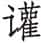、阳关以叛：阳虎窃据二地与三家对抗。，古地名。在今山东宁阳北。阳关，古地名。在今山东泰安东南。

***【译文】***

阳虎为前驱，林楚为季桓子驾车，虞人用铍、盾在两边护卫，阳越断后，准备前往蒲圃。季桓子突然对林楚说：“你的先人都是季氏家忠良之臣，你也要继承下去。”林楚回答说：“下臣听到这话已晚。阳虎执掌政事，鲁国人都服从他，违背他就是找死，死了对主人并没好处。”季桓子说：“有什么晚的？你能带着我往孟氏那儿去吗？”林楚回答说：“不敢吝惜一死，而是怕不能使主人免于祸难。”季桓子说：“去吧！”孟氏选了三百名强壮的男仆，在门外替公期建造房屋。林楚鞭马，冲上大路快速奔驰。阳越射他，没射中。季桓子乘车冲进孟氏宅邸，建房人关上大门。有人从门缝射阳越，射死了他。阳虎劫持鲁定公和武叔，去攻打孟氏。公敛处父带领成邑人从上东门进城，与阳虎在南门内交战，不能取胜；又在棘下交战， 阳虎失败。阳虎脱下皮甲前去公宫，拿了宝玉、大弓出来，屯扎在五父之衢，睡下并下令做饭。他的手下说：“追兵恐怕要到了。”阳虎说：“鲁国人听说我出逃，正庆幸能缓死，哪里有时间来追我？”随从的说：“嘿！快套车吧！公敛处父在那里。”公敛处父请求追赶阳虎，孟孙不允许。公敛阳想杀了季桓子，孟孙害怕了，把季桓子送回家去。季寤在季氏祖庙向神主一一斟酒祭告后出逃。阳虎进入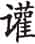地、阳关而叛乱。

8.11 郑驷歂嗣子大叔为政①。

***【注释】***

①郑驷歂嗣子大叔为政：驷歂接替子太叔（游吉）执政。驷歂，子然，驷乞之子。

***【译文】***

郑国驷歂接替子太叔执掌国政。

# 九年

***【经】***

9.1 九年春王正月①。

9.2 夏四月戊申②，郑伯虿卒③。

9.3 得宝玉、大弓④。

9.4 六月，葬郑献公。

9.5 秋，齐侯、卫侯次于五氏⑤。

9.6 秦伯卒⑥。

9.7 冬，葬秦哀公。

***【注释】***

①九年：鲁定公九年当周敬王十九年，前501。

②戊申：二十二日。

③郑伯虿卒：郑献公虿死。郑献公，前513年即位，在位十三年。

④得宝玉、大弓：阳虎归还宝玉、大弓。

⑤齐侯、卫侯次于五氏：两国攻打晋国。五氏，晋国地名，在今河北邯郸西。

⑥秦伯卒：秦哀公死。秦哀公，前536年即位，在位三十六年。

***【译文】***

鲁定公九年春周历正月。

夏四月二十二日，郑献公虿去世。

得到宝玉、大弓。

六月，安葬郑献公。

秋，齐景公、卫灵公驻扎在五氏。

秦哀公去世。

冬，安葬秦哀公。

***【传】***

9.1 九年春，宋公使乐大心盟于晋，且逆乐祁之尸①。辞，伪有疾②。乃使向巢如晋盟③，且逆子梁之尸。子明谓桐门右师出④，曰：“吾犹衰绖，而子击钟，何也⑤？”右师曰：“丧不在此故也⑥。”既而告人曰：“己衰绖而生子，余何故舍钟⑦？”子明闻之，怒，言于公曰：“右师将不利戴氏⑧。不肯适晋，将作乱也。不然，无疾⑨。”乃逐桐门右师⑩。

***【注释】***

①宋公使乐大心盟于晋，且逆乐祁之尸：按，去年，乐祁死于晋国太行山地区。

②辞，伪有疾：乐大心假装有病，推辞赴晋国。

③向巢：向戌曾孙。

④子明谓桐门右师出：乐大心来到子明家，子明将他赶出。或曰，出谓出国迎尸。子明，乐祁之子溷。桐门右师，乐大心。

⑤吾犹衰绖，而子击钟，何也：子明知道乐大心称病推辞，特以“我还在丧期之中，你却击钟作乐，何故不出国”的话激他。衰绖，丧服。

⑥丧不在此故也：乐祁死于晋，所以说“丧不在此”。

⑦己衰绖而生子，余何故舍钟：子明父丧在身，却照样生孩子，我作为兄弟，为何不能奏乐？

⑧戴氏：指宋国。

⑨不然，无疾：否则，不会称病推辞。

⑩乃逐桐门右师：驱逐乐大心在明年，这里先交代结果。

***【译文】***

鲁定公九年春，宋景公派乐大心去晋国结盟，并迎接乐祁的灵柩。乐大心推辞，假装有病。景公便派向巢到晋国结盟，并接回乐祁的灵柩。乐大心来到子明家，子明将他赶出去，说：“我还穿着丧服，而你敲钟作乐，是为了什么？”乐大心说：“是因为灵柩不在这里啊。”然后乐大心告诉别人说：“自己在服丧期间生下儿子，我为什么要放弃敲钟作乐？”子明听说了，大怒，对宋景公说：“乐大心将要不利于宋国。他不肯去晋国，是准备作乱。不然的话，不会装病推辞。”于是驱逐乐大心。

9.2 郑驷歂杀邓析，而用其《竹刑》①。君子谓：“子然于是不忠②。苟有可以加于国家者，弃其邪可也③。《静女》之三章，取彤管焉④。《竿旄》‘何以告之’，取其忠也⑤。故用其道，不弃其人。《诗》云：‘蔽芾甘棠，勿翦勿伐，召伯所茇⑥。’思其人，犹爱其树，况用其道而不恤其人乎⑦！子然无以劝能矣⑧。”

***【注释】***

①郑驷歂杀邓析，而用其《竹刑》：驷歂虽然杀了邓析，却采用他的《竹刑》。邓析，郑国大夫。昭公六年，子产曾铸刑书于鼎，邓析改所铸旧刑书，其刑书后出，写在竹简之上，称《竹刑》。邓析的《竹刑》可能更适用，故驷歂用之。

②子然：驷歂的字。

③苟有可以加于国家者，弃其邪可也：邓析制《竹刑》，对国家有利，就不必计较他无关宏旨的罪过。加，益。

④《静女》之三章，取彤管焉：《静女》三章虽写美女，但其目的在彤管之上。《静女》，《诗经·国风·邶风》篇名。诗中的“彤管”，本是红色管状的草，古人也解释为赤管笔，用来记事，彰善恶。

⑤《竿旄》“何以告之”，取其忠也：《竿旄》是《诗经·国风·鄘风》中的篇名，篇末有“彼姝者子，何以告之”二句。君子取作诗者之忠心。

⑥蔽芾甘棠，勿翦勿伐，召伯所茇（bá）：引《诗》见《诗经·国风·召南·甘棠》，意思是很茂盛的甘棠树，不剪不砍莫动它，召伯曾经停留在树下。取意思念其人而兼及其物。

⑦不恤：不顾。

⑧子然无以劝能矣：作者批评子然用其人之道而弃其人之身。无以劝能，不能勉励贤能。

***【译文】***

郑国驷歂杀了邓析，却用他所作的《竹刑》。君子认为：“驷歂在这件事上表现不忠。如果有人对国家有利，就可以不责罚他无关宏旨的罪过。《静女》的第三章诗，就是赞赏其中的彤管。《竿旄》‘用什么劝告他’，是赞赏他的忠诚。所以，用了他的主张，就不惩罚这人。《诗》说：‘甘棠的树荫茂密高大，不要剪它别砍伐，召伯曾经停留在树下。’思念这个人，尚且爱护这棵树，何况用了他的主张怎能不顾惜他的生命呢！驷歂无法劝勉有才能的人了。”

9.3 夏，阳虎归宝玉、大弓。书曰“得”，器用也①。凡获器用曰得，得用焉曰获②。

***【注释】***

①器用：器物用具。

②凡获器用曰得，得用焉曰获：得到器物用具叫“得”，得到生物叫“获”。按，以上解释《经》文用“得”、“获”的区别。

***【译文】***

夏，阳虎归还宝玉、大弓。《春秋》记载说“得”，是由于它们是器物用具。凡是得到器物用具叫“得”，得到生物叫“获”。

六月，伐阳关①。阳虎使焚莱门②。师惊，犯之而出③，奔齐，请师以伐鲁，曰：“三加④，必取之。”齐侯将许之。鲍文子谏曰⑤：“臣尝为隶于施氏矣⑥，鲁未可取也。上下犹和，众庶犹睦，能事大国⑦，而无天灾，若之何取之？阳虎欲勤齐师也，齐师罢，大臣必多死亡，己于是乎奋其诈谋⑧。夫阳虎有宠于季氏，而将杀季孙，以不利鲁国，而求容焉⑨。亲富不亲仁，君焉用之⑩？君富于季氏，而大于鲁国，兹阳虎所欲倾覆也⑪。鲁免其疾，而君又收之，无乃害乎⑫？”齐侯执阳虎，将东之⑬。阳虎愿东，乃囚诸西鄙⑭。尽借邑人之车，锲其轴，麻约而归之⑮。载葱灵，寝于其中而逃⑯。追而得之，囚于齐。又以葱灵逃，奔宋，遂奔晋，适赵氏。仲尼曰：“赵氏其世有乱乎⑰！”

***【注释】***

①伐阳关：讨伐阳虎。

②莱门：阳关城门。

③师惊，犯之而出：鲁军惊恐，阳虎乘机突围而出。

④三加：三次出兵攻打。

⑤鲍文子：鲍国，曾为鲁国施氏家臣，后被齐国召回，时已九十余岁。

⑥施氏：鲁国大夫。

⑦能事大国：谨事晋国。大国，指晋国。

⑧奋其诈谋：施展阴谋诡计。意谓阳虎怂恿齐国出兵，好从中渔利。

⑨求容：讨好齐国以求得庇护。

⑩亲富不亲仁，君焉用之：阳虎只喜欢财富而不讲究道义，不可用。

⑪君富于季氏，而大于鲁国，兹阳虎所欲倾覆也：意谓阳虎之心本在于颠覆、图谋齐国。

⑫鲁免其疾，而君又收之，无乃害乎：鲁国除掉阳虎这个祸患，齐国却收留他，无异于引狼入室。

⑬东之：囚禁于齐国东部。

⑭阳虎愿东，乃囚诸西鄙：阳虎本意想西逃晋国，知道齐国必定反其意而行，因此故意说愿东，使齐国西囚之。

⑮尽借邑人之车，锲（ｑiè）其轴，麻约而归之：阳虎知道自己逃跑时，齐国人必用车追赶，所以遍借城中人的车，将车轴截断，又用麻缠绕伪装起来，再将车归还。锲，截断。

⑯载葱灵，寝于其中而逃：阳虎在葱灵车上装上衣物，自己躲在衣物之中逃跑。葱灵，一种装载衣物的车。

⑰赵氏其世有乱乎：阳虎好作乱，所以孔子预言赵氏将不得安宁。

***【译文】***

六月，攻打阳关。阳虎派人焚烧莱门。鲁军被惊扰，阳虎突围而出，逃往齐国，请求派兵进攻鲁国，说：“攻打三次，一定能攻占。”齐景公准备答应。鲍文子进谏说：“下臣曾经当过施氏的家臣，知道鲁国不能攻取。他们上下仍然和谐，百姓和睦，能够事奉大国，而且没有天灾，怎么可能攻取？阳虎是想劳动齐军，齐军疲劳，大臣必定有很多死亡，他自己就能乘机施展阴谋。阳虎在季氏那里得到宠信，反而要杀季孙，以不利于鲁国，来讨好我们求得庇护。亲近富有而不亲近仁爱，国君哪里用得着他？国君比季氏富有，齐国比鲁国大，这正是阳虎所想要倾覆的啊。鲁国免除了他的祸害，国君却又收留他，不是祸害吗？”齐景公拘捕阳虎，打算把他送往东部囚禁。阳虎表示愿意住在东部，齐景公便又把他囚禁在西部边境。阳虎把当地人的车都借来，截断车轴，用麻布包上后还给车主。他在葱灵车上装满衣物，躲在里边逃走。齐国人追上抓获，囚禁在齐国都城。他又躲在葱灵车里逃脱，逃往宋国，又转逃晋国，投靠赵氏。孔子说：“赵氏恐怕将世世代代有动乱了吧！”

9.4 秋，齐侯伐晋夷仪①。敝无存之父将室之②，辞，以与其弟，曰：“此役也不死，反，必娶于高、国③。”先登，求自门出，死于霤下④。东郭书让登⑤，犁弥从之，曰：“子让而左，我让而右，使登者绝而后下⑥。”书左，弥先下。书与王猛息⑦。猛曰：“我先登。”书敛甲⑧，曰：“曩者之难，今又难焉⑨！”猛笑曰：“吾从子如骖之靳⑩。”

***【注释】***

①齐侯伐晋夷仪：齐国为卫国攻打夷仪。夷仪，古地名。在今河北邢台西。

②敝无存：齐国大夫。室之：为之娶妻。之，指敝无存。

③此役也不死，反，必娶于高、国：敝无存自认为定可立功，凯旋后将娶卿相之女。此役，指夷仪之役。高、国，高氏、国氏。

④死于霤（liù）下：敝无存率先登城，跳进城内，企图从里面打开城门出来，结果战死在城楼屋檐下。

⑤让登：抢登。让，通“攘”。

⑥子让而左，我让而右，使登者绝而后下：犁弥怕被东郭书占了先，建议等登上城的人齐了以后再下去。让，让登。绝，尽。

⑦王猛：犁弥。息：战后休息。

⑧敛甲：收拾盔甲，准备与王猛较量。

⑨曩者之难，今又难焉：东郭书对王猛的话不服气。难，为难，过不去。

⑩吾从子如骖之靳：王猛不敢与东郭书争，表示自己只不过如骖马随着服马一样。靳，驾辕的服马。

***【译文】***

秋，齐景公攻打晋国夷仪。敝无存的父亲打算为他娶亲，被他推辞，让给弟弟，说：“这次战役如果不战死，回来后一定要娶高氏、国氏的女子。”攻城时他率先登上城墙，又想从城门冲出去，战死在城楼檐下。东郭书抢先登城，犁弥跟在后面，说：“你登上去后往左，我上去后往右，等大家都上来后再下去。”东郭书登城后往左去，犁弥却先下城去。战斗结束，东郭书和犁弥在一起休息。犁弥说：“是我先登城的。”东郭书收拾盔甲，说：“上一次你让我难堪，现在又要让我难堪！”犁弥笑着说：“我跟着您就如同骖马跟从服马一样。”

晋车千乘在中牟①。卫侯将如五氏②，卜过之③，龟焦④。卫侯曰：“可也！卫车当其半，寡人当其半，敌矣⑤。”乃过中牟。中牟人欲伐之。卫褚师圃亡在中牟，曰：“卫虽小，其君在焉⑥，未可胜也。齐师克城而骄⑦，其帅又贱⑧，遇，必败之，不如从齐。”乃伐齐师，败之⑨。齐侯致禚、媚、杏于卫⑩。

***【注释】***

①晋车千乘在中牟：晋国派兵准备反击。中牟，古地名。在今河南汤阴西。

②卫侯将如五氏：卫灵公发兵助齐国。

③卜过之：占卜经过中牟的吉凶。

④龟焦：灼龟而卜，结果龟板烧焦，占卜不成。

⑤卫车当其半，寡人当其半，敌矣：卫国有战车五百辆，可抵晋国的一半；又自夸自己可抵晋国的战车五百辆。

⑥卫虽小，其君在焉：卫灵公亲自出马。

⑦城：指夷仪。

⑧其帅又贱：杜预《春秋左传注》以为统帅是东郭书，地位不高。按，从上下文看，齐军统帅不一定是东郭书。

⑨乃伐齐师，败之：晋国与齐国战。据哀公十五年《传》，齐国丧车五百辆。

⑩齐侯致禚（zhｕó）、媚、杏于卫：齐国将三地送给卫国，答谢其出兵相救。禚、媚、杏，齐国西部之地，分别在今山东长清、茌平和禹城。

***【译文】***

晋国战车千辆驻在中牟。卫灵公准备到五氏去，为经过中牟而占卜，卜龟烧焦了。卫灵公说：“可以！卫国的战车相当于他们的一半，寡人也相当一半，对等了。”于是经过中牟。中牟人想攻打卫军。卫国褚师圃逃亡在中牟，说：“卫国虽然小，但国君在军中，不可能战胜他们。齐军攻克城邑而骄傲，统帅级别又低下，两军相遇，必定能打败齐军，不如迎战齐军。”于是攻打齐军，打败了他们。齐景公把禚、媚、杏三地送给卫国。

齐侯赏犁弥，犁弥辞曰：“有先登者，臣从之，晳帻而衣狸制①。”公使视东郭书，曰：“乃夫子也——吾贶子②。”公赏东郭书，辞，曰：“彼，宾旅也③。”乃赏犁弥④。

***【注释】***

①先登者，臣从之，晳帻而衣狸制：犁弥不知道东郭书之名，只记住他的打扮。皙帻，白色头巾。帻，古代包扎发髻的巾。狸制，狸皮斗篷。

②乃夫子也——吾贶子：是这个人——我把赏赐让给您。前句是对别人说的，后句是对东郭书说的。犁弥认出先登者是东郭书。贶，赐。

③彼：指犁弥。宾旅：客卿。犁弥大概由别国初仕于齐国。

④乃赏犁弥：二人谦让，最后赏犁弥。

***【译文】***

齐景公赏赐犁弥，犁弥辞谢说：“有先登城的人，下臣是跟着他，那人头包白色头巾，身披狸皮斗篷。”景公让他去看是不是东郭书，他看了说：“正是这一位——我把赏赐让给您。”景公赏赐东郭书，东郭书辞谢了，说：“犁弥是客卿。”于是赏给了犁弥。

齐师之在夷仪也，齐侯谓夷仪人曰：“得敝无存者，以五家免①。”乃得其尸。公三襚之②，与之犀轩与直盖③，而先归之④。坐引者⑤，以师哭之⑥，亲推之三⑦。

***【注释】***

①得敝无存者，以五家免：能找回敝无存尸体的，赏赐五家的财富，并免除赋役。

②三襚：三次给尸体穿衣。三襚，迁尸于袭上而衣之，为一襚；小敛又衣之，二襚；大敛又衣之，三襚。

③与之犀轩与直盖：二物以作殉葬。犀轩，以犀牛皮装饰的车。直盖，高盖，即长柄伞。

④先归之：先送尸体回去。

⑤坐引者：让拉灵车的人跪着。

⑥以师哭之：全军为之吊哭。

⑦亲推之三：齐景公以亲自推车三次的重礼为敝无存送葬。

***【译文】***

齐军在夷仪的时候，齐景公对夷仪人说：“得到敝无存尸体的，赏赐五户，免除赋役。”于是得到敝无存的尸体。景公三次为尸体穿衣服，给他犀皮蒙盖的轩车和直柄车盖殉葬，并先把灵柩送回国内。让拉灵车的人跪着拉车，带领全军哭吊，亲自推车三次。

# 十年

***【经】***

10.1 十年春王三月①，及齐平②。

10.2 夏，公会齐侯于夹谷③。

10.3 公至自夹谷。

10.4 晋赵鞅帅师围卫。

10.5 齐人来归郓、、龟阴田④。

10.6 叔孙州仇、仲孙何忌帅师围郈⑤。

10.7 秋，叔孙州仇、仲孙何忌帅师围郈⑥。

10.8 宋乐大心出奔曹。

10.9 宋公子地出奔陈。

10.10 冬，齐侯、卫侯、郑游速会于安甫。

10.11 叔孙州仇如齐⑦。

10.12 宋公之弟辰暨仲佗、石出奔陈⑧。

***【注释】***

①十年：鲁定公十年当周敬王二十年，前500。

②及齐平：前年鲁国两次侵齐，现在两国讲和。

③夹谷：古地名。在今山东莱芜。

④郓、、龟阴田：三邑即汶阳之田，分别在山东郓城东、宁阳西北及新泰西南。

⑤叔孙州仇：武叔。仲孙何忌：孟懿子。郈：叔孙氏私邑，在今山东东平。

⑥秋，叔孙州仇、仲孙何忌帅师围郈：再次围郈。

⑦叔孙州仇如齐：武叔聘问于齐国。

⑧仲佗、石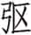：都是宋国卿。

***【译文】***

鲁定公十年春周历三月，鲁国与齐国讲和。

夏，鲁定公与齐景公在夹谷相会。

定公从夹谷回国。

晋国赵鞅带兵包围卫国。

齐国送还郓、、龟阴田地给鲁国。

叔孙州仇、仲孙何忌领兵包围郈地。

秋，叔孙州仇、仲孙何忌带兵包围郈地。

宋国乐大心出逃曹国。

宋国公子地逃往陈国。

冬，齐景公、卫灵公、郑国游速在安甫会面。

叔孙州仇去齐国。

宋景公弟弟辰和仲佗、石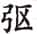出逃陈国。

***【传】***

10.1 十年春，及齐平。

***【译文】***

鲁定公十年春，鲁国与齐国讲和。

10.2 夏，公会齐侯于祝其，实夹谷①。孔丘相②。犁弥言于齐侯曰：“孔丘知礼而无勇，若使莱人以兵劫鲁侯，必得志焉③。”齐侯从之。孔丘以公退④，曰：“士兵之⑤！两君合好，而裔夷之俘以兵乱之⑥，非齐君所以命诸侯也⑦。裔不谋夏⑧，夷不乱华⑨，俘不干盟⑩，兵不逼好⑪——于神为不祥⑫，于德为愆义⑬，于人为失礼，君必不然。”齐侯闻之，遽辟之⑭。

***【注释】***

①祝其，实夹谷：祝其就是夹谷。

②孔丘相：孔子时为鲁国司寇，位至卿，为鲁定公相礼。

③若使莱人以兵劫鲁侯，必得志焉：犁弥建议用莱人武装劫持鲁定公。莱，姜姓国，在今山东黄县，襄公六年被齐国所灭，成为齐地。

④以公退：保护鲁定公退出。

⑤士兵之：武士抵御莱人。按，诸侯会盟，双方有军队随从保护。

⑥裔夷之俘：莱为齐国所灭，故称之为俘。裔，边远。

⑦非齐君所以命诸侯也：以兵乱盟，不是齐国与诸侯敦睦邦交之道。

⑧裔：指华夏以外的地区。

⑨夷：指华夏族以外的人。

⑩干：犯。

⑪兵：指兵戎之事。好：盟会和好。

⑫于神为不祥：会盟必祭告神明，侵犯则为不祥。

⑬愆义：违反道义。

⑭遽辟之：急令莱夷退出。

***【译文】***

夏，定公与齐景公在祝其相会，就是夹谷。孔丘任相礼。犁弥对齐景公说：“孔丘知礼却缺乏勇，如果让莱人武装劫持鲁定公，一定可以达到我们的目的。”齐景公同意了。孔丘带着定公退会，喊道：“将士们上！两国国君合好，而边远夷人俘虏却用武力捣乱，这不是齐国国君用来命令诸侯的办法。边远地区人不可能图谋中原，夷人不可能扰乱华人，俘虏不可能干犯盟会，武力不可能逼迫友好——这样对待神灵不吉祥，对于德行是丧失道义，对于人是失礼，齐君必定不会这样做的。”齐景公听说了，赶紧让莱人撤下。

将盟，齐人加于载书曰：“齐师出竟①，而不以甲车三百乘从我者，有如此盟②！”孔丘使兹无还揖对③，曰：“而不反我汶阳之田，吾以共命者，亦如之④！”

***【注释】***

①齐师出竟：齐军发兵远征。竟，通“境”。

②有如此盟：按盟书条款加以严惩。

③兹无还：鲁国大夫。

④而不反我汶阳之田，吾以共命者，亦如之：孔子提出须归还汶阳之田，并写入盟书。共命，指以甲兵三百乘相从。

***【译文】***

将要盟誓，齐国在盟书上加了一句话说：“齐军出境，鲁国要是不派出三百辆战车跟随我们，有盟誓为证！”孔丘让兹无还作揖回答说：“如果你们不归还我国汶阳的田地，让我们用来供给需要，也有盟誓为证！”

齐侯将享公，孔丘谓梁丘据曰：“齐、鲁之故①，吾子何不闻焉？事既成矣②，而又享之，是勤执事也③。且牺、象不出门④，嘉乐不野合⑤。飨而既具⑥，是弃礼也。若其不具，用秕稗也⑦。用秕稗，君辱⑧；弃礼，名恶⑨。子盍图之⑩！夫享，所以昭德也。不昭，不如其已也⑪。”乃不果享。

***【注释】***

①故：旧典，传统礼节。

②事既成矣：会盟已完成。

③勤：烦劳。

④牺、象：牛形、象形的酒器，盛大宴会所用。

⑤嘉乐不野合：享礼当在朝庙，不宜在野外。嘉乐，钟磬，指雅乐。

⑥飨：享礼。既具：牺、象、钟、磬尽备。

⑦若其不具，用秕稗也：飨而礼不全，就如不用五谷而用秕稗一样轻率。

⑧君辱：有辱齐君。

⑨名恶：名声不好。按，辱君和名恶都不好。

⑩盍：何不。

⑪不昭，不如其已也：享礼是用来宣扬君德的，否则不如不用。已，停止。

***【译文】***

齐景公准备设享礼款待定公，孔丘对梁丘据说：“齐、鲁两国过去的惯例，您怎么没听说呢？盟会已经结束，却又设享礼，这是给执事增加劳累。而且牺尊、象尊不出国门，雅乐不在野外合奏。设享礼如果全部具备这些，就是抛弃礼法。要是不具备，又像用秕谷稗草那样轻率。用秕谷稗草，是君主的耻辱；抛弃礼法，名声不好。您何不考虑一下！所谓享礼，是用来宣扬德行的。不能昭明德行，就不如不举行。”最终没有设享礼。

10.3 齐人来归郓、、龟阴之田①。

***【注释】***

①齐人来归郓、、龟阴之田：阳虎去年逃往齐国，将三邑之田划归齐国，现在齐国才按盟约归还鲁国。

***【译文】***

齐国派人到鲁国归还郓、、龟阴三处田地。

10.4 晋赵鞅围卫，报夷仪也①。初，卫侯伐邯郸午于寒氏②，城其西北而守之③。宵熸④。及晋围卫，午以徒七十人门于卫西门，杀人于门中，曰：“请报寒氏之役⑤。”涉佗曰：“夫子则勇矣⑥，然我往，必不敢启门⑦。”亦以徒七十人旦门焉⑧。步左右，皆至而立，如植⑨。日中不启门⑩，乃退。反役⑪，晋人讨卫之叛故⑫，曰：“由涉佗、成何⑬。”于是执涉佗以求成于卫。卫人不许⑭。晋人遂杀涉佗。成何奔燕。君子曰：“此之谓弃礼，必不钧⑮。《诗》曰：‘人而无礼，胡不遄死⑯。’涉佗亦遄矣哉！”

***【注释】***

①晋赵鞅围卫，报夷仪也：去年齐国为卫国攻打晋国的夷仪，现在对卫国进行报复。

②卫侯伐邯郸午于寒氏：去年卫灵公帮助齐国进攻五氏。邯郸午，晋国邯郸大夫，名午。寒氏，即去年《经》文的五氏。

③城：筑城。

④宵熸（ｊiān）：夜间，邯郸午守军全部溃散。熸，消遁，消失。

⑤请报寒氏之役：为报寒氏之战的前仇。

⑥夫子：指邯郸午。

⑦然我往，必不敢启门：卫国人不怕邯郸午，开门与他交战。涉佗认为自己前往攻打，卫国人必惧怕不敢开门。

⑧旦门：黎明攻门。

⑨步左右，皆至而立，如植：到城门下，分左右两边站定，如树木一样，纹丝不动。

⑩日中不启门：直到中午，卫国人不敢开门。

⑪反役：退兵。

⑫晋人讨卫之叛故：晋国围卫无功，只好退兵，恼羞之间，便追查卫国叛晋的原因。

⑬由涉佗、成何：定公八年，晋国与卫国结盟，二人任使者，羞辱卫灵公。

⑭卫人不许：卫国不愿意再与晋国和好。

⑮此之谓弃礼，必不钧：当初侮辱卫君，本是赵鞅的意思，成何说卫国不过如晋国的县邑，涉佗则推卫君手，都是无礼行为。不钧，不一样。

⑯人而无礼，胡不遄死：引《诗》见《诗经·国风·鄘风·相鼠》。胡，何。遄，速。

***【译文】***

晋国赵鞅包围卫国，是报复夷仪战役。起初，卫灵公在寒氏讨伐邯郸午，在其西北部筑城并派兵把守。城中守军夜里溃散。到晋军包围卫国，邯郸午带七十个人攻打卫国西门，在城门中杀人，说：“请让我以此报复寒氏之战。”涉佗说：“你算得上勇敢了，但要是我前去，他们肯定不敢开门。”也带着七十个人在黎明去攻城门。走到城门下，左右排列，全部站定，如同树木一样不动。到中午城门还不开，于是退回。退兵后，晋国追究卫国背叛的原因，说：“是由涉佗、成何引起的。”于是抓了涉佗向卫国要求媾和。卫国不同意。晋国便杀了涉佗。成何逃往燕国。君子说：“这叫做丢掉礼，所以处理肯定不公平。《诗》说：‘人要是没有礼，何不早点死。’涉佗算是死得快了！”

10.5 初，叔孙成子欲立武叔，公若藐固谏，曰：“不可。”成子立之而卒。公南使贼射之，不能杀①。公南为马正，使公若为郈宰。武叔既定，使郈马正侯犯杀公若，不能。其圉人曰②：“吾以剑过朝，公若必曰：‘谁之剑也？’吾称子以告③，必观之。吾伪固而授之末，则可杀也④。”使如之。公若曰：“尔欲吴王我乎⑤？”遂杀公若。侯犯以郈叛⑥，武叔、懿子围郈，弗克⑦。

***【注释】***

①公南使贼射之，不能杀：因怨恨公若藐，想暗杀他。公南，叔孙家臣，武叔同党。

②其圉人：武叔的马官。

③称子以告：告诉他是您的剑。

④吾伪固而授之末，则可杀也：拿剑给人，应以剑柄向着对方，圉人准备把剑锋对着公若藐，乘机刺杀他。伪固，伪装固陋不知礼节。

⑤吴王我：以我为吴王。按，公若藐见剑锋向着自己，斥责说，你想像诸刺吴王僚那样刺杀我吗？

⑥侯犯以郈叛：侯犯杀公若未得手，怕叔孙氏加罪，于是据守郈地发动叛乱。

⑦武叔、懿子围郈，弗克：叔孙氏、孟孙氏联合围郈，没攻下。懿子，孟懿子，仲孙何忌。

***【译文】***

起初，叔孙成子想立武叔为继承人，公若藐坚持劝谏，说：“不可以。”叔孙成子立了武叔后就死了。公南派贼人射公若藐，没能杀死他。公南任马正，派公若藐任郈地宰。武叔地位稳定后，派郈邑马正侯犯杀公若藐，还是没能杀死他。武叔的马官说：“我持剑经过朝廷，公若藐一定会问：‘谁的剑啊？’我告诉他是您的，他一定会观看。我假装不懂礼仪而把剑尖对着他递过去，就可以杀他了。”让他照办。公若藐说：“你想把我当吴王吗？”马官杀死公若藐。侯犯占据郈邑叛乱，武叔、懿子包围郈邑，没能攻下。

秋，二子及齐师复围郈①，弗克。叔孙谓郈工师驷赤曰②：“郈非唯叔孙氏之忧，社稷之患也③。将若之何？”对曰：“臣之业在《扬水》卒章之四言矣④。”叔孙稽首⑤。驷赤谓侯犯曰：“居齐、鲁之际而无事⑥，必不可矣。子盍求事于齐以临民⑦？不然，将叛⑧。”侯犯从之。齐使至，驷赤与郈人为之宣言于郈中曰⑨：“侯犯将以郈易于齐⑩，齐人将迁郈民。”众凶惧⑪。驷赤谓侯犯曰：“众言异矣⑫。子不如易于齐，与其死也，犹是郈也⑬，而得纾焉，何必此⑭？齐人欲以此逼鲁，必倍与子地⑮。且盍多舍甲于子之门，以备不虞⑯？”侯犯曰：“诺。”乃多舍甲焉。侯犯请易于齐⑰，齐有司观郈⑱。将至，驷赤使周走呼曰：“齐师至矣！”郈人大骇，介侯犯之门甲⑲，以围侯犯。驷赤将射之⑳，侯犯止之曰：“谋免我(21)。”侯犯请行，许之(22)。驷赤先如宿(23)，侯犯殿。每出一门，郈人闭之(24)。及郭门，止之曰：“子以叔孙氏之甲出，有司若诛之(25)，群臣惧死。”驷赤曰：“叔孙氏之甲有物，吾未敢以出(26)。”犯谓驷赤曰：“子止而与之数(27)。”驷赤止，而纳鲁人(28)。侯犯奔齐。齐人乃致郈(29)。

***【注释】***

①二子及齐师复围郈：武叔、懿子借助齐军一起进攻郈。

②工师：掌管工匠的官。

③郈非唯叔孙氏之忧，社稷之患也：侯犯作乱，不仅仅是叔孙家祸，也是鲁国之患。

④臣之业在《扬水》卒章之四言矣：《扬水》即《扬之水》，《诗经·国风·唐风》篇名，末章有“我闻有命”四字，表示愿意听命。业，事情。

⑤叔孙稽首：谢其愿受命。

⑥无事：不事奉任何一国。

⑦子盍求事于齐以临民：驷赤劝诱侯犯依附齐国。

⑧不然，将叛：否则郈人将叛。

⑨驷赤与郈人为之宣言于郈中曰：故意散布传言。

⑩易于齐：将郈地换给齐国。

⑪众凶惧：郈人惊恐。

⑫异：态度改变。

⑬子不如易于齐，与其死也，犹是郈也：与其守着郈地，为郈人所杀，不如与齐国交换，所得仍等于这块郈地。

⑭而得纾焉，何必此：如此可缓和祸患，何必死守郈地？纾，祸患缓和。

⑮齐人欲以此逼鲁，必倍与子地：齐国得到郈地，可以胁迫鲁国，所以将加倍赏给土地。

⑯且盍多舍甲于子之门，以备不虞：在门边多设置甲胄，以防不测。

⑰侯犯请易于齐：请求与齐国交换郈地。

⑱齐有司观郈：齐国派人考察郈地。

⑲介：披甲。

⑳驷赤将射之：假装要为侯犯射杀郈人。

(21)谋免我：设法使我免于祸难，即助其逃跑。

(22)侯犯请行，许之：郈人同意让侯犯出逃。

(23)宿：齐国地名，在今山东东平，离郈西十余里。

(24)每出一门，郈人闭之：关门以防侯犯回来。

(25)诛之：治罪。指让侯犯带走盔甲将被怪罪。

(26)叔孙氏之甲有物，吾未敢以出：驷赤已从宿地返回郈。物，标记。未敢以出，不敢带走。

(27)子止而与之数：让驷赤留下向郈人点交盔甲。

(28)驷赤止，而纳鲁人：驷赤用计使自己留下，接应孟、叔两家军队。

(29)齐人乃致郈：齐将郈地归还鲁国。

***【译文】***

秋，武叔、懿子与齐军再次包围郈邑，还是没能攻占。叔孙对郈邑工师驷赤说：“郈邑并非只是叔孙氏的忧患，也是国家的祸患。打算怎么办？”驷赤回答说：“我所要做的事，在《扬水》最后一章的四个字里了。”叔孙向他行礼致谢。驷赤对侯犯说：“处在齐、鲁两国之间而不事奉任何一国，肯定无法生存。您何不请求事奉齐国以统治百姓？不然的话，百姓将会反叛。”侯犯听从了。齐国使者到来，驷赤和郈邑人乘机在郈邑散布传言说：“侯犯打算用郈邑和齐国交换，齐国将把郈邑民众迁走。”众人惊恐。驷赤对侯犯说：“民众的意见跟您有分歧了。您与其死，不如将郈邑和齐国交换，就仍然等于得到郈邑，而能使祸患得以纾缓，何必一定要在这里？齐国想得到郈邑来逼迫鲁国，一定会加倍给您土地。另外您何不多安放些皮甲在门口，以防意外？”侯犯说：“好的。”便在门口放置了许多皮甲。侯犯请求用郈邑和齐国交换，齐国官员来巡视郈邑。快要到达时，驷赤派人四处奔走呼喊：“齐军来了！”郈邑人大为惊骇，都披上侯犯家门口的皮甲，包围侯犯家。驷赤假装要射他们，侯犯制止说：“想办法让我免于祸难。”侯犯请求出逃，大家同意了。驷赤先到宿地，侯犯跟在后面。每走出一道门，郈邑人就关闭这道门。到了外城门，众人拦住侯犯说：“你带了叔孙氏的皮甲出去，官员要是怪罪下来，群臣们怕被杀死。”驷赤说：“叔孙氏的皮甲有标记，我们没敢带走。”侯犯对驷赤说：“您留下帮他们清点皮甲。”驷赤留下，并接纳鲁国人进城。侯犯逃往齐国。齐国于是把郈邑归还鲁国。

10.6 宋公子地嬖蘧富猎①，十一分其室，而以其五与之②。公子地有白马四。公嬖向魋③，魋欲之。公取而朱其尾、鬛以与之。地怒，使其徒抶魋而夺之④。魋惧，将走⑤。公闭门而泣之，目尽肿⑥。母弟辰曰⑦：“子分室以与猎也，而独卑魋，亦有颇焉⑧。子为君礼，不过出竟，君必止子⑨。”公子地出奔陈，公弗止。辰为之请，弗听。辰曰：“是我迋吾兄也⑩。吾以国人出，君谁与处⑪？”冬，母弟辰暨仲佗、石出奔陈⑫。

***【注释】***

①宋公子地：宋景公庶母弟。蘧富猎：宋国大夫。

②十一分其室，而以其五与之：公子地将自己的家财分为十一份，赏赐给蘧富猎五份。

③向魋（tuí）：司马桓魋，向戌的曾孙，景公宠臣。

④抶（chì）：鞭打。

⑤将走：将出走。

⑥公闭门而泣之，目尽肿：景公哭而挽留向魋。

⑦母弟辰：景公同母弟。

⑧颇：偏，不公平，指重蘧富猎轻向魋。

⑨子为君礼，不过出竟，君必止子：辰劝公子地依礼出奔以避君，这样景公必然挽留他。

⑩迋（ɡｕànɡ）：通“诳”，欺骗。

⑪吾以国人出，君谁与处：辰责备景公，大臣们如果都逃亡，您将和谁治理国家？

⑫母弟辰暨仲佗、石出奔陈：众人离心，逃往陈国。仲佗，仲几之子。石，禇师段之子。按，几人都是宋国有威望的大臣。

***【译文】***

宋国公子地宠爱蘧富猎，把家财分成十一份，将五份给了蘧富猎。公子地有四匹白马。宋景公宠爱向魋，向魋看中公子地的白马。景公把马要过来，把马尾、鬛毛染成红色后给了向魋。公子地发怒，派手下人打了向魋一顿并把马夺回来。向魋害怕了，打算逃走。景公关起门来对着向魋哭泣，眼睛都哭肿了。景公同母弟公子辰对公子地说：“您把家财分给蘧富猎，却看不起向魋，也有偏颇。您应该依礼避让国君，最多不过出国，国君一定会挽留您。”于是公子地出逃陈国，景公并不挽留。公子辰为他求情，景公不听。公子辰说：“这是我欺骗了我哥哥啊。我带着国人出走，您又和谁在一起？”冬，宋景公同母弟公子辰和仲佗、石出逃陈国。

10.7 武叔聘于齐①。齐侯享之，曰：“子叔孙！若使郈在君之他竟，寡人何知焉②？属与敝邑际③，故敢助君忧之④。”对曰：“非寡君之望也⑤。所以事君，封疆社稷是以⑥，敢以家隶勤君之执事⑦？夫不令之臣，天下之所恶也，君岂以为寡君赐⑧？”

***【注释】***

①武叔聘于齐：答谢齐国归还郈地。

②若使郈在君之他竟，寡人何知焉：意思是郈地如果在鲁国其他国境上，为他国所取，恐怕就不会归还鲁国了。

③际：交界。

④故敢助君忧之：按，齐侯言外之意是此举有德于鲁国国君。君，指鲁国国君。

⑤非寡君之望也：鲁国国君不敢以此为德。

⑥所以事君，封疆社稷是以：为了国家疆土的安全，才事奉齐国。

⑦敢以家隶勤君之执事：不敢以敝国家臣之乱惊扰贵国君臣。言外之意是侯犯之乱，齐国也推波助澜。家隶，家臣，指侯犯。

⑧君岂以为寡君赐：您难道以此作为对我们国君的恩赐吗？武叔意谓此举义在讨恶，并非为了得到齐国的赐予。

***【译文】***

武叔去齐国聘问。齐景公设享礼招待他，说：“子叔孙！如果郈地在鲁君的其他国境，寡人又能知道什么呢？这里刚好和敝国交界，所以敢大胆帮助贵国国君分忧。”武叔回答说：“这不是我们国君所希望的。我们所以奉事国君，是为了国土社稷，岂敢以家臣的事劳驾国君的执事？不好的臣子，是天下人所讨厌的，您难道以此作为对我们国君的恩赐？”

# 十一年

***【经】***

11.1 十有一年春①，宋公之弟辰及仲佗、石、公子地自陈入于萧以叛②。

11.2 夏四月。

11.3 秋，宋乐大心自曹入于萧③。

11.4 冬，及郑平④。叔还如郑莅盟⑤。

***【注释】***

①十有一年：鲁定公十一年当周敬王二十一年，前499。

②宋公之弟辰及仲佗、石、公子地自陈入于萧以叛：辰等人去年由宋国逃奔陈国。萧，宋国地名，在今安徽萧县。

③宋乐大心自曹入于萧：乐大心去年由宋国逃奔曹国。

④及郑平：鲁定公六年，鲁国侵郑取匡。现在鲁、郑两国讲和，消弭旧怨。

⑤叔还：叔弓之曾孙。

***【译文】***

鲁定公十一年春，宋景公的弟弟辰以及仲佗、石、公子地从陈国进入萧地发动叛乱。

夏四月。

秋，宋国乐大心从曹国进入萧地。

冬，鲁国与郑国讲和。叔还到郑国参加盟会。

***【传】***

11.1 十一年春，宋公母弟辰暨仲佗、石、公子地入于萧以叛。秋，乐大心从之，大为宋患①。宠向魋故也。

***【注释】***

①乐大心从之，大为宋患：辰等人与乐大心一起据守萧地叛乱，成为宋国的大患。

***【译文】***

鲁定公十一年春，宋景公同母弟弟辰与仲佗、石、公子地进入萧地发动叛乱。秋，乐大心随同叛乱，给宋国带来极大祸患。这是由于景公宠信向魋的缘故。

11.2 冬，及郑平，始叛晋也①。

***【注释】***

①及郑平，始叛晋也：按，鲁国自僖公以来，世代归服晋国。但此时晋国国内大夫专权，内讧激烈，晋国霸业衰落，诸侯多叛。鲁国与郑国媾和，从此背叛晋国。齐、郑、卫、鲁各国之好逐渐形成。

***【译文】***

冬，与郑国讲和，开始背叛晋国了。

# 十二年

***【经】***

12.1 十有二年春①，薛伯定卒。

12.2 夏，葬薛襄公。

12.3 叔孙州仇帅师堕郈②。

12.4 卫公孟帅师伐曹③。

12.5 季孙斯、仲孙何忌帅师堕费。

12.6 秋，大雩。

12.7 冬十月癸亥④，公会齐侯盟于黄⑤。

12.8 十有一月丙寅朔，日有食之⑥。

12.9 公至自黄。

12.10 十有二月，公围成⑦。

12.11 公至自围成。

***【注释】***

①十有二年：鲁定公十二年当周敬王二十二年，前498。

②堕（huī）：毁，拆毁其城。

③公孟：卫国大夫，孟絷之子。

④癸亥：二十七日。

⑤公会齐侯盟于黄：齐、鲁两国结盟背叛晋国。

⑥十有一月丙寅朔，日有食之：此为前498年9月22日的日环食。

⑦成：孟孙氏私邑。

***【译文】***

鲁定公十二年春，薛襄公定去世。

夏，安葬薛襄公。

叔孙州仇带兵拆毁郈邑城墙。

卫国公孟领兵攻打曹国。

季孙斯、仲孙何忌率兵拆毁费邑城墙。

秋，举行盛大的求雨雩祭。

冬十月二十七日，定公与齐景公在黄地结盟。

十一月初一，发生日食。

定公从黄地回来。

十二月，定公包围成邑。

定公从成邑前线归来。

***【传】***

12.1 十二年夏，卫公孟伐曹，克郊①。还，滑罗殿②。未出③，不退于列④。其御曰：“殿而在列，其为无勇乎⑤？”罗曰：“与其素厉，宁为无勇⑥。”

***【注释】***

①郊：曹邑，在今山东菏泽。

②滑罗：卫国大夫。殿：殿后。

③未出：未出曹国国境。

④不退于列：殿后之军应在全军最后，但滑罗不这样。

⑤殿而在列，其为无勇乎：殿后之军却走在全军之中，将被认为无勇怕死。

⑥与其素厉，宁为无勇：滑罗料定曹国不敢追来，不必殿后，并认为与其空得勇猛之名，宁可被无勇之名。素厉，空有勇猛之名。

***【译文】***

鲁定公十二年夏，卫国公孟进攻曹国，攻克郊地。回军时滑罗殿后。还没出曹国国境，滑罗就不领兵走在后面。他的御者说：“殿后却走在队列里，那是缺乏勇气吧？”滑罗说：“与其空有勇猛之名，宁可被人认为缺乏勇气。”

12.2 仲由为季氏宰①，将堕三都②。于是叔孙氏堕郈③。季氏将堕费，公山不狃、叔孙辄帅费人以袭鲁④。公与三子入于季氏之宫⑤，登武子之台⑥。费人攻之，弗克。入及公侧⑦，仲尼命申句须、乐颀下，伐之，费人北⑧。国人追之，败诸姑蔑⑨。二子奔齐⑩，遂堕费。将堕成⑪，公敛处父谓孟孙⑫：“堕成，齐人必至于北门。且成，孟氏之保障也。无成，是无孟氏也⑬。子伪不知⑭，我将不堕。”

***【注释】***

①仲由：字子路，孔子弟子。

②将堕三都：三桓的私邑，季孙氏有费，叔孙氏有郈，孟孙氏有成。三家各以家臣为私邑之宰，于是先后发生了家臣据邑以叛三家之事，如南蒯、阳虎之叛季孙氏，侯犯之叛叔孙氏，所以三都成了三家本身的祸患。仲由因此建议毁掉三家私邑城墙，既可防后患，又能以此强公室。三都，指费、郈、成三地。

③于是叔孙氏堕郈：由武叔率人拆毁郈城。

④公山不狃、叔孙辄帅费人以袭鲁：叔孙辄不得志于叔孙氏，与公山不狃同为阳虎同党，抵制堕费，率武装进攻鲁国都城。公山不狃，费地宰。

⑤三子：指季孙、叔孙、孟孙三人。

⑥武子之台：在曲阜城东北五里。武子，季孙宿。

⑦入及公侧：或曰“入”乃“矢”字之误。费人攻台不克，但箭矢已射至公侧。

⑧仲尼命申句须、乐颀下，伐之，费人北：孔子这时为鲁国司寇，命令申句须、乐颀二人下台出击，费人失败。申句须、乐颀，鲁国大夫。

⑨姑蔑：蔑地，在山东泗水东。

⑩二子：公山不狃、叔孙辄。

⑪成：邑在鲁国北境，今山东宁阳东北。

⑫公敛处父：成邑宰。

⑬无成，是无孟氏也：按，公敛处父不肯堕成，防备齐人入侵只是借口，目的是要保住这个私邑。

⑭子伪不知：叫孟孙氏假装不知道。

***【译文】***

仲由任季氏家宰，打算拆毁三都城墙。于是叔孙氏拆毁郈邑。季氏准备拆毁费邑，公山不狃、叔孙辄带领费人袭击鲁国都城。定公和季孙、叔孙、孟孙三人进入季氏家，登上武子高台。费人攻打，没有攻克。兵士进入季氏家来到定公身边，孔子命令申句须、乐颀下台，攻击费人，费人战败。国人追赶，在姑蔑打败他们。公山不狃、叔孙辄二人出逃齐国，于是拆毁费邑城墙。准备拆毁成邑城墙，公敛处父对孟孙说：“拆毁成邑城墙，齐国人必定直抵我国北门。而且成是孟氏的保障。没有了成邑，就是没有孟氏。您就假装不知道，我打算不拆毁成邑城墙。”

冬十二月，公围成，弗克①。

***【注释】***

①公围成，弗克：公敛处父抗命不肯堕成，定公亲自领兵围成，仍然没有成功。

***【译文】***

冬十二月，定公包围成邑，没能攻下。

# 十三年

***【经】***

13.1 十有三年春①，齐侯、卫侯次于垂葭②。

13.2 夏，筑蛇渊囿③。

13.3 大蒐于比蒲④。

13.4 卫公孟帅师伐曹。

13.5 秋，晋赵鞅入于晋阳以叛⑤。

13.6 冬，晋荀寅、士吉射入于朝歌以叛⑥。

13.7 晋赵鞅归于晋⑦。

13.8 薛弑其君比。

***【注释】***

①十有三年：鲁定公十三年当周敬王二十三年，前497。

②齐侯、卫侯次于垂葭：齐、卫二国国君率兵驻扎垂葭，准备进攻晋国。垂葭，古地名。在今山东巨野。

③蛇渊囿：地在今山东肥城南汶河北岸一带。囿，园林。

④大蒐于比蒲：鲁国在比蒲举行大阅兵。

⑤晋阳：晋国地名，在今山西太原西南。

⑥士吉射：士鞅之子。朝歌：卫邑名，在今河南淇县。

⑦晋赵鞅归于晋：赵鞅返回晋都。

***【译文】***

鲁定公十三年春，齐景公、卫灵公驻扎在垂葭。

夏，修建蛇渊囿。

在比蒲举行大阅兵。

卫国公孟带兵攻打曹国。

秋，晋国赵鞅进入晋阳发动叛乱。

冬，晋国荀寅、士吉射进入朝歌发动叛乱。

晋国赵鞅回到晋国都城。

薛人杀死国君比。

***【传】***

13.1 十三年春，齐侯、卫侯次于垂葭，实郹氏①。使师伐晋，将济河，诸大夫皆曰不可②，邴意兹曰③：“可。锐师伐河内④，传必数日而后及绛⑤。绛不三月不能出河，则我既济水矣⑥。”乃伐河内。齐侯皆敛诸大夫之轩，唯邴意兹乘轩⑦。齐侯欲与卫侯乘⑧，与之宴而驾乘广⑨，载甲焉⑩。使告曰：“晋师至矣！”齐侯曰：“比君之驾也，寡人请摄⑪。”乃介而与之乘，驱之⑫。或告曰：“无晋师。”乃止⑬。

***【注释】***

①实郹（jú）氏：垂葭实际就是郹氏。

②诸大夫皆曰不可：诸大夫皆认为晋国仍然强大，不可贸然攻打晋国。

③邴意兹：齐国大夫。

④河内：古地名。在今河南汲县，本是卫地，这时属晋国。

⑤传必数日而后及绛：传车到晋都绛报信要数日。传，传车，驿传。

⑥绛不三月不能出河，则我既济水矣：绛得讯组织军队，行军缓慢，至少三个月才能赶到河内，则我已返回河东。按，杨伯峻曰：“此时之黄河，经河南原阳、延津诸县西北而东北流，又经濮阳西而北，齐、卫皆在河东。”

⑦唯邴意兹乘轩：邴意兹的话得当，齐景公只允许他一个人乘车，以示褒奖。

⑧齐侯欲与卫侯乘：同乘一辆战车。

⑨驾：套好车。乘广：战车名。

⑩载甲：装上甲兵。

⑪比君之驾也，寡人请摄：在饮宴中，卫灵公的战车已卸下，所以齐景公说，等到您的车子套好，我代您的御者驾车。这是齐景公知道晋军未到，故作镇定的话。比，及，等到。摄，代。

⑫乃介而与之乘，驱之：披甲与卫灵公一起登车前进。

⑬乃止：军吏报告晋军没来，齐景公停车。

***【译文】***

鲁定公十三年春，齐景公、卫灵公驻扎在垂葭，就是郹氏。派兵攻打晋国，准备过黄河，大夫们都说不行，邴意兹说：“可以的。选精兵进攻河内，驿传要好几天才到达绛都。绛都军队没有三个月不能到达黄河，那时我军已经渡过黄河回兵了。”于是攻打河内。齐景公把大夫们车子都收了，只有邴意兹可以坐车。齐景公想和卫灵公同坐一辆车，和他一起宴饮，命人套好乘广车，载上甲兵。使者报告说：“晋兵到来了！”齐景公对卫灵公说：“等到您的车子套好，寡人请求替您驾车。”于是披上甲和卫灵公一起上车，驱车向前。有人报告说：“没有晋军。”这才停车。

13.2 晋赵鞅谓邯郸午曰①：“归我卫贡五百家，吾舍诸晋阳②。”午许诺。归告其父兄，父兄皆曰：“不可。卫是以为邯郸③，而置诸晋阳，绝卫之道也④。不如侵齐而谋之⑤。”乃如之，而归之于晋阳⑥。赵孟怒，召午，而囚诸晋阳⑦。使其从者说剑而入，涉宾不可⑧。乃使告邯郸人曰：“吾私有讨于午也，二三子唯所欲立⑨。”遂杀午。赵稷、涉宾以邯郸叛⑩。夏六月，上军司马籍秦围邯郸。邯郸午，荀寅之甥也⑪；荀寅，范吉射之姻也⑫，而相与睦，故不与围邯郸，将作乱⑬。董安于闻之⑭，告赵孟曰：“先备诸？”赵孟曰：“晋国有命，始祸者死⑮，为后可也⑯。”安于曰：“与其害于民，宁我独死⑰。请以我说⑱。”赵孟不可⑲。秋七月，范氏、中行氏伐赵氏之宫，赵鞅奔晋阳，晋人围之⑳。

***【注释】***

①邯郸午：赵穿的后代，赵鞅同族，封于邯郸。

②归我卫贡五百家，吾舍诸晋阳：鲁定公十年，赵鞅包围卫国，卫国人恐惧，献民户五百家给赵鞅，赵鞅安置在邯郸，现在打算把他们迁到晋阳。晋阳，赵鞅封邑。

③卫是以为邯郸：五百家在邯郸，卫国因此与邯郸亲善。

④而置诸晋阳，绝卫之道也：迁于晋阳，卫国必然与邯郸关系破裂。

⑤不如侵齐而谋之：先侵齐，引起齐国来报复，这样迁五百家到晋阳，顺理成章。

⑥而归之于晋阳：邯郸午按父兄意见行事。

⑦赵孟怒，召午，而囚诸晋阳：赵鞅误会邯郸午违命不从，便将他囚禁在晋阳。赵孟，赵鞅。

⑧使其从者说剑而入，涉宾不可：赵鞅命令邯郸午的随从不得带剑，涉宾坚持带剑。说，通“脱”。 涉宾，邯郸午家臣。

⑨吾私有讨于午也，二三子唯所欲立：赵鞅准备杀邯郸午，同意邯郸人另立继承人。私有讨于午，邯郸午本是赵鞅同族，讨邯郸午如同处理家中私事。

⑩赵稷：邯郸午之子。

⑪荀寅：中行寅。

⑫荀寅，范吉射之姻也：邯郸午是荀寅外甥，荀寅与范吉射有姻亲关系，杀邯郸午便牵涉到中行氏、范氏二家。

⑬故不与围邯郸，将作乱：范、中行二家不围邯郸，准备进攻赵鞅。

⑭董安于：赵鞅家臣。

⑮始祸者死：引发祸端的必须处死。

⑯为后可也：宁可后发制人。

⑰与其害于民，宁我独死：与其危害百姓，安于宁愿受先发难之罪而被处死。

⑱请以我说：晋定公追究，可杀我以谢罪。

⑲赵孟不可：仍然不同意先发难。

⑳晋人围之：范氏、中行氏包围晋阳。晋人，指范氏、中行氏。

***【译文】***

晋国赵鞅对邯郸午说：“归还我卫国进贡的五百家，我把他们安置在晋阳。”邯郸午答应了。他回到邯郸告诉了父兄，父兄都说：“不行。卫国因为这些人而与邯郸亲善，要是安置在晋阳，是断绝和卫国友好往来之路。不如侵袭齐国来达到目的。”于是照办，然后把五百家而送到晋阳。赵鞅发怒，召见邯郸午，把他囚禁在晋阳。让他的随从解下佩剑进入，涉宾不答应。赵鞅派人告诉邯郸人说：“这是我私自对邯郸午的惩罚，你们可以按你们的意愿立继承人。”便杀了邯郸午。赵稷、涉宾带领邯郸人叛乱。夏六月，上军司马籍秦围邯郸。邯郸午是荀寅的外甥；荀寅是范吉射的姻亲，关系和睦，所以不参与包围邯郸，准备发动叛乱。董安于听说了，告诉赵鞅说：“先作准备吧？”赵鞅说：“晋国有规定，首先挑起祸乱的处死，我们后发制人就行了。”董安于说：“与其危害人民，宁可我一个人死。请用我来做解释。”赵鞅不同意。秋七月，范氏、中行氏攻打赵鞅家，赵鞅逃往晋阳，晋国包围了晋阳。

范皋夷无宠于范吉射①，而欲为乱于范氏。梁婴父嬖于知文子，文子欲以为卿②。韩简子与中行文子相恶③，魏襄子亦与范昭子相恶④。故五子谋⑤，将逐荀寅，而以梁婴父代之；逐范吉射，而以范皋夷代之。荀跞言于晋侯曰：“君命大臣，始祸者死，载书在河⑥。今三臣始祸，而独逐鞅，刑已不钧矣⑦。请皆逐之。”冬十一月，荀跞、韩不信、魏曼多奉公以伐范氏、中行氏，弗克。

***【注释】***

①范皋夷：范氏庶子。

②梁婴父嬖于知文子，文子欲以为卿：知文子宠信梁婴父，想让他为卿以取代荀寅。梁婴父，晋国大夫。知文子，荀跞。

③韩简子：韩起之孙韩不信。中行文子：荀寅。

④魏襄子：魏舒之子魏曼多。范昭子：范吉射。

⑤五子：指范皋夷、梁婴父、知文子、韩简子、魏襄子。

⑥在河：沉于黄河，昭告河神为誓。

⑦今三臣始祸，而独逐鞅，刑已不钧矣：三家同时发难，单独驱逐赵鞅，刑罚不均。三臣，范、中行、赵氏。钧，通“均”。

***【译文】***

范皋夷不被范吉射宠爱，想在范氏族中发动叛乱。梁婴父得到荀跞的宠信，荀跞想让他为卿。韩简子与中行文子交恶，魏襄子也和范昭子关系紧张。所以五个人合谋，要驱逐荀寅，而让梁婴父替代他；驱逐范吉射，而让范皋夷替代。荀跞对晋定公说：“国君命令大臣，首先挑起祸乱的处死，盟书沉在黄河里。如今三位臣子首先挑起祸乱，却单独驱逐赵鞅，刑罚已经不公平了。请把他们都赶走。”冬十一月，荀跞、韩不信、魏曼多事奉晋定公攻打范氏、中行氏，没能取胜。

二子将伐公①，齐高强曰②：“三折肱知为良医③。唯伐君为不可，民弗与也。我以伐君在此矣④。三家未睦，可尽克也⑤。克之，君将谁与⑥？若先伐君，是使睦也⑦。”弗听，遂伐公。国人助公，二子败，从而伐之⑧。丁未⑨，荀寅、士吉射奔朝歌。韩、魏以赵氏为请⑩。十二月辛未⑪，赵鞅入于绛，盟于公宫。

***【注释】***

①二子将伐公：准备攻打晋定公而叛乱。二子，范氏、中行氏。

②高强：齐国大夫子尾之子，鲁昭公十年逃往鲁国，后又投奔晋国。

③三折肱知为良医：多次折断胳膊，久病成良医。

④我以伐君在此矣：按，昭公十年，齐陈氏、鲍氏攻栾氏、高氏，高强攻齐景公于虎门，败而奔鲁，后奔晋。

⑤三家未睦，可尽克也：三家不和，可各个击破。三家，知、韩、魏。

⑥克之，君将谁与：意思是三家一破，国君自然要依靠范氏、中行氏。

⑦若先伐君，是使睦也：促使对方团结起来。

⑧国人助公，二子败，从而伐之：知、韩、魏随国人攻打范氏、中行氏。

⑨丁未：十一月十八日。

⑩韩、魏以赵氏为请：韩、魏联名向晋定公提出请求，让赵鞅回到国都。

⑪辛未：十二日。

***【译文】***

范氏、中行氏打算进攻定公，齐国高强说：“臂膀折断几次便成了良医。唯独攻打国君不行，因为民众不会支持。我就是因为攻打国君而到了这里。三家不相和睦，可以各个击破。战胜他们，国君还会去亲附谁？要是先去攻打国君，这是促使他们和睦。”二人不听，于是进攻晋定公。国人帮助定公，二人失败，三家随着讨伐二人。十一月十八日，荀寅、士吉射逃往朝歌。韩、魏为赵鞅求情。十二月十二日，赵鞅进入绛都，在公宫订立盟约。

13.3 初，卫公叔文子朝而请享灵公①。退，见史而告之②。史曰：“子必祸矣！子富而君贪，其及子乎③！”文子曰：“然。吾不先告子，是吾罪也④。君既许我矣，其若之何？”史曰：“无害。子臣⑤，可以免。富而能臣，必免于难，上下同之⑥。戍也骄⑦，其亡乎。富而不骄者鲜，吾唯子之见⑧。骄而不亡者，未之有也。戍必与焉⑨。”及文子卒，卫侯始恶于公叔戍，以其富也⑩。公叔戍又将去夫人之党⑪，夫人诉之曰：“戍将为乱⑫。”

***【注释】***

①卫公叔文子朝而请享灵公：想在家中设宴请卫灵公。公叔文子，公叔发。

②史（ｑiū）：卫国大夫史鱼。

③及子：将要祸患加身。

④吾不先告子，是吾罪也：未能事先听取您的意见，是我的过错。

⑤臣：动词，善尽为臣之礼。

⑥上下同之：无论尊卑都是如此。

⑦戍：知文子之子。

⑧富而不骄者鲜，吾唯子之见：唯见你富而不骄。

⑨戍必与焉：史预言公叔戍必有灾难。

⑩卫侯始恶于公叔戍，以其富也：卫灵公贪，而公叔戍富，故恶之。

⑪夫人：卫灵公夫人南子，以淫荡出名。

⑫戍将为乱：南子向卫灵公进谗言。按，此本与下年“十四年春，卫侯逐公叔戍与其党”云云为一段，被割裂。

***【译文】***

起初，卫国公叔文子朝见而请求设享礼款待卫灵公。退朝后，见到史，告诉他。史说：“您一定会招致祸患了！您富有而国君贪婪，祸患将要到你身上了吧！”公叔文子说：“是这样。我没有先告诉你，是我的过错。但国君已经答应我了，该怎么办？”史说：“没关系。您谨守臣礼，就可以免于祸。富有而能守臣礼，必能免于难，无论尊卑都一样。您的儿子公叔戍骄傲，大概要逃亡的吧。富有而不骄横的很少，我只见到您一个。骄横而不灭亡的，从来没有。公叔戍必定要蒙受祸难。”到公叔文子死后，卫灵公开始厌恶公叔戍，是因为他富有。公叔戍又打算除掉灵公夫人的党羽，夫人向卫灵公诉说：“公叔戍将要发动叛乱。”

# 十四年

***【经】***

14.1 十有四年春①，卫公叔戍来奔。卫赵阳出奔宋②。

14.2 二月辛巳③，楚公子结、陈公孙佗人帅师灭顿，以顿子牂归④。

14.3 夏，卫北宫结来奔。

14.4 五月，於越败吴于槜李⑤。

14.5 吴子光卒⑥。

14.6 公会齐侯、卫侯于牵⑦。

14.7 公至自会。

14.8 秋，齐侯、宋公会于洮⑧。

14.9 天王使石尚来归脤⑨。

14.10 卫世子蒯聩出奔宋。

14.11 卫公孟出奔郑。

14.12 宋公之弟辰自萧来奔⑩。

14.13 大蒐于比蒲。

14.14 邾子来会公⑪。

14.15 城莒父及霄⑫。

***【注释】***

①十有四年：鲁定公十四年当周敬王二十四年，前496。

②赵阳：卫国大夫赵黡之孙，公叔戍同党。

③辛巳：二十三日。

④顿：国名，在今河南项城。牂（zānɡ）：顿国国君名。

⑤於越：即越国。槜（zuì）李：古地名。在今浙江嘉兴南。

⑥吴子光卒：吴王阖庐死。吴王阖庐，前514年即位，在位十九年。

⑦牵：古地名。在今河南浚县北。

⑧洮：曹国地名，在今山东鄄城西南。

⑨天王使石尚来归脤：周敬王派石尚给鲁国送来祭肉。石尚，周大夫。脤，祭社的肉。

⑩宋公之弟辰自萧来奔：定公十一年，宋公同母弟辰入萧叛乱，现在从萧地逃来鲁国。

⑪邾子来会公：邾国国君与鲁定公会于比蒲。

⑫城莒父及霄：鲁国背叛晋国，支持范氏、中行氏，惧怕晋国报复，因此修筑二城。莒父、霄，二地都在今山东莒县。

***【译文】***

鲁定公十有四年春，卫国公叔戍逃到鲁国。卫国赵阳出逃宋国。

二月二十三日，楚国公子结、陈国公孙佗人带兵灭亡顿国，把顿子牂带回国。

夏，卫国北宫结逃来鲁国。

五月，越国在槜李打败吴国。

吴王光去世。

定公与齐景公、卫灵公在牵地相会。

定公从会见地回国。

秋，齐景公、宋景公在洮地相会。

周敬王派石尚来鲁国送祭肉。

卫国太子蒯聩出逃到宋国。

卫国公孟逃往郑国。

宋景公的弟弟辰从萧地逃来。

在比蒲举行盛大阅兵。

邾隐公前来与定公相会。

修筑莒父与霄地城墙。

***【传】***

14.1 十四年春，卫侯逐公叔戍与其党，故赵阳奔宋，戍来奔①。

***【注释】***

①卫侯逐公叔戍与其党，故赵阳奔宋，戍来奔：此文与上年《传》末段本是一传，应连读。

***【译文】***

鲁定公十四年春，卫灵公驱逐公叔戍与其同党，所以赵阳逃往宋国，公叔戍逃来鲁国。

14.2 梁婴父恶董安于，谓知文子曰：“不杀安于，使终为政于赵氏，赵氏必得晋国①。盍以其先发难也，讨于赵氏？”文子使告于赵孟曰：“范、中行氏虽信为乱，安于则发之②，是安于与谋乱也③。晋国有命，始祸者死。二子既伏其罪矣，敢以告④。”赵孟患之⑤。安于曰：“我死而晋国宁，赵氏定，将焉用生？人谁不死，吾死莫矣⑥。” 乃缢而死。赵孟尸诸市⑦，而告于知氏曰：“主命戮罪人，安于既伏其罪矣，敢以告。”知伯从赵孟盟⑧。而后赵氏定，祀安于于庙⑨。

***【注释】***

①不杀安于，使终为政于赵氏，赵氏必得晋国：让董安于辅佐赵氏，主持赵氏政事，赵氏必得晋国。

②安于则发之：二意谓范、中行之乱是董安于挑起的。

③与谋乱：参与叛乱。

④二子既伏其罪矣，敢以告：意谓请赵鞅将董安于处死。

⑤赵孟患之：赵鞅不愿杀死董安于。

⑥人谁不死，吾死莫矣：死莫，死得迟了。莫，同“暮”。按，董安于愿以一死保护赵氏。

⑦赵孟尸诸市：暴尸市街。

⑧知伯：荀跞。

⑨祀安于于庙：将董安于祔祭于赵氏祖庙。

***【译文】***

梁婴父厌恶董安于，对知文子说：“不杀董安于，让他一直在赵氏那里执掌政事，赵氏必将得到晋国。何不以他首先发难为由，去责问赵氏？”知文子派人告诉赵鞅说：“范氏、中行氏虽然的确发动了叛乱，但这是董安于挑起的，这样董安于就是通同策划叛乱的人。晋国有命令，首先发动祸难的人处死。范氏、中行氏已经伏罪，谨敢以此奉告。”赵鞅感到为难。董安于说：“要是我死而晋国得以安宁，赵氏能安定，我哪里还用活着？人谁不死，我已经死得晚了。” 就上吊而死。赵鞅把他的尸首陈列在街市上示众，并告诉知文子说：“您命我杀死罪人，董安于已经伏罪了，谨敢奉告。”知文子与赵鞅结盟。而后赵氏得以安定，在赵氏宗庙中祭祀董安于。

14.3 顿子牂欲事晋，背楚而绝陈好。二月，楚灭顿①。

***【注释】***

①楚灭顿：顿本属楚国的盟国，现在背楚事晋，又与属于楚国的陈国断交，因此被灭。

***【译文】***

顿子牂想事奉晋国，背叛楚国而断绝与陈国的友好关系。二月，楚国灭亡顿国。

14.4 夏，卫北宫结来奔，公叔戍之故也①。

***【注释】***

①公叔戍之故也：北宫结是公叔戍同党。

***【译文】***

夏，卫国北宫结逃来鲁国，是因为公叔戍的缘故。

14.5 吴伐越①。越子句践御之，陈于槜李。句践患吴之整也②，使死士再禽焉，不动③。使罪人三行，属剑于颈④，而辞曰：“二君有治⑤，臣奸旗鼓⑥，不敏于君之行前⑦，不敢逃刑，敢归死⑧。”遂自刭也。师属之目⑨，越子因而伐之，大败之。灵姑浮以戈击阖庐⑩，阖庐伤将指，取其一屦⑪。还，卒于陉⑫，去槜李七里。夫差使人立于庭⑬。苟出入，必谓己曰⑭：“夫差！而忘越王之杀而父乎？”则对曰：“唯，不敢忘！”三年，乃报越⑮。

***【注释】***

①吴伐越：此时越王允常死，句践即位，吴国乘丧进攻越国，并报复定公五年越侵吴之役。

②句践患吴之整也：担心吴军严整，不易突破。

③使死士再禽焉，不动：越王派敢死队两次冲击吴阵，擒捉吴军，但吴军阵脚不动。

④属剑于颈：将剑架在脖子上。

⑤二君有治：两国交战。治，治军交战。

⑥奸旗鼓：犯军令。

⑦不敏于君之行前：在君王的阵前显示出无能。

⑧不敢逃刑，敢归死：不敢逃避刑罚，应死于阵前。

⑨师属之目：吴军看得目瞪口呆。

⑩灵姑浮：越国大夫。

⑪阖庐伤将指，取其一屦：阖庐伤大脚指，灵姑浮夺走阖庐的一只鞋。将指，大脚指。

⑫卒于陉：阖庐死于陉地。

⑬夫差：阖庐死，其子夫差继位。

⑭苟出入，必谓己：夫差让臣子提醒自己。

⑮三年，乃报越：三年后，即鲁哀公元年，夫差败越于夫椒。

***【译文】***

吴国进攻越国。越王句践率兵抵御，在槜李摆开阵势。句践担心吴军军阵严整，派敢死队两次冲击吴军，吴军阵脚不动。又让罪犯排成三行，把剑架在脖子上，致辞说：“两国国君用兵，臣子触犯军令，在国君阵前无能，不敢逃避刑罚，谨此自求一死。”便自杀了。吴军将士都注目观看，越王乘机进攻，大败吴军。灵姑浮用戈击打吴王阖庐，阖庐脚拇指受伤，灵姑浮得到他一只鞋。退兵途中，吴王阖庐在陉地死去，距离槜李七里地。夫差派人站在庭院里。只要夫差出入，这些人一定对他说：“夫差！你忘记越王杀死你父亲了吗？”夫差就回答说：“是，不敢忘记！”过了三年，就向越国报了仇。

14.6 晋人围朝歌①，公会齐侯、卫侯于脾、上梁之间②，谋救范、中行氏。析成鲋、小王桃甲率狄师以袭晋③，战于绛中，不克而还。士鲋奔周④，小王桃甲入于朝歌。

***【注释】***

①晋人围朝歌：包围朝歌，讨伐范氏、中行氏。

②脾、上梁之间：此处即牵地。

③析成鲋（ｆù）、小王桃甲：二人都是晋大夫，范氏、中行氏同党。

④士鲋奔周：析成鲋逃入成周。士鲋，析成鲋。

***【译文】***

晋国包围朝歌，鲁定公与齐景公、卫灵公在脾、上梁之间的牵地相会，商量救援范氏、中行氏。析成鲋、小王桃甲率领狄军袭击晋国，在绛中交战，不胜而退兵。析成鲋逃往成周，小王桃甲进入朝歌。

14.7 秋，齐侯、宋公会于洮，范氏故也。

***【译文】***

秋，齐景公、宋景公在洮地相会，是为了救援范氏。

14.8 卫侯为夫人南子召宋朝①。会于洮②，大子蒯聩献盂于齐③，过宋野。野人歌之曰：“既定尔娄猪，盍归吾艾豭④？”大子羞之，谓戏阳速曰⑤：“从我而朝少君⑥，少君见我，我顾，乃杀之⑦。”速曰：“诺。”乃朝夫人。夫人见大子，大子三顾，速不进⑧。夫人见其色，啼而走⑨，曰：“蒯聩将杀余。”公执其手以登台⑩。大子奔宋。尽逐其党。故公孟出奔郑⑪，自郑奔齐。

***【注释】***

①卫侯为夫人南子召宋朝：南子本是宋国之女，与宋朝通奸。嫁到卫国后，仍然思念宋朝，卫灵公于是召宋朝来卫。宋朝，宋国公子，貌美。

②会于洮：齐、宋会于洮。

③蒯（kuǎi）聩：卫灵公太子。盂：地名。

④既定尔娄猪，盍归吾艾豭（jiā）：歌词的意思是母猪已经有了家室，为何还不放过我们漂亮的公猪？歌以嘲弄卫国。娄猪，母猪，喻指南子。艾，美貌。豭，公猪，喻指宋朝。

⑤戏阳速：太子家臣。

⑥少君：小君，指南子。

⑦我顾，乃杀之：顾，回头看，以此为暗号。按，蒯聩受宋国乡人的羞辱，决计杀掉南子。

⑧速不进：戏阳速不动手。

⑨夫人见其色，啼而走：南子发现神情不对，知道太子要杀她，边哭边跑。

⑩公执其手以登台：卫灵公牵着南子的手登台避祸。

⑪公孟：蒯聩同党。

***【译文】***

卫灵公为了夫人南子召见宋朝。在洮地相会，太子蒯聩向齐国奉献盂邑，路过宋国郊外。乡野人唱歌说：“母猪已经有了家室，为何还不放过我们漂亮的公猪？”太子感到羞耻，对戏阳速说：“跟随我去朝见夫人，夫人见我时，我回头看，你就杀了她。”戏阳速说：“好的。”便去朝见夫人。夫人见太子，太子三次回头，戏阳速不上前动手。夫人见太子脸色不对，哭着逃走，说：“蒯聩要杀我。”灵公拉着她的手登上高台。太子逃往宋国。灵公把太子同党全部赶走。所以公孟出逃郑国，又从郑国逃到齐国。

大子告人曰：“戏阳速祸余①。”戏阳速告人曰：“大子则祸余。大子无道，使余杀其母。余不许，将戕于余②；若杀夫人，将以余说③。余是故许而弗为，以纾余死④。谚曰：‘民保于信⑤。’吾以信义也⑥。”

***【注释】***

①祸余：害我。

②戕：残杀。

③以余说：归罪于我而解脱自己。说，通“脱”。

④余是故许而弗为，以纾余死：只答应，不动手，以求暂免一死。

⑤民保于信：做人必须有信用。

⑥吾以信义也：以行为合于道义，不必死守诺言。

***【译文】***

太子告诉别人说：“戏阳速害我。”戏阳速告诉别人说：“是太子加祸于我。太子无道，让我杀他母亲。我不答应，他就要杀我；要是杀了夫人，将会把罪推到我身上来解脱自己。所以我假装答应而没动手，从而暂免一死。谚语说：‘做人必须有信用。’我用道义作为信用。”

14.9 冬十二月，晋人败范、中行氏之师于潞①，获籍秦、高强。又败郑师及范氏之师于百泉②。

***【注释】***

①潞：古地名。在今山西潞城东北。

②又败郑师及范氏之师于百泉：郑国帮助范氏，一同被晋军打败。百泉，古地名。在今河南辉县西北。

***【译文】***

冬十二月，晋国在潞地打败范氏、中行氏的人马，俘获籍秦、高强。又在百泉打败郑国军队和范氏人马。

# 十五年

***【经】***

15.1 十有五年春王正月①，邾子来朝。

15.2 鼷鼠食郊牛，牛死，改卜牛②。

15.3 二月辛丑③，楚子灭胡④，以胡子豹归。

15.4 夏五月辛亥⑤，郊⑥。

15.5 壬申⑦，公薨于高寝⑧。

15.6 郑罕达帅师伐宋。

15.7 齐侯、卫侯次于渠蒢⑨。

15.8 邾子来奔丧⑩。

15.9 秋七月壬申⑪，姒氏卒⑫。

15.10 八月庚辰朔，日有食之⑬。

15.11 九月，滕子来会葬⑭。

15.12 丁巳⑮，葬我君定公，雨，不克葬。戊午⑯，日下昃⑰，乃克葬⑱。

15.13 辛巳⑲，葬定姒⑳。

15.14 冬，城漆(21)。

***【注释】***

①十有五年：鲁定公十五年当周敬王二十五年，前495。

②鼷鼠食郊牛，牛死，改卜牛：准备郊祭的牛被鼷鼠咬死，改用其他牛卜其吉凶。鼷鼠，一种小鼠。

③辛丑：十九日。

④胡：国名，在今安徽阜阳。

⑤辛亥：初一。

⑥郊：因改卜牛，到五月才举行郊祭。

⑦壬申：二十二日。

⑧公薨于高寝：鲁定公死。高寝，宫名。

⑨渠蒢：古地名。今地不详。

⑩邾子来奔丧：奔鲁定公丧。

⑪壬申：二十三日。

⑫姒氏：鲁定公夫人，鲁哀公母亲。

⑬八月庚辰朔，日有食之：此为公元前495年7月22日的日全食。

⑭滕子来会葬：滕国国君来鲁国为定公送葬。

⑮丁巳：初九。

⑯戊午：初十。

⑰日下昃（zè）：日西斜。

⑱乃克葬：因下雨，第二天傍晚才下葬。

⑲辛巳：十月初三。

⑳定姒：姒氏。

(21)漆：古地名。在今山东邹城北，本为邾国地，襄公二十一年邾庶其逃到鲁国，献漆、闾丘等地。

***【译文】***

鲁定公十五年春周历正月，邾隐公来鲁国朝见。

鼷鼠咬食郊祀用的牛，牛死了，于是另行选牛占卜。

二月十九日，楚昭王灭亡胡国，把胡子豹押回国。

夏五月初一，举行郊祀。

二十二日，鲁定公在高寝去世。

郑国罕达领兵进攻宋国。

齐景公、卫灵公在渠蒢驻扎。

邾隐公前来鲁国吊丧。

秋七月二十三日，定姒去世。

八月初一，发生日食。

九月，滕顷公前来参加葬礼。

初九，安葬我国国君定公，下雨，没能下葬。初十，太阳偏西时，才完成葬礼。

十月初三，安葬定姒。

冬，修筑漆邑城墙。

***【传】***

15.1 十五年春，邾隐公来朝①。子贡观焉②。邾子执玉高，其容仰③。公受玉卑，其容俯④。子贡曰：“以礼观之，二君者，皆有死亡焉⑤。夫礼，死生存亡之体也⑥。将左右周旋，进退俯仰，于是乎取之⑦；朝祀丧戎，于是乎观之⑧。今正月相朝，而皆不度⑨，心已亡矣⑩。嘉事不体⑪，何以能久？高、仰，骄也；卑俯，替也⑫。骄近乱，替近疾⑬。君为主，其先亡乎⑭！”

***【注释】***

①邾隐公：邾国国君益。

②子贡：卫国人，端木赐，孔子弟子。观焉：观二君相见之礼。

③邾子执玉高，其容仰：朝见时邾隐公拿玉姿势过高，脸向上仰着。玉，朝见时拿的玉璧。

④公受玉卑，其容俯：鲁定公接受玉璧时姿势过低，脸向下。二人都不合礼仪。

⑤二君者，皆有死亡焉：二君都有死亡之兆。

⑥夫礼，死生存亡之体也：礼是死生存亡的体现。

⑦将左右周旋，进退俯仰，于是乎取之：人的一举一动，摆动扭转，进退俯仰，都应由礼仪来定。

⑧朝祀丧戎，于是乎观之：朝会、祭祀、服丧、征战，也可以依礼来观察它。

⑨不度：不合礼仪法度。

⑩心已亡矣：心已不在礼上。

⑪嘉事：指朝会。不体：不合于礼。

⑫替：衰废。

⑬骄近乱，替近疾：骄傲引发动乱，衰废预示疾病。

⑭君为主，其先亡乎：子贡预言鲁定公将先死。

***【译文】***

鲁定公十五年春，邾隐公来鲁国朝见。子贡观礼。邾隐公把玉拿得很高，脸向上仰。鲁定公接受玉时拿得很低，脸下俯。子贡说：“从礼的角度来看，二位国君都有死亡的预兆。礼是生死存亡的体现。左右周旋、进退俯仰，都应该取之于礼；朝会祭祀、丧事战争，也从这里观察。现在是正月里互相朝见，却都不合法度，说明二位国君的心中已没有礼了。朝会不讲礼，怎么能长久？高和仰是骄傲的表现；低与俯是衰废的表现。骄傲接近动乱，衰废接近疾病。我国国君是主人，恐怕要先死吧！”

15.2 吴之入楚也①，胡子尽俘楚邑之近胡者②。楚既定，胡子豹又不事楚，曰：“存亡有命，事楚何为？多取费焉③。”二月，楚灭胡。

***【注释】***

①吴之入楚也：定公四年吴楚柏举之战，吴入郢。

②尽俘楚邑之近胡者：抓走所有靠近胡国的楚国臣民。

③多取费焉：事楚不过多费贡礼罢了。

***【译文】***

吴军攻入楚国时，胡子把靠近胡国的楚国城邑掳掠一空。楚国安定后，胡子豹又不事奉楚国，说：“国家存亡自有天命，为什么要事奉楚国？只不过多花费财礼罢了。”二月，楚国灭亡胡国。

15.3 夏五月壬申，公薨。仲尼曰：“赐不幸言而中①，是使赐多言者也②。”

***【注释】***

①赐：即子贡。

②多言者：多嘴的人。

***【译文】***

夏五月二十二日，鲁定公去世。孔子说：“赐不幸而说中了，这事使他成为多嘴的人。”

15.4 郑罕达败宋师于老丘①。

***【注释】***

①郑罕达败宋师于老丘：宋国公子地逃奔郑国，郑国为他讨伐宋国。罕达，郑国大夫。老丘，宋国地名，在今河南开封东南。

***【译文】***

郑国罕达在老丘打败宋军。

15.5 齐侯、卫侯次于蘧挐①，谋救宋也②。

***【注释】***

①蘧挐：即渠蒢。

②谋救宋也：郑国伐宋，齐、卫两国商量救宋。

***【译文】***

齐景公、卫灵公在蘧挐驻扎，商量救援宋国。

15.6 秋七月壬申，姒氏卒。不称夫人，不赴，且不祔也①。

***【注释】***

①不称夫人，不赴，且不祔也：这是解释《经》文不称姒氏为夫人的原因——未向同盟诸侯发讣告，也没将灵位供在祖姑庙中。

***【译文】***

秋七月二十三日，定姒死。《春秋》不称她为夫人，是因为没发布讣告，并且没有陪祀祖姑。

15.7 葬定公，雨，不克襄事①，礼也。

***【注释】***

①襄事：成事。

***【译文】***

安葬定公，下雨，没有完成葬事，这是合于礼的。

15.8 葬定姒，不称小君，不成丧也①。

***【注释】***

①不称小君，不成丧也：不称小君，不称夫人。不成丧，定公死而未葬，定姒死，不发讣告，不供入祖姑庙，因此也不算国葬。

***【译文】***

安葬定姒，不称她为小君，是因为没有按国君夫人的葬礼来安葬。

15.9 冬，城漆，书，不时告也①。

***【注释】***

①冬，城漆，书，不时告也：修筑城邑，一般应在农闲时。城漆本在秋季，因有碍农时，到冬天才祭告祖庙，《春秋》因此记载。

***【译文】***

冬，修筑漆邑城墙，《春秋》记载，是因为没及时祭告祖庙。

