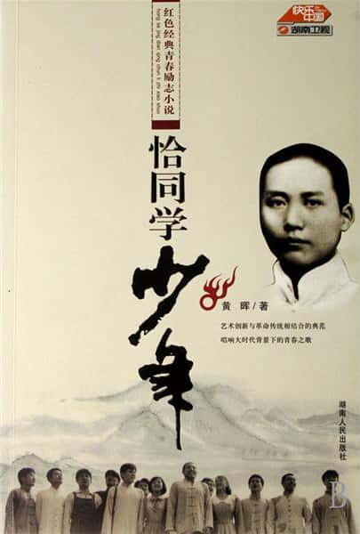

     

# 请支持正版

书名：恰同学少年

作者：黄辉

排版：墨茗

邮箱：1052805965@QQ.COM

本书仅供个人学习之用，请勿用于商业用途。如果觉得好，请购买正版书籍，书中若有错误，望反馈给我，谢谢。

所用字体：方正博雅方刊宋\_GBK、方正黑体\_GBK

# 简 介

小说根据同名电视剧改编，以毛泽东在湖南第一师范五年半的读书生活为主要表现背景，描绘了1913～1918年以毛泽东、蔡和森、向警予、杨开慧、陶斯咏等为代表的一批优秀青年积极进取的学习生活和他们之间纯真美丽的爱情故事，同时塑造了杨昌济、孔昭绶等一批优秀教师形象。深刻揭示了“学生应该怎样读书，教师应该怎样育人”这个与当今社会紧密相关的现实主题，很好展现了毛泽东为代表的一群风华正茂的青年以天下为己任的抱负与情怀。这对社会主义核心价值体系的构建、现行教育理念的完善、当代青年树立正确的理想追求有重大的现实意义。

# 作 者

黄晖，第26届电视“飞天奖”优秀编剧获得者，现居长沙。2007年凭借《恰同学少年》荣获中国电视剧艺术成就最高奖——飞天奖优秀编剧，年末编剧创作的“传奇大戏”《血色湘西》在湖南卫视引起收视狂潮。

2007年，作品《恰同学少年》红遍大江南北，不仅得到普通观众的追捧，同时也受到了国家领导高层的高度关注，黄晖凭此剧一举拿下今年电视“飞天奖”优秀编剧奖。年末，湖南卫视推出他编剧的“传奇大片”《血色湘西》，收视率节节升高。

