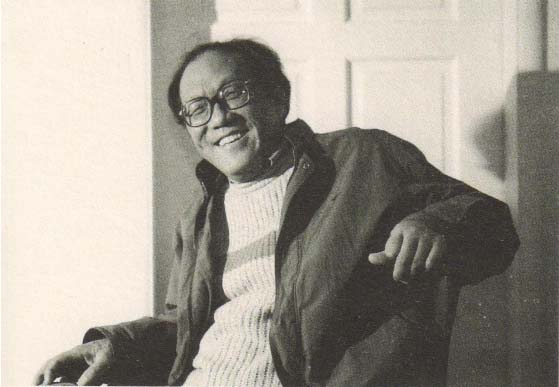
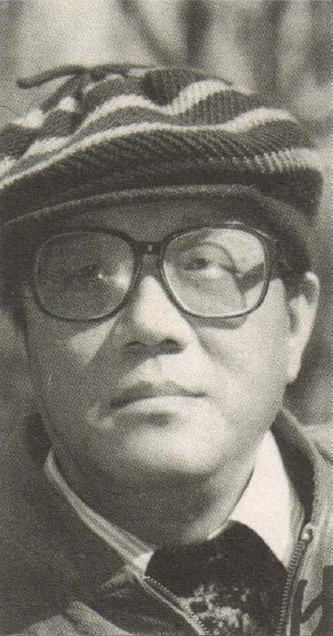

***记忆与印象1***

关于往日，我能写的，只是我的记忆和印象。我无意追踪史实。我不知道追踪到哪儿才能终于追踪到史实；追踪所及，无不是记忆和印象。有位大物理学家说过：“物理学不告诉我们世界是什么，而是告诉我们关于世界我们能够谈论什么。”这话给了我胆量。

轻轻地走与轻轻地来

现在我常有这样的感觉：死神就坐在门外的过道里，坐在幽暗处，凡人看不到的地方，一夜一夜耐心地等我。不知什么时候它就会站起来，对我说：嘿，走吧。我想那必是不由分说。但不管是什么时候，我想我大概仍会觉得有些仓促，但不会犹豫，不会拖延。

“轻轻地我走了，正如我轻轻地来”——我说过，徐志摩这句诗未必牵涉生死，但在我看，却是对生死最恰当的态度，作为墓志铭真是再好也没有。

死，从来不是一次性完成的。陈村有一回对我说：人是一点一点死去的，先是这儿，再是那儿，一步一步终于完成。他说得很平静，我漫不经心地附和，我们都已经活得不那么在意死了。

这就是说，我正在轻轻地走，灵魂正在离开这个残损不堪的躯壳，一步步告别着这个世界。这样的时候，不知别人会怎样想，我则尤其想起轻轻地来的神秘。比如想起清晨、晌午和傍晚变幻的阳光，想起一方蓝天，一个安静的小院，一团扑面而来的柔和的风，风中仿佛从来就有母亲和奶奶轻声的呼唤……不知道别人是否也会像我一样，由衷地惊讶：往日呢？往日的一切都到哪儿去了？

生命的开端最是玄妙，完全的无中生有。好没影儿的忽然你就进入了一种情况，一种情况引出另一种情况，顺理成章天衣无缝，一来二去便连接出一个现实世界。真的很像电影，虚无的银幕上，比如说忽然就有了一个蹲在草丛里玩耍的孩子，太阳照耀他，照耀着远山、近树和草丛中的一条小路。然后孩子玩腻了，沿小路蹒跚地往回走，于是又引出小路尽头的一座房子，门前正在张望他的母亲，埋头于烟斗或报纸的父亲，引出一个家，随后引出一个世界。孩子只是跟随这一系列情况走，有些一闪即逝，有些便成为不可更改的历史，以及不可更改的历史的原因。这样，终于有一天孩子会想起开端的玄妙：无缘无故，正如先哲所言——人是被抛到这个世界上来的。

其实，说“好没影儿的忽然你就进入了一种情况”和“人是被抛到这个世界上来的”，这两句话都有毛病，在“进入情况”之前并没有你，在“被抛到这世界上来”之前也无所谓人。——不过这应该是哲学家的题目。

对我而言，开端，是北京的一个普通四合院。我站在炕上，扶着窗台，透过玻璃看它。屋里有些昏暗，窗外阳光明媚。近处是一排绿油油的榆树矮墙，越过榆树矮墙远处有两棵大枣树，枣树枯黑的枝条镶嵌进蓝天，枣树下是四周静静的窗廊。——与世界最初的相见就是这样，简单，但印象深刻。复杂的世界尚在远方，或者，它就蹲在那安恬的时间四周窃笑，看一个幼稚的生命慢慢睁开眼睛，萌生着欲望。

奶奶和母亲都说过：你就出生在那儿。

其实是出生在离那儿不远的一家医院。生我的时候天降大雪。一天一宿罕见的大雪，路都埋了，奶奶抱着为我准备的铺盖蹚着雪走到医院，走到产房的窗檐下，在那儿站了半宿，天快亮时才听见我轻轻地来了。母亲稍后才看见我来了。奶奶说，母亲为生了那么个丑东西伤心了好久，那时候母亲年轻又漂亮。这件事母亲后来闭口不谈，只说我来的时候“一层黑皮包着骨头”，她这样说的时候已经流露着欣慰，看我渐渐长得像回事了。但这一切都是真的吗？

我蹒跚地走出屋门，走进院子，一个真实的世界才开始提供凭证。太阳晒热的花草的气味，太阳晒热的砖石的气味，阳光在风中舞蹈、流动。青砖铺成的十字甬道连接起四面的房屋，把院子隔成四块均等的土地，两块上面各有一棵枣树，另两块种满了西番莲。西番莲顾自开着硕大的花朵，蜜蜂在层叠的花瓣中间钻进钻出，嗡嗡地开采。蝴蝶悠闲飘逸，飞来飞去，悄无声息仿佛幻影。枣树下落满移动的树影，落满细碎的枣花。青黄的枣花像一层粉，覆盖着地上的青苔，很滑，踩上去要小心。天上，或者是云彩里，有些声音，有些缥缈不知所在的声音——风声？铃声？还是歌声？说不清，很久我都不知道那到底是什么声音，但我一走到那块蓝天下面就听见了他，甚至在襁褓中就已经听见他了。那声音清朗，欢欣，悠悠扬扬，不紧不慢，仿佛是生命固有的召唤，执意要你去注意他，去寻找他、看望他，甚或去投奔他。

我迈过高高的门槛，艰难地走出院门，眼前是一条安静的小街，细长、规整，两三个陌生的身影走过，走向东边的朝阳，走进西边的落日。东边和西边都不知通向哪里，都不知连接着什么，惟那美妙的声音不惊不懈，如风如流……

我永远都看见那条小街，看见一个孩子站在门前的台阶上眺望。朝阳或是落日弄花了他的眼睛，浮起一群黑色的斑点，他闭上眼睛，有点儿怕，不知所措，很久，再睁开眼睛，啊好了，世界又是一片光明……有两个黑衣的僧人在沿街的房檐下悄然走过……几只蜻蜓平稳地盘桓，翅膀上闪动着光芒……鸽哨声时隐时现，平缓，悠长，渐渐地近了，扑噜噜飞过头顶，又渐渐远了，在天边像一团飞舞的纸屑……这是件奇怪的事，我既看见我的眺望，又看见我在眺望。

那些情景如今都到哪儿去了？那时刻，那孩子，那样的心情，惊奇和痴迷的目光，一切往日情景，都到哪儿去了？它们飘进了宇宙，是呀，飘去五十年了。但这是不是说，它们只不过飘离了此时此地，其实它们依然存在？

梦是什么？回忆，是怎么一回事？

倘若在五十光年之外有一架倍数足够大的望远镜，有一个观察点，料必那些情景便依然如故，那条小街，小街上空的鸽群，两个无名的僧人，蜻蜓翅膀上的闪光和那个痴迷的孩子，还有天空中美妙的声音，便一如既往。如果那望远镜以光的速度继续跟随，那个孩子便永远都站在那条小街上，痴迷地眺望。要是那望远镜停下来，停在五十光年之外的某个地方，我的一生就会依次重现，五十年的历史便将从头上演。

真是神奇。很可能，生和死都不过取决于观察，取决于观察的远与近。比如，当一颗距离我们数十万光年的星星实际早已熄灭，它却正在我们的视野里度着它的青年时光。

时间限制了我们，习惯限制了我们，谣言般的舆论让我们陷于实际，让我们在白昼的魔法中闭目塞听不敢妄为。白昼是一种魔法，一种符咒，让僵死的规则畅行无阻，让实际消磨掉神奇。所有的人都在白昼的魔法之下扮演着紧张、呆板的角色，一切言谈举止，一切思绪与梦想，都仿佛被预设的程序所圈定。

因而我盼望夜晚，盼望黑夜，盼望寂静中自由的到来。

甚至盼望站到死中，去看生。

我的躯体早已被固定在床上，固定在轮椅中，但我的心魂常在黑夜出行，脱离开残废的躯壳，脱离白昼的魔法，脱离实际，在尘嚣稍息的夜的世界里游逛，听所有的梦者诉说，看所有放弃了尘世角色的游魂在夜的天空和旷野中揭开另一种戏剧。风，四处游走，串联起夜的消息，从沉睡的窗口到沉睡的窗口，去探望被白昼忽略了的心情。另一种世界，蓬蓬勃勃，夜的声音无比辽阔。是呀，那才是写作啊。至于文学，我说过我跟它好像不大沾边儿，我一心向往的只是这自由的夜行，去到一切心魂的由衷的所在。

你能够与我一同笑看

**消逝的钟声**

站在台阶上张望那条小街的时候，我大约两岁多。

我记事早。我记事早的一个标记，是斯大林的死。有一天父亲把一个黑色镜框挂在墙上，奶奶抱着我走近看，说：斯大林死了。镜框中是一个陌生的老头儿，突出的特点是胡子都集中在上唇。在奶奶的涿州口音中，“斯”读三声。我心想，既如此还有什么好说，这个“大林”当然是死的呀？我不断重复奶奶的话，把“斯”读成三声，觉得有趣，觉得别人竟然都没有发现这一点可真是奇怪。多年以后我才知道，那是一九五三年，那年我两岁。

终于有一天奶奶领我走下台阶，走向小街的东端。我一直猜想那儿就是地的尽头，世界将在那儿陷落、消失——因为太阳从那儿爬上来的时候，它的背后好像什么也没有。谁料，那儿更像是一个喧闹的世界的开端。那儿交叉着另一条小街，那街上有酒馆，有杂货铺，有油坊、粮店和小吃摊；因为有小吃摊，那儿成为我多年之中最向往的去处。那儿还有从城外走来的骆驼队。“什么呀，奶奶？”“啊，骆驼。”“干吗呢，它们？”“驮煤。”“驮到哪儿去呀？”“驮进城里。”驼铃一路叮铃当啷叮铃当啷地响，骆驼的大脚蹚起尘土，昂首挺胸目空一切，七八头骆驼不紧不慢招摇过市，行人和车马都给它让路。我望着骆驼来的方向问：“那儿是哪儿？”奶奶说：“再往北就出城啦。”“出城了是哪儿呀？”“是城外。”“城外什么样儿？”“行了，别问啦！”我很想去看看城外，可奶奶领我朝另一个方向走。我说“不，我想去城外”，我说“奶奶我想去城外看看”，我不走了，蹲在地上不起来。奶奶拉起我往前走，我就哭。“奶奶带你去个更好玩儿的地方不好吗？那儿有好些小朋友……”我不听，一路哭。

越走越有些荒疏了，房屋零乱，住户也渐渐稀少。沿一道灰色的砖墙走了好一会儿，进了一个大门。啊，大门里豁然开朗完全是另一番景象：大片大片寂静的树林，碎石小路蜿蜒其间。满地的败叶在风中滚动，踩上去吱吱作响。麻雀和灰喜鹊在林中草地上蹦蹦跳跳，坦然觅食。我止住哭声。我平生第一次看见了教堂，细密如烟的树枝后面，夕阳正染红了它的尖顶。

我跟着奶奶进了一座拱门，穿过长廊，走进一间宽大的房子。那儿有很多孩子，他们坐在高大的桌子后面只能露出脸。他们在唱歌。一个穿长袍的大胡子老头儿弹响风琴，琴声飘荡，满屋子里的阳光好像也随之飞扬起来。奶奶拉着我退出去，退到门口。唱歌的孩子里面有我的堂兄，他看见了我们但不走过来，惟努力地唱歌。那样的琴声和歌声我从未听过，宁静又欢欣，一排排古旧的桌椅、沉暗的墙壁、高阔的屋顶也似都活泼起来，与窗外的晴空和树林连成一气。那一刻的感受我终生难忘，仿佛有一股温柔又强劲的风吹透了我的身体，一下子钻进我的心中。后来奶奶常对别人说：“琴声一响，这孩子就傻了似的不哭也不闹了。”我多么羡慕我的堂兄，羡慕所有那些孩子，羡慕那一刻的光线与声音，有形与无形。我呆呆地站着，徒然地睁大眼睛，其实不能听也不能看了，有个懵懂的东西第一次被惊动了——那也许就是灵魂吧。后来的事都记不大清了，好像那个大胡子的老头儿走过来摸了摸我的头，然后光线就暗下去，屋子里的孩子都没有了，再后来我和奶奶又走在那片树林里了，还有我的堂兄。堂兄把一个纸袋撕开，掏出一个彩蛋和几颗糖果，说是幼儿园给的圣诞礼物。

这时候，晚祈的钟声敲响了——唔，就是这声音，就是他！这就是我曾听到过的那种缥缥缈缈响在天空里的声音啊！

“它在哪儿呀，奶奶？”

“什么，你说什么？”

“这声音啊，奶奶，这声音我听见过。”

“钟声吗？啊，就在那钟楼的尖顶下面。”

这时我才知道，我一来到世上就听到的那种声音就是这教堂的钟声，就是从那尖顶下发出的。暮色浓重了，钟楼的尖顶上已经没有了阳光。风过树林，带走了麻雀和灰喜鹊的欢叫。钟声沉稳、悠扬、飘飘荡荡，连接起晚霞与初月，扩展到天的深处，或地的尽头……

不知奶奶那天为什么要带我到那儿去，以及后来为什么再也没去过。

不知何时，天空中的钟声已经停止，并且在这块土地上长久地消逝了。

多年以后我才知道，那教堂和幼儿园在我们去过之后不久便都拆除。我想，奶奶当年带我到那儿去，必是想在那幼儿园也给我报个名，但未如愿。

再次听见那样的钟声是在四十年以后了。那年，我和妻子坐了八九个小时飞机，到了地球另一面，到了一座美丽的城市，一走进那座城市我就听见了他。在清洁的空气里，在透彻的阳光中和涌动的海浪上面，在安静的小街，在那座城市的所有地方，随时都听见他在自由地飘荡。我和妻子在那钟声中慢慢地走，认真地听他，我好像一下子回到了童年，整个世界都好像回到了童年。对于故乡，我忽然有了新的理解：人的故乡，并不止于一块特定的土地，而是一种辽阔无比的心情，不受空间和时间的限制；这心情一经唤起，就是你已经回到了故乡。

**我的幼儿园**

五岁，或者六岁，我上了幼儿园。有一天母亲跟奶奶说：“这孩子还是得上幼儿园，要不将来上小学会不适应。”说罢她就跑出去打听，看看哪个幼儿园还招生。用奶奶的话说，她从来就这样，想起一出是一出。很快母亲就打听到了一所幼儿园，刚开办不久，离家也近。母亲跟奶奶说时，有句话让我纳闷儿：那是两个老姑娘办的。

母亲带我去报名时天色已晚，幼儿园的大门已闭。母亲敲门时，我从门缝朝里望：一个安静的院子，某一处屋檐下放着两只崭新的木马。两只木马令我心花怒放。母亲问我：“想不想来？”我坚定地点头。开门的是个老太太，她把我们引进一间小屋，小屋里还有一个老太太正在做晚饭。小屋里除两张床之外只放得下一张桌子和一个火炉。母亲让我管胖些并且戴眼镜的那个叫孙老师，管另一个瘦些的叫苏老师。

我很久都弄不懂，为什么单要把这两个老太太叫老姑娘？我问母亲：“奶奶为什么不是老姑娘？”母亲说：“没结过婚的女人才是老姑娘，奶奶结过婚。”可我心里并不接受这样的解释。结婚嘛，不过发几块糖给众人吃吃，就能有什么特别的作用吗？在我想来，女人年轻时都是姑娘，老了就都是老太太，怎么会有“老姑娘”这不伦不类的称呼？我又问母亲：“你给大伙儿买过糖了吗？”母亲说：“为什么？我为什么要给大伙儿买糖？”“那你结过婚吗？”母亲大笑，揪揪我的耳朵：“我没结过婚就敢有你了吗？”我越糊涂了，怎么又扯上我了呢？

这幼儿园远不如我的期待。四间北屋甚至还住着一户人家，是房东。南屋空着。只东西两面是教室，教室里除去一块黑板连桌椅也没有，孩子们每天来时都要自带小板凳。小板凳高高低低，二十几个孩子也是高高低低，大的七岁，小的三岁。上课时大的喊小的哭，老师呵斥了这个哄那个，基本乱套。上课则永远是讲故事。“上回讲到哪儿啦？”孩子们齐声回答：“大——灰——狼——要——吃——小——山——羊——啦！”通常此刻必有人举手，憋不住尿了，或者其实已经尿完。一个故事断断续续要讲上好几天。“上回讲到哪儿啦？”“不——听——话——的——小——山——羊——被——吃——掉——啦！”

下了课一窝蜂都去抢那两只木马，你推我搡，没有谁能真正骑上去。大些的孩子于是发明出另一种游戏，“骑马打仗”：一个背上一个，冲呀杀呀喊声震天，人仰马翻者为败。两个老太太——还是按我的理解叫她们吧——心惊胆战满院子里追着喊：“不兴这样，可不兴这样啊，看摔坏了！看把刘奶奶的花踩了！”刘奶奶，即房东，想不懂她怎么能容忍在自家院子里办幼儿园。但“骑马打仗”正是热火朝天，这边战火方歇，那边烽烟又起。这本来很好玩，可不知怎么一来，又有了惩罚战俘的规则。落马者仅被视为败军之将岂不太便宜了？所以还要被敲脑蹦儿，或者连人带马归顺敌方。这样就又有了叛徒，以及对叛徒的更为严厉的惩罚。叛徒一旦被捉回，就由两个人押着，倒背双手“游街示众”，一路被人揪头发、拧耳朵。天知道为什么这惩罚竟至比“骑马打仗”本身更具诱惑了，到后来，无需“骑马打仗”，直接就玩起这惩罚的游戏。可谁是被惩罚者呢？便涌现出一两个头领，由他们说了算，他们说谁是叛徒谁就是叛徒，谁是叛徒谁当然就要受到惩罚。于是，人性，在那时就已暴露：为了免遭惩罚，大家纷纷去效忠那一两个头领，阿谀，谄媚，惟比成年人来得直率。可是！可是这游戏要玩下去总是得有被惩罚者呀。可怕的日子终于到了。可怕的日子就像增长着的年龄一样，必然来临。

做叛徒要比做俘虏可怕多了。俘虏尚可表现忠勇，希望未来；叛徒则是彻底无望，忽然间大家都把你抛弃了。五岁或者六岁，我已经见到了人间这一种最无助的处境。这时你惟一的祈祷就是那两个老太太快来吧，快来结束这荒唐的游戏吧。但你终会发现，这惩罚并不随着她们的制止而结束，这惩罚扩散进所有的时间，扩散到所有孩子的脸上和心里。轻轻的然而是严酷的拒斥，像一种季风，细密无声从白昼吹入夜梦，无从逃脱，无处诉告，且不知其由来，直到它忽然转向，如同莫测的天气，莫测的命运，忽然放开你，调头去捉弄另一个孩子。

我不再想去幼儿园。我害怕早晨，盼望傍晚。我开始装病，开始想尽办法留在家里跟着奶奶，想出种种理由不去幼儿园。直到现在，我一看见那些哭喊着不要去幼儿园的孩子，心里就发抖，设想他们的幼儿园里也有那样可怕的游戏，响晴白日也觉有鬼魅徘徊。

幼儿园实在没给我留下什么美好印象。倒是那两个老太太一直在我的记忆里，一个胖些，一个瘦些，都那么慈祥，都那么忙碌、慌张。她们怕哪个孩子摔了碰了，怕弄坏了房东刘奶奶的花，总是吊着一颗心。但除了这样的怕，我总觉得，在她们心底，在不易觉察的慌张后面，还有另外的怕。另外的怕是什么呢？说不清，但一定更沉重。

长大以后我有时猜想她们的身世。她们可能是表姐妹，也可能只是自幼的好友。她们一定都受过良好的教育——她们都弹得一手好风琴，似可证明。我刚到那幼儿园的时候，就总听她们向孩子们许愿：“咱们就要买一架风琴了，幼儿园很快就会有一架风琴了，慢慢儿地幼儿园还会添置很多玩具呢，小朋友们高不高兴呀？”“高——兴！”就在我离开那儿之前不久，风琴果然买回来了。两个老太太视之如珍宝，把它轻轻抬进院门，把它上上下下擦得锃亮，把它安放在教室中最醒目的地方，孩子们围在四周屏住呼吸，然后苏老师和孙老师互相推让，然后孩子们等不及了开始嘁嘁嚓嚓地乱说，然后孙老师在风琴前庄重地坐下，孩子们的包围圈越收越紧，然后琴声响了孩子们欢呼起来，苏老师微笑着举起一个手指：“嘘——嘘——”满屋子里就又都静下来，孩子们忍住惊叹可是忍不住眼睛里的激动……那天不再讲故事，光是听苏老师和孙老师轮流着弹琴，唱歌。那时我才发觉她们与一般的老太太确有不同，脸上的每一条皱纹里都涌现着天真。那琴声我现在还能听见。现在，每遇天真纯洁的事物，那琴声便似一缕缕飘来，在我眼前，在我心里，幻现出一片阳光，像那琴键一样地跳动。我想她们必是生长在一个很有文化的家庭。我想她们的父母一定温文尔雅善解人意。她们就在那样的琴声中长大，虽偶有轻风细雨，但总归晴天朗照。这样的女人，年轻时不可能不对爱情抱着神圣的期待，甚至难免极端，不入时俗。她们窃窃描画未来，相互说些脸红心跳的话。所谓未来，主要是一个即将不知从哪儿向她们走来的男人。这个人已在书中显露端倪，在装帧精良的文学名著里面若隐若现。不会是言情小说中的公子哥。可能会是，比如说托尔斯泰笔下的人物，但绝不是渥伦斯基或卡列宁一类。然而，对未来的描画总不能清晰，不断地描画年复一年耗损着她们的青春。用“革命人民”的话说：她们真正是“小布尔乔亚”之极，在那风起云涌的年代里做着与世隔绝的小资产阶级温情梦。大概会是这样。也许就是这样。假定是这样吧，但是忽然！忽然间社会天翻地覆地变化了。那变化具体是怎样侵扰到她们的生活的，很难想像，但估计也不会有什么过于特别的地方，像所有衰败的中产阶级家庭一样，小姐们惟惊恐万状、睁大了眼睛发现必须要过另一种日子了。颠沛流离，投亲靠友，节衣缩食，随波逐流，像在失去了方向的大海上体会着沉浮与炎凉……然后，有一天时局似乎稳定了，不过未来明显已不能再像以往那样任性地描画。以往的描画如同一叠精心保存的旧钞，虽已无用，但一时还舍不得扔掉，独身主义大约就是在那时从无奈走向了坚定。她们都还收藏着一点儿值钱的东西，但全部集中起来也并不很多，算来算去也算不出什么万全之策，惟知未来的生活全系于此。就这样，现实的严峻联合起往日的浪漫，终于灵机一动：办一所幼儿园吧。天真烂漫的孩子就是鼓舞，就是信心和欢乐。幼儿园吗？对，幼儿园！与世无争，安贫乐命，倾余生之全力浇灌并不属于我们的未来，是吗？两个老姑娘仿佛终于找回了家园，云遮雾障半个多世纪，她们终于听见了命运慷慨的应许。然后她们租了一处房子，简单粉刷一下，买了两块黑板和一对木马，其余的东西都等以后再说吧，当然是钱的问题……

小学快毕业的时候，我回那幼儿园去看过一回。果然，转椅、滑梯、攀登架都有了，教室里桌椅齐备，孩子也比以前多出几倍。房东刘奶奶家已经迁走。一个年轻女老师在北屋的廊下弹着风琴，孩子们在院子里随着琴声排练节目。一间南屋改作厨房，孩子们可以在幼儿园用餐了。那个年轻女老师问我：“你找谁？”我说：“苏老师和孙老师呢？”“她们呀？已经退休了。”我回家告诉母亲，母亲说哪是什么退休呀，是她们的出身和阶级成分不适合教育工作。后来“文革”开始了，又听说她们都被遣送回原籍。

“文革”进行到无可奈何之时，有一天我在街上碰见孙老师。她的头发有些乱，直着眼睛走路，仍然匆忙、慌张。我叫了她一声，她站住，茫然地看我。我说出我的名字，“您不记得我了？”她脸上死了一样，好半天，忽然活过来：“啊，是你呀，哎呀哎呀，那回可真是把你给冤枉了呀。”我故作惊讶状：“冤枉了？我？”其实我已经知道她指的是什么。“可事后你就不来了。苏老师跟我说，这可真是把那孩子的心伤重了吧？”

那是我临上小学前不久的事。在东屋教室门前，一群孩子往里冲，另一群孩子顶住门不让进，并不为什么，只是一种游戏。我在要冲进来的一群中，使劲推门，忽然门缝把我的手指压住了，疼极之下我用力一脚把门踹开，不料把一个女孩儿撞得仰面朝天。女孩儿鼻子流血，头上起了个包，不停地哭。苏老师过来哄她，同时罚我的站。我站在窗前看别的孩子们上课，心里委屈，就用蜡笔在糊了白纸的窗棂上乱画，画一个老太太，在旁边注明一个“苏”字。待苏老师发现时，雪白的窗棂已布满一个个老太太和一个个“苏”。苏老师颤抖着嘴唇，只说得出一句话：“那可是我和孙老师俩人糊了好几天的呀……”此后我就告别了幼儿园，理由是马上就要上小学了，其实呢，我是不敢再见那窗棂。

孙老师并没有太大变化，惟头发白了些，往日的慈祥也都并入慌张。我问：“苏老师呢，她好吗？”孙老师抬眼看我的头顶，揣测我的年龄，然后以对一个成年人的语气轻声对我说：“我们都结了婚，各人忙各人的家呢。”我以为以我的年龄不合适再问下去，但从此心里常想，那会是怎样的男人和怎样的家呢？譬如说，与她们早年的期待是否相符？与那阳光似的琴声能否和谐？

**二　姥　姥**

由于幼儿园里的那两个老太太，我总想起另一个女人。不不，她们之间从无来往，她与孙老师和苏老师素不相识。但是在我的印象里，她总是与她们一起出现，仿佛彼此的影子。

这女人，我管她叫“二姥姥”。不知怎么，我一直想写写她。

可是，真要写了，才发现，关于二姥姥我其实知道的很少。她不过在我的童年中一闪而过。我甚至不知道她的名字，母亲在世时我应该问过，但早已忘记。母亲去世后，那个名字就永远地熄灭了；那个名字之下的历史，那个名字之下的愿望，都已消散得无影无踪，如同从不存在。我问过父亲：“我叫二姥姥的那个人，叫什么名字？”父亲想了又想，眼睛盯在半空，总好像马上就要找到了，但终于还是没有。我又问舅舅，舅舅忘得同样彻底，惟影影绰绰地听说过，她死于“文革”期间。舅舅惊讶地看着我：“你还能记得她？”

这确实有些奇怪。我与她见面，总共也不会超过十次。我甚至记不得她跟我说过什么，记不得她的声音。她是无声的，黑白的，像一道影子。她穿一件素色旗袍，从幽暗中走出来，迈过一道斜阳，走近我，然后摸摸我的头，理一理我的头发，纤细的手指在我的发间穿插，轻轻地颤抖。仅此而已，其余都已经模糊。直到现在，直到我真要写她了，其实我还不清楚为什么要写她，以及写她的什么。

她不会记得我。我是说，如果她还活着，她肯定也早就把我的名字忘了。但她一定会记得我的母亲。她还可能会记得，我的母亲那时已经有了一个男孩。

母亲带我去看二姥姥，肯定都是我六岁以前的事，或者更早，因为上幼儿园之后我就再没见过她。她很漂亮吗？算不上很，但还是漂亮，举止娴静，从头到脚一尘不染。她住在北京的哪儿我也记不得了，印象里是个简陋的小院，简陋但是清静，什么地方有棵石榴树，飘落着鲜红的花瓣，她住在院子拐角处的一间小屋。惟近傍晚，阳光才艰难地转进那间小屋，投下一道浅淡的斜阳。她就从那斜阳后面的幽暗中出来，迎着我们。母亲于是说：“叫二姥姥，叫呀？”我叫：“二姥姥。”她便走到我跟前，摸摸我的头。我看不到她的脸，但我知道她脸上是微笑，微笑后面是惶恐。那惶恐并不是因为我们的到来，从她手上冰凉而沉缓的颤抖中我明白，那惶恐是在更为深隐的地方，或是由于更为悠远的领域。那种颤抖，精致到不能用理智去分辨，惟凭孩子混沌的心可以洞察。

也许，就是这颤抖，让我记住她。也许，关于她，我能够写的也只有这颤抖。这颤抖是一种诉说，如同一个寓言可以伸展进所有幽深的地方，出其不意地令人震撼。这颤抖是一种最为辽阔的声音，譬如夜的流动，毫不停歇。这颤抖，随时间之流拓开着一个孩子浑沌的心灵，连接起别人的故事，缠绕进丰富的历史，漫漶成种种可能的命运。恐怕就是这样。所以我记住她。未来，在很多令人颤抖的命运旁边，她的影像总是出现，仿佛由众多无声的灵魂所凝聚，由所有被湮灭的心愿所举荐。于是那纤细的手指历经沧桑总在我的发间穿插、颤动，问我这世间的故事都是什么，故事里面都有谁？

二姥姥比母亲大不了几岁。她叫母亲时，叫名字。母亲从不叫她，什么也不叫，说话就说话，避开称谓。母亲不停地跟她说这说那，她简单地应答。母亲走来走去搅乱着那道斜阳，二姥姥仿佛静止在幽暗里，素色的旗袍与幽暗浑成一体，惟苍白的脸表明她在。一动一静，我以此来分辨她们俩。母亲或向她讨教裁剪的技巧，把一块布料在身上比来比去，或在许多彩色的丝线中挑拣，在她的指点下绣花、绣枕头和手帕。有时候她们像在讲什么秘密，目光警惕着我，我走近时母亲的声音就小下去。

好像只有这些。对于二姥姥，我能够描述的就只有这些。她的内心，除了母亲，不大可能还有另外的人知道。但母亲，曾经并不对谁说。

很多年中，我从未想过二姥姥是谁，是我们家的怎样一门亲戚。有一天，毫无缘由地（也可能是我想到，有好几年母亲没带我去看二姥姥了），我忽然问母亲：“二姥姥，她是你的什么人？”母亲似乎猝不及防，一时嗫嚅。我和母亲的目光在离母亲更近的地方碰了一下，我于是看出，我问中了一件非同寻常的事。母亲于是也明白，有些事，不能再躲藏了。

“啊，她是……嗯……”

我不说话，不打断她。

“是你姥爷的……姨太太。你知道，过去……这样的事是有的。”

我和母亲的目光又轻轻地碰了一下，这一回是在离我更近的地方。唔，这就是母亲不再带我去看她的原因吧。

“现在，她呢？”我问。

“不知道。”母亲轻轻地摇头，叹气。

“也许她不愿意我们再去看她，”母亲说，“不过这也好。”

母亲又说：“她应该嫁人了。”

我听不出“应该”二字是指必要，还是指可能。我听不出母亲这句话是宽慰还是忧虑。

“文革”中的一天，母亲从外面回来，对父亲说她在公共汽车上好像看见了二姥姥。

“你肯定没看错？”母亲不回答。母亲洗菜，做饭，不时停下来呆想，说：“是她，没错儿是她。她肯定也看见我了，可她躲开了。”

父亲沉吟了一会儿，安慰母亲：“她是好意，怕连累咱们。”

母亲叹息道：“唉，到底谁连累谁呢……”

那么就是说，这之后不久二姥姥就死了。

**一个人形空白**

我没见过我应该叫他“姥爷”的那个人。他死于我出生前的一次“镇反”之中。

小时候我偶尔听见他，听见“姥爷”这个词，觉得这个词后面相应地应该有一个人。“他在哪儿？”“他已经死了。”这个词于是相应地有了一个人形的空白。时至今日，这空白中仍填画不出具体的音容举止。因此我听说他就像听说非洲，就像听说海底或宇宙黑洞，甚至就像听说死；他只是一个概念，一团无从接近的虚缈的飘动。

但这虚缈并不是无。就像风，风是什么样子？是树的摇动，云的变幻，帽子被刮跑了，或者眼睛让尘沙迷住……因而，姥爷一直都在。任何事物都因言说而在，不过言说也可以是沉默。那人形的空白中常常就是母亲的沉默，是她躲闪的目光和言谈中的警惕，是奶奶救援似的打岔，或者无奈中父亲的谎言。那人形的空白里必定藏着危险，否则为什么它一出现大家就都变得犹豫、沉闷，甚至惊慌？那危险，莫名但是确凿，童年也已感到了它的威胁，所以我从不多问，听凭童年在那样一种风中长大成中国人的成熟。

但当有一天，母亲郑重地对我讲了姥爷的事，那风还是显得突然与猛烈。

那是我刚刚迈进十五岁的时候，早春的一个午后，母亲说：“太阳多好呀，咱们干吗不出去走走？有件事我想得跟你说了。”母亲这么说的时候我已经猜到，那危险终于要露面了。满天的杨花垂垂挂挂，随风摇荡，果然，在那明媚的阳光中传来了那一声枪响。那枪声沉闷之极。整个谈话的过程中，“姥爷”一词从不出现，母亲只说“他”，不用解释我听得懂那是指谁。我不问，只是听。或者其实连听也没听，那枪声隐匿多年终于传进这个下午，懵懵懂懂我知道了童年已不可挽留。童年，在这一时刻漂流进一种叫做“历史”的东西里去了，永不复返。

母亲艰难地讲着，我惟默默地走路。母亲一定大感意外：这孩子怎么会这么镇静？我知道她必是这样想，她的目光在我脸上小心地摸索。我们走过几里长的郊区公路，车马稀疏，人声遥远，满天都是杨花，满地都是杨花的尸体。那时候别的花都还没开，田野一片旷然。

随后的若干年里，这个人，偶尔从亲戚们谨慎的叹息之中跳出来，在那空白里幽灵似的闪现，犹犹豫豫期期艾艾，更加云遮雾罩面目难清——

“他死的时候还不到五十岁吧？别说他没想到，老家的人谁也没想到……”

“那年他让日本人抓了去，打得死去活来，这下大伙儿才知道他是个抗日的呀……”

“后来听说有人把他救了出去。没人知道去了哪儿。日本投降那年，有人说又看见他了，说他领着队伍进了城。我们跑到街上去看，可不是吗？他骑着高头大马跟几个军官走在队伍前头……”

“老人们早都说过，从小就看他是个人才，上学的时候门门儿功课都第一……可惜啦，他参加的是国民党，这国民党可把给他害了……”

“这个人呀，那可真叫是先知先觉！听说过他在村儿里办幼儿园的事吗？自己筹款弄了几间房，办幼儿园，办夜校，挨家挨户去请人家来上课，孩子们都去学唱歌，大人都得去识字，我还让他叫去给夜校讲过课呢……”

“有个算命的说过，这人就是忒能了，刚愎自用，惹下好些人，就怕日后要遭小人算计……”

“快解放时他的大儿子从外头回来，劝他快走，先到别的地方躲躲，躲过这阵子再说，他不听嘛……他说我又没贪赃枉法欺压百姓，共产党顺天意得民心那好嘛，我让位就是，可是你们记住，谁来了我也不跑。我为什么要跑？”

“后来其实没他什么事了，他去了北京，想着是弃政从商踏踏实实做生意去。可是，据说是他当年的一个属下，给他编造了好些个没影儿的事。唉，做人呀，什么时候也不能太得罪了人……”

“其实，只要躲过了那几天，他不会有什么大事，怎么说也不能有死罪……直到大祸临头他也没想到过他能有死罪……抓他的时候他说：行啊，我有什么罪就服什么刑去。”

…………

这里面必定隐匿着一个故事，悲惨的，或者竟是滑稽的故事。但我没有兴致去考证。我不想去调查、去搜集他的行迹。从小我就不敢问这个故事，现在还是不敢——不敢让它成为一个故事。故事有时候是必要的，有时候让人怀疑。故事难免为故事的要求所迫：动人心弦，感人泪下，起伏跌宕，总之它要的是引人入胜。结果呢，它仅仅是一个故事了。一些人真实的困苦变成了另一些人编织的愉快，一个时代的绝望与祈告，变成了另一个时代的潇洒的文字调遣，不能说这不正当，但其间总似拉开着一个巨大的空当，从中走漏了更要紧的东西。

不是更要紧的情节，也不是更要紧的道理，是更要紧的心情。

因此，不敢问，是这个隐匿的故事的要点。

“姥爷”这个词，留下来的不是故事，而是一个隐匿的故事，是我从童年到少年一直到青年的所有惧怕。我记得我从小就蹲在那片虚缈、飘动的人形空白下面，不敢抬头张望。所有童年的游戏里面都有它的阴影，所有的睡梦里都有它的嚣叫。我记得我一懂事便走在它的恐怖之中，所有少年的期待里面都有它在闪动，所有的憧憬之中都有它黑色的翅膀在扑打。阳光里总似潜伏着凄哀，晚风中总似飘荡着它的沉郁，飘荡着姥姥的心惊胆战，母亲的噤若寒蝉，奶奶和父亲的顾左右而言他，二姥姥不知所归的颤抖，乃至幼儿园里那两个老太太的慌张……因此，我不敢让它成为一个故事。我怕它一旦成为故事就永远只是一个故事了。而那片虚缈的飘动未必是要求着一个具体的形象，未必是要求着情节，多么悲惨和荒诞的情节都不会有什么新意，它在要求祈祷。多少代人的迷茫与寻觅，仇恨与歧途，年轻与衰老，最终所能要求的都是：祈祷。

有一年我从电视中看见，一个懂得忏悔的人，走到被纳粹杀害的犹太人墓前，双腿下跪，我于是知道忏悔不应当只是一代人的心情。有一年，我又从电视中看见，一个懂得祈祷的人走到二战德国阵亡士兵的墓前默立哀悼，我于是看见了祈祷的全部方向。

姥姥给我留下的记忆很少。姥姥不识字，脚比奶奶的还要小，她一直住在乡下，住在涿州老家。我小的时候母亲偶尔把她接来，她来了便盘腿坐在床上，整天整天地纳鞋底，上鞋帮，缝棉衣和棉被，一边重复着机械的动作一边给我讲些妖魔鬼怪的故事。母亲听见她讲那些故事，便来制止：“哎呀，别老讲那些迷信的玩艺儿行不行？”姥姥惭愧地笑笑，然后郑重地对我说，“你妈说得对，要好好念书，念好书将来做大官。”母亲哭笑不得：“哎呀哎呀，我这么说了吗？”姥姥再次抱歉地笑，抬头看四周，看玻璃上的夕阳，看院子里满树盛开的海棠花，再低下头去看手中的针线，把笑和笑中的迷茫都咽回肚里去……

现在我常想，姥姥知不知道二姥姥的存在呢？照理说她应该知道，可在我的记忆里她对此好像没有任何态度，笑骂也无，恨怨也无。也许这正是她的德性，或者正是她的无奈。姥姥的婚姻完全由父母包办，姥爷对她真正是一个空白的人形：她见到姥爷之前姥爷是个不确定的人形；见到姥爷之后，那人形已不可更改。那个空白的人形，有二姥姥可以使之嬉笑怒骂声色俱全。姥姥呢，她的快乐和盼望在哪儿？针针线线她从一个小姑娘长成了女人，吹吹打打那个人形来了，张灯结彩他们拜了堂成了亲，那个人形把她娶下并使她生养了几个孩子，然后呢，却连那人形也不常见，依然是针针线线度着时光。也不知道那人形在外面都干了些什么，忽然一声枪响，她一向空白的世界里惟活生生地跳出了恐怖和屈辱，至死难逃……

母亲呢，则因此没上成大学。那声枪响之后母亲生下了我，其时父亲大学尚未毕业，为了生计母亲去读了一个会计速成学校。母亲的愿望其实很多。我双腿瘫痪后悄悄地学写作，母亲知道了，跟我说，她年轻时的理想也是写作。这样说时，我见她脸上的笑与姥姥当年的一模一样，也是那样惭愧地张望四周，看窗上的夕阳，看院中的老海棠树。但老海棠树已经枯死，枝干上爬满豆蔓，开着单薄的豆花。

母亲说，她中学时的作文总是被老师当做范文给全班同学朗读。母亲说，班上还有个作文写得好的，是个男同学。“前些天咱们看的那个电影，编剧可能就是他。”“可能？为什么？”“反正那编剧的姓名跟他一字不差。”有一天家里来了个客人，偏巧认识那个编剧，母亲便细细询问：性别、年龄、民族，都对；身材相貌也不与当年那个少年可能的发展相悖。母亲就又急慌慌地问：“他的老家呢，是不是涿州？”这一回客人含笑摇头。母亲说：“那您有机会给问问……”我喊起来：“问什么问！”母亲的意思是想给我找个老师，我的意思是滚他妈的什么老师吧！——那时我刚坐进轮椅，一副受压迫者的病态心理。

有一年作协开会，我从“与会作家名录”上知道了那个人的籍贯：河北涿州。其时母亲已经去世。忽然一个念头撞进我心里：母亲单是想给我找个老师吗？

母亲漂亮，且天性浪漫，那声枪响之后她的很多梦想都随之消散了。然而那枪声却一直都不消散。“文化革命”如火如荼之时，有一天我去找她，办公室里只她一个人在埋头扒拉算盘。“怎么就您一个？”“都去造反了。”“不让您去？”“别瞎说，是我自己要干的。有人抓革命，也得有人促生产呀？”很久以后我才听懂，这是那声枪响磨砺出的明智——凭母亲的出身，万勿沾惹政治才是平安之策。那天我跟母亲说我要走了，大串联去。“去哪儿？”“全国，管他哪儿。”我满腔豪情满怀诗意。母亲给了我十五块钱——十块整的一针一线给我缝在内衣上，五块零钱（一个两元、两个一元和十张一角的）分放在外衣的几个衣兜里。“那我就走了，”我说。母亲抓住我，看着我的眼睛：“有些事，我是说咱自己家里的事，懂吗？不一定要跟别人说。”我点点头，豪情和诗意消散大半。母亲仍不放手：“记住，跟谁也别说，跟你最要好的同学也别说。倒不是要隐瞒什么，只不过……只不过是没那个必要……”

又过了很多年，有人从老家带来一份县志，上面竟有几篇对姥爷的颂扬文字，使那空白的人形有了一点儿确定的形象。文中说到他的抗日功劳，说到他的教育成就，余者不提。那时姥姥和母亲早都不在人间，奶奶和父亲也已去世。那时，大舅从几十年杳无音信之中忽然回来，一头白发，满面沧桑。大舅捧着那县志，半天不说话，惟手和脸簌簌地抖。

**叛　逆　者**

姥爷还在国民党中做官的时候，大舅已离家出走参加了解放军。不过我猜想，这父子俩除去主义不同，政见各异，彼此肯定是看重的。所以我从未听说过姥爷对大舅的叛逆有多么愤怒。所以，解放前夕大舅也曾跑回老家，劝姥爷出去避一避风头。

姥爷死后，大舅再没回过老家。我记得姥姥坐在床上纳鞋底时常常念叨他，夸他聪明，英俊，性情仁义。母亲也是这样说。母亲说，她和大舅从小就最谈得来。

四五岁时我见过一次大舅。有一天我正在院子里玩，院门外大步流星走来了一个青年军官。他走到我跟前，弯下腰来仔细看我：“嘿，你是谁呀？”现在我可以说，他那样子真可谓光彩照人，但当时我找不出这样的形容，惟被他的勃勃英气惊呆在那儿。呆愣了一会儿，我往屋里跑，身后响起他爽朗的大笑。母亲迎出门来，母亲看着他也愣了一会儿，然后就被他搂进臂弯，我记得那一刻母亲忽然变得像个小姑娘了……然后他们一起走进屋里……然后他送给母亲一个漂亮的皮包，米色的，真皮的，母亲喜欢得不得了，以后的几十年里只在最庄重的场合母亲才背上它……再然后是一个星期天，我们一起到中山公园去，在老柏树摇动的浓荫里，大舅和母亲没完没了地走呀，走呀，没完没了地说。我追在他们身后跑，满头大汗，又累又无聊。午饭时我坐在他俩中间，我听见他们在说姥姥，说老家，说着一些往事。最后，母亲说：“你就不想回老家去看看？”母亲望着大舅，目光里有些严厉又有些凄哀。大舅不回答。大舅跟我说着笑话，对母亲的问题“哼哼咳咳”不置可否。我说过我记事早。我记得那天春风和煦，柳絮飞扬；我记得那顿午饭空前丰盛，从未见过的美味佳肴，我埋头大吃；我记得，我一直担心着那个空白的人形会闯进来危及这美妙时光，但还好，那天他们没有说起“他”。

那天以后大舅即告消失，几十年音信全无。

一年又一年，母亲越来越多地念起他：“也不知道他现在在哪儿？”听得出，母亲已经不再那么怪他了。母亲说他做的是保密工作，研究武器的，身不由己。母亲偶尔回老家去从不带着我，想必也是怕我挨近那片危险——这不会不使她体谅了大舅。为了当年对大舅的严厉，想必母亲是有些后悔。“这么多年，他怎么也不给我来封信呢？”母亲为此黯然神伤。

大舅早年的离家出走，据说很有些逃婚的因素，他的婚姻也是由家里包办的。“我姥爷包办的？”“不，是你太姥爷的意思。”大舅是长孙，他的婚事太姥爷要亲自安排，这关系到此一家族的辽阔土地能否有一个可靠的未来。这件事谁也别插嘴，姥爷也不行——别看你当着个破官；土地！懂吗？在太姥爷眼里那才是真东西。

太姥爷，一个典型的中国地主。中国的地主并非都像“黄世仁”。在我浅淡的记忆里，太姥爷须发全白，枯瘦，步履蹒跚，衣着破旧而且邋遢。因为那时他已是一无所有了吧？也不是。母亲说：“他从来就那样，有几千亩地的时候也是那样。出门赶集，见路边的一泡牛粪他也要兜在衣襟里捡回来，抖落到自家地里。”他只看重一种东西：地。“周扒皮”那样的地主一定会让他笑话，你把长工都得罪了就不怕人家糟蹋你的地？就不怕你的地里长不出好庄稼？太姥爷比“周扒皮”有远见，对长工们从不怠慢。既不敢怠慢，又舍不得给人家吃好的，于是长工们吃什么他也就跟着一起吃什么，甚至长工们剩下的东西他也要再利用一遍，以自家之肠胃将其酿成自家地里的肥。“同吃同住同劳动”一类的倡导看来并不是什么新发明。太姥爷守望着他的地，盼望年年都能收获很多粮食。很多粮食卖出很多钱，很多钱再买下很多地，很多地里再长出很多粮食……如此循环再循环，到底为了什么他不问。他梦想着有更多的土地姓他的姓，但是为什么呢？天经地义，他从未想过这里面还会有个“为什么”。而他自己呢？最风光的时候，也不过是一个坐在自己的土地中央的邋里邋遢的瘦老头。

这才是中国地主的典型形象吧。我的爷爷，太爷，老太爷，乃至老老太爷都是地主，据说无一例外莫不如此，一脑袋高粱花子，中着土地的魔。但再往上数，到老老老太爷，到老老老老……太爷，总归有一站曾经是穷人，穷得叮当响，从什么什么地方逃荒到了此地，然后如何如何克勤克俭，慢慢富足起来——这也是中国地主所常有的、牢记于心的家史。

不过，在我的记忆里，这瘦老头对我倒是格外亲切，我的要求他一概满足，我的一切非分之想他都容忍，甚至我的一蹦一跳都让他牵心挂肚。每逢年节，他从老家来北京看我（母亲说过，他主要是想看看我），带来乡下的土产，带来一些小饰物给我挂在脖子上，带来特意在城里买的点心，一点儿一点儿地掰着给我吃……他双臂颤巍巍地围拢我，不敢抱紧又不敢放松，好像一不留神我就会化作一缕青烟飞散。料必是因为他的长子已然夭折，他的长孙又远走他乡，而他的晚辈中我是惟一还不懂得与他划清界限的男人。而这个小男人，以其孩子特有的敏锐早已觉察到，他可以对这个老头颐指气使为所欲为。我在他怀中又踢又打胡作非为，要是母亲来制止，我只需加倍喊叫，母亲就只好躲到一边去忍气吞声。我要是高兴捋捋这老头的胡须，或漫不经心地叫他一声“太姥爷”，他便会眉开眼笑得到最大的满足。但是我不能满足他总想亲亲我的企图——他那么瘦，又那么邋遢。

大舅抗婚不成，便住到学校去不回家。暑假到了，不得不回家了，据说大舅回到家就一个人抱着铺盖睡到屋顶上去。我想姥爷一定是同情他的，但爱莫能助。我想大舅母一定只有悄然落泪，或许比她的婆婆多了一些觉醒，果真这样也就比她的婆婆更多了一层折磨。太姥爷呢，必定是大发雷霆。我想像不出，那样一个瘦老头何以会有如此威严，竟至姥爷和大舅也都只好俯首听命。大舅必定是忍无可忍，于是下决心离家出走，与这个封建之家一刀两断……

那大约已是四十年代中期的事，共产主义的烽火正以燎原之势遍及全国。

天下大同，那其实是人类最为悠久的梦想，惟于其时其地这梦想已不满足于仅仅是梦想，从祈祷变为实际（另一种说法是“由空想变成科学”），风展红旗如画，统一思想统一步伐奔向被许诺为必将实现的人间天堂。

四十多年过去，大舅回来了，出现在我面前的是一个白发驼背的老人。记得第一次见到他时他弯下腰来问我：“嘿，你是谁？”那时我刚来到人间不久。现在轮到我问他了：你是谁？我确实在心里这样问着：你就是那个光彩照人的青年军官吗？我慢慢看他，寻找当年的踪影。但是，那个大步流星的大舅已随时间走失，换成一个步履迟缓的陌生人回来了。我们互相通报了身份，然后一起吃饭，喝茶，在陌生中寻找往日的亲情。我说起那个春天，说起在中山公园的那顿午餐，他睁大眼睛问我：“那时有你吗？”我说：“我跟在你们后头跑，只记得到处飘着柳絮，是哪一年可记不清了。”终于，不可避免地我们说到了母亲，大舅的泪水夺眶而出，泣不成声。他要我把母亲的照片拿给他，这愿望想必已在他心里存了很久，只不敢轻易触动。他捧着母亲的照片，对我的表妹说：“看看姑姑有多漂亮，我没瞎说吧？”

这么多年他都在哪儿，都是怎么过来的？母亲若在世，一定是要这样问的。我想还是不问吧。他也只说了一句，但这一句却是我怎么也没料到的——“这些年，在外边，我尽受欺负了。”是呀是呀，真正是回家的感觉，但这里面必有很多为猜想所不及的、由分分秒秒所构筑的实际内容。

那四十多年，要是我愿意我是可以去问个究竟的，他现在住得离我并不太远。但我宁愿保留住猜想。这也许是因为，描摹实际并不是写作的根本期冀。

他早已退休，现在整天都在家里，从早到晚伺候着患老年痴呆症的舅母。还是当年的那个舅母，那个为他流泪多年的人。他离家时不过二十出头吧，走了很多年，走了很多地方，想必也走过了很多情感，很多的希望与失望都不知留在了哪儿，最后，就像命中注定，他还是回到了这个舅母身边。回来时两个人都已是暮年。回来时，舅母的神志已渐渐离开这个世界，执意越走越远，不再醒来。他守候在她身边，伺候她饮食起居，伺候她沐浴更衣，搀扶她去散步，但舅母呆滞的目光里再也没有春秋寒暑，再也没有忧喜悲欢，太阳在那儿升起又在那儿降落，那双眼睛看一切都是寻常，仿佛什么也不想再说。大舅昼夜伴其左右，寸步不离，她含混的言语只有他能听懂……

这或可写成一个感人泪下的浪漫故事。但只有在他们真确的心魂之外，才可能制作“感人”与“浪漫”。否则便不会浪漫。否则仍然没有浪漫，仍然是分分秒秒构筑的实际。而浪漫，或曾有过，但最终仍归于沉默。

我有一种希望，希望那四十多年中大舅曾经浪漫，曾经有过哪怕是短暂的浪漫时光。我希望那样的时光并未被时间磨尽，并未被现实湮灭，并未被“不可能”夺其美丽。我不知道是谁，曾使他夜不能寐，曾使他朝思暮想心醉神痴，使他接近过他离家出走时的向往，使那个风流倜傥的青年军官梦想成真，哪怕只在片刻之间……我希望他曾经这样，我希望不管现实如何或实际怎样，梦想，仍然还在这个人的心里，“不可能”惟消损着实际，并不能泯灭人的另一种存在。我愿意在舅母沉睡之时，他独自去拒马河寂静的长堤上漫步，心里不仅祈祷着现实，而因那美丽的浪漫并未死去，也祈祷着未来，祈祷着永远。

**老　家**

常要在各种表格上填写籍贯，有时候我写北京，有时候写河北涿州，完全即兴。写北京，因为我生在北京长在北京，大约死也不会死到别处去了。写涿州，则因为我从小被告知那是我的老家，我的父母及祖上若干辈人都曾在那儿生活。查词典，“籍贯”一词的解释是：祖居或个人出生地——我的即兴碰巧不错。

可是这个被称为老家的地方，我是直到四十六岁的春天才第一次见到它。此前只是不断地听见它。从奶奶的叹息中，从父母对它的思念和恐惧中，从姥姥和一些亲戚偶尔带来的消息里面，以及从对一条梦幻般的河流——拒马河——的想像之中，听见它。但从未见过它，连照片也没有。奶奶说，曾有过几张在老家的照片，可惜都在我懂事之前就销毁了。

四十六岁的春天，我去亲眼证实了他的存在；我跟父亲、伯父和叔叔一起，坐了几小时汽车到了老家。涿州——我有点儿不敢这样叫它。涿州太具体，太实际，因而太陌生。而老家在我的印象里一向虚虚幻幻，更多的是一种情绪，一种声音，甚或一种光线一种气息，与一个实际的地点相距太远。我想我不妨就叫它Z州吧，一个非地理意义的所在更适合连接起一个延续了四十六年的传说。

然而它果真是一个实实在在的地方，有残断的城墙，有一对接近坍圮的古塔，市中心一堆蒿草丛生的黄土据说是当年钟鼓楼的遗址，当然也有崭新的酒店、餐馆、商厦，满街的人群，满街的阳光、尘土和叫卖。城区的格局与旧北京城近似，只是缩小些，简单些。中心大街的路口耸立着一座仿古牌楼（也许确凿是个古迹，惟因旅游事业而修葺一新），匾额上五个大字：天下第一州。中国的天下第一着实不少，这一回又不知是以什么为序。

我们几乎走遍了城中所有的街巷。父亲、伯父和叔叔一路指指点点感慨万千：这儿是什么，那儿是什么，此一家商号过去是什么样子，彼一座宅院曾经属于一户怎样的人家，某一座寺庙当年如何如何香火旺盛，庙会上卖风筝，卖兔爷，卖莲蓬，卖糖人儿、面茶、老豆腐……庙后那条小街曾经多么僻静呀，风传有鬼魅出没，天黑了一个人不敢去走……城北的大石桥呢？哦，还在还在，倒还是老样子，小时候上学放学他们天天都要从那桥上过，桥旁垂柳依依，桥下流水潺潺，当初可是Z州一处著名的景观啊……咱们的小学校呢？在哪儿？那座大楼吗？哎哎，真可是今非昔比啦……

我听见老家在慢慢地扩展，向着尘封的记忆深入，不断推新出陈。往日，像个昏睡的老人慢慢苏醒，唏嘘叹惋之间渐渐生气勃勃起来。历史因此令人怀疑。循着不同的情感，历史原来并不确定。

一路上我想，那么文学所求的真实是什么呢？历史难免是一部御制经典，文学要弥补它，所以看重的是那些沉默的心魂。历史惯以时间为序，勾画空间中的真实，艺术不满足这样的简化，所以去看这人间戏剧深处的复杂，在被普遍所遗漏的地方去询问独具的心流。我于是想起西川的诗：

我打开一本书，／一个灵魂就苏醒／……／我阅读一个家族的预言／我看到的痛苦并不比痛苦更多／历史仅记录少数人的丰功伟绩／其他人说话汇合为沉默

我的老家便是这样。Z州，一向都在沉默中。但沉默的深处悲欢俱在，无比生动。那是因为，沉默着的并不就是普遍，而独具的心流恰是被一个普遍读本简化成了沉默。

汽车缓缓行驶，接近史家旧居时，父亲、伯父和叔叔一声不响，惟睁大眼睛望着窗外。史家的旧宅错错落落几乎铺开一条街，但都久失修整，残破不堪。“这儿是六叔家。”“这儿是二姑家。”“这儿是七爷爷和七奶奶。”“那边呢？噢，五舅曾在那儿住过。”……简短的低语，轻得像是怕惊动了什么，以致那一座座院落也似毫无生气，一片死寂。

汽车终于停下，停在了“我们家”的门口。

但他们都不下车，只坐在车里看，看斑驳的院门，看门两边的石墩，看屋檐上摇动的枯草，看屋脊上露出的树梢……伯父首先声明他不想进去：“这样看看，我说就行了。”父亲于是附和：“我说也是，看看就走吧。”我说：“大老远来了，就为看看这房檐上的草吗？”伯父说：“你知道这儿现在住的谁？”“管他住的谁！”“你知道人家会怎么想？人家要是问咱们来干吗，咱们怎么说？”“胡汉三又回来了呗！”我说。他们笑笑，笑得依然谨慎。伯父和父亲执意留在汽车上，叔叔推着我进了院门。院子里没人，屋门也都锁着，两棵枣树尚未发芽，疙疙瘩瘩的枝条与屋檐碰撞发出轻响。叔叔指着两间耳房对我说：“你爸和你妈，当年就在这两间屋里结的婚。”“你看见的？”“当然我看见的。那天史家的人去接你妈，我跟着去了。那时我十三四岁，你妈坐上花轿，我就跟在后头一路跑，直跑回家……”我仔细打量那两间老屋，心想，说不定，我就是从这儿进入人间的。

从那院子里出来，见父亲和伯父在街上来来回回地走，向一个个院门里望，紧张，又似抱着期待。街上没人，处处都安静得近乎怪诞。“走吗？”“走吧。”虽是这样说，但他们仍四处张望。“要不就再歇会儿？”“不啦，走吧。”这时候街的那边出现一个人，慢慢朝这边走。他们便都往路旁靠一靠，看着那个人，看他一步步走近，看他走过面前，又看着他一步步走远。不认识。这个人他们不认识。这个人太年轻了他们不可能认识，也许这个人的父亲或者爷爷他们认识。起风了，风吹动屋檐上的荒草，吹动屋檐下的三顶白发。已经走远的那个人还在回头张望，他必是想：这几个老人站在那儿等什么？

离开Z州城，仿佛离开了一个牵魂索命的地方，父亲和伯父都似吐了一口气：想见她，又怕见她。唉，Z州啊！老家，只是为了这样的想念和这样的恐惧吗？

汽车断断续续地挨着拒马河走，气氛轻松些了。父亲说：“顺着这条河走，就到你母亲的家了。”叔叔说：“这条河也通着你奶奶的家。”伯父说：“哎，你奶奶呀，一辈子就是羡慕别人能出去上学、读书。不是你奶奶一再坚持，我们几个能上得了大学？”几个人都点头，又都沉默。似乎这老家，永远是要为她沉默的。我在《奶奶的星星》里写过，我小时候，奶奶每晚都在灯下念着一本扫盲课本，总是把《国歌》一课中的“吼声”错念成“孔声”。我记得，奶奶总是羡慕母亲，说她赶上了新时代，又上过学，又能到外面去工作……

拒马河在太阳下面闪闪发光。他们说这河以前要宽阔得多，水也比现在深，浪也比现在大。他们说，以前，这一块平原差不多都靠着这条河。他们说，那时候，在河湾水浅的地方，随时你都能摸上一条大鲤鱼来。他们说，那时候这河里有的是鱼虾、螃蟹、莲藕、鸡头米，苇子长得比人高，密不透风，五月节包粽子，米泡好了再去劈粽叶也来得及……

母亲的家在Z州城外的张村。那村子真是大，汽车从村东到村西开了差不多一刻钟。拒马河从村边流过，我们挨近一座石桥停下。这情景让我想起小时候读过的一课书：拒马河，靠山坡，弯弯曲曲绕村过……

父亲说：“就是这桥。”我们走上桥，父亲说：“看看吧，那就是你母亲以前住过的房子。”

高高的土坡上，一排陈旧的瓦房，围了一圈简陋的黄土矮墙，夕阳下尤其显得寂寞，黯然，甚至颓唐。那矮墙，父亲说原先没有，原先可不是这样，原先是一道青砖的围墙，原先还有一座漂亮的门楼，门前有两棵老槐树，母亲经常就坐在那槐树下读书……

这回我们一起走进那院子。院子里堆着柴草，堆着木料、灰砂，大约这老房是想换换模样了。主人不在家，只一群鸡“咯咯”地叫。

叔叔说：“就是这间屋。你爸就是从这儿把你妈娶走的。”

“真的？”

“问他呀。”

父亲避开我的目光，不说话，满脸通红，转身走开。我不敢再说什么。我知道那不是因为别的，是因为不能忘记的痛苦。母亲去世十年后的那个清明节，我和妹妹曾跟随父亲一起去给母亲扫墓，但是母亲的墓已经不见，那时父亲就是这样的表情，满脸通红，一言不发，东一头西一头地疾走，满山遍野地找寻着一棵红枫树，母亲就葬在那棵树旁。我曾写过：母亲离开得太突然，且只有四十九岁，那时我们三个都被这突来的噩运吓傻了，十年中谁也不敢提起母亲一个字，不敢说她，不敢想她，连她的照片也收起来不敢看……直到十年后，那个清明节，我们不约而同地说起该去看看母亲的坟了；不约而同——可见谁也没有忘记，一刻都没有忘记……

我看着母亲出嫁前住的那间小屋，不由得有一个问题：那时候我在哪儿？那时候是不是已经注定，四十多年之后她的儿子才会来看望这间小屋，来这儿想像母亲当年出嫁的情景？一九四八年，母亲十九岁，未来其实都已经写好了，站在我四十六岁的地方看，母亲的一生已在那一阵喜庆的唢呐声中一字一句地写好了，不可更改。那唢呐声，沿着时间，沿着阳光和季节，一路风尘雨雪，传到今天才听出它的哀婉和苍凉。可是，十九岁的母亲听见了什么？十九岁的新娘有着怎样的梦想？十九岁的少女走出这个院子的时候历史与她何干？她提着婚礼服的裙裾，走出屋门，有没有再看看这个院落？她小心或者急切地走出这间小屋，走过这条甬道，转过这个墙角，迈过这道门槛，然后驻足，抬眼望去，她看见了什么？啊，拒马河！拒马河上绿柳如烟，雾霭飘荡，未来就藏在那一片浩渺的苍茫之中……我循着母亲出嫁的路，走出院子，走向河岸，拒马河悲喜不惊，必像四十多年前一样，翻动着浪花，平稳浩荡奔其前程……

我坐在河边，想着母亲曾经就在这儿玩耍，就在这儿长大，也许她就攀过那棵树，也许她就戏过那片水，也许她就躺在这片草丛中想像未来，然后，她离开了这儿，走进了那个喧嚣的北京城，走进了一团说不清的历史。我转动轮椅，在河边慢慢走，想着：从那个坐在老槐树下读书的少女，到她的儿子终于来看望这座残破的宅院，这中间发生了多少事呀。我望着这条两端不见头的河，想：那顶花轿顺着这河岸走，锣鼓声渐渐远了，唢呐声或许伴母亲一路，那一段漫长的时间里她是怎样的心情？一个人，离开故土，离开童年和少年的梦境，大约都是一样——就像我去串联、去插队的时候一样，顾不上别的，单被前途的神秘所吸引，在那神秘中描画幸福与浪漫……

我的神思从那儿流向世界

如今我常猜想母亲的感情经历。父亲憨厚老实到完全缺乏浪漫，母亲可是天生的多情多梦，她有没有过另外的想法？从那绿柳如烟的河岸上走来的第一个男人，是不是父亲？在那雾霭苍茫的河岸上执意不去的最后一个男人，是不是父亲？甚至，在那绵长的唢呐声中，有没有一个立于河岸一直眺望着母亲的花轿渐行渐杳的男人？还有，随后的若干年中，她对她的爱情是否满意？我所能做的惟一见证是：母亲对父亲的缺乏浪漫常常哭笑不得，甚至叹气连声，但这个男人的诚实、厚道，让她信赖终生。

母亲去世时，我坐在轮椅里连一条谋生的路也还没找到，妹妹才十三岁，父亲一个人担起了这个家。二十年，这二十年母亲在天国一定什么都看见了。二十年后一切都好了，那个冬天，一夜之间，父亲就离开了我们。他仿佛终于完成了母亲的托付，终于熬过了他不能不熬的痛苦、操劳和孤独，然后急着去找母亲了——既然她在这尘世间连坟墓都没有留下。

老家，Z州，张村，拒马河……这一片传说或这一片梦境，常让我想：倘那河岸上第一个走来的男人，或那河岸上执意不去的最后一个男人，都不是我的父亲，倘那个立于河岸一直眺望着母亲的花轿渐行渐杳的男人成了我的父亲，我还是我吗？当然，我只能是我，但却是另一个我了。这样看，我的由来是否过于偶然？任何人的由来是否都太偶然？都偶然，还有什么偶然可言？**我必然是这一个**。每个人都必然是这一个。所有的人都是一样，从老家久远的历史中抽取一个点，一条线索，作为开端。这开端，就像那绵绵不断的唢呐，难免会引出母亲一样的坎坷与苦难，但必须到达父亲一样的煎熬与责任，这正是命运要你接受的“想念与恐惧”吧。

**庙的回忆**

据说，过去北京城内的每一条胡同都有庙，或大或小总有一座。这或许有夸张成分。但慢慢回想，我住过以及我熟悉的胡同里，确实都有庙或庙的遗迹。

在我出生的那条胡同里，与我家院门斜对着，曾经就是一座小庙。我见到它时它已改作油坊，庙门、庙院尚无大变，惟走了僧人，常有马车运来大包大包的花生、芝麻，院子里终日磨声隆隆，呛人的油脂味经久不散。推磨的驴们轮换着在门前的空地上休息，打滚儿，大惊小怪地喊叫。

从那条胡同一直往东的另一条胡同中，有一座大些的庙，香火犹存。或者是庵，记不得名字了，只记得奶奶说过那里面没有男人。那是奶奶常领我去的地方，庙院很大，松柏森然。夏天的傍晚不管多么燠热难熬，一走进那庙院立刻就觉清凉，我和奶奶并排坐在庙堂的石阶上，享受晚风和月光，看星星一个一个亮起来。僧尼们并不驱赶俗众，更不收门票，见了我们惟颔首微笑，然后静静地不知走到哪里去了，有如晚风掀动松柏的脂香似有若无。庙堂中常有法事，钟鼓声、铙钹声、木鱼声，噌噌吰吰，那音乐让人心中犹豫。诵经声如无字的伴歌，好像黑夜的愁叹，好像被灼烤了一白天的土地终于得以舒展便油然飘缭起的雾霭。奶奶一动不动地听，但鼓励我去看看。我迟疑着走近门边，只向门缝中望了一眼，立刻跑开。那一眼印象极为深刻。现在想，大约任何声音、光线、形状、姿态，乃至温度和气息，都在人的心底有着先天的响应，因而很多事可以不懂但能够知道，说不清楚，却永远记住。那大约就是形式的力量。气氛或者情绪，整体地袭来，它们大于言说，它们进入了言不可及之域，以致一个五六岁的孩子本能地审视而不单是看见。我跑回到奶奶身旁，出于本能我知道了那是另一种地方，或是通向着另一种地方；比如说树林中穿流的雾霭，全是游魂。奶奶听得入神，摇撼她她也不觉，她正从那音乐和诵唱中回想生命，眺望那另一种地方吧。我的年龄无可回想，无以眺望，另一种地方对一个初来的生命是严重的威胁。我钻进奶奶的怀里不敢看，不敢听也不敢想，惟觉幽瞑之气弥漫，月光也似冷暗了。这个孩子生而怯懦，禀性愚顽，想必正是他要来这人间的缘由。

上小学的那一年，我们搬了家，原因是若干条街道联合起来成立了人民公社，公社机关看中了我们原来住的那个院子以及相邻的两个院子，于是他们搬进来我们搬出去。我记得这件事进行得十分匆忙，上午一通知下午就搬，街道干部打电话把各家的主要劳力都从单位里叫回家，从中午一直搬到深夜。这事很让我兴奋，所有要搬走的孩子都很兴奋，不用去上学了，很可能明天和后天也不用上学了，而且我们一齐搬走，搬走之后仍然住在一起。我们跳上运家具的卡车奔赴新家，觉得正有一些动人的事情在发生，有些新鲜的东西正等着我们。可惜路程不远，完全谈不上什么经历新家就到了。不过微微的失望转瞬即逝，我们冲进院子，在所有的屋子里都风似的刮一遍，以主人的身份接管了它们。从未来的角度看，这院子远不如我们原来的院子，但新鲜是主要的，新鲜与孩子天生有缘，新鲜在那样的季节里统统都被推崇，我们才不管院子是否比原来的小或房子是否比原来的破，立刻在横倒竖卧的家具中间捉迷藏，疯跑疯叫，把所有的房门都打开然后关上，把所有的电灯都关上然后打开，爬到树上去然后跳下来，被忙乱的人群撞倒然后自己爬起来，为每一个新发现激动不已，然后看看其实也没什么……最后集体在某一个角落里睡熟，睡得不省人事，叫也叫不应。那时母亲正在外地出差，来不及通知她，几天后她回来时发现家已经变成了公社机关，她在那门前站了很久才有人来向她解释，大意是：不要紧放心吧，搬走的都是好同志，住在哪儿和不住在哪儿都一样是革命需要。

新家所在之地叫“观音寺胡同”，顾名思义那儿也有一座庙。那庙不能算小，但早已破败，久失看管。庙门不翼而飞，院子里枯藤老树荒草藏人。侧殿空空。正殿里尚存几尊泥像，彩饰斑驳，站立两旁的护法天神怒目圆睁但已赤手空拳，兵器早不知被谁夺下扔在地上。我和几个同龄的孩子便捡起那兵器，挥舞着，在大殿中跳上跳下杀进杀出，模仿俗世的战争，朝残圮的泥胎劈砍，向草丛中冲锋，披荆斩棘草叶横飞，大有堂吉诃德之神彩，然后给寂寞的老树“施肥”，擦屁股纸贴在墙上……做尽亵渎神灵的恶事然后鸟儿一样在夕光中回家。很长一段时期那儿都是我们的乐园，放了学不回家先要到那儿去，那儿有发现不完的秘密，草丛中有死猫，老树上有鸟窝，幽暗的殿顶上据说有蛇和黄鼬，但始终未得一见。有时是为了一本小人书，租期紧，大家轮不过来，就一齐跑到那庙里去看，一个人捧着大家围在四周，大家都说看好了才翻页。谁看得慢了，大家就骂他笨，其实都还识不得几个字，主要是看画，看画自然也有笨与不笨之分。或者是为了抄作业，有几个笨主儿作业老是不会，就抄别人的，庙里安全，老师和家长都看不见。佛嘛，心中无佛什么事都敢干。抄者撅着屁股在菩萨眼皮底下紧抄，被抄者则乘机大肆炫耀其优越感，说一句“我的时间不多你要抄就快点儿”，然后故意放大轻松与快乐，去捉蚂蚱、逮蜻蜓，大喊大叫地弹球儿、扇三角，急得抄者流汗，撅起的屁股有节奏地颠，嘴中念念有词，不时扭起头来喊一句：“等我会儿嘿！”其实谁也知道，没法等。还有一回专门是为了比赛胆儿大。“晚上谁敢到那庙里去？”“这有什么，嘁！”“有什么？有鬼，你敢去吗？”“废话！我早都去过了。”“牛×！”“嘿，你要不信嘿……今儿晚上就去你敢不敢？”“去就去有什么呀，嘁！”“行，谁不去谁孙子敢不敢？”“行，几点？”“九点。”“就怕那会儿我妈不让我出来。”“哎哟喂，不敢就说不敢！”“行，九点就九点！”那天晚上我们真的到那庙里去了一回，有人拿了个手电筒，还有人带了把水果刀好歹算一件武器。我们走进庙门时还是满天星斗，不一会儿天却阴上来，而且起了风。我们在侧殿的台阶上蹲着，挤成一堆儿，不敢动也不敢大声说话，荒草摇摇，老树沙沙，月亮在云中一跳一跳地走。有人说想回家去撒泡尿。有人说撒尿你就到那边撒去呗。有人说别的倒也不怕，就怕是要下雨了。有人说下雨也不怕，就怕一下雨家里人该着急了。有人说一下雨蛇先出来，然后指不定还有什么呢。那个想撒尿的开始发抖，说不光想撒尿这会儿又想屙屎，可惜没带纸。这样，大家渐渐都有了便意，说憋屎憋尿是要生病的，有个人老是憋屎憋尿后来就变成了罗锅儿。大家惊诧道：“是吗？那就不如都回家上厕所吧。”可是第二天，那个最先要上厕所的成了惟一要上厕所的，大家都埋怨他，说要不是他我们还会在那儿待很久，说不定就能捉到蛇，甚至可能看看鬼。

有一天，那庙院里忽然出现了很多暗红色的粉末，一堆堆像小山似的，不知道是什么，也想不通到底何用。那粉末又干又轻，一脚踩上去噗的一声到处飞扬，而且从此鞋就变成暗红色再也别想洗干净。又过了几天，庙里来了一些人，整天在那暗红色的粉末里折腾，于是一个个都变成暗红色不说，庙墙和台阶也都变成暗红色，荒草和老树也都变成暗红色，那粉末随风而走或顺水而流，不久，半条胡同都变成了暗红色。随后，庙门前挂出了一块招牌：有色金属加工厂。从此游戏的地方没有了，蛇和鬼不知迁徙何方，荒草被锄净，老树被伐倒，只剩下一团暗红色漫天漫地逐日壮大。再后来，庙堂也拆了，庙墙也拆了，盖起了一座轰轰烈烈的大厂房。那条胡同也改了名字，以后出生的人会以为那儿从来就没有过庙。

我的小学，校园本也是一座庙，准确说是一座大庙的一部分。大庙叫柏林寺，里面有很多合抱粗的柏树。有风的时候，老柏树浓密而深沉的响声一浪一浪，传遍校园，传进教室，使吵闹的孩子也不由得安静下来，使朗朗的读书声时而飞扬时而沉落，使得上课和下课的铃声飘忽而悠扬。

摇铃的老头，据说曾经就是这庙中的和尚，庙既改作学校，他便还俗做了这儿的看门人，看门兼而摇铃。老头极和蔼，随你怎样摸他的红鼻头和光脑袋他都不恼，看见你不快活他甚至会低下头来给你，说：想摸摸吗？孩子们都愿意到传达室去玩，挤在他的床上，挤得密不透风，没大没小地跟他说笑。上课或下课的时间到了，他摇起铜铃，不紧不慢地在所有的窗廊下走过，目不旁顾，一路都不改变姿势。叮当叮当——叮当叮当——铃声在风中飘摇，在校园里回荡，在阳光里漫散开去，在所有孩子的心中留下难以磨灭的记忆。那铃声，上课时摇得紧张，下课时摇得舒畅，但无论紧张还是舒畅都比后来的电铃有味道，浪漫，多情，仿佛知道你的惧怕和盼望。

但有一天那铃声忽然消失，摇铃的老人也不见了，听说是回他的农村老家去了。为什么呢？据说是因为他仍在悄悄地烧香念佛，而一个崭新的时代应该是无神论的时代。孩子们再走进校门时，看见那铜铃还在窗前，但物是人非，传达室里端坐着一名严厉的老太太，老太太可不让孩子们在她的办公重地胡闹。上课和下课，老太太只在按钮上轻轻一点，电铃于是“哇——哇——”地叫，不分青红皂白，把整个校园都吓得要昏过去。在那近乎残酷的声音里，孩子们懂得了怀念：以往的铃声，它到哪儿去了？惟有一点是确定的，它随着记忆走进了未来。在它飘逝多年之后，在梦中，我常常又听见它，听见它的飘忽与悠扬，看见那摇铃老人沉着的步伐，在他一无改变的面容中惊醒。那铃声中是否早已埋藏下未来，早已知道了以后的事情呢？

多年以后，我二十一岁，插队回来，找不到工作，等了很久还是找不到，就进了一个街道生产组。我在另外的文章里写过，几间老屋尘灰满面，我在那儿一干七年，在仿古的家具上画些花鸟鱼虫、山水人物，每月所得可以口。那生产组就在柏林寺的南墙外。其时，柏林寺已改作北京图书馆的一处书库。我和几个同是待业的小兄弟常常就在那面红墙下干活儿。老屋里昏暗而且无聊，我们就到外面去，一边干活一边观望街景，看来来往往的各色人等，时间似乎就轻快了许多。早晨，上班去的人们骑着车，车后架上夹着饭盒，一路吹着口哨，按响车铃，单那姿态就令人羡慕。上班的人流过后，零零散散地有一些人向柏林寺的大门走来，多半提个皮包，进门时亮一亮证件，也不管守门人看不看得清楚便大步朝里面去，那气派更是让人不由得仰望了。并非什么人都可以到那儿去借书和查阅资料的，小D说得是教授或者局级才行。“你知道？”“废话！”小D重感觉不重证据。小D比我小几岁，因为小儿麻痹症一条腿比另一条腿短了三公分，中学一毕业就到了这个生产组；很多招工单位也是重感觉不重证据，小D其实什么都能干。我们从早到晚坐在那面庙墙下，眼观六路耳听八方，不用看表也不用看太阳便知此刻何时。一辆串街的杂货车，“油盐酱醋花椒大料洗衣粉”一路喊过来，是上午九点。收买废品的三轮车来时，大约十点。磨剪子磨刀的老头总是星期三到，瞄准生产组旁边的一家小饭馆，“磨剪子来嘿——抢菜刀——”声音十分洪亮；大家都说他真是糟蹋了，干吗不去唱戏？下午三点，必有一群幼儿园的孩子出现，一个牵定一个的衣襟，咿咿呀呀地唱着，以为不经意走进的这个人间将会多么美好，鲜艳的衣裳彩虹一样地闪烁，再彩虹一样地消失。四五点钟，常有一辆囚车从我们面前开过，离柏林寺不远有一座著名的监狱，据说专门收容小偷。有个叫小德子的，十七八岁没爹没妈，跟我们一起在生产组干过。这小子能吃，有一回生产组不知惹了什么麻烦要请人吃饭，吃客们走后，折箩足足一脸盆，小德子买了一瓶啤酒，坐在火炉前稀里呼噜只用了半小时脸盆就见了底。但是有一天小德子忽然失踪，生产组的大妈大婶们四处打听，才知那小子在外面行窃被逮住了。以后的很多天，我们加倍地注意天黑前那辆囚车，看看里面有没有他；囚车呼啸而过，大家一齐喊“小德子！小德子！”小德子还有一个月工资未及领取。

那时，我仍然没头没脑地相信，最好还是要有一份正式工作，倘能进一家全民所有制单位，一生便有了倚靠。母亲陪我一起去劳动局申请。我记得那地方廊回路转的，庭院深深，大约曾经也是一座庙。什么申请呀简直就像去赔礼道歉，一进门母亲先就满脸堆笑，战战兢兢，然后不管抓住一个什么人，就把她的儿子介绍一遍，保证说这一个坐在轮椅上的孩子其实仍可胜任很多种工作。那些人自然是满口官腔，母亲跑了前院跑后院，从这屋被支使到那屋。我那时年轻气盛，没那么多好听的话献给他们。最后出来一位负责同志，有理有据地给了我们回答：“慢慢再等一等吧，全须儿全尾儿的我们这还分配不过来呢！”此后我不再去找他们了。再也不去。但是母亲，直到她去世之前还在一趟一趟地往那儿跑，去之前什么都不说，疲惫地回来时再向她愤怒的儿子赔不是。我便也不再说什么，但我知道她还会去的，她会在两个星期内重新积累起足够的希望。

我在一篇名为《合欢树》的散文中写过，母亲就是在去为我找工作的路上，在一棵大树下，挖回了一棵含羞草；以为是含羞草，越长越大，其实是一棵合欢树。

大约一九七九年夏天，某一日，我们正坐在那庙墙下吃午饭，不知从哪儿忽然走来了两个缁衣落发的和尚，一老一少仿佛飘然而至。“哟？”大家停止吞咽，目光一齐追随他们。他们边走边谈，眉目清朗，步履轻捷，颦笑之间好像周围的一切都变得空阔甚至是虚拟了。或许是我们的紧张被他们发现，走过我们面前时他们特意地颔首微笑。这一下，让我想起了久违的童年。然后，仍然是那样，他们悄然地走远，像多年以前一样不知走到哪里去了。

“不是柏林寺要恢复了吧？”

“没听说呀？”

“不会。那得多大动静呀咱能不知道？”

“八成是北边的净土寺，那儿的房子早就翻修呢。”

“没错儿，净土寺！”小D说，“前天我瞧见那儿的庙门油漆一新我还说这是要干吗呢。”

大家愣愣地朝北边望。侧耳听时，也并没有什么特殊的声音传来。这时我才忽然想到，庙，已经消失了这么多年了。消失了，或者封闭了，连同那可以眺望的另一种地方。

在我的印象里，就是从那一刻起，一个时代结束了。

傍晚，我独自摇着轮椅去找那小庙。我并不明确为什么要去找它，也许只是为了找回童年的某种感觉？总之，我忽然想念起庙，想念起庙堂的屋檐、石阶、门廊，月夜下庙院的幽静与空荒，香烟细细地飘升，然后破碎。我想念起庙的形式。我由衷地想念那令人犹豫的音乐，也许是那样的犹豫，终于符合了我的已经不太年轻的生命。然而，其实，我并不是多么喜欢那样的音乐。那音乐，想一想也依然令人压抑、惶恐、胆战心惊。但以我已经走过的岁月，我不由得回想，不由得眺望，不由得从那音乐的压力之中听见另一种存在了。我并不喜欢它，譬如不能像喜欢生一样地喜欢死。但是要有它。人的心中，先天就埋藏了对它的响应。响应，什么样的响应呢？在我，（这个生性愚顽的孩子！）那永远不会是成就圆满的欣喜，恰恰相反，是残缺明确地显露。眺望越是美好，越是看见自己的丑弱；越是无边，越看到限制。神在何处？以我的愚顽，怎么也想像不出一个无苦无忧的极乐之地。设若确有那样的极乐之地，设若有福的人果真到了那里，然后呢？我总是这样想：然后再往哪儿去呢？心如死水还是再有什么心愿？无论再往哪儿去吧，都说明此地并非圆满。丑弱的人和圆满的神之间，是信者永远的路。这样，我听见，那犹豫的音乐是提醒着一件事：此岸永远是残缺的，否则彼岸就要坍塌。这大约就是佛之慈悲的那一个“悲”字吧。慈呢，便是在这一条无尽无休的路上行走，所要有的持念。

没有了庙的时代结束了。紧跟着，另一个时代到来了，风风火火。北京城内外的一些有名的寺庙相继修葺一新，重新开放。但那更像是寺庙变成公园的开始，人们到那儿去多是游览，于是要收门票，票价不菲。香火重新旺盛起来，但是有些异样。人们大把大把地烧香，整簇整簇的香投入香炉，火光熊熊，烟气熏蒸，人们衷心地跪拜，祈求升迁，祈求福寿，消灾避难，财运亨通……倘今生难为，可于来世兑现，总之祈求佛祖全面的优待。庙，消失多年，回来时已经是一个极为现实的地方了，再没有什么犹豫。

一九九六年春天，我坐了八九个小时飞机，到了很远的地方，地球另一面，一座美丽的城市。一天傍晚，会议结束，我和妻子在街上走，一阵钟声把我们引进了一座小教堂（庙）。那儿有很多教堂，清澈的阳光里总能听见飘扬的钟声。那钟声让我想起小时候我家附近有一座教堂，我站在院子里，最多两岁，刚刚从虚无中睁开眼睛，尚未见到外面的世界先就听见了它的声音，清朗、悠远、沉稳，仿佛响自天上。此钟声是否彼钟声？当然，我知道，中间隔了八千公里并四十几年。我和妻子走进那小教堂，在那儿拍照，大声说笑，东张西望，毫不吝惜地按动快门……这时，我看见一个中年女人独自坐在一个角落，默默地望着前方耶稣的雕像。（后来，在洗印出来的照片中，在我和妻子身后，我又看见了她。）她的眉间似有些愁苦，但双手放松地摊开在膝头，心情又似非常宁静，对我们的喧哗一无觉察，或者是我们的喧哗一点儿也不能搅扰她吧。我心里忽然颤抖——那一瞬间，我以为我看见了我的母亲。

我一直有着一个凄苦的梦，隔一段时间就会在我的黑夜里重复一回：母亲，她并没有死，她只是深深地失望了，对我，或者尤其对这个世界，完全地失望了，困苦的灵魂无处诉告，无以支持，因而她走了，离开我们到很远的地方去了，不再回来。在梦中，我绝望地哭喊，心里怨她：“我理解你的失望，我理解你的离开，但你总要捎个信儿来呀，你不知道我们会牵挂你不知道我们是多么想念你吗？”但就连这样的话也无从说给她，只知道她在很远的地方，并不知道她到底在哪儿。这个梦一再地走进我的黑夜，驱之不去，我便在醒来时、在白日的梦里为它作一个续：母亲，她的灵魂并未消散，她在幽冥之中注视我并保佑了我多年，直等到我的眺望已在幽冥中与她汇合，她才放了心，重新投生别处，投生在一个灵魂有所诉告的地方了。

我希望，我把这个梦写出来，我的黑夜从此也有了皈依了。

**九层大楼**

四十多年前，在北京城的东北角，挨近城墙拐弯的地方，建起了一座红色的九层大楼。如今城墙都没了，那座大楼倒是还在。九层，早已不足为奇，几十层的公寓、饭店现在也比比皆是。崇山峻岭般的楼群中间，真是岁月无情，那座大楼已经显得单薄、丑陋、老态龙钟，很难想像它也曾雄踞傲视、辉煌一时。我记得是一九五九年，我正上小学二年级，它就像一片朝霞轰然升起在天边，矗立在四周黑压压望不到边的矮房之中，明朗，灿烂，神采飞扬。

在它尚未破土动工之时，老师就在课堂上给我们描画它了：那里面真正是“楼上楼下电灯电话”，有煤气，有暖气，有电梯；住进那里的人，都不用自己做饭了，下了班就到食堂去，想吃什么吃什么；那儿有俱乐部，休息的时候人们可以去下棋、打牌、锻炼身体；还有放映厅，天天晚上有电影，随便看；还有图书馆、公共浴室、医疗站、小卖部……总之，那楼里就是一个社会，一个理想社会的缩影或者样板，那儿的人们不分彼此，同是一个大家庭，可以说他们差不多已经进入了共产主义。慢慢地，那儿的人连钱都不要挣了。为什么？没用了呗。你们想想看，饿了你就到食堂去吃，冷了自有人给你做好了衣裳送来，所有的生活用品也都是这样——你需要是吗？那好，伸伸手，拿就是了。甭担心谁会多拿。请问你多拿了干吗用？卖去？拿还拿不过来呢，哪个傻瓜肯买你的？到那时候，每个人只要做好自己的一份工作就行了，别的事您就甭操心了，国家都给你想到了，比你自己想得还周到呢。你们想想，钱还有什么用？擦屁股都嫌硬！是呀是呀，咱们都生在了好时代，咱们都要住进那样的大楼里去。从现在起，那样的大楼就会一座接一座不停地盖起来，而且更高、更大、更加雄伟壮丽。对我们这些幸运的人来说，那样的生活已经不远了，那样的日子就在眼前……老师眉飞色舞地讲，多余的唾沫堆积在嘴角。我们则瞪圆了眼睛听，精彩处不由得鼓掌，由衷地庆贺，心说我们怎么来得这么是时候？

我和几个同学便常爬到城墙上去看，朝即将竖立起那座大楼的方向张望。

城墙残破不堪，有时塌方，听说塌下来的城砖和黄土砸死过人，家长坚决禁止我们到那儿去。可我们还是偷偷地去，不光是想早点看看那座大楼，主要是去玩。城墙千疮百孔，不知是人挖的还是雨水冲的，有好些洞，有的洞挺大，钻进去，黑咕隆咚地爬，一会儿竟然到了城墙顶，到了一些意想不到的地方。那儿荒草没人，洞口自然十分隐蔽，大家于是都想起了地道战，说日本鬼子要是再来，把丫的引到这儿，“乒！乒乒——”怎么样？

九层大楼的工地上，发动机日夜轰鸣，塔吊的长臂徐徐转动，指挥的哨声“嘟嘟”地响个不停。我们坐在草丛边看，猜想哪儿是俱乐部，哪儿是图书馆，哪儿是餐厅……记不得是谁说起了公共浴室，说在那儿洗澡，男的和女的一块儿洗。“别神了你！谁说的？”“废话，公共浴室你懂不懂？”“公共浴室怎么了，公共浴室就是澡堂子，你丫去没去过澡堂子？”“哎哟哎哟你懂啊？公共浴室是公共浴室，澡堂子是澡堂子！”“我不比你懂？澡堂子就是公共浴室！”“那干吗不叫澡堂子，偏要叫公共浴室？”这一问令对方发懵。大家也都沉思一会儿，想像着，真要是那样不分男女一块儿洗会是怎样一种场面。想了一会儿，想不出什么名堂，大家就又趴进草丛，看那工地上的推土机很像鬼子的坦克，便“乒乒乓乓”地朝那儿开枪。开了好一阵子，煞是无聊，便有人说那些“坦克”其实早他娘的完蛋了，兄弟们冲啊！于是冲锋，呐喊着冲下城墙，冲向那片工地。

在工地前沿，看守工地的老头把我们拦住：“嘿嘿！哪儿来的这么一群倒霉孩子？都他妈给我站住！”只好都站住。地道战和日本鬼子之类都撇在脑后，这下我们可得问问那座大楼了：它什么时候建成啊？里面真的有俱乐部有放映厅吗？真的看电影不花钱？在公共浴室，真是男的女的一块儿洗澡吗？那老头大笑：“美得你！”怎么是“美得你”？为什么是“美得你”？这问题尚不清楚，又有人问了：那，到了食堂，是想吃什么就吃什么吗？顿顿吃炖肉行吗？吃好多好多也没人说？老头道：“就怕吃死你！”所有的孩子都笑，相信这大概不会假了。至于吃死嘛——别逗了！

但是我从没进过那座大楼。那样的大楼只建了一座即告结束。到现在我也不知道那楼里是什么样儿，到底有没有俱乐部和放映厅，不知道那种天堂一样的生活是否真的存在过。

那座九层大楼建成不久，所谓的“三年困难时期”就到了。说不定是“老吃炖肉”这句话给说坏了，结果老也吃不上炖肉了。肉怎么忽然之间就没了呢？鱼也没了，油也没了，粮食也越来越少，然后所有的衣食用物都要凭票供应了。每个月，有一个固定的日子，在一个固定的地点，人们谨慎又庄严地排好队，领取各种票证：红的、绿的、黄的，一张张如邮票大小的薄纸。领到的人都再细数一遍，小心地掖进怀里，嘴里念叨着，这个月又多了一点儿什么，或是又少了一点儿什么。都有什么，以及都是多少，已经记不清了，但是我开始知道饿是怎么回事了。饿就是肚子里总在叫，而脑子里不断涌现出好吃的东西。饿就是晚上早早地睡觉，把所有好吃的东西都带到梦里去。饿，还是早晨天不亮就起来，跟着奶奶到商场门口去等着，看看能不能撞上好运气买一点儿既不要票而又能吃的东西回来；或者是到肉铺门前去排队，把一两张彩色的肉票换成确凿无疑的一点儿肥肉或者大油。倘那珍贵的肉票仅仅换来一小条瘦肉加猪皮，那简直就是一次人格的失败，所有的目光都给你送来哀怜。要是能买到大油情况就不一样了，你托着一块大油你就好像高人一等，所有的路人都向你注目，当然是先看那块大油然后才看你。目光在大油上滞留良久，然后挪向你，这时候你要清醒，倘得赞许多半是由于那块大油；倘见疑虑，你务必要检点自己。当然，油不如人的时候也有，倘那大油是一块并不怎么样的大油，油的主人却慈眉善目或仪表堂堂，对此人们也会公正地表示遗憾，眉宇间的惋惜如同对待一个大牌明星偶尔的失误。而要是一个蒙昧未开的孩子竟然托着一块极品大油呢，人们或猜他有些来历，或者就要关照他说：“拿好了快回家吧！”意思是：知道你拿的什么不？

实在说，那几年我基本上还能吃到八成饱，可母亲和奶奶都饿得浮肿，腿上、手上一按一个坑。那时我还不知道中国发生了什么，不知道农村已经饿死了很多人。但我在我家门前见过两兄弟，夏天，他们都穿着棉衣，坐在太阳底下数黄豆。他们已经几天没吃饭了，终于得到一把黄豆便你一个我一个地分，准备回去煮了吃。我还见过我们班上的一个同学，上课时他趴在桌上睡，老师把他叫站起来，他一站起来就倒下去。过后才知道，他的父母不会计划，一个月的粮食半个月就差不多吃光，剩下的日子顿顿喝米汤。

我的奶奶很会计划，每顿饭下多少米她都用碗量，量好了再抓出一小撮放进一个小罐，以备不时之需。小罐里的米渐渐多起来，奶奶就买回两只小鸡，偶尔喂它们一点儿米，希望终于能够得到蛋。“您肯定它们是母鸡？”“错不了。”两只小鸡慢慢长大了些，浑身雪白，我把它们放在晾衣绳上，使劲摇，悠悠荡荡悠悠荡荡我希望它们能就势展翅高飞。然而它们却前仰后合，一惊一乍地叫，瞅个机会“扑啦啦”飞下地，惊魂久久不定。奶奶说：“那不是鸽子那是鸡！老这么着你还想不想吃鸡蛋？”

两只鸡越长越大，果然都是母的，奶奶说得给它们砌个窝了。我和父亲便去城墙下挖黄土，起城砖，准备砌鸡窝。城墙边，挖土起砖的人络绎不绝，一问，都是要砌鸡窝，便互相交流经验。城墙于是更加残破，化整为零都变成了鸡窝。有些地方城砖已被起光，只剩一道黄土岗，起风时黄尘满天。黄尘中，九层大楼依然巍峨地矗立在不远处，灿烂如一道晚霞。挖土的人们累了，直直腰，擦擦汗，那一片灿烂必进入视野，躲也躲不开。

想不到的是，就在那九层大楼的另一侧，在它的辉煌雄伟的遮掩之下，我又见到了那座教堂的钟楼，孤零零的，黯然无光。它的脚下是个院子，院子里有几排房，拥拥挤挤地住了很多人家。但其中的一排与众不同，门锁着，窗上挂着白色的纱帘，整洁又宁静。

我的一个小学同学就住在那院子里，是他带我去他家玩，不期而遇我又见到了那座钟楼。它肯定是我当年看到的那座吗？如果那儿从来只有一座，便是了。我不敢说一定。周围的景物已经大变，晾晒的衣裳挂得纵横交错，家家门前烟熏火燎，窗台上一律排放着蜂窝煤和大白菜。收音机里正播放着长篇小说《小城春秋》。董行佶那低沉郁悒的声音极具特色，以至那小说讲的都是什么我已忘记，惟记住了一座烟雨迷蒙的小城，以及城中郁郁寡欢的居民。

我并不知道那排与众不同的房子是怎么回事，但它的整洁宁静吸引了我。我那同学说：“别去，我爸和我妈不让我去。”但我还是走近它，战战兢兢地走上台阶，战战兢兢地从窗帘的缝隙间往里看。里面像是个会议室，一条长桌，两排高背椅，正面墙上有个大镜框，一道斜阳刚好投射在上面，镜框中是一个女人抱着一个婴儿。再没有别的什么了。

“这儿是干吗的？”

“不知道。我爸和我妈从来都不让我问。”

“唔，我知道了。”

可是我知道了。镜框中的女人无比安详，慈善的目光中又似有一缕凄哀。不，那时我还不知道她是谁，但她的眼神、她的姿态、她的沉静，加上四周白色的纱帘和那一缕淡淡的夕阳，我心中的懵懂又一次被惊动了，虽不如第一次那般强烈，但却有久别重逢的喜悦。我仿佛又听见了那钟声，那歌唱，脚踩落叶的轻响，以及风过树林那一片辽阔的沙沙声……

“你知道什么了？”

“我也不知道。”

“那你说你知道了？”

“我就是知道了。不信拉倒。”

