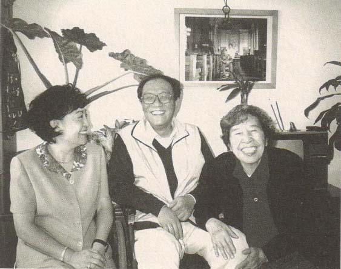
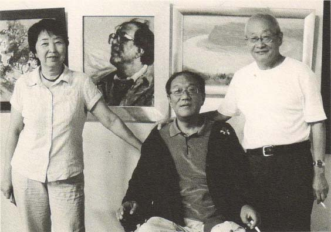
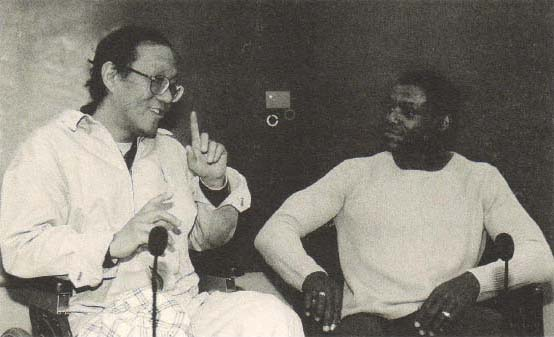

***记忆与印象2***

历史的每一瞬间，都有无数的历史蔓展，都有无限的时间延伸。我们生来孤单，无数的历史和无限的时间因破碎而成片断。互相埋没的心流，在孤单中祈祷，在破碎处眺望，或可指望在梦中团圆。记忆，所以是一个牢笼。印象是牢笼以外的天空。

重病之时

重病之时，有几行诗样的文字清晰地走进过我的昏睡：

　　最后的练习是沿悬崖行走

梦里我听见，灵魂

像一只飞虻

在窗户那儿嗡嗡作响

在颤动的阳光里，边舞边唱

眺望就是回想。

重病之时整天是梦。梦见熟悉的人、熟悉的往事，也梦见陌生的人和完全陌生的景物。偶尔醒来，窗外是无边的暗夜，是恍惚的晴空，是心里的怀疑：

　　谁说我没有死过？

出生以前，太阳

已无数次起落

悠久的时光被悠久的虚无吞并

又以我生日的名义

卷土重来。

重病之时，寒冷的冬天里有过一个奇迹——我在梦中学会了一支歌。梦中，一群男孩和女孩齐声地唱：生生露生雪，生生雪生水，我们友谊，幸福长存。莫名其妙的歌词，闻所未闻的曲调，醒来竟还会唱，现在也还会。那些孩子，有我认识的，也有的我从未见过，他们就站在我儿时的那个院子里，轻轻地唱，轻轻地摇，四周虚暗，瑞雪霏霏。

这奇妙的歌，不知是何征兆。

懂些医道的人说好——“生生”，是说你还要活下去；“生水”嘛，肾主水，你不是肾坏了吗？那是说你的生命之水枯而未竭，或可再度丰沛。

是吗？不有些牵强？

不过，我更满意后两句：我们友谊，幸福长存。

那群如真似幻的孩子，在我昏黑的梦里翩然不去。那清明畅朗的童歌，确如生命之水，在我僵冷的身体里悠然荡漾。

妻子没日没夜地守护着我；任何时候睁开眼，都见她在我身旁。我看她，也像那群孩子中的一个。

我说：“这一回，恐怕真是要结束了。”

她说：“不会。”

我真的又活过来。太阳重又真实。昼夜更迭，重又确凿。我把梦里的情景告诉妻子，她反倒脆弱起来，待我把那支歌唱给她听，她已是泪水涟涟。

我又能摇着轮椅出去了，走上阳台，走到院子里，在早春的午后，把那几行梦中的诗句补全：

午后，如果阳光静寂

你是否能听出

往日已归去哪里？

在光的前端，或思之极处

在时间被忽略的存在之中

生死同一。

八　子

童年的伙伴，最让我不能忘怀的是八子。

几十年来，不止一次，我在梦中又穿过那条细长的小巷去找八子。巷子窄到两个人不能并行，两侧高墙绵延，巷中只一户人家。过了那户人家，出了小巷东口，眼前豁然开朗，一片宽阔的空地上有一棵枯死了半边的老槐树，有一处公用的自来水，有一座山似的煤堆。八子家就在那儿。梦中我看见八子还在那片空地上疯跑，领一群孩子呐喊着向那山似的煤堆上冲锋，再从煤堆爬上院墙，爬上房顶，偷摘邻居院子里的桑椹。八子穿的还是他姐姐穿剩下的那条碎花裤子。

八子兄弟姐妹一共十个。一般情况，新衣裳总是一、三、五、七、九先穿，穿小了，由排双数的继承。老七是个姐，故继承一事常让八子烦恼。好在那时无论男女，衣装多是灰蓝二色，八子所以还能坦然。只那一条碎花裤子让他倍感羞辱。那裤子紫地白花，七子一向珍爱还有点儿舍不得给，八子心说谢天谢地最好还是你自个儿留着穿。可是母亲不依，冲七子喊：“你穿着小了，不八子穿谁穿？”七、八于是齐声叹气。八子把那裤子穿到学校，同学们都笑他，笑那是女人穿的，是娘们儿穿的，是“臭美妞才穿的呢！”八子羞愧得无地自容，以致蹲在地上用肥大的衣襟盖住双腿，半天不敢起来，光是笑。八子的笑毫无杂质，完全是承认的表情，完全是接受的态度，意思是：没错儿，换了别人我也会笑他的，可惜这回是我。

大伙儿笑一回也就完了，惟一个可怕的孩子不依不饶。（这孩子，姑且叫他K吧；我在《务虚笔记》里写过，他矮小枯瘦但所有的孩子都怕他。他有一种天赋本领，能够准确区分孩子们的性格强弱，并据此经常地给他们排一排座次——我第一跟谁好，第二跟谁好……以及我不跟谁好——于是，孩子们便都屈服在他的威势之下。）K平时最怵八子，八子身后有四个如狼似虎的哥；K因此常把八子排在“我第一跟你好”的位置。然而八子特立独行，对K的威势从不在意，对K的拉拢也不领情。如今想来，K一定是对八子记恨在心，但苦于无计可施。这下机会来了——因为那条花裤子，K敏觉到降服八子的时机到了。K最具这方面才能，看见谁的弱点立刻即知怎样利用。拉拢不成就要打击，K生来就懂。比如上体育课时，老师说：“男生站左排，女生站右排。”K就喊：“八子也站右排吧？”引得哄堂大笑，所有的目光一齐射向八子。再比如一群孩子正跟八子玩得火热，K踅步旁观，冷不丁拣其中最懦弱的一个说：“你干吗不也穿条花裤子呀？”最懦弱的一个发一下懵，便困窘地退到一旁。K再转向次懦弱的一个：“嘿，你早就想跟臭美妞儿一块玩儿了是不是？”次懦弱的一个便也犹犹豫豫地离开了八子。我说过我生性懦弱，我不是那个最，就是那个次。我惶惶然离开八子，向K靠拢，心中竟跳出一个卑鄙的希望：也许，K因此可以把“跟我好”的位置往前排一排。

K就是这样孤立对手的，拉拢或打击，天生的本事，八子身后再有多少哥也是白搭。你甚至说不清道不白就已败在K的手下。八子所以不曾请他的哥哥们来帮忙，我想，未必是他没有过这念头，而是因为K的手段高超，甚至让你都不知何以申诉。你不得不佩服K。你不得不承认那也是一种天才。那个矮小枯瘦的K，当时才只有十一二岁！他如今在哪儿？这个我童年的惧怕，这个我一生的迷惑，如今在哪儿？时至今日我也还是弄不大懂，他那恶毒的能力是从哪儿来的？如今我已年过半百，所经之处仍然常能见到K的影子，所以我在《务虚笔记》中说过：那个可怕的孩子已经长大，长大得到处都在。

我投靠在K一边，心却追随着八子。所有的孩子也都一样，向K靠拢，但目光却羡慕地投向八子——八子仍在树上快乐地攀爬，在房顶上自由地蹦跳，在那片开阔的空地上风似的飞跑，独自玩得投入。我记得，这时K的脸上全是嫉恨，转而恼怒。终于他又喊了：“花裤子！臭美妞！”怯懦的孩子们（我也是一个）于是跟着喊：“花裤子！臭美妞！花裤子！臭美妞！”八子站在高高的煤堆上，脸上的羞惭已不那么纯粹，似乎也有了畏怯、疑虑，或是忧哀。

因为那条花裤子，我记得，八子也几乎被那个可怕的孩子打倒。

八子要求母亲把那条裤子染蓝。母亲说：“染什么染？再穿一季，我就拿它做鞋底儿了。”八子说：“这裤子还是让我姐穿吧。”母亲说：“那你呢，光眼子？”八子说：“我穿我六哥那条黑的。”母亲说：“那你六哥呢？”八子说：“您给他做条新的。”母亲说：“嘿这孩子，什么时候挑起穿戴来了？边儿去！”

一个礼拜日，我避开K，避开所有别的孩子，去找八子。我觉着有愧于八子。穿过那条细长的小巷，绕过那座山似的煤堆，站在那片空地上我喊：“八子！八子——”“谁呀？”不知八子在哪儿答应。“是我！八子，你在哪儿呢？”“抬头，这儿！”八子悠然地坐在房顶上，随即扔下来一把桑椹：“吃吧，不算甜，好的这会儿都没了。”我暗自庆幸，看来他早把那些不愉快的事给忘了。

我说：“你下来。”

八子说：“干吗？”

是呀，干吗呢？灵机一动我说：“看电影，去不去？”

八子回答得干脆：“看个屁，没钱！”

我心里忽然一片光明。我想起我兜里正好有一毛钱。

“我有，够咱俩的。”

八子立刻猫似的从树上下来。我把一毛钱展开给他看。

“就一毛呀？”八子有些失望。

我说：“今天礼拜日，说不定有儿童专场，五分一张。”

八子高兴起来：“那得找张报纸瞅瞅。”

我说：“那你想看什么？”

“我？随便。”但他忽然又有点儿犹豫，“这行吗？”意思是：花你的钱？

我说：“这钱是我自己攒的，没人知道。”

走进他家院门时，八子又拽住我：“可别跟我妈说，听见没有？”

“那你妈要是问呢？”

八子想了想：“你就说是学校有事。”

“什么事？”

“你丫编一个不得了？你是中队长，我妈信你。”

好在他妈什么也没问。他妈和他哥、他姐都在案前埋头印花（即在空白的床单、桌布或枕套上印出各种花卉的轮廓，以便随后由别人补上花朵和枝叶）。我记得，除了八子和他的两个弟弟——九儿和石头，当然还有他父亲，他们全家都干这活儿，没早没晚地干，油彩染绿了每个人的手指，染绿了条案，甚至墙和地。

报纸也找到了，场次也选定了，可意外的事发生了。九儿首先看穿了我们的秘密。八子冲他挥挥拳头：“滚！”可随后石头也明白了：“什么，你们看电影去？我也去！”八子再向石头挥拳头，但已无力。石头说：“我告妈去！”八子说：“你告什么？”“你花人家的钱！”八子垂头丧气。石头不好惹，石头是爹妈的心尖子，石头一哭，从一到九全有罪。

“可总共就一毛钱！”八子冲石头嚷。

“那不管，反正你去我也去。”石头抱住八子的腰。

“行，那就都甭去！”八子拉着我走开。

但是九儿和石头寸步不离。

八子说：“我们上学校！”

九儿和石头说：“我们也上学校。”

八子笑石头：“你？是我们学校的吗你？”

石头说：“是！妈说明年我也上你们学校。”

八子拉着我坐在路边。九儿拉着石头跟我们面对面坐下。

八子几乎是央求了：“我们上学校真是有事！”

九儿说：“谁知道你们有什么事？”

石头说：“没事怎么了，就不能上学校？”

八子焦急地看着太阳。九儿和石头耐心地盯着八子。

看看时候不早了，八子说：“行，一块儿去！”

我说：“可我真的就一毛钱呀！”

“到那儿再说。”八子冲我使眼色，意思是：瞅机会把他们甩了还不容易？

横一条胡同，竖一条胡同，八子领着我们犄里拐弯地走。九儿说：“别蒙我们八子，咱这是上哪儿呀？”八子说：“去不去？不去你回家。”石头问我：“你到底有几毛钱？”八子说：“少废话，要不你甭去。”犄里拐弯，犄里拐弯，我看出我们绕了个圈子差不多又回来了。九儿站住了：“我看不对，咱八成真是走错了。”八子不吭声，拉着石头一个劲儿往前走。石头说：“咱抄近道走，是不是八子？”九儿说：“近个屁，没准儿更远了。”八子忽然和蔼起来：“九儿，知道这是哪儿吗？”九儿说：“这不还是北新桥吗？”八子说：“石头，从这儿，你知道怎么回家吗？”石头说：“再往那边不就是你们学校了吗？我都去过好几回了。”“行！”八子夸石头，并且胡噜胡噜他的头发。九儿说：“八子，你想干吗？”八子吓了一跳，赶紧说：“不干吗，考考你们。”这下八子放心了，若无其事地再往前走。

变化只在一瞬间。在一个拐弯处，说时迟那时快，八子一把拽起我钻进了路边的一家院门。我们藏在门背后，紧贴墙，大气不出，听着九儿和石头的脚步声走过门前，听着他们在那儿徘徊了一会儿，然后向前追去。八子探出头瞧瞧，说一声“快”，我们跳出那院门，转身向电影院飞跑。

但还是晚了，那个儿童专场已经开演半天了。下一场呢？下一场是成人场，最便宜的也得两毛一位了。我和八子站在售票口前发呆，真想把时钟倒拨，真想把价目牌上的两角改成五分，真想忽然从兜里又摸出几毛钱。

“要不，就看这场？”

“那多亏呀？都演过一半了。”

“那，买明天的？”

我和八子再到价目牌前仰望：明天，上午没有儿童场，下午呢？还是没有。“干脆就看这场吧？”“行，半场就半场。”但是卖票的老头说：“钱烧的呀你们俩？这场说话就散啦！”

八子沮丧地倒在电影院前的台阶上，不知从哪儿捡了张报纸，盖住脸。

我说：“嘿八子，你怎么了？”

八子说：“没劲！”

我说：“这一毛钱我肯定不花，留着咱俩看电影。”

八子说：“九儿和石头这会儿肯定告我妈了。”

“告什么？”

“花别人的钱看电影呗。”

“咱不是没看吗？”

八子不说话，惟呼吸使脸上的报纸起伏掀动。

我说：“过几天，没准儿我还能再攒一毛呢，让九儿和石头也看。”

有那么一会儿，八子脸上的报纸也不动了，一丝都不动。

我推推他：“嘿，八子？”

八子掀开报纸说：“就这么不出气儿，你能憋多会儿？”

我便也就地躺下。八子说“开始”，我们就一齐憋气。憋了一回，八子比我憋得长。又憋了一回，还是八子憋得长。憋了好几回，就一回我比八子憋得长。八子高兴了，坐起来。

我说：“八成是你那张报纸管用。”

“报纸？那行，我也不用。”八子把报纸甩掉。

我说：“甭了，我都快憋死了。”

八子看看太阳，站起来：“走，回家。”

我坐着没动。

八子说：“走哇？”

我还是没动。

八子说：“怎么了你？”

我说：“八子你真的怕K吗？”

八子说：“操，我还想问你呢。”

我说：“你怕他吗？”

八子说：“你呢？”

我不知怎样回答，或者是不敢。

八子说：“我瞧那小子，顶他妈不是东西！”

“没错儿，丫老说你的裤子。”

“真要是打架，我怕他？”

“那你怕他什么？”

“不知道。你呢？”

“我也不知道。”

现在想来，那天我和八子真有点儿当年张学良和杨虎城的意思。

终于八子挑明了。八子说：“都赖你们，一个个全怕他。”

我赶紧说：“其实，我一点儿都不想跟他好。”

八子说：“操，那小子有什么可怕的？”

“可是，那么多人，都想跟他好。”

“你管他们干吗？”

“反正，反正他要是再说你的裤子，我肯定不说。”

“他不就是不跟咱玩吗？咱自己玩，你敢吗？”

“咱俩？行！”

“到时候你又不敢。”

“敢，这回我敢了。可那得，咱俩谁也不能不跟谁好。”

“那当然。”

“拉勾，你干不干？”

“拉勾上吊，一百年不许变！拉勾上吊，一百年不许变——”

“他要不跟你好，我跟你好。”

“我也是，我老跟你好。”

“拉勾上吊，一百年不许变！拉勾上吊，一百年不许变——”

轰的一声，电影院的门开了，人流如涌，鱼贯而出，大人喊孩子叫。

我和八子拉起手，随着熙攘的人流回家。现在想起来，我那天的行为是否有点儿狡猾？甚至丑恶？那算不算是拉拢，像K一样？不过，那肯定算得上是一次阴谋造反！但是那一天，那一天和这件事，忽然让我不再觉得孤单，想起明天也不再觉得惶恐、忧哀，想起小学校的那座庙院也不再觉得那么阴郁和荒凉。

我和八子手拉着手，过大街，走小巷，又到了北新桥。忽然，一阵炸灌肠的香味儿飘来。我说：“嘿，真香！”八子也说：“嗯，香！”四顾之时，见一家小吃摊就在近前。我们不由得走过去，站在摊前看。大铁铛上“嗞啦嗞啦”地冒着油烟，一盘盘粉红色的灌肠盛上来，再浇上蒜汁，晶莹剔透煞是诱人。摊主不失时机地吆喝：“热灌肠啊！不贵啦！一毛钱一盘的热灌肠呀！”我想那时我一定是两眼发直，唾液盈口，不由得便去兜里摸那一毛钱了。

“八子，要不咱先吃了灌肠再说吧？”

八子不示赞成，也不反对，意思是：钱是你的。

一盘灌肠我们俩人吃，面对面，鼻子几乎碰着鼻子。八子脸上又是愧然地笑了，笑得毫无杂质，意思是：等我有了钱吧，现在可让我说什么呢？

那灌肠真是香啊，人一生很少有机会吃到那么香的东西。

看　电　影

我和八子一起去的那家影院，叫交道口影院。小时候，我家附近，方圆五六里内，只这一家影院。此生我看过的电影，多半是在那儿看的。

“上哪儿呀您？”“交道口。”或者：“您这是干吗去？”“交道口。”在我家那一带，这样的问答已经足够了，不单问者已经明白，听见的人便都知道，被问者是去看电影的。所以，在我童年一度的印象里，交道口和电影院是同义的。记得有一回在街上，一个人问我：“小孩儿，交道口怎么走？”我指给他：“往前再往右，一座灰楼。”“灰楼？”那人不解。我说：“写着呢，老远就能看见——交道口影院。”那人笑了：“影院干吗？我去交道口！交道口，知道不？”这下轮到我发懵了。那人着急：“好吧好吧，交道口影院，怎么走？”我再给他指一遍；心说这不结了，你知道还是我知道？但也就在这时，我忽然醒悟：那电影院是因地处交道口而得名。

八十年代末这家电影院拆了。这差不多能算一个时代的结束，从此我很少看电影了，一是票价忽然昂贵，二是有了录像和光盘，动听的说法是“家庭影院”。

但我还是怀念“交道口”，那是我的电影启蒙地。我平生看过的第一部电影是《神秘的旅伴》，片名是后来母亲告诉我的。我只记得一个漂亮的女人总在银幕上颠簸，神色慌张，其身型时而非常之大，以至大出银幕，时而又非常之小，小到看不清她的脸。此外就只是些破碎的光影，几张晃动的、丑陋的脸。我仰头看得劳累，大约是太近银幕之故。散场时母亲见我还睁着眼，抱起我，竟有骄傲的表情流露。回到家，她跟奶奶说：“这孩子会看电影了，一点儿都没睡。”我却深以为憾：那儿也能睡吗，怎不早说？奶奶问我：“都看见什么了？”我转而问母亲：“有人要抓那女的？”母亲大喜过望：“对呀！坏人要害小黎英。”我说：“小黎英长得真好看。”奶奶抚掌大笑道：“就怕这孩子长大了没别的出息。”

梅娘好像从不存在——和柳青、孙姨

通往交道口的路，永远是一条快乐的路。那时的北京蓝天白云，细长的小街上一半是灰暗错落的屋影，一半是安闲明澈的阳光。一票在手有如节日，几个伙伴相约一路，可以玩弹球儿，可以玩“骑马打仗”。还可在沿途的老墙和院门上用粉笔画一条连续的波浪，碰上院门开着，便站到门旁的石墩上去，踮着脚尖让那波浪越过门楣，务使其毫不间断。倘若敞开的院门里均无怒吼和随后的追捕，这波浪便可一直能画到影院的台阶上。

坐在台阶上，等候影院开门，钱多的更可以买一根冰棍骄傲地嘬。大家瞪着眼看他和他的冰棍，看那冰棍迅速地小下去，必有人忍无可忍，说：“喂，开咱一口。”开者嘬也，你就要给他嘬上一口。继续又有人说了：“也开咱一口。”你当然还要给，快乐的日子里做人不能太小气。大家在灿烂的阳光下坐成一排，舒心地等候，小心地嘬——这样的时刻似乎人人都有责任感，谁也不忍一口嘬去太多。

有部反特片，《徐秋影案件》，甚是难忘。那是我头一回看露天电影，就在我们小学的操场上。票价二分，故所有的孩子都得到了家长的赞助。晚霞未落，孩子们便一群一伙地出发了，扛个小板凳，或沿途捡两块砖头，希望早早去占个好位置。天黑时，白色的银幕升起来，就挂在操场中央，月亮下面。幕前幕后都坐满了人。有一首流行歌曲怀念过这样的情景，其中一句大意是：如今再也看不到银幕背后的电影了。

那个电影着实阴森可怖，音乐一惊一乍地令人毛骨悚然，黑白的光影里总好像暗伏杀机。尤其是一个漂亮女人（后来才知是特务），举止温文尔雅，却怎么一颦一笑总显得犹疑、警惕？影片演到一半，夜风忽起，银幕飘飘抖抖更让人难料凶吉。我身上一阵阵地冷，想看又怕看，怕看但还是看着。四周树影沙沙，幕边云移月走，剧中的危惧融入夜空，仿佛满天都是凶险，风中处处阴谋。

好不容易挨到散场，八子又有建议：“咱玩抓特务吧。”我想回家。八子说不行，人少了怎么玩？月光清清亮亮，操场上只剩了几个放电影的人在收起银幕。谁当特务呢？白天会抢着当的，这会儿没人争取。特务必须独往独来，天黑得透，一个人还是怕。耗子最先有了主意：“瞧，那老头！”八子顺着她的手指看：“那老头？行，就是他！”小不点说：“没错儿，我早注意他了，电影完了他干吗还不走？”那无辜的老头蹲在小树林边的暗影里抽烟，面目不清，烟火时明时暗。虎子说：“老东西正发暗号呢！”八子压低声音：“瞧瞧去，接暗号的是什么人？”一队人马便潜入小树林。八子说：“这哪儿行？散开！”于是散开，有的贴着墙根走，有的在地上匍匐，有的隐蔽在树后；吹一声口哨或学一声蛐蛐叫，保持联络。四处灯光不少，难说哪一盏与老头有关，如此看来就先包围了他再说吧。四面合围，一齐收紧，逼近那“老东西”。小不点眼尖，最先哧哧地笑起来：“虎子，那是你爷爷！”

几十年后我偶然在报纸上读到，《徐秋影案件》是根据了一个真实故事，但“徐秋影”跟虎子他爷爷那夜的遭遇一样，是个冤案。

模仿电影里的行动，是一切童年必有的乐事。比如现在的电影，多有拳争武斗，孩子们一招一式地学来，个个都像一方帮主。几十年前的电影呢，无非是打仗的、反特的、潜入敌营去侦察的；枪林弹雨，出生入死，严刑拷打，宁死不屈，最后必是胜利大反攻，咱的炮火愤怒而且猛烈，歼敌无数。因而，曾有一代少年由衷地向往那样的烽火硝烟。（“首长，让我们上前线吧，都快把人憋死了！”“怎么，着急了？放心，有你们的仗打。”）是呀，打死敌人你就是英雄，被敌人打死你就还是英雄，这可是多么值得！故而冲锋号一响，银幕上炮火横飞——一批年轻人撂倒了另一批年轻人，一些被怀念的恋人消灭了另一些被怀念的恋人——场内立刻一片欢腾。是嘛，少男少女们花钱买票是为什么来的？开心，兴奋，自由欢叫，激情涌泄。这让我想通了如今的“追星族”。少年狂热古今无异，给他个偶像他就发烧，终于烧到哪儿去就不好说。比如我们这一代，忽然间就烧进了“文化大革命”。

“文化大革命”了，造反了，大批判了，电影是没的看了，电影院全关张了，电影统统地有问题了。电影厂也不再神秘，敞开大门，有请各位帮忙造反。有一回去北影看大字报，发现昔日的偶像都成了“黑帮”，看来看去心里怪怪的。“黄世仁”和“穆仁智”一类倒也罢了，可“洪常青”和“许云峰”等等怎么回事？一旦弯在台上挨斗，可还是那般大义凛然？明白明白，要把演员和角色择开，但是明白归明白，心里还是怪怪的。

电影院关张了几年，忽有好消息传来：要演《列宁在十月》了，要演《列宁在一九一八》了。阿芙乐尔号的炮声又响了，这一回给咱送来了什么？人们一遍遍地看（否则看啥），一遍遍复习里面的台词（久疏幽默），一遍遍欣赏其中的芭蕾舞片断（多短的裙子和多美的其他），一遍遍凝神屏气看瓦西里夫妇亲吻（这两口子胆儿可真大）。在我的印象里，就从这时，国人的审美立场发生着动摇，竭力在炮火狼烟中拾捡温情，在一个执意不肯忘记仇恨的年代里思慕着爱恋。

《艳阳天》是停顿了若干后中国的第一部国产片。该片上演时我已坐上轮椅，而且正打算写点儿什么。票很难买，电影院门前彻夜有人排队。托了人，总算买到一张票，我记得清楚，是早场五点多的，其他场次要有更强大的“后门”。

还是交道口，还是那条路，沿途的老墙上仍有粉笔画的波浪，真可谓代代相传。一夜大雪未停，事先已探知手摇车不准入场，母亲便推着那辆自制的轮椅送我去。那是我的第一辆轮椅，是父亲淘换了几根钢管回来求人给焊的，结构不很合理，前轮总不大灵活。雪花纷纷地还在飞舞，在昏黄的路灯下仿佛一群飞蛾。路上的雪冻成了一道道冰棱子，母亲推得沉重，但母亲心里快乐。（因为那是一条永远快乐的路吗？）母亲知道我正打算写点儿什么，又知道我跟长影的一位导演有着通信，所以她觉得推我去看这电影是非常必要的，是一件大事。怎样的大事呢？我们一起在那条快乐的雪路上跋涉时，谁也没有把握，惟朦胧地都怀着希望。她把我推进电影院，安顿好，然后回家。谢天谢地她不必在外面等我，命运总算有怜恤她的时候——交道口离我家不远，她只需送我来，只需再接我回去。

再过几年，有了所谓“内部电影”。据说这类电影“四人帮”时就有，惟内部得更为严格。现在略有松动。初时百姓不知，见夜色中开来些大小轿车，纷纷在剧场前就位，跳出来的人们神态庄重，黑压压地步入剧场，百姓还以为是开什么要紧的会。内部者，即级别够高、立场够稳、批判能力够强、为各种颜色都难毒倒的一类。再就是内部的内部，比如老婆，又比如好友。影片嘛，东洋西洋的都有，据说运气好还能撞上半裸或全裸的女人。据说又有洁版和全版之分，这要视内部的级别高低而定。然而没有不透风的墙呀——检票员不得已而是外部，放映员没办法也得是外部，可外部难免也有其内部，比如老婆，又比如好友。如此一算，全国人民就都有机会当一两回内部，消息于是不胫而走。再有这类放映时，剧场前就比较沸腾，比较火暴，也不知从哪儿涌出来这么多的内部和外部！广大青年们尤其想：裸体！难道不是我们看了比你们看了更有作用？有那么一段不太长久的时期，一张内部电影票，便是身份或者本领的证明。

“内部电影”风风火火了一阵子之后，有人也送了我一张票。“啥名儿？”“没准儿，反正是内部的。”无风的夏夜，树叶不动，我摇了轮椅去看平生的第一回内部电影。从雍和宫到那个内部礼堂，摇了一个多钟头，沿街都是乘凉的人群。那时我身体真好，再摇个把钟头也行。然而那礼堂的台阶却高，十好几层，我喘吁吁地停车阶下，仰望阶上，心知凶多吉少。但既然来了，便硬着头皮喊那个检票人——请他从台阶上下来，求他帮忙想想办法让我进去。检票人听了半天，跑回去叫来一个领导。领导看看我：“下不来？”我说是。领导转身就走，甩下一句话：“公安局有规定，任何车辆不准入内。”倒是那个检票人不时向我投来抱歉的目光。我没做太多争取。我不想多做争辩。这样的事已不止十回，智力正常如我者早有预料。只不过碰碰运气。若非内部电影，我也不会跑这么远来碰运气。不过呢，来一趟也好，家里更是闷热难熬。况且还能看看内部电影之盛况，以往只是听说。这算不算体验生活？算不算深入实际？我退到路边，买根冰棍坐在树影里瞧。于是想念起交道口，那儿的人都认识我了，见我来了就打开太平门任我驱车直入——太平门前没有台阶。可惜那儿也没有内部电影，那儿是外部。那儿新来了个小伙子，姓项，那儿的人都叫他小项。奇怪小项怎么头一回见我就说：“嘿哥们儿，也写部电影吧，咱们瞧瞧。”

小项不知现在何方。

小项猜对了。小项那样说的时候，我正在写一个电影剧本。那完全是因为柳青的鼓励。柳青，就是长影那个导演。第一次她来看我就对我说：“干吗你不写点儿什么？”她说中了我的心思，但是电影，谁都能写吗？以后柳青常来看我，三番五次地总对我说：“小说，或者电影，我看你真的应该写点儿什么。”既然一位专业人士对我有如此信心，我便悄悄地开始写了。既然对我有如此信心的是一位导演，我便从电影剧本开始。尤其那时，我正在一场不可能成功的恋爱中投注着全部热情，我想我必得做一个有为的青年。尤其我曾爱恋着的人，也对我抱着同样的信心——“真的，你一定行”——我便没日没夜地满脑子都是剧本了。那时母亲已经不在，通往交道口的路上，经常就有一对暂时的恋人并步而行（其实是脚步与车轮）。暂时，是明确的，而暂时的原因，有必要深藏不露——不告诉别人，也避免告诉自己。但是暂时，只说明时间，不说明品质，在阳光灿烂的那条快乐的路上，在雨雪之中的那家影院的门廊下，爱恋，因其暂时而更珍贵。在幽暗的剧场里他们挨得很紧，看那辉煌的银幕时，他们复习着一致的梦想：有一天，在那儿，银幕上，编剧二字之后，“是你的名字”——她说；“是呀但愿”——我想。

然而，终于这一天到来之时，时间已经远远地超过了暂时。我独自看那“编剧”后面的三个字，早已懂得：有为，与爱情，原是风马牛不相及的两个领域。但暂时，亦可在心中长久，而写作，却永远地不能与爱情无关。

**珊　珊**

那些天珊珊一直在跳舞。那是暑假的末尾，她说一开学就要表演这个节目。

晌午，院子里很静。各家各户上班的人都走了，不上班的人在屋里伴着自己的鼾声。珊珊换上那件白色的连衣裙，“吱呀”一声推开她家屋门，走到老海棠树下，摆一个姿势，然后轻轻起舞。

“吱呀”一声我也从屋里溜出来。

“干什么你？”珊珊停下舞步。

“不干什么。”

我煞有介事地在院子里看一圈，然后在南房的阴凉里坐下。

海棠树下，西番莲开得正旺，草茉莉和夜来香无奈地等候着傍晚。蝉声很远，近处是“嗡嗡”的蜂鸣，是盛夏的热浪，是珊珊的喘息。她一会儿跳进阳光，白色的衣裙灿烂耀眼，一会儿跳进树影，纷乱的图案在她身上漂移、游动；舞步轻盈，丝毫也不惊动海棠树上入睡的蜻蜓。我知道她高兴我看她跳，跳到满意时她瞥我一眼，说：“去——”既高兴我看她，又说“去”，女孩子真是搞不清楚。

我仰头去看树上的蜻蜓，一只又一只，翅膀微垂，睡态安详。其中一只通体乌黑，是难得的“老膏药”。我正想着怎么去捉它，珊珊喘吁吁地冲我喊：“嘿快，快看哪你，就要到了。”

她开始旋转，旋转进明亮，又旋转得满身树影纷乱，闭上眼睛仿佛享受，或者期待，她知道接下来的动作会赢得喝彩。她转得越来越快，连衣裙像降落伞一样张开，飞旋飘舞，紧跟着一蹲，裙裾铺开在海棠树下，圆圆的一大片雪白，一大片闪烁的图案。

“嘿，芭蕾舞！”我说。

“笨死你，”她说，“这是芭蕾舞呀？”

无论如何我相信这就是芭蕾舞，而且我听得出珊珊其实喜欢我这样说。在一个九岁的男孩看来，芭蕾并非一个舞种，芭蕾就是这样一种动作——旋转，旋转，不停地旋转，让裙子飞起来。那年我可能九岁。如果我九岁，珊珊就是十岁。

又是“吱呀”一声，小恒家的屋门开了一条缝，小恒蹑手蹑脚地钻出来。

“有蜻蜓吗？”

“多着呢！”

小恒屁也不懂，光知道蜻蜓，他甚至都没注意珊珊在干吗。

“都什么呀？”小恒一味地往树上看。

“至少有一只‘老膏药’！”

“是吗？”

小恒又钻回屋里，出来时得意地举着一小团面筋。于是我们就去捉蜻蜓了。一根竹竿，顶端放上那团面筋，竹竿慢慢升上去，对准“老膏药”，接近它时要快要准，要一下子把它粘住。然而可惜，“老膏药”聪明透顶，珊珊跳得如火如荼它且不醒，我的手稍稍一抖它就知道，立刻飞得无影无踪。珊珊幸灾乐祸。珊珊让我们滚开。

“要不看你就滚一边儿去，到时候我还得上台哪，是正式演出。”

她说的是“你”，不是“你们”，这话听来怎么让我飘飘然有些欣慰呢？不过我们不走，这地方又不单是你家的！那天也怪，老海棠树上的蜻蜓特别多。珊珊只好自己走开。珊珊到大门洞里去跳，把院门关上。我偶尔朝那儿望一眼，门洞里幽幽暗暗，看不清珊珊高兴还是生气，惟一缕无声的雪白飘上飘下，忽东忽西。

那个中午出奇的安静。我和小恒全神贯注于树上的蜻蜓。

忽然，一声尖叫，随即我闻到了一股什么东西烧焦了的味。只见珊珊飞似的往家里跑，然后是她的哭声。我跟进去。床上一块黑色的烙铁印，冒着烟。院子里的人都醒了，都跑来看。掀开床单，褥子也糊了，揭开褥子，毡子也黑了。有人赶紧舀一碗水泼在床上。

“熨什么呢你呀？”

“裙子，我的连……连衣裙都绉了，”珊珊抽咽着说。

“咳，熨完就忘了把烙铁拿开了，是不是？”

珊珊点头，眼巴巴地望着众人，期待或可有什么解救的办法。

“没事儿你可熨它干吗？你还不会呀！”

“一开学我……我就得演出了。”

“不行了，褥子也许还凑合用，这床单算是完了。”

珊珊立刻嚎啕。

“别哭了，哭也没用了。”

“不怕，回来跟你阿姨说清楚，先给她认个错儿。”

“不哭了珊珊，不哭了，等你阿姨回来，我们大伙儿帮你说说（情）。”

可是谁都明白，珊珊是躲不过一顿好打了。

这是一个传统得不能再传统的故事。“阿姨”者，珊珊的继母。

珊珊才到这个家一年多。此前好久，就有个又高又肥的秃顶男人总来缠着那个“阿姨”。说缠着，是因为总听见他们在吵架，一宿一宿地吵，吵得院子里的人都睡不好觉。可是，吵着吵着忽然又听说他们要结婚了。这男人就是珊珊的父亲。这男人，听说还是个什么长。这男人我不说他胖而说他肥，是因他实在并不太胖，但在夏夜，他摆两条赤腿在树下乘凉，粉白的肉颤呀颤的，小恒说“就像肉冻”，你自然会想起肥。据说珊珊一年多前离开的，也是继母。离开继母的家，珊珊本来高兴，谁料又来到一个继母的家。我问奶奶：“她亲妈呢？”奶奶说：“小孩儿，甭打听。”“她亲妈死了吗？”“谁说？”“那她干吗不去找她亲妈？”“你可不许去问珊珊，听见没？”“怎么了？”“要问，我打你。”我嬉皮笑脸，知道奶奶不会打。“你要是问，珊珊可就又得挨打了。”这一说管用，我想那可真是不能问了。我想珊珊的亲妈一定是死了，不然她干吗不来找珊珊呢？

草茉莉开了。夜来香也开了。满院子香风阵阵。下班的人陆续地回来了。炝锅声、炒菜声就像传染，一家挨一家地整个院子都热闹起来。这时有人想起了珊珊。“珊珊呢？”珊珊家烟火未动，门上一把锁。“也不添火也不做饭，这孩子哪儿去了？”“坏了，八成是怕挨打，跑了。”“跑了？她能上哪儿去呢？”“她跟谁说过什么没有？”众人议论纷纷。我看他们既有担心，又有一丝快意——给那个所谓“阿姨”点颜色看，让那个亲爹也上点心吧！

奶奶跑回来问我：“珊珊上哪儿了你知道不？”

“我看她是找她亲妈去了。”

众人都来围着我问：“她跟你说了？”“她是这么跟你说的吗？”“她上哪儿去找她亲妈，她说了吗？”

“要是我，我就去找我亲妈。”

奶奶喊：“别瞎说！你倒是知不知道她上哪儿了？”

我摇头。

小恒说看见她买菜去了。

“你怎么知道她是买菜去了？”

“她天天都去买菜。”

我说：“你屁都不懂！”

众人纷纷叹气，又纷纷到院门外去张望，到菜站去问，在附近的胡同里喊。

我也一条胡同一条胡同地去喊珊珊。走过老庙，走过小树林，走过轰轰隆隆的建筑工地，走过护城河，到了城墙边。没有珊珊，没有她的影子。我爬上城墙，喊她，我想这一下她总该听见了。但是晚霞淡下去，只有晚风从城墙外吹过来。不过，我心里忽然有了一个想法。

我下了城墙往回跑，我相信我这个想法一定不会错。我使劲跑，跑过护城河，跑过工地，跑过树林，跑过老庙，跑过一条又一条胡同，我知道珊珊会上哪儿，我相信没错她肯定在那儿。

小学校。对了，她果然在那儿。

操场上空空旷旷，操场旁一点雪白。珊珊坐在花坛边，抱着肩，蜷起腿，下巴搁在膝盖上，晚风吹动她的裙裾。

“珊珊，”我叫她。

珊珊毫无反应。也许她没听见？

“珊珊，我猜你就在这儿。”

我肯定她听见了。我离她远远地坐下来。

四周有了星星点点的灯光。蝉鸣却是更加地热烈。

我说：“珊珊，回家吧。”

可我还是不敢走近她。我看这时候谁也不敢走近她。就连她的“阿姨”也不敢。就连她亲爹也不敢。我看只有她的亲妈能走近她。

“珊珊，大伙儿都在找你哪。”

在我的印象里，珊珊站起来，走到操场中央，摆一个姿势，翩翩起舞。

四周已是万家灯火。四周的嘈杂围绕着操场上的寂静、空旷，还有昏暗，惟一缕白裙鲜明，忽东忽西，飞旋、飘舞……

“珊珊回去吧。”“珊珊你跳得够好了。”“离开学还有好几天哪，珊珊你就先回去吧。”我心里这样说着，但是我不敢打断她。

月亮爬上来，照耀着白色的珊珊，照耀她不停歇的舞步；月光下的操场如同一个巨大的舞台。在我的愿望里，也许，珊珊你就这么尽情尽意地跳吧，别回去，永远也不回去，但你要跳得开心些，别这么伤感，别这么忧愁，也别害怕。你用不着害怕呀珊珊，因为，因为再过几天你就要上台去表演这个节目了，是正式的……

但是结尾，是这个故事最为悲惨的地方：那夜珊珊回到家，仍没能躲过一顿暴打。而她不能不回去，不能不回到那个继母的家。因为她无处可去。

因而在我永远的童年里，那个名叫珊珊的女孩一直都在跳舞。那件雪白的连衣裙已经熨好了，雪白的珊珊所以能够飘转进明亮，飘转进幽暗，飘转进遍地树影或是满天星光……这一段童年似乎永远都不会长大，因为不管何年何月，这世上总是有着无处可去的童年。

**小　恒**

我小时候住的那个院子里，只小恒和我两个男孩。我大小恒四岁，这在孩子差得就不算小，所以小恒总是追在我屁股后头，是我的“兵”。

我上了中学，住校，小恒平时只好混在一干女孩子中间；她们踢毽他也踢毽，她们跳皮筋他也跳皮筋，她们用玻璃丝编花，小恒便劝了这个劝那个，劝她们不如还是玩些别的。周末我从学校回来，小恒无论正跟女孩们玩着什么，必立即退出，并顺便表现一下男子汉的优越：“咳这帮女的，真笨！”女孩们当然就恨恨骂，威胁说：“小恒你等着，看明天他走了你跟谁玩！”小恒已经不顾，兴奋地追在我身后，汇报似的把本周院里院外的“新闻”向我细说一遍。比如谁家的猫丢了，可同时谁家又飘出炖猫肉的香味。我说：“炖猫肉有什么特别的香味儿吗？”小恒挠挠后脑勺，把这个问题跳过去，又说起谁家的山墙前天夜里塌了，幸亏是往外塌的，差一点儿就往里塌，那样的话这家人就全完了。我说：“怎么看出差一点儿就往里塌呢？”小恒再挠挠后脑勺，把这个问题也跳过去，又说起某某的爷爷前几天死了，有个算命的算得那叫准，说那老头要是能挺到开春就是奇迹，否则一定熬不过这个冬天。我忍不住大笑。小恒挠着后脑勺，半天才想明白。

小恒长得白白净净，秀气得像个女孩。小恒妈却丑，脸又黑。邻居们猜小恒一定是像父亲，但谁也没见过他父亲。邻居中曾有人问过：“小恒爸在哪儿工作？”小恒妈啰里啰嗦，顾左右而言他。这事促成邻居们长久的怀疑和想像。

小恒妈不识字，但因每月都有一张汇票按时寄到，她所以认得自己的姓名；认得，但不会写，看样子也没打算会写，凡需签名时她一律用图章。那图章受到邻居们普遍的好评——象牙的，且有精美的雕刻和镶嵌。有回碰巧让个退休的珠宝商看见，老先生举着放大镜瞅半天，神情渐渐肃然。老先生抬眼再看图章的主人，肃然间又浮出几分诧异，然后恭恭敬敬把图章交还小恒妈，说：“您可千万收好了。”

小恒妈多有洋相。有一回上扫盲课，老师问：“锄禾日当午，下一句什么？”小恒妈抢着说：“什么什么什么土。”“谁知盘中餐？”“什么什么什么苦。”又一回街道开会，主任问她：“‘三要四不要’（一个卫生方面的口号）都是什么？”小恒妈想了又想，身上出汗。主任说：“一条就行。”小恒妈道：“晚上要早睡觉。”主任忍住笑再问：“那，不要什么呢？”“不要加塞儿，要排队。”

一九六六年春，大约就在小恒妈规规矩矩排队购物之时，“文化革命”已悄悄走近。我们学校最先闹起来，在教室里辩论，在食堂里辩论，在操场上辩论——清华附中是否出了修正主义？我觉得这真是无稽之谈，清华附中从来就没走错过半步社会主义。辩论未果，六月，正要期末考试，北大出事了，北大确凿是出了修正主义。于是停课，同学们都去北大看大字报；一路兴高采烈——既不用考试了，又将迎来暴风雨的考验！未名湖畔人流如粥。看呀，看呀，我心里渐渐地郁闷——看来我是修正主义“保皇派”已成定局，因而我是反动阶级的孝子贤孙也似无可非议。唉唉！暴风雨呀暴风雨，从小就盼你，怎么你来了我却弄成这样？

有天下午回到家，坐着发呆，既为自己的立场懊恼，又为自己的出身担忧。这时小恒来了，几个星期不见，他的汇报已经“以阶级斗争为纲”了。

“嘿，知道吗？珊珊他爸有问题！”

“谁说？”

“珊珊她阿姨都哭了。”

“这新鲜吗？”

“珊珊她爸好些天都没回家了。”

“又吵架了呗。”

“才不是哪，人家说他是修正主义分子。”

“怎么说？”

“说他是资产阶级生活方式。”

“那倒是，他不是谁是？”

“街东头的辉子，知道不？他家有人在台湾！”

“你怎么知道的？”

“还有北屋老头，几根头发还总抹油，抽的烟特高级，每根都包着玻璃纸！”

“雪茄都那样，你懂个屁！”

“9号的小文，她爸是地主。他爸叫什么你猜？徐有财。反动不反动？”

我不想听了。“小恒，你快成‘包打听’了。”我想起奶奶的成分也是地主，想起我的出身到底该怎么算？那天我没在家多待，早早地回了学校。

学校里天翻地覆。北京城天翻地覆。全中国都出了修正主义！初时，阶级营垒尚不分明，我战战兢兢地混进革命队伍也曾去清华园里造过一次反，到一个“反动学术权威”家里砸了几件摆设，毁了几双资产阶级色彩相当浓重的皮鞋。但不久，非“红五类”出身者便不可造反，我和几个不红不黑的同学便早早地做了逍遥派。随后，班里又有人被揭露出隐瞒了罪恶出身，我脸上竭力表现着愤怒，心里却暗暗地发抖。可什么人才会暗暗地发抖呢？耳边便响起一句话现成的解释：“让阶级敌人躲在阴暗的角落里去发抖吧！”

再见小恒时，他已是一身的“民办绿”（自制军装，惟颜色露出马脚，就好比当今的假冒名牌，或当初的阿Q，自以为已是革命党）。我把他从头到脚看一遍，不便说什么，惟低头听他汇报。

“嘿不骗你，后院小红家偷偷烧了几张画，有一张上居然印着青天白日旗！”

“真的？”

“当然。也不知让谁看见给报告了，小红她舅姥爷这几天正扫大街哪。”

“是吗？”

“西屋一见，吓得把沙发也拆了。沙发里你猜是什么？全是烂麻袋片！”

四周比较安静。小恒很是兴奋。

“听说后街有一家，红卫兵也不是怎么知道的，从他们家的箱子里翻出一堆没开封的瑞士表，又从装盐的坛子里找出好些金条！”

“谁说的？”

“还用谁说？东西都给抄走了，连那家的大人也给带走了。”

“真的？”

“骗你是孙子。还从一家抄出了解放前的地契呢！那家的老头老太太跪在院子里让红卫兵抽了一顿皮带，还说要送他们回原籍劳改去呢。”

小恒的汇报轰轰烈烈，我听得胆战心惊。

那天晚上，母亲跟奶奶商量，让奶奶不如先回老家躲一躲。奶奶悄然落泪。母亲说：“先躲过这阵子再说，等没事了就接您回来。”我真正是躲在角落里发抖了，不敢再听，溜出家门，心里乱七八糟地在街上走，一直走回学校。

几天后奶奶走了。母亲来学校告诉我：奶奶没受什么委屈，平平安安地走了。我松了一口气。但即便在那一刻，我也知道，这一口气是为什么松的。良心，其实什么都明白。不过，明白，未必就能阻止人性的罪恶。多年来，我一直躲避着那罪恶的一刻。但其实，那是永远都躲避不开的。

母亲还告诉我，小恒一家也走了。

“小恒？怎么回事？”

“从他家搜出了几大箱子绸缎，还有银元。”

“怎么会？”

“完全是偶然。红卫兵本来是冲着小红的舅姥爷去的，然后各家看看，就在小恒家翻出了那些东西。”

几十匹绫罗绸缎，色彩缤纷华贵，铺散开，铺得满院子都是，一地金光灿烂。

小恒妈跪在院子中央，面如土灰。

银元一把一把地抛起来，落在柔软的绸缎上，沉甸甸的但没有声音。

接着是皮带抽打在皮肉上的震响，先还零碎，渐渐地密集。

老海棠树的树阴下，小恒妈两眼呆滞一声不吭，皮带仿佛抽打着木桩。

红卫兵愤怒地斥骂。

斥骂声惊动了那一条街。

邻居们早都出来，静静地站在四周的台阶下。

街上的人吵吵嚷嚷地涌进院门，然后也都静静地站在四周的台阶下。

有人轻声问：“谁呀？”

没人回答。

“小恒妈，是吗？”

没人理睬。

小恒妈哀恐的目光偶尔向人群中搜寻一回，没人知道她在找什么。

没人注意到小恒在哪儿。

没人还能顾及到小恒。

是小恒自己出来的。他从人群里钻出来。

小恒满面泪痕，走到他妈跟前，接过红卫兵的皮带，“啪！啪啪！啪啪啪……”那声音惊天动地。

连那几个红卫兵都惊呆了。在场的人后退一步，吸一口凉气。

小恒妈一如木桩，闭上双眼，倒似放心了的样子。

“啪！啪啪！啪啪啪……”

没人去制止。没人敢动一下。

直到小恒手里的皮带掉落在地，掉落在波浪似的绸缎上。

小恒一动不动地站着。小恒妈一动不动地跪着。

老海棠树上，蜻蜓找到了午间的安歇地。一只蝴蝶在院中飞舞。蝉歌如潮。

很久，人群有些骚动，无声地闪开一条路。

警察来了。

绫罗绸缎扔上卡车，小恒妈也被推上去。

小恒这才哭喊起来：“我不走，我不走！哪儿也不去！我一个人在北京！”

在场的人都低下头，或偷偷叹气。

一个老民警对小恒说：“你还小哇，一个人哪儿行？”

“行！我一个人行！要不，大妈大婶我跟着你们行不？跟着你们谁都行！”

是人无不为之动容。

这都是我后来听说的。

再走进那个院子时，只见小恒家的门上一纸封条、一把大锁。

老海棠树已然枝枯叶落。落叶被阵阵秋风吹开，堆积到四周的台阶下，就像不久前屏息颤栗的人群。

家里，不见了奶奶，只有奶奶的针线笸箩静静地躺在床上。

我的良心仍不敢醒。但那孱弱的良心，昏然地能够看见奶奶独自走在乡间小路上的样子。还能看见：苍茫的天幕下走着的小恒，前面不远，是小恒妈踽踽而行的背影。或者还能看见：小恒紧走几步，追上母亲，母亲一如既往搂住他弱小且瑟缩的肩膀。荒风落日，旷野无声。

**老海棠树**

如果可能，如果有一块空地，不论窗前屋后，要是能随我的心愿种点儿什么，我就种两棵树。一棵合欢，纪念母亲。一棵海棠，纪念我的奶奶。

奶奶，和一棵老海棠树，在我的记忆里不能分开；好像她们从来就在一起，奶奶一生一世都在那棵老海棠树的影子里张望。

老海棠树近房高的地方，有两条粗壮的枝桠，弯曲如一把躺椅，小时候我常爬上去，一天一天地就在那儿玩。奶奶在树下喊：“下来，下来吧，你就这么一天到晚待在上头不下来了？”是的，我在那儿看小人书，用弹弓向四处射击，甚至在那儿写作业，书包挂在房檐上。“饭也在上头吃吗？”对，在上头吃。奶奶把盛好的饭菜举过头顶，我两腿攀紧树桠，一个海底捞月把碗筷接上来。“觉呢，也在上头睡？”没错。四周是花香，是蜂鸣，春风拂面，是沾衣不染的海棠花雨。奶奶站在地上，站在屋前，老海棠树下，望着我；她必是羡慕，猜我在上头是什么感觉，都能看见什么？

但她只是望着我吗？她常独自呆愣，目光渐渐迷茫，渐渐空荒，透过老海棠树浓密的枝叶，不知所望。

春天，老海棠树摇动满树繁花，摇落一地雪似的花瓣。我记得奶奶坐在树下糊纸袋，不时地冲我叨唠：“就不说下来帮帮我？你那小手儿糊得多快！”我在树上东一句西一句地唱歌。奶奶又说：“我求过你吗？这回活儿紧！”我说：“我爸我妈根本就不想让您糊那破玩艺儿，是您自己非要这么累！”奶奶于是不再吭声，直起腰，喘口气，这当儿就又呆呆地张望——从粉白的花间，一直到无限的天空。

或者夏天，老海棠树枝繁叶茂，奶奶坐在树下的浓阴里，又不知从哪儿找来了补花的活儿，戴着老花镜，埋头于床单或被罩，一针一线地缝。天色暗下来时她冲我喊：“你就不能劳驾去洗洗菜？没见我忙不过来吗？”我跳下树，洗菜，胡乱一洗了事。奶奶生气了：“你们上班上学，就是这么糊弄？”奶奶把手里的活儿推开，一边重新洗菜一边说：“我就一辈子得给你们做饭？就不能有我自己的工作？”这回是我不再吭声。奶奶洗好菜，重新捡起针线，从老花镜上缘抬起目光，又会有一阵子愣愣地张望。

有年秋天，老海棠树照旧果实累累，落叶纷纷。早晨，天还昏暗，奶奶就起来去扫院子，“刷啦——刷啦——”院子里的人都还在梦中。那时我大些了，正在插队，从陕北回来看她。那时奶奶一个人在北京，爸和妈都去了干校。那时奶奶已经腰弯背驼。“刷啦刷啦”的声音把我惊醒，赶紧跑出去：“您歇着吧我来，保证用不了三分钟。”可这回奶奶不要我帮。“咳，你呀！你还不懂吗？我得劳动。”我说：“可谁能看得见？”奶奶说：“不能那样，人家看不看得见是人家的事，我得自觉。”她扫完了院子又去扫街。“我跟您一块儿扫行不？”“不行。”

这样我才明白，曾经她为什么执意要糊纸袋，要补花，不让自己闲着。有爸和妈养活她，她不是为挣钱，她为的是劳动。她的成分随了爷爷算地主。虽然我那个地主爷爷三十几岁就一命归天，是奶奶自己带着三个儿子苦熬过几十年，但人家说什么？人家说：“可你还是吃了那么多年的剥削饭！”这话让她无地自容。这话让她独自愁叹。这话让她几十年的苦熬忽然间变成屈辱。她要补偿这罪孽。她要用行动证明。证明什么呢？她想着她未必不能有一天自食其力。奶奶的心思我有点儿懂了：什么时候她才能像爸和妈那样，有一份名正言顺的工作呢？大概这就是她的张望吧，就是那老海棠树下屡屡的迷茫与空荒。不过，这张望或许还要更远大些——她说过：得跟上时代。

所以冬天，所有的冬天，在我的记忆里，几乎每一个冬天的晚上，奶奶都在灯下学习。窗外，风中，老海棠树枯干的枝条敲打着屋檐，摩擦着窗棂。奶奶曾经读一本《扫盲识字课本》，再后是一字一句地念报纸上的头版新闻。在《奶奶的星星》里我写过：她学《国歌》一课时，把“吼声”念成“孔声”。我写过我最不能原谅自己的一件事：奶奶举着一张报纸，小心地凑到我跟前：“这一段，你给我说说，到底什么意思？”我看也不看地就回答：“您学那玩艺儿有用吗？您以为把那些东西看懂，您就真能摘掉什么帽子？”奶奶立刻不语，惟低头盯着那张报纸，半天半天目光都不移动。我的心一下子收紧，但知已无法弥补。“奶奶。”“奶奶！”“奶奶——”我记得她终于抬起头时，眼里竟全是惭愧，毫无对我的责备。

但在我的印象里，奶奶的目光慢慢地离开那张报纸，离开灯光，离开我，在窗上老海棠树的影子那儿停留一下，继续离开，离开一切声响甚至一切有形，飘进黑夜，飘过星光，飘向无可慰藉的迷茫与空荒……而在我的梦里，我的祈祷中，老海棠树也便随之轰然飘去，跟随着奶奶，陪伴着她，围拢着她；奶奶坐在满树的繁花中，满地的浓阴里，张望复张望，或不断地要我给她说说：“这一段到底是什么意思？”——这形象，逐年地定格成我的思念和我永生的痛悔。

**孙姨和梅娘**

柳青的母亲，我叫她孙姨，曾经和现在都这样叫。这期间，有一天我忽然知道了，她是三四十年代一位很有名的作家——梅娘。

最早听说她，是在一九七二年底。那时我住在医院，已是寸步难行；每天惟两个盼望，一是死，一是我的同学们来看我。同学们都还在陕北插队，快过年了，纷纷回到北京，每天都有人来看我。有一天，他们跟我说起了孙姨。

“谁是孙姨？”

“瑞虎家的亲戚，一个老太太。”

“一个特棒的老太太，五七年的右派。”

“右派？”

“现在她连工作都没有。”

好在那时我们对右派已经有了理解。时代正走到接近巨变的时刻了。

“她的女儿在外地，儿子病在床上好几年了。”

“她只能在外面偷偷地找点儿活儿干，养这个家，还得给儿子治病。”

“可是邻居们都说，从来也没见过她愁眉苦脸唉声叹气。”

“瑞虎说，她要是愁了，就一个人在屋里唱歌。”

“等你出了院，可得去见见她。”

“保证你没见过那么乐观的人。那老太太比你可难多了。”

我听得出来，他们是说“那老太太比你可坚强多了”。我知道，同学们在想尽办法鼓励我，刺激我，希望我无论如何还是要活下去。但这一回他们没有夸张，孙姨的艰难已经到了无法夸张的地步。

那时我们都还不知道她是梅娘，或者不如说，我们都还不知道梅娘是谁；我们这般年纪的人，那时对梅娘和梅娘的作品一无所知。历史常就是这样被割断着、湮灭着。梅娘好像从不存在。一个人，生命中最美丽的时光竟似消散得无影无踪。一个人丰饶的心魂，竟可以沉默到无声无息。

两年后我见到孙姨的时候，历史尚未苏醒。

某个星期天，我摇着轮椅去瑞虎家——东四六条流水巷，一条狭窄而曲折的小巷，巷子中间一座残损陈旧的三合院。我的轮椅进不去，我把瑞虎叫出来。春天，不冷了，近午时分阳光尤其明媚，我和瑞虎就在他家门前的太阳地里聊天。那时的北京处处都很安静，巷子里几乎没人，惟鸽哨声时远时近，或者还有一两声单调且不知疲倦的叫卖。这时，沿街墙，在墙阴与阳光的交界处，走来一个老太太，尚未走近时她已经朝我们笑了。瑞虎说这就是孙姨。瑞虎再要介绍我时，孙姨说：“甭了，甭介绍了，我早都猜出来了。”她嗓音敞亮，步履轻捷，说她是老太太实在是因为没有更恰当的称呼吧；转眼间她已经站在我身后抚着我的肩膀了。那时她五十多接近六十岁，头发黑而且茂密，只是脸上的皱纹又多又深，刀刻的一样。她问我的病，问我平时除了写写还干点儿什么？她知道我正在学着写小说，但并不给我很多具体的指点，只对我说：“写作这东西最是不能急的，有时候要等待。”倘是现在，我一定就能听出她是个真正的内行了；二十多年过去，现在要是让我给初学写作的人一点儿忠告，我想也是这句话。她并不多说的原因，还有，就是仍不想让人知道那个云遮雾罩的梅娘吧。

她跟我们说笑了一会儿，拍拍我的肩说“下午还有事，我得做饭去了”，说罢几步跳上台阶走进院中。瑞虎说，她刚在街道上干完活回来，下午还得去一户人帮忙呢。“帮什么忙？”“其实就是当保姆。”“当保姆？孙姨？”瑞虎说就这还得瞒着呢，所以她就到离家很远的地方去当保姆，越远越好，要不人家知道了她的历史，谁还敢雇她？

她的什么历史？瑞虎没说，我也不问。那个年代的人都懂得，话说到这儿最好止步；历史，这两个字，可能包含着任何你想得到和想不到的危险，可能给你带来任何想得到和想不到的灾难。一说起那个时代，就连“历史”这两个字的读音都会变得阴沉、压抑。以至于我写到这儿，再从记忆中去看那条小巷，不由得已是另外的景象——阳光暗淡下去，鸽子瑟缩地蹲在灰暗的屋檐上，春天的风卷起尘土，卷起纸屑，卷起那不死不活的叫卖声在小巷里流窜；倘这时有一两个伛背弓腰的老人在奋力地打扫街道，不用问，那必是“黑五类”，比如右派，比如孙姨。

其实孙姨与瑞虎家并不是亲戚，孙姨和瑞虎的母亲是自幼的好友。孙姨住在瑞虎家隔壁，几十年中两家人过得就像一家。曾经瑞虎家生活困难，孙姨经常给他们援助，后来孙姨成了“右派”，瑞虎的父母就照顾着孙姨的孩子。这两家人的情谊远胜过亲戚。

我见到孙姨的时候她的儿子刚刚去世。孙姨有三个孩子，一儿两女。小女儿早在她劳改期间就已去世。儿子和小女儿得的是一样的病，病的名称我曾经知道，现在忘了，总之在当时是一种不治之症。残酷的是，这种病总是在人二十岁上下发作。她的一儿一女都是活蹦乱跳地长到二十岁左右，忽然病倒，虽四处寻医问药，但终告不治。这样的母亲可怎么当啊！这样的孤单的母亲可是怎么熬过来的呀！这样的在外面受着歧视、回到家里又眼睁睁地看着一对儿女先后离去的母亲，她是靠着什么活下来的呢？靠她独自的歌声？靠那独自的歌声中的怎样的信念啊！我真的不敢想像，到现在也不敢问。要知道，那时候，没有谁能预见到“右派”终有一天能被平反啊。

如今，我经常在想起我的母亲的时候想起孙姨。我想起我的母亲在地坛里寻找我，不由得就想起孙姨，那时她在哪儿并且寻找着什么呢？我现在也已年过半百，才知道，这个年纪的人，心中最深切的祈盼就是家人的平安。于是我越来越深地感受到了我的母亲当年的苦难，从而越来越多地想到孙姨的当年，她的苦难惟加倍地深重。

我想，无论她是怎样一个坚强而具传奇色彩的女性，她的大女儿一定是她决心活下去并且独自歌唱的原因。

她的大女儿叫柳青。毫不夸张地说，她是我写作的领路人。并不是说我的写作已经多么好，或者已经能够让她满意，而是说，她把我领上了这条路，经由这条路，我的生命才在险些枯萎之际豁然地有了一个方向。

一九七三年夏天我出了医院，坐进了终身制的轮椅，前途根本不能想，能想的只是这终身制终于会怎样结束。这时候柳青来了。她跟我聊了一会儿，然后问我：“你为什么不写点儿什么呢？我看你是有能力写点儿什么的。”那时她在长影当导演，于是我就迷上了电影，开始写电影剧本。用了差不多一年时间，我写了三万自以为可以拍摄的字，柳青看了说不行，说这离能够拍摄还差得远。但她又说：“不过我看你行，依我的经验看你肯定可以干写作这一行。”我看她不像是哄我，便继续写，目标只有一个——有一天我的名字能够出现在银幕上。我差不多是写一遍寄给柳青看一遍，直到有一天她告诉我：“这一稿真的不错，我给叶楠看了他也说还不错。”我记得这使我第一次有了自信，并且从那时起，彩蛋也不画了，外语也不学了，一心一意地只想写作了。

大约就是这时，我知道了孙姨是谁，梅娘是谁；梅娘是一位著名老作家，并且同时就是那个给人当保姆的孙姨。

又过了几年，梅娘的书重新出版了，她送给我一本，并且说“现在可是得让你给我指点指点了”，说得我心惊胆战。不过她是诚心诚意这样说的。她这样说时，我第一次听见她叹气，叹气之后是短暂的沉默。那沉默中必上演着梅娘几十年的坎坷与苦难，必上演着中国几十年的坎坷与苦难。往事如烟，年轻的梅娘已是耄耋之年了，这中间，她本来可以有多少作品问世呀。

现在，柳青定居在加拿大。柳青在那儿给孙姨预备好了房子，预备好了一切，孙姨去过几次，但还是回来。那儿青天碧水，那儿绿草如茵，那儿的房子宽敞明亮，房子四周是果园，空气干净得让你想大口大口地吃它。孙姨说那儿真是不错，但她还是回来。

她现在一个人住在北京。我离她远，又行动不便，不能去看她，不知道她每天都做些什么。有两回，她打电话给我，说见到一本日文刊物上有评论我的小说的文章，“要不要我给你翻译出来？”再过几天，她就寄来了译文，手写的，一笔一画，字体工整，文笔老到。

瑞虎和他的母亲也在国外。瑞虎的姐姐时常去看看孙姨，帮助做点儿家务事。我问她：“孙姨还好吗？”她说：“老了，到底是老了呀，不过脑子还是那么清楚，精神头旺着呢！”

**M的故事**

多年以前，一个夏天的中午，阵雨之后阳光尤其灿烂，在花园里，一群孩子跳跳唱唱地像往常那样游戏。

有个七岁的小姑娘，M，正迷恋着写字；她蹲在路旁的水洼边，用手指蘸着雨水，在已经干燥的路面上写她刚刚学会的字。可能是写不好，也可能是写到一半，字迹就让炽热的阳光吸干了，小姑娘有些扫兴。她离开那儿。

走到树阴下的一道矮墙边，她已经又快乐起来。她爬上矮墙。

她坐在矮墙上荡着双腿，欣赏她的糖纸，一张张地翻看，把最暗淡的排在最后，在最可心的上面亲一下。可能是那矮墙还有些潮湿，很凉，她想换个姿势蹲着。但这过程中她发现站在矮墙上的感觉其实更好，蹲下了又站起来。高高地站在那矮墙上，没来由地让她兴奋，她喊：“嘿——，看我呀你们！”

孩子们都驻步看她，向她仰起羡慕的笑脸。大概是这感觉让她有所联想，七岁的小姑娘整理一下衣裙，快乐地宣布：“我是毛主席！”

孩子们似乎也都激动，仰起着笑脸向她围拢。

但是，一个个笑脸忽然僵滞，笑容慢慢收敛。

因为有个声音说：“M，你反动！”

整整那一个夏天，M的全家都在担忧。

尤其傍晚，窗外，院子里，孩子们依旧唱唱跳跳地玩耍；忽不知是谁想起了M，想起了她的“罪行”，或是想起了“声讨”的快乐，于是乎孩子们齐声地喊：“M，反动！M，反动！M，反动……”虽不过是孩子们别出心裁的游戏，M全家却听得胆战心惊。

全家人惟低头吃着晚饭，谁也不说话。

“反动！反动！反动……”那声音随晚风一浪一浪飘进家中，撞上屋中的死寂，一声声都似尖厉，拖着空旷的回音。

晚饭草草结束。

洗碗的声音轻得不能再轻。

随后，家里的灯都熄掉。

月光开始照耀。“声讨”仍在继续。

全家人这儿一个那儿一个坐在月影里，默默地听着，不去反驳，不去制止。爸和妈偶尔去窗边望望，只盼那孩童的游戏自生自灭，惟恐引得大人们当真。

主要的问题是，从那天起，没有人跟M玩了。

从那天开始，小姑娘M害怕起大喇叭的广播，怕广播中会出现她的名字。

那时候广播喇叭无处不在，吊在楼顶，悬在杆头，或藏在茂密的树冠里。

那个夏天剩下的日子，七岁的小姑娘常常独自走进花园，对着寂静的花草，对着飞舞的蜜蜂和蝴蝶，对着风，祈祷，对着太阳诉说自己的无辜，或忠诚。

“那天我错了，但我不是那样想的。”

“我真的不是那样想的，向毛主席保证！”

“我是怎么想的，毛主席他不会不知道。”

她听见蝉歌唱得悠然，平静，心想大概不会有什么事了。

她听见大喇叭里正播放着《大海航行靠舵手》，心想，看来不会有事了。

她知道，一般出事前总是播放“拿起笔做刀枪”那样的歌，歌一完，广播里就会说出一个人的名字，说他干了什么和说了什么，说他是反革命。可现在没有，现在并没播放那样的歌。是吗？再听听。没错儿，现在又播放样板戏了。

小姑娘长长地吐一口气，坐下，看天边的晚霞慢慢暗淡下去。

但是，没人跟她玩了。这才是真正的恐惧。

她盼望着有人来跟她玩。但她盼望的并不是游戏的快乐，而是孩子们能够转变对她的态度。这才是真正的疑难。

一颗七岁的心，正在学会着根据别人的脸色来判断自己的处境。

一颗七岁的心已经懂得，要靠赢得别人对你的好感，来改善自己的处境。

但是，有什么办法吗？

她想起家里还有一罐水果糖。无师自通，她有了一个小小的诡计：给孩子们发糖，孩子们就会来跟她玩了。每人发一块，他们就会重新喜欢她了。

爸和妈都不在家。她冲孩子们喊：“喂——真的，我家有好多好多糖呢！”

糖罐放在柜顶上。她蹬着椅子，椅子上面再加个小板凳，孩子们围着她，向她仰起笑脸。她吃力地取下糖罐，心里又松一口气——本来还怕够不到那糖罐呢。

孩子们便跟她一起唱唱跳跳地玩了，像以前一样，惟比以前多出了一个目的。

“还有糖吗？”

“看，还多着呢。”

她再给每人都发一块。

孩子们慢慢忘记着“反动”的事，单记得那罐子里的糖果色彩繁多。

我是我的印象的一部分——和画家邢仪、王子冀

“我想再吃一块绿色的行吗？”

“紫色的，我还没吃过紫色的呢！”

又是每人一块。

那年月，糖果并不普通。所以爸爸把它放在了柜顶上。但七岁的小姑娘已经顾不得糖果的珍贵了，惟在心里感动着它们的作用。

工间操，妈妈回来了，她让孩子们躲在床下。妈妈走了，她把孩子们放出来。她怕孩子们离开，再给每人发一块，她怕孩子们一离开就又会想起“反动”。

孩子们很快就摸出了一个诀窍——以“离开”相威胁，或以“再来”相引诱，就能够一次次得到糖果。

甚至到了傍晚，孩子们要回家了，走到门口又站住。

“再吃最后一块吧？”

“行，那你们明天还来吗？”

“要不两块吧，最后的。”

“明天你们还来，行吗？”

多年以后，小姑娘早已成年，我把我写的这个故事给她看。看罢，她沉吟许久，竟出人意料地说：好像不是这样——

“好像不这么简单。好像有什么地方，不大对。”

“哪儿？”我问，“什么地方不对？”

她说是结尾。“我给他们糖，不是想让他们不走，不是想让他们再来，而是想让他们快走吧。最后再给你们每人两块，我是想让他们别再来了。”

“为什么？你不是害怕没人跟你玩吗？”

“噢，是呀……”

“那，为什么又不想让他们再来？”

“噢，太久了真是太久了，我自己都有点儿忘了。”

她慢慢地踱步，慢慢地追忆：“因为，他们不走，他们就还会要。他们要是再来，我想他们一定还会要。可罐子里的糖，已经少了很多。”

“你是害怕妈妈发现？”

“不，我可能倒是希望她发现。她没发现，我心里反而难过。”

“最后呢，她发现了吗？”

“没有，她一直都没发现。”

“照理说她应该不难发现啊？”

“是呀。不过也许，她早就发现了。也许她是故意不发现的。”

**B　老　师**

B老师应该有六十岁了。他高中毕业来到我们小学时，我正上二年级。小学，都是女老师多，来了个男老师就引人注意。引人注意还因为他总穿一身褪了色的军装；我们还当他是转业军人，其实不是，那军装有可能是抗美援朝的处理物资。

因为那身军装，还因为他微微地有些驼背，很少有人能猜准B老师的年龄。“您今年三十几？”或者：“有四十吗，您？”甚至：“您面老，其实您超不过五十岁。”对此B老师一概以微笑作答，不予纠正。

他教我们美术、书法，后来又教历史。大概是因为年轻，且多才多艺，他又做了我们的大队总辅导员。

自从他当了总辅导员，我记得，大队日过得开始正规；出旗，奏乐，队旗绕场一周，然后各中队报告人数，唱队歌，宣誓，各项仪式一丝不苟。队旗飘飘，队鼓咚咚，我们感到了从未有过的庄严。B老师再举起拳头，语气昂扬：“准备着，为共产主义事业而奋斗！”孩子们齐声应道：“时刻准备着！”那一刻蓝天白云，大伙儿更是体会了神圣与骄傲。

自从他当了总辅导员，大队室也变得整洁、肃穆。“星星火炬”挂在主席像的迎面。队旗、队鼓陈列一旁。四周的墙上是五颜六色的美术字，“好好学习天天向上”一类。我们几个大队委定期在那儿开会，既知重任在肩，却又无所作为。

B老师要求我们“深入基层”，去各中队听取群众意见。于是乎，学习委员、劳动委员、文体委员、卫生委员，以及我这个宣传委员，一干人马分头行动。但群众的意见通常一致：没什么意见。

宣传委员负责黑板报。我先在版头写下三个美术字：黑板报（真是废话）。再在周围画上花边。内容呢，无非是“好人好事”“表扬与批评”，以及从书上摘来的“雷锋日记”，或从晚报上抄录的谜语。两块黑板，一周一期，都靠礼拜日休息时写满。

春天，我们在校园里种花。同学们从家里带来种子，撒在楼前楼后的空地上。B老师钉几块木牌，写上字，插在松软的土地上：让祖国变成美丽的大花园。

秋天我们收获向日葵和蓖麻。虽然葵花瘦小，蓖麻子也只一竹篓，但仪式依然庄重。这回加了一项内容：由一位漂亮的女大队委念一篇献词。然后推选出几个代表，捧起葵花和竹篓，队旗引路，去献给祖国。祖国在哪儿？曾是我很久的疑问。

那时的日子好像过得特别饱满、色彩斑斓，仿佛一条充盈的溪水，顾自欢欣地流淌，绝不以为梦想与实际会有什么区别。

B老师也这样，算来那时他也只有二十一二岁，单薄的身体里仿佛有着发散不完的激情。

“五一”节演节目，他扮成一棵大树，我们扮成各色花朵。他站在我们中间，贴一身绿纸，两臂摇呀摇呀似春风吹拂，于是我们纷纷开放。他的嗓音圆润、高亢：“啊，春天来了，山也绿了，水也蓝了。看呀孩子们，远处的浓烟那是什么？”花朵们回答：“是工厂里炉火熊熊！是田野上烧荒播种！是时代的车轮滚滚向前！”“想想吧，桃花，杏花和梨花，你们要为这伟大的时代做些什么？”“努力学习，健康成长，为人类贡献甘甜的果实！”

新年又演节目，这回他扮成圣诞老人——不知从哪儿借来一件老皮袄，再用棉花贴成胡子，脚下是一双红色的女式雨靴。舞台灯光忽然熄灭，再亮时圣诞老人从天而降。孩子们拥上前去。圣诞老人说：“猜猜孩子们，我给你们带来了什么礼物？”有猜东的，有猜西的，圣诞老人说：“不对都不对，我给你们送来了共产主义的宏伟蓝图！”——这台词应该说设计不俗，可是坏了，共产主义蓝图怎么是圣诞老人送来的呢？又岂可从天而降？在当时，大约学校里批评一下也就作罢，可据说后来，“文革”中，这台词与B老师的出身一联系，便成了他的一条大罪。

B老师的相貌，怎么说呢？在我的印象里有些混乱。倒不是说他长得不够有特点，而是因为众人多以为他丑——脖子过于细长，喉结又太突出；可我无论如何不能苟同。当然我也不能不顾事实一定说他漂亮，故在此问题上我态度暧昧。比如“白鸡脖”这外号在同学中早有流传，但我自觉自愿地不听，不说，不笑。

实在有人向我问起他的相貌特征，我最多说一句“他很瘦”。

在我看来，他的脖子和他的瘦，再加上那身褪色的军装，使他显得尤其朴素；他的脖子和他的瘦，再加上他的严肃，使他显得格外干练；他的脖子和他的瘦，再加上他的微笑，又让他看起来特别厚道、谦和。

是的，B老师没有缺点——这世界上曾有一个少年就这么看。

我甚至暗自希望，学校里最漂亮的那个女老师能嫁给他。姑且叫她G吧。G老师教音乐，跟B老师年纪相仿，而且也是刚从高中毕业。这不是很好吗？G老师的琴弹得好，B老师的字写得好，G老师会唱歌，B老师会画画，这还有什么可说？何况G老师和B老师都是单身，都在北京没有家，都住在学校。至于相貌嘛，当然应该担心的还是B老师。

可是相貌有什么关系？男人看的是本事。B老师的画真是画得好，在当年的那个少年看来，他根本就是画家。他画雷锋画得特别像。他先画了一幅木刻风格的，这容易，我也画过。他又画了一幅铅笔素描的，这就难些，我画了几次都不成。他又画了一幅水粉的，我知道这有多难，一笔不对就全完，可是他画得无可挑剔。

他的宿舍里，一床、一桌、一个脸盆，此外就只有几管毛笔、一盒颜料、一大瓶墨汁。除了画雷锋，他好像不大画别的；写字也是写雷锋语录，行楷篆隶，写了贴在宿舍的墙上。同学中也有几个爱书法的，写了给他看。B老师未观其字先慕其纸：“嗬，生宣！这么贵的纸我总共才买过两张。”

当年的那个少年一直想不懂，才华出众如B老师者，何以没上大学？我问他，他打官腔：“雷锋也没上过大学呀，干什么不是革命工作？”我换个方式问：“您本来是想学美术的吧？”他苦笑着摇头，终于说漏了：“不，学建筑。”我曾以为是他家境贫困，很久以后才知道，是因为出身，他的出身坏得不是一点儿半点儿。

礼拜日我在学校写板报，常见他和G老师一起在盥洗室里洗衣服，一起在办公室里啃烧饼。可是有一天，我看见只剩了B老师一人，他坐办公桌前看书，认真地为自己改善着伙食——两个烧饼换成了一包点心。

“G老师呢？”

“回家了。”

“老家？”

“欸——”他伸手去接一块碎落的点心渣，故这“欸”字拐了一个弯。点心渣到底是没接住，他这才顾上补足后半句：“她在北京有家了。”

“她家搬北京来了？”

B老师笑了，抬眼看我：“她结婚了。”

G老师结婚了？跟谁？我自知这不是我应该问的。

B老师继续低头享受他的午餐。

可是，这就完了？就这么简单？那，B老师呢？我愣愣地站着。

B老师说：“板报写完了？”

“写完了。”

“那就快回家吧，不早了。”

多年以后我摇了轮椅去看B老师，听别的老师说起他的婚姻，说他三十几岁才结婚，娶了个农村妇女。

“生活嘛，当然是不富裕，俩孩子，一家四口全靠他那点儿工资。”

“不过呢，还过得去。”

“其实呀，曾经有个挺好的姑娘喜欢他，谈了好几年，后来散了。”

“为什么？咳，还说呢！人家没嫌弃他，他倒嫌弃了人家。女方出身也不算好，他说咱俩出身都不好将来可怎么办？他是指孩子，怕将来影响孩子的前途。”

“那姑娘人也好，长得也好，大学毕业。人家瞧上了你，你倒还有条件了！”

“那姑娘还真是瞧上他了，分手时哭得呀……”

“我们所有的老师都劝他，说出身有什么关系？你出身好？”

“你猜他说什么？他说，我要是出身好我干吗不娶她？”

“B老师呀，可真是聪明一世，糊涂一时。”

“要我说呀，他是聪明了一时，糊涂了一世！”

“也不知是赌气还是怎的，他就在农村找了一个。这个出身可真是好极了，几辈子的贫农，可是没文化，你说他们俩坐在一块儿能有多少话说？”

“他肯定还是忘不了先前那个姑娘。大伙儿有时候说起那姑娘，他就躲开。”

“不过现在他也算过得不错，老婆对他挺好，一儿一女也都出息。”

“B老师现在年年都是模范教师，区里的，市里的。”

七几年我见过他一回，那身军装已经淘汰，他穿一件洗得透明的“的确良”，赤脚穿一双塑料凉鞋。

正是“批林批孔”“批师道尊严”的年代。他站在楼前的花坛边跟我说话，一群在校的学生从旁走过，冲他喊：“白鸡脖，上课啦！”他和颜悦色地说：“上课了还不赶紧回教室？”我很想教训教训那帮孩子，B老师劝住我：“咳没事，这算什么？”

八几年夏天我又见过他一回，“的确良”换成一件T恤衫，但还是赤脚穿一双塑料凉鞋。这一回，不管是学生还是老师，都恭恭敬敬地叫他B校长了。

“B校长，该走了！”有人催他。

“有个会，我得去。”他跳上自行车，匆匆地走了。

催他去开会的那个老师跟我闲聊。

“B校长入党了，知道吗？”

“怎么，他才入党呀？”在我的印象里B老师早就是党员了。

“是呀，想入党想了一辈子。B校长，好人哪！可世界找不着这么好的人！”

那老师说罢背起手，来回踱步，看天，看地，脸上轮换着有嘲笑和苦笑。

我听出他话里有话，问：“怎么了？”

“怎么了？”他站住，“百年不遇，偏巧又赶上涨工资！”

“那怎么了，好事呀？”

“可名额有限，群众评选。你说现在这事儿邪不邪？有人说你老B既然入了党还涨什么工资？你不能两样儿全占着……”

这老师有点儿神经质，话没说完时已然转身撤步，招呼也不打，惟远远地在地上留下一口痰。

**庄　子**

“庄子哎！回家吃饭嘞——”我记得，一听见庄子的妈这样喊，处处的路灯就要亮了。

很多年前，天一擦黑，这喊声必在我们那条小街上飘扬，或三五声即告有效，或者就要从小街中央一直飘向尽头，一声声再回来，飘向另一端。后一种情况多些，这时家家户户都已围坐在饭桌前，免不了就有人叹笑：瞧这庄子，多叫人劳神！有文化的人说：庄子嘛，逍遥游，等着咱这街上出圣人吧。不过此庄子与彼庄子毫无牵连，彼庄子的“子”读重音，此庄子的“子”发轻声。此庄子大名六庄。据说他爹善麻将，生他时牌局正酣，这夜他爹手气好，一口气已连坐五庄，此时有人来报：“道喜啦，带把儿的，起个名吧。”他爹摸起一张牌，在鼻前闻闻，说一声：“好，要的就是你！”话音未落把牌翻开，自摸和！六庄因而得名。

庄子上边俩哥俩姐。听说还有几个同父异母的哥姐，跟着自己的母亲住在别处。就是说，庄子他爹有俩老婆——旧社会的产物，但解放后总也不能丢了哪个不管。俩老婆生下一大群孩子。庄子他爹一个普通职员，想必原来是有些家底的，否则敢养这么多？后来不行了，家底渐渐耗尽了吧，庄子的妈——三婶，街坊邻居都这么叫她——便到处给人做保姆。

我不记得见过庄子的父亲，他住在另外那个家。三婶整天在别人家忙活，也不大顾得上几个孩子，庄子所以有了自由自在的童年。哥姐们都上学去了，他独自东游西逛。庄子长得俊，跟几个哥姐都不像。街坊邻居说不上多么喜欢他，但庄子绝不讨人烦，他走到谁家就乐呵呵地在谁家玩得踏实，人家有什么活他也跟着忙，扫地，浇花，甚至上杂货铺帮人家买趟东西。人家要是说“该回家啦庄子，你妈找不着你该担心了”，他就离开，但不回家，唱唱跳跳继续他的逍遥游。小时候庄子不惹事，生性腼腆，懂规矩。三婶在谁家忙，他一个人玩腻了就到那家院门前朝里望，故意弄出一些声响；那家人叫他进来，他就跑。三婶说“甭理他，冻不着饿不着的没事儿”，但还是不断朝庄子跑去的方向望。那家人要是说“庄子哎快过来，看我这儿有什么好吃的”，庄子跑走一会儿就还回来，回来还是扒着院门朝里望，故意弄出些响声。倘那家人是诚心诚意要犒赏他，比如说抓一把糖给他，庄子便红了脸，一边说着“不要，我们家有”，一边把目光转向三婶。三婶说“拿着吧，边儿吃去，别再来讨厌了啊”，庄子就赶紧揪起衣襟，或撑开衣兜。有一回人家故意逗他：“不是你们家有吗，有了还要？”谁料庄子脸上一下子煞白，揪紧衣襟的手慢慢松开，愣了一会儿，扭头跑去再没回来。

庄子比我小好几岁，他上了小学我已经上中学；我上的是寄宿学校，每星期回家一天，不常看见他了。然后是“文革”，然后是插队。

插队第一年冬天回北京，在电影院门前碰见了庄子。其时他已经长到跟我差不多高了，一身正宗“国防绿”军装，一辆锰钢车，脚上是白色“回力”鞋，那是当时最时髦的装束，狂，份儿。“份儿”的意思，大概就是有身份吧。我还没认出他，他先叫我了。我一愣，不由得问：“哪儿混的这套行头？”他“咳”一声，岔开话茬儿：“买上票了？”我说人忒多，算了吧。正在上演的是《列宁在一九一八》，里面有几个《天鹅湖》中的镜头，引得年轻人一遍一遍地看，票于是难买。据说有人竟看到八遍，到后来不看别的，只看那几个镜头；估摸“小天鹅”快出来了才进场，举了相机等着，一俟美丽的大腿勾魂摄魄地伸展，黑暗中便是一片“嘁里咔嚓”按动快门的声音。对“文革”中长大的一代人来说，这算得人体美的启蒙一课。庄子又问：“要几张？”我说：“你有富余的？”他摇摇头：“要就买呗。”我说：“谁挤得上去谁买吧，我还是拉倒。”庄子说：“用得着咱挤吗？等那群小子挤上了帮你买几张不得了？”“哪群小子？”庄子朝售票口那边扬了扬下巴：“都是哥们儿的人。”售票口前正有一群“国防绿”横拥竖挤吆三喝四，我明白了，庄子是他们的头儿。我不由得再打量他，未来的庄子绝非蛮壮鲁莽的一类，当是英武、风流、有勇有谋的人物。“怎么着，没事跟咱们一块玩玩儿去？”他说。我没接茬儿，但我懂，这“玩玩”必是有异性参与的，或是要谋求异性参与的。

插队三年，又住了一年多医院，两条腿彻底结束了行程，我坐着轮椅再回到那条小街上，其时庄子正上高中。我找不到正式工作，在家待了些日子就到一家街道工厂去做临时工。那小工厂的事我不止一次写过：三间破旧的老屋里，一群老太太和几个残疾人整天趴在仿古家具上涂涂抹抹，画山水楼台，画花鸟鱼虫，画才子佳人，干一天挣一天的钱。我先是一天八毛，后来涨到一块。

老屋里阴暗潮湿，我们常坐到屋前的空地上去干活。某日庄子上学从那小工厂门前过，看见我，已经走过去了又调头回来，扶着我的轮椅叹道：“甭说了哥，这可真他妈不讲理。”确实是甭说了，我无言以答。庄子又说：“找他们去，不能这么就算完了吧？”“都找了，劳动局、知青办，没用。”“操！丫怎么说？”“人家说全须儿全尾儿的还管不过来呢。”“哥，咱打丫的你说行不行？”我说：“你先上学去吧，回头晚了。”他说：“什么晚不晚的，那也叫上学？”大概那正是“批林批孔”“批师道尊严”的时候。庄子挨着我坐下，从书包里摸出一包“大中华”。我说：“你小子敢抽这个？”他说：“人家给的，就两根儿了，正好。”我停下手里的活，陪他把烟抽完。烟缕随风飘散，我不记得我们还说了些什么。后来他站起来，把烟屁一捻，一弹，弹上屋顶，说一声“谁欺负你，哥，你说话”，跳上自行车急慌慌地走了。

庄子走后，有个影子一歪一拧地凑过来，是鲶（黏）鱼。鲶鱼的大名叫得挺古雅，可惜记不得了，总之那样的名字后头若不跟着“先生”二字，似乎这名字就还没完。鲶鱼——这外号起得贴切，他拄着根拐杖四处流窜，影子似的总给人捉不住的感觉，而且此人好崇拜，他要是戴敬谁就整天在谁身边絮叨个没完，黏得很。

鲶鱼说：“怎么着哥们儿，你也认识庄子？”我说是，多年的邻居，“你也认识他？”鲶鱼一脸的自豪：“那是，我们哥儿俩深了。再说了，这一带你打听打听去，庄子！谁不知道？”我问为什么？他踢踢庄子刚才扔掉的烟盒说：“瞧见没有，什么烟？”我心里一惊：“怎么，庄子他……拿人东西？”“我操，哥们儿你丫想哪儿去了？庄子可不干那事。拂爷（北京土语：小偷）见了庄子，全他妈尿！”“怎么呢？”“这我不能跟你说。”不说拉倒，我故意埋头干活。我知道鲶鱼忍不住，不一会儿他又凑过来：“狂不狂看米黄，瞅见庄子穿的什么裤子没？米黄的毛哔叽！哪儿来的？”“哪儿来的？”“这我不能告诉你。”“不说就一边儿去！”“嘿别，别介呀。其实告诉你也没事，你跟庄子也是哥们儿，甭老跟别人说就行。”“快说！”“你想呀，三婶哪儿有钱给他买这个？拂爷那儿来的。操你丫真他妈老外！这么说吧，拂爷的钱反正也不是好来的，懂了吧？”我还是没太懂，拂爷的钱凭什么给庄子？“庄子给他们戳着。”“戳着？”“就是帮他们打架。”“跟谁打，警察？”“哥们儿存心是不？不跟你丫说了。”“那你说跟谁打？”“拂爷一个个头日脑的，想吃他们的人多了。打个比方说你是拂爷……”“你才是哪！”“操，你丫怎恁爱急呀？我是说比方！比方你是个拂爷，要是有人欺负你跟你要钱呢？不是吹的，你提提庄子的大名就全齐了。”“你是说六庄？”“那还有假？谁不服？不服就找地方儿练练。”“庄子，他能打架？”鲶鱼又是一脸的不屑：“那是！”“没听说他有什么功夫呀？”“咳，俗话说了，软的怕硬的，硬的怕不要命的。”“真是看不出来，庄子小时候蔫儿着呢。”“操你丫老说小时候干吗？小时候你丫知道你丫现在这下场吗？”“我说你嘴里干净点儿行不？”“我操，我他妈说什么了？”“听着，鲶鱼，你的话我信不信还两说着呢。”“嘿，不信你看看庄子脑袋去，这儿，还有这儿，一共七针，不信你问问他那是怎么回事。”“怎么回事？”“算了，反正你丫也不信。”“说！”“跟大砖打架留下的。”“大砖是谁？”“唉，看来真得给你丫上一课了。哥们儿什么烟？”“‘北海’的。”“别噎死谁，你丫留着自个儿抽吧。”鲶鱼点起一支“香山”。

据鲶鱼说，庄子跟大砖在护城河边打过一架。他说：“大砖那孙子不是东西，要我也得跟丫磕。”据鲶鱼说，大砖曾四处散布，说庄子那身军装不是自己家的，是花钱跟别人买的，庄子他妈给人当保姆，他们家怎么可能有四个兜的军装（指军官的上衣）？大砖说花钱买的算个屁呀，小市民，假狂！这话传到了庄子耳朵里，鲶鱼说庄子听了满脸煞白，转身就找大砖约架去了。大砖自然不能示弱，这种时候一，一世威名就全完了。鲶鱼说：“那时候大砖可比庄子有名，丫一米八六，又高又壮，手倍儿黑。”据他说，那天双方在护城河边拉开了阵势，天下着雨，大伙儿等了一阵子，可那雨邪了，越下越大。大砖说：“怎么着，要不改个日子？”庄子说：“甭，下刀子也是今儿！”于是两边的人各自退后十步，庄子和大砖一对一开练，别人谁也不许插手。鲶鱼说——

庄子问：“怎么练吧？”

大砖说：“我从来听对方的。”

庄子说：“那行！你不是爱用砖头吗？你先拍我三砖头，哪儿全行，三砖头我没趴下，再瞧我的。”庄子掏出一把刮刀，插在旁边的树上。

大砖说：“我操，哥们儿，砖头能跟刮刀比吗？”

庄子说：“要不咱俩调个过儿，我先拍你？”

大砖这时候就有点儿含糊。鲶鱼说：“丫老往两边瞅，准是寻思着怎么都够呛。”

庄子说：“嘿，麻利点儿。想省事儿也成，你当着大伙儿的面说一声，你那身皮是他妈狗脱给你的。”

大砖还是愣着，回头看他的人。鲶鱼说：“操这孙子一瞧就不行，丫也不想想，都这会儿了谁还帮得了你？”

庄子说：“怎么着倒是？给个痛快话儿，我可没那么多工夫陪你！”

大砖已无退路。他抓起一块砖头，走近庄子。庄子双腿叉开，憋一口气，站稳了等着他。鲶鱼说大砖真是了，谁都还没看明白呢，第一块就稀里糊涂拍在了庄子肩上。庄子胡噜胡噜肩膀，一道血印子而已。

庄子说：“哥们儿平时没这么臭吧？”

庄子的人就起哄。鲶鱼说：“这一哄，丫大砖好像才醒过闷儿来。”

第二块算是瞄准了脑袋，咔嚓一声下去，庄子晃了晃差点儿没躺下，血立刻就下来了。血流如注，加上雨，很快庄子满脸满身就都是血了。鲶鱼说：哥们儿你是没见哪，又是风又是雨的，庄哥们儿那模样儿可真够吓人的。

庄子往脸上抹了一把，甩甩，重新站稳了，说：“快着，还有一下。”

鲶鱼说行了，这会儿庄子其实已经赢了，谁狂谁全看出来了。鲶鱼说：“丫大砖一瞧那么多血，连抓住砖头的手都哆嗦了，丫还玩个屁呀。”

最后一砖头，据鲶鱼说拍得跟棉花似的，跟蔫儿屁似的。拍完了，庄子尚无反应，大砖自己倒先大喊一声。鲶鱼说：“那一声倒是惊天动地，底气倍儿足。”

庄子这才从树上拔下刮刀，说：“该我了吧？”

大砖退后几步。庄子把刀在腕子上蹭了蹭，走近大砖。双方的人也都往前走几步，屏住气。然后……鲶鱼说：“然后你猜怎么着？丫大砖又是一声喊，我操那声喊跟他妈娘们儿似的，然后这小子撒腿就跑。”

据说大砖一直跑进护城河边的树丛，直到看不见他的影子了还能听见他喊。

这就完了！鲶鱼说：“大砖丫这下算是栽到底了，永远也甭想抬头了。”

庄子并不追，他知道已经赢了，比捅大砖一刀还漂亮。据说庄子捂住伤口，血从指头缝里不住地往外冒，他冲自己的人晃晃头说：“走，缝几针呗。”

可是后来庄子跟我说：“你千万别听鲶鱼那小子瞎嘞嘞。”

“瞎嘞嘞什么？”

“根本就没那些事。”

“没哪些事？”

“操，丫鲶鱼嘴里没真话。”

“那你头上这疤是怎么来的？”

“哦，你是说打架呀？我当什么呢！”

“怎么着，听你这话茬儿还有别的？”

“没有，真的没有。我也就是打过几回架，保证没别的。”

“那‘大中华’呢？还有这裤子？”

“我操，哥你把我想成什么了？烟是人家给的，这裤子是我自己买的！”

“你哪儿来那么多钱？”

“哎哟喂哥，这你可是伤我了，向毛主席保证这是我一点儿一点儿攒了好几年才买的。妈的鲶鱼这孙子，我不把丫另一条腿也打瘸了算我对不住他！”

“没鲶鱼的事。真的，鲶鱼没说别的。”

庄子不说话。

“是我自己瞎猜的。真的，这事全怪我。”

庄子还是不说话，脸上渐渐白上来。

“你可千万别找鲶鱼去，你一找他，不是把我给卖了吗？”

庄子的脸色缓和了些。

“看我的面子，行不？”

“嗯。”庄子点上一支烟，也给我一支。

“说话算数？”

“操我就不明白了，我不就穿了条好裤子吗，怎么啦？招着谁了？合算像我们这样的家……操，我不说了。”

“像我们这样的家”——这话让我心里“咯噔”一下，觉着真是伤到他了。直到现在，我都能看见庄子说这话时的表情：沮丧，愤怒，几个手指捏得“嘎嘎”响。自他死后，这句话总在我耳边回荡、震响，日甚一日。

“没有没有，”我连忙说，“庄子你想哪儿去了？我是怕你，你……”

“我就是爱打个架哥你得信我，第一我保证没别的事，第二我绝不欺负人。”

“架也别打。”

“有时候由不得你呀哥，那帮孙子没事丫拱火！”

“离他们远点儿不行？”

我们不出声地抽烟。那是个闷热的晚上，我们坐在路灯下，一丝风都没有，树叶蔫蔫地低垂着。

“行，我听你的。从下月开始，不打了。”

“干吗下月？”

“这两天八成还得有点儿事。”

“又跟谁？什么事？”

“不能说，这是规矩。”

“不打了，不行？”

“不行，这回肯定不行。”

谁想这一回就要了庄子的命。

一九七六年夏天，庄子死于一场群殴。混战中不知是谁，一刀恰中庄子心脏。

那年庄子十九岁，或者还差一点儿不到。

最为流传的一种说法是：为了一个女孩。可鲶鱼说绝对没那么回事，“操我还不知道？要有也是雪儿一头热。”

雪儿也住在我们那条街上，跟庄子是从小的同学。庄子在时我没太注意过她，庄子死后我才知道她就是雪儿。

雪儿也是十九岁，这个季节的女孩没有不漂亮的。雪儿在街上坦然地走，无忧地笑，看不出庄子的死对她有什么影响。

庄子究竟为什么打那一架，终不可知。

庄子入殓时我见了他的父亲——背微驼，鬓花白，身材瘦小，在庄子的遗体前站了一会儿就离开了。

庄子穿的还是那件军装上衣，那条毛哔叽裤子。三婶说他就爱这身衣裳。

**比如摇滚与写作**

如今的年轻人不会再像六庄那样，渴慕的仅仅是一件军装，一条米黄色的哔叽裤子。如今的年轻人要的是名牌，比如鞋，得是“耐克”“锐步”“阿迪达斯”。大人们多半舍不得。家长们把“耐克”一类颠来倒去地看，说：“啥东西，值得这么贵？”他们不懂，春天是不能这样计算的。

我的小外甥没上中学时给什么穿什么，一上中学不行了，在“耐克”专卖店里流连不去。春风初动，我看他快到时候了。那就挑一双吧。他妈说：“拣便宜的啊！”可便宜的都那么暗淡、呆板，小外甥不便表达的意思是：怎么都像死人穿的？他挑了一双色彩最为张扬、造型最奇诡的，这儿一道斜杠，那儿一条曲线，对了，他说“这双我看还行”。大人们说：“这可哪儿好？多闹得慌！”他们又不懂了，春天要的就是这个，要的就是张扬。

大人们其实忘了，春天莫不如此，各位年轻时也是一样。曾经，军装就是名牌。六十年代没有“耐克”，但是有“回力”。“回力”鞋，忘了吗？商标是一个张弓搭箭的裸汉；买得起和买不起它的人想必都渴慕过它。我还记得我为能有一双“回力”，曾是怎样地费尽心机。有一天母亲给我五块钱，说：“脚上的鞋坏了，买双新的去吧。”我没买，五块钱存起来，把那双破的又穿了好久。好久之后母亲看我脚上的鞋怎么又坏了，“穿鞋呀还是吃鞋呀你？再买一双去吧。”母亲又给我五块钱。两个五块加起来我买回一双“回力”。母亲也觉出这一双与众不同，问：“多少钱？”我不说，只提醒她：“可是上回我没买。”母亲愣一下：“我问的是这回。”我再提醒她：“可这一双能顶两双穿，真的。”母亲瞥我一眼，但比通常的一瞥要延长些。现在我想，当时她心里必也是那句话：这孩子快到时候了。母亲把那双“回力”颠来倒去地看，再不问它的价格。料必母亲是懂得，世上有一种东西，其价值远远超过它的价格。这儿的价值，并不止于“物化劳动”，还物化着春天整整一个季节的能量。

能量要释放，呼喊期待着回应，故而春天的张扬务须选取一种形式。这形式你别担心它会没有；没有“耐克”有“回力”，没有“回力”还会有别的。比如，没有“摇滚乐”就会有“语录歌”，没有“追星族”就会有“红卫兵”，没有耕耘就有荒草丛生，没有春风化雨就有了沙尘暴。一个意思。春天按时到来，保证这颗星球不会死去。春风肆意呼啸，鼓动起狂妄的情绪，传扬着甚至是极端的消息，似乎，否则，冬天就不解冻，生命便难以从中苏醒。

你听那“摇滚乐”和“语录歌”都唱的什么？没有什么不同，你要忽略那些歌词直接去听春天的骚动，听它的不可压抑，不可一世，听它的雄心勃勃但还盲目。你看那摇滚歌手和语录歌群，同样的声嘶力竭，什么意思？春光迷乱！春光迷乱但绝不是胡闹，别用鄙薄的目光和嘴角把春天一笔勾销。想想亚当和夏娃走出伊甸园时的惊讶与好奇吧。想想那条魔魔道道的蛇，它的谗言，它的诱惑，在这繁华人世的应验吧。想想春风若非强劲，夏天的暴雨可怎样来临？想想最初的生命之火若非猛烈，如何能走过未来秋风萧瑟的旷野（譬如一头极地的熊，或一匹荒原的狼）？因而想想吧，灵魂一到人间便被囚入有限的躯体，那灵魂原本就是多少梦想的埋藏，那躯体原本就是多少欲望的储备！

因而年轻的歌手没日没夜地叫喊，求救般地呼号。灵魂尚在幼年，而春天，生命力已如洪水般暴涨；那是幼小的灵魂被强大的躯体所胁迫的时节，是简陋的灵魂被豪华的躯体所蒙蔽的时节，是喑哑的灵魂被喧腾的躯体所埋没的时节。

万物生长，到处都是一样，大地披上了盛装。一度枯寂的时空，突然间被赋予了一股巨大的能量，灵魂被压抑得喘不过气来，欲望被刺激得不能安宁。我猜那震耳欲聋的摇滚并不是要你听，而是要你看。灵魂的谛听牵系得深远那要等到秋天，年轻的歌手目不暇接，现在是要你看。看这美丽的有形多么辉煌，看这无形的本能多么不可阻挡，看这天赋的才华是如何表达这一派灿烂春光。年轻的歌手把自己涂抹得标新立异，把自己照耀得光怪陆离，他是在说：看呀——我！

我？可我是谁？

我怎样了？我还将怎样？

我终于又能怎样呢？

先别这样问吧，这是春天的忌讳。虽不过是弱小的灵魂在角落里的暗自呢喃，但在春天，这是一种威胁，甚至侵犯。春天不理睬这样的问题，而秋天还远着呢！秋天尚远，这是春天的佳音，春天的鼓舞，是春风中最为受用的恭维。

所以你看那年轻的歌手吧，在河边，在路旁，在沸反盈天的广场，在烛光寂暗的酒吧，从夜晚一直唱到天明。歌声由惆怅到高亢，由枯疏到丰盈，由孤单而至张狂（但是得真诚）……终至于捶胸顿足，呼天抢地，扯断琴弦，击打麦克风（装出来的不算），熬红了眼睛，眼睛里是火焰，喊哑了喉咙，喉咙里是风暴，用五彩缤纷的羽毛模仿远古，然后用裸露的肉体标明现代（倘是装出来的，春风一眼就能识别），用傲慢然后用匍匐，用嚣叫然后用乞求，甚至用污秽和丑陋以示不甘寂寞，与众不同……直让你认出那是无奈，是一匹牢笼里的困兽（这肯定是装不出来的）！——但，是什么，到底是什么被困在了牢笼？其实春天已有察觉，已经感到：我，和我的孤独。

我，将怎样？

我将投奔何方？

怎样，你才能看见我？我才能走进你？

那无奈，让人不忍袖手一旁。但只有袖手一旁。不过慢慢地听吧，你能听懂，其实是那弱小的灵魂正在成长，在渴望，在寻求，年轻的歌手一直都在呼唤着爱情。从夜晚到天明一直呼唤着的都是：爱情。自古而今一切流传的歌都是这样：呼唤爱情。自古而今的春天莫不如此。被有形的躯体，被无形的本能，被天赋的才华困在牢笼里的，正是那呢喃着的灵魂，呢喃着，但还没有足够的力量。

于是，年轻的恋人四处流浪。

心在流浪。

春天，所有的心都在流浪，不管人在何处。

都在挣扎。

在河边。在桥上。在烦闷的家里，不知所云的字行间。在寂寞的画廊，画框中的故作优雅。阴云中有隐隐的雷声，或太阳里是无依无靠的寂静。在熙熙攘攘的街头，目光最为迷茫的那一个。

空空洞洞的午后。满怀希望的傍晚。在万家灯火之间脚步匆匆，在星光满天之下翘首四顾。目光洒遍所有的车站，看尽中年人漠然的脸——这帮中年人怎都那样儿？走过一盏盏街灯。数过十二个钟点。踩着自己的影子，影子伸长然后缩短，伸长然后缩短……一家家店铺相继打烊。到哪儿去了呀你？你这个混蛋！

（你这个冤家——自古的情歌早都这样唱过。）

细雨迷蒙的小街。细雨迷蒙的窗口。细雨迷蒙中的琴声。

直至深夜。

春风从不入睡。

一个日趋丰满的女孩。一个正在成形的男子。

但力量凶猛，精力旺盛，才华横溢一天二十四小时都是早晨八九点钟的太阳。

跟警察逗闷子。对父母撒谎。给老师提些没有答案的问题。在街上看人打架，公平地为双方数点算分。或混迹于球场，道具齐备，地地道道的“足球流氓”。

也把迷路的儿童送回家，但对那些家长没好气：“我叫什么？哥们儿这事可归你管？”或搀起摔倒在路边的老人，背他回家，但对那些儿女也没好气：“钱？那就一百万吧，哥们儿我也算发回财。”

不知道中年人怎都那样儿？

不知道中年人是不是都那样儿？

剩下的他们都知道。

一群鸽子，雪白，悠扬。一群男孩和女孩疯疯癫癫五光十色。

鸽子在阳光下的楼群里吟咏，徘徊。男孩和女孩在公路上骑车飞跑。

年年如此，天上地下。

太阳地里的老人闭目养神，男孩和女孩的事他了如指掌——除了不知道还要在这太阳底下坐多久，剩下的他都知道。

一个日趋丰满的女孩，一个正在成形的男子——流浪的歌手，抑或流浪的恋人——在瓢泼大雨里依偎伫立，在漫天大雪中相拥无语。

大雨和大雪中的春风，抑或大雨和大雪中的火焰。

老人躲进屋里。老人坐在窗前。老人看得怦然心动，看得嗒然若失：我们过去多么规矩，现在的年轻人呀！

曾经的禁区，现在已经没有。

但，现在真的没有了吗？

亲吻，依偎，抚慰，阳光下由衷的袒露，月光中油然地嘶喊，一次又一次，呻吟和颤抖，鲁莽与温存，心荡神驰，但终至束手无策……

肉体已无禁区。但禁果也已不在那里。

倘禁果已因自由而失——“我拿什么献给你，我的爱人？”

春风强劲，春风无所不至，但肉体是一条边界——你还能走进哪里，还能走进哪里？肉体是一条边界，因而一次次心荡神驰，一次次束手无策。一次又一次，那一条边界更其昭彰。

无奈的春天，肉体是一条边界，你我是两座囚笼。

倘禁果已被肉体保释——“我拿什么献给你，我的爱人？”

所有的词汇都已苍白。所有的动作都已枯槁。所有的进入，无不进入荒茫。

一个日趋丰满的女孩，一个正在成形的男子，互相近在眼前但是：你在哪儿？

你在哪儿呀——

群山响遍回声。

群山响彻疯狂的摇滚，春风中遍布沙哑的歌喉。

整个春天，直至夏天，都是生命力独享风流的季节。长风沛雨，艳阳明月，那时田野被喜悦铺满，天地间充斥着生的豪情，风里梦里也全是不屈不挠的欲望。那时百花都在交媾，万物都在放纵，蜂飞蝶舞、月移影动也都似浪言浪语。那时候灵魂被置于一旁，就像秋天尚且遥远，思念还未成熟。那时候视觉呈一条直线，无暇旁顾。

不过你要记得，春天的美丽也正在于此。在于纯真和勇敢，在于未通世故。

设若枝桠折断，春天惟努力生长。设若花朵凋残，春天惟含苞再放。设若暴雪狂风，但只要春天来了，天地间总会飘荡起焦渴的呼喊。我还记得一个伤残的青年，是怎样在习俗的忽略中，摇了轮椅去看望他的所爱之人。

也许是勇敢，也许不过是草率，是鲁莽或无暇旁顾，他在一个早春的礼拜日起程。摇着轮椅，走过融雪的残冬，走过翻浆的土路，走过滴水的屋檐，走过一路上正常的眼睛，那时，伤残的春天并未感觉到伤残，只感觉到春天。摇着轮椅，走过解冻的河流，走过湿润的木桥，走过满天摇荡的杨花，走过幢幢喜悦的楼房，那时，伤残的春天并未有什么卑怯，只有春风中正常的渴望。走过喧嚷的街市，走过一声高过一声的叫卖，走过灿烂的尘埃，那时，伤残的春天毫无防备，只是越走越怕那即将到来的见面太过俗常……就这样，他摇着轮椅走进一处安静的宅区——安静的绿柳，安静的桃花，安静的阳光下安静的楼房，以及楼房投下的安静的阴影。

但是台阶！你应该料到但是你忘了，轮椅上不去。

自然就无法敲门。真是莫大的遗憾。

屡屡设想过她开门时的惊喜，一路上也还在设想。

便只好在安静的阳光和安静的阴影里徘徊，等有人来传话。

但是没人。半天都没有一个人来。只有安静的绿柳和安静的桃花。

那就喊她吧。喊吧，只好这样。真是大煞风景，亏待了一路的好心情。

喊声惊动了好几个安静的楼窗。转动的玻璃搅乱了阳光。你们这些幸运的人哪，竟朝夕与她为邻！

她出来了。

可是怎么回事？她脸上没有惊喜，倒像似惊慌：“你怎么来了？”

“啊老天，你家可真难找。”

她明显心神不定：“有什么事吗？”

“什么事？没有哇？”

她频频四顾：“那你……”

“没想到走了这么久……”

她打断你：“跑这么远干吗，以后还是我去看你。”

“咳，这点儿路算什么？”

她把声音压得不能再低：“嘘——今天不行，他们都在家呢。”

不行？什么不行？他们？他们怎么了？噢……是了，就像那台阶一样你应该料到他们！但是忘了。春天给忘了。尤其是伤残，给忘了。

她身后的那个落地窗，里边，窗帷旁，有个紧张的脸，中年人的脸，身体埋在沉垂的窗帷里半隐半现。你一看他，他就埋进窗帷，你不看他，他又探身出现——目光严肃，或是忧虑，甚至警惕。继而又多了几道同样的目光，在玻璃后面晃动。一会儿，窗帷缓缓地合拢，玻璃上只剩下安静的阳光和安静的桃花。

你看出她面有难色。

“哦，我路过这儿，顺便看看你。”

你听出她应接得急切：“那好吧，我送送你。”

“不用了，我摇起轮椅来，很快。”

“你还要去哪儿？”

“不。回家。”

但他没有回家。他沿着一条大路走下去，一直走到傍晚，走到了城市的边缘，听见旷野上的春风更加肆无忌惮。那时候他知道了什么？那个遥远的春天，他懂得了什么？那个伤残的春天，一个伤残的青年终于看见了伤残。

看见了伤残，却摆脱不了春天。春风强劲也是一座牢笼，一副枷锁，一处炼狱，一条命定的路途。

盼望与祈祷。彷徨与等待。以至漫漫长夏，如火如荼。

必要等到秋天。

秋风起时，疯狂的摇滚才能聚敛成爱的语言。

在《我与地坛》里有这样一段话：

要是有些事我没说，地坛，你别以为是我忘了，我什么也没忘，但是有些事只适合收藏。不能说，也不能想，却又不能忘。它们不能变成语言，它们无法变成语言，一旦变成语言就不再是它们了。它们是一片朦胧的温馨与寂寥，是一片成熟的希望与绝望，它们的领地只有两处：心与坟墓。比如说邮票，有些是用于寄信的，有些仅仅是为了收藏。

终于一天，有人听懂了这些话，问我：“这里面像似有个爱情故事，干吗不写下去？”

“这就是那个爱情故事的全部。”

在那座废弃的古园里你去听吧，到处都是爱情故事。到那座荒芜的祭坛上你去想吧，把自古而今的爱情故事都放到那儿去，就是这一个爱情故事的全部。

“这个爱情故事，好像是个悲剧？”

“你说的是婚姻，爱情没有悲剧。”

对爱者而言，爱情怎么会是悲剧？对春天而言，秋天是它的悲剧吗？

“结尾是什么？”

“等待。”

“之后呢？”

“没有之后。”

“或者说，等待的结果呢？”

“等待就是结果。”

“那，不是悲剧吗？”

“不，是秋天。”

夏日将尽。阳光悄然走进屋里，所有随它移动的影子都似陷入了回忆。那时在远处，在北方的天边，远得近乎抽象的地方，仔细听，会有些极细微的骚动正仿佛站成一排，拉开一线，嗡嗡嘤嘤跃跃欲试，那就是最初的秋风，是秋风正在起程。

近处的一切都还没有什么变化。人们都还穿着短衫，摇着蒲扇，暑气未消草木也还是一片葱茏。惟昆虫们似有觉察，迫于秋天的临近，低吟高唱不舍昼夜。

在随后的日子里，你继续听，远方的声音逐日地将有所不同：像在跳跃，或是谈笑，舒然坦荡阔步而行，仿佛歧路相遇时的寒暄问候，然后同赴一个约会。秋风，绝非肃杀之气，那是一群成长着的魂灵，成长着，由远而近一路壮大。

秋风的行进不可阻挡，逼迫得太阳也收敛了它的宠溺，于是乎草枯叶败落木萧萧，所有的躯体都随之枯弱了，所有的肉身都遇到了麻烦。强大的本能，天赋的才华，旺盛的精力，张狂的欲望和意志，都不得不放弃了以往的自负，以往的自负顷刻间都有了疑问。心魂从而被凸显出来。

秋天，是写作的季节。

一直到冬天。

呢喃的絮语代替了疯狂的摇滚，流浪的人从哪儿出发又回到了哪儿。

天与地，山和水，以至人的心里，都在秋风凛然的脚步下变得空阔、安闲。

落叶飘零。

或有绵绵秋雨。

成熟的恋人抑或年老的歌手，望断天涯。

望穿秋水。

望穿了那一条肉体的界线。

那时心魂在肉体之外相遇，目光漫漶得遥远。

万物萧疏，满目凋敝。强悍的肉身落满历史的印迹，天赋的才华闻到了死亡的气息，因而灵魂脱颖而出，欲望皈依了梦想。

本能，锤炼成爱的祭典——性，得禀天意。

细雨唏嘘如歌。

落叶曼妙如舞。

衰老的恋人抑或垂死的歌手，随心所欲。

相互摸索，颤抖的双手仿佛核对遗忘的秘语。

相互抚慰，枯槁的身形如同清点丢失的凭据。

这一向你都在哪儿呀——

群山再度响遍回声，春天的呼喊终于有了应答：

我，就是你遗忘的秘语。

你，便是我丢失的凭据。

今夕何年？

生死无忌。

秋天，一直到冬天，都是写作的季节。

一直到死亡。

一直到尘埃埋没了时间，时间封存了往日的波澜。

那时有一个老人走来喧嚣的歌厅，走到沸腾的广场，坐进角落，坐在一个老人应该坐的地方，感动于春风又至，又一代人到了时候。不管他们以什么形式，以什么姿态，以怎样的狂妄与极端，老人都已了如指掌。不管是怎样地嘶喊，怎样地奔突和无奈，老人知道那不是错误。你要春天也去谛听秋风吗？你要少男少女也去看望死亡吗？不，他们刚刚从那儿醒来。上帝要他们涉过忘川，为的是重塑一个四季，重申一条旅程。他们如期而至。他们务必要搅动起春天，以其狂热，以其嚣张，风情万种放浪不羁，而后去经历无数夏天中的一个，经历生命的张扬，本能的怂恿，爱情的折磨，以及才华横溢却因那一条肉体的界线而束手无策！以期在漫长夏天的末尾，能够听见秋风。而这老人，走向他必然的墓地。披一身秋风，走向原野，看稻谷金黄，听熟透的果实砰然落地，闻浩瀚的葵林掀动起浪浪香风。祭拜四季；多少生命已在春天夭折，已在漫漫长夏耗尽才华，或因伤残而熄灭于习见的忽略。祭拜星空；生者和死者都将在那儿汇聚，浩然而成万古消息。写作的季节老人听见：灵魂不死——毫无疑问。

我的梦想——和短跑名将卡尔·刘易斯

