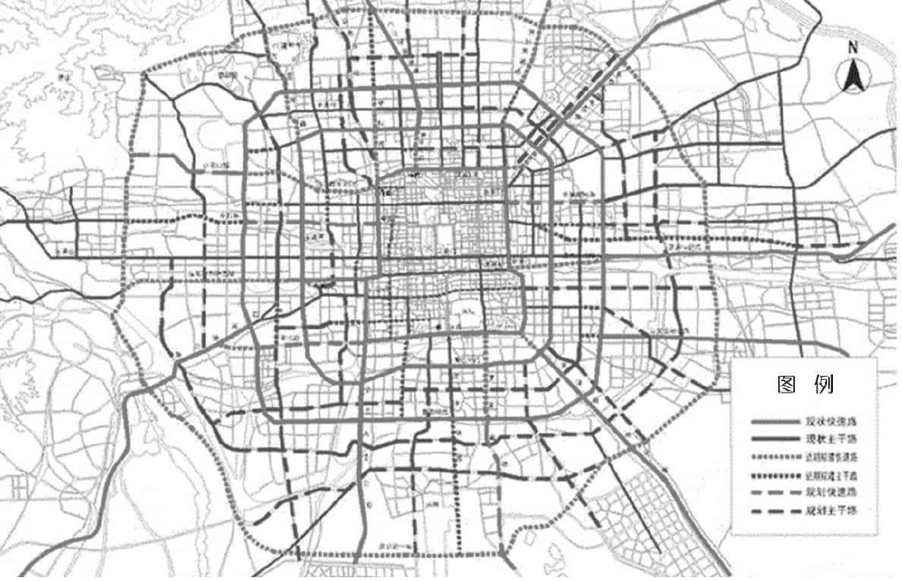
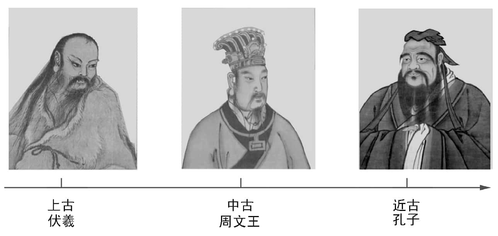
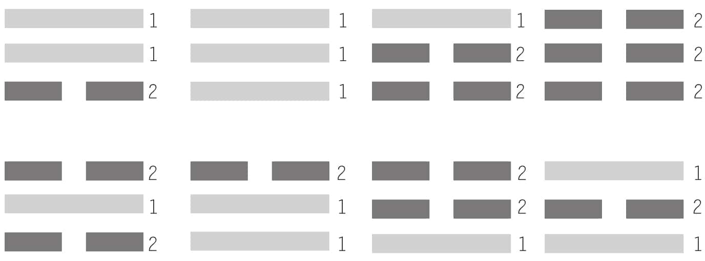
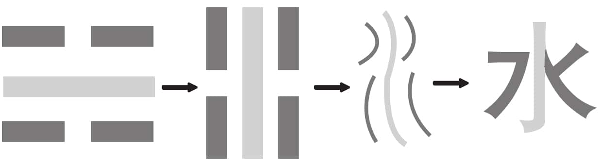

 *第一集 何为《易经》*

凝聚着中国古圣先贤古老智慧的《易经》，曾长久地被误解为一本算命的书。随着科技的发展，东西方文化的交融，《易经》越来越受到中外科学界、文化界的重视，西方学者称之为“一部奇妙的未来学著作”。

那么，《易经》究竟是一部什么样的书呢？它是一部既古老又新奇，既陌生又熟悉，既高深莫测又简单易懂的书。面对这一组互相矛盾的词语，我们不禁要问，《易经》究竟是什么？我们又如何才能够读懂古老而神秘的《易经》？而懂了《易经》的道理，对于我们的人生会有什么意义呢？

要了解《易经》，首先要从“何为《易经》”这个题目开始。《易经》是什么？所有文献都是这么记载的：《易》是群经之首。因为不管是五经还是六经，都把《易经》摆在最前面。实际上这句话太客气了，应该是“《易》为群经之始”。因为它是中华文化的总源头，是诸子百家的开始。

《易经》是什么？这种问题大概只有中国人听得懂，外国人不太喜欢这样的问题，因为这种问题的答案不管怎么说都对，但是怎么说都只是说对一部分，不可能全对，因为《易经》太大了。就像偌大的北京城（见图1-1），不管是乘坐飞机、火车，还是通过高速公路、国道、省道、城乡道路都能进得来，可是进来以后，谁都不能说自己真的就算是了解整个北京了。

图1-1

关于《易经》，为什么总是见仁见智，各执己见？就是因为每一个人都只是从一个角度去看，都只看到一个方面，每一个人只讲对一部分，很难把它讲得很全。所以研究《易经》，一定要有比较宽广的包容性。

《易经》是怎样完成的？按照一般的说法，叫作“人更三圣，世历三古”（《汉书·艺文志》）。《易经》的完成，经历了三位圣人：第一位是伏羲；第二位是周文王和周公父子，他们一家人算作一位；第三位我们大家更为熟悉，就是孔子。伏羲在上古，周文王在中古，而孔子在近古，或者叫下古（见图1-2）。

图1-2

明明是四个人，为什么说是三个呢？这跟《易经》有很大的关系。因为“三”是奇数，是阳的，而四是偶数，属阴的，所以我们说是三位。大家看唐装，它的纽扣不是五个就是七个，不会是四个或六个，也是这个道理。

实际上，《易经》成书所经历的时间非常长，所经历的圣人也很多，应该说，《易经》是我国古圣先贤集体创作的成果。我们中国人，差不多所有东西都是集体创作的，很少有一个人单独完成的。

《易经》广大精微，无所不包。“其大无外，其小无内”（《吕氏春秋》），这两句话大家非常熟悉。大到没有外面，够大的吧！小到没有里面，够小了吧！我们今天很喜欢讲系统，而世界上最大的系统，就是《易经》。因为所有能列举出来的大系统，像太阳系、银河系等等，都不可能大到“其大无外”；所有能列举出的分子、原子、质子、电子等等，都小不过“其小无内”。

那么，这样广大精微的一本书，到底有什么用处呢？说出来，有些人会不相信，有些人会吓一跳，但是如果大家看完这本书，一定会恍然大悟——《易经》是解开宇宙人生密码的宝典。

也许有人会觉得这样说很夸张，因为现在世界各国的科学家，兢兢业业，就是为了解开宇宙的密码。有了那么多的科学仪器，那么尖端的技术，他们都还不敢说能够做到，这么一本几千年前的古老经书，怎么能做到这样了不起的事情？所以大家心里一定充满疑问：到底解开了没有呢？

如果没有解开，那不是空谈吗？讲了半天，没有效果，即使再古老，再广大，又有什么用？我们可以大胆地说：解开了。

孔子解开这个密码以后，到现在已经过去了两千五百多年，但是我们一直都是小用，从来没有大用过。孔子曾感慨说：“人能弘道，非道弘人。”（《论语·卫灵公》）但是他的感慨我们依然听不懂，我们把它当书来背，我们也考试，可就是不知道它的真正意思是什么。“人能弘道”，意思是人能够把这个密码好好来运用；“非道弘人”，是说你不能在这儿躺着，等它来给你帮忙。孔子的这句话是说：宇宙的密码已经解开了，但是要靠人来把它发扬光大，而不是等待那个密码来帮我们解开。那么，我们又凭什么说，到孔子的时候，就已经解开了宇宙的密码呢？

自古以来，人类一直在使用各种方法去探索宇宙的奥秘，但是直到科技高度发达的今天，宇宙对于人类仍然是一个巨大的问号。那么我们的老祖宗在几千年之前，怎么能够得到破解宇宙的密码呢？

因为我们中华民族的祖先得到了三把钥匙。第一把钥匙，叫作伏羲八卦。在中国，几乎人人都看过八卦图，家家户户也都挂过，只是搞不清楚那是做什么的。殊不知，那正是一把打开宇宙密码的金钥匙。我们在手上拿了七千年，却始终没有悟到它真正的作用，总以为那是很好玩儿的，可以辟邪的，连外国人也跟着我们糊里糊涂的。外国人现在也挂八卦图，但你问他为什么，他一定会说：“那是你们中国的玩意儿，我怎么知道？”

伏羲的八卦告诉我们一个宇宙最基本的秘密，我们用两个字就把它讲清楚了，叫作“阴阳”。现代科学家已经感觉到，物体一定有最小的基本构成元素，他们讲了很多很多，却始终讲不出“阴阳”这两个字来。我们一天到晚在讲“阴阳”，可是我们反而不知道，这就是宇宙万事万物最基本的构成元素。

第二把钥匙，是文王六十四卦。它告诉我们，宇宙只有六十四个密码。大家一定会产生疑问：为什么是六十四个呢？不可以是六十三个吗？不可以是八十二个吗？《易经》讲“数”讲得非常多，但是如果用我们现代的数学观念来看《易经》的数，那就相差太多了。因为数不等于数字。数是有生命的，是活的，不是死的。有一句话非常重要：这件事情不过是“一而二，二而一”而已。这句话大家经常听到，只是没有在意。什么叫“一而二，二而一”？等到讲易数的时候，我们会把它说清楚。

六十四卦就是宇宙的六十四个密码，它是用数字来代表的。凡是密码，必定离不开数字。我们现在所用的保险箱都是用数字做密码的，但是那个数字是死的，一就是一，二就是二，而宇宙的数是活的，是变化的。

第三把钥匙，是孔子给我们的《十翼》。孔子“删《书》《诗》”，把《尚书》《诗经》删了一大部分；制定礼乐，修了一部很难的书，叫《春秋》。但是他看到《周易》，却是很恭敬地赞美。

《周易》成书以后，多少人想动它的一个字，都动不了。孔子当然也有责任，如果其中真的有不对的地方，就要删，就要改。可是他读完以后，肃然起敬，赞《周易》，而且替《周易》装上十只翅膀，我们称之为《十翼》。孔子希望《周易》能够“飞起来”，可惜到现在，他的理想还没有实现。

《周易》“飞起来”以后是什么样子？就是世界大同。实际上，地球村就是世界大同，世界大同就是地球村，西方的理想跟我们的理想是一样的。我们现在是要按照西方的路子走向地球村，其实这样也没有关系，因为“功成不必在我”，只要能够实现和平发展、人类和谐，无论用什么方法，我们都不反对。

可是，从目前形势来看，下面的路要靠我们自己来走。靠什么走？就是这部有十只翅膀的《周易》。我们有这么好的宝藏，可是我们自己睡着了，醒不过来。沉睡了这么多年，现在是醒的时候了。

我们今天所看到的《易经》，可以说是三位古圣先贤共同创造出来的：伏羲创造了八卦图；周文王创造了六十四卦，后被称为《易经》；而孔子则为《易经》作了《十翼》，也称《易传》。那么《易经》的首创人伏羲是谁？他又为什么要创造八卦呢？

伏羲为什么活在我们心中呢？我先请问各位：伏羲是谁？他是什么样的一个人？关于伏羲，我们可以用一句现代的话来描述他——他是一位真正为人民服务的人。

外国人不太了解我们，总说中国人拜偶像，其实中国人自古以来从不拜偶像，我们只是感谢、纪念那些生前很热心，真正为人民提供最好服务的人。你看，我们所拜的人，哪一个不是生前为人民服务的人？为人民服务是古今中外不可改变的定律。但是，为人民服务有真的也有假的，有做得好的也有做得不好的。真正做得好的，在他们死后我们不能将功劳一笔勾销，要永远记住他们，这是中国人的永生之道。

全世界的人几乎都在追求永生，因为大部分的人都不甘心只活几十年就走了。西方人找不到任何途径，最后只有寄希望于宗教，叫作“信我者得永生”。中国人不是这样，中国人是只要活在大家的心中，就永远不会死。比如孔子，就永远不会死，他活在我们的心中；伏羲也永远不会死，他活在我们心中。

伏羲替当时的人民，化解了很大的问题。当初，人类还没有进入农业社会，人们靠打鱼、狩猎过日子。一个人要出去打鱼、狩猎，最怕的是什么？就是半路上碰到天气骤变，来不及躲避，这样很可能连命都没有了。所以很多人问伏羲：明天要出去，天气会怎么样？伏羲可以说是全人类、全世界第一座气象台的台长，他告诉人们：“明天是大晴天，你去好了”“明天往南走有雷，你要小心”“你往西北走，有大雨”……刚开始大家还将信将疑，可是后来随着验证次数的增多，大家都觉得他说得很准，于是来问的人越来越多。人多了以后，伏羲没有那么多时间应付，怎么办？他就说：“从明天开始，我在这棵树上挂一个‘’的图像（见图1-3），就表示明天是雨天……”伏羲跟老百姓讲，这是“2、1、2”（见图1-4），代表下雨。“2、1、2”是人类所知道的第一个密码。

图1-3

图1-4

伏羲得到了人民的信赖，并根据人民的需要，把他的气象预报逐渐地扩大，慢慢地推出不同的卦象，就变成了我们一直到今天都很熟悉的八卦（见图1-5）。

图1-5

伏羲并没有一开始就告诉大家，这是什么，那是什么，因为跟老百姓讲得太多，基本上是没有用的，所以他只告诉大家记几个数字就好了，“1、2、1”代表什么，“1、2、2”代表什么，“2、1、2”代表什么，“2、2、1”代表什么，等等，跟今天的电脑完全一样。打电报也是一样的道理，给出一组数字，对方就知道是什么意思。所以说数字化时代老早已经开始了，我们今天不过是承继伏羲的路线走下来而已。

最古老的汉字是根据图像来的，所以叫作象形。本来是一个下雨的符号，一倒过来就变成了“水”字（见图1-6）。后来人们根据伏羲的八卦，慢慢地造出很多字来，这是事实。但是，伏羲的用意是要告诉我们整个宇宙的状况，让我们知道怎么样去适应，怎么样去改善，这个工作到现在还在持续进行中。

图1-6

后来，有些老百姓对伏羲说：“你总教我们背这些数字，我们有时候也会搞错，你干脆告诉我们它的道理吧。”伏羲说：“既然你们想知道其中的道理，那我就告诉你们。只要把这张图（见图1-7）看懂了，就能够完全懂得其中的道理了！”

图1-7

伏羲八卦是什么？就是我们经常说的无字天书。我们从小就听说过无字天书，伏羲八卦就是无字天书。因为伏羲当年根本还没有文字，所以《易经》整部书只有图像，没有文字，所有的字都是有了文字以后，慢慢加上去的。加到最后，整部《易经》也不过四千多字。

没有文字，没有条条框框，不受任何局限，就可以通天下，通宇宙。伏羲是把整个都想通了以后，才开始来画卦的。所以我们对他那一画，非常地恭敬，称为“一画开天”。《易经》是从开天辟地，也就是今天科学上所讲的大爆炸说起的，一直说到人类最后的状况。我们直到今天还没有完全把它展开，因为我们还有很长的路要走。今后人类世世代代都要取用于这本无字天书，这是取之不尽、用之不竭的一部宝典。

伏羲八卦图这部无字天书，能够历经七千年的岁月，一直流传到今天，足以证明真理永存的道理。那么在蛮荒的原始时期，伏羲怎么能够发现宇宙的奥秘？又是怎么画出八卦图来的呢？

伏羲用的方法是什么？他用的三个方法，对我们中国人影响太大了。第一个方法叫仰视。大家可能会认为仰视很轻松，头一抬，就看到天上了。但是仔细想想，你会发现，动物没有权力仰观天象，仰视是人类独有的。一切都有天象，我们为什么不看呢？为什么光凭脑子去想呢？

中国人很会仰，但是仰到后来不够高，只是仰长官的脸色。我们现在很多人都在看长官的脸色，就是眼光不够高，其实再仰高一点儿就看到天象了。如果长官的脸色跟老天的气象是一致的，那你就可以照着去做，因为他合乎天理；如果长官的脸色跟老天的气象不配合，你就要摸摸良心，想想要不要听他的，这样才对。

第二个方法叫俯视，意思就是你照顾了别人，也要照顾照顾自己。整部《易经》都是从人身上看出来的东西。我们经常讲“万物皆备于我”，因为“我”就是一个小宇宙。自然中有山，人也有。人的山在哪里？鼻梁就是山。宇宙所具有的东西，我们在自己身上全都找得到。所以作为一个人，真的很不简单，千万不要把自己看成动物。“人为万物之灵”，这是周武王讲的，这样的话只有中国人讲得出来。周武王看到自己的父亲那么有成就，把一部《易经》全部整理出来，就想到自己也要做点儿什么，于是他讲了这句“人为万物之灵”。这一句话唤醒了很多人，但是有的人听了，还是无动于衷。

第三个方法，用我们现代的话讲，叫作广角。我们照相会用广角镜，就是不能光看一个地方。看天象也不能光看一个地方，要多看一点儿，四面八方都要看一看。看得很周到，想得很周密，一点儿都没有遗漏，这样才叫作《周易》。《周易》这个“周”字，跟周朝并没有直接关系，只是刚好周文王的朝代称作“周”，所以大家才会觉得有关系。其实我们应该想一想，周文王是精通易理的人，他不会把自家的姓冠在一本书上面，这是犯忌的。周是很周密，很周详，而且是周流不停、往复循环、生生不息的，所以才叫《周易》。

伏羲为什么画卦？很多人说他是为了造字，推行文字教育。实际未必，如果伏羲是为了造字，那他的成就就很低，跟仓颉造字也就没什么差别了。仓颉的名气跟伏羲是不能比的。伏羲没有造字，因为他知道整个系统都是图像、数字。

伏羲八卦图是由数字组成的，现代高科技的电子计算机，也是由数字组成的，因此，有人说，中国七千年前的伏羲，可以说是电脑的鼻祖。那么，古老的《易经》和现代科学之间，到底是一种什么样的关系呢？

我们讲一句现代的话：0和1构成了浩瀚无穷的互联网络。这句话大家都很接受，觉得很科学，很现代化，跟国际接轨了。其实我们老祖宗七千年前就讲了：一阴一阳产生了宇宙万象。这两句话的意思是一模一样的，只是用词不一样而已。但是“一阴一阳”如果解释成一个阴和一个阳，那就大错特错了，就这么一点点差别就会产生很多流弊。所以我们一定要把这些细节都厘清，不要有任何的误解和扭曲，以免辜负了这么一部很难得的解开宇宙人生密码的宝典。

《易经》这部宝典静静地躺在那里，你不理它，它不会理你。你理它，它也不会拒绝你。可是你从中能得到多少是你自己的事情，它帮不上忙。这才是真正的自然。《易经》是完全根据自然发展出来的一套系统。

中国人所讲的道理，都是从自然中开发出来的，我们一切向自然学习，以自然为师。狂妄自大，想怎么样就怎么样，是不合自然的。有人会问，现代科学难道不可以持续发展吗？当然可以。科学是人类非常需要的东西，只不过西方人欠缺这种用自然来引导科学的态度。我们要记住，一切事物的好与坏、对与错，都要用是否符合自然这一标准来检验。二十一世纪为什么是中国人的世纪？就是因为中国人开始要用自然的法则，来规范现代的科学，让它走上正道，让它协助我们人类过幸福、安康的日子。

《易经》这部宝典是我们的祖先辛辛苦苦开发出来的，但是我们没有申请智慧财产权，我们认为大家都可以用，不需要收取任何费用。这才是做人的风度，这才是大度量。

《易经》是完全根据自然发展出来的一套系统，为什么后来成了中国哲学思想的总源头？而伏羲用来做天气预报的符号，又为什么成了破解宇宙人生的密码？我们现代人学习《易经》，又有什么实际意义呢？

伏羲原来用符号来告诉人们天气变化，后来慢慢发现，不仅仅是气象，有很多跟生活直接相关的东西都可以从里面开发出来。

按照今天的说法，《易经》可以说是自然科学。但是，我们知道，在孔子以后，这部书除了自然科学的部分，又另外加上了一部分，叫作人伦道德。两个东西合起来，才能够表示整体的《易经》。

现代人学习《易经》，有什么实际的意义呢？这个问题很重要，如果学了半天没有用，时间那么宝贵，拿来学它干什么呢？我们可以讲出很多用处，但是按照《易经》的习惯，我们一般每次只会讲三个。所以我们就提出下面三点，请大家参考。

第一点，《易经》可以纠正我们很多似是而非的观念。有太多的观念是使我们的脑筋不清楚的，可是我们自己不知道。举一个例子，今天大家非常普遍地认为自信是对的，但是，人应不应该有自信，这个问题不能用应该或者不应该来回答。《易经》里面讲“自天佑之，吉无不利”，是包括自信在内的。但是中国人讲到“自”，只讲自觉、自反、自省、自律，我们从来没有讲过自信。现在年轻人太自我，太自信，一生都不会幸福的。因为，人有可控制的部分，也有不可控制的部分。可控制的部分是“操之在我”，但是不可控制的部分是“操之在天”，所以中国人的信心是对老天有信心，而不是对自己有信心。我们相信老天会保佑我们这种人，我们多拐一个弯想一想，如果老天不保佑我们这种人，那还保佑谁呢？如此而已。如果把老天去掉，只有自信，那就会自大，就会狂妄，就会过分自我，然后人际关系就会很差，什么事情都做不好。目前有很多所谓的普世价值，其实都是有待商榷的，这个要在学完《易经》以后才能厘得清。

第二点，《易经》有神秘性，也有道德性。有神秘性，是因为以前科学不够发达，我们没有办法用科学来解释它，所以只好用神道把它包装起来。现在科学发展了，我们可以把《易经》里面的神秘性用现代科学来诠释，但是它的道德性，是没有办法取代的。所以，《易经》的道德性，在二十一世纪还会得到很大的发扬。

第三点，《易经》求同存异的思想是实现全球化的必然之路。全球化是必然的趋势，谁也阻挡不了。但是现在大家看到，凡是全球性的活动，都会有人强烈反对。因为全球化会引起很多人的不安，认为全球化以后，会把本土的文化整个消灭掉。没有一个地区希望自己的文化被消灭掉，只有像《易经》这么广大包容的思想体系才可以化解这个问题。我们用四个字就化解了——求同存异。我们求同，但是会存异，我们会尊重每个地区的文化，但是我们会在这当中找出一个最大公约数，变成大同的基因，这个只有《易经》做得到。

要了解《易经》，先从阴阳开始，这是伏羲最了不起，也最难得的贡献。我们对阴阳很熟悉，但是我们经常用错，所以我们接下来要好好地介绍：何为阴阳。

