 *第二集 何为阴阳*

《易经》中有六十四个卦象，而这些看似复杂的卦象，其实只包含着两个符号，一个是阴(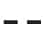)，一个是阳(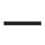)。曾仕强教授指出：伏羲八卦图告诉了我们一个宇宙最基本的秘密——阴阳是构成宇宙万事万物最基本的元素，天底下的变化，就是阴阳的变化。

什么是阴阳呢？曾教授举例说，白天是阳，夜晚是阴；天是阳，地是阴；大拇指是阳，其余四个手指是阴。阴阳之间的关系是阴中有阳，阳中有阴，这样才有生命力。那么，我们又怎么能够证明阴阳是构成宇宙万事万物的基本元素呢？

说到什么叫阴阳，可以举出很多很多的例子。我们先从大家最熟悉的说起，晴天阳光很明媚，出大太阳，一定是阳。因为一出太阳，人就感觉到心情很愉快，做事情就很奋发。阳是向外扩张的，天气热的时候，大家都往外伸张，想多得到一点儿冷空气。可是阴天下雨的时候，大家就开始缩起来，这样才不会受寒。所以，往外张是阳，向内缩是阴。慢慢地，人们就把太阳叫作阳，把月亮叫作阴。

要想知道什么时候月亮圆，什么时候月亮缺，要看阴历，不能看阳历。阴历十五那天月亮一定很圆。一年有十二个月，也就有十二个十五，十二个月里哪个月的月亮最亮最圆？八月十五。这个时候的月亮就有一点儿阳的味道了，所以那天晚上大家就很不安分，因为月亮不光会引动潮水，还会牵动人的情绪。于是我们说，这天是中秋节，大家要吃月饼，要一家和乐，不能外出。这是非常了不起的一种措施。

我们中国人向自然学习的东西太多太多了。白天是阳，晚上是阴，所以，一个人白天要精神好，要阳气足，这样才能够做事情；到了晚上，要慢慢阴起来，要让自己冷静下来，然后才可以好好睡觉。现在很多人不是这样，越到晚上反而越阳，这种违反自然规律的人一定活不久。我们一再说，现代科学过度违背自然规律，结果影响了人的健康。

天是阳，地是阴，这个能颠倒吗？大概不能。人活着，叫作还在阳间。人死了，对不起，就归阴了。有谁说人死了是归阳的吗？应该没有。死了就归阴了，而活着就要阳气十足，这也是很自然的现象。

我们看完外面，再看看我们自己，那就更有趣了。手心和手背，哪个是阳，哪个是阴？手心是阳，手背是阴。阴阳是分不开的，如果不要手背，手心有什么用？光要手心，手背也没有用。手心手背都是肉，就表示阴阳归一。我们平时教训小孩儿都是打手心，没有家长会打手背，打手背是很残酷的。打手心是爱护他，打手背是折磨他。因为手心的肉比较多，而且动得快，一打就可以收回来，手背却弯不了，打上去很痛。所以活动性比较大的叫阳，活动性比较小的就叫阴。没有哪个人是手心动不了，手背却可以动得很厉害的。

人很有趣，我们的脸朝向哪边，活动面一定朝哪边，这是非常好的配合。左右两只手，哪只是阴，哪只是阳？很简单，常用右手的，右手就是阳，比较笨拙的左手就是阴；常用左手的，左手就是阳，右手就是阴。阴阳是相对的。

还有更妙的，大拇指是阳还是阴？大拇指是阳。那阴呢？剩下的四个手指头就是阴。我们慢慢就可以体会到，奇数就是阳，偶数就是阴。凡是成双成对的偶数，像2、4、6、8、10都叫阴；凡是出单的奇数，像1、3、5、7、9都叫阳。通常我们一只手只有一个大拇指，所以大拇指一定是阳。

为什么头是阳，脚是阴？因为头只有一个，它是奇数，所以叫阳。脚有两只，是偶数，所以就叫阴。我们一切都是向自然学习，很少做人为的操作。大家有时间经常循环反复地做这两个手指的运动（见图2-1），把这两个动作连起来做，对我们身体非常好，能把我们全身的经络都带动起来。

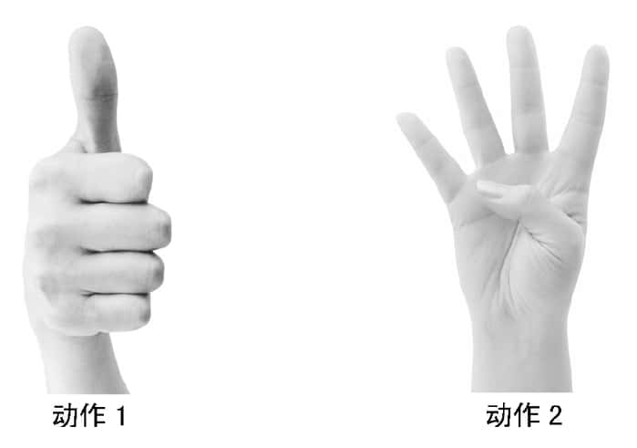
图2-1

大自然千奇百怪，包罗万象，如果进行分类的话，将是一个看不到头的天文数字，但是《易经》却只用了阴阳两个元素，就包含了宇宙的万事万物。人类是自然之子，我们想要了解自然，了解人类自己，可以从了解阴阳开始，那么阴阳之间是一种什么关系呢？

阴阳不但是相对的、变动的，而且也是不可分割的。这一点非常难理解，经常被忘记，但是我们却一直都在用。我们受了太多现代的教育，都说一切要分得清清楚楚，可是自然怎么分得清楚？白天跟晚上你分得清楚吗？根本分不清楚。本来是白天，慢慢地天黑了；本来是黑夜，又渐渐地天亮了。这是个自然的过程，并不像开灯关灯那样分明。而且今天天亮得晚些，明天天亮得早些，一年三百六十五天，每天多少有一点儿不一样。因为一切一切，都是无法决然分割的。

树芽和树叶（见图2-2）哪个是阴，哪个是阳？树叶是阴，树芽是阳，因为树芽不断地在成长。所以要摘就摘叶子，不要摘树芽，摘芽是不人道的。

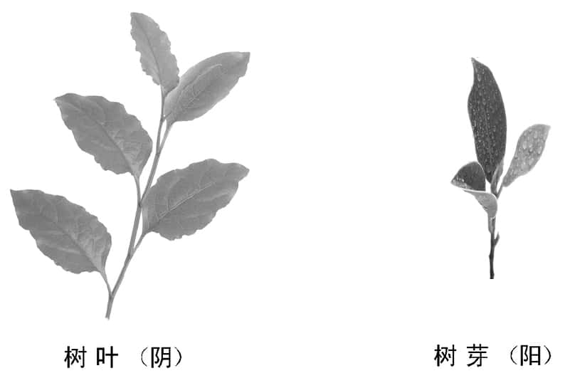
图2-2

有真就有假，有假必有真，真真假假，虚虚实实，也是阴阳。当一个人反复强调所说之事千真万确的时候，其实也就是在告诉你，那不一定是真的。因为说话的人心虚，所以才会一再地强调，否则根本不用那样。一个很守信用的人，不会标榜自己守信用，因为这对他来讲已经是习惯了。把“我从不骗人”挂在嘴边的人，就是因为常常在这里骗，在那里骗，怕被人一眼看穿是骗子，才会一再强调自己从不骗人。学了《易经》，知道阴阳是合一的，两边都兼顾起来，大概就不太会上当了。

我们接着说大拇指，它1，是奇数，是阳，但是它有几个节？有两个节，叫作阳中有阴（见图2-3），而且这个阴阳也是分不开的。你说一节就好了，不要两节，能行吗？当然不行，那样手指还怎么弯曲拿东西呢？人要刚柔并济才好，不能刚到底，有柔才会刚，没有柔，根本就刚不了，况且没有柔，也根本不存在刚。

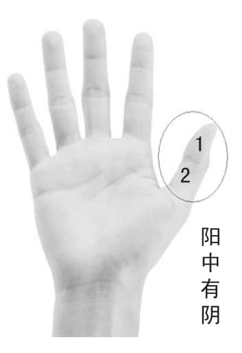
图2-3

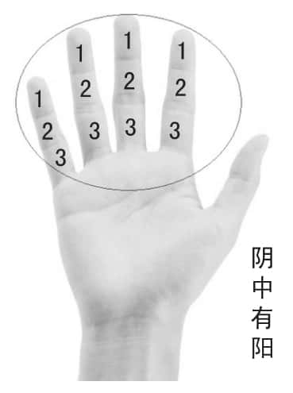
图2-4

除了大拇指，其余四个手指是偶数，是阴，但是这四个手指却每个都有三个节，叫作阴中有阳（见图2-4）。这个很妙，大拇指只有一个，有两节，其他四个手指头都有三节，但是它们的功能是一半一半的。如果大拇指没有了，要骑摩托车可能就很难，怎么发动呢？你看猴子不如人灵光，就是它的手指不灵活。所以有时间多做弹钢琴一样的手指抖动动作，全身就会活络起来。只要顺乎自然，不必那么操心，不必那么忙碌，身心都会很健康，就可以过很好的日子。这才叫《易经》，它就在你的手中。

如果进一步了解，那就更妙了。你算算一只手有几个节？有十四个，两只手有二十八个（见图2-5），天上的二十八个星宿都在你的掌握之中。俗话说“秀才不出门，便知天下事”，掐指一算，什么都知道了，叫作袖里乾坤。这些一点儿都不稀奇，只是没有把道理说出来，大家才会觉得很神奇，把道理一说出来，就发现其实很简单。所以学习《易经》，要先学其中的道理，把道理搞懂了，就不会走火入魔，就不会被人欺骗，更不会上当吃亏了。

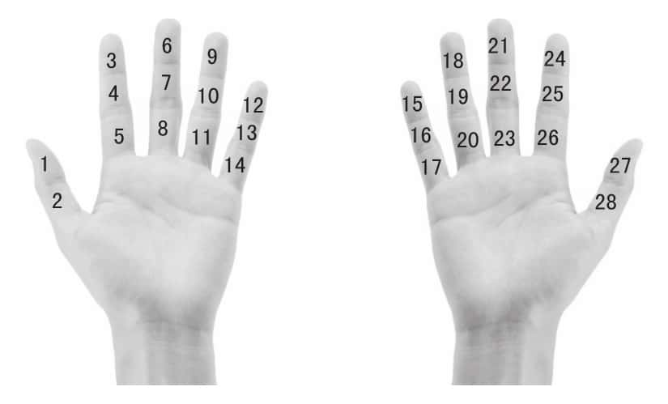
图2-5

由于《易经》源自远古，又是以一些虽然简单但很难记住的符号所组成，所以大多数人很难读懂《易经》，只好敬而远之。而某些略知一二的人，则利用《易经》去算命，其实只要我们懂得了《易经》的道理，《易经》将不再神秘，我们的人生也将更加智慧。

读《易经》读出很多君子，同样也读出很多小人。而且很奇怪，小人阴中有阳，还活跃得更厉害，我们一定要提防。所以《易经》一方面告诉我们，害人之心不可有，另一方面也提醒我们，防人之心不可无。这也是阴阳。

中国人是全世界唯一同时讲两句话的人，我们讲话经常是阴阳同时讲。嘴上说的这句话叫作阳，因为听得见，心里说的那句话叫作阴，是听不见的。嘴上讲“不以成败论英雄”，心里说“成者为王，败者为寇”；嘴上讲“人同此心，心同此理”，心里说“人心不同，各如其面”。最妙的就是，嘴上讲着“礼让为先”，心里说的却是“当仁不让”，到底要不要让呢？只有一个答案：看着办。

懂得了《易经》，你就可以完全了解中国人。尽管我们今天讲了很多西方的话，讲了很多现代自以为是的话，但是都没有用，因为有些东西是不会改变的，这已经变成我们血液里的东西，叫作我们生命当中的基因。

阴阳是我们非常熟悉的观念，但是阴阳的内涵实在是太多了，不容易完全体会。因此，我们也提出三个重点，供大家参考。

第一个，阴阳是相对的。如果没有相对，你就不知道哪个是阴，哪个是阳。头是阴是阳？要看怎么说，头跟脚相对，那头就是阳，脚就是阴。有相对才有阴阳，不是绝对地说这个一定是阴，那个一定是阳。

第二个，阴阳是会变动的。这也就解释了为什么阴阳是相对的，阴的会变阳，阳的会变阴。为什么“一”那么重要？因为九九还是要归一，再怎么长久去改变，最后还是要归一的，而“一”就是原点。

第三个，阴阳是合一的。虽然阴阳是相对的，是会变动的，但阴阳又是分不开的，有阴就有阳，有阳就有阴，所以叫作阴阳合一。这个对我们中国人影响太大了。我们中国人想事情都是合起来想，很少像西方那样分开来看。尤其是现在的分科教育，越分越细，分到最后支离破碎，以至于只有知识而丧失了智慧。我们现在虽然口口声声说要科技整合，却始终做不出来，就是因为分科以后，分了出去，收不回来。

西医是分科的。你去看西医，他问你挂什么科，这就糟糕了，我们又不是医生，怎么知道该挂什么科？挂个外科试试看，治了半天才说你搞错了，应该看内科才对，可是命已经没有了。中医的大夫是通才，你去看中医，他会告诉你，你的病是由什么引起的，因为全身是一个整体系统，是不可分割的。而且更妙的是，我们会针灸。我在英国的时候，很多英国同学一听到针灸就害怕：怎么拿针往身上乱插呢？有些医生还跟我说针灸是没有道理的。我问为什么没有道理，他说：“万一针到血管，血不就流出来了吗？”我告诉他：“我们不会针血管，也不会针骨头、针肉，因为骨头根本针不进去，针肉也没有什么用。我们专针一种你们不懂的东西，叫经络。”他一听经络就傻掉了，因为他们在实验室全身解剖也根本找不到经络。经络是人活着的时候才有，人一死，气门闭了，经络也就没有了。

有阳就有阴，有虚就有实，有看得见的就有看不见的，有摸得着的就有摸不着的。天上的飞机能随便飞吗？当然不可以，它有航道。可是你去看航道在哪里？火车的轨道我们看得到，飞机的航道我们看得到吗？飞机的航道是在飞机飞的时候有，飞机不飞的时候就不见了。这跟我们人身上的经络是一样的道理，飞机一落地就好像人结束了自己一生的行程一样，航道随着飞机落地不见了，经络随着人死也没有了。不要坚持亲眼看到的才相信，要知道，眼睛能看到的是非常非常有限的。

西方先进发达的科学技术，在带动经济迅猛发展了几百年之后，遇到了环境污染、经济危机等许多解不开的难题。于是，许多西方学者开始提出要学习东方古老的智慧。太极图是大家既熟悉又陌生的一张图，那么这张图代表了什么意思？又蕴含着哪些中国古老的智慧呢？

伏羲看看天，看看自己，看看四面八方，有所领悟，画出八个卦象，后人用心体会伏羲八卦，画出了一张图（见图2-6）。这个图叫什么？你叫它太极图，或者叫它两仪图，都好像是也对也不对。

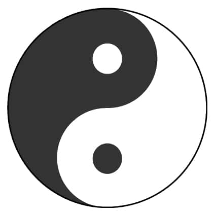
图2-6

这个图告诉我们几件事情：

第一，它是圆的。为什么要画成圆的，不画成方的呢？因为圆的东西容易变动。我们所有车轮都是圆的，你说不行，要特别一点儿，轮子就是要方的，那你根本就开不动。

第二，宇宙一切一切都要“求圆满”，不要去伤害别人。一个有棱有角的人，经常跟人家吵架，很多事就不容易办成。所以一定要圆，圆的东西就不容易伤害别人。可是圆不是圆滑，做人绝对不可以圆滑，但是一定要圆通。

第三，要生生不息，一定要阴阳互动。世界上不可能全阳，也不可能全阴，因为“孤阴不生，独阳不长”（《幼学琼林》）。世界上只有男人，人类就毁灭了；世界上只有女人，人类也不见了。所以有好人，就一定有坏人，千万不要疾恶如仇。坏人是杀不完的，好人也死不光，这个世上永远有好人，也永远有坏人。我们必须要面对这个现实，要走实际的路，不能要求太理想。慢慢大家会发现，阳是代表一种理想，人生一定要有理想；但阴就是脚踏实地，一定要一步一步地去兑现，去把理想实践出来。

说到这里我们会发现，天底下的变化就是一阴一阳。阴阳到底是一还是二？这是非常有趣的事，说一也不对，说二也不对，答案是亦一亦二，也是一，也是二。因为它一分为二，又一定要二合为一（见图2-7）。这个答案中国人很接受，但是外国人很排斥。我们现在所欠缺的，是一分为二以后不知道回补。我们走路，如果两只脚一起跳出去，那不跟僵尸一样？僵尸是归阴的，所以才会两只脚一起跳（二为阴）。人活在阳间，当然是一只腿、一只腿地迈进（一为阳）。

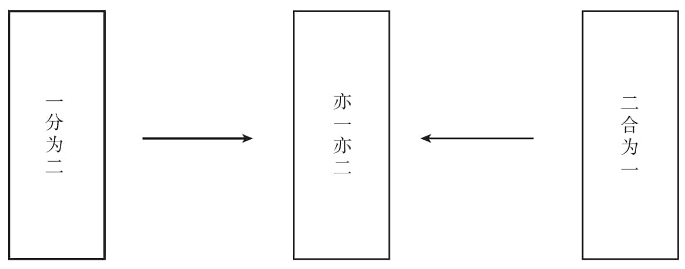
图2-7

一在先，二在后，所以是阳在先，阴在后。但这一句“阳在先，阴在后”，却也引起很多很多的问题，最主要就是把它曲解为男尊女卑、重男轻女。

在《易经》的阴阳学说中，天是阳，地是阴，男人是阳，女人是阴。在八卦图中，纯阳卦在上，纯阴卦在下，于是就有人说，这标志着男尊女卑。其实这是对阴阳学说的错误理解。

天高高在上，地低低在下，这是事实。但，这样就表示天比地尊贵吗？如果没有地，只有天有什么用？如果没有天，只有地又有什么用？所以，天地是相对的，是不能分离的。

为什么月球上面没有人，地球上面却有，这是什么道理？地球最大的功能，来自于我们这块土地。土地只做一件事情，就是把天牢牢地拉住。你不要给我跑掉了，因为你是我的“丈夫”，你跑掉我怎么办？所以，女性同胞要练就一种功夫，就是不要让你的丈夫跑掉。可是这门功课我们从小到大都没有修过。你看，从小学到大学到博士班都没有这门课。地靠什么去拉住天？就是靠地心引力。它不说话。所以你看，妈妈就是地，她不说话，可爸爸都听她的。但如果妈妈一说话，爸爸就很反感，说：“你说那么多干什么？你不说我都听你的。”大地不说话，结果老天都听它的，就是因为它懂得把天捧得高高的。女性同胞懂得《易经》，就会知道把男人哄一哄、捧得高高的，他一辈子为你做牛做马。但是这门学问，我们都失传了。

“合一”的“一”是指：阴中有阳，阳中有阴，它才有生命。阴阳是一体两面，如影随形，合一的意思就是阴中有阳，阳中有阴，这样才有生命力，完全是阳也没有用。一个人脾气很硬，硬到底，只会被气死。这样大家才知道，中国人练身体很少像西方人那样，练到满身肌肉。中国人练都是练内脏，要让它健康，外面无所谓，这叫作外柔内刚。

胳膊伸出来，外边是阳，里边是阴，所以外边敲得重一点儿没关系，里边千万别使劲敲，一使劲微血管就出血了。像这些道理都是很自然的，有阳必有阴，不可能两边都阳，两边都阳，胳膊就弯不进来了。胳膊无论如何要向内弯，向外弯就断了。

《易经》中的六十四卦，就是阴阳两个符号的排列组合，但是这两个非常简单的符号，却组合出了很多的卦象。我们学习《易经》最大的困惑，就是记不住这些卦，也不明白为什么要这样组合。那么学习《易经》时，是不是一定要背这些卦？还有什么更好的方法，来读懂《易经》呢？

因为我学《易经》比较晚，不像很多人十几岁就开始学，所以我不太主张死记硬背，背错了那不糟糕了吗？现在脑筋要记的东西太多，整天去背那个，岂不什么事情都不要做了？

《易经》是宝典，宝典就像字典一样，是供人查的，要用就去查好了，干吗要全放在脑袋里面呢？看久了、用多了，不必刻意去背也就记住了，记住多少算多少，这才叫自然。我们中国人常讲，一回生，两回熟，你只要记住它的道理，自然会画出卦来。关于画卦，没必要死记硬背，懂得了其中的道理，大家就可以自己画出八卦图。

太极生两仪，两仪生四象，四象生八卦（见图2-8）。太极“亦阴亦阳”这四个字非常重要，就是也是阴也是阳，也有阴也有阳。记住一句话：阴阳永远分不开，一分开就麻烦了。

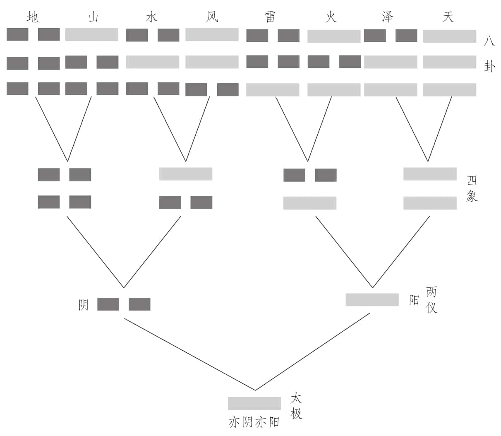
图2-8

我们为什么叫中华？有一句话是跟我们每个中华儿女都有关系的：太极就叫“中”，太极上面的部分就叫“华”（见图2-9）。为什么我们万变不离其宗？就是变来变去离不开太极，怎么变都可以，就是太极不能变。中，就是要守住中道。中国人不管长什么样子、什么肤色、什么血统，我们只在乎你脑海里面有没有这个“中”字。只要没有这个“中”字，即使长得再像中国人，我们也会说这个人根本不是中国人，因为他脑筋里已经没有“中”了。

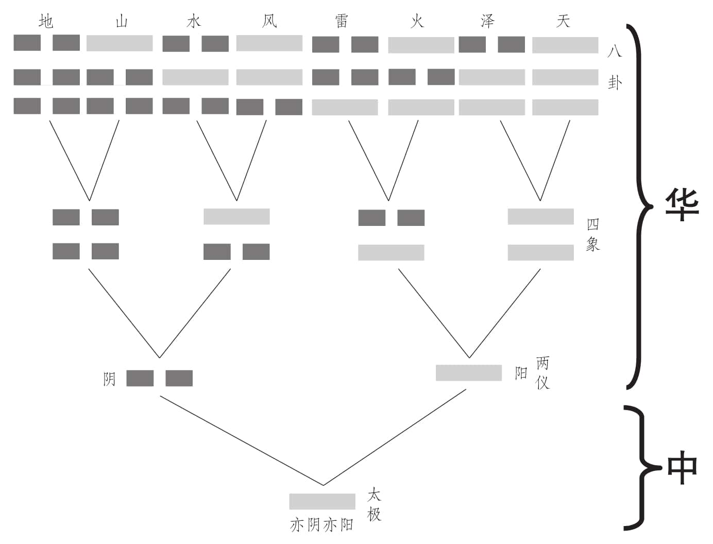
图2-9

“中”就是很好的意思。河南人是最了解中华文化的，所以经常会说：“中不中？”“中。”不管你到天涯海角，不管你穿什么衣服，过什么日子，我们都不在乎，我们只在乎你脑海里面有没有《易经》这套系统。很多人说我们之所以叫中国，是因为我们认为自己在全世界的中间，是因为我们很自大。其实这是不可能的。我们都知道，太极就是万事万物的总源头。所以，诸子百家只有一个共同的源头，就是《易经》。没有把《易经》搞懂，去讲诸子百家，经常会讲错。孔子讲的“吾道一以贯之”，大家都很熟悉，这个“一”是什么？就是太极。孔子所讲的道理，都是由太极这个系统一路讲下来的。

对于孔子所说的“吾道一以贯之”这句话，许多学者有着不同的解释，而曾仕强教授认为，这个“一”，就是太极。那么这个解释有什么根据呢？而太极和阴阳又有什么关系呢？

孔子的一贯之道就是中，就是仁，就是太极。发散出去，可以讲忠恕等一大堆东西，收回来就是一个“仁”字。其实仁就是阴阳，左边的单人旁是阳，右边的两横是阴（见图2-10）。一阳一阴就叫仁，就叫中，就叫太极。大家有没有发现，一个果仁，埋进土里以后，它会发芽，会长出一棵茂盛的树来，就靠那个“仁”而已。仁是最核心的东西，天地万物都有仁。

图2-10

最古老的仁字是一竖两横（见图2-11），就是一阳一阴，左边是阳，右边是阴。其实很多字，都跟阴阳是有相关的。把阴（女）写到左边来，把阳（子）写到右边去，就是个“好”字（见图2-12），代表男女好合。两性和合就叫仁，所以仁是做人的基础。

图2-11

图2-12

只有一个人的时候，不会有什么矛盾，因为没有人可骂，只好去工作，只好自谋生活。有了两个人的时候，问题就出来了，就开始计较，就开始争吵了。人与人能否处得好，能否和谐，我们把它归根到夫妇的相处上。大家可以好好去想一想：为什么不是从父子开始，而是从夫妇开始呢？

因为夫妇关系处不好，其他关系都很难处好。一家人彼此之间大都有血缘关系，不是父子、父女，就是母子、母女，要不就是兄弟姐妹，但是睡在自己身边的，却是唯一一个没有血缘关系的人——配偶。说起来有血缘关系的应该比较放心才对，但是我们专挑一个没有血缘关系的住在一起，你说妙不妙？这就告诉我们，你如果能跟这个没有血缘关系的人相处好的话，整个家就齐了。

这些道理我们慢慢都会把它分析出来。一切一切，都是太极，所以我们下面就要谈一谈：何为太极。

