 *第三集 何为太极*

据现代科学考证，地球是在宇宙大爆炸时诞生的。而七千多年前的伏羲，就已经发现了这个秘密，他一画开天，代表宇宙中的一切，都是从一个整体中生发出来的。

太极图是后人根据伏羲的阴阳八卦画出来的，也被称为阴阳图。那么太极这个词，是从何而来的呢？曾教授告诉我们，太极是孔子提出来的，它“其大无外，其小无内”，是宇宙万物万象共同的基因。那么，伏羲是怎么发现这个秘密的？他又用了什么方法把这个秘密记录下来？而太极的概念，对于我们现代人又有什么重要意义呢？

太极是我们非常熟悉的一个名词，这个词是从哪里来的？是孔子说出来的。在孔子以前，没有人讲过什么是太极。因为孔子主张什么事情都要正名，要先把名定好，名正才能言顺，名不正就言不顺。孔子定名是很谨慎的，不会自己爱怎么讲就怎么讲，过两天又改一个。我们看到，自从孔子把它定名为太极以后，两千五百多年来没有一个人改动它，就表示这个名字的的确确起得好。

什么叫太极？“太”由两部分组合而成，一部分是“大”，一部分是“丶”。“大”字不必说，那一点就代表“小”。所以太极告诉我们，大极了，而且又小极了。“其大无外”，大到没有外面，够大了吧？“其小无内”，小到找不到里面，够小了吧？孔子非常了解伏羲，他说世界上有件东西大到没有外面，小到没有里面，那叫什么呢？最后他就想到叫太极。这个名字起得好！

我们家里面有一个人，大的时候非常大，小的时候非常小，这个人就叫太太。你说太太大不大？有时候她比谁都大，可是有时候又比谁都小。所以当人家太太就要知道，该大的时候才大，该小的时候就要小。看到公公婆婆的时候，她最小；关起门来只有丈夫的时候，她最大——这才是会做媳妇的人。该大不大，该小不小，大小搞得一塌糊涂，这个媳妇就不称职。

凡是有“太”的词都有类似的意思。太上皇大不大？答案还是很难讲。皇帝敬重他，他就大；皇帝不用他，他就小，谁都不会理他。太上皇有没有威严，讲话算不算数，完全取决于皇帝。太监也一样，你说太监是大还是小？李连英这个太监，除了慈禧有谁比他还大？但是有的太监却一辈子都是让人吆喝东吆喝西的。所以，以后碰到“太”这个字要特别小心，因为它可大可小。

用现代话来讲，太极就是宇宙一切一切共同生存的平台。这个大平台里面有两个部分，一个叫作阳的平台，一个叫作阴的平台。但是如果把阳跟阴分开，就变成两个平台了，那就合不起来了。所以阴阳一定要互动，有时候阴到阳这边来，有时候阳到阴那边去。只有变动才有生命，变动不居，才会生生不息。

孔子真正读懂了《易经》，所以他在为《易经》所作的传——《十翼》（也称《易传》）中，用了一个十分准确的词来解释伏羲八卦，这就是太极。那么孔子的原话是怎么说的？太极的概念对于我们现代人认知宇宙，又有什么重大意义呢？

孔子在《易传》中说：“易有太极，是生两仪。”这个“生”字用得非常巧妙，因为《易经》就是生生不息的一部经典，而且它果然“生”出很多经典来。西方人不太用“生”，而是用“分”。但是宇宙总该有一个共同的点吧？如果没有共同点的话，那所有东西都分割开来，怎么能够共同存在呢？动物跟植物有共同的地方，人跟动物有共同的地方，人跟石头也有共同的地方。这个共同的点，我们用现代的话讲叫作基因，而太极就是宇宙万物万象共同的基因。如果连一点儿共同的基因都没有，就绝对合不来，一定会分道扬镳，那样宇宙就分裂了。

但宇宙是个整体，不可能分裂。宇宙有动物、植物、矿物，各式各样的物质说都说不完，它们能够和谐共处，条条有理，就是因为有着共同的因素。全世界的科学家都在找这个东西，开始找到了原子，于是就认为一切都是原子构成的，好像很满意了。但这个结论很快被打破了，因为又发现原子里面还有更小的东西。

老子多高明，只讲三句话，“一生二，二生三，三生万物”，以后就不讲了。“道生一”，道就是太极，太极就是两仪，一跟二是分不开的。西方是一就是一，二就是二，采取一种“分”的态度，所以直到今天，都找不到一个完整的东西。中国人用这个“生”字是很高明的。

宇宙只有一样东西，叫自然。我们从现在开始，讲到自然的时候，不要加上“界”字。讲“自然界”就错了，因为自然没有界。国家有界，地区有界，讲植物界、动物界也可以，但自然是整全的东西，哪里有界？如果自然再分界，就表示自然之外还有别的东西，那是不可能的。除了自然以外，没有任何东西是主宰！中国人很相信天，因为天就是自然，而自然就是主宰。这一点我们要感谢伏羲，因为这都是伏羲创造出来的，所以我们现在要花一点儿时间，来探讨太极是怎么来的。

伏羲是个爱动脑筋的人，他观察自然万象，发现太阳每天早晨从东方升起，到了傍晚一定从西方落下，而且天天如此，并不是高兴就出来，不高兴就不出来，或者突然哪一天从南边出来。他又观察到月亮有阴晴圆缺，海水有潮起潮落，树木有枯荣往复，于是想到宇宙万象是有一定规律的，一切都不是乱来的。

这个规律是什么？西方人说是神，其实不是。我们非常感谢伏羲，是他让我们中国人没有宗教。我们不受宗教的约束就是因为我们没有神。如果伏羲当年说“就是神在主宰”，那我们就完了。可是伏羲说这是自然而然的一种规律。

几千年来，人们一直在探索宇宙的秘密。宗教告诉人们，宇宙的一切是神在掌控，而伏羲在七千年前就告诉人们，宇宙中的一切都是大自然内在的规律。伏羲的这一发现，从此奠定了中国古代哲学的基础。

所以老子才会讲：“道法自然。”这是非常重要的一句话，告诉我们判断是非时要知道，凡是合乎自然的一定是对的，就算在眼下看起来不对，但终究是对的。我们对吉凶的观念也要取法自然，不是说对自己好就是吉，对自己不好就是凶，没有那回事。《易经》里面所讲的吉凶，完全是以是否顺乎自然为标准，吉就是顺乎自然，凶就是不顺乎自然。

可是吉凶是会变的。刚刚开始的时候认为非常好，所以就很愿意去做，做了才知道坏了。因为祸福无门，好与坏随时在变。看着很实的事情，一脚踩下去就落空了，这就叫变。所谓变，就是很难预料，如果一切都在掌控当中，何来什么变呢？但是变的当中有不变的东西，所以变就是不变，不变就是变。

塞翁失马，焉知非福，又焉知非祸？祸福都是事后才知道的，事前很难知道。我们每次都说“早知道”，早知道就是想不到。一个人总说“早知道”，这一辈子就都在“早知道”的后悔中度过了。伏羲很难得的地方，就是他看到宇宙万象都在变，但他悟到这个变当中一定有一个不变的东西，那就叫作规律。所以做人一定要规规矩矩，不能投机取巧。只有以不变的规律应对万变的福祸，才不至于每次都说“早知道”。

在这种认识之下，伏羲继续往下追究：如果太阳一天一个、一天一个，每天从东边升起，到底得有多少个太阳？是有那么多的太阳准备在那里吗？会有那么大的场所存放太阳吗？伏羲感到很奇怪，而且他发现每天的太阳都是一样的，于是就悟到：太阳只有一个，并没有两个。但是太阳每天从西边下去，怎么又会跑到东边呢？伏羲就想到，原来一切都是圆的。所以圆道周流、循环往复这些观念中国人老早就有了。

历史会重演，人会不断地犯同样的错误，除非你刹车，除非你改变，否则就会这样团团转、团团转，转一辈子。现代科学证明，所有的轨道都不是直线的，爱因斯坦告诉我们，连光线走的也不是直线，而是曲进的。

道理是直的，路永远是弯的。只会走直路是很难达到目的的，因为自然本来就是弯弯曲曲的。我们中国的大江大河都是由西发源，然后向东流，但没有一条是笔直入海的，因为那样我们就没有资源可用了。河流弯弯曲曲，有时流得很慢，有时流得很快，这样我们才有各种资源可以利用。山脉也不是笔直的，不然谁也爬不上去，它弯弯曲曲，这样人随着山势转来转去，慢慢就上去了。

天底下是没有直线的。如果有机会到海边去看，你会发现海平面也不是平的。这些《易经》里早讲过了，泰卦里面讲得很清楚，叫“无平不陂”。天底下所有的平，都是不平所造成的。随便哪一个湖，虽然湖面看上去很平，但是依然有起起伏伏的波浪。水面一旦平了就叫死水了，连鱼都养不活。

天底下没有一样东西是平的。同样一对父母，生下的小孩儿就是不一样。所以弟弟看哥哥，怎么看都不顺眼，他忿忿不平：你怎么比我高啊？我哪天多吃点儿饭，一定要比你高。《易经》告诉我们，人本来就不平等，我们后天只是尽量让它公平而已，这才是符合自然的规律。

伏羲通过仔细观察和认真思索，终于在宇宙的千变万化之中，找到了大自然的规律和一种代表自然的力量，但是在那个没有文字的远古时代，伏羲是用什么方法，把他的重大发现记录下来的呢？

伏羲氏看过这一切一切之后，他就想，应该用什么来表示这种宇宙自然的力量？于是，他细心观察老百姓的日常生活。一个小孩儿第一次出去打鱼，回来之后很高兴，全家人要庆祝一下。当时没有文字，所以就拿根棍子做个记号，表示这是他打的鱼，下次再打到就再加一条。伏羲觉得这个方式很好，所以就画了一道“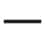”。这个“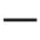”是什么？就是代表宇宙一切一切自然的力量。我们就把它叫作一画开天（见图3-1）。

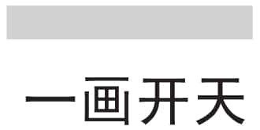
图3-1

那一怎么会生二呢？一生二，是表示一是二生出来的，还是二是一生出来的呢？其实两句话都对。把“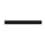”不断地拉，拉到断了，就是“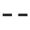”；一看不对，再把“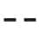”接起来，就是“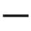”。一本来就是二，二本来就是一，分那么清楚干什么呢？

我在伦敦读书的时候，有一个朋友准备拿数学博士学位，好不容易快要考试了，只要答辩及格就能拿到博士学位。答辩的时候，我们很关心他，就去旁听。其中一个审查委员问他：“1\+1到底等不等于2？”他心想：我好歹是个快要拿到数学博士的人，怎么会问我这么简单的问题，其中必定有诈。于是他就站起来，写了整整一黑板的数字，最后证明1\+1不等于2。数学是可以证明1\+1不等于2的。但是没有想到，那个审查委员站起来说：“1\+1就是等于2。”然后我这个朋友就什么都没有了，读了七八年，什么都没有拿到。我当时就跟他讲：“你没有读《易经》，所以你拿不到博士学位，要是我，我准拿到了。”他说：“真的？”我说：“你不要泄气。我给你一个启发，你以后就知道怎么应对这种事情了。任何人问我，1\+1是不是等于2，我会回答说1\+1在正常的情况之下是等于2的，但是在某些特殊的情况之下是不等于2的，你如果让我证明1\+1等于2，我就证明给你看，你如果要我证明1\+1不等于2，我也证明给你看。他一定马上说不必了，学位自然就拿到了。”

天底下的事情没有绝对到不可连贯的，因为我们事前根本不知道对错，往往都是事后才知道的，这当中有太多的波折。

伏羲知道世界绝不是那么单纯的，所以他感觉到，太阳既然会从这边下去，又从那边上来，这其中一定是有两股力量，一股把太阳拉下去，一股把太阳拉上来。后来他发现果然是这样，有一股力量把水拉上来，叫涨潮，就有一个力量把水退下去，叫退潮。水还是那些水，上来，这边多了那边少了；一退，这边少了那边又多了。所以伏羲就知道，光靠一种力量是不够的，于是他又把“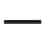”从中间折断，变成两段，就变成了“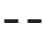”。

伏羲最后是从人类的身体取得定案的。因为那时候的人都不穿衣服，伏羲发现男人跟女人最大的区别，就在于生殖器的差异。男人的生殖器就像是一条线，它是阳的，而女人正好是阴的。男阳是“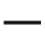”，女阴是“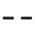”，这两个符号就确定了下来，从此没有改变过。世界上所有事情都是一阴一阳的变动，就是这么简单的一个道理。

伏羲通过观察大自然，观察人类自身，一画开天，创造出了代表阴阳的符号，又根据阴阳合一，阴阳相对，阴阳互动的变化，创造出了八卦。那么伏羲氏这些伟大的创造，难道仅仅是凭着脑子想出来的吗？

一切一切都是想出来的。可是如果跟外国人讲“一切都是想出来的”，他们听不懂。跟外国人一定要讲“一切都是人想出来的”，非把“人”字加上去不可。跟中国人就不必，只说“想出来的”就好，加个“人”我们反而会觉得很奇怪：这个还用你说吗？世界上只有人会想，你还加“人”干什么呢？未免太小看我了！所以跟中国人讲话很简单，说“倒杯茶来”，茶就倒来了；跟外国人讲“倒杯茶来”，他就会问你：谁去倒？倒给谁？倒什么茶？什么时候倒？用什么东西倒？等他问完，你已经渴死了。

孔子教学是从来不说清楚的，《论语》里都是一句话，没头没尾的，“知之为知之，不知为不知”，后面就不讲了。很多人把这句话解释为知道你就说“我知道”，不知道你就说“我不知道”。这样讲就太小看孔子了，如果真是这样，那整本《论语》不都是在讲废话吗？“知之为知之，不知为不知”的意思是说，就算你知道，如果问你的人不该知道，你也不能说你知道。要按照不同的人，给出不同的回答。

我在孔子老家曲阜听过一个故事，真的假的我不知道，大家不妨先听听看。有一天，孔子的一个学生在门外扫地，来了一个客人问他：“你是谁啊？”他很自豪地说：“我是孔老先生的弟子！”客人就说：“那太好了，我能不能请教你一个问题？”学生很高兴地说：“可以啊！”他心想：你大概要出什么奇怪的问题吧？客人问：“一年到底有几季啊？”学生心想：这种问题还用问吗？于是便回答道：“春夏秋冬四季。”客人摇摇头说：“不对，一年只有三季。”“哎，你搞错了，四季！”“三季！”最后两个人争执不下，就决定打赌：如果是四季，客人向学生磕三个头；如果是三季，学生向客人磕三个头。孔子的学生心想自己这次赢定了，于是准备带客人去见老师孔子。正巧这时孔子从屋里走出来，学生上前问道：“老师，一年有几季呀？”孔子看了一眼客人，说：“一年有三季。”这个学生快吓昏了，可是他不敢马上问。客人马上说：“磕头磕头！”学生没办法，只好乖乖地磕了三个头。

客人走了以后，学生迫不及待地问孔子：“老师，一年明明有四季，您怎么说三季呢？”孔子说：“你没看到刚才那个人全身都是绿的吗？他是蚂蚱，蚂蚱春天生，秋天就死了，他从来没见过冬天，你讲三季他会满意，你讲四季吵到晚上都讲不通。你吃点儿亏，磕三个头，无所谓。”

大家觉得这个故事是真的还是假的？我希望大家不要说这是真的，也不要说这是假的，因为真假跟我们一点儿关系也没有。我们要关心的，是这个故事对我们有什么启示，考据是真是假，那是专家的事情，不是我们的事。这个故事不管是真还是假，对我们都非常有用。只要你会用，你可以多活十年！我有很多的朋友听我讲了这个故事以后，变得很开心，碰到我都跟我说，以前看到那些不讲理的人会生气，现在不会了，心想那是“三季人”，就不往心里去了。

对任何人，任何事情，当你要发脾气，当你情绪很不稳定的时候，你就想那是“三季人”，是“三季人”做的事，马上就会心平气和了。这个世界上“三季人”太多了，越是不懂的人，讲话声音越大，说得更直接些，凡是声音最大的人，往往就是最不懂的人。如果真的懂，讲话声音那么大干什么呢？

后来我们读庄子的话，才明白“夏虫不可以语冰”（《庄子·秋水》）。你跟夏天的虫讲什么冰？那是你糊涂！那这不是见人说人话，见鬼说鬼话吗？你如果问孔子，孔子一定说本来就这样，你见人不说人话，那不是鬼话连篇吗？万一有一天你真的碰到鬼，你不讲鬼话，又怎么沟通呢？这绝对不是投机取巧，而是随机应变。

阴阳图，也叫太极图，是后人根据伏羲八卦图创造出来的，那么阴阳和太极是不是一回事？阴阳和太极究竟是什么关系呢？

这里有一句话非常重要：阴阳都是太极变化而成的，阴阳离不开太极，太极也离不开阴阳。我们反反复复在讲这句话，就是因为很多人把它看成不同的东西，说这是阴，那是阳，这很糟糕。阴中有阳，阳中有阴，阳极就成阴，阴极就成阳，它是同一个东西在不停地变化。我们中国人可以用一句话，就把这么复杂的道理说清楚，这是高度困难的事情。一句话叫作“一阴一阳之谓道”，一句话叫作“一分为二，二合为一”，一句话叫作“一就是二，二就是一”。

这个“一就是二，二就是一”要很小心地去理解，因为一就是二，并不是一等于二，这完全是不一样的意思。所以，最好的说法是“亦一亦二”，也是一，也是二，这样就比较周全一点儿。但我们现代人听到这种话都很火大，觉得含含糊糊。那么请问大家，宇宙有哪点是清清楚楚的？有谁能百分之百地告诉你明天一定出太阳？气象台有时候都会预报错。气象台预报明天温度很高，于是你穿很少就出去了，结果回来就感冒了，你怪谁？机器非常精密，人员非常认真，测量非常准确，所以一到紧要关头，气象台都告诉你：明天晴，时多云，偶雨。你听了就会骂，但这能怪谁呢？因为天气本来就是变化无常的。既然承认一切都是变化无常的，为什么还要求“一定”呢？

你同时种三棵树，能保证它们会同样成长吗？就算是同一块土壤，就算是同一个人同样细心培育，结果两棵树长起来，另外一棵却死了，你能怪谁？自然本来就是变化的。但是，变化的背后，有一个不变的定理，那个不变的定理伏羲帮我们找出来了。我们信仰什么？信仰老天。我们动不动就说“老天爷”，全世界只有中国人跟天最亲。天是什么？天不是神，天不是上帝，天就是自然。

动物是自然的一部分，不能离开自然；人也是自然的一部分，同样不能离开自然。所以我们现在得到一个很重要的标准，要分辨哪个对哪个错，就看它合不合自然。一切合自然的都是正确的，不合自然的就算眼前是对的，迟早也是错的。

从现在开始，一切要把自然当作最高的判断准则。合乎自然的，你就放心去做。不合自然的是不是不做？不是。因为如果把做跟不做分开来看，就不是懂《易经》的人了。《易经》是从来不分开的，说不做就表示要慎重去做，而不是不做，《易经》从来没有不做这回事。

凡是人工的，你都要考虑合不合乎自然。但是注重自然并不排斥人工，这是非常重要的概念。一般的人还是用两分法考虑问题，既然一切要纯自然的，人工的就全部不要了，这样岂不是连房子都要拆掉了？社会不断进步，就会增加很多人工的东西。自然并不是维持现状，而是生生不息，日新又新，创造又创造。因此，我们在做人工的事情时，要很慎重，看它合不合自然。如果发现它有不符合自然的地方，要赶快修改，抱持这种很谨慎的态度才合理。

太极生两仪，千万不要把它分开来看，说这个是太极，那个是两仪。太极里面就有两仪，两仪是暂时分开，它终究是要合在一起的，因为两仪是没有办法分开的。

太极生两仪以后，变化无穷。所以我们接下来要花一点儿时间来探讨：太极怎么能够生两仪？八卦又从何而来呢？当这些基本功扎实以后，要了解《易经》的奥秘就很简单了。如果一开始就叫你读卦，这个字不懂，那个字念不出来，也不会解释，一念人家就笑你，怎么能学得下去呢？可是当大家把这些基本的道理都搞清楚了，往后就会很顺当了。

