 *第四集 何为八卦*

孔子在《十翼》，也就是《易传》中说：“易有太极，是生两仪。”太极就是宇宙的起源，而两仪就是阴阳的变化。伏羲一画开天，这一画就是孔子所说的太极，而这一画所生出来的阴爻和阳爻，就是两仪。那么两仪是怎么生出四象来的？四象又是怎么生出八卦来的呢？

八卦所代表的，本是地球上的八种自然现象，但是为什么天被称作乾，地被称作坤，水被称作坎，火被称作离，雷被称作震，风被称作巽(xùn)，山被称作艮(gèn)，泽被称作兑呢？

太极生两仪，两仪又怎么能够生成八卦呢？这当中也有个过程，不是跳跃的。所有事情，只要是自然的，差不多都是连续性的，不会突然间断掉。即使表面上看是断掉了，实际上暗中也是连续的。伏羲当年发现宇宙有一定的规律，同时，他也认识到世界上绝不是只有一股力量，如果只有这一股力量，那就太过单调了。这当中有两个看起来相反，实际上是相成的力量，叫作阴、阳，所以“一阴一阳之谓道”，道就是一阴一阳。

一阴一阳，很容易被误解为一个阳，一个阴，其实不是这样，而是有阴有阳，才叫一阴一阳。我们一再重复，如果阴是阴，阳是阳，完全分道扬镳，这个世界就分裂了。

我们经常可以看到，一对父母生出来的小孩儿，女儿多半像爸爸，儿子多半像妈妈，这是造物的奇妙之处，也是为了使男不要太男，女不要太女。否则，男人越来越男人，女人越来越女人，那就变成两种人类，一种叫作男人类，一种叫作女人类。现代科学证明，男性的体内存在女性荷尔蒙，女性的体内也有男性荷尔蒙。这不是不男不女，而是男性应该有一些阴柔的气质，女性有时候也要阳刚一点儿，不然女性老受欺负，那还得了？

世界上的东西都是有阴有阳，而且是分不开的。拿一天的气温来说，我们早上起床，太阳已经出来了，这时候会觉得热吗？不会。因为上面的太阳虽然是热的，但是热量还没有完全照到地面上，大地还是凉的，所以早上叫作少阳（见图4-1）。等到了中午，上面下面都热了，就叫作老阳（见图4-2）。

图4-1　少阳

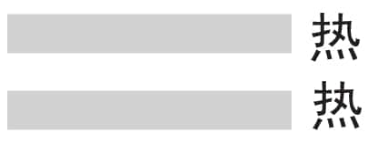
图4-2　老阳

中国人比较聪明，懂得采取阴的方法来对付阳，中午吃完午饭后，我们通常会稍作休息。我们最懂得宇宙变化的道理，一天之中，人体变化最快的有两个时段，首先是上午的11点到下午1点，就是正午的时候，我们叫作午时。这个时候人最好少乱动，安安静静地休息比较好。但是午觉也不能一睡就睡两三个小时，搞得晚上睡不着，那样也不对。午休很好，但要适量，不能过分，二十到三十分钟为宜。午休后有了精神，就要起来工作，不但可以提高下午的工作效率，也有益于晚上休息。有些人大中午去锻炼，我觉得很奇怪，可是大家现在都在学，就是因为不懂阴阳的道理。

到了黄昏的时候，我们可以感觉到，虽然大气还很热，但是上面已经开始凉了，因为夕阳没有什么热量了。太阳快下山的时候，上面慢慢凉起来，下面还是热的，所以黄昏叫作少阴（见图4-3）。到了晚上12点，上面下面都冷了，就叫作老阴（见图4-4）。所以，老阴的时候，我们一定要注意保暖，要盖上被子。

图4-3　少阴

图4-4　老阴

现代科学证明，晚上11点到凌晨1点是人体造血机能最旺盛的时候，也是一天中人体变化最快的第二个时段。所以，我们建议大家，最好在晚上11点以前睡觉。晚上11点到凌晨1点最好躺在床上，躲在暖暖的被窝里，这样身体才能健康。如果此时还在工作，对身体健康是非常不利的。

一天当中，按四象来看，从早晨开始，由少阳转向老阳，正午以后，老阳慢慢转向少阴，黄昏到半夜，少阴再变成老阴（见图4-5）。

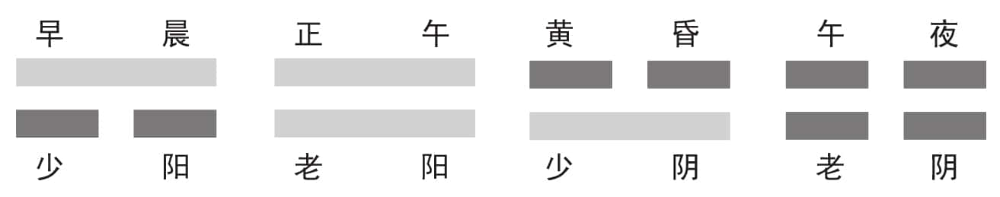
图4-5

一年四季也可以按照四象来看，春天是少阳，夏天是老阳，秋天是少阴，冬天就是老阴。其实不管在什么方面，我们都可以用“太极生两仪，两仪生四象”（见图4-6）来看待所有的变化，这是《易经》最了不起的地方。如果大家了解了阴阳变化的道理，自然就知道该怎么保护自己的身体，该怎么过平常的日子。

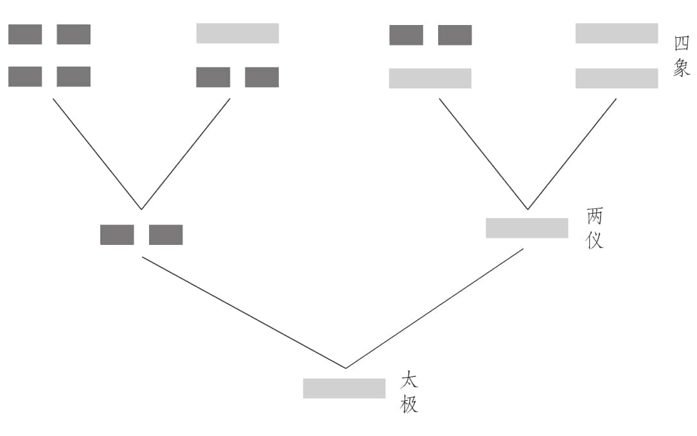
图4-6

《易经》看起来神秘难懂，其实就是对宇宙间自然规律的探索与揭示。人类是自然之子，当然应该遵循大自然的规律，才能保证身体的健康。那么接下来，四象是怎么生出八卦来的呢？

太极生两仪，大家都清楚了，两仪生四象，大家也明白了。但是，四象不是好现象，因为它太稳定了。所以伏羲认为，世界绝对不是四象就可以决定的，因为四象是动不了的。如果潮水每天只是周而复始地涨落，世界还有什么变化呢？

我们登山的时候，在山上可以发现很多贝壳。会有人那么笨，把海里的贝壳挑到山上去吗？不会。我们现在知道，很多高山原来都是在深海里的，随着地壳的剧烈变化，突然间隆了起来，变成了高山，所以山上才会有贝壳出现。低的地方会变高，高的地方会变低，沙漠会变绿洲，绿洲会变沙漠，从来没有农作物的冰岛慢慢也有希望种植农作物，这就是自然的变化。

祸福无门，吉凶难料，一切都在变动，所以世事无常，这是大家都非常熟悉的道理。既然这样，四象就不可能很稳定，所以伏羲就想到，四象还会继续发展。每一象都有阴阳，老阳(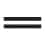)上面加一个阳(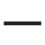)，就变成了“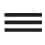”；老阳(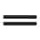)上面加一个阴(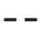)，就变成了“”。少阴(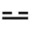)上面加一个阳(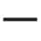)，变成了“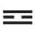”；少阴()上面加一个阴(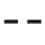)，又是另外一种图像“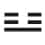”。四象上面分别加阴(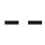)或加阳(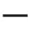)以后，就形成八种不同的变化（见图4-7），一个也多不了，一个也少不了。这在数学里面叫作排列组合。太极生两仪，两仪生四象，四象一变就出来八卦，这是非常自然的一种变化。

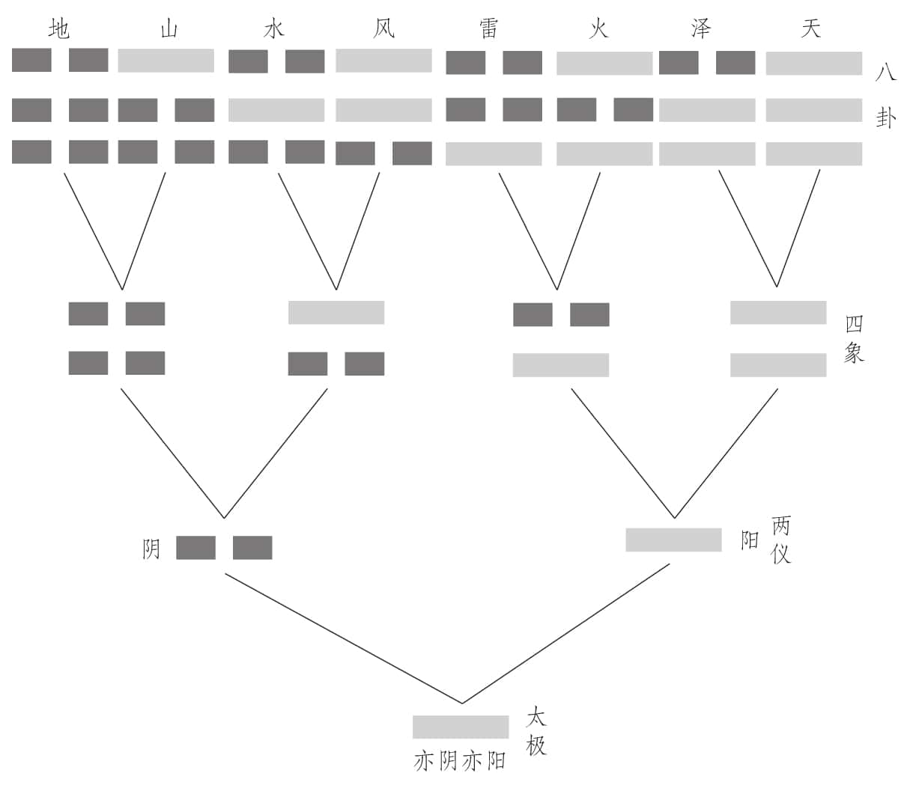
图4-7

八卦是根据四象的阴阳变化生发出来的，这八个卦，也就是八个符号，代表了天地间八种自然现象，但是，我们应该如何理解这八个符号，又怎样才能记住这八个符号呢？

要了解《易经》，必须要善于运用我们的想象力。如果不用想象，只是去看很具体的现象，是很难了解《易经》的。因为《易经》是完全由符号构成的一个很大很大的系统，我们根本没有办法完全把它看成具体的东西。

八卦是一套非常美丽、非常整齐的符号系统，我们要了解八卦，必须积极运用我们的想象力。伏羲生活的时代没有现在的高楼大厦，没有飞机，甚至连风筝都没有，他怎么跟百姓讲这八个基本卦呢？我们可以这样想象：伏羲先把“”画出来，告诉大家这个代表天。相信一定有人会问为什么“”代表天？伏羲告诉大家，回去看看自己的小孩儿是怎么画天的，自然就明白了。

相信一直到现在，我们任何人，不管有没有学过画画，如果要你把天画出来，大概都会画三条弧线（见图4-8）。因为天有三个特点：第一个，天是覆盖的，从地的这一头覆盖到那一头，所以我们一定会画一条很长的弧线；第二个，天是多层的，它不是薄薄的一层，而是一层又一层的，所以我们不会画一条，一定会连续画三条；第三个，天是不中断的，我们不会说，那是你家的天，这是我家的天。所以，天是全面覆盖的，天是多层次的，天是不中断的。三条弧线后来慢慢变成比较规律一点儿的三条横线“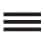”，就代表天。我们可以想象，在最初伏羲刚开始画天的时候，就是这样来画的。

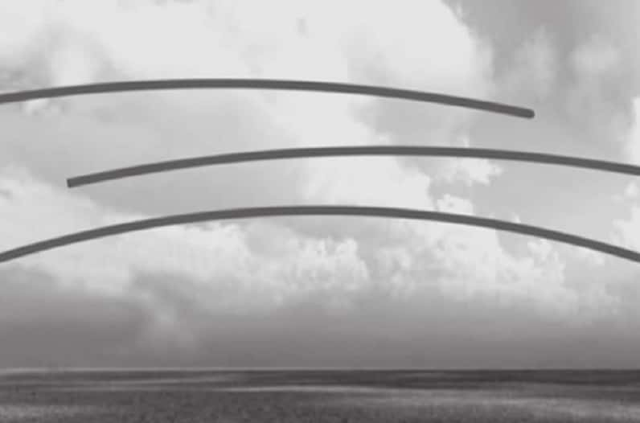
图4-8

天会有三种可能的变化：一种是天上面起变化，一种是天空中起变化，一种是天底下起变化。伏羲氏用这三条线分别代表上、中、下（见图4-9），他首先把最下面的换成阴的，表示天下面动。他问大家，天下面动代表什么？那时候没有高楼大厦，天下面能动的就是树木。树木摇动会给人什么感觉？我们会说树木摇了吗？大概不会。看见树木摇动，我们通常会说风来了，所以天下面动就是风（见图4-10）。天底下动，本来是树在摇动，但是树在摇动是具体的象，而且跟我们没有很密切的关系，所以要把它抽离出来，换成代表跟人类有密切关系的自然现象，就是风()。科学只会说树在摇动，很少会告诉你风来了，可是人比较重视的是感觉，风来了，我好加衣服，树动关我什么事？科学跟《易经》的差别就在这里。

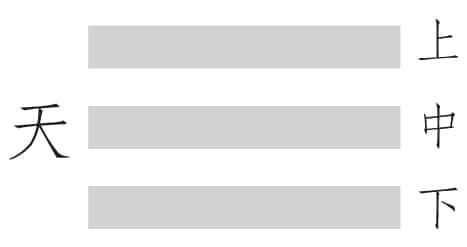
图4-9

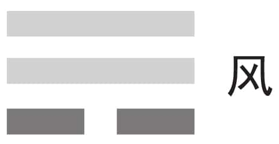
图4-10

天当中动，是什么？是鸟吗？不是。你告诉别人，一只鸟飞过来了，别人不会有什么感觉，最多看一眼而已，不会认为是天空中动。那什么东西在天空中动会引起大家的注意？是火（见图4-11）。以前森林也会有野火，火一烧起来，火光冲天，浓烟滚滚，大家远远看去，就像是天空中着火了一样，而且能感觉到火势在蔓延，于是会很小心，很注意，会躲得远远的。所以天空中动就是火()。

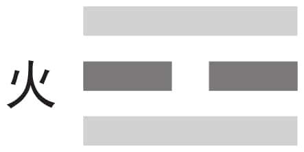
图4-11

图4-12

天上面动就比较难想象了。伏羲那个时候没有飞机，也没有卫星，他怎么知道什么东西在天上面动？人类实在太聪明了，我们到池塘旁边去看就会发现，天的倒影在水波的底下，水的波浪正好在天的上面。这种情况在狭窄流动的河水上是不容易看到的，要到开阔而平静的湖泽边才能清楚地看到天的倒影，所以天上面动不能笼统地称为水，而大面积聚集的水域我们称之为泽，于是天上面动就叫作泽()（见图4-12）。

大自然中最主要的元素，就是天和地，所以伏羲首先创造了天的符号，并由天衍生出了风、火、泽这三个符号，也就是大自然的三种现象。那么，地的符号是怎么产生的？由此衍生出哪三个符号？又都代表了哪些自然现象呢？

伏羲问大家：天画完了，地该怎么画？这个时候就有一个聪明人说，地跟天基本上是一样的，也是很广大的，也是一层一层的，不是只有薄薄的一层，所以也是要三画。但地和天有所区别，天是连续的，是没有界线的，但地却是断裂的，是有界线的。现在国家跟国家之间有国界线，村庄与村庄之间有村界线，甚至每一家与每一家之间都有分界线，而且分得很清楚。所以三条连在一起的横线叫天，三条断开的横线就叫地（见图4-13）。这一点大家都比较容易接受。

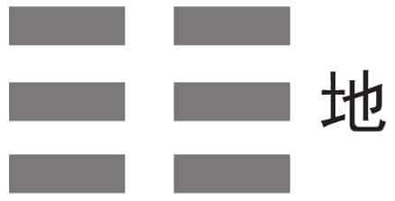
图4-13

地有个很突出的优点，就是很宽厚，就算人们把有毒有害的东西都埋进去，它也从来不说话，从来不抗议。所以我们说地是厚德载物，怎么样都可以，只要不过分就好。和天的三种变化一样，地也有三种可能的变化：地底下动、地当中动、地上面动。

地底下动()是什么呢？有人想到是地里的虫子，但是虫子对人有什么影响？于是又有人说是打雷。可是有人反对，说雷是在天上打的。伏羲就问大家，如果雷只是在天上打，我们人会怕吗？不会，可能反而会很高兴，好像放鞭炮一样。但雷会直接打到地上来，让人觉得地底下在动，人就害怕了（见图4-14）。大家一致认同，雷一打起来是天摇地动，不但打到地上，还打到很深的地下去，整个地仿佛都要裂开了，就好像有一股力量要从地里面冲出来。所以打雷的时候，大家通常都是感觉到地底下在动。天摇大家不怕，地动就比较可怕了，最后大家都同意，地底下动就叫雷（见图4-15）。

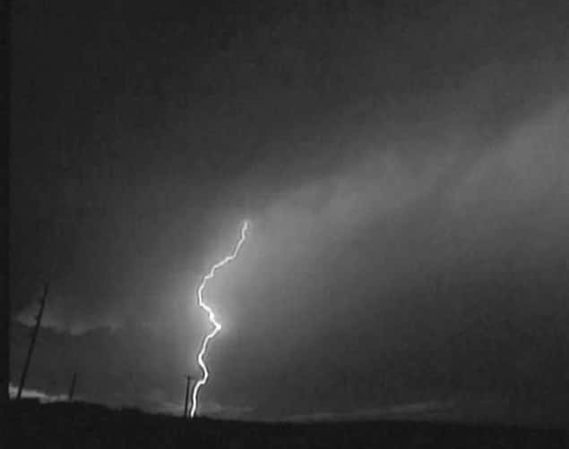
图4-14

地当中动，大家就很容易想象了。大地当中有一条条的水脉，一直绵延不绝，川流不息，那就是河，也就是水，所以我们把地当中动叫作水（见图4-16）。我们前面也说过，“水”字就是根据水流的形象造出来的象形字。后来从伏羲的八卦中演化出很多字来，但是伏羲画八卦的用意不是造字，而是要告诉我们整个宇宙的状况，让我们知道怎样去适应，怎样去改善。

图4-15

图4-16

水是一个阳跑到两个阴的当中去，其实大家可以想象，这个卦就是男女交合的象，两个阴就是女性的生殖器，当中的这个阳就是男性的生殖器，这是很形象的。有人说外国人对性很有研究，我觉得这是很奇怪的，我们中国人很巧妙地把生物性的东西，变成文化性的，我们是最了不起的。我们就以接吻为例，中国人知道，那是动物性的，我们想那样做，也要找个偏僻一点儿的地方，因为我们已经不是纯动物了，我们是有文化的。

中国人把男女的性行为，当作一种文化的行为，而不是动物的行为。我们为什么要这样做？难道我们是伪君子，刻意要这样做吗？不是。我们往往认为动物好像是想交配就交配，其实错了，动物一年当中，老天只准它交配一次、两次或者三次，次数是有限的。动物是完全听天由命的，交配期到了不交配也不行，交配期过了，想交配也不可以。人不是，老天给了人很大的自由，但是如果人想交配就交配，那不天下大乱了？所以，既然老天给我们自由，让我们创造，让我们自主，我们就要自律，就应该自己管好自己，不能性泛滥。

孟子有一天回到家里，看到妻子衣服没有穿好，就很生气地训斥妻子。孟子的母亲为儿媳妇求情，说在家里没有关系。孟子却执意说不行，因为他认为这是非常要紧的问题。孟子的这种观念对我们的影响是很深远的。夫妇只有在卧室里面才是夫妇，一出了卧室，就不是夫妇了，要么是人家的儿子、媳妇，要么是人家的爸爸、妈妈。父母不可以在未成年的子女面前拥抱、接吻，做一些性行为，这才叫中华文化。

伏羲又问大家，“”是什么？马上就有人回答是地上面动。可是地上面动的东西太多了，什么动大家才会注意？就是山（见图4-17）。因为那时候山是地面上隆起来最高的地方。

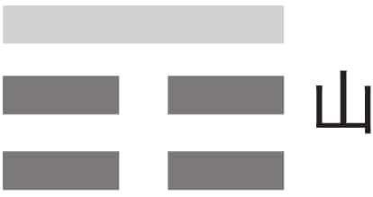
图4-17

但是山也会动吗？山当然也会动，山动就叫作走山。山一直都在不停地动，只是动得很缓慢，幅度比较小，平常我们很难感觉到，所以我们才说“不动如山”。

经过伏羲这么一解释，每一个人都很高兴，一路背回去：三条连续的横线是天()，天下面动是风()，天空中动是火()，天上面动是泽()；三条断开的横线是地()，地下面动是雷()，地当中动是水()，地上面动是山()，这就是八卦符号的来源（见图4-18）。

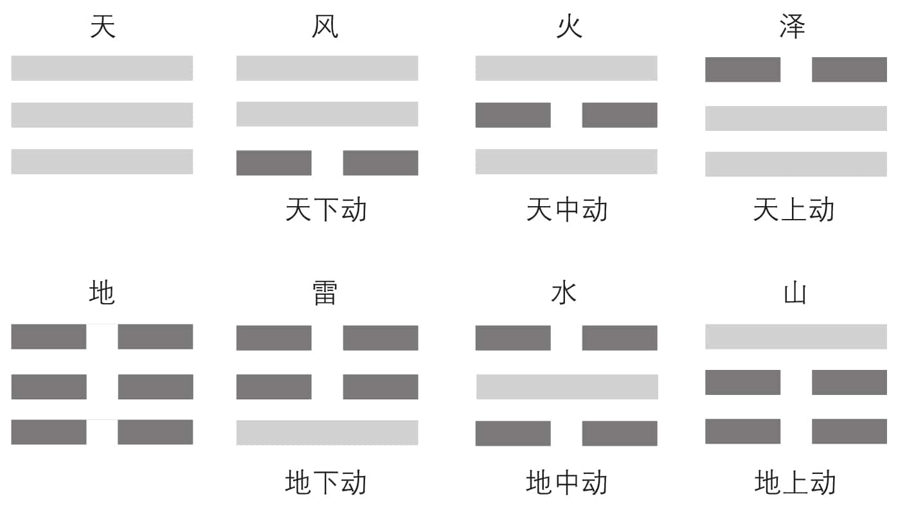
图4-18

现在我们知道，八个卦象代表的就是地球上的八种自然现象：天、地、水、火、雷、风、山、泽。但是为什么在八卦中它们又被称作乾、坤、坎、离、震、巽、艮、兑呢？

八卦的名称，最早完全是从与人类生活有密切关系的八种自然现象中提取出来的，可是如果总用这种很具体的东西来象征，那八卦的作用就不大了。我们的古圣先贤非常高明，把这八种自然现象的特性，用现代的话说叫作萃取出来，将八卦由原来的天、地、水、火、雷、风、山、泽变成乾、坤、坎、离、震、巽、艮、兑（见图4-19）。这八种特性正好配上八种自然现象，所有跟人类有关的事物都离不开这八种特性。

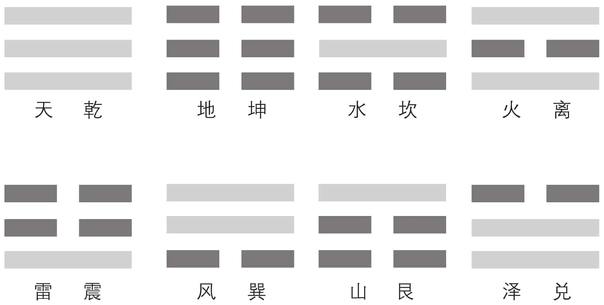
图4-19

天为什么会变成乾呢？因为天最大的特性就是健（天行健），它可以不停往前、往外去发扬。换句话说，天是最有创造力的。我们常说天生万物，万物都是天生的，还不够有创造力吗？天能有这种创造力，是因为它很刚健，永远不停息。世界上很多东西都有刚健的成分，所以我们就把天说成乾，这样就可以用在方方面面，也扩大了天的能量。地非常顺，它最没有意见，最懂得配合，所以把它叫作坤。坤的意思就是很柔顺。

在八卦中，天为乾，地为坤，所以在中国的文字中，常用乾坤两个字，来代表整个天下。但是为什么在八卦中，水被称作坎，火被称作离，雷被称作震，风被称作巽，山被称作艮，泽被称作兑呢？

天离我们很远，让人觉得高远而崇敬，地在我们脚下，让我们有种踏踏实实的感觉，可是一碰到水，大家就知道那是很危险的。水可以解释为没有泥土的陆地，所以我们把水称为坎。“坎”这个字分开来看，一个是“欠”，一个是“土”，就是缺少土的意思。人是不能离开土的，一旦“欠土”，人就很危险，所以我们会说坎坷、坎险，取的就是水的特性。

人生其实像水一样，中国人的民族性完全是跟黄河学习的。水流得很平静、很顺畅的时候，是没有声音的，可是一旦碰到阻碍，就会咆哮了。水是很可爱的，没有水我们活不了，但是水对人来说是充满坎坷的，它随时会带来很多灾难。把水搞通了，很多学问都通了。

火叫作离，这个就更有意思了。火就是太阳，太阳每天从东方一升起来，就开始要离开东方了。太阳每天的工作，就是离开东方跑到西方去，所以火的特性就是离。火一定要依附在别的东西上面才可以燃烧，一离开附着的东西，火就没有了。我们要生火，就一定要有柴才行，柴烧光了，火也就随之熄灭了。我们现在扑救森林火灾，会挖一条隔离沟，把火区隔离起来，使火势限定在一定的范围内，火在里面，只要不烧出来就好了，用的就是这个离卦。

山叫艮，这个卦非常重要，艮就是叫你适可而止。做任何事情都要懂得适可而止，不要过分奢求。我们爬山的时候，爬累了就要休息一下，不能一味硬撑，否则还没到山顶就累死了。爬山要慢，这样才能欣赏美景，爬山快，那就变成挑夫了。所以，有的事情要快才好，有的事情却是要慢一点儿才好。

开汽车的人，不会去看什么风景，沿途什么样都不知道，因为整天只知道开车，却忘记了车只是工具而已。骑自行车的人就能看到四周的风景，走路的人除了驻足观赏以外，还可以照张相、画幅画，更加自由自在。我们现在总是强调快快快，我觉得很奇怪。该快要快，该慢要慢，这才是《易经》的道理。该准时要准时，不该准时又为什么要准时呢？我明明知道那个人准备要骂我，要打我，我还准时去挨打挨骂，那我不是傻瓜吗？孔子说过，我们只对讲信用的人有信用，不可以对小人讲信用。可是一般人都认为对任何人都要讲信用，那是很奇怪的，对小人讲信用有什么用？

现在我们知道了水为坎，山为艮，火为离的道理，雷被称为震也是很好理解的，因为打雷时，整个大地都在震动。但是，风为什么被称作巽，泽为什么被称作兑呢？

最有趣的就是把风叫作巽，把泽叫作兑。风是无孔不入的，太阳还有照不到的地方，可风哪里都吹得进去，而且风吹起来很齐，没有任何偏心。我们看到，风吹过的地方，所有草都是向一面倒的。凡是很齐，而且哪里都进得去的东西，我们就把它叫作巽。

泽为什么是兑呢？当我们到清澈的池塘旁边去，通常都会感觉到心情很愉快，因为池塘旁边多半有些树木，景色很美，令人赏心悦目。兑加上个“心”，就是悦。什么事情最令人喜悦？就是别人给你一张支票，居然兑现了，这时候当然会很开心。

《易经》虽然很古老，但是它跟我们的生活很贴近，因为我们随时随地都在用它。《易经》的道理可以讲得很浅显，但是也可以讲得非常深奥，完全看你自己如何去对待。因为它广大精微，无所不包，什么都可以用它的道理来讲，但是怎么讲，也都只是讲到它的一部分，而且是一小部分。

我必须要说明，这一切并不完全是伏羲一个人所创造的，中国人所有的东西都是集体创造的。而且我们也不相信，是到周文王才把八卦重卦为六十四卦的。文王当年是七进位，还不是十进位，所以文献记载他被纣王关了一百天，实际是关了四十九天。以前数字的意义跟我们现在的不完全一样，《易经》里面讲三不一定就是三，它代表多数，讲十不一定是十，很多很多就叫十。

我们今天认为任何数字都要精确，这种观念有待商榷。应该精确的时候要一丝不苟，一分不差，不需要精确的时候，非要那么精确，其实是浪费成本，浪费时间，最后也没什么用处。中国现在有多少人？标准答案是谁也不知道，这才是真正的现实。说话间多少人生出来，多少人死掉，怎么来得及统计呢？有人问你身上有几块钱，说“不知道”的，是很有福气的人。如果有人说自己口袋里有一百二十七块钱，一张一百的，两张十块的，还有七块钱是零的，那这个人真是劳碌命，真的是福气很薄。记这些干什么呢？记得再清楚，也不会多出一块钱来！但是当会计、当出纳的人，账目一分一厘都要清楚，不能说自己不知道。当到总经理，还要知道现在有多少库存，那最后一定被活活累死了，底下人也没有办法做事情了。高层只要掌握个概略数就好了，基层的要知道得越准确越好。我们慢慢体会，各司其职，也是八卦所反映出来的道理。

我们知道了太极生两仪，两仪生四象，四象生八卦，还要特别注意这个“生”字，它不是分。如果说太极分两仪，两仪分四象，四象分八卦，那就完了。《易经》讲的是“生”！爸爸妈妈生了儿女，爸爸妈妈都还在。我手里有一百块钱，分你五十块，分他五十块，我就一分都没有了。生和分是完全不同的概念，生生才可以不息，但是一分，就会有人受伤。我们中国人是分中有合，合中有分，分到好像没有分，没有分又好像有分，这是最合乎自然的。

大家对八个卦有了基本的认识之后，我们接下来就要来谈一谈：伏羲为什么要画八卦图？

