 *第五集 八卦成图*

伏羲创造出八个代表大自然规律的卦象之后，就开始思考：这八个卦象应该如何排列？它们之间应该是一种什么关系呢？

传说伏羲坐在一座高台上，仰观天象，俯察地理，思索多日，终于画出了先天八卦图。这个伏羲画卦台一直保留至今。

那么，伏羲是根据什么来分配八卦位置的？八卦图到底有什么重要的意义？我们的祖先为什么如此崇拜八卦图呢？曾仕强教授指出，八卦图告诉我们一件事情，人生最重要的就是定位。那么什么是定位？我们又应该如何在社会中，找到自己正确的定位呢？

以前中国人不管去哪里，移民也好，做生意也好，通常只带两样东西，一个是祖先的牌位，另外一个就是八卦图。就连人迹罕至的北极，也可以看到有八卦亭。只要有八卦亭，就表示曾经有中国人来过这个地方。八卦跟我们中国人有解不开的关系，可是长期以来，八卦到底是怎么来的，它究竟是干什么用的，却始终是一个谜。

不过，大家如果把中国地形图拿出来看一看，很快就会发现，当年伏羲是按照我们的地形来分配八卦位置的。我曾经到过伏羲画卦台，那是一个非常难得的地方。站在画卦台中央，面南而立，前面有好多山，连绵不断，形状就像天的卦象一样。后面同样也是山，但它们是断开的，像地的卦象。再看四面八方，地形都很绝，而且有一条河蜿蜒而过，恰好把太极的两仪形象呈现出来。

离伏羲画卦台不远的地方，就是女娲洞。传说伏羲跟女娲是同一个人（见图5-1），雌雄同体，有阴有阳。你可以说这是神话，我不反对，但是全世界所有的文化都是从神话开始的。人类是进化的，这些神话只有一个目的，就是要化解宇宙人生的问题。实际上，所有的学问都是为了这个目的。可是神话不能满足人们的疑问，现在再讲神话，几乎没有人愿意听，也没有人愿意相信，所以当神话不能满足人类的思想需求时，就出来一样东西，叫作哲学。哲学是从神话演变出来的。但是哲学也没有办法满足我们的需要，所以后来才会出现科学。而哲学家多半会参考神话，因为哲学和神话是一脉相传，不可分割的。哲学所重在问题，不太重答案，所以哲学家对答案不是很有兴趣，他们所重视的是“人从哪里来，死后到哪里去，活着干什么”，就这三个问题。

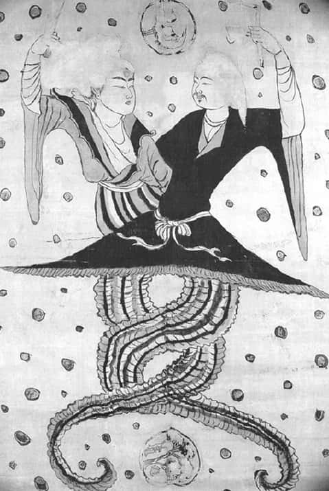
图5-1

我们每个人都会有这样的疑问：我能活多久？我活着干什么？死了以后会到哪儿去？其实人之所以会对死亡有恐惧，就是因为我们不知道死了以后到哪里去。如果我们知道死后会去哪里，还会恐惧吗？当然不会。

我们常说“一江春水向东流”，因为中国的大江大河都是发源于西部地区，由西向东流，长江、黄河、澜沧江等没有一条例外，所以西面为坎()；太阳从东方升起，它一出现就开始要离开东方，所以东面为离()；中国的东南被海包围，所以东南为兑(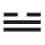)；西北多山，所以西北为艮(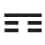)。西南多风，东北多雷，所以西南为巽(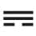)，东北为震(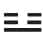)。天在上，地在下，如果按照现在通行的上北下南的绘图标准，应该是上为天，即北面为乾；下为地，所以南面为坤，也就是天在北，地在南（见图5-2）。

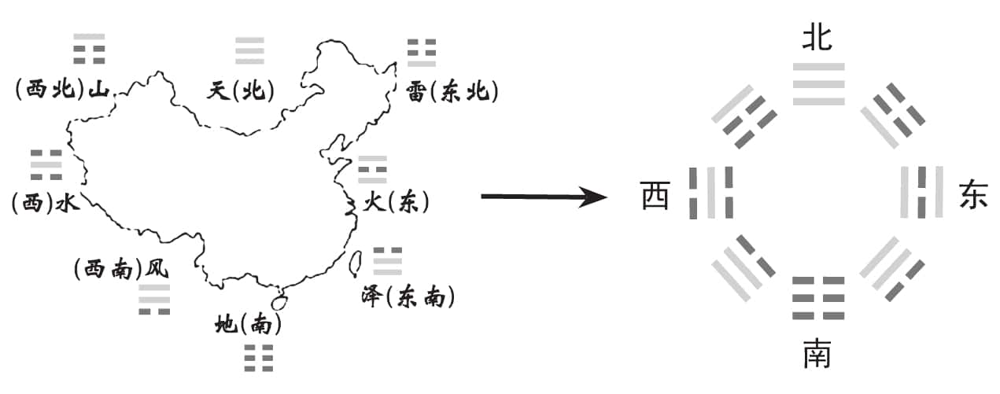
图5-2

伏羲画卦台位于河南淮阳宛丘湖中的一个小岛上，传说伏羲就是在这里画出了伏羲先天八卦图。但是，伏羲先天八卦图和我们现在所看到的八卦图，在方位上却是不一样的，这是为什么呢？

我们把伏羲八卦图（见图5-3）跟按照现在的方位画出来的八卦图对比一下就会发现，好像不对，两个图是不一样的。问题就出在一句话上，我们现在看地图，都是说“上北下南”，所以我们画出的八卦图是天在北，地在南。但是我们延续数千年的说法都是“天南地北”，不是天北地南。所以有人就说，中国人连方位都跟西方不一样。可是世界只有一个地球，怎么会有两种方位呢？那是不可能的。

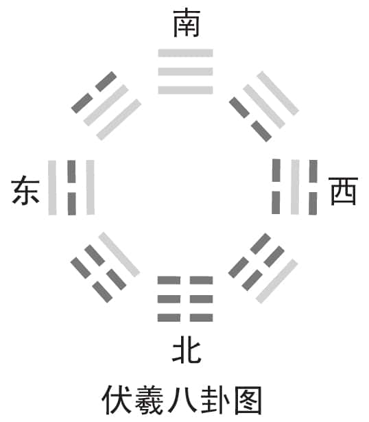
图5-3

实际上，东西南北四面八方在绘图上的方位都是相对的、变动的。但是东南西北之间的位置关系是一定的，有一个固定的格局，不能改变：如果北在上面，东就在它的右侧；如果南跑到上面，东也要相应地换个位置，转移到南的左边。

我们现在绘图的方位是面向北方的，以北为天，以南为地，所以画出来的地图是上边表示北方，下边表示南方，左边表示西方，右边则表示东方（见图5-4）。而中国自古就有“向明而治”的说法，南方为光明之位，所以绘图方向就是以面南而视为基础的（见图5-5），也就是南为天，北为地。由此可以看出，古今两种绘图的差异就在于天地即乾坤的定位不同。

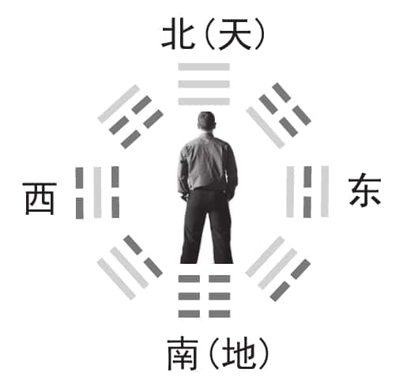
图5-4

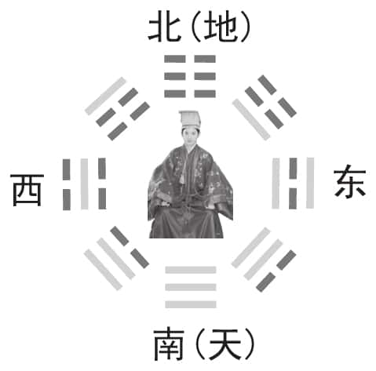
图5-5

所以，如果把我们按照上北下南的地理方位画出来的八卦图的乾坤对调（见图5-6），就符合天南地北的乾坤定位了。

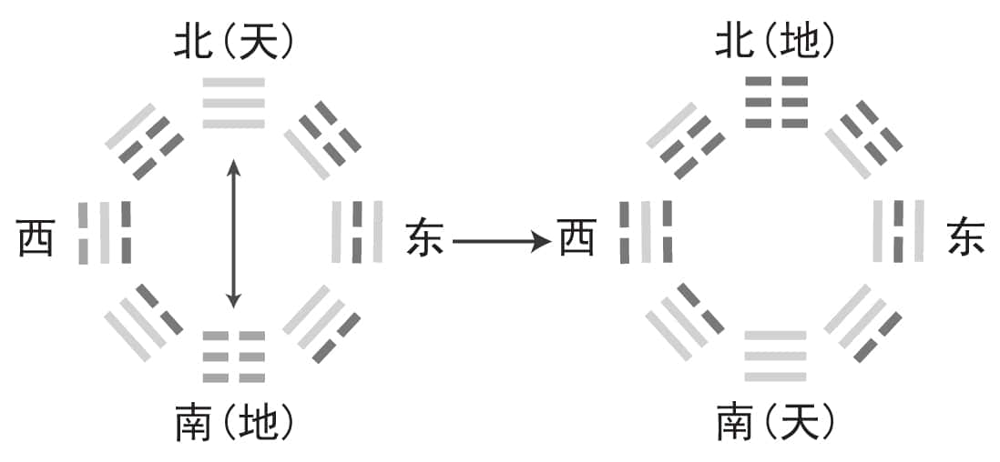
图5-6

再按照上南下北的方位指向，将各方位及各对应的卦整体对调，南和北、东和西、西南和东北、西北和东南全部对调，伏羲的八卦图也就赫然于眼前了。伏羲先天八卦图与我们现在的地理方位图的关系也就很清晰了（见图5-7）。

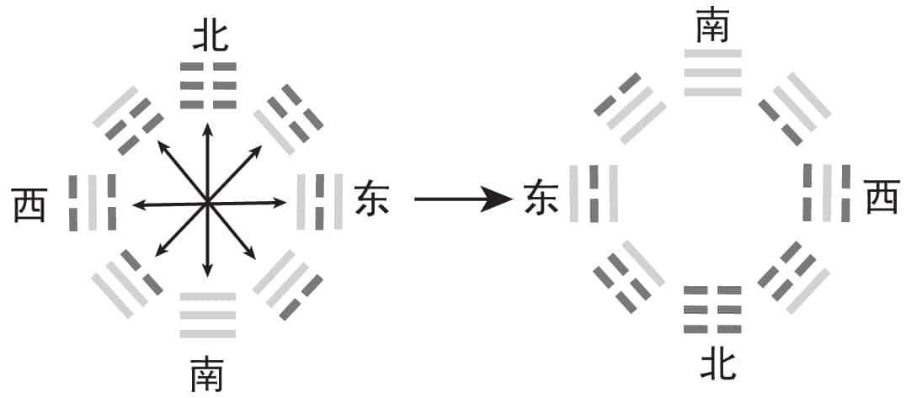
图5-7

伏羲八卦以南为天，以北为地，所以我们说天南地北，这样我们也就知道为什么孙悟空筋斗云一翻上了天庭，就到了南天门，而不会到北天门。

为什么我们的方位是天南地北呢？我们看北京的四合院，都是坐北朝南。因为中华民族是从北方发展起来的，皇帝背北而坐，眼睛一看就是南，所有子民他都尽收眼底，其他什么事情他都可以不用多管。这样我们就更容易理解什么叫“面南而坐，无为而治”了。中华文化的一切，只为了两个字，叫作教化，而不是政治。孔子所讲的政治，都是讲教化的，如果不能达到教化的目的，政治也没有什么作用。我们的祖先之所以定为天南地北，不是出于政治的因素，而是出于教化的方便。

我们坐的时候，大都会坐在北边，面朝南边，朝南有什么好处？就是冬暖夏凉。所以我们还是归结到一点：一切都以自然作为评判的标准。这句话绝对不要忘记，不管是分善恶，分好坏，还是分对错，都要拿自然作为标准：合乎自然的就是善，不合自然的就是恶；合乎自然就是好，不合自然就是坏；合乎自然就是对，不合乎自然就是错。白天烈日当空的时候，如果要抬着头朝向太阳，一定会很辛苦，所以人白天都是低头，因为后脑比较经得起晒，而且只有低着头才能专心工作。到了晚上，就要平衡一下，抬头去看看月亮。如果一天到晚都低着头，那就驼背了。所以白天低头低久了，晚上就去看看天空，欣赏欣赏月亮，这样阴阳才会平衡。这些都是我们自然而然养成的习惯。

既然天南地北，整个方位变过来以后就是这个次序（见图5-8）：乾一、兑二、离三、震四，然后巽五、坎六、艮七、坤八。连接八个卦的这条线，我们把它叫作太极线。现代科学也证明，一切事物的发展都是走曲线的，我们把这叫作曲成。

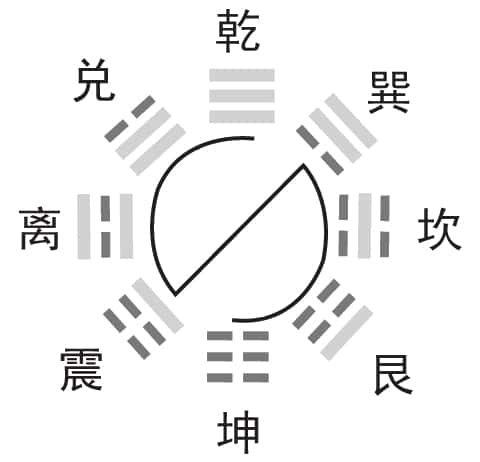
图5-8

所有的地都是起起伏伏的，所有的河流都是弯弯曲曲的，我们身体的每一个部位，甚至于每一根血管也都不是直的。我们应该去想一想，人为什么会那么好看？就是因为人的身上没有一处是直线的。如果样样都是直的，这个人还怎么看呢？头是四四方方的，连帽子都不能戴了。所以，一个人，要懂得欣赏弧线，我们称之为曲线美。

现代科学技术的高度发达，使人类终于可以飞到宇宙中去看地球，我们发现，地球所呈现出来的，都是美丽的曲线。可是当年伏羲画八卦图时，他是无法看到这一切的，那么他是怎么画出八卦图来的呢？

伏羲是从仰观天象开始的，现在叫作天文学，也叫气象学。看天象就叫气象学，看天文就是天文学。文就是花样的意思，天上的花样就是天文。中国的天文学一向是世界领先的，以前国家有事情，都有专门的大臣负责观看天象，以预知未来的变化，作为执政的参考。《易经》中说“观乎天文，以察时变；观乎人文，以化成天下”，所以看天象并不是迷信。

天象就是云、雾等的各种变化而已，晚上还有星星。星星的亮和不亮，哪颗是主星，哪颗不是主星，这个要让专家去研究，我们一般人最好不要妄加评论。天象的变化是有征兆的。“观乎天文，以察时变”，我们看天文主要是看时的变动。《易经》最重视的就是时的变动，所以说“时也，命也”，时一变，人的命运也就跟着改变。

一件事情，一定要当时去做，否则时间一拖就错过了，明明是好事也会拖成坏事。同样的道理，在时机没有成熟的情况下，硬要去做也不会成功。所以我们中国人知道，一定要守时待命。一切都准备好了还不能动，一定要守那个时。时一到，马上就出动，自然很快就完成了。时没有到就动，别人都知道你要干什么了，你反而干不成事。

时已到，当机立断；时未到，能拖就拖。不要认为拖就是不好的，时没有到，做了反而不好。

“观乎人文”，人文就是人世间的花样，我们可以通过《易经》看出来，人是天底下花样最多的，整天琢磨的就是这些花样。“以化成天下”这个“化”字，是有一次我跟一位日本大学教授一起吃饭的时候，他亲口给我讲的，那是我第一次听到。他说：“曾教授，你们中国人最厉害的是什么？”以我的经验，跟外国人打交道，最好先说不知道，你才能听到他的答案，如果你说知道，就一无所得了。我说不知道，他就接着说：“就是那个‘化’字最厉害，一‘化’，所有人都比不过你们了。”我回去之后就拼命想，终于想通了，果然是“化”厉害：大事化小，小事化了，化到最后没事了。现在太多人都是从负面去看我们中华民族，最后是自己吃亏。

化，就是在不知不觉当中，让大的变小，小的变不见了，这才厉害。自然都是用“化”的，很少用大动作去作为。一块岩石，慢慢地化，化到不见了。化，体现在自然上叫风化，体现在人类社会就是教化。我们忘记了教化，只记住了商业化，而商业化会把全人类搞垮，这是人类当前最大的威胁，是非常严重的事情。

我们现在常用“化”字，现代化、企业化等等。化的微妙之处，就在于不知不觉之中完成了变化。而这个“化”字，正是出于《易经》。教化对人类是有好处的，而商业化却会搞垮全人类，那么商业化真的有这么危险吗？

我们绝对不反对商业。商业在《易经》里面叫交易。《易经》里面很重要的一个动作就叫交易。我们要互通有无，不然供需失衡的话，经济会受到很大的影响。我们不轻视商业，不排斥商业，但是也不能用商业来化。用商业来化，艺术就不见了。你看，以前吹笛子的人，是很优雅地吹。现在却不是这样。拉胡琴也是，要拉你就好好拉，不行，非要跳来跳去，跑来跑去，我搞不懂这算什么艺术。

商业化把学校搞垮了，弄得老师不专心教书。同样是老师，为什么人家赚那么多钱，我在这里做傻瓜。于是不好好教，去外面跟企业挂钩。这样的案例太多了。学生也不认真读书了，读了有什么用，还是想办法赚钱比较重要。

商业化把科学家也毁掉了。科学家最要紧的工作是研究，研究要耐得住寂寞。一个人如果耐不住寂寞，就不要想研究出什么东西。现在很多科学家因为急着要赚钱，不做研究了，把不成熟的东西拿出去卖。我非常不客气地讲，什么叫知识经济，就是我对这个东西不太懂，我承认我不太懂，我知道我不太懂，但是我最起码比你懂。我就用我比你多懂的这么一点点知识来骗你，你就完了。

这些都是非常可怕的现象，全人类都会被搞垮。一切向钱看，将会毁灭一切，断送自我。当前人类就有这个通病，什么都不管，有钱，眼就开了。听到有钱，半夜都去，把自己的命搞垮了，把自己的前途搞垮了，把整个家庭毁掉了，把整个社会搞乱了，毁灭一切，然后断送自我。

我再说一遍，要教化，不要商业化，特别是教育不可以产业化。教育一产业化就完了。文凭是假的、买的，老师也是假的，所有的报告都是请人家做的。因为有钱，就可以控制一切，导致师道都没有尊严了。

讲到这里，我还是想提醒大家一句：《易经》这本书，几乎是被商业化所搞垮的。你讲这些道理，他就觉得我懂了，就走了，不会付你钱的。讲了半天不能收到钱怎么办？算命哪。算个命，几千块钱就来了。

《易经》本是中国哲学思想的源头，也是一部解开宇宙密码的宝典，但是因为各种各样的原因，《易经》的大作用渐渐被人们遗忘了，而对《易经》一知半解的人，却把它用来算命，结果给来源于大自然的《易经》蒙上了一层迷信的色彩。

我绝对不否认《易经》可以做很多事情，但是我们所讲的这些是基础。可是这些基础却没有人愿意讲，因为赚不到钱。如果大家不相信，可以去试试，去跟人家说“我讲《易经》的道理给你听”，保证所有人都走光了。这个现象用今天的话来讲，叫作没有市场。一说“我教你占卜”，人通通来了。如果凡是来听《易经》讲座的，都问什么时候教占卜，那就完了。

所以，孔子才会讲这句话：“不占而已矣。”孔子学《易经》学了很久才感慨说“不占而已矣”，一占就把《易经》淹没掉了。当然，真正的道理还不是这样，以后有机会，我会专门来讲为什么孔子讲“不占而已矣”。老实讲，孔子讲每句话后面都是有一大堆背景在的。《论语》是结束语，不是开场白，所以不要小看《论语》。

《论语》是所有经典里面最难的一部，它是儒家思想的总结，所以《论语》里面都是很简单的语句。那些简单的语句其实是有前言，有本文，有一大堆的推论，最后总结成那一句话。大家不要认为那一句话，就是代表那一句话。

孔子说：“朝闻道，夕死可矣。”我们就解释成：如果你早上听懂了道理，晚上就可以死了。那谁还敢去闻道呢？宁可不闻道。因为一闻道，晚上就要死了。孔子说“朝闻道，夕死可矣”，这个跟早上其实没有关系。朝跟夕是阴阳，是相对的，朝不一定就指早晨，夕不一定就指晚上。如果那样解释，就太不懂《易经》了。这句话的意思是：你这个时候懂得道理，就会发现以前犯过很多错误。那怎么办？把以前的错误譬如昨日死，然后重新做人，这才叫“朝闻道，夕死可矣”。我以前不懂，不能怪我，因为我不懂，现在我终于听懂了，没关系，我把以前那些去掉，昨日种种，譬如昨日死。现在我懂得道理，我开始照道理来做，我干吗要死呢？

中国人说“死”不一定是真死，中国人说“朝”不一定指早上。全天下只有谁敢说寡人？皇帝。别人敢说寡人吗？“寡”是很不好的字眼儿，那皇帝为什么叫自己寡人呢？他应该叫自己富人才对啊。全国他最有钱。因为物极必反，你说你是最有钱的，第二年排行榜就没有你了。今年你是排行榜首富，明年一看十几名了，它随时在变。大家千万记住，一走到顶峰，回头就是下坡路了。用物理学的角度来讲，所有的曲线都是抛物线。把东西丢上去，丢到最高点，它一定往下掉。像这种道理永远不会变。

伏羲当年画八卦图是想告诉人们宇宙的自然规律，而人类是自然之子，自然的规律和人类社会的规律是相通的。那么伏羲的八卦图，告诉了人们哪些道理？我们的祖先为什么如此崇拜八卦图呢？

八卦图告诉我们一件事情，人生最重要的就是定位。它当初的用途是要告诉所有的人，如果往西北一直走的话，就要小心了，那边是越走山越多；如果往东南走的话，会发现走到最后就是海了。看到海，就已经走到尽头了，不要再动其他脑筋了。伏羲是好心告诉我们那个相对位置，让大家知道，自己现在在哪里。

大家有没有发现，我们最常讲的一句话是什么？你是干什么吃的？用西方的话来讲，就是你是扮演什么角色的。因为他们这个理论叫作角色扮演理论。我必须要说明，全世界的学问其实大部分是通的，大同小异。只有很少一部分，因为名词用得不一样，想法不一样而有所区别。因为宇宙只有一个，定律只有一套，不可能乱了。扮演什么角色，就要像什么角色。你看，唱戏的时候，唱文就要文，文质彬彬；唱武就要武，杀气腾腾。装坏人就要很像坏人，不能因为怕自己演得太像，下去被人家揍而不好好演。做什么像什么，就叫定位。

所以后来孔子说：“君君臣臣，父父子子。”做长官的要像长官的样子，做部属的要像部属的样子；当爸爸的要像爸爸的样子，当儿子要像儿子的样子。西方人不是。西方人认为爸爸要做儿子的朋友。现在很多人赶时髦，也跟我说：“我跟我儿子处得可好啦，像朋友一样。”我说：“你儿子太可怜了。”他说：“怎么会呢？他很幸福。”我说：“你儿子多了一个年纪大的朋友，却没有爸爸了。”他愣在那里不说话。我问：“你要做他的爸爸还是做他的朋友？”他答：“我还是做爸爸好了。”我说：“你跟他再做朋友，等他大一点儿，就会把老朋友换掉，换成年轻的。因为朋友可以换，爸爸不能换。”所以，现在很多人盲目地赶时髦，却根本搞不懂其中的道理，这也是商业化的结果。

伏羲八卦图，最重要的作用就是告诉人们所处的位置，而人生最重要的就是定位。那么，究竟什么是定位？我们又应该如何在社会中找到自己正确的定位呢？

所谓定位，只做三件事。第一，知道自己应该做什么。现在大部分人都不知道自己应该做什么。比如，作为儿子，回到家后无论如何应该先问父亲：“爸爸，您有没有什么事？没有事的话我可以去做作业了吗？”这就是孝。客人来到家里，说“你跟我走吧”，作为儿子，一定要先问过父亲。没有问过父亲就跟人家走，说明你心里根本没有父亲的存在。其实像这些才是做人的根本，否则有多大学问都没有用。把位置定好，就会做什么像什么。

第二，怎么样守位。守位就是守分。你看，我们中国人一坐上桌子吃饭，孩子敢不敢拿起筷子就夹东西吃？大概不敢，一定要等大家坐齐了才动。那孩子怎么知道坐没坐齐呢？所以，做妈妈的一般都这样教孩子：“你坐在这里，不要夹，妈妈会夹给你的。”妈妈为什么要夹给他？就是怕他弄得“天下大乱”。这就是为什么孩子不好，我们都骂妈妈，就是这个道理。孩子懂什么？都是妈妈没有教好。有些妈妈老觉得自己很冤枉，大家怎么能骂我呢？当然要骂你，不然骂谁？记住，妈妈是孩子一生当中的第一位老师。知道自己应该做什么，就要把分内的工作做好。

第三，不断地改善，越做越好。到了一家新公司，先问自己该做什么事。列一张工作表，然后一条一条去看自己该怎么把它做好。每隔一段时间，拿出来检讨检讨自己都做了没有，有没有什么没有做的，你就会变得更好。如果一进去就装老大，什么都内行，不到三天恐怕就跟所有人都翻脸了。你有多大本事啊？这就叫不守分，不守位，不知道位是什么。

我们把伏羲八卦图挂在门口，就是告诉所有看得见、看不见的人，你自己搞清楚，该进来再进来，不该进来就请往旁边走。该进来的我欢迎你进来，不该进来的请你自行躲避。

二十世纪最大的笑话，就是市场导向，为了顾客的需要，可以不顾自己做人的根本道理。比如蹦极，爬得很高，然后将一条腿绑起来，跳下去，还要给人家钱，我不知道这是在做什么。有市场吗？当然有市场，总有一些人会被骗。这个人玩了一次恨死你了，下面又来一个新的。有市场没良心这是不可以的。二十一世纪，我们一定要把它改过来。

从现在开始叫什么导向？教化导向。我们所有的产品都有教育顾客的任务。目标只有一个：正大光明。你到故宫去看，历代相传的就是“正大光明”。我们将目标定为正大光明，又怎么会昧着良心呢？

记住一句话：目标正确，方向正确，方位搞清楚，远远比速度更重要。上高速公路，先问这条路是向南还是向北的再加速。否则本来要去深圳的，一上去越开越快，结果到东北了。方向永远比速度更优先。

大家有没有发现，八卦图光是三画，就可以有这么大的变化，所以我们只画到三画卦为止。三画卦是有特殊意义的，不是刚好画成三个了，也不是因为多了太复杂、少了太单纯，所以我们接下来要讲：三画卦的特殊意义。

