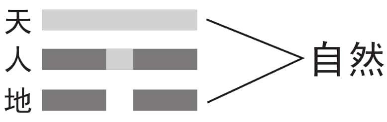
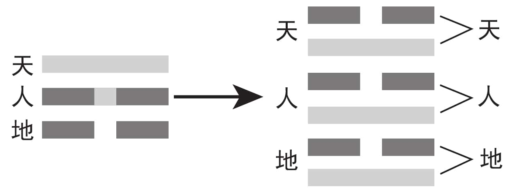
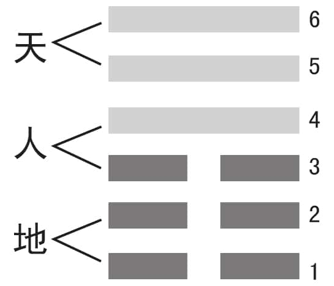
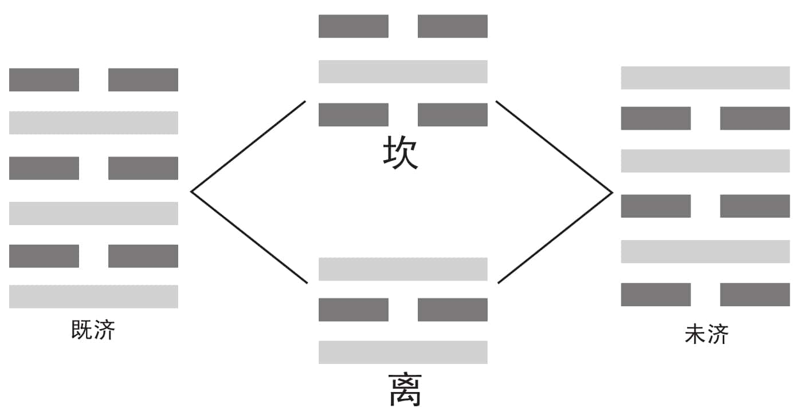
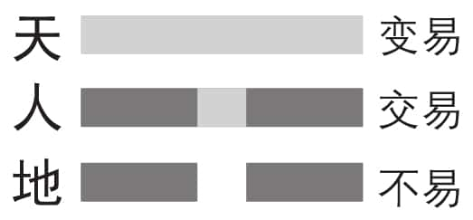

 *第六集 三画为卦*

伏羲用阴阳两个符号组成了八个卦象，又用这八个卦象组成了流传千古的八卦图。但是，伏羲在画卦时，为什么每个卦象不多不少只画了三画？这三画都代表了什么？

上面有一横代表天，下面有一横代表地，当中的就代表人，三画卦对人类有什么重要意义呢？三画卦最伟大的贡献就是替人类在天地之间做好了一个很明确的定位。那么既然三画为卦，为什么《易经》里面的六十四卦，每一个卦象都是六画呢？

伏羲画卦，他怎么知道画到三画就要停下呢？我相信，只要是人，一旦开始就停止不了。当伏羲画了三画卦之后，一定还会四画、五画，这样一直画下去，而且千奇百怪的卦都会画出来，这才是自然。但是，伏羲最后还是决定用三画卦来传世，一定是有道理的。

人类文化的基因是会遗传的。现在有一项运动，我们的祖先在六七千年前就曾做过的——拔河。拿一条绳子，当中设一个中心点，两边各有一队，然后比试哪队的力气大。为什么会有拔河游戏呢？是因为六七千年前，人类还没有进入农业社会，而是以狩猎为生，好不容易打到一只很大的野猪，抬不动，只好用绳子拖回去，后来就慢慢发展成了一项运动。

我们参加拔河的时候，怎么喊口号？会不会只喊“一、一、一”？不会。我们多半都会喊“一、二、三，一、二、三”，这个就跟三画卦有着非常密切的关系。

当喊“一”的时候，就是要看准目标，不要乱拔。这时候我们通常会抬头看天，天就出来了。喊“二”的时候，就是要站稳，稍微往下一蹲，就看到地了。喊“三”的时候，人就发力了。这样天、地、人三才就出来了，这些东西都是自然对人类所产生的影响。

当年伏羲看来看去，上面有天，下面有地，中间林林总总什么都有，可是看来看去，还是将人作为了代表。伏羲氏体会天地之心，把人定在一个非常重要的位置，替人做好定位。三画卦最伟大的贡献，就是替人类在天地之间做了一个很明确的定位。所以周武王当年才会说“人为万物之灵”。

周武王的这句话也遭到西方很多的批评，说中国人太自大了。其实那是他们不懂，我们是觉得责任重大，而不是自大。如果你认为是责任重大，就会敦促自己做得更好，成为名副其实的“万物之灵”；如果你觉得自己很伟大，那就是自鸣得意，终究会沦为“万物之贼”，这也是阴阳。

天最顶的那一画就叫天，地最底下的那一画是地，中间这一画就叫人。天地人三才就是：天有天的才能，天有天的特性；地有地的功能，地有地的特性；人有人的功能，人有人性。千万记住：人是有人性的，这个人性是自然产生的，不是自己去创造的，也不是后天教育的。

天跟地是一体的，中国人说天就包括地在内，所以天、地、人三才后来就变成了天人合一，因为天地是不可分的，有天就有地，有地必定有天，所以后来干脆就叫天人合一。天发挥它的特性，地发挥它的特性，人则顶天立地，把天地的特性整合起来，使得宇宙越来越进化，这是人的责任。

所有的动物只有本能，没有良能。我们不能说人有本能，那就把人当动物了。动物没有良能，完全凭本能。所以当动物对一个人叫，你不要觉得它对你不客气，它没有对你不客气，只是一种本能要这样叫，不然它就不是动物了。狗只有一代，因为它每一代都一样。但现在狗也被人搞出了好几代，狗已经在变了。我必须要说明，宇宙万象的改变，几乎都是人搞出来的，都跟人有关系。这一点我们要慎重地讲一讲，改造要适可而止，要运用智慧，否则就会有麻烦。

伏羲的三画卦，上画为天，下画为地，中间一画就代表了人，而人在宇宙中的作用是最重要的。伏羲对天、地、人三才的认知，成为后来中国哲学思想的基础，几千年后发展出来的儒、法、道、墨、农等诸子百家，都承继了天、地、人三才的思想。那么三画为卦对于我们现代人能有什么实际意义呢？

从拔河的过程，我们明白了做事有三点最重要：一是方向，二是定位，三是行动。直到今天，所有的管理其实都是以此为依据的——先把远期的目标确定好，然后找准市场定位，也就是公司在同行业里面居于什么样的位置、该做什么样的事情，最后才开始行动。我们中国人几乎都是三步就把事情化解了，很少去讲四五六。我们习惯把空间分成上、中、下，把时间分成过去、现在、未来，几乎都是三分法。

领导把部属叫来，告诉他做这件事情第一个要注意什么，他一定会很注意地听。接着领导说第二个要注意什么，他还会注意听。当领导讲到第三点的时候，部属心里就开始有想法了：怎么这么多要求呢？如果领导还不知趣，讲完三个还要再去讲第四个，这时部属即使嘴上不说，心里也一定会想：你讲那么多我怎么记得住？干脆什么都不记算了。

中国人当领导，要有本事把非常复杂的事情归纳成三点，叫作约法三章。我们很回避去讲“四”字，其实跟这个很有关系，只是后来慢慢变成迷信了，其实也不过是谐音而已。很多东西本来是很理性的，后来会变成迷信，就是因为大家不知道其中的缘由。

一是阳，二是阴，三就是变化。所以道生一，一生二，二生三，然后三就生万物了。三代表变化，不是一二三的“三”，也不是固定地表示具体的数字。

一个卦，我们把它分成上、中、下，也就是天、人、地。我们看天，是看时的变化——看到太阳当头照，就知道是中午了。天所重在时，所以我们叫天时。地所重在利，叫地利。我们选择地点，首先会考虑是否能站得稳当。没有人会把房子盖在斜坡上，除非实在没有办法，无立锥之地，只好盖在那里。但那是很不利的，就是所谓的缺乏地利。天时、地利之后，还要人和。人一定要合作，一定要有团队，一定要有共同的目标。否则会怎样？人是所有动物里面最弱的一种，跑，跑不过马；力气，比不过牛，各种性能都不如其他动物。但是人很了不起，会感觉：为什么老天把我生得样样不如人家？它总要留一条生路给我走吧。人只有一条生路。哪一条生路？两个字就讲清楚了：争气。人如果不争气，什么都赢不过人家。这就是中国人老说要争气的原因。人所争的就是那一口气而已！那口气都争不到，就什么都没有了。

气在《易经》里面是很重要的。中国人的气，是由西往东，由北往南的。所以，我们写字都是从左边向右边写，从上面往下面写，要顺着这个气走，不要逆着它。写字时，有偏旁一定先写偏旁，有上下一定先写上面，笔画是不可以乱的，乱了就不顺了。把气搞清楚了，就知道应该面向哪一个方向了。很多这方面的理论，被使用在身体健康方面，只要用科学的眼光，用自然的规律来检验它，就知道哪些是正的，哪些是邪的。

为什么孔子那么讲究，教大家坐要坐得笔直，这不是很辛苦吗？其实人最健康的状态就是坐得直直的。人所有的病都是从脊椎来的，脊椎一侧弯，很多问题跟着就来了。

然后我们要慢慢去调。调什么？调左右均衡。所以从现在开始，我们照镜子的时候，不要总是关注“脸上的粉擦不擦得好”这类的问题。你看它干什么？那有什么关系？这些都是今天有，明天就没有了的。你现在擦得好好的，过一会儿就掉光了。我们照镜子，要在镜子正中画一条中心线，看看两边平不平衡。先看自己的眼睛是否是一只高一只低。如果真是如此，就知道糟糕了，一定有问题。再看看嘴巴歪没歪，鼻子正不正。我们照镜子，是要看这些！

这就是自我检查。人的五官两边是要对称的，因为宇宙多半是对称的、均衡的。发现哪里不均衡，就要立即去调。我的祖父是中医，我从小是在中医家庭里长大的。我的祖父对这些东西是很清楚的。病人一坐下，他就知道病人有什么病。大家可能会问：怎么那么神？我祖父说：“这有什么神的。病人进来的时候，你看他是头重脚轻还是头轻脚重，凡是病人都是头重脚轻的。走近一点儿再看看他的脸色，如果整张脸都是红的，不用量就知道不是血压高就是发烧。接着坐下来，看病人的耳朵，所有的东西都写在耳朵上。”中国有这么多好的东西，我们要去研究，要去发展。用科学的方法来治理我们古老的东西，这是我们的任务。

《易经》是中国哲学的源头理论，不仅古老的中医理论来源于《易经》，一直到现在，中国人的很多思维方式、行为方式，还都和《易经》有着紧密的关联，只是百姓日用而不知而已。那么三画卦，还有什么重要的含义呢？

三画卦上面是天，下面是地，两个合起来是自然，当中一画是人位（见图6-1）。人位有阴有阳，所以人可以做万物之灵，也可以做万物之贼。现在越来越多的人不是万物之灵，而是万物之贼——很多物种都被我们搞没了，很多资源都被我们破坏了，整个自然都被我们弄得不像样了。

图6-1

老天只给了人类创造力，其他动物都没有。你看，动物不会开医院，只有人会开医院；动物不会开飞机，只有人会开飞机……很多事情动物都做不到，因为它们没有创造力。动物只能一生一代，按照以前的方式去走，没有创造。

老天还给了人类自主性，动物也没有。动物是按照本能在做事，人却可以凭着自己的自由意志来决定做或不做。人可以自己做决定，动物没有这个权利。

但是大家千万要记住，人类除了有创造性、有相当的自由、有自主性以外，还有一样东西我们很少讲到，叫作局限性。我们今天过分地狂妄自大，认为自己好像什么都可以做了，有通天的本事，可以改造自然，人定胜天，其实就是没有重视局限性。

适者生存。大家对这句话应该很熟悉。什么叫“适”？能够有后代才叫“适”。你看，适者生存，那个“存”是指后代，不是指现在。我们干吗要把钱存起来，不就是给后面用嘛！我们干吗把矿产保护起来，不就是给后代子孙用嘛！凡是“存”，都跟后代有关系。适者生存不是说要适应环境，才能生存。如果那样解释，大家就都投机取巧了，为了自己能生存不择手段。“适”是有本事生下一代，才能生生不息。既然要生下一代，就要存点儿东西给他用，不要把东西都用光了，这样才叫适者生存。

我们有时候理解东西太字面化，不够深刻。中国的每一个字都是一个太极。不要把资源花光，除非你准备把所有都搞垮。既然要生小孩儿，就要留点儿东西给他。所以，中国人不像西方人：我要散尽家财，我是我，我儿子是我儿子，他应该自己去谋生活。我们不这样，我们知道自己也是承受祖先的遗荫的，没有祖先就没有我们；没有伏羲当年画三画卦，我们就无法懂得这些东西。

伏羲上观天文，下视地理，中察人世，创造出了既简单又蕴意丰富的三画卦，但是在我们所看到的《易经》中，一共有六十四卦，而每一个卦都是六画，不是说三画而止吗？为什么《易经》中的六十四卦都是六画呢？

做任何事情都是有道理的，没有道理就是不科学的。我们慢慢发现，天有阴阳，人有阴阳，地也有阴阳，这样一来，三画卦就变成了六画卦（见图6-2）。我们前面所讲的“一阴一阳之谓道”是贯穿于宇宙万事万物的，和现在所讲的天、地、人三才也是不能分割的，天有阴有阳，地有阴有阳，人也有阴有阳，这才叫“一阴一阳之谓道”。

图6-2

万丈高楼平地起，六画卦也是从下往上数的。地是一和二，它不会怎么样，天是五和六，也不会怎么样，只有人在三和四之间（见图6-3），所以天地之间，只有人会不三不四。

图6-3

人只要做三件事，就搞得天地整个都乱掉了。人靠什么破坏资源？靠什么把环境整垮？凭什么把整个宇宙搞成今天这么糟？三句话：不三不四，颠三倒四，老三老四。

人要反省：自然给我们这么多的好处，我们却没有善尽自己的责任，导致环境遭到破坏，我们可以把责任推给动物吗？我们把责任推给老鼠，老鼠说：“我只吃那么一点点，你们吃得多，还怪我！”我们把责任推给牛，牛说：“我都被你们杀了吃了，还破坏什么呢？”你看，连北极熊都躲不开。以前一看到有熊，就抓来砍掉熊掌，其他毁掉。一看到有鳄鱼，通通抓。什么都给抓光了！这就是不三不四！

其实，不三不四就是不仁不义。天有阴阳，地有刚柔，人有仁义。人要有的是仁义，不是技术，人只有技术而不讲仁义是非常可怕的。

既济卦()是《易经》的第六十三卦，表示完成的意思。但代表着完成的既济卦并不是最后一卦，反而是代表着开始的未济卦才是最后一卦。当一件事情完成的时候，也就预示着又有了新的开始，依然是没有完成，这才是《易经》的道理。当你把一篇文章写完的时候，你就要知道又要开始写下一篇了；当你把这顿饭煮好了，你就要知道很快会被吃光，你又要重新去煮下一顿了。人类永远没有成功的一天，不要骗自己，因为成功就是失败的开始。

《易经》将既济卦写得不是很好，叫“初吉终乱”，一开始很吉顺，最后却是乱七八糟。一个人在成功的时候，就忍不住开始要乱讲话了，往往庆功宴那一顿饭就会得罪很多人，周围的人就开始准备要修理他了，这就是事实。当一个人很高兴的时候，往往就要生悲了，叫作乐极生悲。

伏羲一画开天，创造了八卦图。传说后来周文王在被商纣王囚禁期间，认真研究八卦图，根据阴阳的变化，把八个卦象进行排列组合，就形成了六十四卦。因此我们现在看到《易经》里的六十四卦，每个卦象都是六画，但是曾仕强教授为什么强调说《易经》是三画为卦，而不说是六画为卦呢？

我们很自然地把三画卦变成六画卦，然后有人就开始想挑战这个三，觉得三不如六，要六六大顺才好。幸好我们的祖先中还是有比较聪明的人的，认为那样的想法不对，并指出六就是两个三，所以我们后来把它叫作重卦，并没有叫六画卦。八个三画卦两两相重，就是六十四卦，这一切都是自然产生的，并没有刻意地设计。例如我们把坎卦和离卦合在一起，就可组合成两个六画卦：离在下坎在上是既济卦，坎在下离在上就是未济卦（见图6-4）。我们将八个三画卦两两相重，就是现在数学所讲的排列组合，最后就是六十四卦，所以六十四卦叫满卦，六十四就是满数。

图6-4

《易经》时时刻刻讲求平衡，但是平衡不是阳的归阳，因为阳极就开始变阴了，所以它里面一定是有阴有阳，阴阳交错，可是不能齐平，一齐平就不动了，不动就没有变化，没有变化就死亡了。社会如果没有矛盾就不会有变化，没有变化就没有发展，只能死路一条。水如果不动的话，连鱼都活不了，水就是因为会动会变，鱼才能养得活。

因此，我们还是以三画卦一直传到现在，到今天还都讲八卦，很少讲六十四卦。西方人关于宇宙的学说，或者是创造论，或者是演化论，其实都不全面。从太极到八卦是创造，八卦以后就是演化，创造和演化是同时存在的。自然把人创造出来以后，人就开始不断演化，并不是每个时代都创造不同的人。西方人只会分，却不懂得合：坚持创造论的，认为一切都是神造的；坚持演化论的，认为根本就没有神，最后两派争得死去活来。

太极生两仪，两仪生四象，四象生八卦，都是创造，之后的十六卦、三十二卦、六十四卦，则都是演化。无所谓什么创造，无所谓什么演化，它们是同时存在的。伏羲把卦确定为三画，画出了八卦，周文王将八卦重为六十四卦，后世一直沿用，这是中华民族的大智慧。经得起时间考验的，叫智慧。

曾仕强教授认为，无论是伏羲八卦，还是文王六十四卦，都可能是一种群体智慧的结晶，最后归结到一个人的身上。而《易经》最后定三画为卦，也是因为三画卦揭示出了宇宙中阴阳共存、阴阳互动、阴阳互变的基本规律。那么三画卦是怎样通过卦象的变化，揭示宇宙发展变化的基本规律的呢？

天、地、人三才中，天是变易，人是交易，地是不易（见图6-5），这也是自然产生的。天是变得最快的，天象无时无刻不在变，尤其是春季的天，说变就变。地是不变的，地一变，人就受不了了，六级大地震只是轻轻变一下，几万人的性命就没有了。所以我们慢慢就知道，一切都要变是非常危险的观点。

图6-5

人呢？人最难。人变也挨骂，不变也挨骂。我相信大家都有类似的经验。一切照规定来，老板很生气：“规定是死的，人是活的，你不会变啊？”你不照规定，他又骂你：“规定是给谁看的？就是给你看的。可是连你都不看，变来变去的。”人就是天生的变也挨骂，不变也挨骂，我们要面对这个事实。

天爱怎么变就怎么变，没有人骂天。你看，有没有人对着天说：“你啊你啊，出太阳了！”那是疯子。天爱怎么变就怎么变。地不可以变，轻轻一变就出现几级大地震。

我们慢慢会感觉到天跟地是同等重要的，但是特性不一样。慢慢会体会到男跟女是不一样的。男人天生是跑来跑去的，因为男人的体型是上面大，他是三角形的，坐不住。女人不是，女人是倒三角形，越坐越稳。在坐方面，男人绝对比不过女人。所以运动会如果弄一个“久坐比赛”，估计通通是女性得奖。

从小就是这样，小男孩跑来跑去的。他的整个体型就在告诉我们，他是要动的。他要到外面去找吃的，不能老待在屋子里面，找回来吃的太太才能做菜。男女要分工，所以天底下没有平等这回事。

大家不要搞错了，自然只有分工，没有平等。有人问：动物和植物怎么平等？桑树和柳树怎么平等？海水和河水怎么平等？海水天生就是咸的，没有哪个国家把所有的盐都倒到海里去，让它变咸，只有从海水里面提炼出盐来。

讲到这里，我们已经隐隐约约讲出来，易有三义：交易、变易、不易，但是大家常说的明明是不易、变易、简易，而且简易也有人反对，说应该是易简，这到底是怎么回事？所以接下来我们要来讨论：为什么易有三义？

