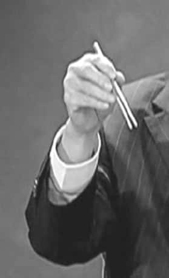
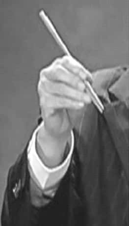
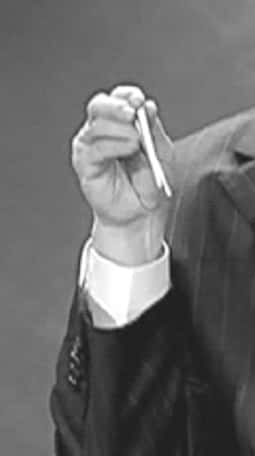
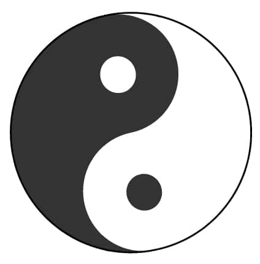
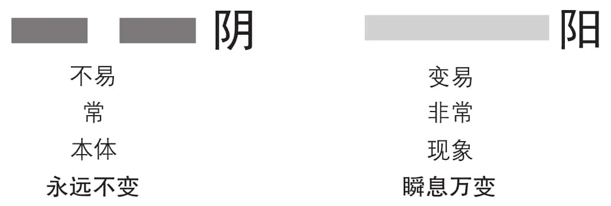

 *第七集 易有三义*

《易经》，也称《周易》，无论叫什么，都离不开一个“易”字，那么这个“易”字到底是什么意思呢？曾仕强教授解释说，“易”有三义，第一个是简易，第二个是变易，第三个是不易。《易经》看起来如此神秘复杂，为什么说它是“简易”？而“变易”和“不易”又该如何理解呢？其实不变的是原则，万变的是现象。

人们常说世事无常，《易经》能帮助我们掌握未来的变化吗？曾仕强教授指出，《易经》所揭示的，是自然与人类社会变化的基本规律。那么，我们应该如何依据《易经》的道理，来把握这变幻莫测的未来世界呢？

“易”有三义，第一个是简易，第二个是变易，第三个是不易。这是一般的说法。既然进入了《易经》的大门，从现在开始，我们看任何事情都要用这样三句话来综合考虑问题：用阴阳的观点，以自然为标准，做合理的判断。

什么叫简易？我们拿一样东西来说明，就是我们天天要用的筷子，这样大家就容易明白了。你要教你的小孩儿《易经》，也不妨从筷子开始。两只筷子就是一阴一阳，合起来就是太极。我们用筷子，往往是一根不动一根动，不会两根筷子都动或者都不动。拿起筷子，看准目标，两根筷子一个不动，一个动，两相配合，马上就能夹到菜。这就是“一阴一阳之谓道”。

我们天天用筷子，却不知道筷子也蕴含着《易经》的道理。简单明了，方便携带，而且容易操作，这些都是筷子本身的特性。所谓简，就是不要把事情搞得太复杂。

筷子的妙处是什么？我们用筷子吃东西，夹得起来的时候就夹，夹不起来可以用筷子叉，有的食物实在是夹也夹不动，叉也叉不了，就把盘子整个端过来，往自己的碗里拨一点儿。这样的三部曲，就把所有的问题都化解了，哪有那么复杂？

中国人了解别人，往往都是从细节开始的。我们通过一个人拿筷子、用筷子的姿势，也可以看出他的人品如何。首先，看筷子怎么拿。拿筷子通常会拿固定的地方，不会太上，也不会太下（见图7-1）。拿筷子拿下半部分（见图7-2），可能是做妈妈的没有用心教。拿筷子拿得特别往上的（见图7-3），就表示这个人觉得自己很神气，鄙视别人，可能心里在想，这些算什么东西？就这些东西也能请我吃？

图7-1

图7-2

图7-3

其次，看什么时候动筷子。有的人在饭桌上，大家还没有拿起筷子，他就站起身去夹别人面前的菜。迟早会轮到你，那么着急干什么呢？我们夹食物，要先夹自己跟前的，不能先夹旁边的或者离我们远的。这样做表示第一我不挑食，第二我尊重大家，第三我的家教还不错，还很守分。一个人的人品会在这些细节中体现得淋漓尽致。

外国人常常讲，中国人用筷子是不卫生的。他们觉得每人单独一副刀叉、一个盘子才比较卫生，而中国人用筷子会传染疾病。其实是他们错了。中国人用筷子夹菜的时候，一般不会挑挑拣拣的，因为一挑拣就难免传染疾病。我们是眼睛看准目标，然后一下就夹上来了，哪里还用挑来挑去，又怎么会传染疾病呢？

另外，我们再讲一样生活中经常见到的东西——毛笔。以前我们用毛笔，只要一支，想画细就可以细，想画粗就可以粗，各种变化一支毛笔就足够了。现在不是，笔拿出来都是一排一排的，选一支，太粗了，再选一支，又太细了，光选笔就要忙死了。毛笔就是简易，结构很简单，但功能却变易无穷。

《易经》中的“易”字到底是什么意思，自古以来众说纷纭。曾仕强教授所讲的“易有三义”，即“简易、变易、不易”，来自于《易纬·乾凿度》。我们从中国人特有的筷子和毛笔也可以看出，《易经》的道理看似神秘，但实则简易，那么《易经》中的“变易”和“不易”，又该如何理解呢？

《易经》这本书，最早的时候不叫《易经》，而叫《变经》，因为它研究的就是变化的道理。但是，后来我们不敢再用《变经》这个名字了，因为它可能会害很多人。一个人如果总想着变的话，会变到连根本都没有，连父母都不认得的地步。那还了得？而且，有变必有常，因为它们是相对的，变如果是阳，常就是阴，两者是分不开的。

很多人感叹世事无常，然后就开始抱怨，觉得自己好像什么都掌握不住，这么想就错了。要知道，变只是现象而已，变的背后一定有不变的东西。宇宙再怎么变，它还是宇宙。我们在想到变的时候，一定要想到不变，想到不变的时候，一定要想到变，这才叫作“一阴一阳之谓道”。变与不变两者是合在一起的，是分不开的，没有不变，哪里有变？没有变，哪里又有不变呢？

先拿自己来说，你觉得自己变了没有？大家肯定会想，我还是我，哪里变了呢？实际上现代医学证明，人身体里所有的细胞，每七天就全部变掉了，所以没有不变的，人不变就活不了。

我们再从时间来看，时间有过去、现在、未来。过去很明显是不变的。你能改变你的童年吗？显然是不可能的。比如你在哪里出生，一辈子就是那个地方，这是不能变的。过去的事情，是谁也没有办法改变的，所以孔子说过去就过去了，不要再计较，后悔没有用，最重要的是未来。但是，未来是不可测的，不是变不变的问题。而现在呢？现在是变还是不变？答案只有一个，有的变，有的不变。很多人觉得变的学问很复杂，其实也没有什么，我们所能掌握的只有现在，但现在是最麻烦的，因为现在可变可不变，有变有不变，亦变亦不变，变也挨骂，不变也挨骂，变也死，不变也死。对人生最大的考验就是现在。

现在，就是过去和未来的交接点。过去的一切已经无法改变，但是未来的一切还都在千变万化之中。所以人们常说世事无常，就是觉得未来非常难以把握。那么，《易经》是否能够帮助我们看清这变幻莫测的未来世界呢？

很多人都说世事无常。实际上，世事怎么会无常呢？任何事情都有一定的脉络，有一定的规则，是可以推理的。如果连理都推不通，那人就没法活了。你最起码知道，你今天中午有饭吃，晚上回到家，你的床还在。要不然，你在外面干什么事都不安心。我们之所以能够安心，就是我们知道有些东西是不会变的。小孩子安心什么？就是知道自己的爸爸妈妈不会变。如果小孩儿一回家，发现连爸爸妈妈都变了，那他就不知所措了。

所以，我们不要相信“一切一切都在变，只有变是不变的”，这种话听起来很好听，但却不堪一击。家是不会变的，否则你不安定；世道是不会变的，否则人们还努力干什么？人事全非，但是江山仍旧在。虽然一直在变，却总是有不变的东西存在。我们现在就是忙于应付这些变，所以搞得自己紧张忙碌，最终却一无所得。一个人看到变的时候，要去掌握后面那个不变的常则，那就是自然规律。

太阳一定从东方升起，这是我们都知道的自然规律，谁都变不了，你再怎么创新都没有用；太阳一定从西方落下，用原子弹都阻止不了。人的力量很伟大，但也有局限性。当我们看到变的时候，不要老在变里面打滚，而要学会去掌握那个不变的东西。现在的人，可怜就可怜在老是在变里面打滚。

太极（见图7-4）就是万事万物，万事万物都是太极。太极是有阴就有阳，阴是不易的，我们把它叫作常，哲学上叫作本体；阳是变易的，就是非常，哲学上叫现象（见图7-5）。本体永远不会变，现象是瞬息万变的。但是，人们往往只相信自己的眼睛，只相信自己看得见的东西，可是我们所看得见的东西没有一样是不变的，而且眼睛所能看到的东西是非常有限的，很多东西我们根本看不见，我们又怎么能否定自己眼睛看不见的东西呢？

图7-4

图7-5

我们所看到的都是假象，真相是永远看不见的。假象就是那些变来变去的东西，而真相是本体，是实质，它内藏于事物之中。所以太极就是有所变有所不变。有人理解太极是有一部分变，有一部分不变，其实不是这样。太极中变跟不变是同时存在的，你看它变，它好像没有变，你看它没变，好像又在变。变中有不变，不变中有变，才叫作阳中有阴，阴中有阳。一张桌子，桌面看上去是平的，但是你放大来看，就会发现它也是凹凹凸凸的。世界上没有一样东西是平的，直线也是虚拟出来的概念。

所以从现在开始，看任何事情，都要把它看成是一个太极。太极里面是亦阴亦阳，因为阴阳是没有办法切割的。但我们现在脑海里总有切割的观念，好坏、善恶总喜欢分开来看，这就糟糕了。我们要明白，事物是亦好亦坏的，人也是亦善亦恶的——有时候会变善，有时候又会变恶。我们找不到一个纯善的人，因为这样的人活不了；我们也找不到一个纯恶的人，因为别人根本就容不下他。所以说，纯善容不了自己，纯恶别人容不了你。

《道德经》开宗明义讲了六个字：“道可道非常道。”它告诉我们，宇宙有两个道，一个叫“常道”，一个叫“非常道”。“常道”是不可说的，凡是你说得出来的，就不是“常道”，只是“非常道”而已。

《易经》是中国哲学思想的源头，无论是代表儒家的孔子，还是代表道家的老子，他们的哲学理论都来源于《易经》。了解了《易经》，就会明白儒道相济的道理。老子认为，所有能说出来的道理，都是非常道，那么那个常道，究竟指的是什么呢？

用今天科学的话来讲，“常道”叫作绝对宇宙。绝对宇宙是圆的，圆代表圆满，是理想状态。但是，在月亮圆的那一刹那，我们就知道，它马上要开始缺了。人求圆满，实际上是跟自己过不去。但是，人又非求圆满不可。所以孔子才说：“取法乎上，得乎中。”也就是说，人要有理想，不能放弃，要尽最大的努力去做，就是尽人事，听天命。我们如果不懂《易经》，就很难理解孔子的话。

绝对宇宙就是《易经》里面所讲的不易，它一点儿变化都没有，永远是那样绝对圆满、绝对自由、绝对平等、绝对光明的状态。但是，那种状态会使我们很难接受。因为绝对平等，就是你我不分。就好比一笔钱放在这里，你会不会去拿？这就看你有没有“分”的观念。如果这钱在谁手里，最后的结果都是一样的，你绝不会去拿；如果你伸手去拿，就证明这个东西是可以分的，你据为己有，别人就要不到了。人会伸手去拿东西，就是因为知道这个东西是可分的。没有人会去抓月亮，因为那是不可能私有的东西。只有在绝对状态下，才有百分之百公有的东西。所以，我们一旦生而为人，落入这个地球，就一定要觉悟：我们只能获得相对的自由、相对的平等，只能享受相对的光明，一定有黑暗面存在。

柏拉图有他的理想国，陶渊明有他的桃花源，但那都是不可能实现的。现在，我们推出一个香格里拉的概念，就是人间乐土。香格里拉在哪里？答案其实很残酷，香格里拉在人没有到过的地方。因为人只要一去，这个地方就被糟蹋掉了，就不是香格里拉了。人是什么？破坏香格里拉的就叫人。这是人类的不幸。世界上很多国家都是开放一个香格里拉，过一阵子就被毁坏了。现在香格里拉跑到中国来了，但是我们很担心它能保持多久。

我们现在都想追求绝对的自由，实际上绝对的自由只有在一种情况下才会有，那就是人死后。人死之后才是绝对自由，才能有绝对的平等。人们就是被这些很奇怪的名词，把脑袋箍得死死的，盲目地追求这些根本不可能和不存在的事情，那不是很冤枉吗？

世界上有变就有不变，它们是同时存在的，不可分割的。而且变的当中就含有不变，不变的当中就含有变。这就是《易经》当中变易和不易的意思。

有一句话很多人不会相信，甚至听了会很愤怒：人类最高的智慧就是以不变应万变。不变的是原则，万变的是现象，我们要用不变的原则，来应对万变的现象。一个人里面一定要有原则，而且要坚持，但是外面要磨成圆的，才有办法去跟别人妥协、协调，最后达成一个大家都能接受的方案。内圆外圆的人是小人，因为他完全没有理想，没有目标，唯利是图，有洞就钻，这种人是可耻的。内方外方也不好，内圆外方更不好，外圆内方的人才是可贵的。有句话很重要：能妥协却不能放弃立场，才叫圆通。

因此我们得出一个结论：站在不变的立场来变，才不会乱变。

中国人有跟没有合在一起，要跟不要合在一起，好跟不好合在一起，善跟恶合在一起，都是不能分的，一分开就完了。我们不要认为这样的人糊涂，不负责任。在中国社会，立场太分明，就得不到群众的支持。我们明明不喜欢的，也都说“好”“没关系”，然后再想办法慢慢地把它一个个否定掉，而绝不会一开始就全盘否定。这样大家才知道，为什么美国的小孩子一做错事情，爸爸一定要问谁对谁错，然后只骂错的，不骂对的。

我有两个儿子，他们一吵架，我就两个都罚站。我首先教他们两个，对是没有用的，不要以为你对就没事了。等到兄弟两个站了五分钟以后，我就把弟弟叫来，对他说：“今天你没有错，就是哥哥一个人的错，不要以为爸爸糊涂。可是既然你没有错，我为什么罚你站？”弟弟说：“这样比较好。”我说：“你不高兴就说不高兴，不用拍爸爸马屁。”他说：“我真的没有不高兴。”我问为什么，他说：“有一次不知道为什么，你只罚哥哥站而没有罚我，结果事后我被哥哥打得好惨。”我说：“哥哥打你，你就告诉我好了。”他说：“不告还好，告了打得更惨。”我说：“那我要怎么样呢？”他说：“就像这样好了，不管我有没有错，都罚我站，事后我会安全些。”这其中的道理，很多外国人一辈子都想不通。

然后，我又把哥哥叫来，问他：“今天是谁的错？”他说：“是我的错。”我又问：“弟弟有没有错？”他说弟弟没有错。我说：“你这不是知道得很清楚吗？”他说：“当然了，是非我总还是知道的。”你看，中国人是表面没有是非，但心里一清二楚，叫作心中有数。我又问哥哥：“那为什么我还要罚弟弟站？”他说：“你是给我面子。”我说：“我干吗给你面子？”他马上说：“你是要我以后更加爱护弟弟。”我就说：“你知道这些就好了。”这样一来，兄弟两个今后会减少很多的争执和不快。

很多正直的人都认为，心里想的和嘴上说的应该一致才对，但是当我们懂得了《易经》的道理，就会明白什么叫“难得糊涂”。其实糊涂的是表面，清楚的是内心。但是现代社会发展变化得很快，我们到底要不要变，又该怎么变呢？

到底要怎么变？这是中国人一生一世都要面对的难题。我们提出三个原则，按照这三个原则去做，你就可以应付得非常妥当。

第一个原则，叫作权不离经。权就是权变的意思，经就是经常的守则、不可以变的规矩。不管怎么变，都不能超越这个规矩，要有原则地应变，不可以没有原则地乱变。一个人如果变来变去，变到没有原则了，别人都会厌恶你；一个人如果死守原则，不知道变通，那谁都怕你。这样我们才知道，中国人讲外圆内方是非常有道理的，再怎么变，规矩不能变。我们用现代话来讲，每一个人都可以变通，但是不能变得太离谱，这样就叫权不离经。每一种改变，都应该看它合理不合理。合理是检验的标准，你变得合理，我们就同意，你变得不合理，我们就摇头。

第二个原则，叫作权不损人。所有的权变不可以损害别人，损人不利己的事不叫变通。使既得利益者受到很大的伤害，是不公平的，遭受到抗拒，也是合理的。任何人都不能凭借自己手中有权，爱怎么变就怎么变，这种心态是大家都无法接受的。

我们来看一个实实在在的案例。一家公司有位朱小姐，她在甲单位，希望调到同一个公司的乙单位去。人事部门首先征求朱小姐直属上司的意见，上司说：“没有问题，我尊重她的选择，我们都是同一家公司，没有关系。”人事部门又去征求乙单位经理的意见，乙单位的经理也说：“没有问题，我们欢迎。”然后，总经理一批准，调令一公布，就生效了。

这本来是很简单的事情。可是调令公布以后，乙单位的经理却跟人事部门说不能接收朱小姐。人事部门的干部说：“你不能这样啊，我事先征求了你的同意才签准的，现在命令发布了，你怎么能说不同意呢？”但是，乙单位的经理偏偏说：“你不要问我理由，我不同意就是不同意，如果朱小姐真的要来，那我就只好辞职了。”可是乙单位的这位经理是个很好的经理，把他逼走对公司会是不小的损失。

大家来看，这件事谁不对？我不觉得有谁不对。只是这里面一定有个系统，叫程咬金系统，就是半路上出现的问题。外国人做事，很少会碰到程咬金系统，但中国到处都是程咬金系统，总是无端端杀出一个人来。我就对人事部门的干部说：“我们想事情要这样子想：这位乙单位的经理是个太极，有阴有阳，他平常讲不讲信用？答应的事情会不会反悔？”人事部门的干部说：“他平常很讲信用，答应的事从来不反悔。”我说：“那就好了，那这次肯定是例外，这其中一定有他说不出来的苦衷。根据我的判断很可能是这位经理的太太不同意，而不是他本人不同意。”人事部门的干部就去问这位经理是不是他太太不同意。这位经理大吃一惊，说：“你怎么知道？”大家看，我一猜就对了。有人说读《易经》会算，其实不是会算，是会推理而已。

人事部门的干部就问这位经理：“你太太为什么不让朱小姐来？”这位经理说：“我太太不是对朱小姐有意见，她根本不认识朱小姐，而是三年前我升任经理的时候，我太太就跟我讲，不许没结婚的女同事调到我的单位来。三年过去了，我都忘得一干二净了，没想到她还记得。”

人事部门的干部给我打电话，说问题果然是出在他太太身上，问我应该怎么办。我说那很简单，然后给他分析有几条路可走：第一，请总经理收回成命，但是这样肯定不行，总经理朝令夕改，在整个公司的公信力就没有了。第二，勉强乙单位的经理接收朱小姐，但那会逼走一个好人才，也不行。既然两条路都走不通，唯一的办法就是，你带一篮水果去见那个经理的太太，说事先不知道有这个规矩，如果知道，一定不会让朱小姐调来的。但是现在，总经理的命令已经下发了，马上收回不行，所以总经理特地叫我来拜托你帮他一个忙，让这个调令维持两个月，两个月以后我们再把朱小姐调走。总经理要我拜托你，这两个月好好看管你先生，不要让他出事。

人事干部照我说的去做，结果经理太太说：“这个可以商量。”你给别人一定的弹性，让人家有回环的余地，才好商量。

两个月以后，人事部门的干部再去问经理太太，要不要把朱小姐调走，经理太太说：“不用，这两个月也没有怎么样，就让朱小姐留下来好了。”如此为难的一件事，就这样轻松地化解了。这个不是解决，而是“化解”。《易经》是讲“化”的，中国人是大事化小，小事化了，最后什么事也没有了。

《易经》曾经被称为《变经》，因为宇宙的一切都在变化之中，《易经》所表示的就是变化的规律。而变化有三个原则，第一个是权不离经，第二个是权不损人，那么第三个原则是什么？而这些变化的原则和道理，对于我们现代人又有什么实际意义呢？

第三个原则，叫作权不多用。常常变，就表示原来的很不成熟，就说明你的规矩有问题，要不然为什么会常常变呢？比如穿衣服，一个人摸索一阵子以后，知道自己穿哪种衣服最合适，就穿那种衣服好了，如果一会儿穿成这样，一会儿又穿成那样，就表示他根本穿哪种都不合适。我们今天最大的毛病，就是喜欢求新求变。要记住，变有百分之八十是错误的，天下事不如意者十常八九。我们好不容易找到一个规矩，不要乱变，但今天我们大多都是乱变。设计个水龙头，顺着拧开就好了，但是他们偏不，一会儿用压的，一会儿又用提的，各式各样，千奇百怪。结果，去住旅馆就会发现，水龙头拧也不出水，压也不出水，提也不出水，你一生气，踢一脚，水反倒喷出来了，弄得你浑身都是，这算什么设计呢？

中国人设计房子，都是先设计里面，把每一个房间都设计得方方正正的，然后再设计外面。风水是非常科学的东西，跟迷信没有关系。同样一个东西，不懂的人就是迷信，懂的人就是讲道理，是依据科学的道理。

有例行一定有例外，这一点我们承认。但是例外比例行还多，就不对了。例外比较少，例行比较多，经常是这样办，偶尔会那样办，这样才合理。

喜欢讲求新求变还有一个很大的问题，就是会使人们觉得，新的就是好的，旧的就是坏的，这是个最可怕的观念。为什么新的就是好的？实际上，新的常常不如旧的。你看我们现在很怀念以前的东西，就是以前的东西简单明了。我们要说清楚，求新求变本身没有错，是人搞错了，认为新的一定比旧的好，这是错误的。你认为旧的再好也要换掉，那就叫喜新厌旧。一个人如果喜新厌旧，那这个人就没有指望了，迟早连自己的太太也要换掉。

老子说：“不知常，妄作，凶。”（《道德经》）一个人不知道常规，就开始乱变，最后结果只有一个字——凶。人一味乱变，变到最后，自己连立锥之地都没有了，这是多可怕的事情。一个人，对父母孝可以变吗？对朋友信可以变吗？这是不能变的，如果变了，亲人朋友之间的信任感就没有了，就产生了疏离感。人与人之间本来没有疏离感，就是人这样一点儿一点儿造成的。

所以，我们一定要记住这三个原则：

第一，权不离经。所有的变不能离开规矩。

第二，权不损人。所有的变都不可以损害别人的权益。

第三，权不多用。偶尔用，大家没有意见；常常用，就表示你的规矩要改。一个人，如果变到连根本都变掉了，那是最可怕的。

谈到这里，我想大家心里都有一个问题，就是《易经》到底能不能占卜。这是个不能避免的问题，因为《易经》本来就是一本可以占卜的书，我们要面对这个问题，躲来躲去不是办法。所以我们下面就要谈一谈：为什么孔子说“不占”？

