*第九集 卦有何用*

孔子学习《易经》之后，说：“不占而已矣。”荀子也说：“善《易》者不卜。”由此可见，真正读懂《易经》的人，是不用它来占卜算卦的。但是，卦是《易经》这部书中的主要内容，“卦”这个字就是悬挂起来的意思。那六十四卦又代表了什么？曾仕强教授说，这是我们的祖先把宇宙所有的事情归纳起来，概括成的六十四种代表情境。

那么，《易经》中的六十四卦对我们的人生究竟有什么作用呢？就是当我们遇到事情的时候，能够按图索骥，明白自己的处境，知道自己应把握的基本原则，清楚怎么去应对。每个人的命运掌握在自己手里，每个人的卦也是由自己去画的。那么孔子的一生都画了什么卦？对我们的人生又有什么启发呢？

什么叫作“卦”？“卦”就是悬挂起来的意思，就像我们去照个相，然后用相框装起挂在墙壁上，卦的意思就和这个过程是一样的。

为什么要挂？因为人的眼睛是往外长的，我们看别人很容易，看自己却永远看不清楚。别人脸上有灰，我们可以马上看出来，自己脸上却看不到。所以说“旁观者清，当局者迷”。因此我们就把自己的像挂起来，好好看一看，就像跳出事外看别人一样，对自己会有一个更清楚和清醒的认识。

宇宙万象永远是联系在一起的，每个个体都不是孤立存在的。就像摄影时，我们一定是站在某个位置，选取某个角度，从一大片景色中拍摄出一张照片。换句话说，同样的景色，每个人取景的方向不一样，所拍到的照片就会有很大不同，这样就不难理解，每个人的卦也会有所不同。

卦，有两个关键字，第一个是“爻”(yáo)，卦当中的每一个符号都叫一个爻。整部《易经》就是两种不同的符号，阴的(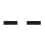)叫阴爻，阳的(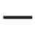)就叫阳爻。乾卦（见图9-1）所有的爻都是阳爻，坤卦（见图9-2）所有的爻都是阴爻。

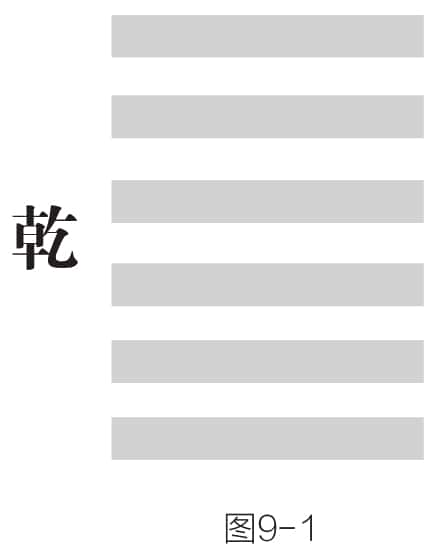
图9-1

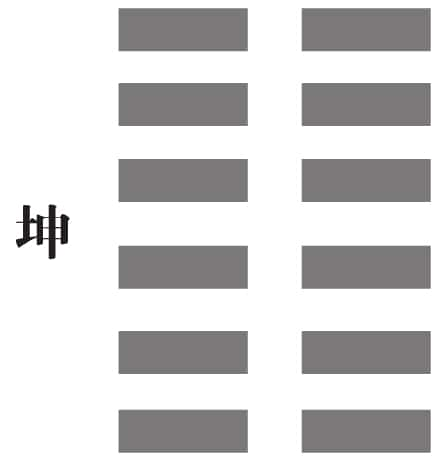
图9-2

卦的第二个关键字是“六”，即每个卦都由六个爻组成。这就告诉我们要把一件事情分成六个阶段，一个阶段一个阶段去调整。各位想想看，当你碰到一件事情的时候，你要做分析，但如果把它分析成一百个阶段或步骤，结果一定会乱掉；如果只分析成三个阶段或步骤，也太简单了。把它划分成六个阶段，然后考虑每个阶段怎么样去调整，基本就差不多了，就会走得很顺了。

六十四卦（见图9-3）中，六爻都是阳的，只有乾卦这一卦；六爻都是阴的，也只有坤卦这一卦。其他还有六十二卦，都是有阴有阳，有阳有阴。这就告诉我们：世界上纯阴的不多，纯阳的也不多，杂七杂八的最多。所以真正的好人很少，真正的坏人也很少，坏中有好、好中有坏的人最多。

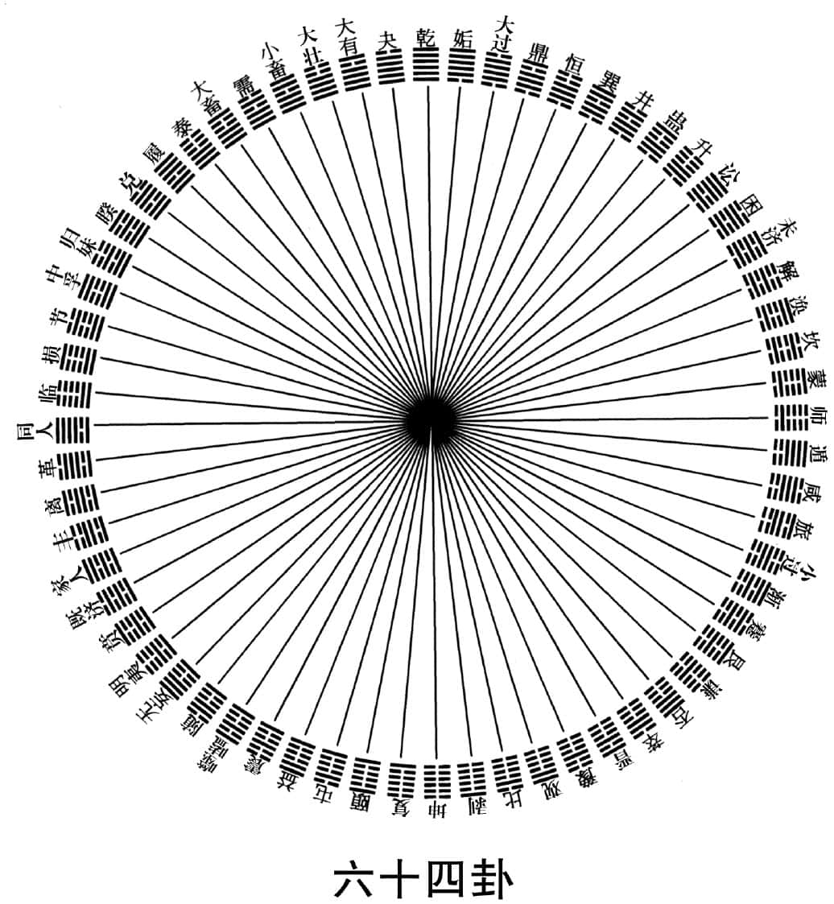
图9-3

前面说过，阴阳是合一的，阴阳分开，就没有办法生生不息。要想生生不息，就需要交易，所以交易就成为《易经》里面一个很重要的概念。生生不息是交易的成果，只要停止交易，这个生意就做不成了。我们今天社会上所用的词，大概跟《易经》都有关系，我们日常也都是在讲《易经》的话，因为《易经》已经融入到中国人的血液里面，变成我们的文化基因，没有办法改变，也不需要改变。

《易经》中共有六十四卦，这是什么意思？就是我们把宇宙所有的事情进行归纳概括，最后演变成了六十四种代表情境。我们之所以把《易经》当作人生的宝典，就是碰到什么事情的时候，可以从《易经》中寻求对应的情境，一查我们就明白了：在这个处境里面，要把握这几个基本原则，要这么去应对。这样我们就可以趋吉避凶了。

当然，只说《易经》是让人趋吉避凶的，这样的层次也不够高。实际上《易经》读到最后，是没有什么吉凶的概念的。读《易经》要一层一层去领悟，不可能一下子就把《易经》参透。

《易经》中的六十四卦，代表了宇宙人生中的六十四种情境。大自然虽然千变万化，但是有着一定的规律，人类社会千变万化，也有着一定的规律，而历史经常会惊人地相似。我们的人生，也是有一定规律的，而《易经》就是一部了解宇宙人生的宝典。但是代表着各种情境的卦象，是怎么形成的？我们又如何才能看懂卦象的意思呢？

这里有一个六十四卦的排列组合表（见图9-4）。上卦一共就八种，下卦也不过是八种，上下一组合，一个卦就出来了。所以这个表很明了，一共有六十四个卦，一点儿不难。我们的老祖宗排来排去，发现只有这六十四种不同的组合方式，一个不多，一个不少，这也就是现代数学所讲的排列组合。

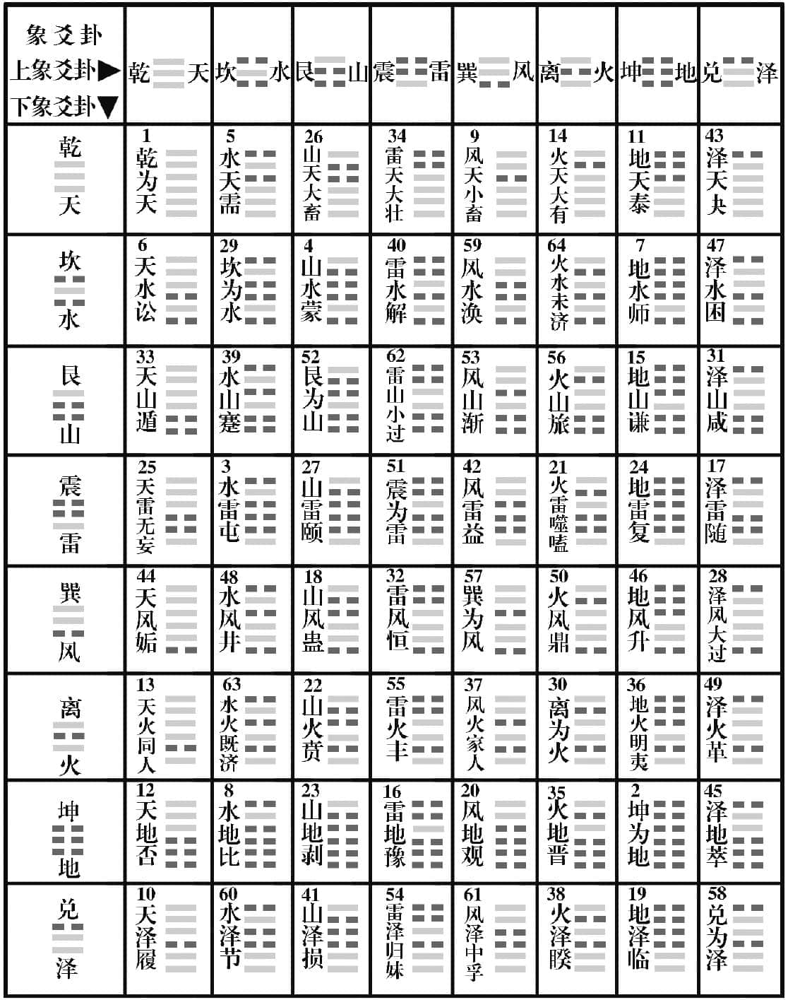
图9-4

《易经》六十四卦并不难，难是难在每一个爻都有它的代号。

每一卦最底下那个爻叫初爻，往上依次是二爻、三爻、四爻、五爻，最后一爻叫末爻（见图9-5）。初跟末代表时间，《易经》最重视的就是时间。任何事情，时间一变，整个情况就变了，所以中国人都讲“随时”，就是随时要改变。

初、二、三、四、五、末，说的是六爻的时间顺序。还有一个说法，下、二、三、四、五、上（见图9-6），是表述六爻的位置。位比空间还厉害，位包括你的身份，包括你的地位，包括不同的场合，也包括环境的变化。

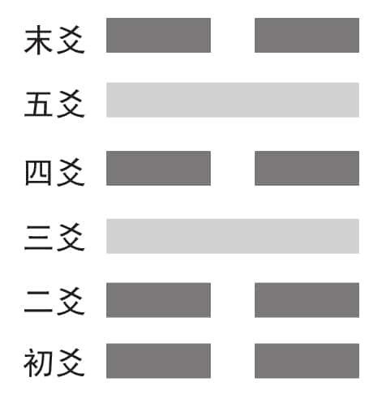
图9-5

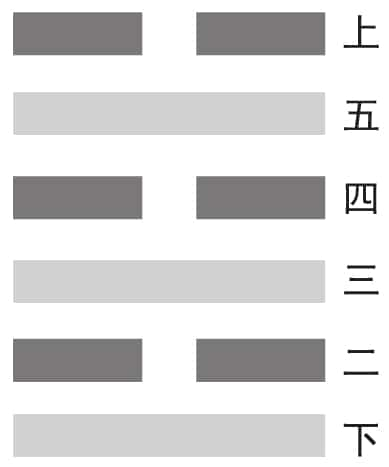
图9-6

除了时间和位置，爻的阴阳怎么表述呢？很简单，凡是阴的都叫六，凡是阳的都叫九（见图9-7）。男人为什么怕九？因为阳到极点就叫九，九就是阳极。《易经》有个概念叫物极必反，无论什么人走到“极”了，往后一定是反的。所以你不能说替爸爸过五十九岁生日，那样对他是很不利的。五十九了，赶快做六十大寿，把九避掉。这一点我们从物理学上很容易理解：一个物体一旦到抛物线的顶点，它一定往下走，没有例外。

图9-7

由此我们就可以看出来，《易经》中的卦分三路，一路是讲时，一路是讲位，一路是讲性质：阳的用九，阴的用六。可是这三样如果用三个字来表示很麻烦，所以我们的祖先把它简化成两个。去掉哪一个呢？“初”留下来，“下”不要了；“末”不要了，“上”留下来。这样你就看懂《易经》了，翻开《易经》，初九，就是第一爻是阳的（见图9-8）；六二，就是第二爻是阴的（见图9-9）。我们看到数字就能把相应的图像画出来，看到图像就能把代表数字想出来。这跟今天的数字时代没有什么不同。

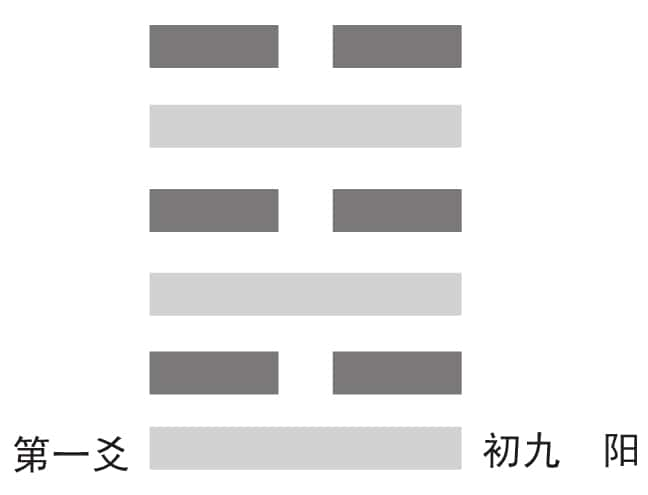
图9-8

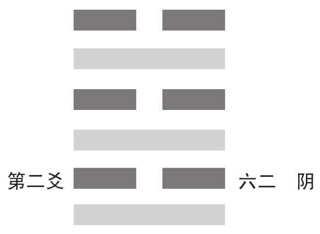
图9-9

可是为什么用“初”不用“下”，用“上”不用“末”呢？原因很简单，事情刚开始的时候，“时”比“位”重要。一个人出生的时间很重要，产房的护士大多会说几月几日几时几分几秒生了一个什么性别的孩子。但是一个人死的时候，死亡时间不重要，死了什么人比较重要，死者的身份和地位比较重要。所以一件事情到最后，结束的位比较重要，时不重要，刚开始的时候，时很重要，位却不太重要。

一家商店要开张，会去看吉日，可一家商店要倒闭了，还会去看吉日吗？如果有人说要找个好日子关张，那不成笑话了吗？商店开张，要选个好日子；商店倒闭了，看看还剩下多少财产，也就是经营到最后的结果比较重要。可见一直到今天，我们都不知不觉地照着《易经》在做，只是我们没有意识到而已。

所以，开始的第一爻，我们用表述“时”的“初”，而不用表述“位”的“下”，到最后一爻，用表述“位”的“上”，而不用表述“时”的“末”，当中就用六、九代表阴、阳。由此可以看出来，两个数字，我们代表三样东西：一个是时，一个是位，一个是性质。

《易经》中的爻只有两种，就是阳爻和阴爻，因为宇宙万物万象的变化，都是阴阳互动的结果。而六十四卦中的每一个卦，都是由六个爻组成的，除了乾卦都是阳爻，坤卦都是阴爻之外，其他的六十二个卦都是有阴有阳，但是为什么要用数字九来代表阳爻，用数字六来代表阴爻呢？

为什么阳叫九，阴叫六？这当中也是有道理的。

坤（见图9-10）是纯阴，是六画，所以阴叫六。可能有人就此想到阳是三画，应该叫三才对，怎么叫九呢？因为阳是创造，阴是配合。天底下，只有创造没有配合，只能是空谈，完全是空想，最终理想不能实践。有人要全力配合，可是没有创造，那么到底往哪里走不知道。因此，讲阳的时候一定把阴带上，叫作阳统阴（见图9-11）。

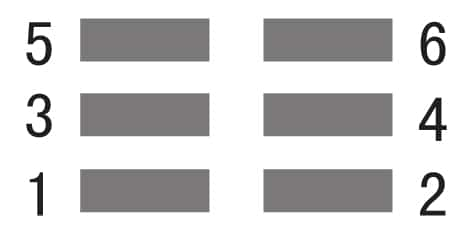
图9-10

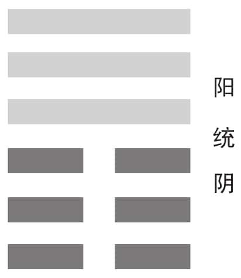
图9-11

阴阳不能分开，所以《易经》的第一组卦就是乾和坤。一个懂得中华文化的人，千万记住，当我们说天的时候包括地在内，讲男的时候包括女在内，我们是不会分开的。我们尊称别人为先生的时候，是男女不分的，男的叫先生，女的也叫先生。我们对男女是同等看待的，但是后来人们却把这解释成男尊女卑，我觉得很奇怪。

男人能做的事情，女人都能做，可是女人有一件事情，男人怎么做都做不出来，就是生小孩儿。你说男人很伟大，你让男人生个小孩儿给大家看看？他就生不出来，能有什么办法？那到底是男人重要还是女人重要？我们对自然了解得非常透彻，知道只有阳没有用，一定要带上阴，所以说“孤阴不生，独阳不长”。阴阳一定要同时存在，才会生生不息。所以我们看阳（见图9-12），上下相加就是九，所以用“九”来表示。这样来分析，就很容易了解了，根本不必死记硬背。理解了记住的东西才不会忘，这也是自然。

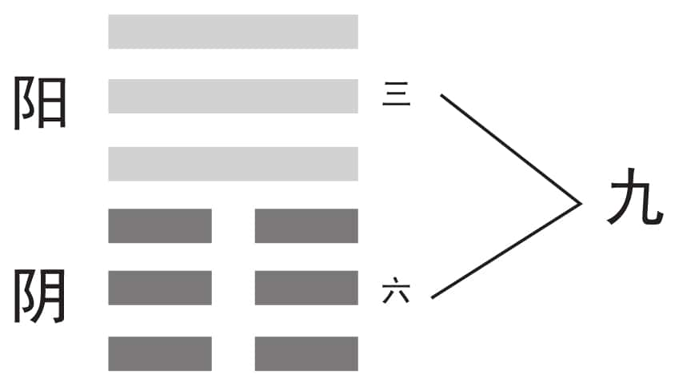
图9-12

我们以乾卦为例来标注一下六爻（见图9-13），大家又会发现一个问题：第一爻叫初九，第二爻为什么就叫九二，而不叫二九呢？前面我们说过，因为刚刚开始，时比较重要，所以第一个九，把初放在九的前面，称为“初九”；最后的时候，结果比较重要，所以把上放在九的前面，称为“上九”。至于中间的过程，就像人生下来以后，男女性别就重要了，所以把中间的四个九分别称为：九二、九三、九四、九五。

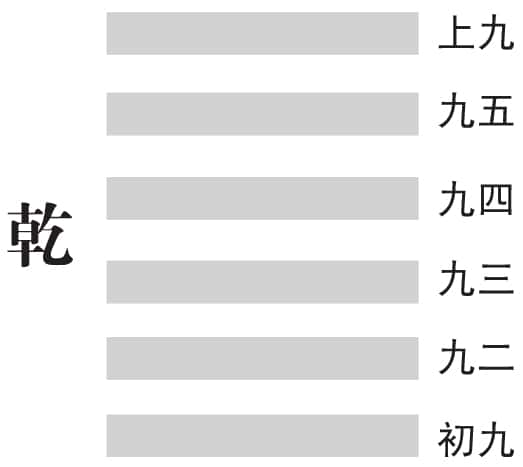
图9-13

这样《易经》就告诉我们，教男子的教材跟教女子的教材不应该一样。女孩子，可以多让她去学一些艺术、音乐、烹调，这对她是有好处的。但是，尽管女人比较会烹调，可真正好的厨师一定是男的。这就是阴中有阳，阳中有阴，阴阳是不会分开的，否则极阳极阴，最后就变成两种人类了。阴阳一定是交叉的。我们看DNA的图片（见图9-14），它的双螺旋结构也是交叉的。其实科学越发达，越能证明《易经》的正确，而且很多的科学知识可以帮助我们更加方便地去了解《易经》。

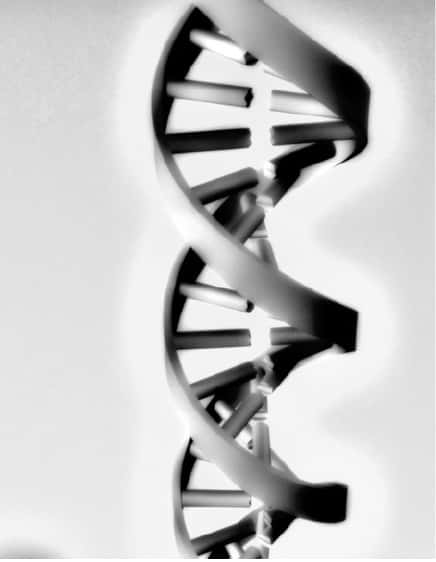
图9-14

人生每一个阶段都要做出不同的调整。每一个卦有六个爻，这六个符号告诉我们，要学会把一件事情分成六个阶段，然后一个阶段一个阶段地去调整。人也应该把自己的一生分成六个阶段，然后根据这六个阶段的不同要点去调整。这是《易经》对我们最大的功用。

曾仕强教授一再强调，学习《易经》，就是要掌握《易经》基本的道理，在人生的不同阶段，知道应该如何调整自己。每个人一生的命运，其实都是掌握在自己的手中，人一生的卦象，都是自己画出来的。那么孔子在读了《易经》之后，是否给自己画了卦？他又是怎么画的呢？

孔子不但读《易经》，而且他还体会到，每个人的一生都是在画自己的卦。有的人一辈子只画一个卦就走了，有的人画两三个卦才走。每个人画出来的卦，用现在的名词叫作自画像。孔子终其一生，画了一个卦，叫作什么？叫作人生奋斗的总纲领。这个卦对每一个人都是很重要的参考，因为只要把这个卦看清楚了，也就知道自己人生的道路该怎么去走了。

这个卦写在哪里？写在《论语·为政篇》：“吾十有五而志于学，三十而立，四十而不惑，五十而知天命，六十而耳顺，七十而从心所欲，不逾矩。”这段话相信大家都背得出来。

“吾十有五而志于学”，这句话点出了十五岁是孔子人生的第一个阶段（第一爻）。大家可能会想，孔子怎么到了十五岁才“志于学”？难道十五岁以前就不用学了吗？当然不是。一个人从小就要开始学习，可是如果没有到十五岁，最好不要立定自己的志向，因为那还为时太早。很多小孩子早早就说将来要怎么样，那只是讲着好玩而已。现在十五岁正好处于什么时候？初中毕业。初中毕业的时候，就要做出决定，想好以后要学什么东西。

孔子的这一句话，告诉了我们很多的东西：十五岁，是人生的第一个阶段；“志于学”，就是应该明白自己这一辈子是要干什么的，要朝哪个方面去学习，不能再犹豫不定，浪费光阴了。

第二句话大家更熟悉，就是“三十而立”。一个人十五岁的时候确定了自己的志向，然后朝这个方向摸索前进十五年，大概就可以归纳出自己这辈子的几个原则了。人生原则这样的事，在太年轻的时候不可太过坚持；但是到了三十岁还没有，那无疑是更可怕的事。择善固执，也是这个阶段所要尝试和坚持的。

然后是“四十而不惑”。根据三十岁确立的原则不断去尝试和实践，然后看成效怎么样，要再过十年，你才可以说，好了，我这辈子大概就这么走下去了。“四十而不惑”并不是说到了四十岁就什么都不迷惑了，不惑是对个人的原则不惑，对其他的事情当然还有“惑”的地方。孔子主张活到老学到老，如果四十就不惑了，那岂不是什么都不用学了？没有迷惑的人就是圣人了。我们读《论语》太粗心大意了，很多时候只是按照文字去理解，并没有参透理解孔子的本意，这是很遗憾的事情。人到四十，对自己人生的目标、人生的方向和所要坚持的原则，应该做到不惑。

曾仕强教授认为，孔子的一生就是一个完整的卦象，卦有六爻，孔子的一生正是分成了六个阶段：一，十五而学；二，三十而立；三，四十不惑；四，五十知天命；五，六十而耳顺；六，七十从心所欲，不逾矩。那么五十所知的天命指的是什么？人生的命运又是谁来决定的呢？

人活到五十岁回头一看，会发现自己一路走来，好像都有一只手在安排，非这样不可。其实之所以会这样，都是自己从小到大点点滴滴累积起来的结果。

每一个人，要替自己负百分之百的责任。《易经》告诉我们，一个人每二十年会变一次，我们说社会的世代交替，差不多也是二十年一次。你现在三十岁，就要替将来五十岁的时候负责任。一个人到了五十岁，就知道不怨天不尤人，一切都是自己造成的。

五十岁，我们就知道一句话：我们一生的努力就在证明自己有什么样的命！即使证明到最后自己是不成功的，不成功就不成功，心安理得就好。为什么每个人都要成功呢？每一个人这一辈子来到世上，是要跟别人过不一样的生活，想不一样的事情，不是每一个人都要一样，更不可能每个人都会一样，这个在心理学上就叫作个别差异。世界上的你是唯一的，没有第二个人完全跟你一样，这就是个别差异。既然这样，那我们干吗还要学别人呢？那是浪费时间，因为永远学不像，最终还是要做自己。

命是谁造的？是自己造的。自己造出自己这样的命运，又能抱怨谁？认了。能不能重来？没有办法重来。人生最奥妙的，就是你永远没有办法重来！所以“六十而耳顺”。

为什么要耳顺呢？因为这个时候会碰到很多根本不了解你的人，却在你面前指指点点地讲一大堆，你听也不是，不听也不是，听了会发脾气，不听也会发脾气，那怎么办？耳顺，就是听了跟没有听一样：你不是我，你怎么知道我呢？怎么能对我乱批评呢？有什么好批评的呢？

“七十而从心所欲，不逾矩”，就是自由自在，可是还有所约束。“不逾矩”的意思就是说，一个人从小到七十岁，规规矩矩，几乎已经变成他的生活习惯，大概不会有太大的差错，也就可以放心去做了。

孔子一生分成两个阶段，一个是四十岁以前，一个是五十岁以后。所以孔子讲了一句话，说一个人到了四五十岁，还搞不清楚自己是干吗的，大概这一辈子也就算了。孔子讲得很清楚，四十岁到五十岁是人生的关键。

一个人四十岁以下，让他上达很难，只能叫他下学。下学而上达，四十岁以上的人才有办法上达。上达什么？上达天命。下学什么？下学就是一般的学问。孔子最后综合成一句话，六个字，叫作“尽人事，听天命”。记住，五十岁以前要“尽人事”，排除万难，不管别人说会不会成功，应该做的，你就全力去做。可是到了五十岁以后，你要听天命。我有这个成功的命，我自然会成功，如果没有，我也不强求。强求干吗，那么辛苦干吗？所有的名跟利最后都是空的。

曾仕强教授认为，孔子一生不只画了一个卦，孔子更重要的卦，是对自己一生在六个阶段中完全不同的人生感受。那么孔子在自己人生的六个阶段中，都有些什么样的人生感受？而这些人生感受，对于我们的人生，又有什么启发呢？

很多人没有注意到，孔子的一生还画了一个更重要的卦，这个卦分上、下两部分。第一个，出现在《论语》的开篇《学而》中，“学而时习之，不亦说乎？”这句话与“十有五而志于学”是对应的。

“十有五而志于学”是孔子人生的一个理想和计划，而“学而时习之，不亦说乎”就是他实践的成果。这个“习”绝对不是温习、复习。我们现在的老师搞错了，叫学生拼命温习、拼命复习，以至于学生产生厌学的情绪。“习”是习惯，只是学了并不算数，还要养成习惯，这样才会快乐。学了以后只是记在脑子里，不会操作，成了记忆的负担，这有什么快乐呢？只是应付考试而已。孔子的意思是，学了以后要赶快在生活当中实践，并养成习惯。当我们发现学习会带来这么好的习惯，而这些好的习惯又给我们带来这么多的收获，这多喜悦呀！

第二个是“有朋自远方来，不亦乐乎”，这就是“三十而立”的成果。一个人到了三十岁，跟所有人来往都有了基本的原则，不乱来，朋友才会乐意跟你交往，才会一有时间就大老远地来看你。那这个原则是什么？就是要将心比心，站在朋友的立场来想事情，不能只顾自己，不想别人。

“四十而不惑”的成果是什么？就是“人不知而不愠”。“愠”就是小小的生气。因为你对自己的原则已经不惑了，可是别人会惑，人家会说：“你干吗这样子？”遇见这种情况，你一点儿都不必生气，因为别人没有办法了解你，你生气做什么？“人不知而不愠”，对我们来说是非常难做到的事情。今天许多人跟孔子所讲的刚好相反，是人不知而大怒：“你不知道我是谁吗？瞎了眼了！”完全与孔子背道而驰。

其实“隔行如隔山”，所有的运动明星里面我只知道姚明，其他的我都不认识，因为姚明的个子特别高。为什么电影明星我都不认识？因为没有必要。那你就可以想象，你在你的行业里面再优秀，再特别，但别的人还是会不认识你，这也是很自然的事情。你自己不迷惑就好了，别人怎么想，别人怎么看，那是别人的事情，你完全没有必要生气。

“五十而知天命”对应哪句话？这句话大家也是很熟的，叫作“发愤忘食”。这样你才知道，人不能小时候就发愤忘食，因为那时候志向没有定下来，原则没有定下来，更因为那时也没明白自己这辈子是来干什么的。在这一切都没有确定的时候发愤忘食是很危险的。发愤忘食干什么？看言情小说，完了；交朋友，也完了；上网吧，更完了！

发愤忘食是有条件的，只有当你知道这一辈子要做什么的时候，明确了自己这一辈子的目标以后，才可以发愤忘食地全心全意去做。这个时候不能再计较了，更没有什么可犹豫的了。

“六十而耳顺”的成果，孔子用四个字，叫作“乐以忘忧”。乐以忘忧是什么意思？如果一个人明明身陷忧愁的处境，却还乐得出来，这种人就是糊涂，就是麻木不仁。乐以忘忧，是说要把所有的忧愁都当作乐趣来看：这件事对别人算是忧愁，但是对我就是乐趣，因为这是我要做的事情，这就是我的命。别人觉得我辛苦，那是别人的事。

一个人在自己的工作当中，还有忧，还有惧，还有虑，还有很多阻碍，就是表示自己还没有发愤忘食，还没有全力以赴。一个人找到自己要做的事，就会忘记辛苦，但这只是初步而已。以后还会有很多人打击你，会有很多人在背后议论你，甚至公开向你挑战，想抓你的小把柄，而你抱着“无所谓，本来就是这样”的态度，一笑了之，这才叫作乐以忘忧。同样的事情，如果发生在别人身上，他们会觉得很忧虑；但是在你看来，这是一种乐趣，因为接受有具体目标的挑战，本来就是一种乐趣。这才是《易经》有阴有阳的一种变化。

“七十而从心所欲，不逾矩”的成果，孔子也用一句话来表述，“不知老之将至”。孔子从来不觉得自己年纪大了，因为他根本没有年纪大的观念。一个人怎么做都很自在，都没有苦恼困扰，怎么会觉得自己老了呢？

人要服老，不要认老。生理年龄是谁都逃不过的，但是精神、心理的那种状态每个人都不一样。孔子永远保持年轻，就是因为他有这样一个具体实践的结果，这些都在《论语》里面（见图9-15）。我读完《易经》以后，重新去看《论语》才知道，孔子真是了不起！

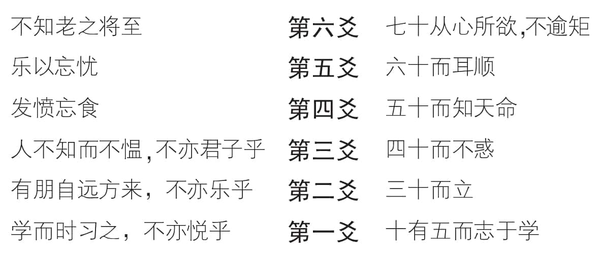
图9-15

我告诉大家，真正懂得《易经》，对《易经》贡献最大的是两个人，一个孔子，一个孟子。孟子把《易经》发挥得更加淋漓尽致，但是你在《论语》跟《孟子》里面都看不到一个“易”字，这是什么道理？因为在那个时候，《易经》已经被扭曲化了。很多人不敢谈，一谈就有人说你又来算命、又来卜卦了，就想到那里去了。

这是《易经》的命运，我们一定要去理解。我们这一次讲《易经》，要摆脱那些小用，走上大用。所以下一讲，我们就要谈谈：易经的思维。

